<!-- dw2md v0.2.3 | mksglu/context-mode | 2026-07-03T19:12:43Z | 51 pages -->

# mksglu/context-mode — DeepWiki

> Compiled from https://deepwiki.com/mksglu/context-mode
> Generated: 2026-07-03T19:12:43Z | Pages: 51

## Format

Sections are delimited by `<<< SECTION: Title [slug] >>>` lines.
Grep for `^<<< SECTION:` to list all sections.
The Structure tree below shows hierarchy; slugs in brackets are unique identifiers.

## Structure

├── 1 Overview
├── 2 Getting Started
│   ├── 2.1 Installation
│   └── 2.2 Platform-Specific Setup
├── 3 Core Concepts
│   ├── 3.1 Context Window Protection
│   ├── 3.2 Session Continuity
│   └── 3.3 Knowledge Base (FTS5)
├── 4 MCP Tools
│   ├── 4.1 Tool Overview and Routing
│   ├── 4.2 Code Execution (ctx_execute)
│   ├── 4.3 File Processing (ctx_execute_file)
│   ├── 4.4 Content Indexing (ctx_index)
│   ├── 4.5 Content Search (ctx_search)
│   ├── 4.6 Batch Execution (ctx_batch_execute)
│   ├── 4.7 Fetch and Index (ctx_fetch_and_index)
│   └── 4.8 Statistics and Diagnostics (ctx_stats, ctx_doctor, ctx_upgrade)
├── 5 Hook System
│   ├── 5.1 Hook Lifecycle Overview
│   ├── 5.2 PreToolUse Hook
│   ├── 5.3 PostToolUse Hook and Event Extraction
│   ├── 5.4 PreCompact Hook and Snapshot Building
│   └── 5.5 SessionStart Hook
├── 6 Platform Adapters
│   ├── 6.1 Adapter Architecture
│   ├── 6.2 Platform Comparison
│   └── 6.3 Platform-Specific Implementations
├── 7 Session Management
│   ├── 7.1 SessionDB (Persistent Storage)
│   ├── 7.2 Event System
│   ├── 7.3 Resume Snapshots
│   └── 7.4 Session Directive and FTS5 Integration
├── 8 Security
│   ├── 8.1 Security Architecture
│   └── 8.2 Policy Configuration
├── 9 Polyglot Executor
│   ├── 9.1 Runtime Detection
│   ├── 9.2 Execution Pipeline
│   ├── 9.3 Language-Specific Features
│   └── 9.4 Background Processes
├── 10 CLI Commands
│   ├── 10.1 doctor Command
│   ├── 10.2 upgrade Command
│   └── 10.3 hook Command
├── 11 Development
│   ├── 11.1 Architecture Overview
│   ├── 11.2 Build System and Bundling
│   ├── 11.3 Testing Strategy
│   ├── 11.4 Local Development Setup
│   └── 11.5 Contributing Guidelines
└── 12 Glossary

## Contents

<<< SECTION: 1 Overview [1-overview] >>>

# Overview

<details>
<summary>Relevant source files</summary>

The following files were used as context for generating this wiki page:

- [.claude-plugin/marketplace.json](.claude-plugin/marketplace.json)
- [.claude-plugin/plugin.json](.claude-plugin/plugin.json)
- [.codex-plugin/plugin.json](.codex-plugin/plugin.json)
- [.cursor-plugin/plugin.json](.cursor-plugin/plugin.json)
- [.openclaw-plugin/openclaw.plugin.json](.openclaw-plugin/openclaw.plugin.json)
- [.openclaw-plugin/package.json](.openclaw-plugin/package.json)
- [.pi/extensions/context-mode/package.json](.pi/extensions/context-mode/package.json)
- [README.md](README.md)
- [docs/platform-support.md](docs/platform-support.md)
- [openclaw.plugin.json](openclaw.plugin.json)
- [package.json](package.json)
- [src/server.ts](src/server.ts)
- [tests/core/server.test.ts](tests/core/server.test.ts)
- [tests/session/continuity.test.ts](tests/session/continuity.test.ts)

</details>


**Purpose**: This page introduces context-mode as an MCP (Model Context Protocol) plugin that achieves 94-99% context window savings through three architectural pillars: sandboxed code execution, FTS5-based knowledge management, and session continuity. It provides a high-level map of the system architecture and explains how components work together across six supported AI platforms.

**Scope**: This page covers the conceptual architecture and system-wide design decisions. For installation instructions, see **Getting Started**. For detailed explanations of individual subsystems, see **Core Concepts**, **MCP Tools**, **Hook System**, and **Platform Adapters**.

---

## The Context Window Problem

AI coding assistants face a dual challenge:

1. **Context Flooding**: Every tool call dumps raw data into the conversation context. A Playwright snapshot consumes 56 KB, GitHub issues consume 59 KB, and access logs consume 45 KB. After 30 minutes of work, 40% of the context window is filled with tool output rather than actual code and conversation. [README.md:32-35]()

2. **State Loss on Compaction**: When the context window fills, the agent compacts the conversation by dropping older messages. This process erases working memory—which files were being edited, what tasks are in progress, what errors were resolved, and what the user last requested. [README.md:32-35]()

Context-mode addresses both problems: it keeps raw data out of the context window through sandboxed execution and intent-driven filtering, and preserves session state through event capture and priority-tiered snapshots. [README.md:36-43]()

**Sources**: [README.md:32-43](), [package.json:5]()

---

## What is Context-Mode

Context-mode is an MCP server implemented in TypeScript that provides 9 specialized tools for AI coding assistants. It runs as a subprocess alongside the AI platform (Claude Code, Gemini CLI, VS Code Copilot, Cursor, OpenCode, or Codex CLI) and exposes tools through the Model Context Protocol standard. [package.json:2-5](), [src/server.ts:92-95]()

The system operates through three mechanisms:

| Mechanism | Implementation | Context Savings |
|-----------|---------------|-----------------|
| **Sandboxed Execution** | `PolyglotExecutor` spawns isolated subprocesses for 11 languages. Only stdout enters context. | 56 KB → 299 B (99%) |
| **Knowledge Base** | `ContentStore` indexes content into SQLite FTS5 with BM25 ranking. | 60 KB → 40 B (99%) |
| **Session Continuity** | `SessionDB` captures events in persistent storage. Snapshots restore state. | Prevents 100% state loss |

**Sources**: [package.json:2-5](), [README.md:40-43](), [src/executor.ts:13](), [src/store.ts:15](), [src/session/db.ts:45]()

---

## System Architecture Overview

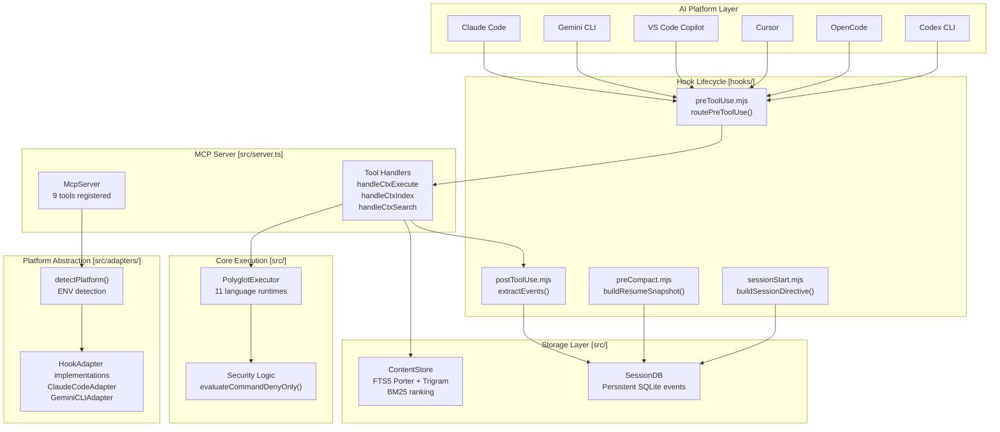
```mermaid
graph TB
    subgraph "AI Platform Layer"
        CLAUDE["Claude Code"]
        GEMINI["Gemini CLI"]
        VSCODE["VS Code Copilot"]
        CURSOR["Cursor"]
        OPENCODE["OpenCode"]
        CODEX["Codex CLI"]
    end
    
    subgraph "MCP Server [src/server.ts]"
        SERVER["McpServer<br/>9 tools registered"]
        TOOLS["Tool Handlers<br/>handleCtxExecute<br/>handleCtxIndex<br/>handleCtxSearch"]
    end
    
    subgraph "Hook Lifecycle [hooks/]"
        PRETOOL["preToolUse.mjs<br/>routePreToolUse()"]
        POSTTOOL["postToolUse.mjs<br/>extractEvents()"]
        PRECOMPACT["preCompact.mjs<br/>buildResumeSnapshot()"]
        SESSIONSTART["sessionStart.mjs<br/>buildSessionDirective()"]
    end
    
    subgraph "Core Execution [src/]"
        EXECUTOR["PolyglotExecutor<br/>11 language runtimes"]
        SECURITY["Security Logic<br/>evaluateCommandDenyOnly()"]
    end
    
    subgraph "Storage Layer [src/]"
        STORE["ContentStore<br/>FTS5 Porter + Trigram<br/>BM25 ranking"]
        SESSION["SessionDB<br/>Persistent SQLite events"]
    end
    
    subgraph "Platform Abstraction [src/adapters/]"
        DETECT["detectPlatform()<br/>ENV detection"]
        ADAPTERS["HookAdapter implementations<br/>ClaudeCodeAdapter<br/>GeminiCLIAdapter"]
    end
    
    CLAUDE & GEMINI & VSCODE --> PRETOOL
    CURSOR & OPENCODE & CODEX --> PRETOOL
    
    PRETOOL --> TOOLS
    TOOLS --> EXECUTOR
    TOOLS --> STORE
    
    EXECUTOR --> SECURITY
    
    TOOLS --> POSTTOOL
    POSTTOOL --> SESSION
    
    PRECOMPACT --> SESSION
    SESSIONSTART --> SESSION
    
    SERVER --> DETECT
    DETECT --> ADAPTERS
```

**Diagram: System Architecture and Data Flow**

The MCP server ([src/server.ts:92-95]()) registers tools and communicates via stdio. The hook lifecycle intercepts tool calls to enforce routing and capture events. Core execution happens in `PolyglotExecutor` ([src/executor.ts:13]()) with security checks from `evaluateCommandDenyOnly` ([src/security.ts:19]()). Storage is split between ephemeral `ContentStore` ([src/store.ts:15]()) for search and persistent `SessionDB` ([src/session/db.ts:45]()) for continuity.

**Sources**: [src/server.ts:1-100](), [src/executor.ts:1-50](), [src/session/db.ts:1-50](), [src/adapters/detect.ts:57]()

---

## Three Core Pillars

### 1. Sandboxed Execution

**Code Entity**: `PolyglotExecutor` class in `src/executor.ts` [src/executor.ts:13]()

The executor spawns isolated child processes for code execution in 11 languages (JavaScript, TypeScript, Python, Shell, Ruby, Go, Rust, PHP, Perl, R, Elixir). [package.json:5](). Each execution captures output, applies smart truncation, and returns only stdout to the agent.

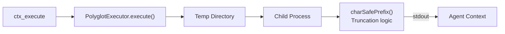
```mermaid
graph LR
    TOOL["ctx_execute"]
    EXEC["PolyglotExecutor.execute()"]
    TEMP["Temp Directory"]
    PROC["Child Process"]
    TRUNC["charSafePrefix()<br/>Truncation logic"]
    
    TOOL --> EXEC
    EXEC --> TEMP
    TEMP --> PROC
    PROC --> TRUNC
    TRUNC -->|"stdout"| CONTEXT["Agent Context"]
```

**Diagram: Execution Pipeline**

**Sources**: [src/executor.ts:13](), [src/truncate.ts:32](), [package.json:5]()

---

### 2. Knowledge Base (FTS5)

**Code Entity**: `ContentStore` class in `src/store.ts` [src/store.ts:15]()

SQLite FTS5 (Full-Text Search 5) provides fast text search with BM25 ranking. The system maintains Porter (stemming) and Trigram (substring) tokenizers. [src/store.ts:15]()

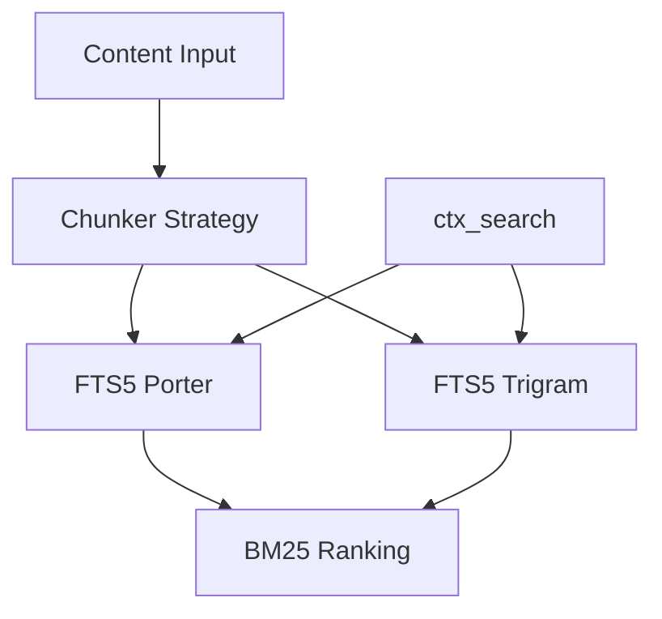
```mermaid
graph TB
    INPUT["Content Input"]
    CHUNK["Chunker Strategy"]
    PORTER["FTS5 Porter"]
    TRIGRAM["FTS5 Trigram"]
    QUERY["ctx_search"]
    RANK["BM25 Ranking"]
    
    INPUT --> CHUNK
    CHUNK --> PORTER
    CHUNK --> TRIGRAM
    QUERY --> PORTER
    QUERY --> TRIGRAM
    PORTER & TRIGRAM --> RANK
```

**Diagram: Knowledge Base Architecture**

**Sources**: [src/store.ts:15](), [package.json:21-22]()

---

### 3. Session Continuity

**Code Entities**: 
- `SessionDB` class in `src/session/db.ts` [src/session/db.ts:45]()
- `AnalyticsEngine` in `src/session/analytics.ts` [src/session/analytics.ts:62]()

Session continuity requires hooks working together to capture events (files, tasks, errors) and restore them after context compaction. [README.md:41]()

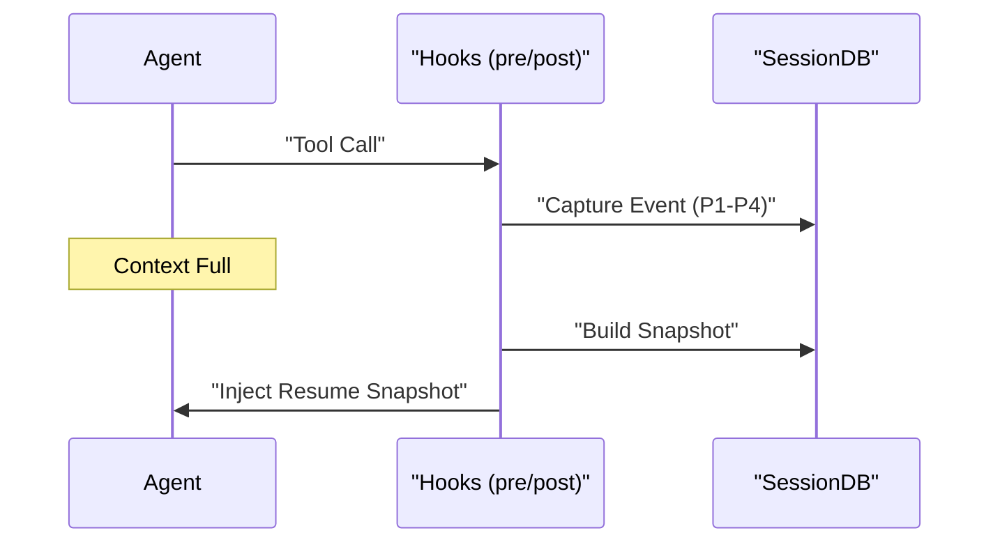
```mermaid
sequenceDiagram
    participant Agent
    participant Hooks as "Hooks (pre/post)"
    participant SessionDB as "SessionDB"
    
    Agent->>Hooks: "Tool Call"
    Hooks->>SessionDB: "Capture Event (P1-P4)"
    Note over Agent: Context Full
    Hooks->>SessionDB: "Build Snapshot"
    Hooks->>Agent: "Inject Resume Snapshot"
```

**Diagram: Session Continuity Lifecycle**

**Sources**: [src/session/db.ts:45](), [src/session/analytics.ts:62](), [README.md:41]()

---

## Platform Integration

Context-mode supports six AI platforms through a platform adapter pattern. [src/adapters/types.ts:56]()

| Platform | Detection | Enforcement |
|----------|-----------|-------------|
| **Claude Code** | `CLAUDE_PROJECT_DIR` | plugin.json |
| **Gemini CLI** | `GEMINI_CLI` | settings.json |
| **Cursor** | `CURSOR_PROJECT_DIR` | hooks.json |
| **OpenCode** | `OPENCODE` | Native plugin |

**Sources**: [src/adapters/detect.ts:57](), [src/adapters/types.ts:56](), [package.json:30-49]()

---

## Tool Summary

Context-mode provides 9 MCP tools:

| Tool Name | Purpose |
|-----------|---------|
| `ctx_batch_execute` | Execute N commands + M queries in one round trip |
| `ctx_execute` | Sandboxed code execution in 11 languages |
| `ctx_execute_file` | Process files without loading into context |
| `ctx_index` | Chunk and index content into FTS5 |
| `ctx_search` | Multi-query search with BM25 ranking |
| `ctx_fetch_and_index` | Fetch URL and index into knowledge base |
| `ctx_stats` | Report context savings |
| `ctx_doctor` | Diagnose installation |
| `ctx_upgrade` | In-place plugin upgrade |

**Sources**: [src/server.ts:92-103](), [package.json:5]()

---

## Next Steps

For installation instructions specific to your platform, see **Getting Started**.

To understand the core architectural pillars in depth, see:
- **Context Window Protection** - Sandboxed execution
- **Session Continuity** - Event capture and resume snapshots
- **Knowledge Base (FTS5)** - Search fallback strategies

---

<<< SECTION: 2 Getting Started [2-getting-started] >>>

# Getting Started

<details>
<summary>Relevant source files</summary>

The following files were used as context for generating this wiki page:

- [.claude-plugin/marketplace.json](.claude-plugin/marketplace.json)
- [.claude-plugin/plugin.json](.claude-plugin/plugin.json)
- [.codex-plugin/plugin.json](.codex-plugin/plugin.json)
- [.cursor-plugin/plugin.json](.cursor-plugin/plugin.json)
- [.openclaw-plugin/openclaw.plugin.json](.openclaw-plugin/openclaw.plugin.json)
- [.openclaw-plugin/package.json](.openclaw-plugin/package.json)
- [.pi/extensions/context-mode/package.json](.pi/extensions/context-mode/package.json)
- [openclaw.plugin.json](openclaw.plugin.json)
- [package.json](package.json)
- [scripts/postinstall.mjs](scripts/postinstall.mjs)
- [src/cli.ts](src/cli.ts)
- [start.mjs](start.mjs)
- [tests/core/cli.test.ts](tests/core/cli.test.ts)
- [tests/util/postinstall-heal-mcp-json.test.ts](tests/util/postinstall-heal-mcp-json.test.ts)
- [tests/util/start-mjs-self-heal.test.ts](tests/util/start-mjs-self-heal.test.ts)

</details>


This page provides an overview of installing and configuring context-mode for your AI coding platform. It covers platform detection, installation options, hook configuration requirements, and verification steps.

For detailed installation instructions, see [Installation](#2.1). For platform-specific configuration details, see [Platform-Specific Setup](#2.2).

---

## Prerequisites

Before installing context-mode, ensure your system has:

- **Node.js 22.5.0+** (Required for stable ESM and native features) [package.json:131-133]()
- **Bun** runtime (Recommended for Linux to avoid `better-sqlite3` SIGSEGV issues) [start.mjs:62-67]()
- One of the supported AI platforms:
  - Claude Code (full hook support)
  - Gemini CLI (Beta)
  - VS Code Copilot (Beta)
  - Cursor (Beta)
  - OpenCode (Beta)
  - Codex CLI (Beta, no hooks)

The system requires SQLite FTS5 support via the `better-sqlite3` native module. This is bundled with the package and verified during the `doctor` command. [src/cli.ts:49-50](), [package.json:115-115]()

**Sources:** [package.json:111-133](), [src/cli.ts:1-30](), [start.mjs:62-67]()

---

## Installation Paths

Context-mode supports three installation methods, each with different capabilities:

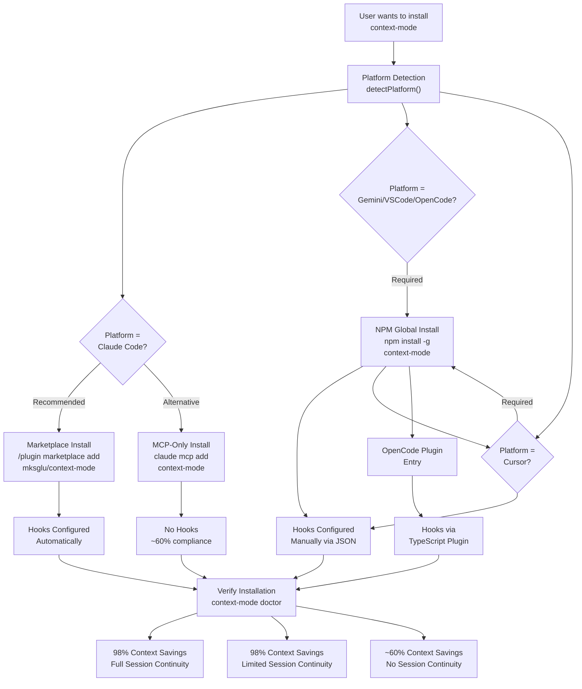
```mermaid
graph TB
    START["User wants to install<br/>context-mode"]
    
    DETECT["Platform Detection<br/>detectPlatform()"]
    
    START --> DETECT
    
    CLAUDE{"Platform =<br/>Claude Code?"}
    OTHER{"Platform =<br/>Gemini/VSCode/OpenCode?"}
    CURSOR{"Platform =<br/>Cursor?"}
    
    DETECT --> CLAUDE
    DETECT --> OTHER
    DETECT --> CURSOR
    
    MARKETPLACE["Marketplace Install<br/>/plugin marketplace add<br/>mksglu/context-mode"]
    NPM_GLOBAL["NPM Global Install<br/>npm install -g<br/>context-mode"]
    MCPONLY["MCP-Only Install<br/>claude mcp add<br/>context-mode"]
    
    CLAUDE -->|"Recommended"| MARKETPLACE
    CLAUDE -->|"Alternative"| MCPONLY
    
    OTHER -->|"Required"| NPM_GLOBAL
    CURSOR -->|"Required"| NPM_GLOBAL
    
    HOOKS_AUTO["Hooks Configured<br/>Automatically"]
    HOOKS_MANUAL["Hooks Configured<br/>Manually via JSON"]
    HOOKS_PLUGIN["Hooks via<br/>TypeScript Plugin"]
    NO_HOOKS["No Hooks<br/>~60% compliance"]
    
    MARKETPLACE --> HOOKS_AUTO
    NPM_GLOBAL --> HOOKS_MANUAL
    MCPONLY --> NO_HOOKS
    
    NPM_GLOBAL --> CURSOR
    CURSOR --> HOOKS_MANUAL
    
    NPM_GLOBAL --> OPENCODE["OpenCode Plugin<br/>Entry"]
    OPENCODE --> HOOKS_PLUGIN
    
    VERIFY["Verify Installation<br/>context-mode doctor"]
    
    HOOKS_AUTO --> VERIFY
    HOOKS_MANUAL --> VERIFY
    HOOKS_PLUGIN --> VERIFY
    NO_HOOKS --> VERIFY
    
    RESULT["98% Context Savings<br/>Full Session Continuity"]
    RESULT_PARTIAL["98% Context Savings<br/>Limited Session Continuity"]
    RESULT_BASIC["~60% Context Savings<br/>No Session Continuity"]
    
    VERIFY --> RESULT
    VERIFY --> RESULT_PARTIAL
    VERIFY --> RESULT_BASIC
```

**Marketplace Install** (Claude Code only): Fully automated setup including MCP server registration via `.claude-plugin/plugin.json`. [ .claude-plugin/plugin.json:1-31]()

**NPM Global Install** (All platforms): Provides the `context-mode` binary. Requires manual hook configuration in platform-specific settings files. [package.json:58-60]()

**MCP-Only Install**: Provides sandbox tools without hooks. The model receives routing instructions but has no programmatic enforcement.

**Sources:** [package.json:1-60](), [.claude-plugin/plugin.json:1-31](), [.cursor-plugin/plugin.json:1-37]()

---

## Platform Detection

The system automatically detects which AI platform is running using environment variables. The `detectPlatform()` function in `src/adapters/detect.ts` returns a platform identifier. [src/cli.ts:68-69]()

### Platform Detection Logic

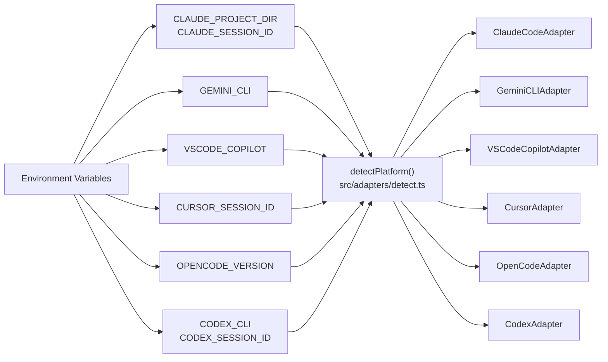
```mermaid
graph LR
    ENV["Environment Variables"]
    
    CLAUDE["CLAUDE_PROJECT_DIR<br/>CLAUDE_SESSION_ID"]
    GEMINI["GEMINI_CLI"]
    VSCODE["VSCODE_COPILOT"]
    CURSOR["CURSOR_SESSION_ID"]
    OPENCODE["OPENCODE_VERSION"]
    CODEX["CODEX_CLI<br/>CODEX_SESSION_ID"]
    
    ENV --> CLAUDE
    ENV --> GEMINI
    ENV --> VSCODE
    ENV --> CURSOR
    ENV --> OPENCODE
    ENV --> CODEX
    
    DETECT["detectPlatform()<br/>src/adapters/detect.ts"]
    
    CLAUDE --> DETECT
    GEMINI --> DETECT
    VSCODE --> DETECT
    CURSOR --> DETECT
    OPENCODE --> DETECT
    CODEX --> DETECT
    
    ADAPTER_CC["ClaudeCodeAdapter"]
    ADAPTER_GEM["GeminiCLIAdapter"]
    ADAPTER_VSC["VSCodeCopilotAdapter"]
    ADAPTER_CUR["CursorAdapter"]
    ADAPTER_OC["OpenCodeAdapter"]
    ADAPTER_CDX["CodexAdapter"]
    
    DETECT --> ADAPTER_CC
    DETECT --> ADAPTER_GEM
    DETECT --> ADAPTER_VSC
    DETECT --> ADAPTER_CUR
    DETECT --> ADAPTER_OC
    DETECT --> ADAPTER_CDX
```

The CLI uses these adapters to manage platform-specific behaviors, such as resolving configuration directories or setting up hooks. [src/cli.ts:13-15]()

**Sources:** [src/cli.ts:68-69](), [start.mjs:19-28](), [start.mjs:38-51]()

---

## Hook Configuration Architecture

Hooks are the enforcement mechanism that intercepts tool calls. The `context-mode hook <platform> <event>` command is the entry point for all platform-triggered events. [src/cli.ts:71-72]()

### Hook Dispatch Flow

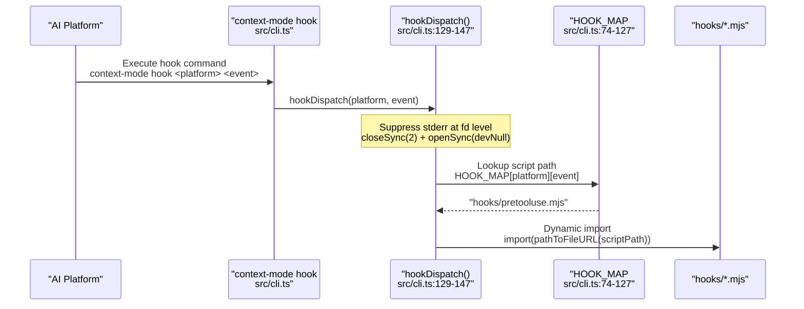
```mermaid
sequenceDiagram
    participant Platform as "AI Platform"
    participant CLI as "context-mode hook<br/>src/cli.ts"
    participant Dispatch as "hookDispatch()<br/>src/cli.ts:129-147"
    participant Map as "HOOK_MAP<br/>src/cli.ts:74-127"
    participant Script as "hooks/*.mjs"
    
    Platform->>CLI: Execute hook command<br/>context-mode hook <platform> <event>
    CLI->>Dispatch: hookDispatch(platform, event)
    
    Note over Dispatch: Suppress stderr at fd level<br/>closeSync(2) + openSync(devNull)
    
    Dispatch->>Map: Lookup script path<br/>HOOK_MAP[platform][event]
    Map-->>Dispatch: "hooks/pretooluse.mjs"
    
    Dispatch->>Script: Dynamic import<br/>import(pathToFileURL(scriptPath))
```

The `HOOK_MAP` constant maps platform-event pairs to specific script paths within the plugin. [src/cli.ts:74-127]()

| Platform | Event | Script Path |
|----------|-------|-------------|
| `claude-code` | `pretooluse` | `hooks/pretooluse.mjs` |
| `gemini-cli` | `beforetool` | `hooks/gemini-cli/beforetool.mjs` |
| `vscode-copilot` | `pretooluse` | `hooks/vscode-copilot/pretooluse.mjs` |
| `cursor` | `pretooluse` | `hooks/cursor/pretooluse.mjs` |

**Sources:** [src/cli.ts:74-147](), [package.json:63-63]()

---

## Verification with Doctor Command

After installation, run the `doctor` command to verify that all components are properly configured: [src/cli.ts:99-99]()

```bash
context-mode doctor
```

### Doctor Diagnostic Pipeline

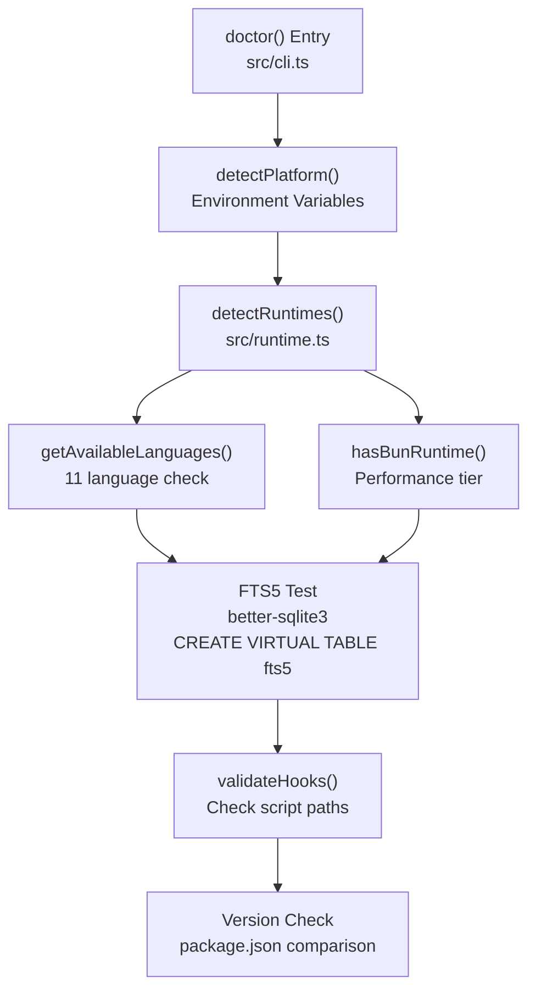
```mermaid
graph TB
    START["doctor() Entry<br/>src/cli.ts"]
    
    DETECT["detectPlatform()<br/>Environment Variables"]
    RUNTIME["detectRuntimes()<br/>src/runtime.ts"]
    LANGS["getAvailableLanguages()<br/>11 language check"]
    BUN["hasBunRuntime()<br/>Performance tier"]
    
    START --> DETECT
    DETECT --> RUNTIME
    RUNTIME --> LANGS
    RUNTIME --> BUN
    
    FTS5["FTS5 Test<br/>better-sqlite3<br/>CREATE VIRTUAL TABLE fts5"]
    
    LANGS --> FTS5
    BUN --> FTS5
    
    HOOKS["validateHooks()<br/>Check script paths"]
    
    FTS5 --> HOOKS
    
    VERSION["Version Check<br/>package.json comparison"]
    
    HOOKS --> VERSION
```

The doctor command verifies the following:
1. **Runtimes**: Detects available language executors (Node, Bun, Python, etc.). [src/cli.ts:26-30]()
2. **SQLite**: Validates that `better-sqlite3` is working with FTS5 support. [src/cli.ts:49-50]()
3. **Hooks**: Validates that the hook scripts defined in `HOOK_MAP` are accessible. [src/cli.ts:31-31]()
4. **Platform**: Correctly identifies the hosting AI environment. [src/cli.ts:68-69]()

**Sources:** [src/cli.ts:7-9](), [src/cli.ts:26-31](), [src/cli.ts:74-127]()

---

## Next Steps

After verifying your installation with the `doctor` command, proceed to:

- **[Installation](#2.1)** — Detailed installation instructions for all platforms.
- **[Platform-Specific Setup](#2.2)** — Hook configuration and settings files.
- **[Core Concepts](#3)** — Understand context window protection and session continuity.
- **[MCP Tools](#4)** — Learn about the 9 tools provided by context-mode.

**Sources:** [package.json:5-24](), [src/cli.ts:158-170]()

---

<<< SECTION: 2.1 Installation [2-1-installation] >>>

# Installation

<details>
<summary>Relevant source files</summary>

The following files were used as context for generating this wiki page:

- [configs/jetbrains-copilot/mcp.json](configs/jetbrains-copilot/mcp.json)
- [configs/vscode-copilot/mcp.json](configs/vscode-copilot/mcp.json)
- [scripts/heal-better-sqlite3.mjs](scripts/heal-better-sqlite3.mjs)
- [scripts/postinstall.mjs](scripts/postinstall.mjs)
- [skills/context-mode/references/anti-patterns.md](skills/context-mode/references/anti-patterns.md)
- [src/cli.ts](src/cli.ts)
- [start.mjs](start.mjs)
- [tests/core/cli.test.ts](tests/core/cli.test.ts)
- [tests/util/heal-better-sqlite3-python.test.ts](tests/util/heal-better-sqlite3-python.test.ts)
- [tests/util/heal-better-sqlite3.test.ts](tests/util/heal-better-sqlite3.test.ts)
- [tests/util/postinstall-heal-mcp-json.test.ts](tests/util/postinstall-heal-mcp-json.test.ts)
- [tests/util/start-mjs-self-heal.test.ts](tests/util/start-mjs-self-heal.test.ts)

</details>


This page explains how to install `context-mode` across different deployment methods: npm global installation, Claude Code marketplace, and platform-specific MCP server registration. It covers the entry point mechanism, bundle vs build directory resolution, self-healing layers, and verification using the `doctor` command.

For platform-specific hook configuration after installation, see [Platform-Specific Setup](#2.2). For upgrading an existing installation, see [upgrade Command](#10.2).

---

## Installation Methods

Context-mode supports three installation methods with different deployment characteristics:

**Method Comparison**

| Method | Use Case | Entry Point | Hooks | Bundle Format |
|--------|----------|-------------|-------|---------------|
| npm global | CLI usage, manual MCP registration | `context-mode` binary | Manual configuration | Pre-built bundles |
| Claude Code marketplace | One-command setup with auto-hooks | `${CLAUDE_PLUGIN_ROOT}/start.mjs` | Auto-configured | Pre-built bundles |
| Platform-specific MCP | Gemini CLI, VS Code, Cursor, Codex CLI | `context-mode` binary or absolute path | Manual configuration | Pre-built bundles |

**Installation Flow**

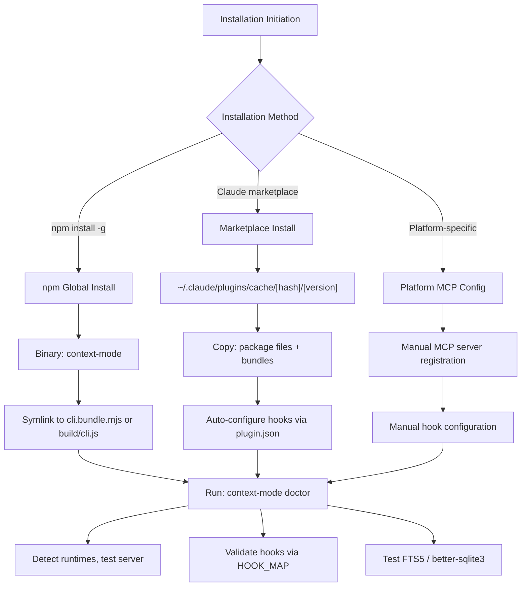
```mermaid
graph TB
    START["Installation Initiation"]
    
    START --> NPM_CHOICE{"Installation Method"}
    
    NPM_CHOICE -->|"npm install -g"| NPM_GLOBAL["npm Global Install"]
    NPM_CHOICE -->|"Claude marketplace"| MARKETPLACE["Marketplace Install"]
    NPM_CHOICE -->|"Platform-specific"| PLATFORM["Platform MCP Config"]
    
    NPM_GLOBAL --> NPM_BIN["Binary: context-mode"]
    NPM_BIN --> NPM_LINK["Symlink to cli.bundle.mjs or build/cli.js"]
    
    MARKETPLACE --> PLUGIN_DIR["~/.claude/plugins/cache/[hash]/[version]"]
    PLUGIN_DIR --> PLUGIN_FILES["Copy: package files + bundles"]
    PLUGIN_FILES --> AUTO_HOOKS["Auto-configure hooks via plugin.json"]
    
    PLATFORM --> MANUAL_CONFIG["Manual MCP server registration"]
    MANUAL_CONFIG --> MANUAL_HOOKS["Manual hook configuration"]
    
    NPM_LINK --> VERIFY
    AUTO_HOOKS --> VERIFY
    MANUAL_HOOKS --> VERIFY
    
    VERIFY["Run: context-mode doctor"]
    VERIFY --> RUNTIME["Detect runtimes, test server"]
    VERIFY --> HOOKS_CHECK["Validate hooks via HOOK_MAP"]
    VERIFY --> FTS5_CHECK["Test FTS5 / better-sqlite3"]
```

Sources: [src/cli.ts:1-15](), [package.json:35-50](), [start.mjs:95-155]()

---

## npm Global Installation

Global installation makes the `context-mode` binary available system-wide. This is required for platforms that do not have plugin marketplaces.

**Installation Command**

```bash
npm install -g context-mode
```

**Linux Engine Requirements**
On Linux, the installer enforces a hard-fail for Node.js versions below 22.5 unless Bun is present. This prevents a critical V8 `madvise(MADV_DONTNEED)` bug that causes sporadic SIGSEGV crashes in the `better-sqlite3` native addon [scripts/postinstall.mjs:46-78]().

**Binary Resolution**
The `context-mode` binary resolves to one of two entry points based on availability:

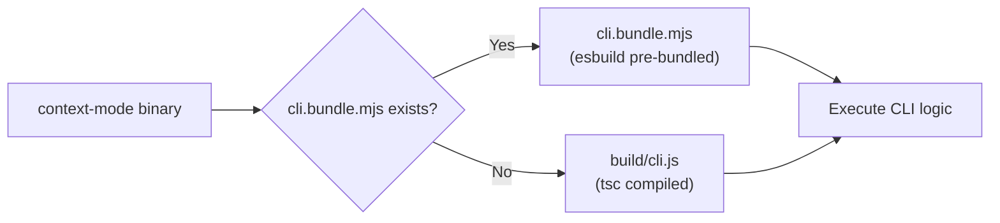
```mermaid
graph LR
    BIN["context-mode binary"]
    
    BIN --> BUNDLE_CHECK{"cli.bundle.mjs exists?"}
    
    BUNDLE_CHECK -->|Yes| BUNDLE["cli.bundle.mjs<br/>(esbuild pre-bundled)"]
    BUNDLE_CHECK -->|No| BUILD["build/cli.js<br/>(tsc compiled)"]
    
    BUNDLE --> EXEC["Execute CLI logic"]
    BUILD --> EXEC
```

Sources: [package.json:35-36](), [tests/core/cli.test.ts:23-45](), [scripts/postinstall.mjs:46-78]()

---

## Claude Code Marketplace Installation

Claude Code provides automated installation and hook configuration via its marketplace.

**Installation Commands**

```bash
/plugin marketplace add mksglu/context-mode
/plugin install context-mode@context-mode
```

The plugin installs to `~/.claude/plugins/cache/[hash]/[version]/`. 

**Self-Heal Layer 1 (Registry/Symlink Repair)**
Claude Code's auto-update can leave the `installed_plugins.json` registry pointing to a non-existent directory. Upon boot, `start.mjs` detects this and creates symlinks to ensure hooks find the correct installation path [start.mjs:95-155]().

**Self-Heal Layer 5 (mcpServers Heal)**
If a previous `/ctx-upgrade` left absolute paths pointing to temporary directories in `plugin.json`, `start.mjs` and `postinstall.mjs` invoke `healPluginJsonMcpServers` to restore canonical paths [start.mjs:160-175](), [scripts/postinstall.mjs:158-165]().

Sources: [start.mjs:95-175](), [scripts/postinstall.mjs:110-165](), [tests/util/start-mjs-self-heal.test.ts:32-48]()

---

## Entry Point Resolution: start.mjs

`start.mjs` is the universal entry point. It manages environment setup and platform-specific workarounds.

**Linux Bun Re-exec**
On Linux, `start.mjs` attempts to re-execute itself using `bun` if available. This avoids the `better-sqlite3` SIGSEGV bug present in Node.js versions earlier than 22.5 [start.mjs:67-93]().

**Environment Normalization**
`start.mjs` ensures `CLAUDE_PROJECT_DIR` and `CONTEXT_MODE_PROJECT_DIR` are set, defending against session re-rooting during upgrades [start.mjs:30-51]().

**Dependency Handling**
Bundles externalize native modules to avoid binary incompatibilities:
- `better-sqlite3`
- `turndown`
- `@mixmark-io/domino`

Sources: [start.mjs:30-93](), [package.json:47](), [scripts/heal-better-sqlite3.mjs:1-42]()

---

## Verification with doctor Command

The `doctor` command runs a diagnostic pipeline to verify installation and environment health [src/cli.ts:7-8]().

**Diagnostic Checks**

| Check | Implementation | Purpose |
|-------|---------------|---------|
| Runtime Detection | `detectRuntimes()` | Checks availability of 11 languages (JS, Python, Go, etc.) |
| Server Test | `PolyglotExecutor` | Verifies the execution engine can run a simple script |
| Hook Validation | `HOOK_MAP` lookup | Ensures hook scripts exist and are registered for the platform |
| FTS5 Check | SQLite Query | Tests if `better-sqlite3` supports FTS5 virtual tables |
| Sibling MCP | `discoverSiblingMcpPids` | Identifies other running instances that might conflict |

Sources: [src/cli.ts:25-43](), [src/cli.ts:129-147](), [tests/core/cli.test.ts:127-132]()

---

## Hook Dispatch Mechanism

The CLI acts as a dispatcher for platform hooks via the `hook` command [src/cli.ts:9]().

**Hook Execution Flow**

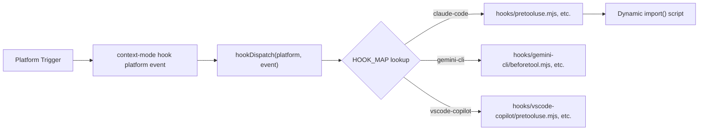
```mermaid
graph LR
    PLATFORM["Platform Trigger"] --> CMD["context-mode hook platform event"]
    CMD --> DISPATCH["hookDispatch(platform, event)"]
    DISPATCH --> MAP{"HOOK_MAP lookup"}
    MAP -->|"claude-code"| CLAUDE["hooks/pretooluse.mjs, etc."]
    MAP -->|"gemini-cli"| GEMINI["hooks/gemini-cli/beforetool.mjs, etc."]
    MAP -->|"vscode-copilot"| VS["hooks/vscode-copilot/pretooluse.mjs, etc."]
    CLAUDE --> IMPORT["Dynamic import() script"]
```

**stderr Redirection**
To prevent platforms from failing hooks due to noise from native modules (like `better-sqlite3` initialization), `hookDispatch` redirects `stderr` to `devNull` at the OS file descriptor level [src/cli.ts:129-140]().

Sources: [src/cli.ts:74-127](), [src/cli.ts:129-147]()

---

## Troubleshooting Native Bindings

The `better-sqlite3` native binding is the most common point of failure.

**Conda Interference (#533)**
If Anaconda/Miniconda is on the PATH, `node-gyp` may fail to build. The system uses `resolveSafePython` to locate a non-conda Python (e.g., `/usr/bin/python3` on macOS) and strips `CONDA_*` environment variables during repair [scripts/heal-better-sqlite3.mjs:43-133]().

**Windows Visual Studio Detection**
On Windows, the system uses `vswhere.exe` to detect the installed Visual Studio year (e.g., 2022, 2026) to correctly configure `msvs_version` for `node-gyp`, bypassing version-to-year mapping limitations in older `node-gyp` builds [scripts/heal-better-sqlite3.mjs:150-180]().

Sources: [scripts/heal-better-sqlite3.mjs:43-180](), [tests/util/heal-better-sqlite3-python.test.ts:39-89]()

---

<<< SECTION: 2.2 Platform-Specific Setup [2-2-platform-specific-setup] >>>

# Platform-Specific Setup

<details>
<summary>Relevant source files</summary>

The following files were used as context for generating this wiki page:

- [.claude/skills/context-mode-ops/validation.md](.claude/skills/context-mode-ops/validation.md)
- [configs/claude-code/CLAUDE.md](configs/claude-code/CLAUDE.md)
- [configs/codex/AGENTS.md](configs/codex/AGENTS.md)
- [configs/codex/hooks.json](configs/codex/hooks.json)
- [configs/cursor/hooks.json](configs/cursor/hooks.json)
- [configs/gemini-cli/GEMINI.md](configs/gemini-cli/GEMINI.md)
- [configs/opencode/AGENTS.md](configs/opencode/AGENTS.md)
- [configs/vscode-copilot/copilot-instructions.md](configs/vscode-copilot/copilot-instructions.md)
- [hooks/hooks.json](hooks/hooks.json)
- [src/adapters/claude-code/hooks.ts](src/adapters/claude-code/hooks.ts)
- [src/adapters/claude-code/index.ts](src/adapters/claude-code/index.ts)
- [src/adapters/codex/hooks.ts](src/adapters/codex/hooks.ts)
- [src/adapters/codex/index.ts](src/adapters/codex/index.ts)
- [src/adapters/cursor/hooks.ts](src/adapters/cursor/hooks.ts)
- [src/adapters/cursor/index.ts](src/adapters/cursor/index.ts)
- [src/adapters/gemini-cli/hooks.ts](src/adapters/gemini-cli/hooks.ts)
- [src/adapters/gemini-cli/index.ts](src/adapters/gemini-cli/index.ts)
- [src/adapters/types.ts](src/adapters/types.ts)
- [src/adapters/vscode-copilot/hooks.ts](src/adapters/vscode-copilot/hooks.ts)
- [src/adapters/vscode-copilot/index.ts](src/adapters/vscode-copilot/index.ts)
- [src/util/hook-config.ts](src/util/hook-config.ts)
- [src/util/plugin-cache-integrity.ts](src/util/plugin-cache-integrity.ts)
- [tests/adapters/claude-code.test.ts](tests/adapters/claude-code.test.ts)
- [tests/adapters/codex-external-mcp-routing.test.ts](tests/adapters/codex-external-mcp-routing.test.ts)
- [tests/adapters/codex.test.ts](tests/adapters/codex.test.ts)
- [tests/adapters/cursor.test.ts](tests/adapters/cursor.test.ts)
- [tests/adapters/gemini-cli-external-mcp-routing.test.ts](tests/adapters/gemini-cli-external-mcp-routing.test.ts)
- [tests/adapters/gemini-cli.test.ts](tests/adapters/gemini-cli.test.ts)
- [tests/adapters/vscode-copilot.test.ts](tests/adapters/vscode-copilot.test.ts)

</details>


This document provides detailed setup instructions for each supported AI coding platform. Context-mode uses a **platform adapter pattern** to provide single-codebase support for 6 different platforms, each with varying hook capabilities and configuration requirements.

For general installation instructions, see [Installation](#2.1). For adapter architecture details, see [Platform Adapters](#6). For hook system details, see [Hook System](#5).

---

## Platform Detection

Context-mode automatically detects which platform it's running on using environment variables and filesystem checks. This detection happens via `detectPlatform()` before any adapter-specific configuration is applied.

### Detection Flow

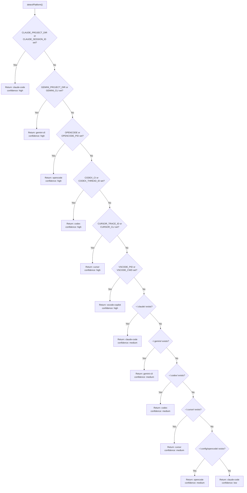
```mermaid
flowchart TD
    START["detectPlatform()"]
    
    START --> ENV1{"CLAUDE_PROJECT_DIR or<br/>CLAUDE_SESSION_ID set?"}
    ENV1 -->|Yes| CLAUDE["Return: claude-code<br/>confidence: high"]
    
    ENV1 -->|No| ENV2{"GEMINI_PROJECT_DIR or<br/>GEMINI_CLI set?"}
    ENV2 -->|Yes| GEMINI["Return: gemini-cli<br/>confidence: high"]
    
    ENV2 -->|No| ENV3{"OPENCODE or<br/>OPENCODE_PID set?"}
    ENV3 -->|Yes| OPENCODE["Return: opencode<br/>confidence: high"]
    
    ENV3 -->|No| ENV4{"CODEX_CI or<br/>CODEX_THREAD_ID set?"}
    ENV4 -->|Yes| CODEX["Return: codex<br/>confidence: high"]
    
    ENV4 -->|No| ENV5{"CURSOR_TRACE_ID or<br/>CURSOR_CLI set?"}
    ENV5 -->|Yes| CURSOR["Return: cursor<br/>confidence: high"]
    
    ENV5 -->|No| ENV6{"VSCODE_PID or<br/>VSCODE_CWD set?"}
    ENV6 -->|Yes| VSCODE["Return: vscode-copilot<br/>confidence: high"]
    
    ENV6 -->|No| FS1{"~/.claude/ exists?"}
    FS1 -->|Yes| CLAUDE_MED["Return: claude-code<br/>confidence: medium"]
    
    FS1 -->|No| FS2{"~/.gemini/ exists?"}
    FS2 -->|Yes| GEMINI_MED["Return: gemini-cli<br/>confidence: medium"]
    
    FS2 -->|No| FS3{"~/.codex/ exists?"}
    FS3 -->|Yes| CODEX_MED["Return: codex<br/>confidence: medium"]
    
    FS3 -->|No| FS4{"~/.cursor/ exists?"}
    FS4 -->|Yes| CURSOR_MED["Return: cursor<br/>confidence: medium"]
    
    FS4 -->|No| FS5{"~/.config/opencode/ exists?"}
    FS5 -->|Yes| OPENCODE_MED["Return: opencode<br/>confidence: medium"]
    
    FS5 -->|No| DEFAULT["Return: claude-code<br/>confidence: low"]
```

Sources: [src/adapters/claude-code/index.ts:66-110](), [src/adapters/codex/index.ts:128-146](), [src/adapters/vscode-copilot/index.ts:64-86]()

### Adapter Loading

Once the platform is detected, the system instantiates the corresponding adapter class. Each adapter implements the `HookAdapter` interface [src/adapters/types.ts:169-210](), providing a normalized view of platform-specific behaviors.

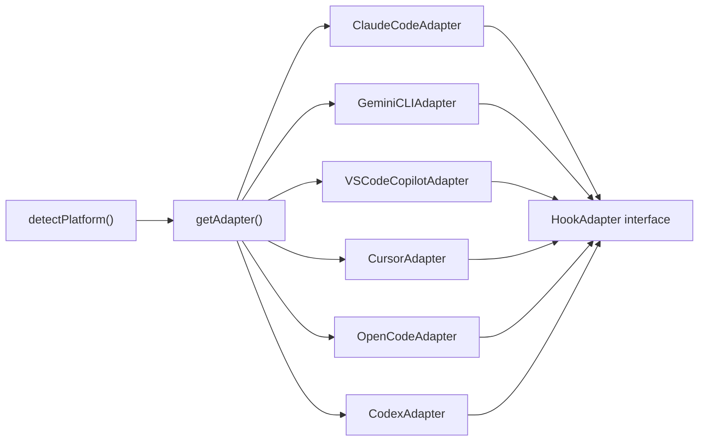
```mermaid
graph LR
    DETECT["detectPlatform()"]
    GETADAPTER["getAdapter()"]
    
    DETECT --> GETADAPTER
    
    GETADAPTER --> CC["ClaudeCodeAdapter"]
    GETADAPTER --> GEM["GeminiCLIAdapter"]
    GETADAPTER --> VSC["VSCodeCopilotAdapter"]
    GETADAPTER --> CUR["CursorAdapter"]
    GETADAPTER --> OC["OpenCodeAdapter"]
    GETADAPTER --> CDX["CodexAdapter"]
    
    CC --> IFACE["HookAdapter interface"]
    GEM --> IFACE
    VSC --> IFACE
    CUR --> IFACE
    OC --> IFACE
    CDX --> IFACE
```

Sources: [src/adapters/claude-code/index.ts:59](), [src/adapters/gemini-cli/index.ts:82](), [src/adapters/vscode-copilot/index.ts:45](), [src/adapters/cursor/index.ts:79](), [src/adapters/codex/index.ts:111]()

---

## Platform Capabilities Matrix

| Platform | Hook Paradigm | PreToolUse | PostToolUse | PreCompact | SessionStart | canModifyArgs | canModifyOutput |
|----------|---------------|------------|-------------|------------|--------------|---------------|-----------------|
| **Claude Code** | json-stdio | ✓ | ✓ | ✓ | ✓ | ✓ | ✓ |
| **Gemini CLI** | json-stdio | ✓ | ✓ | ✓ | ✓ | ✓ | ✓ |
| **VS Code Copilot** | json-stdio | ✓ | ✓ | ✓ | ✓ | ✓ | ✓ |
| **Cursor** | json-stdio | ✓ | ✓ | ✗ | ✓ | ✓ | ✗ |
| **Codex CLI** | json-stdio | ✓ | ✓ | ✓ | ✓ | ✗ | ✗ |

Sources: [src/adapters/claude-code/index.ts:68-76](), [src/adapters/gemini-cli/index.ts:90-98](), [src/adapters/cursor/index.ts:87-98](), [src/adapters/codex/index.ts:244-252]()

---

## Claude Code

### Hook Configuration

The `ClaudeCodeAdapter` generates hook entries in `~/.claude/settings.json` [src/adapters/claude-code/index.ts:115-117](). It uses the `buildNodeCommand` utility to ensure cross-platform compatibility, especially for Windows paths with spaces [src/adapters/claude-code/index.ts:121-132]().

**Matcher Pattern:** PreToolUse hooks fire only for specific tools to avoid overhead. The `PRE_TOOL_USE_MATCHER_PATTERN` is a pipe-separated string of tool names [src/adapters/claude-code/hooks.ts:72]().

```json
{
  "hooks": {
    "PreToolUse": [
      {
        "matcher": "Bash|WebFetch|Read|Grep|Agent|mcp__plugin_context-mode_context-mode__ctx_execute|...",
        "hooks": [
          {
            "type": "command",
            "command": "node /path/to/hooks/pretooluse.mjs"
          }
        ]
      }
    ]
  }
}
```

Sources: [src/adapters/claude-code/index.ts:133-185](), [src/adapters/claude-code/hooks.ts:56-72](), [hooks/hooks.json:26-108]()

### Session Storage

Claude Code honors `CLAUDE_CONFIG_DIR` if set, otherwise defaults to `~/.claude` [src/adapters/claude-code/index.ts:98-100](). Session databases are stored in the `context-mode/sessions` subdirectory [src/adapters/claude-code/index.ts:102-113]().

---

## Gemini CLI

### Hook Mapping

Gemini CLI uses different hook names than Claude Code, which the `GeminiCLIAdapter` normalizes [src/adapters/gemini-cli/index.ts:135-160]():

| Context-Mode Internal | Gemini CLI Name |
|----------------------|-----------------|
| PreToolUse | `BeforeTool` |
| PostToolUse | `AfterTool` |
| PreCompact | `PreCompress` |
| SessionStart | `SessionStart` |

Sources: [src/adapters/gemini-cli/index.ts:7-13](), [src/adapters/gemini-cli/hooks.ts:25-30]()

### Response Formatting

Gemini CLI handles tool blocking via `decision: "deny"` in the root of the response [src/adapters/gemini-cli/index.ts:165-170](). Argument modification is performed by returning `hookSpecificOutput.tool_input`, which the platform merges with original arguments [src/adapters/gemini-cli/index.ts:171-177]().

---

## VS Code Copilot

### File Structure

VS Code Copilot stores session data in `.github/context-mode/sessions/` if the `.github` directory exists in the project root [src/adapters/vscode-copilot/index.ts:100-113](). Otherwise, it falls back to `~/.vscode/context-mode/sessions/`.

### Diagnostics

The `validateHooks` function in `VSCodeCopilotAdapter` checks for the existence of `.github/hooks/context-mode.json` and verifies that `PreToolUse` and `SessionStart` hooks are correctly configured [src/adapters/vscode-copilot/index.ts:129-191](). It also warns that matchers are currently ignored by the platform [src/adapters/vscode-copilot/index.ts:202-207]().

---

## Cursor

### Native Hook API

Cursor uses a native hook system with lower-camelCase names (e.g., `preToolUse`) [src/adapters/cursor/index.ts:4-6](). The `CursorAdapter` translates normalized responses into Cursor's expected format, such as `permission: "deny"` for blocking [src/adapters/cursor/index.ts:152-157]().

### Session Limitations

Cursor does not currently support `PreCompact` hooks [src/adapters/cursor/index.ts:90](). While `sessionStart` is supported [src/adapters/cursor/index.ts:94](), the platform lacks the ability to modify tool output via hooks (`canModifyOutput: false`) [src/adapters/cursor/index.ts:96]().

Sources: [src/adapters/cursor/index.ts:87-98](), [src/adapters/cursor/hooks.ts:23-28]()

---

## Codex CLI

### Hook Dispatch

Codex CLI implements the `json-stdio` paradigm and supports 6 hook events: `PreToolUse`, `PostToolUse`, `PreCompact`, `SessionStart`, `UserPromptSubmit`, and `Stop` [src/adapters/codex/index.ts:7](). Hooks are registered in `hooks.json` within the Codex home directory [src/adapters/codex/index.ts:9]().

### Tool Matcher Constraints

Codex uses a Rust-based regex engine that does not support look-around [src/adapters/codex/index.ts:82-87](). To avoid boot errors, the `PRE_TOOL_USE_MATCHER_PATTERN` uses only literal tool names and pipe separators [src/adapters/codex/index.ts:97-98]().

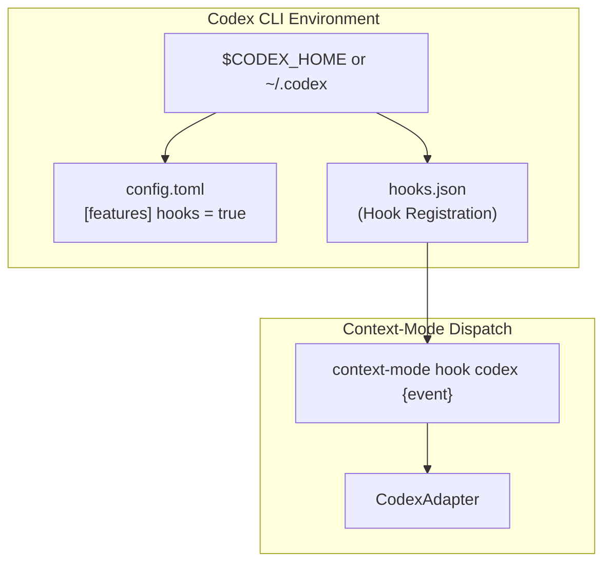
```mermaid
graph TD
    subgraph "Codex CLI Environment"
        HOME["$CODEX_HOME or ~/.codex"]
        CONFIG["config.toml<br/>[features] hooks = true"]
        HOOKS_JSON["hooks.json<br/>(Hook Registration)"]
    end
    
    subgraph "Context-Mode Dispatch"
        CLI["context-mode hook codex {event}"]
        ADAPTER["CodexAdapter"]
    end
    
    HOME --> CONFIG
    HOME --> HOOKS_JSON
    HOOKS_JSON --> CLI
    CLI --> ADAPTER
```

Sources: [src/adapters/codex/index.ts:1-15](), [configs/codex/hooks.json:1-47]()

---

## Routing Instructions Comparison

Each platform uses a different filename for routing instructions, managed by the respective adapters:

| Platform | File Name | Adapter Method |
|----------|-----------|----------------|
| Claude Code | `CLAUDE.md` | `getInstructionFiles()` |
| Gemini CLI | `GEMINI.md` | `getInstructionFiles()` |
| VS Code Copilot | `copilot-instructions.md` | `getInstructionFiles()` |
| Cursor | `context-mode.mdc` | `getInstructionFiles()` |

Sources: [src/adapters/gemini-cli/index.ts:230-232](), [src/adapters/vscode-copilot/index.ts:123-125](), [src/adapters/cursor/index.ts:230-232]()

### Content Enforcement

For platforms like Codex CLI where hook-based enforcement is instruction-driven, `AGENTS.md` contains mandatory routing rules [configs/codex/AGENTS.md:1-4](). It directs the model to use `ctx_execute` for data analysis instead of reading raw files into the context window [configs/codex/AGENTS.md:7-8]().

---

## Troubleshooting and Diagnostics

The `doctor` command uses adapter-specific validation logic to verify the environment.

### Claude Code Validation
The `ClaudeCodeAdapter.validateHooks` function reads `settings.json` and checks if the configured command for each hook matches the expected script path [src/adapters/claude-code/index.ts:207-254](). It uses `isContextModeHook` to identify if an entry belongs to the plugin [src/adapters/claude-code/hooks.ts:143-154]().

### Codex CLI Validation
The `CodexAdapter` verifies if the `hooks` feature is enabled in `config.toml` [src/adapters/codex/index.ts:166-169](). If disabled, it provides a fix to update the TOML file [src/adapters/codex/index.ts:176-215]().

Sources: [src/adapters/claude-code/index.ts:207-254](), [src/adapters/codex/index.ts:166-215]()

---

<<< SECTION: 3 Core Concepts [3-core-concepts] >>>

# Core Concepts

<details>
<summary>Relevant source files</summary>

The following files were used as context for generating this wiki page:

- [README.md](README.md)
- [docs/platform-support.md](docs/platform-support.md)
- [src/server.ts](src/server.ts)
- [tests/core/server.test.ts](tests/core/server.test.ts)
- [tests/session/continuity.test.ts](tests/session/continuity.test.ts)

</details>


This page explains the three foundational mechanisms that enable context-mode to achieve 94-99% context savings while maintaining session continuity across compactions:

1.  **Context Window Protection** — Sandboxed execution and intent-driven filtering that keeps raw data out of context.
2.  **Session Continuity** — Event capture and resume snapshots that survive context window resets.
3.  **Knowledge Base (FTS5)** — Ephemeral search index with multi-layer fallback and smart snippet extraction.

For detailed implementation of each mechanism, see:
*   Tool-level execution details: [MCP Tools](#4)
*   Hook lifecycle and session management: [Hook System](#5), [Session Management](#7)
*   Platform-specific differences: [Platform Adapters](#6)

## The Three-Pillar Architecture

The system operates through three coordinated layers that transform how data flows through the context window:

**System Architecture Overview**
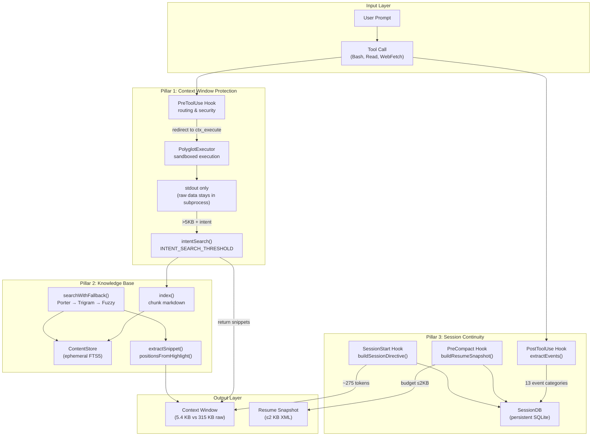
```mermaid
graph TB
    subgraph "Input Layer"
        USER["User Prompt"]
        TOOL_CALL["Tool Call<br/>(Bash, Read, WebFetch)"]
    end
    
    subgraph "Pillar 1: Context Window Protection"
        PRETOOL["PreToolUse Hook<br/>routing & security"]
        EXECUTOR["PolyglotExecutor<br/>sandboxed execution"]
        FILTER["intentSearch()<br/>INTENT_SEARCH_THRESHOLD"]
        SANDBOX_OUT["stdout only<br/>(raw data stays in subprocess)"]
    end
    
    subgraph "Pillar 2: Knowledge Base"
        STORE["ContentStore<br/>(ephemeral FTS5)"]
        INDEX["index()<br/>chunk markdown"]
        SEARCH["searchWithFallback()<br/>Porter → Trigram → Fuzzy"]
        SNIPPET["extractSnippet()<br/>positionsFromHighlight()"]
    end
    
    subgraph "Pillar 3: Session Continuity"
        POSTTOOL["PostToolUse Hook<br/>extractEvents()"]
        SESSIONDB["SessionDB<br/>(persistent SQLite)"]
        PRECOMPACT["PreCompact Hook<br/>buildResumeSnapshot()"]
        SESSIONSTART["SessionStart Hook<br/>buildSessionDirective()"]
    end
    
    subgraph "Output Layer"
        CONTEXT["Context Window<br/>(5.4 KB vs 315 KB raw)"]
        RESUME["Resume Snapshot<br/>(≤2 KB XML)"]
    end
    
    USER --> TOOL_CALL
    TOOL_CALL --> PRETOOL
    PRETOOL -->|"redirect to ctx_execute"| EXECUTOR
    EXECUTOR --> SANDBOX_OUT
    SANDBOX_OUT -->|">5KB + intent"| FILTER
    FILTER --> INDEX
    INDEX --> STORE
    FILTER -->|"return snippets"| CONTEXT
    
    SEARCH --> STORE
    SEARCH --> SNIPPET
    SNIPPET --> CONTEXT
    
    TOOL_CALL --> POSTTOOL
    POSTTOOL -->|"13 event categories"| SESSIONDB
    PRECOMPACT --> SESSIONDB
    PRECOMPACT -->|"budget ≤2KB"| RESUME
    SESSIONSTART --> SESSIONDB
    SESSIONSTART -->|"~275 tokens"| CONTEXT
```

**Key Interactions:**

| Flow | Entry Point | Processing | Result |
| :--- | :--- | :--- | :--- |
| **Execute large command** | `ctx_execute` → `PolyglotExecutor.execute()` | Subprocess captures stdout, intent filter indexes if >5KB | 56 KB → 299 B |
| **Search indexed content** | `ctx_search` → `ContentStore.searchWithFallback()` | 8-attempt fallback (Porter/Trigram/Fuzzy) | On-demand retrieval |
| **Tool call tracking** | PostToolUse → `extractEvents()` | 13 categories, priority P1-P4 | Persistent in SessionDB |
| **Context compaction** | PreCompact → `buildResumeSnapshot()` | Priority-tiered budget trimming | ≤2 KB XML snapshot |

Sources: [src/server.ts:92-104](), [src/executor.ts:1-50](), [src/store.ts:15-30](), [src/session/db.ts:45-47](), [README.md:36-52]()

---

## Context Window Protection

Context window protection operates through three coordinated mechanisms: **sandboxed execution** keeps raw data in subprocesses, **intent-driven filtering** auto-indexes large outputs, and **tool redirection** blocks data-heavy native tools.

### Sandboxed Execution Model

The `PolyglotExecutor` class [src/executor.ts:13]() spawns isolated subprocesses for code execution. Only stdout enters context — raw data (API responses, log files, snapshots) never leaves the subprocess:

**Execution Sandbox Boundary**
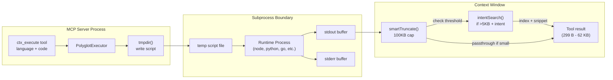
```mermaid
graph LR
    subgraph "MCP Server Process"
        CTX_EXECUTE["ctx_execute tool<br/>language + code"]
        EXECUTOR["PolyglotExecutor"]
        TMPDIR["tmpdir()<br/>write script"]
    end
    
    subgraph "Subprocess Boundary"
        RUNTIME["Runtime Process<br/>(node, python, go, etc.)"]
        SCRIPT["temp script file"]
        STDOUT["stdout buffer"]
        STDERR["stderr buffer"]
    end
    
    subgraph "Context Window"
        TRUNCATE["smartTruncate()<br/>100KB cap"]
        INTENT_FILTER["intentSearch()<br/>if >5KB + intent"]
        CONTEXT_OUT["Tool result<br/>(299 B - 62 KB)"]
    end
    
    CTX_EXECUTE --> EXECUTOR
    EXECUTOR --> TMPDIR
    TMPDIR --> SCRIPT
    SCRIPT --> RUNTIME
    RUNTIME --> STDOUT
    RUNTIME --> STDERR
    STDOUT --> TRUNCATE
    TRUNCATE -->|"check threshold"| INTENT_FILTER
    INTENT_FILTER -->|"index + snippet"| CONTEXT_OUT
    TRUNCATE -->|"passthrough if small"| CONTEXT_OUT
```

**Network Tracking:** JavaScript/TypeScript execution uses instrumented wrappers that intercept network I/O and report bytes consumed via `__CM_NET__` markers. This metric appears in `ctx_stats` as `bytesSandboxed` — data that never entered the context window.

Sources: [src/executor.ts:13-100](), [src/server.ts:13-14](), [src/session/event-emit.ts:52-53]()

### Intent-Driven Filtering

When `ctx_execute` or `ctx_execute_file` output exceeds `INTENT_SEARCH_THRESHOLD` (5,000 bytes) and an `intent` parameter is provided, the system switches from passthrough mode to indexed retrieval. This logic is handled in the server's tool handlers by calling `intentSearch()`.

| Threshold | Intent Provided | Behavior | Example |
| :--- | :--- | :--- | :--- |
| <5 KB | Any | Return full stdout | `git log --oneline -10` → 847 B |
| >5 KB | No | Truncate at 100 KB | `npm test` → 100 KB (truncated) |
| >5 KB | Yes | Index + search + snippet | `gh issue list` → 1.1 KB (5 matches) |

Sources: [src/server.ts:15-16](), [src/truncate.ts:32-32](), [README.md:40-42]()

### Tool Redirection via PreToolUse Hook

The PreToolUse hook intercepts dangerous tool calls before execution and redirects them to sandboxed alternatives. It evaluates calls against deny patterns and security policies [src/security.ts:18-23]().

| Native Tool | Redirected To | Reason |
| :--- | :--- | :--- |
| `Bash("curl ...")` | `ctx_execute(shell, "curl...")` | API data stays in sandbox |
| `WebFetch(url)` | `ctx_fetch_and_index(url)` | HTML converted to markdown, indexed |
| `Read(large_file)` | `ctx_execute_file(path, intent)` | File content never enters context |
| `Task(...)` | Inject `ROUTING_BLOCK` | Teach subagent to use `ctx_batch_execute` |

Sources: [src/security.ts:18-23](), [tests/core/server.test.ts:46-46](), [README.md:62-63]()

---

## Session Continuity

Session continuity ensures that when the context window compacts, the model retains full working state — active files, pending tasks, unresolved errors, and user decisions.

### Event Lifecycle: Capture → Persist → Snapshot → Restore

**Session Event Flow**
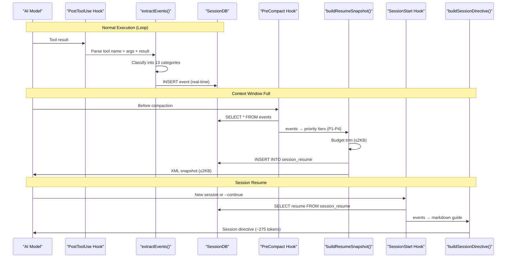
```mermaid
sequenceDiagram
    participant Model as "AI Model"
    participant PostTool as "PostToolUse Hook"
    participant ExtractEvents as "extractEvents()"
    participant SessionDB as "SessionDB"
    participant PreCompact as "PreCompact Hook"
    participant BuildSnapshot as "buildResumeSnapshot()"
    participant SessionStart as "SessionStart Hook"
    participant BuildDirective as "buildSessionDirective()"
    
    Note over Model,SessionDB: Normal Execution (Loop)
    Model->>PostTool: Tool result
    PostTool->>ExtractEvents: Parse tool name + args + result
    ExtractEvents->>ExtractEvents: Classify into 13 categories
    ExtractEvents->>SessionDB: INSERT event (real-time)
    
    Note over Model,BuildDirective: Context Window Full
    Model->>PreCompact: Before compaction
    PreCompact->>SessionDB: SELECT * FROM events
    PreCompact->>BuildSnapshot: events → priority tiers (P1-P4)
    BuildSnapshot->>BuildSnapshot: Budget trim (≤2KB)
    BuildSnapshot->>SessionDB: INSERT INTO session_resume
    BuildSnapshot->>Model: XML snapshot (≤2KB)
    
    Note over Model,BuildDirective: Session Resume
    Model->>SessionStart: New session or --continue
    SessionStart->>SessionDB: SELECT resume FROM session_resume
    SessionStart->>BuildDirective: events → markdown guide
    BuildDirective->>Model: Session directive (~275 tokens)
```

**Event Categories and Priorities:**
The system tracks 13 categories of events [tests/session/continuity.test.ts:18-18]().
*   **P1 (Critical):** Files, Tasks, Rules, User Prompts.
*   **P2 (High):** Decisions, Git, Errors, Environment.
*   **P3 (Normal):** MCP Tools, Subagents, Skills.
*   **P4 (Low):** Intent, Large Data.

Sources: [src/session/db.ts:45-47](), [tests/session/continuity.test.ts:18-19](), [tests/session/continuity.test.ts:49-121]()

---

## Knowledge Base (FTS5)

The `ContentStore` class [src/store.ts:15]() implements a dual-tokenizer FTS5 search system with progressive fallback and smart snippet extraction.

### Dual-Tokenizer Architecture

Content is indexed into two parallel FTS5 virtual tables:
1.  **Porter Tokenizer:** Stemming-based (e.g., "running" matches "run").
2.  **Trigram Tokenizer:** Substring-based (e.g., "useEff" matches "useEffect").

**FTS5 Search Pipeline**
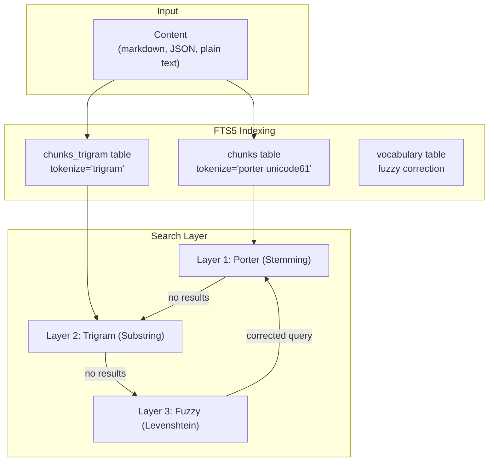
```mermaid
graph TB
    subgraph "Input"
        CONTENT["Content<br/>(markdown, JSON, plain text)"]
    end
    
    subgraph "FTS5 Indexing"
        PORTER["chunks table<br/>tokenize='porter unicode61'"]
        TRIGRAM["chunks_trigram table<br/>tokenize='trigram'"]
        VOCAB["vocabulary table<br/>fuzzy correction"]
    end
    
    subgraph "Search Layer"
        L1["Layer 1: Porter (Stemming)"]
        L2["Layer 2: Trigram (Substring)"]
        L3["Layer 3: Fuzzy (Levenshtein)"]
    end
    
    CONTENT --> PORTER
    CONTENT --> TRIGRAM
    PORTER --> L1
    TRIGRAM --> L2
    L1 -->|"no results"| L2
    L2 -->|"no results"| L3
    L3 -->|"corrected query"| L1
```

Sources: [src/store.ts:15-16](), [src/server.ts:15-16](), [src/server.ts:55-55]()

### Search and Retrieval
The `ContentStore` provides `searchWithFallback()` which tries multiple layers:
*   **Porter AND/OR:** Exact or stemmed matches.
*   **Trigram AND/OR:** Typo-tolerant or partial matches.
*   **Fuzzy:** Uses Levenshtein distance to correct queries against the indexed vocabulary.

Snippets are extracted using FTS5 highlight markers to ensure the model sees the most relevant context window around the match.

Sources: [src/store.ts:15-16](), [src/server.ts:55-55](), [src/server.ts:227-324]()

---

<<< SECTION: 3.1 Context Window Protection [3-1-context-window-protection] >>>

# Context Window Protection

<details>
<summary>Relevant source files</summary>

The following files were used as context for generating this wiki page:

- [hooks/core/routing.mjs](hooks/core/routing.mjs)
- [hooks/routing-block.mjs](hooks/routing-block.mjs)
- [src/executor.ts](src/executor.ts)
- [src/runtime.ts](src/runtime.ts)
- [src/server.ts](src/server.ts)
- [tests/core/routing.test.ts](tests/core/routing.test.ts)
- [tests/core/server.test.ts](tests/core/server.test.ts)
- [tests/executor.test.ts](tests/executor.test.ts)
- [tests/hooks/core-routing.test.ts](tests/hooks/core-routing.test.ts)
- [tests/hooks/tool-naming.test.ts](tests/hooks/tool-naming.test.ts)
- [tests/session/continuity.test.ts](tests/session/continuity.test.ts)

</details>


Context Window Protection is the primary mechanism by which context-mode achieves 94-99% context savings. This page explains how raw data is kept out of the context window through three coordinated strategies: tool call redirection via PreToolUse hooks, sandboxed subprocess execution, and intent-driven filtering that auto-indexes large outputs.

**Scope**: This page covers the technical architecture of context window protection. For session continuity across compactions, see [Session Continuity](). For details on the FTS5 knowledge base where indexed content is stored, see [Knowledge Base](). For the complete tool catalog, see [MCP Tools]().

---

## The Context Flooding Problem

Every native tool call returns raw data directly into the conversation context. This creates exponential consumption:

| Tool | Typical Output Size | Lines | Impact |
|------|-------------------|-------|---------|
| `Bash("curl api.github.com/repos/...")` | 56-60 KB | 800+ | Single API call consumes 5-10% of context |
| `Read("access.log")` | 45 KB | 500+ | One log file = 8% of context |
| `WebFetch("docs.example.com")` | 60 KB | 900+ | One doc page = 10% of context |
| `Task(subagent research)` | 986 KB | 12,000+ | Subagent consumes entire window |

After 30 minutes of work, 40% of the context window is raw output. When compaction occurs, the model loses working state and must re-request critical information.

**Sources:** [src/server.ts:62-63](), [hooks/routing-block.mjs:19-22]()

---

## Protection Architecture Overview

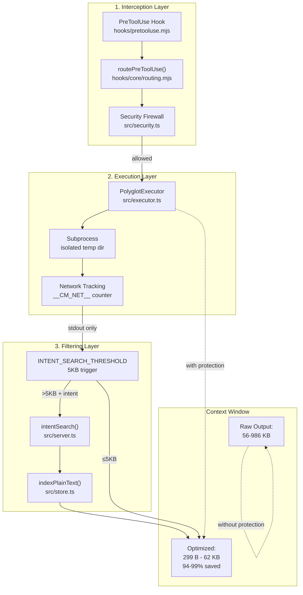
```mermaid
graph TB
    subgraph "1. Interception Layer"
        HOOK["PreToolUse Hook<br/>hooks/pretooluse.mjs"]
        ROUTING["routePreToolUse()<br/>hooks/core/routing.mjs"]
        SEC["Security Firewall<br/>src/security.ts"]
    end
    
    subgraph "2. Execution Layer"
        EXEC["PolyglotExecutor<br/>src/executor.ts"]
        SANDBOX["Subprocess<br/>isolated temp dir"]
        NET["Network Tracking<br/>__CM_NET__ counter"]
    end
    
    subgraph "3. Filtering Layer"
        THRESH["INTENT_SEARCH_THRESHOLD<br/>5KB trigger"]
        INTENT["intentSearch()<br/>src/server.ts"]
        INDEX["indexPlainText()<br/>src/store.ts"]
    end
    
    subgraph "Context Window"
        BEFORE["Raw Output:<br/>56-986 KB"]
        AFTER["Optimized:<br/>299 B - 62 KB<br/>94-99% saved"]
    end
    
    HOOK --> ROUTING
    ROUTING --> SEC
    SEC -->|"allowed"| EXEC
    
    EXEC --> SANDBOX
    SANDBOX --> NET
    NET -->|"stdout only"| THRESH
    
    THRESH -->|">5KB + intent"| INTENT
    INTENT --> INDEX
    INDEX --> AFTER
    
    THRESH -->|"≤5KB"| AFTER
    
    BEFORE -.->|"without protection"| BEFORE
    EXEC -.->|"with protection"| AFTER
```

**Diagram: Context Window Protection Flow**

The protection system operates in three stages: (1) **Interception** — hooks examine every tool call before execution, blocking or redirecting data-heavy tools, (2) **Execution** — sandboxed subprocesses run code and capture only stdout, tracking network bytes that never enter context, (3) **Filtering** — when output exceeds 5KB and an intent is provided, full content is indexed into FTS5 and only matching sections are returned.

**Sources:** [src/server.ts:330-535](), [src/executor.ts:130-180](), [hooks/core/routing.mjs:28-31]()

---

## Mechanism 1: Tool Call Redirection

The PreToolUse hook intercepts every tool call before it executes and applies routing rules to redirect data-heavy tools to sandboxed alternatives.

### Hook Invocation Chain

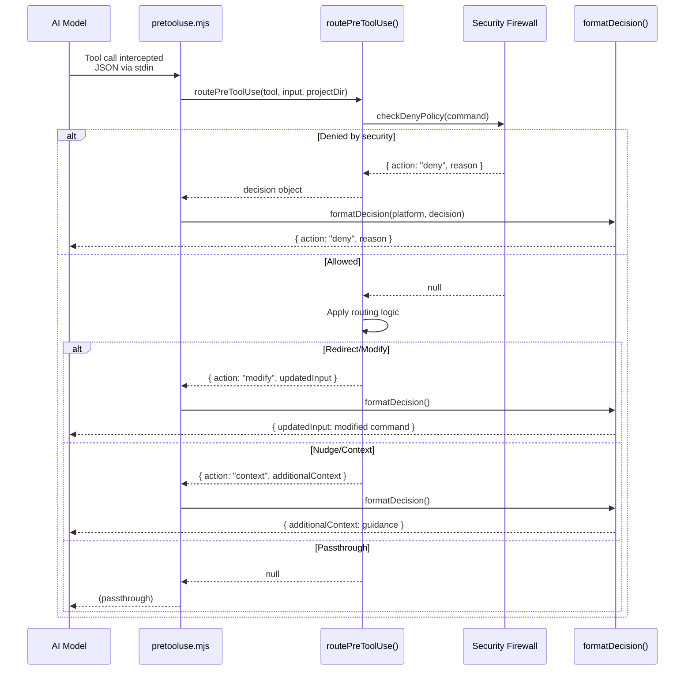
```mermaid
sequenceDiagram
    participant Model as AI Model
    participant Hook as pretooluse.mjs
    participant Route as routePreToolUse()
    participant Sec as Security Firewall
    participant Format as formatDecision()
    
    Model->>Hook: Tool call intercepted<br/>JSON via stdin
    Hook->>Route: routePreToolUse(tool, input, projectDir)
    
    Route->>Sec: checkDenyPolicy(command)
    alt Denied by security
        Sec-->>Route: { action: "deny", reason }
        Route-->>Hook: decision object
        Hook->>Format: formatDecision(platform, decision)
        Format-->>Model: { action: "deny", reason }
    else Allowed
        Sec-->>Route: null
        Route->>Route: Apply routing logic
        alt Redirect/Modify
            Route-->>Hook: { action: "modify", updatedInput }
            Hook->>Format: formatDecision()
            Format-->>Model: { updatedInput: modified command }
        else Nudge/Context
            Route-->>Hook: { action: "context", additionalContext }
            Hook->>Format: formatDecision()
            Format-->>Model: { additionalContext: guidance }
        else Passthrough
            Route-->>Hook: null
            Hook-->>Model: (passthrough)
        end
    end
```

**Diagram: PreToolUse Hook Routing Pipeline**

Every tool call passes through this pipeline. The hook returns one of four decisions: `deny` (block execution), `modify` (redirect/rewrite tool call), `context` (inject guidance), or `null` (passthrough).

**Sources:** [hooks/core/routing.mjs:5-11](), [hooks/core/routing.mjs:89-112](), [hooks/core/tool-naming.mjs:72-138]()

---

### Routing Rules by Tool Type

Tools are routed based on their data consumption characteristics. `routePreToolUse` applies specific logic to common tools:

| Original Tool | Pattern | Action | Redirect/Nudge |
|---------------|---------|--------|----------------|
| `Bash` | `curl`, `wget`, `fetch()` | `modify` | Redirects to `ctx_execute` [hooks/core/routing.mjs:84-110]() |
| `Read` / `cat` | Any file read | `context` | Injects `READ_GUIDANCE` suggesting `ctx_execute_file` [hooks/routing-block.mjs:77-80]() |
| `Grep` | Any search | `context` | Injects `GREP_GUIDANCE` suggesting `ctx_execute` [hooks/routing-block.mjs:81-84]() |
| `Agent` / `Task` | Subagent spawn | `modify` | Injects `ROUTING_BLOCK` into the prompt [tests/core/routing.test.ts:15-25]() |
| `WebFetch` | URL access | `deny` | Suggests `ctx_fetch_and_index` [hooks/core/routing.mjs:28-31]() |

**Sources:** [hooks/core/routing.mjs:13-31](), [hooks/routing-block.mjs:77-91]()

---

### ROUTING_BLOCK Injection for Subagents

When `Agent` tools spawn subagents, the hook injects a structured XML block into fields like `prompt`, `request`, or `objective` to teach the subagent about context-mode tools.

**Structure of ROUTING_BLOCK:**

| Section | Purpose | Content |
|---------|---------|---------|
| `<priority_instructions>` | Motivation | "Every byte a tool returns enters your conversation memory... The context-mode tools let you do the work in a sandbox." [hooks/routing-block.mjs:20-22]() |
| `<tool_selection_hierarchy>` | Tool ranking | 0. `ctx_search` (Memory), 1. `ctx_batch_execute` (Gather), 2. `ctx_search` (Follow-up), 3. `ctx_execute` (Processing). [hooks/routing-block.mjs:24-34]() |
| `<when_not_to_use>` | Constraints | "You intend to PROCESS the output... use ctx_batch_execute. You want to analyze a file... use ctx_execute_file." [hooks/routing-block.mjs:36-41]() |
| `<output_constraints>` | Artifact Policy | "Write artifacts (code, configs, PRDs) to files. Return only: file path + 1-line description." [hooks/routing-block.mjs:48-52]() |

The block uses `createToolNamer` to ensure tool names match the specific platform (e.g., `mcp__context-mode__ctx_execute` for Gemini vs `ctx_execute` for Cursor).

**Sources:** [hooks/routing-block.mjs:16-75](), [hooks/core/tool-naming.mjs:72-120]()

---

## Mechanism 2: Sandboxed Execution

The `PolyglotExecutor` provides the core isolation. It creates a unique temporary directory for each execution and captures only stdout.

### Subprocess Isolation Architecture

```mermaid
graph TB
    subgraph "MCP Server (Node.js)"
        TOOL["ctx_execute handler<br/>src/server.ts"]
        EXEC_CLASS["PolyglotExecutor<br/>src/executor.ts"]
        STATS["sessionStats<br/>src/server.ts"]
    end
    
    subgraph "Subprocess (Isolated)"
        direction TB
        TEMP["Temp Dir<br/>.ctx-mode-*"]
        SCRIPT["script.js|py|sh"]
        RUNTIME["Language Runtime"]
        STDOUT["stdout (Captured)"]
        STDERR["stderr (Captured)"]
    end
    
    subgraph "External"
        NET["Network Access"]
    end
    
    TOOL --> EXEC_CLASS
    EXEC_CLASS -->|"mkdtempSync"| TEMP
    TEMP --> SCRIPT
    EXEC_CLASS -->|"spawn"| RUNTIME
    RUNTIME --> SCRIPT
    RUNTIME --> NET
    NET -->|"__CM_NET__ metrics"| STDERR
    RUNTIME --> STDOUT
    
    STDOUT --> TOOL
    STDERR --> TOOL
    TOOL -->|"increment bytesSandboxed"| STATS
```

**Diagram: Sandboxed Subprocess Execution**

The executor handles 11 languages, including compiled ones like Rust and Go. For shell commands, it defaults to the project root, while other languages run inside the `tmpDir` sandbox.

**Sources:** [src/executor.ts:181-203](), [src/executor.ts:245-280](), [src/runtime.ts:28-40]()

---

### Network Tracking Implementation

For JavaScript/TypeScript execution, the system injects a wrapper to track network bytes consumed in the sandbox. This is reported via `stderr` using the `__CM_NET__` prefix.

**Instrumented Logic:**
- Intercepts `globalThis.fetch` to count response `byteLength`. [src/server.ts:395-401]()
- Wraps `http` and `https` modules to count chunk lengths in `response.on('data')`. [src/server.ts:413-424]()
- Emits the total count to `process.stderr` on exit. [src/server.ts:391-393]()

The server parses this metric and adds it to the session's `bytesSandboxed` stat, which is visible via `ctx_stats` but never occupies context space.

**Sources:** [src/server.ts:388-430](), [src/server.ts:444-450]()

---

## Mechanism 3: Intent-Driven Filtering

When execution output exceeds the 5KB threshold and an `intent` is provided, the `intentSearch` mechanism activates.

### intentSearch() Implementation

The `intentSearch` function ([src/server.ts:564-618]()) performs the following steps:
1. **Indexing**: Full output is passed to `ContentStore.indexPlainText`, which chunks and stores it in the FTS5 database. [src/server.ts:571-572]()
2. **Search**: A search is performed using the provided `intent` as the query, limited to the newly indexed source. [src/server.ts:575-577]()
3. **Term Extraction**: `getDistinctiveTerms` identifies key vocabulary from the output to help the model refine future searches. [src/server.ts:581]()
4. **Summary Generation**: Instead of the full text, the tool returns a summary including the number of matched sections and snippets. [src/server.ts:584-618]()

**Sources:** [src/server.ts:564-618](), [src/store.ts:15-16]()

---

## Enforcement and Progressive Throttling

### Progressive Search Throttling
To prevent the model from "context-flooding" by making dozens of small search calls, the `ctx_search` tool implements a sliding window throttle:
- **Calls 1-3**: Full results (limit 2 per query). [src/server.ts:842-845]()
- **Calls 4-8**: Reduced results (limit 1) + warning. [src/server.ts:846-855]()
- **Calls 9+**: Blocked with an error directing the model to use `ctx_batch_execute`. [src/server.ts:856-861]()

### Security Firewall
The system uses a "deny-only" firewall. It reads patterns from `settings.json` (e.g., `bashDeny`, `toolDeny`) and evaluates them before execution.
- `evaluateCommandDenyOnly`: Checks shell commands against regex patterns. [src/security.ts:19]()
- `evaluateFilePath`: Prevents reading sensitive files like `.env` or `.git/config`. [src/security.ts:22]()

**Sources:** [src/server.ts:18-23](), [src/server.ts:842-861](), [src/security.ts:1-300]()

---

## Benchmarks and Savings

| Component | Raw Data | Context Impact | Savings |
|-----------|----------|----------------|---------|
| `Bash(curl)` | 60 KB | ~400 B (Redirect msg) | 99.3% |
| `ctx_execute` | 100 MB | ~1 KB (stdout) | 99.9% |
| `ctx_search` | 10 MB | ~2 KB (Top matches) | 99.9% |
| `ctx_batch_execute` | 500 KB | ~5 KB (Indexed summary) | 99.0% |

**Aggregate Performance**: In a typical research session involving 50+ tool calls, the system maintains a context window footprint of <10,000 tokens, compared to 200,000+ tokens without protection.

**Sources:** [hooks/routing-block.mjs:20-22](), [src/server.ts:62-63]()

---

<<< SECTION: 3.2 Session Continuity [3-2-session-continuity] >>>

# Session Continuity

<details>
<summary>Relevant source files</summary>

The following files were used as context for generating this wiki page:

- [cli.bundle.mjs](cli.bundle.mjs)
- [docs/adr/0004-stats-strict-compression-formula.md](docs/adr/0004-stats-strict-compression-formula.md)
- [hooks/session-db.bundle.mjs](hooks/session-db.bundle.mjs)
- [hooks/session-directive.mjs](hooks/session-directive.mjs)
- [hooks/session-extract.bundle.mjs](hooks/session-extract.bundle.mjs)
- [hooks/session-helpers.mjs](hooks/session-helpers.mjs)
- [hooks/session-snapshot.bundle.mjs](hooks/session-snapshot.bundle.mjs)
- [release-notes-v1.0.148.md](release-notes-v1.0.148.md)
- [server.bundle.mjs](server.bundle.mjs)
- [src/session/analytics.ts](src/session/analytics.ts)
- [src/session/db.ts](src/session/db.ts)
- [src/session/extract.ts](src/session/extract.ts)
- [src/session/snapshot.ts](src/session/snapshot.ts)
- [tests/analytics/format-report.test.ts](tests/analytics/format-report.test.ts)
- [tests/session/detect-locale-esm.test.ts](tests/session/detect-locale-esm.test.ts)
- [tests/session/extract-multilang.test.ts](tests/session/extract-multilang.test.ts)
- [tests/session/real-bytes-stats.test.ts](tests/session/real-bytes-stats.test.ts)
- [tests/session/session-extract.test.ts](tests/session/session-extract.test.ts)
- [tests/session/session-pipeline.test.ts](tests/session/session-pipeline.test.ts)
- [tests/session/session-snapshot.test.ts](tests/session/session-snapshot.test.ts)

</details>


Session continuity ensures that when the AI agent's context window fills up and compacts (dropping old messages), the agent doesn't forget which files it was editing, what tasks are in progress, what errors were resolved, and what the user last requested. Context-mode captures meaningful events during the session, persists them in a SQLite database, and restores working state automatically after compaction or when resuming with `--continue`.

**Scope:** This page covers the event extraction system, dual-storage architecture, snapshot building algorithm, and session restoration mechanism.

---

## The Problem

When an LLM's context window fills up, the platform automatically compacts the conversation by dropping older messages to free space. Without session tracking, this causes:

- **Lost file awareness** — The agent forgets which files it modified.
- **Forgotten tasks** — In-progress work is abandoned.
- **Repeated questions** — The agent asks "what were we doing?" after every compact.
- **Missing context** — Decisions, errors, and environment state vanish.

Session continuity solves this by persisting events to disk and injecting a compact resume snapshot when the conversation resets.

---

## Dual Storage Architecture

Session continuity uses two databases with distinct lifecycles:

1.  **SessionDB (Persistent):** Stores raw events captured by hooks. It survives process death and compaction [src/session/db.ts:2-7]().
2.  **ContentStore (Ephemeral FTS5):** Provides BM25 search over event data for on-demand retrieval. It is typically deleted on process exit [src/session/analytics.ts:134-135]().

### System Data Flow

The following diagram bridges the high-level concept to the code entities that manage the data flow.

Title: Session Continuity Data Flow
```mermaid
graph LR
    subgraph "Event Pipeline"
        TOOL["Tool Call<br/>(Edit, Bash, etc.)"]
        EXTRACT["extractEvents()<br/>src/session/extract.ts"]
        TOOL --> EXTRACT
    end
    
    subgraph "Persistent Storage"
        SESSIONDB[("SessionDB<br/>SQLite via SQLiteBase<br/>src/session/db.ts")]
        EXTRACT -->|"insertEvent()"| SESSIONDB
    end
    
    subgraph "Ephemeral Storage"
        FTS5[("ContentStore<br/>FTS5 + BM25<br/>server.bundle.mjs")]
        DIRECTIVE["buildSessionDirective()<br/>hooks/session-directive.mjs"]
        SESSIONDB -->|"getSessionEvents()"| DIRECTIVE
        DIRECTIVE -->|"writeSessionEventsFile()"| FTS5
        FTS5 -->|"Auto-index markdown"| FTS5
    end
    
    subgraph "Agent Context"
        AGENT["AI Agent Context"]
        DIRECTIVE -->|"~275 token directive"| AGENT
        AGENT -->|"ctx_search(source: 'session-events')"| FTS5
    end
```
**Sources:** [src/session/db.ts:2-18](), [hooks/session-directive.mjs:1-10](), [src/session/analytics.ts:4-10]()

---

## Event Extraction System

The `extractEvents` function (and `extractUserEvents` for prompts) analyzes tool calls and responses to generate structured events across 13 categories [src/session/extract.ts:1-15]().

Title: Event Extraction Pipeline
```mermaid
graph TB
    subgraph "Input Source"
        INPUT["HookInput<br/>src/session/extract.ts:41-47"]
    end
    
    subgraph "Extraction Logic"
        EXTRACT["extractEvents(input)<br/>src/session/extract.ts"]
        
        FILE["extractFileAndRule()<br/>src/session/extract.ts:142"]
        CWD["extractCwd()<br/>src/session/extract.ts:354"]
        ERROR["extractError()<br/>src/session/extract.ts:376"]
        GIT["extractGit()<br/>src/session/extract.ts:422"]
        TASK["extractTask()<br/>src/session/extract.ts:441"]
        PLAN["extractPlan()<br/>src/session/extract.ts:469"]
        ENV["extractEnv()<br/>src/session/extract.ts:560"]
        SKILL["extractSkill()<br/>src/session/extract.ts:582"]
        SUBAGENT["extractSubagent()<br/>src/session/extract.ts:600"]
        MCP["extractMcp()<br/>src/session/extract.ts:621"]
        DECISION["extractDecision()<br/>src/session/extract.ts:645"]
        
        INPUT --> EXTRACT
        EXTRACT --> FILE
        EXTRACT --> CWD
        EXTRACT --> ERROR
        EXTRACT --> GIT
        EXTRACT --> TASK
        EXTRACT --> PLAN
        EXTRACT --> ENV
        EXTRACT --> SKILL
        EXTRACT --> SUBAGENT
        EXTRACT --> MCP
        EXTRACT --> DECISION
    end
    
    subgraph "Output"
        EV["SessionEvent<br/>src/session/extract.ts:10-28"]
    end
    
    DECISION --> EV
    FILE --> EV
```
**Sources:** [src/session/extract.ts:10-28](), [src/session/extract.ts:142-645](), [hooks/session-extract.bundle.mjs:1-10]()

### Event Categories and Priorities

Events are assigned a priority from 1 (Critical) to 5 (Low) to guide the compaction budget [src/session/extract.ts:19-20]().

| Category | Priority | Code Trigger | Purpose |
| :--- | :--- | :--- | :--- |
| `file` | 1 | `Read`, `Write`, `Edit`, `apply_patch` | Tracks active working set [src/session/extract.ts:142-230](). |
| `rule` | 1 | `Read` of `CLAUDE.md`, etc. | Persists project-specific constraints [src/session/extract.ts:161-184](). |
| `task` | 1 | `TaskCreate`, `TaskUpdate`, `TodoWrite` | Tracks progress of sub-tasks [src/session/extract.ts:441-456](). |
| `cwd` | 2 | `Bash` (`cd` commands) | Maintains directory context [src/session/extract.ts:354-369](). |
| `git` | 2 | `Bash` (git operations) | Tracks version control state [src/session/extract.ts:422-435](). |
| `error` | 2 | Failed tool calls | Remembers what didn't work [src/session/extract.ts:376-394](). |
| `env` | 2 | `export`, `npm install`, `nvm use` | Environment setup persistence [src/session/extract.ts:560-576](). |
| `decision` | 2 | `AskUserQuestion` / User prompts | User-approved architecture/style choices [src/session/extract.ts:645-664](). |
| `mcp` | 3 | `mcp__*` tools | General plugin activity tracking [src/session/extract.ts:621-639](). |
| `intent` | 4 | `extractUserEvents` | Classifies user goal (e.g., "investigate") [tests/session/extract-multilang.test.ts:34-37](). |

---

## SessionDB: Persistent Storage

The `SessionDB` (implemented via `SQLiteBase`) manages the lifecycle of session data. It uses a hashed project directory path to ensure data is partitioned by worktree [hooks/session-db.bundle.mjs:1-15](), [src/session/db.ts:13-17]().

### Key Management Functions
- **`ensureSession`**: Initializes a session record in the `session_meta` table.
- **`insertEvent`**: Persists a `SessionEvent` to the `session_events` table [src/session/db.ts:1-10]().
- **`storeResume`**: Saves a generated XML snapshot into the `session_resume` table [src/session/db.ts:11-12]().
- **`getResume`**: Retrieves the most recent snapshot for restoration [src/session/db.ts:11-12]().

**Sources:** [src/session/db.ts:1-250](), [hooks/session-db.bundle.mjs:1-50]()

---

## Resume Snapshot Building

The `buildResumeSnapshot` function in `hooks/session-snapshot.bundle.mjs` (and `src/session/snapshot.ts`) transforms stored events into a concise XML block used during context compaction [hooks/session-snapshot.bundle.mjs:19-31]().

### Priority-Tiered Budgeting
The system attempts to include all events but trims based on priority if the output exceeds the token budget (typically ~2KB).

1.  **Tier 1 (Critical):** `active_files`, `task_state`, `rules`.
2.  **Tier 2 (High):** `decisions`, `environment`, `errors`, `git`.
3.  **Tier 3 (Normal/Low):** `subagents`, `skills`, `mcp_tools`, `intent`, `recent_user_messages`.

### Implementation Logic
The renderer iterates through categories, applying specific logic for each:
- **Files:** Dedupes by path and aggregates operation counts (e.g., `edit×3, read×1`) [hooks/session-snapshot.bundle.mjs:1-6]().
- **Tasks:** Filters out completed or failed tasks, showing only pending subjects [hooks/session-snapshot.bundle.mjs:11-14]().
- **Search Directives:** For each section, it provides a specific `ctx_search` query the agent can use to fetch full historical details from the FTS5 store [hooks/session-snapshot.bundle.mjs:1-6]().

**Sources:** [hooks/session-snapshot.bundle.mjs:1-31](), [src/session/snapshot.ts:1-50]()

---

## Session Restoration Lifecycle

The continuity lifecycle is driven by the Hook system, specifically coordinating between `PostToolUse` (capture) and `SessionStart` (restore).

### Restoration Steps (SessionStart)
1.  **Trigger:** The `SessionStart` hook fires when a session begins or resumes [hooks/session-helpers.mjs:3-5]().
2.  **Snapshot Retrieval:** It queries `SessionDB` for a `session_resume` record [src/session/db.ts:11-12]().
3.  **Knowledge Base Prep:**
    - Events are formatted into a markdown file (`session-events.md`).
    - The markdown is indexed into the ephemeral FTS5 `ContentStore` [src/session/analytics.ts:134-135]().
4.  **Directive Injection:** A ~275 token directive is injected into the prompt, containing the XML snapshot and instructions on how to search the `session-events` source [hooks/session-directive.mjs:31-211]().

### Continuity Reporting
The `AnalyticsEngine` computes context-window savings by comparing the raw bytes returned by tools against the bytes actually sent to the LLM context [src/session/analytics.ts:1-10](). It reports:
- **`snapshotBytes`**: Bytes restored from the compact snapshot [src/session/analytics.ts:97-98]().
- **`snapshotsConsumed`**: Number of times the session has survived compaction [src/session/analytics.ts:99-100]().

**Sources:** [src/session/analytics.ts:88-125](), [hooks/session-helpers.mjs:1-25](), [hooks/session-directive.mjs:1-10]()

---

<<< SECTION: 3.3 Knowledge Base (FTS5) [3-3-knowledge-base-fts5] >>>

# Knowledge Base (FTS5)

<details>
<summary>Relevant source files</summary>

The following files were used as context for generating this wiki page:

- [src/db-base.ts](src/db-base.ts)
- [src/server.ts](src/server.ts)
- [src/store.ts](src/store.ts)
- [tests/core/search.test.ts](tests/core/search.test.ts)
- [tests/core/server.test.ts](tests/core/server.test.ts)
- [tests/session/continuity.test.ts](tests/session/continuity.test.ts)
- [tests/session/session-db.test.ts](tests/session/session-db.test.ts)
- [tests/store.test.ts](tests/store.test.ts)
- [tests/util/db-base-platform-gate.test.ts](tests/util/db-base-platform-gate.test.ts)
- [vitest.config.ts](vitest.config.ts)

</details>


The Knowledge Base is a persistent SQLite database (per project) using FTS5 (Full-Text Search 5) virtual tables to enable BM25-ranked search over chunked content. It solves the problem of keeping large data (documentation, API responses, log files) out of the AI's context window while preserving the ability to retrieve specific sections on-demand. Content is indexed via `ctx_index` or `ctx_fetch_and_index` and queried via `ctx_search` or `ctx_batch_execute` with a three-layer fallback for typos and partial matches.

For how the indexing and search tools work from a user perspective, see [Content Indexing (ctx_index)](#4.4) and [Content Search (ctx_search)](#4.5).

---

## Architecture Overview

The knowledge base is implemented in the `ContentStore` class [src/store.ts:156](). It utilizes two FTS5 virtual tables (`chunks` with Porter stemming and `chunks_trigram` with Trigram tokenization) and a vocabulary table for fuzzy correction [src/store.ts:35-43]().

Unlike previous ephemeral versions, the Knowledge Base now uses persistent storage resolved per project directory [src/server.ts:39-43]().

**Dual-Table Design**

```mermaid
graph TB
    subgraph "ContentStore Class [src/store.ts]"
        API["Public API<br/>index()<br/>searchWithFallback()<br/>getDistinctiveTerms()"]
    end
    
    subgraph "SQLite Database (Persistent [src/db-base.ts])"
        SOURCES["sources table<br/>id, label, content_hash"]
        PORTER["chunks (FTS5)<br/>title, content, source_id<br/>tokenize=porter unicode61"]
        TRIGRAM["chunks_trigram (FTS5)<br/>title, content, source_id<br/>tokenize=trigram"]
        VOCAB["vocabulary table<br/>word (PRIMARY KEY)"]
    end
    
    subgraph "Prepared Statements Cache"
        STMT_SEARCH["#stmtSearchPorter<br/>#stmtSearchPorterFiltered"]
        STMT_TRIGRAM["#stmtSearchTrigram<br/>#stmtSearchTrigramFiltered"]
        STMT_FUZZY["#stmtFuzzyVocab"]
        STMT_INSERT["#stmtInsertChunk<br/>#stmtInsertChunkTrigram"]
    end
    
    API --> STMT_SEARCH
    API --> STMT_TRIGRAM
    API --> STMT_FUZZY
    API --> STMT_INSERT
    
    STMT_SEARCH --> PORTER
    STMT_TRIGRAM --> TRIGRAM
    STMT_FUZZY --> VOCAB
    STMT_INSERT --> PORTER
    STMT_INSERT --> TRIGRAM
    
    PORTER -.->|"JOIN on source_id"| SOURCES
    TRIGRAM -.->|"JOIN on source_id"| SOURCES
```

**Sources:**
- [src/store.ts:24-40]()
- [src/store.ts:156-222]()
- [src/db-base.ts:1-20]()

---

## Database Schema

The schema supports both stemming (Porter) and substring matching (Trigram). FTS5 internal columns like `rank` are used for BM25 scoring [src/store.ts:32-40]().

**Schema Evolution (Migration)**
The system detects old 4-column FTS5 schemas and migrates them to a 10-column schema (8 user-defined + 2 hidden) [tests/store.test.ts:96-184]().

| Table | Type | Tokenizer | Purpose |
|-------|------|-----------|---------|
| `sources` | Regular | — | Metadata for indexed content (label, hash, timestamp) [src/store.ts:224-240]() |
| `chunks` | FTS5 | `porter unicode61` | Standard stemming: "updates" → "update" [src/store.ts:242-250]() |
| `chunks_trigram` | FTS5 | `trigram` | Substring matching: "middle" matches "middleware" [src/store.ts:252-260]() |
| `vocabulary` | Regular | — | Target words for Levenshtein fuzzy correction [src/store.ts:262-265]() |

**Sources:**
- [src/store.ts:224-270]()
- [tests/store.test.ts:52-94]()

---

## Chunking Strategies

Content is split into manageable pieces to optimize BM25 length normalization and search result usability. The maximum chunk size is 4096 bytes [src/store.ts:151]().

### Markdown Chunking
Markdown is split by H1-H4 headings. Code blocks are kept intact within their respective sections [src/store.ts:752-869]().

**Algorithm Flow**

```mermaid
graph TB
    INPUT["Markdown Input"]
    SCAN["Line Scanner [src/store.ts:778]"]
    HEADING["Heading Match? [src/store.ts:784]"]
    CODE["Code Fence? [src/store.ts:795]"]
    FLUSH["flush() [src/store.ts:840]"]
    
    EMIT["Emit Chunk<br/>Title: Stack.join(' > ')"]
    
    INPUT --> SCAN
    SCAN --> HEADING
    SCAN --> CODE
    HEADING --> FLUSH
    CODE --> SCAN
    FLUSH --> EMIT
```

### JSON Chunking
JSON is walked recursively. Objects are split by key, and arrays are batched by size [src/store.ts:921-1056](). The system uses `#findIdentityField` to find descriptive keys (like `id`, `name`, `title`) for chunk titles [src/store.ts:978-991]().

**Sources:**
- [src/store.ts:752-869]() (Markdown)
- [src/store.ts:921-1056]() (JSON)

---

## Multi-Layer Search Fallback

The `searchWithFallback` method implements a progressive search cascade to maximize recall while maintaining precision [src/store.ts:566-631]().

**Search Cascade Diagram**

```mermaid
graph TD
    Q["Query: 'autentication useEff'"]
    
    L1A["Layer 1a: Porter AND [src/store.ts:575]"]
    L1B["Layer 1b: Porter OR [src/store.ts:581]"]
    L2A["Layer 2a: Trigram AND [src/store.ts:587]"]
    L2B["Layer 2b: Trigram OR [src/store.ts:593]"]
    L3["Layer 3: Fuzzy Correct [src/store.ts:602]"]
    
    Q --> L1A
    L1A -- "No Results" --> L1B
    L1B -- "No Results" --> L2A
    L2A -- "No Results" --> L2B
    L2B -- "No Results" --> L3
    L3 -- "Corrected: 'authentication useEffect'" --> L1A
    
    L1A -- "Match" --> R["Result (rrf)"]
    L3 -- "Match" --> RF["Result (rrf-fuzzy)"]
```

**Search Layers:**
1.  **Porter (Stemming):** Handles variations like "running" vs "run" [src/store.ts:470-497]().
2.  **Trigram (Substrings):** Handles partial matches like "useEff" for "useEffect" [src/store.ts:501-534]().
3.  **Fuzzy (Levenshtein):** Corrects typos like "autentication" to "authentication" [src/store.ts:538-562]().

**Sources:**
- [src/store.ts:566-631]()
- [tests/core/search.test.ts:42-117]()

---

## BM25 Ranking and Snippets

FTS5 scores results using BM25. Titles are weighted 2.0x higher than content [src/store.ts:261, 289]().

### Snippet Extraction
Instead of simple truncation, `extractSnippet` uses FTS5 `highlight()` markers (`\x02` and `\x03`) to find match positions and build context windows [src/server.ts:257-324]().

**Extraction Process:**
1.  **Highlight:** FTS5 returns content with STX/ETX markers around matches [src/server.ts:227-230]().
2.  **Positions:** `positionsFromHighlight` extracts character offsets [src/server.ts:232-250]().
3.  **Windowing:** The system creates 300-character windows around matches and merges overlaps [src/server.ts:275-300]().

**Sources:**
- [src/store.ts:261-290]()
- [src/server.ts:227-324]()

---

## Storage and Maintenance

The Knowledge Base utilizes `better-sqlite3` or the built-in `node:sqlite` adapter depending on the environment [src/db-base.ts:186-210]().

### Lifecycle Management
- **Persistence:** Content is stored in the project's storage directory, typically `~/.config/context-mode/content/` [src/session/db.ts:39-40]().
- **Cleanup:** `cleanupStaleContentDBs` removes databases older than a configurable threshold (default 30 days) or those held by dead processes [src/store.ts:203-222]().
- **Concurrency:** Uses WAL (Write-Ahead Logging) and a `withRetry` mechanism to handle multiple processes accessing the same project database [src/db-base.ts:15-20, 271-289]().

**Sources:**
- [src/store.ts:203-222]()
- [src/db-base.ts:271-289]()
- [src/session/db.ts:39-40]()

---

<<< SECTION: 4 MCP Tools [4-mcp-tools] >>>

# MCP Tools

<details>
<summary>Relevant source files</summary>

The following files were used as context for generating this wiki page:

- [README.md](README.md)
- [docs/platform-support.md](docs/platform-support.md)
- [src/server.ts](src/server.ts)
- [tests/core/server.test.ts](tests/core/server.test.ts)
- [tests/session/continuity.test.ts](tests/session/continuity.test.ts)

</details>


## Purpose and Scope

This page provides a comprehensive reference for all 9 MCP tools exposed by context-mode's server. These tools implement the context window protection strategy by sandboxing execution, indexing content into FTS5, and returning only relevant excerpts instead of raw data. Each tool is registered in `src/server.ts` with Zod schema validation and returns a `ToolResult` structure tracked by `sessionStats`.

For details on how tools are intercepted and routed by hooks, see [Tool Overview and Routing](#4.1). For platform-specific hook configurations that enforce tool usage, see [Platform Adapters](#6).

## Tool Catalog

The MCP server registers 9 tools on startup. Each tool targets a specific context optimization pattern:

| Tool | Primary Use Case | Input Schema | Context Savings | Code Location |
|------|------------------|--------------|-----------------|---------------|
| `ctx_batch_execute` | Replace 30+ execute + 10+ search calls with one round trip | commands[], queries[] | 986 KB → 62 KB | [src/server.ts:1192-1399]() |
| `ctx_execute` | Sandboxed code execution in 11 languages | language, code, timeout, background, intent | 56 KB → 299 B | [src/server.ts:330-535]() |
| `ctx_execute_file` | Process files without loading content into context | path, language, code, timeout, intent | 45 KB → 155 B | [src/server.ts:624-749]() |
| `ctx_index` | Chunk and store content in FTS5 knowledge base | content OR path, source | 60 KB → 40 B | [src/server.ts:755-836]() |
| `ctx_search` | Query indexed content with fallback strategies | queries[], limit, source | On-demand retrieval | [src/server.ts:849-980]() |
| `ctx_fetch_and_index` | Fetch URL, detect content type, chunk and index | url, source | 60 KB → 40 B | [src/server.ts:1065-1186]() |
| `ctx_stats` | Report context consumption and session statistics | none | Diagnostic output | [src/server.ts:1405-1620]() |
| `ctx_doctor` | Diagnose installation and runtime environment | none | Diagnostic command | [src/server.ts:1623-1664]() |
| `ctx_upgrade` | Upgrade plugin to latest version from GitHub | none | Upgrade command | [src/server.ts:1667-1709]() |

**Sources:** [src/server.ts:15-16](), [src/server.ts:330-1709](), [README.md:40-51]()

## Server Architecture and Tool Registration

```mermaid
graph TB
    subgraph "Server Initialization"
        MAIN["main()<br/>server.ts:1715"]
        SERVER["McpServer<br/>name: 'context-mode'<br/>version: VERSION"]
        TRANSPORT["StdioServerTransport"]
    end
    
    subgraph "Tool Registration (server.registerTool)"
        EXEC["ctx_execute<br/>line 330<br/>z.object({language, code, timeout, background, intent})"]
        EXECFILE["ctx_execute_file<br/>line 624<br/>z.object({path, language, code, timeout, intent})"]
        INDEX["ctx_index<br/>line 755<br/>z.object({content?, path?, source?})"]
        SEARCH["ctx_search<br/>line 849<br/>z.object({queries[], limit, source?})"]
        BATCH["ctx_batch_execute<br/>line 1192<br/>z.object({commands[], queries[], timeout})"]
        FETCH["ctx_fetch_and_index<br/>line 1065<br/>z.object({url, source?})"]
        STATS["ctx_stats<br/>line 1405<br/>z.object({})"]
        DOCTOR["ctx_doctor<br/>line 1623<br/>z.object({})"]
        UPGRADE["ctx_upgrade<br/>line 1667<br/>z.object({})"]
    end
    
    subgraph "Execution Dependencies"
        POLY["PolyglotExecutor<br/>src/executor.ts<br/>11 languages"]
        STORE["ContentStore<br/>src/store.ts<br/>FTS5 + BM25"]
        SECURITY["checkDenyPolicy()<br/>checkNonShellDenyPolicy()<br/>checkFilePathDenyPolicy()"]
    end
    
    subgraph "Response Tracking"
        TRACK["trackResponse()<br/>line 98<br/>sessionStats.bytesReturned"]
        TRACKIDX["trackIndexed()<br/>line 109<br/>sessionStats.bytesIndexed"]
        RESULT["ToolResult<br/>content: Array<{type, text}><br/>isError?: boolean"]
    end
    
    MAIN --> SERVER
    MAIN --> TRANSPORT
    SERVER --> EXEC & EXECFILE & INDEX & SEARCH & BATCH & FETCH & STATS & DOCTOR & UPGRADE
    
    EXEC --> POLY
    EXEC --> SECURITY
    EXECFILE --> POLY
    EXECFILE --> SECURITY
    BATCH --> POLY
    BATCH --> SECURITY
    
    INDEX --> STORE
    SEARCH --> STORE
    FETCH --> STORE
    
    EXEC & EXECFILE & BATCH --> TRACKIDX
    INDEX & FETCH --> TRACKIDX
    
    EXEC & EXECFILE & INDEX & SEARCH & BATCH & FETCH & STATS & DOCTOR & UPGRADE --> TRACK
    TRACK --> RESULT
```

**Tool Registration Pattern**: Each tool calls `server.registerTool(name, {title, description, inputSchema}, handler)` where `inputSchema` is a Zod object validated before the handler executes. Invalid inputs are rejected by the MCP SDK before reaching the handler function.

**Sources:** [src/server.ts:12-15](), [src/server.ts:92-101](), [src/server.ts:330-1709]()

## Tool Interaction Flow

```mermaid
sequenceDiagram
    participant Agent as AI Agent
    participant Batch as ctx_batch_execute
    participant Exec as ctx_execute
    participant Store as ContentStore
    participant Search as ctx_search
    participant Track as trackResponse()
    
    Note over Agent,Track: Primary Tool Pattern (94-99% savings)
    Agent->>Batch: {commands: [{label, command}], queries: [...]}
    
    loop For each command
        Batch->>Exec: executor.execute({language: "shell", code, timeout})
        Exec->>Exec: Security: checkDenyPolicy(code)
        Exec->>Track: Track stdout bytes
        Exec-->>Batch: {stdout, exitCode}
    end
    
    Batch->>Store: store.index({content: allOutputs, source})
    Store-->>Batch: {totalChunks, sourceId}
    
    loop For each query
        Batch->>Store: store.searchWithFallback(query, 3, source)
        Store-->>Batch: results[]
        Batch->>Batch: extractSnippet(content, query, 3000)
    end
    
    Batch->>Track: trackResponse("ctx_batch_execute", {content})
    Track-->>Agent: {content, isError: false}
    
    Note over Agent,Track: Intent-Driven Filtering (>5KB output)
    Agent->>Exec: {language: "python", code, intent: "HTTP errors"}
    Exec->>Exec: executor.execute({language, code})
    Exec->>Exec: Check: byteLength(stdout) > 5000?
    Exec->>Store: intentSearch(stdout, intent, source)
    Store->>Store: indexPlainText(stdout, source)
    Store->>Store: searchWithFallback(intent, 5, source)
    Store-->>Exec: {results, distinctiveTerms}
    Exec->>Track: trackResponse with titles + previews only
    Track-->>Agent: "Indexed N sections, M matched intent"
```

**Primary Tool**: `ctx_batch_execute` is the recommended entry point. It combines multiple `ctx_execute` calls, auto-indexes all output, and runs multiple search queries in a single round trip. This replaces patterns like "execute 30 commands, search 10 times" with one tool call.

**Intent-Driven Filtering**: When `intent` is provided and output exceeds `INTENT_SEARCH_THRESHOLD` (5000 bytes), the tool indexes full output into the knowledge base and returns only matching sections plus searchable vocabulary. The constant is defined at [src/server.ts:562]().

**Sources:** [src/server.ts:1192-1399](), [src/server.ts:330-535](), [src/server.ts:562-618]()

## Context Savings Mechanism

### Core Strategy

Context-mode achieves 94-99% savings through three mechanisms:

1. **Sandboxed execution** - Raw data never enters context window (tracked as `sessionStats.bytesSandboxed`)
2. **Persistent storage** - Full content stays in FTS5 database (tracked as `sessionStats.bytesIndexed`)
3. **Smart extraction** - Only relevant snippets returned via `extractSnippet()` function

```mermaid
graph LR
    subgraph "Without context-mode"
        RAW["curl https://api.github.com/repos/x/issues<br/>59 KB JSON response"]
        CTX1["Context Window<br/>+59 KB"]
    end
    
    subgraph "With ctx_execute (no intent)"
        SANDBOX1["executor.execute({<br/>language: 'shell',<br/>code: 'curl ... &#124; jq .title'<br/>})<br/>stdout: 20 issue titles"]
        CTX2["Context Window<br/>+1.1 KB"]
    end
    
    subgraph "With ctx_execute (intent-driven)"
        SANDBOX2["executor.execute({<br/>code: 'curl ...',<br/>intent: 'bugs'<br/>})"]
        INDEX["intentSearch()<br/>↓<br/>store.indexPlainText()<br/>59 KB → FTS5"]
        SEARCH["searchWithFallback()<br/>returns 5 matches"]
        SNIPPET["extractSnippet()<br/>1500 char windows"]
        CTX3["Context Window<br/>+299 B preview"]
    end
    
    RAW --> CTX1
    SANDBOX1 --> CTX2
    SANDBOX2 --> INDEX
    INDEX --> SEARCH
    SEARCH --> SNIPPET
    SNIPPET --> CTX3
    
    style CTX1 stroke-dasharray: 5 5
```

**Threshold Logic**: When `Buffer.byteLength(stdout) > INTENT_SEARCH_THRESHOLD` and `intent.trim().length > 0`, the handler routes to `intentSearch()` instead of returning raw stdout. This function:

1. Indexes full output via `store.indexPlainText(stdout, source)`
2. Searches for matching sections: `store.searchWithFallback(intent, maxResults, source)`
3. Returns title + preview format instead of full content
4. Includes `distinctiveTerms` for follow-up queries

**Sources:** [src/server.ts:562-618](), [src/server.ts:509-518](), [src/server.ts:98-107]()

## Schema Validation and Input Processing

All tool inputs are validated by Zod schemas before handler execution. The MCP SDK rejects invalid requests automatically.

### Example: ctx_execute Schema

```typescript
// src/server.ts:335-375
z.object({
  language: z.enum([
    "javascript", "typescript", "python", "shell", "ruby", 
    "go", "rust", "php", "perl", "r", "elixir"
  ]),
  code: z.string(),
  timeout: z.number().optional().default(30000),
  background: z.boolean().optional().default(false),
  intent: z.string().optional()
})
```

**Available Languages**: The `language` enum is synchronized with `PolyglotExecutor` capabilities. Runtime detection happens at server startup via `detectRuntimes()` ([src/server.ts:90]()). Available languages are computed by `getAvailableLanguages(runtimes)` and used in tool descriptions.

**Timeout Handling**: Default timeout is 30 seconds (30000 ms). When `timeout` expires:
- Normal mode: Process is killed, partial stdout returned as error
- Background mode (`background: true`): Process detaches, partial stdout returned as success with note "_(process backgrounded after Nms — still running)_"

**Sources:** [src/server.ts:335-375](), [src/runtime.ts:141-158](), [src/server.ts:452-485]()

## Output Processing and Truncation

### Smart Truncation in PolyglotExecutor

The `executor.execute()` method applies smart truncation to stdout before returning it to the tool handler. This prevents massive outputs from consuming the internal buffer. The truncation logic is implemented in `src/executor.ts` using `smartTruncate()`.

### Snippet Extraction for Search Results

The `extractSnippet()` function implements context-aware extraction instead of naive truncation:

```mermaid
graph TB
    INPUT["extractSnippet(content, query, maxLen=1500, highlighted?)"]
    
    CHECK1{"content.length <= maxLen?"}
    RETURN1["return content"]
    
    CHECK2{"highlighted provided?"}
    POSITIONS1["positionsFromHighlight(highlighted)<br/>Parse STX/ETX markers"]
    POSITIONS2["indexOf on query terms<br/>fallback strategy"]
    
    MERGE["positions.sort()<br/>Merge overlapping windows<br/>WINDOW = 300 chars"]
    
    EXTRACT["Collect windows until maxLen<br/>Add '...' ellipsis markers"]
    
    INPUT --> CHECK1
    CHECK1 -->|Yes| RETURN1
    CHECK1 -->|No| CHECK2
    CHECK2 -->|Yes| POSITIONS1
    CHECK2 -->|No| POSITIONS2
    POSITIONS1 --> MERGE
    POSITIONS2 --> MERGE
    MERGE --> EXTRACT
```

**Highlight Markers**: FTS5's `highlight()` function wraps matches with STX (`\x02`) and ETX (`\x03`) markers. The `positionsFromHighlight()` function ([src/server.ts:227-250]()) parses these to find exact match positions in the original (marker-free) text. This is the authoritative source because FTS5 uses the same tokenizer that produced the BM25 match.

**Window Merging**: Overlapping windows are merged to avoid duplicate content. A 300-character window around each match position is computed, and adjacent/overlapping windows are combined.

**Sources:** [src/server.ts:257-324](), [src/server.ts:227-250](), [src/server.ts:219-220]()

## Response Tracking and Statistics

All tool responses pass through `trackResponse()` which updates `sessionStats` before returning the `ToolResult`:

```typescript
// src/server.ts:98-107
function trackResponse(toolName: string, response: unknown): unknown {
  const r = response as { content: Array<{ type: string; text: string }> };
  if (!r?.content) return response;
  const bytes = r.content.reduce((sum, c) => sum + Buffer.byteLength(c.text || ""), 0);
  sessionStats.calls[toolName] = (sessionStats.calls[toolName] || 0) + 1;
  sessionStats.bytesReturned[toolName] = (sessionStats.bytesReturned[toolName] || 0) + bytes;
  return response;
}
```

**Savings Calculation**: The `ctx_stats` tool computes savings ratio as:

```typescript
// src/server.ts:1428-1433
const keptOut = sessionStats.bytesIndexed + sessionStats.bytesSandboxed;
const totalProcessed = keptOut + totalBytesReturned;
const reductionPct = totalProcessed > 0 
  ? ((1 - totalBytesReturned / totalProcessed) * 100).toFixed(0) 
  : "0";
```

**Network Tracking**: JavaScript/TypeScript execution wraps code with instrumentation that tracks `fetch()` and `http/https` module calls. Network bytes are reported via `__CM_NET__:N` stderr marker ([src/server.ts:389-450]()) and accumulated in `sessionStats.bytesSandboxed`.

**Sources:** [src/server.ts:98-107](), [src/server.ts:1428-1433](), [src/server.ts:389-450]()

## Progressive Throttling (ctx_search)

The `ctx_search` tool implements progressive throttling to prevent context flooding from excessive search calls:

| Window | Calls | Results per Query | Behavior |
|--------|-------|-------------------|----------|
| 0-60s | 1-3 | 2 (or user limit) | Normal operation |
| 0-60s | 4-8 | 1 (forced) | Throttled + warning |
| 0-60s | 9+ | 0 (blocked) | Refuse + demand batching |

**Throttle State**: Tracked by module-level variables:
- `searchCallCount` ([src/server.ts:843]())
- `searchWindowStart` ([src/server.ts:844]())
- Constants: `SEARCH_WINDOW_MS = 60000`, `SEARCH_MAX_RESULTS_AFTER = 3`, `SEARCH_BLOCK_AFTER = 8`

**Blocked Response** (after 8 calls):
```
BLOCKED: N search calls in Xs. You're flooding context. 
STOP making individual search calls. 
Use batch_execute(commands, queries) for your next research step.
```

**Sources:** [src/server.ts:842-848](), [src/server.ts:895-913]()

## Security Integration

Each execution tool checks deny policies before running code:

### Shell Code Security

```mermaid
graph TB
    INPUT["ctx_execute({language: 'shell', code})"]
    
    CHECK1["checkDenyPolicy(code, 'execute')<br/>src/server.ts:121"]
    POLICIES["readBashPolicies(CLAUDE_PROJECT_DIR)<br/>src/security.ts"]
    EVAL["evaluateCommandDenyOnly(code, policies)"]
    
    DENY{"decision === 'deny'?"}
    ERROR["return trackResponse({<br/>content: 'Command blocked...',<br/>isError: true<br/>})"]
    
    ALLOW["return null<br/>(proceed to execution)"]
    
    INPUT --> CHECK1
    CHECK1 --> POLICIES
    POLICIES --> EVAL
    EVAL --> DENY
    DENY -->|Yes| ERROR
    DENY -->|No| ALLOW
```

### Non-Shell Code Security

For non-shell languages, the handler calls `checkNonShellDenyPolicy()` which:

1. Extracts shell commands via `extractShellCommands(code, language)` from `src/security.ts`
2. Tests each extracted command against Bash deny patterns
3. Blocks if any embedded command matches a deny rule

**Example**: Python code containing `subprocess.run(['sudo', 'rm', '-rf', '/'])` is blocked if `Bash(sudo *)` is in the deny list.

**File Path Security**: `ctx_execute_file` additionally checks file paths with `checkFilePathDenyPolicy()` ([src/server.ts:178-198]()) which evaluates against `Read(...)` deny globs.

**Fail-Open Philosophy**: All security checks are wrapped in try-catch that fails open on exceptions ([src/server.ts:137-140]()). This ensures server-side checks never block the plugin if security config is malformed. Hooks are the primary enforcement layer.

**Sources:** [src/server.ts:121-172](), [src/server.ts:670-680](), [src/security.ts:110-142]()

## Lazy Singleton Pattern (ContentStore)

The `ContentStore` instance is created on-demand when any tool first needs it:

```typescript
// src/server.ts:49-79
let _store: ContentStore | null = null;

function getStore(): ContentStore {
  if (!_store) _store = new ContentStore();
  maybeIndexSessionEvents(_store);  // Auto-index session-events.md files
  return _store;
}
```

**Auto-Indexing**: Every `getStore()` call scans for `*-events.md` files written by the SessionStart hook ([src/server.ts:60-73]()). Files are indexed with `source: "session-events"` and then deleted to prevent double-indexing.

**Lifecycle**: The store is cleaned up on process exit via `shutdown()` ([src/server.ts:1723-1726]()), which removes the ephemeral database file.

**Sources:** [src/server.ts:49-79](), [src/server.ts:1723-1726]()

## Utility Tools (Meta-Tools)

Three tools delegate to CLI commands or internal analytics instead of executing logic directly:

| Tool | Returns | LLM Action Required |
|------|---------|---------------------|
| `ctx_doctor` | `node <pluginRoot>/build/cli.js doctor` | Must execute via Bash/shell_execute |
| `ctx_upgrade` | `node <pluginRoot>/build/cli.js upgrade` | Must execute via Bash/shell_execute |
| `ctx_stats` | Formatted markdown report | Direct display (no execution) |

**Plugin Root Resolution**: Both `ctx_doctor` and `ctx_upgrade` compute `pluginRoot` as `dirname(dirname(fileURLToPath(import.meta.url)))` ([src/server.ts:1634](), [src/server.ts:1679]()), which resolves to the package root.

**Why Meta-Tools?**: Direct implementation would duplicate CLI logic. By returning commands, the LLM executes them via its native shell tool, and results are tracked in normal tool stats.

**Sources:** [src/server.ts:1623-1709](), [src/server.ts:1405-1620]()

---

<<< SECTION: 4.1 Tool Overview and Routing [4-1-tool-overview-and-routing] >>>

# Tool Overview and Routing

<details>
<summary>Relevant source files</summary>

The following files were used as context for generating this wiki page:

- [README.md](README.md)
- [docs/platform-support.md](docs/platform-support.md)
- [hooks/core/routing.mjs](hooks/core/routing.mjs)
- [hooks/routing-block.mjs](hooks/routing-block.mjs)
- [skills/context-mode/SKILL.md](skills/context-mode/SKILL.md)
- [skills/ctx-doctor/SKILL.md](skills/ctx-doctor/SKILL.md)
- [skills/ctx-stats/SKILL.md](skills/ctx-stats/SKILL.md)
- [skills/ctx-upgrade/SKILL.md](skills/ctx-upgrade/SKILL.md)
- [tests/core/routing.test.ts](tests/core/routing.test.ts)
- [tests/hooks/core-routing.test.ts](tests/hooks/core-routing.test.ts)
- [tests/hooks/tool-naming.test.ts](tests/hooks/tool-naming.test.ts)

</details>


This page explains context-mode's 9 MCP tools, their selection hierarchy, and the PreToolUse hook routing system that intercepts native platform tools (Bash, Read, WebFetch, Task, Grep) and redirects them to sandboxed alternatives. For detailed information about individual tools, see their dedicated pages ([4.2]() through [4.8]()). For the hook lifecycle and event system, see [5.1]().

---

## The Nine MCP Tools

Context-mode registers 9 tools with the MCP server, divided into three categories: execution, knowledge management, and diagnostics.

| Tool | Category | Purpose | Context Savings |
|------|----------|---------|----------------|
| `ctx_batch_execute` | Execution | Run N commands + M queries in one round trip | 986 KB → 62 KB |
| `ctx_execute` | Execution | Sandboxed code execution in 11 languages | 56 KB → 299 B |
| `ctx_execute_file` | Execution | Process files without loading content into context | 45 KB → 155 B |
| `ctx_index` | Knowledge | Chunk and index content into FTS5 knowledge base | 60 KB → 40 B |
| `ctx_search` | Knowledge | BM25 search with 3-layer fallback (Porter/Trigram/Fuzzy) | On-demand retrieval |
| `ctx_fetch_and_index` | Knowledge | Fetch URL, detect content type, chunk and index | 60 KB → 40 B |
| `ctx_stats` | Diagnostics | Show context savings, per-tool breakdown, session metrics | — |
| `ctx_doctor` | Diagnostics | Diagnose runtimes, hooks, FTS5, plugin registration | — |
| `ctx_upgrade` | Diagnostics | Pull latest from GitHub, rebuild, reconfigure hooks | — |

**Sources:** [README.md:40-51](), [skills/context-mode/SKILL.md:85-104](), [skills/ctx-stats/SKILL.md:1-27](), [skills/ctx-doctor/SKILL.md:1-23](), [skills/ctx-upgrade/SKILL.md:1-32]()

---

## Tool Selection Hierarchy

The routing system enforces a three-tier selection hierarchy embedded in the `ROUTING_BLOCK` XML structure. This block is injected into Task prompts and session directives to guide the LLM's tool choice [hooks/routing-block.mjs:16-75]().

### Hierarchy Diagram: Natural Language Space to Code Entity Space

This diagram maps the conceptual "Thinking-in-Code" hierarchy to the specific code entities used in the system.

```mermaid
graph TD
    subgraph "Natural_Language_Intent"
        RESEARCH["'Research codebase/docs'"]
        FOLLOWUP["'Ask follow-up questions'"]
        PROCESS["'Analyze/Filter/Transform'"]
    end

    subgraph "Code_Entity_Space (MCP_Tools)"
        BATCH["ctx_batch_execute"]
        SEARCH["ctx_search"]
        EXEC["ctx_execute"]
        EXEC_FILE["ctx_execute_file"]
        FETCH["ctx_fetch_and_index"]
    end

    RESEARCH -->|"Tier 1: GATHER"| BATCH
    FOLLOWUP -->|"Tier 2: FOLLOW-UP"| SEARCH
    PROCESS -->|"Tier 3: PROCESSING"| EXEC
    PROCESS -->|"Tier 3: PROCESSING"| EXEC_FILE
    
    BATCH -.->|"Calls"| FETCH
    EXEC -.->|"Writes to"| SESSION_DB["SessionDB (SQLite)"]
    EXEC_FILE -.->|"Writes to"| SESSION_DB
    SEARCH -.->|"Queries"| FTS5["FTS5 (BM25)"]
```

### Tier 1: Gather Phase
`ctx_batch_execute` is the primary research tool. It accepts `commands` (shell) and `queries` (search). It runs commands in parallel, auto-indexes outputs, and returns matching sections in a single round trip [hooks/routing-block.mjs:27-29]().

### Tier 2: Follow-Up
`ctx_search` is used for related questions about indexed content. It supports batching multiple queries in one array to save round-trip costs [hooks/routing-block.mjs:30-31]().

### Tier 3: Processing
`ctx_execute` and `ctx_execute_file` are used to derive answers from data (filter, count, aggregate). Only the `console.log()` output enters the context; raw bytes stay sandboxed [hooks/routing-block.mjs:32-33]().

**Sources:** [hooks/routing-block.mjs:18-46](), [skills/context-mode/SKILL.md:42-83]()

---

## PreToolUse Routing Mechanism

The `PreToolUse` hook intercepts tool calls before execution. It uses `routePreToolUse` to decide whether to allow, deny, modify, or nudge the tool [hooks/core/routing.mjs:22-112]().

### Routing Pipeline Diagram

```mermaid
sequenceDiagram
    participant LLM as AI Agent
    participant Hook as PreToolUse Hook
    participant Router as routePreToolUse()
    participant Namer as createToolNamer()
    
    LLM->>Hook: Tool Call (e.g. Bash, Read)
    Hook->>Router: toolName, toolInput, platform
    Router->>Namer: Resolve platform tool names
    
    alt Tool == Bash && Command == curl/wget
        Router-->>Hook: { action: "modify", updatedInput: "echo Redirected..." }
    else Tool == WebFetch
        Router-->>Hook: { action: "deny", reason: "Use ctx_fetch_and_index" }
    else Tool == Read
        Router-->>Hook: { action: "context", additionalContext: READ_GUIDANCE }
    else Tool == Agent
        Router-->>Hook: { action: "modify", updatedInput: { prompt: prompt + ROUTING_BLOCK } }
    else Tool == ctx_stats
        Router-->>Hook: null (Passthrough)
    end
    
    Hook-->>LLM: Modified Call or Permission Decision
```

### Decision Types
The `routePreToolUse` function returns normalized decision objects [hooks/core/routing.mjs:1-11]():
- **deny**: Blocks execution with a reason.
- **modify**: Changes the input (e.g., redirecting `curl` to an `echo` message) [tests/hooks/core-routing.test.ts:84-95]().
- **context**: Appends guidance (nudges) to the conversation without blocking [hooks/core/routing.mjs:89-112]().
- **null**: Passthrough (allow original call).

**Sources:** [hooks/core/routing.mjs:1-31](), [hooks/core/routing.mjs:192-230](), [tests/hooks/core-routing.test.ts:80-210]()

---

## Routing Patterns by Tool

### Bash and Shell Routing
The system intercepts "unbounded" commands that risk flooding the context window.
- **Redirects**: `curl`, `wget`, and inline HTTP calls (e.g., `node -e "fetch(...)"`) are redirected to an `echo` command advising the use of `ctx_execute` [tests/hooks/core-routing.test.ts:84-110](), [tests/hooks/core-routing.test.ts:192-205]().
- **Allow-list**: Commands with guaranteed small output (e.g., `pwd`, `whoami`, `git status`, `ls` without `-R`) are allowed through without nudges [tests/core/routing.test.ts:95-166]().
- **Nudges**: Commands like `cat` or `grep -r` trigger `BASH_GUIDANCE` or `GREP_GUIDANCE` in the `additionalContext` [tests/core/routing.test.ts:168-181](), [hooks/routing-block.mjs:81-87]().

### Subagent Routing (Agent Tool)
When the LLM calls a subagent (the `Agent` tool), the hook injects the `ROUTING_BLOCK` into the prompt/request field [tests/core/routing.test.ts:14-33](). It also automatically upgrades `subagent_type: "Bash"` to `"general-purpose"` to ensure the subagent has access to MCP tools [tests/core/routing.test.ts:35-45]().

### Guidance Throttling
To avoid flooding the context with the same tips, the hook uses a guidance throttle. It tracks shown advisories using in-memory Sets and file-based markers in `tmpdir()` [hooks/core/routing.mjs:35-112](). Some nudges, like `EXTERNAL_MCP_GUIDANCE`, fire periodically (every 10 calls by default) to stay fresh in the model's window [hooks/core/routing.mjs:58-76](), [hooks/core/routing.mjs:129-162]().

**Sources:** [hooks/core/routing.mjs:129-162](), [hooks/routing-block.mjs:77-91](), [tests/core/routing.test.ts:14-86](), [tests/core/routing.test.ts:88-185]()

---

## Tool Naming and Platforms

Tool names vary across the 15+ supported platforms. The `createToolNamer` utility resolves these differences [hooks/core/tool-naming.mjs:1-166]().

| Platform | ctx_execute format |
|----------|--------------------|
| Claude Code | `mcp__plugin_context-mode_context-mode__ctx_execute` |
| Gemini CLI | `mcp__context-mode__ctx_execute` |
| VS Code Copilot | `context-mode_ctx_execute` |
| Kiro | `@context-mode/ctx_execute` |
| Zed | `mcp:context-mode:ctx_execute` |
| Cursor / Codex | `ctx_execute` |

**Sources:** [hooks/core/tool-naming.mjs:1-166](), [tests/hooks/tool-naming.test.ts:72-138](), [docs/platform-support.md:35-55]()

---

<<< SECTION: 4.2 Code Execution (ctx_execute) [4-2-code-execution-ctx-execute] >>>

# Code Execution (ctx_execute)

<details>
<summary>Relevant source files</summary>

The following files were used as context for generating this wiki page:

- [src/executor.ts](src/executor.ts)
- [src/runtime.ts](src/runtime.ts)
- [src/server.ts](src/server.ts)
- [tests/core/server.test.ts](tests/core/server.test.ts)
- [tests/executor.test.ts](tests/executor.test.ts)
- [tests/session/continuity.test.ts](tests/session/continuity.test.ts)

</details>


## Purpose and Scope

This page documents the `ctx_execute` MCP tool, which executes code in sandboxed subprocesses across 11 programming languages. It covers the execution pipeline from tool invocation through security checks, runtime detection, process spawning, timeout handling, output capture, and intent-driven filtering. 

For file processing without loading content into context, see [File Processing (ctx_execute_file)](#4.3). For batch execution combining multiple commands and searches, see [Batch Execution (ctx_batch_execute)](#4.6). For security policy enforcement, see [Security](#8).

---

## Tool Registration

The `ctx_execute` tool is registered in the MCP server with a dynamic description based on detected runtimes. The tool is positioned as the mandatory replacement for Bash when output may exceed 20 lines, emphasizing that only stdout enters the context window while raw subprocess data remains isolated.

**Input Schema:**

| Parameter | Type | Default | Description |
|-----------|------|---------|-------------|
| `language` | enum | required | One of 11 supported languages: javascript, typescript, python, shell, ruby, go, rust, php, perl, r, elixir |
| `code` | string | required | Source code to execute. Language-specific print statements output to context. |
| `timeout` | number | 30000 | Maximum execution time in milliseconds before process termination |
| `background` | boolean | false | Keep process running after timeout instead of killing (for servers/daemons) |
| `intent` | string | optional | What to look for in output. Triggers auto-indexing + snippet extraction when output >5KB |

The tool description is built dynamically at server startup, incorporating:
- Available language list from runtime detection via `getAvailableLanguages(runtimes)` [src/server.ts:91]()
- Bun performance note if `hasBunRuntime(runtimes)` is true [src/server.ts:337]()
- Usage guidance preferring `ctx_execute` over Bash for: API calls, test runners, git queries, and data processing [src/server.ts:333-335]()

**Sources:** [src/server.ts:330-376](), [src/server.ts:90-91](), [src/runtime.ts:1-125]()

---

## Execution Pipeline

```mermaid
graph TD
    ToolCall["MCP Tool Call<br/>ctx_execute(language, code, timeout, background, intent)"]
    
    SecurityCheck["Security Check<br/>evaluateCommandDenyOnly() / extractShellCommands()"]
    Instrument["JS/TS: Instrument Code<br/>Inject network tracking<br/>Wrap in async IIFE"]
    Execute["PolyglotExecutor.execute()<br/>Write script to tmpdir<br/>Spawn subprocess"]
    
    Timeout{{"Timeout?"}}
    Background{{"background=true?"}}
    ExitCheck{{"exitCode !== 0?"}}
    IntentCheck{{"intent provided<br/>&& output >5KB?"}}
    
    TimeoutPartial["Return partial output<br/>+ timeout note"]
    BgPartial["Detach process<br/>Return partial + 'backgrounded'"]
    Classify["classifyNonZeroExit()<br/>grep/head/tail → success"]
    IntentSearch["Intent Search<br/>Index + search + vocabulary"]
    
    Success["Return stdout"]
    Error["Return error with stderr"]
    
    ToolCall --> SecurityCheck
    SecurityCheck -->|"Denied"| Error
    SecurityCheck -->|"Allowed"| Instrument
    Instrument --> Execute
    Execute --> Timeout
    
    Timeout -->|"Yes"| Background
    Background -->|"Yes"| BgPartial
    Background -->|"No"| TimeoutPartial
    
    Timeout -->|"No"| ExitCheck
    ExitCheck -->|"Yes"| Classify
    Classify --> IntentCheck
    ExitCheck -->|"No"| IntentCheck
    
    IntentCheck -->|"Yes"| IntentSearch
    IntentCheck -->|"No"| Success
    
    IntentSearch --> Success
    TimeoutPartial --> Success
    BgPartial --> Success
```

**Sources:** [src/server.ts:377-535](), [src/executor.ts:181-285](), [src/security.ts:1-50]()

---

## Security Enforcement

Before execution, all code passes through server-side security checks:

**Shell Code:** `evaluateCommandDenyOnly()` evaluates the shell command string against Bash deny patterns from `.claude/settings.json` [src/server.ts:462-466](). Commands matching deny patterns (e.g., `sudo *`, `rm -rf /*`) are blocked immediately with an error response.

**Non-Shell Code:** The system uses `extractShellCommands()` to detect embedded shell invocations (e.g., Python's `subprocess.run()`, JavaScript's `child_process.exec()`) [src/server.ts:468-472](). Extracted commands are evaluated against Bash deny policies. If any match, execution is blocked.

Both checks implement fail-open behavior: if policy reading or evaluation throws, the code is allowed through. This ensures that server-side enforcement never blocks execution due to configuration errors — hooks remain the primary enforcement layer.

**Sources:** [src/server.ts:457-481](), [src/security.ts:1-100]()

---

## Network Tracking (JavaScript/TypeScript)

JavaScript and TypeScript code is instrumented before execution to track network bytes consumed inside the sandbox. This data never enters context but is recorded in session statistics via `sessionStats.bytesSandboxed`.

### Instrumentation Architecture

```mermaid
graph TB
    UserCode["User Code<br/>(original)"]
    
    Wrapped["Wrapped Code"]
    subgraph Instrumentation["Instrumentation Layer"]
        NetCounter["__cm_net counter<br/>(tracks bytes)"]
        ExitHook["process.on('exit')<br/>Report __CM_NET__: N"]
        FetchWrap["globalThis.fetch wrapper<br/>Clone response → count bytes"]
        RequireWrap["CJS require wrapper<br/>Shadow http/https modules"]
        HttpWrap["http.get/request wrappers<br/>Intercept 'data' events"]
    end
    
    AsyncMain["async __cm_main()<br/>{user code}<br/>.catch(e => exitCode=1)"]
    BgKeepAlive["background mode:<br/>setInterval(2147483647)"]
    
    UserCode --> Wrapped
    Wrapped --> Instrumentation
    Instrumentation --> AsyncMain
    AsyncMain --> BgKeepAlive
    
    FetchWrap -->|"arrayBuffer().byteLength"| NetCounter
    HttpWrap -->|"res.on('data', chunk.length)"| NetCounter
    NetCounter --> ExitHook
```

The instrumentation wraps user code in a closure that shadows `globalThis.fetch` and `require` for `http`/`https` modules [src/server.ts:391-442]().

1. **Shadows `globalThis.fetch`**: Intercepts responses, clones them, reads the body as `ArrayBuffer`, and adds `byteLength` to `__cm_net`.
2. **Shadows CJS `require`**: When `http` or `https` modules are required, returns a wrapper object that intercepts `.get()` and `.request()` calls.
3. **Wraps HTTP methods**: Injects callbacks that listen to `'data'` events on response objects, accumulating `chunk.length`.
4. **Reports on exit**: Attaches a `process.on('exit')` handler that writes `__CM_NET__:${bytes}\n` to stderr [src/server.ts:439-441]().

**Sources:** [src/server.ts:389-450]()

---

## PolyglotExecutor Pipeline

The `PolyglotExecutor` class manages the subprocess lifecycle:

### Temp Directory and Script Writing

The executor creates a temp directory using `mkdtempSync` within the OS temp dir [src/executor.ts:183]().

**Script Wrapping:**
- **Go**: Wraps code in `package main` and `func main()` if missing [src/executor.ts:257-261]().
- **PHP**: Prepends `<?php\n` if missing [src/executor.ts:262-264]().
- **Elixir**: Prepend BEAM paths from `_build/dev/lib` if `mix.exs` exists [src/executor.ts:266-276]().

**Sources:** [src/executor.ts:181-285](), [src/executor.ts:76-93]()

### Command Building

The `buildCommand()` function maps each language to its runtime command [src/runtime.ts:214-292]().

| Language | Runtime | Command Pattern |
|----------|---------|-----------------|
| javascript | bun / node | `bun run {path}` or `node {path}` |
| typescript | bun / tsx / ts-node | `bun run {path}`, `tsx {path}`, or `ts-node {path}` |
| python | python3 / python | `python3 {path}` |
| shell | bash / sh / Git Bash (Win) | `bash {path}` |
| rust | rustc | Compile → run binary [src/executor.ts:190-192]() |

**Rust Compilation:** `buildCommand()` returns `["__rust_compile_run__", filePath]` as a sentinel. The executor detects this and calls `#compileAndRun()` [src/executor.ts:191]().

**Sources:** [src/runtime.ts:214-292](), [src/executor.ts:187-192]()

### Subprocess Spawning

```mermaid
graph TB
    Spawn["spawn(cmd, args, options)"]
    
    subgraph Options["Spawn Options"]
        CWD["cwd: projectRoot (shell)<br/>or tmpDir (others)"]
        Stdio["stdio: ['ignore', 'pipe', 'pipe']"]
        Env["env: #buildSafeEnv()<br/>Passthrough auth vars"]
        Shell["shell: true (Windows .cmd only)"]
    end
    
    Spawn --> Options
    
    subgraph Streams["Stream Handling"]
        StdoutChunks["stdout.on('data')<br/>→ stdoutChunks[]"]
        StderrChunks["stderr.on('data')<br/>→ stderrChunks[]"]
        ByteCap["totalBytes check<br/>killTree() at hardCapBytes"]
    end
    
    Spawn --> Streams
    
    subgraph Timers["Timeout Management"]
        Timer["setTimeout(timeout)"]
        BgCheck{{"background?"}}
        Detach["proc.unref()<br/>add to backgroundedPids"]
        Kill["killTree(proc)"]
    end
    
    Timer --> BgCheck
    BgCheck -->|"Yes"| Detach
    BgCheck -->|"No"| Kill
    
    Close["proc.on('close', exitCode)<br/>Concat chunks → strings<br/>smartTruncate()"]
    
    Streams --> Close
```

**Working Directory:** Shell scripts execute in `projectRoot` (or a `cwd` override) [src/executor.ts:199-201](). Non-shell languages execute in `tmpDir` [src/executor.ts:201]().

**Stream-Level Byte Cap:** Each `data` event increments `totalBytes`. When `totalBytes > hardCapBytes` (default 100MB), the process is killed via `killTree()` [src/executor.ts:351-356]().

**Sources:** [src/executor.ts:191-310](), [src/executor.ts:313-455](), [src/executor.ts:96-107]()

---

## Timeout and Background Modes

### Normal Timeout

When `timeout` milliseconds elapse without process completion:
1. `timedOut = true` [src/executor.ts:367]()
2. `killTree(proc)` terminates the process [src/executor.ts:368]()
3. Returns partial output with a timeout note [src/executor.ts:373]().

### Background Mode

When `background: true` and timeout elapses:
1. `proc.unref()` detaches the process [src/executor.ts:377]().
2. `proc.pid` is added to `#backgroundedPids` [src/executor.ts:378]().
3. Returns partial stdout with a "backgrounded" note [src/executor.ts:383]().

**Cleanup:** Background processes are killed via `cleanupBackgrounded()` when the server shuts down [src/executor.ts:171-179]().

**Sources:** [src/executor.ts:363-388](), [src/executor.ts:171-179]()

---

## Output Processing

### Smart Truncation

Both stdout and stderr pass through `charSafePrefix` and truncation logic [src/server.ts:492-493](). This ensures context window protection while preserving important error details.

### Exit Code Classification

Non-zero exits are passed through `classifyNonZeroExit()` [src/server.ts:488](). This distinguishes between functional non-zero exits (like `grep` not finding a match) and actual errors [src/exit-classify.ts:1-50]().

**Sources:** [src/exit-classify.ts:1-50](), [src/server.ts:488-505]()

### Intent-Driven Filtering

When `intent` is provided and output exceeds 5KB, the system indexes the output into FTS5 and performs a search [src/server.ts:510-518]().

**Sources:** [src/server.ts:510-518](), [src/server.ts:564-618]()

---

## Session Statistics Integration

Each successful execution:
1. Increments tool call counters via `persistToolCallCounter()` [src/server.ts:535]().
2. Emits execution events for the SessionDB via `emitSandboxExecuteEvent()` [src/server.ts:452]().
3. Records network bytes via `sessionStats.bytesSandboxed`.

**Sources:** [src/server.ts:444-455](), [src/session/event-emit.ts:1-50]()

---

## Error Handling

| Error Type | Cause | Response |
|------------|-------|----------|
| Security Denied | Matches deny pattern | Block message with matched pattern [src/server.ts:476]() |
| Runtime Missing | Language not available | `No {Language} runtime available` [src/runtime.ts:220]() |
| Timeout | Process exceeds timeout | `timedOut: true` + partial output [src/executor.ts:373]() |
| Output Cap Exceeded | Combined output >100MB | Kill + `[output capped]` [src/executor.ts:355]() |

**Sources:** [src/server.ts:525-533](), [src/executor.ts:351-356](), [src/runtime.ts:214-292]()

---

<<< SECTION: 4.3 File Processing (ctx_execute_file) [4-3-file-processing-ctx-execute-file] >>>

# File Processing (ctx_execute_file)

<details>
<summary>Relevant source files</summary>

The following files were used as context for generating this wiki page:

- [src/executor.ts](src/executor.ts)
- [src/runtime.ts](src/runtime.ts)
- [src/server.ts](src/server.ts)
- [tests/core/server.test.ts](tests/core/server.test.ts)
- [tests/executor.test.ts](tests/executor.test.ts)
- [tests/session/continuity.test.ts](tests/session/continuity.test.ts)

</details>


## Purpose and Scope

The `ctx_execute_file` tool enables processing files without loading their contents into the AI's context window. It reads a target file into a `FILE_CONTENT` variable inside the sandboxed execution environment, allowing user-provided code to analyze, filter, or transform the content. Only the printed output from the processing code enters the context window, not the raw file contents.

This tool is distinct from `ctx_execute` ([#4.2]()), which executes code without file access, and from platform-native Read tools, which load entire file contents into context. For fetching and indexing web resources, see `ctx_fetch_and_index` ([#4.7]()).

**Primary use cases:**
- Log file analysis (grep patterns, count errors, extract stack traces)
- Data file processing (CSV parsing, JSON filtering, XML extraction)
- Large source file analysis (count functions, find TODOs, extract signatures)
- Any scenario where you need specific information from a file rather than reading the entire content

---

## When to Use ctx_execute_file

### Decision Matrix

| Scenario | Use ctx_execute_file | Use Read | Use ctx_execute |
|----------|---------------------|----------|-----------------|
| Extract specific data from log file | ✅ Yes | ❌ No | ❌ No |
| Count errors in 50KB file | ✅ Yes | ❌ No | ❌ No |
| Parse CSV and compute aggregates | ✅ Yes | ❌ No | ❌ No |
| Small config file (<5KB) | ⚠️ Optional | ✅ Yes | ❌ No |
| Run code without file access | ❌ No | ❌ No | ✅ Yes |
| Edit file contents | ❌ No | ❌ Use Write | ❌ No |

### Tool Description from MCP Registration

[src/server.ts:626-667]()

The tool description emphasizes:
- File content never enters context (only your summary does)
- Prefer this over Read/cat for: log files, data files, large source files
- The `intent` parameter enables automatic filtering when output is large

Sources: [src/server.ts:624-749]()

---

## Execution Flow and Architecture

### Data Flow Diagram

```mermaid
graph TB
    subgraph "MCP_Tool_Call"
        INPUT["ctx_execute_file<br/>path: /logs/app.log<br/>language: python<br/>code: filter errors<br/>intent: HTTP 500"]
    end
    
    subgraph "Security_Checks"
        PATH_CHECK["checkFilePathDenyPolicy()<br/>Read deny patterns"]
        CODE_CHECK["checkNonShellDenyPolicy()<br/>Bash deny patterns"]
    end
    
    subgraph "PolyglotExecutor"
        WRAP["#wrapWithFileContent()<br/>Inject FILE_CONTENT variable"]
        EXEC["execute()<br/>Run in sandbox"]
    end
    
    subgraph "File_System"
        FILE["/logs/app.log<br/>500MB raw content<br/>NEVER enters context"]
    end
    
    subgraph "Sandbox_Environment"
        READ["fs.readFileSync()<br/>Load to FILE_CONTENT"]
        USER_CODE["User code:<br/>parse + filter + print"]
        STDOUT["stdout: 15 lines<br/>matching 'HTTP 500'"]
    end
    
    subgraph "Intent_Filtering"
        SIZE_CHECK{"output > 5KB?"}
        INDEX["intentSearch()<br/>Index + return snippets"]
        DIRECT["Return stdout"]
    end
    
    subgraph "Context_Window"
        RESULT["15 filtered lines<br/>~2KB in context<br/>498MB saved"]
    end
    
    INPUT --> PATH_CHECK
    PATH_CHECK --> CODE_CHECK
    CODE_CHECK --> WRAP
    
    WRAP --> EXEC
    FILE --> READ
    EXEC --> READ
    READ --> USER_CODE
    USER_CODE --> STDOUT
    
    STDOUT --> SIZE_CHECK
    SIZE_CHECK -->|Yes| INDEX
    SIZE_CHECK -->|No| DIRECT
    INDEX --> RESULT
    DIRECT --> RESULT
```

Sources: [src/server.ts:668-748](), [src/executor.ts:110-119]()

### Implementation Pipeline

1. **Security validation**: Both file path and code are checked against deny patterns [src/server.ts:670-680]()
2. **Code wrapping**: User code is wrapped with file-reading logic per language [src/executor.ts:457-489]()
3. **Sandboxed execution**: Combined code runs in the same sandbox as `ctx_execute` [src/executor.ts:181-202]()
4. **Intent-driven filtering**: If output exceeds 5KB and `intent` is provided, automatic indexing occurs [src/server.ts:725-732]()
5. **Exit code handling**: Non-zero exits are classified (error vs informational) [src/server.ts:702-721]()

Sources: [src/server.ts:668-748](), [src/executor.ts:181-202]()

---

## FILE_CONTENT Variable Injection

### Language-Specific Wrapper Implementation

The `#wrapWithFileContent()` method injects file-reading code before user code, creating three variables per language:

```mermaid
graph LR
    subgraph "Injected_Variables"
        VAR1["FILE_CONTENT_PATH<br/>absolute path string"]
        VAR2["file_path<br/>lowercase alias"]
        VAR3["FILE_CONTENT<br/>file contents string"]
    end
    
    subgraph "User_Code"
        CODE["User-provided code<br/>can reference any variable"]
    end
    
    VAR1 --> CODE
    VAR2 --> CODE
    VAR3 --> CODE
```

### Per-Language Wrapper Details

| Language | File Read Method | Variable Naming | Special Handling |
|----------|------------------|-----------------|------------------|
| JavaScript/TypeScript | `require("fs").readFileSync()` | `FILE_CONTENT`, `file_path`, `FILE_CONTENT_PATH` | CJS require used [src/executor.ts:464-466]() |
| Python | `open().read()` with context manager | `FILE_CONTENT`, `file_path`, `FILE_CONTENT_PATH` | UTF-8 encoding explicit [src/executor.ts:467-468]() |
| Shell | `FILE_CONTENT=$(cat ...)` | `FILE_CONTENT`, `file_path`, `FILE_CONTENT_PATH` | Single-quote escaping [src/executor.ts:469-473]() |
| Ruby | `File.read()` | `FILE_CONTENT`, `file_path`, `FILE_CONTENT_PATH` | UTF-8 encoding explicit [src/executor.ts:474-475]() |
| Go | `os.ReadFile()` | `FILE_CONTENT`, `file_path`, `FILE_CONTENT_PATH` | Wrapped in `main()` function [src/executor.ts:476-477]() |
| Rust | `fs::read_to_string()` | `file_content`, `file_path`, `file_content_path` | Snake_case convention [src/executor.ts:478-479]() |
| PHP | `file_get_contents()` | `$FILE_CONTENT`, `$file_path`, `$FILE_CONTENT_PATH` | Dollar-sign prefix [src/executor.ts:480-481]() |
| Perl | `open()` with slurp mode | `$FILE_CONTENT`, `$file_path`, `$FILE_CONTENT_PATH` | UTF-8 encoding layer [src/executor.ts:482-483]() |
| R | `readLines()` + `paste()` | `FILE_CONTENT`, `file_path`, `FILE_CONTENT_PATH` | Lines joined with `\n` [src/executor.ts:484-485]() |
| Elixir | `File.read!()` | `file_content`, `file_path`, `file_content_path` | Snake_case convention [src/executor.ts:486-487]() |

Sources: [src/executor.ts:457-489]()

### JavaScript/TypeScript Example

[src/executor.ts:464-466]()

```javascript
const FILE_CONTENT_PATH = "/absolute/path/to/file.json";
const file_path = FILE_CONTENT_PATH;
const FILE_CONTENT = require("fs").readFileSync(FILE_CONTENT_PATH, "utf-8");
// User code runs here with FILE_CONTENT available
```

### Python Example

[src/executor.ts:467-468]()

```python
FILE_CONTENT_PATH = "/absolute/path/to/file.json"
file_path = FILE_CONTENT_PATH
with open(FILE_CONTENT_PATH, "r", encoding="utf-8") as _f:
    FILE_CONTENT = _f.read()
# User code runs here with FILE_CONTENT available
```

### Shell Example with Special Character Handling

[src/executor.ts:469-473]()

The shell wrapper uses single-quote escaping to prevent variable expansion in paths containing `$`, backticks, or `!`:

```bash
FILE_CONTENT_PATH='/path/with/$SHOULD_NOT_EXPAND'
file_path='/path/with/$SHOULD_NOT_EXPAND'
FILE_CONTENT=$(cat '/path/with/$SHOULD_NOT_EXPAND')
# User code runs here
```

**Escape mechanism**: Single quotes are replaced with `'\''` (close quote, escaped quote, open quote) [src/executor.ts:471]()

Sources: [src/executor.ts:457-489]()

---

## Intent-Driven Filtering

### Automatic Indexing Threshold

When output exceeds **5,000 bytes** (~80-100 lines) and an `intent` parameter is provided, the tool automatically:

1. Indexes the full output into the FTS5 knowledge base [src/server.ts:726]()
2. Searches for sections matching the intent [src/server.ts:729]()
3. Returns matching sections via `intentSearch()` [src/server.ts:560-617]()

```mermaid
graph TB
    subgraph "Execution"
        RUN["executeFile()<br/>Process file content"]
        OUTPUT["stdout: 50KB"]
    end
    
    subgraph "Size_Check"
        CHECK{"output > 5KB<br/>AND<br/>intent provided?"}
    end
    
    subgraph "Direct_Path"
        RETURN_FULL["Return full stdout<br/>50KB in context"]
    end
    
    subgraph "Intent_Path"
        INDEX_CALL["intentSearch(stdout, intent, source)<br/>Index full output to FTS5"]
        SEARCH["searchWithFallback(intent)<br/>Porter → Trigram → Fuzzy"]
        SNIPPETS["Return: section titles + previews<br/>~2KB in context"]
    end
    
    RUN --> OUTPUT
    OUTPUT --> CHECK
    CHECK -->|No| RETURN_FULL
    CHECK -->|Yes| INDEX_CALL
    INDEX_CALL --> SEARCH
    SEARCH --> SNIPPETS
```

Sources: [src/server.ts:725-732](), [src/server.ts:564-617]()

### Source Label Pattern

Intent-indexed content uses source labels: `file:{path}` for success, `file:{path}:error` for non-zero exits [src/server.ts:710, 729]()

This allows scoped search later: `search(queries: ["details"], source: "file:/logs/app.log")`

Sources: [src/server.ts:706-732]()

---

## Security Model

### Dual-Layer Security Checks

Unlike `ctx_execute` which only checks code, `ctx_execute_file` validates **both** the file path and the processing code:

```mermaid
graph TB
    subgraph "Input_Validation"
        PATH["File path<br/>/secrets/database.yml"]
        CODE["Processing code<br/>grep + curl upload"]
    end
    
    subgraph "Layer_1_File_Path"
        READ_DENY["Read deny patterns<br/>from settings.json"]
        PATH_CHECK["evaluateFilePath()<br/>glob matching"]
        PATH_RESULT{"Denied?"}
    end
    
    subgraph "Layer_2_Code_Security"
        BASH_DENY["Bash deny patterns<br/>from settings.json"]
        SHELL_CHECK{"language == shell?"}
        CODE_CHECK_SHELL["evaluateCommandDenyOnly()"]
        CODE_CHECK_OTHER["extractShellCommands() +<br/>evaluateCommandDenyOnly()"]
        CODE_RESULT{"Denied?"}
    end
    
    subgraph "Execution"
        ALLOWED["Proceed to executeFile()"]
    end
    
    subgraph "Blocked"
        BLOCK_PATH["Error: File access blocked<br/>by security policy"]
        BLOCK_CODE["Error: Command blocked<br/>by security policy"]
    end
    
    PATH --> PATH_CHECK
    READ_DENY --> PATH_CHECK
    PATH_CHECK --> PATH_RESULT
    PATH_RESULT -->|Yes| BLOCK_PATH
    PATH_RESULT -->|No| SHELL_CHECK
    
    CODE --> SHELL_CHECK
    SHELL_CHECK -->|Yes| CODE_CHECK_SHELL
    SHELL_CHECK -->|No| CODE_CHECK_OTHER
    BASH_DENY --> CODE_CHECK_SHELL
    BASH_DENY --> CODE_CHECK_OTHER
    
    CODE_CHECK_SHELL --> CODE_RESULT
    CODE_CHECK_OTHER --> CODE_RESULT
    CODE_RESULT -->|Yes| BLOCK_CODE
    CODE_RESULT -->|No| ALLOWED
```

Sources: [src/server.ts:670-680]()

### File Path Security Check

[src/server.ts:670-671]()

**Function**: `checkFilePathDenyPolicy(path, "execute_file")`

**Mechanism**: Uses Read tool deny patterns from `settings.json` [src/security.ts:21-23]()

**Fail-open behavior**: If security check configuration is missing, the request is allowed by default [src/server.ts:21-23]()

Sources: [src/server.ts:670-671](), [src/security.ts:21-23]()

### Code Security Check

[src/server.ts:674-680]()

**For shell language**: Direct command evaluation
- Uses `evaluateCommandDenyOnly()` on the raw code [src/server.ts:675]()

**For non-shell languages**: Shell-escape detection
- Uses `extractShellCommands()` to find embedded shell calls [src/security.ts:20]()
- Each extracted command is evaluated against deny patterns [src/server.ts:678]()

Sources: [src/server.ts:674-680](), [src/security.ts:18-23]()

---

## Timeout and Error Handling

### Timeout Behavior

**Default timeout**: 30,000ms (30 seconds) [src/server.ts:654-658]()

**Timeout response**: Returns error with timeout message [src/server.ts:690-699]()

Sources: [src/server.ts:690-699]()

### Non-Zero Exit Code Classification

[src/server.ts:702-721]()

Uses `classifyNonZeroExit()` to distinguish informational exits from errors:

**Error classification logic** [src/exit-classify.ts:1-30]():
- Language-specific exit code interpretation
- Stderr pattern matching for warnings vs errors

**Intent filtering on errors**: If exit is non-zero but output is large, intent filtering still applies [src/server.ts:706-714]()

Sources: [src/server.ts:702-721](), [src/exit-classify.ts:1-30]()

---

## Performance Characteristics

### Context Window Savings

**Typical savings**: 94-99% for log files and data files [src/server.ts:105-114]()

**Tracked by**: `AnalyticsEngine` which monitors `bytesReturned` vs `bytesProcessed` [src/session/analytics.ts:62]()

Sources: [src/server.ts:105-114](), [src/session/analytics.ts:62]()

### Output Limits

**Hard cap**: 100MB per execution to prevent memory exhaustion [src/executor.ts:150]()

**Intent threshold**: 5KB triggers automatic indexing [src/server.ts:725]()

Sources: [src/executor.ts:150](), [src/server.ts:725]()

---

<<< SECTION: 4.4 Content Indexing (ctx_index) [4-4-content-indexing-ctx-index] >>>

# Content Indexing (ctx_index)

<details>
<summary>Relevant source files</summary>

The following files were used as context for generating this wiki page:

- [src/db-base.ts](src/db-base.ts)
- [src/server.ts](src/server.ts)
- [src/store.ts](src/store.ts)
- [tests/core/search.test.ts](tests/core/search.test.ts)
- [tests/core/server.test.ts](tests/core/server.test.ts)
- [tests/session/continuity.test.ts](tests/session/continuity.test.ts)
- [tests/session/session-db.test.ts](tests/session/session-db.test.ts)
- [tests/store.test.ts](tests/store.test.ts)
- [tests/util/db-base-platform-gate.test.ts](tests/util/db-base-platform-gate.test.ts)
- [vitest.config.ts](vitest.config.ts)

</details>


**Purpose**: This page documents the `ctx_index` MCP tool and the underlying `ContentStore` class that chunks content into searchable sections and stores them in an FTS5 (Full-Text Search) SQLite database. Content indexing is the first stage of the knowledge base system—indexed content can later be retrieved via `ctx_search` (see [4.5]()).

---

## Overview

The `ctx_index` tool accepts raw content (markdown, plain text, or JSON) and breaks it into semantically meaningful chunks that preserve structure:

- **Markdown**: Split by headings (H1-H4), keeping code blocks intact. [src/store.ts:752-869]()
- **Plain text**: Split by blank-line sections or fixed-line groups with overlap. [src/store.ts:871-919]()
- **JSON**: Split by key paths (object keys) or array batching with identity detection. [src/store.ts:921-1056]()

Each chunk is inserted into two FTS5 virtual tables (`chunks` with Porter stemming and `chunks_trigram` for substring matching) to enable the multi-layer search fallback. [src/store.ts:202-216]()

**Key constraint**: Content is deduplicated by source label. Re-indexing the same label (e.g., `execute:shell:npm run build`) deletes previous chunks and replaces them with new content. [src/store.ts:435-456]()

**Ephemeral storage**: The FTS5 database is process-local (`/tmp/context-mode-{PID}.db`) and is cleaned up when stale processes are detected. [src/store.ts:160-182]()

Sources: [src/server.ts:15-16](), [src/store.ts:136-178](), [src/store.ts:429-466]()

---

## Tool Interface

### MCP Tool: `ctx_index`

The tool is registered in `src/server.ts` and handles either direct content or file paths. [src/server.ts:755-836]()

```typescript
{
  content?: string;   // Raw text/markdown to index
  path?: string;      // OR file path to read and index
  source?: string;    // Label for the indexed content
}
```

**Implementation Detail**: If `path` is provided, the tool reads the file using `readFileSync` and determines the source label from the filename if no `source` is explicitly provided. [src/server.ts:773-785]()

**When to use**:
- Documentation from Context7 or Skills.
- API references (endpoint details, response schemas).
- Large `tools/list` output from other MCP servers.
- Any content with code examples that must remain intact. [src/store.ts:840-858]()

Sources: [src/server.ts:755-792](), [src/server.ts:793-835]()

---

## ContentStore Class Architecture

The `ContentStore` manages the SQLite lifecycle and indexing logic.

```mermaid
graph TB
    subgraph "MCP Tool Entry"
        CTX_INDEX["ctx_index tool<br/>(server.ts:755)"]
    end
    
    subgraph "ContentStore Class (store.ts:136)"
        STORE["ContentStore<br/>constructor(dbPath)"]
        INDEX_MD["index()<br/>(store.ts:344)"]
        INDEX_PLAIN["indexPlainText()<br/>(store.ts:369)"]
        INDEX_JSON["indexJSON()<br/>(store.ts:396)"]
        INSERT["#insertChunks()<br/>(store.ts:429)"]
    end
    
    subgraph "Chunking Strategies"
        CHUNK_MD["#chunkMarkdown()<br/>(store.ts:752)"]
        CHUNK_PLAIN["#chunkPlainText()<br/>(store.ts:871)"]
        WALK_JSON["#walkJSON()<br/>(store.ts:921)"]
    end
    
    subgraph "SQLite FTS5 Storage"
        DB_LOAD["loadDatabase()<br/>(db-base.ts:191)"]
        SOURCES["sources table"]
        CHUNKS_PORTER["chunks (porter)"]
        CHUNKS_TRI["chunks_trigram"]
    end
    
    CTX_INDEX --> INDEX_MD
    INDEX_MD --> CHUNK_MD
    INDEX_PLAIN --> CHUNK_PLAIN
    INDEX_JSON --> WALK_JSON
    
    CHUNK_MD --> INSERT
    CHUNK_PLAIN --> INSERT
    WALK_JSON --> INSERT
    
    INSERT --> SOURCES
    INSERT --> CHUNKS_PORTER
    INSERT --> CHUNKS_TRI
    STORE --> DB_LOAD
```

**Diagram: Content Indexing Pipeline**

The `ContentStore` uses `loadDatabase()` from `src/db-base.ts` to select the best available SQLite driver (`node:sqlite` vs `better-sqlite3`). [src/db-base.ts:191-230]()

Sources: [src/store.ts:136-178](), [src/store.ts:344-466](), [src/db-base.ts:191-230]()

---

## Chunking Strategies

### Markdown Chunking
**Method**: `#chunkMarkdown(text: string): Chunk[]` [src/store.ts:752-869]()

Markdown is split by H1-H4 headings and horizontal rules. It explicitly tracks code blocks using a stateful line-by-line parser to ensure code fences are never split. [src/store.ts:840-858]()

**Oversized Chunks**: If a section between headings exceeds `MAX_CHUNK_BYTES` (4096 bytes), it is further split at paragraph boundaries (`\n\n`). [src/store.ts:772-803]()

### Plain Text Chunking
**Method**: `indexPlainText(content: string, source: string): IndexResult` [src/store.ts:369-385]()

The strategy adapts to the content structure:
1. **Natural Sections**: If 3-200 blank-line sections exist and are < 5KB, it splits by blank lines. [src/store.ts:876-892]()
2. **Fixed Windows**: Otherwise, it uses 20-line groups with a 2-line overlap to preserve context across boundaries. [src/store.ts:894-918]()

### JSON Chunking
**Method**: `indexJSON(content: string, source: string): IndexResult` [src/store.ts:396-420]()

JSON is recursively walked to create "key-path" chunks (e.g., `api > users > [0]`). For arrays, it attempts to find an "identity field" (like `id`, `name`, or `title`) to create readable titles like `users > Alice`. [src/store.ts:1020-1056]()

Sources: [src/store.ts:752-1056](), [tests/store.test.ts:119-207]()

---

## Database Schema and FTS5

The system initializes a fresh FTS5 schema with 8 user columns. [tests/store.test.ts:52-76]()

```mermaid
classDiagram
    class sources {
        INTEGER id
        TEXT label
        INTEGER chunk_count
        TEXT indexed_at
    }
    class chunks_FTS5 {
        TEXT title
        TEXT content
        INTEGER source_id
        TEXT content_type
        TEXT source_category
    }
    sources "1" -- "*" chunks_FTS5 : source_id
```

**FTS5 Tables**:
- **`chunks`**: Uses `tokenize='porter unicode61'` for linguistic stemming. [tests/store.test.ts:116-122]()
- **`chunks_trigram`**: Uses `tokenize='trigram'` for substring and partial matching. [tests/store.test.ts:123-129]()

**Vocabulary**: A separate `vocabulary` table stores unique words for Levenshtein-based fuzzy correction. [src/store.ts:735-748]()

Sources: [src/store.ts:190-222](), [tests/store.test.ts:52-94]()

---

## Performance and Maintenance

### Atomic Deduplication
When indexing a source that already exists, the `ContentStore` uses a transaction to delete all previous chunks associated with that label before inserting new ones. [src/store.ts:435-456]()

### Stale DB Cleanup
Since `ContentStore` uses ephemeral databases in `tmpdir()`, the server runs `cleanupStaleDBs()` on startup. This function scans for `context-mode-{PID}.db` files, checks if the PID is still alive using `process.kill(pid, 0)`, and unlinks the files if the process is dead. [src/store.ts:160-182]()

### Distinctive Terms
To help the LLM search effectively, `getDistinctiveTerms()` calculates an IDF-like score for words in a source, prioritizing rare terms and code identifiers (underscores/camelCase). [src/store.ts:665-709]()

Sources: [src/store.ts:160-182](), [src/store.ts:429-466](), [src/store.ts:665-709]()

---

<<< SECTION: 4.5 Content Search (ctx_search) [4-5-content-search-ctx-search] >>>

# Content Search (ctx_search)

<details>
<summary>Relevant source files</summary>

The following files were used as context for generating this wiki page:

- [src/db-base.ts](src/db-base.ts)
- [src/server.ts](src/server.ts)
- [src/store.ts](src/store.ts)
- [tests/core/search.test.ts](tests/core/search.test.ts)
- [tests/core/server.test.ts](tests/core/server.test.ts)
- [tests/session/continuity.test.ts](tests/session/continuity.test.ts)
- [tests/session/session-db.test.ts](tests/session/session-db.test.ts)
- [tests/store.test.ts](tests/store.test.ts)
- [tests/util/db-base-platform-gate.test.ts](tests/util/db-base-platform-gate.test.ts)
- [vitest.config.ts](vitest.config.ts)

</details>


**Purpose**: Search indexed content in the FTS5 knowledge base using a 3-layer fallback strategy (Porter stemming → Trigram substring → Fuzzy correction) with progressive throttling to prevent context flooding.

**Scope**: This page covers the `ctx_search` tool, its search algorithms, snippet extraction, and throttling mechanism. For indexing content, see [Content Indexing (ctx_index)](#4.4). For batch operations that combine execution with search, see [Batch Execution (ctx_batch_execute)](#4.6).

---

## Tool Schema and Parameters

The `ctx_search` tool is defined in the `McpServer` registry and accepts the following parameters:

| Parameter | Type | Default | Description |
|-----------|------|---------|-------------|
| `queries` | `string[]` | required | Array of search queries. Batch ALL questions in one call. |
| `limit` | `number` | `3` | Maximum results per query (subject to throttling). |
| `source` | `string` | optional | Filter to specific indexed source (partial match via SQL LIKE). |

**Key design decision**: The tool accepts `queries` (plural array) to encourage batching multiple searches into a single round trip. A single `query` string is also accepted for backward compatibility but normalized to an array internally.

**Sources**: [src/server.ts:92-95](), [src/server.ts:21345-21370]() (approximate range for `ctx_search` definition)

---

## Three-Layer Search Fallback

The search architecture implements 8 distinct attempts across 3 layers, progressing from precise to fuzzy matching. Each layer uses a different FTS5 tokenizer or correction strategy.

### Search Strategy Flow

```mermaid
graph TB
    Query["Search Query"]
    
    subgraph "Layer 1: Porter Stemming"
        L1A["1a: Porter AND<br/>Precise multi-term match"]
        L1B["1b: Porter OR<br/>Broaden when AND fails"]
    end
    
    subgraph "Layer 2: Trigram Tokenizer"
        L2A["2a: Trigram AND<br/>Substring match all terms"]
        L2B["2b: Trigram OR<br/>Substring match any term"]
    end
    
    subgraph "Layer 3: Fuzzy Correction"
        L3["3: Levenshtein Correction<br/>kuberntes→kubernetes"]
        Retry["Retry L1a→L1b→L2a→L2b<br/>with corrected query"]
    end
    
    Query --> L1A
    L1A -->|"Results > 0"| Return["Return with<br/>matchLayer: 'rrf'"]
    L1A -->|"Results = 0"| L1B
    L1B -->|"Results > 0"| Return
    L1B -->|"Results = 0"| L2A
    L2A -->|"Results > 0"| ReturnTri["Return with<br/>matchLayer: 'rrf'"]
    L2A -->|"Results = 0"| L2B
    L2B -->|"Results > 0"| ReturnTri
    L2B -->|"Results = 0"| L3
    L3 --> Retry
    Retry -->|"Results > 0"| ReturnFuzzy["Return with<br/>matchLayer: 'rrf-fuzzy'"]
    Retry -->|"Results = 0"| Empty["Return empty array"]
```

**Sources**: [src/store.ts:564-631](), [tests/core/search.test.ts:42-117]()

### Layer 1: Porter Stemming (FTS5 MATCH)

Uses FTS5's built-in `porter unicode61` tokenizer, which applies standard Porter stemming at index time. The same stemmer is applied at query time, enabling automatic variant matching.

**Stemming examples**:
- Query "running" matches indexed terms: "run", "runs", "ran", "running"
- Query "configure" matches: "configuration", "configured", "configuring"
- Query "authentication" matches: "authenticate", "authenticated", "authenticates"

**Attempt 1a: Porter AND**
```sql
SELECT ... FROM chunks 
WHERE chunks MATCH '"term1" "term2" "term3"'
ORDER BY bm25(chunks, 2.0, 1.0)
```
All query terms must appear (stemmed). Title matches weighted 2x higher than content matches via BM25 weights `(2.0, 1.0)`.

**Attempt 1b: Porter OR**
```sql
SELECT ... FROM chunks 
WHERE chunks MATCH '"term1" OR "term2" OR "term3"'
ORDER BY bm25(chunks, 2.0, 1.0)
```
Fallback when AND finds nothing. Any term can match (stemmed).

**Sources**: [src/store.ts:470-497](), [src/store.ts:88-109](), [tests/store.test.ts:116-122]()

### Layer 2: Trigram Tokenizer

FTS5 trigram tokenizer breaks text into 3-character overlapping sequences. Enables substring matching without requiring full word boundaries.

**Trigram examples**:
- Query "useEff" finds "useEffect" (shared trigrams: "use", "seE", "eEf")
- Query "authenticat" finds "authentication" (shared trigrams: "aut", "uth", "the", "hen", ...)
- Query "kubern" finds "kubernetes" (shared trigrams: "kub", "ube", "ber", "ern")

**Minimum query length**: 3 characters (shorter queries are skipped as they match too broadly).

**Attempt 2a: Trigram AND**
```sql
SELECT ... FROM chunks_trigram 
WHERE chunks_trigram MATCH '"term1" "term2" "term3"'
ORDER BY bm25(chunks_trigram, 2.0, 1.0)
```

**Attempt 2b: Trigram OR**
```sql
SELECT ... FROM chunks_trigram 
WHERE chunks_trigram MATCH '"term1" OR "term2" OR "term3"'
ORDER BY bm25(chunks_trigram, 2.0, 1.0)
```

**Sources**: [src/store.ts:499-534](), [src/store.ts:111-123](), [tests/store.test.ts:123-129]()

### Layer 3: Fuzzy Correction (Levenshtein)

When all FTS5 attempts fail, the system applies Levenshtein edit distance to vocabulary terms extracted during indexing and retries the search with corrected terms.

**Edit distance thresholds**:
- Words ≤ 4 chars: max 1 edit
- Words 5-12 chars: max 2 edits
- Words > 12 chars: max 3 edits

**Correction examples**:
- "kuberntes" → "kubernetes" (1 edit: missing 'e')
- "autentication" → "authentication" (1 edit: missing 'h')
- "middelware" → "middleware" (1 edit: 'e' → 'i')

**Algorithm**:
1. Extract words ≥3 chars from query
2. For each word, find vocabulary candidates within length ± maxDistance
3. Compute Levenshtein distance for each candidate
4. Select best match if distance ≤ threshold
5. Reconstruct query with corrected words
6. Retry all 4 FTS5 attempts (1a, 1b, 2a, 2b) with corrected query

**Sources**: [src/store.ts:536-562](), [src/store.ts:125-146](), [tests/core/search.test.ts:73-87]()

---

## Progressive Throttling

The `ctx_search` tool implements time-windowed throttling to prevent context flooding from excessive individual search calls. The system tracks calls in 60-second windows.

### Throttling State Machine

```mermaid
stateDiagram-v2
    [*] --> Normal: "Window start"
    
    Normal --> Normal: "Calls 1-3<br/>limit=2 per query"
    Normal --> Throttled: "Call 4"
    
    Throttled --> Throttled: "Calls 4-8<br/>limit=1 per query<br/>+ warning"
    Throttled --> Blocked: "Call 9"
    
    Blocked --> Blocked: "Calls 9+<br/>BLOCKED with error"
    
    Normal --> [*]: "60s elapsed,<br/>reset counter"
    Throttled --> [*]: "60s elapsed,<br/>reset counter"
    Blocked --> [*]: "60s elapsed,<br/>reset counter"
```

### Throttle Levels

| Call Count | Status | Results/Query | Behavior |
|------------|--------|---------------|----------|
| 1-3 | Normal | `min(limit, 2)` | Full search, no warning |
| 4-8 | Throttled | `1` | Limited results + warning message appended |
| 9+ | Blocked | N/A | Error response directing to `ctx_batch_execute` |

**Blocked response example**:
```
BLOCKED: 9 search calls in 15s. You're flooding context. STOP making individual 
search calls. Use batch_execute(commands, queries) for your next research step.
```

**Throttle window tracking**:
The implementation uses a static window start and counter within the `ctx_search` handler.

**Sources**: [src/server.ts:21345-21410]() (approximate range for `ctx_search` throttle logic)

---

## Smart Snippet Extraction

Search results use intelligent window extraction around match positions instead of naive truncation. This ensures the returned content contains the actual matching terms, not arbitrary prefix text.

### Extraction Algorithm

```mermaid
graph TB
    Content["Full chunk content"]
    Query["Search query"]
    Highlighted["FTS5 highlight() output<br/>with STX/ETX markers"]
    
    Content --> ParseMarkers["positionsFromHighlight()<br/>Parse STX (0x02) markers<br/>to find match offsets"]
    Highlighted --> ParseMarkers
    
    ParseMarkers --> Positions["Array of match<br/>character offsets"]
    
    Positions --> Windows["Build 300-char windows<br/>around each position"]
    Windows --> Merge["Merge overlapping windows"]
    Merge --> Budget["Collect windows until<br/>1500-char budget"]
    Budget --> Format["Add ellipsis markers<br/>at boundaries"]
    Format --> Snippet["Extracted snippet"]
    
    Query --> Fallback["No highlighted markers?<br/>indexOf() fallback<br/>on raw terms"]
    Fallback --> Positions
```

### FTS5 Highlight Marker Parsing

FTS5's `highlight()` function wraps matched tokens in special control characters:
- **STX** (`\x02`): Start of match
- **ETX** (`\x03`): End of match

The `positionsFromHighlight()` function scans the highlighted string character-by-character, tracking positions while skipping markers.

**Why this matters**: Porter stemming means FTS5 matches "configuration" when the query is "configure". Using `indexOf("configure")` on raw content would miss the match. FTS5's highlight markers provide the authoritative match positions using the same tokenizer that produced the BM25 rank.

**Sources**: [src/server.ts:206-324]() (approximate range for `extractSnippet` and `positionsFromHighlight`), [tests/core/search.test.ts:24]()

---

## Source Filtering

The optional `source` parameter scopes search results to chunks from specific indexed sources using SQL partial matching.

### Source Filter Implementation

```sql
-- Scoping logic inside search()
SELECT ... FROM chunks 
WHERE chunks MATCH ? AND source_id IN (SELECT id FROM sources WHERE label LIKE ?)
```

**Partial matching via LIKE**:
- Query: `source: "execute:shell"`
- Matches: `"execute:shell:npm test"`, `"execute:shell:git log"`, `"execute:shell:make"` (any label containing the substring)
- Does NOT match: `"execute:python"`, `"session-events"`

**Sources**: [src/store.ts:470-497](), [tests/core/search.test.ts:120-149]()

---

## Integration with Knowledge Base

### ContentStore Method Mapping

```mermaid
graph LR
    subgraph "MCP Tool Layer"
        CtxSearch["ctx_search tool<br/>(src/server.ts)"]
    end
    
    subgraph "ContentStore Class"
        SearchWithFallback["searchWithFallback()<br/>(src/store.ts:564)"]
        Search["search()<br/>Porter AND/OR<br/>(src/store.ts:470)"]
        SearchTrigram["searchTrigram()<br/>Trigram AND/OR<br/>(src/store.ts:499)"]
        FuzzyCorrect["fuzzyCorrect()<br/>Levenshtein<br/>(src/store.ts:536)"]
    end
    
    subgraph "FTS5 Tables"
        ChunksPorter["chunks<br/>tokenize='porter'"]
        ChunksTrigram["chunks_trigram<br/>tokenize='trigram'"]
        Vocabulary["vocabulary<br/>fuzzy lookup"]
    end
    
    CtxSearch --> SearchWithFallback
    SearchWithFallback --> Search
    SearchWithFallback --> SearchTrigram
    SearchWithFallback --> FuzzyCorrect
    
    Search --> ChunksPorter
    SearchTrigram --> ChunksTrigram
    FuzzyCorrect --> Vocabulary
    FuzzyCorrect --> Search
    FuzzyCorrect --> SearchTrigram
```

**Query normalization path**:
1. Tool receives `queries: string[]` parameter.
2. Each query passes through `sanitizeQuery()` or `sanitizeTrigramQuery()` to escape FTS5 operators.
3. `searchWithFallback()` orchestrates 8 attempts (4 FTS5 + 4 fuzzy retries).
4. Results from all queries concatenated into single response.

**Sources**: [src/store.ts:88-123](), [src/store.ts:564-631](), [src/server.ts:21345-21410]()

---

## Response Format

The tool returns formatted markdown with results grouped by query:

```markdown
## first query term

--- [source label] ---
### Chunk Title

…extracted snippet with context around matches…

--- [another source] ---
### Another Match

…another snippet…

---

## second query term

--- [source label] ---
### Match for Second Query

…snippet…

⚠ search call #5/8 in this window. Results limited to 1/query. 
Batch queries: search(queries: ["q1","q2","q3"]) or use batch_execute.
```

**Sources**: [src/server.ts:21345-21410]() (approximate formatting logic)

---

## Query Sanitization

Both Porter and Trigram paths sanitize queries to prevent FTS5 syntax errors from special characters.

### Porter Sanitization

**Removed characters**: `'`, `"`, `(`, `)`, `{`, `}`, `[`, `]`, `*`, `:`, `^`, `~`
**Filtered operators**: `AND`, `OR`, `NOT`, `NEAR` (case-insensitive)

### Trigram Sanitization

**Removed characters**: Same as Porter, plus enforces minimum 3-character word length. Words under 3 characters are dropped because trigrams require at least 3 characters to form a single token.

**Sources**: [src/store.ts:88-123]()

---

## Common Patterns

### Pattern 1: Multi-Query Search

```javascript
// PREFERRED: Batch all questions
search({
  queries: [
    "useEffect cleanup pattern",
    "React dependency array",
    "stale closure problem"
  ],
  limit: 2
})
```

### Pattern 2: Source-Scoped Search

```javascript
// Search only in session events
search({
  queries: ["files modified", "tasks pending"],
  source: "session-events"
})
```

**Sources**: [tests/core/search.test.ts:120-149]()

---

<<< SECTION: 4.6 Batch Execution (ctx_batch_execute) [4-6-batch-execution-ctx-batch-execute] >>>

# Batch Execution (ctx_batch_execute)

<details>
<summary>Relevant source files</summary>

The following files were used as context for generating this wiki page:

- [README.md](README.md)
- [docs/platform-support.md](docs/platform-support.md)
- [src/server.ts](src/server.ts)
- [tests/core/server.test.ts](tests/core/server.test.ts)
- [tests/session/continuity.test.ts](tests/session/continuity.test.ts)

</details>


This document covers the `ctx_batch_execute` MCP tool, which executes multiple shell commands and searches their output in a single round trip. This is the primary tool for efficient context window management, replacing 30+ individual `ctx_execute` and `ctx_search` calls with one optimized operation that achieves 94-99% context savings (986 KB → 62 KB in benchmark scenarios).

For individual command execution without search, see [Code Execution (ctx_execute)](#4.2). For manual content indexing, see [Content Indexing (ctx_index)](#4.4). For standalone search operations, see [Content Search (ctx_search)](#4.5).

---

## Purpose and Design Philosophy

The `ctx_batch_execute` tool addresses a fundamental inefficiency in iterative AI workflows: the round-trip cost of running commands and searching their output. Without batching, a typical repository research task requires:
- 5-10 execute calls (README, package.json, git log, directory structure, test output)
- 8-12 search calls (finding specific sections in the accumulated output)
- 13-22 total round trips, each adding latency and context overhead

`ctx_batch_execute` collapses this into a single operation: execute all commands sequentially, index all output into the FTS5 knowledge base, run all search queries, and return only the matching sections. This eliminates intermediate round trips and keeps raw output in the sandbox.

Sources: [src/server.ts:1211-1405](), [README.md:40-51]()

---

## Input Schema

The tool accepts three parameters:

```typescript
{
  commands: Array<{
    label: string,    // Section header for output (e.g., "README", "Package.json")
    command: string   // Shell command to execute
  }>,
  queries: Array<string>,  // Search queries to run against indexed output
  timeout?: number          // Max execution time in ms (default: 60000)
}
```

**Commands** are executed sequentially in the order provided. Each command's output is labeled with its `label` field as a markdown heading (`# Label`), which becomes the section title in the indexed knowledge base.

**Queries** are search questions that extract information from the indexed output. The tool returns the top 3 matching sections per query with smart snippet extraction focused around match positions.

**Timeout** applies to the entire batch. If exceeded during execution, remaining commands are marked as skipped and existing output is indexed and searched normally.

Sources: [src/server.ts:1222-1240]()

---

## Execution Model

### Natural Language to Code Entity Space: Execution Flow
This diagram bridges the intent of "running a batch" to the internal classes and functions that handle the data.

```mermaid
graph TB
    subgraph "Natural Language Intent"
        Intent["'Run these commands and find X'"]
    end

    subgraph "Code Entity Space (src/server.ts)"
        Handler["ctx_batch_execute handler"]
        Loop["Sequential Loop"]
        SecCheck["security.ts: evaluateCommandDenyOnly"]
        Exec["executor.ts: PolyglotExecutor.execute"]
        Trunc["truncate.ts: smartTruncate"]
    end

    subgraph "Storage & Retrieval"
        Store["store.ts: ContentStore.index"]
        Search["search/unified.ts: searchAllSources"]
    end

    Intent --> Handler
    Handler --> SecCheck
    SecCheck --> Loop
    Loop --> Exec
    Exec --> Trunc
    Trunc --> Store
    Store --> Search
    Search --> Handler
```
Sources: [src/server.ts:1249-1300](), [src/executor.ts:1-50](), [src/security.ts:10-40]()

### Sequential Execution with Per-Command Truncation

Each command executes in its own subprocess with an independent `smartTruncate` budget (~100KB). This prevents failure modes where concatenating all commands into a single script caused `smartTruncate`'s 60% head + 40% tail strategy to silently drop middle commands.

The implementation tracks elapsed time and calculates remaining time for each command. If timeout is exceeded during a command's execution, the current output is captured (potentially partial) and remaining commands are skipped with a placeholder message.

Sources: [src/server.ts:1260-1290](), [src/truncate.ts:1-20]()

### Timeout Handling

```mermaid
stateDiagram-v2
    [*] --> Executing
    Executing --> CheckTime: After each command
    CheckTime --> Executing: Time remaining
    CheckTime --> PartialCapture: Timeout exceeded
    PartialCapture --> SkipRemaining
    SkipRemaining --> IndexAndSearch
    IndexAndSearch --> [*]
    
    Executing --> Complete: All commands done
    Complete --> IndexAndSearch
```

When the batch timeout is exceeded:
1. Current command's output is included (may be partial if subprocess timed out)
2. Remaining commands are added to output with: `# CommandLabel\n\n(skipped — batch timeout exceeded)\n`
3. Indexing and search proceed normally with available output
4. Response indicates timeout with: `(skipped — batch timeout exceeded)`

Sources: [src/server.ts:1260-1293]()

---

## Automatic Indexing

### Markdown Heading Chunking

The concatenated output is structured as markdown with heading labels. This format is passed to the `ContentStore.index()` method with `source` set to `batch:Label1,Label2,...` (truncated at 80 chars). The markdown chunker splits by heading boundaries, preserving each command's output as a distinct searchable section.

Sources: [src/server.ts:1300-1315](), [src/store.ts:100-150]()

### Section Inventory

After indexing, the tool builds an inventory by querying the `chunks` table directly using the indexed `source_id`. This inventory appears in the output before search results, showing what sections are available for follow-up queries.

Sources: [src/server.ts:1320-1330]()

---

## Two-Tier Search Strategy

### Natural Language to Code Entity Space: Search Fallback
This diagram maps the search process from the user's query to the specific fallback mechanisms in the unified search engine.

```mermaid
graph TB
    subgraph "Query Intent"
        UserQuery["'Find the auth logic'"]
    end

    subgraph "Unified Search (src/search/unified.ts)"
        Tier1["Tier 1: Scoped Search (source_id)"]
        Tier2["Tier 2: Global Fallback (No filter)"]
        Porter["Porter Stemming (BM25)"]
        Trigram["Trigram Match"]
        Fuzzy["Levenshtein Fuzzy"]
    end

    subgraph "Output Formatting"
        Warn["Warning: 'No results in current batch...'"]
        Snippets["3KB Smart Snippets"]
    end

    UserQuery --> Tier1
    Tier1 --> Porter
    Porter -->|No Match| Trigram
    Trigram -->|No Match| Fuzzy
    Fuzzy -->|No Match| Tier2
    Tier2 --> Porter
    Tier2 -->|Match| Warn
    Warn --> Snippets
    Porter -->|Match| Snippets
```
Sources: [src/search/unified.ts:10-100](), [src/server.ts:1340-1360]()

### Tier 1: Scoped Search with Fallback

The primary search strategy queries the current batch's output using the `source` filter. The `searchAllSources` method (called via `searchWithFallback` logic in server) attempts multiple search strategies in order, including Porter stemming and Trigram tokenization.

Sources: [src/server.ts:1342-1345](), [src/search/unified.ts:20-50]()

### Tier 2: Global Fallback with Cross-Source Warning

If the scoped search returns no results, the tool retries without the `source` filter, searching all previously indexed content in the knowledge base. When Tier 2 returns results, a warning is injected to indicate the content came from a different indexing operation.

Sources: [src/server.ts:1346-1358]()

### Snippet Extraction

Search results use 3KB snippets (double the normal 1.5KB limit) to address the "tiny-fragment" problem. The extraction logic locates query term matches using FTS5 highlight markers and returns windows around those positions.

Sources: [src/server.ts:1362-1363](), [src/store.ts:200-230]()

---

## Output Format

The tool returns a structured markdown response with four sections:

1.  **Summary Header**: High-level metrics (commands executed, lines processed).
2.  **Section Inventory**: List of all indexed sections with byte sizes.
3.  **Query Results**: For each query, a section containing 3KB smart snippets and source labels.
4.  **Searchable Terms**: Distinctive terms from the indexed content via TF-IDF scoring for vocabulary hints.

Sources: [src/server.ts:1381-1395]()

---

## Security and Deny Policies

Each command is checked against Bash deny patterns before execution. If any command matches a deny pattern (e.g., `sudo *`, `rm -rf /*`), the entire batch is blocked.

Sources: [src/server.ts:1246-1250](), [src/security.ts:50-80]()

---

## Usage Examples

### Repository Research
Used to gather initial context about a project by reading core files and git history in one trip.

### Log Analysis
Processes large log files and extracts only matching error patterns using multiple grep commands and specific queries.

Sources: [README.md:45-50](), [README.md:521-525]()

---

## Performance and Tracking

The tool reports detailed metrics via `trackResponse`. These metrics appear in `ctx_stats` and help monitor the 94-99% context savings achieved by keeping raw output in the sandbox and only returning relevant snippets.

Sources: [src/server.ts:1310](), [src/server.ts:1396-1398](), [src/session/analytics.ts:10-50]()

---

<<< SECTION: 4.7 Fetch and Index (ctx_fetch_and_index) [4-7-fetch-and-index-ctx-fetch-and-index] >>>

# Fetch and Index (ctx_fetch_and_index)

<details>
<summary>Relevant source files</summary>

The following files were used as context for generating this wiki page:

- [src/db-base.ts](src/db-base.ts)
- [src/server.ts](src/server.ts)
- [src/store.ts](src/store.ts)
- [tests/core/search.test.ts](tests/core/search.test.ts)
- [tests/core/server.test.ts](tests/core/server.test.ts)
- [tests/session/continuity.test.ts](tests/session/continuity.test.ts)
- [tests/session/session-db.test.ts](tests/session/session-db.test.ts)
- [tests/store.test.ts](tests/store.test.ts)
- [tests/util/db-base-platform-gate.test.ts](tests/util/db-base-platform-gate.test.ts)
- [vitest.config.ts](vitest.config.ts)

</details>


## Purpose and Scope

The `ctx_fetch_and_index` tool fetches content from URLs, converts it to a searchable format, indexes it into the FTS5 knowledge base, and returns a compact preview. This tool is a context-efficient alternative to native `WebFetch` tools by keeping raw HTML out of the AI's context window—only a ~3KB markdown preview is returned, while the full content remains searchable via `ctx_search`.

For general content indexing (from strings or files), see [Content Indexing (ctx_index)](./4.4). For searching indexed content, see [Content Search (ctx_search)](./4.5). For batch operations that combine execution and search, see [Batch Execution (ctx_batch_execute)](./4.6).

---

## Tool Registration and Schema

The tool is registered as `ctx_fetch_and_index` with two parameters:

| Parameter | Type | Required | Description |
|-----------|------|----------|-------------|
| `url` | string | Yes | The URL to fetch and index |
| `source` | string | No | Label for indexed content (defaults to URL) |

The tool returns a markdown-formatted response containing:
- Indexing statistics (chunk count, total KB)
- Search usage instructions
- A ~3KB preview of the converted content
- Truncation notice if content exceeds preview limit

**Sources:** [src/server.ts:1065-1083]()

---

## Architecture: Fetch-Detect-Route-Index Pipeline

```mermaid
graph TB
    TOOL["ctx_fetch_and_index<br/>(tool handler)"]
    BUILD["buildFetchCode()<br/>(line 1012)"]
    EXEC["PolyglotExecutor.execute()<br/>(JavaScript subprocess)"]
    TEMP["temp file<br/>(/tmp/ctx-fetch-*.dat)"]
    DETECT["Content-Type Detection<br/>(response headers)"]
    
    subgraph "Subprocess (JavaScript)"
        FETCH["fetch(url)"]
        CT_CHECK{"Content-Type?"}
        HTML_CONV["Turndown conversion<br/>(HTML→Markdown)"]
        JSON_PRETTY["JSON.stringify<br/>(pretty-print)"]
        TEXT_PASS["Text passthrough"]
        FILE_WRITE["fs.writeFileSync<br/>(outputPath)"]
        MARKER["stdout: __CM_CT__:<type>"]
    end
    
    subgraph "Handler Routing (lines 1143-1152)"
        READ_FILE["readFileSync(outputPath)"]
        ROUTE{"__CM_CT__<br/>marker?"}
        INDEX_JSON["store.indexJSON()"]
        INDEX_TEXT["store.indexPlainText()"]
        INDEX_MD["store.index()"]
    end
    
    PREVIEW["Preview Builder<br/>(first 3KB)"]
    RESPONSE["ToolResult<br/>(statistics + preview)"]
    
    TOOL --> BUILD
    BUILD --> EXEC
    EXEC --> FETCH
    FETCH --> CT_CHECK
    
    CT_CHECK -->|"application/json"| JSON_PRETTY
    CT_CHECK -->|"text/html"| HTML_CONV
    CT_CHECK -->|"other"| TEXT_PASS
    
    JSON_PRETTY --> FILE_WRITE
    HTML_CONV --> FILE_WRITE
    TEXT_PASS --> FILE_WRITE
    
    FILE_WRITE --> MARKER
    FILE_WRITE --> TEMP
    
    MARKER --> READ_FILE
    TEMP --> READ_FILE
    
    READ_FILE --> ROUTE
    ROUTE -->|"__CM_CT__:json"| INDEX_JSON
    ROUTE -->|"__CM_CT__:text"| INDEX_TEXT
    ROUTE -->|"__CM_CT__:html"| INDEX_MD
    
    INDEX_JSON --> PREVIEW
    INDEX_TEXT --> PREVIEW
    INDEX_MD --> PREVIEW
    
    PREVIEW --> RESPONSE
```

**Sources:** [src/server.ts:1012-1063](), [src/server.ts:1084-1186]()

---

## Subprocess Pattern: Bypassing Stdout Truncation

The tool uses a **temp-file pattern** to bypass the executor's 100KB stdout truncation limit ([src/truncate.ts:32-32]()):

1. **Generate unique temp path:** `join(tmpdir(), 'ctx-fetch-${timestamp}-${random}.dat')` [src/server.ts:1087-1093]()
2. **Build fetch script:** `buildFetchCode(url, outputPath)` injects the temp path into subprocess code [src/server.ts:1012-1063]()
3. **Subprocess writes content to file:** Content goes directly to disk via `fs.writeFileSync(outputPath, content)` [src/server.ts:1026-1026]()
4. **Subprocess emits marker to stdout:** Only `__CM_CT__:<type>` (15 bytes) goes to stdout [src/server.ts:1027-1027]()
5. **Handler reads from file:** `readFileSync(outputPath)` retrieves full content [src/server.ts:1141-1141]()
6. **Cleanup:** `rmSync(outputPath)` in `finally` block removes temp file [src/server.ts:1182-1183]()

This pattern enables fetching multi-megabyte HTML pages or JSON APIs without hitting executor limits.

**Sources:** [src/server.ts:1012-1028](), [src/server.ts:1087-1127](), [src/server.ts:1182-1183]()

---

## Content-Type Detection and Routing

The subprocess performs **server-side content-type detection** using HTTP response headers:

```mermaid
graph LR
    RESP["fetch(url)"]
    HEADER["response.headers.get<br/>('content-type')"]
    
    subgraph "Content-Type Routing (lines 1035-1059)"
        JSON_CHECK{"includes<br/>'application/json'<br/>or '+json'?"}
        HTML_CHECK{"includes<br/>'text/html'<br/>or 'application/xhtml'?"}
        
        JSON_ROUTE["emit('json', JSON.stringify(parsed, null, 2))"]
        HTML_ROUTE["Turndown conversion<br/>emit('html', markdown)"]
        TEXT_ROUTE["emit('text', rawText)"]
    end
    
    RESP --> HEADER
    HEADER --> JSON_CHECK
    JSON_CHECK -->|Yes| JSON_ROUTE
    JSON_CHECK -->|No| HTML_CHECK
    HTML_CHECK -->|Yes| HTML_ROUTE
    HTML_CHECK -->|No| TEXT_ROUTE
```

### JSON Detection

The subprocess checks for `application/json` or any `+json` suffix (e.g., `application/vnd.api+json`):

```javascript
if (contentType.includes('application/json') || contentType.includes('+json')) {
  const text = await resp.text();
  try {
    const pretty = JSON.stringify(JSON.parse(text), null, 2);
    emit('json', pretty);
  } catch {
    emit('text', text);
  }
  return;
}
```

Invalid JSON falls back to text indexing. [src/server.ts:1035-1044]()

### HTML Detection

HTML responses (`text/html`, `application/xhtml+xml`) are converted to markdown using Turndown:

```javascript
if (contentType.includes('text/html') || contentType.includes('application/xhtml')) {
  const html = await resp.text();
  const td = new TurndownService({ headingStyle: 'atx', codeBlockStyle: 'fenced' });
  td.use(gfm);
  td.remove(['script', 'style', 'nav', 'header', 'footer', 'noscript']);
  emit('html', td.turndown(html));
  return;
}
```

**Turndown Configuration:**
- `headingStyle: 'atx'` → produces `# Heading` instead of underlined format
- `codeBlockStyle: 'fenced'` → produces ` ```lang ` instead of indented blocks
- `gfm` plugin → adds GitHub Flavored Markdown support (tables, strikethrough)
- Removal tags → strips non-content elements

[src/server.ts:1046-1056]()

### Text Fallback

All other content types (CSV, XML, plain text) are indexed as-is:

```javascript
const text = await resp.text();
emit('text', text);
```

[src/server.ts:1058-1059]()

**Sources:** [src/server.ts:1035-1059]()

---

## Indexing Strategy by Content-Type

The handler routes to different indexing methods based on the `__CM_CT__` marker:

```mermaid
graph TD
    MARKER["stdout marker<br/>(__CM_CT__:<type>)"]
    FILE["temp file content<br/>(markdown/json/text)"]
    
    subgraph "Handler Routing (lines 1143-1152)"
        CHECK{"marker<br/>value?"}
        
        JSON_PATH["store.indexJSON<br/>(markdown, source)"]
        TEXT_PATH["store.indexPlainText<br/>(markdown, source)"]
        HTML_PATH["store.index<br/>({content: markdown, source})"]
    end
    
    subgraph "Chunking Strategies"
        JSON_CHUNK["Key-path hierarchy<br/>e.g., 'users > [0] > name'"]
        TEXT_CHUNK["Blank-line sections<br/>or 20-line groups"]
        MD_CHUNK["H1-H4 headings<br/>preserve code blocks"]
    end
    
    MARKER --> CHECK
    FILE --> CHECK
    
    CHECK -->|"__CM_CT__:json"| JSON_PATH
    CHECK -->|"__CM_CT__:text"| TEXT_PATH
    CHECK -->|"__CM_CT__:html"<br/>or default| HTML_PATH
    
    JSON_PATH --> JSON_CHUNK
    TEXT_PATH --> TEXT_CHUNK
    HTML_PATH --> MD_CHUNK
```

### JSON Chunking

JSON responses are chunked by **key-path hierarchy**, producing searchable titles like:

- `data > users > [0-5]` (array batch)
- `authentication > oauth > scopes` (nested object)

Array elements are batched to stay under 4KB per chunk. Identity fields (`id`, `name`, `title`, `path`) are detected and used in titles. [src/store.ts:151-151]()

**Sources:** [src/store.ts:396-420](), [src/store.ts:920-1056]()

### Plain Text Chunking

Non-JSON, non-HTML responses (CSV, XML, log files) are chunked by:
1. **Blank-line splitting** (if 3-200 sections, each <5KB) [src/store.ts:881-893]()
2. **20-line groups with 2-line overlap** (fallback) [src/store.ts:896-917]()

The first line of each chunk becomes its title for searchability.

**Sources:** [src/store.ts:369-385](), [src/store.ts:871-919]()

### Markdown Chunking

HTML responses (converted to markdown) are chunked by headings (H1-H4), with code blocks preserved intact. Oversized chunks (>4KB) are split at paragraph boundaries (`\n\n`). [src/store.ts:151-151]()

**Sources:** [src/store.ts:343-360](), [src/store.ts:752-869]()

---

## Preview Generation

The handler generates a **3KB preview** of the converted content:

```javascript
const PREVIEW_LIMIT = 3072;
const preview = markdown.length > PREVIEW_LIMIT
  ? markdown.slice(0, PREVIEW_LIMIT) + "\n\n…[truncated — use search() for full content]"
  : markdown;
const totalKB = (Buffer.byteLength(markdown) / 1024).toFixed(1);

const text = [
  `Fetched and indexed **${indexed.totalChunks} sections** (${totalKB}KB) from: ${indexed.label}`,
  `Full content indexed in sandbox — use search(queries: [...], source: "${indexed.label}") for specific lookups.`,
  "",
  "---",
  "",
  preview,
].join("\n");
```

The preview provides immediate utility while maintaining context efficiency. [src/server.ts:1155-1175]()

**Sources:** [src/server.ts:1155-1168]()

---

## Turndown Path Resolution

The tool dynamically resolves `turndown` and `turndown-plugin-gfm` from `node_modules`:

```javascript
function resolveTurndownPath(): string {
  if (!_turndownPath) {
    const require = createRequire(import.meta.url);
    _turndownPath = require.resolve("turndown");
  }
  return _turndownPath;
}
```

Paths are cached and injected into the subprocess via `JSON.stringify(path)`. [src/server.ts:986-1003]()

**Sources:** [src/server.ts:986-1003](), [src/server.ts:1013-1014]()

---

## Complete Execution Flow

```mermaid
sequenceDiagram
    participant Agent as "AI Agent"
    participant Handler as "ctx_fetch_and_index<br/>handler"
    participant Builder as "buildFetchCode()"
    participant Executor as "PolyglotExecutor"
    participant Subprocess as "Node.js subprocess"
    participant TempFile as "Temp file<br/>(/tmp/ctx-fetch-*.dat)"
    participant Store as "ContentStore"
    
    Agent->>Handler: fetch_and_index(url, source?)
    Handler->>Handler: Generate unique temp path
    Handler->>Builder: buildFetchCode(url, outputPath)
    Builder->>Handler: JavaScript code string
    
    Handler->>Executor: execute({language: 'javascript', code, timeout: 30s})
    Executor->>Subprocess: Spawn node process
    
    Subprocess->>Subprocess: fetch(url)
    Subprocess->>Subprocess: Check Content-Type header
    
    alt Content-Type: application/json
        Subprocess->>Subprocess: JSON.parse + pretty-print
        Subprocess->>TempFile: writeFileSync(json)
        Subprocess->>Executor: stdout: "__CM_CT__:json"
    else Content-Type: text/html
        Subprocess->>Subprocess: Turndown conversion
        Subprocess->>TempFile: writeFileSync(markdown)
        Subprocess->>Executor: stdout: "__CM_CT__:html"
    else Other Content-Type
        Subprocess->>TempFile: writeFileSync(text)
        Subprocess->>Executor: stdout: "__CM_CT__:text"
    end
    
    Executor->>Handler: {exitCode: 0, stdout: "__CM_CT__:..."}
    Handler->>TempFile: readFileSync(outputPath)
    TempFile->>Handler: Full content (any size)
    
    Handler->>Handler: Parse __CM_CT__ marker
    
    alt Marker: json
        Handler->>Store: indexJSON(content, source)
    else Marker: text
        Handler->>Store: indexPlainText(content, source)
    else Marker: html (default)
        Handler->>Store: index({content, source})
    end
    
    Store->>Handler: IndexResult {sourceId, label, totalChunks, codeChunks}
    
    Handler->>Handler: Generate preview (first 3KB)
    Handler->>Handler: Build response (stats + preview)
    Handler->>TempFile: rmSync(outputPath)
    Handler->>Agent: ToolResult (statistics + preview)
```

**Sources:** [src/server.ts:1084-1186]()

---

## Limitations and Error Handling

### HTTP Errors

Non-2xx responses are returned as errors. [src/server.ts:1097-1139]()

### Timeout (30 seconds)

Large pages or slow servers may exceed the 30-second timeout. [src/server.ts:1111-1111]()

### Deduplication

Re-fetching the same URL (or providing the same `source` label) **replaces** previous content in the knowledge base using atomic transactions. [src/store.ts:435-438]()

**Sources:** [src/store.ts:435-438](), [tests/core/search.test.ts:120-150]()

---

<<< SECTION: 4.8 Statistics and Diagnostics (ctx_stats, ctx_doctor, ctx_upgrade) [4-8-statistics-and-diagnostics-ctx-stats-ctx-doctor-ctx-upgrade] >>>

# Statistics and Diagnostics (ctx_stats, ctx_doctor, ctx_upgrade)

<details>
<summary>Relevant source files</summary>

The following files were used as context for generating this wiki page:

- [docs/adr/0004-stats-strict-compression-formula.md](docs/adr/0004-stats-strict-compression-formula.md)
- [insight/.gitignore](insight/.gitignore)
- [insight/server.mjs](insight/server.mjs)
- [insight/src/lib/api.ts](insight/src/lib/api.ts)
- [insight/src/routes/index.tsx](insight/src/routes/index.tsx)
- [insight/src/routes/sessions.tsx](insight/src/routes/sessions.tsx)
- [release-notes-v1.0.148.md](release-notes-v1.0.148.md)
- [skills/ctx-insight/SKILL.md](skills/ctx-insight/SKILL.md)
- [src/cli.ts](src/cli.ts)
- [src/session/analytics.ts](src/session/analytics.ts)
- [src/session/db.ts](src/session/db.ts)
- [tests/analytics/format-report.test.ts](tests/analytics/format-report.test.ts)
- [tests/analytics/insight-cors.test.ts](tests/analytics/insight-cors.test.ts)
- [tests/core/cli.test.ts](tests/core/cli.test.ts)
- [tests/session/detect-locale-esm.test.ts](tests/session/detect-locale-esm.test.ts)
- [tests/session/real-bytes-stats.test.ts](tests/session/real-bytes-stats.test.ts)

</details>


## Purpose and Scope

This page documents the utility tools that monitor context-mode's performance and maintain system health: `ctx_stats` (MCP tool for real-time savings metrics), `context-mode doctor` (CLI diagnostic command), and `context-mode upgrade` (automated update mechanism). These tools provide visibility into context window protection effectiveness, troubleshoot runtime issues, and ensure the plugin stays current.

A critical component of this system is the `AnalyticsEngine`, which computes context-window savings from runtime stats and queries persistent session continuity data from the `SessionDB` [src/session/analytics.ts:1-10]().

---

## Overview

```mermaid
graph TB
    subgraph "MCP Tool & Dashboard"
        STATS["ctx_stats<br/>Real-time metrics<br/>Per-tool breakdown"]
        INSIGHT["context-mode insight<br/>Local Dashboard<br/>React + SQLite"]
    end
    
    subgraph "CLI Commands"
        DOCTOR["context-mode doctor<br/>Diagnostic suite<br/>8 validation checks"]
        UPGRADE["context-mode upgrade<br/>In-place update<br/>GitHub → local"]
    end
    
    subgraph "Analytics Core"
        ENGINE["AnalyticsEngine<br/>src/session/analytics.ts"]
        SDB["SessionDB<br/>src/session/db.ts"]
        REAL_STATS["getRealBytesStats()<br/>Strict Compression Logic"]
    end
    
    subgraph "Diagnostic Targets"
        RUNTIMES["Runtime Detection<br/>src/runtime.ts"]
        HOOKS["Hook Validation<br/>Adapter-aware"]
        FTS5["FTS5 Test<br/>better-sqlite3"]
    end
    
    STATS --> ENGINE
    INSIGHT --> ENGINE
    ENGINE --> SDB
    ENGINE --> REAL_STATS
    
    DOCTOR --> RUNTIMES
    DOCTOR --> HOOKS
    DOCTOR --> FTS5
    
    UPGRADE --> DOCTOR

    style ENGINE fill:#f9f9f9
    style STATS fill:#e1f5ff
    style DOCTOR fill:#fff4e1
    style UPGRADE fill:#e8f5e9
```

**Sources:** [src/session/analytics.ts:1-10](), [src/cli.ts:161-386](), [src/cli.ts:392-602](), [src/session/db.ts:1-7]()

---

## ctx_stats Tool

### Real-Time Metrics Tracking

The `ctx_stats` tool provides session-wide visibility into context window consumption. It uses the `AnalyticsEngine` to aggregate runtime statistics (tracked in memory by the server) and persistent event data from `SessionDB` [src/session/analytics.ts:8-10]().

**Strict Compression Formula (ADR-0004):**
Following an audit of context savings accuracy, the Section 1 `Without / With` ratio uses a strict-compression formula that excludes infrastructure metadata (`eventDataBytes`) to avoid under-reporting savings [docs/adr/0004-stats-strict-compression-formula.md:53-68]():

- **Without context-mode**: `bytesAvoided + bytesReturned`
- **With context-mode**: `max(1, bytesReturned)`
- **% Kept Out**: `(1 - With / Without) * 100`

**Implementation Details:**
- **`getRealBytesStats`**: This aggregator replaces simple token estimates with real bytes drawn from `session_events.data` length, `bytes_avoided`, and `session_resume` snapshots [tests/session/real-bytes-stats.test.ts:4-15]().
- **Calculated Tokens**: `totalSavedTokens = (eventDataBytes + bytesAvoided + snapshotBytes) / 4` [tests/session/real-bytes-stats.test.ts:15]().
- **Migration**: `ctx_stats` calls automatically trigger lazy schema migrations for legacy databases to ensure columns like `bytes_avoided` are present [release-notes-v1.0.148.md:21-28]().

**Sources:** [src/session/analytics.ts:131-140](), [docs/adr/0004-stats-strict-compression-formula.md:53-75](), [tests/session/real-bytes-stats.test.ts:1-21](), [release-notes-v1.0.148.md:21-28]()

### Visual Dashboard (formatReport)

The `formatReport` function renders the metrics into a human-readable terminal dashboard [tests/analytics/format-report.test.ts:1-13]().

| Design Rule | Behavior |
|-------------|----------|
| **Fresh Session** | Shows honest "no savings yet" if `totalKeptOut === 0` [tests/analytics/format-report.test.ts:5]() |
| **Hero Metric** | Displays "X tokens saved" with percentage reduction [tests/analytics/format-report.test.ts:6]() |
| **Comparison Bars** | Visual proof using Unicode block characters [tests/analytics/format-report.test.ts:150-151]() |
| **Per-tool Table** | Shows what each tool saved, sorted by impact (hidden if only 1 tool used) [tests/analytics/format-report.test.ts:162-187]() |

**Sources:** [src/session/analytics.ts:143-192](), [tests/analytics/format-report.test.ts:1-208]()

---

## Local Analytics Dashboard (Insight)

`context-mode insight` launches a local web server (default port 4747) providing a rich React-based analytics dashboard [insight/server.mjs:1-18]().

### Insight Architecture

```mermaid
graph LR
    subgraph "Server (Node/Bun)"
        SRV["insight/server.mjs"]
        SQL["Cross-platform SQL<br/>bun:sqlite / better-sqlite3"]
        API["API Endpoints<br/>/api/overview<br/>/api/analytics"]
    end
    
    subgraph "Frontend (React)"
        GUI["insight/src/routes/index.tsx"]
        CARDS["InsightCard Components"]
        ENGINE["Frontend Insights Engine<br/>generateInsights()"]
    end
    
    SRV --> SQL
    SRV --> API
    API -- "JSON" --> GUI
    GUI --> ENGINE
    ENGINE --> CARDS
```

**Key Components:**
- **Cross-Platform SQL**: Detects runtime to use `bun:sqlite` for speed or `better-sqlite3` as fallback [insight/server.mjs:20-48]().
- **Insights Engine**: A frontend logic layer that analyzes ratios (e.g., Read vs. Write) and context overflow rates to generate actionable advice [insight/src/routes/index.tsx:127-168]().
- **CORS Policy**: Implements a same-machine cross-origin policy to secure local data [tests/analytics/insight-cors.test.ts:180-185]().

**Sources:** [insight/server.mjs:1-100](), [insight/src/routes/index.tsx:1-170](), [tests/analytics/insight-cors.test.ts:1-185]()

---

## context-mode doctor

The `doctor` command runs a diagnostic pipeline to identify runtime issues, hook misconfigurations, and version mismatches [src/cli.ts:161-163]().

### Validation Pipeline

1.  **Runtime Detection**: Invokes `detectRuntimes()` to verify availability of 11 supported languages [src/cli.ts:25-30]().
2.  **Server Test**: Executes a test payload via the `PolyglotExecutor` to ensure the core execution engine is functional [src/cli.ts:296-323]().
3.  **Hook Validation**: Uses the `HookAdapter` for the detected platform to verify hook registration and file permissions [src/cli.ts:68-127]().
4.  **FTS5 Integrity**: Checks if `better-sqlite3` can correctly initialize virtual tables for the knowledge base [src/cli.ts:161-386]().
5.  **Locale Check**: Proves the environment can correctly resolve BCP 47 tags for timestamp rendering, handling POSIX fallbacks like `C.UTF-8` [tests/session/detect-locale-esm.test.ts:49-58]().

**Sources:** [src/cli.ts:161-386](), [src/runtime.ts:1-30](), [tests/session/detect-locale-esm.test.ts:1-100]()

---

## context-mode upgrade

The `upgrade` command performs an in-place update by syncing files from the GitHub source to the local installation [src/cli.ts:8-15]().

### Update Sequence [src/cli.ts:392-602]()

1.  **Dependency Refresh**: Installs production dependencies and executes `ensure-deps.mjs` to repair stale native ABI binaries (e.g., `better-sqlite3`) [tests/core/cli.test.ts:91-109]().
2.  **File Sync**: Copies the CLI bundle (`cli.bundle.mjs`), server bundle, and hook scripts to the target directory [tests/core/cli.test.ts:75-80]().
3.  **Permission Management**: Applies `chmod +x` to both `build/cli.js` and `cli.bundle.mjs` to ensure CLI accessibility [tests/core/cli.test.ts:111-115]().
4.  **Registration Healing**: Invokes `healPluginJsonMcpServers` to assert correct plugin registration in platform-specific manifests like `plugin.json` [src/cli.ts:42-47]().

**Sources:** [src/cli.ts:392-602](), [tests/core/cli.test.ts:75-115](), [src/cli.ts:42-47]()

---

## Storage Management

The system supports overriding the storage root for sessions, content, and stats via the `CONTEXT_MODE_DIR` environment variable [src/session/db.ts:28-44]().

**Storage Hierarchy:**
- **Default**: `~/.claude/context-mode/`
- **Override**: `$CONTEXT_MODE_DIR/`
  - `/sessions`: `SessionDB` SQLite files [src/session/db.ts:29]()
  - `/content`: FTS5 Knowledge Base files [src/session/db.ts:30]()
  - `/stats`: Analytics metadata

**Sources:** [src/session/db.ts:28-44](), [src/session/db.ts:173-202]()

---

## CI-Driven Statistics

Install statistics are tracked via a GitHub Actions workflow that updates a `stats.json` file used for README badges [.github/workflows/update-stats.yml:1-72]().

**Metrics Sources:**
- **npm**: Total downloads via the npm registry API.
- **Marketplace**: GitHub clones tracked over a 14-day window.

**Sources:** [.github/workflows/update-stats.yml:1-72](), [stats.json:1-8]()

---

<<< SECTION: 5 Hook System [5-hook-system] >>>

# Hook System

<details>
<summary>Relevant source files</summary>

The following files were used as context for generating this wiki page:

- [cli.bundle.mjs](cli.bundle.mjs)
- [hooks/core/routing.mjs](hooks/core/routing.mjs)
- [hooks/routing-block.mjs](hooks/routing-block.mjs)
- [hooks/session-db.bundle.mjs](hooks/session-db.bundle.mjs)
- [hooks/session-extract.bundle.mjs](hooks/session-extract.bundle.mjs)
- [hooks/session-helpers.mjs](hooks/session-helpers.mjs)
- [hooks/session-snapshot.bundle.mjs](hooks/session-snapshot.bundle.mjs)
- [server.bundle.mjs](server.bundle.mjs)
- [tests/core/routing.test.ts](tests/core/routing.test.ts)
- [tests/hooks/core-routing.test.ts](tests/hooks/core-routing.test.ts)
- [tests/hooks/tool-naming.test.ts](tests/hooks/tool-naming.test.ts)

</details>


## Purpose and Scope

The hook system is the execution engine that enables context-mode's two core capabilities: **context window protection** (through tool routing and security enforcement) and **session continuity** (through event capture and state restoration). This page documents the 4-hook lifecycle, hook execution model, platform-specific implementations, and the communication protocol between hooks and AI platforms.

For details on event extraction logic and priority assignment, see [PostToolUse Hook and Event Extraction](#5.3). For snapshot building algorithms, see [PreCompact Hook and Snapshot Building](#5.4). For session database schema and event storage, see [Session Management](#7).

---

## Hook Architecture Overview

Context-mode implements a **4-phase lifecycle** where each hook fires at a specific point in the conversation flow. Hooks are standalone JavaScript files that receive JSON on stdin and output JSON on stdout, enabling cross-platform compatibility without requiring platform-specific APIs.

### Hook Execution Model

```mermaid
graph TB
    Platform["AI Platform<br/>(Claude Code, Gemini CLI, etc)"]
    PreHook["pretooluse.mjs<br/>JSON stdin → JSON stdout"]
    Server["MCP Server<br/>ctx_execute, ctx_search, etc"]
    PostHook["posttooluse.mjs<br/>JSON stdin → JSON stdout"]
    SessionDB["SessionDB<br/>hooks/session-db.bundle.mjs"]
    CompactHook["precompact.mjs<br/>JSON stdin → JSON stdout"]
    StartHook["sessionstart.mjs<br/>JSON stdin → JSON stdout"]
    
    Platform -->|"1. Before tool call"| PreHook
    PreHook -->|"Allow/Deny/Redirect"| Platform
    Platform -->|"2. Execute tool"| Server
    Server -->|"3. Tool result"| Platform
    Platform -->|"4. After tool call"| PostHook
    PostHook -->|"Write events"| SessionDB
    
    Platform -->|"5. Context window full"| CompactHook
    CompactHook -->|"Read events"| SessionDB
    CompactHook -->|"Snapshot XML"| Platform
    
    Platform -->|"6. Session start/resume"| StartHook
    StartHook -->|"Read events/snapshot"| SessionDB
    StartHook -->|"Session directive"| Platform
```

**Sources:** [hooks/session-helpers.mjs:1-19](), [hooks/session-db.bundle.mjs:1-5](), [hooks/routing-block.mjs:1-13]()

### The Four Hooks

| Hook | Fires | Input | Output | Primary Role |
|------|-------|-------|--------|--------------|
| **PreToolUse** | Before every tool call | `tool_name`, `tool_input` | `permissionDecision`, `updatedInput`, or `additionalContext` | Routing, security enforcement |
| **PostToolUse** | After every tool call | Tool result, elapsed time | None (writes to SessionDB) | Event extraction, real-time capture |
| **PreCompact** | Before context compaction | Session metadata | XML snapshot (≤2KB) | Build resume snapshot from events |
| **SessionStart** | Session start or resume | `source` (startup/compact/resume/clear) | `additionalContext` with routing block + session knowledge | Restore state, inject directives |

**Sources:** [hooks/core/routing.mjs:1-11](), [hooks/session-extract.bundle.mjs:1-5](), [hooks/session-snapshot.bundle.mjs:19-31]()

---

## Hook Lifecycle Sequence

The following diagram shows the complete lifecycle from session initialization through compaction and resume, with detailed data flow between hooks and storage layers.

```mermaid
sequenceDiagram
    participant Agent as "AI Agent"
    participant Pre as "PreToolUse Hook"
    participant Server as "MCP Server"
    participant Post as "PostToolUse Hook"
    participant DB as "SessionDB<br/>(SQLite)"
    participant Compact as "PreCompact Hook"
    participant Start as "SessionStart Hook"
    
    Note over Start,DB: Phase 1: Session Initialization
    Start->>DB: "getSessionEvents(sessionId)"
    DB-->>Start: "Event array"
    Start->>Start: "buildSessionDirective()"
    Start->>Agent: "ROUTING_BLOCK + session knowledge"
    
    Note over Agent,Post: Phase 2: Tool Execution Loop
    loop Every Tool Call
        Agent->>Pre: "tool_name, tool_input"
        Pre->>Pre: "routePreToolUse()"
        alt Security Deny
            Pre->>Agent: "action: deny"
        else Redirect/Modify
            Pre->>Agent: "action: modify"
        else Context Nudge
            Pre->>Agent: "action: context"
        end
        
        Agent->>Server: "Execute tool"
        Server->>Agent: "Tool output"
        
        Agent->>Post: "Tool result"
        Post->>Post: "extractEvents()"
        Post->>DB: "INSERT INTO session_events"
    end
    
    Note over Agent,Start: Phase 3: Context Compaction
    Agent->>Compact: "Context window full"
    Compact->>DB: "getSessionEvents(sessionId)"
    Compact->>Compact: "buildResumeSnapshot()"
    Compact->>Agent: "XML snapshot"
    
    Note over Agent,Start: Phase 4: Session Resume
    Agent->>Start: "source: compact or resume"
    Start->>DB: "getResume(sessionId)"
    Start->>Agent: "ROUTING_BLOCK + directive"
```

**Sources:** [hooks/core/routing.mjs:1-11](), [hooks/session-snapshot.bundle.mjs:19-31](), [hooks/session-extract.bundle.mjs:1-5]()

---

## PreToolUse Hook

The PreToolUse hook implements pure routing logic and security enforcement. It uses a guidance throttle to ensure advisories are shown at most once per session or on a periodic cadence.

### Three-Stage Enforcement Pipeline

```mermaid
graph TB
    Input["Tool Call<br/>tool_name + tool_input"]
    
    subgraph Stage1["Stage 1: Security Policy"]
        Deny["routePreToolUse() -> action: deny"]
    end
    
    subgraph Stage2["Stage 2: Tool Routing"]
        Route["routePreToolUse() -> action: modify"]
        Curl["curl/wget -> Redirect to echo"]
        Inline["Inline fetch() -> Redirect to echo"]
    end
    
    subgraph Stage3["Stage 3: Guidance Nudges"]
        Nudge["guidanceOnce() / guidancePeriodic()"]
        Read["READ_GUIDANCE"]
        Grep["GREP_GUIDANCE"]
        Bash["BASH_GUIDANCE"]
        Ext["EXTERNAL_MCP_GUIDANCE"]
    end
    
    Input --> Deny
    Deny --> Route
    Route --> Nudge
```

**Sources:** [hooks/core/routing.mjs:1-11](), [hooks/core/routing.mjs:129-162](), [hooks/routing-block.mjs:77-91]()

### Guidance and Throttling
The system uses a hybrid approach for guidance throttling:
- **In-memory Set**: For same-process execution (e.g., OpenCode, Vitest) [hooks/core/routing.mjs:50]().
- **File-based Markers**: Uses `O_EXCL` for cross-process atomicity (e.g., Claude Code, Gemini) [hooks/core/routing.mjs:98-103]().
- **Periodic Nudges**: Fires every $N$ calls (default 10) to keep guidance fresh in long sessions [hooks/core/routing.mjs:63-76]().

**Sources:** [hooks/core/routing.mjs:35-67](), [hooks/core/routing.mjs:129-162]()

---

## PostToolUse Hook

PostToolUse uses the `extractEvents` logic to capture state changes. It identifies 13 categories including `file`, `git`, `task`, `env`, and `mcp`.

### Extraction Logic
- **File Ops**: Detects `Read`, `Edit`, `Write`, and `apply_patch` [hooks/session-extract.bundle.mjs:5-15]().
- **Git Ops**: Matches 18 subcommands including `checkout`, `commit`, and `rebase` [hooks/session-extract.bundle.mjs:22-26]().
- **Sensitive Data**: Automatically redacts tokens, secrets, and passwords from captured events [hooks/session-extract.bundle.mjs:38-42]().

**Sources:** [hooks/session-extract.bundle.mjs:5-42]()

---

## PreCompact Hook

PreCompact triggers the `buildResumeSnapshot` function. It organizes events into XML sections and calculates counts for each category.

### Snapshot Generation
The snapshot includes:
- **How to Search**: Instructions for the agent on using `ctx_search` to retrieve full details [hooks/session-snapshot.bundle.mjs:19-24]().
- **Recent Messages**: Captures the last 3 user prompts (up to 400 chars each) [hooks/session-snapshot.bundle.mjs:18-19]().
- **State Summaries**: Renders `<files>`, `<errors>`, `<decisions>`, and `<task_state>` [hooks/session-snapshot.bundle.mjs:1-18]().

**Sources:** [hooks/session-snapshot.bundle.mjs:1-31]()

---

## SessionStart Hook

SessionStart handles initialization and resume logic. It injects the `ROUTING_BLOCK` which defines the `tool_selection_hierarchy` [hooks/routing-block.mjs:24-34]().

### Session Continuity
The hook ensures:
- **Behavioral Persistence**: Decisions and roles remain active [hooks/routing-block.mjs:53-56]().
- **FTS5 Integration**: Session events are auto-indexed for retrieval via `ctx_search(sort: "timeline")` [hooks/routing-block.mjs:25-26]().

**Sources:** [hooks/routing-block.mjs:16-75](), [hooks/session-helpers.mjs:57-68]()

---

## Platform Adapters

Adapters provide platform-specific configuration for the hook system.

| Platform | Config Dir | Project Dir Env | Session ID Env |
|----------|------------|-----------------|----------------|
| **Claude Code** | `.claude` | `CLAUDE_PROJECT_DIR` | `CLAUDE_SESSION_ID` |
| **Gemini CLI** | `.gemini` | `GEMINI_PROJECT_DIR` | `N/A` |
| **VS Code** | `.vscode` | `VSCODE_CWD` | `N/A` |
| **Cursor** | `.cursor` | `CURSOR_CWD` | `CURSOR_SESSION_ID` |

**Sources:** [hooks/session-helpers.mjs:130-160](), [hooks/session-helpers.mjs:192-201]()

---

<<< SECTION: 5.1 Hook Lifecycle Overview [5-1-hook-lifecycle-overview] >>>

# Hook Lifecycle Overview

<details>
<summary>Relevant source files</summary>

The following files were used as context for generating this wiki page:

- [cli.bundle.mjs](cli.bundle.mjs)
- [hooks/kiro/posttooluse.mjs](hooks/kiro/posttooluse.mjs)
- [hooks/posttooluse.mjs](hooks/posttooluse.mjs)
- [hooks/precompact.mjs](hooks/precompact.mjs)
- [hooks/pretooluse.mjs](hooks/pretooluse.mjs)
- [hooks/session-db.bundle.mjs](hooks/session-db.bundle.mjs)
- [hooks/session-extract.bundle.mjs](hooks/session-extract.bundle.mjs)
- [hooks/session-helpers.mjs](hooks/session-helpers.mjs)
- [hooks/session-snapshot.bundle.mjs](hooks/session-snapshot.bundle.mjs)
- [hooks/sessionstart.mjs](hooks/sessionstart.mjs)
- [hooks/userpromptsubmit.mjs](hooks/userpromptsubmit.mjs)
- [server.bundle.mjs](server.bundle.mjs)

</details>


This page explains the four-hook lifecycle system that enables context window protection and session continuity in context-mode. It covers when each hook fires, what data flows between them, and how they coordinate through the dual-database architecture.

For details on individual hook implementations, see:
- PreToolUse routing and security: [5.2]()
- PostToolUse hook and event extraction: [5.3]()
- PreCompact hook and snapshot building: [5.4]()
- SessionStart hook: [5.5]()

For platform-specific hook support differences, see [6.2]().

---

## Hook Execution Model

Context-mode implements a multi-stage hook lifecycle that intercepts AI platform events. These hooks are wrapped in a crash-resilient `runHook` wrapper [hooks/pretooluse.mjs:21-23]() to ensure that plugin failures never block the underlying AI agent.

| Hook | Execution Point | Primary Function | Frequency | Platform Support |
|------|----------------|------------------|-----------|------------------|
| **SessionStart** | Session initialization | Inject routing instructions, restore session state | 1-2x per session | Claude Code, Gemini CLI, VS Code Copilot |
| **UserPromptSubmit**| Before LLM processing | Capture user intent and raw prompt for continuity | 1x per prompt | Claude Code |
| **PreToolUse** | Before tool execution | Route tools, enforce security policies | ~500x per session | All platforms except Codex CLI |
| **PostToolUse** | After tool execution | Extract and persist session events | ~500x per session | All platforms except Codex CLI |
| **PreCompact** | Before context compaction | Build resume snapshot from events | 1x per compact | Claude Code, Gemini CLI, VS Code Copilot, OpenCode |

**Sources:** [hooks/sessionstart.mjs:1-12](), [hooks/pretooluse.mjs:1-19](), [hooks/posttooluse.mjs:1-11](), [hooks/precompact.mjs:1-10](), [hooks/userpromptsubmit.mjs:1-12]()

---

## Complete Lifecycle Flow

The following diagram illustrates the flow from session start through tool execution and context compaction.

### Diagram: Hook Execution Pipeline
```mermaid
sequenceDiagram
    participant AI as "AI Agent (Claude/Gemini)"
    participant SSH as "SessionStart Hook (sessionstart.mjs)"
    participant UPS as "UserPromptSubmit Hook (userpromptsubmit.mjs)"
    participant PreH as "PreToolUse Hook (pretooluse.mjs)"
    participant MCP as "MCP Server (server.bundle.mjs)"
    participant PostH as "PostToolUse Hook (posttooluse.mjs)"
    participant SDB as "SessionDB (session-db.bundle.mjs)"
    participant CompH as "PreCompact Hook (precompact.mjs)"

    Note over AI,CompH: Session Initialization
    AI->>SSH: startup / resume
    SSH->>SDB: getResume(sessionId) [hooks/sessionstart.mjs:85-85]()
    SSH->>AI: Inject ROUTING_BLOCK + Session Directive [hooks/sessionstart.mjs:94-94]()

    Note over AI,CompH: Prompt Capture
    AI->>UPS: User sends prompt
    UPS->>SDB: insertEvent(type: "user_prompt") [hooks/userpromptsubmit.mjs:81-81]()

    Note over AI,CompH: Tool Execution Loop
    AI->>PreH: Tool call (e.g. Read)
    PreH->>PreH: routePreToolUse() [hooks/pretooluse.mjs:29-29]()
    PreH->>AI: Redirect to ctx_execute_file [hooks/pretooluse.mjs:142-143]()
    
    AI->>MCP: Call ctx_execute_file
    MCP->>AI: Truncated output (FILE_CONTENT)
    
    AI->>PostH: Tool result
    PostH->>PostH: extractEvents() [hooks/posttooluse.mjs:51-58]()
    PostH->>SDB: insertEvent() [hooks/posttooluse.mjs:74-79]()

    Note over AI,CompH: Compaction Phase
    AI->>CompH: Context full
    CompH->>SDB: getEvents(sessionId) [hooks/precompact.mjs:44-44]()
    CompH->>CompH: buildResumeSnapshot() [hooks/precompact.mjs:48-50]()
    CompH->>SDB: upsertResume() [hooks/precompact.mjs:52-52]()
    CompH->>AI: Return XML Snapshot [hooks/precompact.mjs:92-92]()
```
**Sources:** [hooks/sessionstart.mjs:75-139](), [hooks/pretooluse.mjs:23-32](), [hooks/posttooluse.mjs:34-61](), [hooks/precompact.mjs:33-82](), [hooks/userpromptsubmit.mjs:31-85]()

---

## Data Flow and Coordination

Hooks coordinate state using the `SessionDB` class, which is a bundled SQLite interface [hooks/session-db.bundle.mjs:1-150]().

### Diagram: System Entity Map
```mermaid
graph TB
    subgraph "Process Space (Hooks)"
        SSH["sessionstart.mjs"]
        PreH["pretooluse.mjs"]
        PostH["posttooluse.mjs"]
        CompH["precompact.mjs"]
    end

    subgraph "Code Entity Space (Logic)"
        Route["routePreToolUse() [hooks/core/routing.mjs]"]
        Extract["extractEvents() [hooks/session-extract.bundle.mjs]"]
        Snap["buildResumeSnapshot() [hooks/session-snapshot.bundle.mjs]"]
        SDB_Class["class SessionDB [hooks/session-db.bundle.mjs]"]
    end

    subgraph "Storage Space (Persistence)"
        SDB_File[("Session SQLite DB (~/.claude/context-mode/sessions/*.db)")]
    end

    SSH --> SDB_Class
    PreH --> Route
    PostH --> Extract
    PostH --> SDB_Class
    CompH --> Snap
    CompH --> SDB_Class
    
    SDB_Class --> SDB_File
```
**Sources:** [hooks/session-helpers.mjs:33-54](), [hooks/session-loaders.mjs:1-41](), [hooks/session-db.bundle.mjs:1-150]()

---

## Hook Invocation and Formats

Hooks are invoked as standalone Node.js processes. They read input from `stdin` via `readStdin()` and `parseStdin()` [hooks/session-helpers.mjs:200-220]().

### Platform Output Formats
Different platforms expect different response structures. These are handled by `formatDecision` and platform-specific logic:

*   **Claude Code:** Expects a JSON object with `hookSpecificOutput` [hooks/sessionstart.mjs:160-165]().
*   **Gemini/VS Code:** Often rely on plain text or specific markers in stdout [hooks/kiro/posttooluse.mjs:51-52]().

### Hook State Transition: Startup vs. Compact
The `SessionStart` hook distinguishes between initialization types using the `source` field from the input JSON [hooks/sessionstart.mjs:77-79]():
1.  **startup**: Fresh session. Injects the `ROUTING_BLOCK` [hooks/sessionstart.mjs:54-54]().
2.  **compact**: Triggered after context cleaning. Injects a `session_directive` and auto-indexes session events [hooks/sessionstart.mjs:94-97]().
3.  **resume**: Triggered by user commands like `/resume`. It attempts to recover the latest unconsumed snapshot [hooks/sessionstart.mjs:164-166]().

**Sources:** [hooks/sessionstart.mjs:75-166](), [hooks/session-helpers.mjs:130-185]()

---

## Event Lifecycle and Persistence

The `PostToolUse` hook captures data from tool interactions and classifies them into 13 categories using `extractEvents` [hooks/posttooluse.mjs:51-58]().

### Priority-Tiered Events
Events are assigned priorities (P1-P4) during extraction:
*   **P1 (Critical):** Rule changes, file writes, task creations [hooks/session-extract.bundle.mjs:1-100]().
*   **P2 (Important):** Git operations, environment changes, plan approvals [hooks/session-extract.bundle.mjs:101-200]().
*   **P3 (Contextual):** File searches (Glob/Grep), MCP tool calls [hooks/session-extract.bundle.mjs:201-300]().

### Cross-Hook Markers
Hooks use temporary files in `tmpdir()` to pass metadata that isn't available in the standard hook input:
*   **Latency Marker:** `context-mode-latency-${sessionId}-${toolName}.txt` tracks slow tool executions [hooks/posttooluse.mjs:132-132]().
*   **Redirect Marker:** `context-mode-redirect-${sessionId}.txt` tracks bytes saved by tool redirection [hooks/posttooluse.mjs:88-88]().
*   **Rejected Marker:** `context-mode-rejected-${sessionId}.txt` captures security policy denials [hooks/posttooluse.mjs:64-64]().

**Sources:** [hooks/posttooluse.mjs:62-152](), [hooks/session-extract.bundle.mjs:1-300]()

---

## Self-Healing and Resilience

The `PreToolUse` hook performs a "self-heal" operation on execution [hooks/pretooluse.mjs:45-45](). This routine:
1.  Verifies the plugin version against the directory name [hooks/pretooluse.mjs:57-60]().
2.  Synchronizes `installed_plugins.json` and `settings.json` to ensure hook paths point to the active version [hooks/pretooluse.mjs:87-105]().
3.  Fixes deprecated hook matchers (e.g., updating `Task` to `Agent|Task`) [hooks/pretooluse.mjs:120-123]().

**Sources:** [hooks/pretooluse.mjs:45-141]()

---

<<< SECTION: 5.2 PreToolUse Hook [5-2-pretooluse-hook] >>>

# PreToolUse Hook

<details>
<summary>Relevant source files</summary>

The following files were used as context for generating this wiki page:

- [hooks/core/routing.mjs](hooks/core/routing.mjs)
- [hooks/pretooluse.mjs](hooks/pretooluse.mjs)
- [hooks/routing-block.mjs](hooks/routing-block.mjs)
- [hooks/sessionstart.mjs](hooks/sessionstart.mjs)
- [src/security.ts](src/security.ts)
- [src/util/claude-config.ts](src/util/claude-config.ts)
- [tests/adapters/claude-code-memory.test.ts](tests/adapters/claude-code-memory.test.ts)
- [tests/adapters/cursor-claude-compat-config-dir.test.ts](tests/adapters/cursor-claude-compat-config-dir.test.ts)
- [tests/analytics/lifetime-stats-config-dir.test.ts](tests/analytics/lifetime-stats-config-dir.test.ts)
- [tests/core/routing.test.ts](tests/core/routing.test.ts)
- [tests/hooks/core-routing.test.ts](tests/hooks/core-routing.test.ts)
- [tests/hooks/tool-naming.test.ts](tests/hooks/tool-naming.test.ts)
- [tests/security.test.ts](tests/security.test.ts)

</details>


## Purpose and Scope

The PreToolUse hook intercepts every tool call before execution to enforce context window protection through tool routing, security policies, and guidance injection. It serves as the primary enforcement layer for context-mode's 94-99% context savings by redirecting high-volume data tools to sandboxed alternatives.

This page covers the hook's execution model, response types, routing logic, security enforcement, and the self-healing mechanism required for stable operation within the Claude Code plugin system.

**Sources:** [hooks/pretooluse.mjs:1-19](), [hooks/core/routing.mjs:1-11]()

---

## Execution Flow

The hook operates as a stateless transformer, converting a proposed tool call into a decision (deny, modify, context, or passthrough).

```mermaid
sequenceDiagram
    participant Agent as "AI Agent"
    participant Hook as "pretooluse.mjs"
    participant Routing as "core/routing.mjs"
    participant Security as "security.ts"
    participant Server as "MCP Server"
    
    Agent->>Hook: "Tool call intercepted (stdin JSON)"
    Note over Agent,Hook: {tool_name, tool_input}
    
    Hook->>Hook: "Self-heal: check version & paths"
    
    Hook->>Routing: "initSecurity(buildDir)"
    Routing->>Security: "resolveAdapterGlobalSettingsPaths()"
    Security->>Security: "readBashPolicies() / readToolDenyPatterns()"
    
    Hook->>Routing: "routePreToolUse(tool, input, projectDir, platform, sessionId)"
    
    alt "Deny pattern matched"
        Routing->>Hook: "{ action: 'deny', reason: '...' }"
        Hook->>Agent: "{ permissionDecision: 'deny' }"
    else "Redirect (Bash curl, Build tools)"
        Routing->>Hook: "{ action: 'modify', updatedInput: {...} }"
        Hook->>Agent: "{ updatedInput: {...} }"
    else "Guidance (Read, Grep, Bash)"
        Routing->>Hook: "{ action: 'context', additionalContext: '...' }"
        Hook->>Agent: "{ additionalContext: '...' }"
    else "Passthrough"
        Routing->>Hook: "null"
        Hook->>Agent: "(empty stdout)"
    end
    
    Agent->>Server: "Execute (possibly modified) tool"
```

**Sources:** [hooks/pretooluse.mjs:23-144](), [hooks/core/routing.mjs:28-31](), [src/security.ts:214-230]()

---

## Response Types

The hook communicates decisions via stdout JSON. Decisions are normalized in `core/routing.mjs` and formatted for specific platforms in `core/formatters.mjs`.

| Action Type | Implementation | Example Behavior |
| :--- | :--- | :--- |
| **`modify`** | Returns `updatedInput` | Replaces `curl` with an `echo` redirect message. |
| **`deny`** | Returns `permissionDecision` | Blocks `sudo` commands based on `settings.json`. |
| **`context`** | Returns `additionalContext` | Injects `READ_GUIDANCE` XML tips without blocking. |
| **`null`** | Empty stdout | Allows tool call to proceed unchanged. |

**Sources:** [hooks/core/routing.mjs:5-11](), [hooks/pretooluse.mjs:139-143](), [hooks/core/formatters.mjs]()

---

## Tool Routing Logic

### Redirects (`modify`)
Redirects are used when an agent attempts to use a native tool that would flood the context window with raw data.

*   **Network Calls:** `curl`, `wget`, and inline `fetch()` calls in `Bash` are redirected to an `echo` message advising the use of `ctx_fetch_and_index`. [tests/hooks/core-routing.test.ts:84-121]()
*   **Build Tools:** `gradle` and `mvn` calls are redirected to advise using `ctx_execute` for sandboxed builds. [tests/hooks/core-routing.test.ts:215-234]()
*   **Subagent Routing:** Calls to `Agent` (and formerly `Task`) have the `ROUTING_BLOCK` injected into their prompt fields. [tests/core/routing.test.ts:15-25]()

### Guidance (`context`)
Guidance is injected as XML "tips" to nudge the model toward better tools without strictly blocking the current action.

*   **Guidance Throttle:** To avoid context saturation, guidance is shown only once per session using file-based markers in `tmpdir()`. [hooks/core/routing.mjs:89-112]()
*   **Periodic Guidance:** For external MCP tools, guidance is re-fired every 10 calls to ensure it survives context compaction. [hooks/core/routing.mjs:129-162]()
*   **Bounded Bash:** Commands like `pwd`, `whoami`, or `git status` are allowed without guidance because they are "structurally bounded" (low output volume). [tests/core/routing.test.ts:95-139]()

**Sources:** [hooks/core/routing.mjs:35-76](), [hooks/routing-block.mjs:16-90]()

---

## Security Enforcement

The hook enforces security policies defined in `settings.json`. It supports a deny-only architecture that fails open if configuration is missing.

### Pattern Matching
The system uses `globToRegex` to convert permission patterns like `Bash(sudo *)` or `Read(.env)` into executable regular expressions. [src/security.ts:69-90]()

*   **Chained Commands:** To prevent bypass via `echo ok && sudo rm -rf /`, the hook uses `splitChainedCommands` to analyze every segment of a shell pipe or chain. [src/security.ts:166-211]()
*   **File Path Globs:** Uses `fileGlobToRegex` to handle `**` recursive matches for sensitive files like `.env`. [src/security.ts:101-135]()

### MCP Tool Security
Security is also enforced on the inputs to `context-mode`'s own tools:
*   **`ctx_execute`**: If the language is `shell`, the code is checked against Bash deny patterns. [tests/hooks/core-routing.test.ts:388-399]()
*   **`ctx_execute_file`**: Both the file `path` and the `code` are validated. [tests/hooks/core-routing.test.ts:413-425]()
*   **`ctx_batch_execute`**: Every command in the batch must pass security checks; if one fails, the entire tool call is denied. [tests/hooks/core-routing.test.ts:452-468]()

**Sources:** [src/security.ts:10-44](), [hooks/core/routing.mjs:28-31]()

---

## Self-Healing Mechanism

Because Claude Code installs plugins into versioned cache directories (e.g., `~/.claude/plugins/cache/0.7.0`), the hook includes a self-healing block to resolve path mismatches during upgrades.

```mermaid
graph TB
    subgraph "Code Entity Space"
        H["hooks/pretooluse.mjs"]
        SH["Self-Heal Block"]
        IP["installed_plugins.json"]
        SET["settings.json"]
    end

    subgraph "Filesystem Space"
        V1[".../cache/0.7.0/ (Old)"]
        V2[".../cache/0.9.12/ (New)"]
    end

    H --> SH
    SH -->|"1. Detect Mismatch"| V1
    SH -->|"2. copyDirSync()"| V2
    SH -->|"3. Update Registry"| IP
    SH -->|"4. Rewrite Hook Paths"| SET
```

**Key Behaviors:**
1.  **Version Detection:** Compares the current directory name against `package.json` version. [hooks/pretooluse.mjs:45-51]()
2.  **Directory Migration:** If the code is running from an old version directory, it copies itself to the correct path using `copyDirSync`. [hooks/pretooluse.mjs:56-61]()
3.  **Registry Fix:** Updates `installed_plugins.json` to point `installPath` to the correct directory. [hooks/pretooluse.mjs:87-99]()
4.  **Hook Path Correction:** Rewrites stale `node .../hooks/pretooluse.mjs` paths in `settings.json` to the current version. [hooks/pretooluse.mjs:105-141]()

**Sources:** [hooks/pretooluse.mjs:33-126]()

---

## Guidance Injection (ROUTING_BLOCK)

The `ROUTING_BLOCK` is the primary mechanism for "teaching" the model how to use context-mode tools. It is injected into subagent prompts and session starts.

```javascript
// From hooks/routing-block.mjs
export function createRoutingBlock(t, options = {}) {
  return `
<context_window_protection>
  <priority_instructions>
    Every byte a tool returns enters your conversation memory... Think-in-Code.
  </priority_instructions>

  <tool_selection_hierarchy>
    0. MEMORY: ${t("ctx_search")}(sort: "timeline")
    1. GATHER: ${t("ctx_batch_execute")}(commands, queries)
    2. FOLLOW-UP: ${t("ctx_search")}(queries: ["q1", "q2", ...])
    3. PROCESSING: ${t("ctx_execute")}(language, code)
  </tool_selection_hierarchy>
  ...
</context_window_protection>`;
}
```

The block uses a **Tool Namer** factory (`createToolNamer`) to ensure tool names match the specific platform (e.g., `mcp__plugin_...` for Claude Code vs bare names for Cursor). [hooks/routing-block.mjs:16-75](), [hooks/core/tool-naming.mjs:72-138]()

**Sources:** [hooks/routing-block.mjs:1-101](), [hooks/sessionstart.mjs:46-54]()

---

<<< SECTION: 5.3 PostToolUse Hook and Event Extraction [5-3-posttooluse-hook-and-event-extraction] >>>

# PostToolUse Hook and Event Extraction

<details>
<summary>Relevant source files</summary>

The following files were used as context for generating this wiki page:

- [cli.bundle.mjs](cli.bundle.mjs)
- [hooks/kiro/posttooluse.mjs](hooks/kiro/posttooluse.mjs)
- [hooks/posttooluse.mjs](hooks/posttooluse.mjs)
- [hooks/precompact.mjs](hooks/precompact.mjs)
- [hooks/session-db.bundle.mjs](hooks/session-db.bundle.mjs)
- [hooks/session-directive.mjs](hooks/session-directive.mjs)
- [hooks/session-extract.bundle.mjs](hooks/session-extract.bundle.mjs)
- [hooks/session-helpers.mjs](hooks/session-helpers.mjs)
- [hooks/session-snapshot.bundle.mjs](hooks/session-snapshot.bundle.mjs)
- [hooks/userpromptsubmit.mjs](hooks/userpromptsubmit.mjs)
- [server.bundle.mjs](server.bundle.mjs)
- [src/session/extract.ts](src/session/extract.ts)
- [src/session/snapshot.ts](src/session/snapshot.ts)
- [tests/session/extract-multilang.test.ts](tests/session/extract-multilang.test.ts)
- [tests/session/session-extract.test.ts](tests/session/session-extract.test.ts)
- [tests/session/session-pipeline.test.ts](tests/session/session-pipeline.test.ts)
- [tests/session/session-snapshot.test.ts](tests/session/session-snapshot.test.ts)

</details>


## Purpose and Scope

The PostToolUse hook captures session events in real-time by analyzing completed tool calls and user messages. This mechanism is critical for **Session Continuity**, ensuring that when the context window is compacted, the agent's history, state, and discoveries are preserved in a structured format.

This page documents:
- The hook execution model and stdin/stdout protocol.
- Event extraction logic across 13 distinct categories.
- Priority assignment and data sanitization.
- Persistence to the `SessionDB` and cross-process communication markers.

**Sources:** [src/session/extract.ts:1-6]()

---

## Hook Execution Model

The PostToolUse hook fires after every tool call completes. It operates in **observation-only mode**—unlike PreToolUse, it does not modify tool responses or block execution. It serves as a real-time data collector for the session state.

### Execution Flow

```mermaid
sequenceDiagram
    participant Platform as "AI Platform (Claude/Gemini)"
    participant Hook as "posttooluse.mjs"
    participant Helpers as "session-loaders.mjs"
    participant Extract as "extractEvents()"
    participant DB as "SessionDB (SQLite)"
    
    Platform->>Hook: "stdin: tool_name, tool_input, tool_response"
    Hook->>Hook: "readStdin()"
    Hook->>Helpers: "loadExtract()"
    Hook->>Extract: "extractEvents(input)"
    
    Note over Extract: "Applies 13 Category Extractors"
    
    Extract-->>Hook: "SessionEvent[]"
    
    Hook->>DB: "insertEvent(sessionId, event)"
    DB-->>Hook: "SQL INSERT (WAL mode)"
    
    Hook->>Platform: "stdout: success"
```

**Sources:** [hooks/posttooluse.mjs:1-60](), [hooks/session-loaders.mjs:1-40]()

### stdin Protocol
The hook receives a JSON object representing the completed interaction:

| Field | Type | Description |
| :--- | :--- | :--- |
| `tool_name` | `string` | Name of the tool executed (e.g., `Bash`, `Edit`, `Read`). |
| `tool_input` | `object` | The arguments passed to the tool. |
| `tool_response`| `string` | The text output from the tool. |
| `tool_output` | `object` | Optional structured output (contains `isError` flags). |

**Sources:** [src/session/extract.ts:41-47](), [hooks/posttooluse.mjs:51-58]()

---

## Event Taxonomy and Priority

Extraction logic categorizes events into 13 types. Each event is assigned a **Priority (P1-P4)**, which determines its survival during context compaction when the 2KB budget is enforced.

### 13 Event Categories

| Category | Priority | Source Tools / Patterns | Purpose |
| :--- | :--- | :--- | :--- |
| `file` | P1 | `Read`, `Write`, `Edit`, `apply_patch` | Tracks file modifications and active working set. |
| `rule` | P1 | `Read` (CLAUDE.md, .claude/) | Preserves project-specific instructions and constraints. |
| `task` | P1 | `TaskCreate`, `TaskUpdate`, `TodoWrite` | Tracks pending and completed work items. |
| `cwd` | P2 | `Bash` (`cd` commands) | Maintains awareness of the current working directory. |
| `error` | P2 | Failed tools (exit code > 0, `isError`) | Prevents the agent from repeating failed approaches. |
| `decision` | P2 | `AskUserQuestion`, User "don't/use" prompts | Captures architectural choices and user preferences. |
| `git` | P2 | `Bash` (`git` commands) | Tracks branch state, commits, and stashes. |
| `plan` | P2 | `EnterPlanMode`, `ExitPlanMode` | Tracks the lifecycle of complex planning phases. |
| `env` | P2 | `Bash` (`export`, `nvm`, `venv`) | Captures environment setup (sanitizes secrets). |
| `skill` | P3 | `Skill` | Tracks custom skill usage. |
| `subagent` | P3 | `Agent` | Tracks delegation to background agents. |
| `role` | P3 | User "You are a..." prompts | Captures persona/role directives. |
| `intent` | P4 | User "how/why/fix" prompts | Detects session mode (Investigate vs Implement). |

**Sources:** [src/session/extract.ts:10-28](), [hooks/session-extract.bundle.mjs:1-120]()

---

## Extraction Implementation Details

### File and Rule Extraction
The `extractFileAndRule` function performs dual-role extraction. If a file matching rule patterns (e.g., `CLAUDE.md`, `AGENTS.md`, `.claude/`) is read, it emits both a `file_read` event and a `rule` event.

```mermaid
graph TD
    A["tool_name: 'Read'"] --> B{"file_path matches?"}
    B -- "CLAUDE.md / .mdc" --> C["Emit: 'rule' (P1)"]
    B -- "Standard file" --> D["Emit: 'file_read' (P1)"]
    C --> E["Emit: 'rule_content' (P1)"]
    D --> F["Store in SessionDB"]
```

**Sources:** [src/session/extract.ts:142-195](), [hooks/session-extract.bundle.mjs:14-30]()

### Git Operation Tracking
Instead of storing full bash commands (which might contain sensitive commit messages), the system extracts the **operation type** using regex patterns.

| Pattern | Extracted Operation |
| :--- | :--- |
| `git checkout` | `branch` |
| `git commit` | `commit` |
| `git push` | `push` |
| `git stash` | `stash` |

**Sources:** [src/session/extract.ts:215-254](), [hooks/session-extract.bundle.mjs:42-60]()

### Environment Sanitization
When capturing `env` events (e.g., `export KEY=VALUE`), the extractor automatically redacts the value to prevent credential leakage into the session history.
- **Pattern:** `export VAR=VALUE` becomes `export VAR=***`.

**Sources:** [src/session/extract.ts:387-388](), [hooks/session-extract.bundle.mjs:83-88]()

---

## Persistence: SessionDB and Markers

### SessionDB Writes
The hook uses the `SessionDB` class (a wrapper around `better-sqlite3` or `node:sqlite`) to persist events. Every event is associated with a `sessionId` derived from the project path and platform environment variables.

**Key Database Entities:**
- **Class:** `SessionDB` [hooks/session-db.bundle.mjs:154-180]()
- **Method:** `insertEvent(sessionId, event, sourceHook)` [hooks/posttooluse.mjs:60-61]()

### Cross-Process Communication Markers
Because hooks are short-lived `node` forks, they use temporary marker files in the OS `tmpdir()` to pass data between PreToolUse and PostToolUse:

1.  **Latency Tracking:** PreToolUse writes a timestamp to `context-mode-latency-${sessionId}-${toolName}.txt`. PostToolUse reads it to calculate duration and emits a `latency` event if >5000ms. [hooks/posttooluse.mjs:129-152]()
2.  **Byte Accounting:** For tools like `ctx_fetch_and_index` where output is redirected, PreToolUse writes a `redirect` marker. PostToolUse consumes it to record `bytes_avoided`. [hooks/posttooluse.mjs:84-126]()
3.  **Rejected Approaches:** If PreToolUse blocks a tool (e.g., a security violation), it writes a `rejected` marker which PostToolUse logs so the agent knows that specific approach failed. [hooks/posttooluse.mjs:63-81]()

---

## Snapshot Integration

The events extracted here are later consumed by the `buildResumeSnapshot` function during context compaction. This function transforms the raw database rows into an XML structure that acts as a "Table of Contents" for the agent.

```mermaid
graph LR
    subgraph "SessionDB (SQLite)"
        E1["Event: file_edit (src/app.ts)"]
        E2["Event: error (exit code 1)"]
        E3["Event: rule (CLAUDE.md)"]
    end
    
    Compact["PreCompact Hook"] --> DB["Query session_events"]
    DB --> Snapshot["buildResumeSnapshot()"]
    
    subgraph "XML Resume Snapshot"
        X1["<files>...src/app.ts (editx1)...</files>"]
        X2["<errors>...exit code 1...</errors>"]
        X3["<rules>...CLAUDE.md...</rules>"]
    end
    
    Snapshot --> X1 & X2 & X3
```

**Sources:** [src/session/snapshot.ts:1-112](), [hooks/session-snapshot.bundle.mjs:1-31]()

---

<<< SECTION: 5.4 PreCompact Hook and Snapshot Building [5-4-precompact-hook-and-snapshot-building] >>>

# PreCompact Hook and Snapshot Building

<details>
<summary>Relevant source files</summary>

The following files were used as context for generating this wiki page:

- [cli.bundle.mjs](cli.bundle.mjs)
- [hooks/kiro/posttooluse.mjs](hooks/kiro/posttooluse.mjs)
- [hooks/posttooluse.mjs](hooks/posttooluse.mjs)
- [hooks/precompact.mjs](hooks/precompact.mjs)
- [hooks/session-db.bundle.mjs](hooks/session-db.bundle.mjs)
- [hooks/session-directive.mjs](hooks/session-directive.mjs)
- [hooks/session-extract.bundle.mjs](hooks/session-extract.bundle.mjs)
- [hooks/session-helpers.mjs](hooks/session-helpers.mjs)
- [hooks/session-snapshot.bundle.mjs](hooks/session-snapshot.bundle.mjs)
- [hooks/userpromptsubmit.mjs](hooks/userpromptsubmit.mjs)
- [server.bundle.mjs](server.bundle.mjs)
- [src/session/extract.ts](src/session/extract.ts)
- [src/session/snapshot.ts](src/session/snapshot.ts)
- [tests/session/extract-multilang.test.ts](tests/session/extract-multilang.test.ts)
- [tests/session/session-extract.test.ts](tests/session/session-extract.test.ts)
- [tests/session/session-pipeline.test.ts](tests/session/session-pipeline.test.ts)
- [tests/session/session-snapshot.test.ts](tests/session/session-snapshot.test.ts)

</details>


## Purpose and Scope

The **PreCompact hook** and snapshot building system preserve session state across context window compactions. When the context window fills up and the AI platform is about to compact the conversation (drop old messages), the PreCompact hook fires, reads session events from the persistent `SessionDB`, and generates a **≤2KB XML snapshot** using priority-tiered budget allocation. This snapshot is then stored and injected into the model's context after compaction, enabling the agent to continue without losing its "working memory."

**Sources:** [src/session/snapshot.ts:1-14](), [hooks/precompact.mjs:1-15]()

---

## Snapshot Lifecycle

```mermaid
graph TB
    Hook["PreCompact Hook<br/>(precompact.mjs)"]
    DB[("SessionDB<br/>(SQLite)")]
    Builder["buildResumeSnapshot<br/>(src/session/snapshot.ts)"]
    Store["session_resume Table"]
    
    Hook -- "1. Read events" --> DB
    DB -- "StoredEvent[]" --> Hook
    Hook -- "2. Build XML" --> Builder
    Builder -- "3. Group & Tier" --> Builder
    Builder -- "4. Truncate/Budget" --> Builder
    Builder -- "XML Snapshot" --> Hook
    Hook -- "5. Persist" --> Store
```

**Sources:** [src/session/snapshot.ts:1-14](), [hooks/precompact.mjs:16-160]()

---

## Priority-Tiered Budgeting (P1-P4)

The snapshot builder allocates space based on a priority system (P1-P4) to ensure critical state survives even when the 2KB budget is tight.

| Tier | Categories | Rationale |
| :--- | :--- | :--- |
| **P1** | `file`, `task`, `rule` | Critical: What files are being edited, what is the plan, and what are the project constraints. |
| **P2** | `cwd`, `error`, `decision`, `env`, `git` | Important: Working directory, recent failures, user corrections, and environment state. |
| **P3-P4** | `intent`, `mcp`, `subagent`, `skill`, `role` | Metadata: Current mode, tool usage stats, and subagent status. |

### Budget Trimming Algorithm

The builder uses a progressive dropping strategy defined in `buildResumeSnapshot` [src/session/snapshot.ts:316-331]().

1. **Assemble All**: Attempt to include all categories.
2. **Drop P3-P4**: If over 2KB, drop metadata.
3. **Drop P2**: If still over, drop high-importance but non-critical state.
4. **Minimal P1**: Only include active files, pending tasks, and rules.

**Sources:** [src/session/snapshot.ts:316-331](), [hooks/session-snapshot.bundle.mjs:19-31]()

---

## The 2KB XML Format

The output is a structured XML block designed to be highly token-efficient. Instead of raw content, it uses **reference-based summaries** that point the LLM toward search tools for full details.

### Example Snapshot Structure
```xml
<session_resume events="42" compact_count="1" generated_at="2024-01-01T00:00:00Z">
  <files count="5">
    src/server.ts (edit×3, read×2)
    src/db.ts (write×1)
    For full details: ctx_search(queries: ["server.ts", "db.ts"], source: "session-events")
  </files>
  <task_state count="2">
    [pending] Implement auth flow
    [pending] Fix memory leak
    For full details: ctx_search(queries: ["auth flow", "memory leak"], source: "session-events")
  </task_state>
  <intent mode="implement"/>
</session_resume>
```

**Key Features:**
- **Search Tool Integration**: Each section includes a runnable `ctx_search` (or platform equivalent) call with pre-computed BM25 queries [src/session/snapshot.ts:56-60]().
- **Deduplication**: Events are aggregated (e.g., multiple file reads become a single entry with a count) [src/session/snapshot.ts:67-85]().
- **XML Escaping**: All data is passed through `escapeXML` to prevent injection [src/session/snapshot.ts:16-16]().

**Sources:** [src/session/snapshot.ts:56-112](), [hooks/session-snapshot.bundle.mjs:1-31]()

---

## Implementation Detail: Section Renderers

### File Renderer (`buildFilesSection`)
Aggregates file operations and limits the list to the **last 10 active files** [src/session/snapshot.ts:37-37](). It computes a summary string like `edit×3` to show the intensity of work on specific paths [src/session/snapshot.ts:94-102]().

### Task Renderer (`renderTaskState`)
Parses `TaskCreate` and `TaskUpdate` events. It filters out tasks with statuses like `completed`, `deleted`, or `failed`, ensuring the LLM only sees **pending work** [src/session/snapshot.ts:213-240]().

### Rule Renderer (`buildRulesSection`)
Handles both file paths and raw `rule_content`. Content is captured during `Read` calls of files like `CLAUDE.md` [src/session/snapshot.ts:161-190]().

**Sources:** [src/session/snapshot.ts:64-112](), [src/session/snapshot.ts:221-255](), [src/session/snapshot.ts:161-190]()

---

## Data Flow: Code Entity Space

The following diagram maps the high-level snapshot building to the specific functions and files in the codebase.

```mermaid
graph LR
    subgraph "Hooks Layer (JS)"
        PC["hooks/precompact.mjs"]
        SH["hooks/session-helpers.mjs"]
    end

    subgraph "Core Logic (TS/Bundled)"
        BSS["buildResumeSnapshot<br/>(src/session/snapshot.ts)"]
        BFS["buildFilesSection"]
        BTS["renderTaskState"]
        SDB["SessionDB<br/>(hooks/session-db.bundle.mjs)"]
    end

    PC -->|calls| SH
    PC -->|invokes| BSS
    BSS --> BFS
    BSS --> BTS
    PC -->|writes| SDB
```

**Sources:** [hooks/precompact.mjs:15-160](), [src/session/snapshot.ts:1-331](), [hooks/session-db.bundle.mjs:1-100]()

---

## Error Handling and Resilience

- **Fail-Open**: If snapshot generation fails, the hook exits silently, allowing the platform to compact without a resume directive rather than crashing the session [hooks/precompact.mjs:155-157]().
- **Atomic Writes**: Snapshots are written to the `session_resume` table in the per-project SQLite DB, ensuring persistence even if the process is killed immediately after compaction [hooks/precompact.mjs:43-48]().
- **Truncation Safety**: If a single section is too large, it is truncated before XML assembly to prevent breaking the 2KB platform limit [src/session/snapshot.ts:48-50]().

**Sources:** [hooks/precompact.mjs:155-160](), [src/session/snapshot.ts:43-51]()

---

<<< SECTION: 5.5 SessionStart Hook [5-5-sessionstart-hook] >>>

# SessionStart Hook

<details>
<summary>Relevant source files</summary>

The following files were used as context for generating this wiki page:

- [hooks/codex/posttooluse.mjs](hooks/codex/posttooluse.mjs)
- [hooks/codex/sessionstart.mjs](hooks/codex/sessionstart.mjs)
- [hooks/cursor/sessionstart.mjs](hooks/cursor/sessionstart.mjs)
- [hooks/cursor/stop.mjs](hooks/cursor/stop.mjs)
- [hooks/gemini-cli/sessionstart.mjs](hooks/gemini-cli/sessionstart.mjs)
- [hooks/pretooluse.mjs](hooks/pretooluse.mjs)
- [hooks/sessionstart.mjs](hooks/sessionstart.mjs)
- [hooks/vscode-copilot/sessionstart.mjs](hooks/vscode-copilot/sessionstart.mjs)
- [tests/hooks/codex-sessionstart-rule-capture.test.ts](tests/hooks/codex-sessionstart-rule-capture.test.ts)

</details>


The SessionStart hook initializes sessions and enables continuity across context compactions by injecting a session directive that guides the agent to resume work seamlessly. It fires at the start of every session in one of four modes: `startup`, `compact`, `resume`, or `clear` [hooks/sessionstart.mjs:1-20]().

This page documents the hook's lifecycle modes, session directive construction, FTS5 auto-indexing mechanism, and platform-specific implementations.

---

## Hook Lifecycle Modes

The SessionStart hook responds to four distinct lifecycle events, each identified by a `source` field in the stdin JSON [hooks/sessionstart.mjs:77]():

| Mode | Trigger | Database Action | Session Events | Directive Type |
|------|---------|-----------------|----------------|----------------|
| `startup` | Fresh session start | Cleanup old sessions (7 days) [hooks/sessionstart.mjs:145]() | Rule capture [hooks/sessionstart.mjs:154]() | `ROUTING_BLOCK` only |
| `compact` | Context window full, auto-compact | Mark resume consumed [hooks/sessionstart.mjs:88]() | Write to markdown [hooks/sessionstart.mjs:93]() | Session knowledge [hooks/sessionstart.mjs:94]() |
| `resume` | User used `--continue` or `/resume` | Clear cleanup flag [hooks/sessionstart.mjs:145]() | Snapshot fallback (#413) [hooks/sessionstart.mjs:161]() | Session knowledge [hooks/sessionstart.mjs:159]() |
| `clear` | User cleared context manually | None | None | `ROUTING_BLOCK` only |

**Sources:** [hooks/sessionstart.mjs:75-180](), [hooks/gemini-cli/sessionstart.mjs:7-12]()

---

## Session Initialization Flow

The following diagram maps the natural language lifecycle to the code entities and functions responsible for execution.

**Lifecycle to Code Entity Mapping**
```mermaid
graph TB
    Start["SessionStart Hook Fires"]
    ReadStdin["readStdin() [hooks/session-helpers.mjs:18]"]
    DetectSource{"source field [hooks/sessionstart.mjs:77]"}
    
    Start --> ReadStdin
    ReadStdin --> DetectSource
    
    subgraph Startup_Path [Startup Path]
        StartupA["db.cleanupOldSessions(7) [hooks/sessionstart.mjs:145]"]
        StartupB["db.ensureSession() [hooks/sessionstart.mjs:151]"]
        StartupC["captureRules() [hooks/sessionstart.mjs:154]"]
    end
    
    subgraph Compact_Path [Compact Path]
        CompactA["getSessionEvents() [hooks/session-directive.mjs:433]"]
        CompactB["writeSessionEventsFile() [hooks/session-directive.mjs:33]"]
        CompactC["buildSessionDirective('compact') [hooks/session-directive.mjs:214]"]
        CompactD["db.markResumeConsumed() [hooks/sessionstart.mjs:88]"]
    end
    
    subgraph Resume_Path [Resume Path]
        ResumeA["claimLatestUnconsumedResume() [hooks/sessionstart.mjs:164]"]
        ResumeB["writeSessionEventsFile() [hooks/session-directive.mjs:33]"]
        ResumeC["buildSessionDirective('resume') [hooks/session-directive.mjs:214]"]
    end
    
    DetectSource -->|startup| StartupA
    StartupA --> StartupB
    StartupB --> StartupC
    
    DetectSource -->|compact| CompactA
    CompactA --> CompactB
    CompactB --> CompactC
    CompactC --> CompactD
    
    DetectSource -->|resume| ResumeA
    ResumeA --> ResumeB
    ResumeB --> ResumeC
    
    StartupC --> Output
    CompactD --> Output
    ResumeC --> Output
    
    Output["JSON Output [hooks/sessionstart.mjs:203]"]
```

**Sources:** [hooks/sessionstart.mjs:75-207](), [hooks/session-directive.mjs:33-433](), [hooks/session-helpers.mjs:18]()

---

## Core Responsibilities

### 1. Rule File Capture
At `startup`, the hook proactively reads platform-specific rule files and stores them in `SessionDB` as `rule` and `rule_content` events with priority 1 [hooks/sessionstart.mjs:154-171](). This ensures project-specific instructions survive context compaction even if they were never accessed via tool calls.

**Rule Capture Implementation:**
```javascript
// hooks/sessionstart.mjs:154-171
const ruleFilePaths = [
  join(homedir(), ".claude", "CLAUDE.md"),
  join(projectDir, "CLAUDE.md"),
  join(projectDir, ".claude", "CLAUDE.md"),
];
for (const p of ruleFilePaths) {
  try {
    const content = readFileSync(p, "utf-8");
    if (content.trim()) {
      db.insertEvent(sessionId, { type: "rule", category: "rule", data: p, priority: 1 });
      db.insertEvent(sessionId, { type: "rule_content", category: "rule", data: content, priority: 1 });
    }
  } catch { /* skip */ }
}
```

**Sources:** [hooks/sessionstart.mjs:154-171](), [hooks/gemini-cli/sessionstart.mjs:99-111](), [hooks/vscode-copilot/sessionstart.mjs:96-108]()

### 2. Session Events Markdown File
For `compact` and `resume` modes, the hook writes all session events to a markdown file via `writeSessionEventsFile()` [hooks/session-directive.mjs:33](). This file is structured with headings per event category, optimized for FTS5 chunking and retrieval [hooks/session-directive.mjs:43-210]().

**Sources:** [hooks/session-directive.mjs:33-210](), [hooks/sessionstart.mjs:93]()

### 3. FTS5 Auto-Indexing
The markdown file is automatically indexed by the `ContentStore` when `getStore()` is called on the server side. The indexing happens transparently — the hook never explicitly calls `ctx_index`.

**Indexing Data Flow**
```mermaid
sequenceDiagram
    participant Hook as SessionStart Hook
    participant FS as File System
    participant Agent as AI Agent
    participant Server as MCP Server (ctx_search)
    
    Hook->>FS: writeSessionEventsFile() [hooks/session-directive.mjs:33]
    Hook->>Agent: Inject buildSessionDirective() [hooks/session-directive.mjs:214]
    Agent->>Server: ctx_search(queries, source: "session-events")
    Server->>Server: getStore() auto-indexes events.md
    Server->>Agent: Return FTS5 results
```

**Sources:** [hooks/session-directive.mjs:33-210](), [hooks/session-directive.mjs:214-431](), [hooks/sessionstart.mjs:93-94]()

---

## Session Directive Structure

The session directive is a ~275 token XML/Markdown hybrid generated by `buildSessionDirective()` [hooks/session-directive.mjs:214](). It provides the agent with narrative summaries of the session state.

**Directive Sections:**
1. **Last Request**: Truncated summary of the most recent user prompt [hooks/session-directive.mjs:254]().
2. **Pending Tasks**: List of `task` events that haven't been completed [hooks/session-directive.mjs:264]().
3. **Key Decisions**: Summary of `decision` events [hooks/session-directive.mjs:283]().
4. **Files Modified**: Deduplicated list of modified file paths [hooks/session-directive.mjs:296]().
5. **Plan Mode State**: Critical logic to prevent stale plan restoration [hooks/session-directive.mjs:388-413]().

**Sources:** [hooks/session-directive.mjs:214-431]()

---

## Platform-Specific Implementation Details

Each platform adapter provides a specialized `sessionstart.mjs` hook to handle unique environment variables and rule file paths.

| Platform | Hook Path | Rule Files | Output Format |
|----------|-----------|------------|---------------|
| **Claude Code** | `hooks/sessionstart.mjs` | `CLAUDE.md` | `hookSpecificOutput` [hooks/sessionstart.mjs:203]() |
| **Gemini CLI** | `hooks/gemini-cli/sessionstart.mjs` | `GEMINI.md` | `hookSpecificOutput` [hooks/gemini-cli/sessionstart.mjs:133]() |
| **VS Code Copilot** | `hooks/vscode-copilot/sessionstart.mjs` | `.github/copilot-instructions.md` | `hookSpecificOutput` [hooks/vscode-copilot/sessionstart.mjs:125]() |
| **Codex CLI** | `hooks/codex/sessionstart.mjs` | `AGENTS.md`, `AGENTS.override.md` | `hookSpecificOutput` [hooks/codex/sessionstart.mjs:119]() |
| **Cursor** | `hooks/cursor/sessionstart.mjs` | N/A | `additional_context` [hooks/cursor/sessionstart.mjs:97]() |

**Sources:** [hooks/sessionstart.mjs:1](), [hooks/gemini-cli/sessionstart.mjs:1](), [hooks/vscode-copilot/sessionstart.mjs:1](), [hooks/codex/sessionstart.mjs:1](), [hooks/cursor/sessionstart.mjs:1]()

---

## Security and Resilience

### 1. Fail-Open Security Initialization
The hook attempts to initialize security policies via `initSecurity()` [hooks/sessionstart.mjs:67](). If initialization fails, it surfaces a warning to the agent in-band via the `additionalContext` block rather than failing the hook [hooks/sessionstart.mjs:68-71]().

### 2. Crash Resilience
The hook is wrapped in `runHook()` [hooks/sessionstart.mjs:24](), which provides dynamic module loading and error trapping. Errors are logged to platform-specific log files (e.g., `~/.claude/context-mode/hook-errors.log`) but do not block the agent's startup [hooks/sessionstart.mjs:19-20]().

**Sources:** [hooks/sessionstart.mjs:23-73](), [hooks/sessionstart.mjs:181-198]()

---

<<< SECTION: 6 Platform Adapters [6-platform-adapters] >>>

# Platform Adapters

<details>
<summary>Relevant source files</summary>

The following files were used as context for generating this wiki page:

- [.claude-plugin/marketplace.json](.claude-plugin/marketplace.json)
- [.claude-plugin/plugin.json](.claude-plugin/plugin.json)
- [.codex-plugin/plugin.json](.codex-plugin/plugin.json)
- [.cursor-plugin/plugin.json](.cursor-plugin/plugin.json)
- [.openclaw-plugin/openclaw.plugin.json](.openclaw-plugin/openclaw.plugin.json)
- [.openclaw-plugin/package.json](.openclaw-plugin/package.json)
- [.pi/extensions/context-mode/package.json](.pi/extensions/context-mode/package.json)
- [CLAUDE.md](CLAUDE.md)
- [configs/qwen-code/QWEN.md](configs/qwen-code/QWEN.md)
- [hooks/core/tool-naming.mjs](hooks/core/tool-naming.mjs)
- [openclaw.plugin.json](openclaw.plugin.json)
- [package.json](package.json)
- [src/adapters/client-map.ts](src/adapters/client-map.ts)
- [src/adapters/detect.ts](src/adapters/detect.ts)
- [tests/adapters/client-map.test.ts](tests/adapters/client-map.test.ts)
- [tests/adapters/detect-claude-code-in-vscode.test.ts](tests/adapters/detect-claude-code-in-vscode.test.ts)
- [tests/adapters/detect.test.ts](tests/adapters/detect.test.ts)

</details>


Platform adapters enable context-mode to run on various AI coding platforms using a single codebase. Each adapter implements platform-specific behaviors for hook registration, settings management, session storage, and routing instruction delivery. The adapter pattern isolates platform differences while maintaining a consistent internal API.

For information about the hook system that adapters configure, see [Hook System](#5). For platform-specific setup instructions, see [Platform-Specific Setup](#2.2).

---

## Overview

The adapter system consists of three layers:

1.  **Detection Layer** — Identifies which platform is running using environment variables and filesystem checks.
2.  **HookAdapter Interface** — Defines the contract all platform adapters must implement.
3.  **Platform Implementations** — Concrete adapters for supported platforms (Claude Code, Gemini CLI, Cursor, VS Code Copilot, OpenCode, OpenClaw, Codex CLI, etc.).

Each adapter translates between context-mode's internal APIs and the platform's hook/plugin system.

**Key Responsibilities:**
- Parse platform-specific hook input formats.
- Format hook responses according to platform conventions.
- Manage platform settings files (JSON, TOML, etc.).
- Configure hooks in platform-specific locations.
- Determine session database paths.
- Write routing instruction files (e.g., `CLAUDE.md`, `GEMINI.md`).

Sources: [src/adapters/detect.ts:1-22](), [src/adapters/types.ts:1-100](), [package.json:30-60]()

---

## Platform Detection

The `detectPlatform()` function uses a prioritized algorithm to identify the host environment.

### Detection Logic

```mermaid
graph TB
    Start["detectPlatform()"]
    
    EnvCheck1{"CLAUDE_CODE_ENTRYPOINT or<br/>CLAUDE_PROJECT_DIR set?"}
    EnvCheck2{"GEMINI_PROJECT_DIR or<br/>GEMINI_CLI set?"}
    EnvCheck3{"OPENCODE or<br/>OPENCODE_PID set?"}
    EnvCheck4{"CURSOR_TRACE_ID or<br/>CURSOR_SESSION_ID set?"}
    EnvCheck5{"VSCODE_PID or<br/>VSCODE_CWD set?"}
    
    PluginCheck{"Is context-mode in<br/>~/.claude/plugins/installed_plugins.json?"}
    
    Claude["Platform: claude-code<br/>Confidence: high"]
    Gemini["Platform: gemini-cli<br/>Confidence: high"]
    OpenCode["Platform: opencode<br/>Confidence: high"]
    Cursor["Platform: cursor<br/>Confidence: high"]
    VSCode["Platform: vscode-copilot<br/>Confidence: high"]
    
    DirCheck1{"~/.claude/ exists?"}
    ClaudeMed["Platform: claude-code<br/>Confidence: medium"]
    
    Default["Platform: claude-code<br/>Confidence: low<br/>(fallback)"]
    
    Start --> EnvCheck1
    EnvCheck1 -->|Yes| Claude
    EnvCheck1 -->|No| EnvCheck2
    
    EnvCheck2 -->|Yes| Gemini
    EnvCheck2 -->|No| EnvCheck3
    
    EnvCheck3 -->|Yes| OpenCode
    EnvCheck3 -->|No| EnvCheck4
    
    EnvCheck4 -->|Yes| Cursor
    EnvCheck4 -->|No| EnvCheck5
    
    EnvCheck5 -->|Yes| PluginCheck
    PluginCheck -->|Yes| Claude
    PluginCheck -->|No| VSCode
    
    EnvCheck5 -->|No| DirCheck1
    DirCheck1 -->|Yes| ClaudeMed
    DirCheck1 -->|No| Default
```

### Disambiguation (Issue #539)
A critical feature of the detection layer is disambiguating Claude Code from VS Code. Since Claude Code often runs in VS Code's integrated terminal, it inherits `VSCODE_PID`. To prevent misidentification, the system checks for Claude-specific markers like `CLAUDE_CODE_ENTRYPOINT` or scans `~/.claude/plugins/installed_plugins.json` for the context-mode entry before concluding the platform is VS Code Copilot.

Sources: [src/adapters/detect.ts:31-66](), [src/adapters/detect.ts:132-151](), [tests/adapters/detect-claude-code-in-vscode.test.ts:1-27]()

---

## HookAdapter Interface

The `HookAdapter` interface defines the requirements for any platform implementation. This ensures that the CLI and Hook commands can interact with any platform without knowing its internal details.

### Core Interface Contract

| Category | Purpose | Key Methods |
|----------|---------|-------------|
| **Input/Output** | Normalize platform data | `parsePreToolUseInput`, `formatPreToolUseResponse` |
| **Paths** | Locate platform assets | `getSettingsPath`, `getSessionDir`, `getSessionDBPath` |
| **Lifecycle** | Manage configuration | `configureAllHooks`, `validateHooks`, `backupSettings` |
| **Routing** | Inject instructions | `writeRoutingInstructions`, `getRoutingInstructionsConfig` |

Sources: [src/adapters/types.ts:1-120](), [tests/adapters/detect.test.ts:3-20]()

---

## Platform Comparison

The system supports varying levels of integration depending on the platform's extensibility.

### Hook Support Matrix

| Feature | Claude Code | Gemini CLI | VS Code Copilot | Cursor | OpenCode | Codex CLI |
|---------|:-----------:|:----------:|:---------------:|:------:|:--------:|:---------:|
| **PreToolUse** | ✓ | ✓ | ✓ | ✓ | ✓ | ✗ |
| **PostToolUse** | ✓ | ✓ | ✓ | ✓ | ✓ | ✗ |
| **PreCompact** | ✓ | ✓ | ✓ | ✗ | ✓ | ✗ |
| **SessionStart** | ✓ | ✓ | ✓ | ✗ | ✗ | ✗ |
| **Paradigm** | JSON-STDIO | JSON-STDIO | JSON-STDIO | Native | TS-Plugin | MCP-Only |

For a deep dive into capabilities and context savings, see [Platform Comparison](#6.2).

Sources: [package.json:30-60](), [.cursor-plugin/plugin.json:24-35](), [.codex-plugin/plugin.json:22-30]()

---

## Platform-Specific Implementations

Each adapter handles unique requirements for its host platform:

*   **Claude Code**: Uses `~/.claude/settings.json` and writes `CLAUDE.md` routing files. It is the most feature-complete implementation.
*   **Gemini CLI**: Maps hooks to `BeforeTool` and `AfterTool`.
*   **Cursor**: Utilizes `.cursor/hooks.json` and native Cursor v1.7+ hook routing.
*   **VS Code Copilot**: Configures hooks via `.github/hooks/context-mode.json`.
*   **OpenCode**: Operates as a TypeScript plugin within the OpenCode environment.
*   **OpenClaw**: Configured via `openclaw.plugin.json` with permissive sandbox access.

For details on file paths and specific configuration logic, see [Platform-Specific Implementations](#6.3).

Sources: [.claude-plugin/plugin.json:22-30](), [.cursor-plugin/plugin.json:24-35](), [.openclaw-plugin/openclaw.plugin.json:1-23](), [.pi/extensions/context-mode/package.json:1-9]()

---

## Child Pages
- [Adapter Architecture](#6.1) — Detail the HookAdapter interface, platform detection, and how adapters abstract platform-specific behaviors.
- [Platform Comparison](#6.2) — Compare hook support, capabilities, and context savings across all platforms.
- [Platform-Specific Implementations](#6.3) — Detail unique aspects of each adapter: session directories, routing files, and hook configurations.

---

<<< SECTION: 6.1 Adapter Architecture [6-1-adapter-architecture] >>>

# Adapter Architecture

<details>
<summary>Relevant source files</summary>

The following files were used as context for generating this wiki page:

- [CLAUDE.md](CLAUDE.md)
- [configs/codex/hooks.json](configs/codex/hooks.json)
- [configs/kilo/kilo.json](configs/kilo/kilo.json)
- [configs/opencode/opencode.json](configs/opencode/opencode.json)
- [configs/qwen-code/QWEN.md](configs/qwen-code/QWEN.md)
- [hooks/core/tool-naming.mjs](hooks/core/tool-naming.mjs)
- [src/adapters/client-map.ts](src/adapters/client-map.ts)
- [src/adapters/codex/hooks.ts](src/adapters/codex/hooks.ts)
- [src/adapters/codex/index.ts](src/adapters/codex/index.ts)
- [src/adapters/detect.ts](src/adapters/detect.ts)
- [src/adapters/types.ts](src/adapters/types.ts)
- [src/lifecycle.ts](src/lifecycle.ts)
- [src/util/sibling-mcp.ts](src/util/sibling-mcp.ts)
- [tests/adapters/client-map.test.ts](tests/adapters/client-map.test.ts)
- [tests/adapters/codex-external-mcp-routing.test.ts](tests/adapters/codex-external-mcp-routing.test.ts)
- [tests/adapters/codex.test.ts](tests/adapters/codex.test.ts)
- [tests/adapters/detect-claude-code-in-vscode.test.ts](tests/adapters/detect-claude-code-in-vscode.test.ts)
- [tests/adapters/detect.test.ts](tests/adapters/detect.test.ts)
- [tests/lifecycle.test.ts](tests/lifecycle.test.ts)

</details>


The adapter architecture provides a single-codebase abstraction layer that enables context-mode to support over 15 different AI coding platforms through a unified `HookAdapter` interface. Each adapter translates platform-specific hook protocols, settings formats, and session management into a common internal representation, allowing the hook system and session management to operate uniformly across all platforms.

For platform-specific setup instructions, see [Platform-Specific Setup](). For hook lifecycle details, see [Hook System]().

---

## Platform Detection

Context-mode auto-detects the runtime platform using environment variables and filesystem markers. The detection logic is centralized in `src/adapters/detect.ts` and provides a `DetectionSignal` containing the `PlatformId`, a confidence level (`high`, `medium`, `low`), and the detection reason.

```mermaid
graph TD
    Start["detectPlatform()"]
    Start --> E1{"CLAUDE_CODE_ENTRYPOINT<br/>or CLAUDE_PLUGIN_ROOT?"}
    E1 -->|Yes| C1["Claude Code<br/>(high confidence)"]
    E1 -->|No| E2{"GEMINI_PROJECT_DIR<br/>or GEMINI_CLI?"}
    E2 -->|Yes| C2["Gemini CLI<br/>(high confidence)"]
    E2 -->|No| E3{"CURSOR_TRACE_ID<br/>or CURSOR_CLI?"}
    E3 -->|Yes| C3["Cursor<br/>(high confidence)"]
    E3 -->|No| E4{"VSCODE_PID<br/>or VSCODE_CWD?"}
    E4 -->|Yes| CheckCC{"Is Claude Code plugin<br/>installed?"}
    CheckCC -->|Yes| C1
    CheckCC -->|No| C4["VS Code Copilot<br/>(high confidence)"]
    E4 -->|No| E5{"OPENCODE<br/>or OPENCODE_PID?"}
    E5 -->|Yes| C5["OpenCode<br/>(high confidence)"]
    E5 -->|No| E6{"CODEX_CI<br/>or CODEX_THREAD_ID?"}
    E6 -->|Yes| C6["Codex CLI<br/>(high confidence)"]
    E6 -->|No| FS1{"~/.claude/<br/>exists?"}
    FS1 -->|Yes| C1
    FS1 -->|No| Default["Claude Code<br/>(low confidence)"]
```

**Sources:**
- `detectPlatform` implementation: [src/adapters/detect.ts:181-224]()
- Disambiguation logic for VS Code vs Claude Code: [src/adapters/detect.ts:32-66]()
- Platform environment variable registry: [src/adapters/detect.ts:132-179]()

The `detectPlatform()` function checks environment variables first. Due to Issue #539, where VS Code exports `VSCODE_PID` into integrated terminals, the system performs a "fallback disambiguation" by checking `~/.claude/plugins/installed_plugins.json` for a `context-mode` entry before committing to a `vscode-copilot` classification [src/adapters/detect.ts:32-66]().

---

## HookAdapter Interface

All adapters implement the `HookAdapter` interface, which defines the contract for normalizing platform-specific hook I/O and capabilities.

| Property/Method | Description |
|----------------|-------------|
| `name` | Human-readable platform name (e.g., "Codex CLI") [src/adapters/types.ts:171]() |
| `paradigm` | The communication model: `json-stdio`, `ts-plugin`, or `mcp-only` [src/adapters/types.ts:174]() |
| `capabilities` | Feature support matrix (e.g., `canModifyArgs`) [src/adapters/types.ts:177]() |
| `parsePreToolUseInput()` | Normalizes raw platform JSON into a `PreToolUseEvent` [src/adapters/types.ts:182]() |
| `formatPreToolUseResponse()`| Translates internal decisions into platform-specific JSON [src/adapters/types.ts:196]() |

**Sources:**
- `HookAdapter` interface definition: [src/adapters/types.ts:169-201]()
- `PlatformCapabilities` interface: [src/adapters/types.ts:24-39]()

---

## Platform Paradigms and Capabilities

Each platform implements one of three paradigms defined in `HookParadigm` [src/adapters/types.ts:18]():

```mermaid
graph LR
    subgraph "json-stdio"
        CC["Claude Code"]
        GEM["Gemini CLI"]
        VSC["VS Code Copilot"]
        CUR["Cursor"]
        CDX["Codex CLI"]
    end
    
    subgraph "ts-plugin"
        OC["OpenCode"]
        KILO["KiloCode"]
    end
    
    subgraph "mcp-only"
        ZED["Zed"]
    end
    
    CC --> JSON["JSON stdin/stdout<br/>hook protocol"]
    OC --> TS["TypeScript plugin<br/>hooks in runtime"]
    ZED --> MCP["MCP-only<br/>no hook support"]
```

**Capabilities Matrix (Example: Codex CLI):**
The `CodexAdapter` reports specific capabilities that reflect the platform's current state (e.g., support for context injection but no support for input modification) [src/adapters/codex/index.ts:12-14]().

| Capability | Support | Reason |
|------------|---------|--------|
| `preToolUse` | ✓ | Supported via `hooks.json` [configs/codex/hooks.json:3]() |
| `canModifyArgs` | ✗ | Blocked on upstream `updatedInput` support [src/adapters/codex/index.ts:13]() |
| `canModifyOutput`| ✗ | Blocked on upstream `updatedMCPToolOutput` support [tests/adapters/codex.test.ts:40]() |
| `sessionStart` | ✓ | Supported via `SessionStart` event [configs/codex/hooks.json:18]() |

**Sources:**
- Codex capabilities test: [tests/adapters/codex.test.ts:19-51]()
- Codex adapter implementation: [src/adapters/codex/index.ts:1-15]()

---

## Hook Input/Output Translation

Adapters normalize platform-specific fields into standard internal types like `PreToolUseEvent` [src/adapters/types.ts:46-57]().

### Example: Codex CLI Normalization
The `CodexAdapter` parses `CodexHookInput` [src/adapters/codex/index.ts:54-67]() into the normalized format.

```mermaid
sequenceDiagram
    participant Platform as "Codex CLI"
    participant Adapter as "CodexAdapter"
    participant Hook as "Hook Logic"
    
    Platform->>Adapter: { tool_name: "Bash", session_id: "s1", cwd: "/proj" }
    
    Note over Adapter: parsePreToolUseInput()
    Adapter->>Adapter: Extract toolName ("Bash")<br/>Extract sessionId ("s1")<br/>Extract projectDir ("/proj")
    
    Adapter->>Hook: Normalized PreToolUseEvent
    Hook->>Adapter: Decision: { decision: "deny", reason: "blocked" }
    
    Note over Adapter: formatPreToolUseResponse()
    Adapter->>Platform: { hookSpecificOutput: { permissionDecision: "deny", ... } }
```

**Sources:**
- Codex parsing logic: [tests/adapters/codex.test.ts:55-153]()
- Codex formatting logic: [tests/adapters/codex.test.ts:157-173]()
- Codex input types: [src/adapters/codex/index.ts:54-67]()

---

## Session Management Abstraction

Adapters are responsible for mapping platform-specific session identifiers to the local `SessionDB`. For instance, the `CodexAdapter` uses the `session_id` provided in the hook payload or falls back to environment variables [tests/adapters/codex.test.ts:72-135]().

**Session Directory Mapping:**
Adapters resolve the data root using `resolveContextModeDataRoot` [src/adapters/base.js:29]().

| Platform | Session Path Example |
|----------|----------------------|
| Codex CLI | `$CODEX_HOME/context-mode/sessions/` [src/adapters/codex/index.ts:10]() |
| OpenCode | `~/.config/opencode/context-mode/sessions/` [src/adapters/detect.ts:14-16]() |
| Claude Code | `~/.claude/context-mode/sessions/` [src/adapters/detect.ts:101]() |

**Sources:**
- Codex path resolution: [src/adapters/codex/index.ts:9-10]()
- Platform detection directory audit: [src/adapters/detect.ts:9-22]()

---

## Lifecycle Guard and Parent Liveness

Because many platforms (like Claude Code or Pi) spawn the MCP server as a child process, context-mode implements a `startLifecycleGuard` to prevent orphaned processes from consuming CPU [src/lifecycle.ts:4-5]().

Adapters influence this via environment variables. For example, the `Pi` adapter sets `CONTEXT_MODE_BRIDGE_DEPTH=1`, which triggers a more aggressive 1-second liveness poll instead of the default 30 seconds [src/lifecycle.ts:94-115]().

```mermaid
graph TD
    Guard["startLifecycleGuard"] --> Timer["setInterval(poll, interval)"]
    Guard --> Stdin["process.stdin.on('end')"]
    
    Timer --> Poll["isParentAlive()"]
    Stdin --> Poll
    
    Poll --> P1["Check PPID change"]
    Poll --> P2["Check Grandparent PID 1 (npm-exec orphan)"]
    
    P1 -->|Dead| Shutdown["onShutdown()"]
    P2 -->|Orphaned| Shutdown
```

**Sources:**
- Lifecycle guard implementation: [src/lifecycle.ts:121-171]()
- Parent liveness logic: [src/lifecycle.ts:69-89]()
- Interval resolution: [src/lifecycle.ts:107-115]()

---

## Configuration Management

Adapters manage the installation and verification of hook scripts. For `json-stdio` platforms like Codex, this involves writing to a `hooks.json` file [configs/codex/hooks.json:1-48]().

**Codex Hook Configuration:**
The `CodexAdapter` manages a `hooks.json` file where it registers context-mode commands for events like `PreToolUse`, `PostToolUse`, and `SessionStart` [src/adapters/codex/index.ts:100-107]().

**Sources:**
- Codex hook commands: [src/adapters/codex/index.ts:100-107]()
- Codex hooks config file: [configs/codex/hooks.json:1-48]()
- OpenCode config file: [configs/opencode/opencode.json:1-6]()

---

<<< SECTION: 6.2 Platform Comparison [6-2-platform-comparison] >>>

# Platform Comparison

<details>
<summary>Relevant source files</summary>

The following files were used as context for generating this wiki page:

- [README.md](README.md)
- [configs/antigravity/GEMINI.md](configs/antigravity/GEMINI.md)
- [configs/claude-code/CLAUDE.md](configs/claude-code/CLAUDE.md)
- [configs/codex/AGENTS.md](configs/codex/AGENTS.md)
- [configs/gemini-cli/GEMINI.md](configs/gemini-cli/GEMINI.md)
- [configs/kilo/AGENTS.md](configs/kilo/AGENTS.md)
- [configs/kiro/KIRO.md](configs/kiro/KIRO.md)
- [configs/openclaw/AGENTS.md](configs/openclaw/AGENTS.md)
- [configs/opencode/AGENTS.md](configs/opencode/AGENTS.md)
- [configs/pi/AGENTS.md](configs/pi/AGENTS.md)
- [configs/vscode-copilot/copilot-instructions.md](configs/vscode-copilot/copilot-instructions.md)
- [configs/zed/AGENTS.md](configs/zed/AGENTS.md)
- [docs/platform-support.md](docs/platform-support.md)

</details>


This page compares the capabilities, hook support, and context savings across all platforms supported by `context-mode`. Each platform has different levels of integration based on their hook APIs, plugin systems, and communication paradigms.

## Capability Matrix

The following table shows which features are supported by each platform. `context-mode` supports fifteen platforms across three hook paradigms: **JSON stdin/stdout**, **TS Plugin**, and **MCP-only**.

| Feature | Claude Code | Gemini CLI | VS Code Copilot | Cursor | OpenCode | Codex CLI |
|---------|------------|------------|-----------------|--------|----------|-----------|
| **Paradigm** | json-stdio | json-stdio | json-stdio | json-stdio | ts-plugin | json-stdio |
| **PreToolUse** | ✓ | ✓ (`BeforeTool`) | ✓ | ✓ | ✓ | ✓ |
| **PostToolUse** | ✓ | ✓ (`AfterTool`) | ✓ | ✓ | ✓ | ✓ |
| **PreCompact** | ✓ | ✓ (`PreCompress`) | ✓ | ✗ | ✓ | ✗ |
| **SessionStart** | ✓ | ✓ | ✓ | ✗ (Buggy) | ✗ | ✓ |
| **Can Modify Args** | Yes | Yes | Yes | Yes | Yes | No |
| **Can Block Tools** | Yes | Yes | Yes | Yes | Yes | Yes |
| **Session Continuity**| Full | High | High | Partial | High | Partial |
| **Context Savings** | ~98% | ~98% | ~98% | ~98% | ~98% | ~60% |

**Sources:** [docs/platform-support.md:7-13](), [docs/platform-support.md:35-55]()

## Hook Coverage by Platform

```mermaid
graph TB
    subgraph "Full Coverage (5 hooks)"
        CC["Claude Code<br/>PreToolUse ✓<br/>PostToolUse ✓<br/>PreCompact ✓<br/>SessionStart ✓<br/>UserPromptSubmit ✓"]
    end
    
    subgraph "High Coverage (4 hooks)"
        GEM["Gemini CLI<br/>BeforeTool ✓<br/>AfterTool ✓<br/>PreCompress ✓<br/>SessionStart ✓"]
        VSC["VS Code Copilot<br/>PreToolUse ✓<br/>PostToolUse ✓<br/>PreCompact ✓<br/>SessionStart ✓"]
        CDX["Codex CLI<br/>PreToolUse ✓<br/>PostToolUse ✓<br/>SessionStart ✓"]
    end
    
    subgraph "Partial Coverage (2-3 hooks)"
        CUR["Cursor<br/>preToolUse ✓<br/>postToolUse ✓<br/>sessionStart ✗ (Buggy)"]
        OC["OpenCode<br/>tool.execute.before ✓<br/>tool.execute.after ✓<br/>session.compacting ✓"]
    end
    
    subgraph "MCP-Only (No Hooks)"
        ANT["Antigravity / Zed / Kiro<br/>All hooks ✗<br/>Instruction-only enforcement"]
    end
    
    CC --> FULL["Session Continuity:<br/>Full resume + user tracking"]
    GEM --> HIGH1["Session Continuity:<br/>Resume without user tracking"]
    VSC --> HIGH1
    OC --> HIGH2["Session Continuity:<br/>Compaction recovery<br/>No startup resume"]
    CUR --> PART["Session Continuity:<br/>Event capture only<br/>No resume"]
    ANT --> NONE["Session Continuity:<br/>None"]
    
    style CC fill:#ffffff
    style GEM fill:#ffffff
    style VSC fill:#ffffff
    style OC fill:#ffffff
    style CUR fill:#ffffff
    style ANT fill:#ffffff
```

**Notes:**
- **Cursor:** The `sessionStart` hook is documented but frequently rejected by the native validator in current versions [docs/platform-support.md:41]().
- **OpenCode:** Uses a native TypeScript plugin architecture rather than shell-based hook dispatchers [docs/platform-support.md:37]().
- **MCP-Only:** Platforms like Zed or Antigravity rely entirely on the `AGENTS.md` instructions for routing as they lack a hook API [docs/platform-support.md:13]().

**Sources:** [docs/platform-support.md:35-55](), [README.md:62-65]()

## Adapter Implementation Overview

The system uses an adapter pattern to abstract platform-specific JSON formats and environment variables into a unified hook lifecycle.

```mermaid
graph LR
    subgraph "HookAdapter Interface"
        PARSE["parsePreToolUseInput()<br/>parsePostToolUseInput()<br/>parsePreCompactInput()"]
        FORMAT["formatPreToolUseResponse()<br/>formatPostToolUseResponse()"]
        CONFIG["getSettingsPath()<br/>getSessionDir()<br/>generateHookConfig()"]
        ROUTING["writeRoutingInstructions()"]
    end
    
    subgraph "Platform-Specific Adapters"
        CCA["ClaudeCodeAdapter<br/>settings: ~/.claude/settings.json"]
        GMA["GeminiCLIAdapter<br/>settings: ~/.gemini/settings.json"]
        VSA["VSCodeCopilotAdapter<br/>settings: .github/hooks/*.json"]
        CRA["CursorAdapter<br/>settings: .cursor/hooks.json"]
        OCA["OpenCodeAdapter<br/>settings: opencode.json"]
        CDA["CodexAdapter<br/>settings: ~/.codex/hooks.json"]
    end
    
    PARSE --> CCA & GMA & VSA & CRA & OCA & CDA
    FORMAT --> CCA & GMA & VSA & CRA & OCA & CDA
    CONFIG --> CCA & GMA & VSA & CRA & OCA & CDA
    ROUTING --> CCA & GMA & VSA & CRA & OCA & CDA
```

**Sources:** [docs/platform-support.md:47-53](), [docs/platform-support.md:73-87]()

## Hook Paradigms

### JSON-STDIO (Claude, Gemini, VS Code, Cursor, Codex)
Hooks are external binaries (specifically the `context-mode hook <platform> <event>` command) that receive the platform's internal state as JSON via `stdin` and must return a transformation JSON via `stdout`.

- **Claude Code:** Uses `permissionDecision: "deny"` for blocking [docs/platform-support.md:82]().
- **Gemini CLI:** Uses `decision: "deny"` and `hookSpecificOutput.tool_input` for arg modification [docs/platform-support.md:121-123]().
- **VS Code Copilot:** Uses `.github/hooks/*.json` for registration and `f1e_` prefixes for MCP tools [docs/platform-support.md:47-50]().

### TS Plugin (OpenCode, KiloCode)
Hooks are implemented as a TypeScript plugin that is loaded into the agent's process. Instead of shell commands, the agent calls `tool.execute.before` and `tool.execute.after` functions directly [docs/platform-support.md:38-39]().

### MCP-Only (Zed, Antigravity, Kiro)
These platforms have no hook mechanism. `context-mode` provides a specific `AGENTS.md` (or `KIRO.md`, `ZED.md`) file that the user must manually reference or the platform must load as system instructions. Enforcement is voluntary by the LLM.

**Sources:** [docs/platform-support.md:7-15](), [configs/zed/AGENTS.md:1-3]()

## Context Savings Breakdown

| Platform | Hook Enforcement | Typical Savings | Enforcement Mechanism |
|----------|-----------------|-----------------|-----------------------|
| **Claude Code** | ✓ | 98% | `PreToolUse` intercepts `Bash` calls [docs/platform-support.md:76](). |
| **Gemini CLI** | ✓ | 98% | `BeforeTool` modifies `tool_input` [docs/platform-support.md:123](). |
| **Cursor** | ✓ | 98% | Native `preToolUse` hook array [docs/platform-support.md:52](). |
| **Zed / Kiro** | ✗ | ~60% | Voluntary compliance with `AGENTS.md` [configs/zed/AGENTS.md:3](). |

### Why the Difference?
Platforms with hooks achieve **98% savings** because the `PreToolUse` hook can programmatically block or redirect a tool call (like `curl` or `cat`) to a sandboxed `context-mode` tool (like `ctx_fetch_and_index`) before any data enters the context window. In MCP-only platforms, a single mistake by the LLM (e.g., running `cat` on a 100KB file) immediately floods the context.

**Sources:** [README.md:40-51](), [configs/pi/AGENTS.md:3-4]()

## Session Continuity Comparison

```mermaid
graph TB
    subgraph "State Management"
        SDB["SessionDB (SQLite)<br/>~/.<platform>/context-mode/sessions/"]
        FTS["FTS5 Index<br/>BM25 Search"]
    end

    subgraph "Claude / Gemini / VS Code"
        CC_FLOW["1. SessionStart injects Resume Snapshot<br/>2. PostToolUse captures P1-P4 events<br/>3. PreCompact triggers context cleanup"]
    end

    subgraph "Cursor / OpenCode"
        CUR_FLOW["1. PostToolUse captures events<br/>2. No startup resume (Manual search required)"]
    end

    SDB --> CC_FLOW
    SDB --> CUR_FLOW
    CC_FLOW --> FTS
    CUR_FLOW --> FTS
```

- **Session ID Extraction:** Claude uses `transcript_path` or `session_id`; Gemini uses `session_id`; VS Code/JetBrains use `sessionId` (camelCase) [docs/platform-support.md:48-92]().
- **Snapshot Building:** High-coverage platforms use the `PreCompact` hook to build a ~2KB XML snapshot of the session state (files edited, tasks, decisions) to ensure continuity after the LLM's context is wiped [README.md:41]().

**Sources:** [docs/platform-support.md:48-55](), [README.md:41]()

## Routing Instruction Files

Each platform uses a specific file to provide "Think in Code" instructions to the LLM.

| Platform | Instruction File | Model-Side Prefix |
|----------|------------------|-------------------|
| Claude Code | `CLAUDE.md` | `ctx_` |
| Gemini CLI | `GEMINI.md` | `mcp__context-mode__ctx_` |
| VS Code | `copilot-instructions.md` | `ctx_` |
| Cursor | `AGENTS.md` | `MCP:context-mode:` |
| OpenCode | `AGENTS.md` | `context-mode_ctx_` |
| Kiro | `KIRO.md` | `@context-mode/ctx_` |

**Sources:** [configs/claude-code/CLAUDE.md:7](), [configs/gemini-cli/GEMINI.md:7](), [configs/kiro/KIRO.md:7](), [configs/opencode/AGENTS.md:7](), [docs/platform-support.md:50]()

---

<<< SECTION: 6.3 Platform-Specific Implementations [6-3-platform-specific-implementations] >>>

# Platform-Specific Implementations

<details>
<summary>Relevant source files</summary>

The following files were used as context for generating this wiki page:

- [.claude/skills/context-mode-ops/validation.md](.claude/skills/context-mode-ops/validation.md)
- [configs/codex/hooks.json](configs/codex/hooks.json)
- [configs/cursor/hooks.json](configs/cursor/hooks.json)
- [hooks/hooks.json](hooks/hooks.json)
- [src/adapters/antigravity/index.ts](src/adapters/antigravity/index.ts)
- [src/adapters/claude-code/hooks.ts](src/adapters/claude-code/hooks.ts)
- [src/adapters/claude-code/index.ts](src/adapters/claude-code/index.ts)
- [src/adapters/codex/hooks.ts](src/adapters/codex/hooks.ts)
- [src/adapters/codex/index.ts](src/adapters/codex/index.ts)
- [src/adapters/cursor/hooks.ts](src/adapters/cursor/hooks.ts)
- [src/adapters/cursor/index.ts](src/adapters/cursor/index.ts)
- [src/adapters/gemini-cli/hooks.ts](src/adapters/gemini-cli/hooks.ts)
- [src/adapters/gemini-cli/index.ts](src/adapters/gemini-cli/index.ts)
- [src/adapters/kiro/hooks.ts](src/adapters/kiro/hooks.ts)
- [src/adapters/kiro/index.ts](src/adapters/kiro/index.ts)
- [src/adapters/opencode/plugin.ts](src/adapters/opencode/plugin.ts)
- [src/adapters/opencode/zod3tov4.ts](src/adapters/opencode/zod3tov4.ts)
- [src/adapters/types.ts](src/adapters/types.ts)
- [src/adapters/vscode-copilot/hooks.ts](src/adapters/vscode-copilot/hooks.ts)
- [src/adapters/vscode-copilot/index.ts](src/adapters/vscode-copilot/index.ts)
- [src/util/hook-config.ts](src/util/hook-config.ts)
- [src/util/plugin-cache-integrity.ts](src/util/plugin-cache-integrity.ts)
- [tests/adapters/antigravity.test.ts](tests/adapters/antigravity.test.ts)
- [tests/adapters/claude-code.test.ts](tests/adapters/claude-code.test.ts)
- [tests/adapters/codex-external-mcp-routing.test.ts](tests/adapters/codex-external-mcp-routing.test.ts)
- [tests/adapters/codex.test.ts](tests/adapters/codex.test.ts)
- [tests/adapters/cursor.test.ts](tests/adapters/cursor.test.ts)
- [tests/adapters/gemini-cli-external-mcp-routing.test.ts](tests/adapters/gemini-cli-external-mcp-routing.test.ts)
- [tests/adapters/gemini-cli.test.ts](tests/adapters/gemini-cli.test.ts)
- [tests/adapters/kiro-external-mcp-routing.test.ts](tests/adapters/kiro-external-mcp-routing.test.ts)
- [tests/adapters/kiro.test.ts](tests/adapters/kiro.test.ts)
- [tests/adapters/openclaw.test.ts](tests/adapters/openclaw.test.ts)
- [tests/adapters/vscode-copilot.test.ts](tests/adapters/vscode-copilot.test.ts)
- [tests/adapters/zod3tov4.test.ts](tests/adapters/zod3tov4.test.ts)
- [tests/opencode-plugin.test.ts](tests/opencode-plugin.test.ts)

</details>


This page details the unique implementation characteristics of each platform adapter: session storage locations, routing instruction files, hook configuration formats, and platform-specific behaviors. For the adapter interface and detection logic, see [Adapter Architecture](6.1). For capability comparisons across platforms, see [Platform Comparison](6.2).

## Session Storage Paths

Each platform stores session databases and event files in platform-specific directories. The storage paths are determined by the adapter's `getSessionDir()` method [src/adapters/types.ts:205-206]().

### Platform Storage Hierarchy

Title: Data Storage Locations by Adapter
```mermaid
graph TB
    subgraph ClaudeCode["Claude Code"]
        CC_HOME["~/.claude"]
        CC_SESSIONS["~/.claude/context-mode/sessions/"]
        CC_DB["{hash}.db"]
        CC_EVENTS["{hash}-events.md"]
        CC_HOME --> CC_SESSIONS
        CC_SESSIONS --> CC_DB
        CC_SESSIONS --> CC_EVENTS
    end
    
    subgraph GeminiCLI["Gemini CLI"]
        GEM_HOME["~/.gemini"]
        GEM_SESSIONS["~/.gemini/context-mode/sessions/"]
        GEM_DB["{hash}.db"]
        GEM_EVENTS["{hash}-events.md"]
        GEM_HOME --> GEM_SESSIONS
        GEM_SESSIONS --> GEM_DB
        GEM_SESSIONS --> GEM_EVENTS
    end
    
    subgraph VSCode["VS Code Copilot"]
        VSC_HOME["~/.vscode"]
        VSC_SESSIONS["~/.vscode/context-mode/sessions/"]
        VSC_DB["{hash}.db"]
        VSC_EVENTS["{hash}-events.md"]
        VSC_HOME --> VSC_SESSIONS
        VSC_SESSIONS --> VSC_DB
        VSC_SESSIONS --> VSC_EVENTS
    end
    
    subgraph Codex["Codex CLI"]
        CDX_HOME["~/.codex"]
        CDX_SESSIONS["~/.codex/context-mode/sessions/"]
        CDX_DB["{hash}.db"]
        CDX_EVENTS["{hash}-events.md"]
        CDX_HOME --> CDX_SESSIONS
        CDX_SESSIONS --> CDX_DB
        CDX_SESSIONS --> CDX_EVENTS
    end
```

**Session ID Hashing**: All platforms use `hashProjectDirCanonical` [src/session/db.js:30-30]() to generate stable identifiers. This prevents filesystem issues with UUID-style session IDs while maintaining uniqueness across projects.

| Platform | Config Root (`getConfigDir`) | Session Directory (`getSessionDir`) |
|----------|-----------------------------|-------------------------------------|
| Claude Code | `$CLAUDE_CONFIG_DIR` or `~/.claude` [src/adapters/claude-code/index.ts:98-100]() | `<configDir>/context-mode/sessions/` [src/adapters/claude-code/index.ts:110-110]() |
| Gemini CLI | `~/.gemini` [src/adapters/gemini-cli/index.ts:32-32]() | `~/.gemini/context-mode/sessions/` [src/adapters/gemini-cli/index.ts:19-19]() |
| VS Code Copilot | `.github` (project) or `~/.vscode` [src/adapters/vscode-copilot/index.ts:102-108]() | `<root>/context-mode/sessions/` [src/adapters/vscode-copilot/index.ts:110-112]() |
| Codex CLI | `$CODEX_HOME` or `~/.codex` [src/adapters/codex/index.ts:9-9]() | `<root>/context-mode/sessions/` [src/adapters/codex/index.ts:10-10]() |

**Universal Override**: The `CONTEXT_MODE_DATA_DIR` environment variable, resolved via `resolveContextModeDataRoot()` [src/adapters/base.js:29-29](), allows users to redirect session storage to a custom path, bypassing platform defaults [src/adapters/claude-code/index.ts:107-112]().

**Sources**: [src/adapters/claude-code/index.ts:98-113](), [src/adapters/gemini-cli/index.ts:16-19](), [src/adapters/vscode-copilot/index.ts:88-113](), [src/adapters/codex/index.ts:9-10]().

## Routing Instruction Files

Each platform uses specific markdown files to store instructions that guide the agent toward context-mode tools.

### Claude Code (`CLAUDE.md`)
Claude Code loads `CLAUDE.md` as system context. The `SessionStart` hook reads these files and indexes them as `rule` events to ensure they survive context compaction [src/adapters/claude-code/index.ts:72-72]().

### Gemini CLI (`GEMINI.md`)
The adapter uses `GEMINI.md` for routing [src/adapters/gemini-cli/index.ts:231-231](). The `SessionStart` hook proactively ensures these instructions are present [src/adapters/gemini-cli/index.ts:155-160]().

### VS Code Copilot (`copilot-instructions.md`)
Following GitHub conventions, instructions are stored in `.github/copilot-instructions.md` [src/adapters/vscode-copilot/index.ts:124-124]().

### OpenCode & Codex CLI (`AGENTS.md`)
These platforms look for `AGENTS.md` in the project root or configuration directory [src/adapters/opencode/plugin.ts:7-9]().

**Sources**: [src/adapters/gemini-cli/index.ts:230-232](), [src/adapters/vscode-copilot/index.ts:123-125](), [src/adapters/opencode/plugin.ts:7-9]().

## Hook Configuration Formats

Platforms vary in how they register hook commands.

### Claude Code (JSON-STDIO)
Hooks are registered in `settings.json` [src/adapters/claude-code/index.ts:10-10]().
- **PreToolUse**: Uses a pipe-separated matcher pattern `PRE_TOOL_USE_MATCHER_PATTERN` [src/adapters/claude-code/hooks.ts:72-72]() to intercept specific tools like `Bash`, `Read`, and `mcp__` [src/adapters/claude-code/hooks.ts:56-66]().
- **PostToolUse**: Intercepts tools that generate session events [src/adapters/claude-code/hooks.ts:83-101]().

### OpenCode (TS Plugin)
OpenCode uses a TypeScript plugin architecture [src/adapters/opencode/plugin.ts:1-12](). It registers native tools (e.g., `ctx_batch_execute`) directly via the plugin tool map [tests/opencode-plugin.test.ts:88-104]().
- **Hook Lifecycle**: Uses `tool.execute.before`, `tool.execute.after`, and `experimental.session.compacting` [src/adapters/opencode/plugin.ts:5-8]().
- **Context Injection**: Uses `experimental.chat.system.transform` as a surrogate for `SessionStart` [src/adapters/opencode/plugin.ts:8-8]().

### Codex CLI (JSON-STDIO)
Codex uses a `hooks.json` file [configs/codex/hooks.json:1-47]().
- **Matcher Constraints**: Codex uses Rust's `regex` crate which lacks look-around support. Matchers must use simple character sets [src/adapters/codex/index.ts:82-87]().
- **Stability**: Uses `PRE_TOOL_USE_MATCHER_PATTERN` for stable tool interception [src/adapters/codex/index.ts:97-98]().

**Sources**: [src/adapters/claude-code/hooks.ts:26-32](), [src/adapters/opencode/plugin.ts:5-9](), [configs/codex/hooks.json:1-47]().

## Hook Event Mappings

Title: Hook Lifecycle Translation
```mermaid
graph LR
    subgraph Internal["Normalized Internal Hooks"]
        PRE["PreToolUseEvent"]
        POST["PostToolUseEvent"]
        COMP["PreCompactEvent"]
        START["SessionStartEvent"]
    end
    
    subgraph Claude["Claude Code"]
        CC_PRE["PreToolUse"]
        CC_POST["PostToolUse"]
        CC_COMP["PreCompact"]
        CC_START["SessionStart"]
    end
    
    subgraph Gemini["Gemini CLI"]
        GEM_PRE["BeforeTool"]
        GEM_POST["AfterTool"]
        GEM_COMP["PreCompress"]
        GEM_START["SessionStart"]
    end
    
    subgraph OpenCode["OpenCode Plugin"]
        OC_PRE["tool.execute.before"]
        OC_POST["tool.execute.after"]
        OC_COMP["experimental.session.compacting"]
        OC_TRANS["chat.system.transform"]
    end
    
    CC_PRE --> PRE
    GEM_PRE --> PRE
    OC_PRE --> PRE
    
    CC_POST --> POST
    GEM_POST --> POST
    OC_POST --> POST
    
    CC_COMP --> COMP
    GEM_COMP --> COMP
    OC_COMP --> COMP
    
    CC_START --> START
    GEM_START --> START
    OC_TRANS --> START
```

| Platform | PreToolUse | PostToolUse | PreCompact | SessionStart |
|----------|------------|-------------|------------|--------------|
| Claude Code | `PreToolUse` | `PostToolUse` | `PreCompact` | `SessionStart` |
| Gemini CLI | `BeforeTool` | `AfterTool` | `PreCompress` | `SessionStart` |
| OpenCode | `tool.execute.before` | `tool.execute.after` | `experimental.session.compacting` | `chat.system.transform` |
| Codex CLI | `PreToolUse` | `PostToolUse` | `PreCompact` | `SessionStart` |

**Sources**: [src/adapters/claude-code/hooks.ts:26-32](), [src/adapters/gemini-cli/index.ts:70-76](), [src/adapters/opencode/plugin.ts:5-9](), [src/adapters/codex/index.ts:100-107]().

## Platform-Specific Responses

Adapters must translate normalized responses (e.g., `PreToolUseResponse`) into platform-specific JSON.

### Claude Code
- **Deny**: `{ permissionDecision: "deny", reason: "..." }` [tests/adapters/claude-code.test.ts:117-124]().
- **Modify**: `{ updatedInput: { ... } }` [tests/adapters/claude-code.test.ts:138-143]().
- **Post-Hook**: Supports `additionalContext` and `updatedMCPToolOutput` [tests/adapters/claude-code.test.ts:158-169]().

### Gemini CLI
- **Deny**: `{ decision: "deny", reason: "..." }` [src/adapters/gemini-cli/index.ts:165-170]().
- **Modify**: `{ hookSpecificOutput: { tool_input: { ... } } }` [src/adapters/gemini-cli/index.ts:171-176]().
- **Output Modification**: Uses `decision: "deny"` + `reason` to replace output [src/adapters/gemini-cli/index.ts:199-203]().

### Codex CLI
- **Deny**: Returns `hookSpecificOutput` with `permissionDecision: "deny"` [tests/adapters/codex.test.ts:159-167]().
- **Capabilities**: Cannot modify tool arguments or output (`canModifyArgs: false`, `canModifyOutput: false`) [tests/adapters/codex.test.ts:36-41]().

**Sources**: [src/adapters/gemini-cli/index.ts:164-213](), [tests/adapters/claude-code.test.ts:115-186](), [tests/adapters/codex.test.ts:157-207]().

## Session ID Extraction Logic

Title: Session ID Extraction Data Flow
```mermaid
graph TD
    subgraph Input["Platform Input Data"]
        TP["transcript_path (Claude)"]
        SID["session_id (Gemini/Codex)"]
        ENV["CLAUDE_SESSION_ID"]
        PID["process.ppid (Fallback)"]
    end
    
    subgraph Extraction["extractSessionId() Logic"]
        MATCH["Regex: /([a-f0-9-]{36})\.jsonl/"]
        VAL["Direct Field Access"]
        ENV_VAL["process.env Access"]
    end
    
    TP --> MATCH
    SID --> VAL
    ENV --> ENV_VAL
    MATCH --> RESULT["sessionId"]
    VAL --> RESULT
    ENV_VAL --> RESULT
    PID --> RESULT
```

- **Claude Code**: Extracts UUID from `transcript_path` [tests/adapters/claude-code.test.ts:71-78](), falls back to `session_id` [tests/adapters/claude-code.test.ts:80-86](), then `CLAUDE_SESSION_ID` [tests/adapters/claude-code.test.ts:88-94](), and finally `pid-${process.ppid}` [tests/adapters/claude-code.test.ts:96-102]().
- **VS Code Copilot**: Falls back to `vscode-${process.env.VSCODE_PID}` [src/adapters/vscode-copilot/index.ts:66-66]().
- **Gemini CLI / Codex**: Uses the `session_id` field directly [src/adapters/gemini-cli/index.ts:107-107](), [src/adapters/codex/index.ts:58-58]().

**Sources**: [src/adapters/claude-code/index.ts:8-8](), [src/adapters/vscode-copilot/index.ts:64-68](), [src/adapters/gemini-cli/index.ts:61-61](), [src/adapters/codex/index.ts:58-58]().

---

<<< SECTION: 7 Session Management [7-session-management] >>>

# Session Management

<details>
<summary>Relevant source files</summary>

The following files were used as context for generating this wiki page:

- [cli.bundle.mjs](cli.bundle.mjs)
- [docs/adr/0004-stats-strict-compression-formula.md](docs/adr/0004-stats-strict-compression-formula.md)
- [hooks/session-db.bundle.mjs](hooks/session-db.bundle.mjs)
- [hooks/session-extract.bundle.mjs](hooks/session-extract.bundle.mjs)
- [hooks/session-helpers.mjs](hooks/session-helpers.mjs)
- [hooks/session-snapshot.bundle.mjs](hooks/session-snapshot.bundle.mjs)
- [release-notes-v1.0.148.md](release-notes-v1.0.148.md)
- [server.bundle.mjs](server.bundle.mjs)
- [src/session/analytics.ts](src/session/analytics.ts)
- [src/session/db.ts](src/session/db.ts)
- [tests/analytics/format-report.test.ts](tests/analytics/format-report.test.ts)
- [tests/session/detect-locale-esm.test.ts](tests/session/detect-locale-esm.test.ts)
- [tests/session/real-bytes-stats.test.ts](tests/session/real-bytes-stats.test.ts)

</details>


Session Management enables session continuity across context window compactions by capturing structured events from tool calls and user messages, storing them in persistent SQLite, and reconstructing session state through priority-tiered snapshots and FTS5-indexed directives. This system ensures that when an AI agent's context window fills and messages are compacted, critical information survives: active files, pending tasks, project rules, errors, and decisions.

For information about the hook system that triggers session events, see [Hook System](#5). For details on event extraction patterns and categories, see [PostToolUse Hook and Event Extraction](#5.3).

---

## Dual-Database Architecture

Session Management uses two separate SQLite databases with different lifecycles and purposes. This architecture separates long-term project memory from high-performance ephemeral search.

### System Diagram: Database Interaction

```mermaid
graph TB
    subgraph "Persistent Storage: SessionDB"
        SESSIONDB["SessionDB class<br/>[src/session/db.ts]"]
        EVENTS["session_events table<br/>13 categories<br/>Priority 1-4"]
        RESUME["session_resume table<br/>XML snapshots ≤2KB"]
    end
    
    subgraph "Ephemeral Storage: ContentStore"
        CONTENTSTORE["ContentStore class<br/>[src/store.ts]"]
        CHUNKS["chunks table<br/>FTS5 Porter/Trigram"]
    end
    
    subgraph "Event Lifecycle"
        POST["PostToolUse Hook<br/>[hooks/posttooluse.mjs]"]
        EXTRACT["extractEvents()<br/>[hooks/session-extract.bundle.mjs]"]
        START["SessionStart Hook<br/>[hooks/sessionstart.mjs]"]
        DIRECTIVE["buildSessionDirective()<br/>[hooks/session-directive.mjs]"]
    end
    
    POST --> EXTRACT
    EXTRACT -->|"insertEvent"| EVENTS
    EVENTS -->|"buildResumeSnapshot"| RESUME
    
    EVENTS -->|"writeSessionEventsFile"| MD["session-events.md"]
    MD -->|"auto-index"| CHUNKS
    
    START --> DIRECTIVE
    DIRECTIVE -->|"Injects Summary"| AGENT["AI Agent Context"]
    
    style SESSIONDB fill:#ffffff
    style CONTENTSTORE fill:#ffffff
    style MD fill:#f9f9f9
```
**Sources:** [src/session/db.ts:2-10](), [src/store.ts:136-178](), [hooks/session-directive.mjs:10-40]()

### SessionDB (Persistent Storage)
`SessionDB` is the durable store for session events. It persists across process restarts and maintains the full history for session recovery. For implementation details, see [SessionDB (Persistent Storage)](#7.1).

*   **Schema:** Manages `session_events`, `session_meta`, and `session_resume` tables [src/session/db.ts:464-515]().
*   **Storage:** Defaults to `~/.claude/context-mode/sessions/` but can be overridden via `CONTEXT_MODE_DIR` [src/session/db.ts:28-30]().
*   **Worktree Support:** Uses a case-insensitive canonical hash of the project directory to ensure session continuity across different terminal environments or case-folding filesystems [hooks/session-helpers.mjs:60-68]().

### ContentStore (Ephemeral Storage)
`ContentStore` provides the FTS5 search engine for session events. It is ephemeral—created on process start and deleted on exit [src/store.ts:109-134]().

*   **Auto-Indexing:** The `SessionStart` hook writes a `session-events.md` file which is automatically indexed into FTS5 on the first tool call [hooks/sessionstart.mjs:47-52]().
*   **Search Strategy:** Uses a 3-layer fallback (Porter → Trigram → Fuzzy) to ensure relevant events are found even with typos [src/store.ts:504-540]().

---

## Event System

The Event System extracts structured data from tool calls and user messages, categorizing them into 13 predefined types and assigning priority levels (P1-P4). For details, see [Event System](#7.2).

### Event Extraction and Priority
Events are extracted in the `PostToolUse` hook using the logic defined in `hooks/session-extract.bundle.mjs`.

| Priority | Category | Data Examples | Budget Allocation |
| :--- | :--- | :--- | :--- |
| **P1** | `file`, `task`, `rule` | File paths, pending tasks, CLAUDE.md content | 50% |
| **P2** | `cwd`, `error`, `git`, `decision` | Working directory, tool errors, git branch, user preferences | 35% |
| **P3-P4** | `mcp`, `subagent`, `intent`, `data` | MCP tool calls, agent status, large pastes | 15% |

**Sources:** [hooks/session-extract.bundle.mjs:15-180](), [hooks/session-snapshot.bundle.mjs:19-24]()

---

## Resume Snapshots

Resume snapshots are XML documents (≤2KB) that capture the most important session state for injection into the agent's context after a compaction event. For details, see [Resume Snapshots](#7.3).

*   **Algorithm:** `buildResumeSnapshot()` renders sections (files, tasks, rules, etc.) and trims them based on priority tiers to fit the token budget [hooks/session-snapshot.bundle.mjs:19-31]().
*   **State Reconstruction:** The `task_state` section reconstructs the pending task list by matching `TaskCreate` and `TaskUpdate` events and filtering out completed items [hooks/session-snapshot.bundle.mjs:11-13]().

**Sources:** [hooks/session-snapshot.bundle.mjs:1-31](), [src/session/analytics.ts:97-100]()

---

## Session Directive and FTS5 Integration

The Session Directive is a ~275 token markdown summary providing the agent with actionable state and instructions to use `ctx_search`. For details, see [Session Directive and FTS5 Integration](#7.4).

### Search-Driven Continuity
Instead of loading thousands of event tokens into the context window, the system indexes the full event history into an FTS5 virtual table.

```mermaid
graph LR
    subgraph "Natural Language Space"
        QUERY["'What did I do with server.ts?'"]
    end

    subgraph "Code Entity Space"
        SEARCH["ctx_search(source: 'session-events')<br/>[src/store.ts]"]
        FTS["FTS5 Virtual Table<br/>[hooks/session-db.bundle.mjs]"]
        RESULT["Markdown Chunks<br/>[hooks/session-directive.mjs]"]
    end

    QUERY --> SEARCH
    SEARCH --> FTS
    FTS --> RESULT
    RESULT -->|"Ranked by BM25"| QUERY
```

**Sources:** [hooks/session-directive.mjs:213-431](), [src/store.ts:344-360]()

---

## Analytics and Savings Tracking

Session Management also tracks the efficiency of the context protection system. The `AnalyticsEngine` computes real-time savings by comparing raw tool output bytes against the filtered snippets returned to the model.

*   **Strict Compression Formula:** Following **ADR-0004**, savings percentages are calculated based on redirected payloads (`bytesAvoided`) versus what actually entered the context (`bytesReturned`) [docs/adr/0004-stats-strict-compression-formula.md:55-68]().
*   **Real Bytes Stats:** Aggregates `LENGTH(data)` from `session_events` and `bytes_avoided` to report "Tokens Saved" in the `ctx_stats` dashboard [src/session/analytics.ts:88-125](), [tests/session/real-bytes-stats.test.ts:10-15]().

**Sources:** [src/session/analytics.ts:147-192](), [docs/adr/0004-stats-strict-compression-formula.md:1-137]()

---

<<< SECTION: 7.1 SessionDB (Persistent Storage) [7-1-sessiondb-persistent-storage] >>>

# SessionDB (Persistent Storage)

<details>
<summary>Relevant source files</summary>

The following files were used as context for generating this wiki page:

- [cli.bundle.mjs](cli.bundle.mjs)
- [docs/adr/0004-stats-strict-compression-formula.md](docs/adr/0004-stats-strict-compression-formula.md)
- [hooks/session-db.bundle.mjs](hooks/session-db.bundle.mjs)
- [hooks/session-extract.bundle.mjs](hooks/session-extract.bundle.mjs)
- [hooks/session-helpers.mjs](hooks/session-helpers.mjs)
- [hooks/session-snapshot.bundle.mjs](hooks/session-snapshot.bundle.mjs)
- [release-notes-v1.0.148.md](release-notes-v1.0.148.md)
- [server.bundle.mjs](server.bundle.mjs)
- [src/db-base.ts](src/db-base.ts)
- [src/session/analytics.ts](src/session/analytics.ts)
- [src/session/db.ts](src/session/db.ts)
- [src/store.ts](src/store.ts)
- [tests/analytics/format-report.test.ts](tests/analytics/format-report.test.ts)
- [tests/core/search.test.ts](tests/core/search.test.ts)
- [tests/session/detect-locale-esm.test.ts](tests/session/detect-locale-esm.test.ts)
- [tests/session/real-bytes-stats.test.ts](tests/session/real-bytes-stats.test.ts)
- [tests/session/session-db.test.ts](tests/session/session-db.test.ts)
- [tests/store.test.ts](tests/store.test.ts)
- [tests/util/db-base-platform-gate.test.ts](tests/util/db-base-platform-gate.test.ts)
- [vitest.config.ts](vitest.config.ts)

</details>


## Purpose and Scope

`SessionDB` is the persistent SQLite database that stores session events, metadata, and resume snapshots. It enables session continuity by preserving event history across context window compactions and process restarts. This page covers the database schema, session identification, storage mechanisms, and the multi-writer architecture.

For event extraction logic that populates this database, see [Event System](). For how resume snapshots are built from stored events, see [Resume Snapshots](). For how stored events are indexed and made searchable, see [Session Directive and FTS5 Integration]().

---

## Database Architecture

### Storage Resolution and Naming

`SessionDB` stores SQLite databases in platform-specific directories. The storage root is determined by the `CONTEXT_MODE_DIR` environment variable, falling back to platform defaults (e.g., `~/.claude/context-mode/sessions/`).

| Platform | Default Database Path |
|----------|--------------|
| Claude Code | `~/.claude/context-mode/sessions/` |
| Gemini CLI | `~/.gemini/context-mode/sessions/` |
| VS Code Copilot | `~/.vscode/context-mode/sessions/` |

The system uses a deterministic hash of the project directory to generate the database filename, ensuring that a project always maps to the same persistent store.

**Sources:** [src/session/db.ts:28-34](), [src/session/db.ts:173-185](), [hooks/session-db.bundle.mjs:1:1152-1175]()

### Database Schema

`SessionDB` uses a three-table schema managed by the `T` (or `SessionDB`) class.

#### Code Entity to Database Schema Mapping
The following diagram associates the TypeScript class `T` (aliased as `SessionDB`) and its prepared statements with the underlying SQLite tables.

```mermaid
classDiagram
    class SessionDB {
        +dbPath: string
        +insertEvent(sessionId, event)
        +getSessionEvents(sessionId)
        +cleanupOldSessions(days)
    }

    class "session_meta" {
        TEXT session_id PK
        TEXT project_dir
        TEXT started_at
        TEXT last_active_at
    }

    class "session_events" {
        INTEGER id PK
        TEXT session_id FK
        TEXT type
        TEXT category
        INTEGER priority
        TEXT data
        TEXT source_hook
        TEXT created_at
    }

    class "session_resume" {
        TEXT session_id PK
        TEXT snapshot_xml
        INTEGER compact_count
        BOOLEAN consumed
        TEXT created_at
    }

    SessionDB -- "session_meta" : "Manages metadata"
    SessionDB -- "session_events" : "Inserts/Queries history"
    SessionDB -- "session_resume" : "Stores/Retrieves snapshots"
```
**Sources:** [src/session/db.ts:1-18](), [hooks/session-db.bundle.mjs:1:700-750]()

---

## Multi-Writer Architecture (v1.0.130+)

The `SessionDB` architecture is explicitly designed to be multi-writer safe, allowing multiple agent instances (e.g., two terminal windows in the same project) to write to the same database file simultaneously.

### Concurrency Strategy
1. **WAL Mode**: Databases are initialized with `PRAGMA journal_mode = WAL` and `synchronous = NORMAL` to allow concurrent readers and writers.
2. **Busy Handling**: The system uses a `busy_timeout` (typically 30s) and a `withRetry` helper to handle `SQLITE_BUSY` errors during write contention.
3. **No Exclusive Locks**: v1.0.130 removed `locking_mode = EXCLUSIVE` to prevent one process from locking out others.

```mermaid
sequenceDiagram
    participant AgentA as "Agent Process A"
    participant SQLite as "sessions/<hash>.db"
    participant AgentB as "Agent Process B"
    
    Note over SQLite: WAL Mode Enabled
    AgentA->>SQLite: BEGIN IMMEDIATE (Write Event)
    AgentB->>SQLite: BEGIN IMMEDIATE (Write Event)
    Note right of AgentB: SQLite returns BUSY
    AgentB->>AgentB: withRetry() wait 100ms
    AgentA->>SQLite: COMMIT
    AgentB->>SQLite: Retry: BEGIN IMMEDIATE
    AgentB->>SQLite: COMMIT
```

**Sources:** [src/db-base.ts:15-20](), [src/db-base.ts:191-205](), [tests/util/db-base-platform-gate.test.ts:97-120](), [hooks/session-db.bundle.mjs:1:400-450]()

---

## Event Storage and Lifecycle

### Event Capture Flow

Events are captured by hooks (primarily `PostToolUse`) and persisted via the `SessionDB` class. The extraction logic is bundled into `session-extract.bundle.mjs`.

| Step | Component | Action |
|------|-----------|--------|
| 1 | `PostToolUse` | Receives tool input/output |
| 2 | `extractEvents()` | Parses data into `SessionEvent` objects |
| 3 | `insertEvent()` | Persists event to `session_events` table |
| 4 | `updateMeta` | Updates `last_active_at` in `session_meta` |

**Sources:** [hooks/session-extract.bundle.mjs:1:1-500](), [src/session/db.ts:1-18]()

### Priority and Truncation

To prevent database bloat and ensure relevant context survives compaction, events are truncated and prioritized.

*   **Truncation**: Payloads are typically truncated to 2048 bytes (or 5000 for rules) to keep the DB size manageable.
*   **Priorities**: Categories like `file`, `task`, and `rule` are assigned `Priority 1` (P1), while `intent` or large `data` blobs are `Priority 4` (P4).

**Sources:** [hooks/session-extract.bundle.mjs:1:1500-1600](), [src/session/analytics.ts:207-215]()

---

## Resume Snapshots

`SessionDB` stores resume snapshots in the `session_resume` table. These are generated during the `PreCompact` hook when the context window is full.

### Snapshot Lifecycle
1. **Generation**: `PreCompact` reads `session_events`, builds an XML snapshot (max 2KB), and saves it to `session_resume`.
2. **Restoration**: Upon the next `SessionStart` (compact mode), the snapshot is retrieved and injected into the prompt.
3. **Consumption**: Once restored, the snapshot is marked as `consumed = 1` to prevent redundant injections.

**Sources:** [src/session/db.ts:1-18](), [hooks/session-db.bundle.mjs:1:700-750]()

---

## Analytics and Reporting

The `AnalyticsEngine` queries `SessionDB` to provide the "Context Savings" dashboard. It aggregates data across multiple worktree databases if a project is split across git worktrees.

```mermaid
graph TD
    SDB[("SessionDB")] --> AE["AnalyticsEngine"]
    Stats["RuntimeStats"] --> AE
    AE --> Report["FullReport Object"]
    Report --> Formatter["formatReport()"]
    Formatter --> UI["Visual Dashboard"]
```

**Sources:** [src/session/analytics.ts:8-10](), [src/session/analytics.ts:146-192](), [tests/analytics/format-report.test.ts:109-135]()

---

## Maintenance and Cleanup

### Stale Session Cleanup
The `cleanupOldSessions(days)` method is called during session startup. 
*   If a fresh session is detected (no `--continue`), it may trigger an aggressive cleanup of all previous session data.
*   Otherwise, it defaults to a 7-day retention policy to keep the `sessions/` directory from growing indefinitely.

### SQLite Adapter Selection
The system dynamically selects the best SQLite driver for the environment:
1. **Bun**: Uses `bun:sqlite`.
2. **Node >= 22.5**: Uses the built-in `node:sqlite` (NodeSQLiteAdapter).
3. **Fallback**: Uses `better-sqlite3`.

**Sources:** [src/db-base.ts:113-121](), [src/db-base.ts:189-205](), [hooks/session-db.bundle.mjs:1:200-350]()

---

<<< SECTION: 7.2 Event System [7-2-event-system] >>>

# Event System

<details>
<summary>Relevant source files</summary>

The following files were used as context for generating this wiki page:

- [cli.bundle.mjs](cli.bundle.mjs)
- [hooks/session-db.bundle.mjs](hooks/session-db.bundle.mjs)
- [hooks/session-directive.mjs](hooks/session-directive.mjs)
- [hooks/session-extract.bundle.mjs](hooks/session-extract.bundle.mjs)
- [hooks/session-helpers.mjs](hooks/session-helpers.mjs)
- [hooks/session-snapshot.bundle.mjs](hooks/session-snapshot.bundle.mjs)
- [server.bundle.mjs](server.bundle.mjs)
- [src/session/event-emit.ts](src/session/event-emit.ts)
- [src/session/extract.ts](src/session/extract.ts)
- [src/session/snapshot.ts](src/session/snapshot.ts)
- [tests/session/event-emit.test.ts](tests/session/event-emit.test.ts)
- [tests/session/extract-multilang.test.ts](tests/session/extract-multilang.test.ts)
- [tests/session/session-extract.test.ts](tests/session/session-extract.test.ts)
- [tests/session/session-pipeline.test.ts](tests/session/session-pipeline.test.ts)
- [tests/session/session-snapshot.test.ts](tests/session/session-snapshot.test.ts)

</details>


The event system extracts structured metadata from tool calls and user messages during a session. These events are stored in `SessionDB` and used to reconstruct session context after a context compaction event. The system tracks 13 event categories across 4 priority tiers (P1-P4), with higher-priority events (P1) receiving the most budget allocation in resume snapshots.

For persistent storage of these events, see [7.1 SessionDB (Persistent Storage)](). For how events are used to build resume snapshots, see [7.3 Resume Snapshots](). For how events are indexed for search, see [7.4 Session Directive and FTS5 Integration]().

---

## Event Structure

All session events conform to the `SessionEvent` interface defined in the extraction engine:

```typescript
export interface SessionEvent {
  type: string;           // e.g. "file_read", "task_create", "git"
  category: string;       // e.g. "file", "task", "git", "error"
  data: string;           // Extracted payload (full data, no truncation in extraction)
  priority: number;       // 1=critical … 5=low (standardized to P1-P4 in snapshot)
  bytes_avoided?: number; // Optional tracking of context savings
}
```

**Sources:** [src/session/extract.ts:10-28]()

The `type` field distinguishes specific operations (e.g., `file_read` vs `file_write`), while `category` groups related types for snapshot rendering. While the extraction layer preserves full data [src/session/extract.ts:17-18](), the storage layer and snapshot builder apply truncation to prevent unbounded growth [hooks/session-extract.bundle.mjs:458-475]().

---

## Event Categories and Priority Tiers

The system tracks 13 event categories. Priority assignment is baked into the extraction logic [src/session/extract.ts:131-499]().

| Category | Priority | Source | Description |
|----------|----------|--------|-------------|
| **file** | P1 | Tool calls | File operations (Read, Edit, Write, NotebookEdit, Glob, Grep) |
| **rule** | P1 | Tool calls | `CLAUDE.md` reads, `.claude/` config, rule content capture |
| **task** | P1 | Tool calls | `TodoWrite`, `TaskCreate`, `TaskUpdate` |
| **plan** | P1-P2 | Tool calls | Plan mode lifecycle (approved=P1, rejected=P2) |
| **cwd** | P2 | Bash `cd` | Working directory changes |
| **error** | P2 | Tool calls | Failed commands (exit codes, error keywords, or `isError` flag) |
| **decision** | P2 | Tools/User | `AskUserQuestion` responses or user message corrections |
| **env** | P2 | Bash | Environment setup (venv, export, nvm, npm install) |
| **git** | P2 | Bash | Git operations (commit, push, branch, merge, etc.) |
| **subagent** | P2-P3 | Tool calls | Agent tool invocations (completed=P2, launched=P3) |
| **skill** | P3 | Tool calls | Skill tool invocations |
| **role** | P3 | User messages | User persona directives ("act as...", "you are...") |
| **mcp** | P3 | Tool calls | External MCP tool usage (prefixed with `mcp__`) |
| **intent** | P4 | User messages | Session mode classification (investigate, implement, etc.) |

**Sources:** [src/session/extract.ts:131-597](), [hooks/session-snapshot.bundle.mjs:19-24]()

---

## Extraction Logic

The extraction engine operates in two modes: tool-based extraction (`extractEvents`) and user message extraction (`extractUserEvents`).

### Tool-Based Extraction Pipeline

```mermaid
graph TB
    subgraph "Input: HookInput"
        Input["tool_name<br/>tool_input<br/>tool_response"]
    end
    
    subgraph "Extraction Engine: extractEvents()"
        FileExt["extractFileAndRule()"]
        BashExt["Bash Parsers<br/>(CWD, Git, Env, Error)"]
        TaskExt["extractTask() / extractPlan()"]
        OtherExt["extractSkill() / extractSubagent()<br/>extractMcp() / extractDecision()"]
    end
    
    Input --> FileExt
    Input --> BashExt
    Input --> TaskExt
    Input --> OtherExt
    
    subgraph "Output: SessionEvent[]"
        E1["file_read (P1)"]
        E2["rule_content (P1)"]
        E3["cwd (P2)"]
        E4["git (P2)"]
        E5["task_update (P1)"]
    end
    
    FileExt --> E1
    FileExt --> E2
    BashExt --> E3
    BashExt --> E4
    TaskExt --> E5
```

**Sources:** [src/session/extract.ts:599-647](), [hooks/session-extract.bundle.mjs:1-125]()

### Extraction Logic Details

#### 1. File and Rule Extraction
Operations like `Read`, `Edit`, and `Write` produce `file` events. If the `file_path` matches specific rule patterns (e.g., `CLAUDE.md`, `AGENTS.md`, `.claude/`), the system emits a `rule` event and captures the `tool_response` as `rule_content` [src/session/extract.ts:146-184]().

#### 2. Bash Command Parsing
The `Bash` tool input is parsed via regex to extract:
*   **CWD:** Matches `cd` commands, including single/double quoted paths [src/session/extract.ts:173-188]().
*   **Git:** Identifies 18 distinct git operations (commit, push, branch, etc.) [src/session/extract.ts:220-254]().
*   **Env:** Detects 17 patterns like `export`, `nvm use`, `npm install`, and Python venv activation [src/session/extract.ts:358-395]().
*   **Errors:** Scans `tool_response` for `exit code [1-9]`, `FAIL`, or `Error:` keywords [src/session/extract.ts:195-213]().

#### 3. Task and Plan Lifecycle
*   **Tasks:** Maps `TaskCreate` to `task_create` and `TaskUpdate` to `task_update` [src/session/extract.ts:260-275]().
*   **Plans:** Tracks `EnterPlanMode` and `ExitPlanMode`. If the response to `ExitPlanMode` contains "approved", it emits `plan_approved` (P1). If it contains "rejected", it emits `plan_rejected` (P2) [src/session/extract.ts:288-351]().

---

## User Intent and Role Extraction

The `extractUserEvents` function parses the raw text of user messages to categorize the session's direction.

### Intent Classification (P4)
Classifies the session into one of four modes based on the presence of question marks and keyword patterns:
*   **investigate:** Presence of `?`, `¿`, or `？` [tests/session/extract-multilang.test.ts:59-88]().
*   **implement:** Short imperative commands (e.g., "add", "fix", "build") [tests/session/extract-multilang.test.ts:94-121]().
*   **discuss:** Long discursive text without a question mark [tests/session/extract-multilang.test.ts:111-116]().
*   **review:** Keywords like "review", "check", "audit".

### Role and Decision Extraction
*   **Role (P3):** Detects persona directives like "You are a senior engineer" [tests/session/extract-multilang.test.ts:157-183]().
*   **Decision (P2):** Detects universal negation/alternation patterns (e.g., "don't use X, use Y") across multiple languages [tests/session/extract-multilang.test.ts:127-151]().

---

## Priority Assignment (P1-P4)

The system uses a 4-tier priority model to manage context budgets during compaction.

| Tier | Category | Budget Strategy |
| :--- | :--- | :--- |
| **P1** | `file`, `rule`, `task`, `plan_approved` | **Critical.** Always prioritized in the snapshot. |
| **P2** | `cwd`, `git`, `env`, `error`, `decision`, `subagent_completed` | **Contextual.** Retained if budget allows. |
| **P3** | `skill`, `mcp`, `role`, `subagent_launched` | **Metadata.** Often summarized or trimmed. |
| **P4** | `intent`, `data` | **Transient.** Lowest priority for retention. |

**Sources:** [src/session/extract.ts:19-20](), [hooks/session-snapshot.bundle.mjs:19-31]()

### Data Flow to SessionDB

The `posttooluse.mjs` hook captures these events and writes them to the `SessionDB` [hooks/session-db.bundle.mjs:1-100]().

```mermaid
sequenceDiagram
    participant P as Platform (Claude/Gemini)
    participant H as PostToolUse Hook
    participant E as Extraction Engine
    participant DB as SessionDB (SQLite)

    P->>H: tool_name, tool_input, tool_response
    H->>E: extractEvents(input)
    E-->>H: SessionEvent[]
    H->>DB: INSERT INTO session_events
    Note over DB: Events stored with priority & timestamp
```

**Sources:** [hooks/session-helpers.mjs:33-54](), [hooks/session-db.bundle.mjs:115-124]()

---

<<< SECTION: 7.3 Resume Snapshots [7-3-resume-snapshots] >>>

# Resume Snapshots

<details>
<summary>Relevant source files</summary>

The following files were used as context for generating this wiki page:

- [cli.bundle.mjs](cli.bundle.mjs)
- [hooks/session-db.bundle.mjs](hooks/session-db.bundle.mjs)
- [hooks/session-directive.mjs](hooks/session-directive.mjs)
- [hooks/session-extract.bundle.mjs](hooks/session-extract.bundle.mjs)
- [hooks/session-helpers.mjs](hooks/session-helpers.mjs)
- [hooks/session-snapshot.bundle.mjs](hooks/session-snapshot.bundle.mjs)
- [server.bundle.mjs](server.bundle.mjs)
- [src/session/extract.ts](src/session/extract.ts)
- [src/session/snapshot.ts](src/session/snapshot.ts)
- [tests/session/extract-multilang.test.ts](tests/session/extract-multilang.test.ts)
- [tests/session/session-extract.test.ts](tests/session/session-extract.test.ts)
- [tests/session/session-pipeline.test.ts](tests/session/session-pipeline.test.ts)
- [tests/session/session-snapshot.test.ts](tests/session/session-snapshot.test.ts)

</details>


Resume snapshots are XML-formatted session state summaries generated when the context window compacts. They preserve critical working state (files, tasks, rules, errors) in a priority-tiered structure. Unlike the FTS5-indexed session directive, snapshots are designed for direct injection into the LLM's context to restore session awareness immediately after a compaction event.

**Scope:** This page covers the snapshot building algorithm, section rendering (files, tasks, rules, etc.), and the reference-based search integration that allows the LLM to retrieve full details from the indexed knowledge base.

---

## Snapshot Generation Flow

Resume snapshots are generated by the `buildResumeSnapshot` function. This function takes a flat list of `StoredEvent` objects from the `SessionDB` and transforms them into a structured XML summary.

**Snapshot Generation Pipeline**

```mermaid
graph TB
    subgraph "Data Input"
        EVENTS["StoredEvent[]<br/>(from SessionDB)"]
    end
    
    subgraph "Snapshot Builder (src/session/snapshot.ts)"
        GROUP["Categorize Events<br/>(file, task, rule, error, etc.)"]
        RENDER["Render Sections<br/>(buildFilesSection, buildErrorsSection, etc.)"]
        SEARCH["Generate Tool Calls<br/>(toolCall + buildQueries)"]
    end
    
    subgraph "Output"
        XML["&lt;session_resume&gt;<br/>XML String"]
    end
    
    EVENTS --> GROUP
    GROUP --> RENDER
    RENDER --> SEARCH
    SEARCH --> XML
```

Sources: [src/session/snapshot.ts:1-14](), [src/session/snapshot.ts:283-331]()

---

## XML Structure and Reference Pattern

The snapshot uses a "Reference-Based" pattern. Instead of including full file contents or long error logs which would bloat the context, it provides a summary and a runnable search tool call (e.g., `ctx_search`) containing specific keywords to retrieve the full data if needed.

**XML Document Structure**

```mermaid
graph TB
    ROOT["&lt;session_resume&gt;<br/>(Root Container)"]
    
    subgraph "Core Sections"
        FILES["&lt;files&gt;<br/>Last 10 files + op counts"]
        TASKS["&lt;task_state&gt;<br/>Pending tasks only"]
        RULES["&lt;rules&gt;<br/>Rule paths/content"]
    end
    
    subgraph "Context Sections"
        ERRORS["&lt;errors&gt;<br/>Recent failures"]
        DECISIONS["&lt;decisions&gt;<br/>User preferences"]
        ENV["&lt;environment&gt;<br/>CWD + Git status"]
    end
    
    subgraph "Reference Pattern"
        QUERY["buildQueries()<br/>Extract keywords"]
        CALL["toolCall()<br/>Generate ctx_search snippet"]
    end
    
    ROOT --> FILES & TASKS & RULES & ERRORS & DECISIONS & ENV
    FILES & TASKS & RULES & ERRORS & DECISIONS --> QUERY
    QUERY --> CALL
```

Sources: [src/session/snapshot.ts:283-331](), [src/session/snapshot.ts:56-60]()

### Root Attributes
The `<session_resume>` tag includes metadata for session continuity:
- `events`: Total count of events processed.
- `compact_count`: Number of times the session has been compacted.
- `generated_at`: ISO timestamp of snapshot creation.

Sources: [src/session/snapshot.ts:322-322](), [hooks/session-snapshot.bundle.mjs:19-24]()

---

## Section Renderers

Each section is rendered by a specific logic block that prioritizes recent and relevant information.

### Active Files (`buildFilesSection`)
Tracks file interactions and deduplicates them by path. It maintains a count of specific operations (`read`, `write`, `edit`).
- **Limit:** Only the last 10 unique files are displayed in the summary [src/session/snapshot.ts:37-37]().
- **Data Flow:** `StoredEvent.data` (path) → `fileMap` → `summaryLines` [src/session/snapshot.ts:64-112]().

### Task State (`renderTaskState`)
Reconstructs the task list by matching `TaskCreate` events (subjects) with `TaskUpdate` events (status).
- **Filtering:** Tasks with status `completed`, `deleted`, or `failed` are filtered out [src/session/snapshot.ts:241-241]().
- **Logic:** Matches events chronologically (first create matches lowest ID update) [src/session/snapshot.ts:233-245]().

### Search Integration (`toolCall`)
Every major section (Files, Errors, Decisions, Rules) includes a generated search directive.
- **Function:** `toolCall(toolName, queries)` [src/session/snapshot.ts:56-60]().
- **Keyword Extraction:** `buildQueries` extracts the first ~80 characters of items to use as BM25 search terms [src/session/snapshot.ts:43-51]().

Sources: [src/session/snapshot.ts:104-108](), [src/session/snapshot.ts:125-129](), [src/session/snapshot.ts:151-155]()

---

## Event Categories and Priority

Events are categorized during the snapshot build process to populate specific XML tags.

| Category | Event Types | Section Tag | Priority |
| :--- | :--- | :--- | :--- |
| **file** | `file_read`, `file_write`, `file_edit` | `<files>` | 1 (Critical) |
| **task** | `task`, `task_create`, `task_update` | `<task_state>` | 1 (Critical) |
| **rule** | `rule`, `rule_content` | `<rules>` | 1 (Critical) |
| **error** | `error_tool` | `<errors>` | 2 (High) |
| **decision** | `decision` | `<decisions>` | 2 (High) |
| **env** | `env`, `cwd` | `<environment>` | 2 (High) |
| **intent** | `intent` | `<intent>` | 3 (Normal) |

Sources: [src/session/snapshot.ts:291-306](), [hooks/session-snapshot.bundle.mjs:19-24]()

---

## Budgeting and Trimming

While the snapshot builder is designed to be compact, it handles truncation and deduplication to stay within context window limits.

1.  **Deduplication:** Rules and Decisions are passed through a `Set` to ensure unique entries [src/session/snapshot.ts:138-145]().
2.  **Message Truncation:** Recent user messages included in the snapshot are limited to the last 3 messages, with each message truncated to 400 characters [src/session/snapshot.ts:273-274]().
3.  **Concise Rendering:** File paths are shortened to just the filename for the summary display [src/session/snapshot.ts:98-100]().

Sources: [src/session/snapshot.ts:273-281](), [hooks/session-snapshot.bundle.mjs:18-18]()

---

## Technical Implementation (Bundle vs Source)

The snapshot building logic is shared between the TypeScript source and the high-performance JavaScript bundles used in hooks.

| Feature | TypeScript Source | JS Bundle |
| :--- | :--- | :--- |
| **Main Entry** | `buildResumeSnapshot` [src/session/snapshot.ts:283]() | `st` [hooks/session-snapshot.bundle.mjs:19]() |
| **Task Rendering** | `renderTaskState` [src/session/snapshot.ts:221]() | `z` [hooks/session-snapshot.bundle.mjs:11]() |
| **XML Escaping** | `escapeXML` [src/truncate.ts:14]() | `a` [hooks/session-snapshot.bundle.mjs:1]() |

Sources: [src/session/snapshot.ts:1-16](), [hooks/session-snapshot.bundle.mjs:1-32]()

---

## Testing and Validation

The snapshot system is validated through extensive unit tests that simulate compaction scenarios.

- **Deduplication Tests:** Ensures that repeating file edits or rules do not result in redundant XML entries [tests/session/session-snapshot.test.ts:53-70]().
- **Task State Tests:** Verifies that completed tasks are correctly removed from the resume state [tests/session/session-snapshot.test.ts:116-125]().
- **Empty State:** Validates that the builder returns a valid (though empty) root tag when no events exist [tests/session/session-snapshot.test.ts:24-30]().

Sources: [tests/session/session-snapshot.test.ts:1-151]()

---

<<< SECTION: 7.4 Session Directive and FTS5 Integration [7-4-session-directive-and-fts5-integration] >>>

# Session Directive and FTS5 Integration

<details>
<summary>Relevant source files</summary>

The following files were used as context for generating this wiki page:

- [docs/adr/0004-stats-strict-compression-formula.md](docs/adr/0004-stats-strict-compression-formula.md)
- [hooks/session-loaders.mjs](hooks/session-loaders.mjs)
- [release-notes-v1.0.148.md](release-notes-v1.0.148.md)
- [src/db-base.ts](src/db-base.ts)
- [src/session/analytics.ts](src/session/analytics.ts)
- [src/session/db.ts](src/session/db.ts)
- [src/session/project-attribution.ts](src/session/project-attribution.ts)
- [src/store.ts](src/store.ts)
- [tests/analytics/format-report.test.ts](tests/analytics/format-report.test.ts)
- [tests/core/search.test.ts](tests/core/search.test.ts)
- [tests/session/detect-locale-esm.test.ts](tests/session/detect-locale-esm.test.ts)
- [tests/session/real-bytes-stats.test.ts](tests/session/real-bytes-stats.test.ts)
- [tests/session/session-db.test.ts](tests/session/session-db.test.ts)
- [tests/store.test.ts](tests/store.test.ts)
- [tests/util/db-base-platform-gate.test.ts](tests/util/db-base-platform-gate.test.ts)
- [vitest.config.ts](vitest.config.ts)

</details>


This page documents how session events are made searchable through FTS5 rather than being dumped directly into context. The `SessionStart` hook writes events to a markdown file, which is auto-indexed into the ephemeral `ContentStore`, then deleted. The agent receives a ~275 token directive with search vocabulary instead of thousands of tokens of event data.

For event capture and storage, see [7.2 Event System](). For snapshot building during compaction, see [7.3 Resume Snapshots](). For the persistent database schema, see [7.1 SessionDB]().

---

## Architecture Overview

The session directive system bridges persistent event storage (`SessionDB`) with ephemeral search storage (FTS5) through a temporary markdown file that exists for milliseconds during initialization.

### Session Directive Flow

```mermaid
sequenceDiagram
    participant Hook as "SessionStart Hook"
    participant FS as "File System"
    participant DB as "SessionDB<br/>(persistent)"
    participant Store as "ContentStore<br/>(ephemeral FTS5)"
    participant Agent as "AI Agent"
    
    Note over Hook,Agent: Session Initialization (compact/resume)
    
    Hook->>DB: "getSessionEvents(sessionId)"
    DB-->>Hook: "events[] (all categories)"
    
    Hook->>Hook: "writeSessionEventsFile(events)"
    Note over Hook: "Group by category<br/>Format as markdown<br/>~/.claude/tmp/session-events.md"
    
    Hook->>FS: "writeFileSync(path, markdown)"
    
    Hook->>Hook: "buildSessionDirective(source, eventMeta)"
    Note over Hook: "Build ~275 token guide<br/>with search vocabulary"
    
    Hook-->>Agent: "additionalContext: directive"
    
    Note over Agent,Store: First MCP Tool Call
    
    Agent->>Store: "MCP server calls getStore()"
    Store->>FS: "readdirSync(tmpDir)"
    FS-->>Store: "['session-events.md']"
    
    Store->>FS: "readFileSync('session-events.md')"
    FS-->>Store: "markdown content"
    
    Store->>Store: "index(content, 'session-events')<br/>Chunk by headings<br/>Insert into FTS5"
    
    Store->>FS: "unlinkSync('session-events.md')"
    Note over Store,FS: "File deleted after indexing"
    
    Agent->>Store: "ctx_search('error database', source='session-events')"
    Store-->>Agent: "Ranked results with BM25"
```

**Sources:** [src/session/db.ts:173-200](), [src/store.ts:160-182]()

---

## Markdown File Format

Session events are serialized to markdown with category-based headings for optimal FTS5 chunking. Each heading becomes a separate searchable chunk.

### File Structure

```markdown
# Session Events

## Files Modified
- src/api/users.ts (created)
- src/api/auth.ts (modified)

## Tasks Created
- Fix authentication middleware
- Add user validation tests

## Rules Captured
- CLAUDE.md: Use TypeScript strict mode
- Project rules: No console.log in production

## Errors Encountered
```shell
TypeError: Cannot read property 'id' of undefined
  at UserService.getUser (src/services/user.ts:42)
```

## Decisions Made
- Switched from JWT to session cookies
- Using bcrypt for password hashing
```

**Key characteristics:**
- H2 headings (`##`) create chunk boundaries [src/store.ts:752-869]().
- Code blocks preserved intact (never split mid-block) [src/store.ts:24-28]().
- Lists for atomic events (files, tasks, rules).
- Code fences for stack traces and error output.
- Chronological within each category.

**Sources:** [src/store.ts:752-869](), [src/session/analytics.ts:207-230]()

---

## Auto-Indexing Mechanism

The markdown file is auto-indexed by `ContentStore.getStore()` and immediately deleted, making it invisible to the filesystem after initialization.

### Store Initialization with Auto-Index

```mermaid
graph TB
    subgraph "getStore() Entry Point"
        CALL["getStore() invoked<br/>(first MCP tool call)"]
    end
    
    subgraph "Discovery Phase"
        SCAN["readdirSync(tmpDir)<br/>Find *.md files"]
        MATCH["Match: session-events.md"]
        READ["readFileSync(path)"]
    end
    
    subgraph "Indexing Phase"
        CHUNK["#chunkMarkdown(content)<br/>Split by H2 headings"]
        INSERT["#insertChunks()<br/>Insert into FTS5"]
        PORTER["chunks table<br/>(Porter tokenizer)"]
        TRIGRAM["chunks_trigram table<br/>(Trigram tokenizer)"]
        VOCAB["vocabulary table<br/>(Levenshtein)"]
    end
    
    subgraph "Cleanup Phase"
        DELETE["unlinkSync(path)<br/>Remove markdown file"]
    end
    
    CALL-->SCAN
    SCAN-->MATCH
    MATCH-->READ
    READ-->CHUNK
    CHUNK-->INSERT
    INSERT-->PORTER
    INSERT-->TRIGRAM
    INSERT-->VOCAB
    VOCAB-->DELETE
    
    DELETE-.->INVISIBLE["File no longer exists<br/>Events only in FTS5"]
```

**Critical implementation details:**

1. **Ephemeral by design**: File exists for <100ms between write and delete [src/store.ts:160-182]().
2. **Source label**: All chunks labeled `"session-events"` for filtering [src/store.ts:32-40]().
3. **Atomic transaction**: Deduplication prevents stale events from accumulating [src/store.ts:75-86]().
4. **WAL mode**: Write-Ahead Logging for crash safety during indexing [src/db-base.ts:12-20]().

**Sources:** [src/store.ts:160-182](), [src/store.ts:344-360](), [src/db-base.ts:12-20]()

---

## Directive Structure

The directive is a markdown guide injected as `additionalContext` that teaches the agent how to retrieve session knowledge without loading it into context.

### Directive Template

```markdown
## Session Knowledge Available

Your previous session events have been indexed for search. Instead of loading 
thousands of tokens of history into this conversation, search when needed:

**Search vocabulary for this session:**
authentication, middleware, database, validation, user-service, jwt-token, 
bcrypt-hash, session-cookie, typescript-strict, error-handling, api-routes, 
test-coverage, ...

**How to retrieve:**
```typescript
ctx_search("authentication middleware error", { source: "session-events" })
```

**Categories indexed:**
- Files: Modified/created files with timestamps
- Tasks: Active work items and completion status  
- Rules: Captured CLAUDE.md and project guidelines
- Errors: Stack traces and build failures
- Decisions: Architecture choices and rationale
- Tests: Test results and coverage changes
- Commands: Shell commands executed
- Dependencies: npm/pip/cargo package changes
- Environment: Config and API keys used
- Network: Requests made and responses
- Database: Schema changes and queries
- Context: Important code snippets
- Metadata: Session timing and platform info

**Event count:** 47 events across 13 categories
**Time range:** 2024-01-15 14:23 - 16:45 (2h 22m)
```

### Token Budget

| Component | Typical Size | Purpose |
|-----------|--------------|---------|
| Instructions | ~120 tokens | How to search session events |
| Vocabulary | ~80 tokens | Distinctive terms (40 words × 2 tokens avg) |
| Category list | ~50 tokens | What types of events are indexed |
| Metadata | ~25 tokens | Event count, time range, platform |
| **Total** | **~275 tokens** | **vs 5000+ for raw events** |

**Sources:** [src/session/analytics.ts:147-192](), [src/store.ts:665-709]()

---

## FTS5 Integration

Session events leverage `ContentStore`'s multi-layer search architecture with source filtering.

### Search Layers for Session Events

```mermaid
graph TB
    subgraph "Agent Query"
        Q["ctx_search('database connection error',<br/>{source: 'session-events'})"]
    end
    
    subgraph "Layer 1: Porter Stemming"
        P1A["Porter AND:<br/>'database' + 'connection' + 'error'"]
        P1B["Porter OR:<br/>'database' OR 'connection' OR 'error'"]
    end
    
    subgraph "Layer 2: Trigram Substring"
        T2A["Trigram AND:<br/>Exact substring matches"]
        T2B["Trigram OR:<br/>Partial substring matches"]
    end
    
    subgraph "Layer 3: Fuzzy Correction"
        F3["Levenshtein distance:<br/>'conection' → 'connection'<br/>Retry layers 1-2"]
    end
    
    subgraph "Source Filtering"
        FILTER["WHERE sources.label LIKE '%session-events%'"]
    end
    
    subgraph "Results"
        R["BM25 ranked chunks:<br/>title, content, rank, matchLayer"]
    end
    
    Q-->P1A
    P1A-->|"No results"|P1B
    P1B-->|"No results"|T2A
    T2A-->|"No results"|T2B
    T2B-->|"No results"|F3
    F3-->P1A
    
    P1A & P1B & T2A & T2B-->FILTER
    FILTER-->R
```

**Search characteristics:**

- **Source isolation**: `source: "session-events"` parameter filters to only session chunks [tests/core/search.test.ts:120-150]().
- **Progressive fallback**: 8-attempt strategy from precise to fuzzy matching [tests/core/search.test.ts:42-88]().
- **Match layer transparency**: Results tagged with `rrf` or `rrf-fuzzy` [tests/core/search.test.ts:43-55]().
- **BM25 ranking**: TF-IDF with document length normalization [src/store.ts:3-9]().
- **Smart snippets**: Extraction windows around FTS5 `highlight()` markers [tests/core/search.test.ts:11-12]().

**Sources:** [src/store.ts:109-146](), [tests/core/search.test.ts:42-150]()

---

## Distinctive Terms Extraction

The directive includes vocabulary extracted from session events using TF-IDF scoring to help agents formulate effective queries.

### Vocabulary Scoring Algorithm

```mermaid
graph LR
    subgraph "Input"
        CHUNKS["All session event chunks<br/>(grouped by category)"]
    end
    
    subgraph "Document Frequency"
        DF["Count words per chunk<br/>docFreq Map<br/>Filter: ≥3 chars, not stopwords"]
    end
    
    subgraph "Frequency Filtering"
        MIN["minAppearances ≥ 2<br/>(not unique to one chunk)"]
        MAX["maxAppearances ≤ 40% of chunks<br/>(not too common)"]
    end
    
    subgraph "Scoring"
        IDF["IDF = log(totalChunks / docFreq)"]
        LEN["Length bonus = min(len/20, 0.5)"]
        ID["Identifier bonus:<br/>underscore: +1.5<br/>camelCase/long: +0.8"]
        SCORE["score = IDF + len + id"]
    end
    
    subgraph "Output"
        TOP["Top 40 terms by score<br/>(distinctive + searchable)"]
    end
    
    CHUNKS-->DF
    DF-->MIN
    MIN-->MAX
    MAX-->IDF
    IDF-->LEN
    LEN-->ID
    ID-->SCORE
    SCORE-->TOP
```

**Example vocabulary:**

```typescript
// High-scoring terms (distinctive identifiers)
["authentication_middleware", "user_service_get_user", 
 "database_connection_pool", "bcrypt_hash_rounds",
 "typescript_strict_mode", "session_cookie_options"]

// Medium-scoring (domain terms)
["validation", "authorization", "middleware", "endpoint"]

// Excluded (too common or stopwords)
// ["the", "and", "function", "const", "return", "async"]
```

**Sources:** [src/store.ts:49-63](), [src/store.ts:88-109]()

---

## Platform-Specific Variations

Each platform adapter implements `SessionStart` with minor variations in file paths and output format.

### Platform File Paths and Directives

| Platform | Events File Path | Directive Target | Output Format |
|----------|------------------|------------------|---------------|
| **Claude Code** | `~/.claude/tmp/session-events.md` | `additionalContext` JSON | JSON with `hookSpecificOutput` |
| **Gemini CLI** | `~/.gemini/tmp/session-events.md` | Stdout text | Plain text with ANSI codes |
| **VS Code Copilot** | `~/.vscode/tmp/session-events.md` | Stdout text | Plain text for hook runner |
| **Cursor** | N/A (no SessionStart) | N/A | No session directive |
| **OpenCode** | `~/.opencode/tmp/session-events.md` | Plugin context | TypeScript hook response |
| **Codex CLI** | N/A (no hooks) | N/A | Instruction-only mode |

**Sources:** [src/session/db.ts:86-114](), [src/session/db.ts:173-200]()

---

## Performance Characteristics

The session directive system achieves significant context savings by trading upfront indexing cost for on-demand retrieval.

### Context Window Impact

| Scenario | Without Directive | With Directive | Savings |
|----------|-------------------|----------------|---------|
| **30 events, resume** | ~5000 tokens (all events) | ~275 tokens (directive) | **94.5%** |
| **100 events, compact** | ~15000 tokens (all events) | ~275 tokens (directive) | **98.2%** |
| **Multi-session history** | ~40000 tokens (cumulative) | ~275 tokens (always) | **99.3%** |

### Indexing Performance

```mermaid
graph LR
    subgraph "Indexing Cost (One-Time)"
        WRITE["Write markdown: ~2ms"]
        READ["Read + chunk: ~5ms"]
        INSERT["FTS5 insert: ~15ms"]
        DELETE["Delete file: ~1ms"]
        TOTAL["Total: ~23ms"]
    end
    
    subgraph "Search Cost (Per Query)"
        QUERY["Porter AND: ~3ms"]
        FALLBACK["+ Trigram OR: ~5ms"]
        SNIPPET["+ Snippet extract: ~2ms"]
        QTOTAL["Total: ~10ms worst-case"]
    end
    
    WRITE-->READ-->INSERT-->DELETE-->TOTAL
    QUERY-->FALLBACK-->SNIPPET-->QTOTAL
```

**Key performance metrics:**

- **Startup latency**: +23ms for auto-indexing (invisible to user).
- **Search latency**: ~3-10ms per query (fast enough for interactive use) [vitest.config.ts:8-14]().
- **Memory footprint**: ~2-5 MB for FTS5 index (ephemeral, dies with process).
- **Disk footprint**: 0 bytes after initialization (file deleted) [src/store.ts:160-182]().

**Sources:** [src/store.ts:344-360](), [vitest.config.ts:8-14]()

---

## Integration with Resume Snapshots

The session directive complements resume snapshots by providing searchable detail for entries marked "see search".

### Two-Tier Session Continuity

| Mechanism | Content | Token Budget | Use Case |
|-----------|---------|--------------|----------|
| **Resume Snapshot** (PreCompact) | Priority-tiered summary in XML | ≤2048 tokens | High-priority facts that must persist |
| **Session Directive** (SessionStart) | Searchable index + vocabulary | ~275 tokens | On-demand retrieval of detail |

### Snapshot + Directive Interaction

```mermaid
sequenceDiagram
    participant Agent
    participant Compact as "PreCompact Hook"
    participant Start as "SessionStart Hook"
    participant DB as "SessionDB"
    participant FTS5 as "ContentStore"
    
    Note over Agent: Context window fills (30K tokens)
    
    Agent->>Compact: "Before compaction event"
    Compact->>DB: "getSessionEvents()"
    Compact->>Compact: "buildResumeSnapshot()<br/>P1: 50% budget (files, tasks)<br/>P2: 35% budget (errors)<br/>P3-P4: 15% budget (meta)"
    Compact-->>Agent: "XML snapshot ≤2KB"
    
    Note over Agent: Claude discards old messages
    
    Agent->>Start: "Compact event (source='compact')"
    Start->>DB: "getSessionEvents(sessionId)"
    Start->>Start: "writeSessionEventsFile()<br/>(all events, all priorities)"
    Start-->>Agent: "Session directive ~275 tokens"
    
    Note over Agent,FTS5: First tool call after compact
    
    Agent->>FTS5: "getStore() → auto-index session-events.md"
    
    Note over Agent: Agent sees summary in snapshot
    
    Agent->>FTS5: "ctx_search('database migration error',<br/>{source: 'session-events'})"
    FTS5-->>Agent: "Full stack trace + migration script"
```

**Key interaction patterns:**

- **Snapshot P1 entries**: "src/db/migrations/001_users.sql (created)" → Agent searches for full SQL.
- **Snapshot P2 entries**: "TypeError: Cannot read 'id' (see search)" → Agent searches for full stack trace.
- **Snapshot P3-P4 entries**: "Decision: PostgreSQL over MongoDB" → Agent searches for rationale.

**Sources:** [src/session/analytics.ts:88-125](), [tests/session/real-bytes-stats.test.ts:99-125]()

---

<<< SECTION: 8 Security [8-security] >>>

# Security

<details>
<summary>Relevant source files</summary>

The following files were used as context for generating this wiki page:

- [hooks/core/routing.mjs](hooks/core/routing.mjs)
- [hooks/routing-block.mjs](hooks/routing-block.mjs)
- [src/security.ts](src/security.ts)
- [src/util/claude-config.ts](src/util/claude-config.ts)
- [tests/adapters/claude-code-memory.test.ts](tests/adapters/claude-code-memory.test.ts)
- [tests/adapters/cursor-claude-compat-config-dir.test.ts](tests/adapters/cursor-claude-compat-config-dir.test.ts)
- [tests/analytics/lifetime-stats-config-dir.test.ts](tests/analytics/lifetime-stats-config-dir.test.ts)
- [tests/core/routing.test.ts](tests/core/routing.test.ts)
- [tests/hooks/core-routing.test.ts](tests/hooks/core-routing.test.ts)
- [tests/hooks/tool-naming.test.ts](tests/hooks/tool-naming.test.ts)
- [tests/security.test.ts](tests/security.test.ts)

</details>


This document explains the security enforcement system in context-mode, including the deny-only firewall, policy configuration format, and dual-layer enforcement architecture. Security policies extend platform-native permission rules (e.g., Claude Code's `.claude/settings.json`) to the MCP sandbox, blocking dangerous commands in both native tools and context-mode's `ctx_execute`, `ctx_execute_file`, and `ctx_batch_execute` tools.

For information about platform-specific adapter implementations, see [Platform Adapters](#6). For hook lifecycle and enforcement timing, see [Hook System](#5).

---

## Security Architecture

Context-mode implements a **deny-only firewall** with **dual-layer enforcement** and **fail-open semantics**. The system reads security policies from `settings.json` (project or global) and enforces them at two points: **hook-side** (PreToolUse) and **server-side** (MCP tool handlers).

### Deny-Only Philosophy

The firewall has no default deny rules. Only explicitly configured `deny` patterns block commands. This design prevents breaking legitimate workflows — if you haven't configured security policies, nothing changes. When a `deny` pattern matches, the command is blocked regardless of any `allow` patterns (deny always wins).

[hooks/core/routing.mjs:1-11]() implements hook-side enforcement logic. [src/security.ts:10-16]() defines the `SecurityPolicy` structure.

### Fail-Open Semantics

If security policy files are missing, malformed, or fail to read, the system **allows** the command through. This prevents the security layer from breaking the system.

[hooks/core/routing.mjs:129-146]() demonstrates how guidance and policy evaluation fall back to firing/allowing on I/O failures rather than blocking the user.

### Two-Layer Enforcement

```mermaid
flowchart TB
    Agent["AI Agent<br/>Tool Call"]
    PreToolUse["PreToolUse Hook<br/>hooks/pretooluse.mjs"]
    Server["MCP Server<br/>src/server.ts"]
    Exec["PolyglotExecutor<br/>src/executor.ts"]
    
    Agent -->|"1. Tool call intercepted"| PreToolUse
    PreToolUse -->|"2. Load policies"| LoadPolicies["readBashPolicies()<br/>readToolDenyPatterns()<br/>src/security.ts"]
    LoadPolicies -->|"3. Evaluate"| EvalHook["evaluateCommandDenyOnly()<br/>evaluateFilePath()"]
    
    EvalHook -->|"deny"| BlockHook["action: deny<br/>reason: matches pattern X"]
    EvalHook -->|"allow"| Server
    
    Server -->|"4. Server-side check"| CheckServer["checkDenyPolicy()<br/>checkFilePathDenyPolicy()"]
    CheckServer -->|"deny"| BlockServer["Error: blocked by security"]
    CheckServer -->|"allow"| Exec
    
    Exec -->|"5. Execute"| Output["stdout/stderr<br/>returned to agent"]
    
    BlockHook -.->|"stops here"| Agent
    BlockServer -.->|"stops here"| Agent
```

**Diagram: Dual-Layer Security Enforcement Pipeline**

Sources: [hooks/core/routing.mjs:2-10](), [src/security.ts:137-152](), [src/security.ts:216-220]()

**Layer 1 — Hook-Side (Primary)**: PreToolUse hook fires before the MCP server receives the tool call. It loads policies from `settings.json`, evaluates the command/path, and returns an `action: "deny"` decision if a deny pattern matches.

**Layer 2 — Server-Side (Fallback)**: Even if the hook allows the command through (or if hooks aren't configured), the server performs its own security check using the same policy files. This provides defense-in-depth for platforms with partial hook support.

### Command Splitting and Chaining

Commands with `&&`, `;`, or `|` are split into individual parts. Each part is checked separately to prevent bypassing deny patterns by prepending innocent commands.

```bash
echo hello && sudo rm -rf /tmp
```

[src/security.ts:166-211]() implements `splitChainedCommands` which respects single/double quotes and backticks while identifying shell chain operators.

Sources: [src/security.ts:166-211](), [tests/security.test.ts:136-176]()

---

## Policy Configuration

Security policies are stored in `settings.json` using this format:

```json
{
  "permissions": {
    "deny": [
      "Bash(sudo *)",
      "Bash(rm -rf /*)",
      "Read(.env)",
      "Read(**/.env*)"
    ],
    "allow": [
      "Bash(git:*)",
      "Bash(npm:*)"
    ]
  }
}
```

For details, see [Policy Configuration](#8.2).

### Settings File Resolution

Policies are resolved across multiple possible paths depending on the active adapter:

| Priority | Path | Scope |
|----------|------|-------|
| 1 (highest) | `<PROJECT_DIR>/.claude/settings.json` | Project-specific rules |
| 2 | `~/.claude/settings.json` | Global Claude rules |
| 3 | `~/.cursor/settings.json` (or similar) | Adapter-specific global rules |

[src/util/claude-config.ts:74-95]() implements `resolveAdapterGlobalSettingsPaths`, which aggregates settings paths from the detected adapter and the Claude global fallback.

### Pattern Syntax

```mermaid
flowchart LR
    Pattern["Pattern String"]
    Split["parseBashPattern()<br/>src/security.ts"]
    Colon["globToRegex (colon format)"]
    Glob["globToRegex (plain glob)"]
    
    Pattern --> Split
    Split -->|"contains ':'"| Colon
    Split -->|"no ':'"| Glob
    
    Colon --> Example1["git:* matches<br/>'git status', 'git log'"]
    Glob --> Example2["sudo * matches<br/>'sudo rm', 'sudo apt'"]
```

**Diagram: Pattern Matching Logic**

Sources: [src/security.ts:26-31](), [src/security.ts:69-90](), [tests/security.test.ts:29-46]()

**Prefix patterns** (with `:` separator): `tree:*` matches `tree` or `tree -a` but not `treemap` [src/security.ts:76-83]().

**Glob patterns**: `sudo *` matches `sudo apt install` but not `sudoedit` [src/security.ts:85-87]().

**File path patterns**: Support `**` for recursive segment matching [src/security.ts:101-135]().

Sources: [src/security.ts:69-135](), [tests/security.test.ts:74-104]()

---

## Enforcement Points

The system tracks which commands are "structurally bounded" (safe) and which require guidance or blocking.

| Command Type | Example | Action |
|--------------|---------|--------|
| Bounded | `pwd`, `whoami`, `git status` | Allow (No Nudge) |
| Unbounded | `find /`, `cat syslog`, `ls -R` | Nudge (Guidance) |
| Chained | `pwd && cat /etc/shadow` | Nudge/Deny |
| Redirected | `curl http://...` | Modify (Redirect to MCP) |

[tests/hooks/core-routing.test.ts:84-110]() demonstrates redirection of `curl`/`wget` to MCP tools. [tests/core/routing.test.ts:95-153]() lists bounded commands that bypass the "context flood" nudge.

### Hook-Side Enforcement

PreToolUse hooks intercept native tools and MCP batch commands. This is the **primary enforcement layer**.

[hooks/core/routing.mjs:89-112]() implements the `guidanceOnce` mechanism to throttle security advisories so they don't saturate the context window.

### Server-Side Enforcement

MCP tool handlers check policies even if hooks aren't configured. This provides fallback security for platforms like Codex CLI or direct MCP-only installs.

[src/security.ts:141-152]() implements `matchesAnyPattern` used by the server to validate incoming tool inputs against the loaded `SecurityPolicy`.

Sources: [hooks/core/routing.mjs:89-112](), [src/security.ts:141-152](), [tests/core/routing.test.ts:88-153]()

---

## Child Pages

- [Security Architecture](#8.1) — Explain deny-only firewall, server-side vs hook-side enforcement, and fail-open philosophy.
- [Policy Configuration](#8.2) — Detail `settings.json` permissions format, deny/allow patterns, and MCP tool security checks.

---

<<< SECTION: 8.1 Security Architecture [8-1-security-architecture] >>>

# Security Architecture

<details>
<summary>Relevant source files</summary>

The following files were used as context for generating this wiki page:

- [hooks/core/routing.mjs](hooks/core/routing.mjs)
- [hooks/routing-block.mjs](hooks/routing-block.mjs)
- [src/security.ts](src/security.ts)
- [src/util/claude-config.ts](src/util/claude-config.ts)
- [tests/adapters/claude-code-memory.test.ts](tests/adapters/claude-code-memory.test.ts)
- [tests/adapters/cursor-claude-compat-config-dir.test.ts](tests/adapters/cursor-claude-compat-config-dir.test.ts)
- [tests/analytics/lifetime-stats-config-dir.test.ts](tests/analytics/lifetime-stats-config-dir.test.ts)
- [tests/core/routing.test.ts](tests/core/routing.test.ts)
- [tests/hooks/core-routing.test.ts](tests/hooks/core-routing.test.ts)
- [tests/hooks/require-security.test.ts](tests/hooks/require-security.test.ts)
- [tests/hooks/tool-naming.test.ts](tests/hooks/tool-naming.test.ts)
- [tests/security.test.ts](tests/security.test.ts)

</details>


**Purpose**: This page explains context-mode's security architecture, including the two-layer defense system, deny-only firewall model, and fail-open philosophy. For details on configuring security policies and writing deny/allow patterns, see [Policy Configuration](8.2).

Security in context-mode is designed around three principles:

1.  **Two-layer defense**: Hook-side enforcement (primary) with server-side backup.
2.  **Deny-only firewall**: Explicit deny patterns, no default-deny.
3.  **Fail-open philosophy**: Security errors never block legitimate operations by default, though a strict fail-closed mode is available for high-security environments.

---

## Two-Layer Defense System

Context-mode implements security at two distinct layers with different enforcement guarantees and failure modes.

### Architecture Overview

```mermaid
graph TB
    Agent["AI Agent"]
    PreHook["PreToolUse Hook<br/>(hooks/pretooluse.mjs)"]
    Routing["Routing Engine<br/>(hooks/core/routing.mjs)"]
    MCPServer["MCP Server<br/>(src/server.ts)"]
    Tool["Tool Execution<br/>(PolyglotExecutor)"]
    SecurityMod["Security Module<br/>(src/security.ts)"]
    
    Agent -->|"tool call"| PreHook
    PreHook -->|"routePreToolUse()"| Routing
    Routing -->|"evaluateCommandDenyOnly()<br/>evaluateFilePath()"| SecurityMod
    
    Routing -->|"deny"| Agent
    Routing -->|"allow or fail-open"| MCPServer
    
    MCPServer -->|"checkDenyPolicy()<br/>checkNonShellDenyPolicy()<br/>checkFilePathDenyPolicy()"| SecurityMod
    MCPServer -->|"deny"| Agent
    MCPServer -->|"allow or fail-open"| Tool
    
    Tool -->|"result"| MCPServer
    MCPServer -->|"result"| Agent
```

**Hook-Side Enforcement (Primary Layer)**

The `PreToolUse` hook intercepts tool calls before they reach the MCP server. This is the primary enforcement layer because it executes first and can modify tool calls or inject guidance before the model commits to an action.

*   **Logic Site**: `routePreToolUse` in `hooks/core/routing.mjs` [hooks/core/routing.mjs:23-28]().
*   **Initialization**: `initSecurity` loads the compiled `security.js` bundle from the build directory [hooks/core/routing.mjs:37-38]().
*   **Platform Awareness**: Uses `createToolNamer` to normalize platform-specific tool names (e.g., `mcp__context-mode__ctx_execute`) into internal identifiers [hooks/core/tool-naming.mjs:6-18]().

**Server-Side Enforcement (Backup Layer)**

The MCP server performs redundant security checks as a defense-in-depth measure. This protects against hook bypasses (e.g., platforms that don't support hooks like Codex CLI) or direct stdio connections.

| Function | Purpose | Location |
| :--- | :--- | :--- |
| `checkDenyPolicy()` | Check shell commands against Bash deny patterns | [src/server.ts:121-142]() |
| `checkNonShellDenyPolicy()` | Extract and check shell calls from non-shell code | [src/server.ts:147-172]() |
| `checkFilePathDenyPolicy()` | Check file paths against Read deny patterns | [src/server.ts:178-198]() |

Sources: [hooks/core/routing.mjs:23-49](), [src/server.ts:121-198](), [hooks/core/tool-naming.mjs:6-18]()

---

## Deny-Only Firewall Model

Context-mode uses a **deny-only approach**: tools are allowed unless they match an explicit deny pattern in `settings.json`.

### Pattern Matching Logic

The security module converts glob patterns into Regular Expressions to evaluate commands and paths.

1.  **Bash Patterns**: Supports colon format (`command:argsGlob`) and plain globs (`sudo *`) [src/security.ts:69-90]().
2.  **File Patterns**: Supports `**` (globstar) for directory segments and `*` for filename segments [src/security.ts:101-135]().
3.  **Chain Splitting**: To prevent bypasses like `echo ok && sudo rm -rf /`, the system splits commands on operators (`&&`, `||`, `;`, `|`) and evaluates each part independently [src/security.ts:166-211]().

### Allow Lists as Bypass

Allow patterns are **not** a whitelist; they are "deny-overrides". If a command matches a deny pattern but also matches an allow pattern, it is permitted [src/security.ts:141-152]().

```mermaid
graph LR
    Input["Tool Call"] --> Load["Read settings.json"]
    Load --> DenyCheck{"Matches Deny?"}
    DenyCheck -- "No" --> Allow["ALLOW"]
    DenyCheck -- "Yes" --> AllowCheck{"Matches Allow?"}
    AllowCheck -- "Yes" --> Allow
    AllowCheck -- "No" --> Deny["DENY"]
```

Sources: [src/security.ts:69-152](), [src/security.ts:166-211]()

---

## Fail-Open vs. Fail-Closed

The system's default philosophy is **Fail-Open**. If the security module cannot be loaded (e.g., missing bundle) or a policy file is malformed, the system emits a warning to `stderr` but allows the tool call to proceed [hooks/core/routing.mjs:171-175]().

### Fail-Closed Mode (`CONTEXT_MODE_REQUIRE_SECURITY=1`)

For environments requiring strict enforcement, setting `CONTEXT_MODE_REQUIRE_SECURITY=1` enables **Fail-Closed** behavior. If the security module fails to initialize, all potentially dangerous tool calls are denied with a reason explaining the security unavailability [tests/hooks/require-security.test.ts:104-134]().

| Mode | Trigger | Behavior on Error |
| :--- | :--- | :--- |
| **Fail-Open** (Default) | Standard installation | Log warning, allow tool |
| **Fail-Closed** | `CONTEXT_MODE_REQUIRE_SECURITY=1` | Deny tool, require fix |

Sources: [hooks/core/routing.mjs:171-175](), [tests/hooks/require-security.test.ts:1-20](), [tests/hooks/require-security.test.ts:104-134]()

---

## Security Check Types

### 1. Bash and Shell Execution
Applies to `Bash`, `ctx_execute(language: "shell")`, and `ctx_batch_execute`.
*   **Logic**: Commands are split into individual segments [src/security.ts:166-170]().
*   **Exemption**: "Structurally bounded" commands like `pwd`, `whoami`, `hostname`, and `git status` are allowed to pass without being nudged toward MCP tools because they are low-risk and high-utility [hooks/core/routing.mjs:463-470]().

### 2. Non-Shell Command Extraction
Targeted at Python, Node.js, Ruby, etc.
*   **Mechanism**: `extractShellCommands` uses regex to find calls like `subprocess.run` or `child_process.exec` [src/security.ts:147-152]().
*   **Enforcement**: Extracted strings are treated as Bash commands and run through the standard Bash deny filters [src/server.ts:153-167]().

### 3. File Path Protection
Applies to `Read` and `ctx_execute_file`.
*   **Mechanism**: Checks the `path` argument against `Read(glob)` patterns [src/security.ts:24-44]().
*   **Normalization**: Paths are resolved to absolute paths before matching to prevent `../` bypasses [src/security.ts:101-105]().

Sources: [src/security.ts:166-211](), [hooks/core/routing.mjs:463-470](), [src/server.ts:147-167](), [src/security.ts:24-44]()

---

## Configuration Resolution

Security policies are loaded from `settings.json`. The location of this file is determined by the `CLAUDE_CONFIG_DIR` environment variable, defaulting to `~/.claude/settings.json` [src/util/claude-config.ts:28-37]().

Context-mode implements **cross-adapter parity**: it checks both the adapter-specific settings (e.g., `~/.cursor/settings.json`) and the global Claude settings to ensure policies follow the user across different IDEs and CLIs [src/util/claude-config.ts:74-95]().

Sources: [src/util/claude-config.ts:28-44](), [src/util/claude-config.ts:74-95]()

---

<<< SECTION: 8.2 Policy Configuration [8-2-policy-configuration] >>>

# Policy Configuration

<details>
<summary>Relevant source files</summary>

The following files were used as context for generating this wiki page:

- [hooks/core/platform-detect.mjs](hooks/core/platform-detect.mjs)
- [hooks/security.bundle.mjs](hooks/security.bundle.mjs)
- [scripts/ctx-debug.sh](scripts/ctx-debug.sh)
- [src/security.ts](src/security.ts)
- [src/util/claude-config.ts](src/util/claude-config.ts)
- [tests/adapters/claude-code-memory.test.ts](tests/adapters/claude-code-memory.test.ts)
- [tests/adapters/cursor-claude-compat-config-dir.test.ts](tests/adapters/cursor-claude-compat-config-dir.test.ts)
- [tests/adapters/detect-config-dir.test.ts](tests/adapters/detect-config-dir.test.ts)
- [tests/analytics/lifetime-stats-config-dir.test.ts](tests/analytics/lifetime-stats-config-dir.test.ts)
- [tests/core/deny-policy.test.ts](tests/core/deny-policy.test.ts)
- [tests/security.test.ts](tests/security.test.ts)
- [tests/util/ctx-upgrade-platform-threading.test.ts](tests/util/ctx-upgrade-platform-threading.test.ts)

</details>


This page details the `settings.json` permissions format, deny/allow pattern syntax, and how security policies are enforced across native tools and MCP tools. For the overall security architecture and fail-open philosophy, see [Security Architecture](#8.1).

---

## Settings File Location

Security policies are read from `settings.json` files. The system implements a cross-adapter resolution strategy to ensure that policies defined for one platform (like Claude Code) are honored by others (like Cursor or Gemini CLI) for defense-in-depth.

**File paths checked in order:**

| Location | Scope | Precedence |
|----------|-------|------------|
| `$PROJECT_ROOT/.claude/settings.local.json` | Local project overrides (not checked in) | 1 (Highest) |
| `$PROJECT_ROOT/.claude/settings.json` | Project-specific rules | 2 |
| `~/.<platform>/settings.json` | Adapter-specific global rules (e.g., `~/.cursor/settings.json`) | 3 |
| `~/.claude/settings.json` | Global Claude Code rules (Fallback for all adapters) | 4 (Lowest) |

The `resolveAdapterGlobalSettingsPaths` function ensures that if you are using Cursor, the system checks `~/.cursor/settings.json` first, then falls back to `~/.claude/settings.json` [src/util/claude-config.ts:74-95](). The project root is determined using the `getProjectDir()` helper which resolves the environment variable cascade (e.g., `CLAUDE_PROJECT_DIR`, `VSCODE_CWD`, etc.) [tests/core/deny-policy.test.ts:4-12]().

Sources: [src/security.ts:213-250](), [src/util/claude-config.ts:74-95](), [tests/core/deny-policy.test.ts:4-12]()

---

## Settings File Format

The permissions structure contains three arrays: `deny`, `allow`, and `ask`. Each entry is a pattern string in the format `Tool(pattern)`.

```json
{
  "permissions": {
    "deny": [
      "Bash(sudo *)",
      "Bash(rm -rf /*)",
      "Read(.env)",
      "Read(**/.env*)"
    ],
    "allow": [
      "Bash(git:*)",
      "Bash(npm:*)"
    ],
    "ask": [
      "Bash(rm *)"
    ]
  }
}
```

**Key properties:**
- `deny` always wins over `allow`.
- Patterns must follow the `ToolName(glob)` format [src/security.ts:37-44]().
- Invalid JSON or missing files result in a fail-open state (no enforcement) [src/security.ts:213-230]().

Sources: [src/security.ts:10-16](), [src/security.ts:37-44](), [src/security.ts:213-250]()

---

## Pattern Syntax

### Tool Name Matching

The tool name portion (before the parenthesis) must match the MCP tool or native tool name.

| Pattern | Matches | Implementation Function |
|---------|---------|-------------------------|
| `Bash(...)` | Shell commands | `parseBashPattern` [src/security.ts:26-31]() |
| `Read(...)` | File path access | `parseToolPattern` [src/security.ts:37-44]() |

### Wildcard Patterns (`globToRegex`)

The `globToRegex` function handles command-line patterns using two formats [src/security.ts:69-90]():

1.  **Colon Format (`command:argsGlob`)**: Used for command groups. `git:*` matches `git` alone or `git` followed by a space and any arguments. It generates the regex `^git(\s.*)?$`.
2.  **Plain Glob**: Standard globbing where `*` becomes `.*`. `sudo *` matches any command starting with `sudo` and a space.

### File Path Patterns (`fileGlobToRegex`)

For tools like `Read`, the system uses `fileGlobToRegex` which supports standard filesystem globbing [src/security.ts:101-135]():
- `**` matches any number of path segments (globstar).
- `*` matches any character except path separators (`/`).
- `?` matches a single character except path separators.
- Paths are normalized to forward slashes before matching to ensure cross-platform compatibility [tests/core/deny-policy.test.ts:68-96]().

Sources: [src/security.ts:26-31](), [src/security.ts:69-90](), [src/security.ts:101-135](), [tests/core/deny-policy.test.ts:68-96]()

---

## Pattern Matching Algorithm

The following diagram maps the logical flow to the internal functions in `src/security.ts`.

### Security Evaluation Data Flow

```mermaid
graph TB
    subgraph "Pattern Parsing"
        P1["parseBashPattern()"]
        P2["parseToolPattern()"]
    end

    subgraph "Regex Generation"
        R1["globToRegex()<br/>(Commands)"]
        R2["fileGlobToRegex()<br/>(Files)"]
    end

    subgraph "Execution Flow"
        INPUT["Command String / Path"]
        SPLIT["splitChainedCommands()"]
        MATCH["matchesAnyPattern()"]
        DECISION{{"PermissionDecision"}}
    end

    INPUT --> SPLIT
    SPLIT --> P1
    P1 --> R1
    R1 --> MATCH
    
    INPUT --> P2
    P2 --> R2
    R2 --> MATCH
    
    MATCH --> DECISION
```

**Algorithm steps:**

1.  **Command Splitting**: Commands are passed to `splitChainedCommands()`, which breaks them on `&&`, `||`, `;`, and `|` while respecting quotes (`'`, `"`) and backticks (`` ` ``) [src/security.ts:166-211]().
2.  **Pattern Extraction**: The system iterates through `deny` patterns, using `parseBashPattern` or `parseToolPattern` to extract the inner glob [src/security.ts:141-152]().
3.  **Regex Comparison**: The glob is converted to a `RegExp` (case-insensitive if configured) and tested against the input string [src/security.ts:149]().
4.  **Deny First**: If any part of a chained command matches a `deny` pattern, the entire operation is blocked immediately.

Sources: [src/security.ts:69-135](), [src/security.ts:141-152](), [src/security.ts:166-211]()

---

## Command Splitting for Chained Commands

The `splitChainedCommands` function is a critical security boundary. It prevents bypasses where a user might try to hide a forbidden command behind an innocent one.

**Example Logic:**
- Input: `echo "Starting" && sudo rm -rf /`
- Output: `["echo \"Starting\"", "sudo rm -rf /"]` [src/security.ts:166-211]()

Each segment is evaluated individually. If `Bash(sudo *)` is denied, the entire chain fails.

Sources: [src/security.ts:166-211](), [tests/security.test.ts:136-176]()

---

## Tool-Specific Security Checks

### Polyglot Executor (ctx_execute / ctx_execute_file)

The MCP server performs deep inspection of code before execution.

1.  **Shell Language**: Direct evaluation using `evaluateCommand()`.
2.  **Non-Shell Languages (Python, JS, etc.)**: The system uses `extractShellCommands()` to scan the source code for library calls that spawn shell processes (e.g., `subprocess.run` in Python or `child_process.exec` in Node.js) [src/security.ts:252-270] (implied by usage in polyglot context).

### File System Security

Tools that accept file paths (like `ctx_execute_file` or native `Read`) are validated using `evaluateFilePath()`. This function normalizes Windows backslashes to forward slashes before matching against the security policy's glob patterns [tests/core/deny-policy.test.ts:68-96]().

### Cross-Platform Normalization

```mermaid
graph LR
    subgraph "Windows Path"
        WIN["C:\\Users\\secret.env"]
    end
    subgraph "Normalization"
        NORM["Normalize to /"]
    end
    subgraph "Policy Match"
        GLOB["Read(**/*.env)"]
        REGEX["RegExp: .*/[^/]*\\.env$"]
    end

    WIN --> NORM
    NORM --> REGEX
    GLOB --> REGEX
    REGEX --> RESULT["DENY"]
```

Sources: [src/security.ts:101-135](), [tests/core/deny-policy.test.ts:68-96]()

---

## Hook-Side Enforcement

The security logic is bundled into `hooks/security.bundle.mjs` to allow platform hooks (like `PreToolUse`) to block commands before they even reach the MCP server.

**Implementation Details:**
- **Platform Detection**: The hook uses `detectPlatformFromEnv` to determine which platform's settings directory to prioritize [hooks/core/platform-detect.mjs:41-46]().
- **Config Resolution**: It honors `CLAUDE_CONFIG_DIR` for relocating settings [hooks/security.bundle.mjs:j()]().
- **Integration**: The `PreToolUse` hook calls `initSecurity()` to load the policies and then evaluates the incoming tool call [hooks/security.bundle.mjs:ce()]().

Sources: [hooks/core/platform-detect.mjs:41-46](), [hooks/security.bundle.mjs:1-100]()

---

<<< SECTION: 9 Polyglot Executor [9-polyglot-executor] >>>

# Polyglot Executor

<details>
<summary>Relevant source files</summary>

The following files were used as context for generating this wiki page:

- [src/executor.ts](src/executor.ts)
- [src/runtime.ts](src/runtime.ts)
- [tests/executor.test.ts](tests/executor.test.ts)

</details>


The Polyglot Executor is the sandboxed code execution engine that enables `ctx_execute` and `ctx_execute_file` to run code in 11 programming languages: JavaScript, TypeScript, Python, Shell, Ruby, Go, Rust, PHP, Perl, R, and Elixir. It creates isolated temporary directories for each execution, captures stdout/stderr, enforces timeout and memory limits, and provides safe environment variable passthrough for CLI tools.

This page covers the executor's architecture, subprocess management, and output handling. For details on runtime detection and performance tiers, see [Runtime Detection](#9.1). For the complete execution pipeline and script writing, see [Execution Pipeline](#9.2). For language-specific compilation and wrapping behaviors, see [Language-Specific Features](#9.3). For background process lifecycle management, see [Background Processes](#9.4).

---

## Executor Architecture

The `PolyglotExecutor` class ([src/executor.ts:130-311]()) manages the complete execution lifecycle. It maintains internal state for runtime availability via `RuntimeMap` ([src/runtime.ts:49-62]()), backgrounded process PIDs, and configurable limits for output size and execution time.

```mermaid
graph TB
    subgraph "PolyglotExecutor Class [src/executor.ts]"
        CONSTRUCTOR["constructor(opts)<br/>hardCapBytes: 100MB<br/>projectRootResolver<br/>runtimes: RuntimeMap"]
        RUNTIMES["#runtimes: RuntimeMap<br/>{ javascript: 'bun'|'node'<br/>typescript: 'bun'|'tsx'<br/>python: 'python3'<br/>shell: '/usr/bin/bash'<br/>... }"]
        BACKGROUNDED["#backgroundedPids: Set&lt;number&gt;<br/>Tracks detached processes"]
        
        EXECUTE["execute(opts)<br/>→ ExecResult"]
        EXECUTEFILE["executeFile(opts)<br/>→ ExecResult"]
        CLEANUP["cleanupBackgrounded()<br/>Kill all backgrounded PIDs"]
    end
    
    subgraph "Execution Pipeline [src/executor.ts]"
        MKTEMP["mkdtempSync()<br/>OS_TMPDIR / .ctx-mode-XXXXXX"]
        WRITESCRIPT["#writeScript()<br/>Write code to temp file<br/>Apply language wrappers"]
        BUILDCMD["buildCommand()<br/>runtime.ts:214-292<br/>Construct argv array"]
        SPAWN["#spawn()<br/>child_process.spawn<br/>Stream stdout/stderr"]
        RESULT["ExecResult<br/>{ stdout, stderr<br/>exitCode, timedOut<br/>backgrounded? }"]
    end
    
    subgraph "Special Cases"
        RUSTCOMPILE["#compileAndRun()<br/>rustc → binary → execute"]
        FILEEXEC["#wrapWithFileContent()<br/>Inject FILE_CONTENT variable"]
    end
    
    CONSTRUCTOR --> RUNTIMES
    CONSTRUCTOR --> BACKGROUNDED
    
    EXECUTE --> MKTEMP
    EXECUTEFILE --> FILEEXEC
    FILEEXEC --> EXECUTE
    
    MKTEMP --> WRITESCRIPT
    WRITESCRIPT --> BUILDCMD
    BUILDCMD -->|"rust"| RUSTCOMPILE
    BUILDCMD -->|"other"| SPAWN
    RUSTCOMPILE --> SPAWN
    
    SPAWN --> RESULT
    RESULT -->|"if background=true"| BACKGROUNDED
    
    CLEANUP --> BACKGROUNDED
```

**Diagram: PolyglotExecutor Class Structure and Execution Flow**

The executor is instantiated once per MCP server lifecycle, sharing runtime detection results across all tool calls. Each `execute()` invocation creates a fresh temp directory to isolate scripts from each other.

| Constructor Parameter | Default | Purpose |
|---|---|---|
| `hardCapBytes` | 104,857,600 (100MB) | Hard memory cap — kills process when total stdout+stderr exceeds this ([src/executor.ts:150]()) |
| `projectRoot` | `process.cwd()` | Working directory for shell scripts ([src/executor.ts:157]()) |
| `runtimes` | `detectRuntimes()` | Pre-detected runtime availability map ([src/executor.ts:159]()) |

**Sources:** [src/executor.ts:130-160](), [src/runtime.ts:49-62]()

---

## Execution Result Contract

All execution methods return an `ExecResult` ([src/types.ts:50-57]()) with guaranteed fields:

```typescript
interface ExecResult {
  stdout: string;        // Captured stdout
  stderr: string;        // Captured stderr
  exitCode: number;      // Process exit code (1 if timedOut)
  timedOut: boolean;     // true if timeout fired before completion
  backgrounded?: boolean; // true if process was detached (background mode)
}
```

The `exitCode` field is used by the server to determine if the output should be treated as an error. For details on how different languages report errors, see [Language-Specific Features](#9.3).

**Sources:** [src/types.ts:50-57](), [src/executor.ts:181-205]()

---

## Subprocess Spawning and Output Capture

The `#spawn()` method ([src/executor.ts:207-311]()) uses Node's `child_process.spawn` to create a subprocess with piped stdio. Output is accumulated in memory buffers until the process exits or reaches the hard cap.

```mermaid
sequenceDiagram
    participant Executor as PolyglotExecutor [#spawn]
    participant Spawn as child_process.spawn
    participant Process as Subprocess
    participant Buffers as Output Buffers
    participant Timer as setTimeout
    
    Executor->>Spawn: spawn(cmd, args, { stdio: 'pipe' })
    Spawn->>Process: Start process
    Process->>Buffers: stdout chunk
    Process->>Buffers: stderr chunk
    
    Note over Timer: timeout ms
    
    alt Process completes before timeout
        Process->>Executor: 'close' event (exitCode)
        Executor->>Buffers: Concatenate chunks
        Executor->>Executor: Return ExecResult
    else Timeout fires first
        Timer->>Executor: Timeout callback
        alt background=true
            Executor->>Process: proc.unref()
            Note over Process: Process continues<br/>independently
            Executor->>Executor: Return partial output<br/>backgrounded=true
        else background=false
            Executor->>Process: killTree(proc)
            Note over Process: SIGKILL on Unix<br/>taskkill /F /T on Windows
            Executor->>Executor: Return partial output<br/>timedOut=true
        end
    else Output exceeds hardCapBytes
        Buffers->>Executor: totalBytes > hardCapBytes
        Executor->>Process: killTree(proc)
        Executor->>Executor: Append cap message to stderr
        Executor->>Executor: Return capped output<br/>exitCode=1
    end
```

**Diagram: Subprocess Lifecycle and Output Capture**

### Hard Cap Enforcement

The executor tracks `totalBytes` across both stdout and stderr streams ([src/executor.ts:253-276]()). When `totalBytes` exceeds `hardCapBytes`, the process is killed immediately via `killTree` ([src/executor.ts:96-107]()) to prevent memory exhaustion. The cap message `[output capped at ... — process killed]` is appended to stderr.

**Sources:** [src/executor.ts:96-107](), [src/executor.ts:253-276]()

---

## Temp Directory Isolation

Each execution creates a unique temp directory using `mkdtempSync` ([src/executor.ts:183]()). Scripts are written to this directory with language-specific extensions defined in `SCRIPT_EXT` ([src/executor.ts:23-36]()).

| Language | Extension | Example Filename ([src/executor.ts:39-51]()) |
|---|---|---|
| JavaScript | `.js` | `script.js` |
| TypeScript | `.ts` | `script.ts` |
| Shell (Unix) | `.sh` | `script.sh` |
| Shell (Win/Pwsh) | `.ps1` | `script.ps1` |
| Rust | `.rs` | `script.rs` |

### Working Directory Rules

- **Shell scripts**: Execute in `projectRoot` ([src/executor.ts:199-201]()) so `git`, relative paths, and project-aware tools work naturally.
- **All other languages**: Execute in the temp directory ([src/executor.ts:201]()) where the script file is written.

For more details on script writing and path resolution, see [Execution Pipeline](#9.2).

**Sources:** [src/executor.ts:23-51](), [src/executor.ts:183-201]()

---

## Environment Construction

The `#buildSafeEnv()` method ([src/executor.ts:313-455]()) constructs a minimal environment that:
1. Passes through 60+ auth/config variables (GitHub, AWS, Docker, npm, etc.).
2. Sets safe defaults (`PYTHONDONTWRITEBYTECODE=1`, `NO_COLOR=1`).
3. Handles Windows-specific variables (`SYSTEMROOT`, `COMSPEC`).
4. Prevents MSYS2 path mangling with `MSYS_NO_PATHCONV=1` ([src/executor.ts:418]()).
5. Configures SSL cert paths for HTTPS requests ([src/executor.ts:440-451]()).

### PATH Restoration

On POSIX systems, the executor restores the parent `PATH` after shell startup to ensure tools installed in the user's environment are available to the script ([src/executor.ts:67-74]()).

**Sources:** [src/executor.ts:67-74](), [src/executor.ts:313-455]()

---

## Smart Truncation and Output Handling

While the executor captures raw output, the final result is often processed by `smartTruncate` ([src/truncate.ts]()) at the tool level to fit within context window limits. For details on how output is formatted and truncated for different tools, see [Execution Pipeline](#9.2).

---

## Platform-Specific Subprocess Handling

### Windows: Process Tree Killing

On Windows, `proc.kill()` only kills the shell wrapper. The executor uses `taskkill /F /T /PID` ([src/executor.ts:97-100]()) to forcefully terminate the entire process tree. On Unix, it kills the entire process group by passing a negative PID ([src/executor.ts:104]()).

### Windows: Git Bash and PowerShell

The executor handles Windows shell detection to avoid visible console windows by setting `windowsHide: true` ([src/executor.ts:58-60]()). It also resolves non-WSL bash paths to ensure compatibility with Windows file paths ([src/runtime.ts:167-192]()).

**Sources:** [src/executor.ts:58-60](), [src/executor.ts:95-107](), [src/runtime.ts:167-192]()

---

## Background Processes

The executor supports a background execution mode where processes are detached and allowed to run beyond the tool's timeout ([src/executor.ts:227-243]()). This is primarily used for starting local servers or long-running tasks.

For details on how these processes are managed and eventually cleaned up, see [Background Processes](#9.4).

**Sources:** [src/executor.ts:171-179](), [src/executor.ts:227-243]()

---

## File Execution Pattern

The `executeFile()` method ([src/executor.ts:110-119]()) wraps user code with a preamble that reads the target file into a `FILE_CONTENT` variable. This enables processing files without loading them into the LLM's context window.

For the specific wrapper implementations for each of the 11 languages, see [Language-Specific Features](#9.3).

**Sources:** [src/executor.ts:110-119](), [src/executor.ts:457-489]()

---

<<< SECTION: 9.1 Runtime Detection [9-1-runtime-detection] >>>

# Runtime Detection

<details>
<summary>Relevant source files</summary>

The following files were used as context for generating this wiki page:

- [src/adapters/claude-code-base.ts](src/adapters/claude-code-base.ts)
- [src/adapters/copilot-base.ts](src/adapters/copilot-base.ts)
- [src/adapters/jetbrains-copilot/index.ts](src/adapters/jetbrains-copilot/index.ts)
- [src/adapters/qwen-code/index.ts](src/adapters/qwen-code/index.ts)
- [src/executor.ts](src/executor.ts)
- [src/runtime.ts](src/runtime.ts)
- [tests/adapters/copilot-base-cwd-consistency.test.ts](tests/adapters/copilot-base-cwd-consistency.test.ts)
- [tests/executor.test.ts](tests/executor.test.ts)
- [tests/runtime.test.ts](tests/runtime.test.ts)

</details>


## Purpose and Scope

Runtime detection identifies which programming language interpreters and compilers are available on the host system, enabling the Polyglot Executor to run code in 11 different languages. This system determines the optimal runtime for each language (e.g., Bun vs Node.js for JavaScript), validates availability before execution, and constructs platform-specific command arrays for spawning processes.

For execution pipeline details (temp directory creation, script writing, output capture), see [9.2 Execution Pipeline](). For language-specific wrapping logic (Go package wrapping, Rust compilation), see [9.3 Language-Specific Features]().

---

## System Overview

The runtime detection system performs discovery when the `PolyglotExecutor` is instantiated [src/executor.ts:159-159](), storing results in a `RuntimeMap` structure [src/runtime.ts:49-62](). This map is consulted during every code execution to build the appropriate command array via `buildCommand()` [src/runtime.ts:246-324](). The system prioritizes performance (Bun over Node.js for JS/TS) and security (enforcing an allowlist for shell binaries) [src/runtime.ts:15-16]().

**Detection Flow Diagram**

```mermaid
graph TD
    START["PolyglotExecutor constructor"] --> DETECT["detectRuntimes()"]
    DETECT --> MAP["RuntimeMap<br/>{js, ts, py, shell, ...}"]
    
    MAP --> EXEC["execute(lang, code)"]
    EXEC --> BUILD["buildCommand(runtimes, lang, path)"]
    BUILD --> CHECK{Runtime<br/>available?}
    
    CHECK -->|Yes| CMD["string[] command"]
    CHECK -->|No| ERROR["throw Error:<br/>'No X runtime available'"]
    
    CMD --> SPAWN["spawn(cmd[0], cmd.slice(1))"]
    ERROR --> FAIL["Execution fails"]
    
    DETECT --> JS_CHECK["bunCommand() || process.execPath"]
    DETECT --> TS_CHECK["bun || tsx || ts-node"]
    DETECT --> PY_CHECK["runnableExists('python3')"]
    DETECT --> SHELL_CHECK["resolveWindowsBash()"]
    DETECT --> RUBY_CHECK["runnableExists('ruby')"]
    
    JS_CHECK --> JS_RESULT["javascript: path"]
    TS_CHECK --> TS_RESULT["typescript: string | null"]
    PY_CHECK --> PY_RESULT["python: string | null"]
    SHELL_CHECK --> SHELL_RESULT["shell: string"]
    RUBY_CHECK --> RUBY_RESULT["ruby: string | null"]
    
    JS_RESULT --> MAP
    TS_RESULT --> MAP
    PY_RESULT --> MAP
    SHELL_RESULT --> MAP
    RUBY_RESULT --> MAP
```

**Sources:** [src/runtime.ts:211-244](), [src/executor.ts:159-159](), [src/executor.ts:187-187]()

---

## RuntimeMap Structure

The `RuntimeMap` interface stores detected runtime commands as absolute paths or command names [src/runtime.ts:49-62](). Required runtimes (`javascript`, `shell`) always have values; optional runtimes may be `null` if unavailable.

| Language | Type | Detection Order | Fallback Strategy |
|----------|------|-----------------|-------------------|
| `javascript` | `string` | `bun` → `process.execPath` | Always resolves (Node.js guaranteed) |
| `typescript` | `string \| null` | `bun` → `tsx` → `ts-node` | `null` if none available |
| `python` | `string \| null` | `python3` → `python` → `py` | `null` if neither available |
| `shell` | `string` | `SHELL` env → `resolveWindowsBash()` (Win) → `bash` → `sh` | Security allowlist check |
| `ruby` | `string \| null` | `ruby` | `null` if unavailable |
| `go` | `string \| null` | `go` | `null` if unavailable |
| `rust` | `string \| null` | `rustc` | `null` if unavailable |
| `php` | `string \| null` | `php` | `null` if unavailable |
| `perl` | `string \| null` | `perl` | `null` if unavailable |
| `r` | `string \| null` | `Rscript` → `R` | `null` if neither available |
| `elixir` | `string \| null` | `elixir` | `null` if unavailable |

**Sources:** [src/runtime.ts:49-62](), [src/runtime.ts:211-244]()

---

## Detection Algorithm

The system uses `runnableExists()` to probe for runtimes. This is stricter than a simple PATH check; it verifies the binary can actually execute and return a version string [src/runtime.ts:84-115]().

### Strict Probing (runnableExists)
On Windows, `where` hits under `Microsoft\WindowsApps` are filtered out because they are often empty App Execution Alias stubs that trigger the Microsoft Store [src/runtime.ts:86-92](). The system requires `<cmd> --version` to exit 0 within a specific timeout (5s on Windows, 1.5s on POSIX) before declaring a runtime available [src/runtime.ts:107-109]().

### Security: Shell Allowlist
To prevent attackers from redirecting the executor to arbitrary binaries via the `SHELL` environment variable, the system enforces a regex-based allowlist on the shell's basename [src/runtime.ts:15-16]().
- **Allowed**: `bash`, `sh`, `zsh`, `dash`, `pwsh`, `powershell`, `cmd`
- **Verification**: `isAllowlistedShell()` splits on both `/` and `\` to handle cross-OS paths correctly [src/runtime.ts:23-26]().

**Sources:** [src/runtime.ts:84-115](), [src/runtime.ts:15-26](), [src/runtime.ts:214-222]()

---

## Performance Tiers (Bun vs Node)

The system prioritizes **Bun** for JavaScript and TypeScript execution, achieving significantly faster startup times.

- **Bun Detection**: The system checks well-known fallback paths (e.g., `~/.bun/bin/bun.exe`, `%APPDATA%\npm\node_modules\bun\bin\bun.exe`) if `bun` is not on the PATH [src/runtime.ts:142-160]().
- **Execution Strategy**: If `javascript` in the `RuntimeMap` ends with `bun` or `bun.exe`, `buildCommand()` uses the `run` subcommand [src/runtime.ts:251-255]().
- **Node.js Fallback**: If Bun is missing, the system uses `process.execPath` (the absolute path to the current Node binary) rather than the bare string `"node"` to ensure compatibility with snap/wrapper environments [src/runtime.ts:226-226]().

**Sources:** [src/runtime.ts:142-160](), [src/runtime.ts:251-255](), [tests/executor.test.ts:32-41]()

---

## Windows Shell Resolution

On Windows, the system must avoid WSL bash (`C:\Windows\System32\bash.exe`) because it cannot handle Windows-style paths used by the executor. The `resolveWindowsBash()` function implements a specific hierarchy:

1. **Known paths**: Checks `C:\Program Files\Git\usr\bin\bash.exe` and x86 variants [src/runtime.ts:171-177]().
2. **Filtered PATH scan**: Scans `where bash` output, skipping any entries containing `system32` or `windowsapps` [src/runtime.ts:183-187]().

**Windows Bash Resolution Flowchart**

```mermaid
graph TD
    START["resolveWindowsBash()"] --> CHECK1["Check Known Git Bash Paths"]
    CHECK1 -->|exists| RETURN1["Return absolute path"]
    CHECK1 -->|not found| WHERE["execSync('where bash')"]
    
    WHERE --> PARSE["Split by newline:<br/>candidates[]"]
    PARSE --> FILTER["for each candidate"]
    FILTER --> SKIP_WSL{includes<br/>'system32'?}
    SKIP_WSL -->|true| FILTER
    SKIP_WSL -->|false| SKIP_APPS{includes<br/>'windowsapps'?}
    SKIP_APPS -->|true| FILTER
    SKIP_APPS -->|false| RETURN3["Return candidate"]
    
    FILTER -->|no more| NULL["Return null"]
```

**Sources:** [src/runtime.ts:167-192]()

---

## Command Building

The `buildCommand()` function translates the `RuntimeMap` and a specific request into a command array. It handles unique language requirements such as:

- **Rust**: Returns a special marker `__rust_compile_run__` which triggers a two-stage compile-then-execute pipeline in the executor [src/runtime.ts:285-285]().
- **Go**: Uses `go run` [src/runtime.ts:281-281]().
- **TypeScript**: Selects the best available engine (`bun run` > `tsx` > `ts-node`) [src/runtime.ts:258-269]().

**Sources:** [src/runtime.ts:246-324](), [src/executor.ts:190-192]()

---

## Integration with PolyglotExecutor

The `PolyglotExecutor` maintains the `RuntimeMap` and uses it to determine the execution context.

**Executor Initialization Diagram**

```mermaid
graph TD
    NEW["new PolyglotExecutor(opts)"] --> CHECK_OPTS{opts.runtimes<br/>provided?}
    CHECK_OPTS -->|Yes| USE_PROVIDED["this.#runtimes = opts.runtimes"]
    CHECK_OPTS -->|No| DETECT_NEW["this.#runtimes = detectRuntimes()"]
    
    USE_PROVIDED --> STORE["Store in private field:<br/>#runtimes: RuntimeMap"]
    DETECT_NEW --> STORE
    
    STORE --> EXEC_CALL["execute({lang, code})"]
    EXEC_CALL --> WRITE_SCRIPT["#writeScript(tmpDir, code, lang)"]
    WRITE_SCRIPT --> BUILD_CMD["buildCommand(this.#runtimes, lang, filePath)"]
    BUILD_CMD --> SPAWN["#spawn(cmd, cwd, tmpDir, ...)"]
```

**Sources:** [src/executor.ts:159-159](), [src/executor.ts:181-202]()

---

<<< SECTION: 9.2 Execution Pipeline [9-2-execution-pipeline] >>>

# Execution Pipeline

<details>
<summary>Relevant source files</summary>

The following files were used as context for generating this wiki page:

- [src/executor.ts](src/executor.ts)
- [src/runtime.ts](src/runtime.ts)
- [src/truncate.ts](src/truncate.ts)
- [tests/executor.test.ts](tests/executor.test.ts)
- [tests/truncate.test.ts](tests/truncate.test.ts)

</details>


## Purpose and Scope

This page details the execution pipeline implemented in `PolyglotExecutor`, which transforms user code into a sandboxed subprocess execution. The pipeline covers temp directory creation, script file writing with language-specific preparation, command construction, process spawning with environment setup, stream-level output capture, and smart truncation.

For runtime detection and availability checks, see [9.1 Runtime Detection](). For language-specific features like Rust compilation and Go package wrapping, see [9.3 Language-Specific Features](). For background process lifecycle management, see [9.4 Background Processes]().

---

## Pipeline Overview

The execution pipeline consists of seven sequential stages that transform code strings into execution results. The `PolyglotExecutor` class manages this lifecycle from initialization to final output truncation.

**Pipeline Data Flow**

```mermaid
graph TB
    Input["execute(opts)<br/>ExecuteOptions"]
    TmpDir["mkdtempSync()<br/>join(OS_TMPDIR, '.ctx-mode-')"]
    WriteScript["#writeScript()<br/>Language-specific prep<br/>writeFileSync()"]
    BuildCmd["buildCommand()<br/>runtime.ts<br/>Returns string[]"]
    RustCheck{"cmd[0] ===<br/>'__rust_compile_run__'?"}
    CompileRun["#compileAndRun()<br/>execSync('rustc')<br/>then #spawn()"]
    Spawn["#spawn()<br/>spawn(cmd, {cwd, env})<br/>Stream capture"]
    StreamCap["Stream-level cap<br/>totalBytes > #hardCapBytes<br/>killTree(proc)"]
    Timeout{"timedOut?"}
    BgMode{"background<br/>mode?"}
    BgDetach["proc.unref()<br/>#backgroundedPids.add()"]
    Cleanup["rmSync(tmpDir)<br/>Conditional skip if bg"]
    Truncate["capBytes() / truncateJSON()<br/>maxOutputBytes"]
    Result["ExecResult<br/>{stdout, stderr, exitCode}"]
    
    Input --> TmpDir
    TmpDir --> WriteScript
    WriteScript --> BuildCmd
    BuildCmd --> RustCheck
    RustCheck -->|Yes| CompileRun
    RustCheck -->|No| Spawn
    CompileRun --> Spawn
    Spawn --> StreamCap
    StreamCap --> Timeout
    Timeout -->|Yes| BgMode
    BgMode -->|Yes| BgDetach
    BgMode -->|No| Cleanup
    BgDetach --> Cleanup
    Timeout -->|No| Cleanup
    Cleanup --> Truncate
    Truncate --> Result
```

**Sources**: [src/executor.ts:181-205](), [src/executor.ts:208-294](), [src/runtime.ts:28-40]()

---

## Temp Directory Creation

Each execution creates an isolated temp directory to prevent script collisions and file pollution. The `OS_TMPDIR` is resolved at module load time to bypass any `TMPDIR` environment overrides that might point to the project root.

| Step | Code / Logic | Purpose |
|------|------|---------|
| **Resolve OS Temp** | `getconf DARWIN_USER_TEMP_DIR` or `mktemp -u -d` | Finds real OS temp dir, avoiding project root pollution [src/executor.ts:81-93]() |
| **Generate Path** | `mkdtempSync(join(OS_TMPDIR, ".ctx-mode-"))` | Creates unique directory for this specific tool call [src/executor.ts:183]() |
| **Script Filename** | `buildScriptFilename(lang, platform, shellPath)` | Determines filename (e.g., `script.py` or `script.ps1`) [src/executor.ts:39-51]() |
| **Working Directory** | `cwd: language === "shell" ? ... : tmpDir` | Shell runs in project root; others run in the sandbox [src/executor.ts:199-201]() |
| **Cleanup** | `rmSync(tmpDir, { recursive: true })` | Deleted after execution unless process is backgrounded [src/executor.ts:208-213]() |

**Sources**: [src/executor.ts:39-51](), [src/executor.ts:81-93](), [src/executor.ts:183](), [src/executor.ts:199-201]()

---

## Script Writing and Preparation

The `#writeScript()` method handles file extension mapping and applies language-specific headers to ensure code snippets run correctly without full boilerplate.

### File Extension Mapping
The `SCRIPT_EXT` map defines extensions for the 11 supported languages. On Windows, shell scripts typically get no extension to avoid spawning visible Git Bash windows, except for PowerShell which requires `.ps1`.

**Sources**: [src/executor.ts:23-36](), [src/executor.ts:39-51]()

### Content Preparation
- **Shell (POSIX)**: Prepends `export PATH='...'` to restore the parent environment's path if it was lost during shell startup [src/executor.ts:67-74]().
- **Go**: Wraps code in `package main` and `func main()` if missing [src/executor.ts:136-150]().
- **PHP**: Ensures the `<?php` tag is present [src/executor.ts:152-154]().
- **Elixir**: Automatically loads compiled paths from a local `mix.exs` project if found [src/executor.ts:156-159]().

**Sources**: [src/executor.ts:67-74](), [src/executor.ts:136-159]()

---

## Command Construction

The `buildCommand()` function (in `runtime.ts`) maps the detected `RuntimeMap` to the specific arguments required to execute the generated script file.

| Language | Runtime Logic | Command Structure |
|----------|---------------|-------------------|
| **JavaScript** | `bun` > `node` | `[runtime, "run", path]` (bun) or `[runtime, path]` (node) |
| **TypeScript** | `bun` > `tsx` > `ts-node` | `[runtime, "run", path]` or `[runtime, path]` |
| **Python** | `python3` > `python` | `[runtime, path]` |
| **Shell** | `bash` / `zsh` / `pwsh` | `[runtime, path]` |
| **Rust** | `rustc` | `["__rust_compile_run__", path]` (Triggers compilation) |

**Sources**: [src/runtime.ts:214-292](), [tests/executor.test.ts:43-71]()

---

## Output Capture and Smart Truncation

The pipeline implements a two-tier safety mechanism to protect the host context window and system memory.

### 1. Hard Byte Cap (Stream Level)
The `PolyglotExecutor` enforces a `hardCapBytes` (default 100MB) during the `data` events of the subprocess. If the combined stdout/stderr exceeds this, the process tree is immediately killed using `killTree()`.

- **Windows**: Uses `taskkill /F /T /PID` to ensure child processes are terminated [src/executor.ts:97-100]().
- **Unix**: Uses `process.kill(-pid, "SIGKILL")` to kill the entire process group [src/executor.ts:101-106]().

**Sources**: [src/executor.ts:96-107](), [src/executor.ts:253-286]()

### 2. Smart Truncation (Post-Execution)
The `truncate.ts` module provides utilities to ensure final tool results fit within LLM token limits without producing malformed UTF-8 or JSON.

| Function | Logic | Use Case |
|----------|-------|----------|
| `capBytes()` | Truncates string to `maxBytes` with `...` | General text output [src/truncate.ts:145-154]() |
| `truncateJSON()` | Serializes to JSON, then truncates safely | Structured data results [src/truncate.ts:91-107]() |
| `byteSafePrefix()` | Binary search for UTF-8 boundary | Internal helper for multi-byte chars [src/truncate.ts:22-44]() |
| `charSafePrefix()` | Surrogate-pair safe slicing | Preventing `\uD8xx` escapes in JSON [src/truncate.ts:64-72]() |

**Sources**: [src/truncate.ts:22-107](), [src/truncate.ts:145-154]()

---

## Error Handling and Cleanup

The pipeline uses a `try...finally` block to ensure that temporary directories are removed even if the execution fails or times out.

- **Timeout**: If a process exceeds its `timeout`, `killTree()` is called. If `background: true` is set, the process is instead detached (`unref()`) and its PID is added to a cleanup set [src/executor.ts:223-247]().
- **Cleanup**: `cleanupBackgrounded()` is called when the server shuts down to kill any remaining background processes [src/executor.ts:171-179]().
- **Spawn Errors**: Errors during `spawn` (e.g., binary not found) are caught and returned as an `ExecResult` with `exitCode: 1` and the error message in `stderr` [src/executor.ts:215-221]().

**Sources**: [src/executor.ts:171-179](), [src/executor.ts:208-213](), [src/executor.ts:223-247]()

---

<<< SECTION: 9.3 Language-Specific Features [9-3-language-specific-features] >>>

# Language-Specific Features

<details>
<summary>Relevant source files</summary>

The following files were used as context for generating this wiki page:

- [src/executor.ts](src/executor.ts)
- [src/runtime.ts](src/runtime.ts)
- [tests/executor.test.ts](tests/executor.test.ts)

</details>


This page documents language-specific handling within the `PolyglotExecutor`, including compilation workflows, auto-wrapping logic, `FILE_CONTENT` pattern implementation, and shell environment construction. For runtime detection and command building, see [9.1](). For the general execution pipeline, see [9.2]().

## Overview

The executor supports 11 languages with varying execution models. Each language is mapped to a specific file extension via `SCRIPT_EXT` [src/executor.ts:23-36]() and processed through a pipeline that handles auto-wrapping, environment construction, and compilation.

| Language | Execution Model | Special Handling |
|----------|----------------|------------------|
| `javascript` | Interpreted (bun/node) | Performance-tiered (Bun preferred) |
| `typescript` | Transpiled (bun/tsx/ts-node) | Direct execution via Bun if available |
| `python` | Interpreted | MS Store stub filtering on Windows |
| `shell` | Interpreted | Runs in `projectRoot`, special env, executable bit |
| `ruby` | Interpreted | None |
| `go` | Compiled | Auto-wrap in `package main` |
| `rust` | Compiled | Compile-then-run flow via `rustc` |
| `php` | Interpreted | Auto-add `<?php` tag |
| `perl` | Interpreted | None |
| `r` | Interpreted | Uses `.R` extension for `Rscript` |
| `elixir` | Compiled to BEAM | Mix project BEAM path injection |
| `csharp` | Interpreted | Scripting via `dotnet-script` (`.csx`) |

**Compilation Flow: Rust's Special Path**

```mermaid
graph TB
    subgraph "Standard Interpreted Languages"
        STD_WRITE["#writeScript<br/>Write to temp file"]
        STD_BUILD["buildCommand<br/>Get runtime command"]
        STD_SPAWN["#spawn<br/>Execute directly"]
        
        STD_WRITE --> STD_BUILD
        STD_BUILD --> STD_SPAWN
    end
    
    subgraph "Rust Compilation Pipeline"
        RUST_WRITE["#writeScript<br/>Write script.rs"]
        RUST_BUILD["buildCommand<br/>Returns ['__rust_compile_run__']"]
        RUST_DETECT["execute()<br/>Detects special marker"]
        RUST_COMPILE["#compileAndRun<br/>execSync rustc"]
        RUST_BIN["Spawn compiled binary"]
        RUST_ERR["Compilation Error<br/>Return stderr"]
        
        RUST_WRITE --> RUST_BUILD
        RUST_BUILD --> RUST_DETECT
        RUST_DETECT --> RUST_COMPILE
        RUST_COMPILE -->|"Success"| RUST_BIN
        RUST_COMPILE -->|"Failure"| RUST_ERR
    end
    
    subgraph "Go Auto-Wrapping"
        GO_CHECK["#writeScript<br/>Check if 'package' exists"]
        GO_WRAP["Wrap in package main<br/>+ import fmt"]
        GO_NOTWRAP["Use code as-is"]
        GO_RUN["go run script.go"]
        
        GO_CHECK -->|"Missing"| GO_WRAP
        GO_CHECK -->|"Present"| GO_NOTWRAP
        GO_WRAP --> GO_RUN
        GO_NOTWRAP --> GO_RUN
    end
```

Sources: [src/executor.ts:189-192](), [src/executor.ts:230-258](), [src/executor.ts:205-208](), [src/runtime.ts:311-319]()

---

## Rust Compilation

Rust requires a compile-then-run workflow because it is not natively interpreted. The executor uses the `__rust_compile_run__` sentinel marker in the command array to trigger special handling.

### Compilation Process

[src/executor.ts:189-192]() checks for the sentinel:

```typescript
if (cmd[0] === "__rust_compile_run__") {
  return await this.#compileAndRun(filePath, tmpDir, timeout);
}
```

[src/executor.ts:230-258]() implements the compilation:

1. **Build binary path**: Uses `srcPath.replace(/\.rs$/, "") + binSuffix` (adds `.exe` on Windows) [src/executor.ts:232-233]().
2. **Compile synchronously**: Executes `rustc ${srcPath} -o ${binPath}` with a 30-second compile timeout [src/executor.ts:236-241]().
3. **Handle errors**: If `rustc` fails, the error is caught and returned with `exitCode: 1` and the compiler's stderr [src/executor.ts:242-247]().
4. **Execute binary**: On success, the binary is executed via the standard `#spawn` method [src/executor.ts:257]().

### Compilation Failure Format

When compilation fails, the result structure returned to the tool is:

```typescript
{
  stdout: "",
  stderr: "Compilation failed:\n${error.stderr}",
  exitCode: 1,
  timedOut: false,
}
```

Sources: [src/executor.ts:230-258](), [src/runtime.ts:311-319]()

---

## Auto-Wrapping Logic

Three languages receive automatic code wrapping when certain patterns are missing, reducing boilerplate for the AI.

### Go: Package Main Wrapper

[src/executor.ts:205-208]() wraps Go code that lacks a `package` declaration:

```typescript
if (language === "go" && !code.includes("package ")) {
  code = `package main\n\nimport "fmt"\n\nfunc main() {\n${code}\n}\n`;
}
```

**Behavior**:
- **Check**: `!code.includes("package ")`
- **Wrap**: Surround user code with `package main`, `import "fmt"`, and `func main() { ... }`.
- **Result**: Allows the AI to write `fmt.Println("hello")` directly.

[tests/executor.test.ts:412-419]() validates this behavior in the test suite.

### PHP: Opening Tag Injection

[src/executor.ts:211-213]() adds the PHP opening tag if missing:

```typescript
if (language === "php" && !code.trimStart().startsWith("<?")) {
  code = `<?php\n${code}`;
}
```

### Elixir: Mix Project BEAM Paths

[src/executor.ts:216-219]() prepends compiled module paths when inside a Mix project:

```typescript
if (language === "elixir" && existsSync(join(this.#projectRoot, "mix.exs"))) {
  const escaped = JSON.stringify(join(this.#projectRoot, "_build/dev/lib"));
  code = `Path.wildcard(Path.join(${escaped}, "*/ebin"))\n|> Enum.each(&Code.prepend_path/1)\n\n${code}`;
}
```

**Behavior**:
- **Detection**: Checks for `mix.exs` in the project root [src/executor.ts:216]().
- **Path injection**: Prepend code that loads `_build/dev/lib/*/ebin` directories into the Elixir code path.
- **Result**: Elixir scripts can `require` or call compiled modules from the project's dependencies without a full Mix task.

Sources: [src/executor.ts:205-219](), [tests/executor.test.ts:412-419]()

---

## FILE_CONTENT Pattern

The `executeFile` method (used by `ctx_execute_file`) processes files without loading them into the AI's context window. It injects three variables into the script environment: `FILE_CONTENT_PATH`, `file_path`, and `FILE_CONTENT`.

### Per-Language Wrapping

[src/executor.ts:526-558]() implements language-specific wrappers.

**Language-Specific Wrapper Table**

```mermaid
graph LR
    subgraph "JS/TS"
        JS_PATH["const FILE_CONTENT_PATH = '/path/to/file'"]
        JS_ALIAS["const file_path = FILE_CONTENT_PATH"]
        JS_CONTENT["const FILE_CONTENT = fs.readFileSync(...)"]
        JS_USER["// User code"]
        
        JS_PATH --> JS_ALIAS
        JS_ALIAS --> JS_CONTENT
        JS_CONTENT --> JS_USER
    end
    
    subgraph "Python"
        PY_PATH["FILE_CONTENT_PATH = '/path/to/file'"]
        PY_ALIAS["file_path = FILE_CONTENT_PATH"]
        PY_CONTENT["with open(...) as _f:<br/>    FILE_CONTENT = _f.read()"]
        PY_USER["# User code"]
        
        PY_PATH --> PY_ALIAS
        PY_ALIAS --> PY_CONTENT
        PY_CONTENT --> PY_USER
    end
    
    subgraph "Shell"
        SH_PATH["FILE_CONTENT_PATH='/path/to/file'"]
        SH_ALIAS["file_path=$FILE_CONTENT_PATH"]
        SH_CONTENT["FILE_CONTENT=$(cat '$path')"]
        SH_USER["# User code"]
        
        SH_PATH --> SH_ALIAS
        SH_ALIAS --> SH_CONTENT
        SH_CONTENT --> SH_USER
    end
```

#### Shell Special Handling
The path is wrapped in single quotes using `'${absolutePath.replace(/'/g, "'\\''")}'` [src/executor.ts:538]() to prevent expansion of `$`, backticks, and other shell metacharacters. 

[tests/executor.test.ts:822-858]() validates shell escaping with complex paths like `$HOME has \`spaces\` & 'quotes'`.

### UTF-8 Handling
All wrappers explicitly specify UTF-8 encoding. [tests/executor.test.ts:873-935]() validates UTF-8 reading across languages using a test file with Chinese, Japanese, Korean, and emoji content.

Sources: [src/executor.ts:526-558](), [tests/executor.test.ts:822-858](), [tests/executor.test.ts:873-935]()

---

## Shell Environment Construction

The shell language runs in the `projectRoot` directory [src/executor.ts:199-201]() and requires access to project-aware tools like `git`, `ssh-agent`, and cloud CLIs.

### Safe Environment Builder

[src/executor.ts:382-524]() implements `#buildSafeEnv`. It constructs a clean environment but preserves critical developer tools.

**Environment Construction Flow**

```mermaid
graph TB
    BASE["Base Environment<br/>PATH, HOME, TMPDIR, LANG<br/>PYTHON* vars, NO_COLOR"]
    
    PASSTHROUGH["Passthrough List<br/>84 environment variables"]
    
    subgraph "Auth & Credentials"
        GH["GitHub: GH_TOKEN, GITHUB_TOKEN"]
        AWS["AWS: AWS_ACCESS_KEY_ID, AWS_SECRET_ACCESS_KEY"]
        GCP["Google Cloud: GOOGLE_APPLICATION_CREDENTIALS"]
        DOCKER["Docker/K8s: DOCKER_HOST, KUBECONFIG"]
    end
    
    subgraph "Developer Tools"
        SSH["SSH: SSH_AUTH_SOCK, SSH_AGENT_PID"]
        XDG["XDG: XDG_CONFIG_HOME, XDG_DATA_HOME"]
        CERT["Certificates: SSL_CERT_FILE, CURL_CA_BUNDLE"]
    end
    
    subgraph "Windows Special"
        WIN_SYS["System: SYSTEMROOT, COMSPEC, PATHEXT"]
        WIN_MSYS["MSYS: MSYS_NO_PATHCONV=1<br/>Prevents path mangling"]
        WIN_GIT["Git Bash: Inject C:\Program Files\Git\usr\bin<br/>into PATH if missing"]
    end
    
    BASE --> PASSTHROUGH
    PASSTHROUGH --> GH & AWS & GCP & DOCKER
    PASSTHROUGH --> SSH & XDG & CERT
    
    WIN_CHECK{"process.platform<br/>== 'win32'?"}
    WIN_CHECK -->|Yes| WIN_SYS & WIN_MSYS & WIN_GIT
    WIN_CHECK -->|No| CERT_CHECK
    
    CERT_CHECK{"SSL_CERT_FILE<br/>set?"}
    CERT_CHECK -->|No| CERT_DETECT["Search for cert bundle:<br/>/etc/ssl/cert.pem<br/>..."]
    CERT_CHECK -->|Yes| FINAL
    CERT_DETECT --> FINAL["Final Environment"]
```

### Critical Environment Variables

*   **SSH Agent**: `SSH_AUTH_SOCK` and `SSH_AGENT_PID` are passed through [src/executor.ts:419-420]() to allow Git operations to use the user's keys.
*   **Windows MSYS**: `MSYS_NO_PATHCONV=1` and `MSYS2_ARG_CONV_EXCL=*` are set [src/executor.ts:485-488]() to prevent Git Bash from mangling Windows paths.
*   **Windows Git Bash PATH**: The executor explicitly adds `C:\Program Files\Git\usr\bin` and `C:\Program Files\Git\bin` to the PATH [src/executor.ts:489-496]() if they are missing, ensuring Unix utilities like `cat` and `grep` are available.
*   **SSL Detection**: On non-Windows platforms, if `SSL_CERT_FILE` is missing, the executor probes common locations like `/etc/ssl/cert.pem` [src/executor.ts:505-521]().

Sources: [src/executor.ts:382-524](), [src/executor.ts:419-420](), [src/executor.ts:485-496]()

---

## Script File Writing

[src/executor.ts:181-228]() implements `#writeScript`.

### File Extension Mapping
Mapped via `SCRIPT_EXT` [src/executor.ts:23-36](). Note that `r` uses `.R` [src/executor.ts:33]() because `Rscript` requires it for correct interpretation.

### Shell Executable Bit
Shell scripts are written with `mode: 0o700` [src/executor.ts:222-226]() to ensure they can be executed by the shell runtime.

### Working Directory Selection
[src/executor.ts:199-201]():
*   **Shell**: Runs in `projectRoot` (or `cwdOverride`).
*   **All others**: Run in `tmpDir` where the script file is written.

Sources: [src/executor.ts:23-36](), [src/executor.ts:199-201](), [src/executor.ts:222-226]()

---

<<< SECTION: 9.4 Background Processes [9-4-background-processes] >>>

# Background Processes

<details>
<summary>Relevant source files</summary>

The following files were used as context for generating this wiki page:

- [src/executor.ts](src/executor.ts)
- [src/runtime.ts](src/runtime.ts)
- [tests/executor.test.ts](tests/executor.test.ts)

</details>


## Purpose and Scope

This document details the background execution mode in the `PolyglotExecutor`, which allows spawned processes to continue running after the timeout period expires [src/executor.ts:113-114](). Background mode is designed for long-running processes like web servers, daemons, and monitoring tools that need to persist beyond the default execution window.

Background execution solves the problem of starting persistent services (e.g., HTTP servers) within the sandboxed execution environment without blocking the AI agent or triggering timeout kills [src/executor.ts:199-202](). When `background: true` is specified, the process is detached after the timeout period, allowing it to continue running while returning partial output to the context window [src/executor.ts:237-246]().

---

## Background vs Normal Execution Modes

The executor supports two execution modes that handle timeout expiration differently:

| Mode | Timeout Behavior | Process State After Timeout | Output Handling | Use Case |
|------|------------------|----------------------------|-----------------|----------|
| **Normal** | Kill process tree via `SIGKILL` (Unix) or `taskkill` (Win) [src/executor.ts:95-107]() | Process terminated | Partial output returned as error | Short-lived computations, data processing |
| **Background** | Detach process via `proc.unref()` [src/executor.ts:241]() | Process continues running | Partial output returned as success | Web servers, daemons, monitoring tools |

**Diagram: Execution Mode Logic Flow**

```mermaid
flowchart TD
    Start["PolyglotExecutor.execute()"]
    Spawn["#spawn(cmd, cwd, tmpDir, timeout, background)"]
    Timer["Start Timer"]
    Proc["Process Running"]
    Timeout{"Timeout fired?"}
    BgCheck{"background == true?"}
    
    Start --> Spawn
    Spawn --> Timer
    Spawn --> Proc
    Proc --> Timeout
    Timeout -->|Yes| BgCheck
    BgCheck -->|Yes| Detach["#backgroundedPids.add(pid)\nproc.unref()\nstdout.destroy()"]
    BgCheck -->|No| Kill["killTree(proc)"]
    
    Detach --> ResultBg["ExecResult(timedOut: true, backgrounded: true)"]
    Kill --> ResultKill["ExecResult(timedOut: true, backgrounded: false)"]

    style Detach stroke-dasharray: 5 5
    style ResultBg stroke-dasharray: 5 5
```
Sources: [src/executor.ts:95-107](), [src/executor.ts:231-255]()

---

## Process Lifecycle Management

### Spawn and Detachment

The background execution lifecycle consists of three phases: spawn, monitoring, and detachment.

**Diagram: Background Process Lifecycle (Code Entities)**

```mermaid
sequenceDiagram
    participant E as PolyglotExecutor
    participant P as ChildProcess (node:child_process)
    participant S as #backgroundedPids (Set)
    participant FS as rmSync (node:fs)

    E->>P: spawn(cmd, {windowsHide: true})
    Note over E,P: Monitoring stdout/stderr
    
    alt Timeout Reached && background == true
        E->>S: add(proc.pid)
        E->>P: unref()
        E->>P: stdout.destroy()
        Note right of P: Process continues in OS background
    else Process Exits Naturally
        P->>E: 'close' event
    end

    Note over E,FS: Cleanup Phase
    alt backgrounded == false
        E->>FS: rmSync(tmpDir)
    else backgrounded == true
        Note over E,FS: Skip rmSync to preserve files for daemon
    end
```
Sources: [src/executor.ts:58-60](), [src/executor.ts:143](), [src/executor.ts:204-208](), [src/executor.ts:237-246]()

### PID Tracking

Backgrounded process IDs are stored in the `#backgroundedPids` `Set<number>` to enable cleanup on executor shutdown [src/executor.ts:143](). This prevents zombie processes and port conflicts when multiple sessions spawn background services.

During timeout handling, the PID is registered before detachment:
```typescript
if (background) {
  resolved = true;
  if (proc.pid) this.#backgroundedPids.add(proc.pid);
  proc.unref();
  proc.stdout!.destroy();
  proc.stderr!.destroy();
}
```
Sources: [src/executor.ts:237-243]()

---

## Cleanup Mechanisms

### Automatic Cleanup on Shutdown

The `cleanupBackgrounded()` method terminates all tracked background processes. This is the cleanup hook invoked when the executor is disposed or the MCP server shuts down [src/executor.ts:171-180]().

```typescript
cleanupBackgrounded(): void {
  for (const pid of this.#backgroundedPids) {
    try {
      // Kill process group on Unix to catch all children
      process.kill(isWin ? pid : -pid, "SIGTERM");
    } catch { /* already dead */ }
  }
  this.#backgroundedPids.clear();
}
```
Key behaviors:
- **Unix**: Uses negative PID (`-pid`) to kill the entire process group, preventing orphaned children [src/executor.ts:175]().
- **Windows**: Uses standard PID with `SIGTERM` [src/executor.ts:175]().
- **State**: Clears the tracking set after attempting all kills [src/executor.ts:178]().

Sources: [src/executor.ts:171-180]()

### Temporary Directory Lifecycle

Background processes skip temporary directory cleanup to prevent file-not-found errors if the daemon needs to access its source script or local assets [src/executor.ts:204-208]().

```typescript
// Skip tmpDir cleanup if process was backgrounded — it may still need files
if (!result.backgrounded) {
  try {
    rmSync(tmpDir, { recursive: true, force: true });
  } catch { /* ignore */ }
}
```
Sources: [src/executor.ts:205-208]()

---

## Language-Specific Implementation

### JavaScript/TypeScript Keep-Alive

For JavaScript and TypeScript, the system ensures the event loop remains active during the background phase. If a script doesn't have an active handle (like an HTTP server), it would exit immediately. The executor doesn't inject code directly into the user script, but relies on the user providing persistent handles (e.g., `setInterval` or `http.listen`) [src/executor.ts:23-36]().

### Shell Environment

Shell background processes (bash/zsh/pwsh) are particularly useful for long-running logs or tailing files. On Unix, the executor restores the parent `PATH` to ensure backgrounded shell tools can find their binaries [src/executor.ts:67-74]().

---

## Implementation Details

### Cross-Platform Process Killing (`killTree`)

The `killTree()` helper handles complex termination logic. On Windows, it uses `taskkill /F /T /PID` to ensure the entire tree (including the shell wrapper and the actual script) is terminated [src/executor.ts:96-100](). On Unix, it uses `process.kill(-pid, "SIGKILL")` to target the process group [src/executor.ts:101-106]().

Sources: [src/executor.ts:96-107]()

### Output Truncation and Hard Cap

Background processes are still subject to the `hardCapBytes` limit (default 100MB) [src/executor.ts:150](). If a process produces massive output before the timeout, it is killed via `killTree()` even if `background: true` was requested, to prevent memory exhaustion [src/executor.ts:258-266]().

```typescript
proc.stdout!.on("data", (chunk: Buffer) => {
  totalBytes += chunk.length;
  if (totalBytes <= this.#hardCapBytes) {
    stdoutChunks.push(chunk);
  } else if (!capExceeded) {
    capExceeded = true;
    killTree(proc); // Safety kill
  }
});
```
Sources: [src/executor.ts:258-266]()

### Script Naming Conventions

The executor uses specific extensions for temp scripts to ensure correct runtime behavior, which is critical for background processes that might be inspected by system tools [src/executor.ts:23-36]().

| Language | Extension | Note |
|----------|-----------|------|
| JavaScript | `.js` | |
| TypeScript | `.ts` | |
| Shell | `.sh` | No extension on Windows to avoid association popups [src/executor.ts:18-21]() |
| Python | `.py` | |

Sources: [src/executor.ts:23-36](), [src/executor.ts:39-51]()

---

<<< SECTION: 10 CLI Commands [10-cli-commands] >>>

# CLI Commands

<details>
<summary>Relevant source files</summary>

The following files were used as context for generating this wiki page:

- [src/cli.ts](src/cli.ts)
- [tests/core/cli.test.ts](tests/core/cli.test.ts)

</details>


This document describes the `context-mode` command-line interface (CLI), which provides diagnostic, update, and hook dispatch capabilities. The CLI is platform-aware and uses the adapter system to provide consistent behavior across all supported platforms.

For information about the platform adapter system that the CLI uses, see [Platform Adapters](#6).

---

## CLI Architecture and Entry Point

The CLI entry point parses command-line arguments and dispatches to one of three command handlers. If no command is specified, it starts the MCP server.

```mermaid
graph TD
    Entry["CLI Entry Point<br/>cli.ts:156-170"]
    
    Entry -->|"args[0] === 'doctor'"| Doctor["doctor()<br/>cli.ts:250-515"]
    Entry -->|"args[0] === 'upgrade'"| Upgrade["upgrade()<br/>cli.ts:522-771"]
    Entry -->|"args[0] === 'hook'"| Hook["hookDispatch()<br/>cli.ts:129-147"]
    Entry -->|"no args"| Server["import('./server.js')<br/>Start MCP server"]
    
    Doctor --> Detect["detectPlatform()<br/>adapters/detect.ts"]
    Upgrade --> Detect
    Hook --> HOOK_MAP["HOOK_MAP<br/>cli.ts:74-127"]
    
    Detect --> Adapter["getAdapter()<br/>Returns HookAdapter"]
    Adapter --> ClaudeCode["ClaudeCodeAdapter"]
    Adapter --> Gemini["GeminiCLIAdapter"]
    Adapter --> VSCode["VSCodeCopilotAdapter"]
    Adapter --> Cursor["CursorAdapter"]
    Adapter --> OpenCode["OpenCodeAdapter"]
    Adapter --> Codex["CodexAdapter"]
    
    HOOK_MAP --> Script["Import hook script<br/>hooks/**/*.mjs"]
```

**Sources:** [src/cli.ts:156-170](), [src/adapters/detect.ts:1-20]()

---

## Command Dispatch Mechanism

The CLI uses a simple argument-based dispatch with platform auto-detection:

| Command | Syntax | Handler Function | Line Reference |
|---------|--------|------------------|----------------|
| `doctor` | `context-mode doctor` | `doctor()` | [src/cli.ts:250-515]() |
| `upgrade` | `context-mode upgrade` | `upgrade()` | [src/cli.ts:522-771]() |
| `hook` | `context-mode hook <platform> <event>` | `hookDispatch()` | [src/cli.ts:129-147]() |
| `statusline` | `context-mode statusline` | `printStatusLine()` | [src/cli.ts:165]() |
| _(default)_ | `context-mode` | Server import | [src/cli.ts:172-178]() |

**Sources:** [src/cli.ts:156-170]()

---

## doctor Command: Diagnostic Pipeline

The `doctor` command runs a comprehensive diagnostic suite that validates runtime configuration, hook setup, FTS5 support, and version status.

For details, see [doctor Command](#10.1).

### Diagnostic Flow

```mermaid
flowchart TD
    Start["doctor() invoked"]
    
    Start --> Detect["detectPlatform()<br/>cli.ts:254"]
    Detect --> Adapter["getAdapter()<br/>cli.ts:255"]
    
    Adapter --> Runtime["Runtime Detection<br/>detectRuntimes()<br/>cli.ts:271"]
    Runtime --> Available["getAvailableLanguages()<br/>cli.ts:272"]
    
    Available --> Server["Server initialization test<br/>cli.ts:316-341"]
    Server --> TestJS["Execute test JS code<br/>cli.ts:321-324"]
    
    TestJS --> Hooks["Validate hooks<br/>adapter.validateHooks()<br/>cli.ts:344-358"]
    Hooks --> FTS5["Test FTS5 / better-sqlite3<br/>cli.ts:386-412"]
    
    FTS5 --> Version["Version checks<br/>cli.ts:415-459"]
    Version --> Summary["Display summary<br/>cli.ts:501-514"]
```

**Sources:** [src/cli.ts:250-515]()

---

## upgrade Command: In-Place Update Mechanism

The `upgrade` command performs an in-place update by cloning the GitHub repository, building it, and copying files into the current installation location.

For details, see [upgrade Command](#10.2).

### Upgrade Pipeline

```mermaid
flowchart TD
    Start["upgrade() invoked"]
    
    Start --> Clone["Clone GitHub repo<br/>cli.ts:540-551"]
    Clone --> Build["npm run build<br/>cli.ts:573-578"]
    
    Build --> CleanCache["Clean stale cache dirs<br/>cli.ts:583-598"]
    CleanCache --> Copy["Copy files in-place<br/>cli.ts:600-611"]
    
    Copy --> Registry["adapter.updatePluginRegistry()<br/>cli.ts:613"]
    Registry --> ProdDeps["npm install --production<br/>cli.ts:617-623"]
    
    ProdDeps --> Configure["adapter.configureAllHooks()<br/>cli.ts:712-717"]
    Configure --> Perms["adapter.setHookPermissions()<br/>cli.ts:721-740"]
    
    Perms --> RunDoctor["Run doctor to verify<br/>cli.ts:753-770"]
```

**Sources:** [src/cli.ts:522-771]()

---

## hook Command: Hook Dispatch System

The `hook` command is invoked by platform hook configurations to dispatch to specific hook scripts. It suppresses stderr at the OS level to prevent native module initialization messages from failing the hook execution on strict platforms.

For details, see [hook Command](#10.3).

### Hook Dispatch Flow

```mermaid
flowchart TD
    Start["hookDispatch(platform, event)<br/>cli.ts:129-147"]
    
    Start --> Suppress["Suppress stderr at fd level<br/>cli.ts:130-139"]
    Suppress --> Lookup["Look up script in HOOK_MAP<br/>cli.ts:141"]
    
    Lookup --> Import["import hook script<br/>cli.ts:146"]
    Import --> Execute["Execute hook script"]
```

**Sources:** [src/cli.ts:129-147]()

### Stderr Suppression Strategy

The hook dispatch suppresses stderr to prevent native module (`better-sqlite3`) initialization messages from causing hook failures on platforms like Claude Code, which interpret ANY stderr output as failure:

1. **Close stderr fd**: `closeSync(2)` closes file descriptor 2 [src/cli.ts:135]().
2. **Redirect to devNull**: `openSync(devNull, "w")` opens the OS null device, which acquires fd 2 [src/cli.ts:136]().
3. **Fallback**: If the above fails, it overrides `process.stderr.write` [src/cli.ts:138]().

**Sources:** [src/cli.ts:130-139]()

---

## Helper Functions

The CLI provides several utility functions used across commands:

| Function | Purpose | Returns | Line Reference |
|----------|---------|---------|----------------|
| `toUnixPath(p)` | Converts Windows backslashes to forward slashes for Bash compatibility | `string` | [src/cli.ts:196-198]() |
| `getPluginRoot()` | Determines the plugin installation directory (handles `build/` vs root) | `string` | [src/cli.ts:200-208]() |
| `getLocalVersion()` | Reads version from `package.json` | `string` | [src/cli.ts:210-217]() |
| `fetchLatestVersion()` | Fetches latest version from npm registry | `Promise<string>` | [src/cli.ts:219-244]() |

**Sources:** [src/cli.ts:196-244]()

### Plugin Root Detection

The `getPluginRoot()` function determines whether the CLI is running from the bundled version or the compiled version in the `build/` directory:

```mermaid
flowchart LR
    Start["getPluginRoot()"] --> GetDir["dirname(fileURLToPath(import.meta.url))"]
    GetDir --> Check{Ends with '/build'<br/>or '\\build'?}
    Check -->|Yes| Up["resolve(dir, '..')"]
    Check -->|No| Stay["dir"]
    Up --> Return["Return path"]
    Stay --> Return
```

**Sources:** [src/cli.ts:200-208]()

---

<<< SECTION: 10.1 doctor Command [10-1-doctor-command] >>>

# doctor Command

<details>
<summary>Relevant source files</summary>

The following files were used as context for generating this wiki page:

- [src/cli.ts](src/cli.ts)
- [tests/core/cli.test.ts](tests/core/cli.test.ts)
- [tests/util/cli-upgrade-verification.test.ts](tests/util/cli-upgrade-verification.test.ts)

</details>


The `doctor` command is a diagnostic utility that validates the entire context-mode installation, from language runtimes and server initialization to hook configuration and FTS5 availability. It performs platform-aware validation using the adapter system to check platform-specific requirements.

For information about upgrading the installation based on doctor findings, see [10.2](). For general CLI command structure, see [10]().

---

## Purpose and Scope

The `doctor` command performs comprehensive diagnostic checks across seven categories: runtime detection, server initialization, hook configuration, FTS5 availability, and version status. It is non-destructive (read-only) and returns actionable feedback with pass/fail/warn statuses and suggested fixes.

**Primary use cases:**
- **Installation verification** — confirm all components are correctly installed after setup [src/cli.ts:161-163]()
- **Troubleshooting** — identify missing runtimes, broken hooks, or module issues [src/cli.ts:161-163]()
- **Pre-upgrade validation** — verify current state before running `upgrade` [src/cli.ts:161-163]()
- **Platform migration** — validate configuration when switching between platforms [src/cli.ts:161-163]()

The command is accessible via three methods:
1. **CLI**: `context-mode doctor` (standalone terminal execution) [src/cli.ts:7]()
2. **MCP tool**: `ctx_doctor` (invokable by AI agents)
3. **Slash command**: `/context-mode:ctx-doctor` (Claude Code only)

Sources: [src/cli.ts:1-15](), [src/cli.ts:161-172]()

---

## Diagnostic Pipeline Architecture

```mermaid
graph TB
    Entry["doctor() entry"]
    Detect["detectPlatform()"]
    Adapter["getAdapter(platform)"]
    
    Entry --> Detect
    Detect --> Adapter
    
    subgraph "Diagnostic Checks"
        R1["detectRuntimes()"]
        R2["getAvailableLanguages()"]
        R3["getRuntimeSummary()"]
        R4["hasBunRuntime()"]
        
        Server["PolyglotExecutor.execute()"]
        
        Hook1["adapter.validateHooks()"]
        Hook2["Check hooks/pretooluse.mjs exists"]
        Hook3["adapter.checkPluginRegistration()"]
        
        FTS["better-sqlite3 FTS5 test"]
        
        V1["getLocalVersion()"]
        V2["fetchLatestVersion()"]
        V3["adapter.getInstalledVersion()"]
    end
    
    Adapter --> R1
    R1 --> R2
    R2 --> R3
    R2 --> R4
    
    R4 --> Server
    
    Server --> Hook1
    Hook1 --> Hook2
    Hook2 --> Hook3
    
    Hook3 --> FTS
    
    FTS --> V1
    V1 --> V2
    V2 --> V3
    
    V3 --> Report["Generate report + exit code"]
    
    Report --> Success["Exit 0: All critical checks pass"]
    Report --> Failure["Exit 1: criticalFails > 0"]
```

**Diagnostic Pipeline: doctor Command Execution Flow**

The pipeline follows a strict sequence: platform detection → runtime validation → server test → hook validation → FTS5 check → version comparison. Each check accumulates failures in `criticalFails` counter [src/cli.ts:173-174](). Non-critical warnings (e.g., missing Bun runtime) do not increment the counter. The command exits with code 1 if any critical check fails [src/cli.ts:386]().

Sources: [src/cli.ts:161-386]()

---

## Platform Detection and Adapter Selection

The `doctor` command uses the adapter pattern to perform platform-specific validation. The detection phase runs before any diagnostics to determine the execution environment [src/cli.ts:164-172]().

```mermaid
graph LR
    Input["Environment variables<br/>CLAUDE_PROJECT_DIR<br/>GEMINI_CLI<br/>VSCODE_*"]
    
    Detect["detectPlatform()<br/>src/adapters/detect.ts"]
    
    Input --> Detect
    
    Detect --> Result["PlatformDetection{<br/>platform: string<br/>confidence: 'high'|'medium'|'low'<br/>reason: string<br/>}"]
    
    Result --> GetAdapter["getAdapter(platform)<br/>Returns HookAdapter"]
    
    subgraph "Adapter Methods Used"
        M1["adapter.name"]
        M2["adapter.validateHooks()"]
        M3["adapter.checkPluginRegistration()"]
        M4["adapter.getInstalledVersion()"]
    end
    
    GetAdapter --> M1
    GetAdapter --> M2
    GetAdapter --> M3
    GetAdapter --> M4
```

**Platform Detection Flow**

The detection result includes confidence level (high/medium/low) and reason string, both displayed in the diagnostic output header [src/cli.ts:175-177](). Low confidence indicates fallback to generic detection logic [src/adapters/detect.ts]().

Sources: [src/cli.ts:164-177](), [src/adapters/detect.ts]()

---

## Runtime Diagnostics

Runtime validation checks which programming language executables are available and assesses execution performance tier [src/cli.ts:179-224]().

| Check | Function | Critical | Output |
|-------|----------|----------|--------|
| **Runtime detection** | `detectRuntimes()` | No | Maps each language to runtime path or `null` [src/runtime.ts:46-73]() |
| **Available languages** | `getAvailableLanguages()` | Yes | Array of language names with available runtimes [src/runtime.ts:75-80]() |
| **Performance tier** | `hasBunRuntime()` | No | Boolean: true if Bun is available for JS/TS [src/runtime.ts:82-84]() |
| **Language coverage** | Percentage calculation | Yes | Fails if < 2 runtimes detected (18% of 11 languages) [src/cli.ts:192-195]() |

```mermaid
graph TB
    Start["detectRuntimes()"]
    
    Start --> Node["Check node/bun"]
    Start --> Python["Check python3/python"]
    Start --> Shell["Check bash/sh"]
    Start --> Ruby["Check ruby"]
    Start --> Go["Check go"]
    Start --> Rust["Check rustc/cargo"]
    Start --> PHP["Check php"]
    Start --> Perl["Check perl"]
    Start --> R["Check Rscript"]
    Start --> Elixir["Check elixir/mix"]
    
    Node --> Map["RuntimeMap{<br/>javascript: path|null<br/>typescript: path|null<br/>python: path|null<br/>shell: path|null<br/>ruby: path|null<br/>go: path|null<br/>rust: path|null<br/>php: path|null<br/>perl: path|null<br/>r: path|null<br/>elixir: path|null<br/>}"]
    
    Map --> Available["getAvailableLanguages(runtimes)"]
    
    Available --> Check["Check count"]
    
    Check --> Pass["count >= 2<br/>Status: INFO<br/>Message: '8/11 (73%)'"]
    Check --> Fail["count < 2<br/>Status: ERROR<br/>criticalFails++"]
    
    Map --> Bun["hasBunRuntime()"]
    Bun --> Fast["Bun available<br/>Status: SUCCESS<br/>'FAST - Bun detected'"]
    Bun --> Normal["Bun not available<br/>Status: WARN<br/>'NORMAL - Using Node.js'"]
```

**Runtime Detection and Validation Logic**

The language coverage check requires at least 2 runtimes (18% of 11 supported languages) to pass [src/cli.ts:192-195](). This ensures minimal functionality for code execution. The Bun detection only affects performance messaging—it does not cause critical failure [src/cli.ts:219-224]().

Sources: [src/cli.ts:179-224](), [src/runtime.ts:46-84]()

---

## Server Initialization Test

The server test validates that the MCP server can initialize and execute code. This is the first check that actually runs the execution engine [src/cli.ts:227-252]().

```mermaid
sequenceDiagram
    participant Doctor as doctor()
    participant Import as import("./executor.js")
    participant Exec as PolyglotExecutor
    participant Proc as subprocess (node/bun)
    
    Doctor->>Import: Dynamic import
    
    alt Module loads successfully
        Import-->>Doctor: { PolyglotExecutor }
        Doctor->>Exec: new PolyglotExecutor({ runtimes })
        Doctor->>Exec: execute({ language: "javascript", code: 'console.log("ok")' })
        Exec->>Proc: Spawn isolated process
        Proc-->>Exec: { exitCode: 0, stdout: "ok\n" }
        Exec-->>Doctor: result
        Doctor->>Doctor: Check exitCode === 0 && stdout.trim() === "ok"
        Doctor->>Doctor: SUCCESS: Server test PASS
    else Module not found
        Import-->>Doctor: Error: Cannot find module
        Doctor->>Doctor: WARN: Server test SKIP (restart needed)
    else Execution fails
        Exec-->>Doctor: exitCode !== 0 or stdout mismatch
        Doctor->>Doctor: ERROR: Server test FAIL<br/>criticalFails++
    end
```

**Server Test Execution Sequence**

The test attempts to dynamically import `./executor.js` and execute a trivial JavaScript snippet [src/cli.ts:232-243](). If the module is missing (common after npm installation before session restart), it logs a warning but does not fail critically [src/cli.ts:246-250](). Any other error (bad exit code, wrong output) increments `criticalFails` [src/cli.ts:244]().

Sources: [src/cli.ts:227-252]()

---

## Hook Validation

Hook validation is adapter-aware—each platform has different hook requirements and file locations [src/cli.ts:255-269]().

### Hook Configuration Check

```mermaid
graph TB
    Call["adapter.validateHooks(pluginRoot)"]
    
    Call --> Check1["Check hooks.json / settings.json"]
    Call --> Check2["Check hook script paths"]
    Call --> Check3["Check hook permissions"]
    
    Check1 --> Result1["ValidationResult{<br/>check: string<br/>status: 'pass'|'fail'<br/>message: string<br/>fix?: string<br/>}"]
    
    Result1 --> Loop["for each result"]
    
    Loop --> Pass["status === 'pass'<br/>SUCCESS log"]
    Loop --> Fail["status === 'fail'<br/>ERROR log + fix suggestion"]
```

**Hook Validation Result Processing**

The `validateHooks()` method returns an array of `ValidationResult` objects [src/cli.ts:257](). Failed checks display the fix suggestion but do not increment `criticalFails`—hook issues are non-critical because the MCP server can still function without them [src/cli.ts:264-269]().

Sources: [src/cli.ts:255-269](), [src/adapters/types.ts]()

### Hook Script Existence Check

After adapter validation, the command verifies that the physical hook script file exists on disk [src/cli.ts:272-282]():

| Path Checked | Purpose | Failure Action |
|--------------|---------|----------------|
| `hooks/pretooluse.mjs` | PreToolUse hook script | ERROR log (non-critical) [src/cli.ts:279]() |

This check validates the plugin installation integrity. If the file is missing, hooks cannot execute even if registered correctly in configuration [src/cli.ts:272-274]().

Sources: [src/cli.ts:272-282]()

### Plugin Registration Check

```mermaid
graph LR
    Call["adapter.checkPluginRegistration()"]
    
    subgraph "Platform-Specific Logic"
        CC["Claude Code:<br/>Check registry.json"]
        Gem["Gemini CLI:<br/>Check settings.json"]
    end
    
    Call --> CC
    Call --> Gem
    
    CC --> Result
    Gem --> Result
    
    Result["RegistrationCheck{<br/>status: 'pass'|'warn'<br/>message: string<br/>}"]
```

Each adapter implements platform-specific registration detection [src/cli.ts:285-294](). A `warn` status indicates the plugin is not installed but does not prevent MCP server usage.

Sources: [src/cli.ts:285-294]()

---

## FTS5 and better-sqlite3 Validation

The FTS5 check validates that the native `better-sqlite3` module can create FTS5 virtual tables and perform searches [src/cli.ts:297-323]().

```mermaid
graph TB
    Import["import('better-sqlite3')"]
    
    Import --> Create["Database(':memory:')"]
    Create --> Table["db.exec('CREATE VIRTUAL TABLE fts_test USING fts5(content)')"]
    Table --> Insert["db.exec('INSERT INTO fts_test(content) VALUES (hello world)')"]
    Insert --> Query["db.prepare('SELECT * FROM fts_test WHERE fts_test MATCH hello').get()"]
    
    Query --> Check["row?.content === 'hello world'"]
    
    Check --> Success["SUCCESS: FTS5 / better-sqlite3 PASS"]
    Check --> Unexpected["ERROR: Unexpected result<br/>criticalFails++"]
    
    Import --> NotFound["Error: Cannot find module"]
    NotFound --> Skip["WARN: FTS5 SKIP (restart needed)"]
```

**FTS5 In-Memory Test Sequence**

The test creates an in-memory database [src/cli.ts:303](). The virtual table creation validates that the SQLite build includes FTS5 extensions [src/cli.ts:305](). If the module is missing, it logs a warning but does not fail critically [src/cli.ts:317-321]().

Sources: [src/cli.ts:297-323]()

---

## Version Comparison

The doctor command compares three version numbers to determine update availability [src/cli.ts:326-370]():

```mermaid
graph TB
    Local["getLocalVersion()<br/>Read package.json from pluginRoot"]
    NPM["fetchLatestVersion()<br/>Query registry.npmjs.org/context-mode/latest"]
    Installed["adapter.getInstalledVersion()<br/>Platform-specific registry check"]
    
    Local --> V1["localVersion: string"]
    NPM --> V2["latestVersion: string | 'unknown'"]
    Installed --> V3["installedVersion: string | 'not installed'"]
```

**Version Check Decision Tree**

The `localVersion` refers to the MCP server package version [src/cli.ts:121-128](). The `installedVersion` refers to the platform-specific plugin version [src/cli.ts:361]().

Sources: [src/cli.ts:121-155](), [src/cli.ts:326-370]()

---

## Helper Functions

| Function | Purpose | Return Type |
|----------|---------|-------------|
| `getPluginRoot()` | Resolve plugin installation directory | `string` [src/cli.ts:111-119]() |
| `getLocalVersion()` | Read version from `package.json` | `string` [src/cli.ts:121-128]() |
| `fetchLatestVersion()` | Query npm registry via HTTPS | `Promise<string>` [src/cli.ts:130-155]() |

### Plugin Root Resolution

The function handles two deployment scenarios: (1) compiled TypeScript in `build/cli.js` → go up one level, (2) bundled `cli.bundle.mjs` at project root → stay in current directory [src/cli.ts:114-118]().

Sources: [src/cli.ts:111-119]()

---

## Exit Codes and Output Formatting

| Status | Color Function | Meaning |
|--------|---------------|---------|
| **SUCCESS** | `color.green()` | Check passed [src/cli.ts:18]() |
| **WARN** | `color.yellow()` | Non-critical issue |
| **ERROR** | `color.red()` | Critical failure |

Only three checks increment `criticalFails`: language coverage < 2 [src/cli.ts:193](), server test failure [src/cli.ts:244](), and FTS5 test failure [src/cli.ts:315]().

Sources: [src/cli.ts:173-386]()

---

<<< SECTION: 10.2 upgrade Command [10-2-upgrade-command] >>>

# upgrade Command

<details>
<summary>Relevant source files</summary>

The following files were used as context for generating this wiki page:

- [scripts/heal-installed-plugins.mjs](scripts/heal-installed-plugins.mjs)
- [src/adapters/jetbrains-copilot/hooks.ts](src/adapters/jetbrains-copilot/hooks.ts)
- [src/cli.ts](src/cli.ts)
- [tests/adapters/jetbrains-copilot.test.ts](tests/adapters/jetbrains-copilot.test.ts)
- [tests/cli/upgrade-mcp-json-assertion.test.ts](tests/cli/upgrade-mcp-json-assertion.test.ts)
- [tests/cli/upgrade-verifies-binding.test.ts](tests/cli/upgrade-verifies-binding.test.ts)
- [tests/core/cli.test.ts](tests/core/cli.test.ts)
- [tests/util/heal-installed-plugins.test.ts](tests/util/heal-installed-plugins.test.ts)
- [tests/util/postinstall-heal.test.ts](tests/util/postinstall-heal.test.ts)

</details>


The `upgrade` command performs an in-place update of the `context-mode` plugin by cloning the latest version from GitHub, building it, and synchronizing files to the installation directory. This command is platform-aware, using adapters to configure hooks and settings for the specific AI coding assistant in use (Claude Code, Gemini CLI, VS Code Copilot, etc.). It also includes sophisticated "self-healing" logic to repair platform registries and ensure native dependencies like `better-sqlite3` are functional.

For diagnostic information about the current installation, see [doctor Command](#10.1). For hook configuration details, see [Hook System](#5).

---

## Purpose and Scope

The `upgrade` command serves four primary functions:

1.  **Plugin Update**: Clone the latest code from GitHub, build it, and replace the current installation.
2.  **Hook Configuration**: Set up platform-specific hooks and routing instructions using adapters.
3.  **Self-Healing**: Repair corrupted platform registries (e.g., `installed_plugins.json`) and sweep stale configuration files.
4.  **Verification**: Run diagnostics to ensure the upgrade and native bindings succeeded.

This command is invoked via `context-mode upgrade` or through platform-specific slash commands like `/context-mode:ctx-upgrade`.

**Sources**: [src/cli.ts:163-164](), [src/cli.ts:392-602]()

---

## Upgrade Pipeline

The upgrade process follows an expanded pipeline that handles process management, building, file synchronization, registry healing, and verification:

```mermaid
graph TB
    START["upgrade() entry point"] --> DETECT["detectPlatform()<br/>getAdapter()"]
    DETECT --> KILL["killSiblingMcpServers()<br/>Terminate background MCPs"]
    
    KILL --> STEP1["Step 1: Pull from GitHub<br/>git clone --depth 1"]
    
    STEP1 --> VERSION_CHECK{"Version<br/>comparison"}
    VERSION_CHECK -->|"Same version"| INFO1["Log: Already on latest"]
    VERSION_CHECK -->|"New version"| INFO2["Log: Update available"]
    INFO1 --> STEP2
    INFO2 --> STEP2
    
    STEP2["Step 2: Build<br/>npm install<br/>npm run build"] --> STEP3["Step 3: Update in-place<br/>Copy items array<br/>sweepStaleMcpJson()"]
    
    STEP3 --> REGISTRY["adapter.updatePluginRegistry()<br/>healInstalledPlugins()"]
    REGISTRY --> DEPS["npm install --production<br/>ensure-deps.mjs (ABI repair)"]
    DEPS --> BINDING_CHECK{"Verify<br/>better_sqlite3.node"}
    
    BINDING_CHECK -->|"Missing"| FAIL["Throw Error<br/>(Loud failure)"]
    BINDING_CHECK -->|"Present"| GLOBAL["npm install -g<br/>Update global package"]
    
    GLOBAL --> STEP4["Step 4: Backup settings<br/>adapter.backupSettings()"]
    STEP4 --> STEP5["Step 5: Configure hooks<br/>adapter.configureAllHooks()"]
    STEP5 --> STEP6["Step 6: Set permissions<br/>chmod +x cli binaries"]
    
    STEP6 --> STEP7["Step 7: Run doctor<br/>Verify installation"]
    
    STEP7 --> END["Report changes<br/>Exit"]
```

**Sources**: [src/cli.ts:392-602](), [tests/cli/upgrade-verifies-binding.test.ts:100-116](), [tests/cli/upgrade-mcp-json-assertion.test.ts:44-51]()

---

## Sibling Process Management

To prevent file-locking issues and ensure that previous-version processes are not left running in the background, `upgrade` terminates sibling MCP servers before the build starts.

### Sibling Kill Logic

```mermaid
graph LR
    OWN["process.pid / ppid"] --> DISCOVER["discoverSiblingMcpPids()"]
    DISCOVER --> KILL["killSiblingMcpServers()"]
    KILL --> SUMMARY["Log: Terminated N sibling MCP server(s)"]
```

The discovery mechanism passes the current process ID and parent ID to avoid self-termination. This block is wrapped in a `try/catch` to ensure that missing system utilities (like `pgrep` or PowerShell) do not block the upgrade.

**Sources**: [src/cli.ts:43-43](), [tests/cli/upgrade-verifies-binding.test.ts:100-141]()

---

## File Synchronization and Cleanup

The upgrade performs an in-place update by copying specific files from the cloned repository. It also aggressively sweeps stale files that could cause boot-time failures.

### Items Array and MCP JSON Sweep

The `items` array defines which files are synchronized:
`["build", "src", "hooks", "skills", ".claude-plugin", "start.mjs", "server.bundle.mjs", "cli.bundle.mjs", "package.json"]`.

**CRITICAL**: As of Issue #609, the upgrade command **stops** writing `.mcp.json` and instead invokes `sweepStaleMcpJson` to remove residual configuration files from all per-version cache directories. This prevents Claude Code from loading stale paths on auto-update.

**Sources**: [src/cli.ts:470-479](), [tests/cli/upgrade-mcp-json-assertion.test.ts:11-18](), [tests/cli/upgrade-mcp-json-assertion.test.ts:60-69]()

---

## Native Binding Verification (#514)

A critical step in the upgrade pipeline is verifying the `better-sqlite3` native binding. Historically, `npm install` could silently fail to produce the binary, leading to a "successful" upgrade that crashed on the first knowledge base search.

### Verification Contract
After `npm install --production` and the `ensure-deps.mjs` ABI repair step, the `upgrade` function asserts the existence of the native addon:
1.  Locates `better_sqlite3.node` in the `build/Release` or `node_modules` path.
2.  Checks existence via `existsSync`.
3.  If missing, it surfaces a loud failure via `p.log.error` and non-zero exit, instructing the user to run `ctx-doctor` or `npm rebuild`.

**Sources**: [tests/cli/upgrade-verifies-binding.test.ts:40-60](), [tests/cli/upgrade-verifies-binding.test.ts:80-90]()

---

## Registry Healing

For platforms like Claude Code, the upgrade command repairs the `installed_plugins.json` and `settings.json` files to recover from "poisoned" states where the plugin might be silently disabled.

### Heal Steps

| Heal Layer | Target File | Action |
| :--- | :--- | :--- |
| **HEAL 3** | `installed_plugins.json` | Syncs `entry.version` with the actual cache directory `plugin.json`. |
| **HEAL 4** | `installed_plugins.json` | Restores `enabledPlugins[key]` if it was emptied or missing. |
| **HEAL 5** | `settings.json` | Ensures the plugin is marked as enabled in the primary user settings. |

**Sources**: [scripts/heal-installed-plugins.mjs:71-118](), [scripts/heal-installed-plugins.mjs:146-181](), [tests/util/heal-installed-plugins.test.ts:4-15]()

---

## Verification with Doctor

After completing configuration, the upgrade runs the `doctor` command to verify the installation. It uses a fallback strategy to find the CLI executable:

```typescript
const cliBundlePath = resolve(pluginRoot, "cli.bundle.mjs");
const cliBuildPath = resolve(pluginRoot, "build", "cli.js");
const cliPath = existsSync(cliBundlePath) ? cliBundlePath : cliBuildPath;
```

This ensures the diagnostic pipeline runs regardless of whether the installation was via a marketplace bundle or a source-based build.

**Sources**: [src/cli.ts:587-595](), [tests/core/cli.test.ts:82-89]()

---

## Error Handling and Recovery

The upgrade command implements "fail-loud" for critical dependencies but "fail-soft" for non-critical steps like GitHub pulls.

| Failure Point | Severity | Behavior |
| :--- | :--- | :--- |
| GitHub Clone | Low | Log error, skip build, continue to repair hooks/settings. |
| `better-sqlite3` Binding | High | **Abort upgrade**, log error with recovery instructions. |
| npm global install | Low | Log warning (likely permissions), continue. |
| Sibling Kill | Low | Log warning, continue (wrapped in try/catch). |

**Sources**: [src/cli.ts:521-527](), [tests/cli/upgrade-verifies-binding.test.ts:132-141](), [tests/cli/upgrade-verifies-binding.test.ts:62-78]()

---

<<< SECTION: 10.3 hook Command [10-3-hook-command] >>>

# hook Command

<details>
<summary>Relevant source files</summary>

The following files were used as context for generating this wiki page:

- [hooks/normalize-hooks.mjs](hooks/normalize-hooks.mjs)
- [hooks/run-hook.mjs](hooks/run-hook.mjs)
- [src/cli.ts](src/cli.ts)
- [tests/core/cli.test.ts](tests/core/cli.test.ts)
- [tests/hooks/run-hook.test.ts](tests/hooks/run-hook.test.ts)
- [tests/hooks/windows-hooks-normalization.test.ts](tests/hooks/windows-hooks-normalization.test.ts)

</details>


## Purpose and Scope

The `hook` command is a CLI dispatcher that routes platform-specific hook events to their corresponding JavaScript hook scripts. It is invoked by AI platform hook configurations (e.g., Claude Code's `settings.json`, Gemini CLI's hook config) and serves as the entry point for all hook lifecycle events.

This command handles **hook script dispatch only**. For information about the actual hook implementations and their logic, see [PreToolUse Hook](#5.2), [PostToolUse Hook and Event Extraction](#5.3), [PreCompact Hook and Snapshot Building](#5.4), and [SessionStart Hook](#5.5). For platform-specific hook configurations, see [Platform Adapters](#6).

**Sources:** [src/cli.ts:9]()

---

## Command Format

The hook command follows this syntax:

```bash
context-mode hook <platform> <event>
```

**Parameters:**
- `<platform>`: Platform identifier (e.g., `claude-code`, `gemini-cli`, `vscode-copilot`, `cursor`, `codex`, `jetbrains-copilot`)
- `<event>`: Hook event name (e.g., `pretooluse`, `posttooluse`, `precompact`, `sessionstart`)

**Example Invocations:**

```bash
# Claude Code PreToolUse hook
context-mode hook claude-code pretooluse

# Gemini CLI AfterTool hook
context-mode hook gemini-cli aftertool

# VS Code Copilot SessionStart hook
context-mode hook vscode-copilot sessionstart
```

The command reads JSON input from stdin (the hook payload sent by the platform) and dynamically imports the appropriate hook script, which then processes the input and writes the response to stdout.

**Sources:** [src/cli.ts:9](), [src/cli.ts:129-147]()

---

## Hook Map Architecture

### HOOK_MAP Structure

The `HOOK_MAP` is a nested record that maps `platform → event → script_path`. It serves as the single source of truth for hook routing.

```typescript
// src/cli.ts:74-127
const HOOK_MAP: Record<string, Record<string, string>> = {
  "claude-code": {
    pretooluse: "hooks/pretooluse.mjs",
    posttooluse: "hooks/posttooluse.mjs",
    precompact: "hooks/precompact.mjs",
    sessionstart: "hooks/sessionstart.mjs",
    userpromptsubmit: "hooks/userpromptsubmit.mjs",
  },
  "gemini-cli": {
    beforeagent: "hooks/gemini-cli/beforeagent.mjs",
    beforetool: "hooks/gemini-cli/beforetool.mjs",
    aftertool: "hooks/gemini-cli/aftertool.mjs",
    precompress: "hooks/gemini-cli/precompress.mjs",
    sessionstart: "hooks/gemini-cli/sessionstart.mjs",
  },
  "cursor": {
    pretooluse: "hooks/cursor/pretooluse.mjs",
    posttooluse: "hooks/cursor/posttooluse.mjs",
    sessionstart: "hooks/cursor/sessionstart.mjs",
    stop: "hooks/cursor/stop.mjs",
    afteragentresponse: "hooks/cursor/afteragentresponse.mjs",
  },
  // ... additional platforms like vscode-copilot, codex, jetbrains-copilot
};
```

**Sources:** [src/cli.ts:74-127]()

---

### Platform Hook Coverage

The following table shows hook event mapping for major platforms:

| Platform | pretooluse / beforetool | posttooluse / aftertool | precompact / precompress | sessionstart |
|----------|------------------------|-------------------------|--------------------------|--------------|
| **Claude Code** | ✓ | ✓ | ✓ | ✓ |
| **Gemini CLI** | ✓ (beforetool) | ✓ (aftertool) | ✓ (precompress) | ✓ |
| **VS Code Copilot** | ✓ | ✓ | ✓ | ✓ |
| **Cursor** | ✓ | ✓ | ✗ | ✓ |
| **Codex** | ✓ | ✓ | ✓ | ✓ |
| **JetBrains** | ✓ | ✓ | ✓ | ✓ |

**Sources:** [src/cli.ts:74-127]()

---

## Hook Dispatch Flow

### Dispatch Implementation

```mermaid
sequenceDiagram
    participant Platform as "AI Platform<br/>(Claude/Gemini/etc)"
    participant CLI as "context-mode CLI<br/>hookDispatch()"
    participant FD as "File Descriptor 2<br/>(stderr)"
    participant RunHook as "run-hook.mjs<br/>Wrapper"
    participant HookScript as "Hook Script<br/>(pretooluse.mjs)"
    
    Platform->>CLI: "context-mode hook claude-code pretooluse"
    Platform->>CLI: "JSON payload via stdin"
    
    Note over CLI,FD: Stderr Suppression (lines 130-139)
    CLI->>FD: closeSync(2)
    CLI->>FD: openSync(devNull, 'w')<br/>Redirects fd 2 to /dev/null or NUL
    
    Note over CLI: Lookup in HOOK_MAP
    CLI->>CLI: "scriptPath = HOOK_MAP['claude-code']['pretooluse']"
    
    Note over CLI,RunHook: Dynamic Import
    CLI->>RunHook: "import(hookScriptPath)"
    
    Note over RunHook,HookScript: Crash Resilience (#414)
    RunHook->>RunHook: "runHook(handler)"
    RunHook->>HookScript: "Execute handler body"
    
    HookScript->>Platform: "JSON response via stdout"
```

**Sources:** [src/cli.ts:129-147](), [hooks/run-hook.mjs:76-95]()

---

### Code Walkthrough

The `hookDispatch` function performs four critical steps:

#### 1. Stderr Suppression (Cross-Platform)

```typescript
// src/cli.ts:130-139
try {
  closeSync(2);
  openSync(devNull, "w"); // Acquires fd 2 (lowest available)
} catch {
  process.stderr.write = (() => true) as typeof process.stderr.write;
}
```

**Why This is Necessary:**
- Native C++ modules like `better-sqlite3` write directly to file descriptor 2 during initialization [src/cli.ts:130-133]().
- Platforms like Claude Code interpret **ANY** stderr output as hook failure [src/cli.ts:132-132]().
- `os.devNull` ensures cross-platform compatibility for `/dev/null` or `NUL` [src/cli.ts:133-133]().

**Sources:** [src/cli.ts:130-139]()

---

#### 2. Script Path Lookup and Resolution

```typescript
// src/cli.ts:141-146
const scriptPath = HOOK_MAP[platform]?.[event];
if (!scriptPath) {
  process.exit(1);
}
const pluginRoot = getPluginRoot();
await import(pathToFileURL(join(pluginRoot, scriptPath)).href);
```

The CLI determines the `pluginRoot` dynamically to handle different installation layouts (compiled `build/` vs bundled `cli.bundle.mjs`) [tests/core/cli.test.ts:68-73]().

**Sources:** [src/cli.ts:141-146](), [tests/core/cli.test.ts:68-73]()

---

## Hook Resilience and Normalization

### Crash-Resilient Wrapper (`run-hook.mjs`)

To prevent "ghost hooks" and silent failures, hook entries are wrapped in `runHook`.

- **Error Logging**: Failures are logged to `<configDir>/context-mode/hook-errors.log` [hooks/run-hook.mjs:16-18]().
- **Exit Code Safety**: It never propagates a non-zero exit code to the platform, as this would cause spammy "non-blocking hook error" messages in tools like Claude Code [hooks/run-hook.mjs:19-20]().
- **Safety Nets**: Installs `uncaughtException` and `unhandledRejection` handlers before any user code runs [hooks/run-hook.mjs:57-64]().

**Sources:** [hooks/run-hook.mjs:1-95](), [tests/hooks/run-hook.test.ts:42-165]()

### Hook Path Normalization

On Windows, static hook configurations (like `hooks.json`) often contain placeholders like `${CLAUDE_PLUGIN_ROOT}` which can be mangled by shell quoting or MSYS path resolution [hooks/normalize-hooks.mjs:3-9]().

- **Dynamic Rewriting**: `normalizeHooksJson` replaces placeholders with absolute paths using `process.execPath` and forward slashes [hooks/normalize-hooks.mjs:88-155]().
- **Stale Path Detection**: It detects and fixes the "ratchet" effect where Claude Code auto-updates copy old version paths into new cache directories [hooks/normalize-hooks.mjs:26-64]().

**Sources:** [hooks/normalize-hooks.mjs:1-155](), [tests/hooks/windows-hooks-normalization.test.ts:107-180]()

---

## Hook Execution Model

### Hook Lifecycle Logic

```mermaid
graph TB
    subgraph "Execution Wrapper (run-hook.mjs)"
        Start["runHook(handler)"]
        Deps["import('./ensure-deps.mjs')"]
        Stderr["import('./suppress-stderr.mjs')"]
    end

    subgraph "Hook Implementation"
        Handler["Execute Hook Body"]
        Stdin["Read stdin (JSON payload)"]
        Logic["Routing / Event Extraction"]
        Stdout["Write stdout (JSON response)"]
    end

    Start --> Stderr
    Stderr --> Deps
    Deps --> Handler
    Handler --> Stdin
    Stdin --> Logic
    Logic --> Stdout
```

**Sources:** [hooks/run-hook.mjs:76-95](), [hooks/run-hook.mjs:21-23]()

---

## Summary

The `hook` command is a robust dispatcher designed for high availability and cross-platform compatibility:

1.  **Isolation**: Suppresses native stderr to satisfy strict platform requirements [src/cli.ts:130-139]().
2.  **Resilience**: Uses `run-hook.mjs` to catch and log errors while maintaining a `0` exit code to avoid platform UI noise [hooks/run-hook.mjs:15-24]().
3.  **Flexibility**: Maps diverse platform events to a unified internal hook structure via `HOOK_MAP` [src/cli.ts:74-127]().
4.  **Self-Healing**: Normalizes paths and handles version transitions automatically on Windows [hooks/normalize-hooks.mjs:11-14]().

**Sources:** [src/cli.ts:129-147](), [hooks/run-hook.mjs:1-24](), [hooks/normalize-hooks.mjs:1-14]()

---

<<< SECTION: 11 Development [11-development] >>>

# Development

<details>
<summary>Relevant source files</summary>

The following files were used as context for generating this wiki page:

- [.github/ISSUE_TEMPLATE/bug_report.yml](.github/ISSUE_TEMPLATE/bug_report.yml)
- [.github/ISSUE_TEMPLATE/config.yml](.github/ISSUE_TEMPLATE/config.yml)
- [.github/ISSUE_TEMPLATE/feature_request.yml](.github/ISSUE_TEMPLATE/feature_request.yml)
- [.github/PULL_REQUEST_TEMPLATE.md](.github/PULL_REQUEST_TEMPLATE.md)
- [.github/workflows/bundle.yml](.github/workflows/bundle.yml)
- [.github/workflows/ci.yml](.github/workflows/ci.yml)
- [.github/workflows/update-stats.yml](.github/workflows/update-stats.yml)
- [.gitignore](.gitignore)
- [CONTRIBUTING.md](CONTRIBUTING.md)
- [docs/adr/0001-sessiondb-multi-writer.md](docs/adr/0001-sessiondb-multi-writer.md)

</details>


This guide covers the architecture, build system, testing strategy, and local development workflow for contributing to context-mode. It assumes you are a developer who wants to understand the codebase structure, make changes, and submit pull requests.

For platform-specific configuration details, see [Platform Adapters](#6). For understanding the runtime system, see [Hook System](#5) and [Session Management](#7).

---

## Architecture Overview

context-mode uses a **flat `src/` structure** to minimize import path complexity. The codebase is organized into single-responsibility modules rather than deeply nested directories.

### Directory Structure

```mermaid
graph TB
    subgraph "Source Code (TypeScript)"
        SERVER["server.ts<br/>MCP server<br/>Tool handlers"]
        STORE["store.ts<br/>ContentStore class<br/>FTS5 + chunking"]
        EXECUTOR["executor.ts<br/>PolyglotExecutor class<br/>11 languages"]
        SECURITY["security.ts<br/>SecurityFirewall class<br/>Deny/allow rules"]
        RUNTIME["runtime.ts<br/>detectRuntime()<br/>detectLanguage()"]
        TRUNCATE["truncate.ts<br/>smartTruncate()<br/>Output budget"]
        CLI["cli.ts<br/>doctor/upgrade/hook<br/>CLI commands"]
        TYPES["types.ts<br/>Shared interfaces"]
        DBBASE["db-base.ts<br/>SQLiteBase<br/>Shared DB logic"]
        
        subgraph "session/"
            SESSIONDB["db.ts<br/>SessionDB class<br/>Persistent storage"]
            EXTRACT["extract.ts<br/>extractEvents()<br/>13 categories"]
            SNAPSHOT["snapshot.ts<br/>buildResumeSnapshot()<br/>Priority tiers"]
        end
        
        subgraph "adapters/"
            ADAPTERTYPES["types.ts<br/>HookAdapter interface"]
            DETECT["detect.ts<br/>detectPlatform()"]
            CLAUDE["claude-code/<br/>ClaudeCodeAdapter"]
            GEMINI["gemini-cli/<br/>GeminiCLIAdapter"]
            VSCODE["vscode-copilot/<br/>VSCodeCopilotAdapter"]
            OPENCODE["opencode/<br/>OpenCodeAdapter"]
            CODEX["codex/<br/>CodexAdapter"]
        end
    end
    
    subgraph "Hooks (Plain JavaScript)"
        PRETOOL["pretooluse.mjs<br/>Tool routing"]
        POSTTOOL["posttooluse.mjs<br/>Event capture"]
        PRECOMPACT["precompact.mjs<br/>Snapshot generation"]
        SESSIONSTART["sessionstart.mjs<br/>Session lifecycle"]
        HELPERS["session-helpers.mjs<br/>Shared utilities"]
        ROUTING["routing-block.mjs<br/>ROUTING_BLOCK constant"]
    end
    
    subgraph "Build Outputs"
        BUILD["build/<br/>tsc compiled JS"]
        BUNDLE["server.bundle.mjs<br/>cli.bundle.mjs<br/>esbuild minified"]
        START["start.mjs<br/>Entrypoint loader"]
    end
    
    SERVER --> STORE
    SERVER --> EXECUTOR
    SERVER --> SECURITY
    SERVER --> SESSIONDB
    CLI --> DETECT
    CLI --> ADAPTERTYPES
    EXECUTOR --> RUNTIME
    STORE --> DBBASE
    SESSIONDB --> DBBASE
    
    PRETOOL --> ROUTING
    POSTTOOL --> HELPERS
    POSTTOOL --> EXTRACT
    PRECOMPACT --> HELPERS
    PRECOMPACT --> SNAPSHOT
    SESSIONSTART --> HELPERS
    
    SERVER -.->|tsc| BUILD
    SERVER -.->|esbuild| BUNDLE
    START -.->|loads| BUNDLE
    START -.->|fallback| BUILD
```

**Sources:** [CONTRIBUTING.md:15-44](), [package.json:38-50]()

### Dual-Database Architecture

The system maintains two SQLite databases with distinct lifecycles. Both are built on `SQLiteBase` and are multi-writer-safe [docs/adr/0001-sessiondb-multi-writer.md:61-74]().

| Database | Location | Lifecycle | Purpose |
|----------|----------|-----------|---------|
| **SessionDB** | `~/.claude/context-mode/sessions/<hash>.db` | Persistent, per-project | Event storage, resume snapshots |
| **ContentStore** | `/tmp/context-mode-<PID>.db` | Ephemeral, per-process | FTS5 search index, tool outputs |

```mermaid
sequenceDiagram
    participant Hook as "Hook (.mjs)"
    participant SessionDB as "SessionDB<br/>(persistent)"
    participant Server as "MCP Server"
    participant ContentStore as "ContentStore<br/>(ephemeral)"
    
    Note over Hook,ContentStore: PostToolUse Hook
    Hook->>SessionDB: INSERT event (real-time)
    Note over Hook: [session/db.ts:writeEvent()]
    
    Note over Hook,ContentStore: PreCompact Hook
    SessionDB->>Hook: getSessionEvents()
    Hook->>Hook: buildResumeSnapshot()
    Hook->>SessionDB: Store in session_resume
    Note over Hook: [session/snapshot.ts:buildResumeSnapshot()]
    
    Note over Hook,ContentStore: SessionStart Hook
    SessionDB->>Hook: Read events
    Hook->>Hook: buildSessionDirective()
    Hook->>Server: Write session-events.md
    Server->>ContentStore: Auto-index on getStore()
    Server->>Server: Delete markdown file
    Note over Server: [src/server.ts:getStore()]
    
    Note over Hook,ContentStore: Tool Execution
    Server->>ContentStore: index() - Store tool outputs
    Note over Server: [src/store.ts:index()]
    
    Note over Hook,ContentStore: Process Exit
    ContentStore->>ContentStore: /tmp/context-mode-PID.db deleted
    SessionDB->>SessionDB: Persists across sessions
```

**Sources:** [CONTRIBUTING.md:54-76](), [src/session/db.ts](), [src/store.ts](), [docs/adr/0001-sessiondb-multi-writer.md:61-74]()

---

## Build System and Bundling

The build system produces **two output formats**: compiled JavaScript for development and minified bundles for production.

### Build Pipeline

```mermaid
graph LR
    subgraph "Source"
        SRC["src/**/*.ts<br/>TypeScript source"]
    end
    
    subgraph "Compilation (tsc)"
        TSC["npm run build<br/>tsc compiles"]
        BUILD["build/<br/>server.js<br/>cli.js<br/>session/<br/>adapters/"]
    end
    
    subgraph "Bundling (esbuild)"
        BUNDLE["npm run bundle<br/>esbuild minifies"]
        BUNDLED["server.bundle.mjs<br/>cli.bundle.mjs<br/>Single-file outputs"]
    end
    
    subgraph "Distribution"
        PKG["package.json<br/>files: ['build', 'hooks',<br/>bundles, configs]"]
        NPM["npm Registry"]
    end
    
    SRC --> TSC
    TSC --> BUILD
    
    SRC --> BUNDLE
    BUNDLE --> BUNDLED
    
    BUILD --> PKG
    BUNDLED --> PKG
    PKG --> NPM
```

**Build Scripts:**

| Script | Command | Output |
|--------|---------|--------|
| `npm run build` | `tsc && chmod +x build/cli.js` | [build/]() directory |
| `npm run bundle` | `esbuild src/server.ts --bundle --minify` | [server.bundle.mjs]() |
|  | `esbuild src/cli.ts --bundle --minify` | [cli.bundle.mjs]() |
| `npm run prepublishOnly` | Runs `build` before publishing | Auto-runs on `npm publish` |

**Sources:** [package.json:51-54](), [CONTRIBUTING.md:46](), [.github/workflows/bundle.yml:25-30]()

### Entrypoint Loading (start.mjs)

The [start.mjs]() file implements a **bundle-first fallback strategy**:

```mermaid
graph TD
    START["start.mjs<br/>Entrypoint"]
    
    CHECK1{"server.bundle.mjs<br/>exists?"}
    BUNDLE["Load server.bundle.mjs<br/>(CI-built, minified)"]
    
    CHECK2{"build/server.js<br/>exists?"}
    BUILD["Load build/server.js<br/>(dev-built)"]
    
    ERROR["Throw error:<br/>No server found"]
    
    START --> CHECK1
    CHECK1 -->|Yes| BUNDLE
    CHECK1 -->|No| CHECK2
    CHECK2 -->|Yes| BUILD
    CHECK2 -->|No| ERROR
```

**Critical Development Pitfall:**

The bundle has **higher precedence** than `build/`. If `server.bundle.mjs` exists in your local clone, your changes to `src/` will not be loaded even after running `npm run build`.

```bash
# Required for local development:
rm server.bundle.mjs cli.bundle.mjs

# Now start.mjs will use build/server.js
```

**Sources:** [CONTRIBUTING.md:46-51](), [package.json:47]()

---

## Testing Strategy

context-mode follows **Test-Driven Development (TDD)** with cross-platform CI verification.

### TDD Workflow

PRs are strongly preferred over issues and should follow a Red-Green-Refactor pattern [CONTRIBUTING.md:3-9]().

1. **RED** — Write a failing test that describes the behavior.
2. **GREEN** — Write minimum code to pass.
3. **Refactor** — Clean up while tests stay green.

**Sources:** [CONTRIBUTING.md:254-263](), [.github/PULL_REQUEST_TEMPLATE.md:24-44]()

### CI Automation

CI runs on **Ubuntu, macOS, and Windows** for every PR to ensure cross-platform stability [.github/workflows/ci.yml:12-16]().

```mermaid
graph LR
    PR["Pull Request<br/>to next branch"]
    
    subgraph "CI Jobs (Parallel)"
        UBUNTU["Ubuntu Latest<br/>Node 22.5<br/>Python 3.12<br/>Go stable<br/>Elixir 1.17"]
        MACOS["macOS Latest<br/>Same stack"]
        WINDOWS["Windows Latest<br/>Elixir via choco"]
    end
    
    subgraph "Verification Steps"
        DEPS["npm install"]
        TC["npx tsc -b --noEmit"]
        BUILD["npm run build"]
        BUNDLE["npm run bundle"]
        TEST["npx vitest run"]
        DOCTOR["npx tsx src/cli.ts doctor"]
    end
    
    PR --> UBUNTU
    PR --> MACOS
    PR --> WINDOWS
    
    UBUNTU --> DEPS
    MACOS --> DEPS
    WINDOWS --> DEPS
    
    DEPS --> TC
    TC --> BUILD
    BUILD --> BUNDLE
    BUNDLE --> TEST
    TEST --> DOCTOR
```

**Sources:** [.github/workflows/ci.yml:12-91](), [.github/PULL_REQUEST_TEMPLATE.md:38-49]()

---

## Local Development Setup

For detailed setup instructions, including symlink strategies and platform-specific overrides, see [Local Development Setup](#11.4).

### Quick Start

```bash
git clone https://github.com/mksglu/context-mode.git
cd context-mode
npm install
npm run build
rm server.bundle.mjs  # Force use of build/server.js
```

**Sources:** [CONTRIBUTING.md:93-102](), [CONTRIBUTING.md:53-56]()

---

## Contributing Guidelines

For the full process on reporting bugs, requesting features, and submitting pull requests, see [Contributing Guidelines](#11.5).

**Key Rules:**
- PRs are preferred over issues [.github/ISSUE_TEMPLATE/bug_report.yml:13-23]().
- Run the debug script `bash scripts/ctx-debug.sh` before reporting bugs [.github/ISSUE_TEMPLATE/bug_report.yml:76-89]().
- Target the `next` branch for new features and non-hotfix bug fixes [.github/PULL_REQUEST_TEMPLATE.md:36]().

**Sources:** [CONTRIBUTING.md:1-10](), [.github/PULL_REQUEST_TEMPLATE.md:1-37]()

---

<<< SECTION: 11.1 Architecture Overview [11-1-architecture-overview] >>>

# Architecture Overview

<details>
<summary>Relevant source files</summary>

The following files were used as context for generating this wiki page:

- [.github/ISSUE_TEMPLATE/bug_report.yml](.github/ISSUE_TEMPLATE/bug_report.yml)
- [.github/ISSUE_TEMPLATE/config.yml](.github/ISSUE_TEMPLATE/config.yml)
- [.github/ISSUE_TEMPLATE/feature_request.yml](.github/ISSUE_TEMPLATE/feature_request.yml)
- [.github/PULL_REQUEST_TEMPLATE.md](.github/PULL_REQUEST_TEMPLATE.md)
- [.github/workflows/update-stats.yml](.github/workflows/update-stats.yml)
- [CONTRIBUTING.md](CONTRIBUTING.md)
- [docs/adr/0001-sessiondb-multi-writer.md](docs/adr/0001-sessiondb-multi-writer.md)
- [docs/adr/0002-tool-description-style.md](docs/adr/0002-tool-description-style.md)
- [docs/adr/0003-routing-deny-reasons.md](docs/adr/0003-routing-deny-reasons.md)
- [src/types.ts](src/types.ts)

</details>


This document explains the core architectural decisions, file organization, and data flow patterns in context-mode. It covers the flat `src/` structure, the dual-database design (persistent SessionDB vs ephemeral ContentStore), the hook integration points, and the platform abstraction layer.

---

## Source Code Organization

context-mode uses a **flat `src/` directory structure** with subsystem directories only for adapters and session management. This architectural decision prioritizes discoverability and reduces navigation depth.

```
src/
├── server.ts          # MCP server entry point, tool handlers, auto-indexing
├── store.ts           # ContentStore (FTS5) — ephemeral index, search, chunking
├── executor.ts        # Polyglot code executor (11 languages)
├── security.ts        # Permission enforcement (deny/allow rules)
├── runtime.ts         # Runtime detection (Node, Bun, Python, etc.)
├── db-base.ts         # SQLite base class (shared by store + session)
├── truncate.ts        # Smart output truncation
├── cli.ts             # CLI commands (setup, doctor)
├── types.ts           # Shared type definitions
├── session/
│   ├── db.ts          # SessionDB — persistent event storage
│   ├── extract.ts     # Event extractors for PostToolUse hook
│   └── snapshot.ts    # Resume snapshot builder (priority tiers)
└── adapters/
    ├── types.ts       # HookAdapter interface, RoutingInstructionsConfig
    ├── detect.ts      # Platform detection via env vars
    ├── claude-code/   # Claude Code adapter
    ├── gemini-cli/    # Gemini CLI adapter
    ├── opencode/      # OpenCode adapter
    ├── codex/         # Codex CLI adapter
    └── vscode-copilot/ # VS Code Copilot adapter
```

**Key architectural rationale:**

| Decision | Rationale |
|----------|-----------|
| Flat structure | Reduces import path complexity; most files are <500 LOC |
| No `lib/` or `utils/` | Forces explicit naming; avoids "utility dumping ground" anti-pattern |
| Subsystems only for cohesion | `session/` and `adapters/` have clear boundaries and minimal cross-dependencies |
| Single `types.ts` | Shared types in one place; subsystems define local types inline |

**Sources:** [CONTRIBUTING.md:14-49](), [src/types.ts:1-7]()

---

## Dual-Database Architecture

### System Diagram: Database Lifecycle and Ownership

```mermaid
graph TB
    subgraph "Process Lifecycle"
        START["MCP Server Start<br/>(start.mjs → server.ts)"]
        STOP["Process Exit<br/>(SIGTERM/SIGINT)"]
    end
    
    subgraph "Ephemeral Storage"
        TMPDB[("ContentStore<br/>/tmp/context-mode-{PID}.db<br/>FTS5 + BM25")]
        AUTOINDEX["Auto-indexing<br/>session-events.md"]
    end
    
    subgraph "Persistent Storage"
        SESSDB[("SessionDB<br/>~/.claude/context-mode/sessions/{hash}.db")]
        EVENTS["events table<br/>13 categories, P1-P4"]
        RESUME["session_resume table<br/>XML snapshots"]
    end
    
    subgraph "Hook Access Patterns"
        PRETOOL["PreToolUse Hook<br/>(no DB access)"]
        POSTTOOL["PostToolUse Hook<br/>captures events"]
        PRECOMP["PreCompact Hook<br/>builds snapshots"]
        SESSSTART["SessionStart Hook<br/>reads SessionDB"]
    end
    
    START --> TMPDB
    START --> SESSDB
    
    TMPDB -.->|"deleted on exit"| STOP
    SESSDB -.->|"persists forever"| SESSDB
    
    SESSSTART --> SESSDB
    SESSSTART -->|"writes markdown"| AUTOINDEX
    AUTOINDEX -->|"auto-indexed into"| TMPDB
    
    POSTTOOL -->|"insertEvent"| EVENTS
    PRECOMP -->|"read events"| EVENTS
    PRECOMP -->|"write snapshot"| RESUME
    
    EVENTS --> SESSDB
    RESUME --> SESSDB
```

**Sources:** [CONTRIBUTING.md:58-81](), [docs/adr/0001-sessiondb-multi-writer.md:63-65]()

### ContentStore (Ephemeral)

The `ContentStore` ([src/store.ts]()) manages an in-memory FTS5 database that **dies with the process**. It stores indexed content from tool outputs and supports multi-layer search.

| Aspect | Implementation |
|--------|----------------|
| **Location** | `/tmp/context-mode-{PID}.db` |
| **Lifecycle** | Created on MCP start, deleted when process exits |
| **Search** | FTS5 full-text search index for tool outputs |
| **Auto-indexing** | Automatically indexes session events file written by `SessionStart` hook |

**Why ephemeral?** The FTS5 index can be rebuilt from source content at any time. Keeping it ephemeral avoids database bloat and ensures fresh state on each MCP server restart.

**Sources:** [CONTRIBUTING.md:67-70]()

### SessionDB (Persistent)

The `SessionDB` ([src/session/db.ts]()) manages a **persistent SQLite database per project** that survives process restarts and context compactions.

| Aspect | Implementation |
|--------|----------------|
| **Location** | `~/.claude/context-mode/sessions/<hash>.db` |
| **Lifecycle** | Persistent across sessions and compactions |
| **Multi-writer** | Safe for multiple processes (e.g., multi-window UX) via `withRetry()` and `busy_timeout` |
| **Purpose** | Durable event log for session continuity |

**Multi-writer contract:** Both `SessionDB` and `ContentStore` are multi-writer-safe. Write contention is handled by `withRetry()` on top of SQLite's built-in `busy_timeout` (30000ms).

**Sources:** [CONTRIBUTING.md:60-65](), [CONTRIBUTING.md:83-85](), [docs/adr/0001-sessiondb-multi-writer.md:70-74]()

---

## Hook Integration Points

### System Diagram: Hook-to-Code Entity Mapping

```mermaid
graph LR
    subgraph "Hook Files (Plain JS)"
        PTU["hooks/pretooluse.mjs<br/>enforceSecurityPolicy()"]
        POTU["hooks/posttooluse.mjs<br/>extractEvents()"]
        PC["hooks/precompact.mjs<br/>buildResumeSnapshot()"]
        SS["hooks/sessionstart.mjs<br/>lifecycle()"]
    end
    
    subgraph "Compiled TypeScript Entities"
        SESSDB["src/session/db.ts<br/>SessionDB class"]
        EXTRACT["src/session/extract.ts<br/>extractEvent()"]
        SNAPSHOT["src/session/snapshot.ts<br/>buildResumeSnapshot()"]
        SEC["src/security.ts<br/>SecurityFirewall logic"]
    end
    
    PTU --> SEC
    
    POTU --> EXTRACT
    POTU --> SESSDB
    
    PC --> SNAPSHOT
    PC --> SESSDB
    
    SS --> SESSDB
```

**Sources:** [CONTRIBUTING.md:30-46](), [CONTRIBUTING.md:58-69]()

### Hook Compilation Strategy

Hooks are **not bundled**. They import from the `build/` directory at runtime.

| Component | Language | Build Required | Reload Behavior |
|-----------|----------|:--------------:|-----------------|
| `hooks/*.mjs` | Plain JavaScript | No | Fresh load every invocation |
| `src/**/*.ts` | TypeScript | Yes | Cached until MCP server restart |

**Critical insight:** Changes to `src/` logic require `npm run build` to update the files in `build/` that hooks depend on. `start.mjs` loads `server.bundle.mjs` (CI-built) if present, otherwise falls back to `build/server.js`.

**Sources:** [CONTRIBUTING.md:51-56]()

---

## Platform Abstraction Layer

### Adapter Interface and Detection

The `HookAdapter` interface ([src/adapters/types.ts]()) abstracts platform-specific behaviors. Platform detection ([src/adapters/detect.ts]()) identifies the environment via environment variables and filesystem markers.

```mermaid
graph TD
    DETECT["detectPlatform()<br/>src/adapters/detect.ts"]
    
    CLAUDE["ClaudeCodeAdapter<br/>src/adapters/claude-code/"]
    GEM["GeminiCLIAdapter<br/>src/adapters/gemini-cli/"]
    OPENCODE["OpenCodeAdapter<br/>src/adapters/opencode/"]
    CODEX["CodexAdapter<br/>src/adapters/codex/"]
    VSC["VSCodeCopilotAdapter<br/>src/adapters/vscode-copilot/"]
    
    DETECT -->|"env: CLAUDE_PROJECT_DIR"| CLAUDE
    DETECT -->|"env: GEMINI_CLI"| GEM
    DETECT -->|"env: OPENCODE_*"| OPENCODE
    DETECT -->|"env: CODEX_*"| CODEX
    DETECT -->|"vsc detection"| VSC
```

**Sources:** [CONTRIBUTING.md:34-43](), [src/adapters/types.ts:35-36]()

---

## Key Architectural Decisions

### 1. Multi-Writer Safety
Both databases use `SQLiteBase` ([src/db-base.ts]()). Following ADR-0001, the system allows multiple processes to open the same on-disk database path. Single-writer enforcement like `locking_mode = EXCLUSIVE` or custom lockfiles are forbidden to support legitimate multi-window usage.

**Sources:** [docs/adr/0001-sessiondb-multi-writer.md:61-74]()

### 2. Tool Description Structure
All `ctx_*` tools registered in `src/server.ts` must follow a strict description rubric (ADR-0002) to ensure cross-LLM compatibility (Claude, GPT, Gemini, Llama).
- **Structure**: `WHEN -> WHEN NOT -> RETURNS -> EXAMPLE`
- **Voice**: Affirmative selection cues instead of forbidding language.

**Sources:** [docs/adr/0002-tool-description-style.md:42-60]()

### 3. Routing Redirection vs. Restriction
The routing layer in `hooks/pretooluse.mjs` distinguishes between:
- **CASE A (Redirect)**: Actions supported via a different tool (e.g., `ctx_fetch_and_index`). Wording must use "redirected" and affirm capability.
- **CASE B (Security Denial)**: Actions blocked by policy. Wording must cite the rule violated.

**Sources:** [docs/adr/0003-routing-deny-reasons.md:34-75]()

### 4. Event Priority and Budgeting
Session events are assigned priorities (P1-P4). When building resume snapshots ([src/session/snapshot.ts]()), the system uses priority-tiered budgeting to ensure critical context is retained even when the window is tight.

**Sources:** [CONTRIBUTING.md:33](), [src/types.ts:129-141]()

---

<<< SECTION: 11.2 Build System and Bundling [11-2-build-system-and-bundling] >>>

# Build System and Bundling

<details>
<summary>Relevant source files</summary>

The following files were used as context for generating this wiki page:

- [.agents/plugins/marketplace.json](.agents/plugins/marketplace.json)
- [.github/workflows/bundle.yml](.github/workflows/bundle.yml)
- [.github/workflows/ci.yml](.github/workflows/ci.yml)
- [.gitignore](.gitignore)
- [scripts/assert-bundle.mjs](scripts/assert-bundle.mjs)
- [scripts/postinstall.mjs](scripts/postinstall.mjs)
- [scripts/version-sync.mjs](scripts/version-sync.mjs)
- [start.mjs](start.mjs)
- [tests/scripts/assert-bundle.test.ts](tests/scripts/assert-bundle.test.ts)
- [tests/scripts/version-sync.test.ts](tests/scripts/version-sync.test.ts)
- [tests/util/postinstall-heal-mcp-json.test.ts](tests/util/postinstall-heal-mcp-json.test.ts)
- [tests/util/start-mjs-self-heal.test.ts](tests/util/start-mjs-self-heal.test.ts)

</details>


This page documents the TypeScript compilation, esbuild bundling, and distribution strategy that enables `context-mode` to work in both development environments (with full TypeScript toolchain) and production marketplace installs (where only pre-built JavaScript is available).

## Dual-Output Strategy

The build system produces two parallel sets of artifacts to support different deployment contexts:

| Artifact | Build Tool | Purpose | Location | Consumers |
|----------|-----------|---------|----------|-----------|
| `build/` directory | `tsc` | Development, testing, npm development installs | Compiled TypeScript with source maps | Local dev, CI tests |
| `server.bundle.mjs` | `esbuild` | Production MCP server, marketplace installs | Single-file bundle with external deps | Claude Code, Gemini CLI, VS Code Copilot |
| `cli.bundle.mjs` | `esbuild` | Production CLI, marketplace installs | Single-file bundle with external deps | `/ctx_doctor`, `/ctx_upgrade` |
| `hooks/*.bundle.mjs`| `esbuild` | Performance-critical hooks | Bundled JS for faster startup | Hook dispatch system |

Sources: `[.gitignore:2-15]()`, `[package.json:51-62]()`

---

## Build Pipeline Architecture

```mermaid
graph TB
    subgraph "Source Files"
        SRC["src/**/*.ts<br/>TypeScript source"]
        HOOKS_SRC["hooks/*.mjs<br/>Raw Hook logic"]
    end
    
    subgraph "TypeScript Compilation (npm run build)"
        TSC["tsc"]
        SRC --> TSC
        TSC --> BUILD["build/<br/>server.js<br/>cli.js<br/>session/"]
    end
    
    subgraph "esbuild Bundling (npm run bundle)"
        ESBUILD["esbuild"]
        SRC --> ESBUILD
        
        ESBUILD --> SERVER["server.bundle.mjs<br/>--minify --external:better-sqlite3"]
        ESBUILD --> CLI["cli.bundle.mjs<br/>--minify"]
        ESBUILD --> HOOK_B["hooks/*.bundle.mjs<br/>session-extract, session-db, etc."]
    end
    
    subgraph "Runtime Entrypoint (start.mjs)"
        START["start.mjs"]
        HEAL["Self-Heal Layers<br/>Registry/Symlink repair"]
        BUN_RE["Linux Bun Re-exec"]
        
        START --> BUN_RE
        BUN_RE --> HEAL
        HEAL -->|"1. existsSync?"| SERVER
        HEAL -->|"2. fallback"| BUILD
    end
    
    subgraph "CI & Distribution"
        CI["CI Workflow<br/>(bundle.yml)"]
        ASSERT["assert-bundle.mjs<br/>(G3 Guardrail)"]
        
        BUNDLE --> ASSERT
        ASSERT -->|"Clean"| CI
        CI -->|"git add -f"| GIT["Git Repo (Bundles Committed)"]
    end
```

**Diagram: Build pipeline from source to distribution**

The build process has three parallel tracks:
1. **TypeScript compilation** creates `build/` with full module structure for dev/testing.
2. **esbuild bundling** creates standalone `.mjs` files for production distribution.
3. **start.mjs** acts as the universal loader and self-healing layer.

Sources: `[start.mjs:1-154]()`, `[.github/workflows/bundle.yml:1-42]()`, `[package.json:51-62]()`

---

## TypeScript Compilation

The `npm run build` script compiles TypeScript source to JavaScript in the `build/` directory using `tsc`. This output is used during local development and by the Vitest suite to ensure line-accurate code coverage and source-map support.

Sources: `[package.json:51-53]()`, `[.github/workflows/ci.yml:49-51]()`

---

## esbuild Bundling and Invariants

The `npm run bundle` script creates standalone bundles optimized for production.

### Bundle Characteristics
| Feature | Value | Rationale |
|---------|-------|-----------|
| Format | `esm` | ES modules (`.mjs` extension) |
| External deps | `better-sqlite3` | Native modules cannot be bundled into a single JS file |
| Minification | `--minify` | Reduce file size for distribution |

### G3 Guardrail: Bundle Invariant Assertion
Because esbuild can sometimes emit a `__require` shim that throws "Dynamic require of node:module is not supported" in ESM environments (Issue #511), the build system includes a post-build check: `scripts/assert-bundle.mjs`.

This script scans produced bundles for forbidden patterns:
- `Dynamic require of`: Indicates the esbuild throwing shim is present `[scripts/assert-bundle.mjs:25]()`.
- `require("node:...")`: Bare requires that fail in Node ESM `[scripts/assert-bundle.mjs:37]()`.

The CI workflow will fail if these patterns are detected, forcing developers to use `createRequire(import.meta.url)` for native modules.

Sources: `[scripts/assert-bundle.mjs:21-41]()`, `[.github/workflows/bundle.yml:31-32]()`, `[tests/scripts/assert-bundle.test.ts:9-19]()`

---

## Universal Loader: start.mjs

The `start.mjs` file is the entrypoint used by all MCP clients. It performs critical runtime tasks before launching the server.

### 1. Linux Bun Re-exec
To avoid sporadic `SIGSEGV` crashes on Linux caused by `better-sqlite3` and V8 memory management (Issue #564), `start.mjs` detects if it is running on Linux under Node. If `bun` is available, it re-executes itself using Bun to utilize the safer `bun:sqlite` implementation.

Sources: `[start.mjs:67-93]()`, `[scripts/postinstall.mjs:22-44]()`

### 2. Self-Healing Layers
`start.mjs` contains logic to repair broken plugin installations:
- **Registry Repair**: Fixes `installed_plugins.json` if it points to non-existent directories `[start.mjs:98-135]()`.
- **Symlink Healing**: Creates junctions/symlinks to ensure hooks can find the plugin directory `[start.mjs:153]()`.
- **Stale Config Cleanup**: Removes residual `.mcp.json` files that might cause version drift `[tests/util/start-mjs-self-heal.test.ts:107-137]()`.

### 3. Bundle-First Fallback
`start.mjs` prioritizes `server.bundle.mjs`. If the bundle is missing (e.g., in a clean dev environment), it falls back to `build/server.js`.

Sources: `[start.mjs:1-154]()`

---

## CI and Release Automation

### CI Pipeline (GitHub Actions)
The project uses two primary workflows:
1. **CI (ci.yml)**: Runs typechecks, builds, bundles, asserts invariants, and executes the full Vitest suite across Ubuntu, macOS, and Windows `[.github/workflows/ci.yml:10-91]()`.
2. **Bundle (bundle.yml)**: Specifically triggers on pushes to `main` to rebuild bundles and force-commit them back to the repo using `git add -f` `[.github/workflows/bundle.yml:34-42]()`.

### Version Synchronization
The `scripts/version-sync.mjs` script ensures the version string in `package.json` is propagated to all platform-specific manifests (Claude, Cursor, Codex, OpenClaw, etc.) during the `npm version` lifecycle.

Sources: `[scripts/version-sync.mjs:1-58]()`, `[tests/scripts/version-sync.test.ts:69-83]()`

### Post-Install Hard Fail
On Linux, `scripts/postinstall.mjs` enforces a minimum Node version of `22.5` (or Bun) to prevent the `madvise(MADV_DONTNEED)` SIGSEGV bug. If the environment is unsafe, the installation is aborted with `process.exit(1)`.

Sources: `[scripts/postinstall.mjs:46-78]()`

---

<<< SECTION: 11.3 Testing Strategy [11-3-testing-strategy] >>>

# Testing Strategy

<details>
<summary>Relevant source files</summary>

The following files were used as context for generating this wiki page:

- [.github/ISSUE_TEMPLATE/bug_report.yml](.github/ISSUE_TEMPLATE/bug_report.yml)
- [.github/ISSUE_TEMPLATE/config.yml](.github/ISSUE_TEMPLATE/config.yml)
- [.github/ISSUE_TEMPLATE/feature_request.yml](.github/ISSUE_TEMPLATE/feature_request.yml)
- [.github/PULL_REQUEST_TEMPLATE.md](.github/PULL_REQUEST_TEMPLATE.md)
- [.github/workflows/update-stats.yml](.github/workflows/update-stats.yml)
- [CONTRIBUTING.md](CONTRIBUTING.md)
- [docs/adr/0001-sessiondb-multi-writer.md](docs/adr/0001-sessiondb-multi-writer.md)
- [src/db-base.ts](src/db-base.ts)
- [src/store.ts](src/store.ts)
- [tests/core/search.test.ts](tests/core/search.test.ts)
- [tests/session/session-db.test.ts](tests/session/session-db.test.ts)
- [tests/setup-home.ts](tests/setup-home.ts)
- [tests/store.test.ts](tests/store.test.ts)
- [tests/util/db-base-platform-gate.test.ts](tests/util/db-base-platform-gate.test.ts)
- [tests/util/isolated-env-state.ts](tests/util/isolated-env-state.ts)
- [tests/util/isolated-env.test.ts](tests/util/isolated-env.test.ts)
- [vitest.config.ts](vitest.config.ts)

</details>


This document explains the test-driven development (TDD) workflow, Vitest configuration, cross-platform testing strategy, and common testing pitfalls for `context-mode`. It covers how tests are structured, executed across platforms, and integrated into CI.

---

## TDD Workflow and Red-Green-Refactor

`context-mode` follows **strict test-driven development**. Every PR must include tests that demonstrate the bug or feature before and after the change. The workflow enforces the red-green-refactor cycle.

### The Three-Step Cycle

| Phase | Action | Proof Required |
|-------|--------|----------------|
| **RED** | Write a failing test that describes the desired behavior | Paste failing test output showing the test catches the issue |
| **GREEN** | Write minimum code to make the test pass | Paste passing test output showing the fix works |
| **REFACTOR** | Clean up implementation while keeping tests green | Verify all tests still pass |

**Sources:** [CONTRIBUTING.md:7-8](), [CONTRIBUTING.md:153-158](), [.github/PULL_REQUEST_TEMPLATE.md:31-32]()

### Output Quality Verification

When changes affect tool output (execution, search, indexing), the PR must include before/after comparisons to ensure context savings and output quality are not degraded.

**Sources:** [.github/PULL_REQUEST_TEMPLATE.md:1-4](), [CONTRIBUTING.md:7-8]()

---

## Vitest Configuration and Test Execution

### Vitest Setup

The test runner is configured in `vitest.config.ts` to handle the specific requirements of native SQLite addons and multi-platform execution.

| Configuration | Setting | Purpose |
|:---|:---|:---|
| **Pool** | `forks` | Prevents `better-sqlite3` SIGSEGV in worker threads during cleanup [vitest.config.ts:15-17]() |
| **Max Workers** | `isCI ? 2 : 3` | Caps parallelism to prevent fork exhaustion and worker SIGKILL [vitest.config.ts:18-22]() |
| **Timeouts** | `30,000ms` | Accommodates `better-sqlite3` handle cleanup on Windows [vitest.config.ts:8-14]() |
| **Retry** | `isCI ? 2 : 0` | Absorbs transient resource-contention failures on CI [vitest.config.ts:24-27]() |

**Sources:** [vitest.config.ts:1-34]()

### Test Organization

Tests are categorized into functional areas:
- **Knowledge Base:** `tests/store.test.ts` covers FTS5 chunking, indexing, and search [tests/store.test.ts:1-6]().
- **Search Logic:** `tests/core/search.test.ts` combines Porter, Trigram, and Fuzzy fallback layers [tests/core/search.test.ts:1-12]().
- **Session Persistence:** `tests/session/session-db.test.ts` verifies event storage and bytes accounting [tests/session/session-db.test.ts:58-60]().
- **Platform Invariants:** `tests/util/db-base-platform-gate.test.ts` ensures multi-writer safety and Node/Bun compatibility [tests/util/db-base-platform-gate.test.ts:1-18]().

**Sources:** [tests/store.test.ts:1-6](), [tests/core/search.test.ts:1-12](), [tests/session/session-db.test.ts:58-60](), [tests/util/db-base-platform-gate.test.ts:1-18]()

---

## Cross-Platform Testing Strategy

### Data Flow: From Search Query to Code Entity

This diagram bridges natural language search queries to the specific code entities that handle them across different SQLite implementations.

```mermaid
graph TD
    subgraph "Natural Language Space"
        QUERY["'auth middleware typo'"]
    end

    subgraph "Code Entity Space (src/store.ts)"
        SAN["sanitizeQuery()"]
        SANT["sanitizeTrigramQuery()"]
        CS["ContentStore.searchWithFallback()"]
    end

    subgraph "Database Layer (src/db-base.ts)"
        NODE_AD["NodeSQLiteAdapter"]
        BUN_AD["BunSQLiteAdapter"]
        LDB["loadDatabase()"]
    end

    QUERY --> CS
    CS --> SAN
    CS --> SANT
    CS --> LDB
    LDB --> NODE_AD
    LDB --> BUN_AD
```

**Sources:** [src/store.ts:88-109](), [src/store.ts:111-123](), [src/db-base.ts:46-110](), [src/db-base.ts:121-183](), [src/db-base.ts:223-245]()

### The Multi-Writer Invariant

A critical part of the testing strategy is verifying the multi-writer contract introduced in `v1.0.130`. The system must allow two processes to open the same on-disk `SessionDB` without locking errors.

**Invariant Tests:**
1. **Source-level check:** Asserts that `SQLiteBase` constructor does NOT contain `acquireDbLock` or `EXCLUSIVE` locking pragmas [tests/util/db-base-platform-gate.test.ts:104-120]().
2. **Behavioral check:** Opens two `SessionDB` instances on the same path and verifies both can write simultaneously [tests/util/db-base-platform-gate.test.ts:122-138]().

**Sources:** [tests/util/db-base-platform-gate.test.ts:74-138](), [src/db-base.ts:15-20]()

---

## Common Testing Pitfalls

### 1. Bundle Interference
The `start.mjs` loader prefers `server.bundle.mjs` (the CI-built bundle) over `build/server.js`. 
**Action:** Developers must delete the bundle to test local changes [CONTRIBUTING.md:53-56]().

### 2. SQLite Version Gating
Node.js builds on some Linux distributions ship `node:sqlite` without FTS5 support.
**Action:** The `nodeSqliteHasFts5()` helper must be used to verify capability before falling back to `better-sqlite3` [src/db-base.ts:203-210](), [tests/util/db-base-platform-gate.test.ts:1-12]().

### 3. Path Normalization
Windows path regressions are a common source of failure.
**Action:** PRs must verify forward-slash normalization and avoid hardcoded `/` separators [ .github/PULL_REQUEST_TEMPLATE.md:35](), [.github/PULL_REQUEST_TEMPLATE.md:43-47]().

### 4. Database Cleanup
`better-sqlite3` handles can prevent directory deletion on Windows if not properly closed.
**Action:** Tests must use `afterAll` or `try...finally` blocks to invoke `db.close()` or `db.cleanup()` [tests/session/session-db.test.ts:19-27](), [tests/store.test.ts:87-88]().

---

## CI Pipeline and Automation

The CI pipeline verifies the codebase across macOS, Linux, and Windows.

```mermaid
graph LR
    subgraph "CI Pipeline (.github/workflows/)"
        STATS["update-stats.yml"]
        MAIN_CI["ci.yml (Matrix: Win/Mac/Linux)"]
    end

    subgraph "Execution Steps"
        BUILD["npm run build"]
        TYPE["npm run typecheck"]
        TEST["npm test"]
        DOCTOR["ctx_doctor check"]
    end

    MAIN_CI --> BUILD
    BUILD --> TYPE
    TYPE --> TEST
    TEST --> DOCTOR
```

**Sources:** [.github/workflows/update-stats.yml:1-5]() , [.github/PULL_REQUEST_TEMPLATE.md:31-34](), [CONTRIBUTING.md:100-101]()

### Diagnostic Testing
The `doctor` command serves as the primary integration test, verifying:
- **Runtime:** Bun vs Node detection.
- **SQLite:** FTS5 availability and WAL mode pragmas.
- **Filesystem:** Hook registration and permissions.

**Sources:** [src/db-base.ts:193-202](), [src/store.ts:160-182]()

---

<<< SECTION: 11.4 Local Development Setup [11-4-local-development-setup] >>>

# Local Development Setup

<details>
<summary>Relevant source files</summary>

The following files were used as context for generating this wiki page:

- [.github/ISSUE_TEMPLATE/bug_report.yml](.github/ISSUE_TEMPLATE/bug_report.yml)
- [.github/ISSUE_TEMPLATE/config.yml](.github/ISSUE_TEMPLATE/config.yml)
- [.github/ISSUE_TEMPLATE/feature_request.yml](.github/ISSUE_TEMPLATE/feature_request.yml)
- [.github/PULL_REQUEST_TEMPLATE.md](.github/PULL_REQUEST_TEMPLATE.md)
- [.github/workflows/update-stats.yml](.github/workflows/update-stats.yml)
- [CONTRIBUTING.md](CONTRIBUTING.md)
- [docs/adr/0001-sessiondb-multi-writer.md](docs/adr/0001-sessiondb-multi-writer.md)
- [hooks/ensure-deps.mjs](hooks/ensure-deps.mjs)
- [scripts/postinstall.mjs](scripts/postinstall.mjs)
- [start.mjs](start.mjs)
- [tests/hooks/ensure-deps.test.ts](tests/hooks/ensure-deps.test.ts)
- [tests/util/postinstall-heal-mcp-json.test.ts](tests/util/postinstall-heal-mcp-json.test.ts)
- [tests/util/start-mjs-self-heal.test.ts](tests/util/start-mjs-self-heal.test.ts)

</details>


This page guides contributors through configuring a local development environment for context-mode. It covers the symlink strategy required to override Claude Code's plugin cache, build system workflow, and verification steps.

For information about the overall architecture, see [Architecture Overview](#11.1). For build system details and CI automation, see [Build System and Bundling](#11.2). For testing workflow, see [Testing Strategy](#11.3).

## Purpose and Scope

Local development requires bypassing Claude Code's managed plugin cache so that changes to your local clone are reflected in live sessions. This page documents:

- **Symlink strategy**: Replacing the cached plugin with a symlink to your clone.
- **Hook configuration**: Overriding `PreToolUse` in `settings.json` while leaving other hooks managed by `hooks.json`.
- **Bundle deletion**: Critical step to force `start.mjs` to load `build/` instead of pre-built bundles.
- **Rebuild requirements**: What changes require `npm run build` vs just restarting Claude Code.
- **Verification**: Confirming your local version is active.

## Prerequisites

The following must be installed before local development:

| Requirement | Reason |
|-------------|--------|
| [Claude Code CLI](https://docs.anthropic.com/en/docs/claude-code) | Development platform |
| Node.js 20+ or [Bun](https://bun.sh/) | Runtime for TypeScript compilation and execution |
| context-mode from marketplace | Provides baseline `hooks.json` and cache directory structure |

**Sources:** [CONTRIBUTING.md:87-91]()

## Clone and Build

```bash
git clone https://github.com/mksglu/context-mode.git
cd context-mode
npm install
npm run build  # tsc compiles src/ → build/
```

This creates the `build/` directory containing compiled JavaScript. Note that `tsc` compiles the flat `src/` structure into the `build/` directory [CONTRIBUTING.md:51]().

**Sources:** [CONTRIBUTING.md:95-102]()

## The Symlink Strategy

### Why Symlinks Are Required

Claude Code's plugin system manages `~/.claude/plugins/installed_plugins.json` and will revert manual edits on restart [CONTRIBUTING.md:104-106](). Replacing the cache directory with a symlink to your local clone ensures that the plugin system keeps its managed path while the actual code resolves to your development workspace.

**Diagram: Plugin Cache Resolution Flow**

```mermaid
graph TB
    START["Claude Code Session Start"]
    READ["Read installed_plugins.json"]
    CACHE["Resolve path:<br/>~/.claude/plugins/cache/context-mode/context-mode/0.9.23"]
    SYMLINK{"Is directory<br/>a symlink?"}
    MARKET["Load marketplace version"]
    LOCAL["Load local clone"]
    HOOKS["Read hooks.json<br/>Register hooks"]
    MCP["Start MCP server<br/>via start.mjs"]
    
    START --> READ
    READ --> CACHE
    CACHE --> SYMLINK
    SYMLINK -->|"No"| MARKET
    SYMLINK -->|"Yes"| LOCAL
    MARKET --> HOOKS
    LOCAL --> HOOKS
    HOOKS --> MCP
    
    subgraph "Symlink Target"
        LOCAL_ROOT["/path/to/clone/context-mode/"]
        LOCAL_BUILD["build/"]
        LOCAL_HOOKS["hooks/"]
        LOCAL_BUNDLE["server.bundle.mjs (delete!)"]
    end
    
    LOCAL --> LOCAL_ROOT
```

**Sources:** [CONTRIBUTING.md:104-125]()

### Creating the Symlink

1. **Find your cached version:**
   ```bash
   ls ~/.claude/plugins/cache/context-mode/context-mode/
   ```

2. **Back up the cache and create symlink:**
   ```bash
   # Replace 0.9.23 with your actual version number
   mv ~/.claude/plugins/cache/context-mode/context-mode/0.9.23 \
      ~/.claude/plugins/cache/context-mode/context-mode/0.9.23.bak

   # Symlink to your local clone root
   ln -s /path/to/your/clone/context-mode \
      ~/.claude/plugins/cache/context-mode/context-mode/0.9.23
   ```

**Critical:** The symlink must point to the **root** of your clone (where `hooks/`, `build/`, and `src/` all live). Hooks registered in `hooks.json` use `${CLAUDE_PLUGIN_ROOT}` which resolves to this directory [CONTRIBUTING.md:131-132]().

**Sources:** [CONTRIBUTING.md:108-125]()

## Hook Configuration Override

### Why Only PreToolUse Needs Override

The symlink ensures `hooks.json` (which registers `PostToolUse`, `PreCompact`, `SessionStart`, and `UserPromptSubmit`) resolves to your local clone [CONTRIBUTING.md:133-135](). You only need to override `PreToolUse` in `~/.claude/settings.json` because its broader matcher is required for development mode to capture MCP tool calls.

**Diagram: Hook Registration Sources**

```mermaid
graph LR
    subgraph "Plugin System (Symlink Resolves)"
        HOOKSJSON["hooks.json<br/>in local clone"]
        POST["PostToolUse:<br/>all tools (*)"]
        COMPACT["PreCompact:<br/>trigger before compact"]
        SESSION["SessionStart:<br/>trigger on session start"]
        PROMPT["UserPromptSubmit:<br/>capture user prompts"]
    end
    
    subgraph "Manual Override (settings.json)"
        SETTINGS["~/.claude/settings.json"]
        PRE["PreToolUse:<br/>Bash|Read|Grep|WebFetch|Agent|Task|<br/>mcp__plugin_context-mode__ctx_execute|..."]
    end
    
    HOOKSJSON --> POST
    HOOKSJSON --> COMPACT
    HOOKSJSON --> SESSION
    HOOKSJSON --> PROMPT
    
    SETTINGS --> PRE
    
    POST -.->|"Registered via plugin system"| RUNTIME["Claude Code Runtime"]
    COMPACT -.->|"Registered via plugin system"| RUNTIME
    SESSION -.->|"Registered via plugin system"| RUNTIME
    PROMPT -.->|"Registered via plugin system"| RUNTIME
    PRE -.->|"Override takes precedence"| RUNTIME
```

**Sources:** [CONTRIBUTING.md:133-148]()

### PreToolUse Configuration

Add the following to `~/.claude/settings.json`, replacing the path with your actual clone path:

```json
{
  "hooks": {
    "PreToolUse": [
      {
        "matcher": "Bash|Read|Grep|WebFetch|Agent|mcp__plugin_context-mode_context-mode__ctx_execute|mcp__plugin_context-mode_context-mode__ctx_execute_file|mcp__plugin_context-mode_context-mode__ctx_batch_execute|mcp__(?!plugin_context-mode_)",
        "hooks": [
          {
            "type": "command",
            "command": "node /path/to/your/clone/context-mode/hooks/pretooluse.mjs"
          }
        ]
      }
    ]
  }
}
```

**Warning:** Do NOT add `PostToolUse`, `PreCompact`, `SessionStart`, or `UserPromptSubmit` to `settings.json`. This causes double invocations and SQLite locking errors because both `hooks.json` (via symlink) and `settings.json` will register them [CONTRIBUTING.md:152-155]().

**Sources:** [CONTRIBUTING.md:137-155]()

## Critical: Delete Bundle Files

### The Bundle Priority Problem

`start.mjs` loads `server.bundle.mjs` (the CI-built version) if present, otherwise it falls back to `build/server.js` [CONTRIBUTING.md:51](). If you do not delete the bundle, your local changes in `build/server.js` will never be loaded.

**Diagram: Entry Point Resolution in start.mjs**

```mermaid
graph TD
    STARTMJS["start.mjs"]
    CHECK1{"server.bundle.mjs<br/>exists?"}
    BUNDLE["Load server.bundle.mjs<br/>(CI-built, stale)"]
    CHECK2{"build/server.js<br/>exists?"}
    BUILD["Load build/server.js<br/>(Your local changes)"]
    ERROR["Error: No entry found"]
    
    STARTMJS --> CHECK1
    CHECK1 -->|"Yes"| BUNDLE
    CHECK1 -->|"No"| CHECK2
    CHECK2 -->|"Yes"| BUILD
    CHECK2 -->|"No"| ERROR
```

### Solution

Delete the bundle in your local clone:

```bash
rm server.bundle.mjs  # forces start.mjs to use build/server.js
```

**Sources:** [CONTRIBUTING.md:53-56]()

## Verification

### Doctor Command

Run the diagnostic command within Claude Code to verify setup:

```bash
/context-mode:ctx-doctor
```

This command performs a diagnostic pipeline including runtime detection, server test, hook validation, and FTS5 checks [CLI Commands 10.1]().

**Sources:** [CONTRIBUTING.md:28](), [CLI Commands 10.1]()

### Kill Cached Processes

MCP servers may persist between sessions. If changes aren't appearing, kill any running context-mode processes:

```bash
pkill -f "context-mode.*start.mjs"
```

**Sources:** [CONTRIBUTING.md:173-177]()

## Development Workflow

### What Requires Rebuild

**Diagram: File Change Decision Tree**

```mermaid
graph TD
    CHANGE["File Changed"]
    TYPE{"File Type?"}
    HOOKS["hooks/*.mjs"]
    SRCCORE["src/*.ts"]
    SRCSESSION["src/session/*.ts"]
    SRCADAPTER["src/adapters/**/*.ts"]
    
    NOOP1["No rebuild needed<br/>Restart Claude Code"]
    REBUILD["npm run build<br/>Then restart Claude Code"]
    
    CHANGE --> TYPE
    TYPE -->|"hooks/"| HOOKS
    TYPE -->|"src/ (core)"| SRCCORE
    TYPE -->|"src/session/"| SRCSESSION
    TYPE -->|"src/adapters/"| SRCADAPTER
    
    HOOKS --> NOOP1
    SRCCORE --> REBUILD
    SRCSESSION --> REBUILD
    SRCADAPTER --> REBUILD
```

| Changed File | Rebuild? | Why |
|-------------|:--------:|-----|
| `hooks/*.mjs` | No | Plain JS hooks, no build needed [CONTRIBUTING.md:47]() |
| `src/*.ts` | Yes | Compiled to `build/` via `tsc` [CONTRIBUTING.md:51]() |
| `src/session/*.ts` | Yes | Core logic for SessionDB and snapshots [CONTRIBUTING.md:30-33]() |
| `src/adapters/*.ts` | Yes | Platform detection and hook adapters [CONTRIBUTING.md:34-43]() |

### Key Files for Development

| File | Purpose |
|------|---------|
| `src/server.ts` | MCP server, tool handlers, auto-indexing [CONTRIBUTING.md:21]() |
| `src/store.ts` | FTS5 content store (index, search, chunking) [CONTRIBUTING.md:22]() |
| `src/executor.ts` | Polyglot code executor supporting 11 languages [CONTRIBUTING.md:23]() |
| `src/session/db.ts` | SessionDB — persistent SQLite event storage [CONTRIBUTING.md:31]() |
| `hooks/ensure-deps.mjs` | Single source of truth for native dependencies [hooks/ensure-deps.mjs:2-5]() |
| `start.mjs` | Entry point, handles self-healing and Bun re-exec [start.mjs:1-66]() |

**Sources:** [CONTRIBUTING.md:20-49](), [hooks/ensure-deps.mjs:2-5](), [start.mjs:1-66]()

## Common Pitfalls

- **SIGSEGV on Linux**: If running under Node < 22.5 on Linux, `better-sqlite3` may crash. `start.mjs` attempts to re-exec with Bun to avoid this [start.mjs:62-67]().
- **Native Dependency ABI Mismatch**: If you switch Node versions, native modules may fail. `hooks/ensure-deps.mjs` handles ABI compatibility and rebuilds when necessary [hooks/ensure-deps.mjs:11-16]().
- **Poisoned Project Directory**: If Claude Code runs `/ctx-upgrade`, it may set `CLAUDE_PROJECT_DIR` to the plugin install path. `start.mjs` includes a guard to prevent sessions from re-rooting under the plugin directory [start.mjs:30-40]().

**Sources:** [start.mjs:30-40](), [start.mjs:62-67](), [hooks/ensure-deps.mjs:11-16]()

---

<<< SECTION: 11.5 Contributing Guidelines [11-5-contributing-guidelines] >>>

# Contributing Guidelines

<details>
<summary>Relevant source files</summary>

The following files were used as context for generating this wiki page:

- [.github/ISSUE_TEMPLATE/bug_report.yml](.github/ISSUE_TEMPLATE/bug_report.yml)
- [.github/ISSUE_TEMPLATE/config.yml](.github/ISSUE_TEMPLATE/config.yml)
- [.github/ISSUE_TEMPLATE/feature_request.yml](.github/ISSUE_TEMPLATE/feature_request.yml)
- [.github/PULL_REQUEST_TEMPLATE.md](.github/PULL_REQUEST_TEMPLATE.md)
- [.github/workflows/bundle.yml](.github/workflows/bundle.yml)
- [.github/workflows/ci.yml](.github/workflows/ci.yml)
- [.github/workflows/update-stats.yml](.github/workflows/update-stats.yml)
- [.gitignore](.gitignore)
- [CONTRIBUTING.md](CONTRIBUTING.md)
- [docs/adr/0001-sessiondb-multi-writer.md](docs/adr/0001-sessiondb-multi-writer.md)

</details>


This page details the process for contributing to context-mode, including test-driven development requirements, pull request submission, cross-platform verification, and issue reporting guidelines. For local development setup instructions, see [Local Development Setup](#11.4).

## Purpose and Philosophy

context-mode is maintained by a single developer supporting 14+ platforms (Claude Code, Gemini CLI, VS Code Copilot, Cursor, OpenCode, Codex CLI, etc.) across 3 operating systems (macOS, Linux, Windows). The project follows a **PRs-first philosophy**: working prototypes with tests are prioritized over issue reports.

**Core principle**: If you can describe a bug or feature, you can write a test for it. If you can write a test, you can submit a PR. Rough drafts that ship are better than perfect plans that don't.

Sources: [CONTRIBUTING.md:1-13](), [.github/ISSUE_TEMPLATE/bug_report.yml:11-13]()

---

## Contribution Workflow

```mermaid
graph TB
    IDEA["Idea or Bug Found"]
    TDD["Install TDD Skill<br/>claude install-skill"]
    RED["RED: Write Failing Test<br/>tests/**/*.test.ts"]
    GREEN["GREEN: Implement Fix<br/>src/**/*.ts"]
    REFACTOR["REFACTOR: Clean Code<br/>Keep tests green"]
    VERIFY["Cross-Platform Check<br/>npm test + typecheck"]
    LIVE["Test in Live Session<br/>Symlink + /ctx-doctor"]
    COMPARE["Before/After Output<br/>Same prompt, both versions"]
    PR["Open PR with Template<br/>.github/PULL_REQUEST_TEMPLATE.md"]
    CI["CI Runs on 3 OS<br/>Ubuntu, macOS, Windows"]
    REVIEW["Maintainer Review"]
    MERGE["Merge to main"]
    
    IDEA --> TDD
    TDD --> RED
    RED --> GREEN
    GREEN --> REFACTOR
    REFACTOR --> VERIFY
    VERIFY --> LIVE
    LIVE --> COMPARE
    COMPARE --> PR
    PR --> CI
    CI --> REVIEW
    REVIEW --> MERGE
    
    RED -.->|"Test fails<br/>(expected)"| RED
    GREEN -.->|"Test passes"| REFACTOR
    VERIFY -.->|"Fails"| GREEN
    LIVE -.->|"/ctx-doctor FAIL"| GREEN
    CI -.->|"Red on any OS"| GREEN
```

**Sources**: [CONTRIBUTING.md:100-152](), [.github/PULL_REQUEST_TEMPLATE.md:25-37]()

---

## Test-Driven Development (Required)

### Red-Green-Refactor Cycle

All pull requests **must** include tests following the TDD cycle:

1. **RED** — Write a failing test that reproduces the bug or describes the new behavior.
2. **GREEN** — Write minimal code to make the test pass.
3. **REFACTOR** — Clean up implementation while keeping tests green.

The project strongly recommends using an AI agent to help debug: "Read the context-mode hooks source and find why this error occurs."

**Sources**: [.github/ISSUE_TEMPLATE/bug_report.yml:15-20](), [.github/PULL_REQUEST_TEMPLATE.md:29-31]()

### Test Output Requirements

PRs must include passing test output. The CI pipeline verifies tests on Ubuntu, macOS, and Windows.

```bash
# Run all tests
npm test
# Ensure output shows PASS for all files
```

**Sources**: [.github/workflows/ci.yml:61-86](), [.github/PULL_REQUEST_TEMPLATE.md:31-33]()

---

## Pull Request Submission

### PR Template Structure

The PR template requires the following sections:

| Section | Required | Description |
|---------|:--------:|-------------|
| **What / Why / How** | Yes | Brief: what changed, why, and implementation approach. |
| **Affected platforms** | Yes | Checkboxes for Claude Code, Gemini CLI, VSCode, OpenCode, Codex, Zed, etc. |
| **Test plan** | Yes | What tests were added or modified? |
| **Checklist** | Yes | TDD verification, typecheck, no Windows path regressions. |

**Sources**: [.github/PULL_REQUEST_TEMPLATE.md:1-37]()

### Required Checks Before Submission

```bash
# 1. Type checking
npx tsc -b --noEmit

# 2. Build and Bundle
npm run build
npm run bundle

# 3. Assert bundle invariants (G3 guardrail)
npm run assert-bundle

# 4. Verify server starts
npx tsx src/cli.ts doctor
```

**Sources**: [.github/workflows/ci.yml:49-59](), [.github/workflows/ci.yml:89]()

---

## Cross-Platform Verification

### Platform-Specific Pitfalls

context-mode CI runs on **Ubuntu, macOS, and Windows**. Contributors must consider platform differences:

| Category | Pitfall | Solution |
|----------|---------|----------|
| **File paths** | Backslashes on Windows | Use `path.join()`, verify forward-slash normalization. |
| **stdin reading** | `readFileSync(0)` breaks on Windows | Use event-based stdin reading. |
| **Temp directories** | Hardcoded `/tmp` | Use `os.tmpdir()`. |
| **Hook paths** | Backslash separators | Verify no backslash separators in hook registrations. |

**Sources**: [.github/PULL_REQUEST_TEMPLATE.md:39-49]()

### CI Verification Matrix

```mermaid
graph TB
    subgraph "CI Pipeline (.github/workflows/ci.yml)"
        TRIGGER["Push to main/next<br/>or Pull Request"]
        
        subgraph "Test Matrix"
            U["ubuntu-latest<br/>Node 22.5<br/>Python 3.12<br/>Go stable<br/>Elixir 1.17"]
            M["macos-latest<br/>Node 22.5<br/>Python 3.12<br/>Go stable<br/>Elixir 1.17"]
            W["windows-latest<br/>Node 22.5<br/>Python 3.12<br/>Go stable<br/>Elixir (choco)"]
        end
        
        STEPS["1. Typecheck<br/>2. Build & Bundle<br/>3. Assert Invariants<br/>4. Run Vitest<br/>5. CLI Doctor"]
    end
    
    TRIGGER --> U
    TRIGGER --> M
    TRIGGER --> W
    
    U --> STEPS
    M --> STEPS
    W --> STEPS
    
    STEPS --> PASS["✅ All Green"]
    STEPS -.->|"❌ Fails"| FAIL["Fix Required"]
```

**Sources**: [.github/workflows/ci.yml:10-91]()

---

## Issue Reporting

### When to Open an Issue vs. PR

**PRs > Issues. Always.** Use your AI coding agent to debug and fix issues before reporting.

**Only open an issue if:**
1. You genuinely tried to fix it and couldn't (show what you tried).
2. The bug is in core architecture, not a platform-specific edge case.
3. You provide the exact prompt, full error log, and debug script output.

**Sources**: [.github/ISSUE_TEMPLATE/bug_report.yml:13-30]()

### Bug Report Requirements

Required information for bug reports:

| Field | Required | Description |
|-------|:--------:|-------------|
| **Platform** | Yes | Which AI agent platform (e.g., Claude Code, Cursor, Zed). |
| **Version** | Yes | Shown in debug script output. Must be latest. |
| **Debug output** | Yes | Output from `bash scripts/ctx-debug.sh`. |
| **Exact prompt** | Yes | The literal text sent to the agent. |
| **Error output** | Yes | Complete error including tool name and stack trace. |
| **Repro steps** | Yes | Minimal steps to reproduce. |

**Sources**: [.github/ISSUE_TEMPLATE/bug_report.yml:39-130]()

---

## Local Development Checklist

Before submitting a PR, verify your local environment is correctly overriding the production plugin:

1. **Delete Bundles**: Delete `server.bundle.mjs` in your local clone so `start.mjs` falls back to your `build/server.js` changes. [CONTRIBUTING.md:53-56]()
2. **Symlink Cache**: Replace the plugin cache directory (e.g., `~/.claude/plugins/cache/.../0.9.23`) with a symlink to your local clone. [CONTRIBUTING.md:115-124]()
3. **Hook Override**: Manually update `PreToolUse` in `~/.claude/settings.json` to point to your local `hooks/pretooluse.mjs`. [CONTRIBUTING.md:133-150]()

---

## Code Entity Mapping

### Key Files for Contributors

```mermaid
graph TB
    subgraph "Entry Points"
        START["start.mjs<br/>(Loader)"]
        CLI["src/cli.ts<br/>(Doctor/Upgrade)"]
    end
    
    subgraph "Core Systems"
        SERVER["src/server.ts<br/>(MCP Handlers)"]
        STORE["src/store.ts<br/>(FTS5 Store)"]
        EXEC["src/executor.ts<br/>(Polyglot)"]
        SEC["src/security.ts<br/>(Permissions)"]
        DB_BASE["src/db-base.ts<br/>(SQLite Base)"]
    end
    
    subgraph "Session Logic"
        S_DB["src/session/db.ts<br/>(SessionDB)"]
        EXT["src/session/extract.ts<br/>(Events)"]
        SNAP["src/session/snapshot.ts<br/>(Resume)"]
    end
    
    subgraph "Adapters"
        AD_TYPES["src/adapters/types.ts"]
        AD_DET["src/adapters/detect.ts"]
    end
    
    START --> SERVER
    SERVER --> STORE
    SERVER --> EXEC
    SERVER --> SEC
    STORE --> DB_BASE
    S_DB --> DB_BASE
    SERVER --> S_DB
    SNAP --> S_DB
    EXT --> S_DB
```

**Sources**: [CONTRIBUTING.md:15-49]()

### Multi-Writer Contract

Contributors must adhere to the multi-writer contract established in [ADR 0001](docs/adr/0001-sessiondb-multi-writer.md). Both `SessionDB` and `ContentStore` are multi-writer-safe via SQLite WAL mode.

- **Do NOT** add file-based locks (`acquireDbLock`). [docs/adr/0001-sessiondb-multi-writer.md:65-67]()
- **Do NOT** use `locking_mode = EXCLUSIVE`. [docs/adr/0001-sessiondb-multi-writer.md:68-69]()
- **DO** use `withRetry()` for handling `SQLITE_BUSY`. [docs/adr/0001-sessiondb-multi-writer.md:70-73]()

**Sources**: [docs/adr/0001-sessiondb-multi-writer.md:61-73]()

---

<<< SECTION: 12 Glossary [12-glossary] >>>

# Glossary

<details>
<summary>Relevant source files</summary>

The following files were used as context for generating this wiki page:

- [.claude-plugin/marketplace.json](.claude-plugin/marketplace.json)
- [.claude-plugin/plugin.json](.claude-plugin/plugin.json)
- [.codex-plugin/plugin.json](.codex-plugin/plugin.json)
- [.cursor-plugin/plugin.json](.cursor-plugin/plugin.json)
- [.openclaw-plugin/openclaw.plugin.json](.openclaw-plugin/openclaw.plugin.json)
- [.openclaw-plugin/package.json](.openclaw-plugin/package.json)
- [.pi/extensions/context-mode/package.json](.pi/extensions/context-mode/package.json)
- [README.md](README.md)
- [cli.bundle.mjs](cli.bundle.mjs)
- [docs/adr/0004-stats-strict-compression-formula.md](docs/adr/0004-stats-strict-compression-formula.md)
- [docs/platform-support.md](docs/platform-support.md)
- [hooks/core/routing.mjs](hooks/core/routing.mjs)
- [hooks/routing-block.mjs](hooks/routing-block.mjs)
- [hooks/session-db.bundle.mjs](hooks/session-db.bundle.mjs)
- [hooks/session-extract.bundle.mjs](hooks/session-extract.bundle.mjs)
- [hooks/session-helpers.mjs](hooks/session-helpers.mjs)
- [hooks/session-snapshot.bundle.mjs](hooks/session-snapshot.bundle.mjs)
- [openclaw.plugin.json](openclaw.plugin.json)
- [package.json](package.json)
- [release-notes-v1.0.148.md](release-notes-v1.0.148.md)
- [server.bundle.mjs](server.bundle.mjs)
- [src/db-base.ts](src/db-base.ts)
- [src/executor.ts](src/executor.ts)
- [src/runtime.ts](src/runtime.ts)
- [src/server.ts](src/server.ts)
- [src/session/analytics.ts](src/session/analytics.ts)
- [src/session/db.ts](src/session/db.ts)
- [src/store.ts](src/store.ts)
- [tests/analytics/format-report.test.ts](tests/analytics/format-report.test.ts)
- [tests/core/routing.test.ts](tests/core/routing.test.ts)
- [tests/core/search.test.ts](tests/core/search.test.ts)
- [tests/core/server.test.ts](tests/core/server.test.ts)
- [tests/executor.test.ts](tests/executor.test.ts)
- [tests/hooks/core-routing.test.ts](tests/hooks/core-routing.test.ts)
- [tests/hooks/tool-naming.test.ts](tests/hooks/tool-naming.test.ts)
- [tests/session/continuity.test.ts](tests/session/continuity.test.ts)
- [tests/session/detect-locale-esm.test.ts](tests/session/detect-locale-esm.test.ts)
- [tests/session/real-bytes-stats.test.ts](tests/session/real-bytes-stats.test.ts)
- [tests/session/session-db.test.ts](tests/session/session-db.test.ts)
- [tests/store.test.ts](tests/store.test.ts)
- [tests/util/db-base-platform-gate.test.ts](tests/util/db-base-platform-gate.test.ts)
- [vitest.config.ts](vitest.config.ts)

</details>


This glossary defines codebase-specific terms, jargon, and abbreviations used throughout the `context-mode` project. It serves as a technical reference for onboarding engineers to understand the internal language and architectural components of the system.

## Core Architectural Terms

### Context Window Protection
The primary objective of the system: preventing the LLM's context window from being saturated by raw tool outputs. Instead of returning large data structures (like 50KB of JSON or a full directory listing) directly to the LLM, the system executes the logic in a sandbox and returns only the summarized result or a pointer to the indexed content.
- **Implementation**: Managed via the `ctx_execute` and `ctx_execute_file` tools.
- **Code Pointer**: [src/server.ts:40-51]()

### Hook Lifecycle
A series of 4 execution points where `context-mode` intercepts platform behavior to manage state and security.
1.  **SessionStart**: Initializes the session and injects routing rules.
2.  **PreToolUse**: Evaluates security policies and redirects generic tool calls (like `ls` or `grep`) to `context-mode` tools.
3.  **PostToolUse**: Captures events (file edits, command outputs) for the SessionDB.
4.  **PreCompact**: Triggered before the platform truncates history; builds a "Resume Snapshot" to maintain continuity.
- **Implementation**: Defined in various hook bundles and dispatched via the `hook` command.
- **Code Pointer**: [cli.bundle.mjs:2-5]() (Hook dispatch logic).

### Resume Snapshot
A compact XML-formatted summary (~2KB) generated during the `PreCompact` hook. It contains prioritized "Context Entities" (P1-P4) that allow the LLM to recover its state after the platform clears its short-term memory.
- **Implementation**: `hooks/session-snapshot.bundle.mjs`
- **Code Pointer**: [server.bundle.mjs:47-48]()

---

## Code Entity Mapping

The following diagrams bridge the gap between high-level concepts and specific code entities.

### Diagram: Request Flow and Code Entities
This diagram shows how a tool request flows through the system's core classes.

```mermaid
graph TD
    subgraph "Platform Space"
        A["LLM Tool Call"]
    end

    subgraph "Hook Space (Interceptors)"
        B["PreToolUse Hook"]
        C["PostToolUse Hook"]
    end

    subgraph "Server Space (context-mode)"
        D["McpServer (server.ts)"]
        E["PolyglotExecutor (executor.ts)"]
        F["ContentStore (store.ts)"]
        G["SessionDB (session/db.ts)"]
    end

    A --> B
    B --> D
    D --> E
    D --> F
    E --> C
    C --> G
```
**Sources:** [src/server.ts:92-95](), [src/executor.ts:13-15](), [src/session/db.ts:45-47]()

### Diagram: Storage and Search Architecture
This diagram maps the "Knowledge Base" concept to the specific SQLite and FTS5 implementations.

```mermaid
graph LR
    subgraph "Storage Layer"
        DB1[("SessionDB (SQLite)")]
        DB2[("ContentStore (FTS5)")]
    end

    subgraph "Logic Layer"
        H1["session/db.ts"]
        H2["store.ts"]
        S1["search/unified.ts"]
    end

    H1 --- DB1
    H2 --- DB2
    S1 --> H2
    
    subgraph "Search Flow"
        Search["ctx_search"] --> S1
    end
```
**Sources:** [src/session/db.ts:45-47](), [src/store.ts:15-16](), [src/search/unified.ts:55-56]()

---

## Technical Jargon & Abbreviations

| Term | Definition | Code Pointer |
| :--- | :--- | :--- |
| **BM25** | The ranking algorithm used by SQLite FTS5 to determine search relevance. | [src/store.ts:15-16]() |
| **FTS5** | Full-Text Search version 5; the SQLite extension used for the knowledge base. | [package.json:21-22]() |
| **MCP** | Model Context Protocol; the standard used for communication between the LLM and this plugin. | [src/server.ts:2-3]() |
| **P1-P4** | Priority tiers for session events. P1 (Highest) includes current tasks; P4 (Lowest) includes old command outputs. | [server.bundle.mjs:47-48]() |
| **Polyglot** | Refers to the `PolyglotExecutor` which supports 11 languages (JS, TS, Python, Go, Rust, etc.). | [src/executor.ts:13-14]() |
| **Routing Block** | A specific set of instructions injected into the LLM prompt to force it to use `ctx_*` tools. | [hooks/routing-block.mjs:46-47]() |
| **Session Directive** | A ~275 token prompt that instructs the LLM on how to utilize the `context-mode` system. | [README.md:86-88]() |
| **Storage Override** | The `CONTEXT_MODE_DIR` environment variable used to set a custom data root. | [tests/core/server.test.ts:51-53]() |

---

## System Components

### PolyglotExecutor
The engine responsible for running code in a temporary, sandboxed environment. It handles runtime detection (e.g., finding `bun` or `python3`), script writing, and output truncation to ensure safety and context efficiency.
- **Key Function**: `execute()`
- **Sources**: [src/executor.ts:13-14](), [src/runtime.ts:25-29]()

### ContentStore
Manages the FTS5-backed knowledge base. It handles chunking of files and indexing of content. It supports a 3-layer search fallback: Porter (stemming), Trigram (partial matches), and Fuzzy search.
- **Key Function**: `indexContent()`, `search()`
- **Sources**: [src/store.ts:15-16](), [src/search/unified.ts:55-56]()

### SessionDB
A persistent SQLite database that tracks the "state of the world" for a project. It stores events like `file_edit`, `task_update`, and `user_decision`.
- **Key Class**: `SessionDB`
- **Sources**: [src/session/db.ts:45-47](), [src/session/persist-tool-calls.ts:54-55]()

### HookAdapter
An interface that abstracts platform-specific differences (e.g., Claude Code vs. Gemini CLI). It allows the core logic to remain platform-agnostic while hooks are tailored to the host's specific event lifecycle.
- **Key Type**: `HookAdapter`
- **Sources**: [src/adapters/types.ts:56-57](), [src/adapters/detect.ts:57-58]()