<!-- dw2md v0.2.3 | getzep/graphiti | 2026-07-03T22:32:09Z | 52 pages -->

# getzep/graphiti — DeepWiki

> Compiled from https://deepwiki.com/getzep/graphiti
> Generated: 2026-07-03T22:32:09Z | Pages: 52

## Format

Sections are delimited by `<<< SECTION: Title [slug] >>>` lines.
Grep for `^<<< SECTION:` to list all sections.
The Structure tree below shows hierarchy; slugs in brackets are unique identifiers.

## Structure

├── 1 Overview
├── 2 Getting Started
├── 3 Core Concepts
│   ├── 3.1 Knowledge Graph Data Model
│   ├── 3.2 Temporal Awareness and Bi-Temporal Model
│   ├── 3.3 Entity and Relationship Extraction
│   └── 3.4 Deduplication and Resolution
├── 4 System Architecture
│   ├── 4.1 Graphiti Core Client
│   ├── 4.2 Data Models and Schemas
│   ├── 4.3 Search and Retrieval System
│   ├── 4.4 Multi-Provider Plugin Architecture
│   └── 4.5 Database Abstraction Layer
├── 5 Data Processing Pipeline
│   ├── 5.1 Episode Processing Workflow
│   ├── 5.2 Node Extraction and Resolution
│   ├── 5.3 Edge Extraction and Resolution
│   └── 5.4 Bulk Operations and Optimization
├── 6 AI Service Integrations
│   ├── 6.1 LLM Client Architecture
│   ├── 6.2 Embedding and Reranking Services
│   └── 6.3 Prompt Library and Templates
├── 7 Database Integration
│   ├── 7.1 Graph Database Drivers
│   ├── 7.2 Index and Constraint Management
│   └── 7.3 Provider-Specific Query Generation
├── 8 MCP Server and External Interfaces
│   ├── 8.1 MCP Server for AI Agents
│   ├── 8.2 Docker and Container Deployment
│   └── 8.3 REST Service API
├── 9 Configuration and Environment
│   ├── 9.1 Environment Variables and Settings
│   ├── 9.2 Dependencies and Optional Features
│   └── 9.3 Provider Configuration
├── 10 Advanced Usage
│   ├── 10.1 Community Detection and Clustering
│   ├── 10.2 Search Configuration and Tuning
│   ├── 10.3 Custom Entity Types and Attributes
│   ├── 10.4 SearchFilters and Temporal Queries
│   ├── 10.5 Saga Episode Chains
│   ├── 10.6 Concurrency and Rate Limit Management
│   └── 10.7 OpenTelemetry Tracing and Observability
├── 11 Examples and Use Cases
│   ├── 11.1 Quickstart Tutorial
│   ├── 11.2 AI Agent Integration Patterns
│   └── 11.3 Podcast Processing Example
├── 12 Development Guide
│   ├── 12.1 Contributing Guidelines
│   ├── 12.2 Testing Framework
│   ├── 12.3 Development Environment Setup
│   └── 12.4 Code Quality and CI/CD
└── 13 Glossary

## Contents

<<< SECTION: 1 Overview [1-overview] >>>

# Overview

<details>
<summary>Relevant source files</summary>

The following files were used as context for generating this wiki page:

- [AGENTS.md](AGENTS.md)
- [CONTRIBUTING.md](CONTRIBUTING.md)
- [README.md](README.md)
- [examples/quickstart/README.md](examples/quickstart/README.md)
- [graphiti_core/driver/kuzu_driver.py](graphiti_core/driver/kuzu_driver.py)
- [graphiti_core/driver/neptune_driver.py](graphiti_core/driver/neptune_driver.py)
- [graphiti_core/graphiti.py](graphiti_core/graphiti.py)
- [graphiti_core/utils/maintenance/dedup_helpers.py](graphiti_core/utils/maintenance/dedup_helpers.py)
- [graphiti_core/utils/maintenance/edge_operations.py](graphiti_core/utils/maintenance/edge_operations.py)
- [graphiti_core/utils/maintenance/node_operations.py](graphiti_core/utils/maintenance/node_operations.py)
- [images/graphiti-graph-intro.gif](images/graphiti-graph-intro.gif)
- [images/simple_graph.svg](images/simple_graph.svg)
- [tests/helpers_test.py](tests/helpers_test.py)
- [tests/test_add_triplet.py](tests/test_add_triplet.py)
- [tests/test_graphiti_mock.py](tests/test_graphiti_mock.py)

</details>


Graphiti is a Python framework for building and querying **temporal knowledge graphs** designed for AI agents operating in dynamic environments. Unlike static knowledge graphs, Graphiti tracks how facts change over time, maintains provenance to source data, and supports both prescribed and learned ontologies.

## Purpose and Scope

Graphiti enables real-time construction and querying of knowledge graphs from unstructured data streams (called "episodes"). The framework continuously integrates new information, automatically extracting entities and relationships while handling contradictions through explicit bi-temporal time tracking.

**Key Differentiators:**
- **vs. Traditional RAG**: Graphiti provides continuous incremental updates instead of batch processing and uses hybrid retrieval (semantic + keyword + graph traversal) instead of vector-only search [README.md:46-56]().
- **vs. GraphRAG**: Graphiti supports real-time ingestion instead of static document summarization and uses temporal edge invalidation for contradiction resolution [README.md:122-132]().

Sources: [README.md:42-56](), [README.md:120-132]()

## What is a Context Graph?

A **context graph** in Graphiti is a temporal graph where nodes represent entities and edges represent facts. Every fact has a validity window: when it became true and when it was superseded [README.md:67-73]().

### Bi-Temporal Model
Graphiti tracks temporal dimensions for every relationship to enable historical reasoning:
1. `created_at`: When the data was first ingested into the system [graphiti_core/nodes.py:51-59]().
2. `valid_at`: When the event or fact actually occurred in the real world [graphiti_core/utils/maintenance/graph_data_operations.py:97-100]().
3. `invalid_at`: When a fact is superseded by newer information [graphiti_core/edges.py:31-39]().
4. `expired_at`: Internal system time for versioning and logical deletions [graphiti_core/driver/kuzu_driver.py:93-93]().

Sources: [README.md:65-74](), [graphiti_core/nodes.py:51-59](), [graphiti_core/utils/maintenance/graph_data_operations.py:97-100]()

## System Architecture

Graphiti uses a multi-layered architecture to decouple the core logic from specific database and AI providers.

### High-Level Architecture Diagram

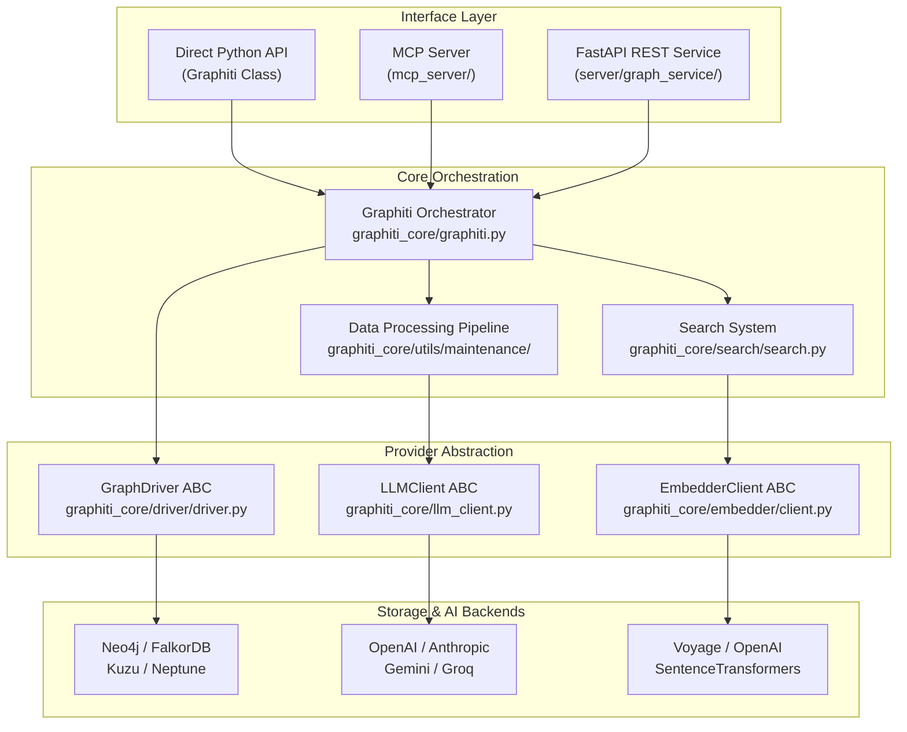
Sources: [graphiti_core/graphiti.py:137-187](), [graphiti_core/driver/driver.py:23-29](), [README.md:138-160](), [AGENTS.md:4-4]()

## Key Features

### 1. Hybrid Retrieval System
The `Graphiti.search()` method [graphiti_core/graphiti.py:62-63]() combines multiple strategies:
- **Semantic Search**: Vector similarity on entity/edge embeddings [graphiti_core/search/search_utils.py:34-48]().
- **Keyword Search**: BM25 full-text search on names and summaries [graphiti_core/search/search_utils.py:33-47]().
- **Graph Traversal**: BFS and distance-based context discovery [graphiti_core/search/search_utils.py:32-45]().
- **Reranking**: Supports Reciprocal Rank Fusion (RRF), Cross-Encoders, and Graph Distance reranking [graphiti_core/search/search_config_recipes.py:64-68]().

Sources: [examples/quickstart/README.md:76-78](), [graphiti_core/graphiti.py:62-63](), [graphiti_core/search/search_config_recipes.py:64-68]()

### 2. Multi-Provider Plugin Architecture
Graphiti supports various backends through abstract base classes:
- **Databases**: `Neo4jDriver`, `FalkorDriver`, `KuzuDriver`, and `NeptuneDriver` [graphiti_core/driver/neo4j_driver.py:30-30](), [graphiti_core/driver/kuzu_driver.py:137-137](), [graphiti_core/driver/neptune_driver.py:139-139]().
- **LLMs**: `OpenAIClient`, `AnthropicClient`, `GeminiClient`, and `GroqClient` [graphiti_core/graphiti.py:49-49]().
- **Embedders**: `OpenAIEmbedder` and others via `EmbedderClient` [graphiti_core/graphiti.py:40-40]().

Sources: [graphiti_core/graphiti.py:26-59](), [graphiti_core/driver/driver.py:23-29]()

### 3. Data Processing Pipeline
When an episode is added via `add_episode()`, it follows this workflow:
1. **Extraction**: LLMs identify entities and relationships using `extract_nodes` [graphiti_core/utils/maintenance/node_operations.py:70-77]() and `extract_edges` [graphiti_core/utils/maintenance/edge_operations.py:117-126]().
2. **Resolution**: Deduplication via `resolve_extracted_nodes` [graphiti_core/utils/maintenance/node_operations.py:104-104]() and `resolve_extracted_edges` [graphiti_core/utils/maintenance/edge_operations.py:95-95]().
3. **Contradiction Detection**: Existing facts are invalidated if new data contradicts them [README.md:125-126]().

Sources: [graphiti_core/graphiti.py:101-105](), [graphiti_core/utils/maintenance/node_operations.py:70-149]()

## Code Entity Space Mapping

This diagram maps high-level system components to specific code entities.

```mermaid
graph TD
    subgraph "Core Client"
        G_CLASS["Graphiti<br/>graphiti_core/graphiti.py"]
    end

    subgraph "Data Models"
        NODE_BASE["Node ABC<br/>graphiti_core/nodes.py"]
        ENT_NODE["EntityNode<br/>graphiti_core/nodes.py"]
        EP_NODE["EpisodicNode<br/>graphiti_core/nodes.py"]
        EDGE_BASE["Edge ABC<br/>graphiti_core/edges.py"]
        ENT_EDGE["EntityEdge<br/>graphiti_core/edges.py"]
    end

    subgraph "Database Layer"
        DRV_BASE["GraphDriver ABC<br/>graphiti_core/driver/driver.py"]
        NEO_DRV["Neo4jDriver<br/>graphiti_core/driver/neo4j_driver.py"]
        FAL_DRV["FalkorDriver<br/>graphiti_core/driver/falkordb_driver.py"]
    end

    subgraph "Search & Retrieval"
        S_FUNC["search()<br/>graphiti_core/search/search.py"]
        S_FILT["SearchFilters<br/>graphiti_core/search/search_filters.py"]
        S_RECIPE["SearchConfig Recipes<br/>graphiti_core/search/search_config_recipes.py"]
    end

    G_CLASS -->|orchestrates| S_FUNC
    G_CLASS -->|manages| ENT_NODE
    G_CLASS -->|manages| ENT_EDGE
    G_CLASS -->|initializes| DRV_BASE
    
    DRV_BASE <|-- NEO_DRV
    DRV_BASE <|-- FAL_DRV
    
    S_FUNC -->|uses| S_FILT
    S_FUNC -->|config by| S_RECIPE
    ENT_NODE --|> NODE_BASE
    ENT_EDGE --|> EDGE_BASE
```
Sources: [graphiti_core/graphiti.py:137-151](), [graphiti_core/nodes.py:51-59](), [graphiti_core/edges.py:31-39](), [graphiti_core/search/search.py:62-63]()

## Summary of Components

| Component | Code Entity | Description |
|-----------|-------------|-------------|
| **Core Client** | `Graphiti` [graphiti_core/graphiti.py:137]() | The primary interface for `add_episode`, `add_episode_bulk`, and `search`. |
| **Node Model** | `EntityNode` [graphiti_core/nodes.py:53]() | Represents entities with summaries and attributes [graphiti_core/nodes.py:58-59](). |
| **Edge Model** | `EntityEdge` [graphiti_core/edges.py:34]() | Represents facts with temporal validity (`valid_at`, `invalid_at`). |
| **Search Filter** | `SearchFilters` [graphiti_core/search/search_filters.py:69]() | Defines criteria for filtering graph data by labels, dates, or properties. |
| **Database Driver** | `GraphDriver` [graphiti_core/driver/driver.py:23]() | Abstract layer for executing graph queries across different backends. |

Sources: [graphiti_core/graphiti.py:137-151](), [graphiti_core/nodes.py:51-59](), [graphiti_core/edges.py:31-39](), [graphiti_core/search/search_filters.py:69-69]()

---

<<< SECTION: 2 Getting Started [2-getting-started] >>>

# Getting Started

<details>
<summary>Relevant source files</summary>

The following files were used as context for generating this wiki page:

- [.env.example](.env.example)
- [examples/quickstart/quickstart_falkordb.py](examples/quickstart/quickstart_falkordb.py)
- [examples/quickstart/quickstart_neo4j.py](examples/quickstart/quickstart_neo4j.py)
- [examples/quickstart/quickstart_neptune.py](examples/quickstart/quickstart_neptune.py)
- [examples/quickstart/requirements.txt](examples/quickstart/requirements.txt)
- [graphiti_core/decorators.py](graphiti_core/decorators.py)
- [graphiti_core/search/search_filters.py](graphiti_core/search/search_filters.py)
- [pyproject.toml](pyproject.toml)
- [tests/llm_client/test_anthropic_client_int.py](tests/llm_client/test_anthropic_client_int.py)
- [uv.lock](uv.lock)

</details>


This guide walks you through installing Graphiti, configuring your environment, and performing your first episode ingestion and search queries. For detailed information about the underlying architecture, see [System Architecture](). For advanced search capabilities and temporal filtering, see [SearchFilters and Temporal Queries]().

## Prerequisites

Before installing Graphiti, ensure you have the following:

### System Requirements

| Component | Requirement |
|-----------|-------------|
| **Python** | 3.10 or higher [pyproject.toml:12]() |
| **Graph Database** | Neo4j 5.26+, FalkorDB 1.1.2+, Kuzu 0.11.3+, or Amazon Neptune [pyproject.toml:15, 31-32, 37]() |
| **LLM Access** | OpenAI API key (default provider) [.env.example:1]() |
| **Optional LLMs** | Anthropic, Google Gemini, or Groq [pyproject.toml:28-30]() |

### Graph Database Setup

Choose one of the following database backends:

**Neo4j**: Install Neo4j Desktop for local development. The driver defaults to the `bolt://localhost:7687` [examples/quickstart/quickstart_neo4j.py:49]().

**FalkorDB**: Run via Docker for instant setup [examples/quickstart/quickstart_falkordb.py:49]():
```bash
docker run -p 6379:6379 -p 3000:3000 -it --rm falkordb/falkordb:latest
```

**Kuzu**: Embedded database requiring no separate installation, though currently marked as deprecated [pyproject.toml:31-32]().

**Amazon Neptune**: Requires AWS setup with Neptune Database plus Amazon OpenSearch Serverless (AOSS) host for full-text and vector search [examples/quickstart/quickstart_neptune.py:48-58]().

Sources: [pyproject.toml:12-38](), [examples/quickstart/quickstart_falkordb.py:48-62](), [examples/quickstart/quickstart_neo4j.py:47-54](), [examples/quickstart/quickstart_neptune.py:48-58]()

## Installation

### Core Installation

Install the base `graphiti-core` package using `pip` or `uv`:

```bash
pip install graphiti-core
```

### Database-Specific Installation

Install with database-specific extras depending on your chosen backend [pyproject.toml:27-41]():

```bash
# FalkorDB support
pip install graphiti-core[falkordb]

# FalkorDB Lite (Python 3.12+)
pip install graphiti-core[falkordblite]

# Amazon Neptune support
pip install graphiti-core[neptune]
```

### LLM Provider Installation

Install optional LLM provider dependencies as needed [pyproject.toml:28-30]():

```bash
# Anthropic Claude support
pip install graphiti-core[anthropic]

# Google Gemini support
pip install graphiti-core[google-genai]

# Groq support
pip install graphiti-core[groq]
```

**Installation Flow with Package Dependencies**

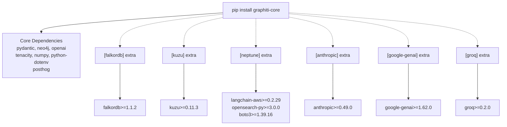

Sources: [pyproject.toml:13-21](), [pyproject.toml:27-41]()

## Environment Configuration

### Required Environment Variables

Set the following environment variable for OpenAI (the default provider) [.env.example:1]():

```bash
export OPENAI_API_KEY=your_openai_api_key
```

### Optional Configuration Variables

| Variable | Default | Description |
|----------|---------|-------------|
| `SEMAPHORE_LIMIT` | - | Max concurrent LLM operations [.env.example:16]() |
| `NEO4J_URI` | `bolt://localhost:7687` | Neo4j connection URI [examples/quickstart/quickstart_neo4j.py:49]() |
| `NEO4J_USER` | `neo4j` | Neo4j username [examples/quickstart/quickstart_neo4j.py:50]() |
| `NEO4J_PASSWORD` | `password` | Neo4j password [examples/quickstart/quickstart_neo4j.py:51]() |
| `FALKORDB_HOST` | `localhost` | FalkorDB host [examples/quickstart/quickstart_falkordb.py:61]() |
| `NEPTUNE_HOST` | - | Neptune endpoint [examples/quickstart/quickstart_neptune.py:49]() |
| `AOSS_HOST` | - | Amazon OpenSearch Serverless host [examples/quickstart/quickstart_neptune.py:51]() |
| `MAX_REFLEXION_ITERATIONS`| - | Max iterations for reflexion logic [.env.example:18]() |

Sources: [examples/quickstart/quickstart_falkordb.py:59-62](), [examples/quickstart/quickstart_neo4j.py:49-51](), [examples/quickstart/quickstart_neptune.py:49-51](), [.env.example:1-19]()

## Initializing Graphiti

### Basic Initialization with Neo4j

The `Graphiti` class is the main entry point. Initialize it with database credentials [examples/quickstart/quickstart_neo4j.py:67]():

```python
from graphiti_core import Graphiti

# Defaults to Neo4jDriver if URI is provided
graphiti = Graphiti(
    uri="bolt://localhost:7687",
    user="neo4j",
    password="password"
)
```

**Graphiti Initialization Architecture**

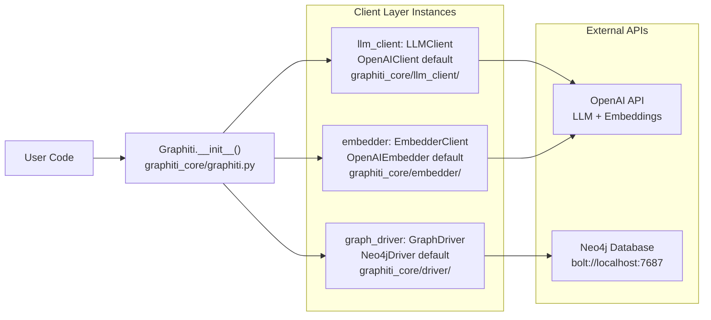

Sources: [examples/quickstart/quickstart_neo4j.py:67](), [graphiti_core/driver/driver.py:23]()

### Alternative Database Drivers

#### FalkorDB Initialization
```python
from graphiti_core.driver.falkordb_driver import FalkorDriver
# FalkorDriver initialization
falkor_driver = FalkorDriver(host="localhost", port="6379")
graphiti = Graphiti(graph_driver=falkor_driver)
```

Sources: [examples/quickstart/quickstart_falkordb.py:75-84]()

### Custom LLM Provider Configuration

#### Using Anthropic
```python
from graphiti_core.llm_client.anthropic_client import AnthropicClient
from graphiti_core.llm_client.config import LLMConfig

# Configuration for Anthropic
llm_client = AnthropicClient(config=LLMConfig(api_key="sk-...", model="claude-3-5-sonnet-20241022"))
graphiti = Graphiti(uri="...", user="...", password="...", llm_client=llm_client)
```

Sources: [tests/llm_client/test_anthropic_client_int.py:24, 48]()

## Your First Episode Ingestion

### Understanding Episodes

An episode is a discrete unit of information. Graphiti supports `EpisodeType.text` and `EpisodeType.json`. When ingested, Graphiti extracts entities and relationships while maintaining temporal context [examples/quickstart/quickstart_falkordb.py:98-131]().

**Episode Ingestion Flow**

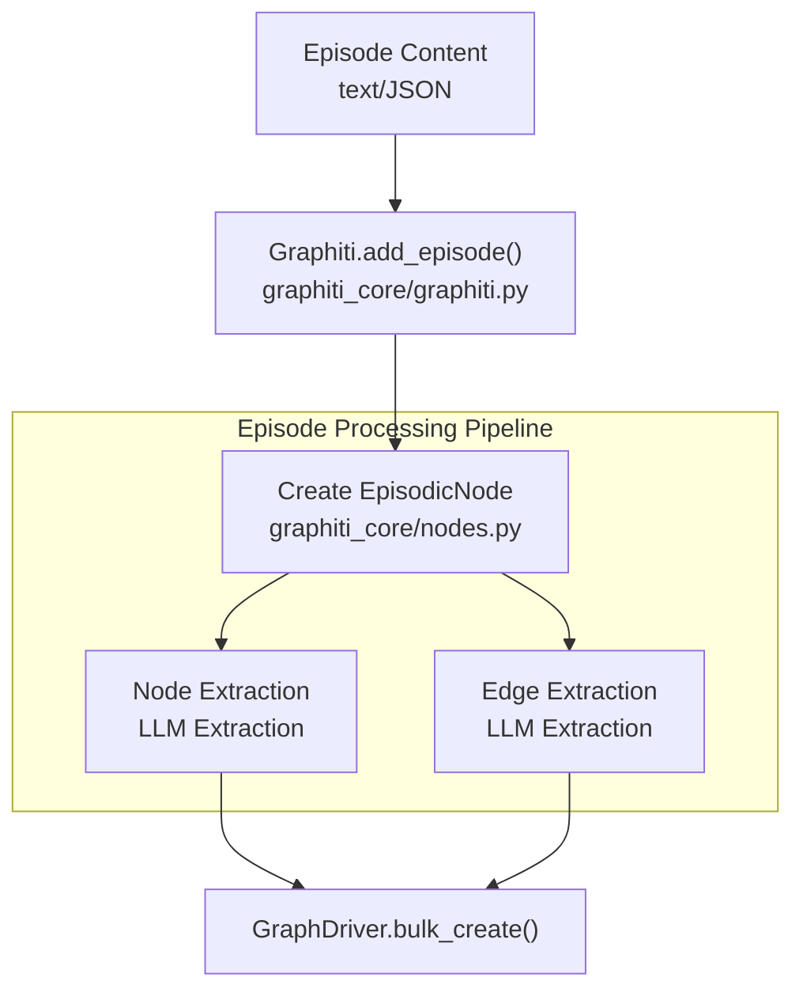

Sources: [examples/quickstart/quickstart_falkordb.py:134-143](), [graphiti_core/nodes.py:28]()

### Adding a Text Episode

```python
from datetime import datetime, timezone
from graphiti_core.nodes import EpisodeType

await graphiti.add_episode(
    name="Meeting Notes",
    episode_body="Kamala Harris is the Attorney General of California.",
    source=EpisodeType.text,
    source_description="podcast transcript",
    reference_time=datetime.now(timezone.utc),
)
```

Sources: [examples/quickstart/quickstart_falkordb.py:135-143](), [graphiti_core/nodes.py:28]()

## Your First Search Query

### Basic Edge Search

By default, `search()` performs a hybrid search combining semantic similarity and BM25 retrieval to find relationships (edges) [examples/quickstart/quickstart_falkordb.py:157]().

```python
results = await graphiti.search('Who was the California Attorney General?')

for result in results:
    print(f'Fact: {result.fact}')
    if hasattr(result, 'valid_at') and result.valid_at:
        print(f'Valid from: {result.valid_at}')
```

Sources: [examples/quickstart/quickstart_falkordb.py:157-168]()

### Node Search

To search for nodes (entities) instead of edges, use the `NODE_HYBRID_SEARCH_RRF` recipe [examples/quickstart/quickstart_falkordb.py:29]():

```python
from graphiti_core.search.search_config_recipes import NODE_HYBRID_SEARCH_RRF

node_results = await graphiti.search(
    'Gavin Newsom', 
    config=NODE_HYBRID_SEARCH_RRF
)
```

Sources: [examples/quickstart/quickstart_falkordb.py:29]()

### Center Node Reranking

You can rerank results based on graph distance from a specific node UUID to find contextually related facts [examples/quickstart/quickstart_falkordb.py:178-184]():

```python
# Use the source node UUID from a previous result to find related facts
center_uuid = results[0].source_node_uuid

reranked = await graphiti.search(
    'California politics', 
    center_node_uuid=center_uuid
)
```

Sources: [examples/quickstart/quickstart_falkordb.py:177-184]()

## Next Steps

1. **Community Detection**: Build global summaries with `await graphiti.build_communities()` [examples/quickstart/quickstart_neptune.py:140]().
2. **Temporal Filtering**: Use `SearchFilters` to query specific time ranges using `valid_at` or `invalid_at` [graphiti_core/search/search_filters.py:55-67]().
3. **Concurrency Control**: Adjust `SEMAPHORE_LIMIT` to manage LLM rate limits during bulk ingestion [.env.example:16]().

Sources: [examples/quickstart/quickstart_neptune.py:140](), [graphiti_core/search/search_filters.py:55-67](), [.env.example:16]()

---

<<< SECTION: 3 Core Concepts [3-core-concepts] >>>

# Core Concepts

<details>
<summary>Relevant source files</summary>

The following files were used as context for generating this wiki page:

- [AGENTS.md](AGENTS.md)
- [CONTRIBUTING.md](CONTRIBUTING.md)
- [README.md](README.md)
- [examples/quickstart/README.md](examples/quickstart/README.md)
- [graphiti_core/driver/kuzu_driver.py](graphiti_core/driver/kuzu_driver.py)
- [graphiti_core/driver/neptune_driver.py](graphiti_core/driver/neptune_driver.py)
- [graphiti_core/edges.py](graphiti_core/edges.py)
- [graphiti_core/nodes.py](graphiti_core/nodes.py)
- [graphiti_core/utils/maintenance/community_operations.py](graphiti_core/utils/maintenance/community_operations.py)
- [graphiti_core/utils/maintenance/dedup_helpers.py](graphiti_core/utils/maintenance/dedup_helpers.py)
- [graphiti_core/utils/maintenance/graph_data_operations.py](graphiti_core/utils/maintenance/graph_data_operations.py)
- [tests/helpers_test.py](tests/helpers_test.py)
- [tests/test_add_triplet.py](tests/test_add_triplet.py)
- [tests/test_graphiti_mock.py](tests/test_graphiti_mock.py)

</details>


## Purpose and Scope

This page introduces the fundamental architectural concepts and mental models that underpin Graphiti's design. It covers the three-layer knowledge graph architecture, the episode processing pipeline, temporal data modeling, and the distinction between episodic and entity data. Graphiti is designed as a temporal context graph framework for AI agents, tracking how facts change over time while maintaining provenance to source data [README.md:42-49]().

For implementation details about specific components:
- **Data model schemas and node/edge types**: See [Knowledge Graph Data Model](#3.1)
- **Bi-temporal timestamp handling**: See [Temporal Awareness and Bi-Temporal Model](#3.2)
- **LLM-based extraction process**: See [Entity and Relationship Extraction](#3.3)
- **Duplicate prevention strategies**: See [Deduplication and Resolution](#3.4)

For system architecture details about how these concepts are implemented, see [System Architecture](#4).

Sources: [README.md:42-74](), [graphiti_core/nodes.py:93-104]()

---

## The Three-Layer Knowledge Graph Architecture

Graphiti implements a three-layer graph architecture where each layer serves a distinct purpose in knowledge representation and retrieval.

### Layer Architecture

```mermaid
graph TB
    subgraph L1["Layer 1: Episodic Memory"]
        [EpisodicNode] -->|"EpisodicEdge<br/>:MENTIONS"| [EntityNode]
    end
    
    subgraph L2["Layer 2: Entity Knowledge"]
        [EntityNode] -->|"EntityEdge<br/>:RELATES_TO"| [EntityNode2]
    end
    
    subgraph L3["Layer 3: Community Clusters"]
        [CommunityNode] -->|"CommunityEdge<br/>:HAS_MEMBER"| [EntityNode]
    end
```

**Layer 1: Episodic Memory** - `EpisodicNode` instances store raw episode content with temporal context [graphiti_core/nodes.py:54-78](). `EpisodicEdge` relationships with relationship type `:MENTIONS` connect episodes to extracted entities [graphiti_core/edges.py:143-158]().

**Layer 2: Entity Knowledge** - `EntityNode` instances represent deduplicated entities with semantic embeddings. The `name` field stores the canonical entity name, while `labels` contains entity type classifications [graphiti_core/nodes.py:93-104](). `EntityEdge` relationships with type `:RELATES_TO` store natural language facts in the `fact` field, along with bi-temporal fields (`valid_at`, `invalid_at`, `expired_at`, `created_at`) [graphiti_core/edges.py:32-43]().

**Layer 3: Community Clusters** - `CommunityNode` instances group semantically related entities using the `label_propagation` algorithm [graphiti_core/utils/maintenance/community_operations.py:93-138](). Communities have generated names and summaries based on member entities [graphiti_core/utils/maintenance/community_operations.py:174-200](). `CommunityEdge` relationships with type `:HAS_MEMBER` indicate cluster membership [graphiti_core/edges.py:33-33]().

### Node and Edge Classes

| Class | Base Class | Database Label | Key Fields |
|-------|------------|----------------|------------|
| `EpisodicNode` | `Node` | `:Episodic` | `content`, `valid_at`, `source` |
| `EntityNode` | `Node` | `:Entity` | `name`, `summary`, `labels` |
| `CommunityNode` | `Node` | `:Community` | `name`, `summary` |
| `SagaNode` | `Node` | `:Saga` | `name`, `group_id` |
| `EpisodicEdge` | `Edge` | `:MENTIONS` | `source_node_uuid`, `target_node_uuid` |
| `EntityEdge` | `Edge` | `:RELATES_TO` | `fact`, `valid_at`, `invalid_at` |
| `CommunityEdge` | `Edge` | `:HAS_MEMBER` | `source_node_uuid`, `target_node_uuid` |

All node classes inherit from the abstract `Node` base class [graphiti_core/nodes.py:93-104](), which provides `uuid`, `name`, `group_id`, `labels`, and `created_at`. All edge classes inherit from `Edge` [graphiti_core/edges.py:49-58](), providing `uuid`, `group_id`, `source_node_uuid`, `target_node_uuid`, and `created_at`.

Sources: [graphiti_core/nodes.py:54-104](), [graphiti_core/edges.py:49-158](), [graphiti_core/utils/maintenance/community_operations.py:93-200]()

---

## Episode Types and Format-Specific Extraction

Graphiti processes different episode formats defined by the `EpisodeType` enum [graphiti_core/nodes.py:54-88]():

### EpisodeType Enumeration and Extraction Flow

```mermaid
graph TB
    [GraphitiClient] --> [EpisodeType]
    
    [EpisodeType] -->|"message"| [extract_message_logic]
    [EpisodeType] -->|"json"| [extract_json_logic]
    [EpisodeType] -->|"text"| [extract_text_logic]
    [EpisodeType] -->|"fact_triple"| [extract_triplet_logic]
    
    [extract_message_logic] --> [LLMClient]
    [extract_json_logic] --> [LLMClient]
    [extract_text_logic] --> [LLMClient]
    [extract_triplet_logic] --> [LLMClient]
```

### Episode Type Details

| Episode Type | Enum Value | Format | Special Handling |
|--------------|------------|--------|------------------|
| `message` | `'message'` | `"actor: content"` | Speaker identification and conversation context [graphiti_core/nodes.py:64-67]() |
| `json` | `'json'` | JSON string | Structured data traversal and object mapping [graphiti_core/nodes.py:68-69]() |
| `text` | `'text'` | Plain text | Narrative context and narrative flow [graphiti_core/nodes.py:70-71]() |
| `fact_triple` | `'fact_triple'` | Triplet format | Direct ingestion of pre-extracted facts [graphiti_core/nodes.py:77-77]() |

The `EpisodeType` is used to categorize input data and route it to specific extraction logic [graphiti_core/nodes.py:54-78]().

Sources: [graphiti_core/nodes.py:54-88](), [graphiti_core/llm_client.py:85-95]()

---

## Episode Processing Pipeline Overview

The pipeline transforms raw episodes into structured knowledge graph data through several stages.

### Pipeline Stages

```mermaid
flowchart TB
    [add_episode] --> [retrieve_episodes]
    [retrieve_episodes] --> [extract_nodes_and_edges]
    [extract_nodes_and_edges] --> [resolve_extracted_nodes]
    [resolve_extracted_nodes] --> [resolve_extracted_edges]
    [resolve_extracted_edges] --> [GraphDriver_execute_query]
```

### Processing Phases

**Phase 1: Context Retrieval** - `retrieve_episodes()` fetches the last `EPISODE_WINDOW_LEN` (default 3) episodes relative to a `reference_time` to provide temporal context for extraction [graphiti_core/utils/maintenance/graph_data_operations.py:29-30](), [graphiti_core/utils/maintenance/graph_data_operations.py:67-100]().

**Phase 2: Node Resolution** - Entities are deduplicated using `resolve_extracted_nodes()`, which applies a multi-tier strategy: exact matches, fuzzy similarity, and LLM reasoning [graphiti_core/utils/maintenance/node_operations.py:104-104]().

**Phase 3: Edge Resolution and Contradictions** - Relationships are extracted and checked for contradictions using `resolve_extracted_edges()`. If a new fact contradicts an existing one, temporal invalidation is applied [graphiti_core/utils/maintenance/edge_operations.py:93-95]().

**Phase 4: Community Update** - Communities are updated using `build_communities()` which leverages `label_propagation` to cluster nodes based on their connections [graphiti_core/utils/maintenance/community_operations.py:86-87](), [graphiti_core/utils/maintenance/community_operations.py:93-138]().

Sources: [graphiti_core/utils/maintenance/graph_data_operations.py:29-100](), [graphiti_core/utils/maintenance/community_operations.py:93-138](), [graphiti_core/utils/maintenance/node_operations.py:104](), [graphiti_core/utils/maintenance/edge_operations.py:93-95]()

---

## Temporal Data Model

Graphiti implements a bi-temporal data model that tracks timestamps across two temporal dimensions: Event Time and System Time.

### Temporal Fields on EntityEdge

| Field | Dimension | Purpose |
|-------|-----------|---------|
| `valid_at` | Event time | When fact became true in the real world |
| `invalid_at` | Event time | When fact stopped being true in the real world |
| `created_at` | System time | When fact was ingested into the system |
| `expired_at` | System time | When fact was superseded by a contradiction |

**Event Time Dimension** - Tracks when facts are true in reality. `EpisodicNode` uses `valid_at` to mark the occurrence of an event [graphiti_core/nodes.py:98]().

**System Time Dimension** - Tracks when data was modified in the database. `created_at` is automatically set for all nodes and edges upon initialization [graphiti_core/nodes.py:98](), [graphiti_core/edges.py:54]().

Sources: [graphiti_core/nodes.py:98](), [graphiti_core/edges.py:54](), [graphiti_core/utils/datetime_utils.py:49-50]()

---

## Group Partitioning for Multi-Tenancy

All nodes and edges include a `group_id: str` field that partitions the graph, enabling multi-tenancy and data isolation.

### Group Isolation

```mermaid
graph TB
    [Graphiti_Core] --> [Node_group_id]
    [Node_group_id] --> [GraphDriver_execute_query]
    [GraphDriver_execute_query] --> [MATCH_WHERE_group_id]
```

Operations such as `delete_by_group_id` [graphiti_core/nodes.py:178-199]() and `get_by_group_ids` [graphiti_core/nodes.py:218-243]() use `group_id` to ensure data isolation. Community detection also runs independently per group, fetching clusters only for specified group IDs [graphiti_core/utils/maintenance/community_operations.py:30-53]().

Sources: [graphiti_core/nodes.py:96](), [graphiti_core/edges.py:51](), [graphiti_core/utils/maintenance/community_operations.py:30-53]()

---

## Relationship to Child Pages

- **[Knowledge Graph Data Model](#3.1)** - Detailed schemas for `EpisodicNode`, `EntityNode`, `CommunityNode`, `SagaNode`, and their respective edges.
- **[Temporal Awareness and Bi-Temporal Model](#3.2)** - Explanation of the four temporal dimensions and point-in-time query support.
- **[Entity and Relationship Extraction](#3.3)** - Details on how LLMs extract structured data from raw episodes.
- **[Deduplication and Resolution](#3.4)** - Three-tier strategy for resolving nodes and detecting edge contradictions.

---

<<< SECTION: 3.1 Knowledge Graph Data Model [3-1-knowledge-graph-data-model] >>>

# Knowledge Graph Data Model

<details>
<summary>Relevant source files</summary>

The following files were used as context for generating this wiki page:

- [graphiti_core/edges.py](graphiti_core/edges.py)
- [graphiti_core/models/__init__.py](graphiti_core/models/__init__.py)
- [graphiti_core/models/edges/__init__.py](graphiti_core/models/edges/__init__.py)
- [graphiti_core/models/edges/edge_db_queries.py](graphiti_core/models/edges/edge_db_queries.py)
- [graphiti_core/models/nodes/__init__.py](graphiti_core/models/nodes/__init__.py)
- [graphiti_core/models/nodes/node_db_queries.py](graphiti_core/models/nodes/node_db_queries.py)
- [graphiti_core/nodes.py](graphiti_core/nodes.py)
- [graphiti_core/utils/maintenance/community_operations.py](graphiti_core/utils/maintenance/community_operations.py)
- [graphiti_core/utils/maintenance/graph_data_operations.py](graphiti_core/utils/maintenance/graph_data_operations.py)

</details>


This document details the core data structures and schemas that comprise Graphiti's temporal knowledge graph. It covers the node types, edge types, their properties, and relationships within the graph database.

For information about how these data structures are processed and maintained, see [Data Processing Pipeline](). For details about temporal reasoning and validity periods, see [Temporal Awareness and Bi-Temporal Model]().

## Overview

Graphiti's knowledge graph implements a temporal, multi-layered data model consisting of four node types (`EpisodicNode`, `EntityNode`, `CommunityNode`, `SagaNode`) and five edge types (`EpisodicEdge`, `EntityEdge`, `CommunityEdge`, `HasEpisodeEdge`, `NextEpisodeEdge`). All data structures inherit from abstract Pydantic `BaseModel` classes (`Node`, `Edge`) defined in [graphiti_core/nodes.py:93-109]() and [graphiti_core/edges.py:49-57](). The model preserves raw episodic content while extracting structured entities and relationships with full temporal tracking, and supports narrative organization through saga episode chains.

Sources: [graphiti_core/nodes.py:93-109](), [graphiti_core/edges.py:49-57]()

## Graph Schema Architecture

The following diagram shows the complete data model with all node and edge types:

**Temporal Knowledge Graph Schema**

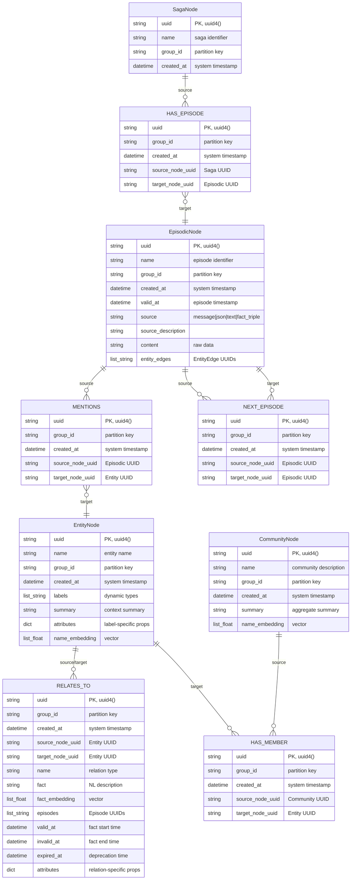

Sources: [graphiti_core/nodes.py:93-99](), [graphiti_core/nodes.py:307-318](), [graphiti_core/nodes.py:450-456](), [graphiti_core/nodes.py:618-621](), [graphiti_core/nodes.py:798-817](), [graphiti_core/edges.py:49-55](), [graphiti_core/edges.py:143-144](), [graphiti_core/edges.py:228-247](), [graphiti_core/edges.py:503-504](), [graphiti_core/edges.py:586-587](), [graphiti_core/edges.py:719-720]()

## Node Types

### EpisodicNode

The `EpisodicNode` class represents raw episode data. Defined in [graphiti_core/nodes.py:307-351](), it serves as the source material for entity and relationship extraction.

| Property | Type | Description |
|----------|------|-------------|
| `uuid` | `str` | Generated via `uuid4()`, primary key |
| `name` | `str` | Episode identifier |
| `group_id` | `str` | Partition key for multi-tenancy |
| `labels` | `list[str]` | Inherited from `Node`, defaults to empty list |
| `created_at` | `datetime` | System creation time via `utc_now()` |
| `valid_at` | `datetime` | Episode timestamp (when event occurred) |
| `source` | `EpisodeType` | Enum: `message`, `json`, `text`, or `fact_triple` |
| `source_description` | `str` | Metadata about source |
| `content` | `str` | Raw episode content |
| `entity_edges` | `list[str]` | UUIDs of `EntityEdge` instances extracted from this episode |

**Key Methods:**
- `async save(driver: GraphDriver)` - Persists node using `get_episode_node_save_query()` [graphiti_core/nodes.py:319-344]()
- `async get_by_uuid(driver, uuid)` - Retrieves single episode [graphiti_core/nodes.py:346-367]()
- `async get_by_group_ids(driver, group_ids, limit, uuid_cursor)` - Pagination support [graphiti_core/nodes.py:390-427]()

**EpisodeType Enum:**

Defined in [graphiti_core/nodes.py:54-91](), the enum specifies input format:
- `message` - Actor-prefixed format: `"user: Hello"`
- `json` - Structured JSON string
- `text` - Plain text content
- `fact_triple` - Subject-Predicate-Object structure [graphiti_core/nodes.py:77-77]()

Sources: [graphiti_core/nodes.py:307-427](), [graphiti_core/nodes.py:54-91]()

### EntityNode

The `EntityNode` class represents extracted entities with semantic embeddings. Defined in [graphiti_core/nodes.py:450-615](), it stores structured knowledge with dynamic typing.

| Property | Type | Description |
|----------|------|-------------|
| `uuid` | `str` | Generated via `uuid4()`, primary key |
| `name` | `str` | Entity name (embedded for semantic search) |
| `group_id` | `str` | Partition key |
| `labels` | `list[str]` | Dynamic entity types (e.g., `["Person", "Engineer"]`) |
| `created_at` | `datetime` | System creation time |
| `summary` | `str` | LLM-generated context summary |
| `attributes` | `dict[str, Any]` | Label-specific properties |
| `name_embedding` | `list[float] \| None` | Vector embedding |

**Key Methods:**
- `async generate_name_embedding(embedder: EmbedderClient)` - Creates embedding [graphiti_core/nodes.py:457-464]()
- `async save(driver: GraphDriver)` - Persists using `get_entity_node_save_query()` [graphiti_core/nodes.py:504-535]()

**Database Provider Handling:**
- **Kuzu**: Serializes `attributes` as JSON, stores `labels` array [graphiti_core/nodes.py:514-520](), [graphiti_core/models/nodes/node_db_queries.py:150-163]()
- **Neo4j/FalkorDB/Neptune**: Flattens `attributes` into properties, uses multi-label syntax [graphiti_core/nodes.py:522-531](), [graphiti_core/models/nodes/node_db_queries.py:142-149]()

Sources: [graphiti_core/nodes.py:450-615](), [graphiti_core/models/nodes/node_db_queries.py:137-163]()

### CommunityNode

The `CommunityNode` class represents entity clusters discovered via graph algorithms. Defined in [graphiti_core/nodes.py:618-755](), it provides hierarchical summarization.

| Property | Type | Description |
|----------|------|-------------|
| `uuid` | `str` | Generated via `uuid4()`, primary key |
| `name` | `str` | LLM-generated community description |
| `group_id` | `str` | Partition key |
| `created_at` | `datetime` | System creation time |
| `summary` | `str` | Aggregate summary of members |
| `name_embedding` | `list[float] \| None` | Vector embedding of name |

**Key Methods:**
- `async save(driver: GraphDriver)` - Uses `get_community_node_save_query()` [graphiti_core/nodes.py:622-640]()
- `build_community()` - Generates community summaries using hierarchical LLM calls [graphiti_core/utils/maintenance/community_operations.py:174-212]()
- `get_community_clusters()` - Identifies clusters using `label_propagation` [graphiti_core/utils/maintenance/community_operations.py:30-90]()

Sources: [graphiti_core/nodes.py:618-755](), [graphiti_core/utils/maintenance/community_operations.py:30-212]()

### SagaNode

The `SagaNode` class represents narrative sequences. Defined in [graphiti_core/nodes.py:798-941](), it enables organizing episodes into coherent storylines.

| Property | Type | Description |
|----------|------|-------------|
| `uuid` | `str` | Generated via `uuid4()`, primary key |
| `name` | `str` | Saga identifier |
| `group_id` | `str` | Partition key |
| `created_at` | `datetime` | System creation time |

Sources: [graphiti_core/nodes.py:798-941](), [graphiti_core/models/nodes/node_db_queries.py:47]()

## Edge Types

### EpisodicEdge (MENTIONS Relationship)

The `EpisodicEdge` class creates `MENTIONS` relationships between `EpisodicNode` and `EntityNode`. Defined in [graphiti_core/edges.py:143-226]().

| Property | Type | Description |
|----------|------|-------------|
| `uuid` | `str` | Generated via `uuid4()`, primary key |
| `group_id` | `str` | Partition key |
| `created_at` | `datetime` | System creation time |
| `source_node_uuid` | `str` | `EpisodicNode.uuid` |
| `target_node_uuid` | `str` | `EntityNode.uuid` |

Sources: [graphiti_core/edges.py:143-226](), [graphiti_core/models/edges/edge_db_queries.py:19-27]()

### EntityEdge (RELATES_TO Relationship)

The `EntityEdge` class represents factual relationships between entities with bi-temporal tracking. Defined in [graphiti_core/edges.py:228-501]().

| Property | Type | Description |
|----------|------|-------------|
| `uuid` | `str` | Generated via `uuid4()`, primary key |
| `group_id` | `str` | Partition key |
| `created_at` | `datetime` | Transaction time |
| `source_node_uuid` | `str` | Source `EntityNode.uuid` |
| `target_node_uuid` | `str` | Target `EntityNode.uuid` |
| `name` | `str` | Relationship type |
| `fact` | `str` | NL description |
| `fact_embedding` | `list[float] \| None` | Vector embedding |
| `episodes` | `list[str]` | Supporting episode UUIDs |
| `valid_at` | `datetime \| None` | Start time of fact |
| `invalid_at` | `datetime \| None` | End time of fact |
| `expired_at` | `datetime \| None` | Soft delete timestamp |

Sources: [graphiti_core/edges.py:228-501](), [graphiti_core/models/edges/edge_db_queries.py:63-122]()

### CommunityEdge (HAS_MEMBER Relationship)

The `CommunityEdge` class creates `HAS_MEMBER` relationships from communities to member entities. Defined in [graphiti_core/edges.py:503-584]().

Sources: [graphiti_core/edges.py:503-584](), [graphiti_core/models/edges/edge_db_queries.py:40]()

### HasEpisodeEdge and NextEpisodeEdge

- **HasEpisodeEdge**: Links `SagaNode` to `EpisodicNode` [graphiti_core/edges.py:586-717]().
- **NextEpisodeEdge**: Links consecutive `EpisodicNode` instances to form a sequence [graphiti_core/edges.py:719-852]().

Sources: [graphiti_core/edges.py:586-852]()

## Class Hierarchy and Methods

**Pydantic Model Hierarchy**

```mermaid
classDiagram
    class "BaseModel" {
        <<Pydantic>>
    }
    
    class "Node" {
        <<abstract BaseModel>>
        +str uuid
        +str name
        +str group_id
        +list[str] labels
        +datetime created_at
        +save(driver: GraphDriver)* async
        +delete(driver: GraphDriver) async
    }
    
    class "EpisodicNode" {
        +EpisodeType source
        +str source_description
        +str content
        +datetime valid_at
        +list[str] entity_edges
        +save(driver) async
    }
    
    class "EntityNode" {
        +list[float] | None name_embedding
        +str summary
        +dict[str, Any] attributes
        +generate_name_embedding(embedder) async
        +save(driver) async
    }
    
    class "Edge" {
        <<abstract BaseModel>>
        +str uuid
        +str group_id
        +str source_node_uuid
        +str target_node_uuid
        +datetime created_at
        +save(driver: GraphDriver)* async
        +delete(driver: GraphDriver) async
    }
    
    "BaseModel" <|-- "Node"
    "BaseModel" <|-- "Edge"
    "Node" <|-- "EpisodicNode"
    "Node" <|-- "EntityNode"
    "Node" <|-- "CommunityNode"
    "Node" <|-- "SagaNode"
    "Edge" <|-- "EpisodicEdge"
    "Edge" <|-- "EntityEdge"
    "Edge" <|-- "CommunityEdge"
    "Edge" <|-- "HasEpisodeEdge"
    "Edge" <|-- "NextEpisodeEdge"
```

Sources: [graphiti_core/nodes.py:93-109](), [graphiti_core/edges.py:49-57]()

## Data Persistence Flow

**Episode to Graph Persistence Pipeline**

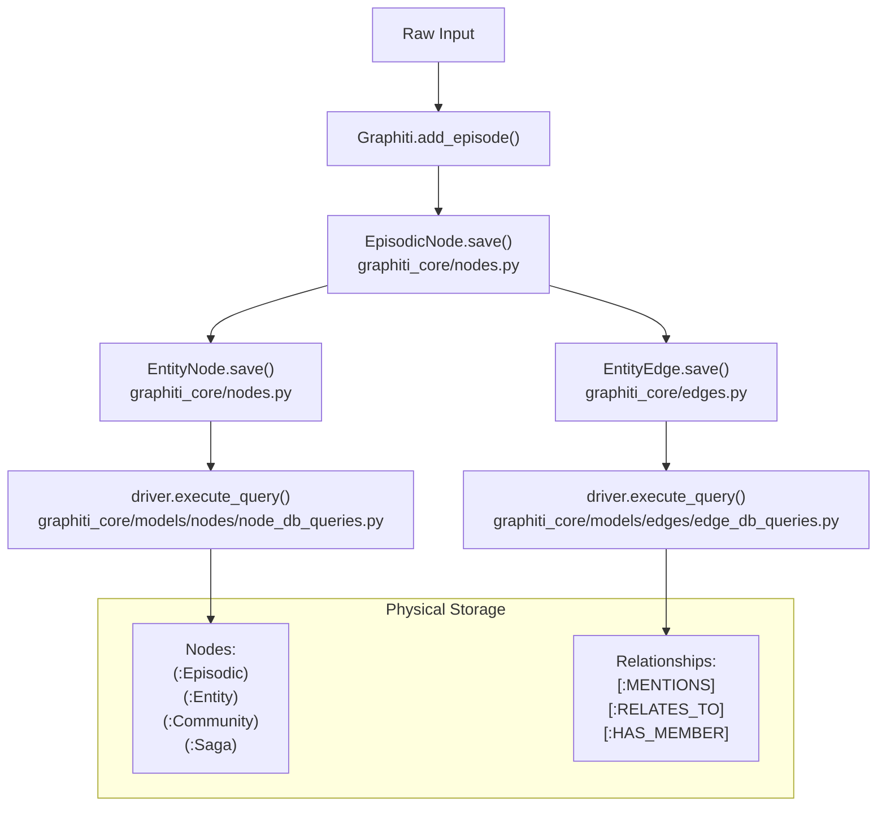

Sources: [graphiti_core/nodes.py:319-344](), [graphiti_core/nodes.py:504-535](), [graphiti_core/edges.py:304-339](), [graphiti_core/models/nodes/node_db_queries.py:30-66](), [graphiti_core/models/edges/edge_db_queries.py:63-122]()

## Partitioning and Group Management

All nodes and edges include a `group_id` field that enables graph partitioning for multi-tenancy. 

- `Node.delete_by_group_id()`: Performs batch deletion of nodes and their relationships for a specific partition [graphiti_core/nodes.py:178-226]().
- `Edge.delete_by_uuids()`: Bulk delete edges by UUID across providers [graphiti_core/edges.py:93-130]().
- `clear_data()`: Maintenance function to purge all data or specific groups from the database [graphiti_core/utils/maintenance/graph_data_operations.py:34-65]().

Sources: [graphiti_core/nodes.py:178-226](), [graphiti_core/edges.py:93-130](), [graphiti_core/utils/maintenance/graph_data_operations.py:34-65]()

---

<<< SECTION: 3.2 Temporal Awareness and Bi-Temporal Model [3-2-temporal-awareness-and-bi-temporal-model] >>>

# Temporal Awareness and Bi-Temporal Model

<details>
<summary>Relevant source files</summary>

The following files were used as context for generating this wiki page:

- [graphiti_core/edges.py](graphiti_core/edges.py)
- [graphiti_core/nodes.py](graphiti_core/nodes.py)
- [graphiti_core/search/search_filters.py](graphiti_core/search/search_filters.py)
- [graphiti_core/utils/__init__.py](graphiti_core/utils/__init__.py)
- [graphiti_core/utils/datetime_utils.py](graphiti_core/utils/datetime_utils.py)
- [graphiti_core/utils/maintenance/community_operations.py](graphiti_core/utils/maintenance/community_operations.py)
- [graphiti_core/utils/maintenance/graph_data_operations.py](graphiti_core/utils/maintenance/graph_data_operations.py)
- [pyproject.toml](pyproject.toml)
- [uv.lock](uv.lock)

</details>


This page explains Graphiti's temporal data model, which tracks both when facts entered the system (`created_at`) and when they were true in the real world (`valid_at`, `invalid_at`). This bi-temporal design enables point-in-time queries, historical reasoning, and automatic invalidation of contradicted facts.

## Overview of the Temporal Model

Graphiti maintains **four temporal dimensions** across its data model to support both system-time and valid-time reasoning:

| Temporal Property | Applied To | Purpose |
|-------------------|-----------|---------|
| `created_at` | All nodes and edges | When the entity entered the graph database |
| `valid_at` | `EpisodicNode`, `EntityEdge` | When the fact/event occurred in reality |
| `invalid_at` | `EntityEdge` | When the fact stopped being true in reality |
| `expired_at` | `EntityEdge` | When the edge was invalidated by new information |

This design separates **system time** (when we learned about something) from **valid time** (when it actually happened), enabling queries like "What did the system know on date X about events that occurred on date Y?"

Sources: [graphiti_core/nodes.py:98-98](), [graphiti_core/nodes.py:311-313](), [graphiti_core/edges.py:54-54](), [graphiti_core/edges.py:271-279]()

## Temporal Dimensions in Detail

### created_at: System Entry Time

Title: System Entry Time Visualization
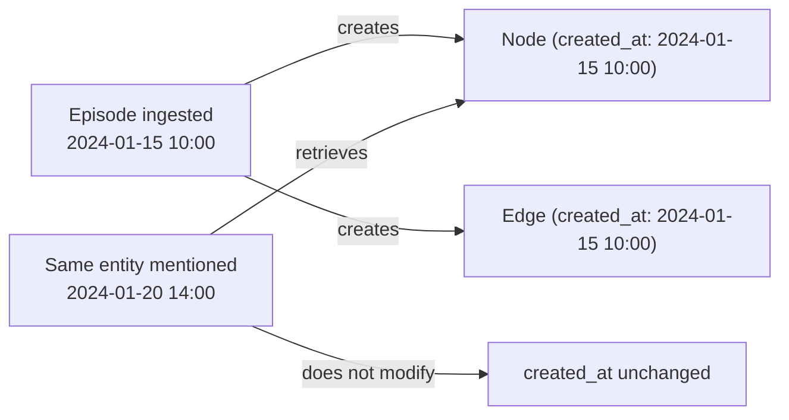

The `created_at` timestamp records when a node or edge was first added to the graph database. It represents system time and is set once when the entity is created. This property exists on all nodes (via the `Node` base class) and edges (via the `Edge` base class).

**Key behavior:**
- Set automatically to `utc_now()` at creation time [graphiti_core/nodes.py:98-98](), [graphiti_core/edges.py:54-54]().
- Never modified after initial creation.
- Used for chronological ordering of system operations.
- Independent of when events actually occurred.

Sources: [graphiti_core/nodes.py:98-98](), [graphiti_core/edges.py:54-54](), [graphiti_core/utils/datetime_utils.py:20-22]()

### valid_at: Real-World Event Time

Title: Event Time vs Ingestion Time
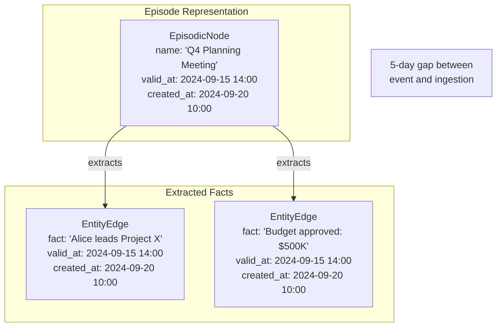

The `valid_at` timestamp records when an event or fact became true in the real world. This is distinct from `created_at` (when we learned about it).

**Application:**
- `EpisodicNode.valid_at`: When the episode content was originally created (e.g., message timestamp, document date) [graphiti_core/nodes.py:311-313]().
- `EntityEdge.valid_at`: When the relationship became true. This is extracted from the episode content by the LLM [graphiti_core/edges.py:274-276]().

**LLM Extraction:** During edge extraction, the LLM uses the episode's `valid_at` as a reference to resolve relative dates into absolute timestamps. In `retrieve_episodes`, `valid_at` is used to filter for episodes that occurred before a specific `reference_time` [graphiti_core/utils/maintenance/graph_data_operations.py:80-82]().

Sources: [graphiti_core/nodes.py:311-313](), [graphiti_core/edges.py:274-276](), [graphiti_core/utils/maintenance/graph_data_operations.py:67-90]()

### invalid_at: Fact Expiration Time

Title: Temporal Invalidation Timeline
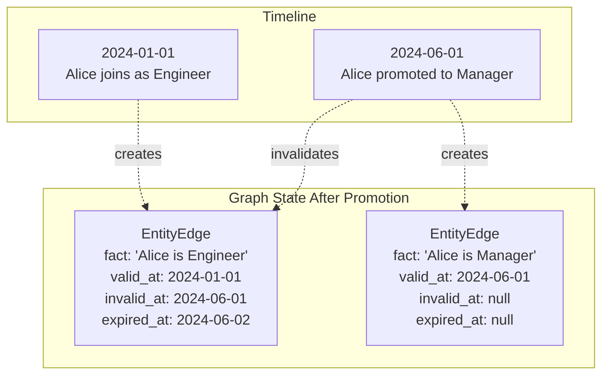

The `invalid_at` timestamp records when a fact ceased to be true in reality. This is primarily set through **temporal contradiction detection** during the edge resolution process.

**Key behavior:**
- Initially `None` for most edges [graphiti_core/edges.py:277-279]().
- Set when new information explicitly contradicts an existing fact.
- Represents valid-time termination.
- Used with `valid_at` to define fact validity intervals for historical reasoning.

Sources: [graphiti_core/edges.py:277-279]()

### expired_at: System Invalidation Time

Title: System Invalidation Process
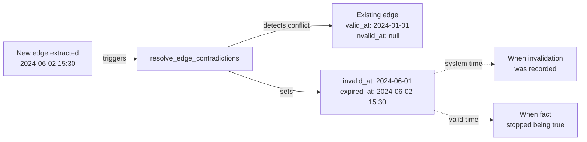

The `expired_at` timestamp records when the system determined that an edge should be invalidated. This represents system time for the invalidation operation.

**Distinction from invalid_at:**
- `invalid_at`: When the fact stopped being true (valid time).
- `expired_at`: When the system recorded this invalidation (system time).

**Usage:**
- Set to `utc_now()` when a contradiction is detected.
- Marks edges as logically deleted (soft delete) from the "current" view of the graph.
- Enables audit trails of how the system's knowledge evolved over time.

Sources: [graphiti_core/edges.py:271-273]()

## Temporal Data Structures

### EpisodicNode Temporal Properties

Title: EpisodicNode Model
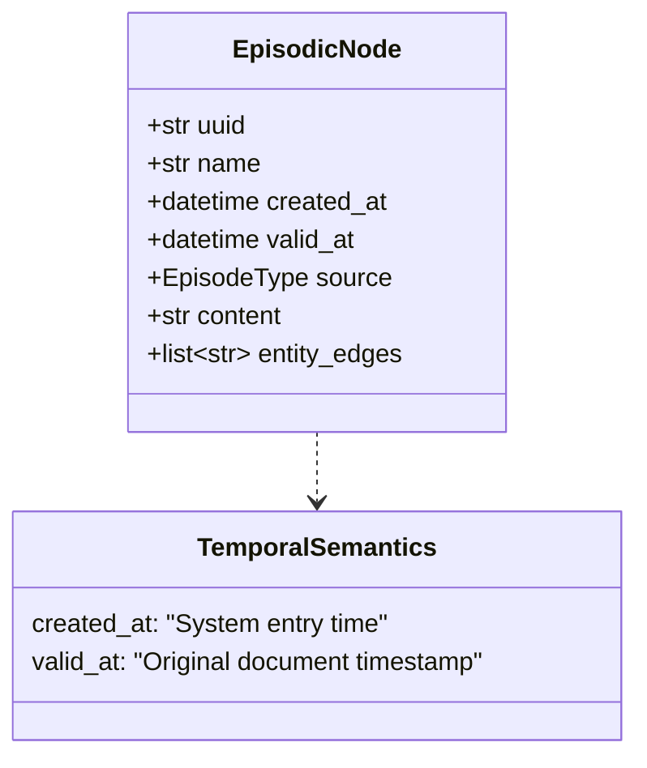

`EpisodicNode` represents a discrete event or document:
- `valid_at`: The timestamp of the event itself (e.g., when a message was sent) [graphiti_core/nodes.py:311-313]().
- `created_at`: When the node was persisted in Graphiti [graphiti_core/nodes.py:98-98]().
- `entity_edges`: A list of edge UUIDs that were extracted from this specific episode, establishing provenance [graphiti_core/nodes.py:314-317]().

Sources: [graphiti_core/nodes.py:307-317](), [graphiti_core/nodes.py:98-98]()

### EntityEdge Temporal Properties

Title: EntityEdge Model
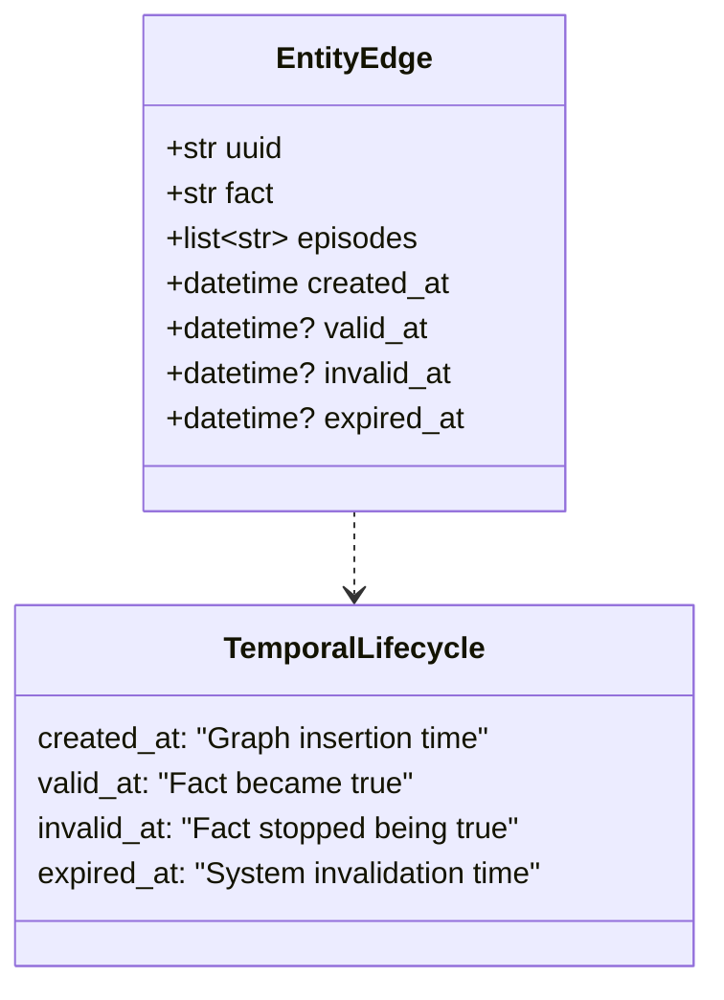

`EntityEdge` tracks the lifecycle of facts:
- `episodes`: List of episode UUIDs that support or mention this fact [graphiti_core/edges.py:267-270]().
- `created_at`: When the edge was first created [graphiti_core/edges.py:54-54]().
- `valid_at`, `invalid_at`: The period during which the fact was true in the real world [graphiti_core/edges.py:274-279]().
- `expired_at`: When the system marked the fact as no longer active [graphiti_core/edges.py:271-273]().

Sources: [graphiti_core/edges.py:263-279](), [graphiti_core/edges.py:54-54]()

## Point-in-Time Queries

Graphiti supports temporal queries through the `SearchFilters` system and database-level temporal filtering. Functions like `retrieve_episodes` allow for querying the graph's state at a specific point in time by using a `reference_time` argument to filter `EpisodicNode.valid_at` [graphiti_core/utils/maintenance/graph_data_operations.py:67-90]().

### Temporal Search Filters

The `SearchFilters` system enables filtering search results across all four temporal dimensions. It supports operators for `created_at`, `valid_at`, `invalid_at`, and `expired_at`.

Title: SearchFilters Structure
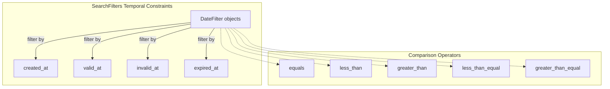

Sources: [graphiti_core/search/search_filters.py:55-68](), [graphiti_core/search/search_filters.py:149-213]()

## Episode Provenance Tracking

### episodes Array on EntityEdge

Title: Edge Provenance
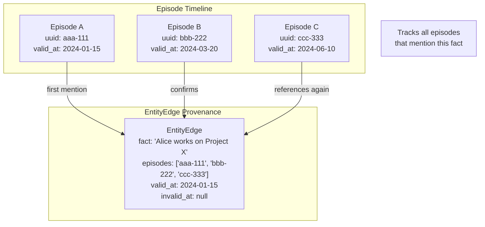

The `episodes` array on `EntityEdge` records which episodes mentioned this fact [graphiti_core/edges.py:267-270](). This allows the system to trace any fact back to its original sources.

Sources: [graphiti_core/edges.py:267-270](), [graphiti_core/nodes.py:314-317]()

### entity_edges Array on EpisodicNode

The `entity_edges` array on `EpisodicNode` provides the inverse relationship, listing all edges extracted from this episode [graphiti_core/nodes.py:314-317]().

Title: Episode Extraction Provenance
```mermaid
graph LR
    subgraph "Episode"
        E["EpisodicNode<br/>uuid: episode-123<br/>entity_edges: ['edge-1', 'edge-2', 'edge-3']"]
    end
    
    subgraph "Extracted Edges"
        E1["EntityEdge<br/>uuid: edge-1"]
        E2["EntityEdge<br/>uuid: edge-2"]
        E3["EntityEdge<br/>uuid: edge-3"]
    end
    
    E -->|references| E1
    E -->|references| E2
    E -->|references| E3
    
    Note["Inverse provenance:<br/>What facts came from<br/>this episode?"]
```

Sources: [graphiti_core/nodes.py:314-317](), [graphiti_core/edges.py:267-270]()

---

<<< SECTION: 3.3 Entity and Relationship Extraction [3-3-entity-and-relationship-extraction] >>>

# Entity and Relationship Extraction

<details>
<summary>Relevant source files</summary>

The following files were used as context for generating this wiki page:

- [graphiti_core/prompts/dedupe_edges.py](graphiti_core/prompts/dedupe_edges.py)
- [graphiti_core/prompts/dedupe_nodes.py](graphiti_core/prompts/dedupe_nodes.py)
- [graphiti_core/prompts/extract_edges.py](graphiti_core/prompts/extract_edges.py)
- [graphiti_core/prompts/extract_nodes.py](graphiti_core/prompts/extract_nodes.py)
- [graphiti_core/prompts/extract_nodes_and_edges.py](graphiti_core/prompts/extract_nodes_and_edges.py)
- [graphiti_core/prompts/lib.py](graphiti_core/prompts/lib.py)
- [graphiti_core/prompts/summarize_nodes.py](graphiti_core/prompts/summarize_nodes.py)
- [graphiti_core/utils/maintenance/attribute_utils.py](graphiti_core/utils/maintenance/attribute_utils.py)
- [graphiti_core/utils/maintenance/combined_extraction.py](graphiti_core/utils/maintenance/combined_extraction.py)
- [graphiti_core/utils/text_utils.py](graphiti_core/utils/text_utils.py)
- [tests/utils/maintenance/test_edge_operations.py](tests/utils/maintenance/test_edge_operations.py)
- [tests/utils/test_concatenate_episodes.py](tests/utils/test_concatenate_episodes.py)

</details>


This page describes how Graphiti uses Large Language Models (LLMs) to extract structured knowledge from unstructured episode content. The extraction process transforms raw text, conversations, or JSON data into entity nodes and relationship edges with type classifications, temporal metadata, and custom attributes.

This page covers the initial extraction phase. For information about how extracted entities and edges are deduplicated and resolved against the existing graph, see [Deduplication and Resolution](#3.4). For details on the complete episode processing workflow, see [Episode Processing Workflow](#5.1).

## Overview

Entity and relationship extraction is the foundational step in building a knowledge graph from episodes. The process involves:

1.  **Entity Extraction**: Identifying entities (people, places, objects) mentioned in episode content. `[graphiti_core/utils/maintenance/node_operations.py:70-149]()`
2.  **Entity Type Classification**: Assigning entity types based on configurable schemas and integer ID mappings. `[graphiti_core/utils/maintenance/node_operations.py:152-181]()`
3.  **Attribute Extraction**: Populating type-specific attributes using custom Pydantic models. `[graphiti_core/utils/maintenance/node_operations.py:441-473]()`
4.  **Relationship Extraction**: Identifying factual connections between entities. `[graphiti_core/utils/maintenance/edge_operations.py:117-182]()`
5.  **Temporal Resolution**: Extracting `valid_at` and `invalid_at` timestamps for relationships using reference times. `[graphiti_core/utils/maintenance/edge_operations.py:250-277]()`

All extraction is performed through structured LLM prompts that vary based on episode type and entity/edge schemas.

## Entity Extraction Pipeline

### Episode Type Routing

Graphiti supports three episode types, each with specialized extraction prompts. The system routes the extraction call based on the `episode.source` property within `_call_extraction_llm`.

| Episode Type | Prompt Function | Use Case | Key Features |
| :--- | :--- | :--- | :--- |
| `EpisodeType.message` | `extract_message()` | Conversational dialogue | Disambiguates pronouns, identifies speakers, handles dialogue lines. |
| `EpisodeType.json` | `extract_json()` | Structured data | Extracts entities from JSON keys and values. |
| `EpisodeType.text` | `extract_text()` | Raw documents | General entity extraction from prose and unstructured text. |

**Sources:** `[graphiti_core/prompts/extract_nodes.py:83-255]()`, `[graphiti_core/utils/maintenance/node_operations.py:221-256]()`

### Extraction Flow Diagram

The following diagram bridges the **Natural Language Space** (Episode Content) to the **Code Entity Space** (`EntityNode` objects).

```mermaid
graph TB
    Episode["EpisodicNode<br/>(content, source)"]
    Router["_call_extraction_llm()<br/>node_operations.py:221"]
    
    MessagePrompt["extract_message()<br/>extract_nodes.py:83"]
    JSONPrompt["extract_json()<br/>extract_nodes.py:216"]
    TextPrompt["extract_text()<br/>extract_nodes.py:248"]
    
    LLM["LLMClient.generate_response()<br/>response_model=ExtractedEntities"]
    
    Response["ExtractedEntities.extracted_entities<br/>list[ExtractedEntity]"]
    Filter["Filter empty names<br/>node_operations.py:135"]
    
    Convert["_create_entity_nodes()<br/>node_operations.py:259"]
    Nodes["list[EntityNode]<br/>(name, labels, group_id)"]
    
    Episode --> Router
    Router -->|"EpisodeType.message"| MessagePrompt
    Router -->|"EpisodeType.json"| JSONPrompt
    Router -->|"EpisodeType.text"| TextPrompt
    
    MessagePrompt --> LLM
    JSONPrompt --> LLM
    TextPrompt --> LLM
    
    LLM --> Response
    Response --> Filter
    Filter --> Convert
    Convert --> Nodes
```

**Sources:** `[graphiti_core/utils/maintenance/node_operations.py:70-149]()`, `[graphiti_core/prompts/extract_nodes.py:28-42]()`

### Entity Type Classification

Entity types are defined using a dictionary of Pydantic models. The system builds an `entity_types_context` array that maps integer IDs to entity type definitions to reduce token usage in prompts. `[graphiti_core/utils/maintenance/node_operations.py:152-181]()`

```python
# From _build_entity_types_context()
entity_types_context = [
    {
        'entity_type_id': 0,
        'entity_type_name': 'Entity',
        'entity_type_description': 'A specific, identifiable entity...'
    },
    {
        'entity_type_id': 1,
        'entity_type_name': 'Person',
        'entity_type_description': Person.__doc__
    }
]
```

The LLM returns `ExtractedEntity` objects with an `entity_type_id` field. `_create_entity_nodes` maps these IDs back to labels and creates `EntityNode` objects. `[graphiti_core/utils/maintenance/node_operations.py:259-307]()`

**Sources:** `[graphiti_core/utils/maintenance/node_operations.py:152-181]()`, `[graphiti_core/prompts/extract_nodes.py:28-38]()`

### Attribute Extraction and Capping

After entity classification, Graphiti extracts type-specific attributes. The system includes a safety mechanism to prevent LLM "meta-thinking" bleed from polluting the graph. The `cap_string_attributes` function drops or warns about attributes that exceed length limits defined by `GRAPHITI_ATTRIBUTE_MAX_LENGTH` or explicit `max_length` metadata on Pydantic fields. `[graphiti_core/utils/maintenance/attribute_utils.py:141-172]()`

**Sources:** `[graphiti_core/utils/maintenance/attribute_utils.py:32-37]()`, `[graphiti_core/utils/maintenance/attribute_utils.py:141-172]()`

### Entity Summarization

Entity summaries are generated or updated in batches to optimize LLM usage. The `_extract_entity_summaries_batch()` function processes up to 30 entities per LLM call (controlled by `MAX_NODES = 30`). `[graphiti_core/utils/maintenance/node_operations.py:63-63]()`, `[graphiti_core/utils/maintenance/node_operations.py:675-683]()`

**Sources:** `[graphiti_core/utils/maintenance/node_operations.py:63-63]()`, `[graphiti_core/utils/maintenance/node_operations.py:675-683]()`

## Relationship Extraction Pipeline

### Edge Extraction Process

Relationship extraction identifies factual connections between the entities found in the episode. The `extract_edges()` function builds edge type context and calls the LLM to identify facts that involve two distinct entities from the provided list. `[graphiti_core/utils/maintenance/edge_operations.py:117-248]()`

```mermaid
graph TB
    Input["episode: EpisodicNode<br/>nodes: list[EntityNode]<br/>edge_type_map: dict"]
    
    BuildContext["Build edge_types_context<br/>with fact_type_signatures<br/>edge_operations.py:152"]
    BuildMap["Build name_to_node mapping<br/>for validation<br/>edge_operations.py:168"]
    
    Prompt["prompt_library.extract_edges.edge()<br/>extract_edges.py:94"]
    LLM["LLMClient.generate_response()<br/>response_model=ExtractedEdges"]
    
    Response["ExtractedEdges.edges<br/>list[Edge]"]
    Validate["Validate source_entity_name<br/>and target_entity_name<br/>exist in nodes<br/>edge_operations.py:206"]
    
    CreateEdges["Create EntityEdge objects<br/>with temporal fields<br/>edge_operations.py:250"]
    Output["list[EntityEdge]"]
    
    Input --> BuildContext
    Input --> BuildMap
    BuildContext --> Prompt
    Prompt --> LLM
    LLM --> Response
    Response --> Validate
    Validate --> CreateEdges
    CreateEdges --> Output
```

**Sources:** `[graphiti_core/utils/maintenance/edge_operations.py:117-248]()`, `[graphiti_core/prompts/extract_edges.py:94-141]()`

### Combined Node and Edge Extraction

For optimized processing, Graphiti provides a combined extraction path via `extract_nodes_and_edges`. This allows the LLM to extract both entities and relationship facts in a single pass, which ensures every entity has at least one connecting fact and reduces orphaned nodes. `[graphiti_core/utils/maintenance/combined_extraction.py:41-81]()`

The combined prompt includes specific `ENTITY RULES` and `FACT RULES` to guide the model toward high-density, retrievable information. `[graphiti_core/prompts/extract_nodes_and_edges.py:101-147]()`

**Sources:** `[graphiti_core/utils/maintenance/combined_extraction.py:51-56]()`, `[graphiti_core/prompts/extract_nodes_and_edges.py:91-147]()`

### Temporal Information Extraction

The edge extraction prompt instructs the LLM to extract temporal metadata using the episode's timestamp as an anchor. `[graphiti_core/prompts/extract_edges.py:108-110]()`

| Field | Description | Format | Example Use Case |
| :--- | :--- | :--- | :--- |
| `valid_at` | When relationship became true | ISO 8601 (UTC) | "John started working at Acme on 2024-03-15" |
| `invalid_at` | When relationship ended | ISO 8601 (UTC) | "John left Acme on 2024-12-01" |

The extraction prompt includes specific rules for temporal resolution, such as using `REFERENCE_TIME` to resolve vague expressions like "last week". `[graphiti_core/prompts/extract_edges.py:127-129]()`

**Sources:** `[graphiti_core/prompts/extract_edges.py:40-47]()`, `[graphiti_core/utils/maintenance/edge_operations.py:253-277]()`

## Prompt System Architecture

### Prompt Function Interface

All extraction prompts follow a consistent interface defined by the `PromptFunction` type. The prompt library organizes prompts by category, such as `extract_nodes` and `extract_edges`. `[graphiti_core/prompts/lib.py:47-56]()`

```mermaid
graph TB
    Library["PromptLibraryWrapper<br/>lib.py:86"]
    
    ExtractNodes["extract_nodes<br/>extract_nodes.py"]
    ExtractEdges["extract_edges<br/>extract_edges.py"]
    DedupeNodes["dedupe_nodes<br/>dedupe_nodes.py"]
    DedupeEdges["dedupe_edges<br/>dedupe_edges.py"]
    
    ENMessage["extract_message()"]
    ENJSON["extract_json()"]
    ENText["extract_text()"]
    ENAttrs["extract_attributes()"]
    ENSummary["extract_summaries_batch()"]
    
    EEEdge["edge()"]
    EEAttrs["extract_attributes()"]
    
    Library --> ExtractNodes
    Library --> ExtractEdges
    Library --> DedupeNodes
    Library --> DedupeEdges
    
    ExtractNodes --> ENMessage
    ExtractNodes --> ENJSON
    ExtractNodes --> ENText
    ExtractNodes --> ENAttrs
    ExtractNodes --> ENSummary
    
    ExtractEdges --> EEEdge
    ExtractEdges --> EEAttrs
```

**Sources:** `[graphiti_core/prompts/extract_nodes.py:72-80]()`, `[graphiti_core/prompts/extract_edges.py:87-92]()`, `[graphiti_core/prompts/lib.py:86-102]()`

### Structured Output Validation

All extraction prompts use Pydantic models for structured output to ensure consistency and type safety.

Key response models include:
*   `ExtractedEntities`: Contains `list[ExtractedEntity]` with `name` and `entity_type_id`. `[graphiti_core/prompts/extract_nodes.py:41-42]()`
*   `ExtractedEdges`: Contains `list[Edge]` with source/target names, fact, and temporal fields. `[graphiti_core/prompts/extract_edges.py:55-56]()`
*   `CombinedExtraction`: Merged response containing both `extracted_entities` and `edges`. `[graphiti_core/prompts/extract_nodes_and_edges.py:61-66]()`

**Sources:** `[graphiti_core/prompts/extract_nodes.py:28-58]()`, `[graphiti_core/prompts/extract_edges.py:25-56]()`, `[graphiti_core/prompts/extract_nodes_and_edges.py:61-66]()`

## Complete Extraction Pipeline

### End-to-End Flow

The following sequence shows how extraction integrates into the overall episode processing pipeline.

```mermaid
sequenceDiagram
    participant Graphiti
    participant NodeOps as node_operations.py
    participant EdgeOps as edge_operations.py
    participant LLM as LLMClient
    participant Embedder
    
    Note over Graphiti: Phase 1: Entity Extraction
    Graphiti->>NodeOps: extract_nodes(episode, previous_episodes, entity_types)
    NodeOps->>NodeOps: _build_entity_types_context()
    NodeOps->>LLM: _call_extraction_llm()<br/>→ ExtractedEntities
    LLM-->>NodeOps: extracted_entities
    NodeOps->>NodeOps: _create_entity_nodes()<br/>(filter & classify)
    NodeOps-->>Graphiti: list[EntityNode] (unresolved)
    
    Note over Graphiti: (Resolution happens here - see 3.4)
    
    Note over Graphiti: Phase 2: Attribute Enrichment
    Graphiti->>NodeOps: extract_attributes_from_nodes(nodes, episode)
    
    loop For each node
        NodeOps->>LLM: extract_attributes()<br/>→ entity_type model
        LLM-->>NodeOps: attributes dict
        NodeOps->>NodeOps: node.attributes.update()
    end
    
    NodeOps->>NodeOps: _extract_entity_summaries_batch()<br/>(max 30 nodes per call)
    NodeOps->>LLM: extract_summaries_batch()<br/>→ SummarizedEntities
    LLM-->>NodeOps: summaries
    NodeOps->>Embedder: create_entity_node_embeddings()
    NodeOps-->>Graphiti: list[EntityNode] (hydrated)
    
    Note over Graphiti: Phase 3: Edge Extraction
    Graphiti->>EdgeOps: extract_edges(episode, nodes, edge_type_map)
    EdgeOps->>EdgeOps: Build edge_type_signatures_map
    EdgeOps->>LLM: edge()<br/>→ ExtractedEdges
    LLM-->>EdgeOps: edges with temporal info
    EdgeOps->>EdgeOps: Validate entity names<br/>Parse valid_at/invalid_at
    EdgeOps->>EdgeOps: Create EntityEdge objects
    EdgeOps-->>Graphiti: list[EntityEdge] (unresolved)
```

**Sources:** `[graphiti_core/utils/maintenance/node_operations.py:70-149]()`, `[graphiti_core/utils/maintenance/edge_operations.py:117-248]()`, `[graphiti_core/utils/maintenance/node_operations.py:441-473]()`, `[graphiti_core/utils/maintenance/node_operations.py:675-731]()`

---

<<< SECTION: 3.4 Deduplication and Resolution [3-4-deduplication-and-resolution] >>>

# Deduplication and Resolution

<details>
<summary>Relevant source files</summary>

The following files were used as context for generating this wiki page:

- [AGENTS.md](AGENTS.md)
- [CONTRIBUTING.md](CONTRIBUTING.md)
- [README.md](README.md)
- [examples/quickstart/README.md](examples/quickstart/README.md)
- [graphiti_core/driver/kuzu_driver.py](graphiti_core/driver/kuzu_driver.py)
- [graphiti_core/driver/neptune_driver.py](graphiti_core/driver/neptune_driver.py)
- [graphiti_core/prompts/dedupe_edges.py](graphiti_core/prompts/dedupe_edges.py)
- [graphiti_core/prompts/dedupe_nodes.py](graphiti_core/prompts/dedupe_nodes.py)
- [graphiti_core/prompts/extract_edges.py](graphiti_core/prompts/extract_edges.py)
- [graphiti_core/prompts/extract_nodes.py](graphiti_core/prompts/extract_nodes.py)
- [graphiti_core/prompts/summarize_nodes.py](graphiti_core/prompts/summarize_nodes.py)
- [graphiti_core/utils/maintenance/__init__.py](graphiti_core/utils/maintenance/__init__.py)
- [graphiti_core/utils/maintenance/dedup_helpers.py](graphiti_core/utils/maintenance/dedup_helpers.py)
- [tests/helpers_test.py](tests/helpers_test.py)
- [tests/test_add_triplet.py](tests/test_add_triplet.py)
- [tests/test_graphiti_mock.py](tests/test_graphiti_mock.py)
- [tests/utils/maintenance/test_edge_operations.py](tests/utils/maintenance/test_edge_operations.py)

</details>


This page explains how Graphiti resolves duplicate entities and relationships during episode ingestion. The system uses a three-tier strategy for node deduplication (exact match, fuzzy similarity via MinHash/LSH, and LLM reasoning) and handles both edge deduplication and contradiction detection with temporal invalidation.

## Overview

During episode ingestion, extracted nodes and edges must be resolved against existing graph entities to prevent duplicates and maintain consistency. The deduplication system operates in two phases:

1.  **Node Resolution**: Extracted entity nodes are matched against existing nodes using deterministic heuristics before escalating to LLM-based resolution via `resolve_extracted_nodes` [graphiti_core/utils/maintenance/node_operations.py:31-31]().
2.  **Edge Resolution**: Extracted edges are checked for duplicates and contradictions using `resolve_extracted_edges` [graphiti_core/utils/maintenance/edge_operations.py:225-225](), with temporal invalidation of outdated information.

The system prioritizes performance by using fast deterministic methods first, only invoking the LLM when necessary. This minimizes API costs while maintaining high accuracy.

**Sources**: [graphiti_core/utils/maintenance/node_operations.py:31-31](), [graphiti_core/utils/maintenance/edge_operations.py:225-225]()

## Node Deduplication: Three-Tier Strategy

### Architecture Overview

The node deduplication process follows a tiered escalation strategy where each tier handles cases the previous tier couldn't resolve. The primary entry point for this logic is `resolve_extracted_nodes` [graphiti_core/utils/maintenance/node_operations.py:31-31]().

**Tiered Resolution Flow**
```mermaid
graph TB
    Extract["Extracted Nodes<br/>(from extract_nodes)"]
    
    Collect["_collect_candidate_nodes()<br/>Search for similar existing nodes"]
    
    BuildIdx["_build_candidate_indexes()<br/>normalized_existing<br/>shingles_by_candidate<br/>lsh_buckets"]
    
    Tier1["Tier 1: Exact Match<br/>_normalize_string_exact()<br/>Case-insensitive, whitespace normalized"]
    
    Tier2["Tier 2: Fuzzy Similarity<br/>_resolve_with_similarity()<br/>MinHash + LSH + Jaccard"]
    
    Tier3["Tier 3: LLM Reasoning<br/>_resolve_with_llm()<br/>dedupe_nodes.nodes prompt"]
    
    State["DedupResolutionState<br/>resolved_nodes<br/>uuid_map<br/>unresolved_indices<br/>duplicate_pairs"]
    
    Final["Resolved Nodes<br/>+ UUID Map<br/>+ Duplicate Pairs"]
    
    Extract --> Collect
    Collect --> BuildIdx
    BuildIdx --> State
    
    State --> Tier1
    Tier1 -->|"Exact match found"| State
    Tier1 -->|"No match or multiple"| Tier2
    
    Tier2 -->|"High entropy + fuzzy match"| State
    Tier2 -->|"Low entropy or no match"| Tier3
    
    Tier3 --> State
    
    State --> Final
```
**Sources**: [graphiti_core/utils/maintenance/node_operations.py:31-31](), [graphiti_core/utils/maintenance/dedup_helpers.py:161-175](), [graphiti_core/utils/maintenance/node_operations.py:217-222]()

### Tier 1: Exact String Matching

The first tier normalizes entity names and performs case-insensitive, whitespace-normalized comparison. This happens within `_resolve_with_similarity` [graphiti_core/utils/maintenance/dedup_helpers.py:196-196]().

| Normalization Function | Operation | Example |
| :--- | :--- | :--- |
| `_normalize_string_exact()` | Lowercase, collapse whitespace | `"  Alice   Smith "` → `"alice smith"` |
| `_normalize_name_for_fuzzy()` | Remove punctuation, lowercase | `"Alice-Smith!"` → `"alice smith"` |

**Sources**: [graphiti_core/utils/maintenance/dedup_helpers.py:39-49](), [graphiti_core/utils/maintenance/dedup_helpers.py:52-64]()

The exact matching logic checks if a single candidate exists with the normalized name:
```python
normalized_key = _normalize_string_exact(extracted_node.name)
candidates = indexes.normalized_existing[normalized_key]

if len(candidates) == 1:
    # Single exact match - resolve immediately
    state.resolved_nodes[idx] = candidates[0]
    state.uuid_map[extracted_node.uuid] = candidates[0].uuid
```
**Sources**: [graphiti_core/utils/maintenance/dedup_helpers.py:214-222]()

### Tier 2: Fuzzy Similarity with MinHash and LSH

For entities that don't match exactly, the system uses probabilistic hashing to find near-duplicates in `_resolve_with_similarity` [graphiti_core/utils/maintenance/dedup_helpers.py:196-196]().

**Fuzzy Resolution Pipeline**
```mermaid
graph LR
    Name["Entity Name:<br/>'Alice Smith'"]
    
    Shingles["_shingles()<br/>Character 3-grams"]
    
    MinHash["_minhash_signature()<br/>32 hash values"]
    
    LSH["_lsh_bands()<br/>8 bands of 4 hashes"]
    
    Buckets["lsh_buckets<br/>band_hash → [candidate_uuids]"]
    
    Jaccard["_jaccard_similarity()"]
    
    Match["Fuzzy Match<br/>if similarity ≥ 0.9"]
    
    Name --> Shingles
    Shingles --> MinHash
    MinHash --> LSH
    LSH --> Buckets
    
    Buckets --> Jaccard
    Jaccard --> Match
```
**Sources**: [graphiti_core/utils/maintenance/dedup_helpers.py:88-140]()

**Entropy-Based Gating**: Low-entropy names (e.g., "Joe") skip fuzzy matching and escalate directly to LLM reasoning to avoid false positives. This is governed by `_has_high_entropy` [graphiti_core/utils/maintenance/dedup_helpers.py:79-79](), which calculates Shannon entropy over characters.

| Constant | Value | Purpose |
| :--- | :--- | :--- |
| `_NAME_ENTROPY_THRESHOLD` | 1.5 | Minimum Shannon entropy for fuzzy matching |
| `_MIN_NAME_LENGTH` | 6 | Minimum length to trust fuzzy matching |
| `_FUZZY_JACCARD_THRESHOLD` | 0.9 | Minimum Jaccard similarity for resolution |

**Sources**: [graphiti_core/utils/maintenance/dedup_helpers.py:31-36](), [graphiti_core/utils/maintenance/dedup_helpers.py:79-85](), [graphiti_core/utils/maintenance/dedup_helpers.py:52-76]()

### Tier 3: LLM-Based Resolution

Entities that remain unresolved after Tiers 1 and 2 are batched and sent to the LLM for semantic reasoning via the `_resolve_with_llm` function [graphiti_core/utils/maintenance/node_operations.py:29-29]().

**LLM Resolution Sequence**
```mermaid
sequenceDiagram
    participant Sys as "_resolve_with_llm (node_operations.py)"
    participant Prompt as "prompt_library.dedupe_nodes.nodes"
    participant LLM as "LLMClient (llm_client.py)"
    participant State as "DedupResolutionState (dedup_helpers.py)"
    
    Sys->>Prompt: Build context with:<br/>extracted_nodes (IDs 0-N)<br/>existing_nodes
    Prompt-->>Sys: System + User messages
    
    Sys->>LLM: generate_response()<br/>response_model=NodeResolutions
    
    LLM-->>Sys: NodeResolutions object
    
    loop For each resolution
        Sys->>Sys: Validate ID and name
        alt Valid resolution
            Sys->>State: Update resolved_nodes<br/>Update uuid_map
        end
    end
```
**Sources**: [graphiti_core/utils/maintenance/node_operations.py:29-29](), [graphiti_core/prompts/dedupe_nodes.py:117-117](), [graphiti_core/llm_client/llm_client.py:42-42]()

The LLM prompt receives the `extracted_nodes`, `existing_nodes`, and the original `episode_content` to provide context for disambiguation [graphiti_core/prompts/dedupe_nodes.py:117-179]().

**Response Model**: `NodeDuplicate` [graphiti_core/prompts/dedupe_nodes.py:25-34]()
```python
class NodeDuplicate(BaseModel):
    id: int # integer id from NEW ENTITY
    name: str # most complete name
    duplicate_candidate_id: int # candidate_id of matching EXISTING ENTITY or -1
```

## Edge Deduplication and Contradiction Detection

### Integrated Resolution

Edge resolution is managed by `resolve_extracted_edges` [graphiti_core/utils/maintenance/edge_operations.py:225-225](), which combines duplicate detection and contradiction identification in an LLM invocation using the `resolve_edge` prompt [graphiti_core/prompts/dedupe_edges.py:43-43]().

**Edge Resolution Flow**
```mermaid
graph TB
    Extract["Extracted Edge<br/>(EntityEdge)"]
    
    FastPath["Fast Path:<br/>Exact fact + endpoints match?"]
    
    GetRelated["EntityEdge.get_between_nodes()<br/>Edges with same endpoints"]
    
    SearchSimilar["search() with EDGE_HYBRID_SEARCH_RRF"]
    
    LLMCall["LLM: resolve_edge prompt<br/>EXISTING FACTS (idx 0-N)<br/>INVALIDATION CANDIDATES (idx N-M)"]
    
    Resolve["resolve_edge_contradictions()<br/>Temporal invalidation logic"]
    
    Result["Resolved Edge<br/>+ Invalidated Edges"]
    
    Extract --> FastPath
    FastPath -->|"Match found"| Result
    FastPath -->|"No match"| GetRelated
    
    GetRelated --> SearchSimilar
    SearchSimilar --> LLMCall
    LLMCall --> Resolve
    Resolve --> Result
```
**Sources**: [graphiti_core/utils/maintenance/edge_operations.py:107-107](), [graphiti_core/prompts/dedupe_edges.py:43-91](), [graphiti_core/utils/maintenance/edge_operations.py:225-225]()

### Fast Path: Exact Fact Matching

In `resolve_extracted_edge` [graphiti_core/utils/maintenance/edge_operations.py:107-107](), the system first checks for an exact semantic match (normalized string) between the new fact and existing edges between the same two nodes. If found, it short-circuits the LLM call and appends the new episode UUID to the existing edge [tests/utils/maintenance/test_edge_operations.py:108-152]().

**Sources**: [graphiti_core/utils/maintenance/edge_operations.py:107-152](), [tests/utils/maintenance/test_edge_operations.py:108-152]()

### Temporal Contradiction Resolution

When the LLM identifies a contradiction (via `contradicted_facts` in the `EdgeDuplicate` response [graphiti_core/prompts/dedupe_edges.py:24-33]()), the system performs temporal invalidation. If the new fact is more recent based on `valid_at` timestamps, the existing fact's `invalid_at` is updated to the new fact's `valid_at`, effectively "retiring" the old information [graphiti_core/prompts/dedupe_edges.py:79-84]().

**Sources**: [graphiti_core/prompts/dedupe_edges.py:24-33](), [graphiti_core/prompts/dedupe_edges.py:79-84]()

## Data Structures

### DedupResolutionState
Tracks the progress of resolution for a batch of nodes [graphiti_core/utils/maintenance/dedup_helpers.py:161-168]().
```python
@dataclass
class DedupResolutionState:
    resolved_nodes: list[EntityNode | None]
    uuid_map: dict[str, str]
    unresolved_indices: list[int]
    duplicate_pairs: list[tuple[EntityNode, EntityNode]] = field(default_factory=list)
```
**Sources**: [graphiti_core/utils/maintenance/dedup_helpers.py:161-168]()

### DedupCandidateIndexes
Stores precomputed lookup structures for exact and fuzzy matching [graphiti_core/utils/maintenance/dedup_helpers.py:150-158]().
```python
@dataclass
class DedupCandidateIndexes:
    existing_nodes: list[EntityNode]
    nodes_by_uuid: dict[str, EntityNode]
    normalized_existing: defaultdict[str, list[EntityNode]]
    shingles_by_candidate: dict[str, set[str]]
    lsh_buckets: defaultdict[tuple[int, tuple[int, ...]], list[str]]
```
**Sources**: [graphiti_core/utils/maintenance/dedup_helpers.py:150-158]()

## Integration with Episode Processing

Deduplication is a core part of the processing pipeline. After nodes are extracted via `extract_nodes` [graphiti_core/utils/maintenance/node_operations.py:69-69](), they are resolved. The resulting `uuid_map` is then used to update the `source_node_uuid` and `target_node_uuid` of extracted edges before they are themselves resolved via `resolve_extracted_edges` [graphiti_core/utils/maintenance/edge_operations.py:225-225]().

**Sources**: [graphiti_core/utils/maintenance/node_operations.py:69-148](), [graphiti_core/utils/maintenance/edge_operations.py:225-232]()

---

<<< SECTION: 4 System Architecture [4-system-architecture] >>>

# System Architecture

<details>
<summary>Relevant source files</summary>

The following files were used as context for generating this wiki page:

- [AGENTS.md](AGENTS.md)
- [CONTRIBUTING.md](CONTRIBUTING.md)
- [README.md](README.md)
- [examples/quickstart/README.md](examples/quickstart/README.md)
- [graphiti_core/driver/kuzu_driver.py](graphiti_core/driver/kuzu_driver.py)
- [graphiti_core/driver/neptune_driver.py](graphiti_core/driver/neptune_driver.py)
- [graphiti_core/graphiti.py](graphiti_core/graphiti.py)
- [graphiti_core/utils/maintenance/dedup_helpers.py](graphiti_core/utils/maintenance/dedup_helpers.py)
- [graphiti_core/utils/maintenance/edge_operations.py](graphiti_core/utils/maintenance/edge_operations.py)
- [graphiti_core/utils/maintenance/node_operations.py](graphiti_core/utils/maintenance/node_operations.py)
- [tests/helpers_test.py](tests/helpers_test.py)
- [tests/test_add_triplet.py](tests/test_add_triplet.py)
- [tests/test_graphiti_mock.py](tests/test_graphiti_mock.py)

</details>


This page covers the high-level architecture of **graphiti-core**: the central `Graphiti` orchestrator class, the `GraphitiClients` service container, the pluggable AI provider and database driver system, and the overall data flow from episode ingestion to graph storage and retrieval.

For detailed API documentation of individual subsystems, see: [Graphiti Core Client](#4.1), [Data Models and Schemas](#4.2), [Search and Retrieval System](#4.3), [Multi-Provider Plugin Architecture](#4.4), [Database Abstraction Layer](#4.5). For the step-by-step episode processing pipeline, see [Data Processing Pipeline](#5).

---

## Architecture Overview

Graphiti follows a three-tier architecture where user-facing operations flow through the `Graphiti` orchestrator class ([graphiti_core/graphiti.py:137-151]()), which coordinates knowledge extraction pipelines, search operations, and community detection. All AI service calls and database operations are routed through pluggable provider interfaces, making the graph backend, LLM provider, and embedding service independently swappable.

**Three-Tier Architecture**

```mermaid
graph TB
    subgraph tier1["Tier 1: User Interface Layer"]
        Graphiti["Graphiti class<br/>(graphiti.py:137)"]
        NodeNamespace["NodeNamespace<br/>(namespaces.py:50)"]
        EdgeNamespace["EdgeNamespace<br/>(namespaces.py:50)"]
    end
    
    subgraph tier2["Tier 2: Service Orchestration"]
        GraphitiClients["GraphitiClients<br/>(graphiti_types.py:42)"]
        EpisodeProcessor["Episode Processing<br/>extract_nodes()<br/>extract_edges()<br/>(utils/maintenance/)"]
        SearchEngine["Search Engine<br/>search()<br/>(search/search.py:62)"]
        CommunityBuilder["Community Builder<br/>build_communities()<br/>(utils/maintenance/community_operations.py:87)"]
    end
    
    subgraph tier3["Tier 3: Pluggable Providers"]
        LLMClient["LLMClient<br/>OpenAIClient<br/>AnthropicClient<br/>GeminiClient<br/>GroqClient"]
        EmbedderClient["EmbedderClient<br/>OpenAIEmbedder<br/>VoyageAIEmbedder<br/>GeminiEmbedder"]
        CrossEncoderClient["CrossEncoderClient<br/>OpenAIRerankerClient<br/>GeminiRerankerClient"]
        GraphDriver["GraphDriver<br/>Neo4jDriver<br/>FalkorDriver<br/>KuzuDriver<br/>NeptuneDriver"]
    end
    
    Graphiti --> GraphitiClients
    Graphiti --> NodeNamespace
    Graphiti --> EdgeNamespace
    
    GraphitiClients --> LLMClient
    GraphitiClients --> EmbedderClient
    GraphitiClients --> CrossEncoderClient
    GraphitiClients --> GraphDriver
    
    EpisodeProcessor --> GraphitiClients
    SearchEngine --> GraphitiClients
    CommunityBuilder --> GraphitiClients
    
    Graphiti --> EpisodeProcessor
    Graphiti --> SearchEngine
    Graphiti --> CommunityBuilder
```

Sources: [graphiti_core/graphiti.py:137-246](), [graphiti_core/graphiti_types.py:42-42](), [graphiti_core/utils/maintenance/node_operations.py:70-77](), [graphiti_core/utils/maintenance/edge_operations.py:117-126](), [graphiti_core/utils/maintenance/community_operations.py:86-90]()

---

## The `Graphiti` Orchestrator

`Graphiti` ([graphiti_core/graphiti.py:137]()) is the top-level class. Construction accepts direct connection credentials (for a default `Neo4jDriver`) or a pre-configured `GraphDriver` instance via `graph_driver` ([graphiti_core/graphiti.py:147]()). All service clients default to OpenAI-backed implementations if not provided ([graphiti_core/graphiti.py:166-174]()).

### Constructor Parameters

| Parameter | Type | Default | Purpose |
|---|---|---|---|
| `uri` | `str \| None` | — | Graph database URI (used when `graph_driver` is `None`) |
| `user` | `str \| None` | — | Database username |
| `password` | `str \| None` | — | Database password |
| `llm_client` | `LLMClient \| None` | `OpenAIClient()` | LLM for entity/edge extraction and deduplication |
| `embedder` | `EmbedderClient \| None` | `OpenAIEmbedder()` | Vector embedding service |
| `cross_encoder` | `CrossEncoderClient \| None` | `OpenAIRerankerClient()` | Reranker for search result scoring |
| `store_raw_episode_content` | `bool` | `True` | Whether to persist raw episode text in the graph |
| `graph_driver` | `GraphDriver \| None` | `Neo4jDriver(...)` | Inject a pre-configured driver directly |
| `max_coroutines` | `int \| None` | env `SEMAPHORE_LIMIT` | Concurrency cap for async operations |
| `tracer` | `Tracer \| None` | no-op | OpenTelemetry tracer instance |
| `trace_span_prefix` | `str` | `'graphiti'` | Prefix applied to all trace span names |

Sources: [graphiti_core/graphiti.py:138-186](), [graphiti_core/helpers.py:38-38]()

### Key Public Methods

| Method | Returns | Description |
|---|---|---|
| `add_episode(...)` | `AddEpisodeResults` | Ingest one episode; extract, resolve, and persist entities and relationships |
| `add_episode_bulk(...)` | `AddBulkEpisodeResults` | Batch-ingest a list of `RawEpisode` objects with shared deduplication |
| `add_triplet(...)` | `AddTripletResults` | Directly add a relationship between two nodes with attribute merging |
| `search(...)` | `SearchResults` | Hybrid search returning edges, nodes, episodes, and communities |
| `retrieve_episodes(...)` | `list[EpisodicNode]` | Fetch the `n` most recent episodes relative to a reference time |
| `build_indices_and_constraints()` | `None` | Create database indexes and constraints (run once during setup) |
| `close()` | `None` | Gracefully close the underlying graph driver connection |

Sources: [graphiti_core/graphiti.py:114-136](), [graphiti_core/graphiti.py:311-342](), [graphiti_core/graphiti.py:393-426](), [graphiti_core/graphiti.py:735-786](), [graphiti_core/graphiti.py:788-806]()

### `GraphitiClients` Container

`GraphitiClients` ([graphiti_core/graphiti_types.py:42]()) is a dataclass that bundles the service clients into a single object passed to all internal pipeline functions. This eliminates redundant parameter passing through the call stack.

```python
# Created in Graphiti.__init__
self.clients = GraphitiClients(
    driver=self.driver,           # GraphDriver instance
    llm_client=self.llm_client,   # LLMClient instance
    embedder=self.embedder,       # EmbedderClient instance
    cross_encoder=self.cross_encoder,  # CrossEncoderClient instance
    tracer=self.tracer,           # Tracer instance
)
```

Functions consuming `GraphitiClients`:
- `extract_nodes(clients, ...)` - [graphiti_core/utils/maintenance/node_operations.py:70-71]()
- `resolve_extracted_nodes(clients, ...)` - [graphiti_core/utils/maintenance/node_operations.py:104]()
- `extract_edges(clients, ...)` - [graphiti_core/utils/maintenance/edge_operations.py:117-118]()
- `resolve_extracted_edges(clients, ...)` - [graphiti_core/utils/maintenance/edge_operations.py:95]()
- `search(clients, ...)` - [graphiti_core/search/search.py:62]()

Sources: [graphiti_core/graphiti.py:232-238](), [graphiti_core/graphiti_types.py:42-42]()

---

## Pluggable Provider System

All service interfaces are defined as abstract base classes. Concrete implementations are injected at `Graphiti` construction time, enabling independent swapping of providers.

**Provider Interface Mapping**

```mermaid
graph LR
    subgraph interfaces["Abstract Interfaces"]
        LLMClient["LLMClient<br/>(llm_client.py:49)"]
        EmbedderClient["EmbedderClient<br/>(embedder/client.py)"]
        CrossEncoderClient["CrossEncoderClient<br/>(cross_encoder/client.py)"]
        GraphDriver["GraphDriver<br/>(driver/driver.py:90)"]
    end
    
    subgraph llm_impls["LLM Implementations"]
        OpenAIClient["OpenAIClient<br/>(llm_client.py:49)"]
        AnthropicClient["AnthropicClient"]
        GeminiClient["GeminiClient"]
        GroqClient["GroqClient"]
    end
    
    subgraph emb_impls["Embedder Implementations"]
        OpenAIEmbedder["OpenAIEmbedder<br/>(embedder/__init__.py)"]
        VoyageAIEmbedder["VoyageAIEmbedder"]
        GeminiEmbedder["GeminiEmbedder"]
    end
    
    subgraph db_impls["Database Implementations"]
        Neo4jDriver["Neo4jDriver<br/>(driver/neo4j_driver.py:60)"]
        FalkorDriver["FalkorDriver<br/>(driver/falkordb_driver.py:110)"]
        KuzuDriver["KuzuDriver<br/>(driver/kuzu_driver.py:137)"]
        NeptuneDriver["NeptuneDriver<br/>(driver/neptune_driver.py:139)"]
    end
    
    LLMClient -.->|implements| OpenAIClient
    LLMClient -.->|implements| AnthropicClient
    LLMClient -.->|implements| GeminiClient
    LLMClient -.->|implements| GroqClient
    
    EmbedderClient -.->|implements| OpenAIEmbedder
    EmbedderClient -.->|implements| VoyageAIEmbedder
    EmbedderClient -.->|implements| GeminiEmbedder
    
    GraphDriver -.->|implements| Neo4jDriver
    GraphDriver -.->|implements| FalkorDriver
    GraphDriver -.->|implements| KuzuDriver
    GraphDriver -.->|implements| NeptuneDriver
```

| Role | Abstract Base Class | Default Implementation | File Path |
|---|---|---|---|
| LLM inference | `LLMClient` | `OpenAIClient` | [graphiti_core/llm_client/__init__.py]() |
| Vector embedding | `EmbedderClient` | `OpenAIEmbedder` | [graphiti_core/embedder/__init__.py]() |
| Search reranking | `CrossEncoderClient` | `OpenAIRerankerClient` | [graphiti_core/cross_encoder/openai_reranker_client.py]() |
| Graph database | `GraphDriver` | `Neo4jDriver` | [graphiti_core/driver/neo4j_driver.py:60]() |

Sources: [graphiti_core/graphiti.py:203-238](), [graphiti_core/driver/driver.py:59-64](), [graphiti_core/driver/driver.py:90-96]()

---

## Database Abstraction Layer

The graph database layer uses a three-tier architecture to support multiple backends like Neo4j, FalkorDB, and Neptune.

**GraphDriver Architecture**

```mermaid
graph TD
    subgraph tier1 ["Tier 1: Core ABC (driver/driver.py)"]
        GraphDriver["GraphDriver (ABC)<br/>(driver.py:90)"]
        GraphProvider["GraphProvider (Enum):<br/>NEO4J, FALKORDB, KUZU, NEPTUNE<br/>(driver.py:59)"]
        GraphDriverSession["GraphDriverSession (ABC)<br/>(driver.py:66)"]
        QueryExecutor["QueryExecutor (Protocol)<br/>(driver/query_executor.py)"]
    end

    subgraph tier2 ["Tier 2: Operations ABCs (driver/operations/)"]
        NodeOps["EntityNodeOperations<br/>EpisodeNodeOperations<br/>CommunityNodeOperations<br/>SagaNodeOperations"]
        EdgeOps["EntityEdgeOperations<br/>EpisodicEdgeOperations<br/>CommunityEdgeOperations<br/>HasEpisodeEdgeOperations<br/>NextEpisodeEdgeOperations"]
        SvcOps["SearchOperations<br/>GraphMaintenanceOperations"]
    end

    subgraph tier3 ["Tier 3: Concrete Drivers"]
        Neo4jDriver["Neo4jDriver<br/>(neo4j_driver.py:60)"]
        FalkorDriver["FalkorDriver<br/>(falkordb_driver.py:110)"]
        KuzuDriver["KuzuDriver<br/>(kuzu_driver.py:137)"]
        NeptuneDriver["NeptuneDriver<br/>(neptune_driver.py:139)"]
    end

    GraphDriver --> Neo4jDriver
    GraphDriver --> FalkorDriver
    GraphDriver --> KuzuDriver
    GraphDriver --> NeptuneDriver
    Neo4jDriver --> |"exposes via @property"| tier2
    FalkorDriver --> |"exposes via @property"| tier2
    KuzuDriver --> |"exposes via @property"| tier2
    NeptuneDriver --> |"exposes via @property"| tier2
```

### Operations Interfaces

Each concrete driver instantiates operations classes in `__init__` and exposes them as `@property` accessors. For example, `KuzuDriver` instantiates `KuzuEntityNodeOperations` and others ([graphiti_core/driver/kuzu_driver.py:160-170]()) and exposes them through properties like `entity_node_ops` ([graphiti_core/driver/kuzu_driver.py:175-176]()).

| Category | ABCs |
|---|---|
| Node operations | `EntityNodeOperations`, `EpisodeNodeOperations`, `CommunityNodeOperations`, `SagaNodeOperations` |
| Edge operations | `EntityEdgeOperations`, `EpisodicEdgeOperations`, `CommunityEdgeOperations`, `HasEpisodeEdgeOperations`, `NextEpisodeEdgeOperations` |
| Search & maintenance | `SearchOperations`, `GraphMaintenanceOperations` |

Sources: [graphiti_core/driver/driver.py:59-212](), [graphiti_core/driver/neo4j_driver.py:60-150](), [graphiti_core/driver/kuzu_driver.py:137-210](), [graphiti_core/driver/neptune_driver.py:139-200]()

---

## Episode Ingestion Data Flow

The `add_episode` method ([graphiti_core/graphiti.py:788]()) orchestrates a multi-phase pipeline from raw text to structured graph data.

**Episode Processing Pipeline with Function Calls**

```mermaid
flowchart TD
    A["Graphiti.add_episode()<br/>(graphiti.py:788)"] --> B["validate_entity_types()<br/>validate_excluded_entity_types()<br/>(helpers.py:189)"]
    B --> C["resolve group_id<br/>clone driver if needed<br/>(graphiti.py:881)"]
    
    C --> D["Phase 1: Context Retrieval"]
    D --> E["retrieve_episodes()<br/>(utils/maintenance/graph_data_operations.py:99)"]
    E --> F["create EpisodicNode<br/>(nodes.py:55)"]
    
    F --> G["Phase 2: Node Extraction & Resolution"]
    G --> H["extract_nodes()<br/>(utils/maintenance/node_operations.py:70)"]
    H --> I["resolve_extracted_nodes()<br/>(utils/maintenance/node_operations.py:104)"]
    
    I --> J["Phase 3: Edge Extraction & Resolution"]
    J --> K["extract_edges()<br/>(utils/maintenance/edge_operations.py:117)"]
    K --> L["resolve_edge_pointers()<br/>(utils/bulk_utils.py:82)"]
    L --> M["resolve_extracted_edges()<br/>(utils/maintenance/edge_operations.py:95)"]
    
    M --> N["Phase 4: Attribute Enrichment"]
    N --> O["extract_attributes_from_nodes()<br/>(utils/maintenance/node_operations.py:102)"]
    
    O --> P["Phase 5: Persistence"]
    P --> Q["build_episodic_edges()<br/>(utils/maintenance/edge_operations.py:52)"]
    Q --> R["add_nodes_and_edges_bulk()<br/>(utils/bulk_utils.py:78)"]
    
    R --> S{"saga provided?"}
    S -->|yes| T["_get_or_create_saga()<br/>save HasEpisodeEdge<br/>save NextEpisodeEdge<br/>(graphiti.py:343)"]
    S -->|no| U{"update_communities?"}
    T --> U
    U -->|yes| V["update_community()<br/>(utils/maintenance/community_operations.py:89)"]
    U -->|no| W["return AddEpisodeResults<br/>(graphiti.py:114)"]
    V --> W
```

Sources: [graphiti_core/graphiti.py:788-1000](), [graphiti_core/utils/maintenance/node_operations.py:70-150](), [graphiti_core/utils/maintenance/edge_operations.py:52-126](), [graphiti_core/utils/bulk_utils.py:76-84]()

---

## Search Architecture

The `Graphiti.search()` method delegates to `search()` in `graphiti_core/search/search.py`, which executes concurrent search strategies and fuses results using reciprocal rank fusion (RRF) and other reranking methods.

**Hybrid Search Pipeline**

```mermaid
graph TB
    subgraph input["Search Input"]
        query["query: str"]
        config["SearchConfig<br/>(search/search.py:62)"]
        filters["SearchFilters<br/>(search/search_filters.py:69)"]
    end
    
    subgraph methods["Concurrent Search Methods"]
        bm25["fulltext_search()<br/>BM25 via DB indices"]
        vector["vector_search()<br/>Cosine similarity"]
        bfs["bfs_search()<br/>Graph traversal"]
    end
    
    subgraph fusion["Result Fusion"]
        rrf["reciprocal_rank_fusion()"]
        mmr["maximal_marginal_relevance()"]
    end
    
    subgraph rerank["Reranking Strategies"]
        cross_encoder["rerank_with_cross_encoder()<br/>LLM relevance scoring"]
        node_dist["node_distance_reranker()"]
    end
    
    subgraph output["Search Output"]
        SearchResults["SearchResults<br/>(search/search_config.py:63)"]
    end
    
    query --> bm25
    query --> vector
    query --> bfs
    
    bm25 --> rrf
    vector --> rrf
    bfs --> rrf
    
    rrf --> mmr
    mmr --> cross_encoder
    cross_encoder --> node_dist
    node_dist --> SearchResults
```

Sources: [graphiti_core/search/search.py:62-62](), [graphiti_core/search/search_config.py:63-63](), [graphiti_core/search/search_filters.py:69-69](), [graphiti_core/search/search_config_recipes.py:64-68]()

---

## Concurrency Model

All concurrent operations, including LLM extractions and database queries, are coordinated by `semaphore_gather` ([graphiti_core/helpers.py:123-133]()). This utility wraps `asyncio.gather` with an `asyncio.Semaphore` bounded by `SEMAPHORE_LIMIT` ([graphiti_core/helpers.py:38]()) or the `max_coroutines` constructor parameter ([graphiti_core/graphiti.py:180-182]()).

Sources: [graphiti_core/helpers.py:123-133](), [graphiti_core/helpers.py:38-38](), [graphiti_core/graphiti.py:180-182]()

---

<<< SECTION: 4.1 Graphiti Core Client [4-1-graphiti-core-client] >>>

# Graphiti Core Client

<details>
<summary>Relevant source files</summary>

The following files were used as context for generating this wiki page:

- [graphiti_core/driver/falkordb/operations/graph_ops.py](graphiti_core/driver/falkordb/operations/graph_ops.py)
- [graphiti_core/driver/neo4j/operations/graph_ops.py](graphiti_core/driver/neo4j/operations/graph_ops.py)
- [graphiti_core/graphiti.py](graphiti_core/graphiti.py)
- [graphiti_core/graphiti_types.py](graphiti_core/graphiti_types.py)
- [graphiti_core/namespaces/edges.py](graphiti_core/namespaces/edges.py)
- [graphiti_core/namespaces/nodes.py](graphiti_core/namespaces/nodes.py)
- [graphiti_core/prompts/eval.py](graphiti_core/prompts/eval.py)
- [graphiti_core/utils/maintenance/edge_operations.py](graphiti_core/utils/maintenance/edge_operations.py)
- [graphiti_core/utils/maintenance/node_operations.py](graphiti_core/utils/maintenance/node_operations.py)

</details>


This page documents the `Graphiti` class — the primary entry point for all graphiti-core operations — along with its constructor parameters, public methods, result types, and the `NodeNamespace`/`EdgeNamespace` accessor APIs it exposes.

For the architectural role of `Graphiti` within the broader system, see [System Architecture](4). For documentation of the pluggable provider system and the `GraphitiClients` container, see [Multi-Provider Plugin Architecture](4.4). For the search subsystem that `search` delegates to, see [Search and Retrieval System](4.3). For the full episode ingestion pipeline, see [Data Processing Pipeline](5).

---

## Overview

`Graphiti` (defined in [graphiti_core/graphiti.py:137-1051]()) is the central orchestrator class. It holds references to all provider clients, exposes methods for ingesting episodes and searching the graph, and coordinates the full extraction-resolution-persistence pipeline.

**Class relationship diagram:**

```mermaid
classDiagram
    class Graphiti {
        +driver: GraphDriver
        +llm_client: LLMClient
        +embedder: EmbedderClient
        +cross_encoder: CrossEncoderClient
        +tracer: Tracer
        +clients: GraphitiClients
        +nodes: NodeNamespace
        +edges: EdgeNamespace
        +store_raw_episode_content: bool
        +max_coroutines: int | None
        +token_tracker: TokenUsageTracker
        +build_indices_and_constraints()
        +close()
        +add_episode()
        +add_episode_bulk()
        +retrieve_episodes()
        +search()
        +add_triplet()
    }

    class GraphitiClients {
        +driver: GraphDriver
        +llm_client: LLMClient
        +embedder: EmbedderClient
        +cross_encoder: CrossEncoderClient
        +tracer: Tracer
    }

    class NodeNamespace {
        +entity: EntityNodeNamespace
        +episode: EpisodeNodeNamespace
        +community: CommunityNodeNamespace
        +saga: SagaNodeNamespace
    }

    class EdgeNamespace {
        +entity: EntityEdgeNamespace
        +episodic: EpisodicEdgeNamespace
        +community: CommunityEdgeNamespace
        +has_episode: HasEpisodeEdgeNamespace
        +next_episode: NextEpisodeEdgeNamespace
    }

    Graphiti --> GraphitiClients : "clients"
    Graphiti --> NodeNamespace : "nodes"
    Graphiti --> EdgeNamespace : "edges"
```

Sources: [graphiti_core/graphiti.py:137-246](), [graphiti_core/namespaces/nodes.py:29-234](), [graphiti_core/namespaces/edges.py:34-230](), [graphiti_core/graphiti_types.py:26-31]()

---

## Constructor

[graphiti_core/graphiti.py:138-246]()

```python
Graphiti(
    uri, user, password,
    llm_client, embedder, cross_encoder,
    store_raw_episode_content, graph_driver,
    max_coroutines, tracer, trace_span_prefix
)
```

### Parameters

| Parameter | Type | Default | Description |
|---|---|---|---|
| `uri` | `str \| None` | `None` | URI of the Neo4j database. Required when `graph_driver` is not provided. |
| `user` | `str \| None` | `None` | Database username. |
| `password` | `str \| None` | `None` | Database password. |
| `llm_client` | `LLMClient \| None` | `None` | LLM provider client. Defaults to `OpenAIClient()`. |
| `embedder` | `EmbedderClient \| None` | `None` | Embedding provider client. Defaults to `OpenAIEmbedder()`. |
| `cross_encoder` | `CrossEncoderClient \| None` | `None` | Reranker client. Defaults to `OpenAIRerankerClient()`. |
| `store_raw_episode_content` | `bool` | `True` | If `False`, episode content is cleared before persisting to save storage. |
| `graph_driver` | `GraphDriver \| None` | `None` | Fully constructed driver. Overrides `uri`/`user`/`password`. |
| `max_coroutines` | `int \| None` | `None` | Concurrency limit; overrides the `SEMAPHORE_LIMIT` environment variable. |
| `tracer` | `Tracer \| None` | `None` | OpenTelemetry tracer. If `None`, tracing is a no-op. |
| `trace_span_prefix` | `str` | `'graphiti'` | Prefix for all span names. |

### Default Provider Resolution

When a provider argument is `None`, the constructor falls back to the default provider for that role:

```mermaid
flowchart TD
    A["graph_driver provided?"]
    A -- "Yes" --> B["self.driver = graph_driver"]
    A -- "No" --> C["uri required; self.driver = Neo4jDriver(uri, user, password)"]
    D["llm_client provided?"]
    D -- "No" --> E["self.llm_client = OpenAIClient()"]
    F["embedder provided?"]
    F -- "No" --> G["self.embedder = OpenAIEmbedder()"]
    H["cross_encoder provided?"]
    H -- "No" --> I["self.cross_encoder = OpenAIRerankerClient()"]
```

Sources: [graphiti_core/graphiti.py:203-238]()

---

## Key Attributes

After construction, the following public attributes are available:

| Attribute | Type | Description |
|---|---|---|
| `driver` | `GraphDriver` | Active graph database driver. |
| `llm_client` | `LLMClient` | LLM client used for extraction and deduplication. |
| `embedder` | `EmbedderClient` | Embedder client for node/edge embedding generation. |
| `cross_encoder` | `CrossEncoderClient` | Reranker used during search. |
| `tracer` | `Tracer` | Tracing wrapper; no-op if not configured. |
| `clients` | `GraphitiClients` | Convenience container bundling all provider clients. |
| `nodes` | `NodeNamespace` | Namespace for low-level node operations. |
| `edges` | `EdgeNamespace` | Namespace for low-level edge operations. |
| `store_raw_episode_content` | `bool` | Whether raw episode text is persisted. |
| `max_coroutines` | `int \| None` | Concurrency ceiling for `semaphore_gather`. |

Sources: [graphiti_core/graphiti.py:203-246]()

---

## `GraphitiClients` Container

`GraphitiClients` (defined in [graphiti_core/graphiti_types.py:26-31]()) is a Pydantic model that groups all provider references in one object. Subsystem functions (such as those in `utils/maintenance/`) accept a `GraphitiClients` argument rather than individual parameters, avoiding long argument lists.

```mermaid
flowchart LR
    subgraph "Graphiti initialization"
        G["Graphiti"]
    end
    subgraph "GraphitiClients [graphiti_core/graphiti_types.py]"
        D["driver: GraphDriver"]
        L["llm_client: LLMClient"]
        EM["embedder: EmbedderClient"]
        CE["cross_encoder: CrossEncoderClient"]
        TR["tracer: Tracer"]
    end
    G --> D
    G --> L
    G --> EM
    G --> CE
    G --> TR
```

`self.clients` is assembled at construction time ([graphiti_core/graphiti.py:232-238]()) and is passed to internal pipeline functions such as `extract_nodes` ([graphiti_core/utils/maintenance/node_operations.py:70-77]()), `resolve_extracted_nodes` ([graphiti_core/utils/maintenance/node_operations.py:265-273]()), `extract_edges` ([graphiti_core/utils/maintenance/edge_operations.py:117-126]()), and `search` ([graphiti_core/search/search.py:27-32]()).

Sources: [graphiti_core/graphiti.py:232-238](), [graphiti_core/graphiti_types.py:26-34]()

---

## `NodeNamespace` and `EdgeNamespace`

`NodeNamespace` and `EdgeNamespace` are imported from `graphiti_core/namespaces/` and instantiated as `self.nodes` and `self.edges` respectively ([graphiti_core/graphiti.py:241-242]()).

They provide a structured API for direct CRUD-style operations on individual nodes and edges in the graph, without running the full episode ingestion pipeline. Both accept a `GraphDriver` and an `EmbedderClient` at construction.

### Node Accessors
Accessed via `graphiti.nodes`.
- `entity`: `EntityNodeNamespace` ([graphiti_core/namespaces/nodes.py:29-105]())
- `episode`: `EpisodeNodeNamespace` ([graphiti_core/namespaces/nodes.py:107-184]())
- `community`: `CommunityNodeNamespace` ([graphiti_core/namespaces/nodes.py:186-234]())
- `saga`: `SagaNodeNamespace` ([graphiti_core/namespaces/nodes.py:236-281]())

### Edge Accessors
Accessed via `graphiti.edges`.
- `entity`: `EntityEdgeNamespace` ([graphiti_core/namespaces/edges.py:34-111]())
- `episodic`: `EpisodicEdgeNamespace` ([graphiti_core/namespaces/edges.py:113-163]())
- `community`: `CommunityEdgeNamespace` ([graphiti_core/namespaces/edges.py:165-207]())
- `has_episode`: `HasEpisodeEdgeNamespace` ([graphiti_core/namespaces/edges.py:209-230]())
- `next_episode`: `NextEpisodeEdgeNamespace` ([graphiti_core/namespaces/edges.py:232-253]())

Sources: [graphiti_core/graphiti.py:241-242](), [graphiti_core/namespaces/nodes.py:1-281](), [graphiti_core/namespaces/edges.py:1-253]()

---

## `token_tracker` Property

[graphiti_core/graphiti.py:268-278]()

```python
@property
def token_tracker(self):
    return self.llm_client.token_tracker
```

Returns the `TokenUsageTracker` from the LLM client, which tracks cumulative token usage across all LLM calls made through the instance. Available methods on the tracker include `get_usage()`, `get_total_usage()`, and `reset()`.

Sources: [graphiti_core/graphiti.py:268-278]()

---

## Core Methods

### `build_indices_and_constraints`

[graphiti_core/graphiti.py:393-425]()

```python
async def build_indices_and_constraints(delete_existing: bool = False)
```

Delegates to `self.driver.build_indices_and_constraints(delete_existing)`. Must be called once before first use to initialize database schemas and indexes. This is implemented per-driver, for example in `FalkorGraphMaintenanceOperations` ([graphiti_core/driver/falkordb/operations/graph_ops.py:56-70]()) or `Neo4jGraphMaintenanceOperations` ([graphiti_core/driver/neo4j/operations/graph_ops.py:55-67]()).

---

### `close`

[graphiti_core/graphiti.py:311-341]()

```python
async def close()
```

Closes the underlying driver connection. Should be called when the instance is no longer needed.

---

### `retrieve_episodes`

[graphiti_core/graphiti.py:734-786]()

```python
async def retrieve_episodes(
    reference_time: datetime,
    last_n: int = EPISODE_WINDOW_LEN,
    group_ids: list[str] | None = None,
    source: EpisodeType | None = None,
    driver: GraphDriver | None = None,
    saga: str | None = None,
) -> list[EpisodicNode]
```

Retrieves the `last_n` most recent `EpisodicNode` objects created before `reference_time`. This method uses the `EpisodeNodeNamespace` internally ([graphiti_core/graphiti.py:778-780]()).

Sources: [graphiti_core/graphiti.py:734-786](), [graphiti_core/namespaces/nodes.py:173-184]()

---

### `add_episode`

[graphiti_core/graphiti.py:788-1000]()

```python
async def add_episode(
    name, episode_body, source_description, reference_time,
    source, group_id, uuid, update_communities,
    entity_types, excluded_entity_types,
    previous_episode_uuids, edge_types, edge_type_map,
    custom_extraction_instructions, saga, saga_previous_episode_uuid
) -> AddEpisodeResults
```

The primary ingestion method. Runs the full extraction-resolution-persistence pipeline for a single episode.

**Processing flow:**

```mermaid
flowchart TD
    A["Graphiti.add_episode"]
    B["validate_entity_types [graphiti_core/utils/ontology_utils/entity_types_utils.py]"]
    C["retrieve_episodes [graphiti_core/utils/maintenance/graph_data_operations.py]"]
    D["extract_nodes [graphiti_core/utils/maintenance/node_operations.py]"]
    E["resolve_extracted_nodes [graphiti_core/utils/maintenance/node_operations.py]"]
    F["extract_edges [graphiti_core/utils/maintenance/edge_operations.py]"]
    G["resolve_edge_pointers [graphiti_core/utils/bulk_utils.py]"]
    H["resolve_extracted_edges [graphiti_core/utils/maintenance/edge_operations.py]"]
    I["extract_attributes_from_nodes [graphiti_core/utils/maintenance/node_operations.py]"]
    J["add_nodes_and_edges_bulk [graphiti_core/utils/bulk_utils.py]"]
    K["update_community [graphiti_core/utils/maintenance/community_operations.py]"]
    L["return AddEpisodeResults"]

    A --> B --> C --> D --> E
    E --> F --> G --> H
    H --> I --> J --> K --> L
```

Sources: [graphiti_core/graphiti.py:788-1000](), [graphiti_core/utils/maintenance/node_operations.py:70-149](), [graphiti_core/utils/maintenance/edge_operations.py:117-175]()

---

### `add_episode_bulk`

[graphiti_core/graphiti.py:1002-1051]()

Processes a list of `RawEpisode` objects in batch. This is significantly more efficient than calling `add_episode` in a loop as it performs bulk deduplication and parallel extraction via `extract_nodes_and_edges_bulk` ([graphiti_core/utils/bulk_utils.py:128-149]()).

Returns `AddBulkEpisodeResults`.

Sources: [graphiti_core/graphiti.py:1002-1051](), [graphiti_core/utils/bulk_utils.py:128-149]()

---

### `build_communities`

[graphiti_core/graphiti.py:448-472]()

```python
async def build_communities(group_ids: list[str] | None = None)
```

Triggers the community detection and summarization pipeline. It removes existing communities and recreates them using label propagation and LLM summarization of entity clusters via `build_communities` in `community_operations.py` ([graphiti_core/utils/maintenance/community_operations.py:87]()).

Sources: [graphiti_core/graphiti.py:448-472](), [graphiti_core/utils/maintenance/community_operations.py:87]()

---

### `search`

[graphiti_core/graphiti.py:657-712]()

The `search` method delegates to the `search` function from `graphiti_core/search/search.py`, passing the `GraphitiClients` container and a `SearchConfig` ([graphiti_core/graphiti.py:703-712]()). It returns a `SearchResults` object containing matched `EntityEdge`, `EntityNode`, `EpisodicNode`, and `CommunityNode` lists.

Sources: [graphiti_core/graphiti.py:657-712](), [graphiti_core/search/search.py:27-28]()

---

## Result Types

### `AddEpisodeResults`

[graphiti_core/graphiti.py:114-121]()

Returned by `add_episode`. Contains all graph objects created or updated during processing.

| Field | Type | Description |
|---|---|---|
| `episode` | `EpisodicNode` | The persisted episode node |
| `episodic_edges` | `list[EpisodicEdge]` | Edges linking the episode to entity nodes |
| `nodes` | `list[EntityNode]` | Entity nodes extracted/resolved from the episode |
| `edges` | `list[EntityEdge]` | Entity edges extracted/resolved |
| `communities` | `list[CommunityNode]` | Community nodes updated (if requested) |
| `community_edges` | `list[CommunityEdge]` | Community membership edges updated |

### `AddBulkEpisodeResults`

[graphiti_core/graphiti.py:123-130]()

Same field structure as `AddEpisodeResults` but with `episodes: list[EpisodicNode]` instead of a single `episode`.

---

## Method–Code Mapping Diagram

This diagram maps public method names to the internal pipeline functions they invoke:

```mermaid
flowchart LR
    subgraph "Graphiti public API [graphiti_core/graphiti.py]"
        AE["add_episode()"]
        AEB["add_episode_bulk()"]
        RE["retrieve_episodes()"]
        BIC["build_indices_and_constraints()"]
        BC["build_communities()"]
        SR["search()"]
    end

    subgraph "Node Ops [graphiti_core/utils/maintenance/node_operations.py]"
        EN["extract_nodes()"]
        REN["resolve_extracted_nodes()"]
        EAN["extract_attributes_from_nodes()"]
    end

    subgraph "Edge Ops [graphiti_core/utils/maintenance/edge_operations.py]"
        EE["extract_edges()"]
        REE["resolve_extracted_edges()"]
        BEE["build_episodic_edges()"]
    end

    subgraph "Bulk Utils [graphiti_core/utils/bulk_utils.py]"
        ENEB["extract_nodes_and_edges_bulk()"]
        DNB["dedupe_nodes_bulk()"]
        DEB["dedupe_edges_bulk()"]
        ANEB["add_nodes_and_edges_bulk()"]
    end

    subgraph "Search [graphiti_core/search/search.py]"
        SF["search()"]
    end

    subgraph "Graph Maintenance [graphiti_core/driver/operations/graph_ops.py]"
        DRV["GraphMaintenanceOperations.build_indices_and_constraints()"]
    end

    AE --> EN
    AE --> REN
    AE --> EE
    AE --> REE
    AE --> EAN
    AE --> ANEB
    AE --> BEE

    AEB --> ENEB
    AEB --> DNB
    AEB --> DEB
    AEB --> ANEB

    RE --> SF
    SR --> SF

    BIC --> DRV
```

Sources: [graphiti_core/graphiti.py:788-1051](), [graphiti_core/utils/bulk_utils.py:128-149](), [graphiti_core/utils/maintenance/edge_operations.py:117-175](), [graphiti_core/utils/maintenance/node_operations.py:70-149]()

---

## Concurrency and Telemetry

- **Concurrency**: `max_coroutines` sets an upper bound on parallel async operations via the `semaphore_gather` helper ([graphiti_core/graphiti.py:148-151]()). If not provided, the bound is read from the `SEMAPHORE_LIMIT` environment variable.
- **Telemetry**: On initialization, `Graphiti` calls `_capture_initialization_telemetry()` ([graphiti_core/graphiti.py:247-266]()), which emits an anonymous `graphiti_initialized` event containing the provider type names. This can be disabled via the `GRAPHITI_TELEMETRY_ENABLED` environment variable.

Sources: [graphiti_core/graphiti.py:247-266](), [graphiti_core/helpers.py:45]()

---

<<< SECTION: 4.2 Data Models and Schemas [4-2-data-models-and-schemas] >>>

# Data Models and Schemas

<details>
<summary>Relevant source files</summary>

The following files were used as context for generating this wiki page:

- [graphiti_core/edges.py](graphiti_core/edges.py)
- [graphiti_core/models/edges/edge_db_queries.py](graphiti_core/models/edges/edge_db_queries.py)
- [graphiti_core/models/nodes/node_db_queries.py](graphiti_core/models/nodes/node_db_queries.py)
- [graphiti_core/nodes.py](graphiti_core/nodes.py)
- [graphiti_core/prompts/models.py](graphiti_core/prompts/models.py)
- [graphiti_core/utils/maintenance/attribute_utils.py](graphiti_core/utils/maintenance/attribute_utils.py)
- [graphiti_core/utils/maintenance/community_operations.py](graphiti_core/utils/maintenance/community_operations.py)
- [graphiti_core/utils/maintenance/graph_data_operations.py](graphiti_core/utils/maintenance/graph_data_operations.py)

</details>


This page documents all Pydantic models that represent data structures in Graphiti. The system uses three categories of models:

1.  **Graph Models** - Node and edge types persisted to the graph database.
2.  **Prompt Response Models** - Structured outputs from LLM extraction, deduplication, and evaluation prompts.
3.  **Configuration Models** - Settings for search, entity types, and edge types.

For conceptual architecture, see [Knowledge Graph Data Model](#3.1). For temporal semantics, see [Temporal Awareness and Bi-Temporal Model](#3.2).

---

## Enums

### `EpisodeType`
[graphiti_core/nodes.py:54-77]()

Specifies the format of raw content in an `EpisodicNode`. The enum determines which extraction prompt variant is used.

| Value | String | Expected Content Format |
|---|---|---|
| `message` | `"message"` | `"actor: content"`, e.g. `"user: Hello"` [graphiti_core/nodes.py:64-67]() |
| `json` | `"json"` | JSON-serialized string object [graphiti_core/nodes.py:68-69]() |
| `text` | `"text"` | Plain unstructured text [graphiti_core/nodes.py:70-71]() |
| `fact_triple` | `"fact_triple"` | Structured subject-predicate-object triples [graphiti_core/nodes.py:77]() |

The static method `from_str(episode_type: str)` converts string values to enum members [graphiti_core/nodes.py:79-91]().

### `GraphProvider`
[graphiti_core/driver/driver.py:31-36]() (Imported in [graphiti_core/nodes.py:29-32]())

Identifies the graph database backend. All node and edge methods branch on this enum to generate provider-specific queries [graphiti_core/nodes.py:118-166]().

| Value | Database | Special Characteristics |
|---|---|---|
| `NEO4J` | Neo4j | Native list support, transactional operations [graphiti_core/nodes.py:119-130]() |
| `FALKORDB` | FalkorDB (Redis) | RedisSearch fulltext syntax [graphiti_core/nodes.py:157-165]() |
| `KUZU` | Kuzu (embedded) | EntityEdge stored as intermediate node pattern [graphiti_core/nodes.py:132-156]() |
| `NEPTUNE` | Amazon Neptune | Lists stored as delimited strings [graphiti_core/models/nodes/node_db_queries.py:32-38]() |

Sources: [graphiti_core/nodes.py:54-91](), [graphiti_core/driver/driver.py:31-36](), [graphiti_core/models/nodes/node_db_queries.py:30-66]()

---

## Node Models

**Type hierarchy diagram**

```mermaid
classDiagram
    class Node {
        +str uuid
        +str name
        +str group_id
        +list~str~ labels
        +datetime created_at
        +save(driver) *
        +delete(driver)
    }
    class EpisodicNode {
        +EpisodeType source
        +str source_description
        +str content
        +datetime valid_at
        +list~str~ entity_edges
    }
    class EntityNode {
        +list~float~ name_embedding
        +str summary
        +dict attributes
    }
    class CommunityNode {
        +list~float~ name_embedding
        +str summary
    }
    class SagaNode
    Node <|-- EpisodicNode
    Node <|-- EntityNode
    Node <|-- CommunityNode
    Node <|-- SagaNode
```
Sources: [graphiti_core/nodes.py:93-858]()

### `Node` (Abstract Base Class)
[graphiti_core/nodes.py:93-109]()

All node types inherit from `Node`, which is both a `pydantic.BaseModel` and an `ABC`. Fields common to all nodes:

| Field | Type | Default | Description |
|---|---|---|---|
| `uuid` | `str` | `uuid4()` | Unique identifier [graphiti_core/nodes.py:94]() |
| `name` | `str` | required | Human-readable name [graphiti_core/nodes.py:95]() |
| `group_id` | `str` | required | Graph partition key [graphiti_core/nodes.py:96]() |
| `labels` | `list[str]` | `[]` | Graph database labels [graphiti_core/nodes.py:97]() |
| `created_at` | `datetime` | `utc_now()` | Ingestion timestamp [graphiti_core/nodes.py:98]() |

### `EpisodicNode`
[graphiti_core/nodes.py:307-325]()

Represents a single piece of raw input (a "memory episode"). It includes metadata about the source and business time (`valid_at`).

### `EntityNode`
[graphiti_core/nodes.py:484-500]()

Represents a deduplicated, persistent entity. It stores an LLM-generated `summary` and a `name_embedding` for vector search.

### `CommunityNode`
[graphiti_core/nodes.py:666-682]()

Represents a cluster of related `EntityNode`s discovered through community detection.

### `SagaNode`
[graphiti_core/nodes.py:844-858]()

A grouping node that links related episodes into a named sequence ("saga").

Sources: [graphiti_core/nodes.py:93-109](), [graphiti_core/nodes.py:307-325](), [graphiti_core/nodes.py:484-500](), [graphiti_core/nodes.py:666-682](), [graphiti_core/nodes.py:844-858]()

---

## Edge Models

**Type hierarchy diagram**

```mermaid
classDiagram
    class Edge {
        +str uuid
        +str group_id
        +str source_node_uuid
        +str target_node_uuid
        +datetime created_at
        +save(driver) *
        +delete(driver)
    }
    class EpisodicEdge {
    }
    class EntityEdge {
        +str name
        +str fact
        +list~float~ fact_embedding
        +list~str~ episodes
        +datetime expired_at
        +datetime valid_at
        +datetime invalid_at
        +dict attributes
    }
    class CommunityEdge {
    }
    class HasEpisodeEdge {
    }
    class NextEpisodeEdge {
    }
    Edge <|-- EpisodicEdge
    Edge <|-- EntityEdge
    Edge <|-- CommunityEdge
    Edge <|-- HasEpisodeEdge
    Edge <|-- NextEpisodeEdge
```
Sources: [graphiti_core/edges.py:49-946]()

### `Edge` (Abstract Base Class)
[graphiti_core/edges.py:49-57]()

Common fields for all edges:

| Field | Type | Description |
|---|---|---|
| `uuid` | `str` | Unique identifier [graphiti_core/edges.py:50]() |
| `group_id` | `str` | Graph partition key [graphiti_core/edges.py:51]() |
| `source_node_uuid` | `str` | UUID of the source node [graphiti_core/edges.py:52]() |
| `target_node_uuid` | `str` | UUID of the target node [graphiti_core/edges.py:53]() |
| `created_at` | `datetime` | Ingestion timestamp [graphiti_core/edges.py:54]() |

### `EntityEdge`
[graphiti_core/edges.py:263-288]()

Represents a `RELATES_TO` relationship between two `EntityNode`s.

| Field | Type | Description |
|---|---|---|
| `name` | `str` | Relationship name (e.g. `"WORKS_AT"`) [graphiti_core/edges.py:264]() |
| `fact` | `str` | Natural-language statement [graphiti_core/edges.py:265]() |
| `fact_embedding` | `list[float] \| None` | Vector embedding of `fact` [graphiti_core/edges.py:266]() |
| `episodes` | `list[str]` | UUIDs of `EpisodicNode`s mentioning this edge [graphiti_core/edges.py:267]() |
| `expired_at` | `datetime \| None` | System time when superseded [graphiti_core/edges.py:268]() |
| `valid_at` | `datetime \| None` | Business time when fact became true [graphiti_core/edges.py:269]() |
| `invalid_at` | `datetime \| None` | Business time when fact stopped being true [graphiti_core/edges.py:270]() |

#### Bi-Temporal Fields
`EntityEdge` implements a bi-temporal model to track both business and system time.

```mermaid
timeline
    title "EntityEdge Temporal Fields"
    section "Business Time"
        "valid_at" : "Fact became true"
        "invalid_at" : "Fact stopped being true"
    section "System Time"
        "created_at" : "Edge ingested"
        "expired_at" : "Edge superseded by newer data"
```
Sources: [graphiti_core/edges.py:263-283]()

---

## Complete Graph Schema

**Graphiti node and edge type mapping to database schema**

```mermaid
graph TB
    subgraph "Code Space (Python Classes)"
        EpisodicNode["EpisodicNode"]
        EntityNode["EntityNode"]
        CommunityNode["CommunityNode"]
        SagaNode["SagaNode"]
        EpisodicEdge["EpisodicEdge"]
        EntityEdge["EntityEdge"]
        CommunityEdge["CommunityEdge"]
    end
    
    subgraph "Graph Space (Database Labels)"
        EpisodicLabel["Label: Episodic"]
        EntityLabel["Label: Entity"]
        CommunityLabel["Label: Community"]
        SagaLabel["Label: Saga"]
        MentionsRel["Rel: MENTIONS"]
        RelatesToRel["Rel: RELATES_TO"]
        HasMemberRel["Rel: HAS_MEMBER"]
    end
    
    EpisodicNode -.-> EpisodicLabel
    EntityNode -.-> EntityLabel
    CommunityNode -.-> CommunityLabel
    SagaNode -.-> SagaLabel
    EpisodicEdge -.-> MentionsRel
    EntityEdge -.-> RelatesToRel
    CommunityEdge -.-> HasMemberRel
```

Sources: [graphiti_core/nodes.py:307-858](), [graphiti_core/edges.py:143-946]()

---

## Attribute Validation and Capping

Graphiti includes a defense mechanism in `attribute_utils.py` to prevent LLM "meta-reasoning" or "hallucinations" from bloating the graph database.

### Capping Logic
[graphiti_core/utils/maintenance/attribute_utils.py:141-175]()

The `cap_string_attributes` function inspects LLM responses before they are instantiated into Pydantic models. It drops string (or list-of-string) attributes that exceed length limits.

*   **Default Cap**: 250 characters [graphiti_core/utils/maintenance/attribute_utils.py:32]().
*   **List Cap**: For lists, the system enforces a per-item cap and an aggregate cap (8x the item cap) [graphiti_core/utils/maintenance/attribute_utils.py:37, 134]().
*   **Precedence**: An explicit `max_length` in a Pydantic `Field` takes precedence over the global default [graphiti_core/utils/maintenance/attribute_utils.py:160-162]().
*   **Environment Override**: Users can set `GRAPHITI_ATTRIBUTE_MAX_LENGTH` to change the system-wide default [graphiti_core/utils/maintenance/attribute_utils.py:39, 63]().

### Merge Modes
[graphiti_core/utils/maintenance/attribute_utils.py:46-60]()

| Mode | Context | Behavior |
|---|---|---|
| `overlay` | Node Attributes | LLM-omitted or cap-dropped fields retain prior values. |
| `replace` | Edge Attributes | LLM-omitted fields are cleared; cap-dropped fields are restored from prior values. |

Sources: [graphiti_core/utils/maintenance/attribute_utils.py:17-175]()

---

## Prompt Response Models

LLM prompts return structured responses parsed into Pydantic models to ensure consistent data extraction and evaluation.

### Node Extraction & Summarization
Used in community operations to merge entity knowledge [graphiti_core/utils/maintenance/community_operations.py:147-151, 163-167]().

| Class | Field | Type | Description |
|---|---|---|---|
| `Summary` | `summary` | `str` | Merged summary of multiple nodes [graphiti_core/prompts/summarize_nodes.py:15]() |
| `SummaryDescription` | `description` | `str` | Short name for a community based on its summary [graphiti_core/prompts/summarize_nodes.py:15]() |

### Evaluation Models
[graphiti_core/prompts/eval.py:25-49]()

These models structure LLM feedback during graph building and QA evaluation.

| Class | Field | Type | Description |
|---|---|---|---|
| `QueryExpansion` | `query` | `str` | Rephrased query for database search [graphiti_core/prompts/eval.py:25-26]() |
| `QAResponse` | `ANSWER` | `str` | LLM generated answer from retrieved context [graphiti_core/prompts/eval.py:29-30]() |
| `EvalResponse` | `is_correct` | `bool` | Grade for a response vs gold standard [graphiti_core/prompts/eval.py:33-34]() |
| `EvalAddEpisodeResults` | `candidate_is_worse` | `bool` | Comparison of baseline vs candidate extraction [graphiti_core/prompts/eval.py:40-44]() |

### Community Detection Models
[graphiti_core/utils/maintenance/community_operations.py:25-28]()

Used during the `label_propagation` algorithm to track node adjacency [graphiti_core/utils/maintenance/community_operations.py:76-78]().

| Class | Field | Type | Description |
|---|---|---|---|
| `Neighbor` | `node_uuid` | `str` | UUID of a neighboring entity node [graphiti_core/utils/maintenance/community_operations.py:26]() |
| `Neighbor` | `edge_count` | `int` | Weight of the connection [graphiti_core/utils/maintenance/community_operations.py:27]() |

Sources: [graphiti_core/utils/maintenance/community_operations.py:25-28](), [graphiti_core/prompts/eval.py:25-49]()

---

## System Context Models

### `Message`
[graphiti_core/prompts/models.py:23-25]()

A simple Pydantic model for LLM chat messages used in prompt generation.

| Field | Type | Description |
|---|---|---|
| `role` | `str` | Role of the messenger (system, user, assistant) [graphiti_core/prompts/models.py:24]() |
| `content` | `str` | Content of the message [graphiti_core/prompts/models.py:25]() |

### `GraphitiClients`
[graphiti_core/graphiti_types.py:26-34]()

A container for the various provider clients used throughout the system.

| Field | Type | Description |
|---|---|---|
| `driver` | `GraphDriver` | Database abstraction [graphiti_core/graphiti_types.py:27]() |
| `llm_client` | `LLMClient` | Language model interface [graphiti_core/graphiti_types.py:28]() |
| `embedder` | `EmbedderClient` | Vector embedding service [graphiti_core/graphiti_types.py:29]() |
| `tracer` | `Tracer` | Telemetry and tracing [graphiti_core/graphiti_types.py:31]() |

Sources: [graphiti_core/prompts/models.py:23-25](), [graphiti_core/graphiti_types.py:26-34]()

---

## Data Retrieval Helpers

The system uses factory functions to hydrate model objects from database records.

| Function | Returns | Provider-Specific Logic |
|---|---|---|
| `get_episodic_node_from_record` | `EpisodicNode` | No [graphiti_core/nodes.py:990]() |
| `get_entity_node_from_record` | `EntityNode` | Yes (Attribute parsing) [graphiti_core/nodes.py:1012]() |
| `get_community_node_from_record` | `CommunityNode` | No [graphiti_core/nodes.py:1044]() |
| `get_episodic_edge_from_record` | `EpisodicEdge` | No [graphiti_core/edges.py:950]() |
| `get_entity_edge_from_record` | `EntityEdge` | Yes (Attribute parsing) [graphiti_core/edges.py:960]() |

Sources: [graphiti_core/nodes.py:990-1052](), [graphiti_core/edges.py:950-1001]()

---

<<< SECTION: 4.3 Search and Retrieval System [4-3-search-and-retrieval-system] >>>

# Search and Retrieval System

<details>
<summary>Relevant source files</summary>

The following files were used as context for generating this wiki page:

- [examples/podcast/podcast_runner.py](examples/podcast/podcast_runner.py)
- [graphiti_core/cross_encoder/__init__.py](graphiti_core/cross_encoder/__init__.py)
- [graphiti_core/cross_encoder/bge_reranker_client.py](graphiti_core/cross_encoder/bge_reranker_client.py)
- [graphiti_core/cross_encoder/client.py](graphiti_core/cross_encoder/client.py)
- [graphiti_core/cross_encoder/openai_reranker_client.py](graphiti_core/cross_encoder/openai_reranker_client.py)
- [graphiti_core/driver/__init__.py](graphiti_core/driver/__init__.py)
- [graphiti_core/prompts/prompt_helpers.py](graphiti_core/prompts/prompt_helpers.py)
- [graphiti_core/search/search.py](graphiti_core/search/search.py)
- [graphiti_core/search/search_config.py](graphiti_core/search/search_config.py)
- [graphiti_core/search/search_config_recipes.py](graphiti_core/search/search_config_recipes.py)
- [graphiti_core/search/search_helpers.py](graphiti_core/search/search_helpers.py)
- [graphiti_core/search/search_utils.py](graphiti_core/search/search_utils.py)
- [tests/test_graphiti_int.py](tests/test_graphiti_int.py)
- [tests/utils/search/search_utils_test.py](tests/utils/search/search_utils_test.py)

</details>


## Purpose and Scope

This page documents Graphiti's hybrid search and retrieval system, which combines multiple search methods and reranking strategies to efficiently query the temporal knowledge graph. The system executes BM25 fulltext search, vector similarity search, and graph traversal methods concurrently, then fuses results using Reciprocal Rank Fusion (RRF) and optional reranking. For information about how search is invoked from the main Graphiti client, see [Graphiti Core Client](4.1). For details on the data models returned by search, see [Data Models and Schemas](4.2).

## High-Level Architecture

The search system implements a three-stage pipeline: (1) concurrent execution of multiple search methods across different scopes (Nodes, Edges, Episodes, Communities), (2) result fusion using RRF or MMR, and (3) optional reranking using cross-encoders or graph-based metrics.

### Search Flow and Code Entity Mapping

This diagram maps the logical search flow to the specific classes and functions in the codebase.

```mermaid
graph TB
    subgraph "Search Entry Point"
        A["search()<br/>[search.py:98]"]
        B["SearchConfig<br/>[search_config.py:112]"]
    end
    
    subgraph "Concurrent Search Scopes"
        direction LR
        S1["edge_search()<br/>[search.py:222]"]
        S2["node_search()<br/>[search.py:344]"]
        S3["episode_search()<br/>[search.py:452]"]
        S4["community_search()<br/>[search.py:511]"]
    end
    
    subgraph "Search Implementations"
        C["edge_fulltext_search()<br/>[search_utils.py:185]"]
        D["edge_similarity_search()<br/>[search_utils.py:297]"]
        E["edge_bfs_search()<br/>[search_utils.py:445]"]
        F["node_fulltext_search()<br/>[search_utils.py:576]"]
        G["node_similarity_search()<br/>[search_utils.py:669]"]
        H["node_bfs_search()<br/>[search_utils.py:796]"]
    end
    
    subgraph "Fusion & Reranking"
        I["rrf()<br/>[search_utils.py:903]"]
        J["maximal_marginal_relevance()<br/>[search_utils.py:931]"]
        K["CrossEncoderClient.rank()<br/>[cross_encoder/client.py]"]
        L["node_distance_reranker()<br/>[search_utils.py:987]"]
    end
    
    A --> B
    B --> S1 & S2 & S3 & S4
    
    S1 --> C & D & E
    S2 --> F & G & H
    
    C & D & E --> I
    F & G & H --> I
    
    I --> J
    J --> K
    K --> L
```

Sources: [graphiti_core/search/search.py:98-219](), [graphiti_core/search/search_utils.py:1-1070](), [graphiti_core/search/search_config.py:112-119]()

## Search Entry Point

The main search function is `search()` in [graphiti_core/search/search.py:98-183](). It accepts a query string, optional group IDs, a `SearchConfig`, `SearchFilters`, and optional parameters for centered search (`center_node_uuid`) and BFS origin nodes (`bfs_origin_node_uuids`).

The function coordinates parallel search operations via `semaphore_gather()` [graphiti_core/search/search.py:173-219](), which bounds concurrent coroutines based on the `SEMAPHORE_LIMIT`.

| Search Scope | Function | Purpose |
|------------|----------|---------|
| Edge Search | `edge_search()` | Find relationships matching query [graphiti_core/search/search.py:222]() |
| Node Search | `node_search()` | Find entities matching query [graphiti_core/search/search.py:344]() |
| Episode Search | `episode_search()` | Find episodic nodes matching query [graphiti_core/search/search.py:452]() |
| Community Search | `community_search()` | Find community clusters matching query [graphiti_core/search/search.py:511]() |

If any search method requires vector similarity (Cosine Similarity or MMR), the system automatically generates a query embedding using the configured `embedder` [graphiti_core/search/search.py:120-152]().

Sources: [graphiti_core/search/search.py:98-219](), [graphiti_core/search/search_utils.py:1-1070]()

## Search Methods

### BM25 Fulltext Search

BM25 leverages database-native fulltext indices. The system constructs provider-specific queries via `fulltext_query()` [graphiti_core/search/search_utils.py:85-113]().

- **Neo4j**: Uses Lucene syntax. Requires sanitization via `lucene_sanitize` to prevent syntax errors [graphiti_core/search/search_utils.py:106-111]().
- **Kuzu**: Supports simple space-separated queries with a strict `MAX_QUERY_LENGTH` of 128 [graphiti_core/search/search_utils.py:88-92]().
- **FalkorDB**: Uses RedisSearch syntax built via `driver.build_fulltext_query()` [graphiti_core/search/search_utils.py:93-94]().

**Edge Fulltext Search** [graphiti_core/search/search_utils.py:185-294]() targets the `fact` property of `EntityEdge` relationships.
**Node Fulltext Search** [graphiti_core/search/search_utils.py:576-666]() targets the `name` and `summary` properties of `EntityNode`.

Sources: [graphiti_core/search/search_utils.py:85-113](), [graphiti_core/search/search_utils.py:185-294](), [graphiti_core/search/search_utils.py:576-666]()

### Vector Similarity Search

Vector search performs cosine similarity comparisons between query embeddings and stored embeddings.

- **Node Similarity**: Searches `name_embedding` [graphiti_core/search/search_utils.py:669-793]().
- **Edge Similarity**: Searches `fact_embedding` [graphiti_core/search/search_utils.py:297-442]().

The implementation varies by `GraphProvider`:
- **Neo4j/FalkorDB**: Native vector similarity queries in Cypher.
- **Kuzu**: Requires explicit casting: `CAST($search_vector AS FLOAT[1536])` [graphiti_core/search/search_utils.py:365-373]().
- **Neptune**: Uses Amazon OpenSearch Serverless (AOSS) for vector indexing via `driver.run_aoss_query` [graphiti_core/search/search_utils.py:326-340]().

Sources: [graphiti_core/search/search_utils.py:297-442](), [graphiti_core/search/search_utils.py:669-793](), [graphiti_core/search/search_utils.py:365-373]()

### Graph Breadth-First Search (BFS)

BFS traversal explores the graph structure starting from specific nodes.

- **Edge BFS**: Traverses `RELATES_TO` paths up to `bfs_max_depth` [graphiti_core/search/search_utils.py:445-573]().
- **Node BFS**: Retrieves all entities within the traversal range [graphiti_core/search/search_utils.py:796-877]().

In `node_search()`, if no origin nodes are provided, the system performs a "two-pass" search: it first finds nodes via BM25/Similarity, then uses those as origins for a BFS to find related context [graphiti_core/search/search.py:393-405]().

Sources: [graphiti_core/search/search_utils.py:445-573](), [graphiti_core/search/search_utils.py:796-877](), [graphiti_core/search/search.py:393-405]()

## Result Fusion and Reranking

### Reciprocal Rank Fusion (RRF)

RRF combines multiple ranked lists into a single ranking by summing the inverse of the ranks. It is the default fusion strategy for hybrid search.
Implementation: [graphiti_core/search/search_utils.py:903-928]().

### Maximal Marginal Relevance (MMR)

MMR balances relevance with diversity to avoid redundant results in the retrieved context. It uses the `search_vector` and the embeddings of candidate results to penalize items that are too similar to already selected items.
Implementation: [graphiti_core/search/search_utils.py:931-984]().

### Cross-Encoder Reranking

Cross-encoders provide high-precision re-scoring of candidates by passing the query and document text together through a model. 
- **OpenAIRerankerClient**: Uses a boolean classifier prompt with log-probabilities to rank passages [graphiti_core/cross_encoder/openai_reranker_client.py:34-118]().
- **BGERerankerClient**: Uses the `BAAI/bge-reranker-v2-m3` model via `sentence-transformers` [graphiti_core/cross_encoder/bge_reranker_client.py:34-54]().

### Specialized Rerankers

- **Node Distance**: Ranks results based on their shortest path distance to a `center_node_uuid` [graphiti_core/search/search_utils.py:987-1030]().
- **Episode Mentions**: Ranks entities or edges by how many unique episodes they appear in [graphiti_core/search/search_utils.py:1033-1070]().

Sources: [graphiti_core/search/search_utils.py:903-1070](), [graphiti_core/search/search.py:304-434](), [graphiti_core/cross_encoder/openai_reranker_client.py:34-118](), [graphiti_core/cross_encoder/bge_reranker_client.py:34-54]()

## Search Filters

The `SearchFilters` class [graphiti_core/search/search_filters.py:55-67]() allows for complex boolean logic and temporal constraints.

### Filtering Logic Implementation

This diagram shows how `SearchFilters` are translated into database-specific query components.

```mermaid
graph LR
    subgraph "Filter Model"
        SF["SearchFilters<br/>[search_filters.py:55]"]
        DF["DateFilter<br/>[search_filters.py:38]"]
        PF["PropertyFilter<br/>[search_filters.py:45]"]
    end

    subgraph "Query Constructors"
        NC["node_search_filter_query_constructor()<br/>[search_filters.py:86]"]
        EC["edge_search_filter_query_constructor()<br/>[search_filters.py:120]"]
        DC["date_filter_query_constructor()<br/>[search_filters.py:107]"]
    end

    subgraph "Database Layer"
        GP["GraphProvider<br/>[driver/driver.py]"]
    end

    SF --> NC & EC
    DF --> DC
    DC --> EC
    PF --> SF
    NC & EC --> GP
```

Sources: [graphiti_core/search/search_filters.py:27-120](), [graphiti_core/search/search_filters.py:120-262]()

### Temporal Filtering

Temporal filters use `DateFilter` [graphiti_core/search/search_filters.py:38-43]() to query against Graphiti's bi-temporal model:
- `created_at`: Filter by when the data was ingested [graphiti_core/search/search_filters.py:65]().
- `valid_at`: Filter by the "real-world" time the fact became true [graphiti_core/search/search_filters.py:62]().
- `invalid_at`: Filter by when a fact ceased to be true [graphiti_core/search/search_filters.py:63]().
- `expired_at`: Filter by when a fact was logically deleted/superseded [graphiti_core/search/search_filters.py:65]().

Sources: [graphiti_core/search/search_filters.py:27-67](), [graphiti_core/search/search_filters.py:120-262]()

## Search Configuration Recipes

Graphiti provides pre-defined search recipes in `search_config_recipes.py` for common use cases:

| Recipe | Description |
|--------|-------------|
| `COMBINED_HYBRID_SEARCH_RRF` | BM25 + Similarity for all types, fused with RRF [graphiti_core/search/search_config_recipes.py:34-53]() |
| `COMBINED_HYBRID_SEARCH_MMR` | BM25 + Similarity, fused with MMR for diversity [graphiti_core/search/search_config_recipes.py:56-78]() |
| `COMBINED_HYBRID_SEARCH_CROSS_ENCODER` | BM25 + Similarity + BFS, reranked by Cross-Encoder [graphiti_core/search/search_config_recipes.py:81-108]() |
| `NODE_HYBRID_SEARCH_RRF` | Hybrid search specifically targeting nodes [graphiti_core/search/search_config_recipes.py:156-161]() |

Sources: [graphiti_core/search/search_config_recipes.py:34-206]()

## Search Results and Context

Search results are returned as a `SearchResults` Pydantic model [graphiti_core/search/search_config.py:121-130](). To use these results in an LLM prompt, the `search_results_to_context_string()` helper converts the nodes, edges, and communities into a structured string [graphiti_core/search/search_helpers.py:27-72]().

### Context Formatting

The context string includes:
- **FACTS**: Relationship facts with `valid_at` and `invalid_at` dates [graphiti_core/search/search_helpers.py:29-36]().
- **ENTITIES**: Entity names and their summaries [graphiti_core/search/search_helpers.py:37-39]().
- **EPISODES**: Episodic content and source descriptions [graphiti_core/search/search_helpers.py:40-46]().
- **COMMUNITIES**: Community names and summaries [graphiti_core/search/search_helpers.py:47-50]().

The formatting uses `to_prompt_json` [graphiti_core/prompts/prompt_helpers.py:23-40]() to ensure data is safely serialized for LLM consumption while preserving non-ASCII characters.

Sources: [graphiti_core/search/search_config.py:121-130](), [graphiti_core/search/search_helpers.py:27-72](), [graphiti_core/prompts/prompt_helpers.py:23-40]()

---

<<< SECTION: 4.4 Multi-Provider Plugin Architecture [4-4-multi-provider-plugin-architecture] >>>

# Multi-Provider Plugin Architecture

<details>
<summary>Relevant source files</summary>

The following files were used as context for generating this wiki page:

- [graphiti_core/cross_encoder/__init__.py](graphiti_core/cross_encoder/__init__.py)
- [graphiti_core/cross_encoder/bge_reranker_client.py](graphiti_core/cross_encoder/bge_reranker_client.py)
- [graphiti_core/cross_encoder/client.py](graphiti_core/cross_encoder/client.py)
- [graphiti_core/cross_encoder/openai_reranker_client.py](graphiti_core/cross_encoder/openai_reranker_client.py)
- [graphiti_core/driver/__init__.py](graphiti_core/driver/__init__.py)
- [graphiti_core/embedder/client.py](graphiti_core/embedder/client.py)
- [graphiti_core/embedder/openai.py](graphiti_core/embedder/openai.py)
- [graphiti_core/embedder/voyage.py](graphiti_core/embedder/voyage.py)
- [graphiti_core/llm_client/__init__.py](graphiti_core/llm_client/__init__.py)
- [graphiti_core/llm_client/anthropic_client.py](graphiti_core/llm_client/anthropic_client.py)
- [graphiti_core/llm_client/client.py](graphiti_core/llm_client/client.py)
- [graphiti_core/llm_client/gemini_client.py](graphiti_core/llm_client/gemini_client.py)
- [graphiti_core/llm_client/openai_base_client.py](graphiti_core/llm_client/openai_base_client.py)
- [graphiti_core/llm_client/openai_generic_client.py](graphiti_core/llm_client/openai_generic_client.py)
- [graphiti_core/llm_client/utils.py](graphiti_core/llm_client/utils.py)

</details>


This page describes the four pluggable provider subsystems in Graphiti: the LLM client, embedder client, cross-encoder/reranker client, and graph database driver. Each is defined by an abstract base class (ABC), and concrete implementations can be swapped at construction time without modifying any core pipeline logic.

For detailed documentation of the graph database driver implementations specifically, see [Database Abstraction Layer](#4.5). For the full list of concrete AI service implementations, see [LLM Client Architecture](#6.1) and [Embedding and Reranking Services](#6.2).

---

## Design Overview

Graphiti separates the *what* (knowledge graph operations) from the *how* (which service executes each step). The `Graphiti` class accepts four pluggable components via constructor parameters:

| Parameter | Abstract Base Class | Default Implementation |
|---|---|---|
| `llm_client` | `LLMClient` | `OpenAIClient` |
| `embedder` | `EmbedderClient` | `OpenAIEmbedder` |
| `cross_encoder` | `CrossEncoderClient` | `OpenAIRerankerClient` |
| `graph_driver` | `GraphDriver` | `Neo4jDriver` |

Each ABC defines a minimal interface. All internal pipeline functions call through these interfaces and have no direct dependency on any provider SDK.

**Overall composition diagram — `Graphiti` and its four pluggable components:**

```mermaid
classDiagram
    class Graphiti["Graphiti\ngraphiti_core/graphiti.py"] {
        "+llm_client: LLMClient"
        "+embedder: EmbedderClient"
        "+cross_encoder: CrossEncoderClient"
        "+driver: GraphDriver"
        "+add_episode()"
        "+search()"
    }

    class LLMClient["LLMClient (ABC)\ngraphiti_core/llm_client/client.py"] {
        "+generate_response(messages, response_model, ...)"
        "+token_tracker: TokenUsageTracker"
    }

    class EmbedderClient["EmbedderClient (ABC)\ngraphiti_core/embedder/client.py"] {
        "+create(input_data)"
        "+create_batch(input_data_list)"
    }

    class CrossEncoderClient["CrossEncoderClient (ABC)\ngraphiti_core/cross_encoder/client.py"] {
        "+rank(query, passages)"
    }

    class GraphDriver["GraphDriver (ABC)\ngraphiti_core/driver/driver.py"] {
        "+execute_query()"
        "+session()"
        "+build_indices_and_constraints()"
        "+provider: GraphProvider"
    }

    Graphiti --> LLMClient
    Graphiti --> EmbedderClient
    Graphiti --> CrossEncoderClient
    Graphiti --> GraphDriver
```

Sources: [graphiti_core/llm_client/client.py:75-88](), [graphiti_core/embedder/client.py:30-38](), [graphiti_core/cross_encoder/client.py:20-40](), [graphiti_core/driver/driver.py:90-115]()

---

## LLM Client

### Abstract Base: `LLMClient`

Defined in `graphiti_core/llm_client/client.py`. Every LLM provider implementation must extend `LLMClient` and implement `_generate_response` [graphiti_core/llm_client/client.py:143-151]().

The public interface is `generate_response`, which handles:
- Appending multilingual extraction instructions via `get_extraction_language_instruction` [graphiti_core/llm_client/client.py:38-57]().
- Emitting tracing spans via the pluggable `Tracer` [graphiti_core/llm_client/client.py:94-96]().
- Checking the optional `LLMCache` [graphiti_core/llm_client/client.py:91-92]().
- Recording token usage in `TokenUsageTracker` [graphiti_core/llm_client/client.py:88-88]().
- Calling the internal abstract `_generate_response_with_retry` [graphiti_core/llm_client/client.py:120-137]().

### `LLMConfig`

All LLM clients accept an `LLMConfig` instance defined in `graphiti_core/llm_client/config.py`. Key fields include:

| Field | Purpose |
|---|---|
| `api_key` | Provider API key |
| `model` | Primary model name |
| `small_model` | Model for lightweight prompts |
| `temperature` | Sampling temperature |
| `max_tokens` | Maximum output tokens |

The `ModelSize` enum (`small`, `medium`) controls which model name is selected at runtime — `small` maps to `small_model`, `medium` maps to `model` [graphiti_core/llm_client/client.py:81-82]().

### Concrete LLM Implementations

**LLM client class hierarchy:**

```mermaid
classDiagram
    class LLMClient["LLMClient\ngraphiti_core/llm_client/client.py"] {
        <<ABC>>
        "+generate_response()"
        "#_generate_response()"
        "+token_tracker: TokenUsageTracker"
        "+tracer: Tracer"
    }

    class BaseOpenAIClient["BaseOpenAIClient\nllm_client/openai_base_client.py"] {
        <<ABC>>
        "#_create_completion()"
        "#_create_structured_completion()"
        "+MAX_RETRIES: int"
    }

    class OpenAIGenericClient["OpenAIGenericClient\nllm_client/openai_generic_client.py"] {
        "+client: AsyncOpenAI"
        "max_tokens: 16384 default"
    }

    class AnthropicClient["AnthropicClient\nllm_client/anthropic_client.py"] {
        "+client: AsyncAnthropic"
        "#_create_tool()"
    }

    class GeminiClient["GeminiClient\nllm_client/gemini_client.py"] {
        "+client: genai.Client"
        "+thinking_config: ThinkingConfig"
    }

    LLMClient <|-- BaseOpenAIClient
    LLMClient <|-- AnthropicClient
    LLMClient <|-- OpenAIGenericClient
    LLMClient <|-- GeminiClient
```

Sources: [graphiti_core/llm_client/client.py:75-151](), [graphiti_core/llm_client/openai_base_client.py:42-97](), [graphiti_core/llm_client/openai_generic_client.py:40-138](), [graphiti_core/llm_client/anthropic_client.py:103-150](), [graphiti_core/llm_client/gemini_client.py:72-127]()

#### Provider comparison

| Class | Structured Output Strategy | Optional Dependency |
|---|---|---|
| `OpenAIGenericClient` | `json_schema` response format [graphiti_core/llm_client/openai_generic_client.py:118-124]() | `openai` (default) |
| `AnthropicClient` | Tool-use with Pydantic model schema [graphiti_core/llm_client/anthropic_client.py:189-232]() | `graphiti-core[anthropic]` |
| `GeminiClient` | Native structured output via `google-genai` [graphiti_core/llm_client/gemini_client.py:30-42]() | `graphiti-core[google-genai]` |

`OpenAIGenericClient` is the recommended client for Ollama and other OpenAI-compatible local endpoints. It defaults to a 16K token limit rather than the standard 8K to support complex local model prompts [graphiti_core/llm_client/openai_generic_client.py:75-75]().

---

## Embedder Client

### Abstract Base: `EmbedderClient`

Defined in [graphiti_core/embedder/client.py:30-38](). Two methods are relevant:

- `create(input_data)` — produce a single embedding vector.
- `create_batch(input_data_list)` — produce multiple embeddings in a single API call.

The `EmbedderConfig` Pydantic model [graphiti_core/embedder/client.py:26-27]() carries a single field, `embedding_dim`. All embedder configs extend `EmbedderConfig`.

### Concrete Embedder Implementations

**Embedder client class hierarchy:**

```mermaid
classDiagram
    class EmbedderClient["EmbedderClient\ngraphiti_core/embedder/client.py"] {
        <<ABC>>
        "+create(input_data) list[float]"
        "+create_batch(input_data_list) list[list[float]]"
    }

    class OpenAIEmbedder["OpenAIEmbedder\nembedder/openai.py"] {
        "+client: AsyncOpenAI"
        "+config: OpenAIEmbedderConfig"
    }

    class VoyageAIEmbedder["VoyageAIEmbedder\nembedder/voyage.py"] {
        "+client: voyageai.AsyncClient"
        "+config: VoyageAIEmbedderConfig"
    }

    EmbedderClient <|-- OpenAIEmbedder
    EmbedderClient <|-- VoyageAIEmbedder
```

Sources: [graphiti_core/embedder/client.py:26-38](), [graphiti_core/embedder/openai.py:33-66](), [graphiti_core/embedder/voyage.py:43-76]()

| Class | Default Model | Optional Dependency |
|---|---|---|
| `OpenAIEmbedder` | `text-embedding-3-small` [graphiti_core/embedder/openai.py:24-24]() | `openai` (default) |
| `VoyageAIEmbedder` | `voyage-3` [graphiti_core/embedder/voyage.py:35-35]() | `graphiti-core[voyageai]` |

---

## Cross-Encoder / Reranker Client

### Abstract Base: `CrossEncoderClient`

Defined in `graphiti_core/cross_encoder/client.py`. A single abstract method:

```python
rank(query: str, passages: list[str]) -> list[tuple[str, float]]
```

Returns passages sorted by descending relevance score. This is consumed by the search system to refine vector search results.

### Concrete Reranker Implementations

**Cross-encoder client class hierarchy:**

```mermaid
classDiagram
    class CrossEncoderClient["CrossEncoderClient\ngraphiti_core/cross_encoder/client.py"] {
        <<ABC>>
        "+rank(query, passages) list[tuple[str, float]]"
    }

    class OpenAIRerankerClient["OpenAIRerankerClient\ncross_encoder/openai_reranker_client.py"] {
        "+client: AsyncOpenAI"
        "+config: LLMConfig"
        "Uses logprobs for scoring"
    }

    class BGERerankerClient["BGERerankerClient\ncross_encoder/bge_reranker_client.py"] {
        "+model: CrossEncoder"
        "BAAI/bge-reranker-v2-m3"
    }

    CrossEncoderClient <|-- OpenAIRerankerClient
    CrossEncoderClient <|-- BGERerankerClient
```

Sources: [graphiti_core/cross_encoder/openai_reranker_client.py:34-118](), [graphiti_core/cross_encoder/bge_reranker_client.py:34-54]()

| Class | Mechanism | Optional Dependency |
|---|---|---|
| `OpenAIRerankerClient` | Boolean classifier with log-probabilities [graphiti_core/cross_encoder/openai_reranker_client.py:91-114]() | `openai` (default) |
| `BGERerankerClient` | Local inference via `sentence-transformers` [graphiti_core/cross_encoder/bge_reranker_client.py:44-46]() | `graphiti-core[sentence-transformers]` |

---

## Import Guard Pattern

Graphiti uses a specific `TYPE_CHECKING` guard pattern to manage optional dependencies. This allows the codebase to remain type-safe for developers while only requiring users to install the specific provider SDKs they intend to use.

```python
if TYPE_CHECKING:
    from google import genai
else:
    try:
        from google import genai
    except ImportError:
        raise ImportError(
            'google-genai is required for GeminiClient. '
            'Install it with: pip install graphiti-core[google-genai]'
        ) from None
```

| pip extra | Providers unlocked |
|---|---|
| `anthropic` | `AnthropicClient` [graphiti_core/llm_client/anthropic_client.py:31-45]() |
| `google-genai` | `GeminiClient` [graphiti_core/llm_client/gemini_client.py:30-43]() |
| `voyageai` | `VoyageAIEmbedder` [graphiti_core/embedder/voyage.py:20-29]() |
| `sentence-transformers` | `BGERerankerClient` [graphiti_core/cross_encoder/bge_reranker_client.py:20-29]() |

Sources: [graphiti_core/llm_client/anthropic_client.py:31-45](), [graphiti_core/llm_client/gemini_client.py:30-43](), [graphiti_core/embedder/voyage.py:20-29](), [graphiti_core/cross_encoder/bge_reranker_client.py:20-29]()

---

<<< SECTION: 4.5 Database Abstraction Layer [4-5-database-abstraction-layer] >>>

# Database Abstraction Layer

<details>
<summary>Relevant source files</summary>

The following files were used as context for generating this wiki page:

- [graphiti_core/driver/driver.py](graphiti_core/driver/driver.py)
- [graphiti_core/driver/falkordb/operations/search_ops.py](graphiti_core/driver/falkordb/operations/search_ops.py)
- [graphiti_core/driver/falkordb_driver.py](graphiti_core/driver/falkordb_driver.py)
- [graphiti_core/driver/graph_operations/graph_operations.py](graphiti_core/driver/graph_operations/graph_operations.py)
- [graphiti_core/driver/neo4j/operations/search_ops.py](graphiti_core/driver/neo4j/operations/search_ops.py)
- [graphiti_core/driver/neo4j_driver.py](graphiti_core/driver/neo4j_driver.py)
- [graphiti_core/driver/search_interface/search_interface.py](graphiti_core/driver/search_interface/search_interface.py)
- [graphiti_core/errors.py](graphiti_core/errors.py)
- [graphiti_core/helpers.py](graphiti_core/helpers.py)
- [tests/driver/test_falkordb_driver.py](tests/driver/test_falkordb_driver.py)
- [tests/test_node_label_security.py](tests/test_node_label_security.py)
- [tests/utils/search/test_search_security.py](tests/utils/search/test_search_security.py)

</details>


## Purpose and Scope

The Database Abstraction Layer provides a unified interface for interacting with multiple graph database backends. This abstraction enables Graphiti to support Neo4j, FalkorDB, Kuzu, and Amazon Neptune without requiring application-level code changes when switching providers.

This layer documents the `GraphDriver` interface, its implementation by each provider, the specialized operation classes that encapsulate database-specific query logic, and the query execution model across different backends. It ensures consistency in how nodes (Episodic, Entity, Community, Saga) and edges are persisted and queried.

**Sources:** [graphiti_core/driver/driver.py:1-221](), [graphiti_core/driver/neo4j_driver.py:1-236](), [graphiti_core/driver/falkordb_driver.py:1-169]()

---

## Architecture Overview

The abstraction layer follows a three-tier architecture: the `GraphDriver` base class defines the common interface, provider-specific driver implementations handle database connections and query execution, and specialized operation classes encapsulate node/edge-specific queries.

### Component Relationship

```mermaid
graph TB
    subgraph "Abstract Layer"
        GD["GraphDriver<br/>(Abstract Base Class)"]
        GDS["GraphDriverSession<br/>(Abstract Base Class)"]
        TX["Transaction<br/>(Abstract Base Class)"]
        QE["QueryExecutor<br/>(Interface)"]
    end
    
    subgraph "Operation Interfaces"
        ENO["EntityNodeOperations"]
        EPO["EpisodeNodeOperations"]
        CNO["CommunityNodeOperations"]
        SNO["SagaNodeOperations"]
        EEO["EntityEdgeOperations"]
        EPE["EpisodicEdgeOperations"]
        CE["CommunityEdgeOperations"]
        HE["HasEpisodeEdgeOperations"]
        NE["NextEpisodeEdgeOperations"]
        SO["SearchOperations"]
        GO["GraphMaintenanceOperations"]
    end
    
    subgraph "Neo4j Implementation"
        N4J["Neo4jDriver"]
        N4JS["Neo4jDriverSession"]
        N4JTX["_Neo4jTransaction"]
        N4JENO["Neo4jEntityNodeOperations"]
    end
    
    subgraph "FalkorDB Implementation"
        FK["FalkorDriver"]
        FKS["FalkorDriverSession"]
        FKENO["FalkorEntityNodeOperations"]
        FKSO["FalkorSearchOperations"]
    end
    
    GD --> GDS
    GD --> TX
    GD -- "inherits" --> QE
    GD --> ENO
    GD --> SO
    
    N4J -.implements.-> GD
    N4JTX -.implements.-> TX
    N4JENO -.implements.-> ENO
    
    FK -.implements.-> GD
    FKS -.implements.-> GDS
    FKENO -.implements.-> ENO
    FKSO -.implements.-> SO
    
    N4J --> N4JS
    N4J --> N4JENO
    
    FK --> FKS
    FK --> FKENO
    FK --> FKSO
```

**Sources:** [graphiti_core/driver/driver.py:90-211](), [graphiti_core/driver/neo4j_driver.py:60-149](), [graphiti_core/driver/falkordb_driver.py:109-160](), [graphiti_core/driver/query_executor.py:22-34]()

---

## GraphDriver Base Class

The `GraphDriver` abstract class defines the core interface that all database providers must implement. Each driver maintains a connection to its backend, exposes operation classes, and provides methods for query execution and lifecycle management. It inherits from `QueryExecutor`, providing a standard way to run Cypher queries.

### Core Interface Methods

| Method | Purpose | Return Type |
|--------|---------|-------------|
| `execute_query(cypher_query_, **kwargs)` | Execute a Cypher query with parameters | `Coroutine` [graphiti_core/driver/driver.py:102-103]() |
| `session(database)` | Create a database session | `GraphDriverSession` [graphiti_core/driver/driver.py:106-107]() |
| `close()` | Close database connection | `None` [graphiti_core/driver/driver.py:109-111]() |
| `build_indices_and_constraints(delete_existing)` | Create database indices | `Coroutine` [graphiti_core/driver/driver.py:127-129]() |
| `transaction()` | Create a transaction context manager | `AsyncIterator[Transaction]` [graphiti_core/driver/driver.py:146-161]() |
| `with_database(database)` | Shallow copy driver with different default DB | `GraphDriver` [graphiti_core/driver/driver.py:117-125]() |

### Provider Identification and Configuration

Each driver implementation defines critical class attributes that influence query generation and multi-tenancy:

```python
class GraphDriver(ABC):
    provider: GraphProvider  # Enum: NEO4J, FALKORDB, KUZU, NEPTUNE
    default_group_id: str    # Default group identifier ('' or '_')
    fulltext_syntax: str     # Fulltext query prefix ('' for Neo4j, '@' for FalkorDB)
```

The `GraphProvider` enum distinguishes between supported backends [graphiti_core/driver/driver.py:59-64](). The `default_group_id` is differentiated based on the database type; for example, FalkorDB uses `_` while Neo4j uses an empty string [graphiti_core/driver/falkordb_driver.py:127](), [graphiti_core/driver/neo4j_driver.py:62]().

**Sources:** [graphiti_core/driver/driver.py:90-143](), [graphiti_core/driver/neo4j_driver.py:60-76](), [graphiti_core/driver/falkordb_driver.py:110-140](), [graphiti_core/helpers.py:68-77]()

---

## GraphDriverSession

The `GraphDriverSession` abstract class provides session-based access to the database. Sessions manage query execution and support transaction-like operations through the `execute_write` method.

### Provider-Specific Session Implementations

- **Neo4j:** Uses native `AsyncGraphDatabase.session()` which supports true ACID transactions [graphiti_core/driver/neo4j_driver.py:154-155]().
- **FalkorDB:** `FalkorDriverSession` wraps a `FalkorGraph` instance [graphiti_core/driver/falkordb_driver.py:91-92](). Queries execute via `self.graph.query` [graphiti_core/driver/falkordb_driver.py:115-120](). It handles query normalization by converting datetimes to strings and stripping NUL bytes [graphiti_core/driver/falkordb_driver.py:113-114]().
- **Neptune:** Uses `NeptuneGraph` or `NeptuneAnalyticsGraph` based on the connection string prefix [graphiti_core/driver/neptune_driver.py:154-167]().

**Sources:** [graphiti_core/driver/driver.py:66-88](), [graphiti_core/driver/falkordb_driver.py:88-124](), [graphiti_core/driver/neo4j_driver.py:151-161]()

---

## Operation Classes

Graphiti separates database operations into specialized operation classes, each responsible for a specific node or edge type. This design enables provider-specific query implementations while maintaining a consistent API via `GraphOperationsInterface`.

### Operation Access Pattern

Each `GraphDriver` exposes operation instances through properties. This allows the core client to call database-specific logic without knowing the underlying provider:

```python
@property
def entity_node_ops(self) -> EntityNodeOperations:
    return self._entity_node_ops

@property
def search_ops(self) -> SearchOperations:
    return self._search_ops
```

This pattern is implemented consistently across providers:
- **Neo4j:** [graphiti_core/driver/neo4j_driver.py:107-149]()
- **FalkorDB:** Properties instantiated in `__init__` [graphiti_core/driver/falkordb_driver.py:163-169]() and exposed via properties [graphiti_core/driver/falkordb_driver.py:220-262]().
- **Kuzu:** [graphiti_core/driver/kuzu_driver.py:167-196]()

**Sources:** [graphiti_core/driver/driver.py:168-211](), [graphiti_core/driver/neo4j_driver.py:78-89](), [graphiti_core/driver/falkordb_driver.py:163-169](), [graphiti_core/driver/graph_operations/graph_operations.py:22-34]()

---

## Provider Implementations

### Neo4jDriver
**Connection:** Uses `neo4j.AsyncGraphDatabase.driver()` with URI and authentication [graphiti_core/driver/neo4j_driver.py:72-75]().
**Transaction Support:** Provides full ACID transaction support through `async with driver.transaction()` which uses `_Neo4jTransaction` to wrap native Neo4j transactions [graphiti_core/driver/neo4j_driver.py:151-161]().
**Index Management:** Schedules index creation asynchronously during initialization using `loop.create_task` [graphiti_core/driver/neo4j_driver.py:92-101]().

### FalkorDriver
**Connection:** Uses `falkordb.asyncio.FalkorDB` [graphiti_core/driver/falkordb_driver.py:161]().
**Query Execution:** Converts parameters using `convert_datetimes_to_strings` and strips NUL bytes from strings, dicts, and lists [graphiti_core/driver/falkordb_driver.py:76-85]().
**Fulltext Syntax:** Uses RedisSearch-like syntax with `@` notation for fulltext queries [graphiti_core/driver/falkordb_driver.py:128]().

### KuzuDriver
**Schema Management:** Kuzu requires an explicit schema defined via `SCHEMA_QUERIES`. It handles relationships by introducing an intermediate `RelatesToNode_` to support full-text indexing on edge properties [graphiti_core/driver/kuzu_driver.py:50-133]().

**Sources:** [graphiti_core/driver/neo4j_driver.py:64-103](), [graphiti_core/driver/falkordb_driver.py:125-169](), [graphiti_core/driver/kuzu_driver.py:50-163]()

---

## Query Generation and Provider-Specific Syntax

Different database providers require different Cypher syntax variations. The system uses specialized operation classes to bridge the gap between abstract requirements and concrete implementations.

### Natural Language Space to Code Entity Space: Node Retrieval

This diagram shows how a request to retrieve episodes resolves to specific operations across different providers.

```mermaid
graph LR
    subgraph "Natural Language Intent"
        GetEpisodes["Retrieve Recent Episodes"]
    end

    subgraph "Code Entity Space"
        H["GraphOperationsInterface.retrieve_episodes()"]
        N["Neo4jEpisodeNodeOperations"]
        F["FalkorEpisodeNodeOperations"]
        K["KuzuEpisodeNodeOperations"]
    end

    GetEpisodes --> H
    H -- "GraphProvider.NEO4J" --> N
    H -- "GraphProvider.FALKORDB" --> F
    H -- "GraphProvider.KUZU" --> K
```

**Sources:** [graphiti_core/driver/graph_operations/graph_operations.py:200-226](), [graphiti_core/driver/neo4j_driver.py:112-114](), [graphiti_core/driver/falkordb_driver.py:225-227](), [graphiti_core/driver/kuzu_driver.py:171-173]()

### Natural Language Space to Code Entity Space: Search

This diagram shows how search intents map to the search operations interface and provider implementations.

```mermaid
graph LR
    subgraph "Natural Language Intent"
        SearchQuery["Search Knowledge Graph"]
    end

    subgraph "Code Entity Space"
        SI["SearchInterface"]
        NSO["Neo4jSearchOperations"]
        FSO["FalkorSearchOperations"]
        KSO["KuzuSearchOperations"]
    end

    SearchQuery --> SI
    SI -- "GraphProvider.NEO4J" --> NSO
    SI -- "GraphProvider.FALKORDB" --> FSO
    SI -- "GraphProvider.KUZU" --> KSO
```

**Sources:** [graphiti_core/driver/search_interface/search_interface.py:22-34](), [graphiti_core/driver/neo4j_driver.py:144-145](), [graphiti_core/driver/falkordb_driver.py:256-258](), [graphiti_core/driver/kuzu_driver.py:192-194]()

---

## Index and Constraint Management

Indices are managed through `get_range_indices` and `get_fulltext_indices`. These functions return the appropriate DDL statements for the specified `GraphProvider`.

| Provider | Range Index Syntax | Fulltext Index Implementation |
|----------|--------------------|-------------------------------|
| **Neo4j** | `CREATE INDEX ... IF NOT EXISTS` | `CREATE FULLTEXT INDEX ...` |
| **FalkorDB** | `CREATE INDEX FOR ... ON ...` | `CALL db.idx.fulltext.createNodeIndex(...)` |
| **Kuzu** | Defined in `SCHEMA_QUERIES` [graphiti_core/driver/kuzu_driver.py:54-133]() | `CALL CREATE_FTS_INDEX(...)` |
| **Neptune** | Managed via OpenSearch (AOSS) [graphiti_core/driver/neptune_driver.py:62-136]() | AOSS multi-match queries [graphiti_core/driver/neptune_driver.py:75-135]() |

**Sources:** [graphiti_core/driver/kuzu_driver.py:54-133](), [graphiti_core/driver/neptune_driver.py:62-136](), [graphiti_core/graph_queries.py:1-100]()

---

## Transaction Support

Transaction support varies significantly across providers. The abstraction layer provides a unified `async with driver.transaction()` interface while handling provider-specific semantics.

| Provider | Transaction Type | Commit/Rollback | Implementation |
|----------|------------------|-----------------|----------------|
| **Neo4j** | ACID transactions | Yes | `_Neo4jTransaction` with commit/rollback [graphiti_core/driver/neo4j_driver.py:151-161]() |
| **FalkorDB** | Immediate execution | No | `_SessionTransaction` (queries execute immediately) [graphiti_core/driver/driver.py:162-166]() |
| **Kuzu** | Immediate execution | No | `_SessionTransaction` [graphiti_core/driver/driver.py:162-166]() |

Drivers without native transaction support use the `_SessionTransaction` fallback, which provides the same interface but executes queries immediately via the session [graphiti_core/driver/driver.py:162-166]().

**Sources:** [graphiti_core/driver/driver.py:146-167](), [graphiti_core/driver/neo4j_driver.py:151-161]()

---

## Security and Validation

The abstraction layer enforces strict validation to prevent injection attacks and ensure data integrity across providers.

- **Group ID Validation:** `validate_group_id` ensures group identifiers contain only alphanumeric characters, dashes, or underscores [graphiti_core/helpers.py:136-159]().
- **Node Label Validation:** `validate_node_labels` checks that labels are safe for Cypher interpolation [graphiti_core/helpers.py:174-187]().
- **Fulltext Sanitization:** `lucene_sanitize` escapes special characters for Neo4j/Lucene queries [graphiti_core/helpers.py:79-113](), while FalkorDB uses a `_SEPARATOR_MAP` to replace special characters with whitespace [graphiti_core/driver/falkordb/operations/search_ops.py:55-94]().

**Sources:** [graphiti_core/helpers.py:136-187](), [graphiti_core/driver/falkordb/operations/search_ops.py:55-94](), [graphiti_core/errors.py:78-96]()

---

<<< SECTION: 5 Data Processing Pipeline [5-data-processing-pipeline] >>>

# Data Processing Pipeline

<details>
<summary>Relevant source files</summary>

The following files were used as context for generating this wiki page:

- [graphiti_core/graphiti.py](graphiti_core/graphiti.py)
- [graphiti_core/utils/maintenance/edge_operations.py](graphiti_core/utils/maintenance/edge_operations.py)
- [graphiti_core/utils/maintenance/node_operations.py](graphiti_core/utils/maintenance/node_operations.py)

</details>


This page documents the multi-phase pipeline that processes episodes through extraction, resolution, and persistence stages. For high-level architecture context, see [System Architecture](#4). For details on specific LLM prompts used during extraction, see [Prompt Library and Templates](#6.3).

## Overview

The data processing pipeline transforms raw episode content (messages, text, or JSON) into a structured knowledge graph through three primary phases:

1.  **Node Extraction and Resolution**: Extracts entities, deduplicates them against existing nodes using a three-tier strategy, and enriches them with attributes and summaries.
2.  **Edge Extraction and Resolution**: Extracts relationships between entities, handles temporal information, and resolves duplicates and contradictions with temporal invalidation.
3.  **Persistence**: Saves nodes, edges, and episodic metadata to the graph database in optimized batches.

The pipeline is implemented in two variants:
*   **Single episode processing** via `add_episode()` [graphiti_core/graphiti.py:788-1024](): Sequential processing with full context retrieval for high accuracy.
*   **Bulk episode processing** via `add_episode_bulk()` [graphiti_core/graphiti.py:1026-1198](): Optimized two-pass deduplication for high-throughput ingestion.

## Episode Processing Workflow

### Single Episode Flow

The `add_episode()` method orchestrates the complete pipeline:

**Figure 1: `add_episode` Logic Flow**
```mermaid
graph TB
    A["Graphiti.add_episode(name, content, reference_time)"]
    B["retrieve_episodes(reference_time, last_n=3)"]
    C["extract_nodes(episode, previous_episodes)"]
    D["resolve_extracted_nodes(extracted_nodes)"]
    E["extract_edges(episode, nodes)"]
    F["resolve_extracted_edges(extracted_edges)"]
    G["extract_attributes_from_nodes(nodes, new_edges)"]
    H["add_nodes_and_edges_bulk(episode, nodes, edges)"]
    I["update_community (optional)"]
    
    A --> B
    B --> C
    C --> D
    D --> E
    E --> F
    F --> G
    G --> H
    H --> I
```

**Phase Breakdown**

| Phase | Operation | Function | LLM Calls |
| :--- | :--- | :--- | :--- |
| Context Retrieval | Fetch previous episodes | `retrieve_episodes()` [graphiti_core/utils/maintenance/graph_data_operations.py:67-168]() | 0 |
| Node Extraction | Extract entities from content | `extract_nodes()` [graphiti_core/utils/maintenance/node_operations.py:70-149]() | 1 |
| Node Resolution | Deduplicate against graph | `resolve_extracted_nodes()` [graphiti_core/utils/maintenance/node_operations.py:104]() | 0-N (only for unresolved) |
| Edge Extraction | Extract relationships | `extract_edges()` [graphiti_core/utils/maintenance/edge_operations.py:117-248]() | 1 |
| Edge Resolution | Deduplicate and detect contradictions | `resolve_extracted_edges()` [graphiti_core/utils/maintenance/edge_operations.py:251-314]() | 1 per edge |
| Attribute Extraction | Extract entity attributes | `extract_attributes_from_nodes()` [graphiti_core/utils/maintenance/node_operations.py:102]() | 1 per entity type |
| Summary Generation | Generate entity summaries | `_extract_entity_summaries_batch()` [graphiti_core/utils/maintenance/node_operations.py:63]() | 1 per batch (max 30 entities) |
| Persistence | Save to database | `add_nodes_and_edges_bulk()` [graphiti_core/utils/bulk_utils.py:128-149]() | 0 |

Sources: [graphiti_core/graphiti.py:788-1024](), [graphiti_core/utils/maintenance/graph_data_operations.py:67-168](), [graphiti_core/utils/maintenance/node_operations.py:70-149](), [graphiti_core/utils/maintenance/edge_operations.py:117-248]()

### Context Retrieval

Before processing a new episode, the system retrieves the `last_n` most recent episodes (default 3) relative to the `reference_time`. This context is used to disambiguate pronoun references and provide continuity for entity extraction [graphiti_core/utils/maintenance/graph_data_operations.py:98]().

```python
# Context retrieval in Graphiti.add_episode
previous_episodes = await retrieve_episodes(
    self.driver,
    reference_time,
    last_n=EPISODE_WINDOW_LEN, # 3
    group_ids=[group_id],
)
```

Sources: [graphiti_core/graphiti.py:895-904](), [graphiti_core/utils/maintenance/graph_data_operations.py:98-99](), [graphiti_core/utils/maintenance/graph_data_operations.py:67-168]()

## Node Extraction and Resolution

Node extraction converts episode content into `EntityNode` objects through format-specific extraction, classification, and deduplication.

For details, see [Node Extraction and Resolution](#5.2).

### Format-Specific Extraction

The `extract_nodes()` function routes to different prompt templates based on `EpisodeType` [graphiti_core/utils/maintenance/node_operations.py:70-149]():

**Figure 2: Extraction Path by `EpisodeType`**
```mermaid
graph LR
    A["extract_nodes(episode, previous_episodes)"]
    B["EpisodeType.message"]
    C["EpisodeType.json"]
    D["EpisodeType.text"]
    E["extract_message prompt"]
    F["extract_json prompt"]
    G["extract_text prompt"]
    H["ExtractedEntities response"]
    
    A --> B
    A --> C
    A --> D
    B --> E
    C --> F
    D --> G
    E --> H
    F --> H
    G --> H
```

*   **Message Format**: Disambiguates pronouns using conversational context and extracts the speaker as the primary entity.
*   **JSON Format**: Extracts entities from hierarchical properties, excluding dates.
*   **Text Format**: Generic entity extraction from prose.

Sources: [graphiti_core/utils/maintenance/node_operations.py:70-149](), [graphiti_core/nodes.py:54]()

### Three-Tier Deduplication Strategy

Node resolution uses a cascading strategy to minimize expensive LLM calls:

1.  **Tier 1: Exact String Match**: Normalized lowercase name comparison via `_normalize_string_exact` [graphiti_core/utils/maintenance/dedup_helpers.py:50]().
2.  **Tier 2: Fuzzy Similarity**: Uses MinHash signatures and LSH banding to find candidates [graphiti_core/utils/maintenance/dedup_helpers.py:10-25]().
3.  **Tier 3: LLM Reasoning**: For unresolved nodes, the system compares extracted entities against candidates with full context using `NodeResolutions` schema [graphiti_core/utils/maintenance/node_operations.py:36]().

Sources: [graphiti_core/utils/maintenance/dedup_helpers.py:10-53](), [graphiti_core/utils/maintenance/node_operations.py:104]()

## Edge Extraction and Resolution

Edge extraction transforms entity relationships into `EntityEdge` objects with temporal semantics and contradiction detection.

For details, see [Edge Extraction and Resolution](#5.3).

### Relationship Extraction

The `extract_edges()` function calls the LLM with entity context and `reference_time` [graphiti_core/utils/maintenance/edge_operations.py:117-248]():

```python
# Context passed to LLM for edge extraction in extract_edges
context = {
    'episode_content': concatenate_episodes(episodes),
    'nodes': [{'name': node.name, 'entity_types': node.labels} for node in nodes],
    'reference_time': latest_episode.valid_at.isoformat(),
}
```

The extraction process instructs the LLM to extract facts in `SCREAMING_SNAKE_CASE` and resolve relative time mentions using the `reference_time`.

Sources: [graphiti_core/utils/maintenance/edge_operations.py:117-248]()

### Edge Resolution and Contradiction

Edge resolution handles both duplicate detection and temporal contradictions [graphiti_core/utils/maintenance/edge_operations.py:251-314]():

1.  **Fast Path**: Deduplicates exact matches within the extracted batch [graphiti_core/utils/maintenance/edge_operations.py:317-360]().
2.  **LLM Resolution**: Identifies duplicates and contradictions from existing facts in the graph [graphiti_core/utils/maintenance/edge_operations.py:363-448]().
3.  **Temporal Invalidation**: If a new fact contradicts an existing one, the system updates the old edge's `invalid_at` and `expired_at` fields [graphiti_core/utils/maintenance/edge_operations.py:438-444]().

Sources: [graphiti_core/utils/maintenance/edge_operations.py:251-448]()

## Bulk Processing and Optimization

The `add_episode_bulk()` method processes multiple episodes using a two-pass deduplication strategy to handle intra-batch duplicates [graphiti_core/graphiti.py:1026-1198]().

For details, see [Bulk Operations and Optimization](#5.4).

### Two-Pass Node Deduplication

**Figure 3: `dedupe_nodes_bulk` Logic**
```mermaid
graph TB
    A["dedupe_nodes_bulk(extracted_nodes)"]
    B["Pass 1: resolve_extracted_nodes (parallel per episode)"]
    C["Collect per-episode uuid_maps and duplicates"]
    D["Pass 2: Build in-memory canonical pool"]
    E["Re-run similarity deduplication across pool"]
    F["Build compressed uuid_map"]
    
    A --> B
    B --> C
    C --> D
    D --> E
    E --> F
```

*   **Pass 1**: Resolves each episode's nodes against the graph independently [graphiti_core/graphiti.py:1108-1114]().
*   **Pass 2**: Compares resolved nodes against each other using in-memory similarity to find duplicates within the batch [graphiti_core/graphiti.py:1116-1120]().
*   **UUID Map Compression**: Uses a directed union-find with path compression via `resolve_edge_pointers` to collapse transitive alias chains [graphiti_core/utils/bulk_utils.py:69-98]().

Sources: [graphiti_core/graphiti.py:1108-1120](), [graphiti_core/utils/bulk_utils.py:69-98]()

### Bulk Persistence

Persistence is handled via `add_nodes_and_edges_bulk()`. This function uses optimized database transactions and batch save queries to minimize round-trips [graphiti_core/utils/bulk_utils.py:128-149]().

Sources: [graphiti_core/utils/bulk_utils.py:128-149](), [graphiti_core/utils/bulk_utils.py:35-42]()

---

<<< SECTION: 5.1 Episode Processing Workflow [5-1-episode-processing-workflow] >>>

# Episode Processing Workflow

<details>
<summary>Relevant source files</summary>

The following files were used as context for generating this wiki page:

- [graphiti_core/graphiti.py](graphiti_core/graphiti.py)
- [graphiti_core/prompts/extract_nodes_and_edges.py](graphiti_core/prompts/extract_nodes_and_edges.py)
- [graphiti_core/prompts/lib.py](graphiti_core/prompts/lib.py)
- [graphiti_core/utils/maintenance/combined_extraction.py](graphiti_core/utils/maintenance/combined_extraction.py)
- [graphiti_core/utils/maintenance/edge_operations.py](graphiti_core/utils/maintenance/edge_operations.py)
- [graphiti_core/utils/maintenance/node_operations.py](graphiti_core/utils/maintenance/node_operations.py)
- [graphiti_core/utils/text_utils.py](graphiti_core/utils/text_utils.py)
- [tests/utils/test_concatenate_episodes.py](tests/utils/test_concatenate_episodes.py)

</details>


The episode processing workflow is the primary ingestion pipeline for adding new information to the knowledge graph. It transforms unstructured episode content (messages, text documents, or JSON) into a structured graph representation consisting of entity nodes, relationship edges, and temporal metadata.

---

## Purpose and Scope

The workflow is orchestrated by the `Graphiti.add_episode()` method [graphiti_core/graphiti.py:510-610]() and involves:
- Retrieving relevant historical context.
- Extracting and resolving entity nodes.
- Extracting and resolving relationship edges.
- Persisting all data with temporal metadata.
- Optionally updating community structures.

---

## Workflow Overview

The following diagram shows the complete end-to-end flow from the `add_episode` method call through all processing phases to final persistence.

**Diagram: End-to-End Episode Processing Flow**
```mermaid
sequenceDiagram
    participant Client
    participant Graphiti as "Graphiti.add_episode()"
    participant Context as "retrieve_episodes()"
    participant Combined as "combined_extraction.py"
    participant NodeOps as "node_operations.py"
    participant EdgeOps as "edge_operations.py"
    participant Bulk as "add_nodes_and_edges_bulk()"
    participant Driver as "GraphDriver"

    Client->>Graphiti: "add_episode(name, episode_body, ...)"
    
    Note over Graphiti: "Validation & Setup"
    Graphiti->>Graphiti: "validate_entity_types()"
    Graphiti->>Graphiti: "validate_group_id()"
    
    Note over Graphiti: "Phase 1: Context Retrieval"
    Graphiti->>Context: "retrieve_episodes(reference_time, last_n=3)"
    Context->>Driver: "Query recent episodes"
    Driver-->>Graphiti: "previous_episodes[]"
    
    Graphiti->>Graphiti: "Create EpisodicNode instance"
    
    Note over Graphiti: "Phase 2 & 3: Combined Extraction"
    Graphiti->>Combined: "extract_nodes_and_edges(episode, previous_episodes)"
    Combined-->>Graphiti: "nodes[], edges[], node_episode_index_map"
    
    Note over Graphiti: "Phase 4: Resolution"
    Graphiti->>NodeOps: "resolve_extracted_nodes(nodes)"
    NodeOps-->>Graphiti: "resolved_nodes[], uuid_map"
    
    Graphiti->>EdgeOps: "resolve_extracted_edges(edges)"
    EdgeOps-->>Graphiti: "resolved_edges[], invalidated_edges[]"
    
    Note over Graphiti: "Phase 5: Attribute & Summary Extraction"
    Graphiti->>NodeOps: "extract_attributes_from_nodes(nodes, edges)"
    NodeOps-->>Graphiti: "hydrated_nodes[]"
    
    Note over Graphiti: "Phase 6: Persistence"
    Graphiti->>EdgeOps: "build_episodic_edges(nodes, episode_uuid)"
    Graphiti->>Bulk: "add_nodes_and_edges_bulk(episode, nodes, edges)"
    Bulk->>Driver: "Execute Graph Queries"
    
    opt "Update Communities"
        Graphiti->>Graphiti: "update_community(node) for each node"
    end
    
    Graphiti-->>Client: "AddEpisodeResults"
```
Sources: [graphiti_core/graphiti.py:510-610](), [graphiti_core/utils/maintenance/combined_extraction.py:41-81](), [graphiti_core/utils/maintenance/node_operations.py:101-105](), [graphiti_core/utils/maintenance/edge_operations.py:91-96]()

---

## Entry Point and Configuration

The `add_episode` method is the primary entry point for episode processing, defined in the `Graphiti` class [graphiti_core/graphiti.py:510-534]().

### Parameter Categories

| Category | Parameters | Description |
|----------|-----------|-------------|
| **Episode Metadata** | `name`, `episode_body`, `source_description`, `reference_time`, `source` | Core episode information and content. [graphiti_core/graphiti.py:511-516]() |
| **Graph Partitioning** | `group_id`, `uuid` | Database namespace and optional specific episode UUID. [graphiti_core/graphiti.py:517-518]() |
| **Entity Configuration** | `entity_types`, `excluded_entity_types` | Custom entity type schemas and exclusions for extraction. [graphiti_core/graphiti.py:520-521]() |
| **Edge Configuration** | `edge_types`, `edge_type_map` | Custom relationship schemas and allowed signatures between types. [graphiti_core/graphiti.py:523-524]() |
| **Context Control** | `previous_episode_uuids`, `custom_extraction_instructions` | Override default context retrieval or provide specific LLM guidance. [graphiti_core/graphiti.py:522-525]() |
| **Saga Management** | `saga`, `saga_previous_episode_uuid` | Link episodes into narrative sequences via `SagaNode`. [graphiti_core/graphiti.py:526-527]() |

Sources: [graphiti_core/graphiti.py:510-550]()

---

## Phase 1: Context Retrieval

Before processing, the system retrieves recent historical episodes to provide context for entity extraction and disambiguation.

**Diagram: Context Retrieval Flow**
```mermaid
flowchart TD
    Start["Graphiti.add_episode() invoked"]
    CheckUUIDs{"previous_episode_uuids<br/>provided?"}
    UseProvided["Use provided UUIDs"]
    RetrieveRecent["retrieve_episodes()<br/>(last_n=EPISODE_WINDOW_LEN)"]
    GetByUUIDs["EpisodicNode.get_by_uuids()"]
    CreateEpisode["Create EpisodicNode<br/>instance"]
    ProceedToExtraction["Proceed to<br/>Combined Extraction"]
    
    Start --> CheckUUIDs
    CheckUUIDs -->|Yes| UseProvided
    CheckUUIDs -->|No| RetrieveRecent
    UseProvided --> GetByUUIDs
    RetrieveRecent --> CreateEpisode
    GetByUUIDs --> CreateEpisode
    CreateEpisode --> ProceedToExtraction
```
Sources: [graphiti_core/graphiti.py:560-580](), [graphiti_core/utils/maintenance/graph_data_operations.py:97-100]()

### Context Retrieval Logic
The system uses `EPISODE_WINDOW_LEN` (default 3) to determine how many previous episodes to retrieve if none are specified [graphiti_core/utils/maintenance/graph_data_operations.py:98-98]().

```python
# From graphiti.py:560-569
previous_episodes = (
    await retrieve_episodes(
        self.driver,
        reference_time,
        last_n=EPISODE_WINDOW_LEN,
        group_ids=[group_id],
        source=source,
    )
    if previous_episode_uuids is None
    else await EpisodicNode.get_by_uuids(self.driver, previous_episode_uuids)
)
```
Sources: [graphiti_core/graphiti.py:560-569](), [graphiti_core/utils/maintenance/graph_data_operations.py:97-100]()

---

## Phase 2 & 3: Combined Extraction

Graphiti utilizes a combined extraction strategy where nodes and edges are extracted in a single LLM pass [graphiti_core/utils/maintenance/combined_extraction.py:41-81](). This ensures higher quality by allowing the model to see the relationship between entities and facts simultaneously.

### The Combined Extraction Logic
The `extract_nodes_and_edges` function concatenates the current episode with previous episodes as context using `concatenate_episodes` [graphiti_core/utils/maintenance/combined_extraction.py:114-125](). It uses the `extract_nodes_and_edges.extract_message` prompt [graphiti_core/prompts/extract_nodes_and_edges.py:91-159]().

| Feature | Description |
|---------|-------------|
| **Entity Extraction** | Identifies speakers, named entities, and possessive entities (e.g., "James's notebook") using `CombinedEntity` model [graphiti_core/prompts/extract_nodes_and_edges.py:25-33](). |
| **Fact Extraction** | Extracts relationship facts with `source_entity_name`, `target_entity_name`, and a `fact` description using `CombinedFact` [graphiti_core/prompts/extract_nodes_and_edges.py:35-59](). |
| **Single LLM Call** | Invokes `llm_client.generate_response` with `CombinedExtraction` as the response model [graphiti_core/utils/maintenance/combined_extraction.py:128-133](). |

Sources: [graphiti_core/utils/maintenance/combined_extraction.py:41-135](), [graphiti_core/prompts/extract_nodes_and_edges.py:25-66](), [graphiti_core/utils/text_utils.py:62-75]()

---

## Phase 4: Resolution and Deduplication

Once extracted, entities and relationships must be resolved against existing data to prevent graph bloat and contradictions.

### Node Resolution
The system calls `resolve_extracted_nodes` [graphiti_core/utils/maintenance/node_operations.py:104-105]() which performs:
1. **Exact Matching**: Normalizes names to merge obvious duplicates using `_collapse_exact_duplicate_extracted_nodes` [graphiti_core/utils/maintenance/combined_extraction.py:174-176]().
2. **Fuzzy/LLM Resolution**: Uses similarity search and LLM reasoning to resolve similar entities [graphiti_core/utils/maintenance/node_operations.py:46-53]().

### Edge Resolution
The `resolve_extracted_edges` function [graphiti_core/utils/maintenance/edge_operations.py:95-95]() identifies if new facts contradict existing ones. If a contradiction is found, the older edge is marked with an `invalid_at` timestamp.

---

## Phase 5: Persistence and Saga Management

### Bulk Persistence
The `add_nodes_and_edges_bulk()` function persists the `EpisodicNode`, `EntityNode`s, and `EntityEdge`s in a single database transaction [graphiti_core/utils/bulk_utils.py:78-78]().

```python
# From graphiti.py:603-610
await add_nodes_and_edges_bulk(
    self.driver,
    [episode],
    episodic_edges,
    nodes,
    edges,
    self.embedder,
)
```
Sources: [graphiti_core/graphiti.py:603-610]()

### Saga Management
If a `saga` name is provided, Graphiti links the episode into a chronological chain:
1. **SagaNode**: Represents the narrative thread [graphiti_core/nodes.py:57-57]().
2. **HasEpisodeEdge**: Links the `SagaNode` to the current `EpisodicNode` [graphiti_core/edges.py:36-36]().
3. **NextEpisodeEdge**: Links the previous episode in that saga to the new one [graphiti_core/edges.py:37-37]().

Sources: [graphiti_core/graphiti.py:632-660](), [graphiti_core/edges.py:31-39]()

---

## Return Results and Telemetry

The workflow concludes by returning an `AddEpisodeResults` object [graphiti_core/graphiti.py:114-121]() and capturing telemetry events [graphiti_core/graphiti.py:615-620]().

### Results Structure
[graphiti_core/graphiti.py:114-121]()
```python
class AddEpisodeResults(BaseModel):
    episode: EpisodicNode
    episodic_edges: list[EpisodicEdge]
    nodes: list[EntityNode]
    edges: list[EntityEdge]
    communities: list[CommunityNode]
    community_edges: list[CommunityEdge]
```

### Telemetry
Events are captured using `capture_event()` to track processing metadata such as entity and edge counts [graphiti_core/graphiti.py:615-620]().

Sources: [graphiti_core/graphiti.py:114-121](), [graphiti_core/graphiti.py:615-620](), [graphiti_core/telemetry.py:74-74]()

---

<<< SECTION: 5.2 Node Extraction and Resolution [5-2-node-extraction-and-resolution] >>>

# Node Extraction and Resolution

<details>
<summary>Relevant source files</summary>

The following files were used as context for generating this wiki page:

- [examples/quickstart/dense_vs_normal_ingestion.py](examples/quickstart/dense_vs_normal_ingestion.py)
- [graphiti_core/prompts/dedupe_edges.py](graphiti_core/prompts/dedupe_edges.py)
- [graphiti_core/prompts/dedupe_nodes.py](graphiti_core/prompts/dedupe_nodes.py)
- [graphiti_core/prompts/extract_edges.py](graphiti_core/prompts/extract_edges.py)
- [graphiti_core/prompts/extract_nodes.py](graphiti_core/prompts/extract_nodes.py)
- [graphiti_core/prompts/summarize_nodes.py](graphiti_core/prompts/summarize_nodes.py)
- [graphiti_core/utils/content_chunking.py](graphiti_core/utils/content_chunking.py)
- [tests/utils/maintenance/test_edge_operations.py](tests/utils/maintenance/test_edge_operations.py)
- [tests/utils/maintenance/test_node_operations.py](tests/utils/maintenance/test_node_operations.py)
- [tests/utils/test_content_chunking.py](tests/utils/test_content_chunking.py)

</details>


This document describes the process of extracting entity nodes from episode content and resolving them against existing graph data. Node extraction transforms unstructured content into structured `EntityNode` objects, while resolution deduplicates entities by matching them to existing nodes in the graph.

For information about extracting and resolving edges (relationships), see [Edge Extraction and Resolution](5.3). For the broader episode processing workflow that calls these operations, see [Episode Processing](5.1).

## Overview

Node extraction and resolution is a multi-phase process that converts raw episode content into deduplicated entity nodes. It supports processing single episodes or batches of episodes, maintaining attribution for which episodes contributed to which entity extraction.

Title: Node Extraction and Resolution Data Flow
```mermaid
sequenceDiagram
    participant EP as "EpisodicNode"
    participant LLM as "LLMClient"
    participant Extract as "node_operations.extract_nodes"
    participant Search as "Search System"
    participant Resolve as "node_operations.resolve_extracted_nodes"
    participant Enrich as "node_operations.extract_attributes_from_nodes"
    participant Graph as "GraphDriver"

    EP->>Extract: "episode, previous_episodes"
    
    Extract->>LLM: "_extract_nodes_single()"
    LLM-->>Extract: "ExtractedEntities"
    
    Extract->>Extract: "_create_entity_nodes()"
    Extract-->>Resolve: "list[EntityNode]"
    
    Resolve->>Search: "_semantic_candidate_search()"
    Search-->>Resolve: "Candidate nodes"
    Resolve->>Resolve: "_resolve_with_similarity()"
    Resolve->>LLM: "_resolve_with_llm()"
    LLM-->>Resolve: "NodeResolutions"
    Resolve-->>Enrich: "Resolved nodes, uuid_map"
    
    Enrich->>LLM: "extract_attributes_from_nodes()"
    LLM-->>Enrich: "SummarizedEntities"
    Enrich->>Enrich: "create_entity_node_embeddings()"
    Enrich-->>Graph: "Final EntityNode objects"
```

**Sources:** [graphiti_core/utils/maintenance/node_operations.py:70-149](), [graphiti_core/utils/maintenance/node_operations.py:493-548](), [graphiti_core/utils/maintenance/node_operations.py:551-581]()

## Entity Extraction

The `extract_nodes` function extracts entities from episode content. When multiple episodes are provided, their contents are concatenated using `concatenate_episodes`, which adds `[Episode N]` headers and timestamps to allow the LLM to distinguish boundaries and perform correct attribution.

**Sources:** [graphiti_core/utils/maintenance/node_operations.py:70-113](), [graphiti_core/utils/text_utils.py:62-75]()

### Extraction Process

Extraction uses an LLM call via `_extract_nodes_single`. The system constructs a context including the episode content, entity type definitions, and previous episodes for context.

Title: Node Extraction Context Building
```mermaid
graph LR
    Context["Build context:<br/>- episode_content (concatenated)<br/>- entity_types context<br/>- previous_episodes context<br/>- episode_attribution instructions"]
    Prompt["_call_extraction_llm()"]
    Response["ExtractedEntities"]
    
    Context-->Prompt
    Prompt-->Response
```

The `_call_extraction_llm` function selects the appropriate prompt from `prompt_library.extract_nodes` based on the `EpisodeType` (`message`, `text`, or `json`). The `extract_message` prompt includes strict negative constraints to prevent extracting pronouns, abstract concepts, or generic common nouns.

**Sources:** [graphiti_core/utils/maintenance/node_operations.py:115-132](), [graphiti_core/utils/maintenance/node_operations.py:149-158](), [graphiti_core/utils/maintenance/node_operations.py:160-185](), [graphiti_core/prompts/extract_nodes.py:84-112]()

### Combined Extraction Path
In addition to standalone node extraction, Graphiti supports a combined pass via `extract_nodes_and_edges` (defined in `graphiti_core/utils/maintenance/combined_extraction.py`). This uses the `extract_nodes_and_edges.extract_message` prompt to identify both entities and their relationships in a single LLM request, which can improve coherence and reduce latency for specific workloads.

**Sources:** [graphiti_core/prompts/extract_nodes_and_edges.py:91-147](), [graphiti_core/prompts/lib.py:96]()

### Entity Type Classification

Extracted entities are classified using an entity type system. The `_build_entity_types_context` function creates a mapping between IDs and type names.

| Entity Type ID | Name | Description |
|----------------|------|-------------|
| 0 | Entity | Default classification for generic but identifiable entities. |
| 1+ | Custom types | User-defined entity types mapping to Pydantic models. |

**Sources:** [graphiti_core/utils/maintenance/node_operations.py:152-181](), [graphiti_core/prompts/extract_nodes.py:30-33]()

### EntityNode Creation

The `_create_entity_nodes` function converts `ExtractedEntity` objects into `EntityNode` objects. It handles:
- **Episode Attribution**: Mapping node UUIDs to the 0-indexed positions of the episodes they appeared in via `node_episode_index_map`.
- **Filtering**: Removing entities with empty names.
- **Deduplication**: Collapsing exact duplicate nodes within the current extraction batch using `_collapse_exact_duplicate_extracted_nodes`.

**Sources:** [graphiti_core/utils/maintenance/node_operations.py:134-149](), [graphiti_core/utils/maintenance/node_operations.py:188-210]()

## Entity Resolution and Deduplication

The `resolve_extracted_nodes` function performs multi-stage deduplication to map extracted entities to existing graph nodes.

### Resolution Strategy

Resolution uses a three-tier approach:

1.  **Exact Match**: Uses `_normalize_string_exact` for identical names. If a unique exact match is found, the system resolves immediately and skips the LLM.
2.  **Fuzzy Similarity**: Uses Jaccard similarity on 3-gram shingles (`_shingles`) and MinHash signatures. This is gated by `_has_high_entropy` to ensure the name is specific enough for fuzzy matching.
3.  **LLM Reasoning**: If deterministic methods fail, the `dedupe_nodes.nodes` prompt is used. The LLM compares `EXTRACTED_NODES` against `EXISTING_ENTITIES` and returns a `NodeResolutions` object containing `duplicate_candidate_id` values.

**Sources:** [graphiti_core/utils/maintenance/node_operations.py:493-548](), [graphiti_core/utils/maintenance/dedup_helpers.py:39-141](), [graphiti_core/prompts/dedupe_nodes.py:117-179]()

## Attribute and Summary Enrichment

After resolution, nodes are enriched with summaries and structured attributes.

### Summarization and Attributes
- **Attribute Extraction**: If a node matches a custom entity type, `_extract_entity_attributes` uses the `extract_nodes.extract_attributes` prompt to populate the Pydantic model fields.
- **Summarization**: `_extract_entity_summary` generates or updates a summary. If an existing summary exists, the `summarize_pair` prompt synthesizes the old and new information into a single dense summary.
- **Capping**: Attributes are validated and capped using `apply_capped_attributes` to ensure they don't exceed system limits (e.g., `MAX_SUMMARY_CHARS`).

**Sources:** [graphiti_core/utils/maintenance/node_operations.py:551-581](), [graphiti_core/utils/maintenance/node_operations.py:607-671](), [graphiti_core/prompts/summarize_nodes.py:54-77](), [graphiti_core/utils/maintenance/attribute_utils.py:45](), [graphiti_core/utils/text_utils.py:21]()

### Content Chunking
For extremely dense or large inputs, Graphiti utilizes content chunking (logic in `graphiti_core/utils/content_chunking.py`). This targets the specific failure case of large entity-dense inputs while preserving context for prose content.

- **`should_chunk`**: Evaluates content based on `CHUNK_MIN_TOKENS` and entity density estimates.
- **Density Heuristics**: JSON is considered dense if it has many array elements or object keys. Text density is estimated via capitalized word frequency (`_text_likely_dense`).
- **Format-Specific Splitters**: Includes `chunk_json_content`, `chunk_message_content`, and `chunk_text_content` to maintain structural integrity (e.g., splitting JSON at key/element boundaries).

**Sources:** [graphiti_core/utils/content_chunking.py:59-83](), [graphiti_core/utils/content_chunking.py:106-142](), [graphiti_core/utils/content_chunking.py:170-213](), [graphiti_core/utils/content_chunking.py:215-220]()

## Function Reference

| Function | Location | Purpose |
|----------|----------|---------|
| `extract_nodes` | [graphiti_core/utils/maintenance/node_operations.py:70]() | Primary entry point for entity extraction. |
| `resolve_extracted_nodes` | [graphiti_core/utils/maintenance/node_operations.py:493]() | Deduplicates extracted entities against the existing graph. |
| `extract_attributes_from_nodes` | [graphiti_core/utils/maintenance/node_operations.py:551]() | Enriches nodes with summaries and attributes. |
| `concatenate_episodes` | [graphiti_core/utils/text_utils.py:62]() | Prepares multiple episodes for a single LLM pass. |
| `_resolve_with_llm` | [graphiti_core/utils/maintenance/node_operations.py:344]() | LLM-based resolution for ambiguous duplicates. |
| `should_chunk` | [graphiti_core/utils/content_chunking.py:59]() | Determines if input density requires splitting for reliable extraction. |

**Sources:** [graphiti_core/utils/maintenance/node_operations.py:70-671](), [graphiti_core/utils/text_utils.py:62-75](), [graphiti_core/utils/maintenance/dedup_helpers.py:39-263](), [graphiti_core/utils/content_chunking.py:59-83]()

---

<<< SECTION: 5.3 Edge Extraction and Resolution [5-3-edge-extraction-and-resolution] >>>

# Edge Extraction and Resolution

<details>
<summary>Relevant source files</summary>

The following files were used as context for generating this wiki page:

- [graphiti_core/prompts/dedupe_edges.py](graphiti_core/prompts/dedupe_edges.py)
- [graphiti_core/prompts/dedupe_nodes.py](graphiti_core/prompts/dedupe_nodes.py)
- [graphiti_core/prompts/extract_edges.py](graphiti_core/prompts/extract_edges.py)
- [graphiti_core/prompts/extract_nodes.py](graphiti_core/prompts/extract_nodes.py)
- [graphiti_core/prompts/summarize_nodes.py](graphiti_core/prompts/summarize_nodes.py)
- [graphiti_core/utils/maintenance/attribute_utils.py](graphiti_core/utils/maintenance/attribute_utils.py)
- [tests/utils/maintenance/test_attribute_utils.py](tests/utils/maintenance/test_attribute_utils.py)
- [tests/utils/maintenance/test_edge_operations.py](tests/utils/maintenance/test_edge_operations.py)

</details>


This document details the processes for extracting relationships (edges) from episode content and resolving them into the temporal knowledge graph. The `extract_edges()` function uses LLMs to identify factual relationships between entities, while `resolve_extracted_edges()` handles deduplication, contradiction detection, and temporal validity using Graphiti's bi-temporal model.

## Edge Extraction and Resolution Pipeline

The edge extraction and resolution pipeline transforms episode content into structured `EntityEdge` relationships through a multi-stage process involving LLM-based extraction and bi-temporal logic for resolution.

**Overall Pipeline Flow**

```mermaid
graph TD
    EpisodicNode["EpisodicNode"] --> extract_edges["extract_edges()"]
    EntityNodes["list[EntityNode]"] --> extract_edges
    PrevEpisodes["previous_episodes"] --> extract_edges
    edge_type_map["edge_type_map"] --> extract_edges
    edge_types["edge_types"] --> extract_edges
    
    extract_edges --> ExtractedEdges["list[EntityEdge]<br/>(new edges)"]
    
    ExtractedEdges --> resolve_extracted_edges["resolve_extracted_edges()"]
    
    resolve_extracted_edges --> SearchRelated["search() for<br/>related edges"]
    resolve_extracted_edges --> SearchInvalidation["search() for<br/>invalidation candidates"]
    
    SearchRelated --> resolve_extracted_edge["resolve_extracted_edge()<br/>(parallel via semaphore_gather)"]
    SearchInvalidation --> resolve_extracted_edge
    
    resolve_extracted_edge --> ResolvedEdges["list[EntityEdge]<br/>(resolved)"]
    resolve_extracted_edge --> InvalidatedEdges["list[EntityEdge]<br/>(invalidated)"]
    
    ResolvedEdges --> create_embeddings["create_entity_edge_embeddings()"]
    InvalidatedEdges --> create_embeddings
    
    create_embeddings --> GraphDriver["GraphDriver.upsert_edges()"]
```

Sources: [graphiti_core/utils/maintenance/edge_operations.py:116-288](), [graphiti_core/utils/maintenance/edge_operations.py:290-467]()

## Edge Extraction Process

The `extract_edges` function [graphiti_core/utils/maintenance/edge_operations.py:116-288]() uses LLMs to identify factual relationships between entities. The process validates that extracted source and target names match the provided `EntityNode` list and filters out self-edges [graphiti_core/utils/maintenance/edge_operations.py:214-250]().

### Extraction Components

| Component | Type | Description |
|-----------|------|-------------|
| `episode` | `EpisodicNode \| list[EpisodicNode]` | Episode(s) to extract from. Multiple episodes are concatenated [graphiti_core/utils/maintenance/edge_operations.py:135-186](). |
| `nodes` | `list[EntityNode]` | Extracted entities to relate. Used for name validation [graphiti_core/utils/maintenance/edge_operations.py:167-167](). |
| `edge_type_map` | `dict[tuple[str, str], list[str]]` | Maps `(source_label, target_label)` to allowed edge types [graphiti_core/utils/maintenance/edge_operations.py:144-150](). |
| `edge_types` | `dict[str, type[BaseModel]]` | Custom edge type schemas with attributes and descriptions [graphiti_core/utils/maintenance/edge_operations.py:151-164](). |

Sources: [graphiti_core/utils/maintenance/edge_operations.py:116-164]()

### LLM Extraction and Response Model

The extraction uses `prompt_library.extract_edges.edge()` [graphiti_core/prompts/extract_edges.py:94-164]() which instructs the LLM to use `REFERENCE_TIME` to resolve relative temporal expressions [graphiti_core/prompts/extract_edges.py:108-110](). For multi-episode processing, the LLM is instructed to attribute facts to specific episode indices using `episode_indices` [graphiti_core/prompts/extract_edges.py:48-52]().

**ExtractedEdges Response Model**

```mermaid
graph TD
    ExtractedEdges["ExtractedEdges"] --> edges["edges: list[Edge]"]
    
    Edge["Edge"] --> relation_type["relation_type: str<br/>(SCREAMING_SNAKE_CASE)"]
    Edge --> source_entity_name["source_entity_name: str"]
    Edge --> target_entity_name["target_entity_name: str"]
    Edge --> fact["fact: str"]
    Edge --> valid_at["valid_at: str | None<br/>(ISO 8601)"]
    Edge --> invalid_at["invalid_at: str | None<br/>(ISO 8601)"]
    Edge --> episode_indices["episode_indices: list[int]"]
```

Sources: [graphiti_core/prompts/extract_edges.py:25-56](), [graphiti_core/utils/maintenance/edge_operations.py:214-215]()

## Edge Resolution Process

The `resolve_extracted_edges` function [graphiti_core/utils/maintenance/edge_operations.py:290-467]() deduplicates edges, detects contradictions, and manages temporal validity.

### Resolution Pipeline

```mermaid
graph TD
    ExtractedEdges["list[EntityEdge]<br/>(extracted)"] --> FastPath["Fast path:<br/>Dedupe exact matches<br/>within extracted edges"]
    
    FastPath --> Embeddings["create_entity_edge_embeddings()"]
    
    Embeddings --> GetValid["EntityEdge.get_between_nodes()<br/>(parallel per edge)"]
    
    GetValid --> SearchRelated["search() with<br/>EDGE_HYBRID_SEARCH_RRF"]
    
    Embeddings --> SearchInvalidation["search() for<br/>invalidation candidates"]
    
    SearchRelated --> ParallelResolve["semaphore_gather(<br/>resolve_extracted_edge())"]
    SearchInvalidation --> ParallelResolve
    
    ParallelResolve --> ResolvedEdges["list[EntityEdge]<br/>(resolved)"]
    ParallelResolve --> InvalidatedEdges["list[EntityEdge]<br/>(invalidated)"]
```

Sources: [graphiti_core/utils/maintenance/edge_operations.py:290-467]()

### Fast Path Deduplication

Before parallel processing, `resolve_extracted_edges` performs exact deduplication within the newly extracted edges to minimize redundant LLM calls [graphiti_core/utils/maintenance/edge_operations.py:298-312]().

```python
# Fast path: deduplicate exact matches
seen: dict[tuple[str, str, str], EntityEdge] = {}
deduplicated_edges: list[EntityEdge] = []

for edge in extracted_edges:
    key = (
        edge.source_node_uuid,
        edge.target_node_uuid,
        _normalize_string_exact(edge.fact),
    )
    if key not in seen:
        seen[key] = edge
        deduplicated_edges.append(edge)
```

Sources: [graphiti_core/utils/maintenance/edge_operations.py:298-312](), [graphiti_core/utils/maintenance/dedup_helpers.py:46-46]()

## Individual Edge Resolution

The `resolve_extracted_edge` function [graphiti_core/utils/maintenance/edge_operations.py:507-711]() processes each edge against existing graph knowledge.

### Resolution Stages

**Stage 1: Fast Path Verbatim Check**
If an existing edge between the same source and target nodes has a semantically identical fact (after normalization via `_normalize_string_exact`), it is reused and the new episode UUID is appended to its `episodes` list [graphiti_core/utils/maintenance/edge_operations.py:545-557]().

**Stage 2: LLM Deduplication and Contradiction Detection**
The LLM determines if the new fact is a duplicate of an existing one or if it contradicts previous information using `prompt_library.dedupe_edges.resolve_edge()` [graphiti_core/prompts/dedupe_edges.py:43-101]().

```mermaid
graph TD
    PrepareContext["Prepare context:<br/>existing_edges (related)<br/>new_edge (extracted)<br/>edge_invalidation_candidates"] --> LLMCall["llm_client.generate_response(<br/>prompt_library.dedupe_edges.resolve_edge(),<br/>EdgeDuplicate)"]
    
    LLMCall --> EdgeDuplicate["EdgeDuplicate response"]
    
    EdgeDuplicate --> duplicate_facts["duplicate_facts: list[int]"]
    EdgeDuplicate --> contradicted_facts["contradicted_facts: list[int]"]
```

Sources: [graphiti_core/utils/maintenance/edge_operations.py:560-637](), [graphiti_core/prompts/dedupe_edges.py:24-33]()

**Stage 3: Attribute Extraction and Capping**
If a custom edge type is identified and it contains defined attributes in its Pydantic model, the LLM is used to extract these specific attributes from the fact text [graphiti_core/utils/maintenance/edge_operations.py:657-677](). Extracted attributes are passed through `apply_capped_attributes` to ensure they do not exceed length limits defined by `GRAPHITI_ATTRIBUTE_MAX_LENGTH` [graphiti_core/utils/maintenance/attribute_utils.py:141-172]().

## Temporal Contradiction Resolution

The `resolve_edge_contradictions` function [graphiti_core/utils/maintenance/edge_operations.py:469-505]() implements bi-temporal logic to manage conflicting facts.

### Temporal Contradiction Logic

When a new fact contradicts an existing one, the existing fact's `invalid_at` timestamp is updated to the `valid_at` timestamp of the new fact, and its `expired_at` is set to the current system time [graphiti_core/utils/maintenance/edge_operations.py:494-497]().

```mermaid
graph TD
    ResolvedEdge["resolved_edge<br/>(new edge)"] --> GetCandidates["invalidation_candidates<br/>(contradicted edges)"]
    
    GetCandidates --> Iterate["For each candidate edge"]
    
    Iterate --> Condition1{"edge.invalid_at <=<br/>resolved.valid_at?"}
    
    Condition1 -->|Yes| NoInvalidation["Skip: already invalid"]
    Condition1 -->|No| Condition3{"edge.valid_at <<br/>resolved.valid_at?"}
    
    Condition3 -->|Yes| Invalidate["edge.invalid_at =<br/>resolved.valid_at<br/>edge.expired_at =<br/>utc_now()"]
    Condition3 -->|No| ExpireNew["New edge is already<br/>historically superseded"]
```

Sources: [graphiti_core/utils/maintenance/edge_operations.py:469-505]()

### Edge Expiration
The system also checks if the *newly* resolved edge should be immediately expired. If a contradiction candidate has a `valid_at` timestamp that is more recent than the new edge's `valid_at`, the new edge is marked as expired upon ingestion [graphiti_core/utils/maintenance/edge_operations.py:688-703]().

## Attribute Capping

To prevent LLM hallucinations or meta-reasoning from bloating the graph, all extracted string attributes are processed via `cap_string_attributes` [graphiti_core/utils/maintenance/attribute_utils.py:141-172]().

- **Default Cap**: 250 characters [graphiti_core/utils/maintenance/attribute_utils.py:32-32]().
- **Override**: Can be set via `GRAPHITI_ATTRIBUTE_MAX_LENGTH` environment variable [graphiti_core/utils/maintenance/attribute_utils.py:39-39]().
- **List Logic**: For list-typed attributes, capping is applied per-item and on the aggregate length (multiplier of 8x) [graphiti_core/utils/maintenance/attribute_utils.py:37-37]().

Sources: [graphiti_core/utils/maintenance/attribute_utils.py:32-172]()

## Edge Maintenance Operations

Graphiti maintains structural edges for graph organization and episodic context.

### Episodic and Community Edges
- `build_episodic_edges`: Creates `MENTIONED_IN` edges (represented by `EpisodicEdge` class) between `EntityNode` and `EpisodicNode`. It supports `node_episode_index_map` to attribute entities to specific episodes in a batch [graphiti_core/utils/maintenance/edge_operations.py:52-96]().
- `build_community_edges`: Creates `HAS_MEMBER` edges (represented by `CommunityEdge` class) between `CommunityNode` and `EntityNode` [graphiti_core/utils/maintenance/edge_operations.py:99-114]().

### Duplicate Edge Filtering
The `filter_existing_duplicate_of_edges` function [graphiti_core/utils/maintenance/edge_operations.py:713-775]() prevents redundant `IS_DUPLICATE_OF` edges by checking the database for existing relationships between node pairs before insertion.

Sources: [graphiti_core/utils/maintenance/edge_operations.py:52-114](), [graphiti_core/utils/maintenance/edge_operations.py:713-775]()

---

<<< SECTION: 5.4 Bulk Operations and Optimization [5-4-bulk-operations-and-optimization] >>>

# Bulk Operations and Optimization

<details>
<summary>Relevant source files</summary>

The following files were used as context for generating this wiki page:

- [graphiti_core/graphiti.py](graphiti_core/graphiti.py)
- [graphiti_core/utils/bulk_utils.py](graphiti_core/utils/bulk_utils.py)
- [graphiti_core/utils/maintenance/edge_operations.py](graphiti_core/utils/maintenance/edge_operations.py)
- [graphiti_core/utils/maintenance/node_operations.py](graphiti_core/utils/maintenance/node_operations.py)
- [tests/utils/maintenance/test_bulk_utils.py](tests/utils/maintenance/test_bulk_utils.py)

</details>


This page documents the bulk episode ingestion system: the `RawEpisode` input type, the `add_episode_bulk` method, the internals of `graphiti_core/utils/bulk_utils.py`, how batch processing differs from sequential single-episode processing, and the performance trade-offs involved.

For documentation on single-episode processing, see [Episode Processing Workflow](5.1). For node and edge extraction internals shared with both flows, see [Node Extraction and Resolution](5.2) and [Edge Extraction and Resolution](5.3).

---

## Overview

Graphiti's primary ingestion path processes one episode at a time: each call to `add_episode` is fully sequential, resolving entities and edges against the live graph before persisting. For large-scale ingestion—such as loading a transcript, a document corpus, or a historical dataset—this is slow because each episode incurs multiple round-trips to the LLM and the graph database.

`add_episode_bulk` addresses this by batching extraction and resolution work across a window of episodes, performing cross-batch deduplication in memory, and writing all results to the graph in a single transaction per chunk.

**Key constraint**: bulk processing trades completeness of cross-episode temporal invalidation for throughput. Edge invalidation and deduplication happen per episode within the batch, but episodes within the same batch do not see each other's newly added edges during resolution.

Sources: [graphiti_core/graphiti.py:123-130](), [graphiti_core/utils/bulk_utils.py:1-66]()

---

## The `RawEpisode` Input Type

`RawEpisode` is a lightweight Pydantic model defined in `bulk_utils.py` that represents an episode before it has been converted to a graph node. It is the input element for `add_episode_bulk`.

| Field | Type | Description |
|---|---|---|
| `name` | `str` | Human-readable episode name |
| `uuid` | `str | None` | Optional stable UUID; auto-generated if omitted |
| `content` | `str` | Raw episode text or structured content |
| `source_description` | `str` | Describes the content origin |
| `source` | `EpisodeType` | `message`, `text`, or `json` |
| `reference_time` | `datetime` | When the event described occurred (`valid_at`) |

Sources: [graphiti_core/utils/bulk_utils.py:101-107]()

---

## `add_episode_bulk` Interface

`add_episode_bulk` is a method on the `Graphiti` class. Its return type is `AddBulkEpisodeResults`, which aggregates results across all episodes in the batch.

**`AddBulkEpisodeResults` fields:**

| Field | Type |
|---|---|
| `episodes` | `list[EpisodicNode]` |
| `episodic_edges` | `list[EpisodicEdge]` |
| `nodes` | `list[EntityNode]` |
| `edges` | `list[EntityEdge]` |
| `communities` | `list[CommunityNode]` |
| `community_edges` | `list[CommunityEdge]` |

**Key parameters accepted by `add_episode_bulk`:**

| Parameter | Type | Notes |
|---|---|---|
| `episodes` | `list[RawEpisode]` | Input episodes |
| `group_id` | `str | None` | Graph partition identifier |
| `entity_types` | `dict[str, type[BaseModel]] | None` | Custom entity types |
| `excluded_entity_types` | `list[str] | None` | Entity types to skip |
| `edge_types` | `dict[str, type[BaseModel]] | None` | Custom edge types |
| `edge_type_map` | `dict[tuple[str, str], list[str]] | None` | Allowed edge types per node pair |
| `custom_extraction_instructions` | `str | None` | Extra instructions for LLM extraction |
| `saga` | `str | SagaNode | None` | Optional saga association |

The full episode list is processed in chunks of size `CHUNK_SIZE = 10`, defined in `bulk_utils.py`.

Sources: [graphiti_core/graphiti.py:123-130](), [graphiti_core/utils/bulk_utils.py:66]()

---

## Bulk Processing Pipeline

**Diagram: "add_episode_bulk" High-Level Pipeline**

```mermaid
flowchart TD
    A["list[RawEpisode]"] --> B["Convert to list[EpisodicNode]"]
    B --> C["Chunk into groups of CHUNK_SIZE=10"]
    C --> D["retrieve_previous_episodes_bulk\n(parallel per episode)"]
    D --> E["_extract_and_dedupe_nodes_bulk"]
    E --> E1["extract_nodes_and_edges_bulk\n(parallel per episode)"]
    E1 --> E2["dedupe_nodes_bulk\n(two-pass)"]
    E2 --> F["_resolve_nodes_and_edges_bulk"]
    F --> F1["resolve_extracted_nodes\n(parallel per episode)"]
    F1 --> F2["extract_attributes_from_nodes\n(parallel per episode)"]
    F2 --> F3["resolve_extracted_edges\n(parallel per episode)"]
    F3 --> G["add_nodes_and_edges_bulk\n(single transaction)"]
    G --> H["AddBulkEpisodeResults"]
```

Sources: [graphiti_core/graphiti.py:591-732](), [graphiti_core/utils/bulk_utils.py:110-293]()

---

## `bulk_utils.py` Internals

### `retrieve_previous_episodes_bulk`

[graphiti_core/utils/bulk_utils.py:110-125]()

Calls `retrieve_episodes` for every episode in the batch concurrently using `semaphore_gather`. Returns a list of `(EpisodicNode, list[EpisodicNode])` tuples, where each tuple pairs an episode with its preceding episodes for context. The context window is defined by `EPISODE_WINDOW_LEN = 3`.

```
retrieve_previous_episodes_bulk(driver, episodes)
  -> list[tuple[EpisodicNode, list[EpisodicNode]]]
```

Sources: [graphiti_core/utils/bulk_utils.py:110-125](), [graphiti_core/utils/maintenance/graph_data_operations.py:29-100]()

### `extract_nodes_and_edges_bulk`

[graphiti_core/utils/bulk_utils.py:254-293]()

Runs two rounds of `semaphore_gather`:

1. `extract_nodes` called in parallel for all `(episode, previous_episodes)` tuples.
2. `extract_edges` called in parallel, using the corresponding extracted nodes from step 1 as the node context.

Returns `(list[list[EntityNode]], list[list[EntityEdge]])` — one inner list per episode.

Sources: [graphiti_core/utils/bulk_utils.py:254-293](), [graphiti_core/utils/maintenance/node_operations.py:70-149](), [graphiti_core/utils/maintenance/edge_operations.py:117-236]()

### `dedupe_nodes_bulk`

[graphiti_core/utils/bulk_utils.py:296-408]()

This is the most complex function in the bulk pipeline. It performs a two-pass deduplication strategy:

**Pass 1 — Graph reconciliation (parallel):**
Calls `resolve_extracted_nodes` for each episode concurrently. This matches extracted nodes against the existing graph using embedding similarity and LLM resolution, same as the single-episode flow.

**Pass 2 — Cross-batch in-memory deduplication:**
Iterates through all resolved nodes from all episodes, building a `canonical_nodes` pool. For each new node:
- Checks for exact string match using `_normalize_string_exact`.
- If no exact match, runs `_resolve_with_similarity` against all current canonical nodes using MinHash-based shingle similarity via `_build_candidate_indexes`.
- Duplicate pairs are recorded.

Finally, all per-episode UUID maps and cross-batch duplicate pairs are merged into a single `compressed_map` using `_build_directed_uuid_map`.

**Diagram: "dedupe_nodes_bulk" Two-Pass Strategy**

```mermaid
flowchart TD
    subgraph "Pass1 - Graph Reconciliation"
        P1A["resolve_extracted_nodes\nepisode_1"] 
        P1B["resolve_extracted_nodes\nepisode_2"]
        P1C["resolve_extracted_nodes\nepisode_N"]
        P1A & P1B & P1C --> P1D["per_episode_uuid_maps\n+ duplicate_pairs from graph"]
    end
    subgraph "Pass2 - In-Memory Cross-Batch Dedup"
        P2A["Accumulate canonical_nodes pool"]
        P2B["_normalize_string_exact\nexact match check"]
        P2C["_build_candidate_indexes\n+ _resolve_with_similarity\n(MinHash)"]
        P2A --> P2B --> P2C --> P2D["Additional duplicate_pairs"]
    end
    P1D --> MERGE["union_pairs = per_episode_maps + all duplicate_pairs"]
    P2D --> MERGE
    MERGE --> COMPRESS["_build_directed_uuid_map\n(directed union-find with path compression)"]
    COMPRESS --> OUT["nodes_by_episode: dict[str, list[EntityNode]]\ncompressed_map: dict[str, str]"]
```

Sources: [graphiti_core/utils/bulk_utils.py:296-408](), [graphiti_core/utils/maintenance/dedup_helpers.py:47-50]()

### `dedupe_edges_bulk`

[graphiti_core/utils/bulk_utils.py:411-503]()

Deduplicates edges extracted across all episodes using in-memory similarity rather than graph lookups. The algorithm:

1. **Generate embeddings** for all edges using `create_entity_edge_embeddings` (parallel per episode group).
2. **Find candidates**: for each edge, collect edges from all episodes that share the same `source_node_uuid` and `target_node_uuid`, then filter by word-overlap OR cosine similarity ≥ `0.6`.
3. **Resolve**: call `resolve_extracted_edge` in parallel for each `(episode, edge, candidates)` triple.
4. **Compress**: collect duplicate pairs and run through `compress_uuid_map` using `UnionFind`, which assigns each UUID group the lexicographically smallest canonical UUID.

Returns `edges_by_episode: dict[str, list[EntityEdge]]`.

Sources: [graphiti_core/utils/bulk_utils.py:411-503](), [graphiti_core/edges.py:38-39]()

### `add_nodes_and_edges_bulk`

[graphiti_core/utils/bulk_utils.py:128-251]()

Writes all nodes and edges to the graph in a single write transaction via `driver.session().execute_write(add_nodes_and_edges_bulk_tx, ...)`.

The transaction function `add_nodes_and_edges_bulk_tx` serializes all data and runs provider-specific bulk queries:

| Provider | Strategy |
|---|---|
| Neo4j / FalkorDB | `UNWIND`-based batch `MERGE` queries via `get_entity_node_save_bulk_query` and `get_entity_edge_save_bulk_query` |
| Kuzu | Single-row inserts (Kuzu `UNWIND` does not support `STRUCT[]`) |

Embedding generation is handled inside the transaction: nodes without `name_embedding` have it generated on the fly; edges without `fact_embedding` similarly.

Sources: [graphiti_core/utils/bulk_utils.py:128-251](), [graphiti_core/models/nodes/node_db_queries.py:40-41](), [graphiti_core/models/edges/edge_db_queries.py:35-36]()

### Helper Utilities

**`resolve_edge_pointers`** [graphiti_core/utils/bulk_utils.py:549-556]()

Updates `source_node_uuid` and `target_node_uuid` on edges using a UUID map (produced by node deduplication). This ensures edges correctly point to canonical nodes after deduplication.

**`_build_directed_uuid_map`** [graphiti_core/utils/bulk_utils.py:69-98]()

Directed union-find with iterative path compression. Collapses alias → canonical chains so that `alias_a → alias_b → canonical` correctly resolves `alias_a` to `canonical`.

**`compress_uuid_map`** [graphiti_core/utils/bulk_utils.py:528-543]()

Used for edge deduplication. Uses `UnionFind` and picks the lexicographically smallest UUID in each connected component as the canonical.

Sources: [graphiti_core/utils/bulk_utils.py:549-556](), [graphiti_core/utils/bulk_utils.py:69-98](), [graphiti_core/utils/bulk_utils.py:528-543]()

---

## `_extract_and_dedupe_nodes_bulk` and `_resolve_nodes_and_edges_bulk`

These two private methods on `Graphiti` orchestrate the bulk pipeline and are called from `add_episode_bulk`.

**`_extract_and_dedupe_nodes_bulk`** [graphiti_core/graphiti.py:591-621]()

Wraps `extract_nodes_and_edges_bulk` and `dedupe_nodes_bulk`. Returns:
- `nodes_by_episode: dict[str, list[EntityNode]]`
- `uuid_map: dict[str, str]`
- `extracted_edges_bulk: list[list[EntityEdge]]`

**`_resolve_nodes_and_edges_bulk`** [graphiti_core/graphiti.py:623-732]()

1. Builds `nodes_by_uuid` lookup for all resolved nodes.
2. Deduplicates nodes per episode using the compressed UUID map.
3. Calls `resolve_extracted_nodes` in parallel for all episodes.
4. Calls `extract_attributes_from_nodes` in parallel for all episodes (hydration/summarization).
5. Applies `resolve_edge_pointers` to each episode's edges.
6. Calls `resolve_extracted_edges` in parallel for all episodes.

Returns `(final_hydrated_nodes, resolved_edges, invalidated_edges, uuid_map)`.

Sources: [graphiti_core/graphiti.py:591-621](), [graphiti_core/graphiti.py:623-732]()

---

## Single-Episode vs. Bulk Processing Comparison

**Diagram: Code Entity Mapping — Single vs. Bulk**

```mermaid
flowchart LR
    subgraph "Single Episode Flow (add_episode)"
        S1["extract_nodes"]
        S2["resolve_extracted_nodes"]
        S3["extract_edges"]
        S4["resolve_extracted_edges"]
        S5["extract_attributes_from_nodes"]
        S6["add_nodes_and_edges_bulk\n(1 episode)"]
        S1 --> S2 --> S3 --> S4 --> S5 --> S6
    end
    subgraph "Bulk Flow (add_episode_bulk)"
        B1["extract_nodes_and_edges_bulk\n(parallel per episode)"]
        B2["dedupe_nodes_bulk\n(2-pass cross-batch)"]
        B3["resolve_extracted_nodes\n(parallel per episode)"]
        B4["extract_attributes_from_nodes\n(parallel per episode)"]
        B5["resolve_extracted_edges\n(parallel per episode)"]
        B6["add_nodes_and_edges_bulk\n(all episodes, 1 tx)"]
        B1 --> B2 --> B3 --> B4 --> B5 --> B6
    end
```

| Aspect | `add_episode` | `add_episode_bulk` |
|---|---|---|
| Episode context | Previous N episodes from graph | Previous N episodes per episode (parallel query) |
| Node deduplication | Against graph only | Against graph + cross-batch in-memory (2-pass) |
| Edge deduplication | Against graph via embedding + BM25 search | In-memory word overlap + cosine similarity (≥ 0.6) |
| Attribute extraction | After edge resolution | After node resolution, before edge resolution |
| Graph writes | One transaction per episode | One transaction per chunk (10 episodes) |
| Temporal invalidation | Full, with cross-episode awareness | Per episode, no intra-batch cross-visibility |
| Chunk size | N/A | `CHUNK_SIZE = 10` |

Sources: [graphiti_core/graphiti.py:788-1100](), [graphiti_core/graphiti.py:591-732](), [graphiti_core/utils/bulk_utils.py:66]()

---

## Performance Considerations

### Parallelism via `semaphore_gather`

All per-episode operations (extraction, node resolution, attribute extraction, edge resolution) use `semaphore_gather` with a configurable concurrency limit. This allows more simultaneous LLM and embedding API calls at the cost of higher rate-limit pressure.

Sources: [graphiti_core/utils/bulk_utils.py:113-120](), [graphiti_core/utils/bulk_utils.py:260-272]()

### Chunk Size

Episodes are processed in chunks of 10 (`CHUNK_SIZE`). Each chunk produces one write transaction. Larger chunks increase in-memory deduplication quality (more cross-batch matches found) but increase memory usage and the risk of conflicts within the batch.

Sources: [graphiti_core/utils/bulk_utils.py:66]()

### In-Memory Edge Deduplication Accuracy

`dedupe_edges_bulk` uses a cosine similarity threshold of `0.6` and word-overlap as candidate filters, which is coarser than the full BM25 + embedding search used in `resolve_extracted_edges` during single-episode processing. This means some near-duplicate edges that span more than one batch chunk may not be caught until they are later resolved against the graph.

Sources: [graphiti_core/utils/bulk_utils.py:411-503]()

### Transaction Efficiency

`add_nodes_and_edges_bulk_tx` uses `UNWIND`-based batch `MERGE` for Neo4j and FalkorDB, which is significantly faster than issuing individual Cypher writes per node/edge. For Kuzu, individual inserts are used due to a driver limitation with `STRUCT[]` in `UNWIND`.

Sources: [graphiti_core/utils/bulk_utils.py:128-251](), [graphiti_core/models/nodes/node_db_queries.py:40-41]()

### Embedding Generation

In `add_nodes_and_edges_bulk_tx`, embeddings are generated lazily inside the transaction function if not already present. For large batches, this may become a bottleneck if the embedder has low throughput.

Sources: [graphiti_core/utils/bulk_utils.py:168-169](), [graphiti_core/utils/bulk_utils.py:193-194]()

---

<<< SECTION: 6 AI Service Integrations [6-ai-service-integrations] >>>

# AI Service Integrations

<details>
<summary>Relevant source files</summary>

The following files were used as context for generating this wiki page:

- [graphiti_core/llm_client/anthropic_client.py](graphiti_core/llm_client/anthropic_client.py)
- [graphiti_core/llm_client/client.py](graphiti_core/llm_client/client.py)
- [graphiti_core/llm_client/gemini_client.py](graphiti_core/llm_client/gemini_client.py)
- [graphiti_core/llm_client/openai_base_client.py](graphiti_core/llm_client/openai_base_client.py)
- [graphiti_core/llm_client/openai_generic_client.py](graphiti_core/llm_client/openai_generic_client.py)

</details>


## Purpose and Scope

This document provides an overview of Graphiti's integration with external AI services. Graphiti depends on three types of AI services that work together to power knowledge graph construction and retrieval:

1.  **Large Language Models (LLMs)** - Extract entities and relationships from text, perform deduplication decisions, and summarize content.
2.  **Embedding Models** - Generate vector representations for semantic search and node/edge resolution.
3.  **Cross-Encoder Rerankers** - Improve search result relevance through re-scoring.

The system uses provider-agnostic abstract interfaces that allow swapping between multiple service providers (OpenAI, Anthropic, Google Gemini, Azure OpenAI, Groq, Voyage AI) without changing application code. Each provider implementation extends abstract base classes: `LLMClient` [graphiti_core/llm_client/client.py:75](), `EmbedderClient` [graphiti_core/embedder/client.py:30](), and `CrossEncoderClient` [graphiti_core/cross_encoder/client.py:27]().

**Related Pages:**
- **[LLM Client Architecture](#6.1)** — Document the `LLMClient` interface, retry logic, error handling, caching, token tracking, and provider-specific implementations (OpenAI, Anthropic, Gemini, Groq, Azure, GLiNER2).
- **[Embedding and Reranking Services](#6.2)** — Explain `EmbedderClient` and `CrossEncoderClient` implementations, including batch processing and provider-specific considerations.
- **[Prompt Library and Templates](#6.3)** — Document the prompt system including all extraction, deduplication, and summarization prompts with their expected inputs and outputs.

## AI Service Types and Roles

Graphiti's knowledge graph pipeline uses three distinct AI service types:

| Service Type | Abstract Interface | Primary Use Cases | Key Operations |
| :--- | :--- | :--- | :--- |
| **LLM** | `LLMClient` | Entity/edge extraction, deduplication decisions, attribute extraction | `_generate_response()` with structured output [graphiti_core/llm_client/client.py:144]() |
| **Embedder** | `EmbedderClient` | Semantic search, similarity matching | `create()` - vector generation [graphiti_core/embedder/client.py:32]() |
| **Cross-Encoder** | `CrossEncoderClient` | Search result reranking | `rank()` - query-document relevance scoring [graphiti_core/cross_encoder/openai_reranker_client.py:61]() |

### Large Language Models (LLMs)

LLMs are invoked during episode ingestion and graph maintenance. The `LLMClient` [graphiti_core/llm_client/client.py:75]() manages these calls. Key operations include:
*   **Node Extraction**: Identifying entities from raw text or messages.
*   **Node Resolution**: Determining if extracted nodes match existing entities in the graph.
*   **Edge Extraction**: Identifying temporal and semantic relationships between entities.
*   **Summarization**: Generating summaries for nodes and communities.

### Embedding Models

Embedders generate vector representations stored in the graph database. The `EmbedderClient` [graphiti_core/embedder/client.py:30]() handles these transformations.
*   **Node name embeddings**: Stored in `EntityNode.name_embedding`.
*   **Edge fact embeddings**: Stored in `EntityEdge.fact_embedding`.

### Cross-Encoder Rerankers

Cross-encoders improve search precision through pairwise relevance scoring. The `OpenAIRerankerClient` [graphiti_core/cross_encoder/openai_reranker_client.py:34]() uses log-probabilities from a boolean classifier prompt to rank passages by checking for relevance between a query and a passage [graphiti_core/cross_encoder/openai_reranker_client.py:70-78]().

Sources: [graphiti_core/llm_client/client.py:75-151](), [graphiti_core/embedder/client.py:30-38](), [graphiti_core/cross_encoder/openai_reranker_client.py:34-118]()

## Provider Abstraction Architecture

Graphiti uses a multi-provider plugin architecture to support various AI services.

**Natural Language to Code Entity Space: LLM Clients**

```mermaid
graph TB
    subgraph "Natural Language Space"
        UserQuery["'Who is Alice?'"]
        RawEpisode["'Alice met Bob at the park.'"]
    end

    subgraph "Code Entity Space: LLMClient Hierarchy"
        LLMClient["LLMClient (ABC)<br/>graphiti_core/llm_client/client.py"]
        BaseOpenAI["BaseOpenAIClient (ABC)<br/>graphiti_core/llm_client/openai_base_client.py"]
        
        OpenAI["OpenAIClient<br/>graphiti_core/llm_client/openai_client.py"]
        Anthropic["AnthropicClient<br/>graphiti_core/llm_client/anthropic_client.py"]
        Gemini["GeminiClient<br/>graphiti_core/llm_client/gemini_client.py"]
        Groq["GroqClient<br/>graphiti_core/llm_client/groq_client.py"]
        Generic["OpenAIGenericClient<br/>graphiti_core/llm_client/openai_generic_client.py"]
    end

    UserQuery --> OpenAI
    RawEpisode --> LLMClient
    LLMClient -.-> OpenAI
    LLMClient -.-> Anthropic
    LLMClient -.-> Gemini
    LLMClient -.-> Groq
    LLMClient -.-> Generic
    BaseOpenAI -- "Inherits" --> OpenAI
```

**Core Abstract Methods**

| Interface | Key Abstract Method | Purpose |
| :--- | :--- | :--- |
| `LLMClient` | `_generate_response()` | Generate structured LLM output [graphiti_core/llm_client/client.py:144]() |
| `EmbedderClient` | `create()` | Generate embeddings for text [graphiti_core/embedder/client.py:32]() |

The `LLMClient` base class provides shared infrastructure:
*   **Retry Logic**: 4 attempts with exponential backoff using `tenacity` [graphiti_core/llm_client/client.py:120-130]().
*   **Input Cleaning**: Sanitizes strings of invalid Unicode and control characters via `_clean_input` [graphiti_core/llm_client/client.py:98-118]().
*   **Caching**: Optional disk-based cache via `LLMCache` [graphiti_core/llm_client/client.py:91-92]().
*   **Token Tracking**: Monitors usage via `TokenUsageTracker` [graphiti_core/llm_client/client.py:88]().

Sources: [graphiti_core/llm_client/client.py:75-157](), [graphiti_core/llm_client/openai_base_client.py:42-82](), [graphiti_core/embedder/client.py:30-38]()

## Integration Points in Codebase

AI services are integrated deeply into the ingestion and search pipelines.

**Natural Language to Code Entity Space: Pipeline Integration**

```mermaid
graph LR
    subgraph "Ingestion Pipeline"
        EP["add_episode()<br/>graphiti_core/graphiti.py"]
        EN["extract_nodes_and_edges()<br/>graphiti_core/nodes/extraction.py"]
        RN["resolve_nodes()<br/>graphiti_core/nodes/resolution.py"]
    end

    subgraph "AI Services"
        LLM["LLMClient._generate_response()"]
        EMB["EmbedderClient.create()"]
        RERANK["CrossEncoderClient.rank()"]
    end

    EP --> EN
    EN --> LLM
    EN --> RN
    RN --> LLM
    RN --> EMB
    RERANK -.-> EP
```

### Key Service Usage

*   **Multilingual Support**: The `get_extraction_language_instruction` function [graphiti_core/llm_client/client.py:38-56]() ensures that extracted information maintains the original language context by appending instructions to system messages.
*   **Structured Completion**: `BaseOpenAIClient` leverages `_create_structured_completion` [graphiti_core/llm_client/openai_base_client.py:85-96]() for native schema parsing. `AnthropicClient` uses tool-calling via `_create_tool` for structured output [graphiti_core/llm_client/anthropic_client.py:177-188](). `GeminiClient` also handles structured output via `response_model` using the Google GenAI SDK [graphiti_core/llm_client/gemini_client.py:186]().
*   **Batch Embedding**: `EmbedderClient` supports `create_batch` [graphiti_core/embedder/client.py:37]() for efficient processing during bulk ingestion, implemented by providers like `OpenAIEmbedder` [graphiti_core/embedder/openai.py:62]() and `VoyageAIEmbedder` [graphiti_core/embedder/voyage.py:71]().

Sources: [graphiti_core/llm_client/client.py:38-56](), [graphiti_core/llm_client/openai_base_client.py:85-96](), [graphiti_core/llm_client/gemini_client.py:186](), [graphiti_core/embedder/client.py:30-38](), [graphiti_core/embedder/openai.py:62-67](), [graphiti_core/embedder/voyage.py:71-77]()

## Provider Support Matrix

### LLM Providers

| Provider | Client Class | Default Model | Max Tokens |
| :--- | :--- | :--- | :--- |
| **OpenAI** | `OpenAIClient` | `gpt-5.5` [graphiti_core/llm_client/openai_base_client.py:34]() | 16384 [graphiti_core/llm_client/config.py:19]() |
| **Anthropic** | `AnthropicClient` | `claude-haiku-4-5-latest` [graphiti_core/llm_client/anthropic_client.py:68]() | Up to 64K [graphiti_core/llm_client/anthropic_client.py:75-97]() |
| **Gemini** | `GeminiClient` | `gemini-3-flash-preview` [graphiti_core/llm_client/gemini_client.py:47]() | Up to 64K [graphiti_core/llm_client/gemini_client.py:51-66]() |
| **Groq** | `GroqClient` | `llama-3.1-70b-versatile` [graphiti_core/llm_client/groq_client.py:44]() | 2048 [graphiti_core/llm_client/groq_client.py:45]() |
| **Generic** | `OpenAIGenericClient` | `gpt-4.1-mini` [graphiti_core/llm_client/openai_generic_client.py:35]() | 16384 [graphiti_core/llm_client/openai_generic_client.py:65]() |

### Embedder Providers

| Provider | Client Class | Default Model |
| :--- | :--- | :--- |
| **OpenAI** | `OpenAIEmbedder` | `text-embedding-3-small` [graphiti_core/embedder/openai.py:24]() |
| **Voyage AI** | `VoyageAIEmbedder` | `voyage-3` [graphiti_core/embedder/voyage.py:35]() |

Sources: [graphiti_core/llm_client/anthropic_client.py:49-101](), [graphiti_core/llm_client/gemini_client.py:47-66](), [graphiti_core/llm_client/groq_client.py:44-46](), [graphiti_core/embedder/openai.py:24-32](), [graphiti_core/embedder/voyage.py:35-43]()

## Configuration

AI services are configured via `LLMConfig` [graphiti_core/llm_client/config.py:28]() and provider-specific embedder configs like `VoyageAIEmbedderConfig` [graphiti_core/embedder/voyage.py:38]().

```python
# Example LLM Config
llm_config = LLMConfig(
    api_key="your-key",
    model="gpt-4o",
    temperature=0.0, # Default [graphiti_core/llm_client/client.py:34]
    max_tokens=16384
)
```

For detailed implementation and configuration of each service type, refer to the child pages.

Sources: [graphiti_core/llm_client/config.py:28-69](), [graphiti_core/llm_client/client.py:34](), [graphiti_core/embedder/voyage.py:38-41]()

---

<<< SECTION: 6.1 LLM Client Architecture [6-1-llm-client-architecture] >>>

# LLM Client Architecture

<details>
<summary>Relevant source files</summary>

The following files were used as context for generating this wiki page:

- [examples/azure-openai/azure_openai_neo4j.py](examples/azure-openai/azure_openai_neo4j.py)
- [examples/opentelemetry/uv.lock](examples/opentelemetry/uv.lock)
- [graphiti_core/embedder/azure_openai.py](graphiti_core/embedder/azure_openai.py)
- [graphiti_core/llm_client/anthropic_client.py](graphiti_core/llm_client/anthropic_client.py)
- [graphiti_core/llm_client/azure_openai_client.py](graphiti_core/llm_client/azure_openai_client.py)
- [graphiti_core/llm_client/cache.py](graphiti_core/llm_client/cache.py)
- [graphiti_core/llm_client/client.py](graphiti_core/llm_client/client.py)
- [graphiti_core/llm_client/config.py](graphiti_core/llm_client/config.py)
- [graphiti_core/llm_client/errors.py](graphiti_core/llm_client/errors.py)
- [graphiti_core/llm_client/gemini_client.py](graphiti_core/llm_client/gemini_client.py)
- [graphiti_core/llm_client/gliner2_client.py](graphiti_core/llm_client/gliner2_client.py)
- [graphiti_core/llm_client/groq_client.py](graphiti_core/llm_client/groq_client.py)
- [graphiti_core/llm_client/openai_base_client.py](graphiti_core/llm_client/openai_base_client.py)
- [graphiti_core/llm_client/openai_client.py](graphiti_core/llm_client/openai_client.py)
- [graphiti_core/llm_client/openai_generic_client.py](graphiti_core/llm_client/openai_generic_client.py)
- [graphiti_core/llm_client/token_tracker.py](graphiti_core/llm_client/token_tracker.py)
- [tests/llm_client/test_anthropic_client.py](tests/llm_client/test_anthropic_client.py)
- [tests/llm_client/test_azure_openai_client.py](tests/llm_client/test_azure_openai_client.py)
- [tests/llm_client/test_cache.py](tests/llm_client/test_cache.py)
- [tests/llm_client/test_errors.py](tests/llm_client/test_errors.py)
- [tests/llm_client/test_openai_client.py](tests/llm_client/test_openai_client.py)
- [tests/test_text_utils.py](tests/test_text_utils.py)

</details>


This page documents the LLM client subsystem in `graphiti-core`: the abstract base class, configuration objects, all concrete provider implementations, and the cross-cutting behaviors (retry logic, caching, tracing, and token tracking) that wrap every LLM call.

For the embedding and reranking service integrations, see [6.2](). For the prompt templates passed into these clients, see [6.3](). For how to configure a specific provider end-to-end, see [9.3]().

---

## Class Hierarchy

All LLM clients in Graphiti share a common inheritance tree rooted at `LLMClient`.

**Class hierarchy of LLM clients**

```mermaid
classDiagram
    class LLMClient {
        +LLMConfig config
        +str model
        +str small_model
        +float temperature
        +int max_tokens
        +bool cache_enabled
        +Tracer tracer
        +TokenUsageTracker token_tracker
        +set_tracer(tracer)
        +generate_response(messages, response_model, max_tokens, model_size, group_id, prompt_name)
        #_generate_response(messages, response_model, max_tokens, model_size)*
        #_clean_input(input)
        #_get_cache_key(messages)
        #_generate_response_with_retry(...)
    }

    class BaseOpenAIClient {
        +int MAX_RETRIES
        #_convert_messages_to_openai_format(messages)
        #_get_model_for_size(model_size)
        #_handle_structured_response(response)
        #_handle_json_response(response)
        #_create_completion()*
        #_create_structured_completion()*
    }

    class OpenAIClient {
        +AsyncOpenAI client
        #_create_structured_completion(...)
        #_create_completion(...)
    }

    class AzureOpenAILLMClient {
        +AsyncAzureOpenAI|AsyncOpenAI client
        +int MAX_RETRIES
        #_create_structured_completion(...)
        #_create_completion(...)
        #_handle_structured_response(response)
        #_supports_reasoning_features(model)
    }

    class OpenAIGenericClient {
        +AsyncOpenAI client
        +int MAX_RETRIES
        #_generate_response(...)
        +generate_response(...)
    }

    class AnthropicClient {
        +AsyncAnthropic client
        #_create_tool(response_model)
        #_extract_json_from_text(text)
        #_resolve_max_tokens(requested, model)
        #_generate_response(...)
    }

    class GeminiClient {
        +genai.Client client
        +int MAX_RETRIES
        #_check_safety_blocks(response)
        #_check_prompt_blocks(response)
        #_resolve_max_tokens(requested, model)
        #_generate_response(...)
    }

    class GroqClient {
        +AsyncGroq client
        #_generate_response(...)
    }

    class GLiNER2Client {
        +generate_response(...)
    }

    LLMClient <|-- BaseOpenAIClient
    LLMClient <|-- OpenAIGenericClient
    LLMClient <|-- AnthropicClient
    LLMClient <|-- GeminiClient
    LLMClient <|-- GroqClient
    LLMClient <|-- GLiNER2Client
    BaseOpenAIClient <|-- OpenAIClient
    BaseOpenAIClient <|-- AzureOpenAILLMClient
```

Sources: [graphiti_core/llm_client/client.py:75-151](), [graphiti_core/llm_client/openai_base_client.py:42-96](), [graphiti_core/llm_client/openai_client.py:27-133](), [graphiti_core/llm_client/azure_openai_client.py:31-169](), [graphiti_core/llm_client/openai_generic_client.py:40-215](), [graphiti_core/llm_client/anthropic_client.py:103-150](), [graphiti_core/llm_client/gemini_client.py:72-127](), [graphiti_core/llm_client/groq_client.py:48-85](), [graphiti_core/llm_client/gliner2_client.py:53-113]()

---

## LLMConfig

`LLMConfig` is the configuration object passed to every client constructor. It is a plain Python class (not a Pydantic model).

| Field | Type | Default | Description |
|---|---|---|---|
| `api_key` | `str \| None` | `None` | Provider API key |
| `model` | `str \| None` | `None` | Primary model identifier |
| `small_model` | `str \| None` | `None` | Smaller/cheaper model for simpler prompts |
| `base_url` | `str \| None` | `None` | Override API base URL (e.g., for local endpoints) |
| `temperature` | `float` | `1.0` | Sampling temperature [graphiti_core/llm_client/config.py:20]() |
| `max_tokens` | `int` | `16384` | Max output tokens [graphiti_core/llm_client/config.py:19]() |

**`ModelSize`** is an enum with two values: `small` and `medium` [graphiti_core/llm_client/config.py:23-25](). All calls to `generate_response` accept a `model_size` parameter; clients route `ModelSize.small` to `small_model` and `ModelSize.medium` to `model`.

Sources: [graphiti_core/llm_client/config.py:19-69]()

---

## LLMClient ABC

`LLMClient` in [graphiti_core/llm_client/client.py:75-151]() is the abstract base class all providers implement.

### Constructor

```python
LLMClient(config: LLMConfig | None, cache: bool = False)
```

If `config` is `None`, a default `LLMConfig()` is used [graphiti_core/llm_client/client.py:77-78](). When `cache=True`, an `LLMCache` instance is created pointing at `./llm_cache` [graphiti_core/llm_client/client.py:35](), [graphiti_core/llm_client/client.py:91-92]().

### `generate_response` — Public Interface

The public entry point for callers. Its signature is:

```python
async generate_response(
    messages: list[Message],
    response_model: type[BaseModel] | None = None,
    max_tokens: int | None = None,
    model_size: ModelSize = ModelSize.medium,
    group_id: str | None = None,
    prompt_name: str | None = None,
    *,
    attribute_extraction: bool = False,
) -> dict[str, Any]
```

The base-class implementation performs these steps in order [graphiti_core/llm_client/client.py:182-274]():

1. **Attribute Extraction Preamble**: If `attribute_extraction` is True, appends a strict-framing instruction to the system message to prevent models from copying schema descriptions into values [graphiti_core/llm_client/client.py:185-198](), [graphiti_core/llm_client/client.py:159-175]().
2. **Schema Injection**: If `response_model` is provided, appends its JSON schema to the last message [graphiti_core/llm_client/client.py:201-207]().
3. **Language Instructions**: Appends the multilingual extraction instruction (from `get_extraction_language_instruction(group_id)`) to the first message [graphiti_core/llm_client/client.py:210](), [graphiti_core/llm_client/client.py:38-56]().
4. **Input Cleaning**: Calls `_clean_input` on every message content to strip invalid Unicode, zero-width characters, and control characters [graphiti_core/llm_client/client.py:212-213](), [graphiti_core/llm_client/client.py:98-118]().
5. **Tracing**: Opens a tracing span (`llm.generate`) and sets attributes including `llm.provider`, `model.size`, `max_tokens`, `cache.enabled`, and optionally `prompt.name` [graphiti_core/llm_client/client.py:216-225]().
6. **Caching**: Checks the `LLMCache`; on a hit, returns the cached dict immediately [graphiti_core/llm_client/client.py:228-231]().
7. **Execution**: Calls `_generate_response_with_retry`, which wraps the abstract `_generate_response` with Tenacity retry logic [graphiti_core/llm_client/client.py:236-246]().
8. **Post-processing**: Stores the result in the cache if enabled and returns the response [graphiti_core/llm_client/client.py:248-250]().

### Abstract Method: `_generate_response`

```python
@abstractmethod
async def _generate_response(
    self,
    messages: list[Message],
    response_model: type[BaseModel] | None = None,
    max_tokens: int = DEFAULT_MAX_TOKENS,
    model_size: ModelSize = ModelSize.medium,
) -> dict[str, typing.Any]:
    pass
```

Sources: [graphiti_core/llm_client/client.py:143-151]()

---

## Concrete Implementations

**Comparison table of concrete client classes**

| Class | Upstream SDK | Default Primary Model | Structured Output Method |
|---|---|---|---|
| `OpenAIClient` | `openai` | `gpt-5.5` | `responses.parse` (reasoning) / `chat.completions` (standard) |
| `AzureOpenAILLMClient` | `openai` (Azure) | _(set by caller)_ | `responses.parse` (o1/o3/gpt-5) / `beta.chat.completions.parse` (standard) |
| `OpenAIGenericClient` | `openai` | `gpt-4.1-mini` | `json_schema` response format |
| `AnthropicClient` | `anthropic` | `claude-haiku-4-5-latest` | Tool use (`_create_tool`) |
| `GeminiClient` | `google-genai` | `gemini-3-flash-preview` | Native structured output via `genai.Client` |
| `GroqClient` | `groq` | `llama-3.1-70b-versatile` | `json_object` response format |
| `GLiNER2Client` | `gliner2` | `fastino/gliner2-base-v1` | Local entity extraction, delegates rest |

Sources: [graphiti_core/llm_client/openai_client.py:27-133](), [graphiti_core/llm_client/azure_openai_client.py:31-169](), [graphiti_core/llm_client/openai_generic_client.py:40-215](), [graphiti_core/llm_client/anthropic_client.py:103-150](), [graphiti_core/llm_client/gemini_client.py:72-127](), [graphiti_core/llm_client/groq_client.py:48-85](), [graphiti_core/llm_client/gliner2_client.py:53-113]()

### OpenAI Family (`BaseOpenAIClient`, `OpenAIClient`, `AzureOpenAILLMClient`)

`BaseOpenAIClient` holds shared logic for OpenAI-compatible APIs [graphiti_core/llm_client/openai_base_client.py:42-70](). It defines two abstract hooks: `_create_structured_completion` and `_create_completion`.

`OpenAIClient` detects reasoning models by prefix (`gpt-5`, `o1`, `o3`) [graphiti_core/llm_client/openai_client.py:77-79](). For those models, it calls `client.responses.parse` and supports `reasoning` effort levels and `verbosity` [graphiti_core/llm_client/openai_client.py:96-101]().

`AzureOpenAILLMClient` routes to `responses.parse` or `beta.chat.completions.parse` based on `_supports_reasoning_features(model)` [graphiti_core/llm_client/azure_openai_client.py:72-105](). It includes specific handling for `ParsedChatCompletion` objects [graphiti_core/llm_client/azure_openai_client.py:138-143]().

### `OpenAIGenericClient`

Designed for local models (Ollama, LM Studio). It defaults to the `json_schema` response format [graphiti_core/llm_client/openai_generic_client.py:47-50](). It handles markdown code fences frequently returned by local models via `_strip_code_fences` [graphiti_core/llm_client/openai_generic_client.py:126-138]().

### `AnthropicClient`

Uses the tool-use API for structured output. `_create_tool` produces a tool definition from the `response_model` [graphiti_core/llm_client/anthropic_client.py:177-220](). It handles model-specific token limits via `ANTHROPIC_MODEL_MAX_TOKENS` [graphiti_core/llm_client/anthropic_client.py:75-97]().

### `GeminiClient`

Integrates with `google-genai`. It handles safety filters via `_check_safety_blocks` [graphiti_core/llm_client/gemini_client.py:128-152]() and prompt blocks via `_check_prompt_blocks` [graphiti_core/llm_client/gemini_client.py:154-162](). It supports a `thinking_config` for Gemini 2.5+ models [graphiti_core/llm_client/gemini_client.py:109-110]().

### `GLiNER2Client`

A specialized client for local entity extraction. It uses the `gliner2` library to extract entities locally on CPU [graphiti_core/llm_client/gliner2_client.py:54-64](). Because GLiNER2 cannot handle complex reasoning (like deduplication or summarization), this client **must** be initialized with a delegate `llm_client` [graphiti_core/llm_client/gliner2_client.py:74-79]().

---

## Cross-Cutting Behaviors

**Call flow through generate_response**

```mermaid
sequenceDiagram
    participant "Caller" as caller
    participant "LLMClient.generate_response" as gr
    participant "LLMCache" as cache
    participant "Tracer" as tracer
    participant "_generate_response_with_retry" as retry
    participant "Provider API" as api

    caller->>gr: "generate_response(messages, response_model, ...)"
    gr->>gr: "append JSON schema to last message (if response_model)"
    gr->>gr: "append get_extraction_language_instruction() to messages[0]"
    gr->>gr: "_clean_input() for each message"
    gr->>tracer: "start_span('llm.generate')"
    gr->>cache: "get(cache_key)"
    alt "cache hit"
        cache-->>gr: "cached dict"
        gr-->>caller: "cached dict"
    else "cache miss"
        gr->>retry: "_generate_response_with_retry(messages, ...)"
        retry->>api: "_generate_response()"
        api-->>retry: "response dict"
        retry-->>gr: "response dict"
        gr->>cache: "set(cache_key, response)"
        gr-->>caller: "response dict"
    end
    gr->>tracer: "end span"
```

Sources: [graphiti_core/llm_client/client.py:182-274]()

### Retry Logic

Clients use Tenacity for automated retries. `is_server_or_retry_error` determines if an exception (like `RateLimitError`, `EmptyResponseError`, or 5xx status) warrants a retry [graphiti_core/llm_client/client.py:62-72]().

| Client | Strategy | Attempts |
|---|---|---|
| `LLMClient` | Exponential Backoff (5-120s) | 4 [graphiti_core/llm_client/client.py:121-122]() |
| `BaseOpenAIClient` | Class Constant | 2 [graphiti_core/llm_client/openai_base_client.py:51]() |
| `GeminiClient` | Class Constant | 2 [graphiti_core/llm_client/gemini_client.py:93]() |

Sources: [graphiti_core/llm_client/client.py:120-130](), [graphiti_core/llm_client/openai_base_client.py:51](), [graphiti_core/llm_client/gemini_client.py:93]()

### Token Tracking

The `TokenUsageTracker` [graphiti_core/llm_client/token_tracker.py]() records usage per prompt. Concrete clients record usage after receiving API responses to track input and output tokens [graphiti_core/llm_client/openai_base_client.py:155-160](), [graphiti_core/llm_client/openai_base_client.py:179-181]().

### Response Caching

`LLMCache` [graphiti_core/llm_client/cache.py]() stores responses in a SQLite-backed directory (default `./llm_cache`) [graphiti_core/llm_client/client.py:35](). The key is an MD5 hash of the model and messages [graphiti_core/llm_client/client.py:153-157]().

---

## Provider-to-Code Mapping

**File and class locations for each provider**

```mermaid
graph TB
    subgraph "graphiti_core/llm_client/"
        A["client.py\nLLMClient (ABC)"]
        B["config.py\nLLMConfig, ModelSize"]
        C["openai_base_client.py\nBaseOpenAIClient"]
        D["openai_client.py\nOpenAIClient"]
        E["azure_openai_client.py\nAzureOpenAILLMClient"]
        F["openai_generic_client.py\nOpenAIGenericClient"]
        G["anthropic_client.py\nAnthropicClient"]
        H["gemini_client.py\nGeminiClient"]
        I["groq_client.py\nGroqClient"]
        J["gliner2_client.py\nGLiNER2Client"]
        K["token_tracker.py\nTokenUsageTracker"]
    end

    A --> B
    A --> K
    C --> A
    D --> C
    E --> C
    F --> A
    G --> A
    H --> A
    I --> A
    J --> A
```

Sources: [graphiti_core/llm_client/client.py:1-151](), [graphiti_core/llm_client/openai_base_client.py:1-40](), [graphiti_core/llm_client/anthropic_client.py:1-44](), [graphiti_core/llm_client/gemini_client.py:1-43](), [graphiti_core/llm_client/groq_client.py:1-34](), [graphiti_core/llm_client/gliner2_client.py:1-32]()

---

<<< SECTION: 6.2 Embedding and Reranking Services [6-2-embedding-and-reranking-services] >>>

# Embedding and Reranking Services

<details>
<summary>Relevant source files</summary>

The following files were used as context for generating this wiki page:

- [graphiti_core/cross_encoder/__init__.py](graphiti_core/cross_encoder/__init__.py)
- [graphiti_core/cross_encoder/bge_reranker_client.py](graphiti_core/cross_encoder/bge_reranker_client.py)
- [graphiti_core/cross_encoder/client.py](graphiti_core/cross_encoder/client.py)
- [graphiti_core/cross_encoder/gemini_reranker_client.py](graphiti_core/cross_encoder/gemini_reranker_client.py)
- [graphiti_core/cross_encoder/openai_reranker_client.py](graphiti_core/cross_encoder/openai_reranker_client.py)
- [graphiti_core/driver/__init__.py](graphiti_core/driver/__init__.py)
- [graphiti_core/embedder/__init__.py](graphiti_core/embedder/__init__.py)
- [graphiti_core/embedder/client.py](graphiti_core/embedder/client.py)
- [graphiti_core/embedder/gemini.py](graphiti_core/embedder/gemini.py)
- [graphiti_core/embedder/openai.py](graphiti_core/embedder/openai.py)
- [graphiti_core/embedder/voyage.py](graphiti_core/embedder/voyage.py)
- [graphiti_core/llm_client/utils.py](graphiti_core/llm_client/utils.py)
- [tests/cross_encoder/test_gemini_reranker_client.py](tests/cross_encoder/test_gemini_reranker_client.py)
- [tests/embedder/embedder_fixtures.py](tests/embedder/embedder_fixtures.py)
- [tests/embedder/test_gemini.py](tests/embedder/test_gemini.py)
- [tests/embedder/test_openai.py](tests/embedder/test_openai.py)
- [tests/embedder/test_voyage.py](tests/embedder/test_voyage.py)
- [tests/llm_client/test_gemini_client.py](tests/llm_client/test_gemini_client.py)

</details>


## Purpose and Scope

This document covers the embedding and reranking service abstractions in Graphiti. Embeddings enable semantic similarity search by converting text into vector representations, while rerankers refine search results by computing relevance scores. Both services use a provider abstraction pattern that allows switching between different AI service providers.

For LLM services used in knowledge extraction, see [LLM Client Architecture (6.1)](). For how embeddings and reranking integrate into the search pipeline, see [Search and Retrieval System (4.3)](). For prompt templates that use these services, see [Prompt Library and Templates (6.3)]().

## System Architecture

The embedding and reranking services follow Graphiti's multi-provider plugin architecture, exposing abstract interfaces implemented by provider-specific clients.

### Natural Language to Code Entity Space: Service Architecture
```mermaid
graph TB
    subgraph "Core Usage Points"
        A["Node Operations<br/>graphiti_core/nodes/"]
        B["Edge Operations<br/>graphiti_core/edges/"]
        C["Search Engine<br/>graphiti_core/search/"]
    end
    
    subgraph "Embedder Abstraction"
        D["EmbedderClient<br/>graphiti_core/embedder/client.py"]
        E["EmbedderConfig"]
    end
    
    subgraph "Embedder Implementations"
        F["OpenAIEmbedder<br/>graphiti_core/embedder/openai.py"]
        G["VoyageAIEmbedder<br/>graphiti_core/embedder/voyage.py"]
        H["GeminiEmbedder<br/>graphiti_core/embedder/gemini.py"]
    end
    
    subgraph "Cross-Encoder Abstraction"
        J["CrossEncoderClient<br/>graphiti_core/cross_encoder/client.py"]
    end
    
    subgraph "Cross-Encoder Implementations"
        K["OpenAIRerankerClient<br/>openai_reranker_client.py"]
        L["GeminiRerankerClient<br/>gemini_reranker_client.py"]
        M["BGERerankerClient<br/>bge_reranker_client.py"]
    end
    
    subgraph "External APIs"
        N["OpenAI Embeddings API"]
        O["Voyage AI API"]
        P["Google Gemini API"]
    end
    
    A --> D
    B --> D
    C --> D
    C --> J
    
    D --> E
    D --> F
    D --> G
    D --> H
    
    J --> K
    J --> L
    J --> M
    
    F --> N
    G --> O
    H --> P
    K --> N
    L --> P
```

**Sources:** [graphiti_core/embedder/client.py:30-39](), [graphiti_core/cross_encoder/client.py:20-41](), [graphiti_core/embedder/gemini.py:50-184](), [graphiti_core/cross_encoder/gemini_reranker_client.py:43-162]()

## EmbedderClient Interface

### Base Abstraction

The `EmbedderClient` abstract class defines core methods for generating embeddings. It allows input data to be strings, lists of strings, or tokenized representations [graphiti_core/embedder/client.py:32-34]().

| Method | Parameters | Returns | Purpose |
|--------|-----------|---------|---------|
| `create()` | `input_data: str | list[str] | Iterable[int] | Iterable[Iterable[int]]` | `list[float]` | Generate single embedding vector [graphiti_core/embedder/client.py:32-35]() |
| `create_batch()` | `input_data_list: list[str]` | `list[list[float]]` | Generate multiple embeddings efficiently [graphiti_core/embedder/client.py:37-38]() |

The `EmbedderConfig` base class stores provider-agnostic configuration, specifically the embedding dimension which defaults to an environment variable `EMBEDDING_DIM` [graphiti_core/embedder/client.py:23-27]().

**Sources:** [graphiti_core/embedder/client.py:23-39]()

### Data Flow: Embedding Generation Utility
The `generate_embedding` utility function handles text preprocessing (removing newlines) and tracks execution time for logging purposes [graphiti_core/llm_client/utils.py:25-34]().

```mermaid
sequenceDiagram
    participant App as "Application Code"
    participant Util as "generate_embedding<br/>graphiti_core/llm_client/utils.py"
    participant Embedder as "EmbedderClient"
    
    App->>Util: generate_embedding(embedder, text)
    Note over Util: text.replace('\n', ' ')
    Util->>Embedder: create(input_data=[text])
    Embedder-->>Util: embedding[]
    Note over Util: logger.debug(time)
    Util-->>App: embedding[]
```

**Sources:** [graphiti_core/llm_client/utils.py:25-34](), [graphiti_core/embedder/client.py:32-35]()

## Embedder Implementations

### OpenAIEmbedder

Uses OpenAI's embedding models (defaulting to `text-embedding-3-small`). It supports both standard `AsyncOpenAI` and `AsyncAzureOpenAI` clients [graphiti_core/embedder/openai.py:24-43](). It slices the resulting vector to match the configured `embedding_dim` [graphiti_core/embedder/openai.py:60-66]().

**Provider:** OpenAI API  
**File:** [graphiti_core/embedder/openai.py]()

### VoyageAIEmbedder

Uses Voyage AI's specialized embedding models, defaulting to `voyage-3` [graphiti_core/embedder/voyage.py:35-43](). It handles input normalization by converting various iterable types to string lists before calling the API [graphiti_core/embedder/voyage.py:57-66]().

**Provider:** Voyage AI API  
**File:** [graphiti_core/embedder/voyage.py]()

### GeminiEmbedder

Implements embedding generation using Google's `google-genai` client. It includes logic to handle specific model constraints regarding batch sizes [graphiti_core/embedder/gemini.py:50-86]().

#### Batch Processing Strategy

The Gemini API imposes limits on instances per request:
- `gemini-embedding-001`: `batch_size = 1` [graphiti_core/embedder/gemini.py:79-82]()
- Other models: `DEFAULT_BATCH_SIZE = 100` [graphiti_core/embedder/gemini.py:42-84]()

The `create_batch` method implements a fallback mechanism: if a batch request fails, it logs a warning and attempts to process each item in that specific batch individually to ensure reliability [graphiti_core/embedder/gemini.py:155-181]().

**Sources:** [graphiti_core/embedder/gemini.py:113-183]()

## CrossEncoderClient Interface

### Base Abstraction

The `CrossEncoderClient` abstract class defines a single method for reranking [graphiti_core/cross_encoder/client.py:20-23]().

| Method | Parameters | Returns | Purpose |
|--------|-----------|---------|---------|
| `rank()` | `query: str, passages: list[str]` | `list[tuple[str, float]]` | Rerank passages by relevance scores [graphiti_core/cross_encoder/client.py:28-40]() |

The returned list contains tuples of `(passage, score)` sorted in descending order by score, where scores are normalized to the range `[0.0, 1.0]`.

**Sources:** [graphiti_core/cross_encoder/client.py:20-41]()

## Cross-Encoder Implementations

### OpenAIRerankerClient

Uses OpenAI's completion API (defaulting to `gpt-4.1-nano`) to compute relevance scores [graphiti_core/cross_encoder/openai_reranker_client.py:31-34](). 

#### Logprob Ranking Logic
Instead of a simple completion, it uses log-probabilities to determine relevance:
1.  **Prompt**: Asks the model to respond with "True" or "False" regarding relevance [graphiti_core/cross_encoder/openai_reranker_client.py:62-81]().
2.  **Logit Bias**: Forces the model toward boolean tokens using logit bias values [graphiti_core/cross_encoder/openai_reranker_client.py:91]().
3.  **Score Calculation**: Extracts the log-probability of the top token. If the token is "true", the score is `exp(logprob)`. If "false", the score is `1 - exp(logprob)` [graphiti_core/cross_encoder/openai_reranker_client.py:110-114]().

**Sources:** [graphiti_core/cross_encoder/openai_reranker_client.py:61-118]()

### GeminiRerankerClient

Implements reranking using Google's Gemini API. Because the Gemini Developer API does not yet support logprobs, this client uses direct numeric scoring [graphiti_core/cross_encoder/gemini_reranker_client.py:56-58]().

#### Ranking Algorithm

1.  **Prompt Generation**: Creates a prompt for each passage asking for a relevance score between 0 and 100 [graphiti_core/cross_encoder/gemini_reranker_client.py:85-91]().
2.  **Concurrent Execution**: Executes all scoring requests concurrently using `semaphore_gather` [graphiti_core/cross_encoder/gemini_reranker_client.py:104-117]().
3.  **Score Extraction**: Uses a regex `\b(\d{1,3})\b` to extract the numeric value from the text response [graphiti_core/cross_encoder/gemini_reranker_client.py:127-129]().
4.  **Normalization**: Normalizes the score to `[0.0, 1.0]` by dividing by 100 [graphiti_core/cross_encoder/gemini_reranker_client.py:131]().

**Sources:** [graphiti_core/cross_encoder/gemini_reranker_client.py:73-147]()

### BGERerankerClient

Provides an interface for BGE-style cross-encoders using the local `sentence-transformers` library [graphiti_core/cross_encoder/bge_reranker_client.py:24-36](). It runs the synchronous `predict` method in an executor to avoid blocking the event loop [graphiti_core/cross_encoder/bge_reranker_client.py:44-46]().

**Sources:** [graphiti_core/cross_encoder/bge_reranker_client.py:34-54]()

## Provider-Specific Considerations

### Rate Limit Handling
Both embedding and reranking clients implement conversion of provider-specific errors into Graphiti's internal `RateLimitError`:
- **OpenAI**: Catches `openai.RateLimitError` [graphiti_core/cross_encoder/openai_reranker_client.py:119-120]().
- **Gemini**: Checks error messages for keywords like "rate limit", "quota", or "resource_exhausted" [graphiti_core/cross_encoder/gemini_reranker_client.py:150-158]().

### Concurrency and Batching
| Service | Implementation | Strategy |
| :--- | :--- | :--- |
| **Embedder** | `GeminiEmbedder` | Uses `batch_size` and falls back to individual calls on failure [graphiti_core/embedder/gemini.py:133-181](). |
| **Reranker** | `OpenAIReranker` | Uses `semaphore_gather` to parallelize API calls for each passage [graphiti_core/cross_encoder/openai_reranker_client.py:84-97](). |
| **Reranker** | `GeminiReranker` | Uses `semaphore_gather` with `max_output_tokens=3` for efficient scoring [graphiti_core/cross_encoder/gemini_reranker_client.py:104-117](). |

**Sources:** [graphiti_core/embedder/gemini.py:113-183](), [graphiti_core/cross_encoder/openai_reranker_client.py:84-97](), [graphiti_core/cross_encoder/gemini_reranker_client.py:104-117]()

---

<<< SECTION: 6.3 Prompt Library and Templates [6-3-prompt-library-and-templates] >>>

# Prompt Library and Templates

<details>
<summary>Relevant source files</summary>

The following files were used as context for generating this wiki page:

- [graphiti_core/prompts/dedupe_edges.py](graphiti_core/prompts/dedupe_edges.py)
- [graphiti_core/prompts/dedupe_nodes.py](graphiti_core/prompts/dedupe_nodes.py)
- [graphiti_core/prompts/extract_edges.py](graphiti_core/prompts/extract_edges.py)
- [graphiti_core/prompts/extract_nodes.py](graphiti_core/prompts/extract_nodes.py)
- [graphiti_core/prompts/extract_nodes_and_edges.py](graphiti_core/prompts/extract_nodes_and_edges.py)
- [graphiti_core/prompts/lib.py](graphiti_core/prompts/lib.py)
- [graphiti_core/prompts/prompt_helpers.py](graphiti_core/prompts/prompt_helpers.py)
- [graphiti_core/prompts/snippets.py](graphiti_core/prompts/snippets.py)
- [graphiti_core/prompts/summarize_nodes.py](graphiti_core/prompts/summarize_nodes.py)
- [graphiti_core/search/search_config.py](graphiti_core/search/search_config.py)
- [graphiti_core/search/search_config_recipes.py](graphiti_core/search/search_config_recipes.py)
- [graphiti_core/search/search_helpers.py](graphiti_core/search/search_helpers.py)
- [graphiti_core/utils/maintenance/combined_extraction.py](graphiti_core/utils/maintenance/combined_extraction.py)
- [graphiti_core/utils/text_utils.py](graphiti_core/utils/text_utils.py)
- [tests/utils/maintenance/test_edge_operations.py](tests/utils/maintenance/test_edge_operations.py)
- [tests/utils/test_concatenate_episodes.py](tests/utils/test_concatenate_episodes.py)

</details>


This document describes Graphiti's prompt library system, which provides structured LLM prompt templates for entity extraction, deduplication, summarization, and temporal operations. The prompt system uses Pydantic models for response validation and supports versioning for iterative improvements.

For information about how these prompts are used in the data processing pipeline, see [Episode Processing Workflow](#5.1), [Node Extraction and Resolution](#5.2), and [Edge Extraction and Resolution](#5.3). For details on the LLM clients that execute these prompts, see [6.1 LLM Client Architecture]().

## Prompt System Architecture

The prompt library is organized into modular files located in `graphiti_core/prompts/`, each containing prompt functions for specific tasks. Each prompt function accepts a context dictionary and returns a list of `Message` objects suitable for LLM execution. The central entry point is the `prompt_library` object defined in [graphiti_core/prompts/lib.py:102]().

### Natural Language to Code Entity Mapping

The following diagram bridges the conceptual prompt tasks to the specific Python functions and response models in the codebase.

```mermaid
graph TD
    subgraph "Natural Language Space (Tasks)"
        ExtractEntities["Extract Entities"]
        ExtractNodesAndEdges["Extract Nodes & Edges (Combined)"]
        DedupeNodes["Resolve Duplicate Nodes"]
        ExtractEdges["Extract Relationships"]
        DedupeEdges["Resolve Duplicate Edges"]
        Summarize["Summarize Nodes"]
        SagaSummarize["Summarize Saga Chains"]
    end

    subgraph "Code Entity Space (Implementation)"
        %% Node Extraction
        extract_message_node["extract_nodes.extract_message()"]
        extract_json["extract_nodes.extract_json()"]
        extract_text["extract_nodes.extract_text()"]
        ExtractedEntities["ExtractedEntities (Pydantic Model)"]
        
        %% Combined Extraction
        extract_message_combined["extract_nodes_and_edges.extract_message()"]
        CombinedExtraction["CombinedExtraction (Pydantic Model)"]

        %% Node Deduplication
        nodes_dedupe["dedupe_nodes.nodes()"]
        NodeResolutions["NodeResolutions (Pydantic Model)"]
        
        %% Edge Extraction
        edge_extract["extract_edges.edge()"]
        ExtractedEdges["ExtractedEdges (Pydantic Model)"]
        
        %% Edge Deduplication
        resolve_edge["dedupe_edges.resolve_edge()"]
        EdgeDuplicate["EdgeDuplicate (Pydantic Model)"]
        
        %% Summarization
        summarize_context["summarize_nodes.summarize_context()"]
        Summary["Summary (Pydantic Model)"]

        %% Saga Summarization
        summarize_saga["summarize_sagas.summarize_saga()"]
        SagaSummary["SagaSummary (Pydantic Model)"]
    end

    ExtractEntities --> extract_message_node
    ExtractEntities --> extract_json
    ExtractEntities --> extract_text
    extract_message_node -.-> ExtractedEntities
    
    ExtractNodesAndEdges --> extract_message_combined
    extract_message_combined -.-> CombinedExtraction

    DedupeNodes --> nodes_dedupe
    nodes_dedupe -.-> NodeResolutions
    
    ExtractEdges --> edge_extract
    edge_extract -.-> ExtractedEdges
    
    DedupeEdges --> resolve_edge
    resolve_edge -.-> EdgeDuplicate
    
    Summarize --> summarize_context
    summarize_context -.-> Summary

    SagaSummarize --> summarize_saga
    summarize_saga -.-> SagaSummary
```

**Sources:** [graphiti_core/prompts/lib.py:92-102](), [graphiti_core/prompts/extract_nodes.py:28-42](), [graphiti_core/prompts/dedupe_nodes.py:25-38](), [graphiti_core/prompts/extract_edges.py:55-56](), [graphiti_core/prompts/dedupe_edges.py:24-32](), [graphiti_core/prompts/summarize_nodes.py:28-35](), [graphiti_core/prompts/extract_nodes_and_edges.py:61-66]()

## Prompt Module Structure

Each prompt module follows a consistent pattern with:
- **Pydantic response models** defining the expected LLM output schema.
- **Prompt functions** that accept context and return `list[Message]`.
- **Protocol classes** defining the module's interface for type safety.
- **Versions dictionary** mapping prompt names to functions.

### Common Pattern

All prompt functions follow this signature:

```python
def prompt_function(context: dict[str, Any]) -> list[Message]:
    return [
        Message(role='system', content='System instructions...'),
        Message(role='user', content='User prompt with {context["variables"]}...'),
    ]
```

The `Message` type is defined in `graphiti_core/prompts/models.py` and represents a single message in the conversation.

**Sources:** [graphiti_core/prompts/extract_nodes.py:83-128](), [graphiti_core/prompts/lib.py:73-77]()

## Node Extraction Prompts

The `extract_nodes.py` module provides prompts for extracting entity nodes from different episode types.

### Prompt Functions

| Function | Purpose | Response Model | Key Context Fields |
|----------|---------|----------------|-------------------|
| `extract_message` | Extract entities from conversational messages | `ExtractedEntities` | `entity_types`, `previous_episodes`, `episode_content` |
| `extract_json` | Extract entities from JSON data | `ExtractedEntities` | `entity_types`, `source_description`, `episode_content` |
| `extract_text` | Extract entities from unstructured text | `ExtractedEntities` | `entity_types`, `episode_content` |
| `classify_nodes` | Classify entities by type | `ExtractedEntities` | `entity_types`, `episode_content` |
| `extract_attributes` | Extract structured attributes for an entity | Custom Pydantic model | `node_name`, `node_summary`, `attributes` |
| `extract_summary` | Generate or update entity summary | `EntitySummary` | `node_name`, `node_summary`, `episode_content` |
| `extract_summaries_batch` | Batch generate/update entity summaries | `SummarizedEntities` | `summaries` |
| `extract_entity_summaries_from_episodes` | Extract entity summaries from episodes | `SummarizedEntities` | `entity_summaries`, `episodes` |

### Response Models

The `ExtractedEntity` model defines the structure for extracted entities:

```python
class ExtractedEntity(BaseModel):
    name: str = Field(..., description='Name of the extracted entity')
    entity_type_id: int = Field(
        description='ID of the classified entity type. '
        'Must be one of the provided entity_type_id integers.',
    )
    episode_indices: list[int] = Field(
        default_factory=lambda: [0],
        description='List of episode numbers (0-indexed) this entity was extracted from.',
    )
```

**Sources:** [graphiti_core/prompts/extract_nodes.py:28-42](), [graphiti_core/prompts/extract_nodes.py:83-154]()

## Combined Node and Edge Extraction

The `extract_nodes_and_edges.py` module provides a single prompt for extracting both entities and relationships simultaneously. This approach can lead to better coherence between extracted nodes and edges.

### Prompt Function

| Function | Purpose | Response Model | Key Context Fields |
|----------|---------|----------------|-------------------|
| `extract_message` | Extract entities and edges from conversational messages in a single pass | `CombinedExtraction` | `entity_types`, `edge_types`, `previous_episodes`, `episode_content`, `custom_extraction_instructions` |

### Response Models

The `CombinedEntity` and `CombinedFact` models define the structure for the combined extraction:

```python
class CombinedEntity(BaseModel):
    name: str = Field(..., description='Name of the extracted entity')
    entity_type_id: int = Field(
        description='ID of the classified entity type. '
        'Must be one of the provided entity_type_id integers.',
    )

class CombinedFact(BaseModel):
    source_entity_name: str = Field(..., description='The name of the source entity from the extracted entities list')
    target_entity_name: str = Field(..., description='The name of the target entity from the extracted entities list')
    relation_type: str = Field(..., description='The type of relationship between the entities, in SCREAMING_SNAKE_CASE')
    fact: str = Field(..., description='A self-contained natural language description of the relationship')
    episode_indices: list[int] = Field(default_factory=lambda: [0])

class CombinedExtraction(BaseModel):
    extracted_entities: list[CombinedEntity] = Field(..., description='List of extracted entities')
    edges: list[CombinedFact] = Field(..., description='List of extracted relationship facts')
```

The `extract_message` prompt in [graphiti_core/prompts/extract_nodes_and_edges.py:91-159]() includes detailed rules for entity and fact extraction, emphasizing self-contained facts, proper entity naming (e.g., possessive entities like "James's notebook"), and handling of episode indices. The `_build_edge_types_section` helper [graphiti_core/prompts/extract_nodes_and_edges.py:76-88]() dynamically adds available edge types to the prompt context.

**Sources:** [graphiti_core/prompts/extract_nodes_and_edges.py:25-67](), [graphiti_core/prompts/extract_nodes_and_edges.py:91-159](), [graphiti_core/prompts/extract_nodes_and_edges.py:76-88]()

## Node Deduplication Prompts

The `dedupe_nodes.py` module provides prompts for identifying and resolving duplicate entities.

### Prompt Functions

| Function | Purpose | Response Model | Key Context Fields |
|----------|---------|----------------|-------------------|
| `node` | Check if single new entity duplicates existing entities | `NodeResolutions` | `extracted_node`, `existing_nodes`, `entity_type_description` |
| `nodes` | Deduplicate batch of extracted entities | `NodeResolutions` | `extracted_nodes`, `existing_nodes` |
| `node_list` | Deduplicate list of existing nodes | `NodeResolutions` | `nodes` |

### NodeDuplicate Response Model

The `NodeDuplicate` model [graphiti_core/prompts/dedupe_nodes.py:25-35]() specifies how deduplication results are structured:

```python
class NodeDuplicate(BaseModel):
    id: int = Field(..., description='integer id of the entity')
    name: str = Field(..., description='Name of the entity. Should be the most complete and descriptive name...')
    duplicate_candidate_id: int = Field(..., description='candidate_id of the matching EXISTING ENTITY, or -1 if no duplicate exists.')
```

The prompt enforces strict rules:
- Entities must refer to the *same real-world object or concept* to be duplicates [graphiti_core/prompts/dedupe_nodes.py:83]().
- Semantic Equivalence: if a descriptive label clearly refers to a named entity, treat them as duplicates [graphiti_core/prompts/dedupe_nodes.py:84]().
- Only use `candidate_id` from `EXISTING ENTITIES` [graphiti_core/prompts/dedupe_nodes.py:91-93]().

**Sources:** [graphiti_core/prompts/dedupe_nodes.py:25-35](), [graphiti_core/prompts/dedupe_nodes.py:53-179]()

## Edge Extraction Prompts

The `extract_edges.py` module provides prompts for extracting factual relationships between entities.

### Edge Response Model

The `Edge` model [graphiti_core/prompts/extract_edges.py:25-52]() defines the structure for extracted relationships:

```python
class Edge(BaseModel):
    source_entity_name: str
    target_entity_name: str
    relation_type: str  # SCREAMING_SNAKE_CASE
    fact: str  # Natural language description
    valid_at: str | None  # ISO 8601
    invalid_at: str | None  # ISO 8601
    episode_indices: list[int]
```

### Extraction Rules

The `edge` prompt [graphiti_core/prompts/extract_edges.py:94-159]() enforces critical rules:
- **Entity Name Validation**: `source_entity_name` and `target_entity_name` must use only the `name` values from the provided `ENTITIES` list [graphiti_core/prompts/extract_edges.py:146-147]().
- **Temporal Resolution**: Use `REFERENCE_TIME` to resolve relative time mentions [graphiti_core/prompts/extract_edges.py:127-129]().
- **Relation Typing**: If `FACT_TYPES` are provided, use the corresponding SCREAMING_SNAKE_CASE type [graphiti_core/prompts/extract_edges.py:32-35]().

**Sources:** [graphiti_core/prompts/extract_edges.py:25-52](), [graphiti_core/prompts/extract_edges.py:94-159]()

## Edge Deduplication and Resolution

The `dedupe_edges.py` module handles the logic for merging facts and detecting contradictions.

### Resolve Edge Prompt

The `resolve_edge` function [graphiti_core/prompts/dedupe_edges.py:43-100]() is used to determine if a new fact is a duplicate or a contradiction.

```mermaid
graph TD
    subgraph "Edge Resolution Input"
        NewEdge["New Extracted Edge"]
        ExistingFacts["EXISTING FACTS (Same source/target)"]
        InvalidationCandidates["FACT INVALIDATION CANDIDATES (Temporal overlaps)"]
    end

    subgraph "LLM Prompt (dedupe_edges.resolve_edge)"
        LLMTask["Compare New Fact vs All Candidates"]
        DuplicateCheck["Identify Identical Factual Info"]
        ContradictionCheck["Identify Updates or Supersedes"]
    end

    NewEdge --> LLMTask
    ExistingFacts --> LLMTask
    InvalidationCandidates --> LLMTask
    
    LLMTask --> DuplicateCheck
    LLMTask --> ContradictionCheck
    
    DuplicateCheck --> EdgeDuplicate_Model["EdgeDuplicate Model"]
    ContradictionCheck --> EdgeDuplicate_Model
```

**Sources:** [graphiti_core/prompts/dedupe_edges.py:43-100](), [graphiti_core/prompts/dedupe_edges.py:24-32]()

### EdgeDuplicate Response Model

```python
class EdgeDuplicate(BaseModel):
    duplicate_facts: list[int] = Field(..., description='List of idx values of duplicate facts (only from EXISTING FACTS range)')
    contradicted_facts: list[int] = Field(..., description='List of idx values of contradicted facts (from full idx range)')
```

**Sources:** [graphiti_core/prompts/dedupe_edges.py:24-32]()

## Summarization Prompts

Graphiti uses multiple summarization prompts for nodes and saga episode chains.

### Node Summarization

The `summarize_nodes.py` module manages entity descriptions and summary synthesis.
- **Character Limits**: All prompts enforce character limits via `MAX_SUMMARY_CHARS` (default 1000) [graphiti_core/prompts/summarize_nodes.py:33, 71, 129](), [graphiti_core/utils/text_utils.py:26]().
- **Synthesize Pair**: `summarize_pair` [graphiti_core/prompts/summarize_nodes.py:54-77]() combines two summaries into one dense summary.
- **Context Summary**: `summarize_context` [graphiti_core/prompts/summarize_nodes.py:80-116]() uses `MESSAGES`, `ENTITY`, and `ATTRIBUTES` to generate a summary following the `summary_instructions` snippet [graphiti_core/prompts/snippets.py:19-34]().

### Saga Summarization

The `summarize_sagas.py` module produces factual knowledge briefs for narrative sequences.
- **Character Limits**: Enforces `MAX_SUMMARY_CHARS` (default 1000) [graphiti_core/utils/text_utils.py:26]().
- **Constraint**: It strictly forbids meta-language like "mentioned" or "discussed".
- **Preference Handling**: It only captures preferences if explicitly stated (e.g., "I prefer X").

**Sources:** [graphiti_core/prompts/summarize_nodes.py:54-116](), [graphiti_core/prompts/snippets.py:19-34](), [graphiti_core/utils/text_utils.py:26]()

## Prompt Library Implementation

The library uses a wrapper pattern to provide a clean API for the core client.

### PromptLibraryWrapper

The `PromptLibraryWrapper` [graphiti_core/prompts/lib.py:86-90]() iterates through the implementation map and sets up `PromptTypeWrapper` instances. This allows calling prompts via `prompt_library.extract_nodes.extract_message(context)`.

### Unicode Handling

The `VersionWrapper` [graphiti_core/prompts/lib.py:69-77]() automatically appends `DO_NOT_ESCAPE_UNICODE` to system messages to ensure the LLM output correctly handles non-ASCII characters.

**Sources:** [graphiti_core/prompts/lib.py:69-102](), [graphiti_core/prompts/prompt_helpers.py:20]()

## Context Preparation Helpers

The prompt system relies on text utility functions to prepare input context:
- `concatenate_episodes`: Prefixes multiple episodes with `[Episode N]` headers and timestamps so the LLM can distinguish temporal boundaries [graphiti_core/utils/text_utils.py:62-76]().
- `truncate_at_sentence`: Ensures summaries or context strings fit within token limits while respecting sentence boundaries [graphiti_core/utils/text_utils.py:29-59]().
- `search_results_to_context_string`: Reformats `SearchResults` into a string containing `<FACTS>`, `<ENTITIES>`, `<EPISODES>`, and `<COMMUNITIES>` tags for LLM ingestion [graphiti_core/search/search_helpers.py:27-72]().

**Sources:** [graphiti_core/utils/text_utils.py:29-76](), [graphiti_core/search/search_helpers.py:27-72]()

---

<<< SECTION: 7 Database Integration [7-database-integration] >>>

# Database Integration

<details>
<summary>Relevant source files</summary>

The following files were used as context for generating this wiki page:

- [AGENTS.md](AGENTS.md)
- [CONTRIBUTING.md](CONTRIBUTING.md)
- [README.md](README.md)
- [examples/quickstart/README.md](examples/quickstart/README.md)
- [graphiti_core/driver/driver.py](graphiti_core/driver/driver.py)
- [graphiti_core/driver/falkordb_driver.py](graphiti_core/driver/falkordb_driver.py)
- [graphiti_core/driver/kuzu_driver.py](graphiti_core/driver/kuzu_driver.py)
- [graphiti_core/driver/neo4j_driver.py](graphiti_core/driver/neo4j_driver.py)
- [graphiti_core/driver/neptune_driver.py](graphiti_core/driver/neptune_driver.py)
- [graphiti_core/helpers.py](graphiti_core/helpers.py)
- [graphiti_core/utils/maintenance/dedup_helpers.py](graphiti_core/utils/maintenance/dedup_helpers.py)
- [tests/driver/test_falkordb_driver.py](tests/driver/test_falkordb_driver.py)
- [tests/helpers_test.py](tests/helpers_test.py)
- [tests/test_add_triplet.py](tests/test_add_triplet.py)
- [tests/test_graphiti_mock.py](tests/test_graphiti_mock.py)

</details>


This document covers Graphiti's database abstraction layer, which enables support for multiple graph database backends through a unified interface. The system currently supports Neo4j, FalkorDB, Kuzu, and Amazon Neptune, allowing users to choose the database that best fits their deployment requirements.

For details on specific provider implementations and connection handling, see [Graph Database Drivers](#7.1). For index creation and optimization, see [Index and Constraint Management](#7.2). For database-specific query syntax adaptations, see [Provider-Specific Query Generation](#7.3).

## GraphDriver Architecture

Graphiti abstracts database operations through the `GraphDriver` base class defined in [graphiti_core/driver/driver.py:90-211](). This abstraction enables the same application code to work seamlessly across different graph database providers by inheriting from `QueryExecutor` [graphiti_core/driver/driver.py:90]().

### Core Driver Interface

The `GraphDriver` abstract base class defines the contract that all database implementations must fulfill:

**Key Abstract Methods:**
- `execute_query(cypher_query_, **kwargs)` - Execute a query and return results [graphiti_core/driver/driver.py:101-103]().
- `session(database)` - Create a database session for executing queries [graphiti_core/driver/driver.py:105-107]().
- `build_indices_and_constraints(delete_existing)` - Initialize database schema [graphiti_core/driver/driver.py:127-129]().
- `close()` - Clean up database connections [graphiti_core/driver/driver.py:109-111]().

**Key Properties:**
- `provider: GraphProvider` - Enum identifying the database type (NEO4J, FALKORDB, KUZU, NEPTUNE) [graphiti_core/driver/driver.py:91]().
- `_database: str` - Default database/graph name [graphiti_core/driver/driver.py:95]().
- `default_group_id: str` - Provider-specific default group identifier [graphiti_core/driver/driver.py:96]().
- `fulltext_syntax: str` - Provider-specific fulltext query prefix (e.g., `@` for FalkorDB) [graphiti_core/driver/driver.py:92-94]().

Sources: [graphiti_core/driver/driver.py:59-143]()

### GraphProvider Enum

The `GraphProvider` enum defines the supported database backends [graphiti_core/driver/driver.py:59-64]():

```python
class GraphProvider(Enum):
    NEO4J = 'neo4j'
    FALKORDB = 'falkordb'
    KUZU = 'kuzu'
    NEPTUNE = 'neptune'
```

Each provider has different characteristics and default configurations:

| Provider | Protocol | Deployment | Fulltext Syntax | Default Group ID |
|----------|----------|------------|-----------------|------------------|
| Neo4j | Bolt | Managed/Self-hosted | ` ` (none) | `''` |
| FalkorDB | Redis | Self-hosted | `@` | `'_'` |
| Kuzu | Embedded | In-process | ` ` (none) | `''` |
| Neptune | AWS-managed | Cloud | ` ` (none) | `''` |

Sources: [graphiti_core/driver/driver.py:59-64](), [graphiti_core/driver/falkordb_driver.py:126-128](), [graphiti_core/driver/neo4j_driver.py:61-62](), [graphiti_core/helpers.py:68-77]()

### Operations Interface Pattern

Graphiti organizes database operations into specialized operation classes. This pattern separates query logic from the driver implementation, with each driver instantiating its specific version of these operations.

**GraphDriver Operations Architecture**

```mermaid
graph TB
    subgraph "GraphDriver_Interface"
        GD["GraphDriver"]
        GD -->|"entity_node_ops"| ENO["EntityNodeOperations"]
        GD -->|"episode_node_ops"| EPO["EpisodeNodeOperations"]
        GD -->|"community_node_ops"| CNO["CommunityNodeOperations"]
        GD -->|"search_ops"| SO["SearchOperations"]
    end
    
    subgraph "Neo4j_Implementation"
        N4J["Neo4jDriver"]
        N4J -->|"instantiates"| N_ENO["Neo4jEntityNodeOperations"]
        N4J -->|"instantiates"| N_EPO["Neo4jEpisodeNodeOperations"]
        N4J -->|"instantiates"| N_SO["Neo4jSearchOperations"]
    end
    
    subgraph "FalkorDB_Implementation"
        FDB["FalkorDriver"]
        FDB -->|"instantiates"| F_ENO["FalkorEntityNodeOperations"]
        FDB -->|"instantiates"| F_EPO["FalkorEpisodeNodeOperations"]
        FDB -->|"instantiates"| F_SO["FalkorSearchOperations"]
    end

    N4J -.->|"implements"| GD
    FDB -.->|"implements"| GD
```

Sources: [graphiti_core/driver/driver.py:168-210](), [graphiti_core/driver/neo4j_driver.py:78-89](), [graphiti_core/driver/falkordb_driver.py:163-174]()

## Supported Database Providers

### Neo4jDriver

The `Neo4jDriver` class provides integration with Neo4j through the official `AsyncGraphDatabase` driver using the Bolt protocol [graphiti_core/driver/neo4j_driver.py:72-75]().

**Connection Parameters:**
- `uri: str` - Neo4j connection URI (e.g., `bolt://localhost:7687`).
- `user: str | None` - Authentication username.
- `password: str | None` - Authentication password.
- `database: str` - Target database name (default: `'neo4j'`).

Sources: [graphiti_core/driver/neo4j_driver.py:60-76]()

### FalkorDriver

The `FalkorDriver` class integrates with FalkorDB, a Redis-based graph database. It supports asynchronous query execution via the `falkordb` client [graphiti_core/driver/falkordb_driver.py:27-29]().

**Connection Parameters:**
- `host: str`, `port: int` - Connection details for the Redis/FalkorDB instance.
- `falkor_db: FalkorDB | None` - Existing `FalkorDB` instance to use instead of creating a new one [graphiti_core/driver/falkordb_driver.py:157-161]().
- `database: str` - The name of the graph to connect to (default: `'default_db'`) [graphiti_core/driver/falkordb_driver.py:138]().

Sources: [graphiti_core/driver/falkordb_driver.py:125-162]()

### KuzuDriver (Deprecated)

The `KuzuDriver` provides an embedded, in-process graph database experience using Kuzu [graphiti_core/driver/kuzu_driver.py:137-158](). Note that Kuzu is currently deprecated in Graphiti [graphiti_core/driver/kuzu_driver.py:146-151]().

### NeptuneDriver

The `NeptuneDriver` enables integration with AWS Neptune and Amazon OpenSearch Serverless (AOSS) for hybrid search capabilities [graphiti_core/driver/neptune_driver.py:139-178]().

## Session and Transaction Management

### GraphDriverSession

The `GraphDriverSession` abstract base class defines session lifecycle management [graphiti_core/driver/driver.py:66](). Sessions represent a connection context for executing queries.

**Session Lifecycle and Code Entities**

```mermaid
sequenceDiagram
    participant App as "Application Code"
    participant Driver as "GraphDriver"
    participant Session as "GraphDriverSession"
    participant Tx as "Transaction"
    
    App->>Driver: "session(database='graphiti')"
    Driver->>Session: "create session"
    
    App->>Driver: "transaction()"
    Driver->>Session: "open session"
    Session->>Tx: "create _SessionTransaction"
    Tx-->>App: "yield tx"
    
    App->>Tx: "run(cypher, params)"
    Tx->>Session: "run()"
    
    App->>App: "exit context"
    Tx->>Session: "close()"
```

Sources: [graphiti_core/driver/driver.py:66-88](), [graphiti_core/driver/driver.py:146-167]()

### Transaction Support

Graphiti provides transaction support through the `transaction()` async context manager [graphiti_core/driver/driver.py:147](). Capabilities vary significantly by provider:

1.  **Neo4j**: Provides true ACID transaction support with `begin_transaction()`, `commit()`, and `rollback()` semantics using `_Neo4jTransaction` [graphiti_core/driver/neo4j_driver.py:151-161]().
2.  **FalkorDB/Kuzu**: Use a fallback where queries execute immediately against the session [graphiti_core/driver/driver.py:162-166]().

Sources: [graphiti_core/driver/driver.py:146-167](), [graphiti_core/driver/neo4j_driver.py:151-161]()

## Index and Constraint Management

All drivers implement `build_indices_and_constraints()` to initialize database schema on startup. Drivers like `Neo4jDriver` schedule this task in the event loop during initialization [graphiti_core/driver/neo4j_driver.py:91-101]().

**Key Index Names:**
- `ENTITY_INDEX_NAME`: Default index for entity nodes [graphiti_core/driver/driver.py:53]().
- `EPISODE_INDEX_NAME`: Default index for episodic nodes [graphiti_core/driver/driver.py:54]().
- `COMMUNITY_INDEX_NAME`: Default index for community nodes [graphiti_core/driver/driver.py:55]().
- `ENTITY_EDGE_INDEX_NAME`: Default index for entity edges [graphiti_core/driver/driver.py:56]().

Sources: [graphiti_core/driver/driver.py:53-56](), [graphiti_core/driver/neo4j_driver.py:91-101](), [graphiti_core/driver/falkordb_driver.py:125-168]()

## Provider-Specific Query Generation

Graphiti generates Cypher queries tailored to the specific dialect of the target database. This includes handling provider-specific syntax for fulltext search and parameter normalization.

| Feature | Neo4j | FalkorDB |
|----------|----------|------------|
| **Fulltext Syntax** | Standard Cypher | `@` RedisSearch syntax [graphiti_core/driver/falkordb_driver.py:128]() |
| **Stopwords** | Managed by DB | Custom list in `STOPWORDS` [graphiti_core/driver/falkordb_driver.py:38]() |
| **Parameter Handling** | Standard `parameters_` | `_strip_nul_bytes` and ISO strings [graphiti_core/driver/falkordb_driver.py:113-119]() |

Sources: [graphiti_core/driver/falkordb_driver.py:76-122](), [graphiti_core/driver/neo4j_driver.py:163-176](), [graphiti_core/helpers.py:79-113]()

---

<<< SECTION: 7.1 Graph Database Drivers [7-1-graph-database-drivers] >>>

# Graph Database Drivers

<details>
<summary>Relevant source files</summary>

The following files were used as context for generating this wiki page:

- [graphiti_core/driver/driver.py](graphiti_core/driver/driver.py)
- [graphiti_core/driver/falkordb/__init__.py](graphiti_core/driver/falkordb/__init__.py)
- [graphiti_core/driver/falkordb/operations/__init__.py](graphiti_core/driver/falkordb/operations/__init__.py)
- [graphiti_core/driver/falkordb/operations/community_edge_ops.py](graphiti_core/driver/falkordb/operations/community_edge_ops.py)
- [graphiti_core/driver/falkordb/operations/community_node_ops.py](graphiti_core/driver/falkordb/operations/community_node_ops.py)
- [graphiti_core/driver/falkordb/operations/entity_edge_ops.py](graphiti_core/driver/falkordb/operations/entity_edge_ops.py)
- [graphiti_core/driver/falkordb/operations/entity_node_ops.py](graphiti_core/driver/falkordb/operations/entity_node_ops.py)
- [graphiti_core/driver/falkordb/operations/episode_node_ops.py](graphiti_core/driver/falkordb/operations/episode_node_ops.py)
- [graphiti_core/driver/falkordb/operations/episodic_edge_ops.py](graphiti_core/driver/falkordb/operations/episodic_edge_ops.py)
- [graphiti_core/driver/falkordb/operations/has_episode_edge_ops.py](graphiti_core/driver/falkordb/operations/has_episode_edge_ops.py)
- [graphiti_core/driver/falkordb_driver.py](graphiti_core/driver/falkordb_driver.py)
- [graphiti_core/driver/kuzu/operations/entity_node_ops.py](graphiti_core/driver/kuzu/operations/entity_node_ops.py)
- [graphiti_core/driver/kuzu/operations/episode_node_ops.py](graphiti_core/driver/kuzu/operations/episode_node_ops.py)
- [graphiti_core/driver/kuzu/operations/episodic_edge_ops.py](graphiti_core/driver/kuzu/operations/episodic_edge_ops.py)
- [graphiti_core/driver/kuzu/operations/graph_ops.py](graphiti_core/driver/kuzu/operations/graph_ops.py)
- [graphiti_core/driver/kuzu/operations/has_episode_edge_ops.py](graphiti_core/driver/kuzu/operations/has_episode_edge_ops.py)
- [graphiti_core/driver/neo4j_driver.py](graphiti_core/driver/neo4j_driver.py)
- [graphiti_core/helpers.py](graphiti_core/helpers.py)
- [tests/driver/test_falkordb_driver.py](tests/driver/test_falkordb_driver.py)

</details>


This document covers the graph database driver implementations that provide a unified interface for interacting with Neo4j, FalkorDB, Kuzu, and Amazon Neptune. The driver layer abstracts database-specific connection management, query execution, session handling, and operation classes.

For details on how queries are generated for each provider, see [Provider-Specific Query Generation](7.3). For index and constraint management, see [Index and Constraint Management](7.2).

## Driver Architecture Overview

Graphiti uses an abstract `GraphDriver` class that defines a common interface for all graph database providers. Each concrete driver implementation handles provider-specific connection protocols, session management, and query execution semantics.

### Code Entity Mapping: Drivers and Sessions

The following diagram bridges the abstract driver interfaces to their concrete implementations in the codebase.

```mermaid
graph TB
    subgraph "Base Abstractions [graphiti_core/driver/driver.py]"
        A["GraphDriver<br/>(driver.py:90-211)"]
        B["GraphDriverSession<br/>(driver.py:66-88)"]
        C["GraphProvider enum<br/>(driver.py:59-64)"]
    end
    
    subgraph "Provider Implementations"
        D["Neo4jDriver<br/>(neo4j_driver.py:60-150)"]
        E["FalkorDriver<br/>(falkordb_driver.py:125-224)"]
        F["KuzuDriver"]
        G["NeptuneDriver"]
    end
    
    subgraph "Session Implementations"
        H["_Neo4jTransaction<br/>(neo4j_driver.py:228-235)"]
        I["FalkorDriverSession<br/>(falkordb_driver.py:88-123)"]
        J["_SessionTransaction<br/>(driver.py:214-232)"]
    end
    
    A --> D
    A --> E
    
    D -.->|creates| H
    E -.->|creates| I
    A -.->|default session wrapper| J
```

**Sources:** [graphiti_core/driver/driver.py:59-211](), [graphiti_core/driver/neo4j_driver.py:60-150](), [graphiti_core/driver/falkordb_driver.py:88-224]()

## Provider Enumeration

The `GraphProvider` enum defines the four supported database providers:

| Provider | Enum Value | Description |
|----------|------------|-------------|
| Neo4j | `GraphProvider.NEO4J` | Full-featured graph database with Bolt protocol |
| FalkorDB | `GraphProvider.FALKORDB` | Redis-based graph database with RedisSearch |
| Kuzu | `GraphProvider.KUZU` | Embedded graph database with file-based storage |
| Neptune | `GraphProvider.NEPTUNE` | AWS managed graph database with OpenSearch integration |

Each driver sets its `provider` class attribute to the corresponding enum value for runtime identification [graphiti_core/driver/driver.py:91]().

**Sources:** [graphiti_core/driver/driver.py:59-64](), [graphiti_core/driver/driver.py:91]()

## Neo4j Driver Implementation

### Initialization and Connection

The `Neo4jDriver` connects to Neo4j using the official `neo4j` Python driver's `AsyncGraphDatabase` interface [graphiti_core/driver/neo4j_driver.py:72-75]().

**Connection Parameters:**

| Parameter | Type | Default | Description |
|-----------|------|---------|-------------|
| `uri` | `str` | Required | Neo4j connection URI (e.g., `bolt://localhost:7687`) |
| `user` | `str \| None` | Required | Authentication username |
| `password` | `str \| None` | Required | Authentication password |
| `database` | `str` | `'neo4j'` | Target database name |

The driver stores the `AsyncGraphDatabase` client at `self.client` and instantiates all operation classes during initialization [graphiti_core/driver/neo4j_driver.py:72-89](). It also schedules index building via `asyncio.create_task` [graphiti_core/driver/neo4j_driver.py:92-101]().

**Sources:** [graphiti_core/driver/neo4j_driver.py:60-104]()

### Session and Transaction Support

`Neo4jDriver` provides full transaction support with real commit/rollback semantics. The `transaction()` method [graphiti_core/driver/neo4j_driver.py:151-161]() uses Neo4j's native `session.begin_transaction()` to create a `_Neo4jTransaction` wrapper [graphiti_core/driver/neo4j_driver.py:228-235]().

**Sources:** [graphiti_core/driver/neo4j_driver.py:151-161](), [graphiti_core/driver/neo4j_driver.py:228-235]()

## FalkorDB Driver Implementation

### Initialization and Connection

The `FalkorDriver` connects to FalkorDB (Redis-based graph database) using the `falkordb.asyncio` package [graphiti_core/driver/falkordb_driver.py:161]().

**Connection Parameters:**

| Parameter | Type | Default | Description |
|-----------|------|---------|-------------|
| `host` | `str` | `'localhost'` | FalkorDB host address |
| `port` | `int` | `6379` | Redis protocol port |
| `username` | `str \| None` | `None` | Authentication username (optional) |
| `password` | `str \| None` | `None` | Authentication password (optional) |
| `database` | `str` | `'default_db'` | Graph name for multi-tenant support |

### Session and Data Handling

`FalkorDriverSession` [graphiti_core/driver/falkordb_driver.py:88-123]() is a lightweight wrapper around a `FalkorGraph` instance. It handles query execution by converting datetime objects to ISO strings and stripping NUL bytes from parameters before sending them to the database [graphiti_core/driver/falkordb_driver.py:113-120](). This is necessary because FalkorDB does not support native datetime objects or NUL bytes in strings [graphiti_core/driver/falkordb_driver.py:76-85]().

**Sources:** [graphiti_core/driver/falkordb_driver.py:76-161]()

## Kuzu Driver Implementation

Kuzu is an embedded graph database. The `KuzuDriver` manages operations using specific Kuzu-compatible logic, such as modeling edges through `RelatesToNode_` intermediate nodes [graphiti_core/driver/kuzu/operations/graph_ops.py:119]().

### Schema and Data Operations

Kuzu operations often require explicit handling of its intermediate node structures. For example, clearing data requires deleting `RelatesToNode_` intermediates in addition to standard entity and episodic nodes [graphiti_core/driver/kuzu/operations/graph_ops.py:43-56](). Bulk operations in Kuzu (like `save_bulk`) iterate and save individually because Kuzu does not support the `UNWIND` Cypher clause [graphiti_core/driver/kuzu/operations/episode_node_ops.py:68-70]().

**Sources:** [graphiti_core/driver/kuzu/operations/graph_ops.py:43-119](), [graphiti_core/driver/kuzu/operations/episode_node_ops.py:68-70]()

## Operation Classes Architecture

Each driver exposes specialized operation classes through property methods. These classes encapsulate provider-specific logic for CRUD operations on graph entities.

### Code Entity Mapping: Operations Properties

```mermaid
graph TB
    subgraph "Driver Interface [graphiti_core/driver/driver.py]"
        A["entity_node_ops"]
        B["episode_node_ops"]
        C["community_node_ops"]
        D["saga_node_ops"]
        E["entity_edge_ops"]
        F["episodic_edge_ops"]
        G["search_ops"]
    end
    
    subgraph "Provider-Specific Implementations"
        A1["Neo4jEntityNodeOperations<br/>(neo4j_driver.py:79)"]
        B1["FalkorEpisodeNodeOperations<br/>(falkordb_driver.py:165)"]
        C1["KuzuCommunityNodeOperations"]
    end

    A --> A1
    B --> B1
```

**Sources:** [graphiti_core/driver/neo4j_driver.py:107-149](), [graphiti_core/driver/falkordb_driver.py:172-214]()

## Query Execution and Indexing

### Index and Constraint Management

Drivers schedule index creation during initialization to ensure data integrity and performance.
- **Neo4j**: Schedules `build_indices_and_constraints` via the event loop [graphiti_core/driver/neo4j_driver.py:92-101]().
- **Kuzu**: Schema is often pre-defined; FTS indices are created via `build_indices_and_constraints` using standard queries [graphiti_core/driver/kuzu/operations/graph_ops.py:58-72]().
- **FalkorDB**: Schedules index building via `loop.create_task` [graphiti_core/driver/falkordb_driver.py:221-224]().

### Sanitization and Validation

The system utilizes standardized queries adapted per provider. For instance, `FalkorDriver` uses a specific `fulltext_syntax` prefix (`@`) for fulltext queries [graphiti_core/driver/falkordb_driver.py:128](). Drivers also validate identifiers like `group_id` to ensure they are safe for interpolation into queries [graphiti_core/helpers.py:136-160]().

**Sources:** [graphiti_core/driver/falkordb_driver.py:128-224](), [graphiti_core/driver/neo4j_driver.py:92-101](), [graphiti_core/helpers.py:136-160]()

## Database Cloning and Multi-Tenancy

The `with_database(database)` method allows switching the target graph/database while reusing the underlying client connection through a shallow copy [graphiti_core/driver/driver.py:117-125]().

- **Neo4j**: Updates the `_database` attribute for session scoping [graphiti_core/driver/neo4j_driver.py:169]().
- **FalkorDB**: Uses the `database` parameter to identify the graph instance [graphiti_core/driver/falkordb_driver.py:156]().

**Sources:** [graphiti_core/driver/driver.py:117-133](), [graphiti_core/driver/falkordb_driver.py:156]()

---

<<< SECTION: 7.2 Index and Constraint Management [7-2-index-and-constraint-management] >>>

# Index and Constraint Management

<details>
<summary>Relevant source files</summary>

The following files were used as context for generating this wiki page:

- [graphiti_core/driver/driver.py](graphiti_core/driver/driver.py)
- [graphiti_core/driver/falkordb/operations/graph_ops.py](graphiti_core/driver/falkordb/operations/graph_ops.py)
- [graphiti_core/driver/falkordb_driver.py](graphiti_core/driver/falkordb_driver.py)
- [graphiti_core/driver/graph_operations/graph_operations.py](graphiti_core/driver/graph_operations/graph_operations.py)
- [graphiti_core/driver/neo4j/operations/graph_ops.py](graphiti_core/driver/neo4j/operations/graph_ops.py)
- [graphiti_core/driver/neo4j_driver.py](graphiti_core/driver/neo4j_driver.py)
- [graphiti_core/helpers.py](graphiti_core/helpers.py)
- [graphiti_core/namespaces/edges.py](graphiti_core/namespaces/edges.py)
- [graphiti_core/namespaces/nodes.py](graphiti_core/namespaces/nodes.py)
- [tests/driver/test_falkordb_driver.py](tests/driver/test_falkordb_driver.py)

</details>


This document describes how Graphiti creates and manages database indices and constraints across different graph database providers. Indices are critical for query performance, enabling efficient lookups by node properties, labels, temporal fields, and fulltext search.

## Purpose and Scope

Indices and constraints in Graphiti serve several purposes:

1.  **Range Indices**: Enable fast lookups on properties like `uuid`, `created_at`, `valid_at`, `group_id`, and temporal fields.
2.  **Fulltext Indices**: Power BM25 text search on fields like `name`, `summary`, and `fact`.
3.  **Vector Indices**: Support cosine similarity search on embedding fields (provider-dependent).
4.  **Constraints**: Enforce uniqueness and data integrity where supported.

Each database provider (Neo4j, FalkorDB, Kuzu, Neptune) has different capabilities and syntax for creating and managing these structures.

**Sources:** [graphiti_core/driver/driver.py:128-129](), [graphiti_core/driver/driver.py:53-56]()

## Index Types and Their Purpose

Graphiti uses two primary index categories, retrieved from the centralized `graph_queries.py` module.

| Index Type | Purpose | Applied To | Performance Impact |
| :--- | :--- | :--- | :--- |
| **Range Indices** | Property equality and range queries | `uuid`, `group_id`, temporal fields (`created_at`, `valid_at`, `invalid_at`, `expired_at`) | Critical for node/edge lookups and temporal filtering |
| **Fulltext Indices** | BM25 text search with tokenization | `name` (Entity, Community), `summary`, `fact` (RELATES_TO), `content` (Episodic) | Enables hybrid search combining semantic and keyword retrieval |

### Index Coverage by Node and Edge Type

```mermaid
graph TB
    subgraph "Node_Indices"
        EntityNode["EntityNode"]
        EpisodicNode["EpisodicNode"]
        CommunityNode["CommunityNode"]
        SagaNode["SagaNode"]
        
        EntityNode --> |"Range: uuid, group_id, created_at"| RangeIdx1["Range Indices"]
        EntityNode --> |"Fulltext: name, summary"| FulltextIdx1["Fulltext Indices"]
        
        EpisodicNode --> |"Range: uuid, group_id, created_at, valid_at"| RangeIdx2["Range Indices"]
        EpisodicNode --> |"Fulltext: content, name"| FulltextIdx2["Fulltext Indices"]
        
        CommunityNode --> |"Range: uuid, group_id"| RangeIdx3["Range Indices"]
        CommunityNode --> |"Fulltext: name, summary"| FulltextIdx3["Fulltext Indices"]
        
        SagaNode --> |"Range: uuid, group_id, name"| RangeIdx4["Range Indices"]
    end
    
    subgraph "Edge_Indices"
        EntityEdge["EntityEdge (RELATES_TO)"]
        EpisodicEdge["EpisodicEdge (MENTIONS)"]
        
        EntityEdge --> |"Range: uuid, group_id, created_at, valid_at, invalid_at, expired_at"| RangeIdx5["Range Indices"]
        EntityEdge --> |"Fulltext: name, fact"| FulltextIdx4["Fulltext Indices"]
        
        EpisodicEdge --> |"Range: uuid, group_id"| RangeIdx6["Range Indices"]
    end
```

**Sources:** [graphiti_core/graph_queries.py:28-82](), [graphiti_core/graph_queries.py:85-140]()

## Index Creation Workflow

All drivers follow a consistent initialization pattern where indices are created asynchronously during driver construction.

### Natural Language Space to Code Entity Space: Initialization

```mermaid
graph TD
    User["User Application"]
    DriverInit["Neo4jDriver.__init__ / FalkorDriver.__init__"]
    BuildIndices["GraphDriver.build_indices_and_constraints"]
    GetQueries["get_range_indices / get_fulltext_indices"]
    DB["Graph Database (Neo4j/FalkorDB/Kuzu)"]

    User -- "Instantiates" --> DriverInit
    DriverInit -- "asyncio.create_task" --> BuildIndices
    BuildIndices -- "Fetches Cypher" --> GetQueries
    BuildIndices -- "Executes on" --> DB
```

**Sources:** [graphiti_core/driver/neo4j_driver.py:92-101](), [graphiti_core/driver/falkordb_driver.py:160-168]()

### Sequence Diagram: Async Index Building

```mermaid
sequenceDiagram
    participant User
    participant Driver as "GraphDriver (Neo4j/Falkor/Kuzu)"
    participant Loop as "asyncio Event Loop"
    participant GraphQueries as "graph_queries module"
    participant DB as "Database"
    
    User->>Driver: __init__(uri, credentials)
    Driver->>Driver: Initialize connection
    Driver->>Driver: Instantiate operation classes
    
    Note over Driver,Loop: Attempt to schedule index creation
    Driver->>Loop: get_running_loop()
    
    alt Event loop is running
        Loop-->>Driver: Current loop
        Driver->>Loop: create_task(build_indices_and_constraints())
        
        Loop->>Driver: build_indices_and_constraints()
        opt delete_existing=True
            Driver->>DB: delete_all_indexes()
        end
        
        Driver->>GraphQueries: get_range_indices(provider)
        GraphQueries-->>Driver: List of range index queries
        
        Driver->>GraphQueries: get_fulltext_indices(provider)
        GraphQueries-->>Driver: List of fulltext index queries
        
        Driver->>DB: Execute each index query
        DB-->>Driver: Success (or already exists)
        
    else No event loop
        Loop-->>Driver: RuntimeError
        Note over Driver: Index creation deferred until first query
    end
    
    Driver-->>User: Driver instance
```

**Sources:** [graphiti_core/driver/neo4j_driver.py:92-101](), [graphiti_core/driver/falkordb_driver.py:160-168]()

## Implementation Details by Provider

### Neo4j Implementation

The Neo4j driver creates indices using `CREATE INDEX IF NOT EXISTS` statements. It uses `semaphore_gather` to bound the number of concurrent index creation tasks.

```mermaid
graph TB
    BuildIndices["build_indices_and_constraints()"]
    DeleteOpt["delete_existing=True?"]
    DeleteAll["delete_all_indexes()"]
    GetRange["get_range_indices(NEO4J)"]
    GetFulltext["get_fulltext_indices(NEO4J)"]
    ExecuteQueries["semaphore_gather(*queries)"]
    ExecuteIndex["_execute_index_query(query)"]
    CheckError["ClientError?"]
    CheckEquiv["EquivalentSchemaRuleAlreadyExists?"]
    LogIgnore["Log and ignore (race condition)"]
    Raise["Raise exception"]
    Success["Return None"]
    
    BuildIndices --> DeleteOpt
    DeleteOpt -->|Yes| DeleteAll
    DeleteOpt -->|No| GetRange
    DeleteAll --> GetRange
    GetRange --> GetFulltext
    GetFulltext --> ExecuteQueries
    ExecuteQueries --> ExecuteIndex
    ExecuteIndex --> CheckError
    CheckError -->|No| Success
    CheckError -->|Yes| CheckEquiv
    CheckEquiv -->|Yes| LogIgnore
    CheckEquiv -->|No| Raise
    LogIgnore --> Success
```

The `_execute_index_query()` method in `Neo4jDriver` catches `EquivalentSchemaRuleAlreadyExists` errors that occur when multiple concurrent `CREATE INDEX IF NOT EXISTS` queries race. This is safe to ignore since the desired index already exists.

**Sources:** [graphiti_core/driver/neo4j_driver.py:206-216](), [graphiti_core/driver/neo4j_driver.py:191-204](), [graphiti_core/helpers.py:123-133]()

### FalkorDB Implementation

FalkorDB uses `CALL db.idx.fulltext.createNodeIndex` for fulltext search. It includes automatic duplicate detection during initialization.

```mermaid
graph TB
    BuildIndices["build_indices_and_constraints()"]
    DeleteOpt["delete_existing=True?"]
    DeleteAll["delete_all_indexes()"]
    GetIndices["get_range_indices(FALKORDB) +<br/>get_fulltext_indices(FALKORDB)"]
    LoopQueries["For each query"]
    ExecuteQuery["execute_query(query)"]
    CheckError["Exception?"]
    CheckAlreadyIndexed["'already indexed' in error?"]
    LogInfo["Log: Index already exists"]
    RaiseError["Log error and raise"]
    Success["Continue"]
    
    BuildIndices --> DeleteOpt
    DeleteOpt -->|Yes| DeleteAll
    DeleteOpt -->|No| GetIndices
    DeleteAll --> GetIndices
    GetIndices --> LoopQueries
    LoopQueries --> ExecuteQuery
    ExecuteQuery --> CheckError
    CheckError -->|No| Success
    CheckError -->|Yes| CheckAlreadyIndexed
    CheckAlreadyIndexed -->|Yes| LogInfo
    CheckAlreadyIndexed -->|No| RaiseError
    LogInfo --> Success
```

FalkorDB's `execute_query()` method in `FalkorDriver` catches exceptions containing `'already indexed'` and logs them as informational rather than errors.

**Sources:** [graphiti_core/driver/falkordb_driver.py:299-304](), [graphiti_core/driver/falkordb_driver.py:228-236](), [graphiti_core/graph_queries.py:86-121]()

### Kuzu Implementation

Kuzu uses `CALL CREATE_FTS_INDEX` for fulltext indices. Range indices are currently not explicitly created via the driver for Kuzu as it uses a different indexing strategy.

**Sources:** [graphiti_core/graph_queries.py:123-129](), [graphiti_core/graph_queries.py:51-52]()

## Deleting and Rebuilding Indices

Each driver provides a `delete_all_indexes()` method for cleanup operations, typically mediated by the `GraphMaintenanceOperations` interface.

### Neo4j Index Deletion
Neo4j uses a system call to drop all indices:
`CALL db.indexes() YIELD name DROP INDEX name`

**Sources:** [graphiti_core/driver/neo4j_driver.py:186-189](), [graphiti_core/driver/neo4j/operations/graph_ops.py:73-73]()

### FalkorDB Index Deletion
FalkorDB requires inspecting index metadata and generating provider-specific `DROP` commands for both `RANGE` and `FULLTEXT` types.

```mermaid
graph TB
    DeleteAll["delete_all_indexes()"]
    CallDBIndexes["execute_query('CALL db.indexes()')"]
    CheckResult["Result exists?"]
    ParseRecords["For each record"]
    ExtractMeta["Extract label, entitytype, field, index_type"]
    CheckRange["Index type: RANGE?"]
    CheckFulltext["Index type: FULLTEXT?"]
    CheckEntity["Entity type?"]
    DropRange["DROP INDEX ON :label(field)"]
    DropFTNode["DROP FULLTEXT INDEX FOR (n:label) ON (n.field)"]
    DropFTEdge["DROP FULLTEXT INDEX FOR ()-[e:label]-() ON (e.field)"]
    GatherDrop["asyncio.gather(*drop_tasks)"]
    
    DeleteAll --> CallDBIndexes
    CallDBIndexes --> CheckResult
    CheckResult -->|No| Return["Return"]
    CheckResult -->|Yes| ParseRecords
    ParseRecords --> ExtractMeta
    ExtractMeta --> CheckRange
    CheckRange -->|Yes| DropRange
    CheckRange -->|No| CheckFulltext
    CheckFulltext -->|Yes| CheckEntity
    CheckEntity -->|NODE| DropFTNode
    CheckEntity -->|RELATIONSHIP| DropFTEdge
    DropRange --> GatherDrop
    DropFTNode --> GatherDrop
    DropFTEdge --> GatherDrop
    GatherDrop --> Return
```

**Sources:** [graphiti_core/driver/falkordb_driver.py:267-297](), [graphiti_core/driver/falkordb/operations/graph_ops.py:72-107]()

## Environment Variables for Index Names

Index names can be customized via environment variables defined in the base `GraphDriver`:

| Environment Variable | Default Value | Purpose |
| :--- | :--- | :--- |
| `ENTITY_INDEX_NAME` | `entities` | Name for entity node fulltext index |
| `EPISODE_INDEX_NAME` | `episodes` | Name for episode node fulltext index |
| `COMMUNITY_INDEX_NAME` | `communities` | Name for community node fulltext index |
| `ENTITY_EDGE_INDEX_NAME` | `entity_edges` | Name for entity edge fulltext index |

**Sources:** [graphiti_core/driver/driver.py:53-56]()

## Fulltext Query Building and Sanitization

FalkorDB requires special syntax for fulltext queries due to its RedisSearch backend. The driver provides a `build_fulltext_query()` method that translates user queries into RedisSearch format.

### Code Entity Space: Fulltext Search Processing

```mermaid
graph LR
    UserQuery["Search Query"]
    Sanitize["lucene_sanitize / helpers.py"]
    FalkorBuild["FalkorDriver.build_fulltext_query"]
    Stopwords["STOPWORDS / driver/falkordb/__init__.py"]
    DB["FalkorDB Query Engine"]

    UserQuery --> Sanitize
    Sanitize --> FalkorBuild
    FalkorBuild -- "Filters" --> Stopwords
    FalkorBuild -- "RedisSearch Syntax" --> DB
```

The `lucene_sanitize` function in `helpers.py` escapes special characters (+ - && || ! ( ) { } [ ] ^ " ~ * ? : \ /) before they are passed to the Lucene-based search engines.

**Sources:** [graphiti_core/helpers.py:79-113](), [graphiti_core/driver/falkordb_driver.py:388-422]()

## Index Management Best Practices

1.  **Async Initialization**: Drivers schedule index creation during `__init__()` using `asyncio.create_task` to avoid blocking the main thread.
2.  **Concurrency Control**: The `SEMAPHORE_LIMIT` (default 20) is used via `semaphore_gather` to prevent overwhelming the database during bulk index creation.
3.  **Race Condition Resilience**: Drivers catch and ignore "already exists" errors to allow safe concurrent execution in multi-node environments.

**Sources:** [graphiti_core/driver/neo4j_driver.py:92-101](), [graphiti_core/helpers.py:38](), [graphiti_core/helpers.py:123-133](), [graphiti_core/driver/neo4j_driver.py:196-204]()

---

<<< SECTION: 7.3 Provider-Specific Query Generation [7-3-provider-specific-query-generation] >>>

# Provider-Specific Query Generation

<details>
<summary>Relevant source files</summary>

The following files were used as context for generating this wiki page:

- [examples/podcast/podcast_runner.py](examples/podcast/podcast_runner.py)
- [graphiti_core/driver/falkordb/operations/search_ops.py](graphiti_core/driver/falkordb/operations/search_ops.py)
- [graphiti_core/driver/neo4j/operations/search_ops.py](graphiti_core/driver/neo4j/operations/search_ops.py)
- [graphiti_core/driver/search_interface/search_interface.py](graphiti_core/driver/search_interface/search_interface.py)
- [graphiti_core/errors.py](graphiti_core/errors.py)
- [graphiti_core/graph_queries.py](graphiti_core/graph_queries.py)
- [graphiti_core/search/search.py](graphiti_core/search/search.py)
- [graphiti_core/search/search_utils.py](graphiti_core/search/search_utils.py)
- [tests/test_graphiti_int.py](tests/test_graphiti_int.py)
- [tests/test_node_label_security.py](tests/test_node_label_security.py)
- [tests/utils/search/test_search_security.py](tests/utils/search/test_search_security.py)

</details>


This page documents how Graphiti adapts Cypher queries and search operations for different graph database providers. While Graphiti uses Cypher as its primary query language, each database backend (Neo4j, FalkorDB, Kuzu, Neptune) has unique syntax requirements, function availability, and data handling patterns that require query-time adaptation.

## Purpose and Scope

Query generation in Graphiti follows a multi-stage process:

1.  **Generic Cypher Construction**: Core search logic and database operation models build standard Cypher queries using common patterns.
2.  **Provider Adaptation**: Before execution, queries are modified or entirely replaced based on the `GraphProvider` enum [graphiti_core/driver/driver.py:59-63]() to match database-specific syntax.
3.  **Search Interface Offloading**: For complex search tasks, the `GraphDriver` may delegate to a provider-specific `SearchOperations` implementation [graphiti_core/driver/neo4j/operations/search_ops.py:76-76]().

## Query Construction Pipeline

The diagram below illustrates how a search request flows from the high-level `search` function through utility functions that handle provider-specific branching.

### Search Query Flow

```mermaid
graph TB
    subgraph "Search Entry Point"
    A["search() [search.py]"]
    end

    subgraph "Logic & Utility Layer"
    B["search_utils.py"]
    C["SearchFilters Constructor"]
    end

    subgraph "Provider-Specific Operations"
    D1["Neo4jSearchOperations"]
    D2["KuzuSearchOperations"]
    D3["FalkorSearchOperations"]
    end

    subgraph "Execution Layer"
    E["GraphDriver.execute_query()"]
    F["QueryExecutor.execute_query()"]
    end
    
    A --> B
    B --> C
    C --> D1
    C --> D2
    C --> D3
    D1 --> E
    D2 --> E
    D3 --> E
    E --> F
```
**Sources:** [graphiti_core/search/search.py:98-108](), [graphiti_core/search/search_utils.py:185-195](), [graphiti_core/driver/neo4j/operations/search_ops.py:76-76](), [graphiti_core/driver/falkordb/operations/search_ops.py:135-135](), [graphiti_core/driver/query_executor.py:22-22]()

## Provider Syntax Differences

The following table summarizes key query syntax variations across providers:

| Feature | Neo4j | Kuzu | FalkorDB | Neptune |
| :--- | :--- | :--- | :--- | :--- |
| **Fulltext Search** | Lucene (no prefix) | Simple tokens only | RedisSearch syntax | OpenSearch (AOSS) |
| **Vector Similarity** | `vector.similarity.cosine` | Native | `vecf32($vector)` | AOSS Query |
| **Edge Modeling** | Native Relationships | `RelatesToNode_` Node | Native Relationships | Native Relationships |
| **Array Handling** | Native arrays | Native arrays | Native arrays | Delimited Strings |
| **Bulk Save** | `UNWIND` | Individual Iteration | `UNWIND` | `UNWIND` |

**Sources:** [graphiti_core/graph_queries.py:85-130](), [graphiti_core/search/search_utils.py:85-114](), [graphiti_core/driver/falkordb/operations/search_ops.py:97-132](), [graphiti_core/driver/neo4j/operations/search_ops.py:54-73]()

## Fulltext and Vector Operations

### Fulltext Query Adaptation

Fulltext search requires significant adaptation because each provider uses a different underlying engine.

- **FalkorDB**: Uses RedisSearch syntax. The `_build_falkor_fulltext_query` function handles escaping for special characters like `_` and `-` and filters out stopwords [graphiti_core/driver/falkordb/operations/search_ops.py:108-132]().
- **Neo4j**: Uses standard Lucene syntax. The `_build_neo4j_fulltext_query` function handles group ID filtering using `group_id:"..."` syntax [graphiti_core/driver/neo4j/operations/search_ops.py:54-73]().
- **Kuzu**: Supports simpler tokenized queries. If the query length exceeds `MAX_QUERY_LENGTH`, it returns an empty string [graphiti_core/search/search_utils.py:88-92]().
- **Security**: All fulltext query builders validate `group_ids` to prevent injection [tests/utils/search/test_search_security.py:56-62]().

### Implementation Space to Code Mapping

```mermaid
graph LR
    subgraph "Query Builders"
    A["search_utils.py:fulltext_query"]
    B["search_filters.py:node_search_filter_query_constructor"]
    end

    subgraph "Provider Logic"
    C["FalkorSearchOperations"]
    D["Neo4jSearchOperations"]
    E["NeptuneDriver"]
    end

    subgraph "Database Engine Syntax"
    F["FalkorDB: @group_id:val"]
    G["Neo4j: group_id:val"]
    H["Neptune: run_aoss_query"]
    end

    A --> C
    A --> D
    C --> F
    D --> G
    D --> E
    E --> H
```
**Sources:** [graphiti_core/search/search_utils.py:85-114](), [graphiti_core/driver/falkordb/operations/search_ops.py:146-175](), [graphiti_core/driver/neo4j/operations/search_ops.py:87-116](), [graphiti_core/search/search_utils.py:225-227]()

### Vector Handling

- **FalkorDB**: Similarity search is performed by calculating scores using `get_vector_cosine_func_query`, which utilizes the `vecf32` function for embedding comparison [graphiti_core/driver/falkordb/operations/search_ops.py:212-214]().
- **Neo4j**: Uses the `vector.similarity.cosine` function (or provider equivalent) to compare properties like `n.name_embedding` against `$search_vector` [graphiti_core/driver/neo4j/operations/search_ops.py:153-156]().
- **Neptune**: Offloads vector similarity to Amazon OpenSearch Service (AOSS) via `run_aoss_query` [graphiti_core/search/search_utils.py:225-227]().

## Search Interface and Operations

Graphiti uses a provider-specific operations directory structure. Each driver instantiates a suite of operation classes that implement standard interfaces. The `SearchInterface` defines the contract for custom search logic [graphiti_core/driver/search_interface/search_interface.py:22-34]().

### Breadth-First Search (BFS)

BFS implementation varies significantly to handle graph traversal constraints:
- **Neo4j**: Uses variable-length relationship patterns `[:RELATES_TO|MENTIONS*1..{max_depth}]` to find reachable nodes [graphiti_core/driver/neo4j/operations/search_ops.py:207-207]().
- **FalkorDB**: Implements BFS by matching specific relationship types and filtering by group ID to ensure data isolation [graphiti_core/driver/falkordb/operations/search_ops.py:245-257]().

### Index and Label Mapping
Graphiti maintains mappings between Neo4j fulltext index names and the specific labels used by other providers like FalkorDB and Kuzu [graphiti_core/graph_queries.py:13-25]().

| Index Name | FalkorDB Label | Kuzu Label |
| :--- | :--- | :--- |
| `node_name_and_summary` | `Entity` | `Entity` |
| `community_name` | `Community` | `Community` |
| `episode_content` | `Episodic` | `Episodic` |
| `edge_name_and_fact` | `RELATES_TO` | `RelatesToNode_` |

**Sources:** [graphiti_core/graph_queries.py:13-25](), [graphiti_core/driver/neo4j/operations/search_ops.py:179-224](), [graphiti_core/driver/falkordb/operations/search_ops.py:231-267]()

---

<<< SECTION: 8 MCP Server and External Interfaces [8-mcp-server-and-external-interfaces] >>>

# MCP Server and External Interfaces

<details>
<summary>Relevant source files</summary>

The following files were used as context for generating this wiki page:

- [mcp_server/.env.example](mcp_server/.env.example)
- [mcp_server/README.md](mcp_server/README.md)
- [mcp_server/pyproject.toml](mcp_server/pyproject.toml)

</details>


## Purpose and Scope

This page documents how external systems interact with Graphiti through the Model Context Protocol (MCP) server and other external interfaces. The MCP server provides a standardized interface for AI assistants and IDE integrations to leverage Graphiti's temporal knowledge graph capabilities.

For information about the core Graphiti client API and direct Python integration, see [Graphiti Core Client](#4.1). For details about the REST API service, see [REST Service API](#8.3).

**Sources:** [mcp_server/README.md:1-14]()

---

## Model Context Protocol (MCP) Overview

The Model Context Protocol is a standard for exposing contextual data sources to AI assistants. Graphiti's MCP server implements this protocol to enable AI agents to:

- Maintain persistent memory across conversations through graph storage.
- Extract entities and relationships from user interactions.
- Query knowledge using semantic and hybrid search.
- Manage episodic data with temporal awareness.

The MCP server acts as a bridge between AI clients (Cursor, Claude Desktop, VS Code) and the Graphiti core framework, exposing graph operations as standardized MCP tools.

**Sources:** [mcp_server/README.md:1-28]()

---

## MCP Server Architecture

The MCP server architecture bridges "Natural Language Space" (where AI agents operate) to "Code Entity Space" (where Graphiti classes and drivers manage data).

### System Component Mapping

```mermaid
graph TB
    subgraph "Natural Language Space (AI Clients)"
        A["Cursor IDE"]
        B["Claude Desktop"]
        C["VS Code + Copilot"]
    end
    
    subgraph "MCP_Server_Layer (Code Entity Space)"
        D["mcp_server/src/mcp_server/main.py<br/>Server Entry Point"]
        E["HTTP Transport<br/>:8000/mcp/"]
        F["stdio Transport<br/>stdin/stdout"]
    end
    
    subgraph "MCP_Tools_API (Functions)"
        G["add_episode"]
        H["search_nodes"]
        I["search_facts"]
        J["delete_entity_edge"]
        K["delete_episode"]
        L["get_entity_edge"]
        M["get_episodes"]
        N["clear_graph"]
    end
    
    subgraph "Graphiti_Core (Classes)"
        S["Graphiti Instance"]
        T["QueueService<br/>Processing Queue"]
        V["GraphDriver Interface"]
    end
    
    subgraph "Backend_Storage"
        W["Neo4jDriver"]
        X["FalkorDriver"]
    end
    
    A -->|HTTP| E
    B -->|stdio| F
    C -->|HTTP| E
    
    E --> D
    F --> D
    
    D --> G & H & I & J & K & L & M & N
    
    G --> S
    H --> S
    I --> S
    
    S --> T
    S --> V
    
    V --> W
    V --> X
```

**MCP Server Architecture**

This diagram shows how the MCP server bridges AI clients to Graphiti's core functionality. The server handles both HTTP and stdio transports, routing requests to the appropriate tool handlers. The `mcp-server` package depends on `graphiti-core[falkordb]` [mcp_server/pyproject.toml:10-10]() to perform graph operations. It utilizes a `QueueService` for asynchronous episode processing with configurable concurrency [mcp_server/README.md:28-28]().

**Sources:** [mcp_server/README.md:14-29](), [mcp_server/README.md:103-173](), [mcp_server/pyproject.toml:1-14]()

---

## Transport Mechanisms

The MCP server supports two transport protocols for client communication:

### HTTP Transport (Default)
The HTTP transport is the default mode, providing broad compatibility with MCP-enabled clients like Cursor.
- **Base URL**: `http://localhost:8000/mcp/`
- **Configuration**: Set `server.transport: "http"` in `config.yaml` [mcp_server/README.md:163-164]().

**Sources:** [mcp_server/README.md:106-108](), [mcp_server/README.md:27-27]()

### stdio Transport
The stdio transport uses standard input/output, required by clients like Claude Desktop. This is useful for local integrations where the client launches the server as a subprocess.

**Sources:** [mcp_server/README.md:44-54](), [mcp_server/README.md:164-164]()

---

## Configuration System

The MCP server uses a tiered configuration system: `config.yaml` file, environment variables, or command-line arguments.

### Configuration Precedence

| Tier | Source | Description |
|------|--------|-------------|
| 1 | `config.yaml` | Default settings for server, LLM, and DB [mcp_server/README.md:158-172](). |
| 2 | `.env` File | Runtime credentials and API keys [mcp_server/.env.example:1-50](). |
| 3 | CLI Arguments | Overrides for specific sessions. |

**Sources:** [mcp_server/README.md:102-103](), [mcp_server/.env.example:1-50]()

### Concurrency Control
The `SEMAPHORE_LIMIT` variable in `.env` controls how many episodes can be processed simultaneously [mcp_server/.env.example:32-32](). This is critical for managing LLM provider rate limits, especially for providers with lower tiers like OpenAI Tier 1 or Anthropic default limits [mcp_server/.env.example:20-31]().

**Sources:** [mcp_server/.env.example:20-32](), [mcp_server/README.md:28-28]()

---

## REST Service API

In addition to the MCP server, Graphiti includes a FastAPI-based REST service. This service provides a high-level HTTP interface for integrating Graphiti into web applications and services.

### REST API Component Mapping

```mermaid
graph LR
    subgraph "External_HTTP_Clients"
        A["Mobile Apps"]
        B["Web Services"]
    end

    subgraph "FastAPI_Service (Code Entity Space)"
        C["server/graph_service/main.py"]
        D["routers/ingest.py"]
        E["routers/retrieve.py"]
        F["ZepGraphiti Class"]
    end

    subgraph "Data_Models (DTOs)"
        G["AddMessagesRequest"]
        H["SearchQuery"]
        I["FactResult"]
    end

    subgraph "Persistence"
        J["Neo4j / FalkorDB"]
    end

    A & B -->|POST /messages| D
    A & B -->|POST /search| E
    
    D --> F
    E --> F
    
    F -->|Inherits| K["Graphiti Core"]
    F --> J
```

**REST Service Architecture**

The REST service utilizes `FastAPI` [mcp_server/pyproject.toml:11-11] (via `pydantic-settings`) and is built to wrap the core Graphiti functionality. It leverages `pydantic-settings` for configuration management and `graphiti-core` for the underlying graph logic.

**Sources:** [mcp_server/pyproject.toml:7-14](), [mcp_server/README.md:1-8]()

---

## Deployment Options

Graphiti supports multiple deployment scenarios via Docker Compose:

1.  **FalkorDB Combined (Default)**: Starts both FalkorDB and the MCP server in a single container. Recommended for quick starts [mcp_server/README.md:62-68]().
2.  **Neo4j Separate**: Uses `docker-compose-neo4j.yml` to run Neo4j in a dedicated container. Recommended for production use [mcp_server/README.md:70-73]().
3.  **Standalone**: Running the MCP server directly using `uv` against an external database instance [mcp_server/README.md:83-99]().

For detailed setup instructions, see [Docker and Container Deployment](#8.2).

**Sources:** [mcp_server/README.md:62-99](), [mcp_server/README.md:113-157]()

---

## Child Pages
- [MCP Server for AI Agents](#8.1) — Details on tool APIs, sequential processing via `QueueService`, and YAML configuration via `schema.py`.
- [Docker and Container Deployment](#8.2) — Deep dive into Compose files for FalkorDB, Neo4j, and standalone orchestration.
- [REST Service API](#8.3) — Documentation for FastAPI routers, Pydantic DTOs, and the `ZepGraphiti` extension.

---

<<< SECTION: 8.1 MCP Server for AI Agents [8-1-mcp-server-for-ai-agents] >>>

# MCP Server for AI Agents

<details>
<summary>Relevant source files</summary>

The following files were used as context for generating this wiki page:

- [mcp_server/.env.example](mcp_server/.env.example)
- [mcp_server/README.md](mcp_server/README.md)
- [mcp_server/config/config-docker-falkordb-combined.yaml](mcp_server/config/config-docker-falkordb-combined.yaml)
- [mcp_server/config/config-docker-falkordb.yaml](mcp_server/config/config-docker-falkordb.yaml)
- [mcp_server/config/config-docker-neo4j.yaml](mcp_server/config/config-docker-neo4j.yaml)
- [mcp_server/config/config.yaml](mcp_server/config/config.yaml)
- [mcp_server/config/mcp_config_stdio_example.json](mcp_server/config/mcp_config_stdio_example.json)
- [mcp_server/pyproject.toml](mcp_server/pyproject.toml)
- [mcp_server/src/config/schema.py](mcp_server/src/config/schema.py)
- [mcp_server/src/graphiti_mcp_server.py](mcp_server/src/graphiti_mcp_server.py)
- [mcp_server/src/models/edge_types.py](mcp_server/src/models/edge_types.py)
- [mcp_server/src/models/entity_types.py](mcp_server/src/models/entity_types.py)
- [mcp_server/src/models/response_types.py](mcp_server/src/models/response_types.py)
- [mcp_server/src/services/factories.py](mcp_server/src/services/factories.py)
- [mcp_server/src/services/queue_service.py](mcp_server/src/services/queue_service.py)
- [mcp_server/src/utils/formatting.py](mcp_server/src/utils/formatting.py)
- [mcp_server/src/utils/type_config.py](mcp_server/src/utils/type_config.py)
- [mcp_server/tests/test_configuration.py](mcp_server/tests/test_configuration.py)
- [mcp_server/tests/test_core_parity.py](mcp_server/tests/test_core_parity.py)
- [mcp_server/tests/test_factories.py](mcp_server/tests/test_factories.py)

</details>


The MCP (Model Context Protocol) Server exposes Graphiti's temporal knowledge graph capabilities to AI assistants through a standardized tool interface. It is implemented as a FastAPI application that provides a suite of MCP tools for episode ingestion, entity search, and graph operations.

This document covers the server implementation, tool handlers, transport protocols, and runtime configuration. For underlying Graphiti operations, see [Graphiti Core Client](4.1). For Docker deployment, see [Docker and Container Deployment](8.2).

## Purpose and Scope

The MCP server bridges AI assistants to Graphiti knowledge graph operations through:

- **MCP Tool Handlers**: Implemented as async functions for `add_memory`, `search_nodes`, `search_memory_facts`, `get_entity_edge`, `delete_entity_edge`, `get_episodes`, `delete_episode`, `clear_graph`, and `get_status` [mcp_server/src/graphiti_mcp_server.py:143-168]().
- **Dual Transport Support**: `HTTP` (default, FastAPI at `/mcp/`) and `stdio` (process stdin/stdout) [mcp_server/src/config/schema.py:79-82]().
- **Configuration Hierarchy**: YAML file → `.env` file → CLI arguments [mcp_server/src/config/schema.py:16-74]().
- **Queue-Based Processing**: Asynchronous episode ingestion with configurable concurrency limits via `SEMAPHORE_LIMIT` [mcp_server/src/graphiti_mcp_server.py:89-89]().

The server instantiates a `Graphiti` client and delegates operations to core methods like `graphiti.add_episode()`, `graphiti.search()`, and `graphiti.get_entity_edge()` [mcp_server/src/graphiti_mcp_server.py:17-21]().

Sources: [mcp_server/README.md:10-29](), [mcp_server/src/graphiti_mcp_server.py:143-168](), [mcp_server/src/models/response_types.py:1-44]()

## Architecture Overview

### System Components and Code Structure

**MCP Server Component Mapping**

```mermaid
graph TB
    subgraph "MCP_Clients"
        Claude["Claude Desktop"]
        Cursor["Cursor IDE"]
        Custom["Custom MCP Clients"]
    end
    
    subgraph "Transport_Layer"
        HTTPTransport["HTTPTransport (FastAPI @ /mcp/)"]
        StdioTransport["StdioTransport (stdin/stdout)"]
    end
    
    subgraph "MCP_Server_Implementation"
        AppInstance["FastMCP Instance"]
        
        subgraph "Tool_Handlers"
            AddMemory["add_memory"]
            SearchNodes["search_nodes"]
            SearchFacts["search_memory_facts"]
            GetEdge["get_entity_edge"]
            ClearGraph["clear_graph"]
        end
        
        QueueService["QueueService"]
        Semaphore["SEMAPHORE_LIMIT"]
    end
    
    subgraph "Configuration_Space"
        ConfigYAML["config.yaml (YamlSettingsSource)"]
        EnvFile[".env (Environment variables)"]
        Schema["GraphitiConfig (Pydantic Models)"]
    end
    
    subgraph "Graphiti_Core_Entity_Space"
        GraphitiInstance["graphiti_core.Graphiti"]
        AddEpisodeCore["Graphiti.add_episode()"]
        SearchCore["Graphiti.search()"]
        Factories["LLMClientFactory / EmbedderFactory"]
    end
    
    Claude --> StdioTransport
    Cursor --> HTTPTransport
    Custom --> HTTPTransport
    
    HTTPTransport --> AppInstance
    StdioTransport --> AppInstance
    
    AppInstance --> AddMemory
    AppInstance --> SearchNodes
    AppInstance --> SearchFacts
    
    AddMemory --> QueueService
    QueueService --> Semaphore
    Semaphore --> AddEpisodeCore
    
    SearchNodes --> SearchCore
    SearchFacts --> SearchCore
    
    ConfigYAML -.-> Schema
    EnvFile -.-> Schema
    Schema -.-> AppInstance
    Schema -.-> Factories
```

**Code Organization**

The MCP server implementation utilizes several key files:
- **[mcp_server/src/config/schema.py:76-218]()**: Defines `ServerConfig`, `LLMConfig`, `EmbedderConfig`, and `DatabaseConfig` using Pydantic.
- **[mcp_server/src/config/schema.py:16-74]()**: `YamlSettingsSource` implements recursive environment variable expansion (e.g., `${VAR:default}`) for YAML configurations.
- **[mcp_server/config/config.yaml:1-135]()**: Default configuration for the server, including LLM models, database providers, and entity types.
- **[mcp_server/src/services/factories.py:124-207]()**: `LLMClientFactory` instantiates specific clients like `OpenAIClient`, `AnthropicClient`, or `AzureOpenAILLMClient` based on configuration.
- **[mcp_server/src/services/queue_service.py:1-120]()**: Manages sequential episode processing per `group_id` to ensure graph consistency.

Sources: [mcp_server/src/config/schema.py](), [mcp_server/src/services/factories.py](), [mcp_server/config/config.yaml](), [mcp_server/src/services/queue_service.py]()

### Transport Mechanisms

The MCP server supports two transport protocols:

| Transport | Configuration | Use Case |
|-----------|---------------|----------|
| **HTTP** (default) | `server.transport: "http"` | Cursor, VS Code, and remote clients [mcp_server/src/config/schema.py:79-82](). |
| **stdio** | `server.transport: "stdio"` | Claude Desktop and local process-based tools [mcp_server/README.md:44-54](). |

#### HTTP Transport Implementation

The HTTP transport is the recommended mode for most IDE integrations. It runs a FastAPI server listening on a specified host and port (default `0.0.0.0:8000`). The MCP endpoint is located at `/mcp/` [mcp_server/src/graphiti_mcp_server.py:24-27]().

Sources: [mcp_server/src/config/schema.py:76-85](), [mcp_server/README.md:27-27]()

#### stdio Transport Implementation

The `stdio` transport is required for clients like Claude Desktop that communicate over process pipes. In this mode, the server communicates via standard input and output [mcp_server/README.md:44-54]().

## Available MCP Tools

The MCP server exposes several tools that AI agents use to interact with the knowledge graph.

### Tool Categories

| Tool | Parameters | Description |
|------|------------|-------------|
| `add_memory` | `content`, `reference_time`, `group_id` | Ingests new data into the graph [mcp_server/src/graphiti_mcp_server.py:144-147](). |
| `search_nodes` | `query`, `limit`, `group_ids` | Performs semantic search for entities [mcp_server/src/graphiti_mcp_server.py:151-152](). |
| `search_memory_facts` | `query`, `limit`, `group_ids` | Performs semantic search for relationships (edges) [mcp_server/src/graphiti_mcp_server.py:152-153](). |
| `get_entity_edge`| `edge_uuid` | Retrieves specific relationship details [mcp_server/src/graphiti_mcp_server.py:157-157](). |
| `clear_graph` | `group_id` | Deletes all data and rebuilds indices [mcp_server/src/graphiti_mcp_server.py:159-159](). |
| `summarize_saga` | `saga_id` | Refreshes the running summary of a saga [mcp_server/src/graphiti_mcp_server.py:154-154](). |

Sources: [mcp_server/README.md:14-29](), [mcp_server/src/graphiti_mcp_server.py:143-168]()

### Episode Ingestion Flow (Queue-Based)

To handle the high latency of LLM-based extraction without blocking the MCP client, the server uses the `QueueService` to manage processing.

```mermaid
sequenceDiagram
    participant Client as "MCP Client"
    participant Tool as "add_memory Tool"
    participant Queue as "QueueService"
    participant Core as "graphiti_core.Graphiti"
    
    Client->>Tool: Request add_memory
    Tool->>Queue: add_episode(params)
    Queue-->>Tool: Return status
    Tool-->>Client: Return SuccessResponse
    
    Note over Queue, Core: Async processing in background
    Queue->>Core: Graphiti.add_episode()
    Note over Queue, Core: Regulated by SEMAPHORE_LIMIT
```

Sources: [mcp_server/src/services/queue_service.py:1-50](), [mcp_server/src/graphiti_mcp_server.py:89-89]()

## Configuration System

### Configuration Schema and YAML Support

The server uses `pydantic-settings` to manage configuration. It supports recursive environment variable expansion within YAML files via `YamlSettingsSource` [mcp_server/src/config/schema.py:16-74]().

**Key Configuration Classes [mcp_server/src/config/schema.py]():**
- `ServerConfig`: Transport, host, and port [mcp_server/src/config/schema.py:76-85]().
- `LLMConfig`: Provider (OpenAI, Anthropic, Gemini, Groq, Azure), model, and max tokens [mcp_server/src/config/schema.py:146-156]().
- `EmbedderConfig`: Provider (OpenAI, Azure, Gemini, Voyage) and model dimensions [mcp_server/src/config/schema.py:167-174]().
- `DatabaseConfig`: Provider (FalkorDB, Neo4j) and connection details [mcp_server/src/config/schema.py:201-206]().
- `GraphitiConfig`: Graphiti-specific settings like `group_id` and default `entity_types` [mcp_server/src/config/schema.py:236-241]().

### YAML Environment Expansion

The `YamlSettingsSource` class handles `${VAR:default}` syntax in `config.yaml`. It converts boolean-like strings (`true`, `1`, `yes`) to actual Python booleans and handles empty strings for optional fields [mcp_server/src/config/schema.py:23-58]().

Sources: [mcp_server/src/config/schema.py]()

## LLM and Provider Support

The MCP server leverages `LLMClientFactory` to support a wide range of providers.

### Provider Detection and Routing
The factory uses `is_non_openai_provider` to detect if a custom `api_url` points to an OpenAI-compatible provider like Ollama or vLLM [mcp_server/src/services/factories.py:93-108](). If detected, it routes requests to `OpenAIGenericClient` instead of the official `OpenAIClient` [mcp_server/src/services/factories.py:160-166]().

### Reasoning Model Effort
For OpenAI and Azure providers, the factory applies specialized reasoning effort levels based on the model family via `reasoning_effort_for_model` [mcp_server/src/services/factories.py:110-121]().

**Reasoning Model Mapping**
```mermaid
graph LR
    subgraph "Natural Language Space"
        GPT55["gpt-5.5 (Default)"]
        O1["o1 / o3 models"]
        GPT4["gpt-4o / standard"]
    end

    subgraph "Code Entity Space"
        Factory["LLMClientFactory"]
        EffortSelector["reasoning_effort_for_model"]
        OpenAIClient["graphiti_core.llm_client.OpenAIClient"]
    end

    GPT55 --> Factory
    O1 --> Factory
    GPT4 --> Factory
    Factory --> EffortSelector
    EffortSelector -- "gpt-5.5" --> RNone["effort: 'none'"]
    EffortSelector -- "o1/o3" --> RMin["effort: 'minimal'"]
    EffortSelector -- "standard" --> RNull["effort: None"]
    RNone --> OpenAIClient
    RMin --> OpenAIClient
    RNull --> OpenAIClient
```

Sources: [mcp_server/src/services/factories.py:110-173](), [mcp_server/tests/test_factories.py:83-128]()

## Database Integration

The MCP server supports multiple backends, configured via the `database` section of the configuration.

| Provider | Default URI | Configuration Section |
|----------|-------------|-----------------------|
| **FalkorDB** | `redis://localhost:6379` | `database.providers.falkordb` [mcp_server/src/config/schema.py:186-192]() |
| **Neo4j** | `bolt://localhost:7687` | `database.providers.neo4j` [mcp_server/src/config/schema.py:176-184]() |

Sources: [mcp_server/src/config/schema.py:176-199](), [mcp_server/config/config.yaml:73-88]()

## Concurrency and Rate Limiting

The server manages LLM rate limits using `SEMAPHORE_LIMIT` [mcp_server/src/graphiti_mcp_server.py:89-89](). This controls how many episodes the `QueueService` processes simultaneously.

- **Default**: 10 (suitable for OpenAI Tier 3 or mid-tier Anthropic) [mcp_server/src/graphiti_mcp_server.py:88-89]().
- **Tuning**: 
  - OpenAI Tier 1: 1-2 [mcp_server/src/graphiti_mcp_server.py:71-71]()
  - OpenAI Tier 4: 20-50 [mcp_server/src/graphiti_mcp_server.py:74-74]()
  - Anthropic Default: 5-8 [mcp_server/src/graphiti_mcp_server.py:75-75]()

Sources: [mcp_server/src/graphiti_mcp_server.py:62-89]()

## Integration with AI Assistants

### Cursor and VS Code
These IDEs typically use the HTTP transport. Point the MCP client to `http://localhost:8000/mcp/` [mcp_server/README.md:56-75]().

### Claude Desktop
Claude Desktop requires a `stdio` transport. Configuration involves adding the server to the Claude Desktop configuration file with the command to run the server (e.g., `uv run`) and setting `server.transport` to `stdio` [mcp_server/README.md:44-54]().

Sources: [mcp_server/README.md:44-76](), [mcp_server/config/mcp_config_stdio_example.json:1-21]()

---

<<< SECTION: 8.2 Docker and Container Deployment [8-2-docker-and-container-deployment] >>>

# Docker and Container Deployment

<details>
<summary>Relevant source files</summary>

The following files were used as context for generating this wiki page:

- [.github/workflows/release-mcp-server.yml](.github/workflows/release-mcp-server.yml)
- [Dockerfile](Dockerfile)
- [docker-compose.yml](docker-compose.yml)
- [mcp_server/docker/Dockerfile](mcp_server/docker/Dockerfile)
- [mcp_server/docker/Dockerfile.standalone](mcp_server/docker/Dockerfile.standalone)
- [mcp_server/docker/README-falkordb-combined.md](mcp_server/docker/README-falkordb-combined.md)
- [mcp_server/docker/docker-compose-falkordb.yml](mcp_server/docker/docker-compose-falkordb.yml)
- [mcp_server/docker/docker-compose-neo4j.yml](mcp_server/docker/docker-compose-neo4j.yml)
- [mcp_server/docker/docker-compose.yml](mcp_server/docker/docker-compose.yml)
- [server/graph_service/config.py](server/graph_service/config.py)
- [server/graph_service/main.py](server/graph_service/main.py)
- [server/graph_service/zep_graphiti.py](server/graph_service/zep_graphiti.py)

</details>


## Purpose and Scope

This document covers the containerized deployment of the Graphiti framework, focusing on the MCP server and the FastAPI-based REST service. It details the available Docker Compose configurations for different database backends (FalkorDB and Neo4j), implementation details of the container images, and operational procedures for running Graphiti in production or development environments.

For MCP server functionality and tool API documentation, see [8.1 MCP Server for AI Agents](). For configuration options beyond Docker deployment, see [9.1 Environment Variables and Settings]().

## Container Deployment Options

Graphiti provides multiple Docker configurations to support various deployment scenarios, ranging from a single-container "batteries-included" setup to distributed multi-container architectures.

| Deployment Option | Compose File | Use Case | Container Count |
|------------------|--------------|----------|-----------------|
| **FalkorDB Combined** | `mcp_server/docker/docker-compose.yml` | Default MCP setup, quickest start | 1 (Combined) |
| **Neo4j Separate** | `mcp_server/docker/docker-compose-neo4j.yml` | Production-grade MCP deployment | 2 (App + DB) |
| **FalkorDB Separate** | `mcp_server/docker/docker-compose-falkordb.yml` | MCP with externalized FalkorDB | 2 (App + DB) |
| **REST Service (Neo4j)** | `docker-compose.yml` (root) | FastAPI REST service with Neo4j | 2 (App + DB) |
| **REST Service (FalkorDB)**| `docker-compose.yml` (root) | FastAPI REST service with FalkorDB | 2 (App + DB) |

**Sources:** [mcp_server/docker/docker-compose.yml:1-45](), [mcp_server/docker/docker-compose-neo4j.yml:1-56](), [mcp_server/docker/docker-compose-falkordb.yml:1-51](), [docker-compose.yml:1-93]()

### FalkorDB Combined Container (Default)

The recommended quick-start for the MCP server uses a single image `zepai/knowledge-graph-mcp:latest` that bundles both the Graphiti MCP logic and the FalkorDB engine.

**Key characteristics:**
- **Entrypoint**: A custom startup script `/start-services.sh` manages process orchestration [mcp_server/docker/Dockerfile:136-138]().
- **Database**: FalkorDB runs as a background daemon on port `6379` using `redis-server` with the `falkordb.so` module [mcp_server/docker/Dockerfile:78-84]().
- **Web UI**: FalkorDB Browser is optionally available on port `3000` (controlled by `BROWSER` env var) [mcp_server/docker/Dockerfile:95-106]().
- **Application**: The MCP server runs in the foreground using `uv run --no-sync main.py` [mcp_server/docker/Dockerfile:111]().

**Sources:** [mcp_server/docker/Dockerfile:1-138](), [mcp_server/docker/README-falkordb-combined.md:1-13]()

### Neo4j Separate Containers

For production environments requiring the full feature set of Neo4j, the `docker-compose-neo4j.yml` configuration is used.

**Default credentials and connectivity:**
- **Neo4j Image**: `neo4j:5.26.0` [mcp_server/docker/docker-compose-neo4j.yml:3]().
- **Auth**: `neo4j/${NEO4J_PASSWORD:-demodemo}` [mcp_server/docker/docker-compose-neo4j.yml:8]().
- **App Connectivity**: Uses the `standalone` image variant which excludes the internal DB engine and includes both `neo4j` and `falkordb` extras for flexibility [mcp_server/docker/Dockerfile.standalone:37-40]().

**Sources:** [mcp_server/docker/docker-compose-neo4j.yml:1-56](), [mcp_server/docker/Dockerfile.standalone:1-82]()

## Container Architecture Diagrams

### Process Orchestration (Combined Image)

This diagram maps the `start-services.sh` logic to the running system components in the `zepai/knowledge-graph-mcp` image.

```mermaid
graph TD
    subgraph "Combined_Container_(zepai/knowledge-graph-mcp)"
        ENTRY["ENTRYPOINT [/start-services.sh]"]
        
        subgraph "Process_Manager_(Bash_Script)"
            START_DB["redis-server --loadmodule falkordb.so"]
            WAIT["until redis-cli -h localhost -p 6379 ping"]
            START_BROWSER["node server.js (FalkorDB Browser)"]
            START_APP["uv run --no-sync main.py (MCP Server)"]
        end
        
        ENTRY --> START_DB
        START_DB --> WAIT
        WAIT --> START_BROWSER
        WAIT --> START_APP
        
        START_APP --- STDOUT["Foreground Process (PID 1 proxy)"]
    end
```

**Sources:** [mcp_server/docker/Dockerfile:72-112](), [mcp_server/docker/README-falkordb-combined.md:162-167]()

### Service Topology (REST Service + Neo4j)

This diagram bridges the root `docker-compose.yml` configuration to the `graph_service` code entities.

```mermaid
graph LR
    subgraph "Docker_Network"
        SERVICE["graph (Container)<br/>image: zepai/graphiti:latest"]
        DB["neo4j (Container)<br/>image: neo4j:5.26.2"]
    end
    
    CLIENT["External Client"] -- "Port 8000" --> SERVICE
    
    subgraph "Code_Entity:_graph_service"
        MAIN["graph_service.main:app (FastAPI)"]
        INIT["initialize_graphiti"]
        ZEP_GRAPHITI["ZepGraphiti"]
    end
    
    SERVICE --- MAIN
    MAIN --- INIT
    INIT --- ZEP_GRAPHITI
    ZEP_GRAPHITI -- "bolt://neo4j:7687" --> DB
```

**Sources:** [docker-compose.yml:2-30](), [Dockerfile:78](), [server/graph_service/main.py:1-20](), [server/graph_service/zep_graphiti.py:17-103]()

## Environment Configuration

### Key Variables and Precedence

Configuration is resolved in the following order of precedence:
1.  **Command-line Arguments**
2.  **Environment Variables** (Defined in `.env` or Compose `environment` blocks) [mcp_server/docker/docker-compose.yml:15-25]()
3.  **Configuration File** (`config.yaml`) [mcp_server/docker/docker-compose.yml:24]()

| Variable | Default | Purpose |
|----------|---------|---------|
| `OPENAI_API_KEY` | (Required) | API key for LLM and Embeddings [docker-compose.yml:23]() |
| `SEMAPHORE_LIMIT`| `10` | Concurrency limit for episode processing [mcp_server/docker/docker-compose.yml:23]() |
| `GRAPHITI_GROUP_ID`| `main` | Namespace for graph data [mcp_server/docker/docker-compose.yml:22]() |
| `FALKORDB_URI` | `redis://localhost:6379` | URI for database connection [mcp_server/docker/docker-compose.yml:20]() |
| `NEO4J_PASSWORD` | `password` | Default password for Neo4j [docker-compose.yml:26]() |
| `db_backend` | `neo4j` | Database provider selection [server/graph_service/config.py:20]() |

**Sources:** [mcp_server/docker/docker-compose.yml:15-28](), [docker-compose.yml:22-28](), [server/graph_service/config.py:9-22]()

## Image Build Process

The project uses multiple Dockerfiles to target different service types. Both utilize `uv` for high-performance dependency management.

### MCP Server Dockerfile (`mcp_server/docker/Dockerfile`)
- **Base**: `falkordb/falkordb:latest` (Debian-based) [mcp_server/docker/Dockerfile:5]().
- **Dependency Management**: Installs `uv`, copies `pyproject.toml` and `uv.lock`, and runs `uv sync` [mcp_server/docker/Dockerfile:19-55]().
- **Optimization**: Uses `UV_COMPILE_BYTECODE=1` and `UV_LINK_MODE=copy` for efficient builds [mcp_server/docker/Dockerfile:26-27]().
- **Extras**: Automatically installs `graphiti-core[falkordb]` by modifying `pyproject.toml` during build to match `GRAPHITI_CORE_VERSION` [mcp_server/docker/Dockerfile:43-50]().

### REST Service Dockerfile (`Dockerfile`)
- **Base**: `python:3.12-slim` [Dockerfile:2]().
- **Security**: Creates a non-root user `app` and switches to it before execution [Dockerfile:36-71]().
- **Dynamic Versioning**: Accepts `GRAPHITI_VERSION` as a build argument to pin specific releases of `graphiti-core` [Dockerfile:49-61]().
- **Runtime**: Executes `uv run --no-sync uvicorn graph_service.main:app` [Dockerfile:78]().

**Sources:** [mcp_server/docker/Dockerfile:1-138](), [Dockerfile:1-79]()

## Operational Procedures

### Persistent Storage
Graphiti containers use Docker volumes to ensure data persists across container restarts.

- **FalkorDB**: `/var/lib/falkordb/data` [mcp_server/docker/docker-compose.yml:27]()
- **Neo4j**: `neo4j_data` volume mapped to `/data` [docker-compose.yml:45-46]()
- **Logs**: `mcp_logs` volume mapped to `/var/log/graphiti` [mcp_server/docker/docker-compose.yml:28]()

### Health Checks
The containers include built-in health checks to ensure service availability:
- **FalkorDB**: Uses `redis-cli -p 6379 ping` [mcp_server/docker/docker-compose.yml:34]().
- **REST Service**: Uses `urllib.request` to poll the `http://localhost:8000/healthcheck` endpoint [docker-compose.yml:14]().
- **MCP Standalone**: Uses `curl -f http://localhost:8000/health` [mcp_server/docker/Dockerfile.standalone:80]().

### Troubleshooting Logs
Logs from all services in the combined image are aggregated. Individual logs for the browser or database can be found at `/var/log/graphiti/` inside the container [mcp_server/docker/Dockerfile:69]().

**Sources:** [mcp_server/docker/docker-compose.yml:33-38](), [docker-compose.yml:8-18](), [mcp_server/docker/README-falkordb-combined.md:104-112]()

---

<<< SECTION: 8.3 REST Service API [8-3-rest-service-api] >>>

# REST Service API

<details>
<summary>Relevant source files</summary>

The following files were used as context for generating this wiki page:

- [.github/workflows/release-server-container.yml](.github/workflows/release-server-container.yml)
- [Dockerfile](Dockerfile)
- [docker-compose.yml](docker-compose.yml)
- [mcp_server/uv.lock](mcp_server/uv.lock)
- [server/README.md](server/README.md)
- [server/graph_service/config.py](server/graph_service/config.py)
- [server/graph_service/dto/__init__.py](server/graph_service/dto/__init__.py)
- [server/graph_service/dto/common.py](server/graph_service/dto/common.py)
- [server/graph_service/dto/ingest.py](server/graph_service/dto/ingest.py)
- [server/graph_service/dto/retrieve.py](server/graph_service/dto/retrieve.py)
- [server/graph_service/main.py](server/graph_service/main.py)
- [server/graph_service/routers/ingest.py](server/graph_service/routers/ingest.py)
- [server/graph_service/routers/retrieve.py](server/graph_service/routers/retrieve.py)
- [server/graph_service/zep_graphiti.py](server/graph_service/zep_graphiti.py)
- [server/pyproject.toml](server/pyproject.toml)
- [server/uv.lock](server/uv.lock)

</details>


The Graphiti REST Service is a FastAPI-based web application that provides a high-level HTTP interface for integrating temporal knowledge graph capabilities into external systems. It wraps the `graphiti-core` library and exposes endpoints for episode ingestion, semantic search, and graph management.

The service is located in the `server/` directory and is designed to be deployed as a standalone container or as part of a microservices architecture.

Sources: [server/pyproject.toml:1-16](), [server/README.md:1-4]()

## Architecture and Data Flow

The REST service acts as an orchestration layer between HTTP clients and the underlying Graphiti core. It utilizes a specialized wrapper class, `ZepGraphiti`, to extend core functionality with service-specific logic like group deletion and DTO mapping.

### System Components Diagram

```mermaid
graph TD
    subgraph "Client Space"
        API_CLIENT["HTTP Client<br/>(AI Agent / App)"]
    end

    subgraph "REST Service (FastAPI)"
        ROUTERS["Routers<br/>(ingest.py, retrieve.py)"]
        DTO["DTOs<br/>(Pydantic Models)"]
        ZEP_G["ZepGraphiti<br/>(Wrapper Class)"]
        WORKER["AsyncWorker<br/>(Background Queue)"]
    end

    subgraph "Graphiti Core"
        G_CORE["Graphiti Core Client"]
        DRIVER["GraphDriver<br/>(Neo4j/FalkorDB)"]
    end

    API_CLIENT -- "POST /messages" --> ROUTERS
    ROUTERS -- "Puts Task" --> WORKER
    WORKER -- "Calls add_episode" --> ZEP_G
    ZEP_G -- "Inherits/Calls" --> G_CORE
    G_CORE -- "Cypher/Bolt" --> DRIVER
    
    API_CLIENT -- "POST /search" --> ROUTERS
    ROUTERS -- "Calls search" --> ZEP_G
    ZEP_G -- "Returns Edges" --> ROUTERS
    ROUTERS -- "Maps to FactResult" --> API_CLIENT
```

**Diagram: REST Service Architecture and Request Flow**

Sources: [server/graph_service/zep_graphiti.py:17-19](), [server/graph_service/routers/ingest.py:13-38](), [server/graph_service/routers/retrieve.py:17-27]()

## Core Implementation: ZepGraphiti

The `ZepGraphiti` class extends the standard `Graphiti` client to provide additional helper methods for the REST API. It handles initialization from environment settings and provides higher-level abstractions for node and edge management.

### Key Methods

| Method | Description | Implementation Detail |
| :--- | :--- | :--- |
| `save_entity_node` | Manually creates an `EntityNode`. | Generates name embeddings via `new_node.generate_name_embedding` before saving. [server/graph_service/zep_graphiti.py:28-37]() |
| `get_entity_edge` | Retrieves a specific edge by UUID. | Raises `HTTPException(404)` using `EdgeNotFoundError`. [server/graph_service/zep_graphiti.py:39-44]() |
| `delete_group` | Cascading delete for a `group_id`. | Deletes all associated `EntityEdge`, `EntityNode`, and `EpisodicNode` objects for the group. [server/graph_service/zep_graphiti.py:46-65]() |
| `delete_episodic_node` | Removes a specific episode. | Fetches node via `EpisodicNode.get_by_uuid` and calls `.delete()`. [server/graph_service/zep_graphiti.py:73-78]() |

Sources: [server/graph_service/zep_graphiti.py:17-78]()

## API Routers and Endpoints

The service is divided into two main routers: `ingest` for writing data and `retrieve` for querying.

### Ingestion Router (`/ingest`)

This router manages the lifecycle of data within the graph. It implements an `AsyncWorker` to handle episode processing in the background, preventing HTTP timeouts during complex LLM extraction tasks.

*   **POST `/messages`**: Accepts an `AddMessagesRequest`. It pushes each message into the `AsyncWorker` queue to call `graphiti.add_episode` asynchronously with `source=EpisodeType.message`. [server/graph_service/routers/ingest.py:51-70]()
*   **POST `/entity-node`**: Directly creates an entity node using the `save_entity_node` helper. [server/graph_service/routers/ingest.py:73-84]()
*   **DELETE `/group/{group_id}`**: Wipes all data associated with a specific group via `graphiti.delete_group`. [server/graph_service/routers/ingest.py:93-96]()
*   **POST `/clear`**: Maintenance endpoint that calls `clear_data` on the driver and rebuilds indices via `build_indices_and_constraints`. [server/graph_service/routers/ingest.py:105-111]()

### Retrieval Router (`/retrieve`)

This router provides endpoints for searching and fetching graph data.

*   **POST `/search`**: Executes a semantic search across specified `group_ids`. It maps `EntityEdge` results to `FactResult` DTOs via `get_fact_result_from_edge`. [server/graph_service/routers/retrieve.py:17-27]()
*   **POST `/get-memory`**: A specialized search endpoint that takes a list of `Message` objects, composes them into a single query string via `compose_query_from_messages`, and performs a search. [server/graph_service/routers/retrieve.py:44-56]()
*   **GET `/episodes/{group_id}`**: Retrieves the `last_n` episodes for a group, using `graphiti.retrieve_episodes`. [server/graph_service/routers/retrieve.py:36-41]()

Sources: [server/graph_service/routers/ingest.py:48-112](), [server/graph_service/routers/retrieve.py:14-63]()

## Data Transfer Objects (DTOs)

The service uses Pydantic models to define the API schema and ensure strict data validation.

### Mapping Natural Language to Code Entities

```mermaid
classDiagram
    class Message {
        +str content
        +str role_type
        +str role
        +datetime timestamp
    }
    class SearchQuery {
        +list[str] group_ids
        +str query
        +int max_facts
    }
    class FactResult {
        +str uuid
        +str name
        +str fact
        +datetime valid_at
        +datetime created_at
    }
    
    Message --|> "EpisodicNode" : "Converted to episode_body in add_messages_task"
    SearchQuery --|> "ZepGraphiti" : "Passed to .search()"
    "EntityEdge" --|> FactResult : "Mapped via get_fact_result_from_edge"
```

**Diagram: DTO to Core Entity Mapping**

Sources: [server/graph_service/dto/common.py:13-29](), [server/graph_service/dto/retrieve.py:8-23](), [server/graph_service/zep_graphiti.py:129-138](), [server/graph_service/routers/ingest.py:56-65]()

## Deployment and Configuration

The REST service is configured via environment variables and is initialized during the FastAPI lifespan. It supports both Neo4j and FalkorDB backends via Docker Compose profiles.

### Environment Variables

| Variable | Description |
| :--- | :--- |
| `OPENAI_API_KEY` | API key for LLM and Embedding services. [server/graph_service/config.py:10]() |
| `OPENAI_BASE_URL` | Optional base URL for OpenAI-compatible proxies. [server/graph_service/config.py:11]() |
| `NEO4J_URI` | The Bolt URI for the Neo4j database. [server/graph_service/config.py:14]() |
| `NEO4J_USER` | Database username. [server/graph_service/config.py:15]() |
| `NEO4J_PASSWORD` | Database password. [server/graph_service/config.py:16]() |
| `MODEL_NAME` | The LLM model name to use for extraction. [server/graph_service/config.py:12]() |
| `db_backend` | Specifies the database backend (e.g., `neo4j` or `falkordb`). [server/graph_service/config.py:20]() |

Sources: [server/graph_service/config.py:9-20](), [server/graph_service/zep_graphiti.py:81-103](), [docker-compose.yml:81-88]()

### Service Lifecycle

The application uses a `lifespan` context manager to perform startup and shutdown tasks:
1.  **Startup**: Starts the `AsyncWorker`. [server/graph_service/routers/ingest.py:41-43]()
2.  **Request Handling**: `get_graphiti` dependency injects a `ZepGraphiti` instance per request, ensuring clean session management. [server/graph_service/zep_graphiti.py:106-118]()
3.  **Shutdown**: Closes the `ZepGraphiti` client and stops the `AsyncWorker`. [server/graph_service/zep_graphiti.py:118](), [server/graph_service/routers/ingest.py:45]()

Sources: [server/graph_service/zep_graphiti.py:106-118](), [server/graph_service/routers/ingest.py:41-48]()

---

<<< SECTION: 9 Configuration and Environment [9-configuration-and-environment] >>>

# Configuration and Environment

<details>
<summary>Relevant source files</summary>

The following files were used as context for generating this wiki page:

- [.env.example](.env.example)
- [graphiti_core/search/search_filters.py](graphiti_core/search/search_filters.py)
- [pyproject.toml](pyproject.toml)
- [tests/llm_client/test_anthropic_client_int.py](tests/llm_client/test_anthropic_client_int.py)
- [uv.lock](uv.lock)

</details>


This document covers all configuration options, environment variables, and dependency management for Graphiti. It explains how to configure LLM providers, embedders, database connections, and concurrency settings for both direct Python usage and MCP server deployment.

For details on configuring specific database drivers, see [Provider Configuration](#9.3). For environment variable specifics, see [Environment Variables and Settings](#9.1).

## Overview

Graphiti's configuration system supports three sources with decreasing precedence:
1. Command-line arguments (highest priority)
2. Environment variables
3. Configuration files (YAML format)

The system uses Python's `python-dotenv` package to load environment variables from `.env` files [pyproject.toml:19-19]() and supports variable expansion in configuration files. The library is built on `pydantic` [pyproject.toml:14-14]() for robust data validation and configuration modeling, such as the `SearchFilters` [graphiti_core/search/search_filters.py:55-67]() used to parameterize graph queries.

**Sources:** [pyproject.toml:1-105](), [.env.example:1-19](), [graphiti_core/search/search_filters.py:55-67]()

## Configuration Precedence and Loading

```mermaid
graph TB
    CLI["Command-line Arguments<br/>--llm-provider, --model, etc."]
    ENV["Environment Variables<br/>OPENAI_API_KEY, NEO4J_URI, etc."]
    YAML["config.yaml<br/>Default settings"]
    DOTENV[".env File<br/>Local overrides"]
    
    DOTENV -->|"Loaded by python-dotenv"| ENV
    
    CLI -->|"Override"| ENV
    ENV -->|"Override"| YAML
    
    YAML -->|"Variable expansion<br/>${VAR_NAME}"| ENV
    
    CLI --> FINAL["Final Configuration<br/>GraphitiClients + GraphDriver"]
    ENV --> FINAL
    YAML --> FINAL
    
    FINAL --> GRAPHITI["Graphiti Instance"]
```

**Configuration Loading Flow**

The system implements configuration precedence where environment variables defined in `.env` or the shell environment override file-based defaults. The `python-dotenv` dependency [pyproject.toml:19-19]() ensures that local development environments can easily manage secrets. 

**Sources:** [pyproject.toml:13-21](), [.env.example:1-19]()

## Core Dependencies and Package Structure

Graphiti uses a modular dependency structure defined in `pyproject.toml` [pyproject.toml:1-63](). Core dependencies are required for basic graph operations, while specific providers are grouped into optional extras.

```mermaid
graph TB
    subgraph "Core Dependencies (Always Installed)"
        PYDANTIC["pydantic>=2.11.5<br/>Data validation"]
        NEO4J_LIB["neo4j>=5.26.0<br/>Neo4j driver"]
        OPENAI_LIB["openai>=1.91.0<br/>OpenAI client"]
        TENACITY["tenacity>=9.0.0<br/>Retry logic"]
        NUMPY["numpy>=1.0.0<br/>Vector math"]
        DOTENV["python-dotenv>=1.0.1"]
        POSTHOG["posthog>=3.0.0<br/>Telemetry"]
    end
    
    subgraph "Optional Extras"
        ANTHROPIC["[anthropic]<br/>anthropic>=0.49.0"]
        GROQ["[groq]<br/>groq>=0.2.0"]
        GEMINI["[google-genai]<br/>google-genai>=1.62.0"]
        KUZU["[kuzu]<br/>kuzu>=0.11.3"]
        FALKOR["[falkordb]<br/>falkordb>=1.1.2"]
        VOYAGE["[voyageai]<br/>voyageai>=0.2.3"]
        GLINER["[gliner2]<br/>gliner2>=1.2.0"]
        TRACING["[tracing]<br/>opentelemetry-api"]
    end
    
    CORE["graphiti-core"]
    
    CORE --> PYDANTIC
    CORE --> NEO4J_LIB
    CORE --> OPENAI_LIB
    
    CORE -.->|"extra: anthropic"| ANTHROPIC
    CORE -.->|"extra: falkordb"| FALKOR
    CORE -.->|"extra: kuzu"| KUZU
```

**Dependency Installation**

Core dependencies are always installed. Optional provider dependencies are installed using extras. The project utilizes `uv` for high-performance dependency resolution and locking, maintaining a detailed `uv.lock` [uv.lock:1-10]() for reproducible environments.

```bash
# Install core only
uv sync

# Install with specific providers
uv sync --extra anthropic --extra falkordb
```

For more details on optional features, see [Dependencies and Optional Features](#9.2).

**Sources:** [pyproject.toml:13-63](), [uv.lock:1-10]()

## Environment Variables Reference

Graphiti relies on several environment variables for provider authentication and system tuning.

| Variable | Description | Used By |
|----------|-------------|---------|
| `OPENAI_API_KEY` | OpenAI API key | `OpenAIClient`, `OpenAIEmbedder` |
| `ANTHROPIC_API_KEY` | Anthropic API key | `AnthropicClient` |
| `NEO4J_URI` | Neo4j connection URI | `Neo4jDriver` |
| `FALKORDB_URI` | FalkorDB connection URI | `FalkorDriver` |
| `SEMAPHORE_LIMIT` | Concurrency limit for episode processing | `Graphiti` Core |
| `MAX_REFLEXION_ITERATIONS` | Limit for LLM reasoning loops | Extraction Pipeline |
| `USE_PARALLEL_RUNTIME` | Toggle for parallel processing | Core Runtime |

For a complete list of all supported variables, see [Environment Variables and Settings](#9.1).

**Sources:** [.env.example:1-19]()

## Provider Configuration Objects

The `Graphiti` client is initialized using configuration objects that define the behavior of AI services and databases.

```mermaid
graph TB
    subgraph "LLM Configuration"
        LLM_CONFIG["LLMConfig<br/>model, temperature"]
        LLM_CLIENT["LLMClient<br/>(OpenAI, Anthropic, Groq)"]
        LLM_CONFIG --> LLM_CLIENT
    end
    
    subgraph "Embedding Configuration"
        EMB_CONFIG["EmbedderConfig<br/>model, dimensions"]
        EMB_CLIENT["EmbedderClient<br/>(OpenAI, Voyage, Gemini)"]
        EMB_CONFIG --> EMB_CLIENT
    end
    
    subgraph "Database Driver"
        DB_DRIVER["GraphDriver<br/>(Neo4j, FalkorDB, Kuzu, Neptune)"]
    end
    
    LLM_CLIENT --> G_CLIENTS["GraphitiClients"]
    EMB_CLIENT --> G_CLIENTS
    
    G_CLIENTS --> GRAPHITI["Graphiti Core"]
    DB_DRIVER --> GRAPHITI
```

**Configuration to Runtime Objects**

Configuration classes define parameters for AI providers. These are passed to the `Graphiti` constructor along with a `GraphDriver` implementation. Provider-specific clients like `AnthropicClient` [tests/llm_client/test_anthropic_client_int.py:24-24]() consume these configurations to manage authentication and model parameters. Advanced search behaviors are controlled via models like `SearchFilters` [graphiti_core/search/search_filters.py:55-67](), which provide structured filtering for temporal and property-based queries.

For implementation details and code examples, see [Provider Configuration](#9.3).

**Sources:** [tests/llm_client/test_anthropic_client_int.py:24-48](), [pyproject.toml:27-38](), [graphiti_core/search/search_filters.py:55-67]()

## Telemetry and Observability

Graphiti includes an anonymous telemetry system using `posthog` [pyproject.toml:20-20]() and supports distributed tracing via OpenTelemetry [pyproject.toml:41-41]().

- **Telemetry:** Enabled by default, can be disabled via `GRAPHITI_TELEMETRY_ENABLED`.
- **Tracing:** Requires the `[tracing]` extra [pyproject.toml:41-41]() and provides visibility into LLM calls and database queries via `opentelemetry-sdk` [pyproject.toml:65-65]().

For details on configuring observability, see [Environment Variables and Settings](#9.1).

**Sources:** [pyproject.toml:20-20](), [pyproject.toml:41-41](), [pyproject.toml:65-65]()

---

<<< SECTION: 9.1 Environment Variables and Settings [9-1-environment-variables-and-settings] >>>

# Environment Variables and Settings

<details>
<summary>Relevant source files</summary>

The following files were used as context for generating this wiki page:

- [.env.example](.env.example)
- [.github/secret_scanning.yml](.github/secret_scanning.yml)
- [graphiti_core/driver/driver.py](graphiti_core/driver/driver.py)
- [graphiti_core/driver/falkordb_driver.py](graphiti_core/driver/falkordb_driver.py)
- [graphiti_core/driver/neo4j_driver.py](graphiti_core/driver/neo4j_driver.py)
- [graphiti_core/helpers.py](graphiti_core/helpers.py)
- [graphiti_core/telemetry/__init__.py](graphiti_core/telemetry/__init__.py)
- [graphiti_core/telemetry/telemetry.py](graphiti_core/telemetry/telemetry.py)
- [tests/driver/test_falkordb_driver.py](tests/driver/test_falkordb_driver.py)
- [tests/llm_client/test_anthropic_client_int.py](tests/llm_client/test_anthropic_client_int.py)

</details>


This page documents all environment variables and configuration settings used by Graphiti, including how they are discovered, their precedence rules, and their effects on system behavior.

## Configuration Precedence

Graphiti's configuration system follows a hierarchical precedence where later sources override earlier ones. While the core library is often configured via Pydantic models (e.g., `LLMConfig`), many values default to environment variables. 

```mermaid
graph LR
    A["Hardcoded Defaults<br/>(lowest priority)"]
    B["Environment Variables<br/>(.env file or shell)"]
    C["Code-level Config Models<br/>(LLMConfig, EmbedderConfig)"]
    D["Final Runtime Configuration"]
    
    A -->|"Override"| B
    B -->|"Override"| C
    C --> D
```

**Sources:** [graphiti_core/helpers.py:33-55](), [graphiti_core/driver/driver.py:51-57]()

### Configuration Flow and Initialization

The system initializes by loading `.env` files using `load_dotenv()` in several core modules. Core helpers define global constants that are used across the library to bound concurrency and manage content processing.

```mermaid
graph TB
    subgraph "Environment Loading [graphiti_core/helpers.py]"
        D["load_dotenv()<br/>Reads .env files"]
        E["Global Constants<br/>SEMAPHORE_LIMIT, CHUNK_TOKEN_SIZE"]
    end
    
    subgraph "Service Initialization"
        F["GraphDriver.build_indices_and_constraints()<br/>Uses index names from env"]
        G["LLMClient/EmbedderClient<br/>Consumes API keys"]
    end
    
    subgraph "Core Components"
        I["LLMClient<br/>graphiti_core/llm_client/client.py"]
        J["GraphDriver<br/>graphiti_core/driver/driver.py"]
    end
    
    D --> E
    E --> I
    E --> J
    E --> F
```

**Sources:** [graphiti_core/helpers.py:33-38](), [graphiti_core/driver/driver.py:51-57](), [graphiti_core/driver/neo4j_driver.py:91-101]()

## Required Environment Variables

### LLM Provider API Keys

Graphiti supports multiple LLM providers. At least one must be configured based on the chosen client.

| Variable | Purpose | Default Provider |
|----------|---------|-----------------|
| `OPENAI_API_KEY` | OpenAI API authentication | Yes |
| `ANTHROPIC_API_KEY` | Anthropic Claude models | No |
| `TEST_ANTHROPIC_API_KEY` | Used for integration testing | No |

**Sources:** [.env.example:1-19](), [tests/llm_client/test_anthropic_client_int.py:28-31]()

## Database Configuration

Database configuration is typically set via environment variables and consumed by specific `GraphDriver` implementations.

### Neo4j Configuration
The `Neo4jDriver` uses these variables for connection management.

| Variable | Purpose | Default |
|----------|---------|---------|
| `NEO4J_URI` | Bolt protocol endpoint | - |
| `NEO4J_USER` | Database username | - |
| `NEO4J_PASSWORD` | Database password | - |

**Sources:** [.env.example:4-7](), [graphiti_core/driver/neo4j_driver.py:64-76]()

### FalkorDB Configuration
The `FalkorDriver` connects to a Redis-compatible endpoint.

| Variable | Purpose | Default |
|----------|---------|---------|
| `FALKORDB_URI` | Redis protocol endpoint | `localhost` |
| `FALKORDB_PORT` | Redis port | `6379` |
| `FALKORDB_USER` | Redis username | - |
| `FALKORDB_PASSWORD` | Redis password | - |

**Sources:** [.env.example:10-13](), [graphiti_core/driver/falkordb_driver.py:131-161]()

### Index Names
Graphiti allows customizing the names of the indices created in the graph database.

| Variable | Purpose | Default |
|----------|---------|---------|
| `ENTITY_INDEX_NAME` | Index for entity nodes | `entities` |
| `EPISODE_INDEX_NAME` | Index for episode nodes | `episodes` |
| `COMMUNITY_INDEX_NAME` | Index for community nodes | `communities` |
| `ENTITY_EDGE_INDEX_NAME` | Index for entity edges | `entity_edges` |

**Sources:** [graphiti_core/driver/driver.py:53-56]()

## Performance and Processing Settings

### Concurrency Control
The `SEMAPHORE_LIMIT` is critical for managing load on both the graph database and LLM providers. It is used by `semaphore_gather` to bound concurrent coroutines.

| Variable | Purpose | Default |
|----------|---------|---------|
| `SEMAPHORE_LIMIT` | Max concurrent async operations | `20` |
| `USE_PARALLEL_RUNTIME` | Enable Neo4j parallel runtime | `false` |

**Sources:** [graphiti_core/helpers.py:37-38](), [graphiti_core/helpers.py:123-133]()

### Content Chunking
Graphiti uses density-based chunking for entity extraction. It only chunks high-density content (many entities per token) to preserve context for prose while handling large data imports.

| Variable | Purpose | Default |
|----------|---------|---------|
| `CHUNK_TOKEN_SIZE` | Size of each chunk in tokens | `3000` |
| `CHUNK_OVERLAP_TOKENS` | Overlap between chunks | `200` |
| `CHUNK_MIN_TOKENS` | Minimum tokens before chunking is considered | `1000` |
| `CHUNK_DENSITY_THRESHOLD` | Entity density threshold to trigger chunking | `0.15` |

**Sources:** [graphiti_core/helpers.py:45-55]()

## Telemetry System

Graphiti includes an anonymous telemetry system to help improve the product by collecting usage statistics. This system is implemented in `graphiti_core/telemetry/telemetry.py`.

| Variable | Purpose | Default |
|----------|---------|---------|
| `GRAPHITI_TELEMETRY_ENABLED` | Enable/Disable anonymous telemetry | `true` |

### Telemetry Implementation
The telemetry system uses **PostHog** to capture events. It is designed to be non-intrusive and fails silently to ensure the main application logic is never disrupted.

- **Data Privacy**: No API keys, personal data, or graph content are collected. It tracks system architecture and Graphiti version.
- **Anonymous ID**: A unique UUID is generated and stored locally in `~/.cache/graphiti/telemetry_anon_id` to maintain a consistent distinct ID without identifying users.
- **Automatic Disabling**: Telemetry is automatically disabled during `pytest` runs by checking `sys.modules`.

```mermaid
graph TD
    subgraph "Telemetry Logic [graphiti_core/telemetry/telemetry.py]"
        A["is_telemetry_enabled()"]
        B["get_anonymous_id()"]
        C["capture_event()"]
        D["initialize_posthog()"]
    end
    
    subgraph "External/Local State"
        E["PostHog API<br/>us.i.posthog.com"]
        F["~/.cache/graphiti/<br/>telemetry_anon_id"]
    end
    
    A -->|"Check GRAPHITI_TELEMETRY_ENABLED"| C
    B -->|"Read/Write UUID"| F
    C -->|"Get Distinct ID"| B
    C -->|"Init Client"| D
    D -->|"Send Event"| E
```

**Sources:** [graphiti_core/telemetry/telemetry.py:18-38](), [graphiti_core/telemetry/telemetry.py:40-63](), [graphiti_core/telemetry/telemetry.py:92-118]()

## Maintenance and Versioning

| Variable | Purpose |
|----------|---------|
| `GITHUB_SHA` | Commit hash for version tracking |
| `MAX_REFLEXION_ITERATIONS` | Limits the number of self-correction cycles during extraction |

**Sources:** [.env.example:17-18](), [graphiti_core/telemetry/telemetry.py:108-109]()

---

<<< SECTION: 9.2 Dependencies and Optional Features [9-2-dependencies-and-optional-features] >>>

# Dependencies and Optional Features

<details>
<summary>Relevant source files</summary>

The following files were used as context for generating this wiki page:

- [.github/dependabot.yml](.github/dependabot.yml)
- [.gitignore](.gitignore)
- [graphiti_core/search/search_filters.py](graphiti_core/search/search_filters.py)
- [mcp_server/uv.lock](mcp_server/uv.lock)
- [pyproject.toml](pyproject.toml)
- [server/pyproject.toml](server/pyproject.toml)
- [server/uv.lock](server/uv.lock)
- [uv.lock](uv.lock)

</details>


This document describes Graphiti's dependency structure, including core requirements, optional feature packages, and the lock file mechanism for reproducible builds. For configuring specific providers after installation, see [Provider Configuration](9.3). For runtime environment variables, see [Environment Variables and Settings](9.1).

## Overview

Graphiti uses a modular dependency architecture where core functionality requires minimal dependencies, while additional features (alternative LLM providers, graph databases, embedders) are installed as optional extras. This design minimizes the base installation size while supporting a wide range of provider combinations.

The project requires **Python 3.10 or higher** but excludes Python 4.x [pyproject.toml:12-12](). Dependency versions are managed through `pyproject.toml` [pyproject.toml:1-105]() with exact resolutions locked in `uv.lock` [uv.lock:1-10]().

**Sources:** [pyproject.toml:1-105](), [uv.lock:1-10]()

---

## Core Dependencies

The following packages are required for all Graphiti installations and provide the fundamental framework capabilities:

| Package | Minimum Version | Purpose |
|---------|----------------|---------|
| `pydantic` | 2.11.5 | Data validation and schema definitions [pyproject.toml:14-14]() |
| `neo4j` | 5.26.0 | Default graph database driver [pyproject.toml:15-15]() |
| `openai` | 1.91.0 | Default LLM client and embedder [pyproject.toml:16-16]() |
| `tenacity` | 9.0.0 | Retry logic for LLM and DB calls [pyproject.toml:17-17]() |
| `numpy` | 1.0.0 | Vector operations for embeddings [pyproject.toml:18-18]() |
| `python-dotenv` | 1.0.1 | Environment variable management [pyproject.toml:19-19]() |
| `posthog` | 3.0.0 | Anonymous usage analytics [pyproject.toml:20-20]() |

These dependencies are automatically installed with `pip install graphiti-core` or `uv add graphiti-core`.

**Sources:** [pyproject.toml:13-21]()

---

## Optional Dependency Groups (Extras)

Graphiti provides optional dependency groups that enable specific providers or features. Install them using bracket notation:

```bash
pip install "graphiti-core[anthropic,groq,google-genai]"
uv add "graphiti-core[falkordb,voyageai]"
```

### LLM Provider Extras

LLM providers are abstracted behind the `LLMClient` interface. Installing an extra makes the corresponding provider-specific client available.

**LLM Provider Mapping**
```mermaid
graph TB
    subgraph "LLM_Extras_(pyproject.toml)"
        A["anthropic extra"]
        B["groq extra"]
        C["google-genai extra"]
    end
    
    subgraph "Code_Entity_Space_(Clients)"
        D["AnthropicClient"]
        E["GroqClient"]
        F["GeminiClient"]
    end
    
    subgraph "External_Packages"
        G["anthropic>=0.49.0"]
        H["groq>=0.2.0"]
        I["google-genai>=1.62.0"]
    end
    
    A --> G
    B --> H
    C --> I
    
    G --> D
    H --> E
    I --> F
    
    D -.-> J["graphiti_core.llm_client.anthropic_client"]
    E -.-> K["graphiti_core.llm_client.groq_client"]
    F -.-> L["graphiti_core.llm_client.gemini_client"]
```

| Extra Name | Packages | Enables |
|------------|----------|---------|
| `anthropic` | `anthropic>=0.49.0` | `AnthropicClient` [pyproject.toml:28-28]() |
| `groq` | `groq>=0.2.0` | `GroqClient` [pyproject.toml:29-29]() |
| `google-genai` | `google-genai>=1.62.0` | `GeminiClient`, `GeminiEmbedder` [pyproject.toml:30-30]() |

**Sources:** [pyproject.toml:28-30]()

### Graph Database Extras

Graph databases are supported through the `GraphDriver` abstraction layer.

**Database Driver Mapping**
```mermaid
graph TB
    subgraph "DB_Extras_(pyproject.toml)"
        A["kuzu extra"]
        B["falkordb extra"]
        C["neptune extra"]
        D["falkordblite extra"]
    end
    
    subgraph "Code_Entity_Space_(Drivers)"
        E["KuzuDriver"]
        F["FalkorDriver"]
        G["NeptuneDriver"]
        H["FalkorLiteDriver"]
    end
    
    subgraph "External_Drivers"
        I["kuzu>=0.11.3"]
        J["falkordb>=1.1.2"]
        K["langchain-aws>=0.2.29"]
        L["falkordblite>=0.5.0"]
    end
    
    A --> I
    B --> J
    C --> K
    D --> L
    
    I --> E
    J --> F
    K --> G
    L --> H
    
    E -.-> M["graphiti_core.driver.kuzu_driver.KuzuDriver"]
    F -.-> N["graphiti_core.driver.falkordb_driver.FalkorDriver"]
    G -.-> O["graphiti_core.driver.neptune_driver.NeptuneDriver"]
```

| Extra Name | Packages | Enables |
|------------|----------|---------|
| `kuzu` | `kuzu>=0.11.3` | `KuzuDriver` (Note: Deprecated) [pyproject.toml:31-32]() |
| `falkordb` | `falkordb>=1.1.2,<2.0.0` | `FalkorDriver` [pyproject.toml:33-33]() |
| `falkordblite` | `falkordblite>=0.5.0`, `redis<9` | Embedded FalkorDB (Python 3.12+) [pyproject.toml:34-35]() |
| `neptune` | `langchain-aws>=0.2.29`, `opensearch-py>=3.0.0`, `boto3>=1.39.16` | `NeptuneDriver` [pyproject.toml:40-40]() |
| `neo4j-opensearch` | `boto3>=1.39.16`, `opensearch-py>=3.0.0` | Hybrid search for Neo4j [pyproject.toml:38-38]() |

**Sources:** [pyproject.toml:31-40]()

### Specialized Feature Extras

| Extra Name | Packages | Purpose |
|------------|----------|---------|
| `voyageai` | `voyageai>=0.2.3` | `VoyageEmbedderClient` [pyproject.toml:36-36]() |
| `sentence-transformers` | `sentence-transformers>=3.2.1` | Local embedding models [pyproject.toml:39-39]() |
| `gliner2` | `gliner2>=1.2.0` | Zero-shot NER (Python 3.11+) [pyproject.toml:37-37]() |
| `tracing` | `opentelemetry-api`, `opentelemetry-sdk` | Observability and Tracer interface [pyproject.toml:41-41]() |

**Sources:** [pyproject.toml:36-41]()

---

## Dependency Lock File (uv.lock)

The `uv.lock` file provides **reproducible builds** by locking exact versions of all transitive dependencies. It is managed by the `uv` package manager [uv.lock:1-2]().

### Lock File Structure

Key sections:
- **Metadata** [uv.lock:1-10](): Lock version, Python requirement, and resolution markers.
- **Package entries** [uv.lock:12-55](): Each `[[package]]` block specifies the name, version, source, and dependencies. For example, `aiohttp` depends on `aiohappyeyeballs` and others [uv.lock:21-35]().

### Python Version Markers
The lock file uses resolution markers to handle dependencies that vary by Python version [uv.lock:4-10]():
- `python_full_version >= '3.14'` [uv.lock:5-5]()
- `python_full_version < '3.11'` (e.g., for `async-timeout` markers [uv.lock:28-28]())

**Sources:** [uv.lock:1-55]()

---

## Graph Service Dependencies

The FastAPI-based REST service defined in the `server/` directory utilizes the following core dependencies:

| Package | Minimum Version | Purpose |
|---------|----------------|---------|
| `fastapi` | 0.115.0 | Web framework [server/pyproject.toml:11-11]() |
| `graphiti-core` | 0.28.2 | Core library [server/pyproject.toml:12-12]() |
| `pydantic-settings` | 2.4.0 | Configuration management via Pydantic [server/pyproject.toml:13-13]() |
| `uvicorn` | 0.44.0 | ASGI server for production [server/pyproject.toml:14-14]() |
| `httpx` | 0.28.1 | Async HTTP client for external requests [server/pyproject.toml:15-15]() |

The `server` package also includes a `dev` extra which includes `graphiti-core[falkordb]` to exercise integration tests [server/pyproject.toml:30-30]().

**Sources:** [server/pyproject.toml:10-31]()

---

## Summary

Graphiti's dependency architecture balances simplicity and flexibility:

- **Core packages** provide baseline functionality (Neo4j + OpenAI).
- **Optional extras** enable alternative databases (Kuzu, FalkorDB, Neptune) and LLMs (Anthropic, Groq, Gemini).
- **uv.lock** ensures reproducible builds across all environments, including specific handling for Python 3.10 through 3.13+.
- **Search Filters** utilize `pydantic` for validating complex temporal and property-based queries [graphiti_core/search/search_filters.py:55-67]().

**Sources:** [pyproject.toml:1-105](), [server/pyproject.toml:1-32](), [graphiti_core/search/search_filters.py:55-67]()

---

<<< SECTION: 9.3 Provider Configuration [9-3-provider-configuration] >>>

# Provider Configuration

<details>
<summary>Relevant source files</summary>

The following files were used as context for generating this wiki page:

- [examples/azure-openai/azure_openai_neo4j.py](examples/azure-openai/azure_openai_neo4j.py)
- [graphiti_core/embedder/azure_openai.py](graphiti_core/embedder/azure_openai.py)
- [graphiti_core/llm_client/azure_openai_client.py](graphiti_core/llm_client/azure_openai_client.py)
- [graphiti_core/llm_client/config.py](graphiti_core/llm_client/config.py)
- [graphiti_core/llm_client/groq_client.py](graphiti_core/llm_client/groq_client.py)
- [graphiti_core/llm_client/openai_client.py](graphiti_core/llm_client/openai_client.py)
- [mcp_server/config/config-docker-falkordb-combined.yaml](mcp_server/config/config-docker-falkordb-combined.yaml)
- [mcp_server/config/config-docker-falkordb.yaml](mcp_server/config/config-docker-falkordb.yaml)
- [mcp_server/config/config-docker-neo4j.yaml](mcp_server/config/config-docker-neo4j.yaml)
- [mcp_server/config/config.yaml](mcp_server/config/config.yaml)
- [mcp_server/config/mcp_config_stdio_example.json](mcp_server/config/mcp_config_stdio_example.json)
- [mcp_server/src/services/factories.py](mcp_server/src/services/factories.py)
- [mcp_server/tests/test_factories.py](mcp_server/tests/test_factories.py)
- [tests/llm_client/test_azure_openai_client.py](tests/llm_client/test_azure_openai_client.py)
- [tests/llm_client/test_openai_client.py](tests/llm_client/test_openai_client.py)
- [tests/test_text_utils.py](tests/test_text_utils.py)

</details>


This page documents configuration parameters for LLM clients, embedder clients, cross-encoder rerankers, and graph database drivers in Graphiti. Each provider requires specific initialization parameters, API keys, and optional dependencies.

Related pages: [9.1 Environment Variables](), [9.2 Dependencies and Optional Features](), [7 Database Integration]().

## Overview

Graphiti uses abstract base classes to define interfaces for pluggable providers:

- `LLMClient`: Base class for language model providers [graphiti_core/llm_client/client.py:71-147]().
- `EmbedderClient`: Base class for embedding providers [graphiti_core/embedder/client.py:30-38]().
- `GraphDriver`: Base class for database backends.

All providers support async operations and include retry logic with exponential backoff for resilience against rate limits and server errors [graphiti_core/llm_client/client.py:116-126]().

## Provider Architecture

The following diagram maps the natural language configuration concepts to the specific code entities used for implementation.

### Provider Class Hierarchy
```mermaid
graph TB
    subgraph "Abstract Interfaces (Code Entity Space)"
        LLMClient["LLMClient<br/>client.py:71"]
        EmbedderClient["EmbedderClient<br/>embedder/client.py:30"]
    end
    
    subgraph "LLM Implementations"
        OpenAIClient["OpenAIClient<br/>openai_client.py:27"]
        AzureOpenAILLMClient["AzureOpenAILLMClient<br/>azure_openai_client.py:31"]
        OpenAIGenericClient["OpenAIGenericClient<br/>openai_generic_client.py:37"]
        AnthropicClient["AnthropicClient<br/>anthropic_client.py:103"]
        GroqClient["GroqClient<br/>groq_client.py:48"]
    end
    
    subgraph "Embedder Implementations"
        OpenAIEmbedder["OpenAIEmbedder<br/>embedder/openai.py:33"]
        VoyageAIEmbedder["VoyageAIEmbedder<br/>embedder/voyage.py:43"]
        AzureOpenAIEmbedderClient["AzureOpenAIEmbedderClient<br/>embedder/azure_openai.py:27"]
        GeminiEmbedder["GeminiEmbedder<br/>embedder/gemini.py"]
    end
    
    LLMClient --> OpenAIClient
    LLMClient --> AzureOpenAILLMClient
    LLMClient --> OpenAIGenericClient
    LLMClient --> AnthropicClient
    LLMClient --> GroqClient
    
    EmbedderClient --> OpenAIEmbedder
    EmbedderClient --> VoyageAIEmbedder
    EmbedderClient --> AzureOpenAIEmbedderClient
    EmbedderClient --> GeminiEmbedder
```

Sources: [graphiti_core/llm_client/client.py:71](), [graphiti_core/llm_client/openai_client.py:27](), [graphiti_core/llm_client/anthropic_client.py:103](), [graphiti_core/llm_client/azure_openai_client.py:31](), [graphiti_core/llm_client/openai_generic_client.py:37](), [graphiti_core/embedder/openai.py:33](), [graphiti_core/embedder/voyage.py:43](), [graphiti_core/embedder/azure_openai.py:27](), [graphiti_core/embedder/client.py:30](), [mcp_server/src/services/factories.py:27-31]()

## LLM Client Configuration

### LLMConfig Class

All LLM clients accept an `LLMConfig` object which encapsulates API keys and model parameters [graphiti_core/llm_client/config.py:28-35]().

| Parameter | Type | Default | Description |
|-----------|------|---------|-------------|
| `api_key` | `str \| None` | `None` | Authentication key for the API [graphiti_core/llm_client/config.py:50]() |
| `model` | `str \| None` | `None` | Primary model name [graphiti_core/llm_client/config.py:53]() |
| `small_model` | `str \| None` | `None` | Model for simpler tasks [graphiti_core/llm_client/config.py:60]() |
| `base_url` | `str \| None` | `None` | Custom API endpoint [graphiti_core/llm_client/config.py:56]() |
| `temperature` | `float` | `1` | Sampling temperature [graphiti_core/llm_client/config.py:20]() |
| `max_tokens` | `int` | `16384` | Max output tokens [graphiti_core/llm_client/config.py:19]() |

Sources: [graphiti_core/llm_client/config.py:19-69]()

### OpenAI Client

**Class**: `OpenAIClient` [graphiti_core/llm_client/openai_client.py:27]()  
**Base**: `BaseOpenAIClient` [graphiti_core/llm_client/openai_base_client.py:40]()

**Initialization**:
```python
from graphiti_core.llm_client import LLMConfig, OpenAIClient

llm_client = OpenAIClient(
    config=LLMConfig(
        api_key="sk-...", 
        model="gpt-4o",
        max_tokens=16384
    )
)
```

**Features**:
- Supports **Structured Outputs** via the OpenAI Beta Parse API [graphiti_core/llm_client/openai_client.py:75-101]().
- Reasoning models (e.g., `o1`, `o3`, `gpt-5`) automatically disable the `temperature` parameter and support reasoning effort parameters [graphiti_core/llm_client/openai_client.py:77-97]().
- `gpt-5.5` is configured by default with `reasoning='none'` to balance extraction quality with latency [mcp_server/src/services/factories.py:114-121]().

Sources: [graphiti_core/llm_client/openai_client.py:27-125](), [graphiti_core/llm_client/openai_base_client.py:40-195](), [mcp_server/src/services/factories.py:110-121]()

### Azure OpenAI Client

**Class**: `AzureOpenAILLMClient` [graphiti_core/llm_client/azure_openai_client.py:31]()  

Azure integration requires passing an existing `AsyncAzureOpenAI` or `AsyncOpenAI` client instance [graphiti_core/llm_client/azure_openai_client.py:42]().

**Reasoning Support**: The client detects reasoning models by prefix (`o1`, `o3`, `gpt-5`) and switches between `responses.parse` and `beta.chat.completions.parse` for structured output [graphiti_core/llm_client/azure_openai_client.py:72-104](). 
- **Reasoning Models**: Use `responses.parse` [graphiti_core/llm_client/azure_openai_client.py:89]().
- **Regular Models**: Use `beta.chat.completions.parse` [graphiti_core/llm_client/azure_openai_client.py:104]().

Sources: [graphiti_core/llm_client/azure_openai_client.py:31-168](), [mcp_server/src/services/factories.py:192-195]()

### Anthropic Client

**Class**: `AnthropicClient` [graphiti_core/llm_client/anthropic_client.py:103]()  
**Installation**: `pip install graphiti-core[anthropic]` [graphiti_core/llm_client/anthropic_client.py:41-44]()

**Key Features**:
- **Model-specific token limits**: Automatically maps models like `claude-3-7-sonnet` to their specific max output tokens (e.g., 64K) [graphiti_core/llm_client/anthropic_client.py:75-97]().
- **Tool Use for Structure**: Uses Anthropic's tool-use mechanism to force JSON output if a `response_model` is provided [graphiti_core/llm_client/anthropic_client.py:177-203]().

Sources: [graphiti_core/llm_client/anthropic_client.py:49-203]()

### Groq Client

**Class**: `GroqClient` [graphiti_core/llm_client/groq_client.py:48]()  
**Installation**: `pip install graphiti-core[groq]` [graphiti_core/llm_client/groq_client.py:32-34]()

**Default Model**: `llama-3.1-70b-versatile` [graphiti_core/llm_client/groq_client.py:44]()  
**Default Max Tokens**: `2048` [graphiti_core/llm_client/groq_client.py:45]()

Sources: [graphiti_core/llm_client/groq_client.py:48-86]()

### OpenAI Generic Client (Local LLMs)

**Class**: `OpenAIGenericClient` [graphiti_core/llm_client/openai_generic_client.py:37]()

This client is used for OpenAI-compatible providers such as **Ollama**, **LM Studio**, or **vLLM** [mcp_server/src/services/factories.py:93-108](). It uses the standard Chat Completions API instead of the newer Responses API [mcp_server/src/services/factories.py:163-166]().

Sources: [graphiti_core/llm_client/openai_generic_client.py:37-137](), [mcp_server/src/services/factories.py:93-108, 163-166]()

## Embedder Configuration

### EmbedderConfig
All embedders utilize a base configuration for dimensions [graphiti_core/embedder/client.py:26-27]().

| Parameter | Type | Default | Description |
|-----------|------|---------|-------------|
| `embedding_dim` | `int` | `1024` | Dimension of the embedding vector [graphiti_core/embedder/client.py:23,27]() |

Sources: [graphiti_core/embedder/client.py:23-27]()

### Supported Embedders
- **OpenAI**: `OpenAIEmbedder` supports standard models like `text-embedding-3-small` [graphiti_core/embedder/openai.py:24,33]().
- **VoyageAI**: `VoyageAIEmbedder` defaults to `voyage-3` [graphiti_core/embedder/voyage.py:35,43]().
- **Azure OpenAI**: `AzureOpenAIEmbedderClient` for Azure-hosted embedding deployments [graphiti_core/embedder/azure_openai.py:27]().
- **Gemini**: `GeminiEmbedder` for Google Vertex/AI Studio embeddings [mcp_server/src/services/factories.py:27-31]().

Sources: [graphiti_core/embedder/openai.py:33](), [graphiti_core/embedder/voyage.py:43](), [graphiti_core/embedder/azure_openai.py:27](), [mcp_server/src/services/factories.py:27-31]()

## Data Flow and Initialization

The following diagram illustrates how configuration objects flow from the user into the core system components.

### Configuration Data Flow
```mermaid
sequenceDiagram
    participant User
    participant Config as LLMConfig/EmbedderConfig
    participant Client as LLMClient/EmbedderClient
    participant Core as Graphiti (graphiti.py)

    User->>Config: Define api_key, model, base_url
    User->>Client: Instantiate(config)
    User->>Core: Graphiti(driver, llm_client, embedder)
    Core->>Client: set_tracer(tracer)
    Core->>Client: generate_response(messages)
```

Sources: [graphiti_core/llm_client/client.py:72-92](), [graphiti_core/llm_client/openai_client.py:55-63]()

## Driver Configuration

### Database Drivers
Drivers are configured via connection strings and credentials. 

**Neo4j Driver**:
Requires `uri`, `username`, and `password` [mcp_server/config/config.yaml:82-88]().

**FalkorDB Driver**:
Requires `uri` (Redis format), optional `password`, and `database` name [mcp_server/config/config.yaml:77-80]().

### MCP Server Configuration
The MCP server uses a YAML-based configuration for multiple providers [mcp_server/config/config.yaml:1-135](). It supports environment variable expansion using `${VAR_NAME}` syntax [mcp_server/config/config.yaml:2]().

Example YAML configuration for LLM and Database:
```yaml
llm:
  provider: "openai"
  model: ${MODEL_NAME:gpt-5.5}
  providers:
    openai:
      api_key: ${OPENAI_API_KEY}
database:
  provider: "falkordb"
  providers:
    falkordb:
      uri: ${FALKORDB_URI:redis://localhost:6379}
```

Sources: [mcp_server/config/config.yaml:13-88](), [mcp_server/config/config-docker-neo4j.yaml:69-80](), [mcp_server/config/config-docker-falkordb.yaml:69-77]()

---

<<< SECTION: 10 Advanced Usage [10-advanced-usage] >>>

# Advanced Usage

<details>
<summary>Relevant source files</summary>

The following files were used as context for generating this wiki page:

- [graphiti_core/graphiti.py](graphiti_core/graphiti.py)
- [graphiti_core/utils/maintenance/edge_operations.py](graphiti_core/utils/maintenance/edge_operations.py)
- [graphiti_core/utils/maintenance/node_operations.py](graphiti_core/utils/maintenance/node_operations.py)

</details>


This document covers advanced features and optimization techniques for power users of Graphiti. It serves as a high-level entry point for complex topics including community detection, search tuning, custom schemas, and temporal reasoning.

For basic setup, see [Getting Started](#2). For core system architecture, see [System Architecture](#4).

## Community Detection and Clustering

Graphiti implements automated community detection to identify clusters of related entities, enabling hierarchical knowledge representation and global summarization of the knowledge graph.

### Label Propagation and Summarization
The system identifies communities using a `label_propagation` algorithm [graphiti_core/utils/maintenance/community_operations.py:93-138]() that clusters entities based on their relationship density. Once clusters are identified via `get_community_clusters` [graphiti_core/utils/maintenance/community_operations.py:30-90](), Graphiti performs hierarchical LLM-based summarization to generate `CommunityNode` instances [graphiti_core/nodes.py:52-52](). These communities can then be updated incrementally via `update_community` [graphiti_core/utils/maintenance/community_operations.py:89-89]().

Community Pipeline Architecture:
```mermaid
graph TB
    subgraph "Code Entity Space: Community Pipeline"
        BC["build_communities()"]
        GCC["get_community_clusters()"]
        LP["label_propagation()"]
        UC["update_community()"]
    end
    
    subgraph "Natural Language Space: Concepts"
        ENT["EntityNode"]
        CLUST["Entity Clusters"]
        SUMM["Hierarchical Summary"]
        COMM["CommunityNode"]
    end
    
    ENT --> GCC
    GCC --> LP
    LP --> CLUST
    CLUST --> BC
    BC --> SUMM
    SUMM --> COMM
    COMM -.-> UC
```

For details, see [Community Detection and Clustering](#10.1).

**Sources:** [graphiti_core/utils/maintenance/community_operations.py:30-138](), [graphiti_core/utils/maintenance/community_operations.py:87-90](), [graphiti_core/nodes.py:52-52]()

## Search Configuration and Tuning

Graphiti provides a sophisticated hybrid search system that combines BM25, vector similarity, and graph traversal. Power users can tune this behavior using the `SearchConfig` class [graphiti_core/search/search_config.py:112-119]() and entity-specific configurations.

### Configuration Components
- **Search Methods**: Select between `bm25`, `cosine_similarity`, and `breadth_first_search` for nodes [graphiti_core/search/search_config.py:38-42]() and edges [graphiti_core/search/search_config.py:32-36]().
- **Reranking Strategies**: Use `reciprocal_rank_fusion` (rrf), `mmr` (Maximal Marginal Relevance), or `cross_encoder` [graphiti_core/search/search_config.py:53-59]() for high-precision results.
- **Recipes**: Pre-defined configurations like `COMBINED_HYBRID_SEARCH_CROSS_ENCODER` [graphiti_core/search/search_config_recipes.py:81-108]() or `EDGE_HYBRID_SEARCH_RRF` [graphiti_core/search/search_config_recipes.py:67-67]() provide optimized defaults for common use cases.

For details, see [Search Configuration and Tuning](#10.2).

**Sources:** [graphiti_core/search/search_config.py:32-119](), [graphiti_core/search/search_config_recipes.py:81-108](), [graphiti_core/search/search_config_recipes.py:67-67]()

## Custom Entity Types and Attributes

Beyond generic entities, Graphiti allows the definition of domain-specific schemas using Pydantic models. This enables structured extraction of attributes and relationship constraints.

### Schema Integration
When providing `entity_types` or `edge_types` to `add_episode` [graphiti_core/graphiti.py:625-630](), the extraction pipeline uses these models to generate specific prompts for the LLM via `_build_entity_types_context` [graphiti_core/utils/maintenance/node_operations.py:152-181](). The system validates these types using `validate_entity_types` [graphiti_core/utils/ontology_utils/entity_types_utils.py:106-106]() and supports mapping specific edge types to node pairs via `edge_type_map` [graphiti_core/graphiti.py:631-631](). Attributes are automatically capped to prevent context window overflow using `apply_capped_attributes` [graphiti_core/utils/maintenance/attribute_utils.py:45-45]().

For details, see [Custom Entity Types and Attributes](#10.3).

**Sources:** [graphiti_core/graphiti.py:625-631](), [graphiti_core/utils/ontology_utils/entity_types_utils.py:106-106](), [graphiti_core/utils/maintenance/node_operations.py:152-181](), [graphiti_core/utils/maintenance/attribute_utils.py:45-45]()

## SearchFilters and Temporal Queries

The `SearchFilters` system [graphiti_core/search/search_filters.py:48-48]() provides a powerful way to restrict search results based on node labels, properties, and complex temporal logic.

### Temporal Awareness
Graphiti's bi-temporal model uses dimensions such as `created_at`, `valid_at`, and `invalid_at` [graphiti_core/nodes.py:51-57](), [graphiti_core/edges.py:31-37](). The `search` function [graphiti_core/search/search.py:98-108]() applies these filters to query specific points in time or state. Results can be formatted for LLM consumption using `search_results_to_context_string` [graphiti_core/search/search_helpers.py:27-72](), which includes temporal validity metadata in the context.

For details, see [SearchFilters and Temporal Queries](#10.4).

**Sources:** [graphiti_core/search/search_filters.py:48-48](), [graphiti_core/search/search.py:98-108](), [graphiti_core/search/search_helpers.py:27-72]()

## Saga Episode Chains

Sagas allow for the creation of structured narrative sequences. By using `SagaNode` [graphiti_core/nodes.py:57-57](), `HasEpisodeEdge` [graphiti_core/edges.py:36-36](), and `NextEpisodeEdge` [graphiti_core/edges.py:37-37](), you can maintain strict ordering and context for a series of related events.

### Episode Management
The `Graphiti.add_episode` method accepts a `saga` parameter [graphiti_core/graphiti.py:633-633]() which automatically handles the retrieval of previous context and the creation of structural edges to maintain the chain. Complex narratives can be summarized using `SagaSummary` [graphiti_core/prompts/summarize_sagas.py:61-61]().

Saga Narrative Structure:
```mermaid
graph LR
    subgraph "Code Entity Space: Saga Structure"
        SN["SagaNode"]
        HEE["HasEpisodeEdge"]
        NEE["NextEpisodeEdge"]
        EN["EpisodicNode"]
    end

    subgraph "Natural Language Space: Narrative"
        STORY["Narrative Sequence (Saga)"]
        EP1["Episode 1"]
        EP2["Episode 2"]
    end

    SN -- "HasEpisodeEdge" --> EN
    EN -- "NextEpisodeEdge" --> EN
    STORY --> SN
    EP1 --> EN
```

For details, see [Saga Episode Chains](#10.5).

**Sources:** [graphiti_core/graphiti.py:633-633](), [graphiti_core/nodes.py:57-57](), [graphiti_core/edges.py:36-37](), [graphiti_core/prompts/summarize_sagas.py:61-61]()

## Concurrency and Rate Limit Management

To handle high-throughput ingestion and search, Graphiti uses a semaphore-based concurrency model to protect upstream LLM and database providers.

### Semaphore Control
The `SEMAPHORE_LIMIT` environment variable or the `max_coroutines` parameter in the `Graphiti` constructor [graphiti_core/graphiti.py:148-151]() controls the number of concurrent operations. The system uses `semaphore_gather` [graphiti_core/helpers.py:45-45]() to execute batch tasks like `extract_nodes_and_edges_bulk` [graphiti_core/utils/bulk_utils.py:81-81]() while staying within provider limits. For FalkorDB specifically, the `handle_multiple_group_ids` decorator [graphiti_core/decorators.py:28-28]() ensures thread safety across group namespaces.

For details, see [Concurrency and Rate Limit Management](#10.6).

**Sources:** [graphiti_core/graphiti.py:148-151](), [graphiti_core/helpers.py:45-45](), [graphiti_core/utils/bulk_utils.py:81-81](), [graphiti_core/decorators.py:28-28]()

## OpenTelemetry Tracing and Observability

Graphiti includes built-in support for distributed tracing using OpenTelemetry, allowing you to monitor the performance of the extraction and retrieval pipelines.

### Observability Stack
- **Tracer Interface**: Abstract interface for recording spans [graphiti_core/tracer.py:75-75]().
- **Implementations**: The system supports custom tracers like `OpenTelemetryTracer` or `NoOpTracer` passed to the `Graphiti` constructor [graphiti_core/graphiti.py:149-149]().
- **Search Tracing**: The `search` function includes detailed tracing of phases like `embed_query_vector` and `execute_scopes` [graphiti_core/search/search.py:137-167]().
- **Telemetry**: Optional anonymous telemetry via `capture_event` [graphiti_core/telemetry.py:74-74]().

For details, see [OpenTelemetry Tracing and Observability](#10.7).

**Sources:** [graphiti_core/graphiti.py:149-149](), [graphiti_core/tracer.py:75-75](), [graphiti_core/search/search.py:137-167](), [graphiti_core/telemetry.py:74-74]()

---

<<< SECTION: 10.1 Community Detection and Clustering [10-1-community-detection-and-clustering] >>>

# Community Detection and Clustering

<details>
<summary>Relevant source files</summary>

The following files were used as context for generating this wiki page:

- [graphiti_core/edges.py](graphiti_core/edges.py)
- [graphiti_core/graphiti.py](graphiti_core/graphiti.py)
- [graphiti_core/nodes.py](graphiti_core/nodes.py)
- [graphiti_core/utils/maintenance/community_operations.py](graphiti_core/utils/maintenance/community_operations.py)
- [graphiti_core/utils/maintenance/edge_operations.py](graphiti_core/utils/maintenance/edge_operations.py)
- [graphiti_core/utils/maintenance/graph_data_operations.py](graphiti_core/utils/maintenance/graph_data_operations.py)
- [graphiti_core/utils/maintenance/node_operations.py](graphiti_core/utils/maintenance/node_operations.py)

</details>


## Purpose and Scope

This document describes Graphiti's community detection and clustering system, which groups related entities in the knowledge graph and creates hierarchical summaries. The system uses a **label propagation** algorithm to identify clusters of densely connected entities, then employs LLM-based hierarchical summarization to create `CommunityNode` entities with descriptive names and synthesized summaries.

For information about entity and edge extraction from episodes, see [Entity and Relationship Extraction](#3.3). For details on search and retrieval of communities, see [Search and Retrieval System](#4.3).

---

## Data Model

Communities are represented as first-class nodes in the graph that aggregate related entities through `HAS_MEMBER` edges.

### Community Layer to Code Entity Space

```mermaid
graph TB
    subgraph "Natural Language Space"
        C_DESC["'AI Research Team'"]
        E_DESC["'Alice (Researcher)'"]
    end

    subgraph "Code Entity Space (graphiti_core/nodes.py)"
        CN["CommunityNode"]
        EN["EntityNode"]
    end

    subgraph "Code Entity Space (graphiti_core/edges.py)"
        CE["CommunityEdge (label: HAS_MEMBER)"]
        EE["EntityEdge (label: RELATES_TO)"]
    end

    CN -- "maps to" --> C_DESC
    EN -- "maps to" --> E_DESC

    CN -->|"source_node_uuid"| CE
    CE -->|"target_node_uuid"| EN

    EN -->|"source_node_uuid"| EE
    EE -->|"target_node_uuid"| EN
```

**Sources:** [graphiti_core/nodes.py:666-713](), [graphiti_core/edges.py:567-678]()

### CommunityNode

Defined in `graphiti_core/nodes.py`, the `CommunityNode` inherits from the base `Node` class.

| Field | Type | Description |
|-------|------|-------------|
| `uuid` | `str` | Unique identifier [graphiti_core/nodes.py:94-94]() |
| `name` | `str` | Descriptive community name generated by LLM [graphiti_core/nodes.py:668-668]() |
| `group_id` | `str` | Graph partition identifier [graphiti_core/nodes.py:96-96]() |
| `summary` | `str` | Hierarchical summary of member entity summaries [graphiti_core/nodes.py:670-670]() |
| `name_embedding` | `list[float]` | Vector embedding of community name [graphiti_core/nodes.py:672-672]() |
| `created_at` | `datetime` | Creation timestamp [graphiti_core/nodes.py:98-98]() |

**Sources:** [graphiti_core/nodes.py:93-101](), [graphiti_core/nodes.py:666-713]()

### CommunityEdge

The `CommunityEdge` represents the `HAS_MEMBER` relationship between a community and an entity.

| Field | Type | Description |
|-------|------|-------------|
| `uuid` | `str` | Unique identifier [graphiti_core/edges.py:50-50]() |
| `source_node_uuid` | `str` | CommunityNode UUID [graphiti_core/edges.py:52-52]() |
| `target_node_uuid` | `str` | EntityNode UUID (member) [graphiti_core/edges.py:53-53]() |
| `group_id` | `str` | Graph partition identifier [graphiti_core/edges.py:51-51]() |
| `created_at` | `datetime` | Creation timestamp [graphiti_core/edges.py:54-54]() |

**Sources:** [graphiti_core/edges.py:49-54](), [graphiti_core/edges.py:567-678]()

---

## Label Propagation Algorithm

Graphiti uses label propagation for community detection, an iterative algorithm where nodes adopt the community label of their neighbors based on edge weights.

### Algorithm Overview

```mermaid
graph LR
    Init["Initialize: Each node is its own community"]
    Iterate["For each node"]
    Count["Count neighbor communities weighted by edge_count"]
    Update["Adopt plurality neighbor community"]
    Check{"Any changes?"}
    Return["Return community clusters"]

    Init --> Iterate
    Iterate --> Count
    Count --> Update
    Update --> Check
    Check -->|Yes| Iterate
    Check -->|No| Return
```

**Sources:** [graphiti_core/utils/maintenance/community_operations.py:93-138]()

### Implementation Details

The `label_propagation()` function operates on a graph projection:

- **Input:** `dict[str, list[Neighbor]]` - Maps node UUID to list of neighbors with edge counts. The `Neighbor` model tracks `node_uuid` and `edge_count` [graphiti_core/utils/maintenance/community_operations.py:25-27]().
- **Output:** `list[list[str]]` - List of clusters, where each cluster is a list of node UUIDs [graphiti_core/utils/maintenance/community_operations.py:137-138]().

**Algorithm Steps:**

1. **Initialization:** Each node UUID is assigned a unique community ID based on its position in the projection keys [graphiti_core/utils/maintenance/community_operations.py:100-100]().
2. **Propagation Loop:** Iterate until convergence (`no_change` remains `True`) [graphiti_core/utils/maintenance/community_operations.py:102-129]().
   - For each node, count neighbors by community label, weighted by `neighbor.edge_count` [graphiti_core/utils/maintenance/community_operations.py:110-111]().
   - Candidate communities are sorted by rank (count) [graphiti_core/utils/maintenance/community_operations.py:112-116]().
   - Adopt the plurality community (ties broken by sorting) [graphiti_core/utils/maintenance/community_operations.py:116-117]().
   - Require a `candidate_rank > 1` (more than one connection) to change community, otherwise stick to current or max community [graphiti_core/utils/maintenance/community_operations.py:118-121]().

**Sources:** [graphiti_core/utils/maintenance/community_operations.py:93-138]()

---

## Community Detection Workflow

The complete community detection process involves building graph projections, running label propagation, and creating community nodes via hierarchical summarization.

```mermaid
sequenceDiagram
    participant API as build_communities() (graphiti.py)
    participant Detect as get_community_clusters() (community_operations.py)
    participant DB as GraphDriver
    participant LP as label_propagation()
    participant Builder as build_community()
    participant LLM as LLMClient

    API->>Detect: group_ids

    loop For each group_id
        Detect->>DB: Get all EntityNodes by group_id [graphiti_core/utils/maintenance/community_operations.py:55-56]()

        loop For each EntityNode
            Detect->>DB: Query RELATES_TO edges with counts [graphiti_core/utils/maintenance/community_operations.py:57-73]()
            Note over Detect: Build graph projection
        end

        Detect->>LP: projection dict [graphiti_core/utils/maintenance/community_operations.py:80-80]()
        LP-->>Detect: cluster UUIDs [graphiti_core/utils/maintenance/community_operations.py:80-80]()

        Detect->>DB: Get EntityNodes by UUIDs [graphiti_core/utils/maintenance/community_operations.py:82-87]()
    end

    Detect-->>API: List of entity clusters [graphiti_core/utils/maintenance/community_operations.py:89-89]()

    loop For each cluster (concurrent)
        API->>Builder: cluster entities [graphiti_core/utils/maintenance/community_operations.py:224-234]()
        Builder->>Builder: Hierarchical summarization [graphiti_core/utils/maintenance/community_operations.py:177-197]()
        Builder->>LLM: summarize_pair() [graphiti_core/utils/maintenance/community_operations.py:185-193]()
        LLM-->>Builder: Summary object
        Builder->>LLM: generate_summary_description() [graphiti_core/utils/maintenance/community_operations.py:200-200]()
        LLM-->>Builder: SummaryDescription object
        Builder-->>API: CommunityNode + CommunityEdges [graphiti_core/utils/maintenance/community_operations.py:202-213]()
    end

    API->>DB: Save community nodes and edges [graphiti_core/graphiti.py:240-240]()
```

**Sources:** [graphiti_core/utils/maintenance/community_operations.py:30-90](), [graphiti_core/utils/maintenance/community_operations.py:218-243](), [graphiti_core/graphiti.py:240-240]()

### Graph Projection Construction

The projection is built in `get_community_clusters` by querying the graph for each entity's neighbors. For standard providers like Neo4j, it uses a direct `RELATES_TO` match [graphiti_core/utils/maintenance/community_operations.py:57-59]().

For the **Kuzu** provider (where edges are nodes):
```cypher
MATCH (n:Entity {group_id: $group_id, uuid: $uuid})-[:RELATES_TO]-(e:RelatesToNode_)-[:RELATES_TO]-(m: Entity {group_id: $group_id})
WITH count(e) AS count, m.uuid AS uuid
RETURN uuid, count
```
[graphiti_core/utils/maintenance/community_operations.py:61-63]()

**Sources:** [graphiti_core/utils/maintenance/community_operations.py:30-90]()

---

## Hierarchical Summarization

Once clusters are identified, Graphiti creates a single coherent summary for each community using hierarchical pairwise LLM summarization to handle large numbers of member entities.

### Pairwise Merge Strategy

```mermaid
graph TB
    E1["Entity 1 summary"]
    E2["Entity 2 summary"]
    E3["Entity 3 summary"]
    E4["Entity 4 summary"]
    E5["Entity 5 summary"]

    M1["LLM: summarize_pair"]
    M2["LLM: summarize_pair"]
    M3["LLM: summarize_pair (with E5)"]

    Final["Final community summary"]

    E1 --> M1
    E2 --> M1
    E3 --> M2
    E4 --> M2
    E5 --> M3

    M1 --> M3
    M2 --> M3

    M3 --> Final
```

**Sources:** [graphiti_core/utils/maintenance/community_operations.py:174-215]()

### Summarization Process

The `build_community()` function implements the hierarchical summarization:

1. **Collect Summaries:** Extract `summary` field from all `EntityNode` objects in the cluster [graphiti_core/utils/maintenance/community_operations.py:177-177]().
2. **Pairwise Merging:** While `length > 1`:
   - Pair adjacent summaries. Handle odd counts by popping the last summary and adding it back to the next level [graphiti_core/utils/maintenance/community_operations.py:181-182]().
   - Call `summarize_pair()` for each pair concurrently using `semaphore_gather()` [graphiti_core/utils/maintenance/community_operations.py:185-193]().
3. **Name Generation:** Call `generate_summary_description()` to create a descriptive community name from the final merged summary [graphiti_core/utils/maintenance/community_operations.py:200-200]().
4. **Create Objects:** Instantiate `CommunityNode` with the generated name and summary, then create `CommunityEdge` objects for all members [graphiti_core/utils/maintenance/community_operations.py:202-213]().

**Sources:** [graphiti_core/utils/maintenance/community_operations.py:174-215]()

### LLM Prompts

Two specialized prompts power the summarization in `graphiti_core/prompts/summarize_nodes.py`:

| Prompt Function | Purpose | Response Model |
|-----------------|---------|----------------|
| `summarize_pair` | Synthesize information from two summaries into one concise summary [graphiti_core/utils/maintenance/community_operations.py:141-154]() | `Summary` [graphiti_core/utils/maintenance/community_operations.py:149-149]() |
| `summary_description` | Create a short one-sentence description of what kind of information is summarized [graphiti_core/utils/maintenance/community_operations.py:158-171]() | `SummaryDescription` [graphiti_core/utils/maintenance/community_operations.py:166-166]() |

**Sources:** [graphiti_core/utils/maintenance/community_operations.py:141-171]()

---

## Incremental Community Updates

When new entities are added to the graph, the `update_community()` function incrementally updates existing communities rather than rebuilding the entire structure.

### Community Assignment Logic

The `determine_entity_community()` function decides which community an entity belongs to:

1. **Check Existing Membership:** Query if the entity already has a `HAS_MEMBER` relationship [graphiti_core/utils/maintenance/community_operations.py:266-275]().
2. **Find Neighbor Communities:** If no existing membership, query communities of connected entities through `RELATES_TO` edges [graphiti_core/utils/maintenance/community_operations.py:285-311]().
3. **Mode Selection:** Select the community that appears most frequently among neighbors [graphiti_core/utils/maintenance/community_operations.py:314-318]().

**Sources:** [graphiti_core/utils/maintenance/community_operations.py:261-324]()

---

## Concurrency Control

Community building is limited to `MAX_COMMUNITY_BUILD_CONCURRENCY = 10` concurrent LLM calls to prevent overwhelming the provider [graphiti_core/utils/maintenance/community_operations.py:20-20]().

The utility `semaphore_gather` is used extensively in `community_operations.py` to manage these concurrent operations [graphiti_core/utils/maintenance/community_operations.py:10-10](), [graphiti_core/utils/maintenance/community_operations.py:185-193]().

---

## Performance Characteristics

| Operation | Complexity | Notes |
|-----------|-----------|-------|
| Label Propagation | O(E × I) | E = edges, I = iterations until convergence [graphiti_core/utils/maintenance/community_operations.py:93-138]() |
| Hierarchical Summarization | O(N × log N) | N = cluster size; requires log N rounds of concurrent LLM calls [graphiti_core/utils/maintenance/community_operations.py:174-215]() |
| Community Update | O(1) | Single LLM call to merge summaries [graphiti_core/utils/maintenance/community_operations.py:327-354]() |

**Sources:** [graphiti_core/utils/maintenance/community_operations.py:93-215](), [graphiti_core/utils/maintenance/community_operations.py:327-354]()

---

<<< SECTION: 10.2 Search Configuration and Tuning [10-2-search-configuration-and-tuning] >>>

# Search Configuration and Tuning

<details>
<summary>Relevant source files</summary>

The following files were used as context for generating this wiki page:

- [examples/podcast/podcast_runner.py](examples/podcast/podcast_runner.py)
- [graphiti_core/prompts/prompt_helpers.py](graphiti_core/prompts/prompt_helpers.py)
- [graphiti_core/search/search.py](graphiti_core/search/search.py)
- [graphiti_core/search/search_config.py](graphiti_core/search/search_config.py)
- [graphiti_core/search/search_config_recipes.py](graphiti_core/search/search_config_recipes.py)
- [graphiti_core/search/search_helpers.py](graphiti_core/search/search_helpers.py)
- [graphiti_core/search/search_utils.py](graphiti_core/search/search_utils.py)
- [tests/test_graphiti_int.py](tests/test_graphiti_int.py)

</details>


This document covers the configuration and tuning of Graphiti's hybrid search system. It details the `SearchConfig` class hierarchy, available search methods, reranking strategies, and tuning parameters for optimizing search performance. For information about search filters and temporal queries, see **10.4 SearchFilters and Temporal Queries**. For the architectural overview of the search system, see **4.3 Search and Retrieval System**.

## SearchConfig Architecture

The search system uses a hierarchical configuration model where a top-level `SearchConfig` contains entity-specific configurations for edges, nodes, episodes, and communities. Each entity type can be independently configured with its own search methods and reranking strategy.

### Configuration Class Hierarchy

```mermaid
graph TB
    SearchConfig["SearchConfig<br/>Main configuration container"]
    
    EdgeSearchConfig["EdgeSearchConfig<br/>Edge-specific search"]
    NodeSearchConfig["NodeSearchConfig<br/>Node-specific search"]
    EpisodeSearchConfig["EpisodeSearchConfig<br/>Episode-specific search"]
    CommunitySearchConfig["CommunitySearchConfig<br/>Community-specific search"]
    
    EdgeSearchMethod["EdgeSearchMethod<br/>bm25, cosine_similarity, bfs"]
    NodeSearchMethod["NodeSearchMethod<br/>bm25, cosine_similarity, bfs"]
    EpisodeSearchMethod["EpisodeSearchMethod<br/>bm25"]
    CommunitySearchMethod["CommunitySearchMethod<br/>bm25, cosine_similarity"]
    
    EdgeReranker["EdgeReranker<br/>rrf, node_distance, episode_mentions, mmr, cross_encoder"]
    NodeReranker["NodeReranker<br/>rrf, node_distance, episode_mentions, mmr, cross_encoder"]
    EpisodeReranker["EpisodeReranker<br/>rrf, cross_encoder"]
    CommunityReranker["CommunityReranker<br/>rrf, mmr, cross_encoder"]
    
    SearchConfig --> EdgeSearchConfig
    SearchConfig --> NodeSearchConfig
    SearchConfig --> EpisodeSearchConfig
    SearchConfig --> CommunitySearchConfig
    
    EdgeSearchConfig --> EdgeSearchMethod
    EdgeSearchConfig --> EdgeReranker
    
    NodeSearchConfig --> NodeSearchMethod
    NodeSearchConfig --> NodeReranker
    
    EpisodeSearchConfig --> EpisodeSearchMethod
    EpisodeSearchConfig --> EpisodeReranker
    
    CommunitySearchConfig --> CommunitySearchMethod
    CommunitySearchConfig --> CommunityReranker
```

**Sources:** [graphiti_core/search/search_config.py:32-78](), [graphiti_core/search/search_config.py:112-119]()

### SearchConfig Class Structure

The `SearchConfig` class is the main configuration container:

| Field | Type | Default | Description |
|-------|------|---------|-------------|
| `edge_config` | `EdgeSearchConfig \| None` | `None` | Configuration for edge search |
| `node_config` | `NodeSearchConfig \| None` | `None` | Configuration for node search |
| `episode_config` | `EpisodeSearchConfig \| None` | `None` | Configuration for episode search |
| `community_config` | `CommunitySearchConfig \| None` | `None` | Configuration for community search |
| `limit` | `int` | `10` | Maximum number of results per entity type. Defined by `DEFAULT_SEARCH_LIMIT` [graphiti_core/search/search_config.py:29](). |
| `reranker_min_score` | `float` | `0` | Minimum score threshold for reranker output |

Setting an entity config to `None` disables search for that entity type. The `search` function at [graphiti_core/search/search.py:98-108]() checks these configurations. It evaluates which search scopes are enabled (edges, nodes, episodes, or communities) and executes them in parallel using `semaphore_gather` [graphiti_core/search/search.py:173-222]().

**Sources:** [graphiti_core/search/search_config.py:112-119](), [graphiti_core/search/search.py:156-222](), [graphiti_core/search/search_config.py:29]()

## Entity-Specific Configuration Classes

Each entity type has its own configuration class that specifies search methods and reranking behavior.

### EdgeSearchConfig

Defined at [graphiti_core/search/search_config.py:80-86](), this class configures search over `EntityEdge` objects representing facts and relationships:

| Field | Type | Default | Description |
|-------|------|---------|-------------|
| `search_methods` | `list[EdgeSearchMethod]` | Required | List of search methods to combine |
| `reranker` | `EdgeReranker` | `EdgeReranker.rrf` | Reranking strategy |
| `sim_min_score` | `float` | `0.6` | Minimum similarity score for cosine search. Defined by `DEFAULT_MIN_SCORE` [graphiti_core/search/search_utils.py:65](). |
| `mmr_lambda` | `float` | `0.5` | MMR diversity parameter (0=max diversity, 1=max relevance). Defined by `DEFAULT_MMR_LAMBDA` [graphiti_core/search/search_utils.py:66](). |
| `bfs_max_depth` | `int` | `3` | Maximum graph traversal depth for BFS. Defined by `MAX_SEARCH_DEPTH` [graphiti_core/search/search_utils.py:67](). |

### NodeSearchConfig

Defined at [graphiti_core/search/search_config.py:88-94](), this class configures search over `EntityNode` objects representing entities. It shares similar parameters with `EdgeSearchConfig` but applies to the node name and summary indices.

### EpisodeSearchConfig

Defined at [graphiti_core/search/search_config.py:96-102](), this class configures search over `EpisodicNode` objects. Episodes currently only support `EpisodeSearchMethod.bm25` [graphiti_core/search/search_config.py:44-45]().

### CommunitySearchConfig

Defined at [graphiti_core/search/search_config.py:104-110](), this class configures search over `CommunityNode` objects representing entity clusters. It supports both BM25 and cosine similarity search methods.

**Sources:** [graphiti_core/search/search_config.py:80-110](), [graphiti_core/search/search_config.py:44-45](), [graphiti_core/search/search_utils.py:65-67]()

## Search Methods

Search methods are combined in parallel and their results are merged by rerankers.

### Search Method Types by Entity

```mermaid
graph LR
    subgraph "Edge Search Methods"
        EdgeBM25["EdgeSearchMethod.bm25<br/>Lucene fulltext search"]
        EdgeVector["EdgeSearchMethod.cosine_similarity<br/>Vector similarity on fact_embedding"]
        EdgeBFS["EdgeSearchMethod.breadth_first_search<br/>Graph traversal from origin nodes"]
    end
    
    subgraph "Node Search Methods"
        NodeBM25["NodeSearchMethod.bm25<br/>Lucene fulltext search"]
        NodeVector["NodeSearchMethod.cosine_similarity<br/>Vector similarity on name_embedding"]
        NodeBFS["NodeSearchMethod.breadth_first_search<br/>Graph traversal from origin nodes"]
    end
    
    subgraph "Episode Search Methods"
        EpisodeBM25["EpisodeSearchMethod.bm25<br/>Lucene fulltext search"]
    end
    
    subgraph "Community Search Methods"
        CommunityBM25["CommunitySearchMethod.bm25<br/>Lucene fulltext search"]
        CommunityVector["CommunitySearchMethod.cosine_similarity<br/>Vector similarity on name_embedding"]
    end
```

**Sources:** [graphiti_core/search/search_config.py:32-51]()

### BM25 Fulltext Search

BM25 uses the database's fulltext index for keyword-based retrieval. The `fulltext_query` helper at [graphiti_core/search/search_utils.py:85-113]() handles provider-specific syntax:
- **Kuzu**: Simple query strings [graphiti_core/search/search_utils.py:88-92]().
- **FalkorDB**: Uses `driver.build_fulltext_query` [graphiti_core/search/search_utils.py:93-94]().
- **Neo4j**: Lucene syntax with `group_id` filtering [graphiti_core/search/search_utils.py:95-111]().

### Cosine Similarity Search

Cosine similarity computes vector distance between the query embedding and stored embeddings. The system calculates this using `numpy` via `calculate_cosine_similarity` [graphiti_core/search/search_utils.py:71-82]().
The search function at [graphiti_core/search/search.py:137-152]() automatically triggers query embedding via the `EmbedderClient` if any similarity search method or MMR reranker is requested in the `SearchConfig`.

### BFS Graph Traversal

Breadth-first search traverses the graph from origin nodes.
- **Edge BFS**: Implementation at `edge_bfs_search` [graphiti_core/search/search_utils.py:52]().
- **Node BFS**: Implementation at `node_bfs_search` [graphiti_core/search/search_utils.py:61]().

**Sources:** [graphiti_core/search/search_utils.py:85-113](), [graphiti_core/search/search.py:137-152](), [graphiti_core/search/search_utils.py:52](), [graphiti_core/search/search_utils.py:61]()

## Reranking Strategies

Rerankers combine and re-score results from multiple search methods.

### Reciprocal Rank Fusion (RRF)

RRF is the default reranker for all entity types. It combines rankings from multiple search methods using a reciprocal score based on rank position. Implementation is in `rrf` at [graphiti_core/search/search_utils.py:65]().

### Maximal Marginal Relevance (MMR)

MMR balances relevance and diversity. The `mmr_lambda` parameter (default 0.5) controls the tradeoff. Implementation is in `maximal_marginal_relevance` at [graphiti_core/search/search_utils.py:60](). It is used for edges, nodes, and communities [graphiti_core/search/search_config.py:57, 65, 76]().

### Cross Encoder

Uses a neural model via `CrossEncoderClient` [graphiti_core/cross_encoder/client.py:24]() to score query-document pairs directly for high precision.
- **Episodes**: Scores query against episode content.
- **Edges/Nodes**: Scores query against facts or names.

### Node Distance and Episode Mentions

- **Node Distance**: Reranks results by graph distance from a `center_node_uuid`. Implementation at `node_distance_reranker` [graphiti_core/search/search_utils.py:62]().
- **Episode Mentions**: Reranks entities or edges based on how frequently they are mentioned in specific episodes. Implementation at `episode_mentions_reranker` [graphiti_core/search/search_utils.py:56]().

**Sources:** [graphiti_core/search/search_utils.py:60-65](), [graphiti_core/search/search_config.py:57-76](), [graphiti_core/cross_encoder/client.py:24](), [graphiti_core/search/search_utils.py:62](), [graphiti_core/search/search_utils.py:56]()

## Tuning Parameters

| Parameter | Default | Location | Effect |
|-----------|---------|----------|--------|
| `limit` | `10` | [graphiti_core/search/search_config.py:29]() | Final result count per entity type. |
| `sim_min_score` | `0.6` | [graphiti_core/search/search_utils.py:65]() | Minimum threshold for vector similarity. |
| `mmr_lambda` | `0.5` | [graphiti_core/search/search_utils.py:66]() | Diversity (0) vs Relevance (1) tradeoff. |
| `bfs_max_depth` | `3` | [graphiti_core/search/search_utils.py:67]() | Maximum traversal hops for BFS search. |
| `MAX_QUERY_LENGTH` | `128` | [graphiti_core/search/search_utils.py:68]() | Maximum token length for fulltext queries. |

**Sources:** [graphiti_core/search/search_config.py:29](), [graphiti_core/search/search_utils.py:65-68]()

## Pre-built Configuration Recipes

The `search_config_recipes.py` file provides tested configurations for common use cases.

- **COMBINED_HYBRID_SEARCH_RRF**: Standard hybrid search over all entity types using RRF [graphiti_core/search/search_config_recipes.py:34-53]().
- **COMBINED_HYBRID_SEARCH_CROSS_ENCODER**: High-accuracy configuration using BM25, Cosine, and BFS with Cross Encoder reranking [graphiti_core/search/search_config_recipes.py:81-108]().
- **EDGE_HYBRID_SEARCH_NODE_DISTANCE**: Reranks edge facts based on proximity to a specific node [graphiti_core/search/search_config_recipes.py:127-132]().
- **NODE_HYBRID_SEARCH_RRF**: Performs a hybrid search over nodes with RRF reranking [graphiti_core/search/search_config_recipes.py:156-161](). This recipe is used in the podcast example to search for nodes [examples/podcast/podcast_runner.py:182-186]().

**Sources:** [graphiti_core/search/search_config_recipes.py:34-132](), [graphiti_core/search/search_config_recipes.py:156-161](), [examples/podcast/podcast_runner.py:182-186]()

## Performance and Data Flow

### Search Pipeline Flow

```mermaid
flowchart TB
    subgraph "Natural Language Space"
        Query["User Query String"]
        QueryVector["Query Vector<br/>(search.py:145-149)"]
    end

    subgraph "Code Entity Space"
        BM25["fulltext_query()<br/>BM25 Index<br/>(search_utils.py)"]
        Sim["node_similarity_search()<br/>Vector Index<br/>(search_utils.py)"]
        BFS["node_bfs_search()<br/>Graph Traversal<br/>(search_utils.py)"]
    end

    subgraph "Reranking Logic"
        RRF["rrf()<br/>(search_utils.py)"]
        MMR["maximal_marginal_relevance()<br/>(search_utils.py)"]
        CE["CrossEncoderClient.rank()<br/>(cross_encoder/client.py)"]
    end

    Query --> QueryVector
    QueryVector --> Sim
    Query --> BM25
    
    BM25 --> RRF
    Sim --> RRF
    BFS --> RRF
    
    RRF --> Results["SearchResults<br/>(search_config.py:121)"]
```

### Context Formatting

The search results can be formatted into a context string for LLM prompts using `search_results_to_context_string` [graphiti_core/search/search_helpers.py:27-72](). This helper converts `EntityEdge`, `EntityNode`, `EpisodicNode`, and `CommunityNode` objects into structured XML blocks like `<FACTS>`, `<ENTITIES>`, `<EPISODES>`, and `<COMMUNITIES>` [graphiti_core/search/search_helpers.py:53-69](). The `to_prompt_json` utility [graphiti_core/prompts/prompt_helpers.py:23-40]() is used to serialize the data into JSON format suitable for prompts.

**Sources:** [graphiti_core/search/search.py:145-149](), [graphiti_core/search/search_config.py:121](), [graphiti_core/search/search_helpers.py:27-72](), [graphiti_core/search/search_helpers.py:53-69](), [graphiti_core/prompts/prompt_helpers.py:23-40]()

---

<<< SECTION: 10.3 Custom Entity Types and Attributes [10-3-custom-entity-types-and-attributes] >>>

# Custom Entity Types and Attributes

<details>
<summary>Relevant source files</summary>

The following files were used as context for generating this wiki page:

- [graphiti_core/driver/driver.py](graphiti_core/driver/driver.py)
- [graphiti_core/driver/falkordb_driver.py](graphiti_core/driver/falkordb_driver.py)
- [graphiti_core/driver/neo4j_driver.py](graphiti_core/driver/neo4j_driver.py)
- [graphiti_core/helpers.py](graphiti_core/helpers.py)
- [graphiti_core/utils/maintenance/attribute_utils.py](graphiti_core/utils/maintenance/attribute_utils.py)
- [graphiti_core/utils/ontology_utils/entity_types_utils.py](graphiti_core/utils/ontology_utils/entity_types_utils.py)
- [tests/driver/test_falkordb_driver.py](tests/driver/test_falkordb_driver.py)

</details>


This page documents Graphiti's entity type and edge type systems, which enable structured knowledge extraction from unstructured text. Custom entity types define categories for classifying extracted entities, while custom attributes define structured fields that should be extracted for each entity or relationship using Pydantic models.

## Purpose and Scope

Graphiti's knowledge extraction uses LLMs to identify entities and relationships in text. By default, all entities are classified as type `Entity` with no structured attributes beyond name and summary. The custom entity type system allows users to:

1.  **Define entity categories** (e.g., Person, Organization, Location) for semantic classification. [graphiti_core/utils/ontology_utils/entity_types_utils.py:23-37]()
2.  **Extract structured attributes** as Pydantic fields (e.g., `age: int`, `occupation: str`). [graphiti_core/utils/maintenance/attribute_utils.py:23-32]()
3.  **Define relationship types** with custom attributes (e.g., `EMPLOYED_AT` with `position`). [graphiti_core/utils/maintenance/attribute_utils.py:53-55]()
4.  **Enforce data integrity** via length capping and schema validation. [graphiti_core/utils/maintenance/attribute_utils.py:141-168]()

**Sources:** [graphiti_core/utils/maintenance/attribute_utils.py:27-59](), [graphiti_core/utils/ontology_utils/entity_types_utils.py:23-37]()

## Entity Type System Architecture

The following diagram bridges the Natural Language space (User Definitions) to the Code Entity Space (Extraction Pipeline).

### Entity Extraction and Attribute Flow
```mermaid
graph TB
    subgraph "Natural Language Space (User Definitions)"
        A["Pydantic BaseModel<br/>'class Person(BaseModel)'"]
        B["Field Definitions<br/>'age: int'<br/>'occupation: str'"]
    end
    
    subgraph "Code Entity Space (Registry & Context)"
        C["'entity_types' dict<br/>{'Person': Person}"]
        D["'validate_entity_types()'<br/>graphiti_core/utils/ontology_utils/entity_types_utils.py:23"]
    end
    
    subgraph "Validation & Capping"
        V1["'cap_string_attributes()'<br/>graphiti_core/utils/maintenance/attribute_utils.py:141"]
        V2["'_check_value_against_cap()'<br/>graphiti_core/utils/maintenance/attribute_utils.py:105"]
    end
    
    subgraph "Persistence & Drivers"
        H["'FalkorEntityNodeOperations'<br/>graphiti_core/driver/falkordb_driver.py:46"]
        I["'Neo4jEntityNodeOperations'<br/>graphiti_core/driver/neo4j_driver.py:30"]
    end
    
    A --> C
    B --> A
    C --> D
    D --> V1
    V1 --> V2
    V2 --> H
    V2 --> I
```
**Sources:** [graphiti_core/utils/maintenance/attribute_utils.py:105-149](), [graphiti_core/utils/ontology_utils/entity_types_utils.py:23-37](), [graphiti_core/driver/falkordb_driver.py:46-79](), [graphiti_core/driver/neo4j_driver.py:30-79]()

## Defining Custom Entity Types

Entity types are defined as Pydantic `BaseModel` subclasses. Graphiti uses these models to generate schemas for LLM extraction and to validate the resulting data.

### Basic Entity Type Definition
```python
from pydantic import BaseModel, Field

class Person(BaseModel):
    """A person mentioned in conversations or documents."""
    age: int | None = Field(None, description="Person's age in years")
    occupation: str | None = Field(None, description="Person's job or profession")
```
**Sources:** [graphiti_core/utils/maintenance/attribute_utils.py:23-32](), [graphiti_core/utils/ontology_utils/entity_types_utils.py:23-31]()

## Custom Edge Types and Signatures

Edge types define relationship schemas. The system allows for custom attributes on edges, which are processed similarly to node attributes but typically use a `replace` merge strategy. [graphiti_core/utils/maintenance/attribute_utils.py:53-55]()

### Edge Attribute Extraction Flow
```mermaid
sequenceDiagram
    participant U as User Definition
    participant V as validate_entity_types
    participant AC as cap_string_attributes
    participant D as GraphDriver (Neo4j/Falkor)

    U->>V: Define Pydantic Model
    V->>V: Check for reserved field collisions
    V->>AC: Pass extracted data
    AC->>AC: Check GRAPHITI_ATTRIBUTE_MAX_LENGTH
    AC->>D: Execute Write Operation
    Note over D: Neo4jDriver or FalkorDriver
```
**Sources:** [graphiti_core/utils/maintenance/attribute_utils.py:141-149](), [graphiti_core/utils/ontology_utils/entity_types_utils.py:23-37](), [graphiti_core/driver/driver.py:147-161]()

## Validation and Constraints

Graphiti performs several checks to ensure custom schemas do not conflict with internal fields or cause performance degradation.

### Field Name Validation
The function `validate_entity_types` ensures custom attribute names do not overlap with reserved `EntityNode` fields. It iterates through the provided `entity_types` dictionary and raises an `EntityTypeValidationError` if a collision is detected. [graphiti_core/utils/ontology_utils/entity_types_utils.py:23-37]()

### Attribute Capping
To prevent LLM "hallucination bleed" (where the LLM dumps multi-paragraph reasoning into a field) or excessive storage usage, Graphiti implements an attribute capping system. [graphiti_core/utils/maintenance/attribute_utils.py:27-38]()

| Constraint | Default Value | Description |
| :--- | :--- | :--- |
| `DEFAULT_ATTRIBUTE_MAX_LENGTH` | 250 | Default cap for free-form string fields. [graphiti_core/utils/maintenance/attribute_utils.py:32]() |
| `GRAPHITI_ATTRIBUTE_MAX_LENGTH` | Env Var | Global override for the default cap via environment variable. [graphiti_core/utils/maintenance/attribute_utils.py:39-64]() |
| `LIST_TOTAL_LENGTH_MULTIPLIER` | 8 | Multiplier for aggregate length of list-typed string attributes (cap = max_len * 8). [graphiti_core/utils/maintenance/attribute_utils.py:37]() |

The `cap_string_attributes` function drops over-cap fields unless they are marked as **required** in the Pydantic model. If a field is required but exceeds the cap, Graphiti retains the value but emits a warning to avoid validation failures. [graphiti_core/utils/maintenance/attribute_utils.py:141-172]()

## Merge Semantics

Attribute processing differs based on the `merge_mode` requested during the save operation:

*   **`overlay` (Node Attributes)**: Prior values are overlaid by new fields. LLM-omitted fields and cap-dropped fields retain their prior values. [graphiti_core/utils/maintenance/attribute_utils.py:48-51]()
*   **`replace` (Edge Attributes)**: The new attribute set fully replaces the prior one. However, cap-dropped fields are restored from the prior state to prevent data loss due to length constraints. [graphiti_core/utils/maintenance/attribute_utils.py:53-55]()

**Sources:** [graphiti_core/utils/maintenance/attribute_utils.py:46-60](), [graphiti_core/utils/ontology_utils/entity_types_utils.py:23-37](), [graphiti_core/helpers.py:189-215]()

---

<<< SECTION: 10.4 SearchFilters and Temporal Queries [10-4-searchfilters-and-temporal-queries] >>>

# SearchFilters and Temporal Queries

<details>
<summary>Relevant source files</summary>

The following files were used as context for generating this wiki page:

- [examples/podcast/podcast_runner.py](examples/podcast/podcast_runner.py)
- [graphiti_core/search/search.py](graphiti_core/search/search.py)
- [graphiti_core/search/search_filters.py](graphiti_core/search/search_filters.py)
- [graphiti_core/search/search_utils.py](graphiti_core/search/search_utils.py)
- [pyproject.toml](pyproject.toml)
- [tests/test_graphiti_int.py](tests/test_graphiti_int.py)
- [uv.lock](uv.lock)

</details>


This page documents the `SearchFilters` Pydantic model and all associated filter types, operators, and query construction utilities in `graphiti_core/search/search_filters.py`. It explains how to scope searches by node labels, edge types, specific edge UUIDs, property values, and temporal ranges (when facts were valid, when they were created, and when they expired).

For an overview of the search architecture as a whole—including search methods, rerankers, and `SearchConfig`—see page 4.3. For tuning search configuration options, see page 10.2. For the bi-temporal data model that underlies temporal filtering, see page 3.2.

---

## Overview

Every search call in Graphiti accepts a `SearchFilters` instance that is threaded through all underlying search methods (BM25 fulltext, cosine similarity, BFS traversal). The filter is converted into Cypher `WHERE` clauses before the database query executes. Different graph providers (Neo4j, FalkorDB, Kuzu, Neptune) receive slightly different syntax.

**Data model diagram: SearchFilters and its components**

```mermaid
classDiagram
    class "SearchFilters" {
        +node_labels: list[str] | None
        +edge_types: list[str] | None
        +edge_uuids: list[str] | None
        +valid_at: list[list[DateFilter]] | None
        +invalid_at: list[list[DateFilter]] | None
        +created_at: list[list[DateFilter]] | None
        +expired_at: list[list[DateFilter]] | None
        +property_filters: list[PropertyFilter] | None
    }

    class "DateFilter" {
        +date: datetime | None
        +comparison_operator: ComparisonOperator
    }

    class "PropertyFilter" {
        +property_name: str
        +property_value: str | int | float | None
        +comparison_operator: ComparisonOperator
    }

    class "ComparisonOperator" {
        <<enumeration>>
        equals
        not_equals
        greater_than
        less_than
        greater_than_equal
        less_than_equal
        is_null
        is_not_null
    }

    "SearchFilters" "1" --> "0..*" "DateFilter" : "valid_at / invalid_at / created_at / expired_at"
    "SearchFilters" "1" --> "0..*" "PropertyFilter" : "property_filters"
    "DateFilter" --> "ComparisonOperator"
    "PropertyFilter" --> "ComparisonOperator"
```

Sources: [graphiti_core/search/search_filters.py:55-67]()

---

## ComparisonOperator

`ComparisonOperator` is a Python `Enum` whose values are Cypher operator strings.

| Member | Cypher Value | Notes |
|---|---|---|
| `equals` | `=` | Exact match |
| `not_equals` | `<>` | Inequality |
| `greater_than` | `>` | Strictly after / greater |
| `less_than` | `<` | Strictly before / less |
| `greater_than_equal` | `>=` | At or after / greater or equal |
| `less_than_equal` | `<=` | At or before / less or equal |
| `is_null` | `IS NULL` | Property must be absent/null |
| `is_not_null` | `IS NOT NULL` | Property must be present and non-null |

When `is_null` or `is_not_null` is used, the `date` field on `DateFilter` (or `property_value` on `PropertyFilter`) is ignored—no parameter is emitted into the query.

Sources: [graphiti_core/search/search_filters.py:27-35]()

---

## DateFilter

`DateFilter` pairs a `datetime` value with a `ComparisonOperator`. It is always used inside a `list[list[DateFilter]]` field on `SearchFilters`—never on its own.

```python
class DateFilter(BaseModel):
    date: datetime | None = Field(default=None, description='A datetime to filter on')
    comparison_operator: ComparisonOperator = Field(
        description='Comparison operator for date filter'
    )
```

Sources: [graphiti_core/search/search_filters.py:38-42]()

---

## PropertyFilter

`PropertyFilter` allows filtering on arbitrary edge or node property values.

```python
class PropertyFilter(BaseModel):
    property_name: str = Field(description='Property name')
    property_value: str | int | float | None = Field(
        default=None, description='Value you want to match on for the property'
    )
    comparison_operator: ComparisonOperator = Field(
        description='Comparison operator for the property'
    )
```

Sources: [graphiti_core/search/search_filters.py:45-52]()

---

## SearchFilters

`SearchFilters` is a Pydantic `BaseModel` that aggregates all filter criteria into a single object passed to every search function. It includes a validator for `node_labels` to prevent Cypher injection.

| Field | Type | Applies to | Description |
|---|---|---|---|
| `node_labels` | `list[str] \| None` | Nodes & Edges | Restrict to nodes bearing these labels. For edge searches, **both** source (`n`) and target (`m`) nodes must have the label. |
| `edge_types` | `list[str] \| None` | Edges only | Matches `e.name` — the relationship name/type. |
| `edge_uuids` | `list[str] \| None` | Edges only | Restricts to specific edge UUIDs. |
| `valid_at` | `list[list[DateFilter]] \| None` | Edges only | Filters on `e.valid_at` — when the fact was true in the real world. |
| `invalid_at` | `list[list[DateFilter]] \| None` | Edges only | Filters on `e.invalid_at` — when the fact became false. |
| `created_at` | `list[list[DateFilter]] \| None` | Edges only | Filters on `e.created_at` — when the edge was ingested. |
| `expired_at` | `list[list[DateFilter]] \| None` | Edges only | Filters on `e.expired_at` — when the edge was superseded. |
| `property_filters` | `list[PropertyFilter] \| None` | Nodes & Edges | Custom property filters. |

Sources: [graphiti_core/search/search_filters.py:55-73]()

---

## Temporal Filter Logic: AND / OR Nesting

All four temporal fields (`valid_at`, `invalid_at`, `created_at`, `expired_at`) accept a `list[list[DateFilter]]`. The nesting encodes a **disjunctive normal form (DNF)**:

- The **inner list** (`list[DateFilter]`) — conditions are combined with `AND`.
- The **outer list** (`list[list[DateFilter]]`) — groups are combined with `OR`.

**Diagram: DNF structure of temporal filter fields**

```mermaid
flowchart TD
    F["SearchFilters.created_at\n(list[list[DateFilter]])"]
    OR1["OR group 0\n(inner list 0)"]
    OR2["OR group 1\n(inner list 1)"]
    OR3["OR group 2\n(inner list 2)"]
    A1["DateFilter\nis_null"]
    A2["DateFilter\nless_than, utc_now"]
    A3["DateFilter\nis_not_null"]
    F -->|"OR"| OR1
    F -->|"OR"| OR2
    F -->|"OR"| OR3
    OR1 -->|"AND"| A1
    OR2 -->|"AND"| A2
    OR3 -->|"AND"| A3
```

The example from the integration test [tests/test_graphiti_int.py:63-70]() produces a Cypher clause equivalent to:
`(e.created_at IS NULL) OR (e.created_at < $created_at_0) OR (e.created_at IS NOT NULL)`

To express a range (e.g., edges created between two timestamps), put both `DateFilter` instances in the **same inner list**:

```python
created_at=[
    [
        DateFilter(date=start_dt, comparison_operator=ComparisonOperator.greater_than_equal),
        DateFilter(date=end_dt,   comparison_operator=ComparisonOperator.less_than),
    ]
]
# Produces: (e.created_at >= $created_at_0 AND e.created_at < $created_at_1)
```

Sources: [graphiti_core/search/search_filters.py:149-262](), [tests/test_graphiti_int.py:63-70]()

---

## Query Construction Functions

**Diagram: Filter construction and search pipeline**

```mermaid
flowchart TD
    SF["SearchFilters"]

    subgraph "search_filters.py"
        NSFC["node_search_filter_query_constructor()"]
        ESFC["edge_search_filter_query_constructor()"]
        DFC["date_filter_query_constructor()"]
    end

    subgraph "search_utils.py"
        EFS["edge_fulltext_search()"]
        ESS["edge_similarity_search()"]
        EBS["edge_bfs_search()"]
        NFS["node_fulltext_search()"]
        NSS["node_similarity_search()"]
        NBS["node_bfs_search()"]
    end

    SF --> NSFC
    SF --> ESFC
    ESFC --> DFC

    NSFC --> NFS
    NSFC --> NSS
    NSFC --> NBS
    ESFC --> EFS
    ESFC --> ESS
    ESFC --> EBS
```

Sources: [graphiti_core/search/search_filters.py:86-262](), [graphiti_core/search/search_utils.py:185-294](), [graphiti_core/search/search_utils.py:440-573]()

### `node_search_filter_query_constructor`

[graphiti_core/search/search_filters.py:86-104]()

Handles `node_labels`. Returns a `(list[str], dict)` tuple of Cypher WHERE fragments and their bound parameters. It performs defense-in-depth validation of labels [graphiti_core/search/search_filters.py:95]().

| Provider | Generated Clause |
|---|---|
| Neo4j / FalkorDB / Neptune | `n:Label1\|Label2` |
| Kuzu | `list_has_all(n.labels, $labels)` |

### `edge_search_filter_query_constructor`

[graphiti_core/search/search_filters.py:120-262]()

Handles all filter fields that apply to edges. Processing order:

1. `edge_types` → `e.name in $edge_types`
2. `edge_uuids` → `e.uuid in $edge_uuids`
3. `node_labels` → `n:<labels> AND m:<labels>` (both endpoints)
4. `valid_at`, `invalid_at`, `created_at`, `expired_at` → DNF clauses.

All produced clauses are collected into a list and joined with `AND` at the call site in `search_utils.py`.

### `date_filter_query_constructor`

[graphiti_core/search/search_filters.py:107-117]()

Builds a single date comparison string, e.g. `(e.valid_at < $valid_at_0)`. For `is_null` and `is_not_null` operators, no parameter placeholder is emitted.

---

## How SearchFilters Integrates with Search

**Diagram: SearchFilters flow from Graphiti.search_ to database**

```mermaid
flowchart TD
    GS["Graphiti.search_()"]
    S["search()\n(search.py)"]
    ES["edge_search()"]
    NS["node_search()"]
    EPS["episode_search()"]
    EFS2["edge_fulltext_search()"]
    ESS2["edge_similarity_search()"]
    EBS2["edge_bfs_search()"]
    NFS2["node_fulltext_search()"]
    NSS2["node_similarity_search()"]
    ESFC2["edge_search_filter_query_constructor()"]
    NSFC2["node_search_filter_query_constructor()"]
    DB["GraphDriver.execute_query()"]

    GS -->|"SearchFilters"| S
    S --> ES
    S --> NS
    S --> EPS
    ES --> EFS2
    ES --> ESS2
    ES --> EBS2
    NS --> NFS2
    NS --> NSS2
    EFS2 --> ESFC2
    ESS2 --> ESFC2
    EBS2 --> ESFC2
    NFS2 --> NSFC2
    NSS2 --> NSFC2
    ESFC2 -->|"WHERE clauses + params"| DB
    NSFC2 -->|"WHERE clauses + params"| DB
```

Sources: [graphiti_core/search/search.py:98-108](), [graphiti_core/search/search_utils.py:185-294](), [graphiti_core/search/search_utils.py:440-573]()

---

## Provider-Specific Behavior

| Feature | Neo4j / FalkorDB | Kuzu | Neptune |
|---|---|---|---|
| Node label filter | `n:A\|B` | `list_has_all(n.labels, $labels)` | `n:A\|B` |
| Temporal filters | Cypher `WHERE` clauses | Same Cypher clauses | Cypher `WHERE` clauses |
| OpenSearch operator mapping | N/A | N/A | `cypher_to_opensearch_operator()` used for full-text |

The `cypher_to_opensearch_operator` function [graphiti_core/search/search_filters.py:76-83]() maps `ComparisonOperator` values to OpenSearch range query keywords (`gt`, `lt`, `gte`, `lte`) for the Neptune backend.

---

## Practical Examples

### Filter to active (non-expired) edges only

```python
from graphiti_core.search.search_filters import SearchFilters, DateFilter, ComparisonOperator

search_filter = SearchFilters(
    expired_at=[
        [DateFilter(date=None, comparison_operator=ComparisonOperator.is_null)]
    ]
)
```

### Filter to edges currently valid (point-in-time query)

```python
from graphiti_core.utils.datetime_utils import utc_now
now = utc_now()

search_filter = SearchFilters(
    valid_at=[
        [DateFilter(date=now, comparison_operator=ComparisonOperator.less_than_equal)]
    ],
    invalid_at=[
        [DateFilter(date=None, comparison_operator=ComparisonOperator.is_null)],
        [DateFilter(date=now, comparison_operator=ComparisonOperator.greater_than)]
    ]
)
```

### Passing SearchFilters to Search

`SearchFilters` is passed directly to `Graphiti.search_()`:

```python
results = await graphiti.search_(
    query='Who is Tania',
    search_filter=search_filter,
)
```

The `search_filter` parameter flows down through `search()` in `search.py` [graphiti_core/search/search.py:103]() and is used to construct the final database queries via utilities like `edge_search_filter_query_constructor` [graphiti_core/search/search_filters.py:120-123]().

Sources: [tests/test_graphiti_int.py:63-75](), [graphiti_core/search/search.py:98-108](), [graphiti_core/search/search_utils.py:185-195]()

---

<<< SECTION: 10.5 Saga Episode Chains [10-5-saga-episode-chains] >>>

# Saga Episode Chains

<details>
<summary>Relevant source files</summary>

The following files were used as context for generating this wiki page:

- [graphiti_core/edges.py](graphiti_core/edges.py)
- [graphiti_core/graphiti.py](graphiti_core/graphiti.py)
- [graphiti_core/nodes.py](graphiti_core/nodes.py)
- [graphiti_core/utils/maintenance/community_operations.py](graphiti_core/utils/maintenance/community_operations.py)
- [graphiti_core/utils/maintenance/edge_operations.py](graphiti_core/utils/maintenance/edge_operations.py)
- [graphiti_core/utils/maintenance/graph_data_operations.py](graphiti_core/utils/maintenance/graph_data_operations.py)
- [graphiti_core/utils/maintenance/node_operations.py](graphiti_core/utils/maintenance/node_operations.py)

</details>


Saga Episode Chains provide a mechanism for organizing episodes into sequential narratives with explicit ordering. A saga groups related episodes together and maintains their temporal progression through linked edges, enabling retrieval of episode sequences and contextual continuity across conversations or data streams.

For general episode processing, see [Episode Processing Workflow](#5.1). For temporal queries across all episodes, see [SearchFilters and Temporal Queries](#10.4).

## Overview

The saga system consists of three core components:

1.  **SagaNode**: Named containers that group related episodes [graphiti_core/nodes.py:783-832]().
2.  **HasEpisodeEdge**: Connects a saga to each of its episodes [graphiti_core/edges.py:681-812]().
3.  **NextEpisodeEdge**: Links consecutive episodes within a saga [graphiti_core/edges.py:814-878]().

This structure enables applications to maintain conversation threads, document revisions, or any sequential narrative that requires ordered episode retrieval and processing.

Sources: [graphiti_core/graphiti.py:31-37](), [graphiti_core/nodes.py:57](), [graphiti_core/nodes.py:783-832](), [graphiti_core/edges.py:681-878]()

## Data Model

The relationship between Sagas and Episodes is established through specific node and edge types in the graph.

### Code Entity Relationship Diagram

Title: Saga Data Model Relationships
```mermaid
graph TB
    subgraph "Saga Structure"
        SagaNode["SagaNode (graphiti_core/nodes.py)
        - uuid: str
        - name: str
        - group_id: str
        - created_at: datetime"]
        
        Episode1["EpisodicNode 1
        (oldest)"]
        Episode2["EpisodicNode 2"]
        Episode3["EpisodicNode 3
        (newest)"]
    end
    
    SagaNode -->|"HAS_EPISODE"| Episode1
    SagaNode -->|"HAS_EPISODE"| Episode2
    SagaNode -->|"HAS_EPISODE"| Episode3
    
    Episode1 -->|"NEXT_EPISODE"| Episode2
    Episode2 -->|"NEXT_EPISODE"| Episode3
    
    subgraph "Edge Implementations"
        HasEpisodeEdge["HasEpisodeEdge (graphiti_core/edges.py)
        - source_node_uuid (Saga)
        - target_node_uuid (Episodic)
        - group_id: str"]
        
        NextEpisodeEdge["NextEpisodeEdge (graphiti_core/edges.py)
        - source_node_uuid (Prev Episode)
        - target_node_uuid (Next Episode)
        - group_id: str"]
    end
```
Sources: [graphiti_core/nodes.py:783-832](), [graphiti_core/edges.py:681-812](), [graphiti_core/edges.py:814-878]()

### SagaNode

The `SagaNode` class represents a named collection of episodes. Each saga is identified by its name and group_id combination, ensuring uniqueness within a partition [graphiti_core/nodes.py:783-832]().

**Properties:**
*   `uuid`: Unique identifier.
*   `name`: Human-readable saga name.
*   `group_id`: Graph partition identifier.
*   `labels`: Node labels (defaults to `['Saga']`).
*   `created_at`: Timestamp of saga creation.

Sources: [graphiti_core/nodes.py:783-832]()

### HasEpisodeEdge

The `HasEpisodeEdge` connects a saga to each of its member episodes. This provides direct association between the saga container and all episodes that belong to it [graphiti_core/edges.py:681-812]().

### NextEpisodeEdge

The `NextEpisodeEdge` establishes chronological ordering between consecutive episodes within a saga. Each episode points to the next episode in the sequence [graphiti_core/edges.py:814-878]().

## Creating and Managing Sagas

### Saga Creation Workflow

Sagas are created implicitly when adding an episode with a `saga` parameter, or can be managed through the internal `_get_or_create_saga` method [graphiti_core/graphiti.py:325-373]().

Title: Saga Resolution Logic
```mermaid
flowchart TD
    Start["Graphiti.add_episode(saga='conversation_123')"]
    Check["Graphiti._get_or_create_saga()
    Queries for name='conversation_123'
    and group_id"]
    
    Exists{Saga exists?}
    Return["Return existing SagaNode"]
    Create["Create new SagaNode
    - name: 'conversation_123'
    - group_id: group_id"]
    Save["SagaNode.save(driver)"]
    
    Start --> Check
    Check --> Exists
    Exists -->|Yes| Return
    Exists -->|No| Create
    Create --> Save
    Save --> Return
```
Sources: [graphiti_core/graphiti.py:325-373](), [graphiti_core/nodes.py:783-832]()

### Finding Existing Sagas

The system executes this query to find existing sagas [graphiti_core/graphiti.py:344-352]():

```cypher
MATCH (s:Saga {name: $name, group_id: $group_id})
RETURN s.uuid AS uuid, s.name AS name, 
       s.group_id AS group_id, s.created_at AS created_at
```

## Adding Episodes to Sagas

The `add_episode` method accepts two saga-related parameters [graphiti_core/graphiti.py:775-823]():

| Parameter | Type | Description |
| :--- | :--- | :--- |
| `saga` | `str | SagaNode | None` | Saga identifier. If string and saga doesn't exist, creates new saga. |
| `saga_previous_episode_uuid` | `str | None` | UUID of previous episode in saga to optimize chain linking. |

### Episode Association Process

When an episode is added with a saga parameter, `_process_episode_data` handles the linking [graphiti_core/graphiti.py:517-560]():

1.  **Saga Resolution**: Get or create the `SagaNode`.
2.  **Previous Episode Lookup**: Find the most recent episode in the saga (unless `saga_previous_episode_uuid` is provided).
3.  **NEXT_EPISODE Edge Creation**: Link the previous episode to the new episode via `NextEpisodeEdge`.
4.  **HAS_EPISODE Edge Creation**: Link the saga to the new episode via `HasEpisodeEdge`.

Sources: [graphiti_core/graphiti.py:517-560](), [graphiti_core/edges.py:814-878]()

### Optimization with saga_previous_episode_uuid

When adding multiple episodes sequentially, providing `saga_previous_episode_uuid` skips the database lookup for the last episode in the chain [graphiti_core/graphiti.py:775-823]().

```python
# First episode
result1 = await client.add_episode(
    name="Message 1",
    episode_body="...",
    saga="podcast_1"
)

# Subsequent episode - pass previous UUID to avoid lookup
result2 = await client.add_episode(
    name="Message 2",
    episode_body="...",
    saga="podcast_1",
    saga_previous_episode_uuid=result1.episode.uuid
)
```
Sources: [graphiti_core/graphiti.py:775-823]()

## Retrieving Saga Episodes

### retrieve_episodes with Saga Filter

The `retrieve_episodes` method allows filtering by saga name [graphiti_core/utils/maintenance/graph_data_operations.py:67-128]().

**Parameters:**

| Parameter | Type | Description |
| :--- | :--- | :--- |
| `reference_time` | `datetime` | Filter episodes with `valid_at <= reference_time`. |
| `last_n` | `int` | Number of most recent episodes to retrieve. |
| `saga` | `str | None` | Filter by saga name. |

Sources: [graphiti_core/utils/maintenance/graph_data_operations.py:67-128]()

### Saga-Filtered Query Implementation

When a saga name is provided, the system executes a specialized query to traverse the `HAS_EPISODE` relationship [graphiti_core/utils/maintenance/graph_data_operations.py:104-125]():

```cypher
MATCH (s:Saga {name: $saga_name, group_id: $group_id})-[:HAS_EPISODE]->(e:Episodic)
WHERE e.valid_at <= $reference_time
RETURN e.*
ORDER BY e.valid_at DESC
LIMIT $num_episodes
```
Sources: [graphiti_core/utils/maintenance/graph_data_operations.py:104-125]()

## Saga Summarization

Graphiti supports generating dense factual summaries of entire saga chains using the `SagaSummary` model and the `summarize_saga` prompt [graphiti_core/prompts/summarize_sagas.py:26-84]().

### Summarization Workflow

The summarization process extracts durable knowledge—facts, decisions, preferences, and plans—from a sequence of episodes.

Title: Saga Summarization Data Flow
```mermaid
flowchart LR
    Episodes["EpisodicNode Sequence"]
    ExistingSumm["Existing SagaSummary (optional)"]
    PromptFunc["summarize_saga (prompts/summarize_sagas.py)"]
    LLM["LLM Client"]
    NewSumm["New SagaSummary"]

    Episodes --> PromptFunc
    ExistingSumm --> PromptFunc
    PromptFunc --> LLM
    LLM --> NewSumm
```

The prompt instructions specifically mandate avoiding meta-language like "discussed" or "mentioned" in favor of direct factual statements [graphiti_core/prompts/summarize_sagas.py:72-80](). It also enforces a character limit defined by `MAX_SUMMARY_CHARS` (typically 2000 characters) [graphiti_core/utils/text_utils.py:107-107]().

### Summary Merging Logic

When an existing summary is provided to the prompt, the LLM is instructed to [graphiti_core/prompts/summarize_sagas.py:54-56]():
1. Merge new facts from messages into the existing knowledge.
2. Prefer newer facts if messages contradict older ones.
3. Return existing knowledge unchanged if no new durable facts are found.

Sources: [graphiti_core/prompts/summarize_sagas.py:26-84](), [graphiti_core/graphiti.py:61](), [graphiti_core/utils/text_utils.py:107-107]()

## Implementation Reference

### Key Methods and Classes

| Entity | File | Purpose |
| :--- | :--- | :--- |
| `SagaNode` | [graphiti_core/nodes.py:783-832]() | Represents the saga container node. |
| `HasEpisodeEdge` | [graphiti_core/edges.py:681-812]() | Represents the saga-to-episode link. |
| `NextEpisodeEdge` | [graphiti_core/edges.py:814-878]() | Represents the sequence link between episodes. |
| `_get_or_create_saga` | [graphiti_core/graphiti.py:325-373]() | Logic for resolving or initializing a saga. |
| `retrieve_episodes` | [graphiti_core/utils/maintenance/graph_data_operations.py:67-128]() | Logic for saga-aware episode retrieval. |
| `SagaSummary` | [graphiti_core/prompts/summarize_sagas.py:26-33]() | Pydantic model for saga summaries. |
| `summarize_saga` | [graphiti_core/prompts/summarize_sagas.py:41-135]() | Prompt function for generating factual saga briefs. |

### Constraints and Considerations

*   **Saga Uniqueness**: Sagas are unique per `(name, group_id)` [graphiti_core/graphiti.py:344-352]().
*   **Ordering**: The system primarily orders by `valid_at` (episode timestamp) and falls back to `created_at` (ingestion time) [graphiti_core/graphiti.py:528-541]().
*   **Group Isolation**: All nodes and edges in a saga chain must belong to the same `group_id` [graphiti_core/graphiti.py:325-373]().

Sources: [graphiti_core/graphiti.py:325-373](), [graphiti_core/graphiti.py:528-541](), [graphiti_core/utils/maintenance/graph_data_operations.py:67-128]()

---

<<< SECTION: 10.6 Concurrency and Rate Limit Management [10-6-concurrency-and-rate-limit-management] >>>

# Concurrency and Rate Limit Management

<details>
<summary>Relevant source files</summary>

The following files were used as context for generating this wiki page:

- [examples/quickstart/quickstart_falkordb.py](examples/quickstart/quickstart_falkordb.py)
- [examples/quickstart/quickstart_neo4j.py](examples/quickstart/quickstart_neo4j.py)
- [graphiti_core/decorators.py](graphiti_core/decorators.py)
- [graphiti_core/driver/driver.py](graphiti_core/driver/driver.py)
- [graphiti_core/driver/falkordb_driver.py](graphiti_core/driver/falkordb_driver.py)
- [graphiti_core/driver/neo4j_driver.py](graphiti_core/driver/neo4j_driver.py)
- [graphiti_core/graphiti.py](graphiti_core/graphiti.py)
- [graphiti_core/helpers.py](graphiti_core/helpers.py)
- [graphiti_core/utils/maintenance/edge_operations.py](graphiti_core/utils/maintenance/edge_operations.py)
- [graphiti_core/utils/maintenance/node_operations.py](graphiti_core/utils/maintenance/node_operations.py)
- [tests/driver/test_falkordb_driver.py](tests/driver/test_falkordb_driver.py)

</details>


This document explains how Graphiti manages concurrent operations and LLM provider rate limits. The system uses a semaphore-based concurrency control mechanism to balance throughput with API quota constraints, preventing 429 rate limit errors while maximizing ingestion performance.

## Purpose and Scope

Graphiti's ingestion pipelines are inherently parallel: each episode requires multiple LLM calls for entity extraction, deduplication, attribute extraction, and summarization. Without concurrency controls, processing even a small batch of episodes could exceed LLM provider rate limits. This document covers:

- The `SEMAPHORE_LIMIT` environment variable and its usage in the codebase.
- The `semaphore_gather` helper function and its role in bounding asynchronous operations.
- Implementation details of concurrent processing in maintenance and bulk utilities.
- The `handle_multiple_group_ids` decorator for FalkorDB concurrency.
- Provider-specific rate limit considerations and content density management.

## The Semaphore Control System

Graphiti implements a centralized concurrency control mechanism to prevent resource exhaustion and rate limiting.

### Configuration

The concurrency limit is primarily driven by environment variables and parsed in the helper module.

| Variable | Default | Purpose |
|----------|---------|---------|
| `SEMAPHORE_LIMIT` | 20 | Global limit for concurrent asynchronous tasks. |
| `USE_PARALLEL_RUNTIME` | False | Toggle for parallel execution modes. |

The `SEMAPHORE_LIMIT` is initialized in `graphiti_core/helpers.py` [graphiti_core/helpers.py:38-38](). It can also be overridden at the `Graphiti` instance level via the `max_coroutines` parameter in the constructor [graphiti_core/graphiti.py:148-149](), [graphiti_core/graphiti.py:180-182]().

### The semaphore_gather Utility

All high-concurrency operations in Graphiti funnel through `semaphore_gather` [graphiti_core/helpers.py:123-133](). This utility wraps `asyncio.gather` and uses an `asyncio.Semaphore` initialized with the configured limit or a provided override [graphiti_core/helpers.py:127-133]().

**Code Entity Mapping: Semaphore Implementation**

```mermaid
graph TD
    subgraph "Natural Language Space"
        Limit["Concurrency Limit"]
        Batch["Async Batch"]
    end

    subgraph "Code Entity Space"
        ENV["SEMAPHORE_LIMIT (env)"] -- "parsed in" --> H_FILE["graphiti_core/helpers.py"]
        H_FILE -- "defines" --> SG["semaphore_gather()"]
        SG -- "uses" --> SEM["asyncio.Semaphore"]
        
        BULK["bulk_utils.py"] -- "imports" --> SG
        NODE_OPS["node_operations.py"] -- "imports" --> SG
        EDGE_OPS["edge_operations.py"] -- "imports" --> SG
        DECORATOR["decorators.py"] -- "imports" --> SG
        GRAPHITI["graphiti_core/graphiti.py"] -- "passes 'max_coroutines' to" --> SG
    end

    Limit -.-> ENV
    Batch -.-> SG
```
Sources: [graphiti_core/helpers.py:37-38](), [graphiti_core/helpers.py:123-133](), [graphiti_core/graphiti.py:180-182](), [graphiti_core/utils/maintenance/node_operations.py:26-26](), [graphiti_core/utils/maintenance/edge_operations.py:32-32]()

---

## Concurrency in Data Operations

### Maintenance Operations

During node and edge processing, Graphiti uses concurrency to speed up resolution and extraction tasks. For example, `extract_nodes` in `node_operations.py` is often called within larger concurrent workflows [graphiti_core/utils/maintenance/node_operations.py:70-77](). Similarly, `extract_edges` handles relationship discovery [graphiti_core/utils/maintenance/edge_operations.py:117-126]().

### Persistence and Embeddings

During persistence, Graphiti generates embeddings for entities and edges. These operations are often performed in loops within transaction functions. For example, `add_nodes_and_edges_bulk` iterates through entity nodes and edges to generate embeddings using the `EmbedderClient` via `create_entity_node_embeddings` [graphiti_core/nodes.py:58-58]() and `create_entity_edge_embeddings` [graphiti_core/edges.py:38-39]().

**Data Flow: Maintenance Concurrency Orchestration**

```mermaid
sequenceDiagram
    participant MO as "Maintenance Operations"
    participant SG as "semaphore_gather"
    participant LLM as "LLM Client"
    participant DB as "Graph Driver"

    MO->>SG: "Parallel Tasks (e.g. resolve_extracted_nodes)"
    loop "Bounded by SEMAPHORE_LIMIT"
        SG->>LLM: "Deduplication Reasoning"
        LLM-->>SG: "Resolution Strategy"
        SG->>DB: "Execute Cypher"
    end
    DB-->>SG: "Update Confirmation"
    SG-->>MO: "Final Node/Edge List"
```
Sources: [graphiti_core/utils/maintenance/node_operations.py:104-105](), [graphiti_core/utils/maintenance/edge_operations.py:95-95](), [graphiti_core/helpers.py:123-133]()

---

## FalkorDB and Multi-Group Concurrency

FalkorDB requires specific handling when operations involve multiple `group_ids`, as each group typically maps to a separate logical partition.

### The handle_multiple_group_ids Decorator

The `handle_multiple_group_ids` decorator [graphiti_core/decorators.py:29-98]() intercepts calls to methods that need to process data across multiple groups. If multiple `group_ids` are detected, it:
1. Identifies the position of the `group_ids` parameter [graphiti_core/decorators.py:37-40]().
2. Clones the driver for each specific `group_id` [graphiti_core/decorators.py:67-67]().
3. Uses `semaphore_gather` to execute the operation for each group concurrently [graphiti_core/decorators.py:70-73]().
4. Merges the results based on their type, such as combining `SearchResults` [graphiti_core/decorators.py:76-77]() or flattening lists [graphiti_core/decorators.py:78-79]().

**Code Entity Mapping: FalkorDB Multi-Group Flow**

```mermaid
graph TD
    subgraph "Natural Language Space"
        MultiGroup["Cross-Group Operation"]
        ParallelExec["Parallel Group Execution"]
    end

    subgraph "Code Entity Space"
        DEC["handle_multiple_group_ids"] -- "wraps" --> F_METH["Graphiti methods"]
        DEC -- "clones" --> DRV["FalkorDriver.clone(database=gid)"]
        DEC -- "calls" --> SG["semaphore_gather"]
        SG -- "runs" --> EXEC["execute_for_group(gid)"]
        EXEC -- "returns" --> RES["SearchResults / list / tuple"]
    end

    MultiGroup -.-> DEC
    ParallelExec -.-> SG
```
Sources: [graphiti_core/decorators.py:29-98](), [graphiti_core/driver/falkordb_driver.py:131-132](), [graphiti_core/helpers.py:123-133]()

---

## LLM Provider Rate Limits

### Provider Tuning Guidelines

Based on common rate limits, the following `SEMAPHORE_LIMIT` settings are recommended:

| Provider | Recommended `SEMAPHORE_LIMIT` | Rationale |
|----------|------------------------------|-----------|
| **OpenAI (Tier 3+)** | 20 (Default) | High RPM limits allow significant parallelization. |
| **Anthropic** | 10-15 | Conservative due to lower RPM on standard tiers. |
| **Groq** | 5-10 | Fast inference but strict RPM limits. |
| **Local LLMs** | 1-3 | Constrained by local hardware VRAM and compute. |

Sources: [graphiti_core/helpers.py:38-38](), [graphiti_core/graphiti.py:180-182]()

---

## Implementation Details

### Bounding Coroutines

The `semaphore_gather` function ensures that the number of active coroutines never exceeds the limit. It creates a wrapper that acquires the semaphore before executing the target coroutine.

```python
# graphiti_core/helpers.py:123-133
async def semaphore_gather(
    *coroutines: Coroutine,
    max_coroutines: int | None = None,
) -> list[Any]:
    semaphore = asyncio.Semaphore(max_coroutines or SEMAPHORE_LIMIT)

    async def _wrap_coroutine(coroutine):
        async with semaphore:
            return await coroutine

    return await asyncio.gather(*(_wrap_coroutine(coroutine) for coroutine in coroutines))
```

### Content Chunking and Density

Beyond request concurrency, Graphiti manages the "internal" concurrency of entity extraction through density-based chunking. If an episode's content is too dense (determined by `CHUNK_DENSITY_THRESHOLD`), it is split into chunks to avoid LLM extraction failures [graphiti_core/helpers.py:41-55]().

| Setting | Value | Description |
|---------|-------|-------------|
| `CHUNK_TOKEN_SIZE` | 3000 | Target size for high-density content chunks [graphiti_core/helpers.py:45-45](). |
| `CHUNK_MIN_TOKENS` | 1000 | Minimum tokens required before chunking is considered [graphiti_core/helpers.py:48-48](). |
| `CHUNK_DENSITY_THRESHOLD`| 0.15 | Threshold for elements per 1000 tokens to trigger chunking [graphiti_core/helpers.py:55-55](). |

Sources: [graphiti_core/helpers.py:41-55]()

---

<<< SECTION: 10.7 OpenTelemetry Tracing and Observability [10-7-opentelemetry-tracing-and-observability] >>>

# OpenTelemetry Tracing and Observability

<details>
<summary>Relevant source files</summary>

The following files were used as context for generating this wiki page:

- [.github/secret_scanning.yml](.github/secret_scanning.yml)
- [CLAUDE.md](CLAUDE.md)
- [OTEL_TRACING.md](OTEL_TRACING.md)
- [examples/opentelemetry/.env.example](examples/opentelemetry/.env.example)
- [examples/opentelemetry/README.md](examples/opentelemetry/README.md)
- [examples/opentelemetry/otel_stdout_example.py](examples/opentelemetry/otel_stdout_example.py)
- [examples/opentelemetry/pyproject.toml](examples/opentelemetry/pyproject.toml)
- [graphiti_core/telemetry/__init__.py](graphiti_core/telemetry/__init__.py)
- [graphiti_core/telemetry/telemetry.py](graphiti_core/telemetry/telemetry.py)
- [graphiti_core/tracer.py](graphiti_core/tracer.py)

</details>


Graphiti provides a comprehensive observability stack to monitor the performance and behavior of knowledge graph operations. This includes a pluggable tracing system based on **OpenTelemetry** for distributed tracing and an anonymous **telemetry system** for usage analytics.

## Tracing Architecture

The tracing system is built around an abstract interface that allows Graphiti to remain decoupled from specific tracing libraries while providing deep visibility into the episode processing and retrieval pipelines.

### The Tracer Interface

Graphiti defines an internal abstraction for tracing to ensure that the core library can function with or without external dependencies like `opentelemetry-sdk`.

*   **`Tracer`**: An abstract base class defining the `start_span` method [graphiti_core/tracer.py:52-58]().
*   **`TracerSpan`**: An abstract base class for individual spans, providing methods for adding attributes, setting status, and recording exceptions [graphiti_core/tracer.py:33-50]().

### Implementations

1.  **`OpenTelemetryTracer`**: A wrapper for the standard OpenTelemetry `Tracer`. It automatically prepends a configurable prefix (defaulting to `graphiti`) to all span names [graphiti_core/tracer.py:126-157]().
2.  **`NoOpTracer`**: A zero-overhead implementation used when tracing is disabled or the OpenTelemetry library is not installed [graphiti_core/tracer.py:74-81]().
3.  **`OpenTelemetrySpan`**: A concrete implementation of `TracerSpan` that wraps an `opentelemetry.trace.Span`. It includes logic to filter `None` values and ensure attributes are primitive types or strings [graphiti_core/tracer.py:83-106]().

### Tracer Initialization Flow

The `create_tracer` factory function determines which implementation to provide based on the environment and provided arguments [graphiti_core/tracer.py:159-193]().

**Trace Initialization Logic**
```mermaid
graph TD
    subgraph "TracerFactory"
        A["create_tracer(otel_tracer, span_prefix)"] --> B{"otel_tracer_is_None?"}
        B -- "Yes" --> C["Return NoOpTracer"]
        B -- "No" --> D{"OTEL_AVAILABLE?"}
        D -- "No" --> C
        D -- "Yes" --> E["Return OpenTelemetryTracer"]
    end

    subgraph "GraphitiCoreEntitySpace"
        E --> F["OpenTelemetryTracer"]
        F -- "wraps" --> G["opentelemetry.trace.Tracer"]
        C --> H["NoOpTracer"]
        F -- "creates" --> I["OpenTelemetrySpan"]
    end
```
Sources: [graphiti_core/tracer.py:159-193](), [graphiti_core/tracer.py:126-146](), [graphiti_core/tracer.py:74-76]()

## Configuring Distributed Tracing

Tracing is optional. To enable it, users must provide an OpenTelemetry `Tracer` instance to the `Graphiti` constructor.

### Installation
The `opentelemetry-sdk` is an optional dependency [OTEL_TRACING.md:5-9]().

```bash
uv add opentelemetry-sdk
```

### Integration Example
When initializing the `Graphiti` client, passing a `tracer` enables instrumentation across all internal methods like `add_episode` and `search` [OTEL_TRACING.md:13-33]().

```python
from opentelemetry import trace
from graphiti_core import Graphiti

# Standard OTEL setup
tracer = trace.get_tracer(__name__)

graphiti = Graphiti(
    graph_driver=kuzu_driver,
    tracer=tracer,
    trace_span_prefix="myapp.graphiti"
)
```
Sources: [OTEL_TRACING.md:13-33](), [examples/opentelemetry/otel_stdout_example.py:50-57]()

## Trace Data Flow

When an operation is performed, Graphiti wraps internal logic in spans. The `OpenTelemetrySpan` implementation handles data type conversion to ensure compatibility with OpenTelemetry backends, converting non-primitive types to strings [graphiti_core/tracer.py:91-103]().

**Operation Tracing Sequence**
```mermaid
sequenceDiagram
    participant App as "Application Code"
    participant G as "Graphiti Class"
    participant OT as "OpenTelemetryTracer"
    participant S as "OpenTelemetrySpan"
    participant P as "OTEL Provider"

    App->>G: "add_episode(...)"
    G->>OT: "start_span('add_episode')"
    OT->>P: "start_as_current_span('graphiti.add_episode')"
    P-->>OT: "span_context"
    OT-->>G: "OpenTelemetrySpan"
    G->>S: "add_attributes({'source': 'text'})"
    S->>P: "set_attributes(...)"
    G->>G: "Internal Processing"
    G->>S: "set_status('ok')"
    G->>App: "Return Episode"
```
Sources: [graphiti_core/tracer.py:148-157](), [graphiti_core/tracer.py:89-106](), [graphiti_core/tracer.py:108-119]()

### Instrumented Components
Tracing is integrated into critical paths including:
*   **Search Pipeline**: Spans are emitted for internal operations like query embedding and result ranking.
*   **Episode Ingestion**: Spans cover the extraction of nodes and edges, deduplication, and database persistence.
*   **Attributes**: Spans include metadata such as input lengths, model identifiers, and operation status [graphiti_core/tracer.py:89-106]().

## Anonymous Telemetry System

Graphiti includes a telemetry module to collect anonymous usage statistics via **PostHog**. This system is separate from OpenTelemetry tracing and is used for product improvement [graphiti_core/telemetry/telemetry.py:1-5]().

### Key Components

| Component | Description | Source |
| :--- | :--- | :--- |
| `is_telemetry_enabled` | Checks `GRAPHITI_TELEMETRY_ENABLED` env var. Returns `False` during `pytest`. | [graphiti_core/telemetry/telemetry.py:29-37]() |
| `get_anonymous_id` | Persists a UUID in `~/.cache/graphiti/telemetry_anon_id`. | [graphiti_core/telemetry/telemetry.py:40-63]() |
| `capture_event` | Sends events with architecture, version, and custom properties to PostHog. | [graphiti_core/telemetry/telemetry.py:92-118]() |
| `initialize_posthog` | Initializes the PostHog client with a public API key. | [graphiti_core/telemetry/telemetry.py:76-90]() |

### Configuration
- **Enable/Disable**: Set the `GRAPHITI_TELEMETRY_ENABLED` environment variable to `true` or `false`. It defaults to `true` [graphiti_core/telemetry/telemetry.py:22-37]().
- **Privacy**: The system uses a public PostHog key (`phc_UG6EcfDbuXz92neb3rMlQFDY0csxgMqRcIPWESqnSmo`) designed for client-side exposure and does not collect personally identifiable information (PII) [graphiti_core/telemetry/telemetry.py:15-18](), [.github/secret_scanning.yml:5-8]().
- **Storage**: The anonymous ID is stored locally in the user's home directory under `.cache/graphiti/telemetry_anon_id` [graphiti_core/telemetry/telemetry.py:24-26]().

Sources: [graphiti_core/telemetry/telemetry.py:15-37](), [graphiti_core/telemetry/telemetry.py:40-63](), [graphiti_core/telemetry/telemetry.py:92-118](), [.github/secret_scanning.yml:5-8]()

---

<<< SECTION: 11 Examples and Use Cases [11-examples-and-use-cases] >>>

# Examples and Use Cases

<details>
<summary>Relevant source files</summary>

The following files were used as context for generating this wiki page:

- [examples/quickstart/quickstart_falkordb.py](examples/quickstart/quickstart_falkordb.py)
- [examples/quickstart/quickstart_neo4j.py](examples/quickstart/quickstart_neo4j.py)
- [graphiti_core/decorators.py](graphiti_core/decorators.py)

</details>


This page provides practical examples and common usage patterns for Graphiti. It covers basic operations, provider configurations, and integration patterns to help you get started quickly and understand how to apply Graphiti to real-world scenarios.

For detailed step-by-step tutorials, see:
- **Quickstart Tutorial** ([Quickstart Tutorial](#11.1)) — Walk through the quickstart example including setup, adding episodes, and performing searches with both Neo4j and FalkorDB backends.
- **AI Agent Integration Patterns** ([AI Agent Integration Patterns](#11.2)) — Show patterns for integrating Graphiti with AI agents via MCP, including Cursor, Claude Desktop, and VS Code examples, plus LangGraph agent integration.
- **Podcast Processing Example** ([Podcast Processing Example](#11.3)) — Demonstrate processing podcast transcripts with entity extraction, relationship building, and semantic search.

For advanced feature usage, refer to:
- **Custom Entity Types** ([Custom Entity Types and Attributes](#10.3)) — Defining custom entity schemas using Pydantic models.
- **Search Configuration** ([Search Configuration and Tuning](#10.2)) — Tuning search methods and reranking strategies.
- **Provider Configuration** ([Provider Configuration](#9.3)) — Detailed setup for various LLM and database providers.

## Common Use Cases

Graphiti supports several primary use cases:

| Use Case | Description | Key Features |
|----------|-------------|--------------|
| **AI Agent Memory** | Persistent knowledge graphs for conversational agents | Episode chains, temporal queries, hybrid search |
| **Document Processing** | Extract entities and relationships from documents | Batch processing, JSON ingestion, structured extraction |
| **Real-time Data Integration** | Continuous graph updates from live data streams | Incremental updates, deduplication, temporal tracking |
| **Enterprise Knowledge Management** | Build searchable knowledge bases from business data | Community detection, custom entity types, multi-source integration |
| **Research and Analysis** | Track evolving relationships over time | Point-in-time queries, invalidation handling, historical analysis |

**Sources:** [examples/quickstart/quickstart_neo4j.py:70-77](), [examples/quickstart/quickstart_falkordb.py:87-94]()

---

## Basic Usage Patterns

### Initializing Graphiti with Default Configuration

The simplest Graphiti setup uses Neo4j or FalkorDB. The `Graphiti` class handles the orchestration of the underlying drivers and clients.

```python
from graphiti_core import Graphiti
from graphiti_core.driver.falkordb_driver import FalkorDriver

# Initialize with FalkorDB connection
falkor_driver = FalkorDriver(
    host='localhost', port='6379'
)
graphiti = Graphiti(graph_driver=falkor_driver)
```

**Sources:** [examples/quickstart/quickstart_falkordb.py:75-84](), [examples/quickstart/quickstart_neo4j.py:67-67]()

### Episode Ingestion Workflow

This diagram bridges the Natural Language input to the internal Code Entity Space during the ingestion process, showing how high-level calls map to internal operations.

```mermaid
flowchart TB
    subgraph "Natural Language Space"
        TEXT["episode_body: str"]
        META["name, source, reference_time"]
    end
    
    subgraph "Graphiti Core API"
        ADD_EP["Graphiti.add_episode()"]
        ADD_BULK["Graphiti.add_episode_bulk()"]
    end
    
    subgraph "Code Entity Space (Processing)"
        EXTRACT["LLMClient.generate_response()<br/>(Node/Edge Extraction)"]
        RESOLVE["EntityNodeOperations.resolve_nodes()<br/>EntityEdgeOperations.resolve_edges()"]
        EMBED["EmbedderClient.create()<br/>(Vector Generation)"]
        PERSIST["EpisodeNodeOperations.create()<br/>EntityEdgeOperations.create_many()"]
    end
    
    subgraph "Database Driver Space"
        DRIVER["GraphDriver (Neo4j/Falkor/Neptune)"]
        NODES["EntityNode<br/>EpisodicNode"]
        EDGES["EntityEdge<br/>EpisodicEdge"]
    end
    
    TEXT --> ADD_EP
    META --> ADD_EP
    ADD_EP --> ADD_BULK
    ADD_BULK --> EXTRACT
    EXTRACT --> RESOLVE
    RESOLVE --> EMBED
    EMBED --> PERSIST
    PERSIST --> DRIVER
    DRIVER --> NODES
    DRIVER --> EDGES
```

**Sources:** [examples/quickstart/quickstart_neo4j.py:118-126](), [graphiti_core/decorators.py:29-53]()

### Adding Episodes

Graphiti supports various episode types, including raw text and structured JSON. Use `EpisodeType` to specify the format.

```python
from datetime import datetime, timezone
from graphiti_core.nodes import EpisodeType

# Add a text episode
await graphiti.add_episode(
    name="Freakonomics Radio 0",
    episode_body="Kamala Harris is the Attorney General of California.",
    source=EpisodeType.text,
    source_description="podcast transcript",
    reference_time=datetime.now(timezone.utc)
)

# Add a JSON-format episode
await graphiti.add_episode(
    name="Freakonomics Radio 2", 
    episode_body='{"name": "Gavin Newsom", "position": "Governor"}',
    source=EpisodeType.json,
    source_description="podcast metadata",
    reference_time=datetime.now(timezone.utc)
)
```

**Sources:** [examples/quickstart/quickstart_falkordb.py:98-143](), [examples/quickstart/quickstart_neo4j.py:81-126]()

### Searching the Graph

The search system uses hybrid retrieval to find relevant nodes and edges, often involving a `center_node_uuid` for reranking based on graph proximity.

```mermaid
flowchart LR
    subgraph "Search Input"
        QUERY["query: str"]
        CONFIG["SearchConfig"]
        CENTER["center_node_uuid: str"]
    end
    
    subgraph "Graphiti Search Engine"
        SEARCH["Graphiti.search()"]
        RERANK["Reranker (Node Distance/Cross-Encoder)"]
    end
    
    subgraph "Code Entity Results"
        RESULTS["SearchResults (List[EntityEdge])"]
    end
    
    QUERY --> SEARCH
    CONFIG --> SEARCH
    CENTER --> SEARCH
    SEARCH --> RERANK
    RERANK --> RESULTS
```

**Sources:** [examples/quickstart/quickstart_neo4j.py:138-171](), [graphiti_core/decorators.py:76-80]()

```python
# Basic hybrid search
results = await graphiti.search('Who was the California Attorney General?')

# Search with reranking based on graph distance to a center node
if results:
    center_node_uuid = results[0].source_node_uuid
    reranked_results = await graphiti.search(
        'Who was the California Attorney General?', 
        center_node_uuid=center_node_uuid
    )
```

**Sources:** [examples/quickstart/quickstart_neo4j.py:140-171](), [examples/quickstart/quickstart_falkordb.py:157-188]()

---

## Provider Configuration Examples

### Database Backend Options

Graphiti abstracts database operations through the `GraphDriver` interface. The `Graphiti` class can be initialized directly with a specific driver.

```python
# Neo4j Driver
from graphiti_core import Graphiti
graphiti = Graphiti(neo4j_uri, neo4j_user, neo4j_password)

# FalkorDB Driver
from graphiti_core.driver.falkordb_driver import FalkorDriver
falkor_driver = FalkorDriver(host=falkor_host, port=falkor_port)
graphiti = Graphiti(graph_driver=falkor_driver)
```

**Sources:** [examples/quickstart/quickstart_falkordb.py:75-84](), [examples/quickstart/quickstart_neo4j.py:67-67]()

### Multi-group ID handling for FalkorDB
When using FalkorDB, Graphiti provides a `handle_multiple_group_ids` decorator to manage operations across multiple graph namespaces (group IDs) concurrently by cloning the driver for each specific database/group.

**Sources:** [graphiti_core/decorators.py:29-68]()

---

## Running the Examples

The quickstart examples demonstrate core functionality with different database backends:

```bash
# Run quickstart for Neo4j
python examples/quickstart/quickstart_neo4j.py

# Run quickstart for FalkorDB
python examples/quickstart/quickstart_falkordb.py
```

The examples cover:
- Graph initialization and driver setup.
- Episode ingestion with mixed `EpisodeType.text` and `EpisodeType.json` content.
- Hybrid search combining semantic similarity and BM25 retrieval.
- Contextual reranking using `center_node_uuid`.

**Sources:** [examples/quickstart/quickstart_neo4j.py:57-181](), [examples/quickstart/quickstart_falkordb.py:65-198]()

---

For more detailed tutorials and integration patterns, see the sub-pages:
- [Quickstart Tutorial](#11.1) for step-by-step setup.
- [AI Agent Integration Patterns](#11.2) for MCP workflows.
- [Podcast Processing Example](#11.3) for bulk processing.

---

<<< SECTION: 11.1 Quickstart Tutorial [11-1-quickstart-tutorial] >>>

# Quickstart Tutorial

<details>
<summary>Relevant source files</summary>

The following files were used as context for generating this wiki page:

- [examples/quickstart/quickstart_falkordb.py](examples/quickstart/quickstart_falkordb.py)
- [examples/quickstart/quickstart_neo4j.py](examples/quickstart/quickstart_neo4j.py)
- [examples/quickstart/quickstart_neptune.py](examples/quickstart/quickstart_neptune.py)
- [examples/quickstart/requirements.txt](examples/quickstart/requirements.txt)
- [graphiti_core/decorators.py](graphiti_core/decorators.py)

</details>


This page walks through the three backend-specific quickstart scripts in `examples/quickstart/`: `quickstart_neo4j.py`, `quickstart_falkordb.py`, and `quickstart_neptune.py`. Each script demonstrates the same six-step workflow — initialization, index setup, episode ingestion, edge search, graph-distance reranking, and node search — against a different graph database backend.

For background on the `Graphiti` class itself, see [Graphiti Core Client](#4.1). For search configuration options, see [Search Configuration and Tuning](#10.2). For a general installation guide, see [Getting Started](#2).

---

## Overview of the Workflow

All three quickstart scripts follow the same sequence of operations:

**Quickstart Workflow**

```mermaid
flowchart TD
    A["Configure environment\n(env vars / dotenv)"] --> B["Instantiate driver\n(Neo4jDriver / FalkorDriver / NeptuneDriver)"]
    B --> C["Instantiate Graphiti\n(Graphiti(graph_driver=driver))"]
    C --> D["build_indices_and_constraints()"]
    D --> E["add_episode() × 4\n(EpisodeType.text and EpisodeType.json)"]
    E --> F["graphiti.search(query)\n(hybrid edge search)"]
    F --> G["graphiti.search(query, center_node_uuid=...)\n(graph-distance reranking)"]
    G --> H["graphiti._search(query, config=NODE_HYBRID_SEARCH_RRF)\n(node search)"]
    H --> I["graphiti.close()"]
```

Sources: [examples/quickstart/quickstart_neo4j.py:57-239](), [examples/quickstart/quickstart_falkordb.py:65-250](), [examples/quickstart/quickstart_neptune.py:61-240]()

---

## Prerequisites

| Requirement | Details |
|---|---|
| Python | 3.9 or higher (3.12+ for FalkorDB Lite) |
| OpenAI API key | Set as `OPENAI_API_KEY` in environment (default LLM and embedder) |
| Neo4j | Neo4j Desktop with a local DBMS running |
| FalkorDB | On-premises via Docker (`docker run -p 6379:6379 falkordb/falkordb:latest`) |
| Amazon Neptune | Neptune Database or Neptune Analytics cluster with OpenSearch (AOSS) |

Install the base package and dependencies:

```bash
pip install graphiti-core python-dotenv
```

Sources: [examples/quickstart/requirements.txt:1-2](), [examples/quickstart/quickstart_falkordb.py:79-82](), [examples/quickstart/quickstart_neptune.py:48-58]()

---

## Step 1 — Configuration

Each script reads connection parameters from environment variables using `python-dotenv`.

**Neo4j** [examples/quickstart/quickstart_neo4j.py:47-54]():

| Variable | Default |
|---|---|
| `NEO4J_URI` | `bolt://localhost:7687` |
| `NEO4J_USER` | `neo4j` |
| `NEO4J_PASSWORD` | `password` |

**FalkorDB** [examples/quickstart/quickstart_falkordb.py:59-62]():

| Variable | Default |
|---|---|
| `FALKORDB_HOST` | `localhost` |
| `FALKORDB_PORT` | `6379` |
| `FALKORDB_USERNAME` | `None` |
| `FALKORDB_PASSWORD` | `None` |

**Neptune** [examples/quickstart/quickstart_neptune.py:48-58]():

| Variable | Description |
|---|---|
| `NEPTUNE_HOST` | Neptune cluster endpoint |
| `NEPTUNE_PORT` | Defaults to `8182` |
| `AOSS_HOST` | Amazon OpenSearch Serverless endpoint |

Sources: [examples/quickstart/quickstart_neo4j.py:47-54](), [examples/quickstart/quickstart_falkordb.py:59-62](), [examples/quickstart/quickstart_neptune.py:48-58]()

---

## Step 2 — Driver Instantiation and Graphiti Initialization

**Driver and Client Instantiation**

```mermaid
flowchart LR
    subgraph "Neo4j path"
        N1["Graphiti(uri, user, password)"] --> N2["Neo4jDriver\n(created internally)"]
    end
    subgraph "FalkorDB path"
        F1["FalkorDriver(host, port, username, password)"] --> F2["Graphiti(graph_driver=falkor_driver)"]
    end
    subgraph "Neptune path"
        NP1["NeptuneDriver(host, aoss_host, port)"] --> NP2["Graphiti(graph_driver=driver)"]
    end
```

**Neo4j** — the `Graphiti` class can accept connection parameters directly and construct a `Neo4jDriver` internally [examples/quickstart/quickstart_neo4j.py:67]():

```python
graphiti = Graphiti(neo4j_uri, neo4j_user, neo4j_password)
```

**FalkorDB** — a `FalkorDriver` is instantiated explicitly and passed via `graph_driver`. You can also use `AsyncFalkorDB` from `falkordblite` for an embedded experience [examples/quickstart/quickstart_falkordb.py:75-84]():

```python
falkor_driver = FalkorDriver(
    host=falkor_host, port=falkor_port, username=falkor_username, password=falkor_password
)
graphiti = Graphiti(graph_driver=falkor_driver)
```

**Neptune** — requires both the Neptune host and an OpenSearch (AOSS) host for hybrid search [examples/quickstart/quickstart_neptune.py:71-73]():

```python
driver = NeptuneDriver(host=neptune_uri, aoss_host=aoss_host, port=neptune_port)
graphiti = Graphiti(graph_driver=driver)
```

> **Index initialization:** The `Graphiti` constructor handles index and constraint creation for the selected driver. In FalkorDB, specific decorators like `handle_multiple_group_ids` ensure that operations are correctly routed across database groups if multiple `group_ids` are present [graphiti_core/decorators.py:29-54]().

Sources: [examples/quickstart/quickstart_neo4j.py:67](), [examples/quickstart/quickstart_falkordb.py:75-84](), [examples/quickstart/quickstart_neptune.py:71-73](), [graphiti_core/decorators.py:29-54]()

---

## Step 3 — Adding Episodes

All scripts add the same four episodes. Two use `EpisodeType.text` and two use `EpisodeType.json`.

**Episode Data (all backends)**

| Index | Type | Description | Content summary |
|---|---|---|---|
| 0 | `EpisodeType.text` | `podcast transcript` | Harris as CA AG and former SF DA |
| 1 | `EpisodeType.text` | `podcast transcript` | Harris AG term dates (2011–2017) |
| 2 | `EpisodeType.json` | `podcast metadata` | Newsom as Governor, previous LG role |
| 3 | `EpisodeType.json` | `podcast metadata` | Newsom Governor term start date |

Each episode is added via `graphiti.add_episode()` [examples/quickstart/quickstart_neo4j.py:117-127]():

```python
await graphiti.add_episode(
    name=f'Freakonomics Radio {i}',
    episode_body=episode['content']
    if isinstance(episode['content'], str)
    else json.dumps(episode['content']),
    source=episode['type'],           # EpisodeType.text or EpisodeType.json
    source_description=episode['description'],
    reference_time=datetime.now(timezone.utc),
)
```

For JSON episodes, the dict is serialized to a string using `json.dumps()` before being passed as `episode_body`. The `source` parameter tells the pipeline how to interpret the content during extraction.

Sources: [examples/quickstart/quickstart_neo4j.py:81-127](), [examples/quickstart/quickstart_falkordb.py:98-144](), [examples/quickstart/quickstart_neptune.py:92-138](), [graphiti_core/nodes.py:27-28]()

---

## Step 4 — Basic Edge Search

The simplest retrieval method is `graphiti.search()`, which returns `EntityEdge` objects (facts/relationships) using hybrid search combining vector similarity and BM25.

```python
results = await graphiti.search('Who was the California Attorney General?')
```

Each result in `results` is an `EntityEdge` with:

| Field | Description |
|---|---|
| `uuid` | Unique identifier for the edge |
| `fact` | The extracted natural-language fact string |
| `valid_at` | When the fact became true (may be `None`) |
| `invalid_at` | When the fact stopped being true (may be `None`) |
| `source_node_uuid` | UUID of the source entity node |

Sources: [examples/quickstart/quickstart_neo4j.py:138-151](), [examples/quickstart/quickstart_falkordb.py:155-168](), [examples/quickstart/quickstart_neptune.py:151-164]()

---

## Step 5 — Graph-Distance Reranking

A second `search()` call demonstrates graph-distance-based reranking. The `source_node_uuid` from the top result of the basic search is used as a `center_node_uuid`. Results closer in the graph to that node are ranked higher.

```mermaid
sequenceDiagram
    participant S as "Script"
    participant G as "Graphiti.search()"
    S->>G: "search(query)"
    G-->>S: "results[0].source_node_uuid"
    S->>G: "search(query, center_node_uuid=source_node_uuid)"
    G-->>S: "reranked results (closer nodes first)"
```

Code reference [examples/quickstart/quickstart_neo4j.py:162-183]():

```python
center_node_uuid = results[0].source_node_uuid
reranked_results = await graphiti.search(
    'Who was the California Attorney General?',
    center_node_uuid=center_node_uuid
)
```

Sources: [examples/quickstart/quickstart_neo4j.py:162-183](), [examples/quickstart/quickstart_falkordb.py:178-200](), [examples/quickstart/quickstart_neptune.py:175-197]()

---

## Step 6 — Node Search Using Search Recipes

Graphiti can search for entity nodes directly using `graphiti._search()` with a `SearchConfig`. The quickstart uses the predefined recipe `NODE_HYBRID_SEARCH_RRF`.

```mermaid
flowchart LR
    A["NODE_HYBRID_SEARCH_RRF\n(from search_config_recipes)"] -->|"model_copy(deep=True)"| B["node_search_config\n(limit=5)"]
    B -->|"graphiti._search(query, config=...)"| C["SearchResults.nodes\n(list of EntityNode)"]
```

Code reference [examples/quickstart/quickstart_neo4j.py:200-222]():

```python
node_search_config = NODE_HYBRID_SEARCH_RRF.model_copy(deep=True)
node_search_config.limit = 5

node_search_results = await graphiti._search(
    query='California Governor',
    config=node_search_config,
)
```

Each `EntityNode` in `node_search_results.nodes` has a `uuid`, `name`, `summary`, `labels`, and `attributes`. In FalkorDB, if the search involves multiple group IDs, the `handle_multiple_group_ids` decorator automatically merges the `SearchResults` from each group [graphiti_core/decorators.py:29-77]().

Sources: [examples/quickstart/quickstart_neo4j.py:194-222](), [examples/quickstart/quickstart_falkordb.py:210-239](), [examples/quickstart/quickstart_neptune.py:207-235](), [graphiti_core/decorators.py:29-77]()

---

## Code Entity Map

**Quickstart Code Entity Map**

```mermaid
flowchart TD
    subgraph "graphiti_core"
        GC["Graphiti\n(graphiti_core/__init__.py)"]
        ND["Neo4jDriver\n(driver/neo4j_driver.py)"]
        FD["FalkorDriver\n(driver/falkordb_driver.py)"]
        NED["NeptuneDriver\n(driver/neptune_driver.py)"]
        ET["EpisodeType\n(graphiti_core/nodes.py)"]
        RCP["NODE_HYBRID_SEARCH_RRF\n(search/search_config_recipes.py)"]
        DEC["handle_multiple_group_ids\n(graphiti_core/decorators.py)"]
    end
    subgraph "quickstart scripts"
        QN["quickstart_neo4j.py"]
        QF["quickstart_falkordb.py"]
        QNP["quickstart_neptune.py"]
    end
    QN -->|"Graphiti(uri, user, pw)"| GC
    QN -->|"EpisodeType.text / .json"| ET
    QN -->|"NODE_HYBRID_SEARCH_RRF"| RCP
    QF -->|"FalkorDriver(...)"| FD
    QF -->|"Graphiti(graph_driver=...)"| GC
    QNP -->|"NeptuneDriver(...)"| NED
    QNP -->|"Graphiti(graph_driver=...)"| GC
    GC -->|"uses"| ND
    GC -->|"uses"| FD
    GC -->|"uses"| NED
    FD -.->|"decorated by"| DEC
```

Sources: [examples/quickstart/quickstart_neo4j.py:26-29](), [examples/quickstart/quickstart_falkordb.py:26-29](), [examples/quickstart/quickstart_neptune.py:26-29](), [graphiti_core/decorators.py:29-54]()

---

<<< SECTION: 11.2 AI Agent Integration Patterns [11-2-ai-agent-integration-patterns] >>>

# AI Agent Integration Patterns

<details>
<summary>Relevant source files</summary>

The following files were used as context for generating this wiki page:

- [CODE_OF_CONDUCT.md](CODE_OF_CONDUCT.md)
- [Zep-CLA.md](Zep-CLA.md)
- [examples/langgraph-agent/agent.ipynb](examples/langgraph-agent/agent.ipynb)
- [mcp_server/.env.example](mcp_server/.env.example)
- [mcp_server/README.md](mcp_server/README.md)
- [mcp_server/config/config-docker-falkordb.yaml](mcp_server/config/config-docker-falkordb.yaml)
- [mcp_server/config/mcp_config_stdio_example.json](mcp_server/config/mcp_config_stdio_example.json)
- [mcp_server/pyproject.toml](mcp_server/pyproject.toml)
- [mcp_server/src/services/factories.py](mcp_server/src/services/factories.py)

</details>


## Purpose and Scope

This page documents integration patterns for connecting AI agents to Graphiti's knowledge graph capabilities. It covers two primary approaches:

1.  **Direct library integration** — embedding `graphiti-core` directly into an agent loop (illustrated by the LangGraph ShoeBot example).
2.  **MCP server integration** — connecting AI agent clients via the Model Context Protocol server, supporting HTTP transport, stdio transport, and gateway bridging for clients like Cursor and Claude Desktop.

For MCP server deployment details, see page 8.1. For the core `Graphiti` API reference, see page 4.1.

## Integration Architecture Overview

Graphiti can be integrated into agent workflows in two ways: directly as a Python library within the agent process, or as an external MCP server that any MCP-compatible client can connect to.

**Integration patterns diagram:**

```mermaid
graph TB
    subgraph Pattern1DirectLibrary["Pattern 1: Direct Library"]
        LANGGRAPH["LangGraph StateGraph"]
        GRAPHITI_LIB["graphiti_core.Graphiti"]
        LANGGRAPH -->|"add_episode()<br/>search()"| GRAPHITI_LIB
    end

    subgraph Pattern2MCPServer["Pattern 2: MCP Server"]
        subgraph AIAgentClients["AI Agent Clients"]
            CURSOR["Cursor IDE"]
            VSCODE["VS Code + Copilot"]
            CLAUDE["Claude Desktop"]
            CUSTOM["Custom MCP Client"]
        end

        subgraph TransportLayer["Transport Layer"]
            HTTP["HTTP Transport<br/>localhost:8000/mcp/"]
            STDIO["stdio Transport"]
        end

        MCP_SERVER["mcp_server/src/graphiti_mcp_server.py<br/>FastMCP(Graphiti Agent Memory)"]

        CURSOR -->|"HTTP"| HTTP
        VSCODE -->|"HTTP"| HTTP
        CUSTOM -->|"stdio"| STDIO
        CLAUDE -->|"stdio"| STDIO
        HTTP --> MCP_SERVER
        STDIO --> MCP_SERVER
    end

    subgraph SharedBackend["Shared Backend"]
        GRAPHITI_CORE["graphiti_core.Graphiti"]
        DB["Neo4jDriver<br/>FalkorDriver"]
        LLM["LLMClient<br/>OpenAI/Anthropic/Gemini/Azure"]
    end

    GRAPHITI_LIB --> GRAPHITI_CORE
    MCP_SERVER --> GRAPHITI_CORE
    GRAPHITI_CORE --> DB
    GRAPHITI_CORE --> LLM
```

**Sources:** [mcp_server/README.md:10-28](), [mcp_server/README.md:163-172](), [mcp_server/src/services/factories.py:124-173]()

## Pattern 1: Direct Library Integration (LangGraph ShoeBot)

The `examples/langgraph-agent/agent.ipynb` notebook demonstrates embedding `graphiti-core` directly into a LangGraph agent. The agent is a shoe sales chatbot ("ShoeBot") that uses Graphiti for persistent memory and product knowledge [examples/langgraph-agent/agent.ipynb:7-15]().

### Agent Architecture

**LangGraph + Graphiti data flow diagram:**

```mermaid
graph LR
    subgraph LangGraphStateGraph["LangGraph StateGraph"]
        START["START"] --> agent["chatbot()"]
        agent -->|"tool_calls present"| tools["ToolNode<br/>get_shoe_data"]
        tools --> agent
        agent -->|"no tool_calls"| END["END"]
    end

    subgraph GraphitiOperations["Graphiti Operations"]
        SEARCH["client.search()<br/>center_node_uuid=user_node_uuid<br/>returns EntityEdge[]"]
        ADD["client.add_episode()<br/>source=EpisodeType.message"]
        TOOL_SEARCH["client.search()<br/>center_node_uuid=manybirds_node_uuid"]
    end

    subgraph PersistenceLayer["Persistence Layer"]
        MEM["MemorySaver<br/>in-memory checkpointer"]
        GRAPH_DB["Neo4jDriver<br/>persistent graph facts"]
    end

    agent -->|"retrieve context"| SEARCH
    agent -->|"persist conversation"| ADD
    tools -->|"product lookup"| TOOL_SEARCH
    SEARCH --> GRAPH_DB
    ADD --> GRAPH_DB
    TOOL_SEARCH --> GRAPH_DB
    agent <--> MEM
```

**Sources:** [examples/langgraph-agent/agent.ipynb:1-15](), [examples/langgraph-agent/agent.ipynb:111-127]()

### Step-by-Step Setup

1.  **Initialize Graphiti**: The `Graphiti` client is instantiated directly with database credentials [examples/langgraph-agent/agent.ipynb:113-127]().
2.  **Ingest Product Data**: Product records are loaded into the graph as `EpisodeType.json` episodes using `client.add_episode` [examples/langgraph-agent/agent.ipynb:169-187]().
3.  **Locate Key Entity Nodes**: Agents use `client._search` to locate entity nodes (like a specific user) by name. The returned `uuid` anchors subsequent operations [examples/langgraph-agent/agent.ipynb:217-219]().
4.  **Define Agent Tools**: Tools wrap `client.search()` to retrieve facts or product data from the graph [examples/langgraph-agent/agent.ipynb:300-317]().
5.  **Context Retrieval + Persistence**: The agent loop retrieves relevant facts before generating a response and persists the new interaction turn as an episode [examples/langgraph-agent/agent.ipynb:11-13]().

### Key Code Entities

| Code entity | Module | Role |
| :--- | :--- | :--- |
| `Graphiti` | `graphiti_core` | Main client for graph operations [examples/langgraph-agent/agent.ipynb:113-113]() |
| `add_episode()` | `graphiti_core.Graphiti` | Ingests new data into the temporal graph [examples/langgraph-agent/agent.ipynb:177-183]() |
| `_search()` | `graphiti_core.Graphiti` | Internal search method used to find nodes or edges [examples/langgraph-agent/agent.ipynb:217-217]() |
| `EpisodeType` | `graphiti_core.nodes` | Enum defining episode source formats (message, json, text) [examples/langgraph-agent/agent.ipynb:115-115]() |
| `clear_data()` | `graphiti_core.utils.maintenance.graph_data_operations` | Utility to wipe the graph database [examples/langgraph-agent/agent.ipynb:116-116]() |

**Sources:** [examples/langgraph-agent/agent.ipynb:113-116](), [examples/langgraph-agent/agent.ipynb:177-183](), [examples/langgraph-agent/agent.ipynb:217-217]()

---

## Pattern 2: MCP Server Integration

The MCP server exposes Graphiti's operations as MCP tools. Any MCP-compatible client can connect without writing Python code [mcp_server/README.md:10-12]().

### MCP Tools and Graphiti Mapping

**MCP tool to Graphiti method diagram:**

```mermaid
graph LR
    subgraph MCPTools["mcp_server Tools"]
        T1["add_memory"]
        T2["search_nodes"]
        T3["search_facts"]
        T4["get_entity_edge"]
        T5["delete_entity_edge"]
        T8["clear_graph"]
    end

    subgraph GraphitiCore["graphiti_core.Graphiti"]
        G1["add_episode()"]
        G2["_search()"]
        G3["search()"]
        G4["EntityEdge.get_by_uuid()"]
        G5["delete_entity_edge()"]
        G8["clear_data()"]
    end

    T1 --> G1
    T2 --> G2
    T3 --> G3
    T4 --> G4
    T5 --> G5
    T8 --> G8
```

**Sources:** [mcp_server/README.md:18-22]()

## HTTP Transport Pattern

The HTTP transport pattern exposes the MCP server through a REST endpoint at `/mcp/`, making it accessible to any client that supports HTTP-based MCP communication, such as Cursor [mcp_server/README.md:27-27]().

### Architecture

```mermaid
sequenceDiagram
    participant Client as "AI Agent Client<br/>(Cursor/VS Code)"
    participant HTTP as "HTTP Endpoint<br/>localhost:8000/mcp/"
    participant MCP as "mcp_server Subsystem"
    participant Graphiti as "graphiti_core.Graphiti"
    participant Driver as "Neo4jDriver /<br/>FalkorDriver"

    Client->>HTTP: "POST /mcp/call_tool<br/>{tool: 'add_memory'}"
    HTTP->>MCP: "Route to tool handler"
    MCP->>Graphiti: "add_episode()"
    Graphiti->>Driver: "Extract & Persist"
    Driver-->>Graphiti: "OK"
    Graphiti-->>MCP: "SuccessResponse"
    MCP-->>HTTP: "JSON response"
    HTTP-->>Client: "Success"
```

**Sources:** [mcp_server/README.md:56-76](), [mcp_server/src/services/factories.py:10-16]()

### Cursor IDE Integration

Cursor IDE uses the HTTP transport. Point the Cursor MCP configuration to `http://localhost:8000/mcp/` to enable the agent to use Graphiti tools [mcp_server/README.md:75-75]().

## stdio Transport Pattern

The stdio transport pattern uses standard input/output streams for communication, suitable for MCP clients like Claude Desktop that launch the server as a subprocess [mcp_server/README.md:44-54]().

### Configuration for Claude Desktop

Claude Desktop requires a configuration entry in its MCP configuration file specifying the command and environment variables.

**Example stdio Configuration:**
```json
{
  "mcpServers": {
    "graphiti": {
      "transport": "stdio",
      "command": "uv",
      "args": [
        "run",
        "/ABSOLUTE/PATH/TO/main.py",
        "--transport",
        "stdio"
      ],
      "env": {
        "NEO4J_URI": "bolt://localhost:7687",
        "OPENAI_API_KEY": "sk-..."
      }
    }
  }
}
```

**Sources:** [mcp_server/config/mcp_config_stdio_example.json:1-21](), [mcp_server/README.md:44-54]()

## Concurrency and Rate Limiting

The `SEMAPHORE_LIMIT` environment variable controls concurrent episode processing. This is critical for managing LLM provider rate limits during high-throughput ingestion [mcp_server/.env.example:20-32]().

| Provider | Tier | Recommended `SEMAPHORE_LIMIT` |
| :--- | :--- | :--- |
| OpenAI | Tier 1 (free) | 1–2 |
| OpenAI | Tier 3 | 10–15 |
| Anthropic | Default | 5–8 |
| Ollama | Local | 1–5 |

**Sources:** [mcp_server/.env.example:20-32]()

## Entity Type Configuration

Built-in entity types are configured in `config.yaml` to guide the LLM during knowledge extraction. These include:

*   **Preference**: User preferences, choices, or opinions [mcp_server/config/config-docker-falkordb.yaml:84-85]().
*   **Requirement**: Specific needs or features that must be fulfilled [mcp_server/config/config-docker-falkordb.yaml:86-87]().
*   **Procedure**: Standard operating procedures and sequential instructions [mcp_server/config/config-docker-falkordb.yaml:88-89]().
*   **Location**: Physical or virtual places [mcp_server/config/config-docker-falkordb.yaml:90-91]().
*   **Event**: Time-bound activities or occurrences [mcp_server/config/config-docker-falkordb.yaml:92-93]().
*   **Organization**: Companies, institutions, or formal entities [mcp_server/config/config-docker-falkordb.yaml:94-95]().
*   **Document**: Information content in various forms [mcp_server/config/config-docker-falkordb.yaml:96-97]().

**Sources:** [mcp_server/config/config-docker-falkordb.yaml:83-101]()

---

<<< SECTION: 11.3 Podcast Processing Example [11-3-podcast-processing-example] >>>

# Podcast Processing Example

<details>
<summary>Relevant source files</summary>

The following files were used as context for generating this wiki page:

- [examples/podcast/podcast_runner.py](examples/podcast/podcast_runner.py)
- [examples/podcast/podcast_transcript.txt](examples/podcast/podcast_transcript.txt)
- [examples/podcast/transcript_parser.py](examples/podcast/transcript_parser.py)
- [graphiti_core/search/search.py](graphiti_core/search/search.py)
- [graphiti_core/search/search_utils.py](graphiti_core/search/search_utils.py)
- [tests/test_graphiti_int.py](tests/test_graphiti_int.py)

</details>


This page walks through the podcast processing example located at [examples/podcast/podcast_runner.py](), which demonstrates how to build a knowledge graph from podcast transcript data using Graphiti. It specifically covers custom entity and edge type definitions, edge type mapping, and both sequential and bulk episode ingestion modes.

For a general explanation of the `add_episode` and `add_episode_bulk` APIs, see [4.1](). For background on custom entity and edge types as a feature, see [10.3](). For general bulk ingestion mechanics, see [5.4]().

---

## What the Example Covers

The podcast example ingests a Freakonomics Radio transcript ([examples/podcast/podcast_transcript.txt]()) into a Graphiti knowledge graph. It demonstrates:

- Defining **custom entity types** (`Person`, `City`) as Pydantic models with structured attributes.
- Defining **custom edge types** (`IsPresidentOf`, `InterpersonalRelationship`, `LocatedIn`) to constrain relationship semantics.
- Using an **edge type map** to restrict which edge types can appear between which pairs of node types.
- Running ingestion in either **sequential** (`add_episode`) or **bulk** (`add_episode_bulk`) mode.
- Associating all episodes with a named **saga**.
- Reporting **token usage** after ingestion.
- Performing **hybrid search** across the resulting graph.

---

## File Structure

| File | Role |
|---|---|
| `examples/podcast/podcast_runner.py` | Main runner: parses transcript, configures types, runs ingestion, and executes searches. |
| `examples/podcast/podcast_transcript.txt` | Raw podcast transcript with speaker IDs and timestamps. |
| `examples/podcast/transcript_parser.py` | Parses the transcript file into structured `ParsedMessage` objects. |

---

## Custom Entity Types

Custom entity types are Pydantic models with a docstring describing the entity category. The LLM uses both the class name and docstring to classify extracted entities.

[examples/podcast/podcast_runner.py:61-73]()

| Class | Docstring | Extra Attributes |
|---|---|---|
| `Person` | "A human person, fictional or nonfictional." | `first_name`, `last_name`, `occupation` |
| `City` | "A city" | `country` |

These classes are passed to `add_episode` [examples/podcast/podcast_runner.py:150-161]() or `add_episode_bulk` [examples/podcast/podcast_runner.py:135-142]() via the `entity_types` parameter as a `dict[str, type[BaseModel]]`.

Entities extracted by the LLM and classified into `Person` or `City` will have their structured attributes populated. Any entity that does not match a custom type falls back to the built-in `Entity` type.

Sources: [examples/podcast/podcast_runner.py:61-73](), [examples/podcast/podcast_runner.py:156]()

---

## Custom Edge Types

Custom edge types are Pydantic models that describe relationship semantics. Models with no fields (like `IsPresidentOf`) constrain relationship naming without adding structured data; models with fields would add typed attributes to the edge.

[examples/podcast/podcast_runner.py:75-85]()

| Class | Docstring |
|---|---|
| `IsPresidentOf` | "Relationship between a person and the entity they are a president of" |
| `InterpersonalRelationship` | "A relationship between two people (e.g., knows, works with, interviewed)" |
| `LocatedIn` | "A relationship indicating something is located in or associated with a place" |

These are passed as `edge_types`:

```python
edge_types = {
    'IS_PRESIDENT_OF': IsPresidentOf,
    'INTERPERSONAL_RELATIONSHIP': InterpersonalRelationship,
    'LOCATED_IN': LocatedIn,
}
```

Sources: [examples/podcast/podcast_runner.py:75-85](), [examples/podcast/podcast_runner.py:118-122]()

---

## Edge Type Map

The `edge_type_map` controls which edge types are valid between specific pairs of node types. It is a `dict[tuple[str, str], list[str]]` where the key is `(source_label, target_label)` and the value is a list of allowed edge type names.

[examples/podcast/podcast_runner.py:127-132]()

```python
edge_type_map = {
    ('Person', 'Entity'): ['IS_PRESIDENT_OF', 'INTERPERSONAL_RELATIONSHIP'],
    ('Person', 'Person'): ['INTERPERSONAL_RELATIONSHIP'],
    ('Person', 'City'):   ['LOCATED_IN'],
    ('Entity', 'City'):   ['LOCATED_IN'],
}
```

This example reuses `INTERPERSONAL_RELATIONSHIP` across `(Person, Entity)` and `(Person, Person)`, and reuses `LOCATED_IN` across `(Person, City)` and `(Entity, City)`. The `Graphiti` extraction logic builds a reverse mapping to preserve all valid node-pair signatures per edge type name.

**Edge Type Map — Node Pair Diagram:**

```mermaid
graph LR
    P["Person"] -->|"IS_PRESIDENT_OF"| E["Entity"]
    P -->|"INTERPERSONAL_RELATIONSHIP"| E
    P -->|"INTERPERSONAL_RELATIONSHIP"| P
    P -->|"LOCATED_IN"| C["City"]
    E -->|"LOCATED_IN"| C
```

Sources: [examples/podcast/podcast_runner.py:127-132]()

---

## Transcript Parsing

The transcript file ([examples/podcast/podcast_transcript.txt]()) stores podcast dialogue as speaker-numbered turns with timestamps:

```
0 (3s):
So let's talk a little bit about what you see as the purpose of college...

1 (23s):
Well, part of the ethos of Jesuit institutions...
```

Speaker IDs map to participants: `0` is the host (Stephen Dubner), `1` is the guest (Tania Tetlow, president of Fordham University). The `parse_podcast_messages()` function [examples/podcast/transcript_parser.py:106-124]() reads this file and returns a list of `ParsedMessage` objects.

| Attribute | Type | Description |
|---|---|---|
| `speaker_name` | `str` | Name of the speaker |
| `role` | `str` | Role label (host, guest, etc.) |
| `content` | `str` | Raw transcript text for this turn |
| `actual_timestamp` | `datetime` | Absolute timestamp calculated from start time and relative offset |

Sources: [examples/podcast/podcast_transcript.txt:1-17](), [examples/podcast/transcript_parser.py:14-20](), [examples/podcast/transcript_parser.py:106-124]()

---

## Episode Construction

Each parsed message becomes one `RawEpisode` (for bulk mode) or is passed directly to `add_episode` (for sequential mode).

**RawEpisode fields used:**

[examples/podcast/podcast_runner.py:105-115]()

| Field | Value in Example |
|---|---|
| `name` | `f'Message {i}'` |
| `content` | `f'{message.speaker_name} ({message.role}): {message.content}'` |
| `reference_time` | `message.actual_timestamp` |
| `source` | `EpisodeType.message` |
| `source_description` | `'Podcast Transcript'` |

Sources: [examples/podcast/podcast_runner.py:105-115]()

---

## Ingestion Modes

The `main()` function [examples/podcast/podcast_runner.py:87]() selects between two ingestion paths based on `use_bulk`.

**Sequential vs Bulk Ingestion Comparison:**

```mermaid
flowchart TD
    A["main(use_bulk)"] --> B{"use_bulk?"}
    B -->|"True"| C["Graphiti.add_episode_bulk"]
    B -->|"False"| D["for each message in messages"]
    D --> E["Graphiti.retrieve_episodes"]
    E --> F["Graphiti.add_episode"]
    C --> G["Graphiti._add_episodes_bulk"]
    F --> H["Graphiti._process_episode"]
```

**Sequential mode** [examples/podcast/podcast_runner.py:144-161]():
- Uses `retrieve_episodes` to fetch context (last 3 episodes).
- Calls `add_episode` iteratively.
- Explicitly manages `previous_episode_uuids` for temporal chaining.

**Bulk mode** [examples/podcast/podcast_runner.py:135-142]():
- Passes a list of `RawEpisode` to `add_episode_bulk`.
- Graphiti handles concurrent extraction and batch resolution.

Sources: [examples/podcast/podcast_runner.py:135-161]()

---

## Saga Association

All episodes are associated with a named saga `'Freakonomics Podcast'`:

```python
saga='Freakonomics Podcast'
```

This creates a `SagaNode` that serves as a container for the episode chain. See [10.5]() for details on `HasEpisodeEdge` and `NextEpisodeEdge`.

Sources: [examples/podcast/podcast_runner.py:141](), [examples/podcast/podcast_runner.py:160]()

---

## Search and Retrieval

Once populated, the example performs search queries using two methods:

1.  **Default Search**: Calls `client.search` [examples/podcast/podcast_runner.py:176](), which defaults to edge-based retrieval.
2.  **Hybrid Node Search**: Calls `client.search_` [examples/podcast/podcast_runner.py:182]() with `NODE_HYBRID_SEARCH_RRF`.

```python
node_results = await client.search_(
    query,
    group_ids=[group_id],
    config=NODE_HYBRID_SEARCH_RRF.model_copy(update={'limit': 5}),
)
```

**Search Data Flow:**

```mermaid
sequenceDiagram
    participant R as "podcast_runner.py"
    participant G as "Graphiti"
    participant S as "search.py"
    participant DB as "GraphDriver"

    R->>G: search_(query, config=NODE_HYBRID_SEARCH_RRF)
    G->>S: search(query, config, ...) [graphiti_core/search/search.py:98-108]()
    S->>DB: node_similarity_search (Vector) [graphiti_core/search/search_utils.py:246]()
    S->>DB: node_fulltext_search (BM25) [graphiti_core/search/search_utils.py:284]()
    Note over S: rrf (Reciprocal Rank Fusion) [graphiti_core/search/search_utils.py:1003]()
    S-->>G: SearchResults [graphiti_core/search/search_config.py:136]()
    G-->>R: SearchResults
```

Sources: [examples/podcast/podcast_runner.py:168-191](), [graphiti_core/search/search.py:98-108](), [graphiti_core/search/search_utils.py:246](), [graphiti_core/search/search_utils.py:284](), [graphiti_core/search/search_utils.py:1003]()

---

## Token Usage Reporting

The example prints a summary of token consumption sorted by prompt name:

[examples/podcast/podcast_runner.py:164-165]()

```python
client.token_tracker.print_summary(sort_by='prompt_name')
```

Sources: [examples/podcast/podcast_runner.py:164-165]()

---

## Running the Example

The script uses an embedded `AsyncFalkorDB` by default, requiring no external database installation.

[examples/podcast/podcast_runner.py:94-97]()

```python
falkor_db_path = os.path.join(tempfile.gettempdir(), 'podcast_runner_falkordb.db')
falkor_db = AsyncFalkorDB(dbfilename=falkor_db_path)
falkor_driver = FalkorDriver(falkor_db=falkor_db)
```

To run:
1. Ensure `OPENAI_API_KEY` is set.
2. Run `python examples/podcast/podcast_runner.py`.

Sources: [examples/podcast/podcast_runner.py:94-97](), [examples/podcast/podcast_runner.py:193]()

---

<<< SECTION: 12 Development Guide [12-development-guide] >>>

# Development Guide

<details>
<summary>Relevant source files</summary>

The following files were used as context for generating this wiki page:

- [AGENTS.md](AGENTS.md)
- [CLAUDE.md](CLAUDE.md)
- [CONTRIBUTING.md](CONTRIBUTING.md)
- [OTEL_TRACING.md](OTEL_TRACING.md)
- [README.md](README.md)
- [examples/opentelemetry/.env.example](examples/opentelemetry/.env.example)
- [examples/opentelemetry/README.md](examples/opentelemetry/README.md)
- [examples/opentelemetry/otel_stdout_example.py](examples/opentelemetry/otel_stdout_example.py)
- [examples/opentelemetry/pyproject.toml](examples/opentelemetry/pyproject.toml)
- [examples/quickstart/README.md](examples/quickstart/README.md)
- [graphiti_core/driver/kuzu_driver.py](graphiti_core/driver/kuzu_driver.py)
- [graphiti_core/driver/neptune_driver.py](graphiti_core/driver/neptune_driver.py)
- [graphiti_core/utils/maintenance/dedup_helpers.py](graphiti_core/utils/maintenance/dedup_helpers.py)
- [tests/helpers_test.py](tests/helpers_test.py)
- [tests/test_add_triplet.py](tests/test_add_triplet.py)
- [tests/test_graphiti_mock.py](tests/test_graphiti_mock.py)

</details>


This guide provides an overview of the development workflow for contributing to Graphiti. It covers environment setup, code quality standards, testing procedures, and the contribution process. For detailed information about specific aspects:

- For contribution guidelines and CLA requirements, see [Contributing Guidelines](#12.1)
- For comprehensive testing documentation, see [Testing Framework](#12.2)
- For detailed environment setup instructions, see [Development Environment Setup](#12.3)
- For code quality tools and CI/CD, see [Code Quality and CI/CD](#12.4)

## Development Environment Setup

Graphiti uses `uv` as its package manager and build tool, providing fast dependency resolution and reproducible builds. The project includes a `Makefile` with commands that wrap common development tasks.

### Prerequisites

- Python 3.10 or higher [CONTRIBUTING.md:73-73]()
- `uv` package manager ([installation instructions](https://docs.astral.sh/uv/getting-started/installation/)) [CONTRIBUTING.md:74-74]()
- Neo4j 5.26+, FalkorDB 1.1.2+, or Amazon Neptune (for integration tests) [CLAUDE.md:105-111](), [examples/quickstart/README.md:14-22]()
- API keys for supported LLM providers (OpenAI, Anthropic, Gemini, Groq) [CONTRIBUTING.md:82-85](), [CLAUDE.md:71-72]()

### Installation Commands

```bash
# Clone the repository
git clone https://github.com/getzep/graphiti
cd graphiti

# Install all dependencies including dev tools
make install
```

The `make install` command in the root `Makefile` executes `uv sync --extra dev` to install all project dependencies including test frameworks, linters, and type checkers [AGENTS.md:7-7]().

Sources: [CONTRIBUTING.md:65-78](), [AGENTS.md:7-7](), [CLAUDE.md:21-23]()

### Environment Configuration

Integration tests require environment variables for external services:

```bash
# LLM provider credentials
export TEST_OPENAI_API_KEY=...
export TEST_OPENAI_MODEL=...
export TEST_ANTHROPIC_API_KEY=...

# Neo4j database connection
export TEST_URI=neo4j://...
export TEST_USER=...
export TEST_PASSWORD=...
```

Sources: [CONTRIBUTING.md:79-90](), [examples/quickstart/README.md:33-54]()

## Development Workflow

### Workflow Overview

The workflow follows a standard fork-and-pull-request model with automated quality gates. Contributors are encouraged to pick up issues tagged "good first issue" or "help wanted" [CONTRIBUTING.md:11-13](). For new features or PRs over 500 LOC, an RFC (Request for Comments) issue is mandatory before submitting code [CONTRIBUTING.md:43-55]().

### Natural Language Space to Code Entity Space

The following diagram maps high-level development actions to the specific code entities and tools used in the Graphiti repository.

```mermaid
graph TD
    subgraph "Natural_Language_Intent"
        NL_Bug["Fix a bug"]
        NL_Feature["Add a feature"]
        NL_Provider["Add LLM/DB Provider"]
        NL_MCP["Update MCP Server"]
    end

    subgraph "Code_Entity_Space"
        CE_GraphitiCore["graphiti_core/graphiti.py"]
        CE_Drivers["graphiti_core/driver/"]
        CE_LLMClients["graphiti_core/llm_client/"]
        CE_Embedders["graphiti_core/embedder/"]
        CE_MCP["mcp_server/graphiti_mcp_server.py"]
        CE_Pyproject["pyproject.toml"]
    end

    subgraph "Validation_and_CI"
        CI_Ruff["Ruff (Lint/Format)"]
        CI_Pyright["Pyright (Types)"]
        CI_Pytest["Pytest (Tests)"]
        CI_Makefile["Makefile (Check)"]
    end

    NL_Bug --> CE_GraphitiCore
    NL_Feature --> CE_GraphitiCore
    NL_Provider --> CE_Drivers
    NL_Provider --> CE_LLMClients
    NL_Provider --> CE_Embedders
    NL_MCP --> CE_MCP
    NL_Provider --> CE_Pyproject

    CE_GraphitiCore & CE_Drivers & CE_LLMClients & CE_Embedders & CE_MCP --> CI_Ruff
    CE_GraphitiCore & CE_Drivers & CE_LLMClients & CE_Embedders & CE_MCP --> CI_Pyright
    CE_GraphitiCore & CE_Drivers & CE_LLMClients & CE_Embedders & CE_MCP --> CI_Pytest

    CI_Ruff & CI_Pyright & CI_Pytest --> CI_Makefile
```

Sources: [CONTRIBUTING.md:153-165](), [AGENTS.md:4-4](), [CLAUDE.md:65-88]()

## Code Quality Tools

Graphiti uses several tools to maintain code quality and consistency across the codebase. Code uses 4-space indentation, 100-character lines, and single quotes [AGENTS.md:16-16]().

| Tool | Purpose | Make Command |
|------|---------|--------------|
| `Ruff` | Linting and formatting (import sorting) | `make format`, `make lint` [AGENTS.md:8-9]() |
| `Pyright` | Static type checking | `make lint` [AGENTS.md:9-9]() |
| `Pytest` | Unit and integration testing | `make test` [AGENTS.md:10-10]() |

### Available Make Commands

The root `Makefile` provides the following targets:
- `make install`: Syncs dependencies with `uv` [AGENTS.md:7-7]().
- `make format`: Fixes imports and formats code using `ruff` [AGENTS.md:8-8]().
- `make lint`: Runs `ruff check` and `pyright` type checks [AGENTS.md:9-9]().
- `make test`: Runs unit tests only, excluding integration tests [AGENTS.md:10-10]().
- `make check`: Runs `format`, `lint`, and `test` in sequence [AGENTS.md:11-11]().

Sources: [AGENTS.md:7-14](), [CLAUDE.md:114-121]()

## Testing Framework Overview

Graphiti uses `pytest` for testing. The suite is divided into unit tests and integration tests (marked with the `_int` suffix) [AGENTS.md:19-19]().

### Test Organization
- **Unit Tests**: Test logic in isolation. Run via `make test` [AGENTS.md:10-10]().
- **Integration Tests**: Require active database connections. Files are named `test_*_int.py` [AGENTS.md:19-19]().
- **Mocks**: Fixtures for `mock_llm_client`, `mock_embedder`, and `mock_cross_encoder_client` are available for testing core logic without API calls [tests/test_graphiti_mock.py:72-116]().

Sources: [AGENTS.md:18-20](), [tests/test_graphiti_mock.py:1-67](), [tests/helpers_test.py:118-182]()

## Automated Workflows

### PR Triage
The repository uses an automated triage system to prioritize contributions. Bug fixes to existing functionality receive the highest priority [CONTRIBUTING.md:39-41](). PRs submitted without a required RFC for new features will be tagged with `needs-rfc` and held from review [CONTRIBUTING.md:54-55]().

### Observability and Tracing
Graphiti supports OpenTelemetry for distributed tracing. Developers can pass a `tracer` to the `Graphiti` client to monitor operations [OTEL_TRACING.md:13-33](). If no tracer is provided, the system defaults to a no-op implementation [OTEL_TRACING.md:3-3]().

Sources: [CONTRIBUTING.md:39-56](), [OTEL_TRACING.md:1-33]()

## Third-Party Integration Development

When adding integrations for LLM providers, embedders, or database drivers, follow the optional dependency pattern to keep the core library lightweight.

### Integration Pattern

Graphiti uses a `TYPE_CHECKING` pattern with try-except blocks to handle optional dependencies at runtime [CONTRIBUTING.md:167-183]().

```mermaid
graph TD
    subgraph "Optional_Dependency_Pattern"
        Import["from typing import TYPE_CHECKING"]
        Check{"if TYPE_CHECKING?"}
        Static["Static Type Import"]
        Runtime["Runtime try-except Import"]
        Error["Raise ImportError with pip instructions"]
    end

    Import --> Check
    Check -- "Yes" --> Static
    Check -- "No" --> Runtime
    Runtime -- "Fail" --> Error
```

### Module Organization
- **LLM Clients**: `graphiti_core/llm_client/` [CLAUDE.md:71-71]()
- **Embedders**: `graphiti_core/embedder/` [CLAUDE.md:72-72]()
- **Drivers**: `graphiti_core/driver/` [CLAUDE.md:70-70]()

Sources: [CONTRIBUTING.md:148-183](), [CLAUDE.md:67-77]()

## Pull Request Guidelines

### Requirements
- **RFC Required**: Mandatory for new features, new drivers, or PRs > 500 LOC [CONTRIBUTING.md:43-53]().
- **Formatting**: Code must be formatted with `make format` [CONTRIBUTING.md:104-107]().
- **Linting**: Must pass `make lint` (Ruff + Pyright) [CONTRIBUTING.md:108-111]().
- **Tests**: All tests must pass [CONTRIBUTING.md:100-103]().
- **Commit Messages**: Use imperative, present-tense summaries (e.g., `add async cache invalidation`) [AGENTS.md:22-22]().

Sources: [CONTRIBUTING.md:39-56](), [CONTRIBUTING.md:92-131](), [AGENTS.md:21-23]()

---

<<< SECTION: 12.1 Contributing Guidelines [12-1-contributing-guidelines] >>>

# Contributing Guidelines

<details>
<summary>Relevant source files</summary>

The following files were used as context for generating this wiki page:

- [.github/prompts/pr-triage.md](.github/prompts/pr-triage.md)
- [.github/scripts/setup-triage-labels.sh](.github/scripts/setup-triage-labels.sh)
- [.github/workflows/ai-moderator.yml](.github/workflows/ai-moderator.yml)
- [.github/workflows/cla.yml](.github/workflows/cla.yml)
- [.github/workflows/claude-code-review-manual.yml](.github/workflows/claude-code-review-manual.yml)
- [.github/workflows/claude-code-review.yml](.github/workflows/claude-code-review.yml)
- [.github/workflows/pr-triage.yml](.github/workflows/pr-triage.yml)
- [CODE_OF_CONDUCT.md](CODE_OF_CONDUCT.md)
- [Zep-CLA.md](Zep-CLA.md)
- [examples/langgraph-agent/agent.ipynb](examples/langgraph-agent/agent.ipynb)
- [signatures/version1/cla.json](signatures/version1/cla.json)

</details>


This document outlines the processes, workflows, and technical requirements for contributing to the Graphiti codebase. It covers the complete contribution lifecycle from identifying work to PR submission and review. For information on setting up your local development environment, see [Development Environment Setup](). For details on testing infrastructure, see [Testing Framework](). For CI/CD pipeline and quality tooling details, see [Code Quality and CI/CD]().

## Contribution Paths

Graphiti provides four distinct contribution pathways, each with different workflows and expectations. Contributors can engage through existing issues, create new tickets, share use cases, or support the community.

### Contribution Path Overview

Title: Graphiti Contribution Flow
```mermaid
graph TB
    subgraph "Entry Points"
        A["Pick Existing Issues<br/>'help wanted'<br/>'good first issue'"]
        B["Create Tickets<br/>GitHub issue tracker"]
        C["Share Use Cases<br/>examples/ folder"]
        D["Help Community<br/>Discord server"]
    end

    subgraph "Work Types"
        E["Bug Fixes<br/>Clear reproduction"]
        F["Feature Requests<br/>User story format"]
        G["Documentation<br/>Example code"]
        H["Support<br/>Q&A assistance"]
    end

    subgraph "Requirements"
        I["RFC Required<br/>>500 LOC changes"]
        J["Issue Discussion<br/>Discord or GitHub"]
        K["No Formal Process<br/>Direct submission"]
        L["Community Engagement<br/>Ongoing participation"]
    end

    subgraph "Submission"
        M["Fork & PR<br/>Zep-CLA.md signature"]
        N["GitHub Issue<br/>Feature Request label"]
        O["examples/ PR<br/>README documentation"]
        P["Discord Answers<br/>No formal submission"]
    end

    A --> E
    A --> F
    B --> E
    B --> F
    C --> G
    D --> H

    E --> I
    E --> J
    F --> I
    F --> J
    G --> K
    H --> L

    I --> M
    J --> M
    K --> O
    L --> P
```

**Sources:** [CONTRIBUTING.md:9-46]()

### Issue-Based Contributions

Issues tagged with `help wanted` and `good first issue` labels are pre-vetted for clarity and scope. Each issue includes context about the problem and expected solution approach.

| Tag | Scope | Support Level |
|-----|-------|---------------|
| `good first issue` | Limited scope, clear requirements | Maintainer available for guidance |
| `help wanted` | Well-defined problem, implementation open | Community review available |
| `needs-rfc` | New feature/integration or >500 LOC | Technical design review required |

**Bug Report Requirements:**
- Clear title summarizing the specific problem [CONTRIBUTING.md:23]()
- Context: what you were trying to accomplish [CONTRIBUTING.md:24]()
- Expected behavior vs. actual behavior [CONTRIBUTING.md:25-26]()
- Minimal reproduction code sample or test case [CONTRIBUTING.md:27]()
- Environment details (Versions, OS, DB Backend) [.github/ISSUE_TEMPLATE/bug_report.md:25-30]()

**Feature Request Requirements:**
- User story format: what you're working on and what's blocking you [CONTRIBUTING.md:19]()
- Proposed solution or approach [CONTRIBUTING.md:19]()
- Label with "Feature Request" [CONTRIBUTING.md:19]()

**Sources:** [CONTRIBUTING.md:11-28](), [.github/ISSUE_TEMPLATE/bug_report.md:9-54]()

### RFC Process for Large Changes

All new features, integrations (drivers, LLM clients, embedders), and any PR exceeding 500 lines of code require a Request for Comments (RFC) as a GitHub issue before PR submission [CONTRIBUTING.md:43-53]().

Title: RFC Design and Review Process
```mermaid
sequenceDiagram
    participant Contributor
    participant GitHubIssue as "GitHub Issue<br/>(RFC)"
    participant Discord as "Discord<br/>#development"
    participant Maintainers
    participant PR as "Pull Request"

    Note over Contributor: Change >500 LOC or New Integration?
    Contributor->>GitHubIssue: Create RFC issue<br/>Technical design<br/>Justification
    Contributor->>Discord: Share approach<br/>Request feedback

    Maintainers->>GitHubIssue: Review architecture<br/>Provide feedback
    Maintainers->>Discord: Technical discussion

    alt RFC Approved
        Contributor->>PR: Submit implementation<br/>Reference RFC issue
        Maintainers->>PR: Review code<br/>Check alignment
    else RFC Missing
        Contributor->>PR: Submit PR without RFC
        Maintainers->>PR: Tag with needs-rfc
        Note over PR: PR not reviewed until RFC complete
    end
```

**RFC is mandatory for:**
- New database drivers [CONTRIBUTING.md:47]()
- New LLM provider clients [CONTRIBUTING.md:48]()
- New embedding provider clients [CONTRIBUTING.md:49]()
- New API endpoints or capabilities [CONTRIBUTING.md:50]()
- Any major architectural change [CONTRIBUTING.md:51]()
- Any PR over 500 LOC [CONTRIBUTING.md:53]()

**Sources:** [CONTRIBUTING.md:43-56](), [.github/prompts/pr-triage.md:30-31]()

## CLA Signature Process

All contributors must sign the Contributor License Agreement (CLA) before their first PR can be merged. The CLA process is automated through GitHub Actions.

### CLA Workflow Architecture

Title: Automated CLA Verification System
```mermaid
graph TB
    subgraph "PR Events"
        A["pull_request_target<br/>opened/synchronize"]
        B["issue_comment<br/>CLA signature text"]
    end

    subgraph "CLA Assistant Workflow"
        C[".github/workflows/cla.yml<br/>CLAAssistant job"]
        D["SiliconLabsSoftware/action-cla-assistant@89980ac6cfe974ea7703b4ccfbaeb1b2cc6065d2"]
    end

    subgraph "CLA Storage"
        F["signatures/version1/cla.json<br/>signedContributors[]"]
    end

    subgraph "Verification"
        H["Check contributor<br/>in signatures"]
        I["Post PR comment<br/>with signing instructions"]
        J["Update cla.json<br/>commit to main branch"]
    end

    A --> C
    B --> C
    C --> D

    D --> H
    H -->|"Not signed"| I
    I -->|"User comments:<br/>'I have read the CLA...'"| B
    H -->|"Signed"| J
    J --> F
```

**Signing Process:**
1. Open your first PR to the repository.
2. CLA Assistant bot posts a comment with signing instructions.
3. Read the CLA document linked in the comment [Zep-CLA.md:1-42]().
4. Comment on the PR: `I have read the CLA Document and I hereby sign the CLA` [.github/workflows/cla.yml:31]().
5. Bot updates `signatures/version1/cla.json` [signatures/version1/cla.json:1-10]() with your signature metadata.
6. CLA check passes on the PR.

**Sources:** [signatures/version1/cla.json:1-280](), [.github/workflows/cla.yml:1-43](), [Zep-CLA.md:1-42]()

## Development Workflow

The development workflow follows a standard fork-and-branch model with specific tooling requirements and quality gates.

### Setup Commands

```bash
# Fork repository on GitHub, then clone
git clone https://github.com/<your-username>/graphiti
cd graphiti

# Install uv package manager (https://docs.astral.sh/uv/)

# Install all dependencies including dev extras
make install

# Set up test environment variables
export TEST_OPENAI_API_KEY=sk-...
export TEST_URI=neo4j://localhost:7687
export TEST_USER=neo4j
export TEST_PASSWORD=password
```

**Python Version:** 3.10 or higher required [CONTRIBUTING.md:73]().

**Sources:** [CONTRIBUTING.md:63-90]()

### Quality Gate Commands

| Command | Purpose | Tools Executed |
|---------|---------|----------------|
| `make install` | Install dependencies | `uv sync` [CONTRIBUTING.md:77-78]() |
| `make test` | Run test suite | `pytest` [CONTRIBUTING.md:102]() |
| `make format` | Auto-format code | `ruff format` [CONTRIBUTING.md:106]() |
| `make lint` | Check code quality | `ruff check`, `pyright` [CONTRIBUTING.md:110]() |
| `make check` | Full quality gate | `format` + `lint` + `test` [CONTRIBUTING.md:143-144]() |

**Sources:** [CONTRIBUTING.md:100-147]()

## Third-Party Integration Guidelines

When contributing integrations for external services (LLM providers, embedding services, database drivers), follow strict patterns to maintain optional dependency architecture [.github/prompts/pr-triage.md:12]().

### Optional Dependency Pattern

Title: Code Entity Mapping for Optional Integrations
```mermaid
graph TB
    subgraph "Natural Language Space"
        User["Contributor"]
        Feat["New LLM Provider"]
    end

    subgraph "Code Entity Space"
        Config["pyproject.toml<br/>[project.optional-dependencies]"]
        Guard["TYPE_CHECKING<br/>Import Guard"]
        Client["graphiti_core/llm_client/<br/>provider_client.py"]
    end

    User -- "Defines extras in" --> Config
    Feat -- "Implements" --> Client
    Client -- "Protects imports with" --> Guard
```

**Implementation Pattern:**
1. **Add to `pyproject.toml`**: Define your dependency as an optional extra AND include it in the `dev` extra [CONTRIBUTING.md:156-165]().
2. **Use `TYPE_CHECKING` pattern**: In your integration module, import dependencies conditionally to avoid runtime errors for users who haven't installed the extra [CONTRIBUTING.md:168-183]().

**Sources:** [CONTRIBUTING.md:150-183](), [.github/prompts/pr-triage.md:32-42]()

## PR Triage and Review

Graphiti uses an automated triage system to prioritize contributions and maintain high quality standards.

### Automated Review System

Graphiti uses Claude-based automated review systems to triage PRs and provide technical feedback.

Title: Automated PR Review Pipeline
```mermaid
graph LR
    subgraph "GitHub Actions"
        Triage[".github/workflows/pr-triage.yml"]
        Review[".github/workflows/claude-code-review.yml"]
        ManualReview[".github/workflows/claude-code-review-manual.yml"]
    end

    subgraph "Claude Code Action"
        Logic["Evaluate Rubric<br/>Security Scan<br/>Diff Analysis"]
    end

    Triage -- "Triggers on open/sync" --> Logic
    Review -- "Triggers on open/sync/label" --> Logic
    ManualReview -- "Manual trigger" --> Logic
    Logic -- "Posts" --> Labels["triage/high<br/>needs-rfc<br/>slop-detected"]
```

**Sources:** [.github/workflows/claude-code-review.yml:1-12](), [.github/workflows/claude-code-review-manual.yml:1-14](), [.github/workflows/pr-triage.yml:1-14](), [.github/prompts/pr-triage.md:47-56]()

### Triage Rubric

Maintainers use a structured rubric to evaluate PRs [.github/prompts/pr-triage.md:68-76]():

| Signal | Priority Impact |
|--------|-----------------|
| **Bug Fix** | **High Priority** (Top priority for existing functionality) [.github/prompts/pr-triage.md:110]() |
| **New Feature** | **Medium/Skip** (Requires approved RFC) [.github/prompts/pr-triage.md:111-113]() |
| **Tests** | **Required** (Unit + Integration where applicable) [.github/prompts/pr-triage.md:72]() |
| **Scope** | **Low/Skip** (PRs >500 LOC without RFC are flagged `needs-rfc`) [.github/prompts/pr-triage.md:75]() |

### Slop Detection

To maintain high code quality, PRs exhibiting "slop" signals (often associated with low-quality AI generation) are flagged for closure [.github/prompts/pr-triage.md:82-94]():
- **Overarchitected**: Unnecessarily complex abstractions or enterprise-style patterns for simple tasks [.github/prompts/pr-triage.md:86]().
- **Verbose-unfocused-description**: Long, generic, AI-generated PR descriptions that read like blog posts [.github/prompts/pr-triage.md:87]().
- **Copy-paste-errors**: Code copied from another provider with wrong names in docstrings/comments [.github/prompts/pr-triage.md:88]().
- **Incomplete-implementation**: Commented-out code, TODO placeholders, or stub methods [.github/prompts/pr-triage.md:89]().
- **No-error-handling**: Missing try/except around provider-specific calls [.github/prompts/pr-triage.md:90]().

### PR Triage Labels

Title: PR Triage State Machine
```mermaid
stateDiagram-v2
    [*] --> NewPR
    NewPR --> TriageProcess: PR Opened
    TriageProcess --> triage/high: Bug fix in core path
    TriageProcess --> triage/medium: Feature with RFC
    TriageProcess --> needs-rfc: >500 LOC or New Integration (No RFC)
    TriageProcess --> needs-tests: Missing test coverage
    TriageProcess --> slop-detected: Low quality / AI slop
    slop-detected --> recommend-close
    needs-rfc --> triage/skip: Stale RFC
```

**Sources:** [.github/prompts/pr-triage.md:1-115](), [.github/scripts/setup-triage-labels.sh:14-25]()

---

<<< SECTION: 12.2 Testing Framework [12-2-testing-framework] >>>

# Testing Framework

<details>
<summary>Relevant source files</summary>

The following files were used as context for generating this wiki page:

- [.github/workflows/release-graphiti-core.yml](.github/workflows/release-graphiti-core.yml)
- [.github/workflows/typecheck.yml](.github/workflows/typecheck.yml)
- [.github/workflows/unit_tests.yml](.github/workflows/unit_tests.yml)
- [Makefile](Makefile)
- [conftest.py](conftest.py)
- [docker-compose.test.yml](docker-compose.test.yml)
- [pytest.ini](pytest.ini)
- [server/Makefile](server/Makefile)
- [tests/cross_encoder/test_bge_reranker_client_int.py](tests/cross_encoder/test_bge_reranker_client_int.py)
- [tests/evals/data/longmemeval_data/README.md](tests/evals/data/longmemeval_data/README.md)
- [tests/evals/data/longmemeval_data/longmemeval_oracle.json](tests/evals/data/longmemeval_data/longmemeval_oracle.json)
- [tests/evals/eval_cli.py](tests/evals/eval_cli.py)
- [tests/evals/eval_e2e_graph_building.py](tests/evals/eval_e2e_graph_building.py)
- [tests/evals/pytest.ini](tests/evals/pytest.ini)
- [tests/evals/utils.py](tests/evals/utils.py)
- [tests/test_edge_int.py](tests/test_edge_int.py)
- [tests/test_node_int.py](tests/test_node_int.py)

</details>


This page documents the structure, conventions, and tooling used for testing the `graphiti-core` library. It covers the distinction between unit and integration tests, the pytest markers and fixtures used, how database services are configured for integration tests, the evaluation framework (LongMemEval), and the `make` targets available for local development.

---

## Test Directory Layout

Tests live under the `tests/` directory at the repository root, mirroring the structure of `graphiti_core/`.

```
tests/
├── helpers_test.py                    # Shared fixtures and assertion helpers
├── test_node_int.py                   # Node CRUD integration tests [tests/test_node_int.py:1-213]()
├── test_edge_int.py                   # Edge CRUD integration tests [tests/test_edge_int.py:1-203]()
├── test_graphiti_int.py               # Full add_episode integration tests
├── test_add_triplet.py                # Tests for direct triplet insertion
├── cross_encoder/
│   └── test_bge_reranker_client_int.py # Reranker integration tests [tests/cross_encoder/test_bge_reranker_client_int.py:1-79]()
└── evals/                             # Evaluation framework (LongMemEval)
    ├── data/                          # Dataset files (longmemeval_oracle.json)
    ├── eval_e2e_graph_building.py     # E2E graph building evaluation logic [tests/evals/eval_e2e_graph_building.py:1-181]()
    └── eval_cli.py                    # CLI entry point for running evals [tests/evals/eval_cli.py:1-41]()
```

Sources: `tests/test_node_int.py:22-27`, `tests/test_edge_int.py:24-25`, `tests/evals/eval_cli.py:4-5`, `tests/cross_encoder/test_bge_reranker_client_int.py:19-20`

---

## Test Categories

Tests are split into categories based on external dependency requirements. The CI pipeline explicitly separates these to manage environment complexity.

| Category | pytest marker | External services needed | Description |
|---|---|---|---|
| Unit | `not integration` | None | Logic tests with mocked LLM, embedder, and graph driver. Excludes specific files in CI [/.github/workflows/unit_tests.yml:35-45](). |
| Database integration | `not integration` | Neo4j, FalkorDB | Node/edge CRUD, driver-specific logic with mocked LLM/Embedder [/.github/workflows/unit_tests.yml:91-107](). |
| Full LLM integration | `integration` | DB + real LLM API | End-to-end episode ingestion and extraction quality tests. |
| Evaluation | N/A | Neo4j + real LLM API | Performance benchmarking against `LongMemEval` datasets [tests/evals/eval_e2e_graph_building.py:125-128](). |

### Test Category Decision Flow

**Test category selection based on external dependencies:**

```mermaid
flowchart TD
    T["Test file"] --> Q1{"Needs real\nLLM API?"}
    Q1 -- "Yes" --> Q3{"Is it for\nbenchmarking?"}
    Q3 -- "Yes" --> M4["Evaluation Framework\n(tests/evals/)"]
    Q3 -- "No" --> M1["@pytest.mark.integration\n(tests/test_graphiti_int.py)"]
    Q1 -- "No" --> Q2{"Needs running\ndatabase?"}
    Q2 -- "No" --> M2["Unit test\n(mocked GraphDriver)"]
    Q2 -- "Yes" --> M3["DB integration test\n(tests/helpers_test.py:graph_driver)"]
```

Sources: `.github/workflows/unit_tests.yml:27-45`, `tests/evals/eval_e2e_graph_building.py:125-128`

---

## Evaluation Framework (LongMemEval)

Graphiti includes a specialized evaluation framework located in `tests/evals/`. It uses the `LongMemEval` dataset to measure the quality of graph construction and temporal reasoning.

### Key Components

*   **Dataset**: Uses `longmemeval_oracle.json`, an open-source dataset for long-term memory evaluation [tests/evals/eval_e2e_graph_building.py:77-80]().
*   **Evaluation Logic**: `eval_e2e_graph_building.py` implements `build_graph` and `eval_graph`. It compares a "candidate" graph (built with current code) against a "baseline" graph (stored in `baseline_graph_results.json`) [tests/evals/eval_e2e_graph_building.py:73-102]().
*   **Judge LLM**: An LLM (typically `gpt-4.1-mini`) acts as a judge using the `eval_add_episode_results` prompt to determine if the candidate extraction is higher quality than the baseline [tests/evals/eval_e2e_graph_building.py:168-174]().

### Evaluation Process

The evaluation system follows a specific flow for comparing graph building performance:

1.  **Baseline Generation**: Runs `build_baseline_graph` to ingest episodes and save results to JSON [tests/evals/eval_e2e_graph_building.py:105-123]().
2.  **Candidate Building**: Runs `build_graph` with the current candidate configuration [tests/evals/eval_e2e_graph_building.py:136-138]().
3.  **LLM Judging**: Uses `EvalAddEpisodeResults` response model to score the candidate against the baseline [tests/evals/eval_e2e_graph_building.py:168-171]().

### Running Evaluations

Evaluations are triggered via `tests/evals/eval_cli.py`.

```bash
# Build baseline results
uv run python -m tests.evals.eval_cli --multi-session-count 5 --session-length 10 --build-baseline

# Run evaluation against existing baseline
uv run python -m tests.evals.eval_cli --multi-session-count 5 --session-length 10
```

Sources: `tests/evals/eval_cli.py:7-36`, `tests/evals/eval_e2e_graph_building.py:125-181`

---

## pytest Fixtures and Helpers

Shared test fixtures and assertion helpers are defined in `tests/helpers_test.py`.

### Driver Selection

The `graph_driver` fixture dynamically selects and initializes graph drivers based on environment variables. This allows the same test suite to validate different backends.

```mermaid
graph TD
    A["pytest Test"] --> B{"graph_driver fixture"};
    B --> C{"Check DISABLE_NEO4J env var"};
    C -- "No" --> D["Initialize Neo4jDriver"];
    C -- "Yes" --> E{"Check DISABLE_FALKORDB env var"};
    E -- "No" --> F["Initialize FalkorDriver"];
    E -- "Yes" --> G{"Check DISABLE_KUZU env var"};
    G -- "No" --> H["Initialize KuzuDriver"];
    G -- "Yes" --> I{"Check DISABLE_NEPTUNE env var"};
    I -- "No" --> J["Initialize NeptuneDriver"];
    I -- "Yes" --> K["Raise ValueError: No driver available"];
    D --> L["Return GraphDriver instance"];
    F --> L;
    H --> L;
    J --> L;
```
**Title: Graph Driver Selection Flow**

Sources: `tests/test_node_int.py:87-87`, `tests/test_edge_int.py:53-53`, `.github/workflows/unit_tests.yml:28-33`

### Mock Services

To facilitate fast unit testing, `tests/test_edge_int.py` and other test files utilize mock implementations for AI services.

*   **mock_embedder**: A fixture providing a mocked `EmbedderClient` used for generating `name_embedding` or `fact_embedding` during node/edge save operations [tests/test_edge_int.py:53-53](), [tests/test_edge_int.py:82-82]().
*   **Judge LLM Mocking**: In evaluations, the `llm_client` is passed to `eval_graph` to control the judging process [tests/evals/eval_e2e_graph_building.py:125-128]().

### Code Entity Interaction Diagram

**How internal Graphiti logic is tested with integration components:**

```mermaid
flowchart TD
    subgraph "Integration Test Suite"
        UT["test_entity_node (tests/test_node_int.py)"]
    end

    subgraph "Tested Entity"
        EN["EntityNode (graphiti_core/nodes.py)"]
    end

    subgraph "Persistence Layer"
        GD["graph_driver (Neo4jDriver/FalkorDriver)"]
    end

    UT -- "instantiates" --> EN
    UT -- "calls" --> S["save(graph_driver)"]
    S -- "executes query" --> GD
    UT -- "calls" --> G["get_by_uuid(graph_driver, uuid)"]
    G -- "retrieves" --> EN
```

Sources: `tests/test_node_int.py:87-99`, `tests/test_edge_int.py:159-204`

---

## Required Environment Variables

Integration tests require connection details for the supported graph databases and AI providers.

### Database Credentials
*   `NEO4J_URI`, `NEO4J_USER`, `NEO4J_PASSWORD`: Used by `Neo4jDriver` [/.github/workflows/unit_tests.yml:94-96]().
*   `FALKORDB_HOST`, `FALKORDB_PORT`: Used by `FalkorDriver` [/.github/workflows/unit_tests.yml:97-98]().
*   `DISABLE_NEO4J`, `DISABLE_FALKORDB`, `DISABLE_KUZU`, `DISABLE_NEPTUNE`: Used to skip specific drivers during CI [/.github/workflows/unit_tests.yml:30-33]().

### AI Provider Keys
*   `OPENAI_API_KEY`: Required for evaluations and integration tests using OpenAI models [docker-compose.test.yml:21-21]().

Sources: `.github/workflows/unit_tests.yml:87-91`, `docker-compose.test.yml:20-25`

---

## Running Tests Locally

Standard `pytest` commands or `make` targets are used to execute the suite.

### Make Targets
*   `make test`: Runs unit tests only, excluding those marked with `integration`. It disables FalkorDB, Kuzu, and Neptune drivers [Makefile:28-29]().
*   `make check`: Executes `format`, `lint`, and `test` targets sequentially [Makefile:32-32]().
*   `server/Makefile`: Provides separate `test` target for the REST service [server/Makefile:28-29]().

### pytest Commands
```bash
# Run all tests (including integration tests if environment variables are set)
uv run pytest

# Run specific integration test
uv run pytest tests/test_node_int.py

# Run unit tests excluding those marked as integration
uv run pytest -m "not integration"
```

### CI/CD Integration
The project uses GitHub Actions to automate testing:
*   **unit-tests**: Runs unit tests with all database drivers disabled via environment variables [/.github/workflows/unit_tests.yml:28-33]().
*   **database-integration-tests**: Spawns FalkorDB and Neo4j via Docker and runs specific integration tests [/.github/workflows/unit_tests.yml:68-107]().
*   **typecheck**: Runs `pyright` to ensure type safety across `graphiti_core` and the `server` [/.github/workflows/typecheck.yml:29-42]().

Sources: `Makefile:10-33`, `.github/workflows/unit_tests.yml:1-101`, `.github/workflows/typecheck.yml:1-43`

---

<<< SECTION: 12.3 Development Environment Setup [12-3-development-environment-setup] >>>

# Development Environment Setup

<details>
<summary>Relevant source files</summary>

The following files were used as context for generating this wiki page:

- [.github/workflows/release-graphiti-core.yml](.github/workflows/release-graphiti-core.yml)
- [.github/workflows/typecheck.yml](.github/workflows/typecheck.yml)
- [.github/workflows/unit_tests.yml](.github/workflows/unit_tests.yml)
- [CLAUDE.md](CLAUDE.md)
- [Makefile](Makefile)
- [OTEL_TRACING.md](OTEL_TRACING.md)
- [docker-compose.test.yml](docker-compose.test.yml)
- [examples/opentelemetry/.env.example](examples/opentelemetry/.env.example)
- [examples/opentelemetry/README.md](examples/opentelemetry/README.md)
- [examples/opentelemetry/otel_stdout_example.py](examples/opentelemetry/otel_stdout_example.py)
- [examples/opentelemetry/pyproject.toml](examples/opentelemetry/pyproject.toml)
- [graphiti_core/search/search_filters.py](graphiti_core/search/search_filters.py)
- [pyproject.toml](pyproject.toml)
- [server/Makefile](server/Makefile)
- [uv.lock](uv.lock)

</details>


This page provides a technical guide for setting up a local development environment for Graphiti. It covers the use of the `uv` package manager, the provided `Makefile` commands for common tasks, and the configuration of local databases for integration testing.

## Overview

Graphiti development relies on a modern Python stack centered around `uv` for dependency management and `pytest` for testing. The environment is designed to support multiple graph database backends (Neo4j, FalkorDB, Kuzu, Neptune) and various LLM providers through an optional dependency pattern [pyproject.toml:27-41]().

## Tooling and Prerequisites

To contribute to Graphiti, the following tools are required:

*   **Python 3.10+**: The minimum supported version [pyproject.toml:12](), [Makefile:4]().
*   **uv**: A fast Python package installer and resolver used for all dependency management [Makefile:5](), [uv.lock:1-10]().
*   **Docker**: Recommended for running local instances of Neo4j and FalkorDB for integration tests [.github/workflows/unit_tests.yml:59-72]().
*   **Make**: Used to orchestrate common development tasks like linting, formatting, and testing [Makefile:1-33]().

Sources: [pyproject.toml:12](), [pyproject.toml:27-41](), [Makefile:4-5](), [Makefile:1-33](), [uv.lock:1-10](), [.github/workflows/unit_tests.yml:59-72]()

## Initial Workspace Setup

The project uses `uv sync` to manage virtual environments and dependencies.

1.  **Clone the repository**:
    ```bash
    git clone https://github.com/getzep/graphiti
    cd graphiti
    ```

2.  **Install dependencies**:
    Run the following command to create a virtual environment and install all necessary packages, including development tools defined in the `dev` optional dependency group [pyproject.toml:42-66]().
    ```bash
    make install
    ```
    This executes `uv sync --extra dev` [Makefile:15](), ensuring that tools like `ruff` and `pyright` are available.

3.  **Configure Environment Variables**:
    Create a `.env` file in the root directory. At a minimum, an LLM API key is required for most functionality [CLAUDE.md:99]().
    ```bash
    OPENAI_API_KEY=your_key_here
    ```
    Refer to [CLAUDE.md:97-101]() for other provider-specific keys like `ANTHROPIC_API_KEY`, `GOOGLE_API_KEY`, `GROQ_API_KEY`, or `VOYAGE_API_KEY`.

Sources: [pyproject.toml:42-66](), [Makefile:15](), [CLAUDE.md:97-101]()

## Development Workflow Commands

The root `Makefile` provides a standardized interface for development tasks.

| Command | Action | Implementation |
| :--- | :--- | :--- |
| `make format` | Fixes imports and formats code | `ruff check --select I --fix` & `ruff format` [Makefile:18-20]() |
| `make lint` | Runs static analysis and type checking | `ruff check` & `pyright ./graphiti_core` [Makefile:23-25]() |
| `make test` | Runs unit tests (excludes integration) | `pytest` with DBs disabled via env vars [Makefile:28-29]() |
| `make check` | Runs format, lint, and test | Combines the above targets [Makefile:32]() |

### Server and MCP Development
*   **FastAPI Server**: Navigate to `server/` to manage the REST API. It uses `uvicorn graph_service.main:app --reload` for development [CLAUDE.md:41-46](). The server has its own `Makefile` for local checks [server/Makefile:1-32]().
*   **MCP Server**: Located in `mcp_server/`. It supports containerized deployment via `docker-compose up` [CLAUDE.md:54-63]().

Sources: [Makefile:1-33](), [server/Makefile:1-32](), [CLAUDE.md:41-46](), [CLAUDE.md:54-63]()

## Testing and Database Configuration

Graphiti supports several graph databases. For local development, you can use Kuzu (in-memory) or spin up Neo4j/FalkorDB via Docker.

### Local Database Setup

**Neo4j (Version 5.26+):**
The `Neo4jDriver` defaults to the `neo4j` database name [CLAUDE.md:105-107](). A test configuration is provided in the GitHub Actions workflow [.github/workflows/unit_tests.yml:69-72]().
```bash
docker run -d --name neo4j --network host \
  -e NEO4J_AUTH=neo4j/testpass \
  -e NEO4J_PLUGINS='["apoc"]' \
  neo4j:5.26-community
```

**FalkorDB (Version 1.1.2+):**
The `FalkorDriver` defaults to `default_db` [CLAUDE.md:108-110]().
```bash
docker run -d --name falkordb --network host falkordb/falkordb:latest
```

### Running Tests

The test suite distinguishes between unit tests and integration tests using `pytest` marks and file naming conventions.

*   **Unit Tests**: Do not require external databases. The `make test` command explicitly disables database drivers [Makefile:29]().
    ```bash
    pytest tests/ -m "not integration"
    ```
*   **Integration Tests**: Require active database connections and are identified by the `_int` suffix in filenames [CLAUDE.md:92]().
    ```bash
    # Set required env vars (NEO4J_URI, FALKORDB_HOST, etc.)
    pytest tests/ -k "_int"
    ```

**Database Integration Flow**
The following diagram associates the code entities responsible for database communication with the actual service instances.

```mermaid
graph TD
    subgraph "Code Entity Space"
        A["pytest (Test Runner)"]
        B["tests/test_node_int.py"]
        C["graphiti_core/driver/"]
    end

    subgraph "Driver Classes"
        D["Neo4jDriver"]
        E["FalkorDriver"]
        F["KuzuDriver"]
        G["NeptuneDriver"]
    end

    subgraph "Natural Language Space (Services)"
        H["Neo4j Instance (Bolt: 7687)"]
        I["FalkorDB Instance (Redis: 6379)"]
        J["Kuzu (Embedded/In-memory)"]
        K["AWS Neptune (Cloud/Local)"]
    end

    A --> B
    B --> C
    C --> D
    C --> E
    C --> F
    C --> G
    D --> H
    E --> I
    F --> J
    G --> K
```
Sources: [Makefile:29](), [CLAUDE.md:92](), [CLAUDE.md:105-110](), [.github/workflows/unit_tests.yml:69-72]()

## Observability Setup (Optional)

For debugging complex graph operations, you can enable OpenTelemetry tracing. This requires the `tracing` extra [pyproject.toml:41]().

1.  **Install SDK**:
    ```bash
    uv sync --extra tracing
    ```
2.  **Initialize Graphiti with Tracer**:
    Pass a `tracer` instance to the `Graphiti` constructor [OTEL_TRACING.md:26-32]().

**Trace Implementation Flow**
This diagram bridges the high-level `Graphiti` API calls to the underlying OpenTelemetry instrumentation.

```mermaid
graph LR
    subgraph "Graphiti API (Code Entity Space)"
        A["Graphiti.add_episode()"]
        B["Graphiti.search()"]
    end

    subgraph "Instrumentation Logic"
        C["Tracer (opentelemetry-api)"]
        D["NoOpTracer (Default)"]
        E["OpenTelemetryTracer (SDK)"]
    end

    subgraph "Natural Language Space (Observability)"
        F["Console Output (Stdout)"]
        G["OTLP Exporter / Backend"]
    end

    A --> C
    B --> C
    C -- "No SDK installed" --> D
    C -- "tracing extra active" --> E
    E --> F
    E --> G
```
Sources: [pyproject.toml:41](), [OTEL_TRACING.md:26-32]()

## Code Quality Standards

The CI pipeline enforces strict quality checks that must be passed before PR submission:

1.  **Type Checking**: Pyright is used with `typeCheckingMode = "basic"` for the core library [pyproject.toml:104-108]().
    *   Run: `make lint` [Makefile:25]().
2.  **Linting**: Ruff enforces a 100-character line length and single quotes [pyproject.toml:75-103]().
    *   It selects rules for `Pyflakes (F)`, `pycodestyle (E)`, `isort (I)`, and `flake8-bugbear (B)` [pyproject.toml:78-92]().
    *   Run: `make format` [Makefile:18-20]().
3.  **Search Filtering**: Complex queries are managed via `SearchFilters` Pydantic models to ensure valid Cypher generation [graphiti_core/search/search_filters.py:55-67]().

Sources: [pyproject.toml:75-108](), [Makefile:18-20](), [Makefile:25](), [graphiti_core/search/search_filters.py:55-67]()

---

<<< SECTION: 12.4 Code Quality and CI/CD [12-4-code-quality-and-ci-cd] >>>

# Code Quality and CI/CD

<details>
<summary>Relevant source files</summary>

The following files were used as context for generating this wiki page:

- [.github/workflows/claude-code-review-manual.yml](.github/workflows/claude-code-review-manual.yml)
- [.github/workflows/claude-code-review.yml](.github/workflows/claude-code-review.yml)
- [.github/workflows/claude.yml](.github/workflows/claude.yml)
- [.github/workflows/codeql.yml](.github/workflows/codeql.yml)
- [.github/workflows/lint.yml](.github/workflows/lint.yml)
- [.github/workflows/mcp-server-tests.yml](.github/workflows/mcp-server-tests.yml)
- [.github/workflows/pr-triage.yml](.github/workflows/pr-triage.yml)
- [.github/workflows/release-graphiti-core.yml](.github/workflows/release-graphiti-core.yml)
- [.github/workflows/server-tests.yml](.github/workflows/server-tests.yml)
- [.github/workflows/typecheck.yml](.github/workflows/typecheck.yml)
- [.github/workflows/unit_tests.yml](.github/workflows/unit_tests.yml)
- [Makefile](Makefile)
- [docker-compose.test.yml](docker-compose.test.yml)
- [mcp_server/tests/test_live_falkordb_int.py](mcp_server/tests/test_live_falkordb_int.py)
- [server/Makefile](server/Makefile)
- [server/tests/test_live_falkordb_int.py](server/tests/test_live_falkordb_int.py)

</details>


This page documents the automated workflows, quality gates, and release pipelines for the Graphiti repository. It covers GitHub Actions configurations for testing, linting, type checking, automated code review, and publishing both the `graphiti-core` Python package to PyPI and the various Docker images to Docker Hub.

---

## Overview of Workflows

All CI/CD automation is implemented as GitHub Actions workflows under `.github/workflows/`. The workflows fall into several categories:

| Workflow file | Purpose | Trigger |
|---|---|---|
| `lint.yml` | Code style enforcement with Ruff | Push/PR to `main` |
| `typecheck.yml` | Static type analysis with Pyright | Push/PR to `main` |
| `unit_tests.yml` | Pytest suite (Mock & Integration) | Push/PR to `main` |
| `mcp-server-tests.yml` | Live end-to-end MCP server tests | PR/Push touching `mcp_server/` |
| `server-tests.yml` | Live FastAPI server regression tests | PR/Push touching `server/` |
| `codeql.yml` | Security vulnerability scanning | Push/PR/Scheduled |
| `pr-triage.yml` | Automated PR labeling and RFC check | PR opened/synchronized |
| `claude-code-review.yml` | Automated Claude PR review | PR opened/synchronized |
| `release-graphiti-core.yml` | Publish `graphiti-core` to PyPI | Tag `v*.*.*` |

Sources: [.github/workflows/lint.yml:31-35](), [.github/workflows/typecheck.yml:6-10](), [.github/workflows/unit_tests.yml:3-7](), [.github/workflows/pr-triage.yml:12-13](), [.github/workflows/mcp-server-tests.yml:8-18](), [.github/workflows/server-tests.yml:10-20](), [.github/workflows/claude-code-review.yml:12]()

---

## Quality Gates and Static Analysis

Graphiti employs a multi-layered approach to ensure code quality before merging into the `main` branch.

### Linting and Formatting
The `lint.yml` workflow uses **Ruff** (pinned to `0.14.11` in CI) to enforce coding standards [.github/workflows/lint.yml:57](). It runs with the `--output-format=github` flag to surface linting errors directly in the GitHub PR interface [.github/workflows/lint.yml:66](). Developers can run these checks locally using the `Makefile` via `make lint` or `make format` [Makefile:18-25]().

### Type Checking
The `typecheck.yml` workflow utilizes **Pyright** to verify type hints across two distinct areas of the codebase [.github/workflows/typecheck.yml:13-43]():
1.  **graphiti-core**: The core library logic located in `graphiti_core/` [.github/workflows/typecheck.yml:32]().
2.  **graph-service**: The FastAPI server implementation located in the `server/` directory [.github/workflows/typecheck.yml:42]().

### Testing Framework
The `unit_tests.yml` workflow manages the execution of the `pytest` suite [.github/workflows/unit_tests.yml:1-108](). It is divided into two primary jobs:

1.  **unit-tests**: Runs tests that require no external dependencies by setting `DISABLE_NEPTUNE`, `DISABLE_NEO4J`, `DISABLE_FALKORDB`, and `DISABLE_KUZU` to `1` [.github/workflows/unit_tests.yml:30-33](). It explicitly ignores integration-heavy test files and the `tests/evals/` directory [.github/workflows/unit_tests.yml:36-45]().
2.  **database-integration-tests**: Spins up **Neo4j** (v5.26-community with APOC plugin) and **FalkorDB** using `docker run --network host` [.github/workflows/unit_tests.yml:68-72](). This avoids bridge-network NAT issues on Depot runners [.github/workflows/unit_tests.yml:60-66](). It waits for these services to be healthy before running driver-specific integration tests [.github/workflows/unit_tests.yml:77-90, 101-107]().

**Quality Gate — Static Analysis to Test Flow**

```mermaid
graph TD
    "PR[Pull Request]" --> "Lint[Ruff Linting\n(lint.yml)]"
    "PR" --> "Type[Pyright Type Check\n(typecheck.yml)]"
    "PR" --> "Tests[Pytest Suite\n(unit_tests.yml)]"
    
    subgraph "Test_Matrix[unit_tests.yml Detail]"
        "Tests" --> "Unit[Unit Job\n(Mocked Drivers)]"
        "Tests" --> "Int[Integration Job\n(Neo4j & FalkorDB Services)]"
    end
    
    "Lint" --> "Gate{Quality Gate}"
    "Type" --> "Gate"
    "Unit" --> "Gate"
    "Int" --> "Gate"
    "Gate" -- "Pass" --> "Merge[Ready for Review/Merge]"
```

Sources: [.github/workflows/lint.yml:66-68](), [.github/workflows/typecheck.yml:32-42](), [.github/workflows/unit_tests.yml:30-72](), [Makefile:18-25]()

---

## Live Integration Tests

For components requiring LLM interaction, Graphiti runs live end-to-end tests against real providers (OpenAI) and databases.

### MCP Server Live Tests
The `mcp-server-tests.yml` workflow exercises the `mcp_server/` against a live `FalkorDB` instance and `gpt-4.1-mini` [.github/workflows/mcp-server-tests.yml:49, 70](). It uses a `SEMAPHORE_LIMIT` of `20` to accelerate episode processing [.github/workflows/mcp-server-tests.yml:72](). Fork PRs skip these tests if `OPENAI_API_KEY` is missing [.github/workflows/mcp-server-tests.yml:87-89]().

### Server (REST API) Live Tests
The `server-tests.yml` workflow performs regression testing for the FastAPI service [.github/workflows/server-tests.yml:3-6](). It tests the full lifecycle: ingest, async processing, search, and delete [.github/workflows/server-tests.yml:5-6]().

Sources: [.github/workflows/mcp-server-tests.yml:49-72](), [.github/workflows/server-tests.yml:3-6, 67-75]()

---

## Automated PR Management

### PR Triage and RFC Enforcement
The `pr-triage.yml` workflow automatically labels incoming PRs from forks [.github/workflows/pr-triage.yml:25-40](). 
-   **RFC Check**: If a PR exceeds 5000 lines of diff, it is automatically labeled `needs-rfc` and `triage/skip`, as large changes require a prior design discussion (RFC) [.github/workflows/pr-triage.yml:113-128]().
-   **Labeling**: It creates and manages labels such as `triage/high`, `slop-detected` (for low-quality AI contributions), and `needs-tests` [.github/workflows/pr-triage.yml:86-92]().

### AI-Powered Code Review
The `claude-code-review.yml` workflow uses `claude-code-action` to provide feedback [.github/workflows/claude-code-review.yml:61](). 
-   **Security Sandbox**: The workflow uses a strict tool allowlist, permitting Claude to only use `gh pr diff`, `gh pr comment`, `gh pr view`, `gh pr list`, and `Read/Grep/Glob` tools [.github/workflows/claude-code-review.yml:127](). 
-   **Isolation**: It uses `pull_request_target` to allow access to secrets (for the Anthropic API) while ensuring it only checks out the BASE repository (never the fork) to prevent malicious code execution [.github/workflows/claude-code-review.yml:4-7, 39-42]().
-   **Manual Trigger**: A `claude-code-review-manual.yml` workflow allows maintainers to manually trigger a review for a specific PR via `workflow_dispatch` [.github/workflows/claude-code-review-manual.yml:4-14]().

**PR Triage and Review Architecture**

```mermaid
flowchart TD
    "PR_Open[PR Opened (Fork)]" --> "Triage[pr-triage.yml]"
    "Triage" --> "SizeCheck{Diff > 5000 lines?}"
    "SizeCheck" -- "Yes" --> "RFCLabel[Label: needs-rfc\nComment: Request RFC]"
    "SizeCheck" -- "No" --> "ClaudeEval[Claude Triage Evaluation\n(Rubric: .github/prompts/pr-triage.md)]"
    
    "PR_Open" --> "Review[claude-code-review.yml]"
    "Review" --> "Security[Strict Tool Allowlist\n(gh pr diff only)]"
    "Security" --> "Feedback[Inline Comments via\nmcp__github_inline_comment]"

    "Manual_Trigger[Manual Trigger\n(workflow_dispatch)]" --> "Manual_Review[claude-code-review-manual.yml]"
    "Manual_Review" --> "Security"
```

Sources: [.github/workflows/pr-triage.yml:113-128](), [.github/workflows/claude-code-review.yml:39-42, 127](), [.github/workflows/claude-code-review-manual.yml:4-14]()

---

## Release Pipelines

Graphiti automates the release of the core library to PyPI.

### graphiti-core (PyPI)
Triggered by tags matching `v*.*.*` [.github/workflows/release-graphiti-core.yml:5](). 
-   **Validation**: It compares the git tag version against the version defined in `pyproject.toml` using `tomllib` [.github/workflows/release-graphiti-core.yml:29-33]().
-   **Build & Publish**: It runs `uv build` and uses `pypa/gh-action-pypi-publish` to upload the distributions to PyPI [.github/workflows/release-graphiti-core.yml:35-37]().

**Release Workflow Data Flow**

```mermaid
flowchart LR
    "GitTag[Git Tag vX.Y.Z]" --> "PyPI_Workflow[release-graphiti-core.yml]"
    "PyPI_Workflow" --> "VerCheck{Tag == pyproject.toml?}"
    "VerCheck" -- "Yes" --> "UV_Build[uv build]"
    "UV_Build" --> "PyPI_Publish[gh-action-pypi-publish]"
    "PyPI_Publish" --> "PyPI_Index[(PyPI: graphiti-core)]"
```

Sources: [.github/workflows/release-graphiti-core.yml:5, 29-37]()

---

<<< SECTION: 13 Glossary [13-glossary] >>>

# Glossary

<details>
<summary>Relevant source files</summary>

The following files were used as context for generating this wiki page:

- [AGENTS.md](AGENTS.md)
- [CONTRIBUTING.md](CONTRIBUTING.md)
- [README.md](README.md)
- [examples/podcast/podcast_runner.py](examples/podcast/podcast_runner.py)
- [examples/quickstart/README.md](examples/quickstart/README.md)
- [graphiti_core/driver/driver.py](graphiti_core/driver/driver.py)
- [graphiti_core/driver/falkordb_driver.py](graphiti_core/driver/falkordb_driver.py)
- [graphiti_core/driver/kuzu_driver.py](graphiti_core/driver/kuzu_driver.py)
- [graphiti_core/driver/neo4j_driver.py](graphiti_core/driver/neo4j_driver.py)
- [graphiti_core/driver/neptune_driver.py](graphiti_core/driver/neptune_driver.py)
- [graphiti_core/edges.py](graphiti_core/edges.py)
- [graphiti_core/helpers.py](graphiti_core/helpers.py)
- [graphiti_core/nodes.py](graphiti_core/nodes.py)
- [graphiti_core/search/search.py](graphiti_core/search/search.py)
- [graphiti_core/search/search_filters.py](graphiti_core/search/search_filters.py)
- [graphiti_core/search/search_utils.py](graphiti_core/search/search_utils.py)
- [graphiti_core/utils/maintenance/community_operations.py](graphiti_core/utils/maintenance/community_operations.py)
- [graphiti_core/utils/maintenance/dedup_helpers.py](graphiti_core/utils/maintenance/dedup_helpers.py)
- [graphiti_core/utils/maintenance/graph_data_operations.py](graphiti_core/utils/maintenance/graph_data_operations.py)
- [pyproject.toml](pyproject.toml)
- [tests/driver/test_falkordb_driver.py](tests/driver/test_falkordb_driver.py)
- [tests/helpers_test.py](tests/helpers_test.py)
- [tests/test_add_triplet.py](tests/test_add_triplet.py)
- [tests/test_graphiti_int.py](tests/test_graphiti_int.py)
- [tests/test_graphiti_mock.py](tests/test_graphiti_mock.py)
- [uv.lock](uv.lock)

</details>


This glossary defines codebase-specific terms, jargon, and domain concepts used within the Graphiti framework. It serves as a technical reference for engineers to understand the mapping between high-level temporal graph concepts and their implementation in the code.

## Core Domain Concepts

### Episode
An **Episode** is the fundamental unit of ingestion in Graphiti. It represents a discrete event or piece of raw data (e.g., a chat message, a document chunk, or a JSON object) from which entities and relationships are extracted [README.md:67-71](). Every fact in the graph maintains provenance by linking back to the episode(s) that produced it [README.md:127-128]().

*   **Implementation**: Represented by the `EpisodicNode` class [graphiti_core/nodes.py:270-345]().
*   **Types**: Defined in the `EpisodeType` enum: `message`, `json`, `text`, and `fact_triple` [graphiti_core/nodes.py:54-78]().

### Context Graph
A **Context Graph** is a temporal knowledge graph that tracks how facts and entities evolve over time [README.md:42-44](). Unlike static knowledge graphs, it preserves historical states using a bi-temporal model, allowing users to query "what was true at time X" versus "what is true now" [README.md:125-126]().

### Bi-Temporal Model
Graphiti uses four specific timestamps to manage the lifecycle of facts and nodes:
1.  `created_at`: When the record was first written to the database [graphiti_core/nodes.py:98]().
2.  `valid_at`: When the fact became true in the real world [graphiti_core/nodes.py:284]().
3.  `invalid_at`: When a fact was superseded or became false [graphiti_core/edges.py:341]().
4.  `expired_at`: Used for data retention and TTL management.

## Node Types

| Term | Code Entity | Description |
| :--- | :--- | :--- |
| **Entity Node** | `EntityNode` | Represents a real-world object like a Person, Organization, or Concept. Includes a name, summary, and embedding [graphiti_core/nodes.py:355-443](). |
| **Episodic Node** | `EpisodicNode` | Represents the source data/event. Acts as the anchor for provenance and temporal validity [graphiti_core/nodes.py:270-345](). |
| **Community Node** | `CommunityNode` | A high-level node representing a cluster of related entities, used for global summarization and hierarchical search [graphiti_core/nodes.py:446-521](). |
| **Saga Node** | `SagaNode` | A specialized node used to group a sequence of episodes into a narrative chain or session [graphiti_core/nodes.py:524-585](). |

**Sources:** [graphiti_core/nodes.py:270-585](), [README.md:77-83]()

## Edge Types

| Term | Code Entity | Description |
| :--- | :--- | :--- |
| **Entity Edge** | `EntityEdge` | A relationship between two `EntityNodes` (e.g., "WORKS_AT"). Contains temporal validity and relationship facts [graphiti_core/edges.py:330-466](). |
| **Episodic Edge** | `EpisodicEdge` | A `MENTIONS` relationship connecting an `EpisodicNode` to an `EntityNode` [graphiti_core/edges.py:143-241](). |
| **Community Edge** | `CommunityEdge` | A `HAS_MEMBER` relationship connecting a `CommunityNode` to its constituent `EntityNodes` [graphiti_core/edges.py:244-327](). |
| **Has Episode** | `HasEpisodeEdge` | Connects a `SagaNode` to its constituent `EpisodicNodes` [graphiti_core/edges.py:541](). |
| **Next Episode** | `NextEpisodeEdge` | Creates a chronological link between episodes in a sequence [graphiti_core/edges.py:587](). |

**Sources:** [graphiti_core/edges.py:143-631]()

## Technical Terms & Jargon

### Group ID
A `group_id` is a string used to partition the graph into logical namespaces (e.g., one per user or one per organization). Most operations in Graphiti require a `group_id` to ensure data isolation [graphiti_core/helpers.py:136-159]().
*   **Implementation**: Validated via `validate_group_id` [graphiti_core/helpers.py:136-159]().

### Label Propagation
An algorithm used during community detection to cluster nodes based on their connection density. It iteratively assigns nodes to the community most frequent among their neighbors [graphiti_core/utils/maintenance/community_operations.py:93-138]().
*   **Function**: `label_propagation` in [graphiti_core/utils/maintenance/community_operations.py:93]().

### MMR (Maximal Marginal Relevance)
A reranking strategy used in search to balance query relevance with result diversity, preventing redundant information in the retrieved context [graphiti_core/search/search_utils.py:66]().
*   **Function**: `maximal_marginal_relevance` in [graphiti_core/search/search_utils.py:60]().

### Semaphore Gather
A utility function used throughout the codebase to run multiple coroutines concurrently while respecting a global concurrency limit (`SEMAPHORE_LIMIT`) to prevent overloading LLM APIs or databases [graphiti_core/helpers.py:123-133]().
*   **Implementation**: `semaphore_gather` in [graphiti_core/helpers.py:123-133]().

### RRF (Reciprocal Rank Fusion)
A hybrid search strategy that combines rankings from multiple search methods (e.g., fulltext and vector similarity) into a single unified result set [graphiti_core/search/search_utils.py:65]().
*   **Function**: `rrf` in [graphiti_core/search/search_utils.py:65]().

### Content Chunking
A strategy to handle large or entity-dense inputs by splitting them into smaller overlapping windows before extraction [graphiti_core/helpers.py:41-55]().
*   **Config**: Controlled by `CHUNK_TOKEN_SIZE`, `CHUNK_OVERLAP_TOKENS`, and `CHUNK_DENSITY_THRESHOLD` [graphiti_core/helpers.py:45-55]().

## Natural Language to Code Entity Mapping

### Search and Retrieval Space
The following diagram maps search concepts to the specific code functions and classes that implement them.

"Search Concept to Code Entity Mapping"
```mermaid
graph TD
    subgraph "Natural_Language_Space"
        A["'Find information about X'"]
        B["'Rerank by diversity'"]
        C["'Filter by time'"]
    end

    subgraph "Code_Entity_Space"
        direction LR
        A1["search()"]
        A2["node_similarity_search()"]
        A3["edge_fulltext_search()"]
        
        B1["maximal_marginal_relevance()"]
        B2["rrf()"]
        
        C1["SearchFilters"]
        C2["node_search_filter_query_constructor()"]
    end

    A --> A1
    A1 --> A2
    A1 --> A3
    B --> B1
    B --> B2
    C --> C1
    C1 --> C2
```
**Sources:** [graphiti_core/search/search.py:98-108](), [graphiti_core/search/search_utils.py:60-65](), [graphiti_core/search/search_filters.py:56-60]()

### Database Abstraction Space
The following diagram illustrates how high-level graph operations are translated into provider-specific drivers.

"Database Operation to Driver Mapping"
```mermaid
graph TD
    subgraph "Graphiti_Core"
        G["Graphiti"]
        D["GraphDriver"]
    end

    subgraph "Driver_Implementations"
        N["Neo4jDriver"]
        F["FalkorDriver"]
        K["KuzuDriver"]
        NP["NeptuneDriver"]
    end

    subgraph "Database_Entities"
        DB1[("Neo4j_DB")]
        DB2[("FalkorDB")]
        DB3[("Kuzu_DB")]
        DB4[("AWS_Neptune")]
    end

    G --> D
    D --> N
    D --> F
    D --> K
    D --> NP
    
    N --> DB1
    F --> DB2
    K --> DB3
    NP --> DB4
```
**Sources:** [graphiti_core/driver/driver.py:26-29](), [graphiti_core/driver/neo4j_driver.py:1](), [graphiti_core/driver/falkordb_driver.py:30](), [graphiti_core/driver/kuzu_driver.py:1](), [graphiti_core/driver/neptune_driver.py:1]()