<!-- dw2md v0.2.3 | protonspy/csdd | 2026-07-03T20:02:50Z | 32 pages -->

# protonspy/csdd — DeepWiki

> Compiled from https://deepwiki.com/protonspy/csdd
> Generated: 2026-07-03T20:02:50Z | Pages: 32

## Format

Sections are delimited by `<<< SECTION: Title [slug] >>>` lines.
Grep for `^<<< SECTION:` to list all sections.
The Structure tree below shows hierarchy; slugs in brackets are unique identifiers.

## Structure

├── 1 Overview
│   ├── 1.1 Getting Started
│   └── 1.2 Workspace Layout and Path Resolution
├── 2 Spec-Driven Development (SDD) Lifecycle
│   ├── 2.1 Spec Lifecycle: Init, Generate, Approve
│   ├── 2.2 Validator: Mechanical Spec Checks
│   └── 2.3 Steering, Skills, and Agents
├── 3 CLI Reference
│   ├── 3.1 Workspace Management Commands (init, update, destroy, clean)
│   ├── 3.2 MCP Server Management (mcp add, install, presets)
│   └── 3.3 Export and Effort Commands
├── 4 Automation Hooks and Lifecycle Workflows
│   ├── 4.1 Claude Code Hooks and Slash Commands
│   ├── 4.2 TDD Cycle and Implementation Skills
│   └── 4.3 Discovery and Planning Skills
├── 5 Web Dashboard
│   ├── 5.1 Backend: HTTP Server, API Endpoints, and Tunneling
│   ├── 5.2 Session Layer: Workspace Data Aggregation
│   ├── 5.3 Test and Diff Reporting
│   └── 5.4 Frontend: React SPA Components
├── 6 MCP Server (@protonspy/csdd-mcp)
│   ├── 6.1 MCP Tool Registry and Tool Definitions
│   └── 6.2 MCP Server Testing
├── 7 Templating System
│   ├── 7.1 Spec and Rule Templates
│   └── 7.2 Steering and Agent Templates
├── 8 TUI (Terminal User Interface)
│   └── 8.1 Wizard Model and Step Logic
├── 9 Build, CI/CD, and Distribution
│   ├── 9.1 Go Build and GitHub Actions Workflows
│   └── 9.2 npm Distribution and Platform Packages
└── 10 Glossary

## Contents

<<< SECTION: 1 Overview [1-overview] >>>

# Overview

<details>
<summary>Relevant source files</summary>

The following files were used as context for generating this wiki page:

- [.gitignore](.gitignore)
- [README.md](README.md)
- [internal/paths/paths.go](internal/paths/paths.go)
- [internal/templater/templater.go](internal/templater/templater.go)
- [internal/templater/templates/commands/csdd-commit.md.tmpl](internal/templater/templates/commands/csdd-commit.md.tmpl)
- [internal/templater/templates/commands/csdd-setup-init.md.tmpl](internal/templater/templates/commands/csdd-setup-init.md.tmpl)
- [internal/templater/templates/commands/csdd-setup-update.md.tmpl](internal/templater/templates/commands/csdd-setup-update.md.tmpl)
- [internal/web/dist/.gitkeep](internal/web/dist/.gitkeep)

</details>


`csdd` is a single-binary Go tool that transforms **Spec-Driven Development (SDD)** and **Test-Driven Development (TDD)** from conceptual guidelines into a mechanically enforced, executable contract within a [Claude Code](https://claude.com/claude-code) repository [README.md:1-5](). It acts as the "sanctioned author" for all project governance artifacts, ensuring that neither humans nor AI agents can bypass phase gates, ship code without testable criteria, or ignore parallel task boundaries [README.md:5-7]().

The system manages five core artifact types: **steering** (project memory), **specs** (feature contracts), **skills** (executable workflows), **agents** (least-privilege sub-agents), and **MCP servers** [README.md:7-8]().

## System Architecture

The `csdd` codebase is structured to provide a unified experience across three primary interfaces: a headless CLI for automation, an interactive TUI for humans, and a read-only Web Dashboard for visibility.

### Interface Mapping to Code Space

The following diagram illustrates how natural language concepts map to specific code entities and packages within the repository.

**Diagram: Interface and Execution Layer Mapping**
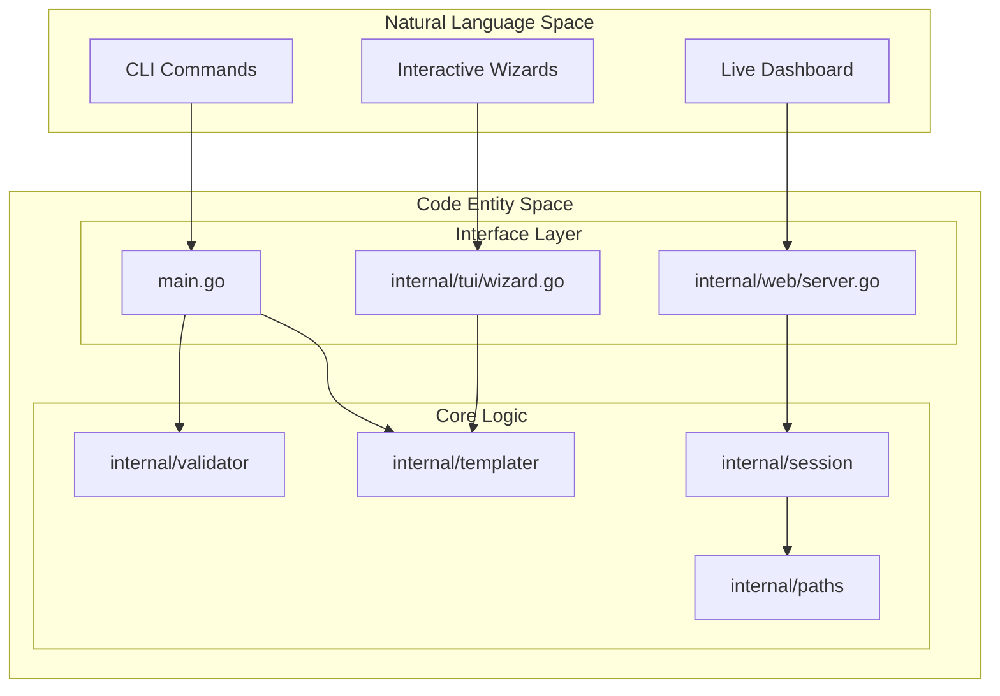
Sources: [README.md:83-108](), [internal/paths/paths.go:6-31](), [internal/templater/templater.go:1-5]()

## Major Subsystems

### 1. Workspace Governance
The workspace is Claude Code-native, centered around a `.claude/` directory and a `specs/` directory [internal/paths/paths.go:3-6](). It uses a manifest file, `.claude/.csdd-manifest.json`, to track content hashes of managed artifacts, enabling safe upgrades via `csdd update` that preserve user edits by creating `.old` backups [README.md:128-135](), [internal/paths/paths.go:63-65]().

For details, see [Workspace Layout and Path Resolution](#1.2).

### 2. Spec-Driven Lifecycle
The core of `csdd` is the gated lifecycle: `requirements → design → tasks → implementation` [README.md:5-6](). Every phase transition is validated by `internal/validator` and requires human approval. The state of a feature is tracked in a `spec.json` file located within the feature's directory under `specs/` [README.md:7-8]().

### 3. Automation and Artifacts
`csdd` manages the execution environment for Claude Code through:
*   **Steering:** Markdown files in `.claude/steering/` (e.g., `tech.md`, `product.md`) that provide project context [internal/paths/paths.go:51-52]().
*   **Skills:** Executable workflow bundles in `.claude/skills/` like `tdd-cycle` [internal/templater/templater.go:101-105]().
*   **Agents:** Scoped sub-agent definitions in `.claude/agents/` [internal/paths/paths.go:45-46]().
*   **Hooks:** Shell scripts in `.claude/hooks/` for deterministic automation (e.g., `test-before-stop.sh`) [internal/paths/paths.go:57-58]().

### 4. Web Dashboard
The `csdd web` command launches an embedded React SPA that provides a read-only view of the workspace [README.md:101-108](). It aggregates data via the `internal/session` package, offering a live task board, spec progress tracking, and a Monaco-based file viewer [README.md:103-107]().

**Diagram: Artifact and Storage Mapping**
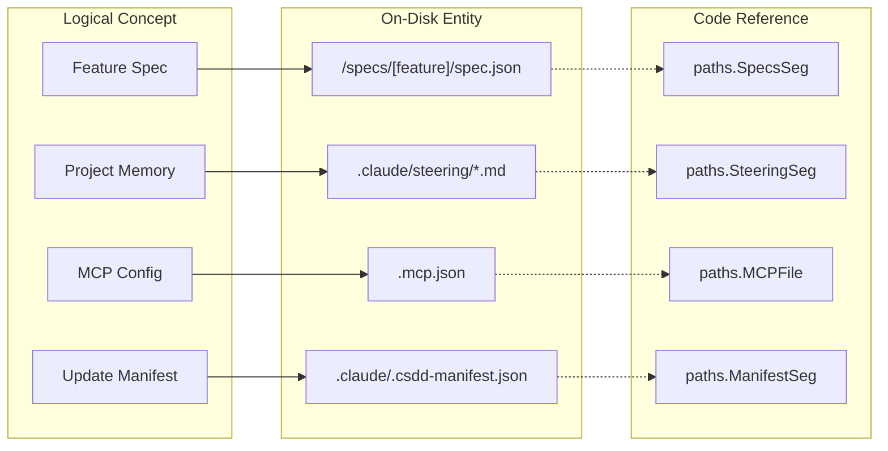
Sources: [internal/paths/paths.go:14-31](), [README.md:7-8]()

## Distribution and Installation

`csdd` is distributed as a multi-platform npm package (`@protonspy/csdd`) that acts as a launcher for the Go binary [README.md:11-23](). It can be run instantly via `npx` or installed globally.

| Method | Command | Use Case |
| :--- | :--- | :--- |
| **npx** | `npx @protonspy/csdd` | Zero-install, always latest [README.md:11-16]() |
| **Global** | `npm install -g @protonspy/csdd` | Preferred for daily use on `PATH` [README.md:18-23]() |
| **Source** | `go install github.com/protonspy/csdd@latest` | For developers contributing to `csdd` [README.md:25]() |

For details, see [Getting Started](#1.1).

Sources: [README.md:1-125](), [internal/paths/paths.go:1-72](), [internal/templater/templater.go:1-182]()

---

<<< SECTION: 1.1 Getting Started [1-1-getting-started] >>>

# Getting Started

<details>
<summary>Relevant source files</summary>

The following files were used as context for generating this wiki page:

- [internal/cli/cli.go](internal/cli/cli.go)
- [internal/cli/destroy.go](internal/cli/destroy.go)
- [internal/cli/destroy_test.go](internal/cli/destroy_test.go)
- [internal/cli/init.go](internal/cli/init.go)
- [internal/cli/update.go](internal/cli/update.go)
- [internal/cli/update_test.go](internal/cli/update_test.go)
- [npm/.gitignore](npm/.gitignore)
- [npm/README.md](npm/README.md)
- [npm/csdd/README.md](npm/csdd/README.md)
- [npm/csdd/bin/csdd.js](npm/csdd/bin/csdd.js)
- [npm/csdd/package.json](npm/csdd/package.json)
- [npm/scripts/build-packages.mjs](npm/scripts/build-packages.mjs)

</details>


`csdd` (Claude Spec-Driven Development) is a CLI tool and workspace manager designed to turn the SDD workflow for Claude Code into a mechanically validated contract. It provides the necessary scaffolding, rules, and automation hooks to ensure that both humans and AI agents adhere to a rigorous development lifecycle.

## Installation

`csdd` is distributed via npm using a per-platform optional dependencies pattern. This ensures that users receive a native Go binary tailored to their architecture without requiring a Go runtime or post-install compilation scripts [npm/README.md:3-12]().

### via npx (Zero Install)
You can run `csdd` immediately without a global installation. `npx` will fetch the appropriate binary for your platform (Linux, macOS, or Windows on x64/arm64) [npm/csdd/README.md:11-16]().

```bash
npx @protonspy/csdd --help
npx @protonspy/csdd                # Launches the interactive TUI
```

### Global Installation
For frequent use, install the package globally to put the `csdd` shim on your `PATH` [npm/csdd/README.md:18-22]().

```bash
npm install -g @protonspy/csdd
csdd init
```

### Implementation: The npm Launcher Shim
When you run `csdd` via npm, you are executing a thin Node.js wrapper (`npm/csdd/bin/csdd.js`). This shim detects the host `process.platform` and `process.arch`, resolves the location of the native binary within the `@protonspy/csdd-<platform>-<arch>` package, and uses `spawn` to execute it [npm/csdd/bin/csdd.js:14-39]().

**Platform Binary Resolution Flow**
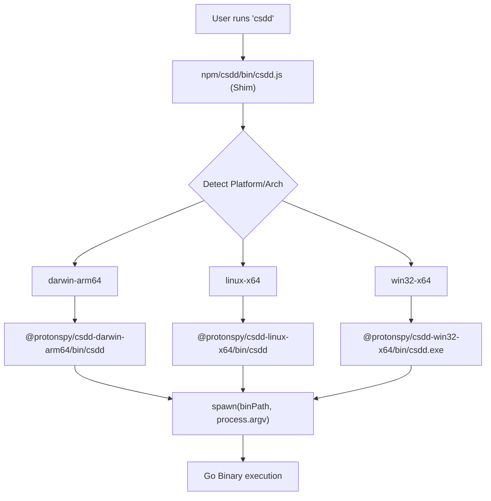
Sources: [npm/csdd/bin/csdd.js:1-82](), [npm/scripts/build-packages.mjs:35-41]()

---

## Workspace Initialization

The `init` command bootstraps a project to be compatible with Claude Code and `csdd` automation.

```bash
csdd init [flags]
```

### Key Flags
- `--with-baseline`: Scaffolds the standard "Product Memory" steering files: `product.md`, `tech.md`, and `structure.md` [internal/cli/init.go:24-24]().
- `--no-mcp`: Prevents the tool from automatically registering the `csdd` MCP server in `.mcp.json` [internal/cli/init.go:25-25]().

### Implementation: `initWorkspace`
The `initWorkspace` function [internal/cli/init.go:125-236]() performs the following operations:
1. **Directory Scaffolding**: Creates the `.claude/` hierarchy, including `rules/`, `templates/`, `skills/`, and `agents/` [internal/cli/init.go:128-148]().
2. **Artifact Deployment**: Renders static templates for `CLAUDE.md`, `csdd.md`, and `.mcp.json` [internal/cli/init.go:153-174]().
3. **Rule & Template Sync**: Copies embedded EARS rules and workflow templates into the workspace [internal/cli/init.go:178-205]().
4. **Git Integration**: Scaffolds a `pre-push` hook in `.githooks/` and offers to update `.gitignore` [internal/cli/init.go:72-89](), [internal/cli/init.go:176-176]().
5. **MCP Registration**: Adds the `csdd` MCP server entry to `.mcp.json` so Claude Code can invoke `csdd` tools via `npx @protonspy/csdd-mcp` [internal/cli/init.go:100-117]().

Sources: [internal/cli/init.go:18-66](), [internal/cli/init.go:125-236]()

---

## The Development Loop

Once initialized, the development loop focuses on maintaining the "Contract" between the specification and the implementation.

### 1. Maintenance: `update`
As `csdd` evolves, the `update` command reconciles your workspace with the latest embedded templates and rules [internal/cli/update.go:138-198]().
- **Conflict Resolution**: If you have edited a "managed" file (like a rule or a shipped skill), `update` detects the divergence. It preserves your version as `<filename>.old` before writing the new version [internal/cli/update.go:176-189]().
- **Frontmatter Preservation**: For Agents and Skills, `update` specifically preserves user-defined `model` and `effort` keys in the Markdown frontmatter even when the body of the artifact is refreshed [internal/cli/update.go:34-34](), [internal/cli/update.go:116-145]().

### 2. Cleanup: `clean` and `destroy`
- `clean`: Removes the `.old` backup files generated by the `update` command [internal/cli/cli.go:49-50]().
- `destroy`: Reverts the workspace by removing `.claude/`, `CLAUDE.md`, and `.mcp.json`. Crucially, it **preserves** the `specs/` directory, ensuring your actual specification work is never lost [internal/cli/destroy.go:15-19]().

### 3. Execution: TUI vs CLI
The `Run` function in `internal/cli/cli.go` dispatches commands based on arguments. If no arguments are provided, it defaults to the interactive TUI (Terminal User Interface) [internal/cli/cli.go:25-29]().

**Command Dispatch Logic**
| Resource | Action | Purpose |
| :--- | :--- | :--- |
| `init` | N/A | Bootstrap workspace |
| `update` | N/A | Reconcile managed artifacts |
| `spec` | `init`, `generate`, `approve` | Manage the SDD lifecycle |
| `mcp` | `add`, `install`, `presets` | Manage MCP server configurations |
| `web` | N/A | Launch the read-only dashboard |

**Data Flow: CLI Command Execution**
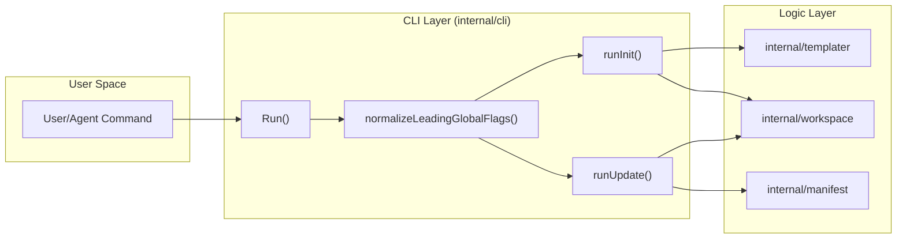
Sources: [internal/cli/cli.go:23-76](), [internal/cli/update.go:149-160](), [internal/cli/destroy.go:37-59]()

---

<<< SECTION: 1.2 Workspace Layout and Path Resolution [1-2-workspace-layout-and-path-resolution] >>>

# Workspace Layout and Path Resolution

<details>
<summary>Relevant source files</summary>

The following files were used as context for generating this wiki page:

- [internal/paths/paths.go](internal/paths/paths.go)
- [internal/templater/templater.go](internal/templater/templater.go)
- [internal/templater/templates/commands/csdd-commit.md.tmpl](internal/templater/templates/commands/csdd-commit.md.tmpl)
- [internal/workspace/workspace.go](internal/workspace/workspace.go)
- [internal/workspace/workspace_test.go](internal/workspace/workspace_test.go)

</details>


This page provides a technical reference for the on-disk directory structure managed by `csdd`. It details the organization of Claude Code-native artifacts, the centralized path management system, and the algorithms used to locate the workspace root.

## Workspace Directory Structure

A `csdd` workspace is a standard filesystem directory augmented with specific subdirectories and files that define the Spec-Driven Development (SDD) environment. The layout is centralized in the `internal/paths` package to ensure consistency across the CLI, web dashboard, and MCP server [internal/paths/paths.go:1-6]().

### Root Artifacts
The following files and directories reside at the top level of the workspace:

| Path | Purpose | Source |
| :--- | :--- | :--- |
| `.claude/` | The marker directory identifying a workspace root. Contains internal configurations and artifact definitions. | [internal/paths/paths.go:11]() |
| `specs/` | Contains per-feature SDD contracts (Requirements, Design, Tasks). | [internal/paths/paths.go:21]() |
| `CLAUDE.md` | The primary entry point for the Claude Code agent, typically importing steering via `@-references`. | [internal/paths/paths.go:15]() |
| `.mcp.json` | Configuration for Model Context Protocol (MCP) servers. | [internal/paths/paths.go:16]() |

### The `.claude/` Subdirectory
This directory houses the logic and memory that steers the AI agent:

*   **`steering/`**: Project memory and context files [internal/paths/paths.go:26]().
*   **`skills/`**: Executable workflow bundles (e.g., `tdd-cycle`) [internal/paths/paths.go:23]().
*   **`agents/`**: Least-privilege sub-agent definitions [internal/paths/paths.go:24]().
*   **`rules/`**: Generation rules and review gates used during the spec lifecycle [internal/paths/paths.go:22]().
*   **`hooks/`**: Deterministic automation scripts (e.g., `format-after-edit.sh`) [internal/paths/paths.go:28]().
*   **`templates/`**: Versioned templates for specs and steering [internal/paths/paths.go:27]().
*   **`.csdd-manifest.json`**: A record of managed artifact hashes used by `csdd update` to reconcile changes [internal/paths/paths.go:30]().
*   **`settings.json`**: Global workspace settings including hooks and permissions [internal/paths/paths.go:29]().

### Workspace Entity Mapping
The following diagram bridges the conceptual workspace artifacts to their implementation identifiers in the `internal/paths` package.

**Workspace Path Mapping**
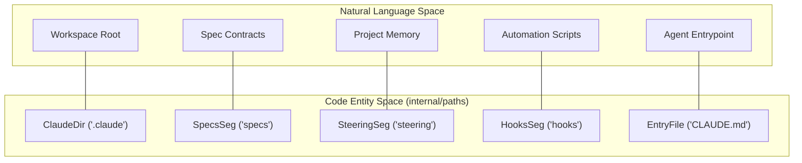
Sources: [internal/paths/paths.go:10-31]()

## Path Resolution Logic

The `internal/workspace` package handles the discovery and normalization of the workspace root. This process is critical for ensuring that `csdd` commands operate on the correct context regardless of the user's current working directory.

### Root Discovery (`Find`)
The `workspace.Find` function implements an upward-walking algorithm [internal/workspace/workspace.go:37-53]():
1.  It takes a starting directory and converts it to an absolute path.
2.  It checks for the existence of a `.claude/` directory in the current path using `paths.Claude(cur)` [internal/workspace/workspace.go:44]().
3.  If found, it returns the current path as the root.
4.  If not found, it moves to the parent directory and repeats the check.
5.  If the filesystem root is reached without finding `.claude/`, it returns the original starting path as a fallback [internal/workspace/workspace.go:48-52]().

### Flag Normalization (`Resolve`)
The `workspace.Resolve` function handles the `--root` global flag [internal/workspace/workspace.go:57-73]():
*   If a specific path is provided via the flag, it validates that the path exists on disk and returns its absolute form [internal/workspace/workspace.go:58-66]().
*   If no flag is provided, it retrieves the current working directory (`os.Getwd`) and calls `Find` to locate the workspace root [internal/workspace/workspace.go:68-72]().

**Path Resolution Data Flow**
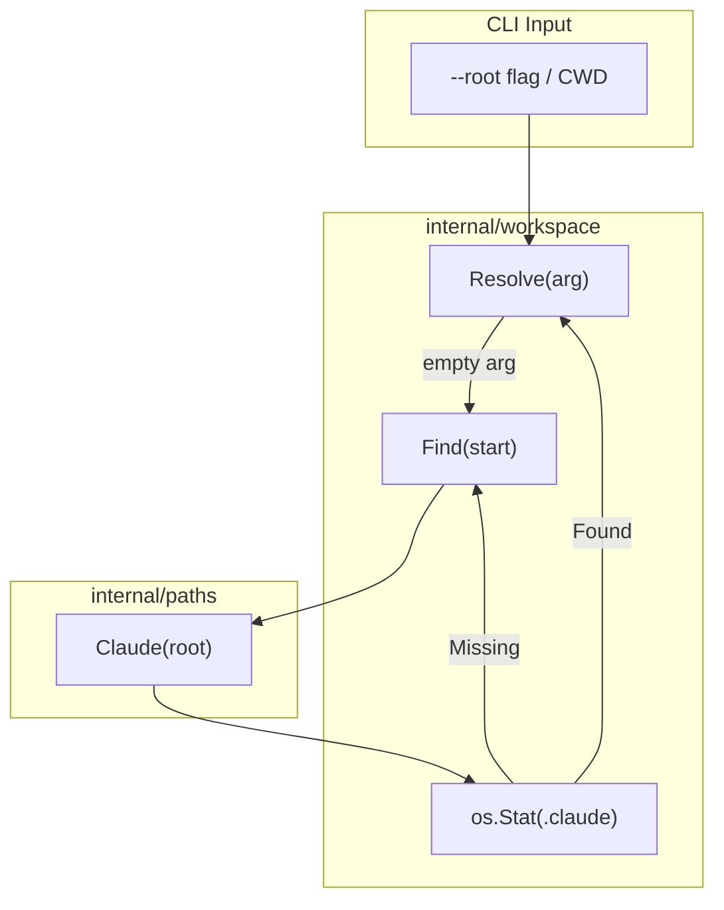
Sources: [internal/workspace/workspace.go:37-73](), [internal/paths/paths.go:34]()

## Template Management

`csdd` uses a self-contained templating system. All default artifacts (specs, skills, agents) are embedded into the binary at compile time using Go's `embed.FS` [internal/templater/templater.go:17]().

### Rendering Pipeline
The `internal/templater` package provides utilities to manage these embedded files:
*   **`Render`**: Loads a template and executes it using Go's `text/template` engine [internal/templater/templater.go:23-37]().
*   **`Static`**: Returns raw file content for templates without placeholders [internal/templater/templater.go:41-47]().
*   **`WorkflowTemplateFiles`**: Maps internal implementation-oriented template paths to their canonical on-disk locations within `.claude/templates/` [internal/templater/templater.go:128-181]().

### File Operations
When writing artifacts to disk, `csdd` employs safety checks:
*   **`SafeWrite`**: Only writes if the file does not exist, creating parent directories as needed [internal/workspace/workspace.go:111-119]().
*   **`WriteFile`**: Supports an `overwrite` flag. If `false`, it returns an error if the file already exists [internal/workspace/workspace.go:122-132]().

Sources: [internal/templater/templater.go:1-181](), [internal/workspace/workspace.go:111-132]()

## Validation Rules

Artifact and directory names must adhere to specific naming conventions to ensure compatibility with AI steering and CLI commands.

### Kebab-Case Enforcement
The `KebabCheck` function uses a regular expression `^[a-z][a-z0-9]*(-[a-z0-9]+)*$` to ensure that names for specs, skills, and agents are lowercase and hyphen-separated [internal/workspace/workspace.go:16-33]().

### Inclusion Modes
Steering files support specific inclusion modes defined in `workspace.InclusionModes`: `always`, `fileMatch`, `manual`, and `auto` [internal/workspace/workspace.go:19]().

Sources: [internal/workspace/workspace.go:16-33](), [internal/workspace/workspace_test.go:10-34]()

---

<<< SECTION: 2 Spec-Driven Development (SDD) Lifecycle [2-spec-driven-development-sdd-lifecycle] >>>

# Spec-Driven Development (SDD) Lifecycle

<details>
<summary>Relevant source files</summary>

The following files were used as context for generating this wiki page:

- [README.md](README.md)
- [internal/templater/templates/agents/wf-development.md.tmpl](internal/templater/templates/agents/wf-development.md.tmpl)
- [internal/templater/templates/commands/csdd-setup-init.md.tmpl](internal/templater/templates/commands/csdd-setup-init.md.tmpl)
- [internal/templater/templates/commands/csdd-setup-update.md.tmpl](internal/templater/templates/commands/csdd-setup-update.md.tmpl)
- [internal/templater/templates/guides/claude-code-sdd.md.tmpl](internal/templater/templates/guides/claude-code-sdd.md.tmpl)
- [internal/templater/templates/hooks/block-destructive.sh.tmpl](internal/templater/templates/hooks/block-destructive.sh.tmpl)
- [internal/templater/templates/hooks/format-after-edit.sh.tmpl](internal/templater/templates/hooks/format-after-edit.sh.tmpl)
- [internal/templater/templates/hooks/test-before-stop.sh.tmpl](internal/templater/templates/hooks/test-before-stop.sh.tmpl)
- [internal/templater/templates/root/CLAUDE.md.tmpl](internal/templater/templates/root/CLAUDE.md.tmpl)
- [internal/templater/templates/root/pre-push.tmpl](internal/templater/templates/root/pre-push.tmpl)

</details>


The Spec-Driven Development (SDD) lifecycle in `csdd` transforms software requirements from passive documentation into an executable contract. By enforcing a phase-gate model, `csdd` ensures that neither human engineers nor AI agents can skip critical design steps or implement features without testable criteria.

The lifecycle moves through a strictly ordered progression: **Discovery → Requirements → Design → Tasks → Implementation**. Each transition is guarded by mechanical validation and requires explicit human approval to proceed [internal/templater/templates/root/CLAUDE.md.tmpl:87-95]().

## Phase-Gate Model

The SDD workflow is divided into discrete phases. Each phase produces a specific Markdown artifact within the `specs/<feature-name>/` directory. A phase is considered "Complete" only when its artifact passes the `csdd spec validate` check and is approved via the CLI or MCP tools [internal/templater/templates/root/CLAUDE.md.tmpl:98-100]().

### The SDD State Machine
The following diagram illustrates the progression of a feature from initialization to implementation readiness, highlighting the "Code Entity Space" (the files and tools involved).

**Diagram: SDD Artifact Progression**
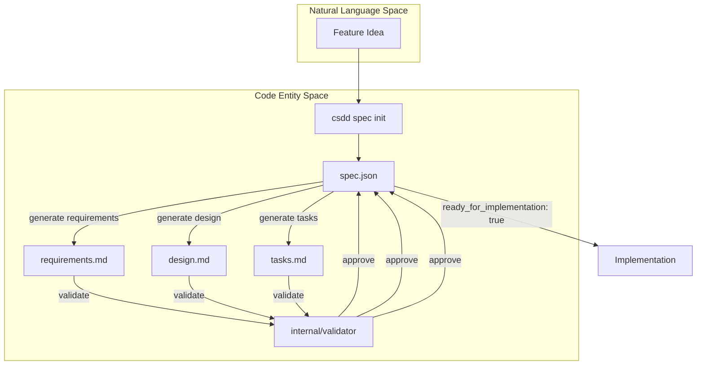
**Sources:** [README.md:44-49](), [internal/templater/templates/root/CLAUDE.md.tmpl:87-95](), [internal/templater/templates/guides/claude-code-sdd.md.tmpl:70-77]()

---

## Core Artifact Types

The `csdd` tool is the only sanctioned author of five specific artifact types. This restriction prevents "specification drift" where manual edits break the machine-parsable structure [internal/templater/templates/root/CLAUDE.md.tmpl:21-23]().

| Artifact | Location | Purpose |
| :--- | :--- | :--- |
| **Steering** | `.claude/steering/` | Always-on project memory (Product, Tech, Structure) [internal/templater/templates/root/CLAUDE.md.tmpl:63-70](). |
| **Specs** | `specs/<name>/` | Per-feature contracts containing `requirements.md`, `design.md`, and `tasks.md` [internal/templater/templates/root/CLAUDE.md.tmpl:75-75](). |
| **Skills** | `.claude/skills/` | Executable workflow bundles with scripts and assets [internal/templater/templates/root/CLAUDE.md.tmpl:78-78](). |
| **Agents** | `.claude/agents/` | Least-privilege sub-agent definitions (e.g., `implementer.md`) [internal/templater/templates/root/CLAUDE.md.tmpl:79-79](). |
| **MCP Servers** | `.mcp.json` | External tool integrations used by Claude Code [internal/templater/templates/root/CLAUDE.md.tmpl:84-84](). |

For details on managing these resources, see [Steering, Skills, and Agents](#2.3).

---

## The SDD Pipeline

### 1. Initialization and Generation
The cycle begins with `csdd spec init <feature>`, which scaffolds the directory and the `spec.json` state tracker [README.md:47](). Agents then use `csdd spec generate` to populate Markdown templates based on the current steering context and previous phase artifacts.

For details on the command flow, see [Spec Lifecycle: Init, Generate, Approve](#2.1).

### 2. Mechanical Validation
Before a human sees a spec, it must pass the `internal/validator`. This package enforces:
* **EARS Syntax:** Requirements must use Event-Condition-Action phrasing (e.g., "When... If... Then...") [internal/templater/templates/guides/claude-code-sdd.md.tmpl:31-31]().
* **Traceability:** Tasks must link back to specific requirements [internal/templater/templates/guides/claude-code-sdd.md.tmpl:112-112]().
* **Parallel Safety:** Tasks must declare boundaries and dependencies to allow safe concurrent execution [internal/templater/templates/guides/claude-code-sdd.md.tmpl:81-88]().

For details on validation rules, see [Validator: Mechanical Spec Checks](#2.2).

### 3. Human Approval and Implementation
Once validated, a human reviews the Markdown and runs `csdd spec approve <feature> --phase <phase>`. Only after the `tasks` phase is approved does `spec.json` flip `ready_for_implementation` to `true` [internal/templater/templates/root/CLAUDE.md.tmpl:100-100](). Implementation then follows a TDD (Test-Driven Development) loop, verified by hooks like `pre-push` [internal/templater/templates/root/pre-push.tmpl:1-28]().

**Diagram: Implementation Gate & Automation**
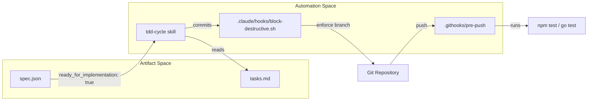
**Sources:** [internal/templater/templates/root/CLAUDE.md.tmpl:101-103](), [internal/templater/templates/hooks/block-destructive.sh.tmpl:45-58](), [internal/templater/templates/root/pre-push.tmpl:12-25]()

---

## Related Pages
* [Spec Lifecycle: Init, Generate, Approve](#2.1) — Command details and state transitions.
* [Validator: Mechanical Spec Checks](#2.2) — EARS and boundary enforcement.
* [Steering, Skills, and Agents](#2.3) — Context and tool definitions.

---

<<< SECTION: 2.1 Spec Lifecycle: Init, Generate, Approve [2-1-spec-lifecycle-init-generate-approve] >>>

# Spec Lifecycle: Init, Generate, Approve

<details>
<summary>Relevant source files</summary>

The following files were used as context for generating this wiki page:

- [internal/cli/spec.go](internal/cli/spec.go)
- [internal/cli/spec_flow_test.go](internal/cli/spec_flow_test.go)
- [internal/templater/templates/spec/bugfix.md.tmpl](internal/templater/templates/spec/bugfix.md.tmpl)
- [internal/templater/templates/spec/design.md.tmpl](internal/templater/templates/spec/design.md.tmpl)
- [internal/templater/templates/spec/requirements.md.tmpl](internal/templater/templates/spec/requirements.md.tmpl)
- [internal/templater/templates/spec/research.md.tmpl](internal/templater/templates/spec/research.md.tmpl)
- [mcp-server/src/tools/spec.ts](mcp-server/src/tools/spec.ts)

</details>


The `csdd spec` command family manages the Spec-Driven Development (SDD) lifecycle. It enforces a phase-gate model that ensures features are properly discovered, designed, and planned before implementation begins. This page details the state machine governing `spec.json`, the artifact generation pipeline, and the development flows that steer agent behavior.

## The Spec State Machine

Every feature in a `csdd` workspace is defined by a directory in `specs/<feature>/` containing a `spec.json` file. This file serves as the single source of truth for the feature's lifecycle state.

### spec.json Schema
The `SpecJSON` struct [internal/cli/spec.go:28-36]() tracks the following:
- **Phase**: The current active stage (e.g., `initialized`, `requirements`, `design`, `tasks`).
- **Development Flow**: The methodology used for implementation (`unit`, `tdd`, or `tdd-e2e`).
- **Approvals**: A map of `ApprovalFlag` [internal/cli/spec.go:99-102]() objects tracking whether an artifact has been `generated` and subsequently `approved`.
- **Ready for Implementation**: A boolean gate that must be `true` before implementation skills (like `tdd-cycle`) will operate on the feature.

### Phase Gate Logic
The lifecycle follows a strict progression:
1. **Requirements**: Definition of user needs and system responses using EARS syntax.
2. **Design**: Architectural planning, component contracts, and traceability.
3. **Tasks**: Decomposition into atomic, parallel-safe implementation steps.

**Gate Rules:**
- To generate **Design**, **Requirements** must be approved [mcp-server/src/tools/spec.ts:55-55]().
- To generate **Tasks**, **Design** must be approved [mcp-server/src/tools/spec.ts:55-55]().
- `ready_for_implementation` is set to `true` only when **Requirements**, **Design**, and **Tasks** are all approved [mcp-server/src/tools/spec.ts:77-77]().

Sources: [internal/cli/spec.go:28-36](), [internal/cli/spec.go:99-102](), [mcp-server/src/tools/spec.ts:52-92]()

---

## Spec Initialization (`SpecInit`)

The `spec init` command creates the initial directory structure and the `spec.json` manifest.

### Development Flow Resolution
During initialization, `csdd` determines the `development_flow`. This flow is a "steering hint" for agents:
- **`unit`**: Tests are written after the code (standard development).
- **`tdd`**: (Default) Strict Red-Green-Refactor loop [internal/cli/spec.go:40-40]().
- **`tdd-e2e`**: TDD plus end-to-end coverage requirements [internal/cli/spec.go:45-45]().

The flow is resolved using the following priority [internal/cli/spec.go:67-72]():
1. Explicit CLI flag `--flow`.
2. `default_development_flow` defined in workspace steering frontmatter [internal/cli/spec.go:91-91]().
3. Global default: `tdd`.

### Data Flow: Spec Initialization
Title: Spec Initialization Sequence
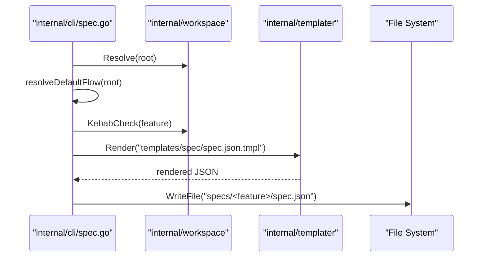
Sources: [internal/cli/spec.go:150-194](), [internal/cli/spec.go:72-96]()

---

## Artifact Generation (`SpecGenerate`)

Artifacts are Markdown documents generated from embedded templates. The `csdd_spec_generate` tool [mcp-server/src/tools/spec.ts:52-72]() (or `csdd spec generate` CLI) handles the creation of these files.

### Artifact Types and Templates
| Artifact | Template Path | Purpose |
| :--- | :--- | :--- |
| **Requirements** | `templates/spec/requirements.md.tmpl` | EARS-based capability definitions [internal/templater/templates/spec/requirements.md.tmpl:1-30]() |
| **Design** | `templates/spec/design.md.tmpl` | Architecture, Mermaid diagrams, and traceability [internal/templater/templates/spec/design.md.tmpl:1-102]() |
| **Tasks** | `templates/spec/tasks.md.tmpl` | Implementation checklist with skill tokens |
| **Research** | `templates/spec/research.md.tmpl` | Ungated discovery log for greenfield/brownfield [internal/templater/templates/spec/research.md.tmpl:1-17]() |
| **Bugfix** | `templates/spec/bugfix.md.tmpl` | Ungated reproduction and root cause analysis [internal/templater/templates/spec/bugfix.md.tmpl:1-32]() |

### Generation Logic
When an artifact is requested:
1. `csdd` checks if the previous phase is approved (unless `--force` is used) [mcp-server/src/tools/spec.ts:55-55]().
2. The corresponding template is rendered using `templater.Render` [internal/cli/spec.go:179-184]().
3. The `generated` flag for that phase is set to `true` in `spec.json`.

Sources: [mcp-server/src/tools/spec.ts:52-72](), [internal/cli/spec.go:179-184](), [internal/templater/templates/spec/requirements.md.tmpl:1-30]()

---

## Spec Approval (`SpecApprove`)

Approval is the transition mechanism that moves a spec through the lifecycle. 

### Validation Gate
The `SpecApprove` action [mcp-server/src/tools/spec.ts:74-92]() performs a mandatory validation check before marking a phase as approved. It invokes the `internal/validator` package to ensure:
- **EARS Compliance**: Requirements use "SHALL" and follow standard triggers (WHEN, IF, WHILE, WHERE) [internal/templater/templates/spec/requirements.md.tmpl:21-27]().
- **Traceability**: Design components map back to specific requirements [internal/templater/templates/spec/design.md.tmpl:56-60]().
- **Safety**: Tasks are structured to prevent overlapping edits in parallel execution.

### Implementation Readiness
The transition to `ready_for_implementation: true` is an atomic update that occurs only when the `tasks` phase is approved [mcp-server/src/tools/spec.ts:77-77](). This state change unlocks implementation tools for the agent.

### System Mapping: Spec Entities to Code
Title: Spec Lifecycle Entity Mapping
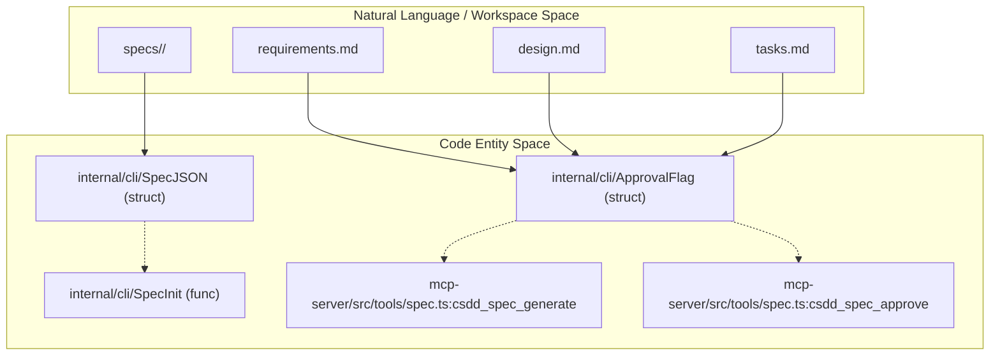
Sources: [internal/cli/spec.go:28-36](), [internal/cli/spec.go:99-102](), [mcp-server/src/tools/spec.ts:52-92]()

---

## Reporting and Evidence

Once implementation begins, the lifecycle is supported by automated reporting tools that provide evidence of progress.

### Test Reports (`spec test-report`)
This command records unit test evidence into `specs/<feature>/test-report.json` [mcp-server/src/tools/spec.ts:109-150]().
- **Discovery**: Auto-discovers JUnit XML and coverage reports for Go, Python, TypeScript, Java, and Rust [mcp-server/src/tools/spec.ts:112-112]().
- **Execution**: Can optionally run the test command (e.g., `go test` or `npm test`) before parsing [mcp-server/src/tools/spec.ts:115-118]().

### Diff Reports (`spec diff-report`)
This command generates a structured, auditable file diff into `specs/<feature>/diff-report.json` [mcp-server/src/tools/spec.ts:152-177]().
- **Audit Trail**: Diffs the merge-base of the feature branch against the current working tree [mcp-server/src/tools/spec.ts:155-155]().
- **Dashboard Integration**: These JSON artifacts are consumed by the `csdd web` dashboard to visualize implementation progress and test health.

Sources: [mcp-server/src/tools/spec.ts:109-150](), [mcp-server/src/tools/spec.ts:152-177]()

---

<<< SECTION: 2.2 Validator: Mechanical Spec Checks [2-2-validator-mechanical-spec-checks] >>>

# Validator: Mechanical Spec Checks

<details>
<summary>Relevant source files</summary>

The following files were used as context for generating this wiki page:

- [internal/templater/templates/root/mcp.json.tmpl](internal/templater/templates/root/mcp.json.tmpl)
- [internal/templater/templates/rules/definition-of-done.md.tmpl](internal/templater/templates/rules/definition-of-done.md.tmpl)
- [internal/templater/templates/rules/design-discovery-full.md.tmpl](internal/templater/templates/rules/design-discovery-full.md.tmpl)
- [internal/templater/templates/rules/design-discovery-light.md.tmpl](internal/templater/templates/rules/design-discovery-light.md.tmpl)
- [internal/templater/templates/rules/design-principles.md.tmpl](internal/templater/templates/rules/design-principles.md.tmpl)
- [internal/templater/templates/rules/design-review-gate.md.tmpl](internal/templater/templates/rules/design-review-gate.md.tmpl)
- [internal/templater/templates/rules/design-synthesis.md.tmpl](internal/templater/templates/rules/design-synthesis.md.tmpl)
- [internal/templater/templates/rules/ears-format.md.tmpl](internal/templater/templates/rules/ears-format.md.tmpl)
- [internal/templater/templates/rules/gap-analysis.md.tmpl](internal/templater/templates/rules/gap-analysis.md.tmpl)
- [internal/templater/templates/rules/requirements-review-gate.md.tmpl](internal/templater/templates/rules/requirements-review-gate.md.tmpl)
- [internal/templater/templates/rules/steering-principles.md.tmpl](internal/templater/templates/rules/steering-principles.md.tmpl)
- [internal/templater/templates/rules/tasks-generation.md.tmpl](internal/templater/templates/rules/tasks-generation.md.tmpl)
- [internal/templater/templates/rules/tasks-parallel-analysis.md.tmpl](internal/templater/templates/rules/tasks-parallel-analysis.md.tmpl)
- [internal/templater/templates/spec/spec.json.tmpl](internal/templater/templates/spec/spec.json.tmpl)
- [internal/templater/templates/spec/tasks.md.tmpl](internal/templater/templates/spec/tasks.md.tmpl)
- [internal/validator/validator.go](internal/validator/validator.go)
- [internal/validator/validator_test.go](internal/validator/validator_test.go)

</details>


The `internal/validator` package implements the mechanical enforcement of the Spec-Driven Development (SDD) methodology. It ensures that spec artifacts (`requirements.md`, `design.md`, `tasks.md`, and `bugfix.md`) adhere to strict syntax, traceability, and safety rules [internal/validator/validator.go:1-6](). 

The validator is designed to provide 1:1 parity with the original Python reference implementation to prevent behavior drift during the transition to the Go-based CLI [internal/validator/validator.go:4-5]().

## Overview of Validation Logic

Validation is performed by the `ValidateSpec` function, which accepts a directory path and a `Phase` (requirements, design, or tasks) to narrow the scope of checks [internal/validator/validator.go:51-58, 72]().

### The Issue Struct
All validation failures are returned as a slice of `Issue` objects.
*   `File`: The relative path to the artifact containing the error [internal/validator/validator.go:37]().
*   `Line`: The specific line number (if attributable) [internal/validator/validator.go:38]().
*   `Msg`: A descriptive error message [internal/validator/validator.go:39]().

When the CLI encounters issues, it renders them in the format `file:line: message` and exits with **exit code 2** to signal a mechanical validation failure [internal/validator/validator.go:43-48]().

### Logic Flow: Natural Language to Code Entities

The following diagram maps the SDD conceptual rules to the specific regex and functions within the `validator` package.

**Conceptual to Code Mapping**
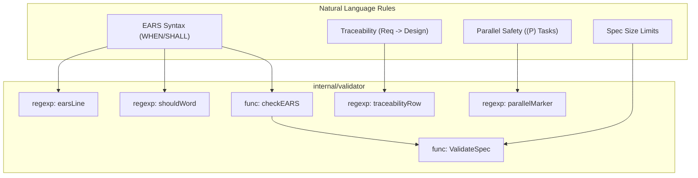
**Sources:** [internal/validator/validator.go:18-33](), [internal/validator/validator.go:72-92]()

---

## Artifact-Specific Checks

### 1. Requirements Validation (`requirements.md`)
The validator enforces the **EARS (Easy Approach to Requirements Syntax)** format [internal/validator/validator.go:2-3]().
*   **Keyword Enforcement**: Every criterion must use `SHALL` and must not use `should` [internal/validator/validator.go:22-23]().
*   **Trigger Phrases**: Criteria must start with `WHEN`, `WHILE`, `IF`, `WHERE`, or `THE SYSTEM` [internal/validator/validator.go:20]().
*   **Uniqueness**: Requirement headers (e.g., `### Requirement 1`) and criterion IDs must be unique within the file [internal/validator/validator.go:93-103]().

### 2. Design Validation (`design.md`)
*   **Traceability**: Every requirement ID defined in `requirements.md` must appear in the `## Requirements Traceability` table in `design.md` [internal/validator/validator.go:143-156]().
*   **Complexity Guard**: The design file is capped at **1000 lines**. Exceeding this triggers a validation error suggesting the feature be split [internal/validator/validator.go:129-134]().
*   **Structural Integrity**: The validator mandates the presence of specific sections: `## File Structure Plan` and `## Architecture Pattern & Boundary Map` [internal/validator/validator.go:137-142]().

### 3. Task Validation (`tasks.md`)
The task validator ensures the implementation plan is mechanically sound and safe for parallel execution.

| Check | Rule | Code Reference |
| :--- | :--- | :--- |
| **Traceability** | Every leaf task must carry a `_Requirements:_` annotation. | [internal/validator/validator.go:196-203]() |
| **Boundary Safety** | Tasks marked with `(P)` (Parallel) must define a `_Boundary:_`. | [internal/validator/validator.go:211-218]() |
| **Parallel Isolation** | No two `(P)` tasks can share the same `_Boundary:_` simultaneously. | [internal/validator/validator.go:222-230]() |
| **Dependency Integrity** | `_Depends:_` annotations must reference valid, existing task IDs. | [internal/validator/validator.go:204-210]() |

**Sources:** [internal/validator/validator.go:163-247](), [internal/templater/templates/rules/tasks-generation.md.tmpl:8-13]()

---

## Data Flow: Validation Pipeline

The following diagram illustrates how the `validator` package processes a spec directory to produce an issue report.

**Validation Data Flow**
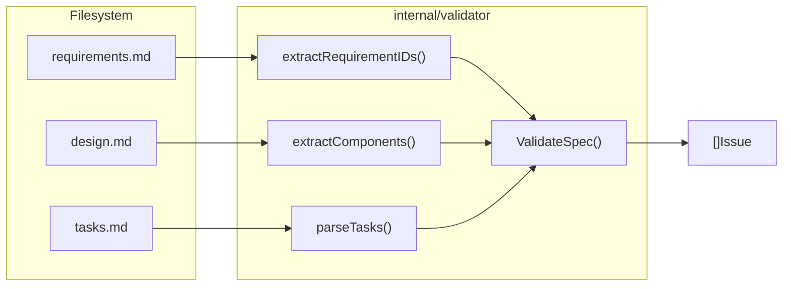
**Sources:** [internal/validator/validator.go:72-87](), [internal/validator/validator.go:165-181]()

---

## Development Flow Enforcement

The validator also checks for adherence to the `development_flow` defined in `spec.json` (e.g., `tdd`, `tdd-e2e`, or `unit`) [internal/templater/templates/spec/spec.json.tmpl:5]().

### TDD Logic
Under `tdd` and `tdd-e2e` flows, the validator (and the associated `tasks-generation.md` rules) enforces a **RED-GREEN** pairing:
1.  **RED Task**: Must be a sub-task explicitly named `RED — write the failing test for X` [internal/templater/templates/rules/tasks-generation.md.tmpl:22]().
2.  **GREEN Task**: Must immediately follow the RED task and be named `GREEN — minimal implementation to pass [RED ID]` [internal/templater/templates/rules/tasks-generation.md.tmpl:23]().

### Unit Logic
Under the `unit` flow, the RED-first ritual is skipped, but the validator still ensures every behavior task carries a corresponding test sub-task [internal/templater/templates/rules/tasks-generation.md.tmpl:25-27]().

**Sources:** [internal/templater/templates/rules/tasks-generation.md.tmpl:14-30](), [internal/templater/templates/rules/definition-of-done.md.tmpl:9-14]()

---

<<< SECTION: 2.3 Steering, Skills, and Agents [2-3-steering-skills-and-agents] >>>

# Steering, Skills, and Agents

<details>
<summary>Relevant source files</summary>

The following files were used as context for generating this wiki page:

- [internal/cli/agent.go](internal/cli/agent.go)
- [internal/cli/agent_effort_test.go](internal/cli/agent_effort_test.go)
- [internal/cli/skill.go](internal/cli/skill.go)
- [internal/cli/steering.go](internal/cli/steering.go)
- [internal/templater/templates/agent/agent.md.tmpl](internal/templater/templates/agent/agent.md.tmpl)
- [internal/templater/templates/skill/SKILL.md.tmpl](internal/templater/templates/skill/SKILL.md.tmpl)
- [internal/templater/templates/steering-custom/custom.md.tmpl](internal/templater/templates/steering-custom/custom.md.tmpl)
- [internal/templater/templates/steering/api-conventions.md.tmpl](internal/templater/templates/steering/api-conventions.md.tmpl)
- [internal/templater/templates/steering/custom.md.tmpl](internal/templater/templates/steering/custom.md.tmpl)
- [internal/templater/templates/steering/observability.md.tmpl](internal/templater/templates/steering/observability.md.tmpl)
- [internal/templater/templates/steering/product.md.tmpl](internal/templater/templates/steering/product.md.tmpl)
- [internal/templater/templates/steering/security.md.tmpl](internal/templater/templates/steering/security.md.tmpl)
- [internal/templater/templates/steering/structure.md.tmpl](internal/templater/templates/steering/structure.md.tmpl)
- [internal/templater/templates/steering/tech.md.tmpl](internal/templater/templates/steering/tech.md.tmpl)
- [internal/templater/templates/steering/testing.md.tmpl](internal/templater/templates/steering/testing.md.tmpl)

</details>


Spec-Driven Development (SDD) in `csdd` relies on three primary context artifacts to guide AI agents: **Steering files** (project memory), **Skills** (workflow bundles), and **Agents** (specialized sub-agent definitions). These artifacts are stored within the `.claude/` directory and are injected into the LLM context to ensure consistency, safety, and specialized execution.

## Steering: Project Memory and Constraints

Steering files are Markdown documents with YAML frontmatter that provide persistent context to the agent. They define the "rules of the road" for the project, such as architectural patterns, security guidelines, or API conventions.

### Inclusion Modes
Steering files use the `inclusion` frontmatter key to determine when they are loaded into the agent's context [internal/templater/templates/steering-custom/custom.md.tmpl:1-11]():

| Mode | Description | Trigger |
| :--- | :--- | :--- |
| `always` | Global context. | Loaded on every interaction. |
| `manual` | On-demand context. | Loaded only when explicitly referenced by the user. |
| `fileMatch` | Path-based context. | Loaded when touched files match `fileMatchPattern` globs. |
| `auto` | Task-based context. | Loaded when the task description matches the steering `description`. |

### Data Flow: Steering Generation
The `csdd steering create` command uses `internal/templater` to render predefined or custom templates.

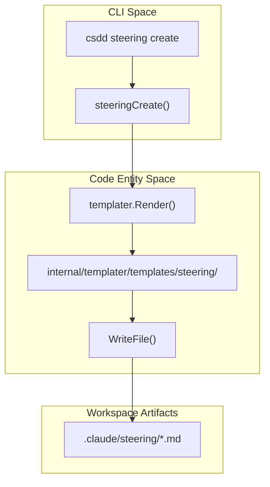
**Sources:** [internal/cli/steering.go:1-40](), [internal/templater/templates/steering/custom.md.tmpl:1-18]()

---

## Skills: Executable Workflow Bundles

Skills are encapsulated workflows designed to solve specific problems (e.g., `tdd-cycle`, `discovery-prd`). Unlike simple prompts, skills are directories containing a `SKILL.md` definition and optional supporting artifacts.

### Skill Structure
A skill is stored in `.claude/skills/<name>/` and contains [internal/cli/skill.go:84-110]():
- `SKILL.md`: The core instruction set, including goal, inputs, and execution workflow [internal/templater/templates/skill/SKILL.md.tmpl:1-48]().
- `references/`: Supporting documentation for the skill.
- `scripts/`: Executable scripts the skill may run.
- `assets/`: Static data or templates used by the skill.

### Skill Lifecycle Management
The `csdd skill` command family provides CRUD operations for these bundles:

| Command | Function | Code Reference |
| :--- | :--- | :--- |
| `create` | Generates skill directory from template. | [internal/cli/skill.go:60-131]() |
| `add-reference` | Safely adds a file to `references/`. | [internal/cli/skill.go:222-248]() |
| `list` | Lists all skills with their descriptions. | [internal/cli/skill.go:133-173]() |
| `validate` | Checks for EARS syntax and required fields. | [internal/cli/skill.go:38-39]() |

**Sources:** [internal/cli/skill.go:19-46](), [internal/templater/templates/skill/SKILL.md.tmpl:1-12]()

---

## Agents: Least-Privilege Sub-Agents

Agents in `csdd` are specialized sub-agent definitions. They allow an orchestrator to delegate tasks to a "persona" with a restricted toolset, following the principle of least privilege.

### Agent Definition Template
Every agent is defined by a Markdown file in `.claude/agents/` containing [internal/templater/templates/agent/agent.md.tmpl:1-36]():
- **Tools**: A comma-separated list of allowed tools (e.g., `Read, Grep`). Defaults to `Read, Grep` if not specified [internal/cli/agent.go:102-106]().
- **Role**: A paragraph defining the agent's boundary.
- **Operating Procedure**: Step-by-step instructions for the sub-agent.
- **Model/Effort**: Optional overrides for the LLM configuration [internal/cli/agent_effort_test.go:32-45]().

### Technical Implementation: Agent Creation
The `AgentCreate` function validates inputs (including a `KebabCheck` on the name) before rendering the template [internal/cli/agent.go:82-128]().

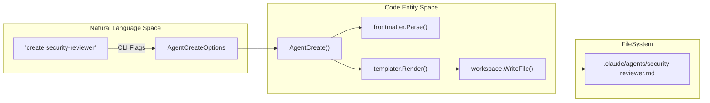
**Sources:** [internal/cli/agent.go:42-51](), [internal/cli/agent.go:82-128](), [internal/templater/templates/agent/agent.md.tmpl:1-11]()

---

## CLI Reference Summary

### Steering Commands
- `csdd steering create <name>`: Create a new steering file. Supports `--inclusion` (always, manual, fileMatch, auto).
- `csdd steering list`: Show all steering files and their inclusion modes.

### Skill Commands
- `csdd skill create <name> --description "..."`: Initialize a skill directory.
- `csdd skill add-script <skill> <file>`: Add an executable script to a skill.
- `csdd skill show <name>`: Display the contents and file tree of a skill.

### Agent Commands
- `csdd agent create <name> --description "..." --tools "Read,Grep"`: Define a new sub-agent.
- `csdd agent list`: List all defined sub-agents and their permitted tools.

**Sources:** [internal/cli/skill.go:19-46](), [internal/cli/agent.go:18-37](), [internal/cli/steering.go:1-40]()

---

<<< SECTION: 3 CLI Reference [3-cli-reference] >>>

# CLI Reference

<details>
<summary>Relevant source files</summary>

The following files were used as context for generating this wiki page:

- [cmd/csdd/main.go](cmd/csdd/main.go)
- [internal/cli/claudemd.go](internal/cli/claudemd.go)
- [internal/cli/cli.go](internal/cli/cli.go)
- [internal/cli/cli_extra_test.go](internal/cli/cli_extra_test.go)
- [internal/cli/cli_test.go](internal/cli/cli_test.go)
- [internal/cli/destroy.go](internal/cli/destroy.go)
- [internal/cli/destroy_test.go](internal/cli/destroy_test.go)
- [internal/cli/export.go](internal/cli/export.go)
- [internal/cli/export_test.go](internal/cli/export_test.go)
- [internal/cli/util.go](internal/cli/util.go)
- [internal/templater/templates/skills/spec-brainstorm/SKILL.md.tmpl](internal/templater/templates/skills/spec-brainstorm/SKILL.md.tmpl)

</details>


The `csdd` CLI is the primary interface for managing Spec-Driven Development (SDD) artifacts and Claude Code workspace configurations. It is designed to be symmetric with the TUI; every operation available in the interactive interface is exposed via the CLI to enable headless automation by AI agents and CI/CD pipelines [internal/cli/cli.go:1-4]().

The binary functions as a command dispatcher, routing requests to specific resource handlers (steering, specs, skills, agents, etc.) based on the provided arguments [internal/cli/cli.go:23-76]().

### Command Dispatch Architecture

The entry point for the CLI is `cli.Run`, which processes global flags before dispatching to sub-command handlers. If no arguments are provided, the binary defaults to launching the interactive TUI [cmd/csdd/main.go:18-29]().

**Command Execution Flow**
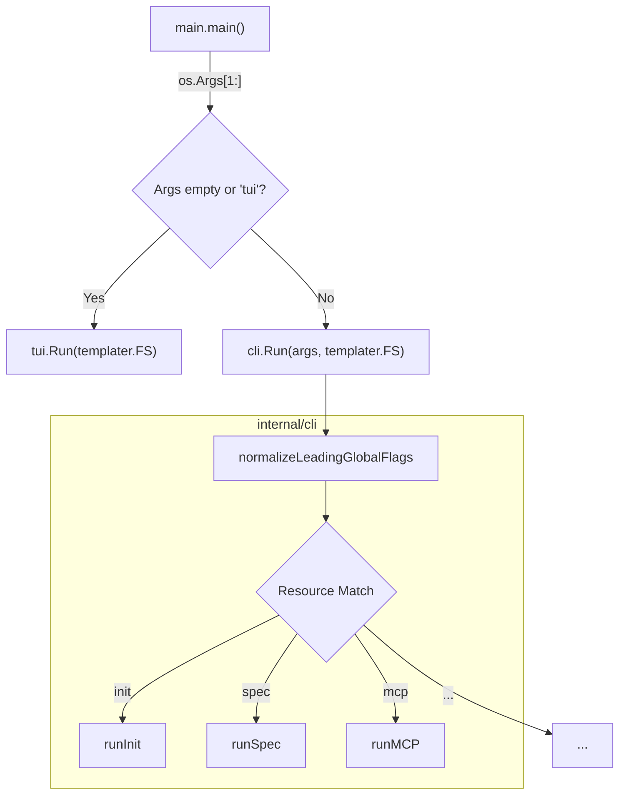
Sources: [cmd/csdd/main.go:18-29](), [internal/cli/cli.go:23-76]()

### Global Flags

Global flags can be placed before or after the resource command. The `normalizeLeadingGlobalFlags` function ensures that flags like `--root` are correctly associated with the workspace context regardless of their position [internal/cli/cli.go:81-103]().

| Flag | Description | Default |
| :--- | :--- | :--- |
| `--root PATH` | Specifies the project root. | Nearest enclosing `.claude/` |
| `--force` | Overrides safety checks (e.g., deleting files, regenerating specs). | `false` |
| `-h, --help` | Displays the help text and command surface. | N/A |
| `-v, --version`| Displays the build version (e.g., `v1.2.3` or `dev`). | `dev` |

Sources: [internal/cli/cli.go:142-146](), [internal/cli/cli.go:81-103]()

### Command Surface Overview

The CLI organizes functionality into several top-level resources. Each resource supports a set of actions that manage specific artifact types.

#### Workspace Lifecycle
Commands for setting up and tearing down the `csdd` environment.
*   `init`: Bootstrap a Claude Code workspace [internal/cli/cli.go:45-46]().
*   `update`: Refresh managed artifacts and reconcile changes [internal/cli/cli.go:47-48]().
*   `clean`: Remove backup files (`*.old`) created during updates [internal/cli/cli.go:49-50]().
*   `destroy`: Remove the workspace while preserving user specs [internal/cli/cli.go:51-52]().

For details, see [Workspace Management Commands (init, update, destroy, clean)](#3.1).

#### Artifact Management
Commands for managing the core SDD artifacts used by Claude Code.
*   `steering`: Manage project-wide instructions and context rules [internal/cli/cli.go:53-54]().
*   `spec`: Drive the spec lifecycle (Requirements → Design → Tasks) [internal/cli/cli.go:55-56]().
*   `skill`: Create and manage executable workflow bundles [internal/cli/cli.go:57-58]().
*   `agent`: Define least-privilege sub-agents [internal/cli/cli.go:59-60]().

For details, see [Spec Lifecycle: Init, Generate, Approve](#2.1) and [Steering, Skills, and Agents](#2.3).

#### Integrations and Utilities
*   `mcp`: Manage Model Context Protocol server configurations in `.mcp.json` [internal/cli/cli.go:61-62]().
*   `export`: Convert the workspace to external formats like Kiro or Codex [internal/cli/cli.go:63-64]().
*   `web`: Launch the read-only dashboard for live spec progress [internal/cli/cli.go:65-66]().

For details, see [MCP Server Management (mcp add, install, presets)](#3.2) and [Export and Effort Commands](#3.3).

### Safety and Interactivity

The CLI implements a safety layer for destructive operations. In interactive environments (TTY), commands like `destroy` will prompt for confirmation [internal/cli/util.go:50-66](). In non-interactive contexts (e.g., AI agents or pipes), these commands will fail unless the `--force` flag is provided [internal/cli/destroy.go:78-83]().

**CLI Safety State Machine**
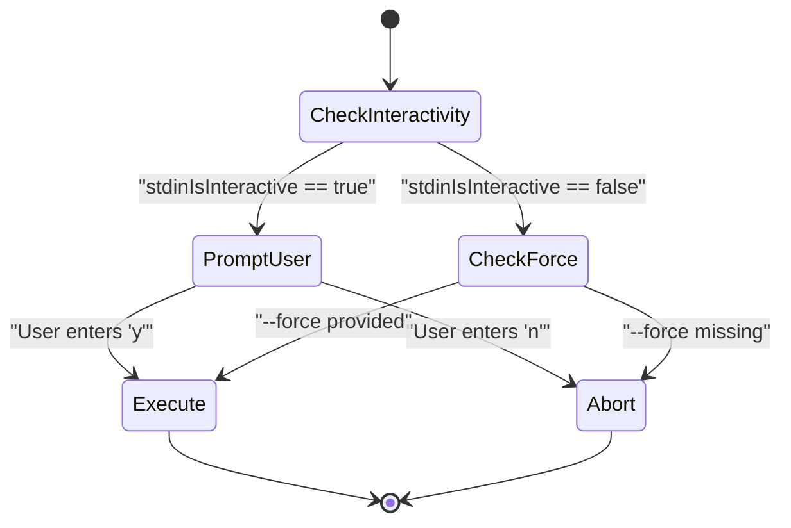
Sources: [internal/cli/util.go:29-66](), [internal/cli/destroy.go:78-83]()

### Child Pages

*   **[Workspace Management Commands (init, update, destroy, clean)](#3.1)** — Details on workspace initialization, the manifest-based update system, and destructive cleanup.
*   **[MCP Server Management (mcp add, install, presets)](#3.2)** — Reference for configuring `.mcp.json` and installing pre-defined server presets.
*   **[Export and Effort Commands](#3.3)** — Documentation for converting `csdd` workspaces to Kiro/Codex and managing `CLAUDE.md` steering imports.

Sources: [internal/cli/cli.go:120-175](), [internal/cli/claudemd.go:11-14](), [internal/cli/export.go:20-30]()

---

<<< SECTION: 3.1 Workspace Management Commands (init, update, destroy, clean) [3-1-workspace-management-commands-init-update-destroy-clean] >>>

# Workspace Management Commands (init, update, destroy, clean)

<details>
<summary>Relevant source files</summary>

The following files were used as context for generating this wiki page:

- [LICENSE](LICENSE)
- [internal/cli/clean.go](internal/cli/clean.go)
- [internal/cli/clean_test.go](internal/cli/clean_test.go)
- [internal/cli/cli.go](internal/cli/cli.go)
- [internal/cli/destroy.go](internal/cli/destroy.go)
- [internal/cli/destroy_test.go](internal/cli/destroy_test.go)
- [internal/cli/init.go](internal/cli/init.go)
- [internal/cli/update.go](internal/cli/update.go)
- [internal/cli/update_test.go](internal/cli/update_test.go)
- [internal/manifest/manifest.go](internal/manifest/manifest.go)
- [internal/manifest/manifest_test.go](internal/manifest/manifest_test.go)

</details>


This page documents the core lifecycle commands for managing a `csdd` workspace. These commands handle the transition from a standard directory to a spec-driven development environment, ensure artifacts remain up-to-date with the `csdd` binary version, and provide safe mechanisms for decommissioning or cleaning the workspace.

## Initialization: `csdd init`

The `init` command bootstraps the directory structure required for Claude Code to operate within the SDD methodology. It is designed to be idempotent and safe for use in existing projects.

### Behavior and Scaffolding
- **Directory Creation**: Creates the `.claude/` hierarchy, including `rules/`, `templates/`, `skills/`, `agents/`, `commands/`, and `hooks/` [internal/cli/init.go:127-140]().
- **Core Artifacts**: Writes the entry point `CLAUDE.md`, the SDD guide `docs/guides/claude-code-sdd.md`, and the workspace manifest [internal/cli/init.go:153-161]().
- **MCP Registration**: By default, registers the `csdd` MCP server in `.mcp.json` using `npx -y @protonspy/csdd-mcp` [internal/cli/init.go:91-117]().
- **Git Integration**: Scaffolds a pre-push hook at `.githooks/pre-push` and offers to update `.gitignore` to cover `csdd` artifacts [internal/cli/init.go:158-176]().

### Initialization Data Flow
The following diagram illustrates how `init` moves from embedded templates to the local filesystem.

**Workspace Initialization Flow**
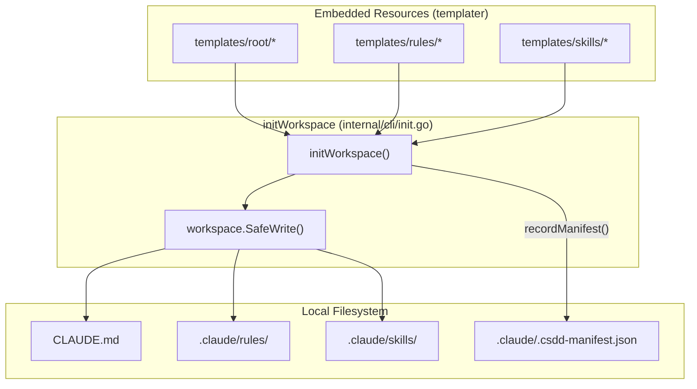
Sources: [internal/cli/init.go:125-205](), [internal/cli/update.go:111-128]()

---

## Update and Reconciliation: `csdd update`

The `update` command reconciles the on-disk workspace artifacts with the versions embedded in the current `csdd` binary. It uses a manifest-based reconciliation logic to detect user modifications.

### Manifest-Based Logic
`csdd` maintains a manifest file at `.claude/.csdd-manifest.json` [internal/manifest/manifest.go:22-26](). This file stores the SHA-256 hashes of the files as they were originally shipped by the binary [internal/manifest/manifest.go:74-79]().

When `update` runs, it compares three states for every `managedFile`:
1. **Shipped**: The content embedded in the current binary.
2. **Baseline**: The hash recorded in the manifest (what `csdd` last wrote).
3. **On-Disk**: The current content of the file in the project.

| Condition | Outcome | Description |
| :--- | :--- | :--- |
| **Pristine Outdated** | `kindUpdate` | On-Disk matches Baseline, but Shipped is different. File is updated in place [internal/cli/update.go:207](). |
| **Conflict** | `kindConflict` | On-Disk differs from Baseline. User has edited the file [internal/cli/update.go:208](). |
| **Missing** | `kindAdd` | File exists in Shipped but is missing from Disk [internal/cli/update.go:205](). |
| **Current** | `kindCurrent` | On-Disk matches Shipped [internal/cli/update.go:204](). |

### Conflict Resolution and Backups
If a conflict is detected, `csdd` creates a backup of the user's version by appending `-N.old` (where N is an incrementing integer) before overwriting the file with the new shipped version [internal/cli/update.go:273-288]().

### Frontmatter Preservation
For Agents and Skills, `csdd` preserves specific frontmatter keys (like `model` and `effort`) even during a conflict-free update. This allows users to tune performance parameters without triggering reconciliation conflicts [internal/cli/update.go:34-48]().

**Update Reconciliation Logic**
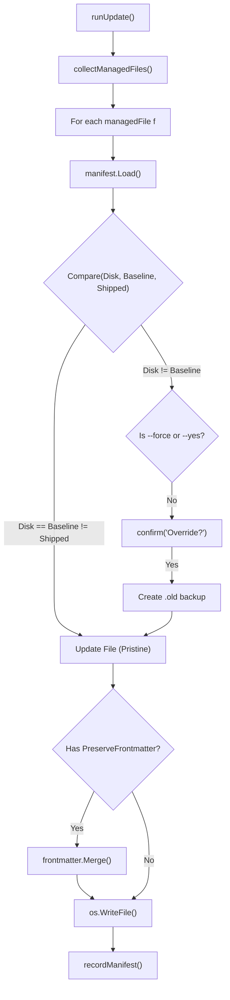
Sources: [internal/cli/update.go:138-198](), [internal/cli/update.go:225-300](), [internal/manifest/manifest.go:36-52]()

---

## Decommissioning: `csdd destroy`

The `destroy` command (aliased as `uninstall`) removes the `csdd` infrastructure from a project.

### Target Selection
`csdd destroy` is surgically destructive. It targets infrastructure while preserving user data:
- **Removed**: `.claude/` (entire tree), `CLAUDE.md`, `.mcp.json`, `csdd.md`, `.githooks/pre-push`, and documentation guides [internal/cli/destroy.go:109-118]().
- **Preserved**: The `specs/` directory is **never** touched by destroy, as it contains the user's primary intellectual property (requirements, designs, and task lists) [internal/cli/destroy.go:18-24]().

### Safety Mechanisms
- **Confirmation**: Requires an interactive "yes" or the `--force` flag [internal/cli/destroy.go:78-83]().
- **Dry Run**: The `--dry-run` flag lists exactly which files would be deleted without performing any I/O [internal/cli/destroy.go:73-76]().
- **Empty Directory Cleanup**: After removing files, it attempts to remove parent directories (like `docs/guides`) only if they are empty [internal/cli/destroy.go:97-101]().

Sources: [internal/cli/destroy.go:25-103](), [internal/cli/destroy_test.go:12-19]()

---

## Cleanup: `csdd clean`

The `clean` command is a utility to manage the clutter created by `csdd update` backups.

### Implementation
- **Scope**: It only removes `*-N.old` files that correspond to known `managedFile` paths [internal/cli/clean.go:16-19]().
- **Discovery**: It calls `collectManagedFiles` to get the list of absolute paths and then performs a glob search for `${path}-*.old` [internal/cli/clean.go:40-49]().
- **Dry Run**: Supports `--dry-run` to preview which backups will be purged [internal/cli/clean.go:60-63]().

Sources: [internal/cli/clean.go:20-78](), [internal/cli/update_test.go:17-27]()

---

## Global Flags and CLI Surface

The workspace commands share a set of global flags handled by the root dispatcher.

| Flag | Purpose | Implementation |
| :--- | :--- | :--- |
| `--root PATH` | Specifies the project root. Defaults to the nearest enclosing `.claude/` via `workspace.Resolve`. | [internal/cli/cli.go:86-91]() |
| `--force` | Overrides safety checks (e.g., deletes without confirmation in `destroy`). | [internal/cli/cli.go:92-94]() |
| `--yes` | Non-interactive confirmation for `update` conflicts. | [internal/cli/update.go:144]() |
| `--dry-run` | Previews changes for `update`, `destroy`, and `clean`. | [internal/cli/update.go:142]() |

Sources: [internal/cli/cli.go:23-76](), [internal/cli/cli.go:81-103]()

---

<<< SECTION: 3.2 MCP Server Management (mcp add, install, presets) [3-2-mcp-server-management-mcp-add-install-presets] >>>

# MCP Server Management (mcp add, install, presets)

<details>
<summary>Relevant source files</summary>

The following files were used as context for generating this wiki page:

- [internal/cli/mcp.go](internal/cli/mcp.go)
- [internal/cli/mcp_presets.go](internal/cli/mcp_presets.go)
- [internal/cli/mcp_presets_test.go](internal/cli/mcp_presets_test.go)
- [internal/cli/mcp_test.go](internal/cli/mcp_test.go)

</details>


The `csdd mcp` command family manages the `.mcp.json` configuration file located at the workspace root. This file defines the Model Context Protocol (MCP) servers that AI agents (such as Claude Code) use to interact with external tools and data sources. The implementation ensures that server configurations are valid, follow security best practices (like avoiding secret storage), and support both local `stdio` and remote `http`/`sse` transports.

## Core Data Structures

The workspace configuration is modeled by the `MCPConfig` struct, which serves as the source of truth for the `.mcp.json` file [internal/cli/mcp.go:18-22]().

### MCPConfig and MCPServer
A configuration consists of a map of named `MCPServer` entries.

| Field | Type | Description |
| :--- | :--- | :--- |
| `Command` | `string` | The executable for `stdio` servers (e.g., `npx`, `python`). |
| `Args` | `[]string` | Command-line arguments passed to the executable. |
| `Env` | `map[string]string` | Environment variables for the server process. |
| `URL` | `string` | The endpoint for remote servers. |
| `Type` | `string` | Remote transport type: `sse` or `http`. |
| `Headers` | `map[string]string` | HTTP headers for remote requests (e.g., Authorization). |
| `Disabled` | `bool` | If true, the server is ignored by agents. |
| `AutoApprove` | `[]string` | List of tool names that bypass human-in-the-loop approval. |

**Sources:** [internal/cli/mcp.go:20-36]()

## Implementation Flow: Adding a Server

The `MCPAdd` function is the primary entry point for modifying the configuration. It handles both the `mcp add` CLI command and the underlying logic for `mcp install` presets.

### Command Dispatch and Logic
1.  **Action Parsing**: `runMCP` dispatches to specific handlers like `mcpAdd`, `mcpInstall`, or `mcpPresets` [internal/cli/mcp.go:41-70]().
2.  **Path Resolution**: The `.mcp.json` path is determined by `paths.MCP(root)` [internal/cli/mcp.go:74-76]().
3.  **Validation**: `buildMCPServer` enforces the "Exclusive Transport" rule: a server must have exactly one of `Command` (stdio) or `URL` (remote) [internal/cli/mcp.go:203-209]().
4.  **Persistence**: The configuration is written to disk with `json.MarshalIndent` to ensure it remains human-readable and reviewable [internal/cli/mcp.go:99-112]().

### Logical to Code Entity Mapping: MCP Add
The following diagram illustrates how CLI inputs are transformed into the internal `MCPConfig` model.

**CLI to Code Entity Mapping: MCP Add**
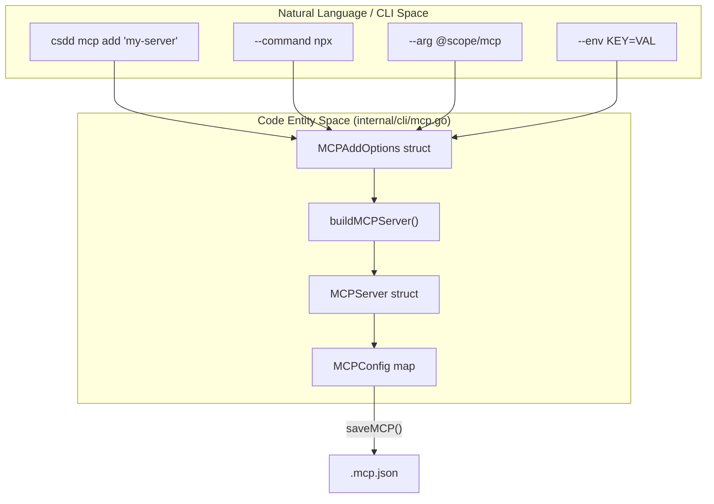
**Sources:** [internal/cli/mcp.go:115-127](), [internal/cli/mcp.go:164-200](), [internal/cli/mcp.go:203-255]()

## Preset Registry and Installation

The `mcp install` command uses a static registry of known MCP servers to simplify setup. This registry is defined in `mcpPresetRegistry` [internal/cli/mcp_presets.go:30-54]().

### Built-in Presets
| Name | Transport | Description |
| :--- | :--- | :--- |
| `context7` | `http` | Up-to-date library and API documentation [internal/cli/mcp_presets.go:31-37](). |
| `playwright` | `stdio` | Browser automation via `@playwright/mcp@latest` [internal/cli/mcp_presets.go:38-44](). |
| `github` | `http` | GitHub API access (Repos, PRs, Issues) [internal/cli/mcp_presets.go:45-53](). |

### Installation Process
When `MCPInstallPreset` is called:
1.  It validates that all requested names exist in the registry before performing any writes [internal/cli/mcp_presets.go:93-97]().
2.  It iterates through the names, expanding each `Preset` into `MCPAddOptions` [internal/cli/mcp_presets.go:98-109]().
3.  It calls `MCPAdd` for each preset. If a server already exists, it requires the `--force` flag to overwrite [internal/cli/mcp_presets.go:110-112]().
4.  If the preset contains a `Note` (e.g., regarding `GITHUB_PAT` environment variables), it is rendered to the terminal [internal/cli/mcp_presets.go:113-115]().

**Sources:** [internal/cli/mcp_presets.go:89-118](), [internal/cli/mcp_presets_test.go:57-72]()

## Validation Rules

The `mcp validate` command (and internal checks) enforces structural integrity on `.mcp.json`.

*   **Transport Mutex**: A server cannot define both a `command` and a `url`.
*   **Remote Types**: If a `url` is provided, the `type` must be one of `sse` or `http`. It defaults to `http` if omitted [internal/cli/mcp.go:39](), [internal/cli/mcp.go:218-228]().
*   **Kebab Case**: Server names must follow kebab-case naming conventions [internal/cli/mcp.go:165-167]().
*   **Exit Codes**: Structural validation failures (e.g., both transport types present) return exit code `2` [internal/cli/mcp_test.go:168-170]().

### Preset Expansion Flow
The diagram below shows how the `mcp install` command bridges the gap between the static registry and the live workspace configuration.

**Preset Expansion Flow**
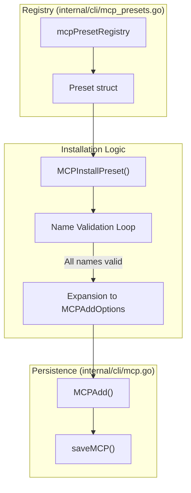
**Sources:** [internal/cli/mcp_presets.go:30-54](), [internal/cli/mcp_presets.go:89-118]()

## CLI Command Reference

| Command | Function | Description |
| :--- | :--- | :--- |
| `add` | `mcpAdd` | Manually add a stdio or remote server [internal/cli/mcp.go:129-161](). |
| `install` | `mcpInstall` | Install one or more servers from the preset registry [internal/cli/mcp_presets.go:120-139](). |
| `presets` | `mcpPresets` | List all available presets in a table [internal/cli/mcp_presets.go:141-160](). |
| `list` | `mcpList` | List currently configured servers in the workspace [internal/cli/mcp.go:54](). |
| `show` | `mcpShow` | Display the JSON configuration for a specific server [internal/cli/mcp.go:56](). |
| `remove` | `mcpRemove` | Remove a server entry (requires `--force`) [internal/cli/mcp.go:58](). |
| `enable`/`disable` | `mcpToggle` | Toggle the `disabled` field for a server [internal/cli/mcp.go:60-63](). |
| `validate` | `mcpValidate` | Perform structural check on `.mcp.json` [internal/cli/mcp.go:64](). |

**Sources:** [internal/cli/mcp.go:41-70](), [internal/cli/mcp_test.go:91-171]()

---

<<< SECTION: 3.3 Export and Effort Commands [3-3-export-and-effort-commands] >>>

# Export and Effort Commands

<details>
<summary>Relevant source files</summary>

The following files were used as context for generating this wiki page:

- [cmd/csdd/main.go](cmd/csdd/main.go)
- [internal/cli/agent.go](internal/cli/agent.go)
- [internal/cli/agent_effort_test.go](internal/cli/agent_effort_test.go)
- [internal/cli/claudemd.go](internal/cli/claudemd.go)
- [internal/cli/cli_extra_test.go](internal/cli/cli_extra_test.go)
- [internal/cli/effort.go](internal/cli/effort.go)
- [internal/cli/effort_test.go](internal/cli/effort_test.go)
- [internal/cli/export.go](internal/cli/export.go)
- [internal/cli/export_test.go](internal/cli/export_test.go)
- [internal/cli/skill_effort_test.go](internal/cli/skill_effort_test.go)
- [internal/templater/setup_guidance_test.go](internal/templater/setup_guidance_test.go)

</details>


This page documents the `csdd export` suite for converting workspace artifacts into external formats (Kiro and Codex) and the effort estimation system used to control agentic behavior during generation and implementation tasks.

## 1. Export System

The `csdd export` command family transforms `csdd` workspace artifacts into formats compatible with other IDE extensions or agentic platforms. This allows teams to maintain a single source of truth in `csdd` while supporting developers who use different tooling environments.

### 1.1 Kiro Export (`csdd export kiro`)

Kiro is an IDE-centric SDD implementation. `csdd export kiro` converts the `.claude/` and `specs/` structure into a `.kiro/` layout.

*   **Steering Files**: Copied verbatim from `.claude/steering/` to `.kiro/steering/`. The `csdd` steering frontmatter (e.g., `inclusion: always`, `fileMatchPattern`) is natively compatible with Kiro [internal/cli/export.go:97-125]().
*   **Specs**: SDD Markdown artifacts (`requirements.md`, `design.md`, `tasks.md`, `research.md`, `bugfix.md`) are copied to `.kiro/specs/<name>/` [internal/cli/export.go:127-152]().
*   **Exclusions**: The `spec.json` state file is deliberately omitted because Kiro manages phase transitions and approval states within its own internal IDE state machine [internal/cli/export.go:32-34]().

### 1.2 Codex Export (`csdd export codex`)

Codex export adapts the workspace for platforms that rely on a single `AGENTS.md` entry point and TOML-based MCP configurations.

*   **AGENTS.md Generation**: `csdd` builds a flattened `AGENTS.md` file. It inlines the content of "always-on" steering files directly into the document because Codex does not resolve the `@.claude/steering` import syntax used by Claude Code [internal/cli/export.go:162-182]().
*   **Conditional Steering**: Steering files with conditional inclusion (e.g., `manual` or `fileMatch`) are listed as on-demand pointers rather than being inlined [internal/cli/export.go:210-215]().
*   **MCP to TOML**: The `.mcp.json` configuration is converted into a Codex-compatible `.codex/config.toml`. Remote MCP servers (URL-based) are emitted with a warning note as they require experimental flags in Codex [internal/cli/export.go:184-207]().

### 1.3 Export Data Flow

The following diagram illustrates how the `ExportOptions` struct drives the conversion from the `csdd` workspace to target formats.

**Export Transformation Logic**
```mermaid
graph TD
    subgraph "Source: csdd Workspace"
        A1[".claude/steering/*.md"]
        A2["specs/*/requirements.md"]
        A3[".mcp.json"]
        A4["CLAUDE.md"]
    end

    subgraph "Process: internal/cli/export.go"
        B1["ExportKiro(opts)"]
        B2["ExportCodex(opts)"]
        B3["buildAgentsMD(root)"]
        B4["mcpToTOML(cfg)"]
    end

    subgraph "Target: Kiro Format"
        C1[".kiro/steering/*.md"]
        C2[".kiro/specs/*/requirements.md"]
    end

    subgraph "Target: Codex Format"
        D1["AGENTS.md"]
        D2[".codex/config.toml"]
    end

    A1 --> B1
    A2 --> B1
    B1 --> C1
    B1 --> C2

    A1 --> B3
    A4 --> B3
    B3 --> D1
    A3 --> B4
    B4 --> D2
```
**Sources:** [internal/cli/export.go:38-42](), [internal/cli/export.go:97-160](), [internal/cli/export.go:165-207]()

---

## 2. Effort and Complexity Commands

`csdd` allows specifying `effort` and `model` parameters for Agents and Skills. These values are stored in the Markdown frontmatter and used by Claude Code to scale its reasoning capabilities based on task complexity.

### 2.1 Effort Levels

Effort is a closed set of case-sensitive strings defined in `internal/cli/effort.go`. The `validateEffort` function ensures consistency across all artifact types [internal/cli/effort.go:8-28]().

| Level | Purpose |
| :--- | :--- |
| `low` | Simple lookups, minor text edits, or rote tasks. |
| `medium` | Standard feature implementation or debugging. |
| `high` | Complex architectural changes or multi-file refactors. |
| `xhigh` | High-reasoning tasks requiring deep context analysis. |
| `max` | Exhaustive search and verification for critical paths. |

### 2.2 Configuration Inheritance

If the `--effort` or `--model` flags are omitted during `csdd agent create` or `csdd skill create`, the keys are omitted from the resulting Markdown frontmatter. This triggers **Inheritance Mode**, where the artifact inherits the configuration of the current Claude Code session [internal/cli/effort.go:18-21]().

### 2.3 Implementation in Agents and Skills

The `AgentCreateOptions` and corresponding skill creation logic use these validators to ensure artifacts are well-formed before writing to disk.

**Agent/Skill Creation Validation Flow**
```mermaid
sequenceDiagram
    participant CLI as "internal/cli/agent.go"
    participant V as "internal/cli/effort.go:validateEffort"
    participant T as "internal/templater"
    participant FS as "Filesystem"

    CLI->>V: validateEffort(opts.Effort)
    Note over V: Check against ["low", "medium", "high", "xhigh", "max"]
    V-->>CLI: error if invalid
    CLI->>T: Render("agent.md.tmpl", opts)
    T-->>CLI: Markdown Content
    CLI->>FS: workspace.WriteFile(target)
```
**Sources:** [internal/cli/agent.go:81-128](), [internal/cli/effort.go:18-29](), [internal/cli/agent_effort_test.go:59-69]()

---

## 3. CLAUDE.md Management (`claudemd.go`)

The `internal/cli/claudemd.go` utility manages the integration between `csdd` steering files and the primary `CLAUDE.md` entry point.

### 3.1 Managed Steering Blocks

`csdd` uses HTML comment markers to identify the section of `CLAUDE.md` it is permitted to modify [internal/cli/claudemd.go:11-14]().

*   **Start Marker**: `<!-- csdd:steering:start -->`
*   **End Marker**: `<!-- csdd:steering:end -->`

### 3.2 Idempotent Imports

The `ensureSteeringImports` function performs the following steps:
1.  Locates the managed block in `CLAUDE.md`.
2.  Checks for existing `@.claude/steering/<name>` lines.
3.  Appends missing imports using the `@` relative path syntax required by Claude Code [internal/cli/claudemd.go:21-59]().
4.  Returns the count of newly added lines for CLI reporting.

If `CLAUDE.md` does not contain the markers, the function exits silently without making changes, preserving hand-authored files [internal/cli/claudemd.go:30-32]().

**Sources:** [internal/cli/claudemd.go:11-59]()

---

<<< SECTION: 4 Automation Hooks and Lifecycle Workflows [4-automation-hooks-and-lifecycle-workflows] >>>

# Automation Hooks and Lifecycle Workflows

<details>
<summary>Relevant source files</summary>

The following files were used as context for generating this wiki page:

- [internal/templater/templates/agents/wf-development.md.tmpl](internal/templater/templates/agents/wf-development.md.tmpl)
- [internal/templater/templates/guides/claude-code-sdd.md.tmpl](internal/templater/templates/guides/claude-code-sdd.md.tmpl)
- [internal/templater/templates/hooks/block-destructive.sh.tmpl](internal/templater/templates/hooks/block-destructive.sh.tmpl)
- [internal/templater/templates/hooks/format-after-edit.sh.tmpl](internal/templater/templates/hooks/format-after-edit.sh.tmpl)
- [internal/templater/templates/hooks/test-before-stop.sh.tmpl](internal/templater/templates/hooks/test-before-stop.sh.tmpl)
- [internal/templater/templates/root/CLAUDE.md.tmpl](internal/templater/templates/root/CLAUDE.md.tmpl)
- [internal/templater/templates/root/pre-push.tmpl](internal/templater/templates/root/pre-push.tmpl)

</details>


This section provides an overview of the automation layer within the `csdd` framework. It details how the system uses Claude Code's native automation capabilities—hooks, slash commands, and an extensive skill library—to enforce the Spec-Driven Development (SDD) lifecycle and ensure safety across the development loop.

## The Automation Layer

The `csdd` automation layer bridges the gap between high-level development methodology and low-level shell execution. It ensures that every action taken by an agent (or human) follows the "Iron Law" of SDD: **Specifications are contracts, not documentation.**

### Lifecycle Flow Overview

The lifecycle is governed by a series of automated gates and reminders that prevent process violations, such as bypassing human approvals or committing directly to protected branches.

1.  **Discovery & Planning:** Product and architecture artifacts are created using the discovery skill library.
2.  **Phase Gates:** The `csdd spec` command family (and corresponding MCP tools) enforces a strict `requirements → design → tasks → implementation` progression.
3.  **Implementation Hooks:** Shell hooks monitor tool usage to block destructive commands and ensure formatting.
4.  **TDD Implementation:** The `tdd-cycle` skill drives the Red-Green-Refactor loop for every task.
5.  **Verification & Stop:** Stop hooks remind the agent to provide evidence blocks and verify changes before reporting completion.

### Bridging NL Space to Code Entities

The following diagram maps the conceptual lifecycle phases to the specific automation scripts and skill entities defined in the codebase.

**Lifecycle Automation Mapping**
```mermaid
graph TD
    subgraph "Natural Language (Methodology)"
        Discovery["Product Discovery"]
        Planning["Architecture & Tasks"]
        Coding["Implementation (TDD)"]
        Review["Verification & PR"]
    end

    subgraph "Code Entity Space (Automation)"
        Discovery -->|Uses| SkillDiscovery["discovery-prd / discovery-research"]
        Planning -->|Uses| SkillDev["dev-architecture / dev-epics-stories"]
        Coding -->|Enforced by| HookBlock["block-destructive.sh"]
        Coding -->|Guided by| SkillTDD["tdd-cycle / implementer agent"]
        Review -->|Enforced by| HookTest["test-before-stop.sh"]
        Review -->|Validated by| GitHook["pre-push"]
    end

    [internal/templater/templates/hooks/block-destructive.sh.tmpl:1-60]()
    [internal/templater/templates/hooks/test-before-stop.sh.tmpl:1-38]()
    [internal/templater/templates/root/pre-push.tmpl:1-27]()
    [internal/templater/templates/agents/wf-development.md.tmpl:1-90]()
```
**Sources:** [internal/templater/templates/hooks/block-destructive.sh.tmpl:1-60](), [internal/templater/templates/hooks/test-before-stop.sh.tmpl:1-38](), [internal/templater/templates/root/pre-push.tmpl:1-27](), [internal/templater/templates/agents/wf-development.md.tmpl:1-90]()

## Automation Hooks and Slash Commands

Claude Code hooks provide deterministic shell-based automation triggered by specific events. `csdd` leverages these to maintain repository hygiene and prevent "vibe coding."

*   **`block-destructive.sh`**: A `PreToolUse(Bash)` hook that denylists dangerous commands (e.g., `rm -rf /`, `git push --force`) and enforces a "branch-first" guard to prevent commits on the `main` or `master` branches [internal/templater/templates/hooks/block-destructive.sh.tmpl:19-58]().
*   **`format-after-edit.sh`**: A `PostToolUse` hook that performs best-effort formatting (using `gofmt`, `prettier`, etc.) after an agent edits a file [internal/templater/templates/hooks/format-after-edit.sh.tmpl:19-25]().
*   **`test-before-stop.sh`**: A `Stop` hook that reminds the agent to run verification skills and check for context hygiene (e.g., reminding the user to run `/clear` once a spec is finished) [internal/templater/templates/hooks/test-before-stop.sh.tmpl:11-26]().
*   **Slash Commands**: The `/csdd-commit` command automates the generation of structured commit messages based on the current diff and active spec [internal/templater/templates/root/CLAUDE.md.tmpl:80-80]().

For details, see [Claude Code Hooks and Slash Commands](#4.1).

**Sources:** [internal/templater/templates/hooks/block-destructive.sh.tmpl:1-60](), [internal/templater/templates/hooks/format-after-edit.sh.tmpl:1-27](), [internal/templater/templates/hooks/test-before-stop.sh.tmpl:1-38](), [internal/templater/templates/root/CLAUDE.md.tmpl:80-82]()

## TDD Cycle and Implementation Skills

The implementation phase is driven by specialized skills that enforce the Test-Driven Development (TDD) loop. This ensures that every change is backed by evidence and verified against the approved spec.

*   **`tdd-cycle`**: The core skill for implementation, facilitating the Red-Green-Refactor loop one task at a time [internal/templater/templates/agents/wf-development.md.tmpl:53-54]().
*   **Orchestration**: The `wf-development` agent acts as the lead, coordinating between architecture, epics, and the implementation cycle [internal/templater/templates/agents/wf-development.md.tmpl:7-10]().
*   **Verification**: The `verify-change` skill and `pr-review` skills ensure that code meets quality standards and security requirements before merging [internal/templater/templates/agents/wf-development.md.tmpl:22-24]().

For details, see [TDD Cycle and Implementation Skills](#4.2).

**Sources:** [internal/templater/templates/agents/wf-development.md.tmpl:1-90](), [internal/templater/templates/root/CLAUDE.md.tmpl:101-103]()

## Discovery and Planning Skills

Before implementation begins, `csdd` provides a suite of discovery skills to move from abstract ideas to concrete, human-approved specifications.

*   **Product Discovery**: Skills like `discovery-prd` and `discovery-research` help define the "What" and "Why" of a feature [internal/templater/templates/guides/claude-code-sdd.md.tmpl:71-71]().
*   **Technical Planning**: Skills such as `dev-architecture` and `dev-epics-stories` translate requirements into technical designs and actionable tasks [internal/templater/templates/agents/wf-development.md.tmpl:33-34]().
*   **Readiness**: The `dev-readiness-check` acts as a final gate to ensure all dependencies and boundaries are understood before coding starts [internal/templater/templates/agents/wf-development.md.tmpl:35-35]().

For details, see [Discovery and Planning Skills](#4.3).

**Sources:** [internal/templater/templates/agents/wf-development.md.tmpl:31-40](), [internal/templater/templates/guides/claude-code-sdd.md.tmpl:68-78]()

## System Interaction Diagram

The following diagram illustrates how the `csdd` CLI, MCP tools, and automation hooks interact during a typical development iteration.

**Automation Interaction Flow**
```mermaid
sequenceDiagram
    participant U as User
    participant A as Claude Agent
    participant C as csdd CLI / MCP
    participant H as Hooks (.claude/hooks)
    participant G as Git (.githooks)

    U->>A: "Implement feature X"
    A->>C: csdd_spec_init(X)
    C-->>A: Spec Initialized
    A->>C: csdd_spec_generate(requirements)
    A->>U: "Please approve requirements"
    U->>C: csdd spec approve X --phase requirements
    A->>H: Bash Tool (Edit Code)
    H->>H: block-destructive.sh (Validate)
    H->>H: format-after-edit.sh (Post-process)
    A->>G: git push
    G->>G: pre-push (Run Test Gate)
    A->>H: Stop Event
    H->>A: test-before-stop.sh (Reminder)
```
**Sources:** [internal/templater/templates/root/CLAUDE.md.tmpl:88-105](), [internal/templater/templates/hooks/block-destructive.sh.tmpl:45-58](), [internal/templater/templates/root/pre-push.tmpl:10-27]()

---

<<< SECTION: 4.1 Claude Code Hooks and Slash Commands [4-1-claude-code-hooks-and-slash-commands] >>>

# Claude Code Hooks and Slash Commands

<details>
<summary>Relevant source files</summary>

The following files were used as context for generating this wiki page:

- [README.md](README.md)
- [internal/templater/templates/commands/csdd-setup-init.md.tmpl](internal/templater/templates/commands/csdd-setup-init.md.tmpl)
- [internal/templater/templates/commands/csdd-setup-update.md.tmpl](internal/templater/templates/commands/csdd-setup-update.md.tmpl)
- [internal/templater/templates/guides/claude-code-sdd.md.tmpl](internal/templater/templates/guides/claude-code-sdd.md.tmpl)
- [internal/templater/templates/hooks/block-destructive.sh.tmpl](internal/templater/templates/hooks/block-destructive.sh.tmpl)
- [internal/templater/templates/hooks/format-after-edit.sh.tmpl](internal/templater/templates/hooks/format-after-edit.sh.tmpl)
- [internal/templater/templates/hooks/test-before-stop.sh.tmpl](internal/templater/templates/hooks/test-before-stop.sh.tmpl)
- [internal/templater/templates/root/pre-push.tmpl](internal/templater/templates/root/pre-push.tmpl)

</details>


This page details the automation layer provided by `csdd` for [Claude Code](https://claude.com/claude-code). It covers the shell-based hooks that govern tool execution, the Git-level safety gates, and the slash commands that automate workspace configuration and commit generation.

## Automation Hooks

`csdd` implements a series of shell hooks that integrate with Claude Code's lifecycle events. These hooks are located in `.claude/hooks/` and are configured via the `.claude/settings.json` file generated during `csdd init` [README.md:55]().

### Hook Event Types
The system utilizes three primary hook types to intercept agent actions:
1.  **PreToolUse**: Executed before a tool (like `Bash` or `Edit`) runs. It can block execution by exiting with code `2` [internal/templater/templates/hooks/block-destructive.sh.tmpl:4]().
2.  **PostToolUse**: Executed after a tool completes. Used for side effects like auto-formatting [internal/templater/templates/hooks/format-after-edit.sh.tmpl:2]().
3.  **Stop**: Executed when the agent attempts to finish a task. Used for final verification [internal/templater/templates/hooks/test-before-stop.sh.tmpl:2]().

### Destructive Command & Branch Guard
The `block-destructive.sh` hook acts as a security and workflow gate. It parses the incoming tool call JSON to extract the command string [internal/templater/templates/hooks/block-destructive.sh.tmpl:9-17]().

*   **Pattern Denylist**: It blocks high-risk commands such as `rm -rf /`, `mkfs`, `git push --force`, and `sudo` [internal/templater/templates/hooks/block-destructive.sh.tmpl:20-35]().
*   **Branch-First Guard**: It prevents `git commit` or `git push` while on the `main` or `master` branches. This enforces the SDD rule that every feature must land on its own branch (e.g., `feat/feature-name`) [internal/templater/templates/hooks/block-destructive.sh.tmpl:49-58]().

### Auto-Formatting
The `format-after-edit.sh` hook is a `PostToolUse` hook triggered after `Edit`, `Write`, or `MultiEdit` operations [internal/templater/templates/hooks/format-after-edit.sh.tmpl:2](). It performs best-effort formatting based on file extension:
*   **Go**: `gofmt`
*   **Rust**: `rustfmt`
*   **Python**: `black`
*   **JS/TS/JSON/MD**: `prettier`
This hook always exits `0` to ensure that formatting failures do not block the agent's progress [internal/templater/templates/hooks/format-after-edit.sh.tmpl:3-5]().

### Verification at Stop
The `test-before-stop.sh` hook intercepts the `Stop` event.
*   **Advisory Mode**: By default, it prints a verification checklist reminding the agent to run the `verify-change` skill [internal/templater/templates/hooks/test-before-stop.sh.tmpl:4-11]().
*   **Context Hygiene**: It checks the most recent `tasks.md`. If all tasks are marked complete, it nudges the operator to run `/clear` to prevent context accumulation across specs [internal/templater/templates/hooks/test-before-stop.sh.tmpl:16-26]().
*   **Hard Gate (Optional)**: Users can uncomment blocks to run `make test` or `npm test`, exiting `2` on failure to force the agent to fix bugs before stopping [internal/templater/templates/hooks/test-before-stop.sh.tmpl:28-36]().

**Sources:**
- [internal/templater/templates/hooks/block-destructive.sh.tmpl]()
- [internal/templater/templates/hooks/format-after-edit.sh.tmpl]()
- [internal/templater/templates/hooks/test-before-stop.sh.tmpl]()

---

## Git Pre-Push Hook

Independent of the Claude Code runtime, `csdd` installs a `pre-push` hook in `.githooks/` [internal/templater/templates/root/pre-push.tmpl:1](). This serves as the final mechanical gate before code leaves the local machine.

### Test Command Resolution
The hook attempts to detect the project's test runner in the following order:
1.  **Makefile**: Runs `make verify` or `make test` [internal/templater/templates/root/pre-push.tmpl:12-13]().
2.  **Node.js**: Runs `npm test` [internal/templater/templates/root/pre-push.tmpl:14-15]().
3.  **Go**: Runs `go test ./...` [internal/templater/templates/root/pre-push.tmpl:16-17]().
4.  **Python**: Runs `python -m pytest` [internal/templater/templates/root/pre-push.tmpl:18-19]().
5.  **Rust**: Runs `cargo test` [internal/templater/templates/root/pre-push.tmpl:20-21]().

If no runner is detected, it exits `0` with a warning [internal/templater/templates/root/pre-push.tmpl:22-25]().

**Sources:**
- [internal/templater/templates/root/pre-push.tmpl]()

---

## Slash Commands

Slash commands are custom instructions defined in `.claude/commands/` that extend Claude Code's capabilities.

### Workspace Setup and Update
*   **`/csdd-setup-init`**: Used to tailor the workspace to a specific project stack. It detects frameworks, adapts steering files (`product.md`, `tech.md`), and creates stack-specialized implementer agents using `csdd agent create` [internal/templater/templates/commands/csdd-setup-init.md.tmpl:1-37]().
*   **`/csdd-setup-update`**: Performs targeted adjustments as the project evolves. It uses `csdd update` to refresh the baseline while preserving user edits, saving conflicts as `.old` files [internal/templater/templates/commands/csdd-setup-update.md.tmpl:15-25]().

### The `/csdd-commit` Command
This command automates the creation of Conventional Commits. It instructs the agent to:
1.  Read the current diff.
2.  Consult the active `spec.json` and `requirements.md` to understand the *intent* of the change [README.md:61]().
3.  Generate a commit message that follows the `type(scope): description` format, ensuring traceability between the code and the spec.

**Sources:**
- [internal/templater/templates/commands/csdd-setup-init.md.tmpl]()
- [internal/templater/templates/commands/csdd-setup-update.md.tmpl]()
- [README.md]()

---

## Logic Flow Diagrams

### Hook Execution Flow
This diagram maps the transition from a Natural Language request to the execution of Shell Hooks.

```mermaid
graph TD
    subgraph "Natural Language Space"
        User["User: 'Delete the temp folder'"]
        Agent["Claude Agent Logic"]
    end

    subgraph "Code Entity Space"
        CC["Claude Code Runtime"]
        HookDestructive["block-destructive.sh"]
        ToolBash["Bash Tool"]
        HookFormat["format-after-edit.sh"]
        ToolEdit["Edit Tool"]
    end

    User --> Agent
    Agent -- "wants to run rm -rf" --> CC
    CC -- "PreToolUse(Bash)" --> HookDestructive
    HookDestructive -- "Exit 2 (Deny)" --> CC
    CC -- "Error: Destructive Pattern" --> Agent
    
    Agent -- "wants to change code" --> CC
    CC -- "Tool: Edit" --> ToolEdit
    ToolEdit -- "PostToolUse(Edit)" --> HookFormat
    HookFormat -- "gofmt / prettier" --> ToolEdit
```
**Sources:**
- [internal/templater/templates/hooks/block-destructive.sh.tmpl]()
- [internal/templater/templates/hooks/format-after-edit.sh.tmpl]()

### Workspace Configuration Flow
This diagram illustrates how Slash Commands bridge Natural Language intent to CLI-driven workspace mutations.

```mermaid
graph TD
    subgraph "Natural Language Space"
        Prompt["/csdd-setup-init 'use React'"]
    end

    subgraph "Code Entity Space"
        CmdInit["csdd-setup-init.md.tmpl"]
        CLI["csdd CLI binary"]
        Steering["internal/templater/templates/steering"]
        AgentTmpl["internal/templater/templates/agents"]
    end

    Prompt --> CmdInit
    CmdInit -- "1. Detect Stack" --> CLI
    CmdInit -- "2. csdd steering create" --> CLI
    CLI -- "Load Template" --> Steering
    CmdInit -- "3. csdd agent create" --> CLI
    CLI -- "Load Template" --> AgentTmpl
    CLI -- "Write to .claude/" --> Workspace[".claude/ Directory"]
```
**Sources:**
- [internal/templater/templates/commands/csdd-setup-init.md.tmpl]()
- [internal/templater/templates/commands/csdd-setup-update.md.tmpl]()

---

<<< SECTION: 4.2 TDD Cycle and Implementation Skills [4-2-tdd-cycle-and-implementation-skills] >>>

# TDD Cycle and Implementation Skills

<details>
<summary>Relevant source files</summary>

The following files were used as context for generating this wiki page:

- [internal/templater/templates/agents/implementer.md.tmpl](internal/templater/templates/agents/implementer.md.tmpl)
- [internal/templater/templates/agents/wf-development.md.tmpl](internal/templater/templates/agents/wf-development.md.tmpl)
- [internal/templater/templates/agents/wf-product-discovery.md.tmpl](internal/templater/templates/agents/wf-product-discovery.md.tmpl)
- [internal/templater/templates/root/CLAUDE.md.tmpl](internal/templater/templates/root/CLAUDE.md.tmpl)
- [internal/templater/templates/skills/dev-architecture/assets/adr-template.md.tmpl](internal/templater/templates/skills/dev-architecture/assets/adr-template.md.tmpl)
- [internal/templater/templates/skills/dev-architecture/assets/architecture-template.md.tmpl](internal/templater/templates/skills/dev-architecture/assets/architecture-template.md.tmpl)
- [internal/templater/templates/skills/dev-epics-stories/SKILL.md.tmpl](internal/templater/templates/skills/dev-epics-stories/SKILL.md.tmpl)
- [internal/templater/templates/skills/dev-epics-stories/assets/epics-template.md.tmpl](internal/templater/templates/skills/dev-epics-stories/assets/epics-template.md.tmpl)
- [internal/templater/templates/skills/pr-review/SKILL.md.tmpl](internal/templater/templates/skills/pr-review/SKILL.md.tmpl)
- [internal/templater/templates/skills/safe-refactor/SKILL.md.tmpl](internal/templater/templates/skills/safe-refactor/SKILL.md.tmpl)
- [internal/templater/templates/skills/tdd-cycle/SKILL.md.tmpl](internal/templater/templates/skills/tdd-cycle/SKILL.md.tmpl)
- [internal/templater/templates/skills/verify-change/SKILL.md.tmpl](internal/templater/templates/skills/verify-change/SKILL.md.tmpl)
- [internal/tui/wizard.go](internal/tui/wizard.go)
- [internal/tui/wizard_test.go](internal/tui/wizard_test.go)

</details>


This page documents the technical implementation of the Test-Driven Development (TDD) loop within `csdd`. It covers the primary `implementer` agent, the `tdd-cycle` skill, and the supporting verification and review workflows that ensure the **Iron Law** of development is maintained: no production code exists without a failing test.

## Overview of the Implementation Loop

The implementation phase is the final stage of the SDD lifecycle. It is managed by the `wf-development` orchestrator and executed by the `implementer` agent. The workflow follows a strict Red-Green-Refactor cycle where every observable behavior is backed by traceable evidence in the spec's `test-report.json` and `diff-report.json` artifacts.

### The Implementation Pipeline
The following diagram illustrates the flow from an approved task to a verified commit, bridging the gap between Natural Language requirements and Code entities.

**Diagram: SDD Implementation Pipeline**
```mermaid
graph TD
    subgraph "Natural Language Space (Specs)"
        TASK["tasks.md (Task ID)"]
        REQS["requirements.md (EARS)"]
        DESIGN["design.md (Boundaries)"]
    end

    subgraph "Agent Logic (internal/templater/templates/agents)"
        IMPL["implementer.md"]
        WF_DEV["wf-development.md"]
    end

    subgraph "Execution Skills (internal/templater/templates/skills)"
        TDD["tdd-cycle"]
        VERIFY["verify-change"]
        PR["pr-review"]
    end

    subgraph "Code Entity Space"
        TEST_CODE["Tests (*_test.go, *.test.ts)"]
        PROD_CODE["Production Code"]
        REPORT["test-report.json"]
        DIFF["diff-report.json"]
    end

    TASK --> WF_DEV
    WF_DEV --> IMPL
    IMPL -- "Drives" --> TDD
    TDD -- "RED (Fail)" --> TEST_CODE
    TDD -- "GREEN (Pass)" --> PROD_CODE
    IMPL -- "Validates" --> VERIFY
    VERIFY -- "csdd spec test-report" --> REPORT
    VERIFY -- "csdd spec diff-report" --> DIFF
    IMPL -- "Finalizes" --> PR
    PR -- "/csdd-commit" --> GIT["Git Commit"]
```
**Sources:** [internal/templater/templates/agents/implementer.md.tmpl:7-22](), [internal/templater/templates/agents/wf-development.md.tmpl:31-40](), [internal/templater/templates/skills/tdd-cycle/SKILL.md.tmpl:49-65]()

---

## The `implementer` Agent

The `implementer` is a language-agnostic sub-agent designed to handle exactly one task at a time. It is governed by the `spec.json` `development_flow` property (e.g., `tdd`, `tdd-e2e`, or `unit`).

### Key Responsibilities
1.  **Scope Discipline:** Operates strictly within the `_Boundary:_` defined in `tasks.md` [internal/templater/templates/agents/implementer.md.tmpl:13-16]().
2.  **Flow Execution:** 
    *   In `tdd` flows, it uses the `tdd-cycle` skill for a RED-first approach [internal/templater/templates/agents/implementer.md.tmpl:41-44]().
    *   In `unit` flows, it writes implementation and tests simultaneously [internal/templater/templates/agents/implementer.md.tmpl:45-46]().
3.  **Evidence Recording:** Uses the `csdd` CLI to persist test results and git diffs into the spec folder [internal/templater/templates/agents/implementer.md.tmpl:53-57]().

**Sources:** [internal/templater/templates/agents/implementer.md.tmpl:1-104]()

---

## The `tdd-cycle` Skill

The `tdd-cycle` skill implements the **Iron Law**: "Production code does not exist until a test has failed for the expected reason" [internal/templater/templates/skills/tdd-cycle/SKILL.md.tmpl:15-17]().

### Workflow Steps
| Step | Action | Requirement |
| :--- | :--- | :--- |
| **1. RED** | Write failing test | Must fail for the **expected reason**, not a syntax error [internal/templater/templates/skills/tdd-cycle/SKILL.md.tmpl:49-52](). |
| **2. GREEN** | Minimal implementation | Write the least code possible to pass the test [internal/templater/templates/skills/tdd-cycle/SKILL.md.tmpl:54-56](). |
| **3. REFACTOR** | Clean under green | Improve structure without adding behavior [internal/templater/templates/skills/tdd-cycle/SKILL.md.tmpl:58-60](). |
| **4. RECORD** | CLI Evidence | Run `csdd spec test-report` and `diff-report` [internal/templater/templates/skills/tdd-cycle/SKILL.md.tmpl:66-89](). |

**Sources:** [internal/templater/templates/skills/tdd-cycle/SKILL.md.tmpl:1-144]()

---

## Verification and Quality Gates

Verification is handled by the `verify-change` skill, which bridges the gap between agent assertions and actual system state.

### `verify-change` Skill
This skill is used to generate a **Verification Block** for PRs. It discovers project-specific commands from `CLAUDE.md` or `package.json` rather than guessing [internal/templater/templates/skills/verify-change/SKILL.md.tmpl:30-32]().

**Standard Verification Block:**
```markdown
## Verification
- <test cmd>      ✅
- <lint cmd>      ✅
- <typecheck cmd> ✅
- <build cmd>     ✅
```
**Sources:** [internal/templater/templates/skills/verify-change/SKILL.md.tmpl:95-102]()

### `pr-review` and Adversarial Agents
Before a task is committed, the `pr-review` skill orchestrates a multi-stage gate:
1.  **Self-Review:** The agent reads its own diff [internal/templater/templates/skills/pr-review/SKILL.md.tmpl:37-40]().
2.  **Adversarial Review:** Invokes the `code-reviewer` and `security-reviewer` sub-agents. These agents are **read-only**; they report "Blockers" that the `implementer` must fix [internal/templater/templates/skills/pr-review/SKILL.md.tmpl:42-45]().
3.  **Gated Commit:** The `/csdd-commit` command is blocked if any `Blocker` remains open [internal/templater/templates/skills/pr-review/SKILL.md.tmpl:48-51]().

**Sources:** [internal/templater/templates/skills/pr-review/SKILL.md.tmpl:1-100]()

---

## Data Flow: Evidence and Traceability

The `csdd` CLI provides the mechanical link between the TDD cycle and the Spec artifacts.

**Diagram: Evidence Persistence**
```mermaid
sequenceDiagram
    participant A as implementer Agent
    participant C as csdd CLI
    participant T as Test Runner (pytest/jest/go test)
    participant S as spec.json / test-report.json

    A->>C: csdd spec test-report <feat> --run --lang <l>
    C->>T: Execute detected test command
    T-->>C: JUnit XML + Coverage Data
    C->>S: Parse & Write to specs/<feat>/test-report.json
    A->>C: csdd spec diff-report <feat>
    C->>S: Write Git Diff to specs/<feat>/diff-report.json
```
**Sources:** [internal/templater/templates/skills/tdd-cycle/SKILL.md.tmpl:71-89](), [internal/templater/templates/agents/implementer.md.tmpl:53-57]()

### Implementation in TUI
The `wizardModel` in `internal/tui/wizard.go` facilitates the creation of these implementation artifacts (agents and skills) through a structured terminal interface.

*   **`fText` / `fSelect` / `fMultiSelect`**: Field types used to configure agent tools and skill properties [internal/tui/wizard.go:32-36]().
*   **`submit()`**: The bridge that calls `internal/cli` functions to scaffold the Markdown templates into the `.claude/` directory [internal/tui/wizard.go:226-228]().
*   **Validation**: Functions like `validateKebab` ensure that feature names and task IDs follow the system's naming conventions [internal/tui/wizard.go:56-61]().

**Sources:** [internal/tui/wizard.go:1-271](), [internal/tui/wizard_test.go:1-225]()

---

<<< SECTION: 4.3 Discovery and Planning Skills [4-3-discovery-and-planning-skills] >>>

# Discovery and Planning Skills

<details>
<summary>Relevant source files</summary>

The following files were used as context for generating this wiki page:

- [internal/cli/cli_test.go](internal/cli/cli_test.go)
- [internal/templater/templater_test.go](internal/templater/templater_test.go)
- [internal/templater/templates/agents/wf-product-discovery.md.tmpl](internal/templater/templates/agents/wf-product-discovery.md.tmpl)
- [internal/templater/templates/skills/dev-architecture/SKILL.md.tmpl](internal/templater/templates/skills/dev-architecture/SKILL.md.tmpl)
- [internal/templater/templates/skills/dev-architecture/assets/adr-template.md.tmpl](internal/templater/templates/skills/dev-architecture/assets/adr-template.md.tmpl)
- [internal/templater/templates/skills/dev-architecture/assets/architecture-template.md.tmpl](internal/templater/templates/skills/dev-architecture/assets/architecture-template.md.tmpl)
- [internal/templater/templates/skills/dev-epics-stories/SKILL.md.tmpl](internal/templater/templates/skills/dev-epics-stories/SKILL.md.tmpl)
- [internal/templater/templates/skills/dev-epics-stories/assets/epics-template.md.tmpl](internal/templater/templates/skills/dev-epics-stories/assets/epics-template.md.tmpl)
- [internal/templater/templates/skills/discovery-research/SKILL.md.tmpl](internal/templater/templates/skills/discovery-research/SKILL.md.tmpl)
- [internal/templater/templates/skills/frontend-e2e-qa/SKILL.md.tmpl](internal/templater/templates/skills/frontend-e2e-qa/SKILL.md.tmpl)
- [internal/templater/templates/skills/spec-brainstorm/SKILL.md.tmpl](internal/templater/templates/skills/spec-brainstorm/SKILL.md.tmpl)

</details>


Discovery and Planning skills provide a structured library of workflows for the "Upstream" phase of the Spec-Driven Development (SDD) lifecycle. These skills bridge the gap between a raw idea and a validated `requirements.md` file, ensuring that implementation only begins after requirements, architecture, and task breakdowns have been human-approved.

The library is primarily organized into two workflow agents: `wf-product-discovery` (Product-level) and `wf-development` (Feature-level).

## Workflow Orchestration

The discovery process is managed by two primary agents that orchestrate specific skills as discrete phases.

### Product Discovery Workflow (`wf-product-discovery`)
This agent handles the upstream product definition. It manages the transition from a vague idea to a decision-ready Product Requirements Document (PRD) [internal/templater/templates/agents/wf-product-discovery.md.tmpl:1-10]().

| Phase | Skill | Output Artifact |
| :--- | :--- | :--- |
| 1. Brief | `discovery-product-brief` | `docs/product/product-brief.md` |
| 2. Research | `discovery-research` | `docs/product/research/*.md` |
| 3. PRFAQ | `discovery-prfaq` | `docs/product/prfaq.md` |
| 4. PRD | `discovery-prd` | `docs/product/prd.md` |
| 5. UX | `discovery-ux-spec` | `docs/product/ux/DESIGN.md` |
| 6. Handoff | `discovery-handoff` | Steering updates + `csdd spec init` |

Sources: [internal/templater/templates/agents/wf-product-discovery.md.tmpl:21-28]()

### Development Planning Workflow (`wf-development`)
This agent handles the feature-level planning once a PRD or requirement set exists. It orchestrates the transition from requirements to implementation-ready tasks [internal/templater/templates/skills/dev-architecture/SKILL.md.tmpl:3-11]().

| Phase | Skill | Output Artifact |
| :--- | :--- | :--- |
| 1. Architecture | `dev-architecture` | `specs/<feature>/architecture.md` + `design.md` |
| 2. Breakdown | `dev-epics-stories` | `specs/<feature>/epics.md` + `tasks.md` |
| 3. Readiness | `dev-readiness-check` | Validation of all gates |

Sources: [internal/templater/templates/skills/dev-architecture/SKILL.md.tmpl:3-17](), [internal/templater/templates/skills/dev-epics-stories/SKILL.md.tmpl:3-13]()

## Skill Implementation Details

### Spec Brainstorming (`spec-brainstorm`)
The `spec-brainstorm` skill is the entry point for new features within an existing product. It enforces the "Iron Law": no requirement is written before a user picks an approach, and no implementation happens before human approval [internal/templater/templates/skills/spec-brainstorm/SKILL.md.tmpl:1-21]().

**Key Functions:**
1. **Context Exploration:** Reads steering files (`product.md`, `tech.md`, `structure.md`) [internal/templater/templates/skills/spec-brainstorm/SKILL.md.tmpl:50-54]().
2. **Interview:** Uses batched multiple-choice questions to define goals, users, and constraints [internal/templater/templates/skills/spec-brainstorm/SKILL.md.tmpl:61-71]().
3. **Artifact Generation:** Calls `csdd spec init` and authors `requirements.md` in EARS format [internal/templater/templates/skills/spec-brainstorm/SKILL.md.tmpl:84-89]().

Sources: [internal/templater/templates/skills/spec-brainstorm/SKILL.md.tmpl:1-100]()

### Discovery Research (`discovery-research`)
Used to retire risk by grading findings. It produces evidence-graded research where every finding is tagged with a confidence level (A-C) or `[ASSUMPTION]` [internal/templater/templates/skills/discovery-research/SKILL.md.tmpl:1-14]().

**Data Flow:**
- **Input:** Market, Domain, or Technical tracks [internal/templater/templates/skills/discovery-research/SKILL.md.tmpl:24-25]().
- **Tooling:** Uses `Context7` MCP tools (e.g., `resolve-library-id`) for technical feasibility [internal/templater/templates/skills/discovery-research/SKILL.md.tmpl:36-40]().
- **Output:** `docs/product/research/<track>.md` [internal/templater/templates/skills/discovery-research/SKILL.md.tmpl:47-50]().

Sources: [internal/templater/templates/skills/discovery-research/SKILL.md.tmpl:1-60]()

### Development Architecture (`dev-architecture`)
Turns approved requirements into Architecture Decision Records (ADRs) and a `design.md` file [internal/templater/templates/skills/dev-architecture/SKILL.md.tmpl:6-11]().

**Logic Flow:**
1. **Verification:** Runs `csdd spec status` to ensure requirements are approved [internal/templater/templates/skills/dev-architecture/SKILL.md.tmpl:27-28]().
2. **ADR Recording:** Fills `adr-template.md` for each significant decision [internal/templater/templates/skills/dev-architecture/SKILL.md.tmpl:42-45]().
3. **Design Sync:** Calls `csdd spec generate <feature> --artifact design` to populate the technology stack and boundary map [internal/templater/templates/skills/dev-architecture/SKILL.md.tmpl:47-52]().

Sources: [internal/templater/templates/skills/dev-architecture/SKILL.md.tmpl:1-56]()

## Data Flow: From Idea to Implementation

The following diagram illustrates how Natural Language ideas are transformed into System Entities via the skill library.

**Natural Language to Code Entity Space**
```mermaid
graph TD
    subgraph "Natural Language Space"
        A["Feature Idea / User Problem"]
        B["Interview Answers / Research Findings"]
        C["Architecture Decisions (ADRs)"]
    end

    subgraph "csdd Code Entity Space"
        D["discovery-product-brief"]
        E["discovery-prd"]
        F["spec-brainstorm"]
        G["requirements.md (EARS)"]
        H["design.md (Boundary Map)"]
        I["tasks.md (RED/GREEN pairs)"]
    end

    A --> D
    D --> E
    E --> F
    B --> F
    F -- "csdd spec init" --> G
    C -- "csdd spec generate --artifact design" --> H
    G --> H
    H -- "csdd spec generate --artifact tasks" --> I
```
Sources: [internal/templater/templates/skills/spec-brainstorm/SKILL.md.tmpl:84-86](), [internal/templater/templates/skills/dev-architecture/SKILL.md.tmpl:47-48](), [internal/templater/templates/skills/dev-epics-stories/SKILL.md.tmpl:45-46]()

## Task Decomposition and Validation

The `dev-epics-stories` skill is responsible for the mechanical breakdown of a design into the `tasks.md` format required by the `validator` package.

### Task Generation Logic
The skill enforces specific metadata in the Markdown artifacts:
- **`_Boundary:_`**: Must match component names in `design.md` [internal/templater/templates/skills/dev-epics-stories/SKILL.md.tmpl:47]().
- **RED/GREEN Pairs**: Every behavior must have a test-failure task followed by an implementation task [internal/templater/templates/skills/dev-epics-stories/SKILL.md.tmpl:48]().
- **Traceability**: Every leaf task must include `_Requirements: <IDs>_` [internal/templater/templates/skills/dev-epics-stories/SKILL.md.tmpl:49]().

### Planning Phase State Machine
The following diagram shows the progression of a spec through the planning skills, mediated by the `csdd spec` CLI.

```mermaid
stateDiagram-v2
    [*] --> Requirements: spec-brainstorm
    Requirements --> Design: dev-architecture
    Design --> Tasks: dev-epics-stories
    Tasks --> Implementation: dev-readiness-check

    state Requirements {
        direction LR
        v1: "csdd spec init"
        v2: "csdd spec validate"
        v3: "csdd spec approve --phase requirements"
        v1 --> v2 --> v3
    }

    state Design {
        direction LR
        d1: "csdd spec generate --artifact design"
        d2: "csdd spec validate"
        d3: "csdd spec approve --phase design"
        d1 --> d2 --> d3
    }

    state Tasks {
        direction LR
        t1: "csdd spec generate --artifact tasks"
        t2: "csdd spec validate"
        t3: "csdd spec approve --phase tasks"
        t1 --> t2 --> t3
    }
```
Sources: [internal/templater/templates/skills/dev-architecture/SKILL.md.tmpl:53-56](), [internal/templater/templates/skills/dev-epics-stories/SKILL.md.tmpl:52-56](), [internal/cli/cli_test.go:47-50]()

## Testing and Verification

Skills are validated via `internal/templater/templater_test.go` to ensure all required templates are present in the embedded filesystem.

- **`TestShippedWorkflowArtifactsPresent`**: Ensures that critical skills like `discovery-prd`, `dev-architecture`, and `dev-epics-stories` are bundled in the binary [internal/templater/templater_test.go:170-200]().
- **`TestRenderSkill`**: Verifies that skill templates correctly render frontmatter and titles [internal/templater/templater_test.go:39-54]().

Sources: [internal/templater/templater_test.go:39-200]()

---

<<< SECTION: 5 Web Dashboard [5-web-dashboard] >>>

# Web Dashboard

<details>
<summary>Relevant source files</summary>

The following files were used as context for generating this wiki page:

- [.github/workflows/ci.yml](.github/workflows/ci.yml)
- [.github/workflows/release.yml](.github/workflows/release.yml)
- [.gitignore](.gitignore)
- [Makefile](Makefile)
- [internal/cli/web.go](internal/cli/web.go)
- [internal/web/assets.go](internal/web/assets.go)
- [internal/web/dist/.gitkeep](internal/web/dist/.gitkeep)
- [internal/web/provider_test.go](internal/web/provider_test.go)
- [internal/web/server.go](internal/web/server.go)
- [internal/web/tunnel.go](internal/web/tunnel.go)
- [internal/web/tunnel_test.go](internal/web/tunnel_test.go)

</details>


The `csdd web` command launches a read-only browser dashboard providing a real-time view of the workspace state. It serves as a visual companion to the SDD lifecycle, offering a high-level overview of spec progress, navigable documentation, task boards, and test coverage metrics.

The dashboard is designed as a **Single Page Application (SPA)** that is fully embedded within the Go binary, requiring no external assets or internet connectivity for local operation.

### High-Level Architecture

The dashboard architecture follows a strictly decoupled model where the CLI remains the sole author of workspace artifacts, while the web server provides a read-only projection of the current session state.

```mermaid
graph TD
    subgraph "Go Binary (csdd)"
        CLI["internal/cli/web.go"] -- "Starts" --> Web["internal/web/server.go"]
        Web -- "Reads" --> Session["internal/session"]
        Web -- "Embeds" --> Dist["internal/web/dist (FS)"]
        
        subgraph "HTTP Server"
            Mux["http.ServeMux"]
            SSE["SSE Hub (internal/web/hub.go)"]
            Auth["Auth Middleware"]
        end
    end

    subgraph "Browser"
        React["React SPA"] -- "GET /api/*" --> Mux
        React -- "EventSource /api/events" --> SSE
    end

    Session -- "Aggregates" --> Workspace["Workspace Files (.claude/, specs/)"]
```
Sources: [internal/web/server.go:1-7](), [internal/cli/web.go:14-16](), [internal/web/assets.go:10-18]()

### Key Components

| Component | Responsibility | Code Entity |
| :--- | :--- | :--- |
| **CLI Entry** | Flag parsing and server lifecycle management. | `runWeb` in [internal/cli/web.go:17]() |
| **Backend** | REST API endpoints and asset serving. | `internal/web/server.go` |
| **Session Layer** | Aggregates on-disk files into JSON models. | `internal/session` |
| **Frontend** | React application built with Vite and Monaco. | `internal/web/frontend` |
| **SSE Hub** | Broadcasts filesystem changes to the browser. | `pollChanges` in [internal/web/server.go:114]() |

---

### Embedding and Distribution

To ensure `csdd` remains a single portable binary, the React frontend is built into a production bundle and embedded using Go's `//go:embed` directive.

1.  **Build Process**: The dashboard is built via `npm run build` into `internal/web/dist` [Makefile:49-51]().
2.  **Embedding**: The `distFS` variable in [internal/web/assets.go:17-18]() captures all files in that directory.
3.  **Fallback**: If the binary is compiled without a prior web build (e.g., a fresh `go install`), the server provides a `placeholderHTML` page instead of the React app [internal/web/assets.go:66-91]().

For details on the build pipeline, see [Go Build and GitHub Actions Workflows](#9.1).

---

### Live Updates (SSE)

The dashboard provides a "live" experience without manual refreshes. This is achieved through a Server-Sent Events (SSE) mechanism:

-   **Filesystem Poller**: A background goroutine in the backend monitors the workspace root for any file modifications [internal/web/server.go:114]().
-   **The Hub**: When a change is detected, the `hub` broadcasts a generic "update" event to all connected SSE clients.
-   **Frontend Reaction**: The React application uses a `useLive` hook to listen for these events and trigger a re-fetch of the current view's data.

---

### Remote Access and Tunneling

The dashboard includes built-in support for exposing the local server to a public URL, which is useful for sharing progress with stakeholders or remote team members.

-   **Providers**: Supports `pinggy` (default) and `localtunnel` [internal/web/tunnel.go:24-27]().
-   **Security**: Enabling a tunnel **forces** API authentication [internal/web/server.go:51](). A random token is generated unless `CSDD_PASSWORD` is provided [internal/cli/web.go:25]().
-   **Persistence**: For `pinggy`, Pro tokens can be saved to a `.pinggy-token` file (which is automatically gitignored) to maintain stable custom domains [internal/cli/web.go:68-84]().

```mermaid
sequenceDiagram
    participant User as CLI User
    participant CLI as csdd web --tunnel
    participant Provider as Tunnel Provider (Pinggy/Localtunnel)
    participant Public as Remote Viewer

    User->>CLI: runWeb()
    CLI->>Provider: startTunnel()
    Provider-->>CLI: Return Public URL
    CLI->>User: Print URL + Auth Token
    Public->>Provider: Request Resource
    Provider->>CLI: Proxy TCP Traffic
    CLI->>Public: Serve Authenticated SPA
```
Sources: [internal/web/tunnel.go:37-46](), [internal/web/server.go:86-96](), [internal/web/provider_test.go:9-21]()

---

### Child Pages

For deep technical details on specific dashboard subsystems, refer to the following pages:

*   **[Backend: HTTP Server, API Endpoints, and Tunneling](#5.1)**: Detailed documentation of the `net/http` implementation, REST routes, and the proxy logic for tunnel providers.
*   **[Session Layer: Workspace Data Aggregation](#5.2)**: How `internal/session` transforms raw markdown and JSON files into the data structures used by the API.
*   **[Test and Diff Reporting](#5.3)**: Explanation of how JUnit XML and coverage profiles are parsed and visualized.
*   **[Frontend: React SPA Components](#5.4)**: Tour of the React component architecture, state management, and the Monaco editor integration.

---

<<< SECTION: 5.1 Backend: HTTP Server, API Endpoints, and Tunneling [5-1-backend-http-server-api-endpoints-and-tunneling] >>>

# Backend: HTTP Server, API Endpoints, and Tunneling

<details>
<summary>Relevant source files</summary>

The following files were used as context for generating this wiki page:

- [internal/cli/web.go](internal/cli/web.go)
- [internal/web/auth.go](internal/web/auth.go)
- [internal/web/auth_test.go](internal/web/auth_test.go)
- [internal/web/frontend/index.html](internal/web/frontend/index.html)
- [internal/web/frontend/src/auth.ts](internal/web/frontend/src/auth.ts)
- [internal/web/frontend/src/components/AuthScreen.tsx](internal/web/frontend/src/components/AuthScreen.tsx)
- [internal/web/frontend/src/main.tsx](internal/web/frontend/src/main.tsx)
- [internal/web/frontend/src/useLive.ts](internal/web/frontend/src/useLive.ts)
- [internal/web/handlers.go](internal/web/handlers.go)
- [internal/web/provider_test.go](internal/web/provider_test.go)
- [internal/web/server.go](internal/web/server.go)
- [internal/web/server_test.go](internal/web/server_test.go)
- [internal/web/sse.go](internal/web/sse.go)
- [internal/web/sse_test.go](internal/web/sse_test.go)
- [internal/web/tunnel.go](internal/web/tunnel.go)
- [internal/web/tunnel_test.go](internal/web/tunnel_test.go)

</details>


The `csdd web` command launches a read-only browser dashboard providing a visual interface for the workspace. The backend is implemented in Go using the standard library, focusing on serving a REST API, managing a Server-Sent Events (SSE) hub for live updates, and providing secure public access via integrated tunneling providers.

## HTTP Server and Mux

The server is initialized via `web.Serve` [internal/web/server.go:61-105](), which binds to a TCP listener and sets up the request multiplexer. The server uses `http.ServeMux` to route requests between the static Single Page Application (SPA) and the JSON API [internal/web/handlers.go:21-67]().

### Server Configuration
The server behavior is controlled by the `Options` struct [internal/web/server.go:25-35]():
| Option | Description |
| :--- | :--- |
| `Root` | The resolved absolute path to the workspace root. |
| `Host` / `Port` | Network binding configuration (defaults to `127.0.0.1:7777`). |
| `Auth` | Boolean flag to enable token-based protection. |
| `Tunnel` | Boolean flag to enable public exposure via `localtunnel` or `pinggy`. |

### Request Lifecycle Diagram
This diagram illustrates how a request flows through the `newMux` [internal/web/handlers.go:21]() and `auth` [internal/web/auth.go:16]() entities.

```mermaid
graph TD
    subgraph "HTTP Server Pipeline"
        REQ["http.Request"] --> MUX["newMux (http.ServeMux)"]
        MUX --> SPA["spaHandler (Static Assets)"]
        MUX --> API["/api/* Routes"]
        
        subgraph "API Protection"
            API --> AUTH["auth.protect (Middleware)"]
            AUTH -->|Valid Token| HANDLER["JSON Handler"]
            AUTH -->|Missing/Invalid| UNAUTH["401 Unauthorized"]
        end
        
        HANDLER --> SESSION["internal/session (Read Model)"]
        SESSION --> DISK[".claude/ & specs/"]
    end
```
**Sources:** [internal/web/server.go:109-137](), [internal/web/handlers.go:21-67](), [internal/web/auth.go:61-69]()

## API Endpoints

The API is strictly read-only and serves as a bridge to the `internal/session` package. All endpoints (except `/api/health`) are wrapped by the `auth.protect` middleware [internal/web/handlers.go:29-60]().

| Endpoint | Function | Data Source |
| :--- | :--- | :--- |
| `GET /api/health` | Liveness check and auth status. | `hub.currentVersion()` |
| `GET /api/overview` | High-level workspace and spec status. | `session.LoadOverview` |
| `GET /api/spec/{id}` | Detailed requirements, tasks, and state for a spec. | `session.LoadSpecDetail` |
| `GET /api/tree` | Recursive file tree of the workspace. | `session.Tree` |
| `GET /api/file` | Contents of a specific file (query param `?path=`). | `session.ReadFile` |
| `GET /api/tests` | Aggregated test results and coverage. | `session.LoadTestReport` |
| `GET /api/events` | SSE stream for real-time change notifications. | `hub.sseHandler` |

**Sources:** [internal/web/handlers.go:21-67]()

## Authentication and Security

The `auth` struct manages access control [internal/web/auth.go:16-19](). When `Auth` is enabled, the server generates a random 80-bit token using `crypto/rand` [internal/web/auth.go:80-89]() unless a password is provided via the `CSDD_PASSWORD` environment variable or `--password` flag [internal/cli/web.go:25]().

### Token Validation
The server checks for the token in three locations [internal/web/auth.go:37-51]():
1.  **Header:** `Authorization: Bearer <token>`
2.  **Cookie:** `csdd_token` (used for SSE and initial page loads).
3.  **Query String:** `?token=<token>` (used for the `/token/<token>` magic link).

Comparison is performed using `subtle.ConstantTimeCompare` to prevent timing attacks [internal/web/auth.go:53-58]().

### Security Policy
A critical security guarantee is enforced in `resolveTunnelOptions`: if `Tunnel` is true, `Auth` is **forced** to true regardless of user flags [internal/web/server.go:43-57](). Additionally, the server refuses to tunnel if a user-provided password is shorter than 8 characters [internal/web/server.go:52-54]().

**Sources:** [internal/web/auth.go:1-89](), [internal/web/server.go:43-57](), [internal/web/provider_test.go:9-26]()

## Tunneling Providers

The dashboard supports two providers to expose the local server to the internet.

### Pinggy (Default)
Pinggy uses an SSH reverse tunnel. The implementation in `startPinggy` (called via `startTunnel` [internal/web/tunnel.go:37-46]()) executes a background SSH process. It supports an optional `PinggyToken` for Pro tier features like custom domains [internal/cli/web.go:68-92]().

### Localtunnel
Localtunnel is implemented natively in Go without external Node.js dependencies [internal/web/tunnel.go:18-21]().
1.  **Handshake:** `requestTunnel` contacts `localtunnel.me` to request a subdomain and assigned remote port [internal/web/tunnel.go:102-127]().
2.  **Connection Pooling:** `startLocaltunnel` spawns a pool of `tunnelWorker` goroutines (defaulting to 10-16) [internal/web/tunnel.go:88-98]().
3.  **Proxying:** Each worker maintains a TCP connection to the remote server and lazily dials the local `127.0.0.1` address only when the first byte of a request arrives [internal/web/tunnel.go:136-164]().

### Tunneling Logic and Entity Mapping
This diagram maps the CLI flags to the internal provider implementations.

```mermaid
graph LR
    subgraph "CLI Layer (internal/cli/web.go)"
        FLAG_T["--tunnel"]
        FLAG_P["--provider"]
        FLAG_S["--subdomain"]
    end

    subgraph "Web Layer (internal/web/tunnel.go)"
        START["startTunnel"]
        LT["startLocaltunnel"]
        PG["startPinggy"]
        WORKER["tunnelWorker (Goroutine Pool)"]
        PIPE["pipe (net.Conn Relay)"]
    end

    FLAG_T --> START
    FLAG_P --> START
    FLAG_S --> LT
    START -->|providerLocaltunnel| LT
    START -->|providerPinggy| PG
    LT --> WORKER
    WORKER --> PIPE
```
**Sources:** [internal/web/tunnel.go:37-46](), [internal/web/tunnel.go:78-100](), [internal/web/tunnel.go:136-164]()

## Live Updates (SSE Hub)

The server maintains an SSE `hub` that broadcasts workspace changes to connected browsers.

1.  **Polling:** `pollChanges` runs in a background goroutine, watching the `Root` directory for file modifications [internal/web/server.go:114]().
2.  **Versioning:** Every detected change increments a `version` counter in the `hub`.
3.  **Broadcasting:** The `hub.sseHandler` [internal/web/handlers.go:60]() streams JSON events to the frontend.
4.  **Frontend Integration:** The React frontend uses the `useLive` hook [internal/web/frontend/src/useLive.ts:7-30]() to subscribe to `/api/events`. When the version increments, the frontend triggers a re-fetch of all active data components.

**Sources:** [internal/web/server.go:110-114](), [internal/web/frontend/src/useLive.ts:7-30]()

---

<<< SECTION: 5.2 Session Layer: Workspace Data Aggregation [5-2-session-layer-workspace-data-aggregation] >>>

# Session Layer: Workspace Data Aggregation

<details>
<summary>Relevant source files</summary>

The following files were used as context for generating this wiki page:

- [internal/session/changedetect.go](internal/session/changedetect.go)
- [internal/session/changedetect_test.go](internal/session/changedetect_test.go)
- [internal/session/session.go](internal/session/session.go)
- [internal/session/session_test.go](internal/session/session_test.go)
- [internal/session/tasks.go](internal/session/tasks.go)
- [internal/session/tasks_test.go](internal/session/tasks_test.go)
- [internal/session/tree.go](internal/session/tree.go)
- [internal/session/tree_test.go](internal/session/tree_test.go)
- [internal/web/frontend/src/api.ts](internal/web/frontend/src/api.ts)
- [internal/web/frontend/src/components/FileTree.tsx](internal/web/frontend/src/components/FileTree.tsx)
- [internal/web/frontend/src/components/TaskBoard.tsx](internal/web/frontend/src/components/TaskBoard.tsx)
- [internal/web/handlers_test.go](internal/web/handlers_test.go)

</details>


The `internal/session` package provides a read-only aggregation layer that transforms raw workspace files (specs, steering files, agents, and project source) into structured data for the web dashboard. It acts as a bridge between the filesystem and the HTTP API, ensuring that the web interface remains decoupled from the CLI's mutation logic.

## Architecture and Dependency Rules

To maintain a clean architectural boundary, `internal/session` follows a strict acyclic dependency rule: **cli → web → session**.

| Rule | Description |
| :--- | :--- |
| **Read-Only** | The session layer never mutates the workspace. The CLI remains the only sanctioned author of artifacts [internal/session/session.go:2-3](). |
| **Decoupled Imports** | It imports `internal/paths`, `internal/workspace`, and `internal/validator`, but never `internal/cli` [internal/session/session.go:3-5](). |
| **Mirroring** | Because it cannot import `cli`, it maintains a `specJSON` mirror struct to parse `spec.json` files, ensuring compatibility via fixture tests [internal/session/session.go:21-25](). |

### Data Flow: Natural Language to Code Entity Space

The following diagram illustrates how workspace artifacts on disk are transformed into the structured entities used by the `internal/web` API.

**Workspace Aggregation Logic**
```mermaid
graph TD
    subgraph "Natural Language Space (Filesystem)"
        A[".claude/steering/*.md"]
        B["specs/*/spec.json"]
        C["specs/*/tasks.md"]
        D[".claude/agents/*.md"]
    end

    subgraph "Code Entity Space (internal/session)"
        E["LoadOverview()"]
        F["LoadSpecDetail()"]
        G["ParseTasks()"]
        H["TakeSnapshot()"]
        
        struct_OV["Overview struct"]
        struct_SD["SpecDetail struct"]
        struct_TS["TaskStats struct"]
    end

    A --> E
    B --> E
    B --> F
    C --> G
    G --> struct_TS
    D --> E
    
    E --> struct_OV
    F --> struct_SD
    struct_TS --> struct_SD
```
Sources: [internal/session/session.go:44-53](), [internal/session/session.go:109-150](), [internal/session/tasks.go:54-64]()

---

## Workspace Aggregation

### Overview Loading
The `LoadOverview` function serves as the primary entry point for the dashboard's landing page. It scans the workspace root and categorizes artifacts into lists of `SpecCard` and `Artifact` objects [internal/session/session.go:109-110]().

- **Spec Sorting**: Specs are sorted chronologically by their `created_at` timestamp, with newest specs appearing first [internal/session/session.go:126-132]().
- **Artifact Discovery**: It utilizes specialized helpers like `listSteering`, `listSkills`, and `listAgents` to extract metadata (description, tools, model, effort) from Markdown frontmatter [internal/session/session.go:134-139]().
- **Safety**: A missing `specs/` or `.claude/` directory does not cause an error; the function returns empty arrays to ensure the frontend does not crash [internal/session/session.go:107-108]().

### Spec Details
`LoadSpecDetail` provides the deep-dive view for a specific feature. It performs path traversal validation via `safeFeature` before reading the spec directory [internal/session/session.go:154-159](). It aggregates:
1. **Task Board**: Parsed via `ParseTasks` [internal/session/session.go:164-166]().
2. **Validation Issues**: Mechanical checks from `internal/validator` [internal/session/session.go:168-170]().
3. **Reports**: Test results (`test-report.json`) and change diffs (`diff-report.json`) [internal/session/session.go:173-174]().

Sources: [internal/session/session.go:106-176](), [internal/session/session.go:59-67]()

---

## Task Parsing and TDD State

The session layer includes a specialized parser for `tasks.md` that is distinct from the validator. While the validator checks for structural correctness, `ParseTasks` focuses on visual representation [internal/session/tasks.go:8-12]().

### Parsing Logic
- **Phases**: Groups tasks under `## Phase N` headers. If no header exists, tasks are placed in a synthetic "Tasks" bucket [internal/session/tasks.go:23-27](), [internal/session/tasks.go:92-95]().
- **Task State**: Captures ID, Title, and `[x]` completion status [internal/session/tasks.go:83-93]().
- **TDD Markers**: Identifies `RED` and `GREEN` prefixes in task titles to track implementation progress [internal/session/tasks.go:95-97]().
- **Annotations**: Extracts `_Requirements:_`, `_Boundary:_`, and `_Depends:_` tokens into the `Task` struct for UI badges [internal/session/tasks.go:125-138]().

### Task Aggregation Structs
| Struct | Field | Description |
| :--- | :--- | :--- |
| `TaskStats` | `Total`, `Done` | Raw counts for progress bars [internal/session/tasks.go:43-45](). |
| `TaskStats` | `RED`, `GREEN` | Counts of tasks in specific TDD states [internal/session/tasks.go:46-47](). |
| `TaskStats` | `Pct` | Integer percentage of completion [internal/session/tasks.go:48](). |

Sources: [internal/session/tasks.go:13-21](), [internal/session/tasks.go:54-123]()

---

## File Explorer and Security

The `Tree` function generates a hierarchical view of the workspace, bifurcating it into `Csdd` (managed artifacts) and `Project` (source code) [internal/session/tree.go:53-56]().

### Security and Traversal Guards
`internal/session` implements several layers of protection for the `ReadFile` endpoint, which is critical when the dashboard is exposed via `--tunnel`:

1. **Path Neutralization**: `resolveInWorkspace` cleans paths against `/` and joins them to the absolute root to prevent `../` escapes [internal/session/tree.go:193-195]().
2. **Symlink Validation**: It evaluates symlinks and re-checks that the final `targetReal` path still resides within the `rootReal` directory [internal/session/tree.go:199-212]().
3. **Secret Masking**: Files matching patterns like `.env`, `*.pem`, or `id_rsa` are identified by `isSecretFile` and their contents are replaced with a "hidden" message [internal/session/tree.go:219-226]().
4. **Binary/Size Limits**: Files exceeding 2 MiB or containing binary data are not served to the viewer [internal/session/tree.go:41](), [internal/session/tree.go:162-179]().

**File Access Logic**
```mermaid
graph TD
    Request["GET /api/file?path=..."] --> Resolve["resolveInWorkspace()"]
    Resolve --> Symlink["EvalSymlinks() check"]
    Symlink -- Escape --> Error["404 Not Found"]
    Symlink -- OK --> Stat["os.Stat()"]
    Stat -- IsDir --> Error
    Stat -- OK --> Secret{"isSecretFile()?"}
    Secret -- Yes --> Mask["Return '(hidden)'"]
    Secret -- No --> Size{"Size > 2MB?"}
    Size -- Yes --> Large["Return '(too large)'"]
    Size -- No --> Read["os.ReadFile()"]
    Read --> Binary{"isBinary()?"}
    Binary -- Yes --> BinMsg["Return '(binary)'"]
    Binary -- No --> Content["Return FileContent"]
```
Sources: [internal/session/tree.go:61-97](), [internal/session/tree.go:143-181](), [internal/session/tree.go:183-214]()

---

## Change Detection (Snapshotting)

To support the dashboard's live-update mechanism via Server-Sent Events (SSE), the session layer provides a lightweight change detection system.

- **Snapshot**: A `Snapshot` is a map of workspace-relative paths to `FileMeta` (size and mtime) [internal/session/changedetect.go:10-16]().
- **TakeSnapshot**: Iterates only over the `csddRoots` (specs, .claude, CLAUDE.md, .mcp.json) to avoid the overhead of watching the entire project (e.g., `node_modules`) [internal/session/changedetect.go:22-25]().
- **Changed**: A pure, deterministic comparison between two snapshots. It returns true if any file is added, removed, or has a differing size/mtime [internal/session/changedetect.go:50-60]().

Sources: [internal/session/changedetect.go:8-13](), [internal/session/changedetect.go:22-45](), [internal/session/changedetect.go:50-60]()

---

<<< SECTION: 5.3 Test and Diff Reporting [5-3-test-and-diff-reporting] >>>

# Test and Diff Reporting

<details>
<summary>Relevant source files</summary>

The following files were used as context for generating this wiki page:

- [internal/cli/diff_report.go](internal/cli/diff_report.go)
- [internal/cli/diff_report_test.go](internal/cli/diff_report_test.go)
- [internal/cli/test_report_test.go](internal/cli/test_report_test.go)
- [internal/session/diff.go](internal/session/diff.go)
- [internal/session/diff_test.go](internal/session/diff_test.go)
- [internal/session/reports.go](internal/session/reports.go)
- [internal/session/reports_test.go](internal/session/reports_test.go)
- [internal/web/frontend/src/components/DiffView.tsx](internal/web/frontend/src/components/DiffView.tsx)
- [internal/web/frontend/src/components/TestsView.tsx](internal/web/frontend/src/components/TestsView.tsx)

</details>


The `csdd` system provides a robust mechanism for tracking implementation progress through structured test and diff reports. Unlike traditional CI tools, `csdd` focuses on associating these metrics directly with specific features (specs) within the workspace. This data is persisted as JSON artifacts within the spec directory and surfaced via the Web Dashboard.

## Overview of Reporting Artifacts

The reporting system revolves around two primary JSON artifacts stored in `specs/<feature>/`:

1.  **`test-report.json`**: Contains test counts (passed, failed, skipped) and coverage summaries (percentage, covered lines, total lines) [internal/session/reports.go:18-31]().
2.  **`diff-report.json`**: Contains a structured unified diff of the changes made for the spec, comparing a base git reference to the current working tree [internal/session/diff.go:17-31]().

### Data Flow: CLI to Dashboard

The following diagram illustrates how raw test outputs and git state are transformed into dashboard views.

**Figure 1: Reporting Data Pipeline**
```mermaid
graph TD
    subgraph "External Space"
        JUNIT["JUnit XML"]
        COV["Coverage (LCOV/JaCoCo/etc)"]
        GIT["Git Repository"]
    end

    subgraph "CLI Space (Writers)"
        TRW["specTestReport"]
        DRW["specDiffReport"]
    end

    subgraph "Workspace Space (Artifacts)"
        TRJ["test-report.json"]
        DRJ["diff-report.json"]
    end

    subgraph "Web Space (Consumers)"
        SESS["internal/session"]
        TV["TestsView (React)"]
        DV["DiffView (React)"]
    end

    JUNIT --> TRW
    COV --> TRW
    TRW -- "Writes to specs/<feat>/" --> TRJ
    
    GIT -- "git diff / ls-files" --> DRW
    DRW -- "Writes to specs/<feat>/" --> DRJ

    TRJ --> SESS
    DRJ --> SESS
    SESS -- "/api/tests" --> TV
    SESS -- "/api/spec/:id" --> DV
```
**Sources:** [internal/cli/test_report.go](), [internal/cli/diff_report.go:27-31](), [internal/session/reports.go:18-31](), [internal/session/diff.go:17-31](), [internal/web/frontend/src/components/TestsView.tsx:10-13](), [internal/web/frontend/src/components/DiffView.tsx:11-12]()

---

## Test and Coverage Reporting

The `spec test-report` command aggregates metrics from various testing frameworks. It supports both explicit manual counts and automatic discovery via file parsing.

### Supported Coverage Formats
The system uses a registry of `covParser` structs to identify and parse coverage files [internal/session/reports.go:76-80]().

| Format | File Pattern(s) | Typical Languages |
| :--- | :--- | :--- |
| `lcov` | `lcov.info`, `*.lcov` | JS/TS (Jest/Vitest), Python, C++ |
| `jacoco` | `jacoco.xml`, `*jacoco*` | Java, Kotlin |
| `cobertura` | `coverage.xml`, `cobertura.xml` | Python, .NET, Ruby |
| `gocover` | `coverage.out`, `cover.out`, `*.coverprofile` | Go |

**Sources:** [internal/session/reports.go:88-97]()

### Implementation Details
*   **JUnit Parsing**: The `ParseJUnit` function aggregates results from XML files, capturing total, passed, failed, and skipped counts, along with failure messages for display in the dashboard [internal/session/reports.go:64-70](), [internal/session/reports.go:156-182]().
*   **Discovery**: When `--path` is provided to the CLI, `LoadTestReport` recursively scans the directory for files matching the patterns in `covParsers` [internal/session/reports.go:188-192]().
*   **Validation**: The `ValidateTestCommandForLang` function ensures that the command used to generate reports is appropriate for the specified language (e.g., preventing `go test` from being used for a `python` spec) [internal/session/reports_test.go:156-177]().

---

## Diff Reporting

The `spec diff-report` command generates a structured audit of changes. It is strictly read-only regarding the git index; it never performs commits or stages files [internal/cli/diff_report.go:27-31]().

### The Diff Logic
1.  **Base Resolution**: `resolveBase` automatically detects the comparison point by checking `origin/main`, `main`, `origin/master`, or `master` in order, then finds the `merge-base` with `HEAD` [internal/cli/diff_report.go:179-203]().
2.  **Unified Diff Parsing**: The command runs `git diff --no-color -M` and passes the output to `session.ParseUnifiedDiff` [internal/cli/diff_report.go:75-80]().
3.  **Untracked Files**: It also executes `git ls-files --others --exclude-standard` to include new, uncommitted files in the report as "added" [internal/cli/diff_report.go:83-108]().
4.  **Safety Guards**: The system skips untracked symlinks to prevent leaking files from outside the repository [internal/cli/diff_report.go:96-101]().
5.  **Truncation**: To keep the dashboard performant, hunks are capped by `defaultMaxLines` (2000), though total addition/deletion counts remain exact for audit accuracy [internal/cli/diff_report.go:25](), [internal/session/diff.go:76-81]().

### Diff Data Structure
The `SpecDiff` struct encapsulates the entire change set for a feature [internal/session/diff.go:22-31]().

**Figure 2: Diff Reporting Code Entities**
```mermaid
classDiagram
    class SpecDiff {
        +String Feature
        +String Base
        +DiffSummary Summary
        +DiffFile[] Files
        +Boolean Truncated
    }
    class DiffFile {
        +String Path
        +String Status
        +Int Additions
        +Int Deletions
        +DiffHunk[] Hunks
    }
    class DiffHunk {
        +Int OldStart
        +Int NewStart
        +String Header
        +DiffLine[] Lines
    }
    class DiffLine {
        +String Type
        +Int Old
        +Int New
        +String Text
    }

    SpecDiff *-- DiffSummary
    SpecDiff *-- DiffFile
    DiffFile *-- DiffHunk
    DiffHunk *-- DiffLine
```
**Sources:** [internal/session/diff.go:22-68]()

---

## Frontend Components

The Web Dashboard visualizes these reports using two primary React components.

### TestsView
The `TestsView` component [internal/web/frontend/src/components/TestsView.tsx:6]() fetches data from the `/api/tests` endpoint.
*   **TestsCard**: Displays a pass/fail status badge and a progress bar showing the pass rate [internal/web/frontend/src/components/TestsView.tsx:40-60]().
*   **CoverageCard**: Shows the aggregate percentage and line counts [internal/web/frontend/src/components/TestsView.tsx:62-79]().
*   **CoverageTable**: Lists per-file coverage, sorted to show the lowest-coverage files first (most actionable) [internal/web/frontend/src/components/TestsView.tsx:81-104]().

### DiffView
The `DiffView` component [internal/web/frontend/src/components/DiffView.tsx:11]() renders the `diff-report.json` data.
*   **FileBlock**: A collapsible `<details>` element for each file, color-coded by status (added, modified, deleted, renamed) [internal/web/frontend/src/components/DiffView.tsx:40-68]().
*   **Hunk**: Renders standard unified diff hunks with line numbers and +/- markers [internal/web/frontend/src/components/DiffView.tsx:70-92]().
*   **Status Tones**: Uses `statusTone` to map git statuses to UI colors (e.g., `added` maps to `ok`/green) [internal/web/frontend/src/components/DiffView.tsx:4-9]().

**Sources:** [internal/web/frontend/src/components/TestsView.tsx](), [internal/web/frontend/src/components/DiffView.tsx]()

---

<<< SECTION: 5.4 Frontend: React SPA Components [5-4-frontend-react-spa-components] >>>

# Frontend: React SPA Components

<details>
<summary>Relevant source files</summary>

The following files were used as context for generating this wiki page:

- [internal/session/tasks.go](internal/session/tasks.go)
- [internal/web/frontend/src/App.tsx](internal/web/frontend/src/App.tsx)
- [internal/web/frontend/src/components/FileTree.tsx](internal/web/frontend/src/components/FileTree.tsx)
- [internal/web/frontend/src/components/FileViewer.tsx](internal/web/frontend/src/components/FileViewer.tsx)
- [internal/web/frontend/src/components/Markdown.tsx](internal/web/frontend/src/components/Markdown.tsx)
- [internal/web/frontend/src/components/Mermaid.tsx](internal/web/frontend/src/components/Mermaid.tsx)
- [internal/web/frontend/src/components/ResourceView.tsx](internal/web/frontend/src/components/ResourceView.tsx)
- [internal/web/frontend/src/components/Sidebar.tsx](internal/web/frontend/src/components/Sidebar.tsx)
- [internal/web/frontend/src/components/SpecView.tsx](internal/web/frontend/src/components/SpecView.tsx)
- [internal/web/frontend/src/components/SpecsPage.tsx](internal/web/frontend/src/components/SpecsPage.tsx)
- [internal/web/frontend/src/components/TaskBoard.tsx](internal/web/frontend/src/components/TaskBoard.tsx)
- [internal/web/frontend/src/components/bits.tsx](internal/web/frontend/src/components/bits.tsx)
- [internal/web/frontend/src/monaco.ts](internal/web/frontend/src/monaco.ts)
- [internal/web/frontend/src/resources.ts](internal/web/frontend/src/resources.ts)
- [internal/web/frontend/src/styles.css](internal/web/frontend/src/styles.css)
- [internal/web/frontend/src/types.ts](internal/web/frontend/src/types.ts)

</details>


The `csdd` web dashboard is a React Single Page Application (SPA) built with Vite and TypeScript. It provides a read-only, high-fidelity view of the workspace, including spec progress, architectural diagrams, task boards, and test coverage. The frontend is designed to be reactive, using Server-Sent Events (SSE) to trigger data refreshes whenever the underlying workspace files change.

## Architecture and State Model

The frontend follows a "View/Selection" state model managed in the root `App` component. The UI is divided into four primary functional areas: **Specs**, **Resources**, **Files**, and **Tests**.

### State Management
- **View**: The top-level tab selected by the user (`specs`, `resources`, `files`, or `tests`) [internal/web/frontend/src/App.tsx:17-23]().
- **Selection**: A discriminated union representing the specific entity currently being viewed (e.g., a specific feature name for specs, or a file path for the file viewer) [internal/web/frontend/src/App.tsx:25-29]().
- **Overview**: The global workspace state (specs list, agents, skills, steering) fetched from `/api/overview` [internal/web/frontend/src/App.tsx:32-32]().
- **Version**: An integer incremented by the `useLive` hook whenever an SSE event is received, triggering re-fetches of the current view's data [internal/web/frontend/src/App.tsx:38-38]().

### Component Hierarchy
The layout consists of a `topbar`, a contextual `sidebar` (active for Resources and Files views), and a main `content` area [internal/web/frontend/src/App.tsx:82-164]().

### Data Flow Diagram

```mermaid
graph TD
    subgraph "Natural Language Space"
        "User Interface" --> "Navigation Tabs"
        "User Interface" --> "Detail View"
    end

    subgraph "Code Entity Space"
        [App.tsx] --> |"manages"| [View]
        [App.tsx] --> |"manages"| [Selection]
        [App.tsx] --> |"consumes"| [useLive]
        
        [useLive.ts] -.-> |"SSE: workspace_changed"| [App.tsx]
        
        [App.tsx] --> [Sidebar.tsx]
        [App.tsx] --> [SpecsPage.tsx]
        [App.tsx] --> [SpecView.tsx]
        [App.tsx] --> [ResourceView.tsx]
        [App.tsx] --> [FileViewer.tsx]
        
        [Sidebar.tsx] --> |"onSelect"| [App.tsx]
        [SpecsPage.tsx] --> |"onOpen"| [App.tsx]
    end

    "Navigation Tabs" -.-> [App.tsx]
    "Detail View" -.-> [SpecView.tsx]
```
**Sources:** [internal/web/frontend/src/App.tsx:17-38](), [internal/web/frontend/src/components/Sidebar.tsx:21-37]().

## Key Components

### Sidebar Navigation
The `Sidebar` component provides contextual navigation based on the active `View`.
- **Resources View**: Uses the `RESOURCES` registry to list Agents, Skills, and Steering files [internal/web/frontend/src/components/Sidebar.tsx:40-50]().
- **Files View**: Renders a recursive `FileTree` for both the `.csdd` internal directory and the project root [internal/web/frontend/src/components/Sidebar.tsx:52-61]().

**Sources:** [internal/web/frontend/src/components/Sidebar.tsx:21-64](), [internal/web/frontend/src/resources.ts:19-23]().

### SpecsPage and SpecView
The `SpecsPage` is a searchable grid of `SpecCard` items. It calculates completion status based on task counts: a spec is "done" if `total > 0` and `done >= total` [internal/web/frontend/src/components/SpecsPage.tsx:9-11]().

`SpecView` provides a tabbed interface for a single feature:
- **Overview**: Shows phase approvals (Requirements, Design, Tasks) and aggregate test metrics [internal/web/frontend/src/components/SpecView.tsx:103-169]().
- **Requirements/Design**: Renders the Markdown artifacts.
- **Tasks**: Renders the `TaskBoard`.
- **Changes**: Displays the `DiffView` of the feature branch against the base [internal/web/frontend/src/components/SpecView.tsx:96-97]().

**Sources:** [internal/web/frontend/src/components/SpecsPage.tsx:15-43](), [internal/web/frontend/src/components/SpecView.tsx:55-98]().

### TaskBoard
The `TaskBoard` visualizes the `tasks.md` file. It parses the Markdown using `internal/session/tasks.go` into `TaskPhase` and `Task` objects.
- **TDD Markers**: Recognizes `RED` and `GREEN` prefixes in task titles to highlight implementation status [internal/session/tasks.go:95-97]().
- **Parallelism**: Detects the `(P)` marker for parallelizable tasks [internal/session/tasks.go:126-128]().
- **Metadata**: Extracts `_Requirements:_`, `_Boundary:_`, and `_Depends:_` annotations [internal/session/tasks.go:129-137]().

**Sources:** [internal/session/tasks.go:8-21](), [internal/session/tasks.go:54-123]().

### ResourceView
Renders metadata-heavy artifacts like Agents and Skills. It strips YAML frontmatter from the display text and surfaces those fields (model, tools, effort, inclusion) as badges in the header [internal/web/frontend/src/components/ResourceView.tsx:8-73]().

**Sources:** [internal/web/frontend/src/components/ResourceView.tsx:18-84]().

### Mermaid Diagrams
The `Mermaid` component handles the rendering of EARS (Easy Approach to Requirements Syntax) diagrams and architectural maps found in Markdown. It uses a custom initialization to suppress Mermaid's default error UI, falling back to raw code blocks if a diagram (such as a template with `<placeholder>` tokens) fails to parse [internal/web/frontend/src/components/Mermaid.tsx:7-57]().

**Sources:** [internal/web/frontend/src/components/Mermaid.tsx:1-58]().

## Live Updates (`useLive` Hook)

The `useLive` hook establishes a connection to the `/api/events` SSE endpoint. It maintains a `version` counter that increments on every `workspace_changed` event, serving as a cache-buster and refresh trigger for the entire SPA [internal/web/frontend/src/App.tsx:58-60]().

### SSE Interaction Diagram

```mermaid
sequenceDiagram
    participant B as Backend (Go)
    participant H as useLive Hook
    participant A as App Component
    participant C as Detail Components

    Note over B, C: Initial Load
    H->>B: GET /api/events (SSE)
    A->>B: GET /api/overview
    B-->>A: Overview Data

    Note over B, C: File Change on Disk
    B->>H: event: workspace_changed
    H->>A: increment version
    A->>B: GET /api/overview (refresh)
    C->>B: GET /api/spec / /api/file (refresh)
    B-->>A: New Data
    B-->>C: New Data
```
**Sources:** [internal/web/frontend/src/App.tsx:38-60](), [internal/web/server.go:127-130]().

## Implementation Details

### View/Selection Types
The `Selection` type ensures type safety when navigating between different resource types.

| Kind | Payload | Target Component |
| :--- | :--- | :--- |
| `spec` | `feature: string` | `SpecView` |
| `resource` | `resource: ResourceKind`, `artifact: Artifact` | `ResourceView` |
| `file` | `path: string` | `FileViewer` |

**Sources:** [internal/web/frontend/src/App.tsx:25-29]().

### Resource Registry
The `RESOURCES` array in `resources.ts` is the single source of truth for the "Resources" view. Adding a new artifact type to the dashboard (e.g., "Monitors") only requires adding a definition to this registry [internal/web/frontend/src/resources.ts:19-23]().

### Monaco Integration
The `FileViewer` uses the Monaco Editor (the core of VS Code) in read-only mode to provide syntax highlighting and high-performance rendering for project files [internal/web/frontend/src/monaco.ts:1-12]().

### AuthScreen
If any API request returns a `401 Unauthorized`, the frontend dispatches a `csdd-auth-required` event, which the `App` component listens for to swap the main UI with the `AuthScreen` [internal/web/frontend/src/App.tsx:41-45]().

**Sources:** [internal/web/frontend/src/App.tsx:75-77]().

---

<<< SECTION: 6 MCP Server (@protonspy/csdd-mcp) [6-mcp-server-protonspy-csdd-mcp] >>>

# MCP Server (@protonspy/csdd-mcp)

<details>
<summary>Relevant source files</summary>

The following files were used as context for generating this wiki page:

- [internal/templater/templates/root/csdd.md.tmpl](internal/templater/templates/root/csdd.md.tmpl)
- [mcp-server/.gitignore](mcp-server/.gitignore)
- [mcp-server/.npmignore](mcp-server/.npmignore)
- [mcp-server/README.md](mcp-server/README.md)
- [mcp-server/package-lock.json](mcp-server/package-lock.json)
- [mcp-server/package.json](mcp-server/package.json)
- [mcp-server/src/csdd.ts](mcp-server/src/csdd.ts)
- [mcp-server/src/index.ts](mcp-server/src/index.ts)
- [mcp-server/src/registry.ts](mcp-server/src/registry.ts)
- [mcp-server/src/tooldef.ts](mcp-server/src/tooldef.ts)

</details>


The `@protonspy/csdd-mcp` package is a TypeScript-based [Model Context Protocol](https://modelcontextprotocol.io) (MCP) server that exposes the `csdd` CLI functionality to AI agents as a suite of JSON-RPC tools. It acts as a headless bridge, allowing agents to drive the Spec-Driven Development (SDD) lifecycle directly through structured tool calls rather than raw shell execution [mcp-server/README.md:1-12]().

## Purpose and Architecture

The server runs over a **stdio** transport and executes the `csdd` binary as a subprocess for every tool call [mcp-server/src/index.ts:1-7](). It is designed to be the primary interface for AI agents (like Claude Code) to manage workspace resources such as steering files, specs, skills, and sub-agents [mcp-server/src/registry.ts:1-6]().

### Execution Flow
The server follows a simple "Request-Exec-Response" pattern:
1.  **Receive Tool Call**: The agent sends a JSON-RPC request via stdio.
2.  **Argv Construction**: The server maps tool parameters to CLI arguments [mcp-server/src/tooldef.ts:79-85]().
3.  **Headless Execution**: The `csdd` binary is spawned with `NO_COLOR=1` and a non-TTY environment to ensure non-interactive behavior [mcp-server/src/csdd.ts:75-88]().
4.  **Result Mapping**: Exit codes, `stdout`, and `stderr` are packaged into an MCP `text` result [mcp-server/src/tooldef.ts:58-76]().

### System Connectivity: Natural Language to Binary Execution

The following diagram illustrates how an agent's intent is translated into binary execution through the MCP server's components.

**Agent Tool Execution Bridge**
```mermaid
graph TD
    subgraph "Natural Language Space (Agent)"
        A["Agent Intent: 'Create a new spec'"]
    end

    subgraph "MCP Server (@protonspy/csdd-mcp)"
        B["index.ts (McpServer)"]
        C["registry.ts (allTools)"]
        D["tooldef.ts (makeHandler)"]
        E["csdd.ts (runCsdd)"]
    end

    subgraph "Code Entity Space (Binary)"
        F["csdd binary (Go)"]
        G["specs/feature/spec.json"]
    end

    A -->|"csdd_spec_init"| B
    B -->|"Lookup"| C
    C -->|"Invoke"| D
    D -->|"execFile"| E
    E -->|"Spawn Process"| F
    F -->|"Write"| G
```
Sources: [mcp-server/src/index.ts:14-30](), [mcp-server/src/registry.ts:23-29](), [mcp-server/src/tooldef.ts:79-85](), [mcp-server/src/csdd.ts:75-116]()

## Binary Resolution Pipeline

The server must locate the `csdd` Go binary to function. It uses a prioritized resolution strategy to ensure "zero-config" operation when installed via npm while allowing for local development overrides [mcp-server/src/csdd.ts:1-8]().

| Priority | Source | Description |
| :--- | :--- | :--- |
| 1 | `$CSDD_BIN` | Explicit absolute path provided via environment variable [mcp-server/src/csdd.ts:56-56](). |
| 2 | Platform Package | Resolves from `optionalDependencies` like `@protonspy/csdd-linux-x64` [mcp-server/src/csdd.ts:28-38](). |
| 3 | Sibling Repo | Checks `../csdd` for local development in the monorepo [mcp-server/src/csdd.ts:40-48](). |
| 4 | `$PATH` | Last-resort fallback to the OS path resolver [mcp-server/src/csdd.ts:59-59](). |

Sources: [mcp-server/src/csdd.ts:1-62](), [mcp-server/README.md:64-81]()

## Result and Error Semantics

The server distinguishes between operational failures (e.g., binary not found) and SDD contract violations (e.g., EARS validation failure).

*   **Exit 0**: Success. Returns `stdout`.
*   **Exit 2**: Validation Failure. Specifically labeled in the MCP result so the agent knows the input was technically valid but violated SDD rules [mcp-server/src/tooldef.ts:65-71]().
*   **Exit 127**: Binary Missing. Returns guidance on how to install or configure `CSDD_BIN` [mcp-server/src/csdd.ts:95-106]().

Sources: [mcp-server/src/tooldef.ts:58-76](), [mcp-server/src/csdd.ts:90-113](), [mcp-server/README.md:91-102]()

## Resource Mapping: Code Entities

The server organizes its tools around the core SDD resources.

**Resource to Code Mapping**
```mermaid
graph LR
    subgraph "MCP Tools"
        T1["csdd_spec_*"]
        T2["csdd_steering_*"]
        T3["csdd_skill_*"]
        T4["csdd_agent_*"]
    end

    subgraph "Implementation Files"
        F1["src/tools/spec.ts"]
        F2["src/tools/steering.ts"]
        F3["src/tools/skill.ts"]
        F4["src/tools/agent.ts"]
    end

    subgraph "Workspace Artifacts"
        A1["specs/&lt;feature&gt;/"]
        A2[".claude/steering/"]
        A3[".claude/skills/"]
        A4[".claude/agents/"]
    end

    T1 --> F1 --> A1
    T2 --> F2 --> A2
    T3 --> F3 --> A3
    T4 --> F4 --> A4
```
Sources: [mcp-server/src/registry.ts:8-11](), [mcp-server/README.md:104-153]()

## Child Pages

For detailed technical specifications of the tool implementations and the testing infrastructure, refer to the following sub-pages:

*   **[MCP Tool Registry and Tool Definitions](#6.1)**: Detailed documentation on `registry.ts`, Zod schemas in `tooldef.ts`, and the specific argument mapping for each domain (spec, steering, agent, skill).
*   **[MCP Server Testing](#6.2)**: Overview of the Node.js test suite, including binary mocking, handler validation, and end-to-end tool execution tests.

---
Sources: [mcp-server/README.md:1-125](), [mcp-server/src/registry.ts:1-30](), [mcp-server/src/tooldef.ts:1-86](), [mcp-server/src/csdd.ts:1-117]()

---

<<< SECTION: 6.1 MCP Tool Registry and Tool Definitions [6-1-mcp-tool-registry-and-tool-definitions] >>>

# MCP Tool Registry and Tool Definitions

<details>
<summary>Relevant source files</summary>

The following files were used as context for generating this wiki page:

- [internal/cli/spec.go](internal/cli/spec.go)
- [internal/templater/templates/root/csdd.md.tmpl](internal/templater/templates/root/csdd.md.tmpl)
- [mcp-server/.gitignore](mcp-server/.gitignore)
- [mcp-server/.npmignore](mcp-server/.npmignore)
- [mcp-server/README.md](mcp-server/README.md)
- [mcp-server/package-lock.json](mcp-server/package-lock.json)
- [mcp-server/package.json](mcp-server/package.json)
- [mcp-server/src/csdd.ts](mcp-server/src/csdd.ts)
- [mcp-server/src/index.ts](mcp-server/src/index.ts)
- [mcp-server/src/registry.ts](mcp-server/src/registry.ts)
- [mcp-server/src/tooldef.ts](mcp-server/src/tooldef.ts)
- [mcp-server/src/tools/agent.ts](mcp-server/src/tools/agent.ts)
- [mcp-server/src/tools/skill.ts](mcp-server/src/tools/skill.ts)
- [mcp-server/src/tools/spec.ts](mcp-server/src/tools/spec.ts)
- [mcp-server/src/tools/steering.ts](mcp-server/src/tools/steering.ts)
- [mcp-server/test/tools.test.ts](mcp-server/test/tools.test.ts)

</details>


The `@protonspy/csdd-mcp` package is a TypeScript-based [Model Context Protocol (MCP)](https://modelcontextprotocol.io) server that exposes the `csdd` CLI functionality to AI agents. It acts as a bridge, allowing agents to drive the Spec-Driven Development (SDD) workflow through structured JSON-RPC tool calls rather than raw shell execution.

## Architectural Overview

The server follows a "wrapper" pattern where each MCP tool maps directly to a `csdd` CLI subcommand. It handles Zod-based input validation, binary resolution, and transforms CLI exit codes into meaningful MCP error states.

### Data Flow: Natural Language to Binary Execution

The following diagram illustrates how an agent's intent is transformed into a system call via the registry and tool definitions.

**Intent to Execution Pipeline**
```mermaid
graph TD
    subgraph "Natural Language Space"
        A["Agent Intent: 'Create a new spec for photo-albums'"]
    end

    subgraph "Code Entity Space (mcp-server)"
        B["MCP Client Call: csdd_spec_init"]
        C["tooldef.ts: ToolDef.inputSchema (Zod)"]
        D["tools/spec.ts: specTools[0].toArgs()"]
        E["csdd.ts: runCsdd()"]
    end

    subgraph "System Space"
        F["execFile: csdd spec init photo-albums"]
        G["csdd binary (Go)"]
    end

    A --> B
    B --> C
    C -- "Validation" --> D
    D -- "Argv Array" --> E
    E --> F
    F --> G
```
**Sources:** [mcp-server/src/tooldef.ts:5-16](), [mcp-server/src/csdd.ts:75-89](), [mcp-server/src/tools/spec.ts:7-29]()

---

## Tool Registry and Definitions

The registry acts as the central manifest for all capabilities exposed to the MCP client.

### Registry Structure
The registry is partitioned into domain-specific files to maintain modularity. The `allTools` array in `registry.ts` aggregates these definitions for the MCP server's `listTools` handler.

*   **`miscTools`**: Contains `csdd_version` for diagnostics [mcp-server/src/registry.ts:13-21]().
*   **`steeringTools`**: Management of project memory in `.claude/steering/` [mcp-server/src/tools/steering.ts]().
*   **`specTools`**: The core SDD lifecycle (init, generate, approve, validate) [mcp-server/src/tools/spec.ts:6-178]().
*   **`skillTools`**: Executable workflow bundles in `.claude/skills/` [mcp-server/src/tools/skill.ts:20-76]().
*   **`agentTools`**: Custom sub-agent definitions in `.claude/agents/` [mcp-server/src/tools/agent.ts:14-67]().

### The `ToolDef` Interface
Every tool is defined by the `ToolDef` interface, ensuring a consistent contract between the MCP server and the underlying CLI.

| Property | Type | Role |
| :--- | :--- | :--- |
| `name` | `string` | The unique MCP identifier (e.g., `csdd_spec_approve`) [mcp-server/src/tooldef.ts:7](). |
| `inputSchema` | `ZodRawShape` | Zod schema for runtime validation and LLM tool-calling hints [mcp-server/src/tooldef.ts:13](). |
| `toArgs` | `Function` | Logic to transform JSON parameters into a `string[]` for `execFile` [mcp-server/src/tooldef.ts:15](). |

**Sources:** [mcp-server/src/registry.ts:23-29](), [mcp-server/src/tooldef.ts:5-16]()

---

## Binary Resolution Pipeline

The server must locate the `csdd` Go binary to execute commands. The `resolveCsddBin` function implements a prioritized resolution strategy to support various installation methods.

**Binary Resolution Logic**
```mermaid
graph TD
    Start["resolveCsddBin()"]
    CheckEnv{"1. $CSDD_BIN set?"}
    CheckPkg{"2. Platform Package?"}
    CheckRepo{"3. Sibling Repo?"}
    CheckPath["4. OS $PATH"]
    
    Start --> CheckEnv
    CheckEnv -- "Yes" --> Return[Path Found]
    CheckEnv -- "No" --> CheckPkg
    CheckPkg -- "Yes" --> Return
    CheckPkg -- "No" --> CheckRepo
    CheckRepo -- "Yes" --> Return
    CheckRepo -- "No" --> CheckPath
    CheckPath --> Return
```

1.  **`$CSDD_BIN`**: Explicit environment override [mcp-server/src/csdd.ts:56]().
2.  **Platform Package**: Checks `node_modules` for `@protonspy/csdd-<os>-<arch>` packages [mcp-server/src/csdd.ts:28-38]().
3.  **Sibling Repo**: Looks for `../csdd` relative to the server, supporting development environments [mcp-server/src/csdd.ts:40-48]().
4.  **`$PATH`**: Falls back to a bare `csdd` string, letting the OS resolve it [mcp-server/src/csdd.ts:59]().

**Sources:** [mcp-server/src/csdd.ts:53-61](), [mcp-server/README.md:64-80]()

---

## Result and Error Mapping

The server interprets the CLI's exit codes to provide high-fidelity feedback to the AI agent. This is handled by `toMcpResult` in `tooldef.ts`.

### Exit Code Semantics
| Exit Code | `isError` | MCP Formatting |
| :--- | :--- | :--- |
| `0` | `false` | Standard output returned as text [mcp-server/src/tooldef.ts:69-70](). |
| `2` | `true` | Prefixed with `csdd validation failed (exit 2):` to indicate a contract violation [mcp-server/src/tooldef.ts:67-68](). |
| `127` | `true` | Indicates the binary was not found; includes installation guidance [mcp-server/src/csdd.ts:95-106](). |
| Other | `true` | Prefixed with `csdd failed (exit <n>):` [mcp-server/src/tooldef.ts:71](). |

**Execution Environment:** Every call is executed with `NO_COLOR=1` to ensure the agent receives clean, ANSI-free text [mcp-server/src/csdd.ts:85]().

**Sources:** [mcp-server/src/tooldef.ts:58-76](), [mcp-server/src/csdd.ts:90-115]()

---

## Domain Tool Details

### Spec Management (`spec.ts`)
Exposes the `csdd spec` command family. These tools are strictly gated by the SDD lifecycle.
*   **Validation**: `csdd_spec_validate` enforces EARS requirements and task traceability [mcp-server/src/tools/spec.ts:94-100]().
*   **Generation**: `csdd_spec_generate` handles artifact creation for requirements, design, and tasks [mcp-server/src/tools/spec.ts:52-72]().
*   **Reporting**: `csdd_spec_test_report` and `csdd_spec_diff_report` integrate test evidence and git diffs into the spec folder [mcp-server/src/tools/spec.ts:109-177]().

### Steering and Context (`steering.ts`)
Allows agents to manage "project memory".
*   **Inclusion Modes**: Supports `always`, `fileMatch`, `manual`, and `auto` modes for context loading [mcp-server/README.md:131-136]().
*   **Standard Baseline**: `csdd_steering_init` scaffolds the 6 foundational steering files (product, tech, etc.) [mcp-server/README.md:131]().

### Skills and Agents (`skill.ts`, `agent.ts`)
Facilitates the creation of executable workflows and specialized sub-agents.
*   **Skill Artifacts**: Tools for adding references, scripts, and assets to a skill bundle [mcp-server/src/tools/skill.ts:59-61]().
*   **Agent Scope**: `csdd_agent_create` allows defining sub-agents with specific tool permissions (e.g., `Read`, `Grep`) [mcp-server/src/tools/agent.ts:16-45]().

**Sources:** [mcp-server/src/tools/spec.ts:6-178](), [mcp-server/src/tools/agent.ts:14-67](), [mcp-server/src/tools/skill.ts:20-76](), [mcp-server/README.md:127-160]()

---

<<< SECTION: 6.2 MCP Server Testing [6-2-mcp-server-testing] >>>

# MCP Server Testing

<details>
<summary>Relevant source files</summary>

The following files were used as context for generating this wiki page:

- [mcp-server/src/tools/agent.ts](mcp-server/src/tools/agent.ts)
- [mcp-server/src/tools/skill.ts](mcp-server/src/tools/skill.ts)
- [mcp-server/test/csdd-missing.test.ts](mcp-server/test/csdd-missing.test.ts)
- [mcp-server/test/csdd-run.test.ts](mcp-server/test/csdd-run.test.ts)
- [mcp-server/test/handler.test.ts](mcp-server/test/handler.test.ts)
- [mcp-server/test/helpers.ts](mcp-server/test/helpers.ts)
- [mcp-server/test/tooldef.test.ts](mcp-server/test/tooldef.test.ts)
- [mcp-server/test/tools.test.ts](mcp-server/test/tools.test.ts)
- [mcp-server/tsconfig.json](mcp-server/tsconfig.json)

</details>


The `@protonspy/csdd-mcp` server utilizes a Node.js test suite to ensure that JSON-RPC tool calls are correctly translated into `csdd` CLI commands and that the binary execution lifecycle is robust. Since the MCP server is a thin wrapper around the Go CLI, the testing strategy focuses on argument serialization, exit code mapping, and environment handling.

## Testing Architecture

The test suite avoids dependency on a compiled Go binary by using a "Fake CSDD" stub. This allows for fast, deterministic testing of the TypeScript logic without cross-compilation overhead.

### Natural Language to Code Entity Space: Execution Flow

The following diagram illustrates how a natural language request from an LLM is processed through the test entities and eventually simulated by the stub.

| Natural Language Space | Code Entity Space |
| :--- | :--- |
| "List all specs" | `csdd_spec_list` (Tool Name) |
| "Run the tool" | `makeHandler` [mcp-server/test/handler.test.ts:29-34]() |
| "Generate CLI args" | `toArgs` [mcp-server/src/tools/agent.ts:33-44]() |
| "Execute binary" | `runCsdd` [mcp-server/test/csdd-run.test.ts:26-32]() |
| "Mocked Output" | `STUB_SRC` [mcp-server/test/helpers.ts:17-41]() |

**Sources:** [mcp-server/test/helpers.ts:17-41](), [mcp-server/test/handler.test.ts:29-34](), [mcp-server/src/tools/agent.ts:33-44]()

### Component Interaction Diagram

This diagram shows the relationship between the test utilities and the server components.

Title: MCP Test Utility Data Flow
```mermaid
graph TD
    subgraph "Test Suite"
        "tools.test.ts" -- "validates" --> "CASES_Table"
        "handler.test.ts" -- "uses" --> "makeFakeCsdd"
        "csdd-run.test.ts" -- "tests" --> "runCsdd"
    end

    subgraph "Server Logic"
        "ToolDef" -- "defines" --> "toArgs"
        "makeHandler" -- "calls" --> "runCsdd"
        "runCsdd" -- "spawns" --> "CSDD_BIN"
    end

    subgraph "Mock Environment"
        "makeFakeCsdd" -- "writes" --> "fake-csdd.mjs"
        "fake-csdd.mjs" -- "is" --> "CSDD_BIN"
    end

    "CASES_Table" -- "asserts" --> "toArgs"
    "runCsdd" -- "executes" --> "fake-csdd.mjs"
```
**Sources:** [mcp-server/test/helpers.ts:51-57](), [mcp-server/test/tools.test.ts:18-108](), [mcp-server/test/handler.test.ts:7-15]()

## Core Test Utilities

### `helpers.ts`: The Fake CSDD Stub
To facilitate testing without the real Go binary, `makeFakeCsdd()` creates an executable Node.js script in a temporary directory [mcp-server/test/helpers.ts:51-57](). This stub, defined in `STUB_SRC`, mimics specific CLI behaviors based on the first argument passed to it:

| Mode | Behavior | Use Case |
| :--- | :--- | :--- |
| `exit2` | Writes to stderr, exits with code 2 | Testing validation failures [mcp-server/test/helpers.ts:21-23]() |
| `fail` | Writes to stderr, exits with code 3 | Testing generic execution errors [mcp-server/test/helpers.ts:24-26]() |
| `silent` | Exits 0 with no output | Testing successful commands with no stdout [mcp-server/test/helpers.ts:27-28]() |
| `env` | Prints `NO_COLOR` and `CWD` | Validating environment and path resolution [mcp-server/test/helpers.ts:33-36]() |
| (Default) | Echoes argv as JSON | Validating `toArgs` serialization [mcp-server/test/helpers.ts:37-40]() |

**Sources:** [mcp-server/test/helpers.ts:1-57]()

## Tool Definition Testing (`tools.test.ts`)

This suite ensures that every tool registered in the MCP server correctly maps its JSON parameters to the expected `csdd` CLI arguments.

### Exhaustive Case Matching
The `CASES` table [mcp-server/test/tools.test.ts:18-108]() contains a representative set of parameters for every tool. A specific invariant test [mcp-server/test/tools.test.ts:118-122]() ensures that no tool is registered in `allTools` without having a corresponding entry in this test table.

### Argument Builders (`tooldef.test.ts`)
The utility functions used to build arguments are tested in isolation:
*   `flag()`: Handles optional string/number flags, omitting empty values [mcp-server/test/tooldef.test.ts:15-25]().
*   `bool()`: Emits a flag only if the boolean is truthy [mcp-server/test/tooldef.test.ts:27-31]().
*   `multi()`: Handles repeatable flags (e.g., `--tools Read --tools Grep`) [mcp-server/test/tooldef.test.ts:33-41]().
*   `rootArg()`: Injects the `--root` flag if a workspace path is provided [mcp-server/test/tooldef.test.ts:49-53]().

**Sources:** [mcp-server/test/tools.test.ts:1-140](), [mcp-server/test/tooldef.test.ts:1-53]()

## Execution and Result Handling

### `csdd-run.test.ts`
This file tests the `runCsdd` function, which is responsible for the actual `spawn` of the binary.
*   **Binary Resolution**: Verifies that the `CSDD_BIN` environment variable is honored and cached [mcp-server/test/csdd-run.test.ts:16-24]().
*   **Output Capture**: Ensures both `stdout` and `stderr` are captured and that non-zero exit codes (like 127 for missing binaries) are handled gracefully [mcp-server/test/csdd-run.test.ts:26-46]().
*   **Environment**: Confirms that `NO_COLOR=1` is forced on the child process to prevent ANSI escape codes from polluting the MCP output [mcp-server/test/csdd-run.test.ts:62-67]().

### `handler.test.ts`
Tests the `makeHandler` factory, which bridges the gap between MCP's JSON-RPC and the CLI.
*   **Result Formatting**: Validates that `toMcpResult` converts CLI output into the standard MCP `Content` format [mcp-server/test/tooldef.test.ts:65-103]().
*   **Working Directory**: Verifies that if a `root` parameter is provided, the CLI is executed with that directory as the `cwd` [mcp-server/test/handler.test.ts:50-58]().

**Sources:** [mcp-server/test/csdd-run.test.ts:1-68](), [mcp-server/test/handler.test.ts:1-59](), [mcp-server/test/tooldef.test.ts:55-104]()

## Error Scenarios

The test suite covers several failure modes to ensure the LLM receives actionable feedback:

1.  **Missing Binary**: `csdd-missing.test.ts` simulates a scenario where `CSDD_BIN` points to a non-existent path. It verifies that the server returns exit code 127 with instructions on how to configure the binary path [mcp-server/test/csdd-missing.test.ts:14-21]().
2.  **Validation Failures**: Exit code 2 from the CLI (signaling a spec validation error) is specifically caught and labeled as a "validation failure" in the MCP response [mcp-server/test/tooldef.test.ts:85-90]().
3.  **Generic Failures**: Any other non-zero exit code includes the `stderr` output in the MCP error message to assist in debugging [mcp-server/test/tooldef.test.ts:92-97]().

**Sources:** [mcp-server/test/csdd-missing.test.ts:1-21](), [mcp-server/test/tooldef.test.ts:85-104]()

---

<<< SECTION: 7 Templating System [7-templating-system] >>>

# Templating System

<details>
<summary>Relevant source files</summary>

The following files were used as context for generating this wiki page:

- [internal/paths/paths.go](internal/paths/paths.go)
- [internal/templater/templater.go](internal/templater/templater.go)
- [internal/templater/templater_test.go](internal/templater/templater_test.go)
- [internal/templater/templates/agent/agent.md.tmpl](internal/templater/templates/agent/agent.md.tmpl)
- [internal/templater/templates/commands/csdd-commit.md.tmpl](internal/templater/templates/commands/csdd-commit.md.tmpl)
- [internal/templater/templates/skill/SKILL.md.tmpl](internal/templater/templates/skill/SKILL.md.tmpl)
- [internal/templater/templates/skills/dev-architecture/SKILL.md.tmpl](internal/templater/templates/skills/dev-architecture/SKILL.md.tmpl)
- [internal/templater/templates/skills/discovery-research/SKILL.md.tmpl](internal/templater/templates/skills/discovery-research/SKILL.md.tmpl)
- [internal/templater/templates/skills/frontend-e2e-qa/SKILL.md.tmpl](internal/templater/templates/skills/frontend-e2e-qa/SKILL.md.tmpl)

</details>


The `internal/templater` package manages the lifecycle of all artifact templates used by `csdd`. To ensure the binary is fully self-contained and portable, all templates are baked into the Go binary at compile-time using the `embed.FS` directive [internal/templater/templater.go:1-17]().

This system provides the structural blueprints for every file `csdd` creates, from the initial `CLAUDE.md` entry point to complex sub-agent definitions and multi-file discovery workflows.

## Core Functions

The package exposes two primary methods for retrieving template content:

| Function | Purpose | Usage |
| :--- | :--- | :--- |
| `Render` | Processes a template using Go `text/template` syntax, injecting dynamic data. | Used for Agents, Skills, and Steering files where names/descriptions vary [internal/templater/templater.go:23-37](). |
| `Static` | Returns the raw file content without processing placeholders. | Used for guides, rules, and base templates that do not require interpolation [internal/templater/templater.go:41-47](). |

### Template Taxonomy

The system organizes templates into a specific directory structure within `internal/templater/templates/`. This structure mirrors the eventual on-disk layout defined in `internal/paths` [internal/paths/paths.go:20-31]().

```mermaid
graph TD
    subgraph "internal/templater/templates"
        A["/agent"] -->|Render| A1["agent.md.tmpl"]
        S["/skill"] -->|Render| S1["SKILL.md.tmpl"]
        ST["/steering"] -->|Render| ST1["custom.md.tmpl"]
        R["/rules"] -->|Static| R1["ears-format.md.tmpl"]
        C["/commands"] -->|Static| C1["csdd-commit.md.tmpl"]
        SK["/skills"] -->|Static Tree| SK1["dev-architecture/"]
    end

    subgraph "Logic Entities"
        LE1["templater.AgentFiles()"]
        LE2["templater.SkillFiles()"]
        LE3["templater.RuleFiles()"]
    end

    A1 -.-> LE1
    SK1 -.-> LE2
    R1 -.-> LE3
    
    LE1 --> OUT1[".claude/agents/"]
    LE2 --> OUT2[".claude/skills/"]
    LE3 --> OUT3[".claude/rules/"]
```
Sources: [internal/templater/templater.go:101-123](), [internal/paths/paths.go:39-58]()

## Artifact Generation Pipeline

When a user initializes a workspace or creates a new spec, the `templater` provides the necessary files to the CLI.

1.  **Workflow Templates**: `WorkflowTemplateFiles` returns the versioned templates (requirements, design, tasks) that live under `.claude/templates/` to act as local overrides [internal/templater/templater.go:128-181]().
2.  **Rule Templates**: `RuleFiles` provides the mechanical constraints (EARS syntax, design principles) that govern agent behavior [internal/templater/templater.go:51-72]().
3.  **Shipped Workflows**: Pre-defined skill trees like `wf:product/discovery` and `wf:development` are provided as static trees to be scaffolded into `.claude/skills/` [internal/templater/templater_test.go:170-210]().

### Mapping: Template to Code Entity

This diagram illustrates how specific template files map to the internal functions that retrieve them and their final destination in a workspace.

```mermaid
graph LR
    subgraph "Templates (Disk)"
        T1["templates/agent/agent.md.tmpl"]
        T2["templates/rules/ears-format.md.tmpl"]
        T3["templates/commands/csdd-commit.md.tmpl"]
    end

    subgraph "Templater Functions"
        F1["Render(FS, path, data)"]
        F2["RuleFiles(FS)"]
        F3["CommandFiles(FS)"]
    end

    subgraph "Workspace Entities"
        W1["Sub-Agent (e.g. implementer.md)"]
        W2["System Rule (ears-format.md)"]
        W3["Slash Command (/csdd-commit)"]
    end

    T1 --> F1 --> W1
    T2 --> F2 --> W2
    T3 --> F3 --> W3
```
Sources: [internal/templater/templater.go:23-37](), [internal/templater/templater.go:51-72](), [internal/templater/templater.go:119-123]()

## Child Pages

For detailed specifications of individual template types, refer to the following:

*   **[Spec and Rule Templates](#7.1)**: Details on the Markdown templates for SDD artifacts (requirements, design, tasks) and the mechanical rules governing EARS syntax and gate validation.
*   **[Steering and Agent Templates](#7.2)**: Details on the project memory steering files (tech, structure, security) and the least-privilege sub-agent definitions.

Sources: [internal/templater/templater.go:1-182](), [internal/templater/templater_test.go:10-210](), [internal/paths/paths.go:1-72]()

---

<<< SECTION: 7.1 Spec and Rule Templates [7-1-spec-and-rule-templates] >>>

# Spec and Rule Templates

<details>
<summary>Relevant source files</summary>

The following files were used as context for generating this wiki page:

- [internal/templater/templates/root/mcp.json.tmpl](internal/templater/templates/root/mcp.json.tmpl)
- [internal/templater/templates/rules/definition-of-done.md.tmpl](internal/templater/templates/rules/definition-of-done.md.tmpl)
- [internal/templater/templates/rules/design-discovery-full.md.tmpl](internal/templater/templates/rules/design-discovery-full.md.tmpl)
- [internal/templater/templates/rules/design-discovery-light.md.tmpl](internal/templater/templates/rules/design-discovery-light.md.tmpl)
- [internal/templater/templates/rules/ears-format.md.tmpl](internal/templater/templates/rules/ears-format.md.tmpl)
- [internal/templater/templates/rules/gap-analysis.md.tmpl](internal/templater/templates/rules/gap-analysis.md.tmpl)
- [internal/templater/templates/rules/requirements-review-gate.md.tmpl](internal/templater/templates/rules/requirements-review-gate.md.tmpl)
- [internal/templater/templates/rules/steering-principles.md.tmpl](internal/templater/templates/rules/steering-principles.md.tmpl)
- [internal/templater/templates/rules/tasks-generation.md.tmpl](internal/templater/templates/rules/tasks-generation.md.tmpl)
- [internal/templater/templates/spec/bugfix.md.tmpl](internal/templater/templates/spec/bugfix.md.tmpl)
- [internal/templater/templates/spec/design.md.tmpl](internal/templater/templates/spec/design.md.tmpl)
- [internal/templater/templates/spec/requirements.md.tmpl](internal/templater/templates/spec/requirements.md.tmpl)
- [internal/templater/templates/spec/research.md.tmpl](internal/templater/templates/spec/research.md.tmpl)
- [internal/templater/templates/spec/spec.json.tmpl](internal/templater/templates/spec/spec.json.tmpl)
- [internal/templater/templates/spec/tasks.md.tmpl](internal/templater/templates/spec/tasks.md.tmpl)
- [internal/validator/validator.go](internal/validator/validator.go)
- [internal/validator/validator_test.go](internal/validator/validator_test.go)

</details>


The `csdd` system relies on a set of embedded Markdown and JSON templates to enforce the Spec-Driven Development (SDD) lifecycle. These templates are baked into the Go binary using `embed.FS` and are used by the `internal/templater` package to initialize new workspace artifacts and govern agent behavior through specific "rules" files.

## Template Architecture and Data Flow

The templating system bridges the gap between static definitions and dynamic workspace state. When a user executes `csdd spec init`, the system retrieves templates from the embedded filesystem and renders them using Go's `text/template` engine.

### Data Flow: From Template to Artifact

The following diagram illustrates how `internal/templater` transforms raw templates into workspace-specific files.

**Artifact Generation Pipeline**
```mermaid
graph TD
    subgraph "Code Entity Space (internal/templater)"
        [FS] -- "embed.FS" --> [TmplRegistry]
        [TmplRegistry] -- "Read .tmpl" --> [GoTemplateEngine]
        [DataStructs] -- "Inject {{.Feature}}" --> [GoTemplateEngine]
    end

    subgraph "Natural Language Space (On-Disk)"
        [GoTemplateEngine] -- "Render" --> [spec.json]
        [GoTemplateEngine] -- "Render" --> [requirements.md]
        [GoTemplateEngine] -- "Render" --> [tasks.md]
        [GoTemplateEngine] -- "Render" --> [design.md]
    end

    [spec.json] -- "State Check" --> [internal/validator]
    [requirements.md] -- "EARS Check" --> [internal/validator]
    [tasks.md] -- "Annotation Check" --> [internal/validator]
```
**Sources:** [internal/templater/templates/spec/spec.json.tmpl:1-14](), [internal/validator/validator.go:69-80]()

## Spec Artifact Templates

Spec artifacts are the core documents of a feature. They reside in `specs/<feature-name>/`.

### 1. `spec.json.tmpl`
This is the manifest for a specific feature. It tracks the phase, development flow, and approval status of individual artifacts.
*   **Key Fields**: `development_flow` (tdd, tdd-e2e, unit), `phase` (initialized, requirements, design, implementation), and `approvals`.
*   **Source**: [internal/templater/templates/spec/spec.json.tmpl:1-14]()

### 2. `requirements.md.tmpl`
Defines the "what" of a feature using EARS (Easy Approach to Requirements Syntax).
*   **Syntax Enforcement**: The template includes reminders for `WHEN`, `WHILE`, `IF`, `WHERE`, and `THE SYSTEM SHALL` patterns.
*   **Source**: [internal/templater/templates/spec/requirements.md.tmpl:8-29]()

### 3. `tasks.md.tmpl`
A structured task list divided into four phases: Foundation, Core, Integration, and Validation.
*   **Annotations**: Uses `_Requirements:_`, `_Boundary:_`, and `_Depends:_` for mechanical traceability.
*   **Source**: [internal/templater/templates/spec/tasks.md.tmpl:20-52]()

## Rules Templates (Agent Governance)

Rules templates are copied to `.claude/rules/` during `csdd init`. These files act as "system prompts" for the Claude Code agent, ensuring it follows the SDD methodology during generation and implementation.

### Task Generation Rules
The `tasks-generation.md.tmpl` file dictates how the agent should decompose a design into actionable items.

| Rule Category | Requirement | Citation |
| :--- | :--- | :--- |
| **Sizing** | Major tasks: 3-10 sub-tasks; Sub-tasks: 1-3 hours. | [internal/templater/templates/rules/tasks-generation.md.tmpl:3-6]() |
| **TDD Flow** | Every behavior requires a `RED` test sub-task followed by a `GREEN` implementation. | [internal/templater/templates/rules/tasks-generation.md.tmpl:19-24]() |
| **Unit Flow** | Implementation and test in same task; skips RED ritual but not the test. | [internal/templater/templates/rules/tasks-generation.md.tmpl:25-27]() |
| **Parallelism** | `(P)` marker requires a unique `_Boundary:_` matching `design.md`. | [internal/templater/templates/rules/tasks-generation.md.tmpl:10-12]() |

### Definition of Done (DoD)
The `definition-of-done.md.tmpl` defines the exit criteria for any task or PR. It mandates evidence over assertion.
*   **Evidence Block**: Requires running `csdd spec test-report <feature> --run` to capture coverage and test results into `test-report.json`.
*   **Sources**: [internal/templater/templates/rules/definition-of-done.md.tmpl:8-22](), [internal/templater/templates/rules/definition-of-done.md.tmpl:32-40]()

## Mechanical Validation Logic

The `internal/validator` package performs regex-based checks to ensure that artifacts generated from templates adhere to the rules.

**Validation Logic Mapping**
```mermaid
graph LR
    subgraph "Validator Logic (internal/validator/validator.go)"
        [earsLine] -- "Check Syntax" --> [checkEARS]
        [taskLine] -- "Parse Task" --> [parseTasks]
        [reqAnnot] -- "Traceability" --> [ValidateSpec]
        [boundaryAnnot] -- "Safety" --> [ValidateSpec]
    end

    subgraph "Templates (internal/templater/templates/)"
        [requirements.md.tmpl] -.-> [earsLine]
        [tasks.md.tmpl] -.-> [taskLine]
        [tasks.md.tmpl] -.-> [reqAnnot]
    end
```

### Key Validator Regexes
*   `earsLine`: `(?i)\b(WHEN|WHILE|IF|WHERE)\b.*\bTHE\s+SYSTEM\s+SHALL\b` [internal/validator/validator.go:22-22]()
*   `taskLine`: `^(\s*)-\s+\[\s*[xX ]?\s*\]\s+(\d+(?:\.\d+)?)\.?\s+(.*)$` [internal/validator/validator.go:25-25]()
*   `reqAnnot`: `_Requirements:\s*([\d,\.\s]+)_` [internal/validator/validator.go:26-26]()

### Validation Checks
1.  **Duplicate IDs**: The validator flags duplicate Requirement headers [internal/validator/validator.go:93-102]() and duplicate task IDs [internal/validator/validator.go:169-181]().
2.  **Traceability**: Ensures every Requirement ID in `requirements.md` appears in the `design.md` traceability table [internal/validator/validator.go:143-156]().
3.  **Parallel Safety**: Validates that no two tasks marked `(P)` share the same `_Boundary:_` [internal/validator/validator.go:235-242]().

**Sources:** [internal/validator/validator.go:1-250](), [internal/validator/validator_test.go:202-247]()

---

<<< SECTION: 7.2 Steering and Agent Templates [7-2-steering-and-agent-templates] >>>

# Steering and Agent Templates

<details>
<summary>Relevant source files</summary>

The following files were used as context for generating this wiki page:

- [internal/templater/templates/agents/implementer.md.tmpl](internal/templater/templates/agents/implementer.md.tmpl)
- [internal/templater/templates/agents/wf-product-discovery.md.tmpl](internal/templater/templates/agents/wf-product-discovery.md.tmpl)
- [internal/templater/templates/skills/dev-architecture/assets/adr-template.md.tmpl](internal/templater/templates/skills/dev-architecture/assets/adr-template.md.tmpl)
- [internal/templater/templates/skills/dev-architecture/assets/architecture-template.md.tmpl](internal/templater/templates/skills/dev-architecture/assets/architecture-template.md.tmpl)
- [internal/templater/templates/skills/dev-epics-stories/SKILL.md.tmpl](internal/templater/templates/skills/dev-epics-stories/SKILL.md.tmpl)
- [internal/templater/templates/skills/dev-epics-stories/assets/epics-template.md.tmpl](internal/templater/templates/skills/dev-epics-stories/assets/epics-template.md.tmpl)
- [internal/templater/templates/skills/tdd-cycle/SKILL.md.tmpl](internal/templater/templates/skills/tdd-cycle/SKILL.md.tmpl)
- [internal/templater/templates/steering-custom/custom.md.tmpl](internal/templater/templates/steering-custom/custom.md.tmpl)
- [internal/templater/templates/steering/api-conventions.md.tmpl](internal/templater/templates/steering/api-conventions.md.tmpl)
- [internal/templater/templates/steering/observability.md.tmpl](internal/templater/templates/steering/observability.md.tmpl)
- [internal/templater/templates/steering/product.md.tmpl](internal/templater/templates/steering/product.md.tmpl)
- [internal/templater/templates/steering/security.md.tmpl](internal/templater/templates/steering/security.md.tmpl)
- [internal/templater/templates/steering/structure.md.tmpl](internal/templater/templates/steering/structure.md.tmpl)
- [internal/templater/templates/steering/tech.md.tmpl](internal/templater/templates/steering/tech.md.tmpl)
- [internal/templater/templates/steering/testing.md.tmpl](internal/templater/templates/steering/testing.md.tmpl)
- [internal/tui/wizard.go](internal/tui/wizard.go)
- [internal/tui/wizard_test.go](internal/tui/wizard_test.go)

</details>


This page documents the built-in templates used by `csdd` to bootstrap workspace context and autonomous behaviors. These templates are embedded directly into the Go binary via `embed.FS` in the `internal/templater` package and are instantiated through the CLI or the TUI wizard.

## Steering Templates

Steering files provide "project memory" and architectural constraints that govern how LLM agents interact with the codebase. Each template includes a YAML frontmatter block that defines its **Inclusion Mode**, determining when the context is loaded into the agent's prompt [internal/templater/templates/steering-custom/custom.md.tmpl:1-11]().

### Inclusion Modes
| Mode | Description |
| :--- | :--- |
| `always` | Loaded on every interaction. Used for core principles (Security, Product). |
| `manual` | Loaded only when the user or agent explicitly references the file. |
| `fileMatch` | Loaded when the active files in the editor match specific globs. |
| `auto` | Loaded when the agent's current task description matches the steering's purpose. |

### Built-in Steering Library

| Template | Mode | Purpose |
| :--- | :--- | :--- |
| `product` | `always` | Defines the product's value proposition and core capabilities [internal/templater/templates/steering/product.md.tmpl:1-20](). |
| `tech` | `always` | Documents the architecture approach, language versions, and technical standards [internal/templater/templates/steering/tech.md.tmpl:1-25](). |
| `structure` | `always` | Defines directory patterns and naming conventions (e.g., `src/domain/`) [internal/templater/templates/steering/structure.md.tmpl:1-25](). |
| `testing` | `always` | Enforces the Test Pyramid and behavior-driven test naming [internal/templater/templates/steering/testing.md.tmpl:1-21](). |
| `security` | `always` | Hard constraints on secret logging, input validation, and least privilege [internal/templater/templates/steering/security.md.tmpl:1-21](). |
| `observability`| `auto` | Logging, metrics, and tracing conventions for instrumentation tasks [internal/templater/templates/steering/observability.md.tmpl:1-21](). |
| `api-conventions`| `fileMatch`| Rules for REST/GraphQL endpoints, pagination, and error codes [internal/templater/templates/steering/api-conventions.md.tmpl:1-15](). |
| `custom` | Variable | A boilerplate for creating project-specific steering [internal/templater/templates/steering-custom/custom.md.tmpl:1-23](). |

**Sources:** [internal/templater/templates/steering/](https://github.com/protonspy/csdd/tree/main/internal/templater/templates/steering), [internal/templater/templates/steering-custom/custom.md.tmpl:1-23]()

---

## Agent Templates

Agents are least-privilege personas designed to execute specific phases of the SDD lifecycle. Each template defines the agent's role, available tools, and strict operating workflows.

### The Implementer Agent
The `implementer` is the primary agent for code generation. It is designed to be language-agnostic, deferring stack-specific knowledge to steering files and skills [internal/templater/templates/agents/implementer.md.tmpl:75-85]().

**Data Flow: Implementer Task Execution**
The following diagram illustrates how the `implementer` agent interacts with code entities and `csdd` CLI tools to fulfill a task.

"Implementer Data Flow"
```mermaid
graph TD
    subgraph "Natural Language Space"
        Task["specs/*/tasks.md"]
        Design["specs/*/design.md"]
        Requirements["specs/*/requirements.md"]
    end

    subgraph "Code Entity Space"
        Agent["agent: implementer"]
        SkillTDD["skill: tdd-cycle"]
        CLI_TR["csdd spec test-report"]
        CLI_DR["csdd spec diff-report"]
        Evidence["test-report.json"]
        Diff["diff-report.json"]
    end

    Task -->|"1. Read Contract"| Agent
    Design -->|"Boundary Check"| Agent
    Requirements -->|"Traceability"| Agent
    
    Agent -->|"2. Delegate Mechanics"| SkillTDD
    SkillTDD -->|"3. Execute RED/GREEN"| Agent
    
    Agent -->|"4. Record Proof"| CLI_TR
    Agent -->|"5. Refresh Changes"| CLI_DR
    
    CLI_TR --> Evidence
    CLI_DR --> Diff
```
**Sources:** [internal/templater/templates/agents/implementer.md.tmpl:1-65](), [internal/templater/templates/skills/tdd-cycle/SKILL.md.tmpl:66-89]()

### Agent Taxonomy
*   **`implementer`**: Drives one task to done using the `tdd-cycle` skill. Records evidence via `csdd spec test-report` [internal/templater/templates/agents/implementer.md.tmpl:1-4]().
*   **`code-reviewer`**: Adversarial reviewer focusing on logic, structure, and adherence to steering.
*   **`security-reviewer`**: Specialized reviewer for data exposure, auth bypasses, and injection.
*   **`test-designer`**: Analyzes `design.md` to generate comprehensive test plans and edge cases.
*   **`wf-development`**: Orchestrator for the development phase; manages the handoff between implementers and reviewers.
*   **`wf-product-discovery`**: Orchestrator for the discovery phase; drives the creation of PRDs, UX specs, and initial requirements.

---

## Implementation Mechanics: The TDD Cycle

The `tdd-cycle` skill is the "Iron Law" of the `csdd` methodology. It enforces that production code cannot exist until a test has failed for the expected reason [internal/templater/templates/skills/tdd-cycle/SKILL.md.tmpl:13-17]().

### Workflow Implementation
The skill is implemented as a Markdown template that the agent follows as a protocol:

1.  **RED**: Write the smallest meaningful test and confirm failure [internal/templater/templates/skills/tdd-cycle/SKILL.md.tmpl:49-53]().
2.  **GREEN**: Write the minimal code to pass [internal/templater/templates/skills/tdd-cycle/SKILL.md.tmpl:54-57]().
3.  **REFACTOR**: Clean up names and structure while maintaining green status [internal/templater/templates/skills/tdd-cycle/SKILL.md.tmpl:58-61]().
4.  **RECORD**: Invoke `csdd spec test-report <feature> --run` to parse JUnit/coverage into the spec's `test-report.json` [internal/templater/templates/skills/tdd-cycle/SKILL.md.tmpl:66-79]().

### Template Integration in TUI
The `internal/tui` package provides the `wizardModel` which facilitates the creation of these artifacts by prompting for required metadata [internal/tui/wizard.go:72-81]().

"Wizard to Template Mapping"
```mermaid
graph LR
    subgraph "TUI (internal/tui)"
        Wiz["wizardModel"]
        Submit["submit() function"]
    end

    subgraph "Templater (internal/templater)"
        FS["embed.FS"]
        Tmpl["*.md.tmpl"]
    end

    subgraph "CLI (internal/cli)"
        Op["AgentCreate / SteeringCreate"]
    end

    Wiz -->|"Collects State"| Submit
    Submit -->|"Calls"| Op
    Op -->|"Reads"| FS
    FS -->|"Renders"| Tmpl
    Tmpl -->|"Writes to"| Disk[".claude/agents/ or .claude/steering/"]
```
**Sources:** [internal/tui/wizard.go:12-14](), [internal/tui/wizard.go:171-201](), [internal/tui/wizard_test.go:174-189]()

### Validation and Logic
The wizard enforces naming and consistency rules before the templates are rendered:
*   **Kebab Case**: All agent and steering names must match `^[a-z][a-z0-9]*(-[a-z0-9]+)*$` [internal/tui/wizard.go:54-61]().
*   **Conditional Steps**: If a steering file uses `inclusion: always`, the wizard automatically skips the `patterns` and `description` fields [internal/tui/wizard_test.go:86-130]().
*   **Default Tools**: Custom agents default to a "least-privilege" toolset (Read, Grep) if no specific tools are selected [internal/tui/wizard_test.go:214-223]().

**Sources:** [internal/tui/wizard.go:1-113](), [internal/tui/wizard_test.go:1-58]()

---

<<< SECTION: 8 TUI (Terminal User Interface) [8-tui-terminal-user-interface] >>>

# TUI (Terminal User Interface)

<details>
<summary>Relevant source files</summary>

The following files were used as context for generating this wiki page:

- [internal/templater/templates/agents/implementer.md.tmpl](internal/templater/templates/agents/implementer.md.tmpl)
- [internal/templater/templates/skills/tdd-cycle/SKILL.md.tmpl](internal/templater/templates/skills/tdd-cycle/SKILL.md.tmpl)
- [internal/tui/browser.go](internal/tui/browser.go)
- [internal/tui/menu.go](internal/tui/menu.go)
- [internal/tui/styles.go](internal/tui/styles.go)
- [internal/tui/tui.go](internal/tui/tui.go)
- [internal/tui/wizard.go](internal/tui/wizard.go)
- [internal/tui/wizard_test.go](internal/tui/wizard_test.go)

</details>


The `internal/tui` package provides an interactive terminal-based interface for managing the Spec-Driven Development (SDD) lifecycle. Built using the [Bubble Tea](https://github.com/charmbracelet/bubbletea) framework, the TUI serves as a visual wrapper around the CLI logic, ensuring that interactive user inputs result in the same workspace state as direct command-line usage [internal/tui/tui.go:1-4]().

## Overview and Architecture

The TUI is organized as a state machine managed by the `App` struct [internal/tui/tui.go:47-61](). It coordinates several sub-models that handle specific UI concerns:

*   **Menu**: The primary navigation hub for selecting operations [internal/tui/menu.go:16-19]().
*   **Wizard**: A multi-step form system for resource creation (specs, agents, skills, etc.) [internal/tui/wizard.go:72-81]().
*   **Browser**: A read-only explorer for navigating and previewing existing workspace artifacts [internal/tui/browser.go:24-29]().

### Code-to-UI Mapping

The following diagram bridges the high-level UI screens to their backing Go structs and message types.

```mermaid
graph TD
    subgraph "Natural Language Space"
        N1["Main Menu"]
        N2["Creation Forms"]
        N3["File Explorer"]
        N4["Success/Error Banner"]
    end

    subgraph "Code Entity Space (internal/tui)"
        E1["menuModel"]
        E2["wizardModel"]
        E3["browserModel"]
        E4["resultMsg"]
        E5["App.Update()"]
    end

    N1 --- E1
    N2 --- E2
    N3 --- E3
    N4 --- E4
    E5 -- "Dispatches to" --> E1
    E5 -- "Dispatches to" --> E2
    E5 -- "Dispatches to" --> E3
```
**Sources:** [internal/tui/tui.go:28-42](), [internal/tui/tui.go:131-145]()

## The Wizard System

The `wizardModel` is the core engine for interactive data collection. It guides users through a sequence of `field` objects, each representing a specific configuration step [internal/tui/wizard.go:40-52]().

### Field Types and Validation
The wizard supports three primary interaction patterns [internal/tui/wizard.go:32-36]():
*   `fText`: Standard text input using `bubbles/textinput`.
*   `fSelect`: Single-choice selection from a list.
*   `fMultiSelect`: Multiple-choice selection using spacebar toggles.

Input validation is enforced at the field level via the `validate` function property [internal/tui/wizard.go:51](). Common validators include `validateKebab` (enforcing lowercase hyphenated names) and `validateNonEmpty` [internal/tui/wizard.go:56-68]().

### Conditional Branching
Wizards support dynamic paths using the `skipIf` property [internal/tui/wizard.go:50](). For example, when creating a steering file, if the user selects `inclusion="always"`, the wizard automatically skips the "patterns" and "description" steps as they are logically irrelevant to that mode [internal/tui/wizard_test.go:86-130]().

For a deep dive into navigation logic, see [Wizard Model and Step Logic](#8.1).

## Artifact Browser

The `browserModel` provides a side-by-side view for inspecting the workspace [internal/tui/browser.go:163-211](). It aggregates artifacts from multiple directories:
*   **Steering**: Files in `.claude/steering/` [internal/tui/browser.go:41-55]().
*   **Specs**: Directories and files under `specs/` [internal/tui/browser.go:57-82]().
*   **Skills/Agents**: Bundles under `.claude/skills/` and `.claude/agents/` [internal/tui/browser.go:84-116]().
*   **MCP**: Configured servers found in `.mcp.json` [internal/tui/browser.go:119-136]().

The browser uses `lipgloss` to render a list pane on the left and a content preview pane on the right [internal/tui/browser.go:205-208]().

## Integration with CLI

The TUI does not implement business logic directly. Instead, it acts as a "bridge" to the `internal/cli` package. When a wizard is completed, the `submit()` method is called, which translates the wizard's `state` map into arguments for CLI functions [internal/tui/wizard.go:228](), [internal/tui/wizard_test.go:174-189]().

### TUI-to-CLI Flow

```mermaid
sequenceDiagram
    participant U as User
    participant W as wizardModel
    participant C as internal/cli
    participant FS as Workspace (Disk)

    U->>W: Enter field values
    W->>W: commit() & validate()
    U->>W: Press Enter on last step
    W->>W: submit()
    W->>C: Run(args[])
    C->>FS: Write artifacts (spec.json, etc.)
    C-->>W: resultMsg (Success/Err)
    W-->>U: Display Result Screen
```
**Sources:** [internal/tui/wizard.go:171-201](), [internal/tui/wizard_test.go:193-212]()

## Child Pages
*   <a name="8.1"></a>**[Wizard Model and Step Logic](#8.1)** — Detailed documentation of the `wizardModel` struct, navigation methods (`advance`, `retreat`), state commitment, and the integration tests that verify CLI bridge behavior.

**Sources:** [internal/tui/tui.go:1-26](), [internal/tui/wizard.go:1-114](), [internal/tui/menu.go:9-35](), [internal/tui/browser.go:1-35](), [internal/tui/styles.go:17-45]()

---

<<< SECTION: 8.1 Wizard Model and Step Logic [8-1-wizard-model-and-step-logic] >>>

# Wizard Model and Step Logic

<details>
<summary>Relevant source files</summary>

The following files were used as context for generating this wiki page:

- [internal/templater/templates/agents/implementer.md.tmpl](internal/templater/templates/agents/implementer.md.tmpl)
- [internal/templater/templates/skills/tdd-cycle/SKILL.md.tmpl](internal/templater/templates/skills/tdd-cycle/SKILL.md.tmpl)
- [internal/tui/wizard.go](internal/tui/wizard.go)
- [internal/tui/wizard_test.go](internal/tui/wizard_test.go)

</details>


The `wizardModel` provides a stateful, step-by-step Terminal User Interface (TUI) for interactive resource creation and workspace management. It abstracts the complexity of collecting multi-field input—including conditional branching—and bridges the TUI to the underlying CLI operations.

## Overview of the Wizard System

The wizard is implemented using the Bubble Tea framework. It manages a sequence of `field` objects, each representing a single data collection step. Once all steps are completed and validated, the wizard executes a "submit" factory that invokes the corresponding business logic in the `internal/cli` package.

### Key Data Structures

- **`wizardModel`**: The main state machine. It tracks the current `cursor` position, the accumulated `state` map, and the list of `fields` to process [[internal/tui/wizard.go:72-81]]().
- **`field`**: Represents a single input step. It supports three types of input: `fText` (free text), `fSelect` (single choice), and `fMultiSelect` (multiple choices) [[internal/tui/wizard.go:32-36]]().
- **`wizardKind`**: An enumeration that determines which set of fields the wizard will load (e.g., `wizSpec`, `wizSteering`, `wizAgent`) [[internal/tui/wizard.go:17-27]]().

### Wizard Logic Flow

The following diagram illustrates the transition from user input in the TUI to the execution of CLI logic.

**TUI to CLI Execution Bridge**
```mermaid
graph TD
    User["User Input"] --> Update["wizardModel.Update()"]
    Update --> Commit["wizardModel.commit()"]
    Commit -- "Validation Error" --> Update
    Commit -- "Success" --> Advance["wizardModel.advance()"]
    
    Advance -- "More Fields" --> Update
    Advance -- "Final Field" --> Submit["wizardModel.submit()"]
    
    subgraph "internal/cli"
        Submit --> Op["cli.SpecInit / cli.SteeringCreate / etc."]
    end
    
    Op --> Result["resultMsg"]
    Result --> View["wizardModel.View()"]
```
**Sources:** [[internal/tui/wizard.go:171-201]](), [[internal/tui/wizard.go:203-234]](), [[internal/tui/wizard.go:132-147]]().

---

## Navigation and Conditional Logic

The wizard supports non-linear navigation through the `advance()` and `retreat()` functions, which handle skipping steps based on previous answers.

### Functional Navigation

- **`advance()`**: Increments the cursor and checks for `skipIf` conditions. If a field's `skipIf` function returns true based on the current `state`, the wizard automatically skips to the next field [[internal/tui/wizard.go:132-147]]().
- **`retreat()`**: Allows users to move backward through the steps using `shift+tab`. It also respects `skipIf` logic to ensure the user only lands on fields relevant to their current configuration [[internal/tui/wizard.go:149-168]]().
- **`commit()`**: Persists the current field's value into the `state` map. It performs validation (e.g., `validateKebab` or `validateNonEmpty`) before allowing the user to move forward [[internal/tui/wizard.go:171-201]]().

### Conditional Field Example
In the `wizSteering` flow, if a user selects `inclusion = "always"`, the wizard logic uses `skipIf` to bypass the "patterns" and "description" steps, as they are not required for global steering files [[internal/tui/wizard_test.go:86-130]]().

**Sources:** [[internal/tui/wizard.go:50-51]](), [[internal/tui/wizard.go:139-141]](), [[internal/tui/wizard.go:159-161]]().

---

## The Submit Factory

The `submit()` method acts as a factory that converts the collected `state` map into a `tea.Cmd`. This command executes the backend CLI logic in a separate goroutine.

| Wizard Kind | CLI Operation Invoked | Key State Mappings |
| :--- | :--- | :--- |
| `wizSpec` | `cli.SpecInit` | `feature`, `flow` (development flow) |
| `wizSteering` | `cli.SteeringCreate` | `name`, `inclusion`, `patterns` |
| `wizSkill` | `cli.SkillCreate` | `name`, `description` |
| `wizAgent` | `cli.AgentCreate` | `name`, `tools`, `model` |
| `wizMCP` | `cli.MCPAdd` | `name`, `type`, `command`, `args` |

**Code Entity Association**
```mermaid
graph LR
    subgraph "TUI Space (wizard.go)"
        WM["wizardModel"]
        ST["state map[string]any"]
    end

    subgraph "CLI Space (internal/cli)"
        SI["cli.SpecInit()"]
        AC["cli.AgentCreate()"]
        SC["cli.SteeringCreate()"]
    end

    WM -- "submit() factory" --> SI
    WM -- "submit() factory" --> AC
    WM -- "submit() factory" --> SC
    
    ST -- "feature -> name" --> SI
    ST -- "tools -> []string" --> AC
```
**Sources:** [[internal/tui/wizard.go:84-113]](), [[internal/tui/wizard_test.go:193-212]](), [[internal/tui/wizard_test.go:214-226]]().

---

## Integration Testing

Testing the wizard involves simulating user input and verifying the resulting state and file system changes.

### `freshTUIWorkspace`
The test suite uses a helper function, `freshTUIWorkspace`, to bootstrap a temporary environment. It calls `cli.Run` with the `init --with-baseline` flags to create the standard `.claude/` directory structure that wizard handlers expect [[internal/tui/wizard_test.go:16-23]]().

### Key Test Scenarios
- **Validation Helpers**: Tests `validateKebab` and `validateNonEmpty` to ensure improper IDs (e.g., containing spaces or uppercase) are rejected [[internal/tui/wizard_test.go:25-38]]().
- **Flow Persistence**: `TestWizardSubmitSpecInitFlow` verifies that the `development_flow` selected in the wizard (e.g., `unit`) is correctly written to the resulting `spec.json` file [[internal/tui/wizard_test.go:193-212]]().
- **Defaulting Logic**: `TestWizardSubmitAgentDefaultsTools` ensures that if no tools are selected, the wizard defaults the agent to a "least-privilege" set containing `Read` and `Grep` [[internal/tui/wizard_test.go:214-226]]().

**Sources:** [[internal/tui/wizard_test.go:1-23]](), [[internal/tui/wizard_test.go:134-153]]().

---

<<< SECTION: 9 Build, CI/CD, and Distribution [9-build-ci-cd-and-distribution] >>>

# Build, CI/CD, and Distribution

<details>
<summary>Relevant source files</summary>

The following files were used as context for generating this wiki page:

- [.github/workflows/ci.yml](.github/workflows/ci.yml)
- [.github/workflows/release.yml](.github/workflows/release.yml)
- [.gitignore](.gitignore)
- [Makefile](Makefile)
- [internal/web/assets.go](internal/web/assets.go)
- [internal/web/dist/.gitkeep](internal/web/dist/.gitkeep)

</details>


This section provides a high-level overview of how `csdd` is built, validated, and distributed across multiple platforms and ecosystems (Go and npm). The project employs a unified build pipeline that embeds a React-based web dashboard into a statically linked Go binary, which is then distributed via a multi-package npm strategy.

## Build Pipeline Overview

The `csdd` build process is orchestrated by a `Makefile` that handles local development tasks and prepares artifacts for release. A critical aspect of the build is the **Asset Embedding Pipeline**: the web dashboard (a React/Vite application) must be compiled into static assets before the Go binary is built so that `go:embed` can include the UI directly in the executable.

### The Build Workflow
1.  **Web Build**: Compiles the React SPA in `internal/web/frontend` into `internal/web/dist` [Makefile:48-53]().
2.  **Go Build**: Compiles the CLI, using `ldflags` to stamp the version and `go:embed` to include the `dist` directory [Makefile:39-41]().
3.  **Cross-Compilation**: Generates binaries for 5 target platforms (Linux, Darwin, Windows across amd64/arm64) [Makefile:79-91]().

### Build System Map
The following diagram illustrates the relationship between the source entities and the build targets.

Build Process to Code Entity Map
```mermaid
graph TD
    subgraph "Source Space"
        GO_CMD["cmd/csdd/main.go"]
        WEB_SRC["internal/web/frontend/"]
        MCP_SRC["mcp-server/"]
        TPL_SRC["internal/templater/"]
    end

    subgraph "Build Tasks (Makefile)"
        WEB_TASK["make web-build"]
        GO_TASK["make build"]
        MCP_TASK["make mcp-dist"]
    end

    subgraph "Distribution Space"
        BIN["csdd binary (with embedded distFS)"]
        NPM_ROOT["@protonspy/csdd (Launcher)"]
        NPM_MCP["@protonspy/csdd-mcp"]
    end

    WEB_SRC --> WEB_TASK
    WEB_TASK --> GO_TASK
    GO_CMD --> GO_TASK
    TPL_SRC --> GO_TASK
    GO_TASK --> BIN
    BIN --> NPM_ROOT
    MCP_SRC --> MCP_TASK
    MCP_TASK --> NPM_MCP
```
Sources: [Makefile:1-132](), [internal/web/assets.go:10-23]()

## CI/CD and Release Strategy

The project uses GitHub Actions for continuous integration and automated releases. The pipeline is designed to ensure that no binary is published without passing the full "CI Gate."

### CI Gate (`ci.yml`)
The CI workflow runs on every pull request and push to `main`. It enforces:
*   **Code Quality**: `gofmt` check and `go vet` [ci.yml:31-41]().
*   **Correctness**: Go tests with the `-race` detector [ci.yml:46-47]().
*   **Frontend Integrity**: Verification that the web dashboard and MCP server build successfully [ci.yml:49-93]().

### Release Workflow (`release.yml`)
Releases are manual, versioned actions triggered via `workflow_dispatch` [release.yml:13-19](). The workflow executes a strict sequence:
1.  **Validation**: Ensures the version string follows `vX.Y.Z` format [release.yml:25-37]().
2.  **CI Gate**: Re-runs the full CI suite as a prerequisite [release.yml:40-43]().
3.  **Matrix Build**: Builds binaries for all 5 platforms using `go build -trimpath` and version stamping via `ldflags` [release.yml:44-106]().
4.  **npm Assembly**: Uses `build-packages.mjs` to stage the launcher and platform-specific packages [release.yml:134-145]().
5.  **Publishing**: Publishes to npm with `--provenance` for trusted builds [release.yml:146-159]().
6.  **GitHub Release**: Tags the commit and uploads checksums and archives [release.yml:162-183]().

For details on the specific Makefile targets and Action steps, see [Go Build and GitHub Actions Workflows](#9.1).

Sources: [.github/workflows/ci.yml:1-93](), [.github/workflows/release.yml:1-183]()

## npm Distribution Strategy

`csdd` is distributed primarily through npm to provide a seamless installation experience (`npx @protonspy/csdd init`). The distribution is split into seven distinct packages to manage platform-specific binaries efficiently.

### Package Hierarchy
*   **`@protonspy/csdd`**: The root "launcher" shim. It contains no heavy binaries but defines `optionalDependencies` for all platform packages.
*   **Platform Packages**: (e.g., `@protonspy/csdd-linux-x64`) Contain the actual compiled Go binary for a specific OS/Arch.
*   **`@protonspy/csdd-mcp`**: The TypeScript-based Model Context Protocol server.

### Distribution Logic
The `npm/scripts/build-packages.mjs` script automates the assembly of these packages, ensuring that the root launcher correctly resolves the binary for the user's current platform at runtime.

Release Distribution Architecture
```mermaid
graph TD
    subgraph "GitHub Actions Artifacts"
        L_AMD["csdd_vX_linux_amd64"]
        D_ARM["csdd_vX_darwin_arm64"]
        W_AMD["csdd_vX_windows_amd64.zip"]
    end

    subgraph "npm Registry"
        ROOT["@protonspy/csdd (Launcher)"]
        P_LINUX["@protonspy/csdd-linux-x64"]
        P_DARWIN["@protonspy/csdd-darwin-arm64"]
        P_WIN["@protonspy/csdd-win32-x64"]
        MCP["@protonspy/csdd-mcp"]
    end

    L_AMD --> P_LINUX
    D_ARM --> P_DARWIN
    W_AMD --> P_WIN
    
    P_LINUX -.->|optionalDependency| ROOT
    P_DARWIN -.->|optionalDependency| ROOT
    P_WIN -.->|optionalDependency| ROOT
```
Sources: [Makefile:98-122](), [.github/workflows/release.yml:110-159]()

For details on the packaging script and the binary resolution shim, see [npm Distribution and Platform Packages](#9.2).

## Child Pages
- [Go Build and GitHub Actions Workflows](#9.1) — Detailed documentation of `Makefile` targets, matrix builds, and CI environment variables.
- [npm Distribution and Platform Packages](#9.2) — Detailed breakdown of the npm multi-package architecture and the `build-packages.mjs` script.

---

<<< SECTION: 9.1 Go Build and GitHub Actions Workflows [9-1-go-build-and-github-actions-workflows] >>>

# Go Build and GitHub Actions Workflows

<details>
<summary>Relevant source files</summary>

The following files were used as context for generating this wiki page:

- [.github/workflows/ci.yml](.github/workflows/ci.yml)
- [.github/workflows/release.yml](.github/workflows/release.yml)
- [Makefile](Makefile)
- [dist/csdd_v0.1.2_darwin_amd64.tar.gz](dist/csdd_v0.1.2_darwin_amd64.tar.gz)
- [dist/csdd_v0.1.2_darwin_arm64.tar.gz](dist/csdd_v0.1.2_darwin_arm64.tar.gz)
- [dist/csdd_v0.1.2_linux_amd64.tar.gz](dist/csdd_v0.1.2_linux_amd64.tar.gz)
- [dist/csdd_v0.1.2_linux_arm64.tar.gz](dist/csdd_v0.1.2_linux_arm64.tar.gz)
- [dist/csdd_v0.1.2_windows_amd64.zip](dist/csdd_v0.1.2_windows_amd64.zip)
- [go.mod](go.mod)
- [internal/web/assets.go](internal/web/assets.go)

</details>


This page documents the build system, continuous integration (CI) gates, and release automation for the `csdd` project. It covers how the Go binary is compiled with embedded web assets, how the CI pipeline validates contributions, and how the release workflow orchestrates cross-platform distribution to npm and GitHub.

## Build System and Makefile

The project uses a `Makefile` to provide a consistent interface for development and release tasks. The build process is designed to handle Go source code, a React-based web dashboard, and version stamping via linker flags.

### Key Makefile Targets

| Target | Description |
| :--- | :--- |
| `build` | Compiles the local binary to `./csdd`. Uses `LDFLAGS` to stamp the version. |
| `web-build` | Rebuilds the React dashboard in `internal/web/frontend` and places the output in `internal/web/dist`. |
| `check` | The primary CI gate: runs `fmt`, `vet`, and `test`. |
| `test` | Executes Go tests with the `-race` detector and generates a coverage profile. |
| `dist` | Cross-compiles the binary for 5 target platforms and packages them into `.tar.gz` or `.zip` archives. |

### Asset Embedding Pipeline

The `csdd web` dashboard is a React application that must be embedded into the Go binary for standalone distribution. This is achieved using Go's `embed` package.

1.  **Frontend Build**: `make web-build` runs `npm run build` inside `internal/web/frontend` [[Makefile:48-51]]().
2.  **Output Location**: The production bundle is written to `internal/web/dist/` [[Makefile:49-51]]().
3.  **Go Embedding**: The `internal/web/assets.go` file uses `//go:embed all:dist` to bake these files into the `distFS` variable [[internal/web/assets.go:17-18]]().
4.  **Fallback Mechanism**: If the dashboard has not been built (e.g., during a fresh `go install`), the server serves a `placeholderHTML` page while keeping the JSON API functional [[internal/web/assets.go:66-91]]().

### Version Stamping

Version information is injected at compile time using `-ldflags`. The variable `github.com/protonspy/csdd/internal/cli.version` is overwritten with the value of the `VERSION` environment variable (defaulting to `dev`) [[Makefile:24-25]]().

**Asset and Version Data Flow**
```mermaid
graph TD
    subgraph "Frontend Space"
        A["internal/web/frontend"] -- "npm run build" --> B["internal/web/dist"]
    end

    subgraph "Go Build Space"
        B -- "//go:embed" --> C["internal/web/assets.go (distFS)"]
        D["Makefile (VERSION)"] -- "-ldflags" --> E["internal/cli/version"]
        C --> F["cmd/csdd"]
        E --> F
    end

    F -- "go build" --> G["csdd Binary"]
```
Sources: [[Makefile:24-25]](), [[Makefile:48-51]](), [[internal/web/assets.go:10-18]]()

---

## Continuous Integration (ci.yml)

The `ci.yml` workflow acts as the quality gate for the repository. It is triggered on every pull request, push to `main`, and is also called as a reusable workflow by the release pipeline [[.github/workflows/ci.yml:10-15]]().

### Validation Jobs

1.  **test & validate**:
    *   **gofmt**: Checks that all Go files follow standard formatting [[.github/workflows/ci.yml:31-38]]().
    *   **go vet**: Examines source code and reports suspicious constructs [[.github/workflows/ci.yml:40-41]]().
    *   **build**: Ensures the Go code compiles [[.github/workflows/ci.yml:43-44]]().
    *   **test**: Runs the full test suite with `-race` detection and coverage tracking [[.github/workflows/ci.yml:46-47]]().
2.  **web dashboard**: Verifies that the React frontend can be successfully built using Node.js 22 [[.github/workflows/ci.yml:49-68]]().
3.  **mcp-server**: Builds and tests the TypeScript MCP server using Node.js 24 and the native `node:test` runner [[.github/workflows/ci.yml:70-92]]().

Sources: [[.github/workflows/ci.yml:1-93]]()

---

## Release Workflow (release.yml)

Releases are manual actions triggered via `workflow_dispatch`. A single version string (e.g., `v0.1.3`) propagates through the entire pipeline [[.github/workflows/release.yml:13-19]]().

### The Release Pipeline

1.  **Validate**: Ensures the provided version matches the `vX.Y.Z` format [[.github/workflows/release.yml:25-36]]().
2.  **CI Gate**: Reuses the `ci.yml` workflow to ensure the commit is healthy before proceeding [[.github/workflows/release.yml:40-42]]().
3.  **Matrix Build**: Cross-compiles the Go binary for five platform/architecture combinations:
    *   Linux (amd64, arm64)
    *   Darwin (amd64, arm64)
    *   Windows (amd64)
    *   Sets `CGO_ENABLED=0` for static linking [[.github/workflows/release.yml:44-57]]().
4.  **npm Publish**:
    *   Assembles the platform-specific packages and the MCP server package using `build-packages.mjs` [[.github/workflows/release.yml:141-144]]().
    *   Publishes to the npm registry with `--provenance` for build attestation [[.github/workflows/release.yml:155-158]]().
5.  **GitHub Release**: Creates a git tag and a GitHub Release containing the binary archives and checksums [[.github/workflows/release.yml:162-183]]().

**Release Matrix and Artifact Generation**
```mermaid
graph TD
    subgraph "CI Gate"
        CI["ci.yml"]
    end

    subgraph "Matrix Build [release.yml]"
        M1["linux/amd64"]
        M2["linux/arm64"]
        M3["darwin/amd64"]
        M4["darwin/arm64"]
        M5["windows/amd64"]
    end

    subgraph "Packaging"
        BP["build-packages.mjs"]
        NPM["npm publish"]
        GH["GitHub Release"]
    end

    CI --> M1 & M2 & M3 & M4 & M5
    M1 & M2 & M3 & M4 & M5 --> BP
    BP --> NPM --> GH
```
Sources: [[.github/workflows/release.yml:44-57]](), [[.github/workflows/release.yml:141-144]](), [[.github/workflows/release.yml:162-183]]()

---

## Distribution Architecture

The project is distributed primarily via npm, using a "shim" strategy where the main `@protonspy/csdd` package resolves the correct platform-specific binary at runtime.

### Platform Matrix

The project targets the following platforms, defined in the `Makefile` and mirrored in the release matrix:

| OS | Architecture | Archive Format | Binary Name |
| :--- | :--- | :--- | :--- |
| Linux | amd64 | .tar.gz | `csdd` |
| Linux | arm64 | .tar.gz | `csdd` |
| Darwin | amd64 | .tar.gz | `csdd` |
| Darwin | arm64 | .tar.gz | `csdd` |
| Windows | amd64 | .zip | `csdd.exe` |

Sources: [[Makefile:30]](), [[.github/workflows/release.yml:50-56]](), [[.github/workflows/release.yml:86-98]]()

---

<<< SECTION: 9.2 npm Distribution and Platform Packages [9-2-npm-distribution-and-platform-packages] >>>

# npm Distribution and Platform Packages

<details>
<summary>Relevant source files</summary>

The following files were used as context for generating this wiki page:

- [.github/workflows/ci.yml](.github/workflows/ci.yml)
- [.github/workflows/release.yml](.github/workflows/release.yml)
- [Makefile](Makefile)
- [internal/web/assets.go](internal/web/assets.go)
- [npm/.gitignore](npm/.gitignore)
- [npm/README.md](npm/README.md)
- [npm/csdd/README.md](npm/csdd/README.md)
- [npm/csdd/bin/csdd.js](npm/csdd/bin/csdd.js)
- [npm/csdd/package.json](npm/csdd/package.json)
- [npm/scripts/build-packages.mjs](npm/scripts/build-packages.mjs)

</details>


`csdd` is distributed via npm using the **per-platform optional dependencies** pattern. This strategy ensures that users downloading `@protonspy/csdd` receive only the native Go binary appropriate for their operating system and architecture, without requiring post-install scripts or runtime downloads [npm/README.md:3-12]().

## Distribution Architecture

The distribution consists of seven distinct npm packages published in lockstep:
1.  **The Launcher Shim (`@protonspy/csdd`)**: A thin wrapper containing a Node.js script that resolves and executes the correct native binary [npm/csdd/package.json:24-40]().
2.  **Platform Packages (x5)**: Specific packages for Linux, macOS, and Windows (x64 and arm64) containing the compiled Go binary [npm/scripts/build-packages.mjs:35-41]().
3.  **The MCP Server (`@protonspy/csdd-mcp`)**: A TypeScript-based Model Context Protocol server that bridges the CLI to AI agents [npm/scripts/build-packages.mjs:137-140]().

### Package Dependency Flow

The following diagram illustrates how the root package resolves native binaries through `optionalDependencies`.

**Native Binary Resolution Flow**
```mermaid
graph TD
    User["User: npx @protonspy/csdd"] --> Root["@protonspy/csdd (Root)"]
    
    subgraph "Optional Dependencies (npm installs one)"
        Root -.-> P1["@protonspy/csdd-linux-x64"]
        Root -.-> P2["@protonspy/csdd-linux-arm64"]
        Root -.-> P3["@protonspy/csdd-darwin-x64"]
        Root -.-> P4["@protonspy/csdd-darwin-arm64"]
        Root -.-> P5["@protonspy/csdd-win32-x64"]
    end

    Root --> Shim["bin/csdd.js"]
    Shim -- "require.resolve()" --> Binary["Native Go Binary"]
    Binary -- "spawn()" --> Execution["CLI Process"]

    style Root stroke-width:2px
    style Binary stroke-dasharray: 5 5
```
**Sources:** [npm/csdd/package.json:34-40](), [npm/csdd/bin/csdd.js:25-39](), [npm/README.md:3-12]()

## The Launcher Shim (`bin/csdd.js`)

The launcher is a Node.js script that acts as the entry point for the `csdd` command. Its primary responsibilities are:
1.  **Platform Detection**: Mapping `process.platform` and `process.arch` to the corresponding npm package name [npm/csdd/bin/csdd.js:14-25]().
2.  **Binary Resolution**: Using `require.resolve` to find the absolute path of the binary within the node_modules of the installed optional dependency [npm/csdd/bin/csdd.js:28-39]().
3.  **Process Forwarding**: Using `child_process.spawn` to execute the Go binary while forwarding `argv`, `stdio`, and environment variables [npm/csdd/bin/csdd.js:56-81]().
4.  **Signal Handling**: Relaying `SIGINT`, `SIGTERM`, and `SIGHUP` to the child process to ensure the TUI (Terminal User Interface) shuts down cleanly [npm/csdd/bin/csdd.js:59-67]().

**Sources:** [npm/csdd/bin/csdd.js:1-82]()

## Assembly Pipeline (`build-packages.mjs`)

The `npm/scripts/build-packages.mjs` script is the core assembly engine. It transforms raw Go build artifacts into a publishable npm tree under `npm/dist/` [npm/scripts/build-packages.mjs:1-12]().

### Assembly Steps
1.  **Preflight Check**: Verifies that all five platform artifacts (tarballs/zips) exist for the target version before proceeding [npm/scripts/build-packages.mjs:60-71]().
2.  **Platform Package Generation**: For each target, it extracts the Go binary, generates a `package.json` with appropriate `os` and `cpu` constraints, and sets executable permissions [npm/scripts/build-packages.mjs:83-121]().
3.  **Root Package Staging**: Copies the launcher script and README, then updates the root `package.json` with the new version and the specific versions of the `optionalDependencies` [npm/scripts/build-packages.mjs:124-134]().
4.  **MCP Server Staging**: Stamps the `@protonspy/csdd-mcp` package with the release version and pins its internal dependencies to the same version to ensure lockstep compatibility [npm/scripts/build-packages.mjs:151-164]().

**Assembly Logic Mapping**
```mermaid
graph LR
    subgraph "Go Build Artifacts"
        A1["csdd_v1.0.0_linux_amd64.tar.gz"]
        A2["csdd_v1.0.0_darwin_arm64.tar.gz"]
    end

    subgraph "Assembly Script: build-packages.mjs"
        direction TB
        M1["TARGETS Mapping"]
        M2["execFileSync('tar/unzip')"]
        M3["JSON.stringify(package.json)"]
    end

    subgraph "npm/dist/ Output"
        D1["@protonspy/csdd-linux-x64"]
        D2["@protonspy/csdd-darwin-arm64"]
        D3["@protonspy/csdd (Root)"]
    end

    A1 --> M2
    A2 --> M2
    M1 --> M3
    M2 --> D1
    M2 --> D2
    M3 --> D1
    M3 --> D2
    M3 --> D3
```
**Sources:** [npm/scripts/build-packages.mjs:35-41](), [npm/scripts/build-packages.mjs:83-121](), [npm/scripts/build-packages.mjs:124-134]()

## Release and Publishing

Releases are triggered manually via the GitHub Actions `release.yml` workflow [ .github/workflows/release.yml:13-20]().

### CI/CD Workflow
1.  **Validation**: Re-runs the full CI gate (gofmt, vet, race tests) [ .github/workflows/release.yml:40-42]().
2.  **Cross-Compilation**: Builds the Go binary for 5 platforms using `ldflags` to stamp the version into `internal/cli.version` [ .github/workflows/release.yml:89-91]().
3.  **Web Dashboard Embedding**: Builds the React frontend and embeds it into the Go binary using `//go:embed` before compilation [ .github/workflows/release.yml:73-76](), [internal/web/assets.go:17-18]().
4.  **npm Publishing**: Uses **npm Trusted Publishing (OIDC)** to publish all 7 packages with signed provenance [ .github/workflows/release.yml:110-159]().

### Automated Provenance
The workflow uses `id-token: write` permissions to allow `npm publish --provenance`. This attaches a cryptographically signed attestation to the npm registry, linking the published artifact directly to the specific GitHub Actions run and source commit [ .github/workflows/release.yml:116-156]().

**Sources:** [ .github/workflows/release.yml:1-183](), [Makefile:79-92](), [internal/web/assets.go:10-18]()

---

<<< SECTION: 10 Glossary [10-glossary] >>>

# Glossary

<details>
<summary>Relevant source files</summary>

The following files were used as context for generating this wiki page:

- [README.md](README.md)
- [internal/cli/mcp.go](internal/cli/mcp.go)
- [internal/cli/mcp_presets.go](internal/cli/mcp_presets.go)
- [internal/cli/mcp_presets_test.go](internal/cli/mcp_presets_test.go)
- [internal/cli/mcp_test.go](internal/cli/mcp_test.go)
- [internal/cli/spec.go](internal/cli/spec.go)
- [internal/paths/paths.go](internal/paths/paths.go)
- [internal/session/session.go](internal/session/session.go)
- [internal/session/session_test.go](internal/session/session_test.go)
- [internal/templater/templater.go](internal/templater/templater.go)
- [internal/templater/templates/agents/implementer.md.tmpl](internal/templater/templates/agents/implementer.md.tmpl)
- [internal/templater/templates/commands/csdd-commit.md.tmpl](internal/templater/templates/commands/csdd-commit.md.tmpl)
- [internal/templater/templates/commands/csdd-setup-init.md.tmpl](internal/templater/templates/commands/csdd-setup-init.md.tmpl)
- [internal/templater/templates/commands/csdd-setup-update.md.tmpl](internal/templater/templates/commands/csdd-setup-update.md.tmpl)
- [internal/templater/templates/root/csdd.md.tmpl](internal/templater/templates/root/csdd.md.tmpl)
- [internal/templater/templates/rules/definition-of-done.md.tmpl](internal/templater/templates/rules/definition-of-done.md.tmpl)
- [internal/templater/templates/rules/tasks-generation.md.tmpl](internal/templater/templates/rules/tasks-generation.md.tmpl)
- [internal/templater/templates/skills/pr-review/SKILL.md.tmpl](internal/templater/templates/skills/pr-review/SKILL.md.tmpl)
- [internal/templater/templates/skills/safe-refactor/SKILL.md.tmpl](internal/templater/templates/skills/safe-refactor/SKILL.md.tmpl)
- [internal/templater/templates/skills/tdd-cycle/SKILL.md.tmpl](internal/templater/templates/skills/tdd-cycle/SKILL.md.tmpl)
- [internal/templater/templates/skills/verify-change/SKILL.md.tmpl](internal/templater/templates/skills/verify-change/SKILL.md.tmpl)
- [internal/templater/templates/spec/spec.json.tmpl](internal/templater/templates/spec/spec.json.tmpl)
- [internal/templater/templates/spec/tasks.md.tmpl](internal/templater/templates/spec/tasks.md.tmpl)
- [internal/tui/wizard.go](internal/tui/wizard.go)
- [internal/tui/wizard_test.go](internal/tui/wizard_test.go)
- [internal/validator/validator.go](internal/validator/validator.go)
- [internal/validator/validator_test.go](internal/validator/validator_test.go)
- [internal/workspace/workspace.go](internal/workspace/workspace.go)
- [mcp-server/README.md](mcp-server/README.md)
- [mcp-server/package-lock.json](mcp-server/package-lock.json)
- [mcp-server/package.json](mcp-server/package.json)
- [mcp-server/src/registry.ts](mcp-server/src/registry.ts)
- [mcp-server/src/tools/spec.ts](mcp-server/src/tools/spec.ts)

</details>


This glossary defines the technical terms, abbreviations, and domain concepts specific to the `csdd` codebase. It serves as a reference for onboarding engineers to understand the underlying mechanics of Spec-Driven Development (SDD) as implemented in this system.

## Core Concepts

### SDD Lifecycle
The enforced progression of a feature through four distinct phases: `requirements` → `design` → `tasks` → `implementation`. Each phase is gated by human approval and mechanical validation.
*   **Implementation:** The state machine is managed via `spec.json` [internal/cli/spec.go:28-36]().
*   **Phase Keys:** The human-approved phases are strictly ordered: `requirements`, `design`, `tasks` [internal/session/session.go:41]().

### Artifacts
The five governed resource types managed by `csdd`.
1.  **Steering:** Project-level memory and rules that guide agent behavior.
2.  **Specs:** Per-feature contracts defining requirements and tasks.
3.  **Skills:** Executable workflow bundles (Markdown-based instructions for agents).
4.  **Agents:** Scoped sub-agent definitions with specific tool permissions.
5.  **MCP Servers:** Model Context Protocol configurations for external tool integration.
*   **Sources:** [README.md:7-8](), [internal/session/session.go:44-53]()

### Development Flow
A spec-level configuration that dictates the TDD (Test-Driven Development) ritual for that feature.
*   `tdd`: (Default) Test-first RED → GREEN → REFACTOR cycle [internal/cli/spec.go:44]().
*   `tdd-e2e`: TDD plus mandatory end-to-end coverage [internal/cli/spec.go:45]().
*   `unit`: Tests written alongside or after code; no RED-first requirement [internal/cli/spec.go:43]().
*   **Sources:** [internal/cli/spec.go:38-65](), [internal/templater/templates/skills/tdd-cycle/SKILL.md.tmpl:27-32]()

---

## Code Entity Mapping: CLI to Session

The following diagram bridges the **Natural Language Space** (User commands and concepts) to the **Code Entity Space** (Structs and Functions).

### Workspace Data Flow
This diagram shows how data is retrieved from disk by the `session` package for the web dashboard versus how it is manipulated by the `cli` package.

```mermaid
graph TD
    subgraph "Natural Language Space"
        User["User / Agent"]
        Dash["Web Dashboard"]
    end

    subgraph "Code Entity Space (cli)"
        CLI_Init["cli.SpecInit()"]
        CLI_Struct["cli.SpecJSON struct"]
        CLI_Report["cli.specTestReport()"]
    end

    subgraph "Code Entity Space (session)"
        Sess_Load["session.LoadOverview()"]
        Sess_Detail["session.LoadSpecDetail()"]
        Sess_Mirror["session.specJSON struct"]
    end

    subgraph "Storage (Disk)"
        SpecFile[".specs/feature/spec.json"]
        TaskFile[".specs/feature/tasks.md"]
    end

    User -->|csdd spec init| CLI_Init
    CLI_Init -->|Writes| SpecFile
    Dash -->|GET /api/overview| Sess_Load
    Sess_Load -->|Reads| SpecFile
    Sess_Load -->|Reads| TaskFile
    Sess_Mirror -.->|Mirror of| CLI_Struct
    CLI_Report -->|Writes| SpecFile
```
**Sources:** [internal/cli/spec.go:28-36](), [internal/session/session.go:25-33](), [internal/session/session.go:109-150]()

---

## Technical Terms

### Approval Flag
A boolean pair (`Generated` and `Approved`) tracking whether a spec phase has been created by an agent and subsequently signed off by a human.
*   **Struct:** `ApprovalFlag` [internal/cli/spec.go:98-102]() and its mirror `approvalFlag` [internal/session/session.go:35-38]().

### Baseline
The set of default artifacts (steering, skills, agents) shipped inside the `csdd` binary. These are extracted during `csdd init --with-baseline`.
*   **Logic:** Managed via `internal/templater` [internal/templater/templater.go]().
*   **Sources:** [README.md:34-35](), [internal/tui/wizard_test.go:16-23]()

### Iron Law
A strict TDD enforcement rule defined in skills: "Production code does not exist until a test has failed for the expected reason."
*   **Source:** [internal/templater/templates/skills/tdd-cycle/SKILL.md.tmpl:13-23]()

### Kebab-Case Enforcement
A naming convention required for features, skills, agents, and steering files (e.g., `my-new-feature`).
*   **Implementation:** `workspace.KebabCheck` [internal/workspace/workspace.go]() and `validateKebab` [internal/tui/wizard.go:56-61]().

### MCP (Model Context Protocol)
A protocol used to integrate external tools (like GitHub, Linear, or local filesystems) into the Claude Code environment.
*   **Config:** Managed in `.mcp.json` at the workspace root [internal/cli/mcp.go:20-22]().
*   **Struct:** `MCPServer` defines both `stdio` and `remote` (HTTP/SSE) transports [internal/cli/mcp.go:27-36]().

### RED-GREEN-REFACTOR
The three-step implementation cycle driven by the `tdd-cycle` skill.
1.  **RED:** Write a failing test.
2.  **GREEN:** Write minimal code to pass.
3.  **REFACTOR:** Clean up code while remaining green.
*   **Source:** [internal/templater/templates/skills/tdd-cycle/SKILL.md.tmpl:47-61]()

---

## System Interaction Diagram

This diagram associates CLI commands with the specific internal functions and files they touch.

```mermaid
graph LR
    subgraph "CLI Commands"
        CMD_Spec["csdd spec init"]
        CMD_Mcp["csdd mcp add"]
        CMD_Update["csdd update"]
    end

    subgraph "Internal Logic"
        direction TB
        Func_SpecInit["cli.SpecInit()"]
        Func_MCPAdd["cli.MCPAdd()"]
        Func_Render["templater.Render()"]
    end

    subgraph "Artifacts"
        File_Spec["spec.json"]
        File_MCP[".mcp.json"]
        File_Manifest[".csdd-manifest.json"]
    end

    CMD_Spec --> Func_SpecInit
    Func_SpecInit --> Func_Render
    Func_Render --> File_Spec
    
    CMD_Mcp --> Func_MCPAdd
    Func_MCPAdd --> File_MCP

    CMD_Update --> File_Manifest
```
**Sources:** [internal/cli/spec.go:150-194](), [internal/cli/mcp.go:164-200](), [README.md:126-136]()

---

## Abbreviations

| Abbreviation | Full Term | Context |
| :--- | :--- | :--- |
| **TUI** | Terminal User Interface | The interactive Bubble Tea-based wizards [internal/tui/wizard.go](). |
| **SSE** | Server-Sent Events | Used by the web dashboard to provide live updates [internal/session/session.go:1](). |
| **EARS** | Easy Approach to Requirements Syntax | The syntax enforced by the `validator` for requirements [internal/validator/validator.go](). |
| **LCOV/JUnit** | Coverage/Test Formats | Formats parsed by `csdd spec test-report` to generate evidence [internal/templater/templates/skills/tdd-cycle/SKILL.md.tmpl:71-79](). |

**Sources:** [internal/session/session.go:1-6](), [internal/tui/wizard.go:9-14](), [internal/templater/templates/skills/tdd-cycle/SKILL.md.tmpl:71-79]()