<!-- dw2md v0.2.3 | snarktank/ralph | 2026-07-03T19:11:32Z | 43 pages -->

# snarktank/ralph — DeepWiki

> Compiled from https://deepwiki.com/snarktank/ralph
> Generated: 2026-07-03T19:11:32Z | Pages: 43

## Format

Sections are delimited by `<<< SECTION: Title [slug] >>>` lines.
Grep for `^<<< SECTION:` to list all sections.
The Structure tree below shows hierarchy; slugs in brackets are unique identifiers.

## Structure

├── 1 Home
├── 2 Core Concepts
│   ├── 2.1 The Autonomous Agent Loop
│   ├── 2.2 Memory Persistence
│   ├── 2.3 Fresh Context Architecture
│   └── 2.4 PRD-Driven Development
├── 3 Getting Started
│   ├── 3.1 Installation & Setup
│   ├── 3.2 Creating Your First PRD
│   ├── 3.3 Converting PRD to JSON
│   └── 3.4 Running Ralph
├── 4 Core Components
│   ├── 4.1 ralph.sh
│   ├── 4.2 prd.json
│   ├── 4.3 progress.txt
│   └── 4.4 AGENTS.md Files
├── 5 AI Tool Integration
│   ├── 5.1 Tool Selection & Configuration
│   ├── 5.2 prompt.md (Amp Instructions)
│   └── 5.3 CLAUDE.md (Claude Instructions)
├── 6 Skills System
│   ├── 6.1 Skills Overview
│   ├── 6.2 PRD Generation Skill
│   ├── 6.3 Ralph Conversion Skill
│   └── 6.4 End-to-End Workflow
├── 7 Quality & Verification
│   ├── 7.1 Quality Gates
│   ├── 7.2 Story Sizing Guidelines
│   └── 7.3 Browser Verification
├── 8 Flowchart Visualization
│   ├── 8.1 Overview
│   ├── 8.2 Running Locally
│   ├── 8.3 Architecture & Components
│   └── 8.4 Deployment
├── 9 Advanced Topics
│   ├── 9.1 Auto-Handoff Configuration
│   ├── 9.2 Archiving & Branch Management
│   ├── 9.3 Plugin System
│   └── 9.4 Troubleshooting
└── 10 Reference
    ├── 10.1 File Formats
    ├── 10.2 Command Reference
    └── 10.3 Configuration Options

## Contents

<<< SECTION: 1 Home [1-home] >>>

# Home

<details>
<summary>Relevant source files</summary>

The following files were used as context for generating this wiki page:

- [AGENTS.md](AGENTS.md)
- [README.md](README.md)

</details>


## Purpose and Scope

This documentation covers **Ralph**, an autonomous AI agent system that iteratively implements software features from Product Requirements Documents (PRDs). Ralph orchestrates AI coding tools (Amp or Claude Code) in a loop, where each iteration implements one user story, validates it through quality checks, and persists learnings for future iterations.

This page provides a high-level overview of Ralph's architecture, workflow, and key concepts. For detailed setup instructions, see [Installation & Setup](#3.1). For understanding the core iteration mechanism, see [The Autonomous Agent Loop](#2.1).

---

## What is Ralph?

Ralph is a bash-orchestrated system that runs AI coding tools autonomously until all user stories in a PRD are complete. The system is based on [Geoffrey Huntley's Ralph pattern](https://ghuntley.com/ralph/) and implements a **fresh context architecture**: each iteration spawns a new AI instance with zero memory, relying entirely on file-based state persistence.

**Key Characteristics:**

| Aspect | Description |
|--------|-------------|
| **Architecture** | Stateless iteration loop with file-based persistence |
| **Tools Supported** | Amp CLI (default), Claude Code (`--tool claude`) |
| **State Files** | `prd.json`, `progress.txt`, `AGENTS.md`, git history |
| **Quality Gates** | Typecheck, tests, browser verification (UI stories) |
| **Story Selection** | Highest priority where `passes: false` |
| **Completion Signal** | `<promise>COMPLETE</promise>` when all stories pass |

Sources: [README.md:1-10]()

---

## Core Workflow

Ralph follows a linear pipeline from feature concept to fully implemented code:

**Workflow Phases**

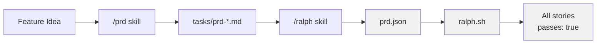

1. **Planning**: Use `/prd` skill to generate detailed PRD markdown
2. **Conversion**: Use `/ralph` skill to convert markdown → `prd.json`
3. **Execution**: Run `ralph.sh` to autonomously implement stories
4. **Completion**: System stops when all stories have `passes: true`

Sources: [README.md:88-131]()

---

## System Architecture

The following diagram maps Ralph's components to their actual file locations and command interfaces:

**Component Map**

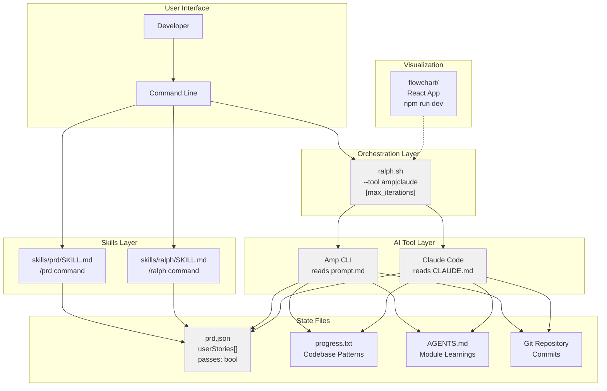

Sources: [README.md:132-145](), [AGENTS.md:23-30]()

---

## The Iteration Loop

Ralph's core mechanism is a bash loop that spawns fresh AI instances. Each iteration follows this state machine:

**ralph.sh Iteration State Machine**

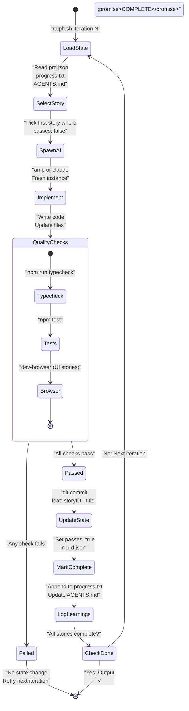

**Critical Behaviors:**

- **Fresh Context**: Each AI spawn via `amp` or `claude` command has no memory of previous iterations [README.md:163-169]()
- **Failure Handling**: Failed quality checks result in no state changes; same story retries next iteration [README.md:122-130]()
- **Atomic Updates**: Git commit, `prd.json` update, and `progress.txt` append happen together [README.md:125-130]()

Sources: [README.md:122-131](), [AGENTS.md:44-47]()

---

## File-Based State Persistence

Since each AI instance is stateless, all continuity between iterations exists in four files:

**Persistence Layer**

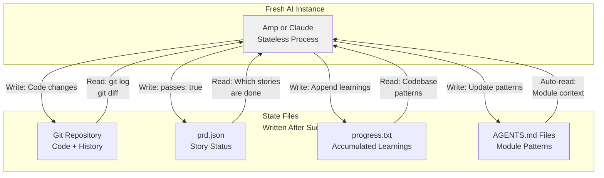

**File Purposes:**

| File | Updates When | Read By | Purpose |
|------|-------------|---------|---------|
| `prd.json` | Story completes | `ralph.sh`, AI tools | Track which stories are done (`passes: true/false`) |
| `progress.txt` | Story completes | AI tools | Accumulate codebase patterns and learnings |
| `AGENTS.md` | Story completes | AI tools (auto) | Module-specific patterns and conventions |
| Git history | Story completes | AI tools | View implemented code and changes |

Sources: [README.md:163-169](), [README.md:185-193]()

---

## Key Features

### Fresh Context Architecture

Each iteration spawns a brand new AI process. No conversation history, no accumulated context. This prevents context window bloat and ensures consistent behavior. See [Fresh Context Architecture](#2.3) for details.

### PRD-Driven Development

The `prd.json` file contains structured user stories with acceptance criteria. Ralph picks the highest priority story where `passes: false` each iteration. See [PRD-Driven Development](#2.4) for the format specification.

### Quality Gates

Every iteration must pass:
- **Typecheck**: Type safety validation
- **Tests**: Behavioral verification  
- **Browser Verification**: UI confirmation (for frontend stories using `dev-browser` skill)

Failed checks prevent commits and state updates. See [Quality Gates](#7.1).

### Learning Accumulation

Three mechanisms capture knowledge across iterations:
- `progress.txt`: Global codebase patterns
- `AGENTS.md` files: Module-specific conventions (auto-read by AI tools)
- Git commits: Implementation history

See [Memory Persistence](#2.2).

### Tool Agnostic

Ralph supports multiple AI coding tools through a unified interface:
- **Amp CLI**: Default tool, configured via `prompt.md`
- **Claude Code**: Alternative tool, configured via `CLAUDE.md`

Switch via `--tool` flag: `./ralph.sh --tool claude`. See [Tool Selection & Configuration](#5.1).

Sources: [README.md:161-208](), [AGENTS.md:44-47]()

---

## Quick Start

**Prerequisites:**
- Amp CLI or Claude Code installed and authenticated
- `jq` installed (`brew install jq`)
- Git repository initialized

**Basic Usage:**

```bash
# 1. Generate PRD using /prd skill
# (In Amp or Claude Code)
Load the prd skill and create a PRD for [feature description]

# 2. Convert to JSON using /ralph skill
Load the ralph skill and convert tasks/prd-[name].md to prd.json

# 3. Run Ralph
./scripts/ralph/ralph.sh 10  # 10 iterations max

# With Claude Code instead of Amp
./scripts/ralph/ralph.sh --tool claude 10
```

For complete setup instructions including skill installation options (local, global, or marketplace), see [Installation & Setup](#3.1). For a detailed walkthrough of the PRD creation process, see [End-to-End Workflow](#6.4).

Sources: [README.md:11-131]()

---

## Visualization

Ralph includes an interactive flowchart built with React Flow that visualizes the iteration loop with step-by-step animations:

**Access Options:**
- **Live Demo**: [https://snarktank.github.io/ralph/](https://snarktank.github.io/ralph/)
- **Local Development**: `cd flowchart && npm run dev`

The flowchart is a separate documentation/presentation tool and does not affect Ralph's execution. See [Flowchart Visualization](#8) for technical details on the React implementation.

Sources: [README.md:147-159](), [AGENTS.md:31-40]()

---

## Documentation Structure

This wiki is organized into the following sections:

| Section | Purpose |
|---------|---------|
| **[Core Concepts](#2)** | Fundamental architectural patterns (iteration loop, memory, fresh context, PRD format) |
| **[Getting Started](#3)** | Installation, PRD creation, first Ralph run |
| **[Core Components](#4)** | Detailed documentation of `ralph.sh`, `prd.json`, `progress.txt`, `AGENTS.md` |
| **[AI Tool Integration](#5)** | Tool selection, `prompt.md`, `CLAUDE.md` configuration |
| **[Skills System](#6)** | `/prd` and `/ralph` skills, installation, workflows |
| **[Quality & Verification](#7)** | Quality gates, story sizing, browser verification |
| **[Flowchart Visualization](#8)** | Interactive diagram architecture and deployment |
| **[Advanced Topics](#9)** | Auto-handoff, archiving, plugin system, troubleshooting |
| **[Reference](#10)** | File formats, command reference, configuration options |

---

## When to Use Ralph

**Ralph is designed for:**
- Autonomous implementation of well-defined features from PRDs
- Iterative development where each story can complete in one context window
- Projects with robust type checking and test suites
- Teams wanting to accumulate codebase knowledge in `AGENTS.md` files

**Ralph is NOT designed for:**
- Exploratory programming or prototyping (requires defined PRD)
- Large refactors that can't be broken into small stories
- Projects without automated quality checks
- Real-time interactive development (use Amp/Claude directly instead)

Sources: [README.md:161-208]()

---

## System Requirements

**Required Tools:**

| Tool | Purpose | Installation |
|------|---------|--------------|
| Amp CLI or Claude Code | AI coding implementation | [Amp](https://ampcode.com), `npm install -g @anthropic-ai/claude-code` |
| `jq` | JSON parsing in `ralph.sh` | `brew install jq` |
| Git | Version control and state persistence | [Git](https://git-scm.com/) |
| Node.js | Flowchart development (optional) | [Node.js](https://nodejs.org/) |

**Optional Configuration:**

- `~/.config/amp/settings.json`: Enable `amp.experimental.autoHandoff` for large stories [README.md:76-86]()
- Skills installation: Local, global, or marketplace-based [README.md:38-75]()

Sources: [README.md:11-86]()

---

<<< SECTION: 2 Core Concepts [2-core-concepts] >>>

# Core Concepts

<details>
<summary>Relevant source files</summary>

The following files were used as context for generating this wiki page:

- [README.md](README.md)

</details>


## Purpose and Scope

This section introduces the fundamental design principles that define Ralph's architecture and operation. These concepts explain how Ralph achieves autonomous code generation through stateless iterations, persistent state files, and structured task execution.

For detailed implementation of the orchestration loop, see [The Autonomous Agent Loop](#2.1). For specifics on state management files, see [Memory Persistence](#2.2). For the rationale behind stateless design, see [Fresh Context Architecture](#2.3). For PRD structure and workflow, see [PRD-Driven Development](#2.4).

---

## Overview of Core Concepts

Ralph's architecture is built on four foundational concepts that work together to enable autonomous, iterative code generation:

| Concept | Description | Key Files |
|---------|-------------|-----------|
| **Autonomous Agent Loop** | Iterative cycle that selects, implements, validates, and commits user stories until completion | `ralph.sh` |
| **Memory Persistence** | State management through files rather than AI instance memory | `prd.json`, `progress.txt`, `AGENTS.md`, git history |
| **Fresh Context Architecture** | Each iteration spawns a new AI instance with zero internal memory | `ralph.sh`, `prompt.md`, `CLAUDE.md` |
| **PRD-Driven Development** | Structured task lists drive autonomous execution with clear acceptance criteria | `prd.json`, skills in `skills/prd/`, `skills/ralph/` |

These concepts are interdependent: the autonomous loop requires persistent state because of fresh context, and PRD-driven development provides the structure that makes the loop deterministic.

**Sources:** [README.md:1-240]()

---

## System Architecture

The following diagram shows how Ralph's core files interact to maintain state and orchestrate iterations:

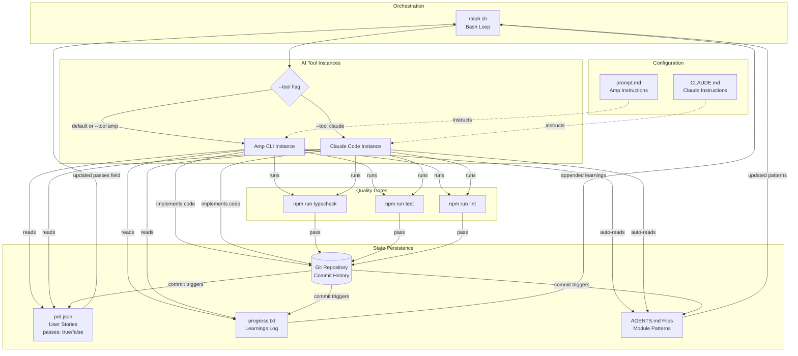

**Diagram: Ralph System Architecture**

This architecture achieves autonomous operation through file-based state management. The `ralph.sh` script spawns fresh AI instances that read state files, implement code, pass quality gates, and update state files. The cycle repeats until all stories in `prd.json` have `passes: true`.

**Sources:** [README.md:5-6](), [README.md:122-131](), [README.md:134-145]()

---

## Iteration Data Flow

The following diagram shows how data flows through a single Ralph iteration:

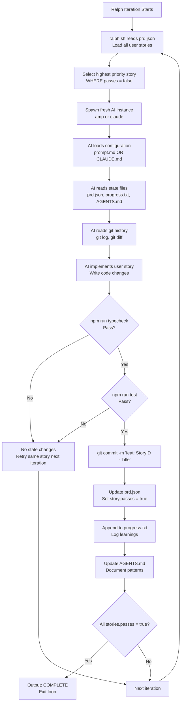

**Diagram: Single Iteration Data Flow**

Each iteration follows this strict sequence. Failed quality checks result in no state updates, forcing Ralph to retry the same story in the next iteration. Only successful implementations update `prd.json`, commit to git, and log learnings.

**Sources:** [README.md:122-131](), [README.md:163-169](), [README.md:194-199]()

---

## The Four Core Concepts

### 1. Autonomous Agent Loop

Ralph's operation is a bash loop in [ralph.sh:1-end]() that repeatedly spawns AI tool instances until all tasks are complete. Each iteration:

1. Reads `prd.json` to find the next incomplete story (where `passes: false`)
2. Spawns a fresh AI instance (Amp or Claude Code) with that story
3. The AI implements the story and runs quality checks
4. If checks pass: commits code, updates `prd.json` to mark `passes: true`, logs learnings
5. If checks fail: no state changes, same story retried next iteration

The loop exits when all stories have `passes: true` or when the maximum iteration count is reached. The exit condition is signaled by outputting `<promise>COMPLETE</promise>`.

For detailed loop mechanics, iteration selection logic, and exit conditions, see [The Autonomous Agent Loop](#2.1).

**Sources:** [README.md:122-131](), [README.md:205-207]()

---

### 2. Memory Persistence

Since each AI instance is stateless (see Fresh Context Architecture below), all continuity between iterations is achieved through four external persistence mechanisms:

| File | Content | Updated When | Read When |
|------|---------|--------------|-----------|
| `prd.json` | User stories with `passes` boolean field | After successful commit | Start of each iteration |
| `progress.txt` | Append-only learnings log | After successful commit | Start of each iteration |
| `AGENTS.md` | Module-specific patterns and gotchas | After successful commit | Auto-read by AI tools |
| Git history | Committed code changes | After successful commit | Start of each iteration |

The `passes` field in `prd.json` is critical: it determines which story Ralph selects next and when the loop terminates. The `progress.txt` file accumulates learnings in an append-only format, creating a knowledge base for future iterations. `AGENTS.md` files are auto-read by AI tools, making them self-documenting.

For file formats, update patterns, and best practices, see [Memory Persistence](#2.2).

**Sources:** [README.md:163-169](), [README.md:185-193](), [README.md:139-145]()

---

### 3. Fresh Context Architecture

Ralph spawns a **new AI instance** for every iteration. This design decision has profound implications:

- **No internal memory**: The AI doesn't remember previous conversations or iterations
- **Clean context window**: Each iteration starts with maximum available context
- **Deterministic behavior**: Same state files always produce same AI behavior
- **Explicit state management**: All continuity must be encoded in files

The `ralph.sh` script spawns either `amp` or `claude` as a subprocess, which runs, completes the task, and exits. The next iteration spawns a completely new process.

This trades computational efficiency (spawning processes) for predictability and context management. Large stories that exceed one context window rely on the `autoHandoff` feature [README.md:76-86]() rather than maintaining long-running conversations.

For rationale, trade-offs, and implications, see [Fresh Context Architecture](#2.3).

**Sources:** [README.md:163-169](), [README.md:5-6]()

---

### 4. PRD-Driven Development

Ralph executes tasks defined in `prd.json`, a structured JSON format containing user stories. Each story has:

```json
{
  "id": "US-001",
  "title": "Story title",
  "description": "What to implement",
  "acceptanceCriteria": ["Criterion 1", "Criterion 2"],
  "priority": 1,
  "passes": false
}
```

The workflow for creating `prd.json` is:

1. **Generate PRD**: Use the `/prd` skill to create a markdown PRD in `tasks/prd-[feature].md`
2. **Convert to JSON**: Use the `/ralph` skill to convert the markdown PRD to `prd.json`
3. **Execute**: Run `ralph.sh` to autonomously implement all stories

The PRD format enforces small, well-scoped stories [README.md:170-184](). Stories should be completable in one context window. The `priority` field determines execution order. The `passes` field tracks completion.

For PRD structure, conversion rules, and workflow details, see [PRD-Driven Development](#2.4).

**Sources:** [README.md:88-108](), [README.md:139](), [README.md:170-184]()

---

## Quality Enforcement

Ralph maintains code quality through mandatory checks that gate each iteration:

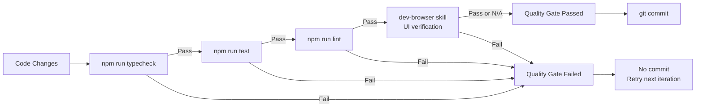

**Diagram: Quality Gate Sequence**

The quality checks run in sequence. Any failure prevents the commit and leaves state unchanged. This "keep CI green" philosophy [README.md:194-199]() prevents error accumulation across iterations.

Frontend stories must include browser verification in acceptance criteria [README.md:201-203](). The `dev-browser` skill navigates to the page and verifies UI changes.

**Sources:** [README.md:122-131](), [README.md:194-203]()

---

## File-Based Coordination

The following table maps each core concept to its implementing files:

| Concept | Primary Files | Purpose |
|---------|--------------|---------|
| Autonomous Loop | `ralph.sh` | Bash script that orchestrates iterations |
| Task List | `prd.json` | Structured stories with `passes` status tracking |
| Learnings | `progress.txt` | Append-only log of patterns and gotchas |
| Patterns | `AGENTS.md` | Auto-read documentation for AI tools |
| Code History | `.git/` directory | Committed implementations from previous iterations |
| Configuration | `prompt.md`, `CLAUDE.md` | Tool-specific instructions for AI instances |
| Skills | `skills/prd/`, `skills/ralph/` | PRD generation and conversion workflows |

All coordination happens through these files. Ralph has no database, no API, and no inter-process communication beyond file I/O and process spawning.

**Sources:** [README.md:134-145](), [README.md:163-169]()

---

## Interaction with Other Systems

Ralph integrates with:

- **AI Tools**: Amp CLI or Claude Code execute individual stories ([Tool Selection & Configuration](#5.1))
- **Skills System**: `/prd` and `/ralph` skills prepare task lists ([Skills Overview](#6.1))
- **Quality Systems**: Typecheck, test, and lint commands provide feedback ([Quality Gates](#7.1))
- **Git**: Version control stores code history and enables branch management ([Archiving & Branch Management](#9.2))
- **Flowchart App**: Visualization tool for understanding Ralph's operation ([Overview](#8.1))

Each integration point uses file-based interfaces or standard CLI commands, maintaining loose coupling.

**Sources:** [README.md:11-17](), [README.md:38-75](), [README.md:147-159]()

---

## Design Philosophy

Ralph's architecture embodies these principles:

1. **Stateless execution over stateful conversations**: Fresh instances avoid context window bloat
2. **Files over memory**: Explicit state management through version-controlled files
3. **Quality gates over iteration count**: One perfect iteration beats many flawed attempts
4. **Small tasks over large projects**: Context window limitations require right-sized stories
5. **Accumulated knowledge over ephemeral context**: `AGENTS.md` and `progress.txt` build institutional knowledge

These principles appear throughout Ralph's implementation and inform design decisions in all components.

**Sources:** [README.md:161-207]()

---

<<< SECTION: 2.1 The Autonomous Agent Loop [2-1-the-autonomous-agent-loop] >>>

# The Autonomous Agent Loop

<details>
<summary>Relevant source files</summary>

The following files were used as context for generating this wiki page:

- [CLAUDE.md](CLAUDE.md)
- [README.md](README.md)
- [prompt.md](prompt.md)
- [ralph.sh](ralph.sh)

</details>


## Purpose and Scope

This document provides a technical deep dive into Ralph's core execution mechanism: the autonomous agent loop. It explains how [ralph.sh:1-114]() orchestrates fresh AI tool instances (Amp or Claude Code) iteratively, how state persists between ephemeral agents, and what happens during each iteration cycle.

For information about the memory persistence mechanisms themselves, see [Memory Persistence](#2.2). For the PRD structure that drives the loop, see [PRD-Driven Development](#2.3). For the architectural rationale behind fresh contexts, see [Fresh Context Architecture](#2.4).

---

## Overview

Ralph's execution model is a **stateless iteration pattern**: the `ralph.sh` script spawns fresh AI tool instances in a loop, each reading persistent state, performing work, updating state, and terminating. The orchestrator continues this cycle until all tasks complete or `MAX_ITERATIONS` is reached.

**Key characteristics:**
- Each iteration = fresh process (`amp` CLI or `claude` CLI) with empty context window
- Multi-tool support: Amp (default) or Claude Code via `--tool` flag [ralph.sh:8,32-35]()
- State persists through four channels: Git commits, `prd.json`, `progress.txt`, `AGENTS.md` files
- One story implemented per iteration
- Quality gates (`typecheck`, tests) prevent broken commits
- Completion signaled via `<promise>COMPLETE</promise>` string in output [ralph.sh:99]()

Sources: [README.md:5-6,122-131,207](), [ralph.sh:1-114]()

## The Loop Structure

### Bash Script Control Flow

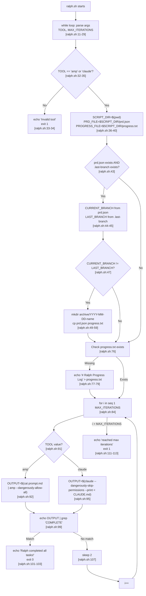

**Diagram: `ralph.sh` control flow from argument parsing to loop termination**

The loop is a bash `for` loop [ralph.sh:84]() that invokes either `amp` or `claude` CLI tools based on the `TOOL` variable [ralph.sh:91-96](). Each invocation receives instructions via stdin and captures stdout to `OUTPUT`.

Sources: [ralph.sh:1-114]()

### Key Script Variables and Paths

| Variable | Line | Type | Purpose |
|----------|------|------|---------|
| `TOOL` | [ralph.sh:8]() | string | Selected AI tool: `"amp"` (default) or `"claude"` |
| `MAX_ITERATIONS` | [ralph.sh:9]() | integer | Loop limit (default: 10) |
| `SCRIPT_DIR` | [ralph.sh:36]() | path | Directory containing `ralph.sh` |
| `PRD_FILE` | [ralph.sh:37]() | path | `$SCRIPT_DIR/prd.json` |
| `PROGRESS_FILE` | [ralph.sh:38]() | path | `$SCRIPT_DIR/progress.txt` |
| `ARCHIVE_DIR` | [ralph.sh:39]() | path | `$SCRIPT_DIR/archive` |
| `LAST_BRANCH_FILE` | [ralph.sh:40]() | path | `$SCRIPT_DIR/.last-branch` |

Sources: [ralph.sh:8-40]()

### Tool Selection and Validation

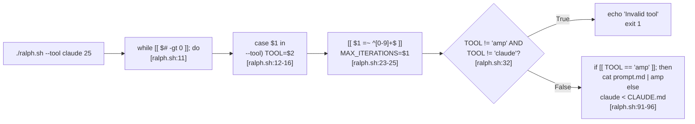

**Diagram: Argument parsing and tool validation in `ralph.sh`**

The `--tool` flag accepts two values: `amp` or `claude`. Invalid values cause immediate script termination [ralph.sh:32-35](). The selected tool determines which instruction file (`prompt.md` or `CLAUDE.md`) and which CLI binary is invoked in the loop.

Sources: [ralph.sh:8-35,91-96]()


---

## Single Iteration Execution

### AI Tool Invocation

Each iteration spawns a fresh CLI process with instructions piped to stdin:

**Amp invocation** [ralph.sh:92]():
```bash
OUTPUT=$(cat "$SCRIPT_DIR/prompt.md" | amp --dangerously-allow-all 2>&1 | tee /dev/stderr)
```

**Claude Code invocation** [ralph.sh:95]():
```bash
OUTPUT=$(claude --dangerously-skip-permissions --print < "$SCRIPT_DIR/CLAUDE.md" 2>&1 | tee /dev/stderr)
```

**Invocation breakdown:**

| Tool | CLI Binary | Instruction File | Flags | Output |
|------|-----------|------------------|-------|--------|
| Amp | `amp` | `prompt.md` (via pipe) | `--dangerously-allow-all` | stdout + stderr captured to `OUTPUT` |
| Claude | `claude` | `CLAUDE.md` (via redirect) | `--dangerously-skip-permissions`<br/>`--print` | stdout + stderr captured to `OUTPUT` |

The instruction files contain identical task structures:
1. Read `prd.json` [prompt.md:7]() / [CLAUDE.md:7]()
2. Read `progress.txt` [prompt.md:8]() / [CLAUDE.md:8]()
3. Check branch from `prd.json.branchName` [prompt.md:9]() / [CLAUDE.md:9]()
4. Pick story where `passes: false` [prompt.md:10]() / [CLAUDE.md:10]()
5. Run quality checks [prompt.md:12]() / [CLAUDE.md:12]()
6. Commit if checks pass [prompt.md:14]() / [CLAUDE.md:14]()
7. Update `prd.json` and `progress.txt` [prompt.md:15-16]() / [CLAUDE.md:15-16]()

Both tools auto-read `AGENTS.md` files without explicit instruction (native feature in both CLIs).

Sources: [ralph.sh:91-96](), [prompt.md:1-109](), [CLAUDE.md:1-105]()

### Single Iteration Sequence

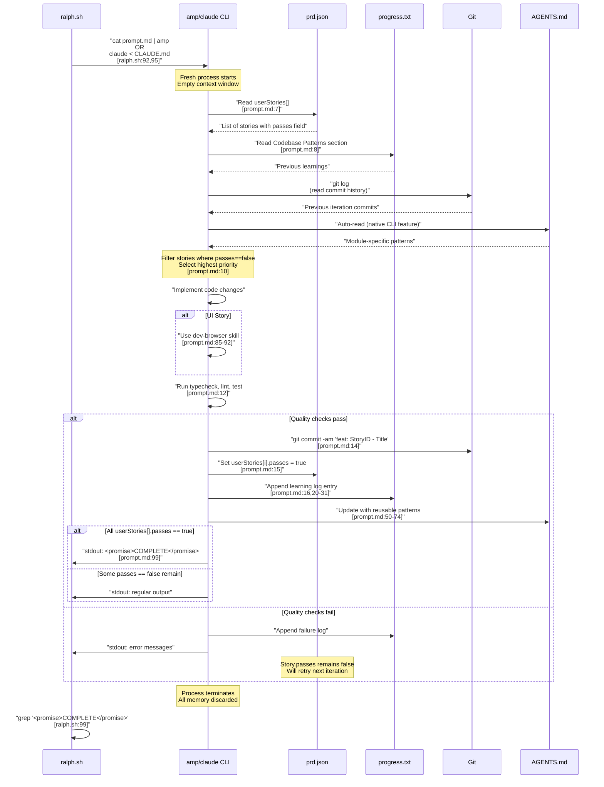

**Diagram: Sequence of operations in one iteration, showing file reads/writes and CLI interactions**

The AI tool reads state files at iteration start, performs work, then writes state updates only if quality checks pass. The `passes: false` field acts as a retry flag: failed stories remain false and are retried in subsequent iterations.

Sources: [prompt.md:1-109](), [CLAUDE.md:1-105](), [ralph.sh:91-99](), [README.md:122-131]()

---

## State Loading and Persistence

### State Loading Operations

Each fresh process reconstructs state by reading four persistent storage channels:

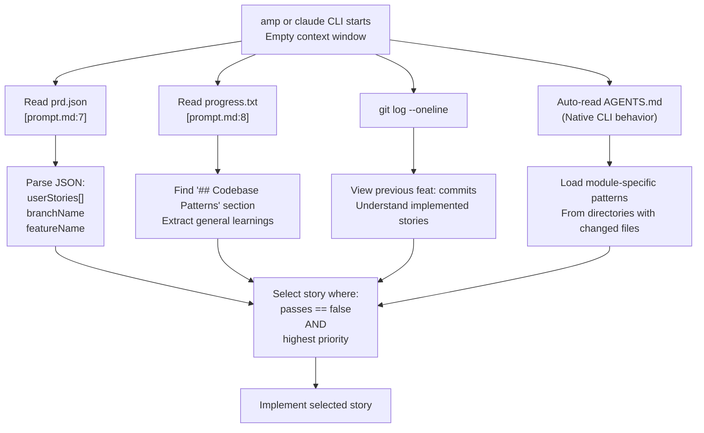

**Diagram: State reconstruction from persistent files at iteration start**

The `AGENTS.md` auto-read is a native feature of both `amp` and `claude` CLIs. The tools automatically discover and read `AGENTS.md` files in directories containing edited files, without requiring explicit instructions in `prompt.md` or `CLAUDE.md`.

Sources: [prompt.md:7-10](), [CLAUDE.md:7-10](), [README.md:162-170,185-193]()

### State Persistence Operations

After successful implementation (quality checks pass), the AI tool writes to all state channels:

| File | Operation | Content | Instruction Reference |
|------|-----------|---------|----------------------|
| Git | `git commit -am "feat: StoryID - Title"` | Code changes | [prompt.md:14]() |
| `prd.json` | Edit JSON field | Set `userStories[i].passes = true` | [prompt.md:15]() |
| `progress.txt` | Append | `## [Date] - [StoryID]`<br/>Learnings for future iterations | [prompt.md:16,20-31]() |
| `AGENTS.md` | Edit in-place | Reusable patterns discovered | [prompt.md:50-74]() |

**Atomicity guarantee:** All writes happen within the same iteration. If quality checks fail [prompt.md:12](), **no state files are modified**. The story's `passes` field remains `false`, causing Ralph to retry the same story in the next iteration.

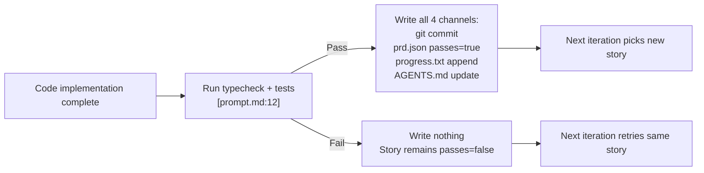

**Diagram: Quality gate determines whether state updates occur**

This "all-or-nothing" write pattern prevents cascading failures: a broken implementation doesn't pollute future iterations with incorrect state.

Sources: [prompt.md:12-16,76-81](), [CLAUDE.md:12-16,74-79]()

---

## Completion Detection

### Completion Detection

Ralph detects completion via a string constant in the AI tool's stdout:

```
<promise>COMPLETE</promise>
```

**Detection flow:**

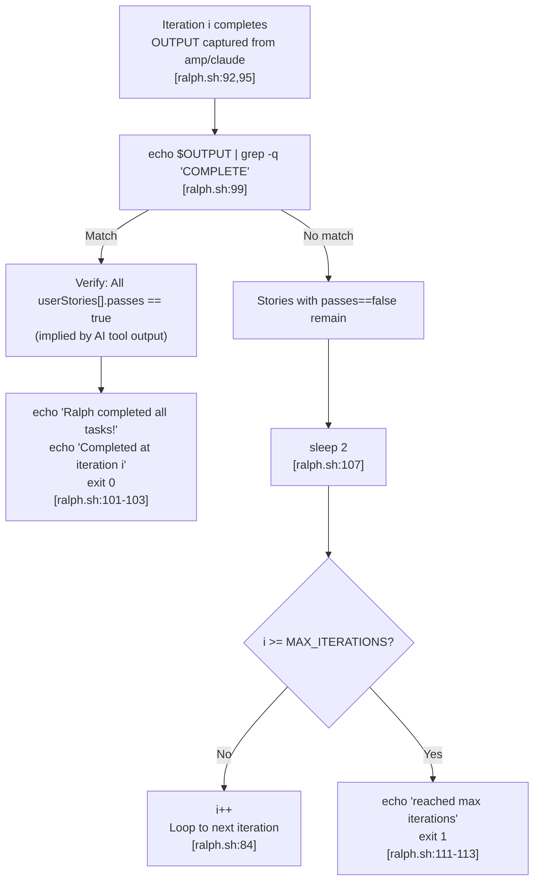

**Diagram: Completion signal detection and exit code logic**

The AI tool emits the `COMPLETE` signal after checking that all stories have `passes: true` [prompt.md:96-99](). The `grep` command [ralph.sh:99]() searches the captured output for this exact string to determine if the loop should terminate.

Sources: [ralph.sh:99-113](), [prompt.md:96-99](), [CLAUDE.md:94-97](), [README.md:207]()

---

## Archiving and Branch Tracking

### Archiving Mechanism

Ralph archives previous runs when `prd.json.branchName` changes:

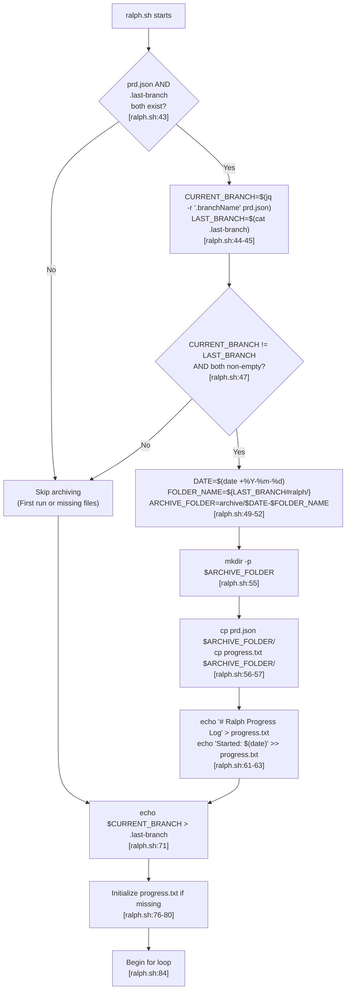

**Diagram: Branch change detection and archiving flow before loop starts**

Archive directory naming convention: `archive/YYYY-MM-DD-feature-name/` with the `ralph/` prefix stripped [ralph.sh:51](). The `.last-branch` file persists across runs to enable comparison.

Sources: [ralph.sh:43-80](), [README.md:232-233]()

---

## Error Handling and Retry Logic

### Quality Check Retry Pattern

Ralph implements implicit retry-on-failure through state immutability:

| Condition | Git | `prd.json` | `progress.txt` | Next Iteration |
|-----------|-----|-----------|----------------|----------------|
| Typecheck fails | No commit | `passes` stays `false` | Can log failure | Retry same story |
| Tests fail | No commit | `passes` stays `false` | Can log failure | Retry same story |
| Checks pass | Commit | Set `passes = true` | Append success | Pick next story |

**Retry logic:**

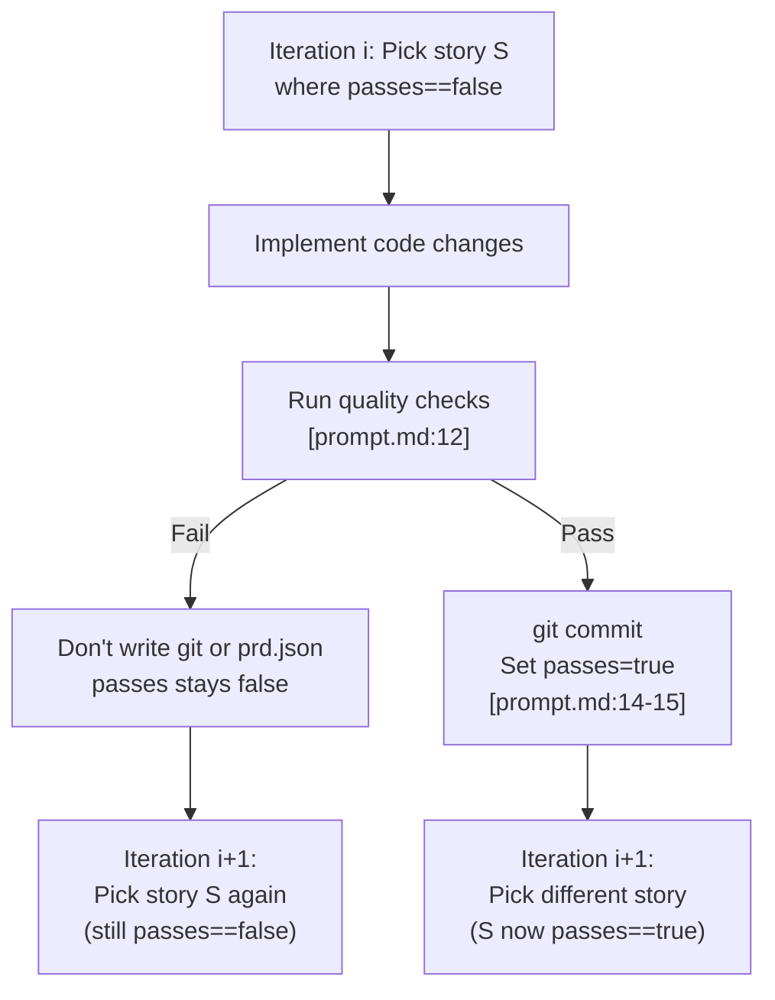

**Diagram: How `passes` field controls story selection in subsequent iterations**

This pattern prevents cascading failures: broken code doesn't get committed, so the codebase remains in the last known-good state. The next iteration starts from clean working tree.

Sources: [prompt.md:12,76-81](), [README.md:196-199]()

### Max Iterations Timeout

If all iterations complete without receiving the `COMPLETE` signal:

1. Script exits with code 1 [ralph.sh:113]()
2. Outputs message: "Ralph reached max iterations" [ralph.sh:111]()
3. `prd.json` contains current progress state
4. Human can inspect and either:
   - Increase `MAX_ITERATIONS` and re-run
   - Fix blocking issues manually
   - Break remaining stories into smaller tasks

Sources: [ralph.sh:110-113]()

---

## Configuration and Customization

### Command-Line Interface

```bash
./ralph.sh [--tool amp|claude] [max_iterations]
```

**Argument parsing:**

| Argument | Pattern | Parsed To | Line Reference |
|----------|---------|-----------|----------------|
| `--tool amp` | `--tool TOOL` | `TOOL="amp"` | [ralph.sh:13-15]() |
| `--tool=claude` | `--tool=TOOL` | `TOOL="claude"` | [ralph.sh:17-19]() |
| `25` | `^[0-9]+$` | `MAX_ITERATIONS=25` | [ralph.sh:23-25]() |

**Defaults:**
- `TOOL="amp"` [ralph.sh:8]()
- `MAX_ITERATIONS=10` [ralph.sh:9]()

**Usage examples:**
- `./ralph.sh` → Amp, 10 iterations
- `./ralph.sh 25` → Amp, 25 iterations
- `./ralph.sh --tool claude` → Claude, 10 iterations
- `./ralph.sh --tool=claude 50` → Claude, 50 iterations

Sources: [ralph.sh:8-29](), [README.md:112-120]()

### File System Layout

All paths are relative to `SCRIPT_DIR` [ralph.sh:36]():

| Variable | Value | File Type | Purpose |
|----------|-------|-----------|---------|
| `PRD_FILE` | `$SCRIPT_DIR/prd.json` | JSON | User stories with `passes` status |
| `PROGRESS_FILE` | `$SCRIPT_DIR/progress.txt` | Text | Append-only learning log |
| `LAST_BRANCH_FILE` | `$SCRIPT_DIR/.last-branch` | Text | Single-line branch name for archiving |
| `ARCHIVE_DIR` | `$SCRIPT_DIR/archive` | Directory | Previous run backups |
| (no variable) | `$SCRIPT_DIR/prompt.md` | Markdown | Amp instructions |
| (no variable) | `$SCRIPT_DIR/CLAUDE.md` | Markdown | Claude instructions |

**Example directory structure:**
```
scripts/ralph/
├── ralph.sh              # Main orchestrator
├── prompt.md             # Amp instructions
├── CLAUDE.md             # Claude instructions
├── prd.json              # Current PRD
├── progress.txt          # Current learning log
├── .last-branch          # "ralph/feature-x"
└── archive/
    ├── 2025-01-15-feature-x/
    │   ├── prd.json
    │   └── progress.txt
    └── 2025-01-20-feature-y/
        ├── prd.json
        └── progress.txt
```

Sources: [ralph.sh:36-40](), [README.md:132-146]()

---

## Related Workflows

### Pre-Loop Requirements

Before starting the loop:

1. **PRD must exist**: `prd.json` must be present and valid (see [Creating Your First PRD](#3.2))
2. **Git repository**: Must be in a git repository for commit tracking
3. **AI tool**: Either Amp CLI or Claude Code must be installed and authenticated (see [Installation & Setup](#3.1))
4. **Dependencies**: Project dependencies installed (`jq` for JSON parsing)
5. **Prompt template**: Appropriate prompt file (`prompt.md` for Amp or `CLAUDE.md` for Claude) must exist

### Post-Loop Actions

After loop completes:

1. Review commits: `git log --oneline`
2. Verify all stories: `cat prd.json | jq '.userStories[] | {id, title, passes}'`
3. Check learnings: `cat progress.txt`
4. Test the completed feature manually
5. Create pull request from feature branch

Sources: [README.md:11-17](), [README.md:186-199]()

---

## Performance Characteristics

### Iteration Timing

- **Spawn overhead**: ~1-2 seconds per Amp initialization
- **Execution time**: Depends on story complexity (typically 2-10 minutes)
- **Sleep between iterations**: 2 seconds [ralph.sh:74]()
- **Total runtime**: Highly variable based on:
  - Number of stories
  - Story complexity
  - Quality check duration
  - Retry frequency

### Scaling Limits

| Constraint | Limit | Workaround |
|------------|-------|------------|
| Max iterations | Default: 10 | Pass higher value as argument |
| Context window | Single Amp session | Break stories smaller (see [Story Sizing Guidelines](#6.3)) |
| Git history size | Unbounded | Archive mechanism prevents `progress.txt` bloat |

Sources: [ralph.sh:7](), [ralph.sh:74](), [README.md:128-142]()

---

<<< SECTION: 2.2 Memory Persistence [2-2-memory-persistence] >>>

# Memory Persistence

<details>
<summary>Relevant source files</summary>

The following files were used as context for generating this wiki page:

- [AGENTS.md](AGENTS.md)
- [README.md](README.md)
- [ralph.sh](ralph.sh)

</details>


**Purpose and Scope**: This page explains how Ralph maintains state and continuity across iterations despite each iteration using a completely fresh AI context with no memory of previous interactions. It covers the four persistence mechanisms (Git history, `progress.txt`, `prd.json`, and AGENTS.md files) and the archiving system that preserves historical runs. For information about the iteration lifecycle itself, see [The Autonomous Agent Loop](#2.1). For details on the fresh context architecture philosophy, see [Fresh Context Architecture](#2.4).

## The Ephemeral Context Problem

Each Ralph iteration spawns a completely new AI instance (Amp or Claude Code) with a clean context. The AI has no memory of previous iterations, previous conversations, or previous decisions. This is a fundamental design constraint that forces all knowledge to be externalized into persistent storage.

**Why this matters**: Without persistent storage, each iteration would have to rediscover the entire codebase, relearn patterns, and potentially redo completed work. The persistence layer is what transforms a series of isolated AI invocations into a coherent autonomous development system.

Sources: [README.md:141-145](), [AGENTS.md:44-46]()

## Persistence Architecture Overview

Ralph uses four complementary persistence mechanisms that work together to maintain state:

### Persistence Layer Files

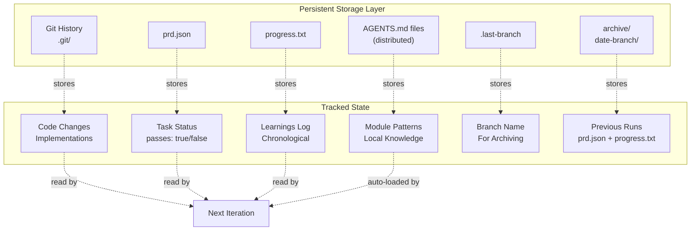

**Persistence Layer Files**

| File | Location | Purpose | Updated By | Read By |
|------|----------|---------|------------|---------|
| Git commits | `.git/` | Code changes and implementation history | AI tool (Amp/Claude) | AI tool via git log |
| `progress.txt` | Script directory | Chronological learnings log | AI tool appends | AI tool via `read_thread` |
| `prd.json` | Script directory | Task list with completion status | AI tool updates `passes` field | `ralph.sh` + AI tool |
| `AGENTS.md` | Various directories | Module-specific patterns and conventions | AI tool | AI tool (auto-loaded) |
| `.last-branch` | Script directory | Previous branch name for archiving | `ralph.sh` | `ralph.sh` |
| `archive/` | Script directory | Historical runs when branch changes | `ralph.sh` | Manual reference |

Sources: [ralph.sh:36-40](), [README.md:112-122]()

## Memory Persistence Mechanisms

### 1. Git History: Code Implementation Memory

Git commits serve as the primary record of what code has been written and what changes have been made. Each iteration reads the git history to understand the current state of the codebase.

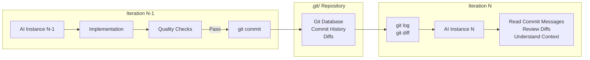

**What Git provides:**
- Complete history of all code changes
- Commit messages explaining what was done and why
- Diffs showing exactly what changed
- File history for understanding evolution of components

**How iterations use Git:**
- AI tools automatically read recent git history for context
- Commit messages from previous iterations explain implementation decisions
- Diffs show patterns of how similar changes were made

Sources: [README.md:143-145]()

### 2. progress.txt: The Learnings Log

`progress.txt` is an append-only chronological log where each iteration records what it learned, what it implemented, and any important context for future iterations. It has a special top section for codebase-wide patterns.

**File Structure:**

```
# Ralph Progress Log
Started: [timestamp]
---

## Codebase Patterns

[General reusable patterns discovered across the codebase]
[Always read this section first]

---

## [Date/Time] - Thread: [URL]
### What was implemented
[Description of work done]

### Learnings
[Specific learnings, gotchas, patterns discovered]

---

## [Date/Time] - Thread: [URL]
...
```

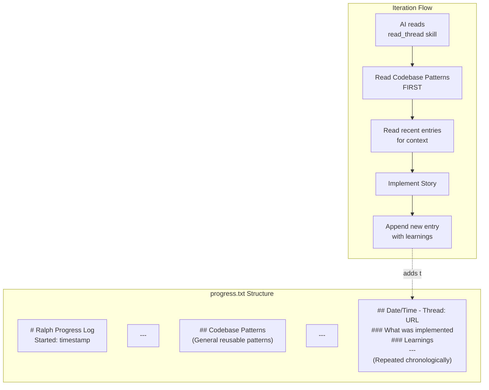

**What progress.txt provides:**
- **Codebase Patterns section**: General patterns that apply across the entire codebase (read first by every iteration)
- **Chronological entries**: Time-ordered log of what was done, thread URLs for reference, and specific learnings
- **Context continuity**: Future iterations can understand the journey and avoid repeating mistakes

**Initialization:**

The file is initialized by `ralph.sh` if it doesn't exist:

```bash
if [ ! -f "$PROGRESS_FILE" ]; then
  echo "# Ralph Progress Log" > "$PROGRESS_FILE"
  echo "Started: $(date)" >> "$PROGRESS_FILE"
  echo "---" >> "$PROGRESS_FILE"
fi
```

Sources: [ralph.sh:75-80](), [README.md:119](), [README.md:194-196]()

### 3. prd.json: Task Status Tracking

`prd.json` is the executable task list that tracks which user stories have been completed. It is the single source of truth for what work remains.

**Key Fields:**

```json
{
  "projectName": "string",
  "branchName": "string",
  "description": "string",
  "userStories": [
    {
      "id": "string",
      "title": "string",
      "description": "string",
      "acceptanceCriteria": ["string"],
      "technicalNotes": "string",
      "passes": false
    }
  ]
}
```

**The `passes` Field:**

The `passes` boolean is the critical state field. It tracks whether a story has been successfully implemented and passed all quality checks:

- `passes: false` - Story not yet complete (default)
- `passes: true` - Story implemented, quality checks passed, changes committed

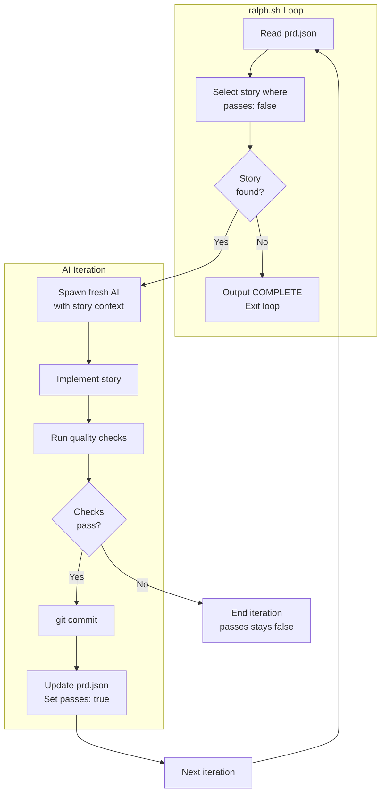

**What prd.json provides:**
- **Work queue**: Ordered list of stories to implement
- **Progress tracking**: Which stories are complete vs. remaining
- **Story context**: Description, acceptance criteria, technical notes for each task
- **Completion detection**: When all `passes: true`, Ralph outputs `<promise>COMPLETE</promise>`

Sources: [ralph.sh:37](), [README.md:117](), [README.md:102-108]()

### 4. AGENTS.md Files: Module-Specific Knowledge

`AGENTS.md` files are distributed throughout the codebase in various directories. They contain module-specific patterns, conventions, and gotchas that are automatically loaded by AI tools when working in that directory.

**Distribution Pattern:**

```
project/
├── AGENTS.md              # Project-level patterns
├── src/
│   ├── AGENTS.md         # Source code patterns
│   ├── components/
│   │   └── AGENTS.md     # Component patterns
│   ├── services/
│   │   └── AGENTS.md     # Service layer patterns
│   └── utils/
│       └── AGENTS.md     # Utility patterns
```

**What to include in AGENTS.md:**
- Module-specific patterns ("This module uses X pattern for Y")
- API conventions ("All service functions return Promise<Result<T>>")
- Dependencies ("This component depends on Z context")
- Gotchas ("Always update the cache when modifying this data")
- File locations ("Settings panel is in components/settings/SettingsPanel.tsx")

**Auto-loading Behavior:**

AI tools (both Amp and Claude Code) automatically read `AGENTS.md` files from the current directory and parent directories. This means:
- Knowledge is localized to where it's relevant
- Developers (and AI iterations) get context-appropriate guidance
- Patterns are documented close to the code they describe

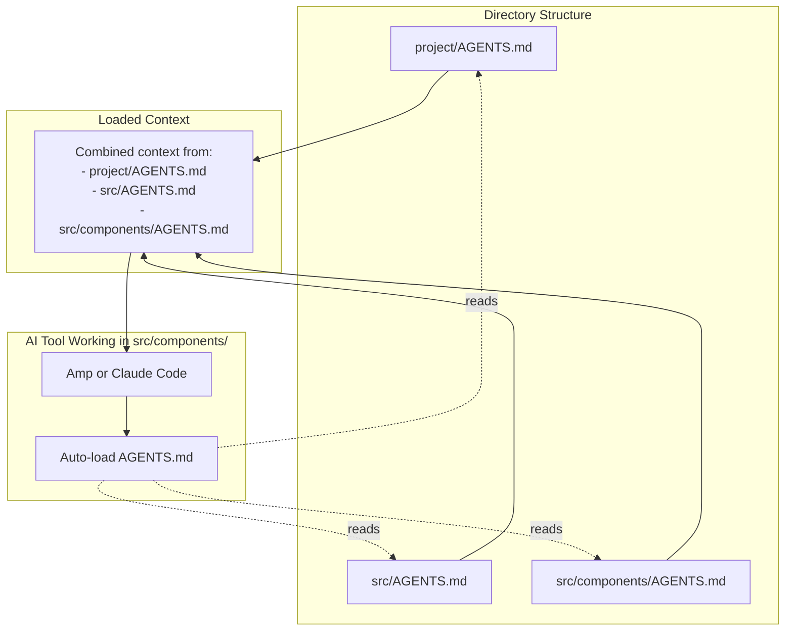

**Critical for continuity:**

Ralph explicitly instructs AI tools to update `AGENTS.md` after each iteration with discovered patterns. This creates a growing knowledge base that benefits all future iterations.

Sources: [README.md:120](), [README.md:162-169]()

## Data Flow Across Iterations

This diagram shows how data flows from one ephemeral AI instance to the next through persistent storage:

### Iteration-to-Iteration Data Flow

```mermaid
sequenceDiagram
    participant R as ralph.sh
    participant G as Git Repository
    participant Prog as progress.txt
    participant P as prd.json
    participant A as AGENTS.md
    participant AI1 as AI Instance N
    participant AI2 as AI Instance N+1
    
    Note over R: Iteration N starts
    R->>P: Read prd.json
    R->>P: Select story where passes=false
    R->>AI1: Spawn with prompt + story
    
    AI1->>G: Read git log for context
    AI1->>Prog: Read via read_thread skill
    AI1->>P: Read task details
    AI1->>A: Auto-load AGENTS.md files
    
    Note over AI1: Implement story
    
    AI1->>G: git commit (if checks pass)
    AI1->>P: Update passes: true
    AI1->>Prog: Append learnings
    AI1->>A: Update patterns
    
    Note over AI1: AI instance discarded
    destroy AI1
    
    Note over R: Iteration N+1 starts
    R->>P: Read prd.json (updated)
    R->>P: Select next story
    R->>AI2: Spawn fresh AI instance
    
    AI2->>G: Read git log (sees N's commits)
    AI2->>Prog: Read learnings from N
    AI2->>P: Read remaining tasks
    AI2->>A: Auto-load updated AGENTS.md
    
    Note over AI2: Has context from N<br/>via persistent storage
```

**Key Observations:**

1. **No direct communication**: AI Instance N and N+1 never communicate directly
2. **Complete context loss**: When AI Instance N is destroyed, all in-memory state is lost
3. **Persistent storage as bridge**: Git, progress.txt, prd.json, and AGENTS.md are the only bridges between iterations
4. **Automatic reconstitution**: AI Instance N+1 automatically reads all persistent sources and reconstructs context

Sources: [README.md:141-145](), [AGENTS.md:44-46]()

## Archiving System

Ralph automatically archives previous runs when the `branchName` in `prd.json` changes. This preserves historical state when switching between features.

### Archive Mechanism

```mermaid
graph TB
    subgraph "ralph.sh Startup"
        ReadPRD["Read prd.json<br/>branchName"]
        ReadLast["Read .last-branch"]
        Compare{branchName !=<br/>.last-branch?}
    end
    
    subgraph "Archiving Process"
        CreateFolder["Create archive folder<br/>archive/YYYY-MM-DD-branchname/"]
        CopyPRD["Copy prd.json"]
        CopyProgress["Copy progress.txt"]
        ResetProgress["Reset progress.txt<br/>for new run"]
        UpdateLast["Update .last-branch<br/>to new branch"]
    end
    
    subgraph "Archive Structure"
        ArchiveDir["archive/<br/>2024-01-15-feature-one/<br/>  prd.json<br/>  progress.txt<br/>2024-01-20-feature-two/<br/>  prd.json<br/>  progress.txt"]
    end
    
    ReadPRD --> Compare
    ReadLast --> Compare
    Compare -->|Yes, branch changed| CreateFolder
    Compare -->|No, same branch| Continue["Continue with<br/>existing progress"]
    
    CreateFolder --> CopyPRD
    CopyPRD --> CopyProgress
    CopyProgress --> ResetProgress
    ResetProgress --> UpdateLast
    UpdateLast --> ArchiveDir
```

**Archive Implementation:**

The archiving logic runs at the start of `ralph.sh`:

| Step | Code Location | Action |
|------|---------------|--------|
| Read current branch | [ralph.sh:44]() | `jq -r '.branchName'` from prd.json |
| Read last branch | [ralph.sh:45]() | `cat .last-branch` |
| Compare branches | [ralph.sh:47]() | Check if different |
| Create archive folder | [ralph.sh:52]() | `archive/YYYY-MM-DD-branchname/` |
| Copy files | [ralph.sh:56-57]() | Copy prd.json and progress.txt |
| Reset progress | [ralph.sh:61-63]() | Create fresh progress.txt |
| Update tracker | [ralph.sh:71]() | Write new branch to .last-branch |

**Why archiving matters:**

1. **Historical reference**: Can review how previous features were implemented
2. **Context separation**: Each feature's learnings don't pollute the next feature's progress.txt
3. **Debugging**: Can trace back to see what state existed when working on a previous feature
4. **Clean slate**: Each new feature starts with a fresh progress log

**Archive folder naming:**

The archive folder strips the `ralph/` prefix from branch names:
```bash
# Branch name: ralph/add-dashboard
# Archive folder: archive/2024-01-15-add-dashboard/
```

Sources: [ralph.sh:42-65](), [README.md:209-210]()

## File Location Reference

### Script Directory Files

All core persistence files are located relative to the directory containing `ralph.sh`:

```bash
SCRIPT_DIR="$(cd "$(dirname "${BASH_SOURCE[0]}")" && pwd)"
PRD_FILE="$SCRIPT_DIR/prd.json"
PROGRESS_FILE="$SCRIPT_DIR/progress.txt"
ARCHIVE_DIR="$SCRIPT_DIR/archive"
LAST_BRANCH_FILE="$SCRIPT_DIR/.last-branch"
```

**Typical structure:**

```
scripts/ralph/          # Or wherever ralph.sh is located
├── ralph.sh
├── prompt.md          # Amp prompt template
├── CLAUDE.md          # Claude prompt template
├── prd.json           # Current task list
├── progress.txt       # Current learnings log
├── .last-branch       # Previous branch name
└── archive/
    ├── 2024-01-15-feature-one/
    │   ├── prd.json
    │   └── progress.txt
    └── 2024-01-20-feature-two/
        ├── prd.json
        └── progress.txt
```

Sources: [ralph.sh:36-40]()

## Reading and Writing Patterns

### What Each Iteration Reads

| Source | When Read | How Read | What It Provides |
|--------|-----------|----------|------------------|
| `prd.json` | Start of iteration | Via `ralph.sh` and AI tool | Current task, acceptance criteria, technical notes |
| `progress.txt` | During implementation | Via `read_thread` skill or direct read | Codebase patterns, historical learnings |
| Git history | During implementation | Via `git log`, `git diff` | Code changes, commit messages, implementation patterns |
| `AGENTS.md` | Automatically | AI tool auto-load | Module-specific patterns and conventions |

### What Each Iteration Writes

| Destination | When Written | What's Written | Who Writes |
|-------------|--------------|----------------|------------|
| Git commits | After quality checks pass | Code changes, commit messages | AI tool (Amp/Claude) |
| `prd.json` | After successful commit | Updated `passes: true` for completed story | AI tool |
| `progress.txt` | After completion | New entry with learnings and thread URL | AI tool (appends) |
| `AGENTS.md` | After discovering patterns | New patterns, gotchas, conventions | AI tool |

Sources: [README.md:100-108](), [README.md:142-145]()

## Memory Persistence Best Practices

### For PRD Authors

1. **Size stories appropriately**: Each story should be completable in one iteration with one context window
2. **Include clear acceptance criteria**: AI needs explicit verification steps
3. **Add technical notes**: Guide the AI toward the right implementation approach

### For System Operation

1. **Monitor progress.txt**: Review learnings to ensure quality knowledge accumulation
2. **Check AGENTS.md updates**: Verify that patterns are being documented correctly
3. **Review git commits**: Ensure commit messages explain what and why
4. **Preserve archives**: Don't delete archive/ folder—it's valuable historical reference

### For Prompt Templates

The prompt templates (`prompt.md` for Amp, `CLAUDE.md` for Claude) must explicitly instruct the AI to:
- Read `progress.txt` via the `read_thread` skill
- Update `prd.json` with `passes: true` after success
- Append learnings to `progress.txt`
- Update relevant `AGENTS.md` files with patterns

Sources: [README.md:201-206](), [README.md:162-169]()

## Summary

Ralph's memory persistence system transforms ephemeral AI instances into a coherent autonomous development system through four complementary mechanisms:

1. **Git History**: Records all code changes and implementation decisions
2. **progress.txt**: Accumulates learnings and provides codebase-wide patterns
3. **prd.json**: Tracks task completion status and work queue
4. **AGENTS.md**: Documents module-specific patterns auto-loaded by AI tools

The archiving system preserves historical runs when switching features, and the `.last-branch` file enables automatic detection of feature switches.

Together, these mechanisms create a **self-documenting, self-improving system** where each iteration builds on the knowledge of previous iterations, despite having no direct memory of them.

---

<<< SECTION: 2.3 Fresh Context Architecture [2-3-fresh-context-architecture] >>>

# Fresh Context Architecture

<details>
<summary>Relevant source files</summary>

The following files were used as context for generating this wiki page:

- [AGENTS.md](AGENTS.md)
- [README.md](README.md)

</details>


## Purpose and Scope

This page explains Ralph's "fresh context" architecture - the fundamental design decision where each iteration spawns a completely new AI instance with no internal memory of previous iterations. This architecture shapes every aspect of how Ralph operates, from state management to story sizing to quality requirements.

For information about the persistence mechanisms that enable fresh context to work, see [Memory Persistence](#2.2). For information about the autonomous loop that spawns fresh instances, see [The Autonomous Agent Loop](#2.1).

---

## Core Concept

Ralph operates using **stateless iterations**. On each iteration, `ralph.sh` spawns a fresh AI coding tool instance (Amp CLI or Claude Code) with zero knowledge of previous iterations. The AI instance:

- Has no conversation history from prior runs
- Has no memory of code it previously wrote
- Has no context window carryover
- Starts with a completely clean slate

The only information available to each fresh instance comes from reading external files: git history, `prd.json`, `progress.txt`, and `AGENTS.md` files.

**Sources:** [README.md:163-169]()

---

## Architectural Overview

### Fresh Context Iteration Model

```mermaid
graph TB
    subgraph "Iteration N"
        RalphN["ralph.sh<br/>(iteration N)"]
        SpawnN["Spawn fresh<br/>AI instance"]
        AIN["AI Instance N<br/>(clean context)"]
        ReadN["Read state files"]
        WorkN["Implement story"]
        WriteN["Write results"]
        ExitN["Exit instance"]
    end
    
    subgraph "Persistent State Layer"
        Git["git history"]
        PRD["prd.json"]
        Progress["progress.txt"]
        Agents["AGENTS.md files"]
    end
    
    subgraph "Iteration N+1"
        RalphN1["ralph.sh<br/>(iteration N+1)"]
        SpawnN1["Spawn fresh<br/>AI instance"]
        AIN1["AI Instance N+1<br/>(clean context)"]
        ReadN1["Read state files"]
    end
    
    RalphN --> SpawnN
    SpawnN --> AIN
    AIN --> ReadN
    ReadN --> WorkN
    WorkN --> WriteN
    WriteN --> ExitN
    
    Git -.->|"reads"| ReadN
    PRD -.->|"reads"| ReadN
    Progress -.->|"reads"| ReadN
    Agents -.->|"reads"| ReadN
    
    WriteN -->|"writes"| Git
    WriteN -->|"updates"| PRD
    WriteN -->|"appends"| Progress
    WriteN -->|"updates"| Agents
    
    ExitN --> RalphN1
    RalphN1 --> SpawnN1
    SpawnN1 --> AIN1
    AIN1 --> ReadN1
    
    Git -.->|"reads"| ReadN1
    PRD -.->|"reads"| ReadN1
    Progress -.->|"reads"| ReadN1
    Agents -.->|"reads"| ReadN1
```

**Diagram: Fresh Context Iteration Cycle** - Each iteration spawns a fresh AI instance that reads persistent state, performs work, writes results, and exits completely.

**Sources:** [README.md:163-169](), [ralph.sh:1-100]()

---

## Mechanical Implementation

### How ralph.sh Spawns Fresh Instances

The `ralph.sh` script spawns fresh AI instances using shell commands on each iteration:

| Tool | Command Used | Configuration File |
|------|--------------|-------------------|
| Amp CLI | `amp` | `prompt.md` |
| Claude Code | `claude-code` | `CLAUDE.md` |

The spawn process follows this sequence:

1. `ralph.sh` selects a story from `prd.json` where `passes: false`
2. `ralph.sh` constructs the appropriate command based on `--tool` flag
3. The command spawns a fresh process with the instruction file loaded
4. The AI instance reads all state files from the file system
5. The AI instance implements the story
6. The AI instance writes results to the file system
7. The AI process exits completely
8. `ralph.sh` continues to the next iteration

**Sources:** [README.md:112-131](), [ralph.sh:1-50]()

### Process Isolation Guarantees

```mermaid
graph LR
    subgraph "Iteration 1"
        P1["Process 1<br/>PID: 1234<br/>Context: 0 tokens"]
    end
    
    subgraph "Iteration 2"
        P2["Process 2<br/>PID: 5678<br/>Context: 0 tokens"]
    end
    
    subgraph "Iteration 3"
        P3["Process 3<br/>PID: 9012<br/>Context: 0 tokens"]
    end
    
    P1 -->|"exits completely"| P2
    P2 -->|"exits completely"| P3
    
    FileSystem["File System<br/>(git, prd.json, progress.txt, AGENTS.md)"]
    
    P1 <-.->|"I/O only"| FileSystem
    P2 <-.->|"I/O only"| FileSystem
    P3 <-.->|"I/O only"| FileSystem
```

**Diagram: Process Isolation Model** - Each iteration runs in a separate OS process with zero shared memory between processes.

**Sources:** [README.md:5](), [README.md:163-169]()

---

## State Persistence Mechanisms

### The Four Persistence Layers

Fresh context architecture requires explicit state management through four file-based mechanisms:

| Persistence Layer | Read By Instance | Written By Instance | Purpose |
|-------------------|------------------|---------------------|---------|
| **Git History** | `git log`, `git diff` | `git commit` | Code changes, what's been implemented |
| **prd.json** | JSON parser | JSON writer | Story list, completion status (`passes: true/false`) |
| **progress.txt** | Plain text reader | Append-only writer | Learnings, patterns, context for future iterations |
| **AGENTS.md** | Auto-read by AI tools | AI tools update | Module-specific patterns and conventions |

**Sources:** [README.md:132-145](), [README.md:185-193]()

### State Read/Write Flow

```mermaid
sequenceDiagram
    participant ralph as ralph.sh
    participant spawn as Fresh AI Instance
    participant git as Git Repository
    participant prd as prd.json
    participant progress as progress.txt
    participant agents as AGENTS.md
    
    ralph->>spawn: Spawn fresh instance
    
    Note over spawn: Instance starts with<br/>zero internal memory
    
    spawn->>git: git log (read commits)
    spawn->>prd: Read story list
    spawn->>progress: Read learnings
    spawn->>agents: Auto-read patterns
    
    Note over spawn: Implement story<br/>with context from files
    
    spawn->>git: git commit (new code)
    spawn->>prd: Update passes: true
    spawn->>progress: Append learnings
    spawn->>agents: Update patterns
    
    spawn->>ralph: Exit process
    
    Note over ralph: Instance memory<br/>completely destroyed
```

**Diagram: State Read/Write Sequence** - Fresh instances read all context on startup and write all results on completion.

**Sources:** [README.md:122-130](), [prompt.md:1-50](), [CLAUDE.md:1-50]()

---

## Design Rationale

### Why Fresh Context?

The fresh context architecture trades **I/O overhead** for **predictability and reliability**:

#### Benefits

| Benefit | Explanation |
|---------|-------------|
| **No Context Window Bloat** | Each iteration starts at 0 tokens, preventing context exhaustion |
| **Predictable Behavior** | No accumulated confusion or incorrect assumptions from prior iterations |
| **Isolation of Failures** | Failed iterations don't poison future iterations with bad context |
| **Clear State Boundaries** | Explicit file-based state makes debugging straightforward |
| **Tool Agnostic** | Any AI tool that can read files and write code will work |
| **Parallelizable** | Future versions could run multiple stories in parallel safely |

#### Trade-offs

| Trade-off | Impact |
|-----------|--------|
| **Higher I/O** | Each iteration re-reads git history and state files |
| **Slower Startup** | Fresh instances must load tools and read context each time |
| **No Conversational Memory** | Can't reference "what we discussed earlier" |
| **Requires Small Stories** | Stories must fit in one context window (no multi-iteration stories) |

**Sources:** [README.md:163-184]()

---

## Implications and Constraints

### Story Sizing Requirements

Fresh context architecture imposes strict constraints on story size. Each story must be completable within a single context window because there's no memory carryover to continue work across iterations.

**Right-Sized Stories:**
- Add a database column and migration
- Add a UI component to an existing page  
- Update a server action with new logic
- Add a filter dropdown to a list

**Too Large (Must Split):**
- "Build the entire dashboard"
- "Add authentication"
- "Refactor the API"

**Sources:** [README.md:170-184]()

### Quality Gate Requirements

Because each iteration has no memory of failures, quality gates must be enforced strictly:

```mermaid
graph TD
    Implement["Fresh instance<br/>implements story"]
    TypeCheck{"Typecheck<br/>passes?"}
    Tests{"Tests<br/>pass?"}
    Commit["git commit +<br/>update prd.json"]
    NoCommit["No commit<br/>No state change"]
    
    Implement --> TypeCheck
    TypeCheck -->|"Yes"| Tests
    TypeCheck -->|"No"| NoCommit
    Tests -->|"Yes"| Commit
    Tests -->|"No"| NoCommit
    
    NoCommit -.->|"Next iteration<br/>retries same story"| Implement
    Commit -->|"Next iteration<br/>new story"| Implement
```

**Diagram: Quality Gate Enforcement** - Failed quality checks prevent state updates, forcing retry on next fresh iteration.

If quality checks fail, Ralph makes **no commits** and **no state updates**. The next fresh instance will attempt the same story again. This prevents broken code from accumulating across iterations.

**Sources:** [README.md:194-200](), [README.md:124-128]()

### AGENTS.md Critical Importance

Fresh context makes `AGENTS.md` files critical because they're the primary mechanism for AI tools to learn codebase patterns:

```mermaid
graph TB
    subgraph "Without AGENTS.md"
        Fresh1["Fresh Instance 1:<br/>Discovers pattern X"]
        Fresh2["Fresh Instance 2:<br/>Rediscovers pattern X"]
        Fresh3["Fresh Instance 3:<br/>Rediscovers pattern X"]
        
        Fresh1 -.->|"no memory"| Fresh2
        Fresh2 -.->|"no memory"| Fresh3
    end
    
    subgraph "With AGENTS.md"
        Fresh4["Fresh Instance 1:<br/>Discovers pattern X"]
        AGENTS["AGENTS.md:<br/>Pattern X documented"]
        Fresh5["Fresh Instance 2:<br/>Reads pattern X"]
        Fresh6["Fresh Instance 3:<br/>Reads pattern X"]
        
        Fresh4 -->|"writes"| AGENTS
        AGENTS -->|"auto-read"| Fresh5
        AGENTS -->|"auto-read"| Fresh6
    end
```

**Diagram: AGENTS.md Learning Persistence** - Without AGENTS.md updates, fresh instances would rediscover patterns repeatedly.

Both Amp and Claude Code automatically read `AGENTS.md` files in directories they work in, making them the ideal place to accumulate learnings across fresh instances.

**Sources:** [README.md:185-193](), [AGENTS.md:42-48]()

---

## Fresh Instance Lifecycle

### Single Iteration Breakdown

```mermaid
stateDiagram-v2
    [*] --> SpawnInstance: ralph.sh iteration N
    
    SpawnInstance --> ReadGitHistory: Fresh AI process starts
    ReadGitHistory --> ReadPRDJson: What code exists?
    ReadPRDJson --> ReadProgressTxt: Which story to implement?
    ReadProgressTxt --> ReadAGENTSmd: What patterns exist?
    ReadAGENTSmd --> ImplementStory: What conventions to follow?
    
    state ImplementStory {
        [*] --> WriteCode
        WriteCode --> RunTypecheck
        RunTypecheck --> RunTests
        RunTests --> BrowserVerify
        BrowserVerify --> [*]
    }
    
    ImplementStory --> QualityFailed: Any check fails
    ImplementStory --> QualityPassed: All checks pass
    
    QualityFailed --> ExitProcess: No file writes
    QualityPassed --> UpdateFiles: Write results
    
    state UpdateFiles {
        [*] --> GitCommit
        GitCommit --> UpdatePRDJson
        UpdatePRDJson --> AppendProgress
        AppendProgress --> UpdateAGENTS
        UpdateAGENTS --> [*]
    }
    
    UpdateFiles --> ExitProcess
    ExitProcess --> [*]: Process destroyed<br/>Memory cleared
    
    [*] --> SpawnInstance: ralph.sh iteration N+1
```

**Diagram: Complete Fresh Instance Lifecycle** - From spawn to exit, showing all read/write operations and decision points.

**Sources:** [README.md:122-130](), [README.md:163-169](), [prompt.md:1-100](), [CLAUDE.md:1-100]()

---

## Comparison to Alternative Architectures

### Stateful vs Stateless Iteration

| Aspect | Stateful (Not Ralph) | Stateless (Ralph) |
|--------|---------------------|-------------------|
| **Context Carryover** | Full conversation history maintained | Zero context carryover |
| **Memory Model** | In-process memory across iterations | File-based external memory |
| **Context Window** | Grows continuously until exhausted | Resets to 0 each iteration |
| **Failure Isolation** | Bad context affects future iterations | Each iteration independent |
| **Story Size** | Can span multiple iterations | Must complete in one iteration |
| **Debugging** | Complex (must trace conversation) | Simple (check file states) |
| **Tool Switching** | Difficult (conversation locked to tool) | Easy (tool reads same files) |

**Sources:** [README.md:163-169]()

---

## Key Takeaways

The fresh context architecture defines Ralph's operational model:

1. **Each iteration is an independent OS process** with no shared memory between iterations
2. **State persists only through files**: git history, `prd.json`, `progress.txt`, and `AGENTS.md`
3. **Stories must be small** - single context window limit is enforced by architecture
4. **Quality gates are strict** - failures result in zero state changes
5. **AGENTS.md updates are critical** - the primary learning mechanism across iterations
6. **Tool agnostic by design** - any AI tool that reads files and writes code can integrate

This architecture trades performance (higher I/O, slower startup) for reliability (predictable behavior, isolated failures, clear state).

**Sources:** [README.md:163-193](), [AGENTS.md:44-48]()

---

<<< SECTION: 2.4 PRD-Driven Development [2-4-prd-driven-development] >>>

# PRD-Driven Development

<details>
<summary>Relevant source files</summary>

The following files were used as context for generating this wiki page:

- [README.md](README.md)
- [skills/ralph/SKILL.md](skills/ralph/SKILL.md)

</details>


## Purpose and Scope

This document explains the conceptual model of how Ralph translates human feature requirements into autonomous execution through structured Product Requirements Documents (PRDs). It covers the transformation from natural language to machine-executable JSON format, the anatomy of user stories, and how Ralph's execution model interprets and processes these structures.

For practical tutorials on creating PRDs, see [Creating Your First PRD](#3.2) and [Converting PRD to JSON](#3.3). For complete skill documentation, see [PRD Generation Skill](#5.1) and [Ralph Conversion Skill](#5.2).

---

## The PRD as System Contract

Ralph treats the PRD as a **contract between human intent and autonomous execution**. Unlike traditional development where PRDs serve as reference documentation, Ralph's PRD becomes the executable specification that drives behavior.

The system enforces two critical properties:

| Property | Implementation | Why It Matters |
|----------|---------------|----------------|
| **Machine-Readable** | JSON format with strict schema | Enables programmatic status tracking and story selection |
| **Atomically Verifiable** | Each story has concrete acceptance criteria | Allows Ralph to determine completion without human judgment |

The PRD exists in two forms:

1. **Markdown PRD** (`tasks/prd-*.md`) - Human-readable requirements generated through Q&A
2. **Executable JSON** (`prd.json`) - Machine-readable task list with status tracking

**Sources:** [README.md:1-196](), [prd.json.example:1-65]()

---

## PRD Lifecycle: Natural Language to Execution

### Diagram: PRD Transformation Pipeline

```mermaid
graph LR
    subgraph "Human Space"
        Idea["Feature Idea<br/>(Natural Language)"]
        QA["Q&A Session<br/>prd skill"]
        Markdown["tasks/prd-feature.md"]
    end
    
    subgraph "Translation Layer"
        Ralph["skills/ralph/<br/>Conversion Logic"]
        Validation["Story Sizing<br/>Dependency Analysis<br/>Criteria Validation"]
    end
    
    subgraph "Machine Space"
        JSON["prd.json<br/>Executable Format"]
        Selection["Story Selection<br/>(passes: false)"]
        Execution["Amp Instance<br/>Implementation"]
        Update["Status Update<br/>(passes: true)"]
    end
    
    Idea --> QA
    QA --> Markdown
    Markdown --> Ralph
    Ralph --> Validation
    Validation --> JSON
    
    JSON --> Selection
    Selection --> Execution
    Execution --> Update
    Update -.-> Selection
```

**Sources:** [README.md:54-72](), [skills/ralph/SKILL.md:1-258]()

---

## The prd.json Format

### Structure Overview

The `prd.json` file contains project metadata and an ordered list of user stories:

```json
{
  "project": "string",
  "branchName": "ralph/feature-name",
  "description": "string",
  "userStories": [...]
}
```

### Field Specifications

| Field | Type | Purpose | Example |
|-------|------|---------|---------|
| `project` | string | Project identifier | `"MyApp"` |
| `branchName` | string | Git branch for feature | `"ralph/task-priority"` |
| `description` | string | Feature summary | `"Task Priority System - Add priority levels"` |
| `userStories` | array | Ordered list of executable stories | See below |

The `branchName` serves dual purposes:
- Determines which git branch Ralph creates and works on
- Used by [ralph.sh:1-100]() for archiving detection (different branch = new feature)

**Sources:** [prd.json.example:1-65](), [skills/ralph/SKILL.md:20-41]()

---

## User Story Anatomy

### Diagram: User Story Structure Mapping to Code

```mermaid
graph TB
    subgraph "prd.json Structure"
        Story["User Story Object"]
        ID["id: US-001"]
        Title["title: string"]
        Desc["description: string"]
        AC["acceptanceCriteria: array"]
        Priority["priority: number"]
        Passes["passes: boolean"]
        Notes["notes: string"]
    end
    
    subgraph "ralph.sh Usage"
        Read["jq '.userStories[]'"]
        Filter["jq 'select(.passes == false)'"]
        Sort["jq 'sort_by(.priority)'"]
        Pick["jq '.[0]'"]
    end
    
    subgraph "Amp Instance Behavior"
        ParseID["Read story.id"]
        ParseAC["Parse acceptanceCriteria"]
        Implement["Implement changes"]
        Verify["Check each criterion"]
        MarkPass["Update passes: true"]
    end
    
    Story --> ID
    Story --> Title
    Story --> Desc
    Story --> AC
    Story --> Priority
    Story --> Passes
    Story --> Notes
    
    Story --> Read
    Read --> Filter
    Filter --> Sort
    Sort --> Pick
    
    Pick --> ParseID
    Pick --> ParseAC
    ParseAC --> Implement
    Implement --> Verify
    Verify --> MarkPass
```

### Field Details

```json
{
  "id": "US-001",
  "title": "Add priority field to database",
  "description": "As a developer, I need to store task priority so it persists.",
  "acceptanceCriteria": [
    "Add priority column to tasks table: 'high' | 'medium' | 'low'",
    "Generate and run migration successfully",
    "Typecheck passes"
  ],
  "priority": 1,
  "passes": false,
  "notes": ""
}
```

| Field | Purpose | Ralph's Usage |
|-------|---------|---------------|
| `id` | Unique story identifier | Referenced in commits, progress.txt logs |
| `title` | Short description | Displayed in iteration logs |
| `description` | User story format | Provides context to Amp instance |
| `acceptanceCriteria` | Verifiable checkpoints | Amp must verify each before marking complete |
| `priority` | Execution order | Lower numbers execute first |
| `passes` | Completion status | `false` = needs work, `true` = complete |
| `notes` | Runtime annotations | Updated by Amp with learnings or blockers |

**Sources:** [prd.json.example:6-18](), [README.md:84-89]()

---

## Story Execution Model

### Selection Algorithm

Ralph uses a simple selection algorithm in [ralph.sh]():

```bash
# Pseudocode representation
story = jq '.userStories[] | select(.passes == false) | sort_by(.priority) | .[0]' prd.json
```

**Selection criteria:**
1. `passes` must be `false`
2. Sort by `priority` ascending
3. Take first match

### Status Lifecycle

```mermaid
stateDiagram-v2
    [*] --> Pending: Story created<br/>passes: false
    Pending --> InProgress: Amp instance<br/>picks story
    InProgress --> Verification: Implementation<br/>complete
    Verification --> Failed: Quality checks<br/>fail
    Verification --> Complete: All checks<br/>pass
    Failed --> Pending: Next iteration<br/>retries
    Complete --> [*]: passes: true<br/>Story done
    
    note right of Pending
        prd.json status
        passes: false
        notes: ""
    end note
    
    note right of Complete
        prd.json updated
        passes: true
        notes: "Completed in iteration N"
    end note
```

### Update Mechanism

When a story completes successfully:

1. Amp verifies all acceptance criteria
2. Updates `passes: false` → `passes: true`
3. Adds completion note to `notes` field
4. Commits prd.json changes to git
5. Next iteration picks next incomplete story

**Sources:** [README.md:82-90](), [skills/ralph/SKILL.md:68-79]()

---

## Story Sizing Constraints

### The One Context Window Rule

**Critical constraint:** Each story must be completable within a single Amp instance's context window.

Ralph spawns fresh Amp instances per iteration with no memory of previous work (see [Fresh Context Architecture](#2.4)). If a story exceeds context capacity, the LLM produces incomplete or broken code.

### Right-Sized Stories

| Category | Example | Why It Works |
|----------|---------|--------------|
| **Schema Change** | Add priority column to tasks table | Single file change, clear scope |
| **UI Component** | Add priority badge to task card | One component, isolated change |
| **Backend Logic** | Update server action to filter by priority | One function modification |
| **Simple Integration** | Add dropdown to existing form | Extends existing UI |

### Too Large (Must Split)

| Anti-Pattern | Problem | Split Strategy |
|--------------|---------|----------------|
| "Build dashboard" | Multiple queries, components, layouts | → Schema, queries, components, filters |
| "Add authentication" | Schema, middleware, UI, sessions | → Schema, middleware, login UI, session handling |
| "Refactor API" | Touches many endpoints | → One story per endpoint or pattern |

**Rule of thumb from [skills/ralph/SKILL.md:62]():** If you cannot describe the change in 2-3 sentences, it is too big.

**Sources:** [skills/ralph/SKILL.md:45-63](), [README.md:129-142]()

---

## Dependency Management

### Execution Order Principles

Stories execute in `priority` order. The priority numbering must respect dependencies:

```mermaid
graph TD
    Schema["Priority 1<br/>Schema/Database<br/>migrations, new tables"]
    Backend["Priority 2<br/>Backend Logic<br/>server actions, API"]
    UI["Priority 3<br/>UI Components<br/>forms, displays"]
    Integration["Priority 4<br/>Integration Features<br/>filters, dashboards"]
    
    Schema --> Backend
    Backend --> UI
    UI --> Integration
    
    note1["Must execute first<br/>Creates data layer"]
    note2["Depends on schema<br/>Business logic"]
    note3["Depends on backend<br/>User interface"]
    note4["Depends on UI<br/>Advanced features"]
    
    Schema -.-> note1
    Backend -.-> note2
    UI -.-> note3
    Integration -.-> note4
```

### Correct Ordering Example

From [prd.json.example:1-65]():

```
Priority 1: Add priority field to database
Priority 2: Display priority indicator on task cards
Priority 3: Add priority selector to task edit
Priority 4: Filter tasks by priority
```

### Incorrect Ordering (Anti-Pattern)

```
Priority 1: Display priority badge    ← ERROR: No priority field exists yet
Priority 2: Add priority to database  ← Should be first
```

**Why this breaks:** Story 1 tries to read a database column that doesn't exist. Amp instance fails, wastes iteration.

**Sources:** [skills/ralph/SKILL.md:67-79]()

---

## Acceptance Criteria Design

### Verifiability Requirement

Acceptance criteria must be **mechanically verifiable** by an AI agent. Vague criteria lead to unclear completion status.

### Good vs. Bad Criteria

| Good (Verifiable) | Bad (Vague) |
|-------------------|-------------|
| `Add status column to tasks table with default 'pending'` | `Works correctly` |
| `Filter dropdown has options: All, Active, Completed` | `Good UX` |
| `Clicking delete shows confirmation dialog` | `Handles edge cases` |
| `Typecheck passes` | `User can do X easily` |

### Mandatory Quality Gates

Every story **must** include:

```json
"acceptanceCriteria": [
  "... story-specific criteria ...",
  "Typecheck passes"
]
```

Stories with testable logic should also include:

```json
"acceptanceCriteria": [
  "... story-specific criteria ...",
  "Typecheck passes",
  "Tests pass"
]
```

### UI Verification Requirement

Stories that modify user interface **must** include:

```json
"acceptanceCriteria": [
  "... story-specific criteria ...",
  "Typecheck passes",
  "Verify in browser using dev-browser skill"
]
```

This triggers Ralph to use the `dev-browser` skill for visual confirmation (see [Browser Verification](#6.2)).

**Sources:** [skills/ralph/SKILL.md:84-115](), [README.md:159-161]()

---

## The Conversion Process

### Diagram: Markdown to JSON Transformation

```mermaid
graph TB
    subgraph "Input: tasks/prd-feature.md"
        MDTitle["# Feature Title"]
        MDReqs["## Requirements<br/>- Requirement 1<br/>- Requirement 2"]
        MDDetails["## Details<br/>Context paragraphs"]
    end
    
    subgraph "skills/ralph/ Processing"
        Parse["Parse markdown<br/>structure"]
        Split["Split into<br/>atomic stories"]
        Order["Analyze dependencies<br/>Assign priority"]
        Criteria["Generate<br/>acceptance criteria"]
        AddGates["Add quality gates<br/>(typecheck, tests)"]
    end
    
    subgraph "Output: prd.json"
        Project["project field"]
        Branch["branchName field"]
        Stories["userStories array"]
        Story1["US-001: passes false"]
        Story2["US-002: passes false"]
    end
    
    MDTitle --> Parse
    MDReqs --> Parse
    MDDetails --> Parse
    
    Parse --> Split
    Split --> Order
    Order --> Criteria
    Criteria --> AddGates
    
    AddGates --> Project
    AddGates --> Branch
    AddGates --> Stories
    Stories --> Story1
    Stories --> Story2
```

### Conversion Rules

From [skills/ralph/SKILL.md:118-126]():

| Rule | Implementation |
|------|----------------|
| **ID Assignment** | Sequential: US-001, US-002, US-003... |
| **Priority Assignment** | Based on dependency order, then document order |
| **Initial Status** | All stories: `passes: false`, `notes: ""` |
| **Branch Naming** | Derive from feature name, kebab-case, prefix `ralph/` |
| **Quality Gates** | Always add "Typecheck passes" to every story |

### Validation Checklist

Before writing `prd.json`, the ralph skill verifies:

- [ ] Each story completable in one iteration (size check)
- [ ] Stories ordered by dependency (schema → backend → UI)
- [ ] Every story has "Typecheck passes" as criterion
- [ ] UI stories have "Verify in browser using dev-browser skill"
- [ ] Acceptance criteria are verifiable (not vague)
- [ ] No story depends on a later-priority story

**Sources:** [skills/ralph/SKILL.md:118-258]()

---

## Archiving and Feature Switching

When Ralph detects a new feature (different `branchName` in incoming `prd.json`), it archives the previous run:

```mermaid
graph LR
    NewPRD["New prd.json<br/>branchName: ralph/feature-b"]
    Check["Check existing<br/>prd.json"]
    Compare["Compare<br/>branchName"]
    Archive["Create archive/<br/>YYYY-MM-DD-feature-a/"]
    Move["Move prd.json<br/>Move progress.txt"]
    Write["Write new<br/>prd.json"]
    
    NewPRD --> Check
    Check --> Compare
    Compare -->|Different| Archive
    Compare -->|Same| Write
    Archive --> Move
    Move --> Write
```

This mechanism allows Ralph to work on one feature at a time while preserving history of previous work.

**Sources:** [skills/ralph/SKILL.md:232-243](), [README.md:189-191]()

---

## Integration with Autonomous Loop

The PRD-driven model integrates with Ralph's autonomous execution:

| Component | Role in PRD Execution |
|-----------|----------------------|
| [ralph.sh]() | Reads `prd.json`, spawns Amp with selected story |
| [prompt.md]() | Instructions reference `prd.json` structure and selection logic |
| Amp Instance | Implements story, verifies criteria, updates `passes` field |
| [progress.txt]() | Logs which stories completed, learnings from each |
| Git History | Shows commit sequence matching story priority order |

For details on the execution loop, see [The Autonomous Agent Loop](#2.1). For memory persistence mechanisms, see [Memory Persistence](#2.2).

**Sources:** [README.md:82-91](), [README.md:92-103]()

---

<<< SECTION: 3 Getting Started [3-getting-started] >>>

# Getting Started

<details>
<summary>Relevant source files</summary>

The following files were used as context for generating this wiki page:

- [README.md](README.md)

</details>


## Purpose and Scope

This page provides a practical overview of setting up and running Ralph for the first time. It covers the prerequisites, installation process, and the basic workflow from feature idea to autonomous execution. For detailed step-by-step instructions on each phase, see:
- [Installation & Setup](#3.1) - Detailed installation and configuration
- [Creating Your First PRD](#3.2) - Using the `prd` skill
- [Converting PRD to JSON](#3.3) - Using the `ralph` skill  
- [Running Ralph](#3.4) - Executing and monitoring `ralph.sh`

For conceptual background on how Ralph works, see [Core Concepts](#2).

**Sources:** [README.md:1-11]()

---

## Overview

Ralph is an autonomous development system that requires three preparation steps before it can run:

1. **Install dependencies** - Amp CLI, skills, and supporting tools
2. **Create a PRD** - Generate a structured requirements document
3. **Execute autonomously** - Run `ralph.sh` to complete all stories

The system operates on a simple principle: you describe what you want built, Ralph breaks it into user stories, then executes those stories autonomously using fresh Amp instances in a loop.

**Sources:** [README.md:5-10]()

---

## Prerequisites

Before installing Ralph, ensure you have these dependencies:

| Requirement | Purpose | Installation |
|------------|---------|--------------|
| **Amp CLI** | AI agent platform that Ralph orchestrates | Visit [ampcode.com](https://ampcode.com) |
| **jq** | JSON parsing in shell scripts | `brew install jq` (macOS) or package manager |
| **Git repository** | Version control for code and memory persistence | `git init` in your project |

Ralph assumes you have an authenticated Amp CLI installation. Test this by running `amp` in your terminal - it should display the Amp help text.

**Sources:** [README.md:11-15]()

---

## Installation Approaches

Ralph offers two installation patterns depending on your needs:

### Diagram: Installation Options

```mermaid
graph LR
    User["Developer"]
    
    subgraph "Option 1: Project-Local"
        ProjectDir["project/"]
        ScriptsDir["scripts/ralph/"]
        RalphSH["ralph.sh"]
        PromptMD["prompt.md"]
    end
    
    subgraph "Option 2: Global Skills"
        AmpConfig["~/.config/amp/"]
        SkillsDir["skills/"]
        PRDSkill["prd/"]
        RalphSkill["ralph/"]
    end
    
    User -->|"Copy ralph scripts"| ProjectDir
    ProjectDir --> ScriptsDir
    ScriptsDir --> RalphSH
    ScriptsDir --> PromptMD
    
    User -->|"Install skills globally"| AmpConfig
    AmpConfig --> SkillsDir
    SkillsDir --> PRDSkill
    SkillsDir --> RalphSkill
    
    RalphSH -.->|"Uses"| PRDSkill
    RalphSH -.->|"Uses"| RalphSkill
```

**Sources:** [README.md:17-38]()

### Option 1: Project-Local Installation

Copy the core Ralph scripts into your project repository:

```bash
# From your project root
mkdir -p scripts/ralph
cp /path/to/ralph/ralph.sh scripts/ralph/
cp /path/to/ralph/prompt.md scripts/ralph/
chmod +x scripts/ralph/ralph.sh
```

This approach keeps Ralph's orchestration logic version-controlled with your project, allowing per-project customization of [prompt.md:1-100]().

**Sources:** [README.md:19-29]()

### Option 2: Global Skills Installation

Install the PRD generation and conversion skills globally for reuse across all projects:

```bash
cp -r skills/prd ~/.config/amp/skills/
cp -r skills/ralph ~/.config/amp/skills/
```

These skills become available in any Amp session. The `prd` skill generates requirements documents, while the `ralph` skill converts them to machine-executable [prd.json:1-100]() format.

**Sources:** [README.md:31-38]()

---

## Recommended Configuration

### Auto-Handoff for Large Stories

Add this to `~/.config/amp/settings.json`:

```json
{
  "amp.experimental.autoHandoff": { "context": 90 }
}
```

This enables automatic context window handoff at 90% capacity. When a story is too large for a single Amp context window, auto-handoff allows Ralph to continue work across multiple sub-iterations while maintaining coherence. See [Auto-Handoff Configuration](#8.1) for details.

**Sources:** [README.md:40-50]()

---

## The Ralph Workflow

### Diagram: End-to-End Workflow with File Mappings

```mermaid
graph TB
    Idea["Feature Idea<br/>(Natural Language)"]
    
    subgraph "Phase 1: PRD Generation"
        PRDSkillDir["skills/prd/"]
        PRDCmd["Load prd skill"]
        QA["Interactive Q&A"]
        MarkdownPRD["tasks/prd-feature.md"]
    end
    
    subgraph "Phase 2: Conversion"
        RalphSkillDir["skills/ralph/"]
        RalphCmd["Load ralph skill"]
        Conversion["Convert to JSON"]
        PRDJSON["prd.json"]
    end
    
    subgraph "Phase 3: Autonomous Execution"
        RalphScript["scripts/ralph/ralph.sh"]
        PromptFile["scripts/ralph/prompt.md"]
        AmpInstance["Fresh Amp Instance"]
        ProgressFile["progress.txt"]
        GitRepo["Git History"]
    end
    
    subgraph "Memory Persistence"
        PRDStatus["prd.json<br/>(passes: true/false)"]
        LearningsLog["progress.txt<br/>(append-only)"]
        CodeHistory["Git commits"]
    end
    
    Idea --> PRDCmd
    PRDCmd --> PRDSkillDir
    PRDSkillDir --> QA
    QA --> MarkdownPRD
    
    MarkdownPRD --> RalphCmd
    RalphCmd --> RalphSkillDir
    RalphSkillDir --> Conversion
    Conversion --> PRDJSON
    
    PRDJSON --> RalphScript
    RalphScript --> AmpInstance
    PromptFile -.->|"Guides"| AmpInstance
    
    AmpInstance --> PRDStatus
    AmpInstance --> LearningsLog
    AmpInstance --> CodeHistory
    
    PRDStatus -.->|"Next iteration reads"| RalphScript
    LearningsLog -.->|"Next iteration reads"| RalphScript
    CodeHistory -.->|"Next iteration reads"| RalphScript
```

**Sources:** [README.md:52-91]()

---

## File Structure and Responsibilities

Ralph uses a minimal set of files, each with a specific role:

| File Path | Role | Modified By | Read By |
|-----------|------|-------------|---------|
| `scripts/ralph/ralph.sh` | Orchestrates the autonomous loop | Developer (setup) | Shell |
| `scripts/ralph/prompt.md` | Instructions for each Amp instance | Developer (customization) | Amp |
| `tasks/prd-*.md` | Human-readable requirements | `prd` skill | `ralph` skill |
| `prd.json` | Machine-executable user stories | `ralph` skill, Amp | `ralph.sh`, Amp |
| `progress.txt` | Append-only learnings log | Amp | Amp (next iteration) |
| `AGENTS.md` | Module-specific patterns | Amp | Amp (auto-read) |

### Diagram: File Interactions During Execution

```mermaid
graph TB
    subgraph "Iteration N"
        AmpN["Amp Instance N"]
    end
    
    subgraph "Persistent Files"
        PRDFile["prd.json"]
        ProgressFile["progress.txt"]
        PromptFile["prompt.md"]
        GitHistory["Git History"]
        AgentsFiles["AGENTS.md files"]
    end
    
    subgraph "Iteration N+1"
        AmpN1["Amp Instance N+1"]
    end
    
    RalphSH["ralph.sh"] -->|"Spawns"| AmpN
    PromptFile -.->|"Read (instructions)"| AmpN
    PRDFile -.->|"Read (tasks)"| AmpN
    ProgressFile -.->|"Read (learnings)"| AmpN
    GitHistory -.->|"Read (code)"| AmpN
    AgentsFiles -.->|"Auto-read (patterns)"| AmpN
    
    AmpN -->|"Update status"| PRDFile
    AmpN -->|"Append learnings"| ProgressFile
    AmpN -->|"Commit code"| GitHistory
    AmpN -->|"Update patterns"| AgentsFiles
    
    AmpN -.->|"Terminates"| RalphSH
    RalphSH -->|"Spawns"| AmpN1
    
    PRDFile -.->|"Read (tasks)"| AmpN1
    ProgressFile -.->|"Read (learnings)"| AmpN1
    GitHistory -.->|"Read (code)"| AmpN1
    AgentsFiles -.->|"Auto-read (patterns)"| AmpN1
```

**Sources:** [README.md:93-103]()

---

## Quick Start Example

Here's a complete first run with a simple feature:

### Step 1: Generate PRD

In an Amp chat session:

```
Load the prd skill and create a PRD for adding a dark mode toggle to the settings page
```

The skill asks 3-5 clarifying questions, then generates [tasks/prd-dark-mode.md:1-100](). For detailed guidance, see [Creating Your First PRD](#3.2).

### Step 2: Convert to JSON

In the same or new Amp session:

```
Load the ralph skill and convert tasks/prd-dark-mode.md to prd.json
```

This produces [prd.json:1-100]() with structured user stories. For conversion details, see [Converting PRD to JSON](#3.3).

### Step 3: Execute Ralph

From your terminal:

```bash
./scripts/ralph/ralph.sh 10
```

Ralph spawns Amp instances in a loop, each implementing one story until all have `passes: true`. For execution details and monitoring, see [Running Ralph](#3.4).

**Sources:** [README.md:54-91]()

---

## Understanding Execution Flow

### Diagram: Single Iteration Detail

```mermaid
graph TB
    Start["ralph.sh spawns Amp"]
    
    subgraph "Amp Instance Lifecycle"
        ReadState["Read prd.json<br/>Read progress.txt<br/>Read git history"]
        SelectStory["Find story where<br/>passes: false"]
        Implement["Implement changes"]
        TypeCheck["Run typecheck"]
        Tests["Run tests"]
        Decision{"Checks pass?"}
        Commit["git commit"]
        UpdatePRD["Set passes: true<br/>in prd.json"]
        LogProgress["Append to<br/>progress.txt"]
        UpdateAgents["Update<br/>AGENTS.md"]
        Terminate["Instance terminates"]
    end
    
    Start --> ReadState
    ReadState --> SelectStory
    SelectStory --> Implement
    Implement --> TypeCheck
    TypeCheck --> Tests
    Tests --> Decision
    Decision -->|"Yes"| Commit
    Decision -->|"No"| Terminate
    Commit --> UpdatePRD
    UpdatePRD --> LogProgress
    LogProgress --> UpdateAgents
    UpdateAgents --> Terminate
    
    Terminate -.->|"ralph.sh spawns<br/>next iteration"| Start
```

**Sources:** [README.md:82-91]()

The key insight: each iteration is a fresh Amp instance with clean context. Memory persists only through the four files shown in the read/write operations. This architecture solves the context window problem by preventing context accumulation. See [Fresh Context Architecture](#2.4) for details.

---

## Key Execution Constraints

Ralph's effectiveness depends on several critical constraints:

### Story Sizing

Each user story in [prd.json:1-100]() must complete within a single Amp context window. Stories that exceed context produce incomplete or poor-quality code.

**Right-sized stories:**
- Add a database column and migration
- Add a UI component to an existing page
- Update a server action with new logic

**Too large (must split):**
- "Build the entire dashboard"
- "Add authentication system"
- "Refactor the API"

See [Story Sizing Guidelines](#6.3) for best practices.

### Quality Gates

Ralph only commits code that passes verification:
- Type checking must succeed
- Tests must pass
- UI stories must verify in browser using `dev-browser` skill

Failed iterations leave no changes in git history, preventing error compounding. See [Quality Gates](#6.1).

### Browser Verification

Frontend stories must include browser verification in acceptance criteria. Ralph uses the `dev-browser` skill to navigate, interact, and confirm UI changes. See [Browser Verification](#6.2).

**Sources:** [README.md:119-165]()

---

## Memory Persistence Mechanisms

Ralph's stateless architecture depends on four persistence channels:

| Channel | Content | Format | Purpose |
|---------|---------|--------|---------|
| **Git History** | Actual code changes | Commits | Code state across iterations |
| **prd.json** | User story status | `passes: true/false` | Track completion progress |
| **progress.txt** | Learnings and patterns | Append-only text | Share discoveries |
| **AGENTS.md** | Module documentation | Markdown | Auto-read by Amp |

Each fresh Amp instance reconstructs necessary context by reading these four sources. This allows unbounded work with bounded context windows. See [Memory Persistence](#2.2) for architecture details.

**Sources:** [README.md:123-126]()

---

## Monitoring and Debugging

While Ralph runs, monitor progress:

```bash
# Check which stories are complete
cat prd.json | jq '.userStories[] | {id, title, passes}'

# View recent learnings
tail -20 progress.txt

# See recent commits
git log --oneline -10
```

If Ralph gets stuck on a story, check:
1. Is the story too large? Split it in [prd.json:1-100]()
2. Are quality gates failing? Check error messages in terminal
3. Is browser verification failing? UI stories require `dev-browser` skill

See [Troubleshooting](#8.3) for common issues and solutions.

**Sources:** [README.md:167-180]()

---

## Stop Condition

Ralph exits when all stories in [prd.json:1-100]() have `passes: true`. The final iteration outputs:

```
<promise>COMPLETE</promise>
```

This signals that the feature branch is ready for review and merge. If Ralph reaches `max_iterations` before completion, it exits early and logs remaining work.

**Sources:** [README.md:163-165]()

---

## Next Steps

After your first successful Ralph run:

1. **Review the code** - Ralph's commits are in git history on the feature branch
2. **Customize prompt.md** - Add project-specific instructions, conventions, and quality checks
3. **Refine story sizing** - Learn what works in one context window for your codebase
4. **Use AGENTS.md** - Leverage the auto-read pattern documentation Ralph creates
5. **Explore archiving** - Understand how Ralph manages multiple features (see [Archiving & History](#8.2))

For advanced configuration options, see [Advanced Topics](#8).

**Sources:** [README.md:182-196]()

---

<<< SECTION: 3.1 Installation & Setup [3-1-installation-setup] >>>

# Installation & Setup

<details>
<summary>Relevant source files</summary>

The following files were used as context for generating this wiki page:

- [README.md](README.md)
- [ralph.sh](ralph.sh)

</details>


This page covers installing Ralph and its dependencies, setting up AI coding tools (Amp or Claude Code), and initial configuration. For information about running Ralph after installation, see [Running Ralph](#3.4). For detailed tool configuration and the `--tool` flag, see [Tool Selection & Configuration](#5.1).

## Prerequisites

Ralph requires the following components to be installed and configured on your system:

| Component | Requirement | Installation |
|-----------|-------------|--------------|
| **AI Coding Tool** | One of: Amp CLI or Claude Code | See [AI Tool Installation](#ai-tool-installation) |
| **jq** | JSON processor | `brew install jq` (macOS)<br/>`apt-get install jq` (Linux) |
| **Git** | Version control | Must have initialized git repository in project |
| **Node.js** | For Claude Code only | Required if using `--tool claude` |

**Sources:** [README.md:11-18]()

### AI Tool Installation

#### Diagram: AI Tool Prerequisites

```mermaid
graph TB
    subgraph "Tool Choice"
        Choice["Choose AI Tool"]
    end
    
    subgraph "Option 1: Amp"
        AmpInstall["Install Amp CLI"]
        AmpAuth["Authenticate with Amp"]
        AmpConfig["~/.config/amp/"]
    end
    
    subgraph "Option 2: Claude Code"
        NodeInstall["Install Node.js"]
        ClaudeInstall["npm install -g<br/>@anthropic-ai/claude-code"]
        ClaudeAuth["Authenticate with Claude"]
        ClaudeConfig["~/.claude/"]
    end
    
    Choice -->|"Default in ralph.sh"| AmpInstall
    Choice -->|"Use --tool claude"| NodeInstall
    
    AmpInstall --> AmpAuth
    AmpAuth --> AmpConfig
    
    NodeInstall --> ClaudeInstall
    ClaudeInstall --> ClaudeAuth
    ClaudeAuth --> ClaudeConfig
```

**Sources:** [README.md:11-18](), [ralph.sh:8,32-35]()

#### Amp CLI

```bash
# Install Amp (see https://ampcode.com)
# Follow vendor authentication instructions
```

Default configuration directory: `~/.config/amp/`

#### Claude Code

```bash
# Install Claude Code via npm
npm install -g @anthropic-ai/claude-code

# Authenticate (follow prompts)
claude auth
```

Default configuration directory: `~/.claude/`

**Sources:** [README.md:13-15]()

## Installation Options

Ralph supports three installation patterns depending on your workflow needs. Each option installs the same core components but differs in scope and skill availability.

### Diagram: Installation Paths

```mermaid
graph LR
    subgraph "Installation Options"
        Option1["Option 1:<br/>Project-Local"]
        Option2["Option 2:<br/>Global Skills"]
        Option3["Option 3:<br/>Marketplace"]
    end
    
    subgraph "Option 1 Result"
        LocalRalph["scripts/ralph/ralph.sh"]
        LocalPrompt["scripts/ralph/prompt.md<br/>or CLAUDE.md"]
        LocalSkills["Manual skill invocation"]
    end
    
    subgraph "Option 2 Result"
        GlobalAmp["~/.config/amp/skills/prd/<br/>~/.config/amp/skills/ralph/"]
        GlobalClaude["~/.claude/skills/prd/<br/>~/.claude/skills/ralph/"]
        GlobalAvail["/prd and /ralph<br/>available globally"]
    end
    
    subgraph "Option 3 Result"
        Marketplace[".claude-plugin/<br/>marketplace.json"]
        PluginInstall["/plugin install"]
        AutoSkills["Skills auto-invoke<br/>on keywords"]
    end
    
    Option1 --> LocalRalph
    Option1 --> LocalPrompt
    Option1 --> LocalSkills
    
    Option2 --> GlobalAmp
    Option2 --> GlobalClaude
    Option2 --> GlobalAvail
    
    Option3 --> Marketplace
    Option3 --> PluginInstall
    Option3 --> AutoSkills
```

**Sources:** [README.md:19-75]()

### Option 1: Project-Local Installation

Copy Ralph files directly into your project repository. This approach keeps Ralph self-contained within your project.

```bash
# From your project root
mkdir -p scripts/ralph
cp /path/to/ralph/ralph.sh scripts/ralph/

# Copy AI tool instructions (choose one)
cp /path/to/ralph/prompt.md scripts/ralph/prompt.md    # For Amp
# OR
cp /path/to/ralph/CLAUDE.md scripts/ralph/CLAUDE.md    # For Claude Code

chmod +x scripts/ralph/ralph.sh
```

**File Structure After Installation:**

```
your-project/
├── scripts/
│   └── ralph/
│       ├── ralph.sh           # Main orchestration loop
│       ├── prompt.md          # Amp instructions (if using Amp)
│       └── CLAUDE.md          # Claude instructions (if using Claude)
├── prd.json                   # Created by /ralph skill
└── progress.txt               # Created by ralph.sh
```

With this option, skills (`/prd` and `/ralph`) must be invoked manually or installed separately using Option 2 or 3.

**Sources:** [README.md:21-36]()

### Option 2: Global Skills Installation

Install skills to your AI tool's global configuration directory. This makes `/prd` and `/ralph` skills available in all projects.

#### For Amp

```bash
cp -r /path/to/ralph/skills/prd ~/.config/amp/skills/
cp -r /path/to/ralph/skills/ralph ~/.config/amp/skills/
```

Skills are now available globally as `/prd` and `/ralph` commands in any Amp session.

#### For Claude Code

```bash
cp -r /path/to/ralph/skills/prd ~/.claude/skills/
cp -r /path/to/ralph/skills/ralph ~/.claude/skills/
```

Skills are now available globally in any Claude Code session.

**Verification:**

```bash
# Amp
ls ~/.config/amp/skills/
# Should show: prd/ ralph/

# Claude Code
ls ~/.claude/skills/
# Should show: prd/ ralph/
```

**Sources:** [README.md:38-52]()

### Option 3: Claude Code Marketplace

Install Ralph skills via the Claude Code plugin marketplace. This option is Claude Code-specific and provides automatic skill invocation based on natural language keywords.

```bash
# Add Ralph marketplace
/plugin marketplace add snarktank/ralph

# Install skills from marketplace
/plugin install ralph-skills@ralph-marketplace
```

**Automatic Skill Invocation:**

With marketplace installation, skills auto-invoke when you use these phrases:
- "create a prd", "write prd for", "plan this feature" → invokes `/prd`
- "convert this prd", "turn into ralph format", "create prd.json" → invokes `/ralph`

**Configuration Files:**

| File | Purpose |
|------|---------|
| `.claude-plugin/marketplace.json` | Marketplace metadata and skill registry |
| `.claude-plugin/plugin.json` | Plugin manifest pointing to skills |

**Sources:** [README.md:54-75]()

## Post-Installation Configuration

### Ralph Script Location

The `ralph.sh` script expects to find configuration files in the same directory:

```bash
scripts/ralph/
├── ralph.sh          # References $SCRIPT_DIR for file paths
├── prompt.md         # Read by ralph.sh:92 for Amp
├── CLAUDE.md         # Read by ralph.sh:95 for Claude
├── prd.json          # Generated at $SCRIPT_DIR/prd.json (line 37)
└── progress.txt      # Generated at $SCRIPT_DIR/progress.txt (line 38)
```

The script uses `SCRIPT_DIR` variable to locate these files [ralph.sh:36-40]().

**Sources:** [ralph.sh:36-40,92,95]()

### Amp Auto-Handoff (Recommended)

Enable automatic context window management for Amp. This allows Ralph to handle stories that approach context limits by automatically handing off to a fresh instance.

Add to `~/.config/amp/settings.json`:

```json
{
  "amp.experimental.autoHandoff": { "context": 90 }
}
```

This setting triggers handoff when context usage reaches 90%. Without this, large stories may fail when context fills up.

**Sources:** [README.md:76-86]()

### Tool Selection Default

The `ralph.sh` script defaults to Amp [ralph.sh:8](). To use Claude Code by default, modify the `TOOL` variable:

```bash
# ralph.sh line 8
TOOL="claude"  # Changed from "amp"
```

Alternatively, always use the `--tool` flag when running Ralph (see [Running Ralph](#3.4)).

**Sources:** [ralph.sh:8]()

## File Permissions

Ensure `ralph.sh` is executable:

```bash
chmod +x scripts/ralph/ralph.sh

# Verify
ls -la scripts/ralph/ralph.sh
# Should show: -rwxr-xr-x
```

**Sources:** [README.md:35]()

## Verification

### Diagram: Verification Checklist

```mermaid
graph TD
    Start["Installation Complete"]
    
    CheckJQ["Verify jq installed"]
    CheckTool["Verify AI tool installed"]
    CheckAuth["Verify AI tool authenticated"]
    CheckRalph["Verify ralph.sh executable"]
    CheckSkills["Verify skills available"]
    CheckGit["Verify git repository"]
    
    JQPass{"jq --version<br/>returns version"}
    ToolPass{"amp --version or<br/>claude --version<br/>returns version"}
    AuthPass{"Tool can execute<br/>basic command"}
    RalphPass{"./scripts/ralph/ralph.sh<br/>--help returns usage"}
    SkillsPass{"/prd or /ralph<br/>available in tool"}
    GitPass{"git status<br/>succeeds"}
    
    Ready["Ready to Use Ralph"]
    
    Start --> CheckJQ
    CheckJQ --> JQPass
    JQPass -->|"Yes"| CheckTool
    JQPass -->|"No"| InstallJQ["Install jq"]
    InstallJQ --> CheckJQ
    
    CheckTool --> ToolPass
    ToolPass -->|"Yes"| CheckAuth
    ToolPass -->|"No"| InstallTool["Install AI tool"]
    InstallTool --> CheckTool
    
    CheckAuth --> AuthPass
    AuthPass -->|"Yes"| CheckRalph
    AuthPass -->|"No"| AuthTool["Authenticate tool"]
    AuthTool --> CheckAuth
    
    CheckRalph --> RalphPass
    RalphPass -->|"Yes"| CheckSkills
    RalphPass -->|"No"| FixPerms["chmod +x ralph.sh"]
    FixPerms --> CheckRalph
    
    CheckSkills --> SkillsPass
    SkillsPass -->|"Yes"| CheckGit
    SkillsPass -->|"No"| InstallSkills["Install skills"]
    InstallSkills --> CheckSkills
    
    CheckGit --> GitPass
    GitPass -->|"Yes"| Ready
    GitPass -->|"No"| InitGit["git init"]
    InitGit --> CheckGit
```

**Sources:** [README.md:11-18](), [ralph.sh:1-114]()

### Quick Verification Commands

```bash
# Check jq
jq --version

# Check Amp (if using)
amp --version

# Check Claude Code (if using)
claude --version

# Check ralph.sh
./scripts/ralph/ralph.sh --help
# Should show usage information or error about missing prd.json (expected)

# Check skills (Amp)
amp "what skills are available?"

# Check skills (Claude Code)
claude "list skills"

# Check git
git status
```

### Testing Skill Installation

Verify skills are accessible by starting an AI tool session and attempting to invoke them:

```bash
# Amp
amp "Load the prd skill"

# Claude Code
claude "use /prd skill"
```

Expected behavior: The tool should recognize the skill and provide its usage instructions or ask for input.

**Sources:** [README.md:68-71]()

## Next Steps

After completing installation and verification:

1. **Create a PRD** - See [Creating Your First PRD](#3.2)
2. **Convert to JSON** - See [Converting PRD to JSON](#3.3)
3. **Run Ralph** - See [Running Ralph](#3.4)

For advanced configuration options, see [Configuration Options](#10.3).

**Sources:** [README.md:88-131]()

## Troubleshooting Installation

### Common Issues

| Issue | Symptom | Solution |
|-------|---------|----------|
| `jq: command not found` | Error when running ralph.sh | Install jq: `brew install jq` or `apt-get install jq` |
| `amp: command not found` | Cannot run Amp | Install and authenticate Amp CLI |
| `claude: command not found` | Cannot run Claude Code | Run `npm install -g @anthropic-ai/claude-code` |
| Permission denied: ralph.sh | Cannot execute script | Run `chmod +x scripts/ralph/ralph.sh` |
| Skills not found | `/prd` or `/ralph` not recognized | Verify skills copied to correct directory (Option 2) or marketplace installed (Option 3) |
| Git not initialized | ralph.sh fails to commit | Run `git init` in project root |

### Checking Installation Paths

```bash
# Verify SCRIPT_DIR resolution
cd scripts/ralph
pwd
# This path will be used as SCRIPT_DIR in ralph.sh

# Verify skills paths (Amp)
ls -la ~/.config/amp/skills/prd/SKILL.md
ls -la ~/.config/amp/skills/ralph/SKILL.md

# Verify skills paths (Claude Code)
ls -la ~/.claude/skills/prd/SKILL.md
ls -la ~/.claude/skills/ralph/SKILL.md
```

For additional troubleshooting, see [Troubleshooting](#9.4).

**Sources:** [ralph.sh:36-40](), [README.md:21-75]()

---

<<< SECTION: 3.2 Creating Your First PRD [3-2-creating-your-first-prd] >>>

# Creating Your First PRD

<details>
<summary>Relevant source files</summary>

The following files were used as context for generating this wiki page:

- [README.md](README.md)
- [skills/prd/SKILL.md](skills/prd/SKILL.md)

</details>


This page guides you through using the `prd` skill to generate a Product Requirements Document from a feature description. The PRD skill asks clarifying questions and produces a structured markdown document that defines user stories, acceptance criteria, and functional requirements.

For converting the generated PRD to executable JSON format, see [Converting PRD to JSON](#3.3). For detailed reference on the PRD skill's capabilities, see [PRD Generation Skill](#5.1).

---

## Purpose and Scope

The PRD skill transforms a high-level feature idea into a detailed requirements document suitable for implementation. It follows a guided Q&A process to eliminate ambiguity, then generates a structured markdown file with:

- Numbered user stories (`US-001`, `US-002`, etc.)
- Verifiable acceptance criteria
- Functional requirements
- Scope boundaries (non-goals)

The output is saved to the `tasks/` directory and serves as input for the `ralph` skill conversion process (see [Converting PRD to JSON](#3.3)).

**Sources:** [README.md:66-76](), [skills/prd/SKILL.md:1-19]()

---

## Prerequisites

Before creating a PRD, ensure you have:

| Requirement | Purpose |
|------------|---------|
| Amp CLI or Claude Code installed | Required to invoke skills |
| Skills directory configured | `~/.config/amp/skills/prd/` or `~/.claude/skills/prd/` |
| `tasks/` directory exists | Output location for generated PRDs |

The `tasks/` directory is created automatically if it doesn't exist when the skill runs.

**Sources:** [README.md:11-17](), [README.md:39-52]()

---

## PRD Generation Workflow

The following diagram shows how the PRD skill interacts with the user and filesystem:

**Diagram: PRD Skill Invocation Flow**

```mermaid
graph TB
    User["User"]
    Amp["Amp CLI or Claude Code"]
    PRDSkill["skills/prd/SKILL.md"]
    QALoop{"Q&A Iteration"}
    Generator["PRD Generator Logic"]
    OutputFile["tasks/prd-[feature-name].md"]
    
    User -->|"Load prd skill and create PRD for [feature]"| Amp
    Amp -->|"Loads instructions"| PRDSkill
    PRDSkill -->|"Step 1: Ask 3-5 questions"| QALoop
    QALoop -->|"User answers (e.g., 1A, 2C, 3B)"| Generator
    Generator -->|"Step 2: Generate structured PRD"| OutputFile
    OutputFile -->|"Returns path"| User
    
    note1["skill name: 'prd'<br/>triggers on: 'create a prd',<br/>'write prd for', 'plan this feature'"]
    note2["Questions use lettered options<br/>for quick answers"]
    note3["Saved to tasks/ directory<br/>filename: kebab-case"]
    
    PRDSkill -.-> note1
    QALoop -.-> note2
    OutputFile -.-> note3
```

**Sources:** [skills/prd/SKILL.md:1-4](), [skills/prd/SKILL.md:12-18](), [skills/prd/SKILL.md:136-138]()

---

## Invoking the PRD Skill

To generate a PRD, use the skill name `prd` with your AI coding tool:

```
Load the prd skill and create a PRD for [your feature description]
```

**Example invocations:**

```
Load the prd skill and create a PRD for adding task priority system
```

```
Load the prd skill and create a PRD for user authentication with email/password
```

```
Load the prd skill and create a PRD for CSV export functionality
```

The skill automatically triggers on phrases like:
- `create a prd`
- `write prd for`
- `plan this feature`
- `requirements for`
- `spec out`

**Sources:** [README.md:70-76](), [skills/prd/SKILL.md:3]()

---

## The Clarifying Questions Phase

After invocation, the skill asks 3-5 essential questions with lettered options to eliminate ambiguity:

**Diagram: Q&A Interaction Pattern**

```mermaid
sequenceDiagram
    participant User
    participant PRDSkill as "prd skill"
    
    User->>PRDSkill: Initial feature description
    
    PRDSkill->>User: Question 1 (Options A/B/C/D)
    Note over PRDSkill: Focus areas:<br/>- Problem/Goal<br/>- Core Functionality<br/>- Scope/Boundaries<br/>- Success Criteria
    
    PRDSkill->>User: Question 2 (Options A/B/C/D)
    PRDSkill->>User: Question 3 (Options A/B/C/D)
    PRDSkill->>User: [Optional] Questions 4-5
    
    User->>PRDSkill: Answers (e.g., "1A, 2C, 3B")
    Note over User,PRDSkill: Quick response format enables<br/>rapid iteration
    
    PRDSkill->>PRDSkill: Generate PRD from answers
    PRDSkill->>User: Saved to tasks/prd-[feature-name].md
```

### Question Format

Questions follow this structure to enable quick responses:

```
1. What is the primary goal of this feature?
   A. Improve user onboarding experience
   B. Increase user retention
   C. Reduce support burden
   D. Other: [please specify]

2. Who is the target user?
   A. New users only
   B. Existing users only
   C. All users
   D. Admin users only
```

Users respond with letter codes: `1A, 2C, 3D` for rapid iteration.

**Sources:** [skills/prd/SKILL.md:23-54]()

---

## Generated PRD Structure

The skill generates a markdown file with the following sections:

**Diagram: PRD Document Structure and Code Mapping**

```mermaid
graph TB
    subgraph "tasks/prd-[feature-name].md"
        Section1["## Introduction/Overview"]
        Section2["## Goals"]
        Section3["## User Stories"]
        Section4["## Functional Requirements"]
        Section5["## Non-Goals"]
        Section6["## Design Considerations"]
        Section7["## Technical Considerations"]
        Section8["## Success Metrics"]
        Section9["## Open Questions"]
    end
    
    subgraph "User Story Format"
        StoryTitle["### US-001: [Title]"]
        StoryDesc["**Description:** As a [user], I want..."]
        AcceptCrit["**Acceptance Criteria:**<br/>- [ ] Criterion 1<br/>- [ ] Typecheck/lint passes<br/>- [ ] Verify in browser using dev-browser skill"]
    end
    
    subgraph "Functional Requirements Format"
        FR["FR-1: System must...<br/>FR-2: When user clicks X..."]
    end
    
    Section3 --> StoryTitle
    StoryTitle --> StoryDesc
    StoryDesc --> AcceptCrit
    Section4 --> FR
    
    AcceptCrit -->|"UI stories"| DevBrowserSkill["dev-browser skill"]
    AcceptCrit -->|"All stories"| TypecheckLint["typecheck/lint commands"]
    FR -->|"Numbered for reference"| Implementation["Implementation tracking"]
    
    note1["Story IDs: US-001, US-002, US-003...<br/>Used in prd.json conversion"]
    note2["Browser verification required<br/>for UI changes"]
    note3["Verifiable criteria only<br/>No vague requirements"]
    
    StoryTitle -.-> note1
    DevBrowserSkill -.-> note2
    AcceptCrit -.-> note3
```

### Section Breakdown

| Section | Purpose | Example Content |
|---------|---------|-----------------|
| Introduction/Overview | Brief feature description and problem statement | "Add priority levels to tasks so users can focus on what matters most" |
| Goals | Specific, measurable objectives | "• Allow assigning priority (high/medium/low)<br/>• Provide clear visual differentiation" |
| User Stories | Implementable units with acceptance criteria | `US-001: Add priority field to database` |
| Functional Requirements | Numbered, explicit functionalities | `FR-1: Add priority field to tasks table` |
| Non-Goals | Explicit scope boundaries | "No priority-based notifications" |
| Design Considerations | UI/UX requirements, mockups | "Reuse existing badge component" |
| Technical Considerations | Constraints, dependencies | "Filter state managed via URL params" |
| Success Metrics | Measurable outcomes | "Users can change priority in under 2 clicks" |
| Open Questions | Remaining clarifications needed | "Should priority affect task ordering?" |

**Sources:** [skills/prd/SKILL.md:58-119](), [skills/prd/SKILL.md:144-227]()

---

## User Story Format

Each user story follows this structure:

```markdown
### US-001: [Title]
**Description:** As a [user], I want [feature] so that [benefit].

**Acceptance Criteria:**
- [ ] Specific verifiable criterion
- [ ] Another criterion
- [ ] Typecheck/lint passes
- [ ] **[UI stories only]** Verify in browser using dev-browser skill
```

### Critical Requirements

| Element | Requirement | Reason |
|---------|------------|--------|
| Story ID | Format: `US-XXX` | Used by `ralph` skill for conversion to `prd.json` |
| Acceptance Criteria | Must be verifiable, not vague | Enables autonomous validation |
| Typecheck/Lint | Always included | Quality gate requirement |
| Browser Verification | Required for UI changes | Visual confirmation using `dev-browser` skill |

**Bad acceptance criteria:**
- "Works correctly"
- "Looks good"
- "Functions as expected"

**Good acceptance criteria:**
- "Button shows confirmation dialog before deleting"
- "Error message displays in red under the input field"
- "Filter dropdown persists selection in URL params"

**Sources:** [skills/prd/SKILL.md:68-90]()

---

## Output Location and Naming

The PRD skill saves output to:

```
tasks/prd-[feature-name].md
```

**Naming conventions:**

| Input Description | Generated Filename |
|------------------|-------------------|
| "task priority system" | `tasks/prd-task-priority-system.md` |
| "User Authentication" | `tasks/prd-user-authentication.md` |
| "CSV Export Functionality" | `tasks/prd-csv-export-functionality.md` |

The filename uses kebab-case (lowercase with hyphens).

**Sources:** [skills/prd/SKILL.md:136-138](), [README.md:76]()

---

## Story Sizing Best Practices

Each user story should be **small enough to complete in one context window**. The PRD skill is designed to encourage this through focused questions and granular story creation.

### Right-Sized Stories

Stories that fit in one iteration:

- Add a database column and migration
- Add a UI component to an existing page
- Update a server action with new logic
- Add a filter dropdown to a list

### Too Large (Must Split)

Stories that exceed one context window:

- ❌ "Build the entire dashboard"
- ❌ "Add authentication"
- ❌ "Refactor the API"

**Why size matters:** Ralph spawns fresh AI instances for each iteration. If a story is too large, the AI runs out of context before completing implementation, producing poor or incomplete code.

**Sources:** [README.md:148-160](), [skills/prd/SKILL.md:74]()

---

## Example PRD Output

The skill generates a complete PRD similar to this structure:

```markdown
# PRD: Task Priority System

## Introduction
Add priority levels to tasks so users can focus on what matters most...

## Goals
- Allow assigning priority (high/medium/low) to any task
- Provide clear visual differentiation between priority levels
- Enable filtering and sorting by priority

## User Stories

### US-001: Add priority field to database
**Description:** As a developer, I need to store task priority...

**Acceptance Criteria:**
- [ ] Add priority column to tasks table: 'high' | 'medium' | 'low'
- [ ] Generate and run migration successfully
- [ ] Typecheck passes

### US-002: Display priority indicator on task cards
**Description:** As a user, I want to see task priority at a glance...

**Acceptance Criteria:**
- [ ] Each task card shows colored priority badge
- [ ] Priority visible without hovering or clicking
- [ ] Typecheck passes
- [ ] Verify in browser using dev-browser skill

[... additional stories ...]

## Functional Requirements
- FR-1: Add `priority` field to tasks table
- FR-2: Display colored priority badge on each task card
- FR-3: Include priority selector in task edit modal

## Non-Goals
- No priority-based notifications or reminders
- No automatic priority assignment based on due date
```

**Sources:** [skills/prd/SKILL.md:144-227]()

---

## Next Steps

After generating your PRD:

1. **Review the output** in `tasks/prd-[feature-name].md`
2. **Verify story sizing** - Each story should be implementable in one iteration
3. **Check acceptance criteria** - Must be verifiable, include browser verification for UI
4. **Convert to JSON** - Use the `ralph` skill (see [Converting PRD to JSON](#3.3))
5. **Execute with Ralph** - Run `ralph.sh` (see [Running Ralph](#3.4))

**Sources:** [README.md:66-86]()

---

## Verification Checklist

Before converting your PRD to JSON, ensure:

| Check | Requirement |
|-------|------------|
| ✓ User stories have IDs | Format: `US-001`, `US-002`, etc. |
| ✓ Stories are small | Each completable in one context window |
| ✓ Acceptance criteria verifiable | No vague requirements like "works correctly" |
| ✓ UI stories include browser check | "Verify in browser using dev-browser skill" |
| ✓ Typecheck/lint included | Every story has quality gate criteria |
| ✓ Non-goals defined | Clear scope boundaries |
| ✓ Functional requirements numbered | FR-1, FR-2, etc. for easy reference |

**Sources:** [skills/prd/SKILL.md:231-240]()

---

<<< SECTION: 3.3 Converting PRD to JSON [3-3-converting-prd-to-json] >>>

# Converting PRD to JSON

<details>
<summary>Relevant source files</summary>

The following files were used as context for generating this wiki page:

- [README.md](README.md)
- [skills/ralph/SKILL.md](skills/ralph/SKILL.md)

</details>


This page documents how to use the `/ralph` skill to convert a markdown Product Requirements Document (PRD) into the structured `prd.json` format that Ralph's autonomous loop requires. This conversion step transforms human-readable requirements into machine-executable user stories.

For information about creating the initial PRD document, see [Creating Your First PRD](#3.2). For information about running Ralph after conversion, see [Running Ralph](#3.4).

---

## Overview of the Conversion Process

The `/ralph` skill bridges the gap between human planning and autonomous execution. It takes a markdown PRD and produces a `prd.json` file containing user stories that Ralph can process iteratively.

**Conversion Flow Diagram**

```mermaid
graph LR
    PRD["tasks/prd-feature.md<br/>Markdown PRD"]
    Skill["/ralph Skill"]
    JSON["prd.json<br/>Executable Format"]
    Ralph["ralph.sh<br/>Autonomous Loop"]
    
    PRD -->|"Input"| Skill
    Skill -->|"Generates"| JSON
    JSON -->|"Consumed by"| Ralph
    
    subgraph "Conversion Rules"
        Size["Story Sizing"]
        Order["Dependency Ordering"]
        Criteria["Acceptance Criteria"]
    end
    
    Skill -.->|"Applies"| Size
    Skill -.->|"Applies"| Order
    Skill -.->|"Applies"| Criteria
```

**Sources**: [README.md:88-108](), [skills/ralph/SKILL.md:1-16]()

---

## Invoking the /ralph Skill

### Installation Methods

The `/ralph` skill must be installed before use. See [Installation & Setup](#3.1) for details. The skill can be installed:

| Method | Command | Availability |
|--------|---------|--------------|
| **Amp Local** | Copy to `~/.config/amp/skills/ralph/` | All Amp instances |
| **Claude Local** | Copy to `~/.claude/skills/ralph/` | All Claude Code instances |
| **Claude Marketplace** | `/plugin install ralph-skills@ralph-marketplace` | Claude Code only |

**Sources**: [README.md:38-70]()

### Basic Invocation

Once installed, invoke the skill by providing it with a PRD file:

```bash
# In your AI tool (Amp or Claude Code)
Load the ralph skill and convert tasks/prd-feature-name.md to prd.json
```

The skill automatically triggers when you use phrases like:
- "convert this prd"
- "turn this into ralph format"
- "create prd.json from this"
- "ralph json"

**Sources**: [skills/ralph/SKILL.md:1-15](), [README.md:100-108]()

---

## Understanding the prd.json Format

### Schema Structure

The `/ralph` skill generates a JSON file with the following top-level structure:

```json
{
  "project": "string",
  "branchName": "ralph/feature-name-kebab-case",
  "description": "string",
  "userStories": [...]
}
```

**Field Mapping Diagram**

```mermaid
graph TB
    subgraph "PRD Markdown"
        Title["# Feature Title"]
        Intro["Introduction paragraph"]
        Reqs["## Requirements list"]
    end
    
    subgraph "prd.json Fields"
        Project["project: 'ProjectName'"]
        Branch["branchName: 'ralph/feature-name'"]
        Desc["description: 'Feature description'"]
        Stories["userStories: [...]"]
    end
    
    Title -->|"Extracted"| Project
    Title -->|"Kebab-cased"| Branch
    Intro -->|"Summarized"| Desc
    Reqs -->|"Decomposed"| Stories
```

**Sources**: [skills/ralph/SKILL.md:19-42]()

### User Story Structure

Each user story in the `userStories` array follows this schema:

```json
{
  "id": "US-001",
  "title": "Story title",
  "description": "As a [user], I want [feature] so that [benefit]",
  "acceptanceCriteria": ["Criterion 1", "Criterion 2", "Typecheck passes"],
  "priority": 1,
  "passes": false,
  "notes": ""
}
```

| Field | Type | Purpose | Initial Value |
|-------|------|---------|---------------|
| `id` | string | Sequential identifier (US-001, US-002, ...) | Generated |
| `title` | string | Brief story summary | From PRD |
| `description` | string | User story format statement | Generated |
| `acceptanceCriteria` | string[] | Verifiable completion criteria | From PRD + defaults |
| `priority` | number | Execution order (lower = earlier) | Dependency-based |
| `passes` | boolean | Completion status | `false` |
| `notes` | string | Runtime notes added by Ralph | `""` |

**Sources**: [skills/ralph/SKILL.md:26-42]()

---

## Story Sizing: The Critical Rule

### The One Context Window Rule

**The most important conversion rule: Each story must be completable in ONE Ralph iteration (one context window).**

Ralph spawns a fresh AI instance per iteration with no memory of previous work. If a story is too large, the AI runs out of context before finishing and produces broken code.

**Story Size Decision Tree**

```mermaid
graph TD
    Start["Feature Requirement"]
    Question{"Can it be described<br/>in 2-3 sentences?"}
    Single["Single User Story"]
    Multiple["Split into Multiple Stories"]
    
    Atomic{"Is it atomic?<br/>(one focused change)"}
    Dependencies{"Does it have<br/>internal dependencies?"}
    
    Start --> Question
    Question -->|"Yes"| Atomic
    Question -->|"No"| Multiple
    
    Atomic -->|"Yes"| Single
    Atomic -->|"No"| Dependencies
    
    Dependencies -->|"Yes"| Multiple
    Dependencies -->|"No"| Single
```

**Sources**: [skills/ralph/SKILL.md:46-64]()

### Right-Sized Stories

| Category | Examples |
|----------|----------|
| **Database** | Add a database column and migration |
| **Backend** | Update a server action with new logic |
| **UI Component** | Add a UI component to an existing page |
| **Feature Detail** | Add a filter dropdown to a list |

### Stories That Are Too Large

These must be split into smaller stories:

| Too Large | Why It's Too Big | How to Split |
|-----------|------------------|--------------|
| "Build the entire dashboard" | Multiple components, data sources, layout | Split into: schema, queries, UI components, filters |
| "Add authentication" | Multiple layers (DB, middleware, UI, sessions) | Split into: schema, middleware, login UI, session handling |
| "Refactor the API" | Touches many endpoints | Split into one story per endpoint or pattern |

**Rule of thumb**: If you cannot describe the change in 2-3 sentences, it is too big.

**Sources**: [skills/ralph/SKILL.md:52-64](), [README.md:170-184]()

---

## Story Ordering and Dependencies

### Dependency-First Priority

Stories execute in `priority` order (1, 2, 3, ...). Earlier stories must NOT depend on later ones. The conversion process must analyze dependencies and assign priorities accordingly.

**Correct Dependency Order**

```mermaid
graph TD
    Schema["Priority 1<br/>US-001: Schema/Database<br/>Add 'status' column to tasks"]
    Backend["Priority 2<br/>US-002: Backend Logic<br/>Update task service"]
    UIComponent["Priority 3<br/>US-003: UI Component<br/>Status badge display"]
    Dashboard["Priority 4<br/>US-004: Aggregate View<br/>Dashboard filters"]
    
    Schema --> Backend
    Backend --> UIComponent
    UIComponent --> Dashboard
    
    style Schema fill:#f9f9f9
    style Backend fill:#f9f9f9
    style UIComponent fill:#f9f9f9
    style Dashboard fill:#f9f9f9
```

### Dependency Layers

The correct ordering typically follows these layers:

| Priority Layer | Purpose | Examples |
|----------------|---------|----------|
| **1. Schema** | Database structure | Migrations, column additions, table creation |
| **2. Backend** | Business logic | Server actions, API endpoints, services |
| **3. UI Components** | Interface elements | Components that consume backend data |
| **4. Aggregations** | Summary views | Dashboards, reports that combine multiple components |

### Anti-Pattern: Wrong Order

```mermaid
graph TD
    Wrong1["Priority 1<br/>US-001: UI Component<br/>(depends on schema)"]
    Wrong2["Priority 2<br/>US-002: Schema<br/>(should be first)"]
    
    Wrong1 -.->|"BROKEN: depends on"| Wrong2
    
    style Wrong1 fill:#ffe6e6
    style Wrong2 fill:#ffe6e6
```

This will fail because US-001 will try to use a schema that doesn't exist yet.

**Sources**: [skills/ralph/SKILL.md:69-80]()

---

## Writing Acceptance Criteria

### Verifiable Criteria

Each acceptance criterion must be something Ralph can CHECK, not something vague. The AI needs concrete, measurable conditions to verify completion.

**Good vs Bad Criteria Comparison**

| ❌ Bad (Vague) | ✅ Good (Verifiable) |
|---------------|---------------------|
| "Works correctly" | "Add `status` column to tasks table with default 'pending'" |
| "User can do X easily" | "Filter dropdown has options: All, Active, Completed" |
| "Good UX" | "Clicking delete shows confirmation dialog" |
| "Handles edge cases" | "Empty state shows 'No tasks found' message" |

**Sources**: [skills/ralph/SKILL.md:83-98]()

### Required Default Criteria

Every story MUST include these criteria:

```json
{
  "acceptanceCriteria": [
    "... (story-specific criteria) ...",
    "Typecheck passes"
  ]
}
```

For stories with testable logic:

```json
{
  "acceptanceCriteria": [
    "... (story-specific criteria) ...",
    "Typecheck passes",
    "Tests pass"
  ]
}
```

For stories that change UI:

```json
{
  "acceptanceCriteria": [
    "... (story-specific criteria) ...",
    "Typecheck passes",
    "Verify in browser using dev-browser skill"
  ]
}
```

Frontend stories are NOT complete until visually verified in the browser.

**Sources**: [skills/ralph/SKILL.md:100-116](), [README.md:201-203]()

---

## Conversion Rules Reference

### Core Conversion Rules

| Rule | Implementation |
|------|----------------|
| **One story per requirement** | Each user requirement becomes one JSON story entry |
| **Sequential IDs** | US-001, US-002, US-003, ... (always padded to 3 digits) |
| **Priority from dependencies** | Analyze dependencies, then use document order as tiebreaker |
| **Initial state** | All stories start with `passes: false` and empty `notes: ""` |
| **Branch naming** | Derive from feature name: `ralph/feature-name-kebab-case` |
| **Typecheck requirement** | "Typecheck passes" added to every story's acceptance criteria |

**Sources**: [skills/ralph/SKILL.md:119-127]()

### Story Decomposition Process

When a PRD requirement is too large, decompose it using this pattern:

**Original Requirement Decomposition**

```mermaid
graph TB
    Original["Original: 'Add user notification system'<br/>(Too Large)"]
    
    subgraph "Decomposed Stories"
        US001["US-001: Add notifications table to database"]
        US002["US-002: Create notification service"]
        US003["US-003: Add notification bell icon to header"]
        US004["US-004: Create notification dropdown panel"]
        US005["US-005: Add mark-as-read functionality"]
        US006["US-006: Add notification preferences page"]
    end
    
    Original --> US001
    Original --> US002
    Original --> US003
    Original --> US004
    Original --> US005
    Original --> US006
    
    US001 --> US002
    US002 --> US003
    US003 --> US004
    US004 --> US005
    US005 --> US006
```

Each decomposed story is:
- One focused change
- Completable independently
- Verifiable with concrete criteria

**Sources**: [skills/ralph/SKILL.md:131-146]()

---

## Example Conversion

### Input: Markdown PRD

```markdown
# Task Status Feature

Add ability to mark tasks with different statuses.

## Requirements
- Toggle between pending/in-progress/done on task list
- Filter list by status
- Show status badge on each task
- Persist status in database
```

**Sources**: [skills/ralph/SKILL.md:150-162]()

### Output: prd.json

```json
{
  "project": "TaskApp",
  "branchName": "ralph/task-status",
  "description": "Task Status Feature - Track task progress with status indicators",
  "userStories": [
    {
      "id": "US-001",
      "title": "Add status field to tasks table",
      "description": "As a developer, I need to store task status in the database.",
      "acceptanceCriteria": [
        "Add status column: 'pending' | 'in_progress' | 'done' (default 'pending')",
        "Generate and run migration successfully",
        "Typecheck passes"
      ],
      "priority": 1,
      "passes": false,
      "notes": ""
    },
    {
      "id": "US-002",
      "title": "Display status badge on task cards",
      "description": "As a user, I want to see task status at a glance.",
      "acceptanceCriteria": [
        "Each task card shows colored status badge",
        "Badge colors: gray=pending, blue=in_progress, green=done",
        "Typecheck passes",
        "Verify in browser using dev-browser skill"
      ],
      "priority": 2,
      "passes": false,
      "notes": ""
    },
    {
      "id": "US-003",
      "title": "Add status toggle to task list rows",
      "description": "As a user, I want to change task status directly from the list.",
      "acceptanceCriteria": [
        "Each row has status dropdown or toggle",
        "Changing status saves immediately",
        "UI updates without page refresh",
        "Typecheck passes",
        "Verify in browser using dev-browser skill"
      ],
      "priority": 3,
      "passes": false,
      "notes": ""
    },
    {
      "id": "US-004",
      "title": "Filter tasks by status",
      "description": "As a user, I want to filter the list to see only certain statuses.",
      "acceptanceCriteria": [
        "Filter dropdown: All | Pending | In Progress | Done",
        "Filter persists in URL params",
        "Typecheck passes",
        "Verify in browser using dev-browser skill"
      ],
      "priority": 4,
      "passes": false,
      "notes": ""
    }
  ]
}
```

**Sources**: [skills/ralph/SKILL.md:164-229]()

### Conversion Analysis

| Aspect | How It Was Applied |
|--------|-------------------|
| **Story count** | 4 requirements → 4 user stories (each was atomic) |
| **Sizing** | Each story is one focused change (database, badge, toggle, filter) |
| **Ordering** | Database first (US-001), then UI that depends on it (US-002-004) |
| **IDs** | Sequential: US-001 through US-004 |
| **Priorities** | 1-4 based on dependency order |
| **Typecheck** | Added to all stories' acceptance criteria |
| **Browser verification** | Added to UI stories (US-002, US-003, US-004) |

---

## Archiving Previous Runs

### When Archiving Occurs

Before writing a new `prd.json`, the skill checks if an existing one exists from a different feature. If the `branchName` field differs, the previous run must be archived.

**Archive Decision Flow**

```mermaid
graph TD
    Start["Start Conversion"]
    Check{"Does prd.json<br/>already exist?"}
    ReadBranch["Read current<br/>branchName"]
    Compare{"Is branchName<br/>different?"}
    CheckProgress{"Does progress.txt<br/>have content beyond header?"}
    Archive["Archive to<br/>archive/YYYY-MM-DD-feature-name/"]
    Write["Write new prd.json"]
    
    Start --> Check
    Check -->|"No"| Write
    Check -->|"Yes"| ReadBranch
    ReadBranch --> Compare
    Compare -->|"Same feature"| Write
    Compare -->|"Different feature"| CheckProgress
    CheckProgress -->|"Yes"| Archive
    CheckProgress -->|"No"| Write
    Archive --> Write
```

**Sources**: [skills/ralph/SKILL.md:233-244]()

### Archive Structure

When archiving occurs, the following files are copied:

```
archive/
└── 2024-01-15-previous-feature/
    ├── prd.json
    └── progress.txt
```

The `progress.txt` in the working directory is then reset with a fresh header for the new feature.

**Note**: The `ralph.sh` script also handles archiving automatically when executed. See [Archiving & Branch Management](#9.2) for details.

**Sources**: [skills/ralph/SKILL.md:233-244](), [README.md:232-233]()

---

## Pre-Conversion Checklist

Before the `/ralph` skill saves `prd.json`, verify these conditions:

### Validation Checklist

| Check | Verification |
|-------|-------------|
| **Previous run archived** | If `prd.json` exists with different `branchName`, archive it first |
| **Story size** | Each story is completable in one iteration (small enough) |
| **Dependency order** | Stories ordered by dependency (schema → backend → UI) |
| **Typecheck criterion** | Every story has "Typecheck passes" in acceptance criteria |
| **UI verification** | UI stories have "Verify in browser using dev-browser skill" |
| **Criteria verifiability** | All acceptance criteria are concrete and checkable (not vague) |
| **No forward dependencies** | No story depends on a later story |

**Sources**: [skills/ralph/SKILL.md:249-259]()

---

## Next Steps

After successfully converting your PRD to `prd.json`:

1. **Review the JSON file** - Verify story sizing, ordering, and criteria
2. **Make manual adjustments** - Edit `prd.json` if needed (the skill output is a starting point)
3. **Run Ralph** - See [Running Ralph](#3.4) for execution instructions

For details on the `prd.json` format and how Ralph uses it during execution, see [prd.json](#4.2).

**Sources**: [README.md:110-131]()

---

<<< SECTION: 3.4 Running Ralph [3-4-running-ralph] >>>

# Running Ralph

<details>
<summary>Relevant source files</summary>

The following files were used as context for generating this wiki page:

- [README.md](README.md)
- [ralph.sh](ralph.sh)

</details>


This page explains how to execute `ralph.sh` to begin autonomous agent operation. It covers command-line options, what happens during execution, monitoring progress, and interpreting completion signals.

For information about setting up prerequisites, see [Installation & Setup](#3.1). For creating the `prd.json` that Ralph executes, see [Converting PRD to JSON](#3.3).

## Overview

The `ralph.sh` script is the orchestrator that runs the autonomous agent loop. It spawns fresh AI tool instances (Amp or Claude Code) repeatedly, with each iteration processing one user story from `prd.json`. The script continues until all stories have `passes: true` or the maximum iteration count is reached.

Sources: [ralph.sh:1-114]()

## Basic Execution

### Default Execution (Amp)

```bash
./scripts/ralph/ralph.sh
```

This executes Ralph with default settings:
- Tool: Amp CLI
- Max iterations: 10

### With Custom Iteration Count

```bash
./scripts/ralph/ralph.sh 25
```

Runs up to 25 iterations before stopping if incomplete.

### Selecting Claude Code

```bash
./scripts/ralph/ralph.sh --tool claude
```

or

```bash
./scripts/ralph/ralph.sh --tool=claude 20
```

Sources: [ralph.sh:3-29](), [README.md:88-98]()

## Command-Line Options

| Option | Values | Default | Description |
|--------|--------|---------|-------------|
| `--tool` | `amp`, `claude` | `amp` | Selects which AI coding tool to invoke |
| `--tool=VALUE` | `amp`, `claude` | `amp` | Alternative syntax for tool selection |
| `[number]` | Any positive integer | `10` | Maximum iterations before exit |

The tool selection determines:
- Which prompt template is used (`prompt.md` for Amp, `CLAUDE.md` for Claude)
- Which CLI command is invoked
- Which skill directories are available

Sources: [ralph.sh:7-34]()

### Execution Command Flow

```mermaid
graph TD
    Start["ralph.sh execution starts"] --> ParseArgs["Parse command-line arguments"]
    ParseArgs --> SetTool["Set TOOL variable<br/>(default: amp)"]
    SetTool --> SetMax["Set MAX_ITERATIONS variable<br/>(default: 10)"]
    SetMax --> ValidateTool{"TOOL == 'amp' or 'claude'?"}
    ValidateTool -->|Invalid| Error["Exit with error:<br/>'Invalid tool'"]
    ValidateTool -->|Valid| SetPaths["Set file paths:<br/>PRD_FILE<br/>PROGRESS_FILE<br/>ARCHIVE_DIR<br/>LAST_BRANCH_FILE"]
    SetPaths --> CheckArchive["Check if branch changed"]
    CheckArchive --> Ready["Ready to start loop"]
    
    Ready --> Loop["Begin iteration loop"]
```

Sources: [ralph.sh:7-82]()

## The Execution Loop

### Iteration Sequence

Each iteration follows this sequence:

```mermaid
stateDiagram-v2
    [*] --> CheckMax: "Start iteration i"
    CheckMax --> Archive: "i <= MAX_ITERATIONS"
    CheckMax --> MaxReached: "i > MAX_ITERATIONS"
    
    Archive --> CheckBranchChange: "Check LAST_BRANCH_FILE"
    CheckBranchChange --> DoArchive: "Branch changed"
    CheckBranchChange --> InitProgress: "Same branch or first run"
    DoArchive --> ResetProgress: "Archive to archive/DATE-branch/"
    ResetProgress --> InitProgress
    
    InitProgress --> SpawnTool: "Ensure progress.txt exists"
    SpawnTool --> RunAmp: "TOOL == amp"
    SpawnTool --> RunClaude: "TOOL == claude"
    
    RunAmp --> CaptureOutput: "amp --dangerously-allow-all < prompt.md"
    RunClaude --> CaptureOutput: "claude --dangerously-skip-permissions --print < CLAUDE.md"
    
    CaptureOutput --> CheckComplete: "Grep output for COMPLETE signal"
    CheckComplete --> Success: "<promise>COMPLETE</promise> found"
    CheckComplete --> Continue: "Not found"
    
    Continue --> Sleep: "echo 'Iteration i complete'"
    Sleep --> CheckMax: "sleep 2; i++"
    
    Success --> [*]: "Exit 0"
    MaxReached --> [*]: "Exit 1"
```

Sources: [ralph.sh:84-113]()

### What Happens Each Iteration

Ralph performs these operations in sequence:

1. **Print iteration header** - [ralph.sh:85-88]()
   ```
   ===============================================================
     Ralph Iteration 3 of 10 (amp)
   ===============================================================
   ```

2. **Spawn AI tool instance** - [ralph.sh:91-96]()
   - For Amp: Pipes `prompt.md` to `amp --dangerously-allow-all`
   - For Claude: Executes `claude --dangerously-skip-permissions --print` with `CLAUDE.md` as stdin
   - The `--dangerously-allow-all` and `--dangerously-skip-permissions` flags enable autonomous operation without interactive permission prompts

3. **Capture output** - [ralph.sh:92-96]()
   - Tool output is both displayed (via `tee /dev/stderr`) and captured for completion detection
   - Failures are caught but don't halt the script (`|| true`)

4. **Check for completion signal** - [ralph.sh:99-104]()
   - Searches output for exact string `<promise>COMPLETE</promise>`
   - If found, script exits successfully with code 0

5. **Continue or stop** - [ralph.sh:106-107]()
   - If not complete, waits 2 seconds and starts next iteration
   - This delay prevents rapid-fire spawning and allows observation

Sources: [ralph.sh:84-108]()

### Tool Invocation Details

The actual commands executed differ by tool:

**Amp invocation:**
```bash
cat "$SCRIPT_DIR/prompt.md" | amp --dangerously-allow-all
```

**Claude invocation:**
```bash
claude --dangerously-skip-permissions --print < "$SCRIPT_DIR/CLAUDE.md"
```

Key differences:
- Amp uses `--dangerously-allow-all` to bypass all permission prompts
- Claude uses `--dangerously-skip-permissions` for autonomous execution and `--print` to ensure output is visible
- Both receive their respective prompt templates via stdin

Sources: [ralph.sh:91-96]()

## Monitoring Execution

### Real-Time Output

Ralph prints all AI tool output to the terminal. You'll see:

- Iteration headers with progress (e.g., "Ralph Iteration 3 of 10 (amp)")
- All tool output including:
  - Story selection
  - Implementation progress
  - Quality check results
  - Commit messages
  - AGENTS.md updates

### Checking Status During Execution

Open a separate terminal to inspect state:

**View completed stories:**
```bash
cat scripts/ralph/prd.json | jq '.userStories[] | {id, title, passes}'
```

**View learnings log:**
```bash
cat scripts/ralph/progress.txt
```

**Check current branch:**
```bash
git branch --show-current
```

**View recent commits:**
```bash
git log --oneline -10
```

Sources: [README.md:188-199]()

### File Updates During Execution

```mermaid
graph TD
    Iteration["AI tool iteration<br/>(amp or claude)"] --> ReadFiles["Read input files:<br/>prd.json<br/>progress.txt<br/>Git history"]
    
    ReadFiles --> SelectStory["Select story where passes: false"]
    SelectStory --> Implement["Implement changes"]
    
    Implement --> Quality["Run quality checks:<br/>typecheck<br/>lint<br/>test"]
    Quality --> ChecksPass{"Checks pass?"}
    
    ChecksPass -->|No| NoUpdate["No file updates<br/>Iteration ends"]
    ChecksPass -->|Yes| Commit["git commit"]
    
    Commit --> UpdatePRD["Update prd.json:<br/>Set story passes: true"]
    UpdatePRD --> AppendProgress["Append to progress.txt:<br/>Learnings section"]
    AppendProgress --> UpdateAgents["Update AGENTS.md files:<br/>Pattern discoveries"]
    
    UpdateAgents --> Complete{"All stories<br/>passes: true?"}
    Complete -->|No| IterationEnd["Iteration ends"]
    Complete -->|Yes| OutputPromise["Output: <promise>COMPLETE</promise>"]
    
    IterationEnd --> NextIteration["Next iteration begins"]
    NoUpdate --> NextIteration
```

Sources: [ralph.sh:84-108](), [README.md:100-108]()

## Exit Conditions

### Successful Completion

Ralph exits with code `0` when the AI tool outputs the completion signal:

```
<promise>COMPLETE</promise>
```

This occurs when:
1. All user stories in `prd.json` have `passes: true`
2. The AI tool verifies all work is complete
3. The exact string appears in the tool's output

Console output:
```
Ralph completed all tasks!
Completed at iteration 7 of 10
```

Sources: [ralph.sh:99-104](), [README.md:184]()

### Max Iterations Reached

Ralph exits with code `1` if iterations complete without all stories passing:

Console output:
```
Ralph reached max iterations (10) without completing all tasks.
Check scripts/ralph/progress.txt for status.
```

This typically means:
- Stories are larger than one context window can handle
- Quality checks repeatedly fail
- Stories need revision or splitting

Next steps:
- Review `progress.txt` for recurring issues
- Check which story failed: `cat prd.json | jq '.userStories[] | select(.passes == false)'`
- Consider splitting problematic stories into smaller tasks

Sources: [ralph.sh:110-113]()

### Script Errors

Ralph exits with code `1` immediately if:

- Invalid tool specified: `Error: Invalid tool 'xyz'. Must be 'amp' or 'claude'.`
- Required files are corrupted or malformed

Sources: [ralph.sh:32-34]()

## Branch Switching and Archiving

### Automatic Archiving

Ralph detects when `prd.json` contains a different `branchName` than the previous run. When detected:

1. **Archive location created:** `archive/YYYY-MM-DD-feature-name/`
2. **Files archived:**
   - Previous `prd.json` (with old branch's task status)
   - Previous `progress.txt` (with old branch's learnings)
3. **Progress file reset:** New `progress.txt` starts fresh for new branch
4. **Branch tracking updated:** `.last-branch` file stores current branch name

Archive folder naming:
- Date prefix: `2024-01-15-`
- Branch name with `ralph/` prefix stripped: `my-feature`
- Result: `archive/2024-01-15-my-feature/`

Sources: [ralph.sh:42-65](), [README.md:209-210]()

### Branch Tracking State

```mermaid
graph LR
    PRDJson["prd.json<br/>(branchName field)"] --> Extract["Extract branchName"]
    Extract --> Compare{"Compare with<br/>.last-branch"}
    
    LastBranch[".last-branch<br/>(previous branchName)"]
    LastBranch --> Compare
    
    Compare -->|Different| Archive["Archive to<br/>archive/DATE-branch/"]
    Compare -->|Same| Continue["Continue execution"]
    
    Archive --> Update["Update .last-branch<br/>with new branchName"]
    Update --> Continue
    
    Continue --> SaveBranch["Save current branchName<br/>to .last-branch"]
```

Sources: [ralph.sh:42-73]()

## Progress File Management

### Initialization

If `progress.txt` doesn't exist, Ralph creates it with:

```
# Ralph Progress Log
Started: [timestamp]
---
```

This occurs:
- On first run
- After branch change (archive + reset)

Sources: [ralph.sh:76-80]()

### Append-Only Structure

During execution, the AI tool appends to `progress.txt`:
- After each successful story implementation
- Contains learnings, gotchas, and context for future iterations
- Never truncated or modified by `ralph.sh` itself

The script only creates/resets the file; all content additions come from AI tool iterations.

Sources: [README.md:119](), [ralph.sh:61-62]()

## Practical Examples

### Example 1: Standard Execution with Amp

```bash
cd ~/my-project
./scripts/ralph/ralph.sh 15
```

Expected flow:
1. Ralph reads `prd.json` and identifies first story with `passes: false`
2. Creates or switches to feature branch
3. For each iteration:
   - Spawns Amp with `prompt.md`
   - Amp implements one story
   - Runs quality checks
   - Commits if checks pass
   - Updates `prd.json` and `progress.txt`
4. Continues until completion or 15 iterations

Console output includes Amp's complete implementation narrative.

### Example 2: Switching to Claude Mid-Project

If you've been using Amp but want to try Claude:

```bash
./scripts/ralph/ralph.sh --tool claude 20
```

Ralph will:
- Use same `prd.json` and `progress.txt`
- Spawn Claude Code instead of Amp
- Use `CLAUDE.md` prompt template
- Continue from wherever Amp left off

The tools are interchangeable; state persists through Git, JSON, and text files.

### Example 3: Monitoring Long-Running Execution

Terminal 1 - Run Ralph:
```bash
./scripts/ralph/ralph.sh 50
```

Terminal 2 - Monitor progress:
```bash
# Watch completion status update
watch -n 5 'cat scripts/ralph/prd.json | jq ".userStories[] | {id, passes}"'

# Tail learnings in real-time
tail -f scripts/ralph/progress.txt
```

Sources: [README.md:88-96](), [README.md:188-199]()

## Troubleshooting Execution

### Ralph Exits Immediately

**Symptom:** Script exits on first iteration without implementing anything.

**Possible causes:**
- `prd.json` is malformed or missing
- No stories have `passes: false`
- Tool (Amp or Claude) not installed or authenticated

**Diagnosis:**
```bash
# Check if prd.json is valid
jq empty scripts/ralph/prd.json

# Check for incomplete stories
jq '.userStories[] | select(.passes == false) | .title' scripts/ralph/prd.json

# Verify tool installation
amp --version  # or: claude --version
```

### Repeated Failures on Same Story

**Symptom:** Multiple iterations fail quality checks on the same story.

**Likely causes:**
- Story is too large for single context window
- Acceptance criteria are ambiguous
- Codebase patterns aren't documented in AGENTS.md

**Solution:**
1. Check `progress.txt` for recurring error patterns
2. Consider splitting story in `prd.json` (see [Story Sizing Guidelines](#6.3))
3. Add relevant patterns to AGENTS.md manually
4. Restart Ralph to retry with updated context

### Max Iterations Reached

**Symptom:** Ralph exits with "reached max iterations" message.

**Analysis:**
```bash
# Count incomplete stories
jq '[.userStories[] | select(.passes == false)] | length' scripts/ralph/prd.json

# See which stories failed
jq '.userStories[] | select(.passes == false) | {id, title}' scripts/ralph/prd.json
```

**Options:**
- Increase max iterations: `./scripts/ralph/ralph.sh 30`
- Review and split problematic stories
- Run quality checks manually to understand failures

Sources: [ralph.sh:110-113](), [README.md:186-199]()

## Post-Execution

### Verifying Completion

After Ralph completes:

**Check all stories passed:**
```bash
jq '.userStories[] | {id, title, passes}' scripts/ralph/prd.json
```

All should show `"passes": true`.

**Review Git history:**
```bash
git log --oneline --graph --all
```

You should see:
- One commit per completed story
- Commits on the feature branch (from `prd.json.branchName`)
- AGENTS.md updates in various commits

**Read learnings:**
```bash
cat scripts/ralph/progress.txt
```

Contains accumulated knowledge from all iterations.

### Next Steps After Completion

1. **Review implementation:**
   - Manually test UI changes
   - Review Git diff for quality: `git diff main..HEAD`
   - Verify tests pass: `npm test`

2. **Merge feature branch:**
   ```bash
   git checkout main
   git merge ralph/feature-name
   ```

3. **Archive for records:**
   - Ralph already archived previous runs in `archive/`
   - No additional action needed

Sources: [README.md:100-108](), [README.md:186-199]()

## Integration with Other Components

Ralph execution interacts with multiple system components:

| Component | Interaction Type | Phase |
|-----------|------------------|-------|
| `prd.json` | Read initial state, updated each iteration | Throughout |
| `progress.txt` | Read by AI, appended to each iteration | Throughout |
| `prompt.md` / `CLAUDE.md` | Read at iteration start | Spawn phase |
| Git repository | Read history, write commits | Implementation phase |
| AGENTS.md files | Auto-loaded by AI tools | Throughout |
| Quality check scripts | Executed by AI tools | Verification phase |
| `.last-branch` | Read/write for archive detection | Pre-loop |
| `archive/` | Write on branch change | Pre-loop |

For details on these files, see:
- [prd.json](#4.4)
- [progress.txt](#4.5)
- [prompt.md](#4.2) and [CLAUDE.md](#4.3)
- [AGENTS.md Files](#4.6)

Sources: [ralph.sh:36-73](), [README.md:110-122]()

---

<<< SECTION: 4 Core Components [4-core-components] >>>

# Core Components

<details>
<summary>Relevant source files</summary>

The following files were used as context for generating this wiki page:

- [README.md](README.md)

</details>


This document provides an overview of the five core files that comprise the Ralph autonomous agent system. These components work together to orchestrate Amp instances, persist state across iterations, and track progress toward completing a PRD.

For detailed documentation of each component, see the child pages: [ralph.sh](#4.1), [prompt.md](#4.2), [prd.json](#4.3), [progress.txt](#4.4), and [AGENTS.md Files](#4.5). For information about the skills that prepare these files, see [Skills & Workflows](#5).

## Overview

Ralph's architecture is built on five core files that enable stateless Amp instances to perform stateful work:

| File | Type | Purpose | Persistence Model |
|------|------|---------|-------------------|
| `ralph.sh` | Script | Orchestration loop that spawns fresh Amp instances | Executable |
| `prompt.md` | Instruction | System prompt given to each Amp instance | Read-only template |
| `prd.json` | State | Task list with completion status tracking | Read-write (JSON) |
| `progress.txt` | Log | Append-only learnings and pattern discovery | Append-only |
| `AGENTS.md` | Documentation | Module-specific patterns (auto-read by Amp) | Read-write (Markdown) |

**Sources:** [README.md:92-103]()

## File System Structure

**Diagram: Core Components in File System**

```mermaid
graph TB
    root["Project Root"]
    
    subgraph "Ralph System Files"
        ralph["ralph.sh<br/>(orchestrator)"]
        prompt["prompt.md<br/>(instructions)"]
        prd["prd.json<br/>(task tracker)"]
        progress["progress.txt<br/>(learnings log)"]
    end
    
    subgraph "Codebase"
        src["src/ modules"]
        agents["AGENTS.md files<br/>(auto-read by Amp)"]
        git[".git/<br/>(history)"]
    end
    
    subgraph "Archive"
        archive["archive/YYYY-MM-DD-*/<br/>(previous runs)"]
    end
    
    root --> ralph
    root --> prompt
    root --> prd
    root --> progress
    root --> src
    src --> agents
    root --> git
    root --> archive
    
    ralph -.->|"reads"| prompt
    ralph -.->|"reads/writes"| prd
    ralph -.->|"reads"| progress
    ralph -.->|"archives old files"| archive
```

**Sources:** [README.md:92-103](), [README.md:189-191]()

## Component Interaction Architecture

**Diagram: Data Flow Between Core Components**

```mermaid
graph LR
    subgraph "Orchestration"
        ralph["ralph.sh"]
    end
    
    subgraph "Ephemeral Execution"
        amp["Amp Instance<br/>(fresh per iteration)"]
    end
    
    subgraph "Read Sources"
        prompt["prompt.md"]
        prd_read["prd.json<br/>(read)"]
        progress_read["progress.txt<br/>(read)"]
        git_read[".git<br/>(git log)"]
        agents_read["AGENTS.md<br/>(auto-read)"]
    end
    
    subgraph "Write Targets"
        prd_write["prd.json<br/>(update passes)"]
        progress_write["progress.txt<br/>(append)"]
        git_write[".git<br/>(git commit)"]
        agents_write["AGENTS.md<br/>(update patterns)"]
    end
    
    ralph -->|"spawns with"| amp
    
    prompt -->|"system instructions"| amp
    prd_read -->|"load tasks"| amp
    progress_read -->|"load context"| amp
    git_read -->|"load history"| amp
    agents_read -->|"load patterns"| amp
    
    amp -->|"mark complete"| prd_write
    amp -->|"log learnings"| progress_write
    amp -->|"commit code"| git_write
    amp -->|"document patterns"| agents_write
```

**Sources:** [README.md:82-91](), [README.md:121-127]()

## The Four-Channel Memory System

Ralph solves the context window problem through four independent persistence channels that bridge ephemeral Amp instances:

**Diagram: Memory Persistence Channels**

```mermaid
graph TB
    subgraph "Iteration N"
        ampN["Amp Instance N"]
    end
    
    subgraph "Iteration N+1"
        ampN1["Amp Instance N+1"]
    end
    
    subgraph "Channel 1: Code History"
        git["Git Repository<br/>(.git/)"]
        commits["Commits with code changes"]
    end
    
    subgraph "Channel 2: Task Status"
        prdjson["prd.json"]
        stories["userStories array<br/>with passes: boolean"]
    end
    
    subgraph "Channel 3: Learnings"
        progress["progress.txt"]
        patterns["Patterns section<br/>Append-only log"]
    end
    
    subgraph "Channel 4: Module Docs"
        agents["AGENTS.md files"]
        conventions["Discovered patterns<br/>Gotchas, conventions"]
    end
    
    ampN -->|"writes"| git
    ampN -->|"updates"| prdjson
    ampN -->|"appends"| progress
    ampN -->|"updates"| agents
    
    git -.->|"reads git log"| ampN1
    prdjson -.->|"loads tasks"| ampN1
    progress -.->|"reads context"| ampN1
    agents -.->|"auto-reads"| ampN1
```

**Sources:** [README.md:121-127](), [README.md:143-151]()

## Component Roles

### ralph.sh - The Orchestrator

The bash script that implements the autonomous loop. Located at project root or `scripts/ralph/ralph.sh`.

**Key responsibilities:**
- Archive previous runs when branch changes
- Spawn fresh Amp instances via `amp start`
- Pass `prompt.md` as system instructions
- Check completion status by parsing `prd.json`
- Enforce iteration limits
- Detect `COMPLETE` signal

**Invocation:**
```bash
./ralph.sh [max_iterations]  # default: 10
```

**Sources:** [README.md:74-91](), [README.md:96]()

### prompt.md - The Instruction Template

System prompt given to each Amp instance. Contains:
- Explanation of Ralph's architecture
- Instructions for reading `prd.json` and `progress.txt`
- Quality gate requirements (typecheck, tests)
- Story implementation workflow
- Completion signal format

Amp receives this via `amp start prompt.md`.

**Sources:** [README.md:97](), [README.md:183-188]()

### prd.json - The Task Tracker

Machine-executable PRD format generated by the `ralph` skill (see [Converting PRD to JSON](#3.3)). 

**Structure:**
```json
{
  "branchName": "feature-name",
  "userStories": [
    {
      "id": "1.1",
      "title": "Story title",
      "passes": false,  // updated to true when complete
      "acceptanceCriteria": ["..."]
    }
  ]
}
```

Ralph iterates until all stories have `passes: true`.

**Sources:** [README.md:98](), [README.md:84]()

### progress.txt - The Learning Log

Append-only file where Amp logs discoveries and context for future iterations.

**Format:**
- Timestamp-prefixed entries
- Pattern discoveries
- Implementation decisions
- Context that doesn't fit in git commits

**Usage:**
```bash
cat progress.txt  # view all learnings
```

**Sources:** [README.md:89](), [README.md:100](), [README.md:176]()

### AGENTS.md - Module Documentation

Per-module documentation files that Amp automatically reads. Ralph updates these after each iteration with discovered patterns.

**Critical feature:** Amp natively auto-reads `AGENTS.md` files in any directory it works in, making this a zero-overhead way to persist module-specific knowledge.

**Content examples:**
- "This codebase uses X pattern for Y"
- "Don't forget to update Z when changing W"
- "The settings panel is in component X"

**Sources:** [README.md:143-151]()

## How Components Work Together

**Diagram: Single Iteration Lifecycle**

```mermaid
sequenceDiagram
    participant ralph as ralph.sh
    participant amp as Amp Instance
    participant prompt as prompt.md
    participant prd as prd.json
    participant progress as progress.txt
    participant git as Git
    participant agents as AGENTS.md
    
    ralph->>amp: spawn (amp start prompt.md)
    amp->>prompt: read instructions
    amp->>prd: read userStories[]
    amp->>progress: read learnings
    amp->>git: git log (load history)
    amp->>agents: auto-read patterns
    
    Note over amp: Find first story<br/>with passes: false
    
    amp->>amp: implement story
    amp->>amp: run quality checks
    
    alt checks pass
        amp->>git: git commit
        amp->>prd: update passes: true
        amp->>progress: append learnings
        amp->>agents: update patterns
    else checks fail
        Note over amp: Exit without commit<br/>Retry next iteration
    end
    
    amp->>ralph: terminate
    ralph->>prd: check if all passes: true
```

**Sources:** [README.md:82-91](), [README.md:121-127]()

## State Transitions

Each iteration moves the system through discrete states:

| State | Condition | Files Modified |
|-------|-----------|----------------|
| **Init** | First run | Create feature branch, initialize files |
| **In Progress** | Some `passes: false` | `prd.json`, `progress.txt`, Git, `AGENTS.md` |
| **Complete** | All `passes: true` | Ralph outputs `COMPLETE` signal |
| **Archived** | New branch started | Previous files → `archive/YYYY-MM-DD-*/` |

**Checking current state:**
```bash
# View story status
cat prd.json | jq '.userStories[] | {id, title, passes}'

# View learnings
cat progress.txt

# View history
git log --oneline -10
```

**Sources:** [README.md:169-180](), [README.md:189-191]()

## File Location Options

Ralph components can be placed in two locations:

**Option 1: Project-local** (recommended for customization)
```
project-root/
├── ralph.sh
├── prompt.md
├── prd.json
└── progress.txt
```

**Option 2: Scripts directory** (cleaner root)
```
project-root/
├── scripts/
│   └── ralph/
│       ├── ralph.sh
│       └── prompt.md
├── prd.json
└── progress.txt
```

Note: `prd.json` and `progress.txt` always live at project root for Amp access.

**Sources:** [README.md:19-29]()

## Dependencies

Core components rely on external systems:

| Dependency | Required By | Purpose |
|------------|-------------|---------|
| `amp` CLI | `ralph.sh` | Spawn AI agent instances |
| `jq` | `ralph.sh` | Parse JSON in bash |
| `git` | All components | Version control and history |
| Amp `dev-browser` skill | UI stories | Browser verification |

**Sources:** [README.md:11-15]()

## Next Steps

- For detailed reference on the orchestrator, see [ralph.sh](#4.1)
- For instruction template documentation, see [prompt.md](#4.2)
- For complete prd.json specification, see [prd.json](#4.3)
- For progress.txt format and usage, see [progress.txt](#4.4)
- For AGENTS.md conventions, see [AGENTS.md Files](#4.5)

---

<<< SECTION: 4.1 ralph.sh [4-1-ralph-sh] >>>

# ralph.sh

<details>
<summary>Relevant source files</summary>

The following files were used as context for generating this wiki page:

- [README.md](README.md)
- [ralph.sh](ralph.sh)

</details>


**Purpose**: This page documents the `ralph.sh` script, the main orchestration component that implements Ralph's autonomous agent loop. It covers command-line usage, iteration lifecycle, state management, and tool integration.

For conceptual background on the autonomous loop, see [The Autonomous Agent Loop](#2.1). For tool configuration details, see [Tool Selection & Configuration](#5.1).

---

## Overview

The `ralph.sh` script is a bash orchestrator that spawns fresh AI tool instances (Amp or Claude Code) in a loop until all user stories are complete. Each iteration reads state from files, executes one story implementation, and updates state based on the results.

**Key Characteristics**:
- **Stateless Iterations**: Each loop spawns a new AI process with no memory of previous runs
- **File-Based State**: All persistence happens through `prd.json`, `progress.txt`, and git history
- **Quality-Gated**: Only successful implementations advance the loop
- **Configurable Tools**: Supports both Amp CLI and Claude Code backends

The script is typically located at `scripts/ralph/ralph.sh` in your project, though it can be placed anywhere.

**Sources**: [ralph.sh:1-114](), [README.md:1-240]()

---

## Command-Line Interface

### Basic Usage

```bash
./ralph.sh [--tool amp|claude] [max_iterations]
```

### Arguments

| Argument | Type | Default | Description |
|----------|------|---------|-------------|
| `--tool` | string | `amp` | AI tool to use: `amp` or `claude` |
| `max_iterations` | integer | `10` | Maximum number of iterations before stopping |

### Examples

```bash
# Run with default settings (Amp, 10 iterations)
./ralph.sh

# Run 20 iterations with Amp
./ralph.sh 20

# Use Claude Code with default iterations
./ralph.sh --tool claude

# Use Claude Code with 15 iterations
./ralph.sh --tool claude 15

# Alternative flag syntax
./ralph.sh --tool=amp 25
```

### Argument Parsing Logic

The script uses positional argument parsing with flag support:

```mermaid
flowchart TD
    Start["Start Argument Parsing"] --> CheckArgs{"More arguments?"}
    CheckArgs -->|No| Done["Complete Parsing"]
    CheckArgs -->|Yes| CheckFlag{"Is --tool flag?"}
    
    CheckFlag -->|Yes| ReadTool["Read next arg as TOOL"]
    CheckFlag -->|No| CheckToolEquals{"Is --tool=value?"}
    
    CheckToolEquals -->|Yes| ExtractTool["Extract value as TOOL"]
    CheckToolEquals -->|No| CheckNumeric{"Is numeric?"}
    
    CheckNumeric -->|Yes| SetMax["Set MAX_ITERATIONS"]
    CheckNumeric -->|No| Skip["Skip argument"]
    
    ReadTool --> Shift2["Shift 2 positions"]
    ExtractTool --> Shift1["Shift 1 position"]
    SetMax --> Shift1
    Skip --> Shift1
    
    Shift2 --> CheckArgs
    Shift1 --> CheckArgs
    
    Done --> ValidateTool{"TOOL is amp or claude?"}
    ValidateTool -->|No| Error["Exit with error"]
    ValidateTool -->|Yes| Continue["Continue execution"]
```

**Sources**: [ralph.sh:7-35]()

---

## State Files

The script manages several files to maintain state across iterations:

### File Locations

All paths are relative to `SCRIPT_DIR` (the directory containing `ralph.sh`):

| Variable | Path | Purpose |
|----------|------|---------|
| `PRD_FILE` | `prd.json` | User stories with completion status |
| `PROGRESS_FILE` | `progress.txt` | Append-only learning log |
| `ARCHIVE_DIR` | `archive/` | Previous run backups |
| `LAST_BRANCH_FILE` | `.last-branch` | Tracks last-used branch name |

**Sources**: [ralph.sh:36-40]()

### State File Relationships

```mermaid
graph TB
    RalphSh["ralph.sh"]
    
    subgraph "Read Operations"
        ReadPRD["Read prd.json<br/>branchName field"]
        ReadLast["Read .last-branch<br/>previous branch"]
        CheckProgress["Check progress.txt<br/>existence"]
    end
    
    subgraph "Write Operations"
        UpdateLast["Write .last-branch<br/>current branch"]
        InitProgress["Initialize progress.txt<br/>if missing"]
        Archive["Copy to archive/<br/>on branch change"]
    end
    
    subgraph "State Files"
        PRD["prd.json"]
        LastBranch[".last-branch"]
        Progress["progress.txt"]
        ArchiveFolder["archive/YYYY-MM-DD-feature/"]
    end
    
    RalphSh --> ReadPRD
    RalphSh --> ReadLast
    RalphSh --> CheckProgress
    
    ReadPRD --> PRD
    ReadLast --> LastBranch
    CheckProgress --> Progress
    
    RalphSh --> UpdateLast
    RalphSh --> InitProgress
    RalphSh --> Archive
    
    UpdateLast --> LastBranch
    InitProgress --> Progress
    Archive --> ArchiveFolder
    Archive -.->|copies| PRD
    Archive -.->|copies| Progress
```

For detailed specifications of these files, see:
- [prd.json](#4.2) for PRD format
- [progress.txt](#4.3) for learning log structure
- [Archiving & Branch Management](#9.2) for archive details

**Sources**: [ralph.sh:36-80]()

---

## Archiving System

Before starting iterations, `ralph.sh` checks if the feature branch has changed and archives the previous run if needed.

### Archive Detection Logic

```mermaid
stateDiagram-v2
    [*] --> CheckFiles: "Script starts"
    
    CheckFiles --> NoPRD: "prd.json missing"
    CheckFiles --> NoLastBranch: ".last-branch missing"
    CheckFiles --> ReadBoth: "Both files exist"
    
    NoPRD --> SkipArchive
    NoLastBranch --> SkipArchive
    
    ReadBoth --> ExtractCurrent: "Read branchName from prd.json"
    ReadBoth --> ExtractLast: "Read .last-branch"
    
    ExtractCurrent --> CompareBranches
    ExtractLast --> CompareBranches
    
    CompareBranches --> SameBranch: "Branches match"
    CompareBranches --> DifferentBranch: "Branches differ"
    
    SameBranch --> SkipArchive
    DifferentBranch --> CreateArchive: "Archive previous run"
    
    CreateArchive --> CopyFiles: "mkdir archive/DATE-feature/<br/>cp prd.json progress.txt"
    CopyFiles --> ResetProgress: "Recreate progress.txt<br/>with header"
    
    ResetProgress --> Continue
    SkipArchive --> Continue
    
    Continue --> UpdateTracking: "Write current branch<br/>to .last-branch"
    UpdateTracking --> InitProgress: "Create progress.txt<br/>if missing"
    InitProgress --> [*]: "Ready for iterations"
```

### Archive Folder Naming

Archives use the format: `archive/YYYY-MM-DD-feature-name/`

The feature name is extracted from `branchName` by stripping the `ralph/` prefix:

```
branchName: "ralph/user-authentication"
→ Archive folder: "archive/2024-01-15-user-authentication/"
```

**Sources**: [ralph.sh:42-80]()

---

## Iteration Loop

The core execution loop runs from 1 to `MAX_ITERATIONS`:

### Loop Structure

```mermaid
sequenceDiagram
    participant Loop as "for i in 1..MAX_ITERATIONS"
    participant Ralph as "ralph.sh"
    participant Tool as "AI Tool (amp or claude)"
    participant State as "State Files"
    
    Loop->>Ralph: "Start iteration i"
    Ralph->>Ralph: "Print iteration header"
    
    alt TOOL == "amp"
        Ralph->>Tool: "cat prompt.md | amp --dangerously-allow-all"
    else TOOL == "claude"
        Ralph->>Tool: "claude --dangerously-skip-permissions --print < CLAUDE.md"
    end
    
    Tool->>State: "Read prd.json, progress.txt, AGENTS.md"
    Tool->>Tool: "Implement story, run checks"
    Tool->>State: "Update files if success"
    Tool-->>Ralph: "Output (stdout + stderr)"
    
    Ralph->>Ralph: "Capture OUTPUT variable"
    Ralph->>Ralph: "Check for <promise>COMPLETE</promise>"
    
    alt Output contains COMPLETE
        Ralph->>Loop: "Exit 0 (success)"
    else More iterations remain
        Ralph->>Ralph: "sleep 2"
        Ralph->>Loop: "Continue to next iteration"
    end
    
    Loop->>Ralph: "Reached MAX_ITERATIONS"
    Ralph->>Ralph: "Exit 1 (incomplete)"
```

**Sources**: [ralph.sh:84-113]()

### Tool Invocation Commands

The script executes different commands based on the `--tool` flag:

#### Amp Command

```bash
cat "$SCRIPT_DIR/prompt.md" | amp --dangerously-allow-all
```

- **Flag**: `--dangerously-allow-all` allows file operations without confirmation prompts
- **Input**: Reads [prompt.md](#5.2) via stdin
- **Execution**: [ralph.sh:92]()

#### Claude Code Command

```bash
claude --dangerously-skip-permissions --print < "$SCRIPT_DIR/CLAUDE.md"
```

- **Flags**:
  - `--dangerously-skip-permissions`: Enables autonomous file operations
  - `--print`: Outputs results to stdout
- **Input**: Reads [CLAUDE.md](#5.3) via stdin redirection
- **Execution**: [ralph.sh:95]()

Both commands redirect stderr to terminal (`2>&1 | tee /dev/stderr`) so users see real-time output while capturing it in the `OUTPUT` variable.

**Sources**: [ralph.sh:90-96]()

---

## Completion Detection

Ralph determines when all stories are complete by searching the AI tool's output for a specific XML-like tag:

### Completion Signal

```xml
<promise>COMPLETE</promise>
```

This signal is generated by the AI tool when it updates the last story's `passes` field to `true` in `prd.json` and detects no remaining incomplete stories.

### Detection Logic

```mermaid
flowchart LR
    CaptureOutput["Capture tool OUTPUT<br/>(stdout + stderr)"]
    GrepComplete["grep -q<br/>'&lt;promise&gt;COMPLETE&lt;/promise&gt;'"]
    Found{"Pattern found?"}
    PrintSuccess["Print success message<br/>with iteration count"]
    Exit0["exit 0"]
    Continue["Continue to next iteration"]
    
    CaptureOutput --> GrepComplete
    GrepComplete --> Found
    Found -->|Yes| PrintSuccess
    PrintSuccess --> Exit0
    Found -->|No| Continue
```

The detection happens after each iteration:

```bash
if echo "$OUTPUT" | grep -q "<promise>COMPLETE</promise>"; then
    echo "Ralph completed all tasks!"
    echo "Completed at iteration $i of $MAX_ITERATIONS"
    exit 0
fi
```

**Exit Code**: `0` (success) when complete

**Sources**: [ralph.sh:98-104]()

---

## Exit Conditions

The script terminates under three conditions:

| Condition | Exit Code | Message | Meaning |
|-----------|-----------|---------|---------|
| All stories complete | `0` | "Ralph completed all tasks!" | Success - all user stories have `passes: true` |
| Invalid tool argument | `1` | "Error: Invalid tool '...'." | Configuration error |
| Max iterations reached | `1` | "Ralph reached max iterations..." | Incomplete - some stories still have `passes: false` |

### Maximum Iterations Exit

When the loop completes without finding the completion signal:

```bash
echo "Ralph reached max iterations ($MAX_ITERATIONS) without completing all tasks."
echo "Check $PROGRESS_FILE for status."
exit 1
```

This is **not necessarily a failure** - it may indicate:
1. More iterations are needed (increase max_iterations)
2. A story is too large (needs breaking down)
3. Quality checks are failing (see [progress.txt](#4.3))

**Sources**: [ralph.sh:110-113]()

---

## Progress Initialization

The script ensures `progress.txt` exists before starting iterations:

### Initialization Format

```markdown
# Ralph Progress Log
Started: Mon Jan 15 10:30:45 PST 2024
---
```

This header is written when:
1. `progress.txt` doesn't exist ([ralph.sh:76-80]())
2. A branch change triggers archiving ([ralph.sh:60-63]())

The timestamp uses the system's `date` command output format.

**Sources**: [ralph.sh:76-80](), [ralph.sh:60-63]()

---

## Script Execution Context

### Environment Requirements

The script expects:
- `bash` shell with `set -e` (exit on error)
- `jq` installed for JSON parsing
- Either `amp` or `claude` command in PATH
- Git repository (for AI tool operations)

### Working Directory

All file operations are relative to `SCRIPT_DIR`:

```bash
SCRIPT_DIR="$(cd "$(dirname "${BASH_SOURCE[0]}")" && pwd)"
```

This ensures the script works correctly when invoked from any directory:

```bash
# All these work the same way
./scripts/ralph/ralph.sh
cd scripts/ralph && ./ralph.sh
bash /absolute/path/to/ralph.sh
```

**Sources**: [ralph.sh:36]()

---

## Iteration Timing

Between iterations, the script sleeps for 2 seconds:

```bash
sleep 2
```

This brief pause:
- Allows terminal output to settle
- Prevents rapid-fire API calls
- Gives time for manual interruption (Ctrl+C)

The sleep happens **after** each iteration completes, but **not** after the final iteration or early completion.

**Sources**: [ralph.sh:107]()

---

## Output Format

The script prints structured headers around each iteration:

```
===============================================================
  Ralph Iteration 3 of 10 (amp)
===============================================================
```

The header includes:
- Current iteration number
- Total max iterations
- Selected tool name

All AI tool output (stdout and stderr) is displayed in real-time between headers.

**Sources**: [ralph.sh:85-88]()

---

## Interaction with AI Tools

The relationship between `ralph.sh` and the AI tools:

```mermaid
graph TB
    subgraph "ralph.sh Responsibilities"
        ParseArgs["Parse command-line<br/>arguments"]
        ManageArchive["Handle archiving<br/>on branch change"]
        InitState["Initialize state files"]
        SpawnTool["Spawn AI tool<br/>with prompt file"]
        CheckComplete["Check completion signal"]
        LoopControl["Control iteration loop"]
    end
    
    subgraph "AI Tool Responsibilities"
        ReadState["Read prd.json<br/>progress.txt<br/>AGENTS.md"]
        SelectStory["Pick story with<br/>passes: false"]
        Implement["Implement code"]
        RunChecks["Run typecheck<br/>lint, tests"]
        UpdatePRD["Update prd.json<br/>passes: true"]
        LogProgress["Append to<br/>progress.txt"]
        Commit["Git commit<br/>if checks pass"]
    end
    
    ParseArgs --> ManageArchive
    ManageArchive --> InitState
    InitState --> SpawnTool
    SpawnTool -.->|"stdin: prompt"| ReadState
    
    ReadState --> SelectStory
    SelectStory --> Implement
    Implement --> RunChecks
    RunChecks --> UpdatePRD
    UpdatePRD --> LogProgress
    LogProgress --> Commit
    
    Commit -.->|"stdout"| CheckComplete
    CheckComplete --> LoopControl
    LoopControl -.->|"next iteration"| SpawnTool
```

**Key Separation**:
- `ralph.sh` manages **orchestration** (loop, archiving, tool selection)
- AI tool manages **implementation** (code, checks, commits)
- Communication happens through **files** (not process memory)

For AI tool prompt specifications, see:
- [prompt.md (Amp Instructions)](#5.2)
- [CLAUDE.md (Claude Instructions)](#5.3)

**Sources**: [ralph.sh:1-114](), [README.md:122-130]()

---

## Error Handling

The script uses `set -e` to exit immediately on any command failure, except for the AI tool invocation which uses `|| true` to continue even if the tool exits with an error code:

```bash
OUTPUT=$(cat "$SCRIPT_DIR/prompt.md" | amp --dangerously-allow-all 2>&1 | tee /dev/stderr) || true
```

This ensures:
1. **Tool failures don't stop the loop** - If an iteration fails quality checks, Ralph continues to the next iteration
2. **Infrastructure errors stop execution** - Missing files, invalid jq syntax, etc. cause immediate exit
3. **Completion is explicitly signaled** - Only the `<promise>COMPLETE</promise>` pattern causes early success exit

**Sources**: [ralph.sh:5](), [ralph.sh:92](), [ralph.sh:95]()

---

## Usage Patterns

### Standard Workflow

```bash
# 1. Create prd.json using /ralph skill
# 2. Start Ralph with default settings
./scripts/ralph/ralph.sh

# Watch output, check progress
cat scripts/ralph/progress.txt

# Check story status
cat scripts/ralph/prd.json | jq '.userStories[] | {id, title, passes}'
```

### Extended Run for Large Features

```bash
# Allow more iterations for complex features
./scripts/ralph/ralph.sh 30
```

### Tool Comparison

```bash
# Try the same PRD with different tools
./scripts/ralph/ralph.sh --tool amp 10
# Review results, then reset prd.json and try:
./scripts/ralph/ralph.sh --tool claude 10
```

### Debugging Incomplete Runs

```bash
# Run a few iterations to test
./scripts/ralph/ralph.sh 3

# Inspect what happened
tail -n 50 scripts/ralph/progress.txt
git log --oneline -10
```

**Sources**: [README.md:111-131](), [README.md:209-222]()

---

<<< SECTION: 4.2 prd.json [4-2-prd-json] >>>

# prd.json

<details>
<summary>Relevant source files</summary>

The following files were used as context for generating this wiki page:

- [README.md](README.md)
- [skills/ralph/SKILL.md](skills/ralph/SKILL.md)

</details>


## Purpose and Scope

The `prd.json` file is the structured task list that drives Ralph's autonomous development loop. It contains an ordered array of user stories, each with acceptance criteria and a completion status. Ralph reads this file to select the next story to implement, and AI tool instances update it to mark stories as complete.

This page documents the `prd.json` file format, field specifications, and lifecycle. For information on creating this file from a markdown PRD, see [Ralph Conversion Skill](#6.3). For information on how Ralph uses this file during execution, see [The Autonomous Agent Loop](#2.1).

**Sources:** [README.md:5-5](), [README.md:139-139](), [skills/ralph/SKILL.md:1-9]()

---

## File Location and Creation

The `prd.json` file resides in the project root directory. It is generated by the `/ralph` skill, which converts a markdown PRD document into this structured JSON format.

| Attribute | Value |
|-----------|-------|
| **File Path** | `./prd.json` (project root) |
| **Created By** | `/ralph` skill |
| **Source Format** | Markdown PRD (typically in `tasks/` directory) |
| **Consumed By** | `ralph.sh` orchestration script |
| **Modified By** | AI tool instances (Amp or Claude Code) |

**Sources:** [README.md:106-108](), [skills/ralph/SKILL.md:15-16]()

---

## File Structure Overview

The `prd.json` file consists of top-level metadata fields and a `userStories` array that contains the actual tasks.

### Structure Diagram

```mermaid
graph TB
    PRDJson["prd.json"]
    
    PRDJson --> Project["project: string"]
    PRDJson --> Branch["branchName: string"]
    PRDJson --> Desc["description: string"]
    PRDJson --> Stories["userStories: array"]
    
    Stories --> Story1["Story Object"]
    Stories --> Story2["Story Object"]
    Stories --> StoryN["Story Object ..."]
    
    Story1 --> ID["id: string"]
    Story1 --> Title["title: string"]
    Story1 --> StoryDesc["description: string"]
    Story1 --> AC["acceptanceCriteria: array"]
    Story1 --> Priority["priority: number"]
    Story1 --> Passes["passes: boolean"]
    Story1 --> Notes["notes: string"]
    
    AC --> AC1["Criterion 1"]
    AC --> AC2["Criterion 2"]
    AC --> ACN["..."]
```

**Sources:** [skills/ralph/SKILL.md:21-42]()

---

## Top-Level Fields

The root object contains metadata about the feature being implemented.

### Field Specifications

| Field | Type | Required | Description |
|-------|------|----------|-------------|
| `project` | `string` | Yes | Human-readable project name |
| `branchName` | `string` | Yes | Git branch name for this feature, prefixed with `ralph/` |
| `description` | `string` | Yes | Feature description derived from PRD title/intro |
| `userStories` | `array` | Yes | Ordered list of user story objects |

### Branch Name Format

The `branchName` field follows a strict format:

```
ralph/[feature-name-kebab-case]
```

Examples:
- `ralph/task-status`
- `ralph/user-authentication`
- `ralph/api-rate-limiting`

This field is used by `ralph.sh` to:
1. Create or checkout the feature branch [README.md:123-123]()
2. Detect feature changes for archiving previous runs [skills/ralph/SKILL.md:235-244]()

**Sources:** [skills/ralph/SKILL.md:24-24](), [skills/ralph/SKILL.md:125-125](), [README.md:233-233]()

---

## User Stories Array

The `userStories` array contains the ordered list of tasks that Ralph will execute sequentially.

### Story Object Schema

```json
{
  "id": "US-001",
  "title": "Add status field to tasks table",
  "description": "As a developer, I need to store task status in the database.",
  "acceptanceCriteria": [
    "Add status column: 'pending' | 'in_progress' | 'done' (default 'pending')",
    "Generate and run migration successfully",
    "Typecheck passes"
  ],
  "priority": 1,
  "passes": false,
  "notes": ""
}
```

**Sources:** [skills/ralph/SKILL.md:26-39]()

---

## User Story Fields

Each user story object contains seven fields that define the task and track its completion.

### Detailed Field Reference

| Field | Type | Required | Purpose | Constraints |
|-------|------|----------|---------|-------------|
| `id` | `string` | Yes | Unique sequential identifier | Format: `US-001`, `US-002`, etc. |
| `title` | `string` | Yes | Brief story summary | Should be descriptive but concise |
| `description` | `string` | Yes | Full story in user story format | Template: "As a [user], I want [feature] so that [benefit]" |
| `acceptanceCriteria` | `array<string>` | Yes | List of verifiable completion criteria | Must include "Typecheck passes"; UI stories must include "Verify in browser using dev-browser skill" |
| `priority` | `number` | Yes | Execution order | Lower numbers execute first; must respect dependencies |
| `passes` | `boolean` | Yes | Completion status | `false` = pending, `true` = complete |
| `notes` | `string` | Yes | Iteration notes | Empty initially; updated by AI tool instances during execution |

### ID Field Format

Story IDs are sequential and zero-padded:

```
US-001
US-002
US-003
...
US-099
US-100
```

The `/ralph` skill generates these automatically during conversion [skills/ralph/SKILL.md:122-122]().

**Sources:** [skills/ralph/SKILL.md:28-38](), [skills/ralph/SKILL.md:121-126]()

---

## Story Sizing Requirements

Story size is critical to Ralph's success. Each story must be completable within a single AI tool context window.

### Size Guidelines

```mermaid
graph LR
    subgraph "Right-Sized Stories"
        RS1["Add database column<br/>+ migration"]
        RS2["Add UI component<br/>to existing page"]
        RS3["Update server action<br/>with new logic"]
        RS4["Add filter dropdown<br/>to list"]
    end
    
    subgraph "Too Large - Must Split"
        TL1["Build entire dashboard"]
        TL2["Add authentication"]
        TL3["Refactor the API"]
    end
    
    TL1 -.->|Split into| Schema["Schema stories"]
    TL1 -.->|Split into| Queries["Query stories"]
    TL1 -.->|Split into| UIComp["UI component stories"]
    TL1 -.->|Split into| Filters["Filter stories"]
```

### Rule of Thumb

If a story cannot be described in 2-3 sentences, it is too large and must be split [skills/ralph/SKILL.md:63-63]().

**Why this matters:** Ralph spawns a fresh AI instance per iteration with no memory of previous work. If a story exceeds the context window, the AI produces incomplete or broken code [skills/ralph/SKILL.md:50-50]().

**Sources:** [skills/ralph/SKILL.md:46-64](), [README.md:172-172]()

---

## Acceptance Criteria Requirements

Acceptance criteria must be verifiable, not vague. Each criterion should describe something Ralph can check programmatically or through automated tools.

### Required Criteria

Every story must include:

```json
"acceptanceCriteria": [
  "...",
  "Typecheck passes"
]
```

Stories with testable logic should also include:

```json
"acceptanceCriteria": [
  "...",
  "Tests pass",
  "Typecheck passes"
]
```

UI stories must include:

```json
"acceptanceCriteria": [
  "...",
  "Verify in browser using dev-browser skill",
  "Typecheck passes"
]
```

### Criteria Quality Matrix

| ✅ Good (Verifiable) | ❌ Bad (Vague) |
|----------------------|----------------|
| "Add `status` column to tasks table with default 'pending'" | "Works correctly" |
| "Filter dropdown has options: All, Active, Completed" | "User can do X easily" |
| "Clicking delete shows confirmation dialog" | "Good UX" |
| "Typecheck passes" | "Handles edge cases" |

**Sources:** [skills/ralph/SKILL.md:83-116](), [README.md:202-203]()

---

## Story Priority and Dependencies

Stories execute in `priority` order (ascending). The priority system enforces dependency ordering.

### Dependency Order Rules

```mermaid
graph TD
    Priority1["Priority 1:<br/>Schema/Database"]
    Priority2["Priority 2:<br/>Server Actions/Backend"]
    Priority3["Priority 3:<br/>UI Components"]
    Priority4["Priority 4:<br/>Aggregation/Dashboard"]
    
    Priority1 --> Priority2
    Priority2 --> Priority3
    Priority3 --> Priority4
    
    Priority1 -.-> Example1["Example: Add status column<br/>to tasks table"]
    Priority2 -.-> Example2["Example: Update task<br/>server action"]
    Priority3 -.-> Example3["Example: Display status<br/>badge on cards"]
    Priority4 -.-> Example4["Example: Filter tasks<br/>by status"]
```

**Critical Rule:** Earlier stories must NOT depend on later ones. Dependencies always flow from lower priority to higher priority [skills/ralph/SKILL.md:69-80]().

**Incorrect Example:**
```json
{
  "priority": 1,
  "title": "UI component that uses new schema"
},
{
  "priority": 2,
  "title": "Schema change"
}
```

This violates dependency order because the UI story (priority 1) depends on the schema story (priority 2) which doesn't exist yet when priority 1 executes.

**Sources:** [skills/ralph/SKILL.md:67-80]()

---

## Story State Transitions

The `passes` field tracks story completion. Ralph updates this field after successful implementation.

### State Machine

```mermaid
stateDiagram-v2
    [*] --> Pending: Story created by /ralph skill
    
    Pending: passes: false<br/>notes: ""
    
    Pending --> Selected: ralph.sh selects story<br/>(highest priority where passes=false)
    
    Selected --> Implementation: AI tool spawned with story context
    
    Implementation --> QualityChecks: Code written, committed
    
    state QualityChecks {
        [*] --> TypeCheck
        TypeCheck --> Tests: If story has tests
        Tests --> Browser: If UI story
        Browser --> [*]
    }
    
    QualityChecks --> Failed: Any check fails
    QualityChecks --> Complete: All checks pass
    
    Failed --> Pending: No state change,<br/>retry next iteration
    
    Complete: passes: true<br/>notes: updated
    
    Complete --> [*]
```

### Field Updates

When a story completes successfully:

1. `passes` changes from `false` to `true` [README.md:128-128]()
2. `notes` field populated with learnings or observations from the implementation
3. The updated `prd.json` is committed to git

When a story fails quality checks:
- NO changes to `prd.json`
- Story remains with `passes: false`
- Ralph retries the same story in the next iteration

**Sources:** [README.md:122-130](), [skills/ralph/SKILL.md:124-124]()

---

## File Lifecycle

The `prd.json` file follows a predictable lifecycle from creation through completion.

### Lifecycle Stages

```mermaid
graph TB
    Create["1. Creation<br/>/ralph skill converts<br/>markdown PRD"]
    
    Init["2. Initialization<br/>All stories have<br/>passes: false"]
    
    Iterate["3. Iteration Loop<br/>ralph.sh repeatedly selects<br/>and implements stories"]
    
    Update["4. Updates<br/>AI tools set passes: true<br/>and add notes"]
    
    Complete["5. Completion<br/>All stories have<br/>passes: true"]
    
    Archive["6. Archive<br/>Feature change triggers<br/>archiving to archive/ dir"]
    
    Create --> Init
    Init --> Iterate
    Iterate --> Update
    Update --> Check{All stories<br/>complete?}
    Check -->|No| Iterate
    Check -->|Yes| Complete
    Complete --> Archive
```

**Sources:** [README.md:106-108](), [README.md:122-130](), [README.md:233-233]()

---

## Archiving Logic

Ralph automatically archives previous runs when starting a new feature with a different `branchName`.

### Archive Trigger Conditions

Archiving occurs when:
1. A new `prd.json` is created (via `/ralph` skill)
2. An existing `prd.json` exists with a different `branchName`
3. The `progress.txt` file contains content beyond the header

### Archive Process

When conditions are met:

```
1. Create directory: archive/YYYY-MM-DD-feature-name/
2. Copy current prd.json → archive/YYYY-MM-DD-feature-name/prd.json
3. Copy current progress.txt → archive/YYYY-MM-DD-feature-name/progress.txt
4. Reset progress.txt with fresh header
5. Write new prd.json
```

The feature name is derived from the old `branchName` field (the part after `ralph/`) [skills/ralph/SKILL.md:240-240]().

**Note:** The `ralph.sh` script handles archiving automatically. Manual `prd.json` updates between runs should also archive first if the branch differs [skills/ralph/SKILL.md:244-244]().

**Sources:** [skills/ralph/SKILL.md:233-244](), [README.md:232-233]()

---

## Validation Checklist

Before committing a `prd.json` file, verify these requirements:

| Requirement | Field/Area | Validation Rule |
|-------------|-----------|-----------------|
| Previous run archived | File system | If existing `prd.json` has different `branchName`, archive it first |
| Story size | Each `userStories[]` | Completable in one iteration (2-3 sentence description) |
| Dependency order | `priority` values | Schema → Backend → UI → Aggregation |
| Typecheck criterion | `acceptanceCriteria[]` | Every story includes "Typecheck passes" |
| UI verification | `acceptanceCriteria[]` | UI stories include "Verify in browser using dev-browser skill" |
| Criteria verifiability | `acceptanceCriteria[]` | No vague terms like "works correctly" or "good UX" |
| Forward dependencies | Cross-story | No story depends on a later (higher priority) story |
| ID sequence | `id` values | Sequential: US-001, US-002, ... |
| Initial state | `passes` values | All stories start with `passes: false` |
| Empty notes | `notes` values | All stories start with `notes: ""` |
| Branch format | `branchName` | Must start with `ralph/` prefix |

**Sources:** [skills/ralph/SKILL.md:248-258]()

---

## Complete Example

Below is a fully-formed `prd.json` for a task status feature, illustrating all principles described in this document.

```json
{
  "project": "TaskApp",
  "branchName": "ralph/task-status",
  "description": "Task Status Feature - Track task progress with status indicators",
  "userStories": [
    {
      "id": "US-001",
      "title": "Add status field to tasks table",
      "description": "As a developer, I need to store task status in the database.",
      "acceptanceCriteria": [
        "Add status column: 'pending' | 'in_progress' | 'done' (default 'pending')",
        "Generate and run migration successfully",
        "Typecheck passes"
      ],
      "priority": 1,
      "passes": false,
      "notes": ""
    },
    {
      "id": "US-002",
      "title": "Display status badge on task cards",
      "description": "As a user, I want to see task status at a glance.",
      "acceptanceCriteria": [
        "Each task card shows colored status badge",
        "Badge colors: gray=pending, blue=in_progress, green=done",
        "Typecheck passes",
        "Verify in browser using dev-browser skill"
      ],
      "priority": 2,
      "passes": false,
      "notes": ""
    },
    {
      "id": "US-003",
      "title": "Add status toggle to task list rows",
      "description": "As a user, I want to change task status directly from the list.",
      "acceptanceCriteria": [
        "Each row has status dropdown or toggle",
        "Changing status saves immediately",
        "UI updates without page refresh",
        "Typecheck passes",
        "Verify in browser using dev-browser skill"
      ],
      "priority": 3,
      "passes": false,
      "notes": ""
    },
    {
      "id": "US-004",
      "title": "Filter tasks by status",
      "description": "As a user, I want to filter the list to see only certain statuses.",
      "acceptanceCriteria": [
        "Filter dropdown: All | Pending | In Progress | Done",
        "Filter persists in URL params",
        "Typecheck passes",
        "Verify in browser using dev-browser skill"
      ],
      "priority": 4,
      "passes": false,
      "notes": ""
    }
  ]
}
```

### Key Observations

1. **Dependency order**: Schema (US-001) → Display (US-002) → Interaction (US-003) → Filtering (US-004)
2. **Story sizing**: Each story is a single, focused change
3. **Required criteria**: All stories include "Typecheck passes"
4. **UI verification**: UI stories (US-002, US-003, US-004) include browser verification
5. **Initial state**: All stories have `passes: false` and empty `notes`
6. **Branch format**: `branchName` follows `ralph/[feature-name]` convention

**Sources:** [skills/ralph/SKILL.md:164-229]()

---

## Integration Points

The `prd.json` file interfaces with multiple Ralph system components:

| Component | Interaction | Description |
|-----------|-------------|-------------|
| `/ralph` skill | Writes | Creates initial `prd.json` from markdown PRD |
| `ralph.sh` | Reads | Selects next story where `passes: false` |
| `ralph.sh` | Spawns | Passes selected story to AI tool instance |
| Amp CLI | Reads/Writes | Implements story, updates `passes` and `notes` fields |
| Claude Code | Reads/Writes | Implements story, updates `passes` and `notes` fields |
| `progress.txt` | Coordination | Story completion logged in parallel |
| `AGENTS.md` files | Coordination | Story learnings update pattern documentation |
| Git history | Validation | Commits only happen when story passes quality checks |

**Sources:** [README.md:5-5](), [README.md:122-130](), [README.md:136-143]()

---

<<< SECTION: 4.3 progress.txt [4-3-progress-txt] >>>

# progress.txt

<details>
<summary>Relevant source files</summary>

The following files were used as context for generating this wiki page:

- [CLAUDE.md](CLAUDE.md)
- [README.md](README.md)
- [prompt.md](prompt.md)

</details>


## Purpose and Scope

The `progress.txt` file is Ralph's append-only learning log that serves as persistent memory across fresh AI instances. Each iteration of Ralph's autonomous loop reads this file to understand the codebase and previous work, then appends new learnings after completing a story. This document explains the file's structure, format, and role in Ralph's memory persistence architecture.

For information about the other persistence mechanisms (git history and `prd.json`), see [Memory Persistence](#2.2). For details on how AI tools are configured to read this file, see [prompt.md](#5.2) and [CLAUDE.md](#5.3).

---

## Overview

`progress.txt` is one of three persistence mechanisms that enable Ralph's "fresh context" architecture to work. Since each iteration spawns a new AI instance with no memory of previous runs, the system must externalize all state. While git history captures code changes and `prd.json` tracks story completion status, `progress.txt` serves a unique purpose: capturing **learnings, patterns, and context** that cannot be inferred from code alone.

**Sources:** [README.md:5-5](), [README.md:167-168](), [README.md:141-141]()

---

## Role in the Iteration Loop

The following diagram shows how `progress.txt` is used within a single Ralph iteration:

**Diagram: progress.txt in the Iteration Lifecycle**

```mermaid
graph TB
    Start[/"Iteration Starts<br/>(Fresh AI Instance)"/]
    ReadPRD["Read prd.json<br/>(task list)"]
    ReadProgress["Read progress.txt<br/>(learnings & patterns)"]
    ReadPatterns["Check Codebase Patterns section<br/>(consolidated knowledge)"]
    SelectStory["Select story<br/>(highest priority, passes: false)"]
    Implement["Implement story"]
    QualityCheck{"Quality checks<br/>pass?"}
    Commit["Commit changes"]
    UpdatePRD["Update prd.json<br/>(set passes: true)"]
    AppendProgress["Append to progress.txt<br/>(learnings + patterns)"]
    End[/"Iteration Complete"/]
    
    Start --> ReadPRD
    ReadPRD --> ReadProgress
    ReadProgress --> ReadPatterns
    ReadPatterns --> SelectStory
    SelectStory --> Implement
    Implement --> QualityCheck
    QualityCheck -->|"No"| End
    QualityCheck -->|"Yes"| Commit
    Commit --> UpdatePRD
    UpdatePRD --> AppendProgress
    AppendProgress --> End
```

**Key Points:**
- `progress.txt` is read **early** in each iteration, before story selection
- The "Codebase Patterns" section is checked **first** for consolidated knowledge
- New content is **appended** only after successful story completion
- Failed iterations do not modify `progress.txt`

**Sources:** [prompt.md:1-109](), [CLAUDE.md:1-105]()

---

## File Structure

`progress.txt` has a two-part structure: a consolidated section at the top, followed by chronological entries.

**Diagram: progress.txt File Structure**

```mermaid
graph TB
    File["progress.txt"]
    
    subgraph Top["Top of File (Consolidated)"]
        PatternsHeader["## Codebase Patterns"]
        Pattern1["- Pattern: description"]
        Pattern2["- Pattern: description"]
        Pattern3["- Pattern: description"]
    end
    
    subgraph Body["Body (Chronological)"]
        Entry1["## [Date/Time] - [Story ID]"]
        Content1["- What was implemented<br/>- Files changed<br/>- Learnings"]
        Separator1["---"]
        Entry2["## [Date/Time] - [Story ID]"]
        Content2["- What was implemented<br/>- Files changed<br/>- Learnings"]
        Separator2["---"]
        Entry3["## [Date/Time] - [Story ID]"]
        Content3["- What was implemented<br/>- Files changed<br/>- Learnings"]
    end
    
    File --> Top
    File --> Body
    Top --> PatternsHeader
    PatternsHeader --> Pattern1
    PatternsHeader --> Pattern2
    PatternsHeader --> Pattern3
    Body --> Entry1
    Entry1 --> Content1
    Content1 --> Separator1
    Separator1 --> Entry2
    Entry2 --> Content2
    Content2 --> Separator2
    Separator2 --> Entry3
```

**Sources:** [prompt.md:37-48](), [CLAUDE.md:33-46]()

---

## Codebase Patterns Section

The `## Codebase Patterns` section appears at the **top** of `progress.txt` and contains consolidated, reusable knowledge about the codebase. This section is created and updated as agents discover patterns that future iterations should know.

### Purpose

The Codebase Patterns section serves as a **quick reference guide** for fresh AI instances. By placing it at the top, agents can quickly understand critical patterns without reading through all historical entries.

### What to Include

Only add patterns that are **general and reusable**. Examples from the instruction files:

| Include | Don't Include |
|---------|---------------|
| "Use `sql<number>` template for aggregations" | Story-specific implementation details |
| "Always use `IF NOT EXISTS` for migrations" | Temporary debugging notes |
| "Export types from actions.ts for UI components" | Information specific to one story |

**Sources:** [prompt.md:37-48](), [CLAUDE.md:33-46]()

### Format

```markdown
## Codebase Patterns
- Pattern description with concrete details
- Another pattern with example code/files
- Gotcha or convention to follow
```

### When to Add Patterns

Agents should add to this section when they discover:
- Consistent architectural patterns used across the codebase
- Required conventions (e.g., file naming, import patterns)
- Common gotchas that apply to multiple areas
- Configuration or setup requirements

**Sources:** [prompt.md:37-48](), [CLAUDE.md:33-46]()

---

## Chronological Entry Format

After the Codebase Patterns section, `progress.txt` contains chronological entries documenting each completed story.

### Entry Structure (Amp)

For Amp-based iterations, the format includes thread URLs:

```markdown
## [Date/Time] - [Story ID]
Thread: https://ampcode.com/threads/$AMP_CURRENT_THREAD_ID
- What was implemented
- Files changed
- **Learnings for future iterations:**
  - Patterns discovered (e.g., "this codebase uses X for Y")
  - Gotchas encountered (e.g., "don't forget to update Z when changing W")
  - Useful context (e.g., "the evaluation panel is in component X")
---
```

**Sources:** [prompt.md:18-31]()

### Entry Structure (Claude Code)

For Claude Code iterations, the thread URL line is omitted:

```markdown
## [Date/Time] - [Story ID]
- What was implemented
- Files changed
- **Learnings for future iterations:**
  - Patterns discovered (e.g., "this codebase uses X for Y")
  - Gotchas encountered (e.g., "don't forget to update Z when changing W")
  - Useful context (e.g., "the evaluation panel is in component X")
---
```

**Sources:** [CLAUDE.md:18-30]()

### Required Components

Each entry must include:

| Component | Description |
|-----------|-------------|
| **Date/Time** | Timestamp of completion |
| **Story ID** | Reference to `prd.json` story identifier |
| **Thread URL** | (Amp only) Link to Amp thread for `read_thread` tool |
| **Implementation Summary** | What was built/changed |
| **Files Changed** | List of modified files |
| **Learnings** | Critical section for future iterations |

**Sources:** [prompt.md:18-31](), [CLAUDE.md:18-30]()

---

## The Learnings Section

The "Learnings for future iterations" subsection is the most critical part of each entry. This is where agents document discoveries that help future iterations avoid mistakes and understand the codebase better.

### Three Categories of Learnings

**Diagram: Types of Learnings**

```mermaid
graph LR
    Learnings["Learnings Section"]
    
    Patterns["Patterns Discovered"]
    PatternEx["'this codebase uses X for Y'"]
    
    Gotchas["Gotchas Encountered"]
    GotchaEx["'don't forget to update Z when changing W'"]
    
    Context["Useful Context"]
    ContextEx["'the evaluation panel is in component X'"]
    
    Learnings --> Patterns
    Learnings --> Gotchas
    Learnings --> Context
    
    Patterns --> PatternEx
    Gotchas --> GotchaEx
    Context --> ContextEx
```

**Sources:** [prompt.md:26-29](), [CLAUDE.md:24-27]()

### Example Learnings

| Category | Good Learning | Why It's Valuable |
|----------|---------------|-------------------|
| Pattern | "Database queries use the `sql<number>` template tag for type safety" | Ensures consistent, type-safe queries |
| Gotcha | "When adding a new route, must update the middleware.ts allowlist" | Prevents auth bugs |
| Context | "User settings are stored in the `settings` table, referenced by `userId`" | Helps locate relevant code |

**Sources:** [prompt.md:26-29](), [CLAUDE.md:24-27]()

---

## Append-Only Semantics

The instructions for both Amp and Claude Code emphasize that `progress.txt` must be **append-only**. Agents should never replace or delete existing content.

**Diagram: Append-Only Write Pattern**

```mermaid
sequenceDiagram
    participant AI as "AI Instance"
    participant File as "progress.txt"
    
    Note over AI: Read existing content
    AI->>File: Read entire file
    File-->>AI: Return content
    
    Note over AI: Generate new entry
    AI->>AI: Create entry for completed story
    
    Note over AI: Append to end
    AI->>File: APPEND new entry<br/>(never replace)
    
    Note over File: File grows over time
```

**Sources:** [prompt.md:20-20](), [CLAUDE.md:20-20]()

### Why Append-Only?

This design decision has several benefits:
- Preserves complete history of all iterations
- Allows debugging of past decisions
- Prevents accidental loss of critical learnings
- Supports pattern discovery through historical analysis

**Sources:** [prompt.md:20-20](), [CLAUDE.md:20-20]()

---

## Reading Strategy for AI Instances

The instruction files specify a clear reading strategy for fresh AI instances:

**Diagram: progress.txt Reading Flow**

```mermaid
graph TB
    Start["AI instance starts"]
    OpenFile["Open progress.txt"]
    CheckTop["Read ## Codebase Patterns section FIRST"]
    QuickRef["Use as quick reference guide"]
    ScanRecent["Scan recent entries if needed"]
    SelectStory["Select story to implement"]
    
    Start --> OpenFile
    OpenFile --> CheckTop
    CheckTop --> QuickRef
    QuickRef --> ScanRecent
    ScanRecent --> SelectStory
```

**Key Instruction:** "Check Codebase Patterns section first" appears in both [prompt.md:8]() and [CLAUDE.md:8]().

This prioritization ensures agents get the most important, consolidated knowledge before diving into story-specific details.

**Sources:** [prompt.md:8-8](), [CLAUDE.md:8-8](), [prompt.md:104-108](), [CLAUDE.md:100-104]()

---

## Integration with AGENTS.md

While `progress.txt` captures story-level learnings, the `AGENTS.md` files capture module-specific patterns. The two systems work together:

**Comparison: progress.txt vs AGENTS.md**

| Aspect | progress.txt | AGENTS.md |
|--------|--------------|-----------|
| **Scope** | Project-wide learnings | Module/directory-specific patterns |
| **Location** | Project root | Throughout codebase hierarchy |
| **Structure** | Chronological + patterns | Freeform markdown |
| **Auto-read** | Manually specified in instructions | Automatically read by AI tools |
| **Update frequency** | Every successful iteration | When patterns discovered in that module |

**Workflow:**
1. Agent reads `progress.txt` for global context
2. AI tools auto-read relevant `AGENTS.md` files based on working directory
3. After implementation, agent may update both files:
   - Add general patterns to `progress.txt` Codebase Patterns section
   - Add module-specific patterns to relevant `AGENTS.md` files

**Sources:** [prompt.md:50-74](), [CLAUDE.md:48-72](), [README.md:185-193]()

---

## Memory Persistence Architecture

The following diagram shows how `progress.txt` fits into Ralph's overall memory persistence strategy:

**Diagram: Three-Layer Persistence Model**

```mermaid
graph TB
    subgraph FreshInstance["Fresh AI Instance<br/>(Stateless)"]
        AI["AI Tool<br/>(Amp or Claude Code)"]
    end
    
    subgraph Persistence["Persistent State"]
        Git[("Git History<br/>(code changes)")]
        PRD["prd.json<br/>(task status)"]
        Progress["progress.txt<br/>(learnings)"]
    end
    
    subgraph Questions["What Each Answers"]
        GitQ["What code exists?"]
        PRDQ["What tasks remain?"]
        ProgressQ["What has been learned?"]
    end
    
    AI -->|"Read"| Git
    AI -->|"Read"| PRD
    AI -->|"Read"| Progress
    
    AI -->|"Write commits"| Git
    AI -->|"Update status"| PRD
    AI -->|"Append entries"| Progress
    
    Git -.->|"Answers"| GitQ
    PRD -.->|"Answers"| PRDQ
    Progress -.->|"Answers"| ProgressQ
```

Each persistence mechanism answers a different question for the fresh AI instance, making them complementary rather than redundant.

**Sources:** [README.md:167-168](), [README.md:5-5]()

---

## Write Workflow

The following sequence diagram shows exactly when and how `progress.txt` is updated during a successful iteration:

**Diagram: progress.txt Write Sequence**

```mermaid
sequenceDiagram
    participant AI as "AI Instance"
    participant Code as "Codebase"
    participant QC as "Quality Checks"
    participant Git as "Git"
    participant PRD as "prd.json"
    participant Progress as "progress.txt"
    
    Note over AI: Story implementation complete
    
    AI->>Code: Make code changes
    AI->>QC: Run typecheck, lint, test
    
    alt Quality checks fail
        QC-->>AI: FAIL
        Note over AI,Progress: No state changes<br/>(including progress.txt)
    else Quality checks pass
        QC-->>AI: PASS
        AI->>Git: Commit: feat: [StoryID] - [Title]
        AI->>PRD: Set passes: true for story
        AI->>Progress: APPEND new entry with learnings
        Note over Progress: File grows<br/>(never replaced)
    end
```

**Critical:** `progress.txt` is only modified after successful quality checks and git commit. Failed iterations leave the file unchanged.

**Sources:** [prompt.md:12-16](), [CLAUDE.md:12-16](), [README.md:127-129]()

---

## Thread URLs (Amp-Specific Feature)

When using Amp as the AI tool, entries in `progress.txt` include thread URLs that reference the Amp conversation where the work was completed.

### Format

```markdown
Thread: https://ampcode.com/threads/$AMP_CURRENT_THREAD_ID
```

### Purpose

The thread URL enables future Amp instances to use the `read_thread` tool to access the full context of how a story was implemented, including:
- The reasoning behind implementation decisions
- Alternative approaches that were considered
- Debugging steps taken
- Full conversation history

This creates a "memory of conversations" that complements the "memory of learnings" in the entry body.

**Sources:** [prompt.md:23-23](), [prompt.md:33-33]()

### Tool Integration

The `$AMP_CURRENT_THREAD_ID` environment variable is automatically populated by Amp during execution, allowing the template to reference the current thread without manual intervention.

**Sources:** [prompt.md:23-23]()

---

## Example Entry

Here's a complete example entry showing proper formatting:

```markdown
## 2025-01-15 14:23 - US-003
Thread: https://ampcode.com/threads/abc123def456
- Implemented user profile update functionality
- Files changed:
  - src/actions/profile.ts (new server action)
  - src/app/profile/page.tsx (added form component)
  - src/lib/db/schema.ts (added profileUpdates table)
  - migrations/0005_profile_updates.sql (new migration)
- **Learnings for future iterations:**
  - Pattern: All server actions use `zsa` library for validation
  - Pattern: Profile data is cached in `users` table, denormalized
  - Gotcha: Must call `revalidatePath('/profile')` after updates
  - Context: Profile page uses Shadcn form components from /components/ui
---
```

This entry demonstrates:
- Clear timestamp and story ID
- Thread URL for reference
- Concise implementation summary
- Complete file list
- Specific, actionable learnings in all three categories

**Sources:** [prompt.md:18-31](), [CLAUDE.md:18-30]()

---

## Best Practices

### For Writing Entries

| Practice | Rationale |
|----------|-----------|
| Be specific in learnings | "Use `zsa` for validation" is better than "use validation library" |
| Reference concrete files/functions | Helps future iterations locate relevant code |
| Document gotchas immediately | Fresh memory captures important details |
| Include "why" when non-obvious | Explains architectural decisions |

**Sources:** [prompt.md:35-35](), [CLAUDE.md:32-32]()

### For Reading Entries

| Practice | Rationale |
|----------|-----------|
| Always read Codebase Patterns first | Gets consolidated knowledge quickly |
| Scan recent entries for context | Recent work is most relevant |
| Use thread URLs when available | Access full implementation context |
| Look for patterns in file changes | Reveals codebase structure |

**Sources:** [prompt.md:8-8](), [CLAUDE.md:8-8]()

---

## Common Patterns

Over time, certain patterns emerge in well-maintained `progress.txt` files:

**Typical Evolution:**

```mermaid
graph LR
    Early["Early Iterations<br/>(discovery)"]
    Middle["Middle Iterations<br/>(consolidation)"]
    Late["Late Iterations<br/>(optimization)"]
    
    Early -->|"Patterns discovered"| Middle
    Middle -->|"Patterns refined"| Late
    
    EarlyNote["Many learnings<br/>per entry"]
    MiddleNote["Patterns move to<br/>Codebase Patterns"]
    LateNote["Fewer learnings<br/>(patterns known)"]
    
    Early -.-> EarlyNote
    Middle -.-> MiddleNote
    Late -.-> LateNote
```

**Early iterations** document many patterns as the agent explores the codebase.

**Middle iterations** consolidate recurring patterns into the Codebase Patterns section.

**Late iterations** have shorter learning sections because most patterns are already documented.

**Sources:** [prompt.md:37-48](), [CLAUDE.md:33-46]()

---

## Debugging with progress.txt

When Ralph encounters issues, `progress.txt` provides valuable debugging information:

### Checking Recent Work

```bash
# View recent entries
tail -n 50 progress.txt

# Search for specific file mentions
grep -A 5 "Files changed" progress.txt | grep "filename.ts"

# Find learnings about a specific topic
grep -i "authentication" progress.txt
```

### Common Issues

| Symptom | Check progress.txt For |
|---------|------------------------|
| Story repeatedly fails | Previous attempts at same story, error patterns |
| Inconsistent patterns | Conflicting learnings between iterations |
| Missing context | Whether relevant patterns are documented |
| Quality check failures | Similar issues in past entries |

**Sources:** [README.md:211-222]()

---

## Summary

The `progress.txt` file is a critical component of Ralph's memory persistence architecture:

**Key Characteristics:**
- **Append-only** log that grows with each successful iteration
- **Two-part structure**: Codebase Patterns (top) + chronological entries (body)
- **Read early, write late** in each iteration cycle
- **Complements** other persistence mechanisms (git, prd.json, AGENTS.md)

**Primary Functions:**
1. Provide consolidated patterns for quick reference
2. Document story-level learnings and context
3. Capture gotchas that aren't obvious from code
4. Enable debugging of past iterations

**Best Practices:**
- Always read the Codebase Patterns section first
- Write specific, actionable learnings
- Promote recurring patterns to the Codebase Patterns section
- Include thread URLs (Amp) for conversation context

By externalizing learning and context into `progress.txt`, Ralph enables fresh AI instances to work effectively without persistent memory, maintaining the benefits of clean context while preserving institutional knowledge.

**Sources:** [README.md:5-5](), [README.md:167-168](), [prompt.md:1-109](), [CLAUDE.md:1-105]()

---

<<< SECTION: 4.4 AGENTS.md Files [4-4-agents-md-files] >>>

# AGENTS.md Files

<details>
<summary>Relevant source files</summary>

The following files were used as context for generating this wiki page:

- [AGENTS.md](AGENTS.md)
- [CLAUDE.md](CLAUDE.md)
- [README.md](README.md)
- [prompt.md](prompt.md)

</details>


## Purpose and Scope

This document explains the `AGENTS.md` file system used by Ralph to persist module-specific patterns and knowledge. These files serve as auto-readable documentation that Amp instances automatically consume when working in specific directories.

For information about the broader memory persistence architecture, see [Memory Persistence](#2.2). For the global learning log that captures iteration-specific details, see [progress.txt](#4.4). For how Amp instances read and use this information, see [The Autonomous Agent Loop](#2.1).

---

## Overview

`AGENTS.md` files are directory-specific documentation files that store reusable patterns, conventions, and gotchas discovered during development. Unlike `progress.txt` which is a chronological log of iteration details, `AGENTS.md` files contain **curated, module-specific knowledge** that remains relevant over time.

### Key Characteristics

| Characteristic | Description |
|----------------|-------------|
| **Location** | Directory-specific (e.g., `src/api/AGENTS.md`, `components/AGENTS.md`) |
| **Scope** | Module or subsystem patterns, not story-specific details |
| **Lifecycle** | Updated when new patterns are discovered, not every iteration |
| **Audience** | Both future Amp instances and human developers |
| **Auto-read** | Amp natively reads these files when working in a directory |

**Sources:** [README.md:143-151](), [prompt.md:50-74](), [AGENTS.md:1-44]()

---

## Auto-Read Mechanism

The critical feature that makes `AGENTS.md` files effective is that **Amp automatically reads them** when working in a codebase. This means:

1. Amp discovers `AGENTS.md` files in directories it's editing
2. The content is automatically loaded into the context window
3. Future iterations benefit from patterns without manual prompting
4. Human developers can also reference these as living documentation

### System Integration Diagram

```mermaid
graph TB
    Amp["Amp Instance"]
    Directory["Working Directory<br/>(e.g., src/api/)"]
    AgentsMD["AGENTS.md"]
    Code["Code Files<br/>(actions.ts, utils.ts)"]
    
    Amp -->|"1. Edits files in"| Directory
    Directory -->|"Contains"| AgentsMD
    Directory -->|"Contains"| Code
    AgentsMD -->|"2. Auto-read by"| Amp
    Code -->|"3. Modified using patterns from"| Amp
    Amp -->|"4. Updates with new patterns"| AgentsMD
```

**Sources:** [README.md:143-151](), [prompt.md:50-74]()

---

## AGENTS.md vs progress.txt

Ralph uses two complementary documentation systems with different purposes:

| Aspect | `AGENTS.md` | `progress.txt` |
|--------|-------------|----------------|
| **Scope** | Module-specific patterns | Iteration-specific events |
| **Location** | Multiple files (per directory) | Single file (project root) |
| **Content** | Curated, reusable patterns | Chronological log of changes |
| **Updates** | When patterns discovered | Every iteration |
| **Permanence** | Long-lived knowledge | Historical record |
| **Example** | "Use sql\<number\> for aggregations" | "2024-01-15: Implemented Story 3.2" |

### Memory Flow Diagram

```mermaid
graph LR
    subgraph "Iteration N"
        Work["Amp implements<br/>Story 3.2"]
        Discover["Discovers pattern:<br/>API module uses<br/>X for validation"]
    end
    
    subgraph "Documentation"
        ProgressTXT["progress.txt<br/>(Story 3.2 details)"]
        AgentsMD["src/api/AGENTS.md<br/>(Validation pattern)"]
    end
    
    subgraph "Iteration N+1"
        ReadProgress["Read progress.txt<br/>(What happened)"]
        ReadAgents["Auto-read AGENTS.md<br/>(How to work here)"]
        Apply["Apply patterns<br/>while coding"]
    end
    
    Work --> Discover
    Discover --> ProgressTXT
    Discover --> AgentsMD
    
    ProgressTXT --> ReadProgress
    AgentsMD --> ReadAgents
    ReadAgents --> Apply
```

**Sources:** [prompt.md:19-49](), [prompt.md:50-74](), [README.md:100-101]()

---

## Content Guidelines

### What to Include

Add information to `AGENTS.md` when it meets these criteria:

1. **Reusable patterns** - Conventions that apply to multiple files in the module
2. **Non-obvious requirements** - Things that aren't clear from the code itself
3. **Gotchas** - Common mistakes or things to watch out for
4. **Dependencies** - How files in this module relate to each other
5. **Testing approaches** - How to test code in this module

#### Good Examples

From [prompt.md:63-67]():

- "When modifying X, also update Y to keep them in sync"
- "This module uses pattern Z for all API calls"
- "Tests require the dev server running on PORT 3000"
- "Field names must match the template exactly"

### What NOT to Include

From [prompt.md:69-72]():

- Story-specific implementation details (belongs in `progress.txt`)
- Temporary debugging notes
- Information already documented in `progress.txt`
- Implementation details that change frequently

### Content Categories Table

| Category | Description | Example |
|----------|-------------|---------|
| **API Patterns** | How this module exposes functionality | "All endpoints use `createAction()` wrapper" |
| **Data Conventions** | Data structure requirements | "User IDs must be validated with `validateUserId()`" |
| **Integration Points** | How this module connects to others | "UI components import types from `./actions.ts`" |
| **Environment Config** | Setup required for this module | "Requires `DATABASE_URL` in `.env.local`" |
| **Testing Strategy** | How to test this code | "Mock database with `createTestDb()` helper" |

**Sources:** [prompt.md:56-67]()

---

## Update Workflow

### When to Update AGENTS.md

The `prompt.md` instruction file specifies when Amp should update `AGENTS.md` files during an iteration:

```mermaid
sequenceDiagram
    participant Amp as "Amp Instance"
    participant Code as "Code Files"
    participant AgentsMD as "AGENTS.md"
    participant Check as "Quality Checks"
    participant Git as "Git Commit"
    
    Amp->>Code: "1. Implement story"
    Amp->>Amp: "2. Discover reusable pattern"
    Amp->>Check: "3. Run quality checks"
    Check-->>Amp: "Pass"
    
    alt Pattern is valuable
        Amp->>AgentsMD: "4. Add pattern to AGENTS.md<br/>(before commit)"
    end
    
    Amp->>Git: "5. Commit all changes<br/>(including AGENTS.md)"
```

**Sources:** [prompt.md:50-74](), [prompt.md:8-16]()

### Decision Process

From [prompt.md:52-61](), Amp follows this process:

1. **Identify directories with edited files** - Check which modules were modified
2. **Check for existing AGENTS.md** - Look in those directories or parent directories
3. **Evaluate if learnings are valuable** - Is this knowledge reusable?
4. **Add to appropriate AGENTS.md** - Update the file in the relevant directory

The key phrase from [prompt.md:74](): "Only update AGENTS.md if you have **genuinely reusable knowledge** that would help future work in that directory."

---

## File Format

### Structure

`AGENTS.md` files use standard Markdown with a simple, scannable structure:

```markdown
# [Module/Directory Name] Agent Instructions

## Overview
Brief description of what this module does

## Commands
Common commands for working in this module

## Patterns
- Pattern 1: Description
- Pattern 2: Description

## Gotchas
- Gotcha 1: What to watch out for
- Gotcha 2: Common mistake

## Testing
How to test code in this module

## Dependencies
Key files and how they relate
```

### Example: Root AGENTS.md

The repository's root [AGENTS.md:1-44]() demonstrates the format:

| Section | Purpose |
|---------|---------|
| **Overview** | High-level system description |
| **Commands** | Common operations (dev server, build, etc.) |
| **Key Files** | Important files in this directory |
| **Patterns** | Discovered conventions and practices |

**Sources:** [AGENTS.md:1-44]()

---

## File Location Strategy

### Directory-Specific Files

`AGENTS.md` files are placed in the directories they document:

```
project/
├── AGENTS.md                    # Project-level patterns
├── src/
│   ├── api/
│   │   ├── AGENTS.md           # API module patterns
│   │   └── actions.ts
│   ├── components/
│   │   ├── AGENTS.md           # Component patterns
│   │   └── Button.tsx
│   └── lib/
│       ├── AGENTS.md           # Library patterns
│       └── utils.ts
└── tests/
    ├── AGENTS.md               # Testing patterns
    └── setup.ts
```

### Lookup Hierarchy

When working in a nested directory, Amp can read `AGENTS.md` files from:

1. Current directory (most specific)
2. Parent directories (broader context)
3. Project root (global patterns)

```mermaid
graph TB
    Root["Root AGENTS.md<br/>(Project patterns)"]
    SrcAgents["src/AGENTS.md<br/>(Source code patterns)"]
    ApiAgents["src/api/AGENTS.md<br/>(API module patterns)"]
    Amp["Amp working in<br/>src/api/"]
    
    Root -->|"Reads (global)"| Amp
    SrcAgents -->|"Reads (intermediate)"| Amp
    ApiAgents -->|"Reads (specific)"| Amp
    
    style ApiAgents fill:#f9f9f9
```

**Sources:** [prompt.md:52-55]()

---

## Integration with Ralph Loop

### Position in Memory Architecture

`AGENTS.md` files are one of four persistence channels in Ralph's architecture:

| Channel | Type | Content | Update Frequency |
|---------|------|---------|------------------|
| **Git** | Version control | Code changes | Every commit |
| **progress.txt** | Log file | Iteration history | Every iteration |
| **prd.json** | Status tracker | Story completion | Every iteration |
| **AGENTS.md** | Documentation | Module patterns | When patterns found |

### Persistence Flow

```mermaid
graph TB
    subgraph "Iteration N - Implement Story"
        Discover["Discover Pattern:<br/>Module uses<br/>validator pattern"]
        Update["Update AGENTS.md:<br/>Add validator docs"]
        Commit["Commit:<br/>Code + AGENTS.md"]
    end
    
    subgraph "Between Iterations"
        Store["AGENTS.md stored<br/>in Git"]
    end
    
    subgraph "Iteration N+1 - New Story"
        AutoRead["Amp auto-reads<br/>AGENTS.md"]
        Apply["Uses validator pattern<br/>from documentation"]
        NoRediscover["No need to<br/>rediscover pattern"]
    end
    
    Discover --> Update
    Update --> Commit
    Commit --> Store
    Store --> AutoRead
    AutoRead --> Apply
    Apply --> NoRediscover
```

**Sources:** [README.md:122-127](), [prompt.md:50-74]()

---

## Critical Importance

From [README.md:143-145]():

> **AGENTS.md Updates Are Critical**
>
> After each iteration, Ralph updates the relevant `AGENTS.md` files with learnings. This is key because Amp automatically reads these files, so future iterations (and future human developers) benefit from discovered patterns, gotchas, and conventions.

### Why This Matters

1. **Context Window Efficiency** - Patterns are immediately available without searching through `progress.txt`
2. **Cumulative Knowledge** - Each iteration builds on previous discoveries
3. **Human-AI Collaboration** - Developers can also reference these files
4. **Module Encapsulation** - Knowledge stays with the code it documents

### Without AGENTS.md

```mermaid
graph LR
    A["Iteration 1<br/>Discovers pattern"]
    B["Iteration 2<br/>Rediscovers pattern"]
    C["Iteration 3<br/>Rediscovers pattern"]
    
    A -.->|"Pattern lost"| B
    B -.->|"Pattern lost"| C
```

### With AGENTS.md

```mermaid
graph LR
    A["Iteration 1<br/>Discovers pattern"]
    AgentsMD["AGENTS.md<br/>(Auto-read)"]
    B["Iteration 2<br/>Uses pattern"]
    C["Iteration 3<br/>Uses pattern"]
    
    A -->|"Stores"| AgentsMD
    AgentsMD -->|"Reads"| B
    AgentsMD -->|"Reads"| C
```

**Sources:** [README.md:143-151]()

---

## Ralph's Update Instructions

### From prompt.md

The instructions that guide Amp's behavior are defined in [prompt.md:50-74]():

**Step 1: Identify Context**
```
1. **Identify directories with edited files** - Look at which directories you modified
2. **Check for existing AGENTS.md** - Look for AGENTS.md in those directories or parent directories
```

**Step 2: Evaluate Content**
```
3. **Add valuable learnings** - If you discovered something future developers/agents should know:
   - API patterns or conventions specific to that module
   - Gotchas or non-obvious requirements
   - Dependencies between files
   - Testing approaches for that area
   - Configuration or environment requirements
```

**Step 3: Quality Filter**
- Only add "genuinely reusable knowledge"
- Not story-specific details
- Not temporary notes
- Not duplicates of `progress.txt` content

**Sources:** [prompt.md:50-74]()

---

## Best Practices

### Writing Effective AGENTS.md Content

| Practice | Rationale |
|----------|-----------|
| **Be specific** | "Use `createAction()` for all API endpoints" is better than "Follow API patterns" |
| **State consequences** | "If you change X, also update Y or tests will fail" |
| **Include examples** | Show the pattern in use, not just describe it |
| **Keep it current** | Remove patterns that are no longer relevant |
| **Cross-reference** | Link to related files or documentation |

### Example: Good vs Poor Documentation

**Poor:**
```markdown
- The API uses actions
- Be careful with validation
- Tests are important
```

**Good:**
```markdown
- All API endpoints wrap logic in `createAction()` from `./lib/actions.ts`
- Validate user input with `validateInput()` before database operations
- Run `npm test` before committing; tests require `DATABASE_URL` env var
- When adding new actions, export types for UI consumption
```

**Sources:** [prompt.md:63-67](), [README.md:147-150]()

---

## Relationship to Other Documentation

### Three Layers of Documentation

```mermaid
graph TB
    subgraph "Layer 1: Immediate Context"
        PromptMD["prompt.md<br/>(Instructions for current iteration)"]
    end
    
    subgraph "Layer 2: Historical Context"
        ProgressTXT["progress.txt<br/>(What happened in each iteration)"]
    end
    
    subgraph "Layer 3: Persistent Knowledge"
        AgentsMD["AGENTS.md<br/>(How to work in each module)"]
    end
    
    subgraph "Amp Instance"
        Read["Reads all three layers"]
    end
    
    PromptMD -->|"Always"| Read
    ProgressTXT -->|"Always"| Read
    AgentsMD -->|"Auto-discover"| Read
```

| Document | Purpose | Audience | Lifespan |
|----------|---------|----------|----------|
| `prompt.md` | Iteration instructions | Current Amp instance | Permanent (rarely changes) |
| `progress.txt` | Historical log | Future iterations | Permanent (append-only) |
| `AGENTS.md` | Module knowledge | Any code touching module | Permanent (curated) |

**Sources:** [prompt.md:1-109](), [README.md:100-101]()

---

## Summary

`AGENTS.md` files are Ralph's system for **module-specific documentation** that persists across iterations. They complement `progress.txt` by storing curated, reusable patterns rather than chronological event logs. Because Amp automatically reads these files, they provide immediate context without consuming iteration time rediscovering patterns.

**Key takeaways:**
- Directory-specific placement (not one global file)
- Auto-read by Amp when working in those directories
- Curated patterns, not story details
- Updated when valuable patterns discovered
- Serves both AI agents and human developers

**Sources:** [README.md:143-151](), [prompt.md:50-74](), [AGENTS.md:1-44]()

---

<<< SECTION: 5 AI Tool Integration [5-ai-tool-integration] >>>

# AI Tool Integration

<details>
<summary>Relevant source files</summary>

The following files were used as context for generating this wiki page:

- [README.md](README.md)

</details>


This section describes how Ralph integrates with AI coding tools to implement user stories. Ralph supports multiple AI tools through a unified file-based interface, allowing you to choose between Amp CLI and Claude Code based on your preferences and requirements.

For tool-specific configuration details, see [Tool Selection & Configuration](#5.1), [prompt.md (Amp Instructions)](#5.2), and [CLAUDE.md (Claude Instructions)](#5.3).

---

## Overview

Ralph operates as a tool-agnostic orchestrator that spawns fresh instances of AI coding tools to implement user stories. The system abstracts tool differences through standardized file interfaces, enabling consistent behavior regardless of which AI tool executes the work.

**Supported AI Tools:**

| Tool | Invocation | Default | Notes |
|------|-----------|---------|-------|
| Amp CLI | `ralph.sh` or `ralph.sh --tool amp` | Yes | Requires Amp CLI installed and authenticated |
| Claude Code | `ralph.sh --tool claude` | No | Requires `@anthropic-ai/claude-code` npm package |

**Sources:** [README.md:13-20](), [README.md:113-120]()

---

## Architecture

Ralph's tool integration follows a spawn-execute-validate pattern where `ralph.sh` acts as the orchestrator, spawning fresh tool instances for each iteration with zero internal memory.

### Tool Lifecycle Diagram

```mermaid
stateDiagram-v2
    [*] --> ReadState: "ralph.sh iteration N begins"
    ReadState --> SpawnTool: "Load prd.json, progress.txt, git history"
    
    state SpawnTool {
        [*] --> SelectTool: "Check --tool flag"
        SelectTool --> AmpInstance: "default or --tool amp"
        SelectTool --> ClaudeInstance: "--tool claude"
        
        state AmpInstance {
            [*] --> LoadPromptMD: "Read prompt.md"
            LoadPromptMD --> LoadAGENTS: "Auto-read AGENTS.md files"
            LoadAGENTS --> [*]
        }
        
        state ClaudeInstance {
            [*] --> LoadCLAUDEMD: "Read CLAUDE.md"
            LoadCLAUDEMD --> LoadAGENTS2: "Auto-read AGENTS.md files"
            LoadAGENTS2 --> [*]
        }
        
        AmpInstance --> [*]
        ClaudeInstance --> [*]
    }
    
    SpawnTool --> Execute: "Fresh instance with instructions"
    
    Execute --> QualityGate: "Tool implements story"
    
    state QualityGate {
        [*] --> Typecheck
        Typecheck --> Tests: "npm run typecheck"
        Tests --> Lint: "npm run test"
        Lint --> [*]: "Additional checks"
    }
    
    QualityGate --> Failed: "Any check fails"
    QualityGate --> UpdateState: "All checks pass"
    
    Failed --> [*]: "No state change, retry same story"
    
    UpdateState --> Commit: "Update prd.json, progress.txt, AGENTS.md"
    Commit --> [*]: "Git commit, iteration complete"
    [*] --> ReadState: "Next iteration"
```

**Sources:** [README.md:122-131](), [README.md:163-169]()

---

## File-Based Interface

Ralph communicates with AI tools exclusively through files, creating a stateless architecture where all continuity between iterations persists externally.

### Interface Components

```mermaid
graph TB
    subgraph RalphOrchestrator["ralph.sh Orchestrator"]
        Loop["Main Loop"]
        ToolSelector["Tool Selector"]
    end
    
    subgraph ToolSpecific["Tool-Specific Files"]
        PromptMD["prompt.md"]
        ClaudeMD["CLAUDE.md"]
    end
    
    subgraph SharedState["Shared State Files"]
        PRDJson["prd.json"]
        ProgressTxt["progress.txt"]
        AgentsMD["AGENTS.md"]
        GitRepo["Git Repository"]
    end
    
    subgraph ToolInstances["Fresh Tool Instances"]
        AmpCLI["Amp CLI"]
        ClaudeCode["Claude Code"]
    end
    
    Loop --> ToolSelector
    ToolSelector -->|"--tool amp"| AmpCLI
    ToolSelector -->|"--tool claude"| ClaudeCode
    
    PromptMD -.->|"Instructions"| AmpCLI
    ClaudeMD -.->|"Instructions"| ClaudeCode
    
    PRDJson <-->|"Read stories<br/>Write passes: true"| AmpCLI
    PRDJson <-->|"Read stories<br/>Write passes: true"| ClaudeCode
    
    ProgressTxt <-->|"Read learnings<br/>Append new"| AmpCLI
    ProgressTxt <-->|"Read learnings<br/>Append new"| ClaudeCode
    
    AgentsMD <-->|"Auto-read context<br/>Update patterns"| AmpCLI
    AgentsMD <-->|"Auto-read context<br/>Update patterns"| ClaudeCode
    
    GitRepo <-->|"Read history<br/>Write commits"| AmpCLI
    GitRepo <-->|"Read history<br/>Write commits"| ClaudeCode
```

**File Interface Specification:**

| File | Access Pattern | Purpose |
|------|----------------|---------|
| `prd.json` | Read/Write | Task list with completion status (`passes: true/false`) |
| `progress.txt` | Read/Append | Accumulated learnings from all iterations |
| `AGENTS.md` | Auto-Read/Write | Module-specific patterns and conventions |
| `prompt.md` | Read-Only | Instructions for Amp instances |
| `CLAUDE.md` | Read-Only | Instructions for Claude Code instances |
| Git History | Read/Write | Code changes from previous iterations |

**Sources:** [README.md:133-145](), [README.md:163-169]()

---

## Tool Selection Mechanism

The `ralph.sh` script determines which tool to invoke based on command-line arguments, defaulting to Amp if no `--tool` flag is provided.

### Tool Selection Flow

```mermaid
flowchart TD
    Start["ralph.sh execution"]
    ParseArgs["Parse command-line arguments"]
    CheckTool{"--tool flag present?"}
    CheckValue{"Tool value"}
    
    Start --> ParseArgs
    ParseArgs --> CheckTool
    
    CheckTool -->|"No"| DefaultAmp["Set TOOL=amp"]
    CheckTool -->|"Yes"| CheckValue
    
    CheckValue -->|"amp"| SetAmp["Set TOOL=amp"]
    CheckValue -->|"claude"| SetClaude["Set TOOL=claude"]
    CheckValue -->|"other"| Error["Error: Unsupported tool"]
    
    DefaultAmp --> LoadConfig["Load tool-specific config"]
    SetAmp --> LoadConfig
    SetClaude --> LoadConfig
    
    LoadConfig --> CheckConfig{"Tool = ?"}
    CheckConfig -->|"amp"| AmpPath["Use prompt.md<br/>Command: amp"]
    CheckConfig -->|"claude"| ClaudePath["Use CLAUDE.md<br/>Command: claude-code"]
    
    AmpPath --> SpawnInstance["Spawn fresh instance"]
    ClaudePath --> SpawnInstance
    
    Error --> Exit["Exit with error"]
```

**Command Line Examples:**

```bash
# Use Amp (default)
./scripts/ralph/ralph.sh
./scripts/ralph/ralph.sh 20
./scripts/ralph/ralph.sh --tool amp

# Use Claude Code
./scripts/ralph/ralph.sh --tool claude
./scripts/ralph/ralph.sh --tool claude 15
```

**Sources:** [README.md:113-120](), [README.md:136]()

---

## Shared Quality Gates

Both AI tools must satisfy identical quality checks before Ralph commits their work. This ensures consistent code quality regardless of which tool implements a story.

### Quality Check Pipeline

```mermaid
flowchart LR
    subgraph ToolExecution["Tool Executes Story"]
        Impl["Implementation<br/>Complete"]
    end
    
    subgraph QualityChecks["Quality Gates"]
        TC["Typecheck<br/>(npm run typecheck)"]
        Test["Tests<br/>(npm run test)"]
        Lint["Lint<br/>(if configured)"]
        Browser["Browser Verify<br/>(UI stories only)"]
    end
    
    subgraph Results["Results"]
        Pass["All Pass"]
        Fail["Any Fail"]
    end
    
    subgraph Actions["Actions"]
        Commit["Git commit<br/>Update prd.json<br/>Log to progress.txt"]
        NoChange["No state change<br/>Retry in next iteration"]
    end
    
    Impl --> TC
    TC --> Test
    Test --> Lint
    Lint --> Browser
    
    Browser --> Pass
    Browser --> Fail
    
    Pass --> Commit
    Fail --> NoChange
```

**Sources:** [README.md:126-127](), [README.md:196-200]()

---

## Tool-Specific Configuration

Each AI tool requires a dedicated instruction file that defines its behavior within Ralph's loop.

### Configuration File Mapping

```mermaid
graph LR
    subgraph AmpConfig["Amp Configuration"]
        PromptMDFile["prompt.md"]
        AmpSettings["~/.config/amp/settings.json"]
        AmpSkills["~/.config/amp/skills/"]
    end
    
    subgraph ClaudeConfig["Claude Code Configuration"]
        ClaudeMDFile["CLAUDE.md"]
        ClaudeSkills["~/.claude/skills/"]
        PluginManifest[".claude-plugin/"]
    end
    
    subgraph CommonConfig["Common Configuration"]
        PRDFormat["prd.json format"]
        ProgressFormat["progress.txt format"]
        AgentsFormat["AGENTS.md format"]
    end
    
    AmpInstance["Amp CLI Instance"]
    ClaudeInstance["Claude Code Instance"]
    
    PromptMDFile --> AmpInstance
    AmpSettings -.->|"autoHandoff config"| AmpInstance
    AmpSkills -.->|"/prd, /ralph skills"| AmpInstance
    
    ClaudeMDFile --> ClaudeInstance
    ClaudeSkills -.->|"/prd, /ralph skills"| ClaudeInstance
    PluginManifest -.->|"Marketplace integration"| ClaudeInstance
    
    PRDFormat --> AmpInstance
    PRDFormat --> ClaudeInstance
    ProgressFormat --> AmpInstance
    ProgressFormat --> ClaudeInstance
    AgentsFormat --> AmpInstance
    AgentsFormat --> ClaudeInstance
```

**Key Configuration Files:**

| File | Tool | Location | Purpose |
|------|------|----------|---------|
| `prompt.md` | Amp | Project root or `scripts/ralph/` | Instructions for Amp instances |
| `CLAUDE.md` | Claude Code | Project root or `scripts/ralph/` | Instructions for Claude Code instances |
| `settings.json` | Amp | `~/.config/amp/` | Global Amp settings (e.g., autoHandoff) |
| `.claude-plugin/` | Claude Code | Project root | Plugin manifest for marketplace |

**Sources:** [README.md:30-36](), [README.md:76-86](), [README.md:133-145]()

---

## Context Loading

Both tools receive context from multiple sources during each fresh spawn. The order and content of context loading differ slightly between tools but result in equivalent operational behavior.

### Context Loading Sequence

```mermaid
sequenceDiagram
    participant ralph.sh
    participant Tool as "AI Tool Instance"
    participant Files as "File System"
    
    ralph.sh->>Tool: Spawn fresh instance
    
    Note over Tool: Load Instructions
    Tool->>Files: Read prompt.md OR CLAUDE.md
    Files-->>Tool: Tool-specific instructions
    
    Note over Tool: Load Task Context
    Tool->>Files: Read prd.json
    Files-->>Tool: Story list with passes status
    
    Note over Tool: Load Historical Context
    Tool->>Files: Read progress.txt
    Files-->>Tool: Previous learnings
    
    Tool->>Files: Git log (recent commits)
    Files-->>Tool: Code change history
    
    Note over Tool: Auto-Load Patterns
    Tool->>Files: Discover & read AGENTS.md files
    Files-->>Tool: Module-specific patterns
    
    Note over Tool: Ready to Execute
    Tool->>ralph.sh: Context loaded, begin implementation
```

**Sources:** [README.md:163-169](), [README.md:185-193]()

---

## Output Requirements

Tools must produce specific outputs for Ralph to recognize successful iterations and maintain state continuity.

### Required Outputs by Tool

**Both Tools Must:**
1. Update `prd.json` to mark completed story as `passes: true`
2. Append learnings to `progress.txt`
3. Update relevant `AGENTS.md` files with discovered patterns
4. Create git commit with format: `feat: [storyId] - [title]`
5. Pass all quality checks (typecheck, tests)

**Output Format Example:**

```
Story: us-auth-001 - Add user login form
Status: passes: true

Learnings:
- Login form uses app/components/LoginForm.tsx
- Authentication handled by server action in app/actions/auth.ts
- Session stored in cookies via lucia-auth

AGENTS.md updates:
- app/components/AGENTS.md: Added LoginForm component pattern
- app/actions/AGENTS.md: Documented auth action conventions
```

**Sources:** [README.md:127-130](), [README.md:185-193]()

---

## Tool Interchangeability

Ralph's architecture allows you to switch between tools mid-project or use different tools for different types of stories. The file-based interface ensures complete interoperability.

### Switching Tools Mid-Project

```mermaid
graph TB
    Start["Start: prd.json with 5 stories"]
    
    Iter1["Iteration 1<br/>Amp implements us-001"]
    Iter2["Iteration 2<br/>Amp implements us-002"]
    
    Switch["Developer switches to Claude Code"]
    
    Iter3["Iteration 3<br/>Claude implements us-003"]
    Iter4["Iteration 4<br/>Claude implements us-004"]
    
    SwitchBack["Developer switches back to Amp"]
    
    Iter5["Iteration 5<br/>Amp implements us-005"]
    
    Complete["All stories complete"]
    
    Start --> Iter1
    Iter1 --> Iter2
    Iter2 --> Switch
    Switch --> Iter3
    Iter3 --> Iter4
    Iter4 --> SwitchBack
    SwitchBack --> Iter5
    Iter5 --> Complete
    
    style Switch fill:#f9f9f9
    style SwitchBack fill:#f9f9f9
```

**Why This Works:**
- Each tool reads the same `prd.json` to find pending stories
- Each tool reads the same `progress.txt` for learnings from previous iterations (by any tool)
- Each tool commits to the same git repository
- Each tool updates the same `AGENTS.md` files
- Quality checks are tool-agnostic (npm commands)

**Sources:** [README.md:163-169]()

---

## Special Features by Tool

While the core interface is identical, each tool has unique capabilities that may influence your choice.

### Amp CLI Features

**Auto-Handoff:** Automatically spawns a new Amp instance when context window fills, allowing implementation of stories larger than one context window.

Configuration in `~/.config/amp/settings.json`:
```json
{
  "amp.experimental.autoHandoff": { "context": 90 }
}
```

When enabled: If Amp reaches 90% context capacity, it commits current progress and spawns a fresh instance to continue the same story.

**Sources:** [README.md:76-86]()

### Claude Code Features

**Marketplace Integration:** Claude Code supports installing Ralph skills via the plugin marketplace system.

Configuration in `.claude-plugin/marketplace.json` and `.claude-plugin/plugin.json`.

**Installation:**
```bash
/plugin marketplace add snarktank/ralph
/plugin install ralph-skills@ralph-marketplace
```

This provides `/prd` and `/ralph` skills across all Claude Code projects.

**Sources:** [README.md:54-75](), [README.md:133-145]()

---

## Troubleshooting Tool Integration

### Common Issues

| Issue | Likely Cause | Solution |
|-------|--------------|----------|
| Tool not found | Tool not installed or not in PATH | Install tool and verify with `amp --version` or `claude-code --version` |
| Wrong instruction file used | Tool flag doesn't match config file | Ensure `--tool claude` uses `CLAUDE.md`, default uses `prompt.md` |
| Stories not updating | Tool not writing to correct `prd.json` format | Verify tool reads example format from instructions |
| Context not loading | `AGENTS.md` files not in expected locations | Tools auto-read `AGENTS.md` from project directories |
| Quality checks fail | Tool-specific commands differ from project setup | Customize `prompt.md` or `CLAUDE.md` with correct npm scripts |

**Sources:** [README.md:225-230]()

---

For detailed configuration of each tool, see:
- [Tool Selection & Configuration](#5.1)
- [prompt.md (Amp Instructions)](#5.2)
- [CLAUDE.md (Claude Instructions)](#5.3)

---

<<< SECTION: 5.1 Tool Selection & Configuration [5-1-tool-selection-configuration] >>>

# Tool Selection & Configuration

<details>
<summary>Relevant source files</summary>

The following files were used as context for generating this wiki page:

- [AGENTS.md](AGENTS.md)
- [README.md](README.md)
- [ralph.sh](ralph.sh)

</details>


This page documents how Ralph selects and configures AI coding tools. Ralph supports two AI backends: **Amp CLI** (default) and **Claude Code**. Both tools interact with Ralph through standardized file-based interfaces, allowing the orchestration loop to remain tool-agnostic.

For detailed documentation of tool-specific instruction files, see [prompt.md (Amp Instructions)](#5.2) and [CLAUDE.md (Claude Instructions)](#5.3).

---

## Tool Selection Mechanism

Ralph uses a command-line flag to select which AI tool executes each iteration. The `--tool` parameter determines which binary is spawned and which instruction file is used.

### Command-Line Syntax

```bash
# Default to Amp
./ralph.sh [max_iterations]

# Explicit Amp selection
./ralph.sh --tool amp [max_iterations]

# Claude Code selection
./ralph.sh --tool claude [max_iterations]
```

The tool selection occurs at the start of each Ralph execution and remains constant across all iterations within that run.

**Sources:** [README.md:112-120](), [ralph.sh:1-35]()

---

## Tool Selection Flow

The following diagram shows how `ralph.sh` parses arguments and validates tool selection:

```mermaid
flowchart TD
    Start["ralph.sh execution starts"]
    ParseArgs["Parse command-line arguments<br/>(lines 11-29)"]
    CheckTool{"Tool specified<br/>via --tool?"}
    DefaultTool["Set TOOL='amp'<br/>(line 8)"]
    ParseToolFlag["Extract tool from<br/>--tool flag"]
    ValidateTool{"TOOL == 'amp' or<br/>TOOL == 'claude'?"}
    Error["Echo error message<br/>exit 1<br/>(lines 33-34)"]
    SetVars["Set SCRIPT_DIR, PRD_FILE,<br/>PROGRESS_FILE paths<br/>(lines 36-40)"]
    MainLoop["Enter iteration loop<br/>(line 84)"]
    
    Start --> ParseArgs
    ParseArgs --> CheckTool
    CheckTool -->|No| DefaultTool
    CheckTool -->|Yes| ParseToolFlag
    DefaultTool --> ValidateTool
    ParseToolFlag --> ValidateTool
    ValidateTool -->|Invalid| Error
    ValidateTool -->|Valid| SetVars
    SetVars --> MainLoop
```

**Sources:** [ralph.sh:8-35]()

---

## Supported AI Tools

Ralph supports two AI coding tools with different strengths and characteristics:

| Aspect | Amp CLI | Claude Code |
|--------|---------|-------------|
| **Default** | Yes | No (requires `--tool claude`) |
| **Installation** | Proprietary (ampcode.com) | `npm install -g @anthropic-ai/claude-code` |
| **Instruction File** | `prompt.md` | `CLAUDE.md` |
| **Invocation** | `amp --dangerously-allow-all` | `claude --dangerously-skip-permissions --print` |
| **Input Method** | stdin pipe | stdin redirect |
| **Auto-handoff** | Configurable via `~/.config/amp/settings.json` | Not applicable |
| **Skills Support** | Native via `~/.config/amp/skills/` | Manual copy to `~/.claude/skills/` or marketplace |
| **Marketplace** | Not applicable | `snarktank/ralph` plugin available |

**Sources:** [README.md:11-18](), [README.md:38-66](), [ralph.sh:91-96]()

---

## Tool Execution Details

The following diagram shows how Ralph invokes each tool with different command-line flags and input methods:

```mermaid
graph TB
    RalphLoop["Ralph iteration loop<br/>(ralph.sh:84-108)"]
    CheckTool{"TOOL == 'amp'?<br/>(line 91)"}
    
    subgraph AmpExec["Amp Execution Path"]
        ReadPromptMD["cat prompt.md"]
        PipeToAmp["Pipe to amp --dangerously-allow-all"]
        AmpOutput["Capture stdout/stderr"]
    end
    
    subgraph ClaudeExec["Claude Code Execution Path"]
        ReadClaudeMD["Read CLAUDE.md via stdin redirect"]
        RunClaude["claude --dangerously-skip-permissions --print"]
        ClaudeOutput["Capture stdout/stderr"]
    end
    
    CheckOutput["Store OUTPUT variable<br/>(lines 92, 95)"]
    CheckComplete{"Output contains<br/>'<promise>COMPLETE</promise>'?<br/>(line 99)"}
    ExitSuccess["Exit 0<br/>(line 103)"]
    Continue["Continue to next iteration<br/>(line 107)"]
    
    RalphLoop --> CheckTool
    CheckTool -->|Yes| ReadPromptMD
    ReadPromptMD --> PipeToAmp
    PipeToAmp --> AmpOutput
    AmpOutput --> CheckOutput
    
    CheckTool -->|No| ReadClaudeMD
    ReadClaudeMD --> RunClaude
    RunClaude --> ClaudeOutput
    ClaudeOutput --> CheckOutput
    
    CheckOutput --> CheckComplete
    CheckComplete -->|Yes| ExitSuccess
    CheckComplete -->|No| Continue
```

**Sources:** [ralph.sh:84-108]()

### Amp Invocation

Amp receives instructions via stdin pipe:

```bash
cat "$SCRIPT_DIR/prompt.md" | amp --dangerously-allow-all 2>&1
```

The `--dangerously-allow-all` flag bypasses permission prompts, enabling autonomous operation without human intervention.

**Sources:** [ralph.sh:92]()

### Claude Code Invocation

Claude Code receives instructions via stdin redirect:

```bash
claude --dangerously-skip-permissions --print < "$SCRIPT_DIR/CLAUDE.md" 2>&1
```

The `--dangerously-skip-permissions` flag enables autonomous file operations, and `--print` outputs results to stdout for capture by the orchestration loop.

**Sources:** [ralph.sh:95]()

---

## Configuration Files

Each tool reads a dedicated instruction file that defines its behavior within the Ralph loop:

### File Mapping

```mermaid
graph LR
    subgraph ToolSelection["ralph.sh Tool Selection"]
        AmpTool["TOOL='amp'"]
        ClaudeTool["TOOL='claude'"]
    end
    
    subgraph ConfigFiles["Configuration Files"]
        PromptMD["prompt.md<br/>(Amp instructions)"]
        ClaudeMD["CLAUDE.md<br/>(Claude instructions)"]
    end
    
    subgraph SharedFiles["Shared State Files"]
        PRDJson["prd.json"]
        ProgressTxt["progress.txt"]
        AgentsMD["AGENTS.md files"]
        GitRepo["Git repository"]
    end
    
    AmpTool -.->|Reads| PromptMD
    ClaudeTool -.->|Reads| ClaudeMD
    
    PromptMD -->|References| PRDJson
    ClaudeMD -->|References| PRDJson
    
    PromptMD -->|References| ProgressTxt
    ClaudeMD -->|References| ProgressTxt
    
    PromptMD -.->|Tool auto-reads| AgentsMD
    ClaudeMD -.->|Tool auto-reads| AgentsMD
    
    PromptMD -->|Writes via tool| GitRepo
    ClaudeMD -->|Writes via tool| GitRepo
```

**Sources:** [README.md:132-145](), [ralph.sh:36-40]()

### prompt.md (Amp)

Location: `scripts/ralph/prompt.md`

Contains instructions specific to Amp's execution model, including:
- Story selection logic
- Quality check requirements
- AGENTS.md update instructions
- Completion signal format

See [prompt.md (Amp Instructions)](#5.2) for detailed documentation.

**Sources:** [README.md:31](), [ralph.sh:92]()

### CLAUDE.md (Claude Code)

Location: `scripts/ralph/CLAUDE.md`

Contains instructions specific to Claude Code's execution model, with the same core requirements as `prompt.md` but adapted for Claude Code's interface.

See [CLAUDE.md (Claude Instructions)](#5.3) for detailed documentation.

**Sources:** [README.md:33](), [ralph.sh:95]()

---

## Shared Interfaces

Both tools interact with Ralph through identical file-based interfaces. This abstraction allows tool-agnostic orchestration:

### State Files

| File | Purpose | Read/Write |
|------|---------|------------|
| `prd.json` | Task list with completion status (`passes` field) | Both tools read and write |
| `progress.txt` | Append-only learning log | Both tools append |
| `AGENTS.md` | Module-specific patterns (auto-read by tools) | Both tools update |
| Git history | Code changes from completed stories | Both tools commit |

**Sources:** [README.md:132-145](), [AGENTS.md:23-27]()

### Quality Checks

Both tools must execute the same quality gates before committing:

```bash
# Typecheck (TypeScript/Flow)
npm run typecheck  # or equivalent

# Tests
npm test

# Browser verification (UI stories only)
# Using dev-browser skill for frontend changes
```

These checks are specified in the instruction files (`prompt.md` or `CLAUDE.md`) and enforced by the tool during execution. Failed checks prevent commits and prd.json updates.

**Sources:** [README.md:195-199]()

---

## Prerequisites & Installation

### Tool Installation

**Amp CLI:**
```bash
# Proprietary installation via ampcode.com
# Requires account and authentication
```

**Claude Code:**
```bash
npm install -g @anthropic-ai/claude-code
# Requires Anthropic API key
```

**Sources:** [README.md:13-15]()

### Ralph Setup

Copy Ralph files to your project:

```bash
mkdir -p scripts/ralph
cp /path/to/ralph/ralph.sh scripts/ralph/

# Copy instruction file for your tool
cp /path/to/ralph/prompt.md scripts/ralph/    # For Amp
# OR
cp /path/to/ralph/CLAUDE.md scripts/ralph/    # For Claude Code

chmod +x scripts/ralph/ralph.sh
```

**Sources:** [README.md:23-36]()

### Optional: Amp Auto-Handoff

For Amp users, enable automatic context handoff when context fills up:

```json
// ~/.config/amp/settings.json
{
  "amp.experimental.autoHandoff": { "context": 90 }
}
```

This allows Ralph to handle stories larger than a single context window by automatically triggering handoff at 90% context utilization.

**Sources:** [README.md:76-86]()

---

## Tool Selection Architecture

This diagram shows how the tool selection mechanism integrates with the broader Ralph architecture:

```mermaid
graph TB
    User["User executes<br/>./ralph.sh --tool X"]
    ArgParse["Argument parser<br/>(ralph.sh:11-29)"]
    ToolVar["TOOL variable<br/>(amp or claude)"]
    ScriptDirVar["SCRIPT_DIR variable<br/>(ralph.sh:36)"]
    
    subgraph IterationLoop["Iteration Loop (ralph.sh:84-108)"]
        StartIter["Iteration i starts"]
        ToolBranch{"TOOL == 'amp'?<br/>(ralph.sh:91)"}
        
        subgraph AmpBranch["Amp Branch"]
            LoadPrompt["Load prompt.md"]
            InvokeAmp["Invoke amp CLI"]
        end
        
        subgraph ClaudeBranch["Claude Branch"]
            LoadClaude["Load CLAUDE.md"]
            InvokeClaude["Invoke claude CLI"]
        end
        
        CapOutput["Capture OUTPUT"]
        CheckDone{"Contains COMPLETE?"}
        UpdateState["Update prd.json,<br/>progress.txt, git"]
    end
    
    User --> ArgParse
    ArgParse --> ToolVar
    ArgParse --> ScriptDirVar
    ToolVar --> StartIter
    ScriptDirVar --> StartIter
    
    StartIter --> ToolBranch
    ToolBranch -->|Yes| LoadPrompt
    ToolBranch -->|No| LoadClaude
    LoadPrompt --> InvokeAmp
    LoadClaude --> InvokeClaude
    InvokeAmp --> CapOutput
    InvokeClaude --> CapOutput
    CapOutput --> CheckDone
    CheckDone -->|No| UpdateState
    UpdateState -.->|Next iteration| StartIter
```

**Sources:** [ralph.sh:1-114]()

---

## Key Implementation Details

### Tool Variable Scope

The `TOOL` variable is set once during argument parsing and persists for the entire Ralph execution:

- Line 8: Default initialization `TOOL="amp"`
- Lines 11-29: Argument parsing with `--tool` flag support
- Line 32-34: Validation ensuring `TOOL` is either `"amp"` or `"claude"`
- Line 91: Branching logic in main loop using `if [[ "$TOOL" == "amp" ]]`

**Sources:** [ralph.sh:8-34](), [ralph.sh:91]()

### Instruction File Paths

Both instruction files must be located in the same directory as `ralph.sh`:

```bash
SCRIPT_DIR="$(cd "$(dirname "${BASH_SOURCE[0]}")" && pwd)"
# prompt.md referenced at: $SCRIPT_DIR/prompt.md (line 92)
# CLAUDE.md referenced at: $SCRIPT_DIR/CLAUDE.md (line 95)
```

**Sources:** [ralph.sh:36](), [ralph.sh:92](), [ralph.sh:95]()

### Output Capture

Both tools' stdout and stderr are captured identically:

```bash
OUTPUT=$(... 2>&1 | tee /dev/stderr) || true
```

The `|| true` prevents script termination if the tool exits with non-zero status, and `tee /dev/stderr` echoes output to the terminal while capturing it.

**Sources:** [ralph.sh:92](), [ralph.sh:95]()

---

## Summary

Ralph's tool selection mechanism provides:

1. **Simple CLI interface**: Single `--tool` flag switches between Amp and Claude Code
2. **Tool-specific execution**: Each tool invoked with appropriate flags for autonomous operation
3. **Unified state management**: Both tools read/write identical files (prd.json, progress.txt, git)
4. **Dedicated instructions**: Separate configuration files (prompt.md vs CLAUDE.md) tailored to each tool
5. **Consistent quality gates**: Both tools must pass the same checks before committing

This design allows Ralph to remain tool-agnostic while supporting tool-specific optimizations through dedicated instruction files.

**Sources:** [README.md:1-240](), [ralph.sh:1-114](), [AGENTS.md:1-48]()

---

<<< SECTION: 5.2 prompt.md (Amp Instructions) [5-2-prompt-md-amp-instructions] >>>

# prompt.md (Amp Instructions)

<details>
<summary>Relevant source files</summary>

The following files were used as context for generating this wiki page:

- [README.md](README.md)
- [prompt.md](prompt.md)

</details>


This document describes the `prompt.md` file, which contains the instruction template that Ralph uses to guide each Amp CLI instance during autonomous execution. This file defines the complete workflow, quality requirements, and documentation standards that Amp must follow when implementing user stories.

For information about Claude Code instructions, see [CLAUDE.md (Claude Instructions)](#5.3). For details on tool selection between Amp and Claude Code, see [Tool Selection & Configuration](#5.1).

---

## Purpose and Location

The `prompt.md` file serves as the instruction manual for Amp instances spawned by Ralph. Each time `ralph.sh` starts a new iteration with Amp, it loads this file as the system prompt, establishing the agent's behavior and responsibilities.

**File Location**: [prompt.md:1-109]()

**Usage by Ralph**: The `ralph.sh` script passes this file to Amp using the `--prompt` flag when spawning each fresh instance. This ensures every iteration starts with the same base instructions, maintaining consistency across the autonomous loop.

**Customization**: After copying `prompt.md` to your project, you should customize it to include project-specific quality checks, codebase conventions, and common gotchas. The template provides a foundation that works across projects but benefits from project-specific enhancements.

**Sources**: [README.md:1-240](), [prompt.md:1-109]()

---

## File Structure

The `prompt.md` file is organized into several distinct sections, each addressing a specific aspect of the agent's behavior:

| Section | Lines | Purpose |
|---------|-------|---------|
| **Your Task** | [prompt.md:5-17]() | 10-step workflow for each iteration |
| **Progress Report Format** | [prompt.md:19-36]() | Template for logging work in `progress.txt` |
| **Consolidate Patterns** | [prompt.md:38-48]() | Instructions for maintaining the `Codebase Patterns` section |
| **Update AGENTS.md Files** | [prompt.md:50-74]() | Guidelines for documenting module-specific learnings |
| **Quality Requirements** | [prompt.md:76-82]() | Standards for code quality and commits |
| **Browser Testing** | [prompt.md:84-92]() | Requirements for frontend story verification |
| **Stop Condition** | [prompt.md:94-101]() | How to signal completion when all stories pass |
| **Important** | [prompt.md:103-108]() | Key reminders and best practices |

**Sources**: [prompt.md:1-109]()

---

## Ralph Iteration Workflow

### Workflow Diagram

```mermaid
graph TD
    Start[["Amp Instance Starts"]]
    ReadPRD["Read prd.json<br/>(task list)"]
    ReadProgress["Read progress.txt<br/>(Codebase Patterns first)"]
    CheckBranch{"On correct<br/>branchName?"}
    SwitchBranch["Checkout or create<br/>feature branch"]
    SelectStory["Select highest priority story<br/>where passes: false"]
    Implement["Implement single user story"]
    QualityChecks["Run quality checks<br/>(typecheck, lint, test)"]
    ChecksPass{"All checks<br/>pass?"}
    UpdateAgents["Update AGENTS.md files<br/>(if patterns discovered)"]
    CommitAll["Commit ALL changes<br/>feat: [ID] - [Title]"]
    UpdatePRD["Update prd.json<br/>set passes: true"]
    AppendProgress["Append progress report<br/>to progress.txt"]
    CheckComplete{"All stories<br/>passes: true?"}
    OutputComplete["Output:<br/><promise>COMPLETE</promise>"]
    EndNormal["End response normally<br/>(next iteration continues)"]
    Failed["Do NOT commit<br/>End iteration"]
    
    Start --> ReadPRD
    ReadPRD --> ReadProgress
    ReadProgress --> CheckBranch
    CheckBranch -->|No| SwitchBranch
    CheckBranch -->|Yes| SelectStory
    SwitchBranch --> SelectStory
    SelectStory --> Implement
    Implement --> QualityChecks
    QualityChecks --> ChecksPass
    ChecksPass -->|No| Failed
    ChecksPass -->|Yes| UpdateAgents
    UpdateAgents --> CommitAll
    CommitAll --> UpdatePRD
    UpdatePRD --> AppendProgress
    AppendProgress --> CheckComplete
    CheckComplete -->|Yes| OutputComplete
    CheckComplete -->|No| EndNormal
```

**Sources**: [prompt.md:5-17](), [README.md:122-130]()

### The 10-Step Process

The core workflow defined in [prompt.md:5-17]() consists of ten sequential steps that every Amp iteration must follow:

#### Step 1: Read prd.json
Load the PRD from `prd.json` in the same directory as `prompt.md`. This file contains the complete task list with story priorities and completion status.

#### Step 2: Read progress.txt
Read the progress log at `progress.txt`, paying special attention to the `Codebase Patterns` section at the top. This section contains consolidated learnings from all previous iterations.

#### Step 3: Branch Management
Verify the current git branch matches the `branchName` field in `prd.json`. If not on the correct branch, either checkout the existing feature branch or create it from `main`.

#### Step 4: Story Selection
Identify the highest priority user story where `passes: false`. Priority is determined by the story's order in the `userStories` array in `prd.json`.

#### Step 5: Implementation
Implement that single user story according to its description and acceptance criteria. Work on ONLY one story per iteration to maintain focus and ensure the context window isn't exhausted.

#### Step 6: Quality Checks
Run the project's quality validation commands. Common examples include:
- TypeScript type checking (`tsc --noEmit`)
- Linting (`eslint`, `prettier --check`)
- Unit tests (`npm test`, `pytest`)
- Integration tests

The specific commands depend on the project and should be customized in your project's copy of `prompt.md`.

#### Step 7: Update AGENTS.md
If reusable patterns were discovered during implementation, update relevant `AGENTS.md` files in the directories where code was modified. See [AGENTS.md Update Guidelines](#agents-md-update-guidelines) below.

#### Step 8: Commit Changes
If quality checks pass, commit ALL changes with a structured message: `feat: [Story ID] - [Story Title]`. This commit format makes it easy to track which commits correspond to which PRD stories.

#### Step 9: Update prd.json
Modify the story's `passes` field from `false` to `true` in `prd.json`, marking it as complete.

#### Step 10: Log Progress
Append a progress report to `progress.txt` using the standardized format (see [Progress Report Format](#progress-report-format) below).

**Sources**: [prompt.md:5-17](), [README.md:122-130]()

---

## Progress Report Format

### Template Structure

Each iteration must append (never replace) a progress entry to `progress.txt` using the format defined in [prompt.md:19-36]():

```markdown
## [Date/Time] - [Story ID]
Thread: https://ampcode.com/threads/$AMP_CURRENT_THREAD_ID
- What was implemented
- Files changed
- **Learnings for future iterations:**
  - Patterns discovered (e.g., "this codebase uses X for Y")
  - Gotchas encountered (e.g., "don't forget to update Z when changing W")
  - Useful context (e.g., "the evaluation panel is in component X")
---
```

### Key Components

| Component | Purpose | Example |
|-----------|---------|---------|
| **Date/Time** | Timestamp for this iteration | `2024-01-15 14:32` |
| **Story ID** | Links entry to `prd.json` story | `US-001` |
| **Thread URL** | Reference to Amp thread for context | `https://ampcode.com/threads/abc123` |
| **Implementation** | What was built or changed | `Added email validation to signup form` |
| **Files Changed** | List of modified files | `src/components/SignupForm.tsx`, `src/lib/validation.ts` |
| **Learnings** | Insights for future iterations | Patterns, gotchas, context |

### Thread URL Importance

The thread URL at [prompt.md:23]() enables future iterations to reference previous work using Amp's `read_thread` tool. This provides a way to access detailed context from past iterations without polluting `progress.txt` with verbose implementation details.

### Learnings Section Critical

The "Learnings for future iterations" section at [prompt.md:26-29]() is the most important part of the progress report. Since each iteration is a fresh Amp instance with no memory, this section is how knowledge accumulates across iterations.

**Good learnings examples**:
- "This codebase uses Zod schemas for all form validation"
- "Don't forget to update the database seed file when adding new enum values"
- "The dashboard component is in `src/app/(dashboard)/page.tsx`"

**Sources**: [prompt.md:19-36]()

---

## Codebase Patterns Section

### Purpose

The `Codebase Patterns` section ([prompt.md:38-48]()) sits at the TOP of `progress.txt` and consolidates the most important, reusable learnings from all iterations. This section serves as a quick reference that agents should read FIRST before starting any work.

### When to Add Patterns

Only add patterns that are:
- **General and reusable** across multiple stories
- **Architectural or conventional** (not implementation details)
- **Likely to be needed** by many future iterations

### Pattern Consolidation Flow

```mermaid
graph LR
    Iteration["Iteration discovers<br/>pattern while coding"]
    ProgressLog["Logs pattern in<br/>iteration-specific<br/>progress entry"]
    Evaluate{"Pattern is<br/>reusable across<br/>codebase?"}
    AddToPatterns["Add to Codebase Patterns<br/>section at top of<br/>progress.txt"]
    StayInEntry["Remains only in<br/>iteration entry"]
    
    Iteration --> ProgressLog
    ProgressLog --> Evaluate
    Evaluate -->|Yes| AddToPatterns
    Evaluate -->|No| StayInEntry
```

### Example Patterns

From [prompt.md:42-46]():

```markdown
## Codebase Patterns
- Use `sql<number>` template for aggregations
- Always use `IF NOT EXISTS` for migrations
- Export types from actions.ts for UI components
```

These are high-level conventions that apply broadly, not story-specific implementation details.

**Sources**: [prompt.md:38-48](), [README.md:185-193]()

---

## AGENTS.md Update Guidelines

### Purpose

`AGENTS.md` files are module-specific documentation that Amp automatically reads when working in a directory. The instructions at [prompt.md:50-74]() guide agents on when and how to update these files.

### Update Decision Flow

```mermaid
graph TD
    Start["Files edited during iteration"]
    IdentifyDirs["Identify directories<br/>with edited files"]
    CheckExists{"AGENTS.md exists<br/>in directory or<br/>parent?"}
    DiscoveredLearning{"Discovered<br/>valuable module-specific<br/>learning?"}
    UpdateFile["Add learning to<br/>AGENTS.md in<br/>relevant section"]
    CreateFile["Consider creating<br/>new AGENTS.md"]
    NoAction["No action needed"]
    
    Start --> IdentifyDirs
    IdentifyDirs --> CheckExists
    CheckExists -->|Yes| DiscoveredLearning
    CheckExists -->|No| DiscoveredLearning
    DiscoveredLearning -->|Yes + Exists| UpdateFile
    DiscoveredLearning -->|Yes + Missing| CreateFile
    DiscoveredLearning -->|No| NoAction
```

### What to Add

From [prompt.md:56-61](), add learnings that are:

| Category | Examples |
|----------|----------|
| **API patterns** | "This module uses pattern Z for all API calls" |
| **Gotchas** | "When modifying X, also update Y to keep them in sync" |
| **Dependencies** | "Field names must match the template exactly" |
| **Testing** | "Tests require the dev server running on PORT 3000" |
| **Configuration** | Module-specific environment requirements |

### What NOT to Add

From [prompt.md:69-72]():
- ❌ Story-specific implementation details
- ❌ Temporary debugging notes  
- ❌ Information already in `progress.txt`

### Good vs. Bad Examples

**Good AGENTS.md Addition** ([prompt.md:63-67]()):
```markdown
When modifying user schema, also update the Zod validation 
schemas in lib/validation.ts to keep them in sync
```

**Bad AGENTS.md Addition**:
```markdown
Fixed bug in US-003 by adding null check on line 42
```
*(This is story-specific and doesn't help future work in this module)*

**Sources**: [prompt.md:50-74](), [README.md:185-193]()

---

## Quality Requirements

### Standards

The quality requirements at [prompt.md:76-82]() establish strict standards for every commit:

```markdown
- ALL commits must pass your project's quality checks (typecheck, lint, test)
- Do NOT commit broken code
- Keep changes focused and minimal
- Follow existing code patterns
```

### Quality Gate Enforcement

```mermaid
graph LR
    Implementation["Code implementation<br/>complete"]
    RunChecks["Run quality checks"]
    TypeCheck["Typecheck"]
    Lint["Lint"]
    Tests["Tests"]
    AllPass{"All checks<br/>pass?"}
    Commit["Commit changes"]
    Abort["Do NOT commit<br/>Iteration fails"]
    
    Implementation --> RunChecks
    RunChecks --> TypeCheck
    RunChecks --> Lint
    RunChecks --> Tests
    TypeCheck --> AllPass
    Lint --> AllPass
    Tests --> AllPass
    AllPass -->|Yes| Commit
    AllPass -->|No| Abort
```

### Project-Specific Checks

The template at [prompt.md:78]() instructs agents to use "whatever your project requires". When customizing `prompt.md` for your project, replace this generic instruction with specific commands:

**Example TypeScript project**:
```bash
npm run typecheck  # tsc --noEmit
npm run lint       # eslint .
npm test           # vitest run
```

**Example Python project**:
```bash
mypy .
ruff check .
pytest
```

### Keep CI Green Philosophy

The instruction "Do NOT commit broken code" at [prompt.md:79]() is critical to Ralph's design. Since each iteration builds on previous commits, a single broken commit will cascade failures across all subsequent iterations. This is why quality gates are enforced before any commit.

**Sources**: [prompt.md:76-82](), [README.md:195-200]()

---

## Browser Testing Requirements

### Frontend Story Verification

For UI changes, the instructions at [prompt.md:84-92]() require browser verification using the `dev-browser` skill:

```markdown
1. Load the `dev-browser` skill
2. Navigate to the relevant page
3. Verify the UI changes work as expected
4. Take a screenshot if helpful for the progress log
```

### Verification Flow

```mermaid
graph TD
    StoryType{"Story involves<br/>UI changes?"}
    SkipBrowser["Skip browser verification<br/>(backend-only story)"]
    LoadSkill["Load dev-browser skill"]
    Navigate["Navigate to relevant page"]
    Interact["Interact with UI<br/>to test functionality"]
    Verify{"UI works<br/>as expected?"}
    Screenshot["Optionally capture<br/>screenshot for progress.txt"]
    Complete["Story complete"]
    Debug["Debug and fix issues"]
    
    StoryType -->|No| SkipBrowser
    StoryType -->|Yes| LoadSkill
    SkipBrowser --> Complete
    LoadSkill --> Navigate
    Navigate --> Interact
    Interact --> Verify
    Verify -->|Yes| Screenshot
    Verify -->|No| Debug
    Screenshot --> Complete
    Debug --> Interact
```

### Enforcement

The statement "A frontend story is NOT complete until browser verification passes" at [prompt.md:92]() makes browser testing a hard requirement, not optional. This prevents situations where code passes typecheck and tests but doesn't actually work in the browser.

**Sources**: [prompt.md:84-92](), [README.md:201-203]()

---

## Stop Condition

### Completion Detection

After completing any story, the agent must check if all stories in `prd.json` have `passes: true`. The stop condition is defined at [prompt.md:94-101]():

```markdown
If ALL stories are complete and passing, reply with:
<promise>COMPLETE</promise>

If there are still stories with `passes: false`, end your response normally 
(another iteration will pick up the next story).
```

### Completion Check Flow

```mermaid
graph TD
    StoryDone["Story completed<br/>and committed"]
    CheckAll{"ALL stories in<br/>prd.json have<br/>passes: true?"}
    OutputPromise["Output special marker:<br/><promise>COMPLETE</promise>"]
    RalphDetects["ralph.sh detects marker<br/>and stops loop"]
    EndNormal["End response normally<br/>(no special marker)"]
    NextIteration["ralph.sh spawns<br/>next iteration"]
    
    StoryDone --> CheckAll
    CheckAll -->|Yes| OutputPromise
    CheckAll -->|No| EndNormal
    OutputPromise --> RalphDetects
    EndNormal --> NextIteration
```

### Promise Tag

The `<promise>COMPLETE</promise>` tag at [prompt.md:99]() is a special marker that `ralph.sh` searches for in the agent's output. When detected, Ralph knows all work is done and exits the loop successfully.

**Sources**: [prompt.md:94-101](), [README.md:205-207]()

---

## Integration with ralph.sh

### How Ralph Uses prompt.md

The `ralph.sh` orchestrator uses `prompt.md` differently than Claude Code uses `CLAUDE.md`:

```mermaid
graph LR
    RalphSh["ralph.sh orchestrator"]
    ToolCheck{"--tool flag"}
    SpawnAmp["Spawn amp CLI<br/>with --prompt flag"]
    PromptMD["prompt.md loaded<br/>as system instructions"]
    AmpInstance["Fresh Amp instance<br/>executes workflow"]
    SpawnClaude["Spawn claude-code<br/>with different instructions"]
    
    RalphSh --> ToolCheck
    ToolCheck -->|"--tool amp (default)"| SpawnAmp
    ToolCheck -->|"--tool claude"| SpawnClaude
    SpawnAmp --> PromptMD
    PromptMD --> AmpInstance
```

### Command Line Integration

When `ralph.sh` spawns an Amp instance, it passes `prompt.md` as an argument:

```bash
amp --prompt=scripts/ralph/prompt.md
```

This loads the entire file as the system prompt for that Amp instance.

### File References in prompt.md

The instructions assume certain file paths relative to the `prompt.md` location:

| File Reference | Location | Purpose |
|----------------|----------|---------|
| `prd.json` | Same directory as `prompt.md` | Task list |
| `progress.txt` | Same directory as `prompt.md` | Learning log |
| `AGENTS.md` | Various directories | Module docs |

### Customization for Projects

When copying `prompt.md` to `scripts/ralph/prompt.md` in your project ([README.md:26-36]()), you should:

1. **Add project-specific quality commands** to Step 6
2. **Include codebase conventions** that all iterations should follow
3. **Document common gotchas** for your tech stack
4. **Adjust browser testing requirements** based on your frontend setup

**Sources**: [prompt.md:1-109](), [README.md:23-36](), [README.md:136-137]()

---

## Key Reminders

The final section at [prompt.md:103-108]() emphasizes critical principles:

```markdown
- Work on ONE story per iteration
- Commit frequently
- Keep CI green
- Read the Codebase Patterns section in progress.txt before starting
```

These reminders reinforce:

1. **Single story focus**: Prevents context window exhaustion and maintains clear commits
2. **Frequent commits**: Each story should result in exactly one commit (after passing quality checks)
3. **Keep CI green**: No broken code should ever be committed, as it cascades to future iterations
4. **Read patterns first**: The accumulated knowledge in `Codebase Patterns` is essential context

**Sources**: [prompt.md:103-108](), [README.md:162-184]()

---

<<< SECTION: 5.3 CLAUDE.md (Claude Instructions) [5-3-claude-md-claude-instructions] >>>

# CLAUDE.md (Claude Instructions)

<details>
<summary>Relevant source files</summary>

The following files were used as context for generating this wiki page:

- [CLAUDE.md](CLAUDE.md)
- [README.md](README.md)

</details>


## Purpose and Scope

This page documents the `CLAUDE.md` file, which contains the instruction template for Claude Code instances spawned by Ralph. When Ralph runs with `--tool claude`, each iteration spawns a fresh Claude Code instance and loads these instructions to guide its behavior.

For information about the equivalent instructions for Amp, see [prompt.md (Amp Instructions)](#5.2). For details on selecting between tools and their configuration differences, see [Tool Selection & Configuration](#5.1).

**Sources:** [CLAUDE.md:1-105](), [README.md:136-139]()

---

## File Location and Loading

The `CLAUDE.md` file lives in the same directory as `ralph.sh`, typically at `scripts/ralph/CLAUDE.md` in a project. When Ralph executes with the Claude Code tool, this file provides the complete instruction set for each autonomous iteration.

```
scripts/ralph/
├── ralph.sh          # Orchestrator that loads instructions
├── CLAUDE.md         # Claude Code instructions (this file)
├── prompt.md         # Amp instructions (alternative)
├── prd.json          # Task list
└── progress.txt      # Learning log
```

**Sources:** [README.md:23-36](), [CLAUDE.md:1-2]()

---

## Instruction Structure Overview

**Diagram: CLAUDE.md Instruction Flow**

```mermaid
graph TB
    ClaudeInstance["Fresh Claude Code<br/>Instance"]
    
    subgraph "CLAUDE.md Sections"
        Task["1. Task Definition<br/>(Lines 5-16)"]
        ProgressFmt["2. Progress Format<br/>(Lines 18-32)"]
        Patterns["3. Codebase Patterns<br/>(Lines 34-45)"]
        AgentsUpdate["4. AGENTS.md Updates<br/>(Lines 47-71)"]
        Quality["5. Quality Requirements<br/>(Lines 73-78)"]
        Browser["6. Browser Testing<br/>(Lines 80-88)"]
        StopCond["7. Stop Condition<br/>(Lines 90-97)"]
        Important["8. Reminders<br/>(Lines 99-105)"]
    end
    
    ClaudeInstance -->|"Reads on spawn"| Task
    Task --> ProgressFmt
    ProgressFmt --> Patterns
    Patterns --> AgentsUpdate
    AgentsUpdate --> Quality
    Quality --> Browser
    Browser --> StopCond
    StopCond --> Important
```

**Sources:** [CLAUDE.md:1-105]()

---

## Core Workflow Steps

The primary workflow defined in `CLAUDE.md` follows a strict 10-step sequence for each iteration:

| Step | Action | File References |
|------|--------|----------------|
| 1 | Read `prd.json` | Task list with story statuses |
| 2 | Read `progress.txt` | Check Codebase Patterns section first |
| 3 | Verify branch | Match `branchName` from PRD, create if needed |
| 4 | Select story | Highest priority where `passes: false` |
| 5 | Implement | Single story only |
| 6 | Run quality checks | Typecheck, lint, test (project-specific) |
| 7 | Update AGENTS.md | If reusable patterns discovered |
| 8 | Commit changes | Format: `feat: [Story ID] - [Story Title]` |
| 9 | Update PRD | Set `passes: true` for completed story |
| 10 | Append progress | Add to `progress.txt` with learnings |

**Diagram: Single Iteration Workflow**

```mermaid
stateDiagram-v2
    [*] --> ReadPRD: "prd.json"
    ReadPRD --> ReadProgress: "progress.txt<br/>(Codebase Patterns)"
    ReadProgress --> CheckBranch: "Verify branchName"
    CheckBranch --> SelectStory: "Find passes: false<br/>(highest priority)"
    SelectStory --> Implement: "Code single story"
    Implement --> QualityCheck: "typecheck, lint, test"
    
    QualityCheck --> Failed: "Checks fail"
    Failed --> [*]: "No commit<br/>Iteration ends"
    
    QualityCheck --> UpdateAGENTS: "Checks pass"
    UpdateAGENTS --> Commit: "feat: StoryID - Title"
    Commit --> UpdatePRD: "Set passes: true"
    UpdatePRD --> AppendProgress: "Log learnings"
    AppendProgress --> CheckComplete: "All stories done?"
    
    CheckComplete --> Complete: "Yes"
    Complete --> [*]: "Output: COMPLETE"
    
    CheckComplete --> [*]: "No (more work)"
```

**Sources:** [CLAUDE.md:5-16]()

---

## Progress Report Format

Each iteration must append (never replace) a structured entry to `progress.txt`. The format is strictly defined to ensure consistency across iterations.

**Required Structure:**

```markdown
## [Date/Time] - [Story ID]
- What was implemented
- Files changed
- **Learnings for future iterations:**
  - Patterns discovered (e.g., "this codebase uses X for Y")
  - Gotchas encountered (e.g., "don't forget to update Z when changing W")
  - Useful context (e.g., "the evaluation panel is in component X")
---
```

The learnings section is explicitly noted as "critical" because it provides context for future iterations, which spawn with no memory of previous runs.

**Sources:** [CLAUDE.md:18-32]()

---

## Codebase Patterns Consolidation

Beyond per-iteration progress entries, `CLAUDE.md` instructs Claude to maintain a special `## Codebase Patterns` section at the top of `progress.txt`. This section consolidates the most important, reusable learnings.

**Diagram: Pattern Consolidation Flow**

```mermaid
graph LR
    Iteration1["Iteration 1<br/>Learning: Use sql template"]
    Iteration2["Iteration 2<br/>Learning: Use IF NOT EXISTS"]
    Iteration3["Iteration 3<br/>Learning: Export types"]
    
    subgraph "progress.txt"
        PatternsSection["## Codebase Patterns<br/>(Top of file)"]
        Entry1["## 2024-01-15 - Story 1<br/>Learning: sql template..."]
        Entry2["## 2024-01-15 - Story 2<br/>Learning: IF NOT EXISTS..."]
        Entry3["## 2024-01-16 - Story 3<br/>Learning: Export types..."]
    end
    
    Iteration1 --> Entry1
    Iteration1 -.->|"Consolidate if general"| PatternsSection
    
    Iteration2 --> Entry2
    Iteration2 -.->|"Consolidate if general"| PatternsSection
    
    Iteration3 --> Entry3
    Iteration3 -.->|"Consolidate if general"| PatternsSection
```

**Criteria for Codebase Patterns Section:**
- **Include:** General, reusable patterns applicable across the codebase
- **Exclude:** Story-specific implementation details

Example patterns from the template:
- `Use sql<number> template for aggregations`
- `Always use IF NOT EXISTS for migrations`
- `Export types from actions.ts for UI components`

**Sources:** [CLAUDE.md:34-45]()

---

## AGENTS.md File Updates

A distinctive feature of `CLAUDE.md` is its instruction to update `AGENTS.md` files throughout the codebase with module-specific learnings. This mechanism enables future iterations and human developers to benefit from discovered patterns.

**Update Process:**

| Step | Action |
|------|--------|
| 1. Identify | Check which directories contain edited files |
| 2. Locate | Find existing `AGENTS.md` in those directories or parents |
| 3. Evaluate | Determine if learnings are valuable for that module |
| 4. Update | Add module-specific patterns, gotchas, or dependencies |

**Examples of Good AGENTS.md Additions:**

```markdown
✅ "When modifying X, also update Y to keep them in sync"
✅ "This module uses pattern Z for all API calls"
✅ "Tests require the dev server running on PORT 3000"
✅ "Field names must match the template exactly"
```

**Examples of What NOT to Add:**

```markdown
❌ Story-specific implementation details
❌ Temporary debugging notes
❌ Information already in progress.txt
```

**Note:** The file references "CLAUDE.md files" at [CLAUDE.md:48-49](), but based on the broader Ralph architecture documented in the README at [README.md:185-193](), this likely refers to `AGENTS.md` files. AI tools automatically read `AGENTS.md` files for context, making them the standard location for module-specific documentation.

**Sources:** [CLAUDE.md:47-71](), [README.md:185-193]()

---

## Quality Requirements Gate

All commits must pass quality checks before being made. This is a hard requirement to maintain "CI green" across iterations.

**Quality Check Types:**

| Check Type | Purpose | Failure Behavior |
|------------|---------|------------------|
| Typecheck | Ensure type safety | No commit, iteration ends |
| Lint | Code style consistency | No commit, iteration ends |
| Test | Verify behavior | No commit, iteration ends |

The specific commands for quality checks are project-dependent and should be customized in `CLAUDE.md` based on the project's tooling.

**Key Principles from [CLAUDE.md:73-78]():**
- "ALL commits must pass your project's quality checks"
- "Do NOT commit broken code"
- "Keep changes focused and minimal"
- "Follow existing code patterns"

**Sources:** [CLAUDE.md:73-78](), [README.md:195-200]()

---

## Browser Testing Integration

For UI stories, `CLAUDE.md` includes optional browser verification instructions. This is particularly relevant when Model Context Protocol (MCP) tools are available.

**Browser Testing Workflow:**

```mermaid
graph TB
    UIStory["UI Story<br/>Implementation"]
    CheckTools{"Browser tools<br/>available?"}
    Navigate["Navigate to page"]
    Verify["Verify UI changes"]
    Screenshot["Take screenshot<br/>(optional)"]
    LogVerified["Progress log:<br/>'Verified in browser'"]
    LogManual["Progress log:<br/>'Manual verification needed'"]
    
    UIStory --> CheckTools
    CheckTools -->|"Yes (e.g., MCP)"| Navigate
    Navigate --> Verify
    Verify --> Screenshot
    Screenshot --> LogVerified
    
    CheckTools -->|"No"| LogManual
```

The instruction explicitly states: "If no browser tools are available, note in your progress report that manual browser verification is needed."

**Sources:** [CLAUDE.md:80-88](), [README.md:201-203]()

---

## Stop Condition and Completion Signal

After completing each story, Claude must check the completion status of all stories in `prd.json`. If all stories have `passes: true`, it outputs a specific completion signal.

**Completion Check Logic:**

```mermaid
graph LR
    CompleteStory["Story marked<br/>passes: true"]
    CheckAll{"All stories<br/>passes: true?"}
    OutputComplete["Output:<br/><promise>COMPLETE</promise>"]
    EndNormal["End response<br/>normally"]
    
    CompleteStory --> CheckAll
    CheckAll -->|"Yes"| OutputComplete
    CheckAll -->|"No"| EndNormal
    
    OutputComplete -.->|"ralph.sh detects"| RalphStops["Ralph loop<br/>terminates"]
```

The exact completion signal as defined in [CLAUDE.md:95]():
```
<promise>COMPLETE</promise>
```

This XML-like tag is parsed by `ralph.sh` to determine when to stop the autonomous loop.

**Sources:** [CLAUDE.md:90-97](), [README.md:206-207]()

---

## Key Differences from Amp Instructions

While both `CLAUDE.md` and `prompt.md` serve the same orchestration purpose, they target different AI tools with slightly different conventions:

| Aspect | CLAUDE.md (Claude Code) | prompt.md (Amp) |
|--------|------------------------|-----------------|
| File format | Markdown with sections | Markdown with sections |
| Workflow steps | 10-step process | Similar process |
| Pattern docs | Updates AGENTS.md | Updates AGENTS.md |
| Browser testing | MCP-based (optional) | dev-browser skill |
| Auto-handoff | Not mentioned | Explicitly configured |
| Completion signal | `<promise>COMPLETE</promise>` | Same signal |

Both instruction files share the same core philosophy: fresh context per iteration, strict quality gates, and file-based state persistence. The choice between them is determined by the `--tool` flag in `ralph.sh`.

**Sources:** [CLAUDE.md:1-105](), [README.md:119-120](), [README.md:136-139]()

---

## Customization Guidelines

After copying `CLAUDE.md` to a project, it should be customized for project-specific requirements:

**Common Customizations:**

1. **Quality Check Commands** [CLAUDE.md:6]()
   - Replace generic "typecheck, lint, test" with actual commands
   - Example: `npm run typecheck && npm run lint && npm test`

2. **Project Conventions** [CLAUDE.md:78]()
   - Add code style guidelines
   - Document naming conventions
   - Specify file organization patterns

3. **Stack-Specific Gotchas** [README.md:227-229]()
   - Framework quirks
   - Deployment considerations
   - Environment-specific behaviors

**Sources:** [README.md:224-229](), [CLAUDE.md:6](), [CLAUDE.md:73-78]()

---

## Critical Reminders Section

The instruction file concludes with a concise reminders section emphasizing the most critical constraints:

**From [CLAUDE.md:99-105]():**
- "Work on ONE story per iteration"
- "Commit frequently"
- "Keep CI green"
- "Read the Codebase Patterns section in progress.txt before starting"

These reminders reinforce Ralph's core design principles: iterative progress, quality maintenance, and pattern-based learning. The emphasis on reading Codebase Patterns first ensures each fresh Claude instance benefits from accumulated knowledge before starting implementation.

**Sources:** [CLAUDE.md:99-105]()

---

<<< SECTION: 6 Skills System [6-skills-system] >>>

# Skills & Workflows

<details>
<summary>Relevant source files</summary>

The following files were used as context for generating this wiki page:

- [README.md](README.md)

</details>


This document covers Ralph's skill system, which provides modular capabilities for PRD creation and conversion. Skills are reusable AI tool extensions that guide the generation of structured requirements documents and their conversion to Ralph's executable JSON format.

For information about executing Ralph after conversion, see [Running Ralph](#3.4). For details on the file formats produced by these skills, see [prd.json](#4.4) and [File Format Reference](#9.1).

---

## Skills System Architecture

Ralph includes two core skills that handle the pre-execution workflow: `prd` for generating requirements documents and `ralph` for converting them to executable format. These skills are installed in AI tool configuration directories and invoked through natural language triggers.

### Installation Locations

Skills can be installed globally or per-project:

| Tool | Global Installation Path | Purpose |
|------|-------------------------|---------|
| Amp | `~/.config/amp/skills/prd/` | PRD generation skill for Amp |
| Amp | `~/.config/amp/skills/ralph/` | PRD conversion skill for Amp |
| Claude Code | `~/.claude/skills/prd/` | PRD generation skill for Claude |
| Claude Code | `~/.claude/skills/ralph/` | PRD conversion skill for Claude |

Each skill directory contains a `SKILL.md` file that defines the skill's behavior, triggers, and output format.

**Skills Invocation Workflow**

```mermaid
graph TB
    User["User"]
    AITool["AI Tool<br/>(Amp or Claude Code)"]
    
    subgraph "Skill Loading"
        ConfigDir["~/.config/amp/skills/<br/>or<br/>~/.claude/skills/"]
        PRDSkill["skills/prd/SKILL.md"]
        RalphSkill["skills/ralph/SKILL.md"]
    end
    
    subgraph "Invocation"
        NLTrigger["Natural Language<br/>Trigger"]
        SkillMatch["Skill Matcher"]
        Execute["Execute Skill<br/>Instructions"]
    end
    
    subgraph "Output"
        TasksPRD["tasks/prd-*.md"]
        PRDJson["prd.json"]
    end
    
    User -->|"'create a PRD for...'<br/>'convert this PRD...'| AITool
    AITool -->|loads from| ConfigDir
    ConfigDir --> PRDSkill
    ConfigDir --> RalphSkill
    
    AITool --> NLTrigger
    NLTrigger --> SkillMatch
    SkillMatch -->|"matches 'prd' skill"| PRDSkill
    SkillMatch -->|"matches 'ralph' skill"| RalphSkill
    
    PRDSkill --> Execute
    RalphSkill --> Execute
    
    Execute -->|"prd skill writes"| TasksPRD
    Execute -->|"ralph skill writes"| PRDJson
```

Sources: [skills/prd/SKILL.md:1-4](), [skills/ralph/SKILL.md:1-4](), [README.md:40-52]()

### Skill Metadata Format

Each skill defines its behavior through frontmatter metadata in `SKILL.md`:

```markdown
---
name: prd
description: "Generate a Product Requirements Document..."
---
```

The `description` field includes trigger patterns that the AI tool uses to match user requests to skills. For example, `prd` triggers on phrases like "create a prd", "write prd for", "plan this feature", while `ralph` triggers on "convert this prd", "turn this into ralph format", "create prd.json from this".

Sources: [skills/prd/SKILL.md:1-4](), [skills/ralph/SKILL.md:1-4]()

---

## PRD Generation Skill

The `prd` skill generates structured Product Requirements Documents through an interactive Q&A flow. It produces markdown files in the `tasks/` directory with a standardized format suitable for conversion to `prd.json`.

### Trigger Patterns and Invocation

The skill activates when users request PRD creation:

```
Load the prd skill and create a PRD for [feature description]
```

Trigger phrases include: "create a prd", "write prd for", "plan this feature", "requirements for", "spec out".

Sources: [skills/prd/SKILL.md:1-4](), [README.md:68-76]()

### Question-Answer Flow

The skill asks 3-5 clarifying questions with lettered options to resolve ambiguities in the initial request. Questions focus on:

- **Problem/Goal**: What problem does this solve?
- **Core Functionality**: What are the key actions?
- **Scope/Boundaries**: What should it NOT do?
- **Success Criteria**: How do we know it's done?

**PRD Generation Q&A Flow**

```mermaid
stateDiagram-v2
    [*] --> ReceiveRequest: "User provides feature description"
    ReceiveRequest --> AnalyzeAmbiguity: "Parse request"
    AnalyzeAmbiguity --> GenerateQuestions: "Identify unclear areas"
    
    GenerateQuestions --> PresentQuestions: "Format with lettered options"
    PresentQuestions --> WaitForAnswers: "User responds (e.g., 1A, 2C, 3B)"
    
    WaitForAnswers --> BuildPRD: "Incorporate answers"
    BuildPRD --> FormatSections: "Apply PRD structure"
    
    FormatSections --> ValidateStories: "Check story sizing"
    ValidateStories --> AddCriteria: "Ensure verifiable acceptance criteria"
    
    AddCriteria --> WriteFile: "Save to tasks/prd-[feature-name].md"
    WriteFile --> [*]: "PRD complete"
    
    note right of PresentQuestions
        Questions use lettered options:
        1. What is the primary goal?
           A. Improve onboarding
           B. Increase retention
           C. Reduce support
    end note
    
    note right of ValidateStories
        Each story must be:
        - Small enough for one session
        - Independently implementable
        - Verifiably completable
    end note
```

Sources: [skills/prd/SKILL.md:23-55](), [skills/prd/SKILL.md:12-19]()

### PRD Structure and Sections

Generated PRDs follow a standardized structure:

| Section | Purpose | Required |
|---------|---------|----------|
| Introduction/Overview | Brief description and problem statement | Yes |
| Goals | Measurable objectives (bullet list) | Yes |
| User Stories | Implementable tasks with acceptance criteria | Yes |
| Functional Requirements | Numbered explicit functionalities (FR-1, FR-2...) | Yes |
| Non-Goals (Out of Scope) | Scope boundaries | Yes |
| Design Considerations | UI/UX requirements, mockups | Optional |
| Technical Considerations | Constraints, dependencies, integrations | Optional |
| Success Metrics | Measurable outcomes | Yes |
| Open Questions | Remaining uncertainties | Optional |

Sources: [skills/prd/SKILL.md:58-119]()

### User Story Format

Each user story in the PRD follows this template:

```markdown
### US-001: [Title]
**Description:** As a [user], I want [feature] so that [benefit].

**Acceptance Criteria:**
- [ ] Specific verifiable criterion
- [ ] Another criterion
- [ ] Typecheck/lint passes
- [ ] **[UI stories only]** Verify in browser using dev-browser skill
```

**Critical requirements for acceptance criteria:**

1. **Verifiable**: Each criterion must be checkable, not vague
   - ✅ Good: "Button shows confirmation dialog before deleting"
   - ❌ Bad: "Works correctly"

2. **UI Verification**: Stories with UI changes must include "Verify in browser using dev-browser skill"

3. **Type Safety**: All stories include "Typecheck/lint passes"

Sources: [skills/prd/SKILL.md:69-91](), [skills/prd/SKILL.md:166-186]()

### Story Sizing Guidelines

The skill ensures each story is "small enough to implement in one focused session":

**Appropriately-Sized Stories:**
- Add a database column and migration
- Add a UI component to an existing page
- Update a server action with new logic
- Add a filter dropdown to a list

**Too Large (Must Split):**
- "Build the entire dashboard"
- "Add authentication"
- "Refactor the API"

Sources: [skills/prd/SKILL.md:72-75](), [README.md:147-160]()

### Output Format

The skill writes files to `tasks/prd-[feature-name].md` using kebab-case naming. The filename is derived from the feature name, e.g., "Task Priority System" becomes `tasks/prd-task-priority-system.md`.

Sources: [skills/prd/SKILL.md:135-139](), [README.md:76]()

---

## Ralph Conversion Skill

The `ralph` skill converts markdown PRDs into the `prd.json` format that `ralph.sh` uses for autonomous execution. It handles story splitting, dependency ordering, and archiving of previous runs.

### Trigger Patterns and Invocation

The skill activates when users request PRD conversion:

```
Load the ralph skill and convert tasks/prd-[feature-name].md to prd.json
```

Trigger phrases include: "convert this prd", "turn this into ralph format", "create prd.json from this", "ralph json".

Sources: [skills/ralph/SKILL.md:1-4](), [README.md:78-86]()

### JSON Schema and Fields

The skill outputs `prd.json` with this structure:

```json
{
  "project": "[Project Name]",
  "branchName": "ralph/[feature-name-kebab-case]",
  "description": "[Feature description from PRD title/intro]",
  "userStories": [
    {
      "id": "US-001",
      "title": "[Story title]",
      "description": "As a [user], I want [feature] so that [benefit]",
      "acceptanceCriteria": [
        "Criterion 1",
        "Criterion 2",
        "Typecheck passes"
      ],
      "priority": 1,
      "passes": false,
      "notes": ""
    }
  ]
}
```

All stories initially have `passes: false` and empty `notes`. The `branchName` field is automatically prefixed with `ralph/`.

Sources: [skills/ralph/SKILL.md:18-42](), [skills/ralph/SKILL.md:120-126]()

**Ralph Conversion Process**

```mermaid
graph TB
    Input["tasks/prd-*.md<br/>(Markdown PRD)"]
    
    subgraph "Conversion Steps"
        Parse["Parse PRD<br/>Structure"]
        CheckExisting["Check Existing<br/>prd.json"]
        Archive["Archive Previous Run<br/>(if branchName differs)"]
        Split["Split Large Stories<br/>(ensure one-iteration size)"]
        Order["Order by Dependencies<br/>(schema → backend → UI)"]
        Validate["Validate Criteria<br/>(ensure verifiable)"]
        AddChecks["Add Required Criteria<br/>(typecheck, browser verify)"]
        Format["Format as JSON"]
    end
    
    Output["prd.json"]
    ArchiveDir["archive/YYYY-MM-DD-feature/"]
    
    Input --> Parse
    Parse --> CheckExisting
    
    CheckExisting -->|"Different branchName"| Archive
    CheckExisting -->|"Same or no existing"| Split
    Archive --> ArchiveDir
    Archive --> Split
    
    Split --> Order
    Order --> Validate
    Validate --> AddChecks
    AddChecks --> Format
    Format --> Output
```

Sources: [skills/ralph/SKILL.md:12-14](), [skills/ralph/SKILL.md:117-126](), [skills/ralph/SKILL.md:232-245]()

### Story Splitting Rules

The conversion skill's primary responsibility is ensuring each story fits within one Ralph iteration (one AI context window):

**Story Size: The Number One Rule**

Each story must be completable in ONE Ralph iteration. Ralph spawns a fresh AI instance per iteration with no memory of previous work. If a story is too big, the LLM runs out of context before finishing and produces broken code.

**Right-sized stories:**
- Add a database column and migration
- Add a UI component to an existing page
- Update a server action with new logic
- Add a filter dropdown to a list

**Too big (split these):**
- "Build the entire dashboard" → Split into: schema, queries, UI components, filters
- "Add authentication" → Split into: schema, middleware, login UI, session handling
- "Refactor the API" → Split into one story per endpoint or pattern

**Rule of thumb:** If you cannot describe the change in 2-3 sentences, it is too big.

Sources: [skills/ralph/SKILL.md:44-63]()

**Story Splitting Decision Tree**

```mermaid
graph TB
    Story["User Story"]
    CheckSize{"Can it be described<br/>in 2-3 sentences?"}
    
    CheckImpl{"Can it be implemented<br/>in one context window?"}
    
    CheckDeps{"Does it have<br/>multiple independent<br/>sub-tasks?"}
    
    Split["Split into Multiple Stories"]
    Keep["Keep as Single Story"]
    
    subgraph "Split Examples"
        Ex1["'Build dashboard'<br/>→ schema, queries,<br/>UI, filters"]
        Ex2["'Add authentication'<br/>→ schema, middleware,<br/>login UI, sessions"]
        Ex3["'Notification system'<br/>→ table, service,<br/>bell icon, dropdown,<br/>mark-as-read, prefs"]
    end
    
    Story --> CheckSize
    CheckSize -->|"No"| Split
    CheckSize -->|"Yes"| CheckImpl
    
    CheckImpl -->|"No"| Split
    CheckImpl -->|"Yes"| CheckDeps
    
    CheckDeps -->|"Yes"| Split
    CheckDeps -->|"No"| Keep
    
    Split --> Ex1
    Split --> Ex2
    Split --> Ex3
```

Sources: [skills/ralph/SKILL.md:44-63](), [skills/ralph/SKILL.md:128-144]()

### Dependency Ordering

Stories execute in `priority` order. The conversion skill ensures earlier stories do not depend on later ones:

**Correct dependency order:**
1. Schema/database changes (migrations)
2. Server actions / backend logic
3. UI components that use the backend
4. Dashboard/summary views that aggregate data

**Wrong order:**
1. UI component (depends on schema that does not exist yet)
2. Schema change ← This should be first

The `priority` field is assigned sequentially based on dependency analysis, with 1 being highest priority (executed first).

Sources: [skills/ralph/SKILL.md:65-79]()

### Acceptance Criteria Validation

The conversion skill enforces strict requirements on acceptance criteria:

**Required Criteria for All Stories:**
```
"Typecheck passes"
```

**Required for Stories with Testable Logic:**
```
"Tests pass"
```

**Required for UI Stories:**
```
"Verify in browser using dev-browser skill"
```

**Criteria must be verifiable:**

| Good (Verifiable) | Bad (Vague) |
|-------------------|-------------|
| "Add `status` column to tasks table with default 'pending'" | "Works correctly" |
| "Filter dropdown has options: All, Active, Completed" | "User can do X easily" |
| "Clicking delete shows confirmation dialog" | "Good UX" |
| "Typecheck passes" | "Handles edge cases" |

Frontend stories are NOT complete until visually verified. Ralph will use the `dev-browser` skill to navigate to the page, interact with the UI, and confirm changes work.

Sources: [skills/ralph/SKILL.md:82-114](), [skills/ralph/SKILL.md:249-257]()

### Archiving Previous Runs

Before writing a new `prd.json`, the skill checks if an existing one from a different feature should be archived:

**Archiving Logic:**

```mermaid
stateDiagram-v2
    [*] --> CheckExists: "Start conversion"
    CheckExists --> ReadExisting: "prd.json exists"
    CheckExists --> WriteNew: "prd.json does not exist"
    
    ReadExisting --> CompareBranch: "Read branchName field"
    CompareBranch --> CheckProgress: "branchName differs"
    CompareBranch --> WriteNew: "branchName same"
    
    CheckProgress --> Archive: "progress.txt has content"
    CheckProgress --> WriteNew: "progress.txt empty"
    
    Archive --> CreateDir: "Create archive/YYYY-MM-DD-feature-name/"
    CreateDir --> CopyFiles: "Copy prd.json and progress.txt"
    CopyFiles --> ResetProgress: "Reset progress.txt with header"
    ResetProgress --> WriteNew: "Ready for new PRD"
    
    WriteNew --> [*]: "Write new prd.json"
    
    note right of Archive
        Preserves historical runs
        when switching features
    end note
```

The archiving process:
1. Read current `prd.json` if it exists
2. Check if `branchName` differs from the new feature's branch name
3. If different AND `progress.txt` has content beyond the header:
   - Create archive folder: `archive/YYYY-MM-DD-feature-name/`
   - Copy current `prd.json` and `progress.txt` to archive
   - Reset `progress.txt` with fresh header

**Note:** The `ralph.sh` script also handles archiving automatically when executed, but the skill performs this check to support manual PRD updates between runs.

Sources: [skills/ralph/SKILL.md:232-245](), [README.md:208-210]()

---

## End-to-End PRD Workflow

This section describes the complete workflow from feature conception through autonomous execution, integrating both skills with Ralph's execution loop.

### Workflow Phases

The complete PRD workflow has three distinct phases:

| Phase | Tool | Input | Output | Duration |
|-------|------|-------|--------|----------|
| 1. Generation | `prd` skill | Feature description | `tasks/prd-*.md` | 5-10 minutes |
| 2. Conversion | `ralph` skill | `tasks/prd-*.md` | `prd.json` | 2-5 minutes |
| 3. Execution | `ralph.sh` | `prd.json` | Implemented code | Hours to days |

**Complete End-to-End Workflow**

```mermaid
graph TB
    subgraph "Phase 1: PRD Generation"
        Idea["Feature Idea"]
        Invoke1["Invoke prd skill:<br/>'create a PRD for...'"]
        Questions["Answer Q&A<br/>(lettered options)"]
        PRDFile["tasks/prd-feature.md"]
    end
    
    subgraph "Phase 2: PRD Conversion"
        Invoke2["Invoke ralph skill:<br/>'convert prd to json'"]
        Split["Story Splitting<br/>&amp; Ordering"]
        Archive["Archive Previous<br/>(if needed)"]
        PRDJson["prd.json"]
    end
    
    subgraph "Phase 3: Autonomous Execution"
        Execute["./ralph.sh"]
        Branch["Create/Switch to<br/>Feature Branch"]
        Loop["Agent Iteration Loop"]
        Progress["progress.txt"]
        Commits["Git Commits"]
        Complete["COMPLETE"]
    end
    
    subgraph "Shared State"
        Git["Git Repository"]
        AgentsMD["AGENTS.md files"]
    end
    
    Idea --> Invoke1
    Invoke1 --> Questions
    Questions --> PRDFile
    
    PRDFile --> Invoke2
    Invoke2 --> Split
    Split --> Archive
    Archive --> PRDJson
    
    PRDJson --> Execute
    Execute --> Branch
    Branch --> Loop
    Loop --> Progress
    Loop --> Commits
    Loop --> AgentsMD
    
    Commits --> Git
    Loop -->|"All stories passes:true"| Complete
    Loop -->|"Next iteration"| Loop
    
    Progress -.->|"Read by"| Loop
    Git -.->|"Read by"| Loop
    AgentsMD -.->|"Auto-loaded by"| Loop
```

Sources: [README.md:66-108]()

### Step-by-Step Guide

#### Step 1: Generate PRD

Invoke the `prd` skill through your AI tool:

```
Load the prd skill and create a PRD for adding user task priority levels
```

The skill will:
1. Ask 3-5 clarifying questions with lettered options
2. Wait for your responses (e.g., "1A, 2C, 3B, 4D")
3. Generate a structured PRD with user stories
4. Save to `tasks/prd-task-priority.md`

**Do not start implementing.** The skill's job is only to create the PRD.

Sources: [README.md:68-76](), [skills/prd/SKILL.md:12-19]()

#### Step 2: Convert PRD to JSON

Invoke the `ralph` skill to convert the markdown PRD:

```
Load the ralph skill and convert tasks/prd-task-priority.md to prd.json
```

The skill will:
1. Parse the markdown PRD structure
2. Split large stories if needed
3. Order stories by dependencies
4. Add required acceptance criteria (typecheck, browser verify)
5. Archive previous `prd.json` if from different feature
6. Write new `prd.json` to repository root

Review the generated `prd.json` to verify story sizing and ordering.

Sources: [README.md:78-86](), [skills/ralph/SKILL.md:12-14]()

#### Step 3: Execute Ralph

Run the autonomous agent loop:

```bash
# Using Amp (default)
./scripts/ralph/ralph.sh

# Using Claude Code
./scripts/ralph/ralph.sh --tool claude

# With custom iteration limit
./scripts/ralph/ralph.sh 20
```

Ralph will execute autonomously until all stories have `passes: true` or the iteration limit is reached. For detailed information on execution, see [Running Ralph](#3.4).

Sources: [README.md:88-108]()

### Iteration and Refinement

If Ralph encounters issues during execution, refine the PRD:

1. **Story too large**: Edit `prd.json` to split the story into smaller pieces
2. **Dependencies wrong**: Reorder stories by adjusting `priority` values
3. **Criteria unclear**: Make acceptance criteria more specific and verifiable
4. **Missing context**: Add relevant information to `progress.txt` Codebase Patterns section

After editing `prd.json`, set the affected story's `passes` back to `false` and re-run `ralph.sh`.

Sources: [README.md:147-160](), [skills/ralph/SKILL.md:44-63]()

### Verification Checklist

Before running `ralph.sh`, verify your `prd.json`:

- [ ] Each story is completable in one iteration (2-3 sentence description test)
- [ ] Stories are ordered by dependency (schema → backend → UI → aggregation)
- [ ] Every story has "Typecheck passes" in acceptance criteria
- [ ] UI stories have "Verify in browser using dev-browser skill"
- [ ] No story depends on a later story
- [ ] Acceptance criteria are verifiable (not vague)
- [ ] Branch name follows `ralph/feature-name-kebab-case` format

Sources: [skills/ralph/SKILL.md:247-257]()

---

## Skill Development Patterns

### Writing for AI Consumption

The skills are designed to be consumed by AI tools, not humans. Key patterns:

**Explicit Instructions**: The `SKILL.md` files use direct, imperative language:
- "Ask 3-5 essential clarifying questions"
- "Generate a structured PRD based on answers"
- "Save to `tasks/prd-[feature-name].md`"

**Structured Examples**: Both skills include complete examples showing expected input/output pairs, making it easy for AI tools to understand the transformation.

**Checklists**: Each skill ends with a verification checklist that the AI tool follows before completing:

```markdown
## Checklist Before Saving

- [ ] Each story is completable in one iteration
- [ ] Stories are ordered by dependency
- [ ] Every story has "Typecheck passes"
- [ ] UI stories have "Verify in browser using dev-browser skill"
```

Sources: [skills/prd/SKILL.md:231-241](), [skills/ralph/SKILL.md:247-257]()

### Skill Composition

Skills are designed to compose sequentially:

1. `prd` outputs markdown to `tasks/` directory
2. `ralph` reads from `tasks/` and outputs to `prd.json`
3. `ralph.sh` reads `prd.json` and executes

This pipeline separation ensures:
- **Modularity**: Each skill has a single, well-defined responsibility
- **Debuggability**: Intermediate artifacts are human-readable markdown
- **Flexibility**: Humans can manually edit at any stage in the pipeline

Sources: [README.md:66-108]()

### Skill Extensibility

The skill system can be extended with additional skills for project-specific needs:

**Example Extension Points:**
- Pre-conversion validation skill (verify PRD completeness)
- Post-conversion optimization skill (further split stories based on codebase metrics)
- Domain-specific PRD templates (e.g., API endpoint PRDs, data migration PRDs)

New skills follow the same format: frontmatter metadata with `name` and `description`, followed by structured instructions in markdown.

Sources: [skills/prd/SKILL.md:1-4](), [skills/ralph/SKILL.md:1-4]()

---

## Common Pitfalls and Solutions

### Story Sizing Errors

**Problem**: Stories that seem small but exceed one context window during implementation.

**Indicators**:
- Story involves "refactoring" multiple files
- Story includes words like "entire", "all", "complete"
- Story combines database, backend, and UI changes

**Solution**: Apply the 2-3 sentence test. If you cannot describe the implementation in 2-3 sentences, split it.

Sources: [skills/ralph/SKILL.md:44-63]()

### Dependency Ordering Issues

**Problem**: Stories fail because required infrastructure doesn't exist yet.

**Example**: UI story tries to fetch data from an endpoint that hasn't been created.

**Solution**: Always order stories: schema → backend → UI → aggregation. Use the `priority` field to enforce this order.

Sources: [skills/ralph/SKILL.md:65-79]()

### Vague Acceptance Criteria

**Problem**: Stories complete but don't meet requirements because criteria were unclear.

**Bad Example**: "User can manage tasks easily"

**Good Example**: "Task list shows delete button for each task. Clicking delete shows confirmation dialog. Confirming removes task from list and database."

**Solution**: Make every criterion checkable. Avoid subjective words like "easily", "nicely", "properly".

Sources: [skills/ralph/SKILL.md:82-98]()

### Missing Browser Verification

**Problem**: UI changes commit but don't work correctly in the browser.

**Solution**: Always include "Verify in browser using dev-browser skill" for stories that modify UI. This ensures visual verification before marking the story complete.

Sources: [skills/prd/SKILL.md:85-91](), [skills/ralph/SKILL.md:109-114]()

---

## Skills Configuration Reference

### Required Files

Each skill requires specific files in its directory:

```
skills/prd/
├── SKILL.md          # Skill instructions (required)
└── examples/         # Optional examples directory

skills/ralph/
├── SKILL.md          # Skill instructions (required)
└── examples/         # Optional examples directory
```

### Skill Metadata Schema

```yaml
---
name: string           # Skill identifier (used in invocation)
description: string    # Description with trigger patterns
---
```

The `description` field should include trigger phrases that help the AI tool match user requests to the skill. Multiple trigger patterns can be comma-separated.

Sources: [skills/prd/SKILL.md:1-4](), [skills/ralph/SKILL.md:1-4]()

### Installation Commands

```bash
# Amp installation
cp -r skills/prd ~/.config/amp/skills/
cp -r skills/ralph ~/.config/amp/skills/

# Claude Code installation
cp -r skills/prd ~/.claude/skills/
cp -r skills/ralph ~/.claude/skills/
```

After installation, the skills are available globally across all projects for the respective AI tool.

Sources: [README.md:40-52]()

---

<<< SECTION: 6.1 Skills Overview [6-1-skills-overview] >>>

# Skills Overview

<details>
<summary>Relevant source files</summary>

The following files were used as context for generating this wiki page:

- [README.md](README.md)
- [skills/prd/SKILL.md](skills/prd/SKILL.md)
- [skills/ralph/SKILL.md](skills/ralph/SKILL.md)

</details>


This document explains the Ralph skills system: reusable capabilities that extend AI coding tools (Amp and Claude Code) with specialized behaviors. Skills in the Ralph ecosystem serve as pre-processing tools that transform human requirements into machine-executable formats before the autonomous loop begins.

For detailed documentation on individual skills, see [PRD Generation Skill](#6.2) and [Ralph Conversion Skill](#6.3). For a complete workflow walkthrough, see [End-to-End Workflow](#6.4).

---

## What Are Skills?

Skills are modular extensions for AI coding tools that provide domain-specific capabilities. In the Ralph ecosystem, skills handle the planning phase of autonomous development:

| Skill | Invocation | Purpose | Output |
|-------|-----------|---------|--------|
| **prd** | `/prd` | Generate Product Requirements Documents | `tasks/prd-[feature].md` |
| **ralph** | `/ralph` | Convert PRD markdown to Ralph JSON format | `prd.json` |

Skills are defined in `SKILL.md` files with YAML frontmatter that specifies metadata and behavior. Both Amp and Claude Code can load and execute these skills.

**Sources:** [README.md:1-145](), [skills/prd/SKILL.md:1-6](), [skills/ralph/SKILL.md:1-6]()

---

## Skills Architecture

### Skill Structure

```mermaid
graph TB
    subgraph "skills/prd/"
        PRD_SKILL["SKILL.md"]
        PRD_YAML["YAML Frontmatter:<br/>name: prd<br/>description: Generate PRD<br/>user-invocable: true"]
        PRD_CONTENT["Markdown Content:<br/>Instructions<br/>Templates<br/>Examples"]
    end
    
    subgraph "skills/ralph/"
        RALPH_SKILL["SKILL.md"]
        RALPH_YAML["YAML Frontmatter:<br/>name: ralph<br/>description: Convert to JSON<br/>user-invocable: true"]
        RALPH_CONTENT["Markdown Content:<br/>Conversion Rules<br/>JSON Schema<br/>Examples"]
    end
    
    subgraph "AI Tool Integration"
        AMP["Amp CLI"]
        CLAUDE["Claude Code"]
    end
    
    PRD_SKILL --> PRD_YAML
    PRD_SKILL --> PRD_CONTENT
    RALPH_SKILL --> RALPH_YAML
    RALPH_SKILL --> RALPH_CONTENT
    
    PRD_SKILL --> AMP
    PRD_SKILL --> CLAUDE
    RALPH_SKILL --> AMP
    RALPH_SKILL --> CLAUDE
```

**Diagram: Skill file structure and tool integration**

Each skill is a self-contained directory containing:
- `SKILL.md` - Skill definition with YAML frontmatter and markdown instructions
- YAML metadata defining name, description, and invocation triggers
- Markdown content providing instructions, templates, and examples to the AI tool

**Sources:** [skills/prd/SKILL.md:1-242](), [skills/ralph/SKILL.md:1-259]()

---

### Skill Metadata Format

Skills use YAML frontmatter in their `SKILL.md` files:

```yaml
---
name: prd
description: "Generate a Product Requirements Document (PRD) for a new feature..."
user-invocable: true
---
```

| Field | Purpose | Example |
|-------|---------|---------|
| `name` | Skill identifier for invocation | `prd`, `ralph` |
| `description` | When to trigger skill, includes keyword list | `"Triggers on: create a prd, write prd for..."` |
| `user-invocable` | Whether user can explicitly call skill | `true` |

The `description` field includes trigger phrases that AI tools use for automatic invocation when users request actions matching those patterns.

**Sources:** [skills/prd/SKILL.md:1-5](), [skills/ralph/SKILL.md:1-5]()

---

## Installation Methods

### Installation Flow Diagram

```mermaid
graph LR
    subgraph "Source"
        REPO["Repository:<br/>skills/prd/<br/>skills/ralph/"]
    end
    
    subgraph "Option 1: Local Copy"
        LOCAL_PROJ["Your Project:<br/>scripts/ralph/skills/"]
    end
    
    subgraph "Option 2: Global Install"
        AMP_GLOBAL["~/.config/amp/skills/prd/<br/>~/.config/amp/skills/ralph/"]
        CLAUDE_GLOBAL["~/.claude/skills/prd/<br/>~/.claude/skills/ralph/"]
    end
    
    subgraph "Option 3: Marketplace"
        MARKETPLACE[".claude-plugin/<br/>marketplace.json<br/>plugin.json"]
        PLUGIN_CMD["/plugin marketplace add<br/>/plugin install"]
    end
    
    REPO -->|"cp -r"| LOCAL_PROJ
    REPO -->|"cp -r"| AMP_GLOBAL
    REPO -->|"cp -r"| CLAUDE_GLOBAL
    REPO --> MARKETPLACE
    MARKETPLACE --> PLUGIN_CMD
```

**Diagram: Three installation methods for Ralph skills**

**Sources:** [README.md:19-75]()

---

### Option 1: Local Project Copy

Copy skills directly into your project for project-specific use:

```bash
# From your project root
mkdir -p scripts/ralph/skills
cp -r /path/to/ralph/skills/prd scripts/ralph/skills/
cp -r /path/to/ralph/skills/ralph scripts/ralph/skills/
```

Skills installed locally are only available within that project. This is useful when customizing skill behavior for specific codebases.

**Sources:** [README.md:21-36]()

---

### Option 2: Global Installation

Install skills globally to use across all projects:

**For Amp:**
```bash
cp -r skills/prd ~/.config/amp/skills/
cp -r skills/ralph ~/.config/amp/skills/
```

**For Claude Code:**
```bash
cp -r skills/prd ~/.claude/skills/
cp -r skills/ralph ~/.claude/skills/
```

Global installation makes skills available to all projects using that AI tool. Skills are automatically discovered and loaded by the tool at startup.

**Sources:** [README.md:38-52]()

---

### Option 3: Claude Code Marketplace

Install via Claude Code's plugin marketplace system:

```bash
# Add Ralph marketplace
/plugin marketplace add snarktank/ralph

# Install skills from marketplace
/plugin install ralph-skills@ralph-marketplace
```

The marketplace installation method uses the `.claude-plugin/` directory structure:
- `marketplace.json` - Defines available plugins
- `plugin.json` - Plugin manifest pointing to skills

This method provides version management and automatic updates through Claude Code's plugin system.

**Sources:** [README.md:54-75](), [README.md:144]()

---

## Available Skills

### PRD Generation Skill (`/prd`)

The `/prd` skill generates detailed Product Requirements Documents from feature descriptions.

**Invocation patterns:**
- "create a prd"
- "write prd for"
- "plan this feature"
- "requirements for"
- "spec out"

**Workflow:**
1. Receives feature description from user
2. Asks 3-5 clarifying questions with lettered options (A/B/C/D)
3. Generates structured PRD based on answers
4. Saves to `tasks/prd-[feature-name].md`

**Output structure:**
- Introduction/Overview
- Goals
- User Stories (US-001, US-002, etc.)
- Functional Requirements (FR-1, FR-2, etc.)
- Non-Goals
- Technical Considerations
- Success Metrics

For complete details, see [PRD Generation Skill](#6.2).

**Sources:** [skills/prd/SKILL.md:1-242](), [README.md:90-99]()

---

### Ralph Conversion Skill (`/ralph`)

The `/ralph` skill converts markdown PRDs into the `prd.json` format required by `ralph.sh`.

**Invocation patterns:**
- "convert this prd"
- "turn into ralph format"
- "create prd.json"
- "ralph json"

**Conversion rules:**
- Each user story becomes one JSON entry
- Sequential IDs (US-001, US-002, etc.)
- Priority based on dependency order
- All stories start with `passes: false`
- Branch name derived from feature, prefixed with `ralph/`
- "Typecheck passes" added to all acceptance criteria

**Output:** `prd.json` with structure:
```json
{
  "project": "ProjectName",
  "branchName": "ralph/feature-name",
  "description": "Feature description",
  "userStories": [...]
}
```

For complete details, see [Ralph Conversion Skill](#6.3).

**Sources:** [skills/ralph/SKILL.md:1-259](), [README.md:100-109]()

---

## Skill Invocation Lifecycle

```mermaid
stateDiagram-v2
    [*] --> UserRequest
    UserRequest --> TriggerMatch: "User mentions trigger phrase"
    TriggerMatch --> LoadSkill: "AI tool matches description"
    LoadSkill --> ReadSKILL: "Load SKILL.md from:<br/>~/.config/amp/skills/<br/>or ~/.claude/skills/"
    ReadSKILL --> ParseYAML: "Extract metadata"
    ParseYAML --> ExecuteInstructions: "Follow markdown instructions"
    
    state ExecuteInstructions {
        [*] --> AskQuestions: "/prd: Ask clarifying questions"
        AskQuestions --> GenerateContent: "User provides answers"
        GenerateContent --> [*]
        
        [*] --> ParsePRD: "/ralph: Parse markdown PRD"
        ParsePRD --> ValidateStories: "Check story size"
        ValidateStories --> GenerateJSON: "Build prd.json"
        GenerateJSON --> [*]
    }
    
    ExecuteInstructions --> WriteOutput
    WriteOutput --> [*]: "tasks/prd-*.md<br/>or prd.json"
```

**Diagram: Skill invocation and execution flow**

Skills execute within the AI tool's context:
1. User request triggers skill based on description field patterns
2. AI tool loads `SKILL.md` from configured directory
3. Parses YAML frontmatter for metadata
4. Executes instructions in markdown content
5. Writes output to specified location

**Sources:** [skills/prd/SKILL.md:1-242](), [skills/ralph/SKILL.md:1-259]()

---

## Integration with Ralph Loop

```mermaid
graph TD
    USER["User: Feature Idea"]
    PRD_SKILL["/prd skill"]
    PRD_MD["tasks/prd-feature.md"]
    RALPH_SKILL["/ralph skill"]
    PRD_JSON["prd.json"]
    RALPH_SH["ralph.sh"]
    LOOP["Autonomous Loop"]
    
    USER -->|"Invoke"| PRD_SKILL
    PRD_SKILL -->|"Generates"| PRD_MD
    PRD_MD -->|"Input to"| RALPH_SKILL
    RALPH_SKILL -->|"Converts"| PRD_JSON
    PRD_JSON -->|"Read by"| RALPH_SH
    RALPH_SH -->|"Executes"| LOOP
```

**Diagram: Skills as pre-processing for Ralph autonomous loop**

Skills operate in the **planning phase** before autonomous execution:
1. `/prd` transforms natural language to structured requirements
2. `/ralph` transforms structured requirements to executable JSON
3. `ralph.sh` consumes `prd.json` to drive autonomous loop

Once `prd.json` exists, skills are no longer involved. The autonomous agent loop reads from `prd.json` directly.

**Sources:** [README.md:88-131]()

---

## Skill Installation Summary Table

| Method | Command | Scope | Use Case |
|--------|---------|-------|----------|
| **Local Copy** | `cp -r skills/* scripts/ralph/skills/` | Single project | Project-specific customization |
| **Global (Amp)** | `cp -r skills/* ~/.config/amp/skills/` | All Amp projects | Consistent workflow across projects |
| **Global (Claude)** | `cp -r skills/* ~/.claude/skills/` | All Claude projects | Consistent workflow across projects |
| **Marketplace** | `/plugin marketplace add snarktank/ralph`<br/>`/plugin install ralph-skills@ralph-marketplace` | Claude Code only | Version management, auto-updates |

**Sources:** [README.md:19-75]()

---

## Key Design Principles

### Tool Agnostic

Skills work identically in both Amp and Claude Code. The `SKILL.md` format is tool-neutral, containing only markdown instructions that any AI can interpret.

### User-Invocable

The `user-invocable: true` frontmatter field indicates skills can be explicitly called by users with `/skillname` syntax, in addition to automatic triggering via description patterns.

### Self-Contained

Each skill is a complete, standalone unit. All instructions, examples, and templates are embedded in a single `SKILL.md` file, requiring no external dependencies.

### Pre-Processing Focus

Skills do not participate in the autonomous loop. They are pre-processors that prepare inputs for `ralph.sh`. This separation keeps the autonomous loop simple and focused on code generation.

**Sources:** [README.md:1-145](), [skills/prd/SKILL.md:1-242](), [skills/ralph/SKILL.md:1-259]()

---

<<< SECTION: 6.2 PRD Generation Skill [6-2-prd-generation-skill] >>>

# PRD Generation Skill

<details>
<summary>Relevant source files</summary>

The following files were used as context for generating this wiki page:

- [skills/prd/SKILL.md](skills/prd/SKILL.md)

</details>


The `/prd` skill generates Product Requirements Documents (PRDs) through an interactive Q&A workflow. This is the first stage in Ralph's three-phase preparation pipeline, converting feature ideas into structured markdown specifications.

**Related Pages:**
- [Ralph Conversion Skill](#6.3) - Converts markdown PRD to `prd.json`
- [End-to-End Workflow](#6.4) - Complete pipeline from idea to execution
- [PRD-Driven Development](#2.4) - How Ralph uses PRDs

---

## Overview

The skill is defined in [skills/prd/SKILL.md:1-242]() and generates structured requirements documents. It transforms ambiguous feature descriptions into detailed, implementable specifications through guided questioning.

**Skill Characteristics:**
- YAML frontmatter configuration at [skills/prd/SKILL.md:1-5]()
- Interactive Q&A with lettered options (format at [skills/prd/SKILL.md:32-54]())
- Outputs markdown to `tasks/prd-*.md`
- Works with both Amp and Claude Code
- No implementation - generates planning documents only

Sources: [skills/prd/SKILL.md:1-20]()

---

## Skill Invocation

### YAML Configuration

The skill's behavior is defined in YAML frontmatter:

```yaml
---
name: prd
description: "Generate a Product Requirements Document (PRD) for a new feature..."
user-invocable: true
---
```

| Field | Value | Purpose |
|-------|-------|---------|
| `name` | `"prd"` | Skill identifier |
| `description` | Multi-line string | Trigger pattern definitions |
| `user-invocable` | `true` | User can invoke directly |

Sources: [skills/prd/SKILL.md:1-5]()

### Installation Paths

| Tool | Installation Directory | Scope |
|------|----------------------|-------|
| **Amp** | `~/.config/amp/skills/prd/` | Global (all projects) |
| **Claude Code** | `~/.claude/skills/prd/` | Global (all projects) |
| **Local** | `skills/prd/` | Project-specific |

**Installation command:**
```bash
# Copy to global directory
cp -r skills/prd ~/.config/amp/skills/
```

Sources: [skills/prd/SKILL.md:1-5]()

### Trigger Patterns

The `description` field defines automatic activation patterns:

```
Triggers on: create a prd, write prd for, plan this feature, 
             requirements for, spec out.
```

**Example invocations:**

| Pattern | Full Command |
|---------|-------------|
| Direct load | `Load the prd skill and create a PRD for [feature]` |
| Trigger phrase | `Create a PRD for user authentication` |
| Trigger phrase | `Spec out the notification system` |

Sources: [skills/prd/SKILL.md:3-4]()

---

## Interactive Q&A Process

### Execution Flow

**Diagram: Skill Execution Sequence**

```mermaid
sequenceDiagram
    participant User
    participant AI as "Amp or Claude Code"
    participant Skill as "skills/prd/SKILL.md"
    participant FS as "tasks/ directory"
    
    User->>AI: "Feature description"
    AI->>Skill: "Load SKILL.md content"
    Skill->>AI: "Return markdown instructions"
    AI->>AI: "Execute Step 1: Analyze ambiguities"
    AI->>User: "3-5 clarifying questions<br/>(lettered options A/B/C/D)"
    User->>AI: "Answers (e.g., '1A, 2C, 3B')"
    AI->>AI: "Execute Step 2: Build PRD structure"
    AI->>FS: "Write tasks/prd-[feature-name].md"
    FS->>AI: "File created"
    AI->>User: "Output: tasks/prd-[feature-name].md"
```

**Execution stages defined in [skills/prd/SKILL.md:12-18]():**
1. Receive feature description
2. Ask 3-5 clarifying questions
3. Generate structured PRD
4. Save to `tasks/prd-[feature-name].md`

Sources: [skills/prd/SKILL.md:12-20]()

### Question Format

Questions follow the format specified in [skills/prd/SKILL.md:32-54]():

```markdown
1. What is the primary goal of this feature?
   A. Improve user onboarding experience
   B. Increase user retention
   C. Reduce support burden
   D. Other: [please specify]

2. Who is the target user?
   A. New users only
   B. Existing users only
   C. All users
   D. Admin users only
```

**Format requirements:**
- Numbered questions (1, 2, 3, etc.)
- Lettered options (A, B, C, D) with indentation
- Option D typically "Other: [please specify]"
- User responds with shorthand: `"1A, 2C, 3B"`

Sources: [skills/prd/SKILL.md:32-56]()

### Question Categories

Instruction at [skills/prd/SKILL.md:26-31]() defines four focus areas:

| Category | Code Reference | Example |
|----------|---------------|---------|
| Problem/Goal | `"What problem does this solve?"` | Clarify underlying need |
| Core Functionality | `"What are the key actions?"` | Define essential operations |
| Scope/Boundaries | `"What should it NOT do?"` | Set explicit limits |
| Success Criteria | `"How do we know it's done?"` | Define completion state |

Sources: [skills/prd/SKILL.md:26-31]()

---

## PRD Document Structure

### File Format Specification

**Output file structure defined in [skills/prd/SKILL.md:59-120]():**

```mermaid
graph TB
    PRD["tasks/prd-feature-name.md<br/>(markdown file)"]
    
    PRD --> S1["## Introduction/Overview"]
    PRD --> S2["## Goals<br/>(bullet list)"]
    PRD --> S3["## User Stories"]
    PRD --> S4["## Functional Requirements<br/>(FR-1, FR-2, ...)"]
    PRD --> S5["## Non-Goals<br/>(Out of Scope)"]
    PRD --> S6["## Design Considerations<br/>(Optional)"]
    PRD --> S7["## Technical Considerations<br/>(Optional)"]
    PRD --> S8["## Success Metrics"]
    PRD --> S9["## Open Questions"]
    
    S3 --> US001["### US-001: Title<br/>**Description:** As a...<br/>**Acceptance Criteria:** - [ ] ..."]
    S3 --> US002["### US-002: Title"]
    S3 --> US003["### US-003: Title"]
```

**Section specifications:**

| Section | Format | Required |
|---------|--------|----------|
| Introduction | Paragraph text | Yes |
| Goals | Bullet list | Yes |
| User Stories | `### US-###:` headers | Yes |
| Functional Requirements | `FR-#:` numbered list | Yes |
| Non-Goals | Bullet list | Yes |
| Design Considerations | Freeform | Optional |
| Technical Considerations | Freeform | Optional |
| Success Metrics | Bullet list | Yes |
| Open Questions | Bullet list | Yes |

Sources: [skills/prd/SKILL.md:59-120]()

### User Story Template

Format specified at [skills/prd/SKILL.md:77-87]():

```markdown
### US-001: [Title]
**Description:** As a [user], I want [feature] so that [benefit].

**Acceptance Criteria:**
- [ ] Specific verifiable criterion
- [ ] Another criterion
- [ ] Typecheck/lint passes
- [ ] **[UI stories only]** Verify in browser using dev-browser skill
```

**Template fields:**

| Field | Format | Example |
|-------|--------|---------|
| Story ID | `US-###` | `US-001`, `US-002` |
| Title | Short descriptive name | "Add priority field to database" |
| Description | `As a [user], I want [feature] so that [benefit]` | "As a user, I want to filter by priority so that I focus on important tasks" |
| Acceptance Criteria | Checkbox list `- [ ]` | `- [ ] Button shows confirmation dialog` |

**Acceptance criteria rules from [skills/prd/SKILL.md:89-91]():**
- Must be verifiable and concrete
- ❌ Invalid: `"Works correctly"` (vague)
- ✅ Valid: `"Button shows confirmation dialog before deleting"` (specific)
- UI stories require: `"Verify in browser using dev-browser skill"`

Sources: [skills/prd/SKILL.md:68-91]()

### Functional Requirements Template

Format specified at [skills/prd/SKILL.md:94-98]():

```markdown
## Functional Requirements

- FR-1: The system must allow users to...
- FR-2: When a user clicks X, the system must...
- FR-3: Data validation must ensure...
```

**Requirements format:**

| Element | Pattern | Example |
|---------|---------|---------|
| Identifier | `FR-#` | `FR-1`, `FR-2`, `FR-3` |
| Structure | `FR-#: The system must...` | `FR-1: The system must allow users to filter tasks by priority` |
| Criteria | Explicit, unambiguous, testable | Must define specific behavior |

Sources: [skills/prd/SKILL.md:93-98]()

---

## Output Specification

### File Path Configuration

**Output location defined at [skills/prd/SKILL.md:135-139]():**

```markdown
## Output

- **Format:** Markdown (`.md`)
- **Location:** `tasks/`
- **Filename:** `prd-[feature-name].md` (kebab-case)
```

**File paths in Ralph workflow:**

```mermaid
graph LR
    SkillDef["skills/prd/SKILL.md<br/>(skill definition)"]
    TasksDir["tasks/<br/>(output directory)"]
    PRDFile["tasks/prd-feature-name.md<br/>(generated markdown)"]
    RalphSkill["skills/ralph/SKILL.md<br/>(conversion skill)"]
    PRDJson["prd.json<br/>(root directory)"]
    RalphSh["ralph.sh<br/>(orchestrator)"]
    
    SkillDef --> TasksDir
    TasksDir --> PRDFile
    PRDFile --> RalphSkill
    RalphSkill --> PRDJson
    PRDJson --> RalphSh
```

Sources: [skills/prd/SKILL.md:135-139]()

### Naming Convention

Filename format from [skills/prd/SKILL.md:139]():

```
prd-[feature-name].md
```

| Component | Rule | Valid Examples |
|-----------|------|----------------|
| Prefix | `prd-` | Required |
| Feature name | kebab-case | `task-priority`, `user-authentication` |
| Extension | `.md` | Markdown only |
| Directory | `tasks/` | Fixed location |

**Example filenames:**
- `tasks/prd-task-priority.md`
- `tasks/prd-user-authentication.md`
- `tasks/prd-notification-system.md`

Sources: [skills/prd/SKILL.md:139]()

### Example Output

Full example at [skills/prd/SKILL.md:145-228]():

```markdown
# PRD: Task Priority System

## Introduction

Add priority levels to tasks so users can focus on what matters most.

## Goals

- Allow assigning priority (high/medium/low) to any task
- Provide clear visual differentiation between priority levels
- Enable filtering and sorting by priority

## User Stories

### US-001: Add priority field to database
**Description:** As a developer, I need to store task priority 
so it persists across sessions.

**Acceptance Criteria:**
- [ ] Add priority column to tasks table: 'high' | 'medium' | 'low' (default 'medium')
- [ ] Generate and run migration successfully
- [ ] Typecheck passes

### US-002: Display priority indicator on task cards
**Description:** As a user, I want to see task priority at a glance.

**Acceptance Criteria:**
- [ ] Each task card shows colored priority badge (red=high, yellow=medium, gray=low)
- [ ] Priority visible without hovering
- [ ] Typecheck passes
- [ ] Verify in browser using dev-browser skill

## Functional Requirements

- FR-1: Add `priority` field to tasks table ('high' | 'medium' | 'low', default 'medium')
- FR-2: Display colored priority badge on each task card
- FR-3: Include priority selector in task edit modal

## Non-Goals

- No priority-based notifications or reminders
- No automatic priority assignment based on due date
```

Sources: [skills/prd/SKILL.md:145-228]()

---

## Writing Guidelines

### Target Audience

Instructions at [skills/prd/SKILL.md:123-131]() specify two audiences:

```markdown
## Writing for Junior Developers

The PRD reader may be a junior developer or AI agent. Therefore:

- Be explicit and unambiguous
- Avoid jargon or explain it
- Provide enough detail to understand purpose and core logic
- Number requirements for easy reference
- Use concrete examples where helpful
```

| Audience | Requirements |
|----------|-------------|
| Junior Developers | Explicit instructions, minimal jargon, concrete examples |
| AI Agents | Unambiguous language, numbered references, verifiable criteria |

Sources: [skills/prd/SKILL.md:123-131]()

### Story Sizing

Instruction at [skills/prd/SKILL.md:75]():

```markdown
Each story should be small enough to implement in one focused session.
```

**Appropriate story sizes:**
- Add a database column and migration
- Add a UI component to existing page
- Update a server action with new logic
- Add a filter dropdown to a list

**Too large (must be split):**
- "Build the entire dashboard"
- "Add authentication system"
- "Refactor the API"

See [Story Sizing Guidelines](#7.2) for detailed guidance.

Sources: [skills/prd/SKILL.md:75]()

### Browser Verification

Requirement from [skills/prd/SKILL.md:86-91]():

```markdown
**Important:** 
- **For any story with UI changes:** Always include "Verify in browser 
  using dev-browser skill" as acceptance criteria. This ensures visual 
  verification of frontend work.
```

**UI story acceptance criteria must include:**
```markdown
- [ ] Verify in browser using dev-browser skill
```

This ensures visual confirmation of frontend changes. See [Browser Verification](#7.3) for the `dev-browser` skill details.

Sources: [skills/prd/SKILL.md:86-91]()

---

## Skill Implementation

### YAML Frontmatter

Metadata at [skills/prd/SKILL.md:1-5]():

```yaml
---
name: prd
description: "Generate a Product Requirements Document (PRD) for a new feature. 
Use when planning a feature, starting a new project, or when asked to create 
a PRD. Triggers on: create a prd, write prd for, plan this feature, 
requirements for, spec out."
user-invocable: true
---
```

| Field | Value | Purpose |
|-------|-------|---------|
| `name` | `"prd"` | Skill identifier |
| `description` | Multi-line string | When to activate + trigger patterns |
| `user-invocable` | `true` | User can directly invoke |

The `description` field tells AI tools when to auto-load the skill based on user input patterns.

Sources: [skills/prd/SKILL.md:1-5]()

### Execution Steps

Instructions at [skills/prd/SKILL.md:12-18]() define the workflow:

```markdown
## The Job

1. Receive a feature description from the user
2. Ask 3-5 essential clarifying questions (with lettered options)
3. Generate a structured PRD based on answers
4. Save to `tasks/prd-[feature-name].md`

**Important:** Do NOT start implementing. Just create the PRD.
```

**Execution stages:**

| Step | Code Reference | Action |
|------|---------------|--------|
| 1 | [skills/prd/SKILL.md:15]() | Receive feature description |
| 2 | [skills/prd/SKILL.md:16]() + [skills/prd/SKILL.md:23-54]() | Ask clarifying questions |
| 3 | [skills/prd/SKILL.md:17]() + [skills/prd/SKILL.md:59-120]() | Generate PRD structure |
| 4 | [skills/prd/SKILL.md:18]() + [skills/prd/SKILL.md:135-139]() | Save to `tasks/` directory |

**Key constraint from [skills/prd/SKILL.md:20]():**
```markdown
**Important:** Do NOT start implementing. Just create the PRD.
```

Sources: [skills/prd/SKILL.md:12-20]()

---

## Quality Checklist

Validation checklist at [skills/prd/SKILL.md:232-241]():

```markdown
## Checklist

Before saving the PRD:

- [ ] Asked clarifying questions with lettered options
- [ ] Incorporated user's answers
- [ ] User stories are small and specific
- [ ] Functional requirements are numbered and unambiguous
- [ ] Non-goals section defines clear boundaries
- [ ] Saved to `tasks/prd-[feature-name].md`
```

**Validation criteria:**

| Check | Purpose |
|-------|---------|
| Clarifying questions asked | Ensure ambiguities resolved |
| User answers incorporated | Validate requirements completeness |
| Stories small and specific | Fit single context window |
| Requirements numbered | Enable easy reference |
| Non-goals defined | Clear scope boundaries |
| File saved correctly | Proper location and naming |

Sources: [skills/prd/SKILL.md:232-241]()

---

## Integration with Ralph

### Pipeline Position

**Diagram: Skills Integration Pipeline**

```mermaid
graph LR
    UserInput["User:<br/>Feature description"]
    PRDSkill["skills/prd/SKILL.md"]
    TasksMD["tasks/prd-feature.md"]
    RalphSkill["skills/ralph/SKILL.md"]
    PRDJson["prd.json"]
    RalphSh["ralph.sh"]
    Loop["Autonomous loop"]
    
    UserInput --> PRDSkill
    PRDSkill --> TasksMD
    TasksMD --> RalphSkill
    RalphSkill --> PRDJson
    PRDJson --> RalphSh
    RalphSh --> Loop
```

**Three-phase workflow:**

| Phase | Input | Skill | Output | Next Phase |
|-------|-------|-------|--------|-----------|
| **1. Generate** | Feature description | `skills/prd/SKILL.md` | `tasks/prd-*.md` | Phase 2 |
| **2. Convert** | `tasks/prd-*.md` | `skills/ralph/SKILL.md` | `prd.json` | Phase 3 |
| **3. Execute** | `prd.json` | `ralph.sh` | Git commits | Iteration |

See [Ralph Conversion Skill](#6.3) for phase 2 and [ralph.sh](#4.1) for phase 3.

Sources: [skills/prd/SKILL.md:1-242]()

### File Path Mapping

| File | Role | Related Page |
|------|------|-------------|
| `skills/prd/SKILL.md` | PRD generation instructions | This page |
| `~/.config/amp/skills/prd/SKILL.md` | Global Amp installation | [Skills Overview](#6.1) |
| `~/.claude/skills/prd/SKILL.md` | Global Claude installation | [Skills Overview](#6.1) |
| `tasks/prd-*.md` | Generated markdown PRDs | [End-to-End Workflow](#6.4) |
| `skills/ralph/SKILL.md` | Conversion to JSON | [Ralph Conversion Skill](#6.3) |
| `prd.json` | Executable format | [prd.json](#4.2) |
| `ralph.sh` | Orchestrator script | [ralph.sh](#4.1) |

Sources: [skills/prd/SKILL.md:1-242]()

---

## Common Usage Patterns

### Pattern 1: New Feature

```
Load the prd skill and create a PRD for adding real-time notifications
```

Skill will ask about notification triggers, delivery methods, and user preferences.

### Pattern 2: Refactoring

```
Load the prd skill and spec out the database schema migration
```

Skill will clarify which tables, what data transformations, and rollback strategy.

### Pattern 3: Bug Fix Planning

```
Load the prd skill and write requirements for fixing the auth timeout issue
```

Skill will ask about root cause, expected behavior, and validation approach.

Sources: [skills/prd/SKILL.md:1-4]()

---

## Best Practices Summary

| Practice | Rationale |
|----------|-----------|
| **Answer all questions** | Incomplete answers produce vague PRDs |
| **Use lettered responses** | Faster iteration (e.g., "1A, 2C, 3B") |
| **Review generated PRD** | Validate stories are properly sized |
| **Check UI verification** | All UI stories must include browser verification |
| **Validate acceptance criteria** | Must be concrete and verifiable |
| **Keep stories small** | Single context window per story |

Sources: [skills/prd/SKILL.md:23-54](), [skills/prd/SKILL.md:88-91](), [README.md:128-141]()

---

<<< SECTION: 6.3 Ralph Conversion Skill [6-3-ralph-conversion-skill] >>>

# Ralph Conversion Skill

<details>
<summary>Relevant source files</summary>

The following files were used as context for generating this wiki page:

- [skills/ralph/SKILL.md](skills/ralph/SKILL.md)

</details>


## Purpose and Scope

The Ralph Conversion Skill (`ralph`) is an Amp skill that converts human-readable markdown PRDs into machine-executable `prd.json` files for autonomous execution. This skill breaks down feature descriptions into properly-sized user stories with verifiable acceptance criteria, ordered by dependency relationships.

This page documents the skill's conversion rules, story sizing guidelines, and validation requirements. For creating the initial markdown PRD, see [PRD Generation Skill](#5.1). For the complete workflow from idea to execution, see [End-to-End PRD Workflow](#5.3).

**Sources:** [skills/ralph/SKILL.md:1-10]()

---

## Skill Overview

The `ralph` skill is triggered by phrases such as:
- "convert this prd"
- "turn this into ralph format"
- "create prd.json from this"
- "ralph json"

It reads a markdown PRD (typically from `tasks/prd-*.md`) and generates `prd.json` in the Ralph directory, which `ralph.sh` uses to drive autonomous execution.

### Conversion Flow

```mermaid
graph LR
    Input["tasks/prd-feature.md<br/>Markdown PRD"]
    Skill["ralph skill<br/>Amp execution"]
    Parse["Parse requirements"]
    Split["Split into stories"]
    Order["Order by dependencies"]
    Criteria["Add acceptance criteria"]
    Validate["Validate sizing & order"]
    Output["prd.json<br/>Machine-executable"]
    
    Input --> Skill
    Skill --> Parse
    Parse --> Split
    Split --> Order
    Order --> Criteria
    Criteria --> Validate
    Validate --> Output
```

**Sources:** [skills/ralph/SKILL.md:1-14](), [README.md:64-72]()

---

## Output Format Structure

The skill generates a `prd.json` file with the following structure:

```json
{
  "project": "string",
  "branchName": "ralph/feature-name",
  "description": "string",
  "userStories": [
    {
      "id": "US-001",
      "title": "string",
      "description": "As a [user], I want [feature] so that [benefit]",
      "acceptanceCriteria": ["string"],
      "priority": 1,
      "passes": false,
      "notes": ""
    }
  ]
}
```

### Field Specifications

| Field | Type | Description | Rules |
|-------|------|-------------|-------|
| `project` | string | Project name | Extracted from PRD or inferred |
| `branchName` | string | Git branch for work | Format: `ralph/feature-name-kebab-case` |
| `description` | string | Feature summary | From PRD title/intro |
| `userStories` | array | List of stories | See User Story Structure below |

### User Story Structure

| Field | Type | Description | Initial Value |
|-------|------|-------------|---------------|
| `id` | string | Sequential identifier | `US-001`, `US-002`, etc. |
| `title` | string | Short story description | Max 1-2 sentences |
| `description` | string | Full user story | "As a X, I want Y so that Z" format |
| `acceptanceCriteria` | array | Verifiable requirements | Must include "Typecheck passes" |
| `priority` | number | Execution order | 1 = first, sequential |
| `passes` | boolean | Completion status | Always `false` initially |
| `notes` | string | Runtime notes | Always `""` initially |

**Sources:** [skills/ralph/SKILL.md:18-41](), [prd.json.example:1-64]()

---

## Story Sizing: The Critical Rule

### The One-Context-Window Constraint

**Each story must be completable in ONE Ralph iteration (one context window).**

Ralph spawns a fresh Amp instance per iteration with no memory of previous work. If a story exceeds the context window, the LLM produces incomplete or broken code.

```mermaid
graph TB
    subgraph "Correct: Right-Sized Story"
        Story1["US-001: Add status column<br/>to tasks table"]
        Context1["Single Context Window"]
        Complete1["✓ Complete implementation"]
        
        Story1 --> Context1
        Context1 --> Complete1
    end
    
    subgraph "Incorrect: Over-Sized Story"
        Story2["US-001: Build entire<br/>authentication system"]
        Context2["Single Context Window"]
        Overflow["✗ Context overflow"]
        Broken["✗ Incomplete/broken code"]
        
        Story2 --> Context2
        Context2 --> Overflow
        Overflow --> Broken
    end
    
    style Complete1 fill:#d4edda
    style Broken fill:#f8d7da
```

### Right-Sized Stories

Stories that fit in one iteration:

- Add a database column and migration
- Add a UI component to an existing page
- Update a server action with new logic
- Add a filter dropdown to a list
- Create a single API endpoint
- Add validation to an existing form field

### Over-Sized Stories (Must Split)

Stories that exceed one iteration:

| Original Story | Split Into |
|----------------|------------|
| "Build the entire dashboard" | Schema → Queries → UI components → Filters → Charts |
| "Add authentication" | Schema → Middleware → Login UI → Session handling → Password reset |
| "Refactor the API" | One story per endpoint or pattern |
| "Add user notification system" | Table → Service → Bell icon → Dropdown → Mark-as-read → Preferences |

### Rule of Thumb

**If you cannot describe the change in 2-3 sentences, it is too big.**

**Sources:** [skills/ralph/SKILL.md:45-63](), [README.md:128-142]()

---

## Story Ordering: Dependency Resolution

Stories execute in `priority` order (1, 2, 3, ...). Earlier stories must not depend on later ones.

### Dependency Hierarchy

```mermaid
graph TD
    DB["Priority 1-N<br/>Database schema<br/>migrations, columns"]
    Backend["Priority N+1 to M<br/>Server actions<br/>API endpoints, services"]
    UI["Priority M+1 to P<br/>UI components<br/>pages, forms, lists"]
    Views["Priority P+1 to Q<br/>Dashboard views<br/>aggregations, summaries"]
    
    DB --> Backend
    Backend --> UI
    UI --> Views
    
    style DB fill:#e1ffe1
    style Backend fill:#fff4e1
    style UI fill:#ffe1f4
    style Views fill:#e1f4ff
```

### Correct Ordering Example

```json
{
  "userStories": [
    {
      "id": "US-001",
      "title": "Add status column to tasks table",
      "priority": 1
    },
    {
      "id": "US-002", 
      "title": "Create updateTaskStatus server action",
      "priority": 2
    },
    {
      "id": "US-003",
      "title": "Add status dropdown to task card UI",
      "priority": 3
    }
  ]
}
```

### Incorrect Ordering Example

```json
{
  "userStories": [
    {
      "id": "US-001",
      "title": "Add status dropdown to task card UI",
      "priority": 1,
      "notes": "❌ Depends on schema that doesn't exist yet"
    },
    {
      "id": "US-002",
      "title": "Add status column to tasks table", 
      "priority": 2
    }
  ]
}
```

**Sources:** [skills/ralph/SKILL.md:65-79]()

---

## Acceptance Criteria Requirements

### Verifiability Principle

Each criterion must be something Ralph can CHECK, not something vague.

#### Good Criteria (Verifiable)

```json
{
  "acceptanceCriteria": [
    "Add `status` column to tasks table with default 'pending'",
    "Filter dropdown has options: All, Active, Completed",
    "Clicking delete shows confirmation dialog",
    "Typecheck passes",
    "Tests pass"
  ]
}
```

#### Bad Criteria (Vague)

```json
{
  "acceptanceCriteria": [
    "Works correctly",
    "User can do X easily",
    "Good UX",
    "Handles edge cases"
  ]
}
```

### Mandatory Criteria

#### All Stories

Every story must include:
```json
"Typecheck passes"
```

#### Stories With Testable Logic

Include:
```json
"Tests pass"
```

#### Stories That Change UI

Include:
```json
"Verify in browser using dev-browser skill"
```

Frontend stories are NOT complete until visually verified. Ralph uses the `dev-browser` skill to navigate to the page, interact with the UI, and confirm changes work.

**Sources:** [skills/ralph/SKILL.md:81-115]()

---

## Conversion Rules Reference

### Complete Rule Set

| Rule | Description |
|------|-------------|
| **1. One-to-One Mapping** | Each user story in markdown becomes one JSON entry in `userStories` array |
| **2. Sequential IDs** | Stories numbered `US-001`, `US-002`, `US-003`, ... |
| **3. Priority by Dependency** | Order based on dependency tree, then document order |
| **4. Initial State** | All stories start with `passes: false` and `notes: ""` |
| **5. Branch Naming** | Derive from feature name, kebab-case, prefixed with `ralph/` |
| **6. Mandatory Typecheck** | Always add "Typecheck passes" to acceptance criteria |
| **7. UI Verification** | UI stories must include "Verify in browser using dev-browser skill" |
| **8. Test Coverage** | Logic-heavy stories should include "Tests pass" |

### prd.json File Entity Mapping

```mermaid
graph TB
    PRDJSON["prd.json file"]
    Project["project: string"]
    Branch["branchName: string<br/>ralph/feature-name"]
    Desc["description: string"]
    Stories["userStories: array"]
    
    Story["userStory object"]
    ID["id: US-NNN"]
    Title["title: string"]
    StoryDesc["description: string"]
    AC["acceptanceCriteria: array"]
    Priority["priority: number"]
    Passes["passes: boolean"]
    Notes["notes: string"]
    
    PRDJSON --> Project
    PRDJSON --> Branch
    PRDJSON --> Desc
    PRDJSON --> Stories
    
    Stories --> Story
    Story --> ID
    Story --> Title
    Story --> StoryDesc
    Story --> AC
    Story --> Priority
    Story --> Passes
    Story --> Notes
    
    AC --> TC["Typecheck passes<br/>(mandatory)"]
    AC --> Tests["Tests pass<br/>(if applicable)"]
    AC --> Browser["Verify in browser<br/>(UI stories)"]
```

**Sources:** [skills/ralph/SKILL.md:118-126]()

---

## Splitting Large Features

### Strategy

When a PRD describes a large feature, split it into atomic stories that can each be completed and verified independently.

### Example: Notification System

**Original PRD:**
> "Add user notification system"

**Split into Stories:**

```json
{
  "userStories": [
    {
      "id": "US-001",
      "title": "Add notifications table to database",
      "priority": 1
    },
    {
      "id": "US-002", 
      "title": "Create notification service for sending notifications",
      "priority": 2
    },
    {
      "id": "US-003",
      "title": "Add notification bell icon to header",
      "priority": 3
    },
    {
      "id": "US-004",
      "title": "Create notification dropdown panel",
      "priority": 4
    },
    {
      "id": "US-005",
      "title": "Add mark-as-read functionality",
      "priority": 5
    },
    {
      "id": "US-006",
      "title": "Add notification preferences page",
      "priority": 6
    }
  ]
}
```

Each story is one focused change that can be completed and verified independently.

**Sources:** [skills/ralph/SKILL.md:128-145]()

---

## Complete Conversion Example

### Input: Markdown PRD

```markdown
# Task Status Feature

Add ability to mark tasks with different statuses.

## Requirements
- Toggle between pending/in-progress/done on task list
- Filter list by status
- Show status badge on each task
- Persist status in database
```

### Output: prd.json

```json
{
  "project": "TaskApp",
  "branchName": "ralph/task-status",
  "description": "Task Status Feature - Track task progress with status indicators",
  "userStories": [
    {
      "id": "US-001",
      "title": "Add status field to tasks table",
      "description": "As a developer, I need to store task status in the database.",
      "acceptanceCriteria": [
        "Add status column: 'pending' | 'in_progress' | 'done' (default 'pending')",
        "Generate and run migration successfully",
        "Typecheck passes"
      ],
      "priority": 1,
      "passes": false,
      "notes": ""
    },
    {
      "id": "US-002",
      "title": "Display status badge on task cards",
      "description": "As a user, I want to see task status at a glance.",
      "acceptanceCriteria": [
        "Each task card shows colored status badge",
        "Badge colors: gray=pending, blue=in_progress, green=done",
        "Typecheck passes",
        "Verify in browser using dev-browser skill"
      ],
      "priority": 2,
      "passes": false,
      "notes": ""
    },
    {
      "id": "US-003",
      "title": "Add status toggle to task list rows",
      "description": "As a user, I want to change task status directly from the list.",
      "acceptanceCriteria": [
        "Each row has status dropdown or toggle",
        "Changing status saves immediately",
        "UI updates without page refresh",
        "Typecheck passes",
        "Verify in browser using dev-browser skill"
      ],
      "priority": 3,
      "passes": false,
      "notes": ""
    },
    {
      "id": "US-004",
      "title": "Filter tasks by status",
      "description": "As a user, I want to filter the list to see only certain statuses.",
      "acceptanceCriteria": [
        "Filter dropdown: All | Pending | In Progress | Done",
        "Filter persists in URL params",
        "Typecheck passes",
        "Verify in browser using dev-browser skill"
      ],
      "priority": 4,
      "passes": false,
      "notes": ""
    }
  ]
}
```

**Sources:** [skills/ralph/SKILL.md:147-228]()

---

## Archiving Previous Runs

### Archive Trigger Conditions

Before writing a new `prd.json`, the skill checks if an existing run should be archived:

1. Read the current `prd.json` if it exists
2. Check if `branchName` differs from the new feature's branch name
3. If different AND `progress.txt` has content beyond the header:
   - Create archive folder: `archive/YYYY-MM-DD-feature-name/`
   - Copy current `prd.json` and `progress.txt` to archive
   - Reset `progress.txt` with fresh header

### Archive Directory Structure

```mermaid
graph TB
    Root["Project root"]
    Archive["archive/"]
    Run1["2024-01-15-task-priority/"]
    Run2["2024-01-20-notifications/"]
    Run3["2024-02-01-dashboard/"]
    
    PRD1["prd.json"]
    Progress1["progress.txt"]
    
    PRD2["prd.json"]
    Progress2["progress.txt"]
    
    PRD3["prd.json"]
    Progress3["progress.txt"]
    
    Root --> Archive
    Archive --> Run1
    Archive --> Run2
    Archive --> Run3
    
    Run1 --> PRD1
    Run1 --> Progress1
    
    Run2 --> PRD2
    Run2 --> Progress2
    
    Run3 --> PRD3
    Run3 --> Progress3
```

### Automated Archiving

The `ralph.sh` script also handles archiving automatically when starting a new feature. If you are manually updating `prd.json` between runs, archive first to preserve history.

**Sources:** [skills/ralph/SKILL.md:232-244](), [README.md:189-191]()

---

## Validation Checklist

Before writing `prd.json`, the skill verifies:

### Pre-Write Validation

- [ ] **Previous run archived** (if `prd.json` exists with different `branchName`)
- [ ] Each story is completable in one iteration (small enough)
- [ ] Stories are ordered by dependency (schema → backend → UI)
- [ ] Every story has "Typecheck passes" as criterion
- [ ] UI stories have "Verify in browser using dev-browser skill" as criterion
- [ ] Acceptance criteria are verifiable (not vague)
- [ ] No story depends on a later story

### Validation Flow

```mermaid
graph TD
    Start["Receive PRD"]
    Archive{"Existing prd.json<br/>with different branch?"}
    ArchiveIt["Archive to<br/>archive/YYYY-MM-DD-*/"]
    
    ParseStories["Parse into stories"]
    CheckSize{"Stories fit in<br/>one context?"}
    Split["Split large stories"]
    
    CheckOrder{"Dependencies<br/>correctly ordered?"}
    Reorder["Reorder by dependencies"]
    
    CheckCriteria{"All stories have<br/>mandatory criteria?"}
    AddCriteria["Add Typecheck passes,<br/>Browser verification"]
    
    Write["Write prd.json"]
    
    Start --> Archive
    Archive -->|Yes| ArchiveIt
    Archive -->|No| ParseStories
    ArchiveIt --> ParseStories
    
    ParseStories --> CheckSize
    CheckSize -->|No| Split
    CheckSize -->|Yes| CheckOrder
    Split --> CheckSize
    
    CheckOrder -->|No| Reorder
    CheckOrder -->|Yes| CheckCriteria
    Reorder --> CheckOrder
    
    CheckCriteria -->|No| AddCriteria
    CheckCriteria -->|Yes| Write
    AddCriteria --> CheckCriteria
```

**Sources:** [skills/ralph/SKILL.md:246-258]()

---

## Integration with ralph.sh

The generated `prd.json` is consumed by `ralph.sh`, which:

1. Reads the file at the start of each iteration
2. Identifies the next story where `passes: false`
3. Passes that story to the Amp instance via `prompt.md`
4. Updates `passes: true` after successful implementation
5. Continues until all stories have `passes: true`

```mermaid
graph LR
    Ralph["ralph skill"]
    JSON["prd.json<br/>passes: all false"]
    Script["ralph.sh"]
    Amp1["Iteration 1"]
    Update1["Update US-001<br/>passes: true"]
    Amp2["Iteration 2"]
    Update2["Update US-002<br/>passes: true"]
    Complete["All passes: true"]
    
    Ralph --> JSON
    JSON --> Script
    Script --> Amp1
    Amp1 --> Update1
    Update1 --> Script
    Script --> Amp2
    Amp2 --> Update2
    Update2 --> Script
    Script --> Complete
```

For details on how `ralph.sh` orchestrates execution, see [ralph.sh](#4.1). For the `prd.json` format specification, see [prd.json](#4.3).

**Sources:** [README.md:82-90](), [skills/ralph/SKILL.md:1-10]()

---

<<< SECTION: 6.4 End-to-End Workflow [6-4-end-to-end-workflow] >>>

# End-to-End PRD Workflow

<details>
<summary>Relevant source files</summary>

The following files were used as context for generating this wiki page:

- [README.md](README.md)
- [skills/prd/SKILL.md](skills/prd/SKILL.md)
- [skills/ralph/SKILL.md](skills/ralph/SKILL.md)

</details>


This page documents the complete workflow for taking a feature idea through PRD generation, conversion to executable format, and autonomous implementation by Ralph. It covers all three stages: human-driven PRD creation, structured conversion, and autonomous execution.

For details on individual components, see [PRD Generation Skill](#5.1), [Ralph Conversion Skill](#5.2), and [Running Ralph](#3.4).

---

## Three-Stage Pipeline

Ralph's workflow consists of three distinct stages that transform a feature idea into implemented code:

**Stage 1: PRD Generation** - Interactive Q&A with the `prd` skill generates a structured markdown PRD  
**Stage 2: PRD Conversion** - The `ralph` skill converts markdown to `prd.json` with executable user stories  
**Stage 3: Autonomous Execution** - `ralph.sh` iteratively implements stories until completion

Each stage produces artifacts consumed by the next stage. The workflow is intentionally decoupled—you can generate PRDs without executing them, or manually edit `prd.json` before execution.

### Three-Stage Architecture Diagram

```mermaid
graph LR
    subgraph Stage1["Stage 1: PRD Generation"]
        Idea["Feature Idea<br/>(Human Prompt)"]
        PRDSkill["prd skill<br/>skills/prd/SKILL.md"]
        QA["Interactive Q&A<br/>(3-5 questions)"]
        MarkdownPRD["tasks/prd-feature.md<br/>(Markdown PRD)"]
    end
    
    subgraph Stage2["Stage 2: PRD Conversion"]
        RalphSkill["ralph skill<br/>skills/ralph/SKILL.md"]
        Archive["Archive Check<br/>(if branch differs)"]
        PRDJSON["prd.json<br/>(Executable format)"]
    end
    
    subgraph Stage3["Stage 3: Autonomous Execution"]
        RalphSh["ralph.sh<br/>Orchestrator"]
        Iterations["Iteration Loop<br/>(Fresh AI instances)"]
        Complete["All stories passed<br/>(passes: true)"]
    end
    
    Idea --> PRDSkill
    PRDSkill --> QA
    QA --> MarkdownPRD
    
    MarkdownPRD --> RalphSkill
    RalphSkill --> Archive
    Archive --> PRDJSON
    
    PRDJSON --> RalphSh
    RalphSh --> Iterations
    Iterations --> Complete
    
    Iterations -.->|"Updates status"| PRDJSON
```

Sources: [README.md:66-109](), [skills/prd/SKILL.md:1-241](), [skills/ralph/SKILL.md:1-258]()

---

## Stage 1: PRD Generation

The first stage uses the `prd` skill to generate a structured markdown PRD from a feature description. This is a human-driven, interactive process.

### Invoking the PRD Skill

The skill is invoked through your AI tool (Amp or Claude Code):

```
Load the prd skill and create a PRD for [your feature description]
```

Examples:
```
Load the prd skill and create a PRD for adding task priorities
Load the prd skill and create a PRD for user notification system
```

The skill is installed at:
- **Amp**: `~/.config/amp/skills/prd/`
- **Claude Code**: `~/.claude/skills/prd/`

### Interactive Q&A Flow

The skill asks 3-5 clarifying questions with lettered options to eliminate ambiguity:

| Question Type | Purpose | Example |
|--------------|---------|---------|
| Problem/Goal | Understand the core objective | "What is the primary goal? A) Improve onboarding B) Increase retention" |
| Core Functionality | Define key actions | "What should users be able to do? A) View only B) Create and edit C) Full CRUD" |
| Scope/Boundaries | Establish limits | "What is the scope? A) Minimal MVP B) Full-featured" |
| Success Criteria | Define completion | "How do we measure success? A) Time reduction B) Conversion increase" |

You respond with letter codes (e.g., "1A, 2C, 3B") for rapid iteration.

### Output: Markdown PRD

The skill generates a markdown file at `tasks/prd-[feature-name].md` with this structure:

```
# PRD: [Feature Name]

## Introduction
Brief description and problem statement

## Goals
- Specific, measurable objectives

## User Stories
### US-001: [Title]
**Description:** As a [user], I want [feature] so that [benefit].
**Acceptance Criteria:**
- [ ] Verifiable criterion
- [ ] Typecheck/lint passes
- [ ] [UI stories] Verify in browser using dev-browser skill

## Functional Requirements
- FR-1: Numbered requirement
- FR-2: Another requirement

## Non-Goals (Out of Scope)
What this will NOT include

## Technical Considerations
Constraints, dependencies, integrations

## Success Metrics
Measurable outcomes

## Open Questions
Remaining unknowns
```

**Critical Requirements:**
- User stories must be small enough to complete in one context window
- Acceptance criteria must be verifiable (not vague like "works correctly")
- UI stories must include "Verify in browser using dev-browser skill"

Sources: [skills/prd/SKILL.md:12-241](), [README.md:68-76]()

---

## Stage 2: PRD Conversion

The second stage converts the markdown PRD into `prd.json`, the executable format Ralph understands.

### Invoking the Ralph Skill

```
Load the ralph skill and convert tasks/prd-[feature-name].md to prd.json
```

Example:
```
Load the ralph skill and convert tasks/prd-task-priorities.md to prd.json
```

The skill is installed at:
- **Amp**: `~/.config/amp/skills/ralph/`
- **Claude Code**: `~/.claude/skills/ralph/`

### Conversion Process

```mermaid
stateDiagram-v2
    [*] --> ReadMarkdown: "Load ralph skill with PRD path"
    ReadMarkdown --> CheckExisting: "Parse markdown PRD"
    CheckExisting --> ArchiveDecision: "Read existing prd.json"
    
    ArchiveDecision --> Archive: "branchName differs + progress.txt has content"
    ArchiveDecision --> Convert: "No existing or same branch"
    
    Archive --> CreateFolder: "archive/YYYY-MM-DD-feature-name/"
    CreateFolder --> CopyFiles: "Copy prd.json + progress.txt"
    CopyFiles --> ResetProgress: "Reset progress.txt with header"
    ResetProgress --> Convert
    
    Convert --> SplitStories: "Break large stories into smaller ones"
    SplitStories --> OrderStories: "Order by dependencies"
    OrderStories --> AddCriteria: "Add 'Typecheck passes' to all"
    AddCriteria --> AddBrowser: "Add 'Verify in browser' to UI stories"
    AddBrowser --> SetMetadata: "Set passes:false, priority, notes"
    SetMetadata --> WritePRDJSON: "Write prd.json"
    WritePRDJSON --> [*]
```

### Story Splitting Rules

The ralph skill applies strict sizing rules to ensure each story fits in one context window:

| Story Size | Example | Action |
|-----------|---------|--------|
| Right-sized | "Add priority column and migration" | Keep as-is |
| Right-sized | "Add filter dropdown to task list" | Keep as-is |
| Too large | "Build entire dashboard" | Split into: schema, queries, UI components, filters |
| Too large | "Add authentication" | Split into: schema, middleware, login UI, session |

**Rule of thumb:** If you cannot describe the change in 2-3 sentences, it is too big.

### Dependency Ordering

Stories execute in `priority` order. The skill ensures correct dependency sequencing:

```
Correct order:
  1. Schema/database changes (migrations)
  2. Server actions / backend logic
  3. UI components that use the backend
  4. Dashboard/summary views that aggregate data

Wrong order (causes failures):
  1. UI component (depends on schema that doesn't exist yet)
  2. Schema change
```

### Acceptance Criteria Enhancement

The skill automatically adds mandatory criteria to every story:

- **All stories**: `"Typecheck passes"` (quality gate)
- **UI stories**: `"Verify in browser using dev-browser skill"` (visual verification)
- **Testable logic**: `"Tests pass"` (behavior verification)

Sources: [skills/ralph/SKILL.md:45-258](), [README.md:78-86]()

---

## Stage 3: Autonomous Execution

The final stage runs `ralph.sh` to autonomously implement all stories in `prd.json`.

### Execution Commands

```bash
# Using Amp (default)
./scripts/ralph/ralph.sh [max_iterations]

# Using Claude Code
./scripts/ralph/ralph.sh --tool claude [max_iterations]

# Specify max iterations (default: 10)
./scripts/ralph/ralph.sh --tool amp 20
```

### ralph.sh Operation

```mermaid
graph TB
    Init["ralph.sh starts"]
    ReadState["Read prd.json<br/>Read progress.txt<br/>Read .last-branch"]
    CheckBranch{"Branch<br/>changed?"}
    ArchiveOld["Archive prd.json + progress.txt<br/>to archive/YYYY-MM-DD-name/"]
    CreateBranch["git checkout -b branchName"]
    SelectStory["Select highest priority<br/>where passes:false"]
    
    FoundStory{"Story<br/>found?"}
    SpawnAI["Spawn fresh AI instance<br/>with prompt.md or CLAUDE.md"]
    Implement["AI implements story<br/>(reads Git, progress.txt)"]
    QualityChecks["Run typecheck, lint, test"]
    ChecksPass{"Checks<br/>pass?"}
    
    BrowserCheck{"UI<br/>story?"}
    RunBrowser["Run dev-browser skill<br/>for visual verification"]
    BrowserPass{"Browser<br/>verified?"}
    
    UpdateDocs["Update AGENTS.md files<br/>with learnings"]
    Commit["git commit changes"]
    UpdatePRD["Set passes:true in prd.json"]
    AppendProgress["Append learnings to progress.txt"]
    
    CheckComplete{"All stories<br/>passes:true?"}
    OutputComplete["Output: COMPLETE"]
    NextIteration["Increment iteration counter"]
    CheckMaxIter{"Reached<br/>max iterations?"}
    
    Init --> ReadState
    ReadState --> CheckBranch
    CheckBranch -->|"Yes"| ArchiveOld
    CheckBranch -->|"No or first run"| CreateBranch
    ArchiveOld --> CreateBranch
    
    CreateBranch --> SelectStory
    SelectStory --> FoundStory
    
    FoundStory -->|"Yes"| SpawnAI
    FoundStory -->|"No"| OutputComplete
    
    SpawnAI --> Implement
    Implement --> QualityChecks
    QualityChecks --> ChecksPass
    
    ChecksPass -->|"Fail"| NextIteration
    ChecksPass -->|"Pass"| BrowserCheck
    
    BrowserCheck -->|"No"| UpdateDocs
    BrowserCheck -->|"Yes"| RunBrowser
    
    RunBrowser --> BrowserPass
    BrowserPass -->|"Fail"| NextIteration
    BrowserPass -->|"Pass"| UpdateDocs
    
    UpdateDocs --> Commit
    Commit --> UpdatePRD
    UpdatePRD --> AppendProgress
    AppendProgress --> CheckComplete
    
    CheckComplete -->|"No"| NextIteration
    CheckComplete -->|"Yes"| OutputComplete
    
    NextIteration --> CheckMaxIter
    CheckMaxIter -->|"No"| SelectStory
    CheckMaxIter -->|"Yes"| OutputComplete
```

### Fresh Context Per Iteration

Each iteration spawns a **new AI instance** with no memory of previous iterations. The only continuity mechanisms are:

| Persistence Mechanism | Content | Read By |
|----------------------|---------|---------|
| Git history | Committed code changes | Next AI instance |
| `progress.txt` | Learnings, patterns, thread URLs | Next AI instance |
| `prd.json` | Story status (`passes` field) | `ralph.sh` script |
| `AGENTS.md` files | Module-specific knowledge | AI tools (auto-loaded) |

Sources: [README.md:88-109](), [ralph.sh:1-end]()

---

## File Artifacts and Data Flow

### Complete Data Flow Diagram

```mermaid
graph TB
    subgraph HumanDriven["Human-Driven Stages"]
        Idea["Feature Idea"]
        PRDSkillInvoke["'Load prd skill'<br/>in Amp/Claude"]
        PRDGen["skills/prd/SKILL.md<br/>execution"]
        TasksPRD["tasks/prd-feature.md"]
        
        RalphSkillInvoke["'Load ralph skill'<br/>in Amp/Claude"]
        RalphConv["skills/ralph/SKILL.md<br/>execution"]
    end
    
    subgraph Artifacts["Artifact Files"]
        PRDJSON["prd.json"]
        ProgressTxt["progress.txt"]
        LastBranch[".last-branch"]
        AgentsMD["**/AGENTS.md"]
        GitRepo["Git Repository"]
    end
    
    subgraph Autonomous["Autonomous Stage"]
        RalphShScript["ralph.sh<br/>(orchestrator)"]
        PromptMD["prompt.md or CLAUDE.md<br/>(AI instructions)"]
        AITool["Amp/Claude CLI<br/>(fresh instance)"]
        QualityGates["typecheck + lint + test"]
        DevBrowser["dev-browser skill"]
    end
    
    Idea --> PRDSkillInvoke
    PRDSkillInvoke --> PRDGen
    PRDGen --> TasksPRD
    
    TasksPRD --> RalphSkillInvoke
    RalphSkillInvoke --> RalphConv
    RalphConv -->|"Writes"| PRDJSON
    RalphConv -->|"May archive previous"| Artifacts
    
    PRDJSON -->|"Reads"| RalphShScript
    ProgressTxt -->|"Reads"| RalphShScript
    LastBranch -->|"Reads"| RalphShScript
    
    RalphShScript -->|"Spawns with"| PromptMD
    PromptMD --> AITool
    
    AITool -->|"Reads"| GitRepo
    AITool -->|"Reads"| ProgressTxt
    AITool -->|"Auto-loads"| AgentsMD
    AITool -->|"Implements code"| GitRepo
    
    AITool --> QualityGates
    QualityGates -->|"Pass: continue"| RalphShScript
    QualityGates -->|"Fail: retry"| RalphShScript
    
    AITool -->|"UI stories"| DevBrowser
    DevBrowser -->|"Verified/Failed"| RalphShScript
    
    RalphShScript -->|"Updates"| PRDJSON
    RalphShScript -->|"Appends"| ProgressTxt
    RalphShScript -->|"Updates"| LastBranch
    RalphShScript -->|"Commits"| GitRepo
    
    AITool -->|"Updates patterns"| AgentsMD
```

### Artifact Table

| File | Created By | Consumed By | Purpose |
|------|-----------|-------------|---------|
| `tasks/prd-feature.md` | `prd` skill (Stage 1) | Human review, `ralph` skill | Markdown PRD for human readability |
| `prd.json` | `ralph` skill (Stage 2) | `ralph.sh` (Stage 3) | Executable story list with status tracking |
| `progress.txt` | `ralph` skill (Stage 2, initialized) | `ralph.sh`, AI instances | Chronological learnings log + codebase patterns |
| `.last-branch` | `ralph.sh` | `ralph.sh` | Branch name tracking for archive detection |
| `archive/YYYY-MM-DD-name/` | `ralph` skill or `ralph.sh` | None (historical record) | Previous run preservation |
| `prompt.md` | Manual setup | `ralph.sh` → Amp | Instructions for Amp AI instances |
| `CLAUDE.md` | Manual setup | `ralph.sh` → Claude | Instructions for Claude AI instances |
| `**/AGENTS.md` | AI tools during execution | AI tools (auto-loaded) | Module-specific knowledge bases |

Sources: [README.md:110-122](), [skills/prd/SKILL.md:136-139](), [skills/ralph/SKILL.md:232-243]()

---

## Complete Workflow Example

### Example: Task Priority Feature

**Step 1: Generate PRD**

```bash
# In Amp or Claude Code
Load the prd skill and create a PRD for adding priority levels to tasks
```

**AI asks clarifying questions:**
```
1. What priority levels do you need?
   A. High/Low only
   B. High/Medium/Low
   C. Numeric (1-5)

2. Should priority affect task ordering?
   A. Yes, auto-sort by priority
   B. No, manual ordering only

3. Do you need filtering by priority?
   A. Yes, filter dropdown
   B. No, just visual indicators
```

**You respond:** `1B, 2A, 3A`

**Output:** `tasks/prd-task-priorities.md` (markdown PRD with goals, stories, requirements)

---

**Step 2: Convert to JSON**

```bash
# In Amp or Claude Code
Load the ralph skill and convert tasks/prd-task-priorities.md to prd.json
```

**AI performs:**
1. Checks for existing `prd.json` (archives if branch differs)
2. Splits large stories into smaller ones
3. Orders stories by dependency (schema → backend → UI → filters)
4. Adds "Typecheck passes" to all stories
5. Adds "Verify in browser using dev-browser skill" to UI stories
6. Writes `prd.json`

**Output:** `prd.json` with structure:

```json
{
  "project": "TaskApp",
  "branchName": "ralph/task-priorities",
  "description": "Add priority levels (high/medium/low) to tasks",
  "userStories": [
    {
      "id": "US-001",
      "title": "Add priority field to tasks table",
      "description": "As a developer, I need to store priority in database",
      "acceptanceCriteria": [
        "Add priority column: 'high' | 'medium' | 'low' (default 'medium')",
        "Generate and run migration successfully",
        "Typecheck passes"
      ],
      "priority": 1,
      "passes": false,
      "notes": ""
    },
    {
      "id": "US-002",
      "title": "Display priority badge on task cards",
      "description": "As a user, I want to see priority at a glance",
      "acceptanceCriteria": [
        "Each task card shows colored priority badge",
        "Badge colors: red=high, yellow=medium, gray=low",
        "Typecheck passes",
        "Verify in browser using dev-browser skill"
      ],
      "priority": 2,
      "passes": false,
      "notes": ""
    }
  ]
}
```

---

**Step 3: Execute with Ralph**

```bash
./scripts/ralph/ralph.sh 15
```

**Ralph executes:**

```
Iteration 1:
  - Reads prd.json
  - Selects US-001 (priority 1, passes: false)
  - Spawns Amp with prompt.md
  - Amp adds priority column, creates migration
  - Runs typecheck → passes
  - Commits changes
  - Updates prd.json: US-001 passes: true
  - Appends to progress.txt: "Added priority enum type to schema"

Iteration 2:
  - Selects US-002 (priority 2, passes: false)
  - Spawns fresh Amp instance
  - Amp reads Git history, progress.txt
  - Implements priority badge component
  - Runs typecheck → passes
  - Runs dev-browser skill → verifies badge displays
  - Commits changes
  - Updates AGENTS.md with badge component pattern
  - Updates prd.json: US-002 passes: true
  - Appends to progress.txt

... continues until all stories pass ...

All stories complete. Output: COMPLETE
```

Sources: [README.md:66-109](), [skills/prd/SKILL.md:144-227](), [skills/ralph/SKILL.md:149-228]()

---

## Transition Points and Handoffs

### Human → System Handoff

The critical transition from human control to autonomous execution occurs when you invoke `ralph.sh`:

```mermaid
graph LR
    subgraph Human["Human Decision Space"]
        Review["Review prd.json"]
        Edit["Optional: Edit stories"]
        Decide["Decision: Ready to execute?"]
    end
    
    subgraph Autonomous["Autonomous Execution Space"]
        RalphSh["ralph.sh invocation"]
        NoHuman["No human intervention<br/>until completion or error"]
    end
    
    TasksPRD --> Review
    PRDJSON --> Review
    Review --> Edit
    Edit --> PRDJSON
    Review --> Decide
    Decide -->|"Yes"| RalphSh
    RalphSh --> NoHuman
    
    Decide -.->|"No: Iterate"| TasksPRD
```

**Before executing `ralph.sh`, you can:**
- Review generated stories in `prd.json`
- Manually edit stories (split, merge, reorder)
- Adjust acceptance criteria for clarity
- Remove stories not ready for implementation

**After executing `ralph.sh`, you should:**
- Monitor progress (watch Git commits, `progress.txt` updates)
- Let Ralph complete without intervention
- Only intervene if errors occur (then fix and restart)

### Stage Boundary Requirements

| Boundary | Input Requirements | Output Guarantees |
|----------|-------------------|-------------------|
| Stage 1 → 2 | Valid markdown PRD at `tasks/prd-*.md` | User stories with As-a/I-want/So-that format |
| Stage 2 → 3 | Valid markdown PRD | `prd.json` with properly sized stories in dependency order |
| Stage 3 → Complete | `prd.json` with `passes: false` stories | All stories implemented and marked `passes: true` |

Sources: [README.md:66-109](), [skills/ralph/SKILL.md:232-258]()

---

## Common Workflow Variations

### Variation 1: Manual PRD (Skip Stage 1)

If you already have a PRD or prefer to write it manually:

```bash
# Create PRD manually
vim tasks/prd-custom-feature.md

# Convert directly to JSON (Stage 2)
Load the ralph skill and convert tasks/prd-custom-feature.md to prd.json

# Execute (Stage 3)
./scripts/ralph/ralph.sh
```

### Variation 2: Iterative Refinement

If initial PRD needs refinement after seeing converted JSON:

```bash
# Generate PRD (Stage 1)
Load the prd skill and create a PRD for feature X

# Convert (Stage 2)
Load the ralph skill and convert tasks/prd-feature-x.md to prd.json

# Review prd.json - realize stories are too large
vim tasks/prd-feature-x.md  # Manually split stories

# Re-convert with refined PRD
Load the ralph skill and convert tasks/prd-feature-x.md to prd.json

# Execute (Stage 3)
./scripts/ralph/ralph.sh
```

### Variation 3: Multi-Tool Execution

Execute the same `prd.json` with different AI tools:

```bash
# Try with Amp
./scripts/ralph/ralph.sh --tool amp 10

# If stuck, try with Claude
./scripts/ralph/ralph.sh --tool claude 10
```

Both tools read the same `prd.json`, `progress.txt`, and Git history. The choice affects execution style but not the workflow structure.

Sources: [README.md:88-98]()

---

## Workflow Verification Checklist

Before starting Stage 3 (autonomous execution), verify:

- [ ] **PRD Quality**
  - [ ] User stories are small (completable in one context window)
  - [ ] Acceptance criteria are verifiable (not vague)
  - [ ] Story descriptions follow "As a/I want/So that" format

- [ ] **prd.json Structure**
  - [ ] Stories ordered by dependency (schema → backend → UI)
  - [ ] All stories have `"Typecheck passes"` criterion
  - [ ] UI stories have `"Verify in browser using dev-browser skill"` criterion
  - [ ] All stories have `passes: false` and empty `notes`

- [ ] **Environment Setup**
  - [ ] `ralph.sh` is executable (`chmod +x`)
  - [ ] AI tool is installed and authenticated (Amp or Claude)
  - [ ] Skills are installed in `~/.config/amp/skills/` or `~/.claude/skills/`
  - [ ] `jq` is installed for JSON processing

- [ ] **Repository State**
  - [ ] Working directory is clean (or intentionally dirty)
  - [ ] Current branch is appropriate for starting new feature branch
  - [ ] Quality checks work (`npm run typecheck`, tests, etc.)

Sources: [README.md:11-65](), [skills/ralph/SKILL.md:245-258]()

---

<<< SECTION: 7 Quality & Verification [7-quality-verification] >>>

# Quality & Verification

<details>
<summary>Relevant source files</summary>

The following files were used as context for generating this wiki page:

- [README.md](README.md)

</details>


**Purpose and Scope**: This document describes Ralph's quality assurance mechanisms that ensure code correctness across autonomous iterations. It covers the quality gates that must pass before code is committed, best practices for sizing stories to fit within context windows, and browser-based verification for UI changes. For information about the overall autonomous loop, see [The Autonomous Agent Loop](#2.1). For tool-specific instructions, see [AI Tool Integration](#5).

---

## Overview

Ralph maintains code quality through three primary mechanisms:

| Mechanism | Purpose | Failure Behavior |
|-----------|---------|------------------|
| **Quality Gates** | Automated checks (typecheck, lint, tests) | Iteration fails, no state change |
| **Story Sizing** | Keep stories small enough for one context window | Prevents incomplete implementations |
| **Browser Verification** | Manual UI verification via dev-browser skill | Required for frontend stories |

Each mechanism serves as a defensive layer ensuring that Ralph's autonomous iterations produce correct, maintainable code.

**Sources**: [README.md:194-203]()

---

## Quality Gates

### The Critical Path

Ralph enforces a strict quality gate before any code enters the repository. Each iteration follows this validation sequence:

```mermaid
graph TB
    Implementation["AI implements<br/>story code"]
    Typecheck["Run typecheck"]
    Tests["Run tests"]
    BrowserCheck{"Browser<br/>verification<br/>required?"}
    DevBrowser["Run dev-browser<br/>skill"]
    AllPass{"All checks<br/>pass?"}
    Commit["Git commit<br/>Update prd.json<br/>passes: true"]
    Fail["Iteration fails<br/>No state change<br/>Try again next loop"]
    
    Implementation --> Typecheck
    Typecheck -->|"Pass"| Tests
    Typecheck -->|"Fail"| Fail
    Tests -->|"Pass"| BrowserCheck
    Tests -->|"Fail"| Fail
    BrowserCheck -->|"Yes"| DevBrowser
    BrowserCheck -->|"No"| AllPass
    DevBrowser -->|"Pass"| AllPass
    DevBrowser -->|"Fail"| Fail
    AllPass -->|"Yes"| Commit
    AllPass -->|"No"| Fail
```

**Diagram**: Quality gate validation flow showing the sequential checks that must pass before committing code

**Sources**: [README.md:124-130]()

### Gate Types

#### 1. Typecheck

Verifies type correctness across the codebase. The specific command varies by project:

| Language/Framework | Typical Command |
|-------------------|-----------------|
| TypeScript | `npm run typecheck` or `tsc --noEmit` |
| Python | `mypy .` |
| Go | `go build ./...` |

The AI tool is instructed to run the appropriate typecheck command in [prompt.md]() (for Amp) or [CLAUDE.md]() (for Claude Code).

#### 2. Tests

Runs the project's test suite to verify behavioral correctness. Tests must:
- Execute quickly (fast feedback loop)
- Cover critical paths
- Be deterministic (no flaky tests)

Slow or flaky tests break Ralph's iteration cycle because failures cannot be distinguished from real bugs.

#### 3. Linting (Optional)

Some projects include linting in their quality gates. Configure this in your project-specific `prompt.md` or `CLAUDE.md`.

**Sources**: [README.md:126](), [README.md:194-200]()

### Failure Behavior

When any quality gate fails:

```mermaid
sequenceDiagram
    participant ralph.sh
    participant AI as "AI Tool Instance"
    participant Git
    participant prd.json

    ralph.sh->>AI: Spawn fresh instance
    AI->>AI: Implement story
    AI->>AI: Run quality checks
    
    alt Quality checks pass
        AI->>Git: Commit changes
        AI->>prd.json: Set passes: true
        AI->>ralph.sh: Exit success
    else Quality checks fail
        AI->>ralph.sh: Exit failure
        Note over Git,prd.json: No state changes
    end
    
    ralph.sh->>ralph.sh: Next iteration
    Note over ralph.sh: Same story retried<br/>with fresh context
```

**Diagram**: State changes only occur when quality gates pass; failures result in complete rollback

**Critical invariant**: Ralph never commits broken code. The `prd.json` field `passes: false` persists until the story successfully passes all gates. This "keep CI green" philosophy is essential because broken code in one iteration compounds errors in subsequent iterations.

**Sources**: [README.md:124-130](), [README.md:194-200]()

### Configuration Files

Quality gate commands are specified in tool-specific instruction files:

| File | Purpose | AI Tool |
|------|---------|---------|
| `prompt.md` | Contains quality check commands for project | Amp CLI |
| `CLAUDE.md` | Contains quality check commands for project | Claude Code |

Both files include sections instructing the AI to run typechecks and tests before committing.

**Sources**: [README.md:137-139](), [README.md:224-229]()

---

## Story Sizing Guidelines

### Context Window Constraints

Each Ralph iteration spawns a fresh AI instance with no memory of previous work. The story must be completable within a single context window, which has two dimensions:

| Constraint | Typical Limit | Consequence of Exceeding |
|------------|---------------|-------------------------|
| **Input tokens** | Files read + instructions | Story cannot be started |
| **Output tokens** | Code generated | Incomplete/truncated implementation |

When a story exceeds the context window, the AI either cannot start or produces incomplete code that fails quality gates.

**Sources**: [README.md:170-173]()

### Right-Sized Stories

Good stories complete in one iteration:

```mermaid
graph LR
    subgraph "✓ Good Story Examples"
        S1["Add database column<br/>+ migration"]
        S2["Add UI component<br/>to existing page"]
        S3["Update server action<br/>with new logic"]
        S4["Add filter dropdown<br/>to list"]
    end
    
    subgraph "✗ Too Large (Must Split)"
        L1["Build entire<br/>dashboard"]
        L2["Add authentication<br/>system"]
        L3["Refactor the<br/>API layer"]
    end
    
    style S1 stroke-width:2px
    style S2 stroke-width:2px
    style S3 stroke-width:2px
    style S4 stroke-width:2px
    style L1 stroke-width:2px,stroke-dasharray: 5 5
    style L2 stroke-width:2px,stroke-dasharray: 5 5
    style L3 stroke-width:2px,stroke-dasharray: 5 5
```

**Diagram**: Story sizing examples showing appropriate vs oversized tasks

**Sources**: [README.md:174-184]()

### Story Size Indicators

Use these indicators to assess if a story is appropriately sized:

#### ✓ Appropriate Size Indicators

- Implementation touches 1-3 files
- Changes total < 200 lines of code
- Has a single, clear acceptance criterion
- Can be explained in 2-3 sentences
- Has obvious "done" state

#### ✗ Oversized Indicators

- Requires understanding multiple subsystems
- "and" appears repeatedly in the title
- Acceptance criteria list has > 5 items
- Depends on other incomplete work
- Involves architectural decisions

### Breaking Down Large Stories

When a story is too large, decompose it using these strategies:

```mermaid
graph TD
    Large["Large Story:<br/>Add user profile page"]
    
    subgraph "Decomposition Strategies"
        Vertical["Vertical Slicing"]
        Horizontal["Horizontal Layering"]
    end
    
    Vertical --> V1["Story 1: Profile route<br/>+ basic layout"]
    Vertical --> V2["Story 2: Display<br/>user data"]
    Vertical --> V3["Story 3: Edit<br/>functionality"]
    
    Horizontal --> H1["Story 1: Database<br/>schema + migration"]
    Horizontal --> H2["Story 2: Server<br/>actions"]
    Horizontal --> H3["Story 3: UI<br/>components"]
    
    Large --> Vertical
    Large --> Horizontal
```

**Diagram**: Two strategies for decomposing large stories into iteration-sized chunks

**Vertical slicing** (preferred): Each story delivers end-to-end functionality in a limited scope. The feature grows incrementally.

**Horizontal layering**: Stories are organized by technical layer (database → backend → frontend). Requires more coordination between stories.

**Sources**: [README.md:170-184]()

### Auto-Handoff for Large Stories

Amp CLI supports automatic context handoff when the context window fills:

```json
{
  "amp.experimental.autoHandoff": { "context": 90 }
}
```

Add this to `~/.config/amp/settings.json`. When context reaches 90%, Amp automatically hands off to a fresh instance with compressed context. This allows larger stories but increases complexity.

**Trade-offs**:
- ✓ Enables larger stories
- ✗ More expensive (multiple API calls)
- ✗ Handoff compression may lose details
- ✗ Debugging failures is harder

**Sources**: [README.md:76-86]()

---

## Browser Verification

### When Browser Verification is Required

Frontend stories that modify UI must include browser verification in their acceptance criteria. This applies to:

- New UI components
- Layout changes
- Interactive features (buttons, forms, dropdowns)
- Visual styling updates
- Client-side routing changes

Backend-only stories (API endpoints, database migrations, server logic) do not require browser verification.

**Sources**: [README.md:201-203]()

### The dev-browser Skill

Browser verification uses the `dev-browser` skill, which instruments a browser to:

1. Navigate to the specified URL
2. Execute interactions (clicks, form inputs, scrolling)
3. Capture screenshots
4. Verify expected elements appear

The skill is invoked within the AI tool's context during story implementation.

```mermaid
sequenceDiagram
    participant AI as "AI Tool Instance"
    participant DevBrowser as "dev-browser skill"
    participant Browser as "Headless Browser"
    participant DevServer as "Local Dev Server"
    
    AI->>AI: Implement UI changes
    AI->>DevServer: Start dev server
    AI->>DevBrowser: Invoke skill with URL
    DevBrowser->>Browser: Launch browser
    Browser->>DevServer: Navigate to URL
    Browser->>Browser: Execute interactions
    Browser->>DevBrowser: Return screenshots
    DevBrowser->>AI: Verification result
    
    alt Verification passes
        AI->>AI: Proceed to commit
    else Verification fails
        AI->>AI: Fix issues, retry
    end
```

**Diagram**: Browser verification flow using the dev-browser skill during story implementation

**Sources**: [README.md:201-203](), [README.md:142]()

### Acceptance Criteria Format

UI stories must explicitly include browser verification in acceptance criteria. Example from a `prd.json` story:

```json
{
  "id": "3.2",
  "title": "Add filter dropdown to dashboard",
  "acceptanceCriteria": [
    "Dropdown appears above the table",
    "Selecting a filter updates the table content",
    "Verify in browser using dev-browser skill"
  ],
  "passes": false
}
```

The phrase "Verify in browser using dev-browser skill" signals to the AI that it must:
1. Start the development server
2. Invoke the dev-browser skill
3. Navigate to the affected page
4. Confirm the changes work as expected

**Sources**: [README.md:201-203]()

### Integration with Quality Gates

Browser verification is an additional quality gate for UI stories:

| Story Type | Quality Gates |
|------------|---------------|
| **Backend** | Typecheck → Tests |
| **Frontend** | Typecheck → Tests → Browser Verification |

Browser verification failures are treated identically to typecheck or test failures: the iteration fails, no state changes occur, and the story is retried in the next iteration.

**Sources**: [README.md:201-203]()

---

## Quality Loop Architecture

The complete quality verification system across iterations:

```mermaid
graph TB
    subgraph "Iteration N"
        Start["ralph.sh spawns<br/>fresh AI instance"]
        Select["Select story<br/>passes: false"]
        Implement["AI implements<br/>story"]
        QualityGates["Run quality gates:<br/>typecheck, tests,<br/>browser (if UI)"]
        Decision{"All<br/>pass?"}
        Commit["git commit<br/>Update prd.json<br/>passes: true<br/>Update progress.txt"]
        Fail["No state change"]
    end
    
    subgraph "Iteration N+1"
        Start2["ralph.sh spawns<br/>fresh AI instance"]
        Select2["Select story<br/>passes: false"]
    end
    
    Start --> Select
    Select --> Implement
    Implement --> QualityGates
    QualityGates --> Decision
    Decision -->|"Yes"| Commit
    Decision -->|"No"| Fail
    
    Commit --> Start2
    Fail --> Start2
    
    Start2 --> Select2
    
    Note1["Same story<br/>if failed"]
    Note2["Next story<br/>if passed"]
    
    Fail -.-> Note1
    Commit -.-> Note2
    
    Note1 -.-> Select2
    Note2 -.-> Select2
```

**Diagram**: Quality gates in the context of Ralph's iteration loop showing retry behavior

This architecture ensures:

1. **Isolation**: Each iteration is independent (fresh AI context)
2. **Verification**: Quality gates prevent bad code from persisting
3. **Retry Logic**: Failed stories are retried automatically with no state changes
4. **Accumulation**: Only passing stories advance the `prd.json` state

**Sources**: [README.md:122-130](), [README.md:194-200]()

---

## Debugging Quality Failures

### Checking Story Status

```bash
# View all stories with their pass/fail status
cat prd.json | jq '.userStories[] | {id, title, passes}'

# Find stories that are currently failing
cat prd.json | jq '.userStories[] | select(.passes == false) | {id, title}'

# Count how many stories remain
cat prd.json | jq '[.userStories[] | select(.passes == false)] | length'
```

### Examining Recent Iterations

```bash
# View recent commits (successful iterations)
git log --oneline -10

# Check what Ralph learned from recent iterations
tail -50 progress.txt

# See codebase patterns discovered
cat AGENTS.md
```

### Common Quality Gate Failures

| Failure Type | Common Causes | Resolution |
|--------------|---------------|------------|
| **Typecheck fails** | Story too large; AI lost track of types | Split story into smaller pieces; Add type hints to `AGENTS.md` |
| **Tests fail** | Breaking changes not caught; Flaky tests | Fix test brittleness; Update tests in same story |
| **Browser verification fails** | Dev server not started; Wrong URL | Add dev server start to acceptance criteria; Verify routes |
| **Stuck on same story** | Story poorly defined; Missing context | Manually fix; Update `progress.txt` with gotchas; Retry |

**Sources**: [README.md:209-222]()

---

## Best Practices

### 1. Start with Strong Quality Gates

Before running Ralph, ensure your project has:
- Fast, reliable typecheck command
- Comprehensive test coverage
- Non-flaky tests (deterministic)
- Clear dev server startup instructions

### 2. Size Stories During PRD Creation

Use the `/prd` and `/ralph` skills (see [PRD-Driven Development](#2.4)) to create appropriately sized stories upfront. The `/ralph` skill automatically breaks down features during conversion.

### 3. Monitor First Few Iterations

Watch Ralph's first 2-3 iterations closely:
- Are stories completing successfully?
- Do quality gates catch real issues?
- Is the AI instance running the right checks?

If stories consistently fail, the PRD likely needs better story sizing or the quality gates need tuning.

### 4. Update AGENTS.md with Quality Patterns

As Ralph discovers quality-related patterns, ensure `AGENTS.md` files are updated (see [AGENTS.md Files](#4.4)):

```markdown
## Quality Checks

- Always run `npm run typecheck` before committing
- Tests require database seed: `npm run db:seed:test`
- Browser verification: start dev server with `npm run dev:test`
```

Future iterations will read this and follow the patterns automatically.

### 5. Balance Story Size with Auto-Handoff

For Amp users, experiment with the trade-off:
- **Smaller stories**: Faster, simpler, more predictable
- **Auto-handoff enabled**: Allows larger stories but more complex

Start with smaller stories. Enable auto-handoff only if you frequently need larger stories.

**Sources**: [README.md:185-193](), [README.md:224-229]()

---

## Summary

Ralph's quality and verification system ensures autonomous iterations produce correct code through:

| Component | Mechanism | Effect |
|-----------|-----------|--------|
| **Quality Gates** | Typecheck, tests, browser verification | Prevents broken code from persisting |
| **Story Sizing** | Context window constraints | Ensures completable tasks |
| **Retry Logic** | Failed iterations don't change state | Automatic recovery |
| **Learning Accumulation** | `progress.txt` and `AGENTS.md` | Improves future iterations |

The system is defensive by design: failures are expected and handled gracefully through retry logic, while successes accumulate in git history and state files.

**Sources**: [README.md:162-208]()

---

<<< SECTION: 7.1 Quality Gates [7-1-quality-gates] >>>

# Quality Gates

<details>
<summary>Relevant source files</summary>

The following files were used as context for generating this wiki page:

- [CLAUDE.md](CLAUDE.md)
- [README.md](README.md)
- [prompt.md](prompt.md)

</details>


## Purpose and Scope

This page documents the quality assurance mechanisms that validate each iteration's work in the Ralph autonomous loop. Quality gates determine whether code changes are committed and whether `prd.json` is updated with `passes: true`. These validation steps are critical to Ralph's "keep CI green" philosophy - broken code that enters the codebase compounds across iterations, degrading the system's ability to make progress.

For information about story sizing to prevent context window exhaustion, see [Story Sizing Guidelines](#7.2). For browser-based UI verification workflows, see [Browser Verification](#7.3).

---

## Overview

Quality gates are automated checks that run after code implementation but before any state changes occur. Each Ralph iteration follows this validation pattern:

1. AI tool implements a user story
2. Quality checks execute (typecheck, lint, test)
3. **Decision point**: All checks pass?
   - **Yes**: Commit code, update `prd.json`, log to `progress.txt`, proceed
   - **No**: Discard iteration, maintain current state, retry next iteration

This gate mechanism ensures that Ralph never commits broken code. Since each iteration spawns a fresh AI instance with no memory of previous attempts, failed iterations simply result in the same story being selected again in the next loop.

**Sources**: [README.md:195-199](), [CLAUDE.md:74-79](), [prompt.md:77-81]()

---

## Quality Gate Flow

### Iteration Validation Sequence

```mermaid
flowchart TD
    Start["AI implements story"]
    ReadReqs["Read quality requirements<br/>from prompt.md or CLAUDE.md"]
    RunChecks["Execute quality checks"]
    
    subgraph QualityGate["Quality Gate"]
        TypeCheck{{"Typecheck<br/>passes?"}}
        Lint{{"Lint<br/>passes?"}}
        Tests{{"Tests<br/>pass?"}}
        BrowserCheck{{"UI story?<br/>Browser verification?"}}
    end
    
    AllPass["All checks passed"]
    Commit["git commit -am<br/>feat: StoryID - Title"]
    UpdatePRD["Update prd.json<br/>passes: true"]
    LogProgress["Append to progress.txt"]
    NextIter["Next iteration"]
    
    AnyFail["One or more checks failed"]
    NoCommit["NO git commit"]
    NoStateChange["NO prd.json update"]
    RetryNext["Same story selected<br/>in next iteration"]
    
    Start --> ReadReqs
    ReadReqs --> RunChecks
    RunChecks --> TypeCheck
    
    TypeCheck -->|"Pass"| Lint
    TypeCheck -->|"Fail"| AnyFail
    
    Lint -->|"Pass"| Tests
    Lint -->|"Fail"| AnyFail
    
    Tests -->|"Pass"| BrowserCheck
    Tests -->|"Fail"| AnyFail
    
    BrowserCheck -->|"Not UI story<br/>or passes"| AllPass
    BrowserCheck -->|"Fail"| AnyFail
    
    AllPass --> Commit
    Commit --> UpdatePRD
    UpdatePRD --> LogProgress
    LogProgress --> NextIter
    
    AnyFail --> NoCommit
    NoCommit --> NoStateChange
    NoStateChange --> RetryNext
```

**Sources**: [README.md:122-130](), [CLAUDE.md:12-16](), [prompt.md:12-16]()

---

## Primary Quality Checks

Ralph enforces three mandatory quality checks that must pass before any code is committed:

| Check | Purpose | Typical Implementation | Failure Impact |
|-------|---------|----------------------|----------------|
| **Typecheck** | Validates type correctness | `tsc --noEmit`, `mypy`, type system checks | Type errors prevent compilation/runtime errors |
| **Lint** | Enforces code style and catches common errors | `eslint`, `ruff`, project linter | Style violations, potential bugs caught |
| **Test** | Verifies functional correctness | `npm test`, `pytest`, test suite | Behavior regressions detected |

The specific commands for these checks are project-dependent. Ralph reads quality requirements from:

- **For Amp**: [prompt.md:77-81]()
- **For Claude Code**: [CLAUDE.md:74-79]()

These template files contain the instruction: *"ALL commits must pass your project's quality checks (typecheck, lint, test)"*. Projects customize these templates to specify their exact validation commands.

### Configuration Location

```mermaid
graph LR
    subgraph ProjectConfig["Project Configuration"]
        PromptMD["prompt.md<br/>(for Amp)"]
        ClaudeMD["CLAUDE.md<br/>(for Claude Code)"]
    end
    
    subgraph QualityCommands["Quality Check Commands"]
        TypeCmd["Typecheck command<br/>e.g., npm run typecheck"]
        LintCmd["Lint command<br/>e.g., npm run lint"]
        TestCmd["Test command<br/>e.g., npm test"]
    end
    
    subgraph AITools["AI Tool Execution"]
        Amp["Amp instance"]
        Claude["Claude Code instance"]
    end
    
    PromptMD --> TypeCmd
    PromptMD --> LintCmd
    PromptMD --> TestCmd
    
    ClaudeMD --> TypeCmd
    ClaudeMD --> LintCmd
    ClaudeMD --> TestCmd
    
    TypeCmd --> Amp
    LintCmd --> Amp
    TestCmd --> Amp
    
    TypeCmd --> Claude
    LintCmd --> Claude
    TestCmd --> Claude
```

**Sources**: [prompt.md:77-81](), [CLAUDE.md:74-79](), [README.md:225-229]()

---

## The "Keep CI Green" Philosophy

Ralph's quality gates implement a strict principle: **CI must stay green**. This means:

1. **No broken code enters the repository** - Only commits that pass all checks
2. **Failures are isolated** - Failed iterations leave no trace in git history
3. **No state corruption** - `prd.json` only updates after successful commits
4. **Compound errors prevented** - Each iteration starts from a known-good state

This philosophy is critical because:

- **Fresh context per iteration**: Each AI instance has no memory of previous failures
- **Error compounding**: Broken code in one iteration makes subsequent iterations harder
- **Automated workflow**: No human intervention to fix broken states between iterations

### State Isolation on Failure

```mermaid
stateDiagram-v2
    [*] --> KnownGoodState: "Iteration N begins"
    
    KnownGoodState --> Implementation: "AI implements story"
    
    Implementation --> QualityGate: "Run checks"
    
    state QualityGate {
        [*] --> ChecksRunning
        ChecksRunning --> AllPass: "All pass"
        ChecksRunning --> AnyFail: "Any fail"
    }
    
    QualityGate --> CommitAndUpdate: "All pass"
    CommitAndUpdate --> NewGoodState: "Git commit + prd.json update"
    NewGoodState --> [*]: "Iteration N+1 begins"
    
    QualityGate --> DiscardChanges: "Any fail"
    DiscardChanges --> KnownGoodState: "Revert to same state"
    
    note right of DiscardChanges
        No git commit
        No prd.json update
        No progress.txt entry
        State unchanged
    end note
    
    note right of CommitAndUpdate
        Git commit created
        prd.json: passes = true
        progress.txt appended
        State advances
    end note
```

**Sources**: [README.md:195-199](), [CLAUDE.md:75-76](), [prompt.md:78-79]()

---

## Browser Verification for UI Stories

Frontend stories require an additional quality gate: **browser verification**. This ensures that UI changes actually work in a real browser environment, not just in the AI's mental model.

### Browser Verification Requirements

| Tool | Requirement Level | Verification Method |
|------|------------------|---------------------|
| **Amp** | **Required** | Must use `dev-browser` skill per [prompt.md:83-92]() |
| **Claude Code** | **Optional** (if available) | Use browser testing tools if configured per [CLAUDE.md:81-88]() |

The difference reflects Amp's built-in browser capabilities versus Claude Code's optional MCP integration.

### Amp Browser Verification Flow

```mermaid
sequenceDiagram
    participant AI as "Amp Instance"
    participant DevBrowser as "dev-browser skill"
    participant Browser as "Actual Browser"
    participant PRD as "prd.json"
    
    AI->>AI: "Implement UI story"
    AI->>AI: "Code passes typecheck/lint/test"
    
    Note over AI: "UI story detected<br/>Browser verification required"
    
    AI->>DevBrowser: "Load dev-browser skill"
    DevBrowser->>Browser: "Launch browser session"
    
    AI->>DevBrowser: "Navigate to page"
    DevBrowser->>Browser: "Open URL"
    Browser-->>DevBrowser: "Page loaded"
    
    AI->>DevBrowser: "Interact with UI elements"
    DevBrowser->>Browser: "Click, type, scroll"
    Browser-->>DevBrowser: "Actions performed"
    
    AI->>DevBrowser: "Take screenshot"
    DevBrowser->>Browser: "Capture screenshot"
    Browser-->>DevBrowser: "Screenshot data"
    DevBrowser-->>AI: "Visual confirmation"
    
    alt "UI works correctly"
        AI->>AI: "Browser verification PASSED"
        AI->>PRD: "Set passes: true"
        Note over AI,PRD: "Story complete"
    else "UI broken or missing"
        AI->>AI: "Browser verification FAILED"
        Note over AI,PRD: "No commit, retry next iteration"
    end
```

**Sources**: [prompt.md:83-92](), [README.md:201-203]()

### UI Story Acceptance Criteria

Frontend stories in `prd.json` must include browser verification in their acceptance criteria. Example structure:

```json
{
  "id": "STORY-004",
  "title": "Add filter dropdown to dashboard",
  "acceptanceCriteria": [
    "Dropdown renders with all filter options",
    "Selecting an option filters the list",
    "Filter state persists on page refresh",
    "Verify in browser using dev-browser skill"
  ]
}
```

The final criterion *"Verify in browser using dev-browser skill"* triggers the browser verification gate.

**Sources**: [README.md:201-203](), [prompt.md:83-92]()

---

## Failure Handling

When quality checks fail, Ralph's behavior is deterministic and safe:

### Failure Consequences

1. **No git commit created** - Changes remain uncommitted
2. **No `prd.json` update** - Story stays with `passes: false`
3. **No `progress.txt` entry** - Failed iteration is not logged
4. **No AGENTS.md updates** - Learning documentation skipped
5. **Iteration ends** - Control returns to `ralph.sh`

### Next Iteration Behavior

The next Ralph iteration:

1. **Spawns fresh AI instance** - No memory of previous failure
2. **Reads current state** - Same story still has `passes: false`
3. **Selects same story** - Highest priority incomplete story
4. **Attempts implementation again** - New approach possible

This retry mechanism allows the AI to take different approaches on subsequent attempts. However, repeatedly failing the same story indicates:

- Story is too large (exceeds context window)
- Requirements are ambiguous or contradictory
- Codebase state prevents clean implementation
- Quality checks have environmental issues

**Sources**: [README.md:122-130](), [CLAUDE.md:12-16]()

---

## Project-Specific Configuration

Quality gates are configured per-project by customizing the prompt templates:

### Customization Steps

1. **Copy template to project**:
   ```bash
   cp /path/to/ralph/prompt.md scripts/ralph/prompt.md    # For Amp
   # OR
   cp /path/to/ralph/CLAUDE.md scripts/ralph/CLAUDE.md    # For Claude
   ```

2. **Add project-specific quality commands** in the "Quality Requirements" section:
   ```markdown
   ## Quality Requirements
   
   - Typecheck: `npm run typecheck` (must exit 0)
   - Lint: `npm run lint` (must exit 0)
   - Tests: `npm test` (must pass all)
   - Build: `npm run build` (optional, for compile-time checks)
   ```

3. **Include project conventions**:
   ```markdown
   ## Project-Specific Gotchas
   
   - Always run `npm run db:push` after schema changes
   - UI components must have data-testid attributes
   - API routes require rate limiting middleware
   ```

### Template Locations

| File | Purpose | Tool |
|------|---------|------|
| [prompt.md:1-109]() | Amp instruction template | Amp CLI |
| [CLAUDE.md:1-105]() | Claude Code instruction template | Claude Code |

Both templates follow the same structure but have tool-specific differences (e.g., Amp's `dev-browser` skill requirement vs Claude Code's optional browser tools).

**Sources**: [README.md:225-229](), [prompt.md:77-81](), [CLAUDE.md:74-79]()

---

## Integration with Ralph Loop

Quality gates integrate into the Ralph orchestration loop at the validation phase:

```mermaid
graph TB
    RalphSh["ralph.sh<br/>Loop orchestrator"]
    SelectStory["Select story with<br/>passes: false"]
    SpawnAI["Spawn fresh AI instance<br/>(Amp or Claude Code)"]
    ReadPrompt["AI reads prompt.md<br/>or CLAUDE.md"]
    Implement["AI implements story"]
    
    subgraph QualityGates["Quality Gates Phase"]
        Typecheck["Execute typecheck"]
        Lint["Execute lint"]
        Test["Execute tests"]
        Browser["Execute browser verification<br/>(if UI story)"]
        Decision{{"All checks<br/>passed?"}}
    end
    
    CommitPath["Commit changes<br/>Update prd.json<br/>Log progress.txt"]
    FailPath["Discard iteration<br/>No state change"]
    
    CheckComplete{{"All stories<br/>passes: true?"}}
    Complete["Output COMPLETE"]
    NextIteration["Next iteration"]
    
    RalphSh --> SelectStory
    SelectStory --> SpawnAI
    SpawnAI --> ReadPrompt
    ReadPrompt --> Implement
    
    Implement --> Typecheck
    Typecheck --> Lint
    Lint --> Test
    Test --> Browser
    Browser --> Decision
    
    Decision -->|"Yes"| CommitPath
    Decision -->|"No"| FailPath
    
    CommitPath --> CheckComplete
    FailPath --> RalphSh
    
    CheckComplete -->|"Yes"| Complete
    CheckComplete -->|"No"| NextIteration
    NextIteration --> RalphSh
```

**Sources**: [README.md:122-130](), [ralph.sh:1-209]() (referenced in README)

---

## Quality Gate Artifacts

The quality gate phase interacts with several critical files:

| File | Read/Write | Purpose in Quality Gates |
|------|-----------|-------------------------|
| `prompt.md` | **Read** | Contains quality check commands for Amp |
| `CLAUDE.md` | **Read** | Contains quality check commands for Claude Code |
| `prd.json` | **Write** (on pass) | Updated to set `passes: true` only after all checks pass |
| `progress.txt` | **Write** (on pass) | Logs successful iteration with learnings |
| `AGENTS.md` | **Write** (on pass) | Updated with reusable patterns discovered |
| Git repository | **Write** (on pass) | Receives commit only if all checks pass |

### State Update Sequence

```mermaid
sequenceDiagram
    participant AI as "AI Instance"
    participant QC as "Quality Checks"
    participant Git as "Git Repository"
    participant PRD as "prd.json"
    participant Prog as "progress.txt"
    participant Agents as "AGENTS.md"
    
    AI->>AI: "Implement story code"
    AI->>QC: "Run typecheck, lint, test"
    
    alt "All checks pass"
        QC-->>AI: "PASS"
        AI->>Agents: "Update patterns (if any)"
        AI->>Git: "git commit -am 'feat: STORY-ID - Title'"
        Git-->>AI: "Commit created"
        AI->>PRD: "Set passes: true for story"
        AI->>Prog: "Append iteration log with learnings"
        Note over AI,Prog: "State successfully updated"
    else "Any check fails"
        QC-->>AI: "FAIL"
        Note over AI,Prog: "No changes to any files<br/>All state remains unchanged"
    end
```

**Sources**: [CLAUDE.md:12-16](), [prompt.md:12-16](), [README.md:122-130]()

---

## Summary

Quality gates are the enforcement mechanism that ensures Ralph maintains code quality across autonomous iterations. By requiring all checks to pass before any state changes occur, Ralph prevents the error compounding that would otherwise make autonomous development impossible. The three primary gates (typecheck, lint, test) plus optional browser verification for UI stories create a reliable validation pipeline that keeps CI green and allows fresh AI instances to build on solid foundations.

**Sources**: [README.md:195-199](), [prompt.md:77-81](), [CLAUDE.md:74-79]()

---

<<< SECTION: 7.2 Story Sizing Guidelines [7-2-story-sizing-guidelines] >>>

# Story Sizing Guidelines

<details>
<summary>Relevant source files</summary>

The following files were used as context for generating this wiki page:

- [AGENTS.md](AGENTS.md)
- [README.md](README.md)
- [skills/ralph/SKILL.md](skills/ralph/SKILL.md)

</details>


## Purpose and Scope

This document provides best practices for sizing user stories in `prd.json` to ensure successful autonomous execution by Ralph. Story sizing directly impacts Ralph's ability to complete tasks within a single iteration context window.

For information about the overall quality verification process, see [Quality Gates](#7.1). For UI-specific verification requirements, see [Browser Verification](#7.3). For the complete PRD conversion process, see [Ralph Conversion Skill](#6.3).

---

## The Core Constraint: One Context Window

Ralph's architecture spawns a **fresh AI instance** for each iteration with no memory of previous work. This design creates a fundamental constraint: each story must be completable within a single context window.

### Why This Matters

When a story exceeds the context window:
- The AI runs out of token capacity before completing the implementation
- Code quality degrades as the AI loses track of requirements
- The iteration fails quality checks, producing no git commit
- Ralph retries the same oversized story in the next iteration, creating an infinite loop

### Context Window Lifecycle

```mermaid
graph LR
    A["ralph.sh iteration N"] --> B["Fresh AI Instance"]
    B --> C["Read prd.json"]
    C --> D["Read progress.txt"]
    D --> E["Read git history"]
    E --> F["Implement Story"]
    F --> G{"Fits in<br/>context?"}
    G -->|"Yes"| H["Complete implementation"]
    G -->|"No"| I["Context exhausted"]
    H --> J["Quality checks pass"]
    I --> K["Incomplete/broken code"]
    K --> L["Iteration fails"]
    L --> M["No commit, no state change"]
    J --> N["Commit + update prd.json"]
    N --> O["Next iteration"]
    M --> O
```

**Diagram 1: Context Window and Iteration Success**

In this flow, oversized stories lead to incomplete implementations that fail quality checks, causing Ralph to retry indefinitely without making progress.

**Sources**: [README.md:163-184](), [skills/ralph/SKILL.md:46-64]()

---

## Right-Sized Story Examples

The following table shows story types that fit comfortably within one iteration:

| Story Type | Example | Typical Scope |
|------------|---------|---------------|
| **Schema Change** | Add `status` column to tasks table with migration | Single table, 1-3 columns, one migration file |
| **Backend Logic** | Update task creation to set default status | Single function/action, 10-30 lines of changes |
| **UI Component** | Add status badge component to task card | One component file, 20-50 lines, basic props |
| **UI Enhancement** | Add filter dropdown to task list page | Single page modification, new dropdown component |
| **Integration** | Wire delete button to server action | Connect existing UI to existing backend, validation |
| **Styling Update** | Update task card layout to show priority | CSS/Tailwind changes, no logic modifications |

### Characteristics of Right-Sized Stories

From [skills/ralph/SKILL.md:52-57]():
- Add a database column and migration
- Add a UI component to an existing page  
- Update a server action with new logic
- Add a filter dropdown to a list

**Rule of thumb**: If you cannot describe the change in 2-3 sentences, it is too big.

**Sources**: [README.md:174-179](), [skills/ralph/SKILL.md:52-57](), [skills/ralph/SKILL.md:63]()

---

## Anti-Patterns: Stories That Are Too Large

The following represent common oversized story patterns that must be split:

| Anti-Pattern | Why It's Too Big | How to Split |
|--------------|------------------|--------------|
| **"Build the entire dashboard"** | Multiple pages, components, data sources, layouts | Split into: schema, queries, individual components, filters, summary views |
| **"Add authentication"** | Schema, middleware, multiple pages, session handling, edge cases | Split into: schema, middleware, login UI, logout UI, session handling, protected routes |
| **"Refactor the API"** | Multiple endpoints, breaking changes, migration path | Split into one story per endpoint or pattern change |
| **"Implement user profile"** | Multiple pages, forms, validation, image uploads, settings | Split into: profile schema, view page, edit form, image handling, preferences |

### Dependency Graph of Split Stories

```mermaid
graph TD
    A["US-001: Authentication schema"] --> B["US-002: Auth middleware"]
    A --> C["US-003: Session handling"]
    B --> D["US-004: Login UI"]
    C --> D
    B --> E["US-005: Logout UI"]
    C --> E
    D --> F["US-006: Protected routes"]
    E --> F
    
    A:::schema
    B:::backend
    C:::backend
    D:::ui
    E:::ui
    F:::ui
    
    classDef schema fill:#f9f9f9
    classDef backend fill:#f0f0f0
    classDef ui fill:#e8e8e8
```

**Diagram 2: Dependency-Based Story Splitting**

This shows "Add authentication" correctly split into six stories with explicit dependency ordering. Schema changes come first, backend logic second, UI components last.

**Sources**: [skills/ralph/SKILL.md:59-62](), [skills/ralph/SKILL.md:66-80]()

---

## Story Splitting Strategies

### Pattern 1: Vertical Slice by Layer

Split large features by architectural layer, maintaining dependency order:

```mermaid
graph TB
    Feature["Large Feature:<br/>'User Notifications'"]
    
    Feature --> L1["Layer 1: Data"]
    Feature --> L2["Layer 2: Backend"]
    Feature --> L3["Layer 3: UI Components"]
    Feature --> L4["Layer 4: Integration"]
    
    L1 --> S1["US-001: notifications table schema"]
    L1 --> S2["US-002: notification_preferences table"]
    
    L2 --> S3["US-003: createNotification service"]
    L2 --> S4["US-004: markAsRead service"]
    
    L3 --> S5["US-005: NotificationBell component"]
    L3 --> S6["US-006: NotificationDropdown component"]
    
    L4 --> S7["US-007: integrate bell into header"]
    L4 --> S8["US-008: add preferences page"]
```

**Diagram 3: Vertical Slice Splitting Strategy**

**Sources**: [skills/ralph/SKILL.md:130-145]()

### Pattern 2: Horizontal Slice by Feature Area

For features with multiple similar items:

```mermaid
graph LR
    Feature["Feature:<br/>'Task Filtering'"]
    
    Feature --> S1["US-001: status filter"]
    Feature --> S2["US-002: priority filter"]
    Feature --> S3["US-003: date range filter"]
    Feature --> S4["US-004: assignee filter"]
    
    S1 --> Common["Shared: filter UI pattern"]
    S2 --> Common
    S3 --> Common
    S4 --> Common
```

**Diagram 4: Horizontal Slice Splitting Strategy**

Each filter is implemented independently, with learnings from the first filter documented in `AGENTS.md` to inform subsequent filters.

**Sources**: [README.md:185-193]()

### Pattern 3: CRUD Decomposition

Split CRUD operations into separate stories:

| Story ID | Operation | Scope |
|----------|-----------|-------|
| US-001 | Schema | Table definition, migrations |
| US-002 | Create | Form, validation, server action |
| US-003 | Read/List | Query, list page, card components |
| US-004 | Read/Detail | Individual item page, full details |
| US-005 | Update | Edit form, server action, optimistic UI |
| US-006 | Delete | Delete action, confirmation dialog |

**Sources**: [skills/ralph/SKILL.md:52-57]()

---

## Dependency-Based Ordering

Stories in `prd.json` execute in `priority` order. The priority field must reflect dependency relationships to prevent build failures.

### Correct Ordering Pattern

From [skills/ralph/SKILL.md:71-75]():

1. **Schema/database changes** (migrations)
2. **Server actions / backend logic**
3. **UI components** that use the backend
4. **Dashboard/summary views** that aggregate data

### Ordering in prd.json Structure

```json
{
  "userStories": [
    {
      "id": "US-001",
      "title": "Add status column to tasks table",
      "priority": 1,
      "passes": false
    },
    {
      "id": "US-002",
      "title": "Create updateTaskStatus server action",
      "priority": 2,
      "passes": false
    },
    {
      "id": "US-003",
      "title": "Add status toggle to task list UI",
      "priority": 3,
      "passes": false
    }
  ]
}
```

The `priority` values ensure US-001 completes before US-002, which completes before US-003.

### Dependency Anti-Pattern

```mermaid
graph TD
    Wrong["WRONG ORDER"]
    Wrong --> W1["US-001 priority:1<br/>Add status toggle UI<br/>(depends on column that doesn't exist)"]
    Wrong --> W2["US-002 priority:2<br/>Add status column<br/>(required by US-001)"]
    
    W1 -->|"❌ Fails"| F1["Cannot reference status column"]
    W2 -->|"Never reached"| X["US-001 blocks indefinitely"]
    
    Right["CORRECT ORDER"]
    Right --> R1["US-001 priority:1<br/>Add status column"]
    Right --> R2["US-002 priority:2<br/>Add status toggle UI"]
    
    R1 -->|"✓ Succeeds"| S1["Column exists"]
    S1 --> R2
    R2 -->|"✓ Succeeds"| S2["UI uses existing column"]
```

**Diagram 5: Dependency Ordering Impact**

**Sources**: [skills/ralph/SKILL.md:66-80]()

---

## Sizing Heuristics

### File Impact Analysis

Use these guidelines to estimate story size based on file changes:

| File Count | Line Changes | Complexity | Fits in One Iteration? |
|------------|--------------|------------|------------------------|
| 1-2 files | 10-50 lines | Single concern | ✅ Yes |
| 2-4 files | 50-150 lines | Focused feature | ✅ Likely |
| 4-8 files | 150-300 lines | Multiple concerns | ⚠️ Review carefully |
| 8+ files | 300+ lines | Major refactor | ❌ Split required |

### Scope Checklist

A story is **too large** if it requires:

- [ ] Creating multiple new database tables
- [ ] Implementing multiple API endpoints
- [ ] Creating more than 3 new React components
- [ ] Modifying more than 5 existing files significantly
- [ ] Handling multiple edge cases with complex logic
- [ ] Implementing error handling across multiple layers
- [ ] Setting up new external integrations

If 2+ checkboxes are true, split the story.

**Sources**: [README.md:170-184](), [skills/ralph/SKILL.md:46-64]()

---

## Practical Example: From Large Feature to Sized Stories

### Initial (Too Large)

```markdown
# Feature: Task Management System

Add complete task management with statuses, assignments, priorities, 
filtering, sorting, and dashboard analytics.
```

This violates the 2-3 sentence rule and encompasses multiple architectural layers.

### Sizing Analysis

```mermaid
graph TB
    Feature["Task Management System<br/>(TOO LARGE)"]
    
    Feature --> P1["Part 1: Core Schema"]
    Feature --> P2["Part 2: Task Operations"]
    Feature --> P3["Part 3: Filtering System"]
    Feature --> P4["Part 4: Dashboard"]
    
    P1 --> S1["US-001: tasks table schema<br/>(1 file, ~30 lines)"]
    P1 --> S2["US-002: task_assignments table<br/>(1 file, ~25 lines)"]
    
    P2 --> S3["US-003: createTask action<br/>(1 file, ~40 lines)"]
    P2 --> S4["US-004: updateTask action<br/>(1 file, ~35 lines)"]
    P2 --> S5["US-005: deleteTask action<br/>(1 file, ~20 lines)"]
    
    P3 --> S6["US-006: status filter UI<br/>(2 files, ~60 lines)"]
    P3 --> S7["US-007: priority filter UI<br/>(2 files, ~50 lines)"]
    P3 --> S8["US-008: assignee filter UI<br/>(2 files, ~70 lines)"]
    
    P4 --> S9["US-009: task stats query<br/>(1 file, ~30 lines)"]
    P4 --> S10["US-010: dashboard component<br/>(1 file, ~80 lines)"]
```

**Diagram 6: Feature Decomposition with Size Estimates**

Each leaf node (US-001 through US-010) represents a right-sized story that fits in one context window.

### Final prd.json Structure

```json
{
  "project": "TaskManagementSystem",
  "branchName": "ralph/task-management",
  "description": "Core task management features",
  "userStories": [
    {
      "id": "US-001",
      "title": "Add tasks table schema",
      "description": "As a developer, I need to store task data in the database",
      "acceptanceCriteria": [
        "tasks table with columns: id, title, description, status, priority, created_at",
        "Migration file generated and runs successfully",
        "Typecheck passes"
      ],
      "priority": 1,
      "passes": false,
      "notes": ""
    },
    {
      "id": "US-002",
      "title": "Add task_assignments junction table",
      "description": "As a developer, I need to track task assignments",
      "acceptanceCriteria": [
        "task_assignments table with foreign keys to tasks and users",
        "Migration runs successfully",
        "Typecheck passes"
      ],
      "priority": 2,
      "passes": false,
      "notes": ""
    },
    {
      "id": "US-003",
      "title": "Implement createTask server action",
      "description": "As a user, I want to create new tasks",
      "acceptanceCriteria": [
        "createTask action accepts title, description, status, priority",
        "Validates required fields",
        "Returns created task object",
        "Typecheck passes",
        "Tests pass"
      ],
      "priority": 3,
      "passes": false,
      "notes": ""
    }
  ]
}
```

Each story is:
- **Focused**: Single table, single action, or single UI component
- **Ordered**: Schema (US-001, US-002) before actions (US-003+)
- **Verifiable**: Specific acceptance criteria
- **Sized**: Completable in one iteration

**Sources**: [skills/ralph/SKILL.md:149-229](), [README.md:174-184]()

---

## Integration with Ralph's Loop

### How Story Size Affects Execution

```mermaid
sequenceDiagram
    participant R as ralph.sh
    participant P as prd.json
    participant A as AI Instance
    participant Q as Quality Checks
    
    Note over R: Iteration N starts
    R->>P: Read next story with passes:false
    P-->>R: US-003 (right-sized)
    R->>A: Spawn fresh instance with US-003
    
    Note over A: Context window: 200k tokens
    A->>A: Read git history (10k tokens)
    A->>A: Read progress.txt (5k tokens)
    A->>A: Read AGENTS.md (3k tokens)
    A->>A: Read story details (2k tokens)
    A->>A: Implement changes (50k tokens)
    Note over A: Total: 70k tokens ✓
    
    A->>Q: Run typecheck, tests
    Q-->>A: All pass ✓
    A->>R: Implementation complete
    R->>P: Update US-003: passes=true
    
    Note over R: Iteration N+1 starts
    R->>P: Read next story
    P-->>R: US-004 (oversized)
    R->>A: Spawn fresh instance with US-004
    
    Note over A: Context window: 200k tokens
    A->>A: Read state (20k tokens)
    A->>A: Start implementation (180k tokens)
    Note over A: Context exhausted! ❌
    A->>Q: Run checks on incomplete code
    Q-->>A: Tests fail ❌
    A->>R: Implementation failed
    R->>P: US-004 still passes=false
    
    Note over R: Iteration N+2 retries US-004
    R->>P: Read next story
    P-->>R: US-004 (still oversized)
    Note over R: Infinite loop on oversized story
```

**Diagram 7: Story Size Impact on Ralph Loop Execution**

Right-sized stories (US-003) complete within context limits, allowing Ralph to progress. Oversized stories (US-004) exhaust context, fail quality checks, and cause infinite retry loops.

**Sources**: [README.md:122-131](), [README.md:163-169]()

---

## Story Size and Auto-Handoff

For Amp users, the `autoHandoff` configuration can help with larger stories:

From [README.md:76-86]():
```json
{
  "amp.experimental.autoHandoff": { "context": 90 }
}
```

This enables automatic handoff when context reaches 90% capacity, allowing Ralph to handle stories that approach (but don't exceed) context limits.

**Important**: Auto-handoff is a safety mechanism, not a license to write oversized stories. Stories should still be sized to complete in one iteration under normal circumstances.

**Sources**: [README.md:76-86]()

---

## Summary Table: Story Sizing Quick Reference

| Aspect | Guideline | Rationale |
|--------|-----------|-----------|
| **Description Length** | 2-3 sentences max | If you can't describe it briefly, it's too complex |
| **File Changes** | 1-4 files preferred | More files = more context consumption |
| **Line Changes** | 50-150 lines typical | Allows room for reading existing code |
| **Dependencies** | Self-contained or depends only on earlier stories | Prevents blocking on incomplete work |
| **Acceptance Criteria** | 3-5 specific, verifiable items | More criteria often indicate oversized scope |
| **Implementation Time** | Single context window | Core constraint of Ralph's architecture |
| **Architecture Layers** | 1-2 layers per story | Schema → Backend → UI, one layer at a time |

**Sources**: [skills/ralph/SKILL.md:46-64](), [README.md:170-184]()

---

<<< SECTION: 7.3 Browser Verification [7-3-browser-verification] >>>

# Browser Verification

<details>
<summary>Relevant source files</summary>

The following files were used as context for generating this wiki page:

- [CLAUDE.md](CLAUDE.md)
- [README.md](README.md)
- [prompt.md](prompt.md)
- [skills/prd/SKILL.md](skills/prd/SKILL.md)

</details>


## Purpose and Scope

Browser verification is Ralph's mechanism for validating UI changes by testing them in an actual browser environment during the autonomous development loop. This ensures that frontend user stories are functionally complete and visually correct before being marked as passing.

This page covers how browser verification integrates with Ralph's quality gates, when it's required, and how the `dev-browser` skill is used. For information about other quality checks (typecheck, lint, tests), see [Quality Gates](#7.1). For guidance on writing PRD acceptance criteria, see [PRD Generation Skill](#6.2).

**Sources:** [README.md:201-203](), [prompt.md:83-92](), [CLAUDE.md:80-88]()

---

## When Browser Verification is Required

Browser verification is mandatory for any user story that modifies the user interface. This includes:

- Adding new UI components
- Modifying existing visual elements
- Changing page layouts or styling
- Implementing interactive features (buttons, forms, dropdowns)
- Updating navigation or routing

Stories that only touch backend code (API endpoints, database migrations, server logic) do not require browser verification.

**Tool-Specific Requirements:**

| AI Tool | Browser Verification Status |
|---------|----------------------------|
| **Amp** | **Required** - Story is not complete without it |
| **Claude Code** | Optional - Only if browser testing tools are configured |

The requirement difference reflects Amp's built-in browser automation capabilities versus Claude Code's dependency on external tooling (such as MCP browser tools).

**Sources:** [prompt.md:83-92](), [CLAUDE.md:80-88](), [README.md:201-203]()

---

## Browser Verification in the Quality Gate Pipeline

Browser verification operates as an additional quality gate specifically for UI stories, running after traditional quality checks pass.

### Quality Gate Flow

```mermaid
flowchart TB
    Implement["Story Implementation<br/>Complete"]
    Typecheck["Typecheck"]
    Lint["Lint/Format"]
    Tests["Unit/Integration Tests"]
    IsUI{"UI Story?"}
    BrowserVerify["Browser Verification<br/>(dev-browser skill)"]
    Commit["Git Commit"]
    UpdatePRD["Update prd.json<br/>(passes: true)"]
    Failed["Fail Iteration<br/>(No State Change)"]
    
    Implement --> Typecheck
    Typecheck -->|"Pass"| Lint
    Typecheck -->|"Fail"| Failed
    Lint -->|"Pass"| Tests
    Lint -->|"Fail"| Failed
    Tests -->|"Pass"| IsUI
    Tests -->|"Fail"| Failed
    IsUI -->|"Yes"| BrowserVerify
    IsUI -->|"No (Backend)"| Commit
    BrowserVerify -->|"Pass"| Commit
    BrowserVerify -->|"Fail"| Failed
    Commit --> UpdatePRD
```

**Diagram: Browser Verification as Final Quality Gate**

The browser verification step only executes for UI stories and must pass before the iteration succeeds. Failed verification prevents the commit and `prd.json` update, maintaining Ralph's "keep CI green" philosophy.

**Sources:** [README.md:122-130](), [prompt.md:83-92](), [CLAUDE.md:12]()

---

## The dev-browser Skill

The `dev-browser` skill is a browser automation tool that allows AI agents to interact with web applications during development. While the skill implementation is not included in the Ralph repository, it is referenced as a dependency for UI verification.

### Capabilities

The `dev-browser` skill provides:
- Navigation to specific URLs (e.g., `localhost:3000/dashboard`)
- Element interaction (clicking buttons, filling forms)
- Visual verification (taking screenshots)
- Page state inspection
- Form submission and validation

### Usage Pattern

When an AI agent needs to verify a UI story, it follows this pattern:

1. **Load the skill**: The agent loads the `dev-browser` skill into its context
2. **Start browser session**: Navigate to the local development server
3. **Navigate to feature**: Go to the specific page being tested
4. **Interact**: Perform actions specified in acceptance criteria
5. **Verify**: Confirm expected behavior and visual output
6. **Document**: Optionally capture screenshots for the progress log

**Sources:** [prompt.md:87-91](), [README.md:201-203]()

---

## Specifying Browser Verification in Acceptance Criteria

Browser verification must be explicitly included in PRD acceptance criteria for any story with UI changes. The `/prd` skill automatically includes this requirement when generating user stories.

### Standard Format

For UI stories, acceptance criteria must include:

```markdown
- [ ] Verify in browser using dev-browser skill
```

This criterion appears as the final item in the acceptance criteria list, after functional requirements and before the commit check.

### Example from PRD Generation

```markdown
### US-002: Display priority indicator on task cards
**Description:** As a user, I want to see task priority at a glance.

**Acceptance Criteria:**
- [ ] Each task card shows colored priority badge
- [ ] Priority visible without hovering or clicking
- [ ] Typecheck passes
- [ ] Verify in browser using dev-browser skill
```

The explicit acceptance criterion ensures the AI agent knows browser verification is required before marking the story as complete.

**Sources:** [skills/prd/SKILL.md:86-91](), [skills/prd/SKILL.md:169-186]()

---

## Tool-Specific Implementation

### Amp (Required Verification)

For Amp-based Ralph loops, browser verification is mandatory for frontend stories:

```markdown
## Browser Testing (Required for Frontend Stories)

For any story that changes UI, you MUST verify it works in the browser:

1. Load the `dev-browser` skill
2. Navigate to the relevant page
3. Verify the UI changes work as expected
4. Take a screenshot if helpful for the progress log

A frontend story is NOT complete until browser verification passes.
```

The Amp agent will fail the iteration if browser verification is attempted but unsuccessful, or if it's required but not performed.

**Sources:** [prompt.md:83-92]()

### Claude Code (Conditional Verification)

For Claude Code-based Ralph loops, browser verification is optional and depends on available tooling:

```markdown
## Browser Testing (If Available)

For any story that changes UI, verify it works in the browser if you have 
browser testing tools configured (e.g., via MCP):

1. Navigate to the relevant page
2. Verify the UI changes work as expected
3. Take a screenshot if helpful for the progress log

If no browser tools are available, note in your progress report that 
manual browser verification is needed.
```

If browser tools are unavailable, the Claude agent logs a note that manual verification is needed but still marks the story as complete if other quality checks pass.

**Sources:** [CLAUDE.md:80-88]()

---

## Browser Verification Workflow

```mermaid
sequenceDiagram
    participant Agent as "AI Agent<br/>(Amp/Claude)"
    participant Skill as "dev-browser<br/>Skill"
    participant Browser as "Local Browser"
    participant DevServer as "Dev Server<br/>(localhost)"
    participant Progress as "progress.txt"
    
    Agent->>Agent: "Complete code implementation"
    Agent->>Agent: "Run typecheck, tests (pass)"
    Agent->>Agent: "Check acceptance criteria"
    
    alt UI Story with browser verification
        Agent->>Skill: "Load dev-browser skill"
        Agent->>Skill: "Navigate to page"
        Skill->>Browser: "Launch browser session"
        Browser->>DevServer: "HTTP GET /feature-path"
        DevServer-->>Browser: "HTML/JS response"
        Browser-->>Skill: "Page loaded"
        Skill-->>Agent: "Ready for commands"
        
        Agent->>Skill: "Interact with element"
        Skill->>Browser: "Click/type/submit"
        Browser-->>Skill: "Action result"
        
        Agent->>Skill: "Verify expected behavior"
        Skill->>Browser: "Inspect page state"
        Browser-->>Skill: "Element state/content"
        Skill-->>Agent: "Verification result"
        
        opt Screenshot for documentation
            Agent->>Skill: "Capture screenshot"
            Skill->>Browser: "Take screenshot"
            Browser-->>Skill: "Image data"
            Skill-->>Agent: "Screenshot saved"
        end
        
        Agent->>Progress: "Log browser verification result"
    else Backend-only story
        Agent->>Progress: "Log completion (no browser check)"
    end
    
    Agent->>Agent: "Proceed to commit if all checks pass"
```

**Diagram: Browser Verification Sequence**

This sequence shows how browser verification integrates into the story completion workflow. The agent only invokes browser verification when acceptance criteria explicitly require it.

**Sources:** [prompt.md:83-92](), [CLAUDE.md:80-88](), [README.md:201-203]()

---

## Verification Requirements and Documentation

### What Constitutes Successful Verification

Browser verification passes when:

1. **Functional requirements met**: All UI interactions work as specified
2. **Visual requirements met**: Elements appear correctly (layout, styling, visibility)
3. **No runtime errors**: Browser console shows no JavaScript errors
4. **Expected state changes**: Interactions produce the correct UI updates

The verification does not require:
- Cross-browser testing (single browser is sufficient)
- Responsive design testing (unless specified in acceptance criteria)
- Performance profiling
- Accessibility audits (unless specified)

### Progress Log Documentation

Browser verification results must be documented in the progress log entry:

```markdown
## 2024-01-15 14:30 - US-042
Thread: https://ampcode.com/threads/abc123
- Implemented task priority filter dropdown
- Files changed: src/components/TaskList.tsx, src/hooks/useTaskFilter.ts
- Browser verification: Navigated to /tasks, verified filter dropdown appears, 
  tested all priority options (All/High/Medium/Low), confirmed filtering works
- Screenshot: filter-dropdown-working.png
- **Learnings for future iterations:**
  - Filter state persists correctly in URL params
  - Empty state message displays when no tasks match
---
```

**Sources:** [prompt.md:19-31](), [CLAUDE.md:19-30]()

---

## Relationship to PRD Structure

```mermaid
graph TB
    subgraph "PRD Generation (/prd skill)"
        PRDSkill["skills/prd/SKILL.md"]
        ClarifyQ["Clarifying Questions"]
        UserStories["User Stories with<br/>Acceptance Criteria"]
    end
    
    subgraph "Acceptance Criteria for UI Stories"
        Functional["Functional Requirements<br/>- Button shows X<br/>- Form validates Y"]
        Quality["Quality Checks<br/>- Typecheck passes<br/>- Tests pass"]
        Browser["Browser Verification<br/>- Verify in browser using<br/>dev-browser skill"]
    end
    
    subgraph "Ralph Execution Loop"
        SelectStory["Select Story<br/>(passes: false)"]
        Implement["Implement Code"]
        QualityGate["Run Quality Checks"]
        BrowserCheck{"Browser<br/>Required?"}
        RunBrowser["Execute dev-browser<br/>Verification"]
        Pass["Mark passes: true"]
        Fail["Keep passes: false<br/>(Retry next iteration)"]
    end
    
    PRDSkill --> ClarifyQ
    ClarifyQ --> UserStories
    UserStories --> Functional
    UserStories --> Quality
    UserStories --> Browser
    
    Browser -.-> SelectStory
    SelectStory --> Implement
    Implement --> QualityGate
    QualityGate --> BrowserCheck
    BrowserCheck -->|"Yes (UI Story)"| RunBrowser
    BrowserCheck -->|"No (Backend)"| Pass
    RunBrowser -->|"Success"| Pass
    RunBrowser -->|"Failure"| Fail
```

**Diagram: Browser Verification from PRD to Execution**

This diagram shows the complete flow from PRD generation (where browser verification is specified) through Ralph's execution loop (where it's enforced).

**Sources:** [skills/prd/SKILL.md:86-91](), [prompt.md:1-10](), [CLAUDE.md:1-16](), [README.md:122-130]()

---

## Integration with Story Completion

Browser verification directly affects when Ralph considers a story complete:

### Story Completion Criteria

| Check Type | Must Pass | Blocks Commit | Tool Specificity |
|------------|-----------|---------------|------------------|
| Typecheck | Yes | Yes | All |
| Lint | Yes | Yes | All |
| Unit Tests | Yes | Yes | All |
| Browser Verification | Yes (UI stories) | Yes | Amp: Required<br/>Claude: If available |

### prd.json Update Logic

A story's `passes` field is only set to `true` when **all** applicable checks pass, including browser verification:

```json
{
  "id": "US-042",
  "title": "Add priority filter dropdown",
  "passes": true,  // Only true after browser verification succeeds
  "priority": 1
}
```

If browser verification fails, the entire iteration fails:
- No git commit occurs
- `prd.json` remains unchanged (`passes: false`)
- `progress.txt` is not updated
- Ralph retries the same story in the next iteration

**Sources:** [README.md:122-130](), [prompt.md:83-92](), [CLAUDE.md:8-9]()

---

## Summary

Browser verification is a critical quality gate for UI stories in Ralph's autonomous loop. It ensures that frontend changes are functionally tested in a real browser before being committed, maintaining code quality across iterations.

**Key Points:**

1. **Mandatory for UI stories** (in Amp; optional in Claude Code)
2. **Uses the dev-browser skill** for browser automation
3. **Specified in acceptance criteria** via the `/prd` skill
4. **Blocks completion** if verification fails
5. **Documented in progress.txt** with verification details
6. **Part of the quality gate pipeline** alongside typecheck/lint/tests

For projects using Amp, browser verification is non-negotiable for frontend work. For Claude Code projects, it depends on available tooling but is strongly recommended when possible.

**Sources:** [README.md:201-203](), [prompt.md:83-92](), [CLAUDE.md:80-88](), [skills/prd/SKILL.md:86-91]()

---

<<< SECTION: 8 Flowchart Visualization [8-flowchart-visualization] >>>

# Flowchart Visualization

<details>
<summary>Relevant source files</summary>

The following files were used as context for generating this wiki page:

- [README.md](README.md)

</details>


The Flowchart Visualization is a standalone React web application that provides an interactive, visual representation of Ralph's autonomous development workflow. It serves as a documentation tool, helping developers understand how `ralph.sh` orchestrates AI tool instances, manages state persistence across fresh contexts, and executes PRD-driven development cycles.

The flowchart application is architecturally decoupled from Ralph's core execution system. It does not participate in the autonomous loop, read or modify state files, or interact with AI tools. Its sole purpose is to visualize and document the system's architecture and workflow patterns.

This section covers:
- **Overview** (8.1) - Purpose, features, and access information
- **Running Locally** (8.2) - Local development server and build instructions
- **Architecture & Components** (8.3) - React Flow implementation and component structure
- **Deployment** (8.4) - GitHub Pages deployment workflow

**Sources:** [README.md:145](), [README.md:147-159]()
</thinking>

## Location and Structure

The flowchart application resides in the `flowchart/` directory at the repository root, completely separate from Ralph's execution files.

### Directory Structure

```mermaid
graph TB
    Root["ralph/ (repository root)"]
    Core["Core Ralph Files"]
    RalphSH["ralph.sh"]
    PromptMD["prompt.md"]
    ClaudeMD["CLAUDE.md"]
    PRDJSON["prd.json"]
    ProgressTXT["progress.txt"]
    
    FlowchartDir["flowchart/"]
    PackageJSON["package.json"]
    ViteConfig["vite.config.ts"]
    SrcDir["src/"]
    AppTSX["App.tsx"]
    FlowchartTSX["Flowchart.tsx"]
    DistDir["dist/"]
    
    Workflows[".github/workflows/"]
    DeployYML["deploy.yml"]
    
    Root --> Core
    Root --> FlowchartDir
    Root --> Workflows
    
    Core --> RalphSH
    Core --> PromptMD
    Core --> ClaudeMD
    Core --> PRDJSON
    Core --> ProgressTXT
    
    FlowchartDir --> PackageJSON
    FlowchartDir --> ViteConfig
    FlowchartDir --> SrcDir
    FlowchartDir --> DistDir
    
    SrcDir --> AppTSX
    SrcDir --> FlowchartTSX
    
    Workflows --> DeployYML
    
    DeployYML -.->|"builds"| FlowchartDir
    DeployYML -.->|"deploys"| DistDir
```

| Path | Purpose |
|------|---------|
| `flowchart/src/` | React components and TypeScript source code |
| `flowchart/package.json` | NPM dependencies and build scripts |
| `flowchart/vite.config.ts` | Vite build configuration with GitHub Pages base path |
| `flowchart/dist/` | Production build output (generated) |
| `.github/workflows/deploy.yml` | GitHub Actions workflow for automated deployment |

**Sources:** [README.md:145](), [README.md:153-159]()

## Architectural Relationship

The flowchart system is decoupled from Ralph's core execution. It does not read state files, execute workflow logic, or interact with AI tools.

### System Boundary

```mermaid
graph TB
    subgraph "Ralph Core Execution"
        RalphSH["ralph.sh"]
        PromptMD["prompt.md / CLAUDE.md"]
        PRDJSON["prd.json"]
        ProgressTXT["progress.txt"]
        Git["Git Repository"]
        AmpClaude["AI Tool Instances<br/>(Amp / Claude Code)"]
        
        RalphSH -->|"spawns"| AmpClaude
        RalphSH -->|"reads/updates"| PRDJSON
        AmpClaude -->|"reads"| PromptMD
        AmpClaude -->|"writes"| ProgressTXT
        AmpClaude -->|"commits"| Git
    end
    
    subgraph "Visualization System"
        FlowchartApp["flowchart/src/App.tsx<br/>flowchart/src/Flowchart.tsx"]
        ViteConfig["flowchart/vite.config.ts"]
        DeployWorkflow[".github/workflows/deploy.yml"]
        GitHubPages["GitHub Pages<br/>snarktank.github.io/ralph"]
        
        ViteConfig -->|"configures"| FlowchartApp
        DeployWorkflow -->|"builds"| FlowchartApp
        DeployWorkflow -->|"deploys to"| GitHubPages
    end
    
    RalphSH -.->|"documented by"| FlowchartApp
    PromptMD -.->|"documented by"| FlowchartApp
    PRDJSON -.->|"documented by"| FlowchartApp
    ProgressTXT -.->|"documented by"| FlowchartApp
    Git -.->|"documented by"| FlowchartApp
```

The flowchart serves as a static documentation artifact that visualizes Ralph's architecture and workflow. It operates independently and can be viewed without Ralph being installed or running.

**Sources:** [README.md:145-159](), [.github/workflows/deploy.yml:1-57]()

## Integration with Ralph System

The flowchart visualization is architecturally decoupled from Ralph's core execution system but conceptually integrated as a documentation tool.

### System Boundary Diagram

```mermaid
graph TB
    subgraph "Ralph Core System"
        RalphSH["ralph.sh<br/>(orchestrator)"]
        PromptMD["prompt.md<br/>(instructions)"]
        PRDJSON["prd.json<br/>(state)"]
        ProgressTXT["progress.txt<br/>(memory)"]
        AmpInstance["Amp Instances<br/>(ephemeral)"]
    end
    
    subgraph "Visualization System"
        FlowchartApp["flowchart/src/<br/>(React app)"]
        ViteConfig["flowchart/vite.config.ts"]
        PackageJSON["flowchart/package.json"]
    end
    
    subgraph "Deployment Infrastructure"
        DeployWorkflow[".github/workflows/deploy.yml"]
        GitHubPages["GitHub Pages<br/>(hosting)"]
    end
    
    RalphSH -.->|"documented by"| FlowchartApp
    PromptMD -.->|"documented by"| FlowchartApp
    PRDJSON -.->|"documented by"| FlowchartApp
    ProgressTXT -.->|"documented by"| FlowchartApp
    AmpInstance -.->|"documented by"| FlowchartApp
    
    FlowchartApp -->|"configured by"| ViteConfig
    FlowchartApp -->|"defined by"| PackageJSON
    FlowchartApp -->|"built by"| DeployWorkflow
    DeployWorkflow -->|"deploys to"| GitHubPages
```

The flowchart does not:
- Execute any part of the Ralph workflow
- Read or modify `prd.json`, `progress.txt`, or Git state
- Interact with Amp instances
- Require installation to use Ralph

It serves purely as static documentation that visualizes the system's architecture and workflow patterns.

**Sources:** Based on system architecture from high-level diagrams and separation evident in [.github/workflows/deploy.yml:31-37]()

## Visualization Content

The flowchart application renders an interactive diagram that shows:

1. **PRD Preparation Phase**
   - PRD skill usage for requirement generation
   - Ralph skill conversion to `prd.json`
   - Story structure and acceptance criteria

2. **Autonomous Execution Loop**
   - `ralph.sh` orchestration logic
   - Fresh Amp instance spawning per iteration
   - Story selection based on `passes: false` status

3. **Memory Persistence Channels**
   - Git history for code changes
   - `progress.txt` for learnings and patterns
   - `prd.json` for task status tracking
   - `AGENTS.md` files for module-specific documentation

4. **Quality Verification Gates**
   - Type checking with TypeScript
   - Test suite execution
   - Browser verification for UI stories
   - Commit-or-retry decision logic

5. **Completion Conditions**
   - All stories marked `passes: true`
   - Final commit and workflow termination

For detailed information about these workflow stages, see [The Autonomous Agent Loop](#2.1), [Memory Persistence](#2.2), and [Quality Gates](#6.1).

**Sources:** Content derived from Ralph system architecture and workflow patterns documented in high-level diagrams

## Access and Usage

The live flowchart visualization is accessible at:

```
https://snarktank.github.io/ralph/
```

The application requires no authentication, installation, or configuration. Users can:
- View the complete Ralph workflow
- Zoom and pan to explore details
- Interact with nodes for additional information (if implemented)

For local development and modification, see [Local Development](#7.3). For deployment configuration, see [Deployment](#7.4). For component implementation details, see [Component Details](#7.5).

**Sources:** URL structure from [flowchart/vite.config.ts:7]() and GitHub Pages deployment pattern from [.github/workflows/deploy.yml:49-50]()

---

<<< SECTION: 8.1 Overview [8-1-overview] >>>

# Overview

<details>
<summary>Relevant source files</summary>

The following files were used as context for generating this wiki page:

- [.github/workflows/deploy.yml](.github/workflows/deploy.yml)
- [README.md](README.md)
- [flowchart/vite.config.ts](flowchart/vite.config.ts)

</details>


This document introduces the Ralph flowchart visualization tool: an interactive web application that provides a visual representation of Ralph's autonomous agent loop. For technical implementation details, see [Architecture & Components](#8.3). For instructions on running the development server, see [Running Locally](#8.2). For deployment configuration, see [Deployment](#8.4).

## Purpose

The flowchart application serves as a **standalone documentation and visualization tool** for understanding Ralph's workflow. It is completely decoupled from the core Ralph system - it does not interact with `ralph.sh`, read `prd.json`, or participate in the autonomous loop. Instead, it provides an interactive, animated diagram that explains how Ralph works to developers and users.

**Sources:** [README.md:147-159]()

## Access Points

The flowchart is available through two primary methods:

| Access Method | URL/Command | Description |
|---------------|-------------|-------------|
| **Live Demo** | https://snarktank.github.io/ralph/ | Production deployment via GitHub Pages |
| **Local Development** | `cd flowchart && npm run dev` | Development server at http://localhost:5173 |

The live demo is automatically deployed when changes are pushed to the main branch. See [Deployment](#8.4) for details on the GitHub Actions workflow.

**Sources:** [README.md:151](), [.github/workflows/deploy.yml:1-57]()

## System Context

The following diagram shows how the flowchart relates to the broader Ralph ecosystem:

### Flowchart Position in Ralph Ecosystem

```mermaid
graph TB
    subgraph "Core Ralph System"
        RalphSh["ralph.sh"]
        PRDJson["prd.json"]
        ProgressTxt["progress.txt"]
        Git["Git Repository"]
    end
    
    subgraph "Documentation Layer"
        READMEMD["README.md"]
        FlowchartImg["ralph-flowchart.png<br/>(Screenshot)"]
    end
    
    subgraph "Flowchart Application"
        FlowchartDir["flowchart/<br/>(React App)"]
        ViteConfig["vite.config.ts"]
        DistDir["flowchart/dist/<br/>(Built Static Files)"]
    end
    
    subgraph "Deployment"
        GHWorkflow[".github/workflows/deploy.yml"]
        GHPages["GitHub Pages<br/>snarktank.github.io/ralph"]
    end
    
    READMEMD -->|"Links to"| GHPages
    READMEMD -->|"Embeds"| FlowchartImg
    
    FlowchartDir -->|"Uses config"| ViteConfig
    FlowchartDir -->|"Builds to"| DistDir
    
    GHWorkflow -->|"Builds"| FlowchartDir
    GHWorkflow -->|"Deploys"| DistDir
    DistDir -->|"Serves as"| GHPages
    
    RalphSh -.->|"No interaction"| FlowchartDir
    PRDJson -.->|"No interaction"| FlowchartDir
    ProgressTxt -.->|"No interaction"| FlowchartDir
    Git -.->|"No interaction"| FlowchartDir
```

**Key Observation:** The flowchart application has **zero runtime dependencies** on Ralph's core components. It operates purely as a visualization and documentation tool.

**Sources:** [README.md:147-159](), [flowchart/vite.config.ts:1-9](), [.github/workflows/deploy.yml:1-57]()

## What the Flowchart Visualizes

The flowchart provides an interactive representation of Ralph's autonomous agent loop, illustrating the complete workflow from PRD creation through story completion.

### Workflow Stages Depicted

```mermaid
graph LR
    subgraph "Planning"
        Stage1["PRD Creation<br/>& Conversion"]
    end
    
    subgraph "Execution Loop"
        Stage2["Story Selection"]
        Stage3["AI Implementation"]
        Stage4["Quality Validation"]
        Stage5["State Update"]
    end
    
    subgraph "Completion"
        Stage6["Success Exit"]
    end
    
    Stage1 --> Stage2
    Stage2 --> Stage3
    Stage3 --> Stage4
    Stage4 -->|"Pass"| Stage5
    Stage4 -->|"Fail"| Stage2
    Stage5 -->|"More stories"| Stage2
    Stage5 -->|"All done"| Stage6
```

The flowchart covers the following aspects of Ralph's operation:

| Visualization Area | What It Shows |
|-------------------|---------------|
| **PRD Skills** | How `/prd` and `/ralph` skills convert feature ideas into executable JSON |
| **Story Selection** | How Ralph picks stories with `passes: false` from `prd.json` |
| **AI Tool Spawning** | Fresh instance creation for each iteration |
| **Implementation** | Code generation and quality checks (typecheck, tests) |
| **State Persistence** | Updates to `prd.json`, `progress.txt`, `AGENTS.md`, and git commits |
| **Loop Control** | Iteration limits and completion detection |
| **Failure Handling** | No state changes when quality checks fail |

**Sources:** [README.md:122-131](), [README.md:162-208]()

## Key Features

The flowchart application includes the following interactive features:

### Animation and Interaction

- **Step-by-step animation**: Click through each stage of the Ralph loop
- **Interactive nodes**: Hover or click nodes for additional context
- **Flow highlighting**: Visual indication of the current step in the workflow
- **Responsive layout**: Adapts to different screen sizes

### Educational Content

The flowchart serves as a **visual tutorial** for understanding Ralph's architecture. It complements the textual documentation in the README and other wiki pages by providing:

- Visual representation of the autonomous loop concept
- Clear depiction of fresh context architecture
- Illustration of state persistence mechanisms
- Examples of quality gate behavior

**Sources:** [README.md:147-159]()

## Technology Stack

The flowchart is built as a **static React application** using the following technologies:

| Technology | Purpose | Configuration File |
|-----------|---------|-------------------|
| **Vite** | Build tool and dev server | `flowchart/vite.config.ts` |
| **React** | UI framework | `flowchart/package.json` |
| **React Flow** | Graph/flowchart rendering | See [Architecture & Components](#8.3) |
| **GitHub Pages** | Static hosting | `.github/workflows/deploy.yml` |

The base path is configured as `/ralph/` in the Vite configuration to match the GitHub Pages deployment URL structure.

**Sources:** [flowchart/vite.config.ts:1-9](), [.github/workflows/deploy.yml:1-57]()

## Deployment Architecture

### GitHub Pages Deployment Flow

```mermaid
graph TB
    subgraph "Source Code"
        MainBranch["main branch<br/>push or manual trigger"]
        FlowchartSrc["flowchart/<br/>(React source)"]
    end
    
    subgraph "CI/CD Pipeline"
        GHAction[".github/workflows/deploy.yml"]
        BuildJob["build job<br/>- npm ci<br/>- npm run build"]
        DeployJob["deploy job<br/>- upload artifact<br/>- deploy-pages action"]
    end
    
    subgraph "Hosting"
        PagesArtifact["flowchart/dist/<br/>(built files)"]
        LiveSite["https://snarktank.github.io/ralph/"]
    end
    
    MainBranch -->|"Triggers"| GHAction
    FlowchartSrc -->|"Reads"| BuildJob
    GHAction --> BuildJob
    BuildJob --> PagesArtifact
    BuildJob --> DeployJob
    PagesArtifact --> DeployJob
    DeployJob --> LiveSite
```

The deployment workflow automatically builds and deploys the flowchart when:
- Code is pushed to the `main` branch
- Manual workflow dispatch is triggered

Build steps are defined in [.github/workflows/deploy.yml:20-46]() and include dependency installation, build execution, and artifact upload. The deployment job is defined in [.github/workflows/deploy.yml:47-57]() and handles the GitHub Pages deployment.

**Sources:** [.github/workflows/deploy.yml:1-57](), [flowchart/vite.config.ts:5-7]()

## Relationship to Core Documentation

The flowchart complements the following core Ralph concepts documented elsewhere in this wiki:

| Concept | Wiki Page | How Flowchart Illustrates It |
|---------|-----------|------------------------------|
| Autonomous Agent Loop | [The Autonomous Agent Loop](#2.1) | Visual representation of the iteration cycle |
| Fresh Context Architecture | [Fresh Context Architecture](#2.3) | Shows AI instance spawning and termination |
| Memory Persistence | [Memory Persistence](#2.2) | Depicts state files and git commits |
| Quality Gates | [Quality Gates](#7.1) | Illustrates validation steps and failure paths |
| PRD-Driven Development | [PRD-Driven Development](#2.4) | Shows conversion from PRD to execution |

The flowchart provides a **visual entry point** for understanding these concepts before diving into their detailed documentation.

**Sources:** [README.md:147-159](), [README.md:162-208]()

## Static Screenshot

A static screenshot of the flowchart (`ralph-flowchart.png`) is embedded in the main README at [README.md:149](). This provides a preview in the repository's README without requiring users to navigate to the live demo.

**Sources:** [README.md:147-151]()

---

<<< SECTION: 8.2 Running Locally [8-2-running-locally] >>>

# Running Locally

<details>
<summary>Relevant source files</summary>

The following files were used as context for generating this wiki page:

- [.github/workflows/deploy.yml](.github/workflows/deploy.yml)
- [README.md](README.md)
- [flowchart/vite.config.ts](flowchart/vite.config.ts)

</details>


The flowchart application is a standalone React application located in the `flowchart/` directory. This page provides instructions for running the development server and building the application locally.

For deployment information, see page 8.4. For technical architecture details, see page 8.3.

---

## Prerequisites

The flowchart application requires the following to be installed on your local machine:

| Requirement | Version | Purpose |
|-------------|---------|---------|
| Node.js | 18.x or higher | JavaScript runtime |
| npm | 9.x or higher | Package manager |
| Git | Any recent version | Version control |

**Verification Commands:**
```bash
node --version
npm --version
```

Sources: [README.md:153-159](), [flowchart/vite.config.ts:1-9]()

---

## Installation

The flowchart application is located in the `flowchart/` subdirectory of the Ralph repository. Follow these steps to set up the local development environment:

### Step 1: Navigate to Flowchart Directory

```bash
cd flowchart
```

### Step 2: Install Dependencies

```bash
npm install
```

This installs all dependencies specified in `package.json`, including React, React DOM, @xyflow/react for the flowchart visualization, and development tools like Vite, TypeScript, and ESLint.

### Directory Structure After Installation

```
flowchart/
├── node_modules/        # Installed dependencies (gitignored)
├── src/                 # Source code (React components)
├── public/              # Static assets
├── package.json         # Dependencies and scripts
├── package-lock.json    # Locked dependency versions
├── vite.config.ts       # Vite configuration
├── tsconfig.json        # TypeScript configuration (app)
└── tsconfig.node.json   # TypeScript configuration (build tools)
```

Sources: [README.md:153-159](), [flowchart/vite.config.ts:1-9]()

---

## Development Server

### Starting the Server

The development server uses Vite's hot module replacement (HMR) for instant feedback during development:

```bash
npm run dev
```

This command executes the `dev` script defined in [flowchart/package.json:7](), which runs `vite`. The server will start and display output similar to:

```
  VITE v7.2.4  ready in 342 ms

  ➜  Local:   http://localhost:5173/
  ➜  Network: use --host to expose
  ➜  press h + enter to show help
```

### Server Behavior

- **Port:** Default is 5173 (Vite will auto-increment if port is in use)
- **Hot Module Replacement:** Changes to TypeScript/JSX files trigger instant browser updates
- **Fast Refresh:** React components preserve state during updates when possible
- **Error Overlay:** TypeScript and ESLint errors display directly in the browser

### Accessing the Application

Open a web browser and navigate to `http://localhost:5173/`. The flowchart visualization will load with interactive nodes and animations.

Sources: [README.md:153-159](), [flowchart/vite.config.ts:1-9]()

---

## Development Environment Architecture

The following diagram shows the active processes and file interactions during local development:

**Diagram: Local Development Process Flow**

```mermaid
graph TB
    subgraph "Source Files"
        SrcTS["src/**/*.tsx, src/**/*.ts"]
        ViteConfigTS["vite.config.ts"]
        TSConfigJSON["tsconfig.json"]
        PublicDir["public/"]
    end
    
    subgraph "Vite Dev Server (port 5173)"
        ViteProc["vite process"]
        HMR["HMR Engine"]
        TSCompile["tsc compiler"]
        ESBuildBundler["esbuild"]
    end
    
    subgraph "Browser"
        LocalHost["localhost:5173"]
        ErrorUI["Error Overlay"]
    end
    
    SrcTS -->|"watched by"| ViteProc
    ViteConfigTS -->|"configures"| ViteProc
    TSConfigJSON -->|"configures"| TSCompile
    PublicDir -->|"served by"| ViteProc
    
    ViteProc -->|"type checks"| TSCompile
    TSCompile -->|"transpiles"| ESBuildBundler
    ESBuildBundler -->|"serves"| LocalHost
    
    SrcTS -->|"file change"| HMR
    HMR -->|"hot update"| LocalHost
    
    TSCompile -->|"type errors"| ErrorUI
    ErrorUI -->|"displays in"| LocalHost
```

### Key Components

- **vite process:** Main development server running on port 5173
- **TypeScript Compiler:** Type-checks source files according to [flowchart/tsconfig.json]()
- **esbuild:** Fast JavaScript bundler used by Vite for transpilation
- **HMR:** Watches file changes and pushes updates to browser without full reload

Sources: [flowchart/package.json:7](), [flowchart/vite.config.ts]()

---

## Build Process

### Building for Production

To create a production-optimized build locally:

```bash
npm run build
```

This executes the `build` script from [flowchart/package.json:8](), which runs `tsc -b && vite build`. The process has two stages:

1. **TypeScript Compilation (`tsc -b`):** Type-checks all TypeScript files and emits type declarations
2. **Vite Build (`vite build`):** Creates optimized production bundle

### Build Output

The build process generates the `dist/` directory:

```
flowchart/dist/
├── index.html           # Entry HTML file
├── assets/
│   ├── index-[hash].js  # Minified JavaScript bundle
│   └── index-[hash].css # Minified CSS bundle
└── vite.svg            # Static assets from public/
```

### Build Pipeline Diagram

**Diagram: Production Build Pipeline**

```mermaid
graph LR
    subgraph "Build Command"
        BuildCmd["npm run build"]
    end
    
    subgraph "Stage 1: TypeScript"
        TscBuild["tsc -b"]
        TypeCheckStep["Type Checking"]
        EmitDeclarations["Emit .d.ts"]
    end
    
    subgraph "Stage 2: Vite Build"
        ViteBuildCmd["vite build"]
        TreeShakeStep["Tree Shaking"]
        MinifyStep["Minification"]
        OptimizeStep["Optimization"]
    end
    
    subgraph "Output"
        DistDir["dist/ directory"]
    end
    
    BuildCmd --> TscBuild
    TscBuild --> TypeCheckStep
    TypeCheckStep --> EmitDeclarations
    EmitDeclarations --> ViteBuildCmd
    
    ViteBuildCmd --> TreeShakeStep
    TreeShakeStep --> MinifyStep
    MinifyStep --> OptimizeStep
    OptimizeStep --> DistDir
```

### Preview Production Build

To preview the production build locally:

```bash
npm run preview
```

This starts a local static file server serving the `dist/` directory. This is useful for testing the production build before deployment.

Sources: [README.md:153-159](), [flowchart/vite.config.ts:1-9]()

---

## Development Workflow

### Typical Development Session

The following diagram illustrates a standard development workflow:

**Diagram: Development Session Workflow**

```mermaid
sequenceDiagram
    participant Dev as "Developer"
    participant Term as "Terminal"
    participant ViteServer as "vite process"
    participant BrowserWindow as "Browser"
    participant CodeEditor as "Editor"
    
    Dev->>Term: npm install
    Term->>Term: Install node_modules
    
    Dev->>Term: npm run dev
    Term->>ViteServer: Start server
    ViteServer->>BrowserWindow: Serve localhost:5173
    
    Dev->>BrowserWindow: Open localhost:5173
    BrowserWindow->>BrowserWindow: Display flowchart
    
    loop Development Cycle
        Dev->>CodeEditor: Edit src files
        CodeEditor->>ViteServer: File change
        ViteServer->>ViteServer: Compile TypeScript
        ViteServer->>BrowserWindow: HMR update
        BrowserWindow->>BrowserWindow: Update UI
        Dev->>BrowserWindow: Verify changes
    end
    
    Dev->>Term: npm run lint
    Term->>Term: Run ESLint
    
    Dev->>Term: npm run build
    Term->>Term: Create dist/
    
    Dev->>Term: Ctrl+C
    Term->>ViteServer: Stop server
```

### Common Development Tasks

| Task | Command | Description |
|------|---------|-------------|
| Start development | `npm run dev` | Start Vite dev server with HMR |
| Lint code | `npm run lint` | Run ESLint on all TypeScript files |
| Build production | `npm run build` | Create optimized production bundle |
| Preview build | `npm run preview` | Serve production build locally |
| Install new dependency | `npm install <package>` | Add package to dependencies |
| Install dev dependency | `npm install -D <package>` | Add package to devDependencies |

### Hot Module Replacement Behavior

HMR preserves application state when possible:

- **Component changes:** React Fast Refresh updates components without losing state
- **CSS changes:** Stylesheets update instantly without page reload
- **Type errors:** Display in browser overlay without breaking HMR connection
- **Full reload triggers:** Configuration file changes (`vite.config.ts`, `tsconfig.json`) require manual server restart

Sources: [README.md:153-159]()

---

## File Watching and Caching

### What Vite Watches

During development, Vite actively watches:

- All files in `src/` directory
- Files imported by `index.html`
- Public assets when accessed
- Configuration files (triggers restart notification)

### Caching Mechanisms

| Cache Type | Location | Purpose |
|------------|----------|---------|
| Node modules | `node_modules/.vite/` | Pre-bundled dependencies |
| TypeScript | `.tsbuildinfo` | Incremental compilation |
| ESLint | `.eslintcache` | Faster linting on re-run |

These caches significantly speed up subsequent dev server starts.

Sources: [flowchart/package.json:1-31]()

---

## Troubleshooting Local Development

### Port Already in Use

If port 5173 is occupied:

```bash
# Vite will auto-increment to 5174, 5175, etc.
# Or specify a custom port:
npm run dev -- --port 3000
```

### Dependencies Not Installing

```bash
# Clear npm cache
rm -rf node_modules package-lock.json
npm install
```

### TypeScript Errors Not Showing

Ensure TypeScript is properly configured:
```bash
# Verify tsconfig.json exists
cat tsconfig.json

# Run type check manually
npx tsc --noEmit
```

### HMR Not Working

1. Check browser console for connection errors
2. Restart dev server: `Ctrl+C`, then `npm run dev`
3. Hard refresh browser: `Ctrl+Shift+R` (Windows/Linux) or `Cmd+Shift+R` (Mac)

Sources: [README.md:153-159]()

---

## Quick Reference

### Directory Navigation
```bash
# From Ralph repository root
cd flowchart

# Return to Ralph root
cd ..
```

### Essential Commands
```bash
# Install
npm install

# Develop
npm run dev

# Lint
npm run lint

# Build
npm run build

# Preview
npm run preview
```

### Key Files Referenced
- [flowchart/package.json:1-31]() - Dependencies and scripts
- [flowchart/vite.config.ts]() - Vite configuration
- [flowchart/tsconfig.json]() - TypeScript configuration
- [AGENTS.md:10-18]() - Quick command reference

Sources: [AGENTS.md:10-18](), [flowchart/package.json:1-31]()

---

<<< SECTION: 8.3 Architecture & Components [8-3-architecture-components] >>>

# Architecture & Components

<details>
<summary>Relevant source files</summary>

The following files were used as context for generating this wiki page:

- [.github/workflows/deploy.yml](.github/workflows/deploy.yml)
- [flowchart/src/App.tsx](flowchart/src/App.tsx)
- [flowchart/vite.config.ts](flowchart/vite.config.ts)

</details>


## Purpose and Scope

This page documents the technical architecture of the flowchart visualization application located in the [flowchart/]() directory. It covers the technology stack, build system, component structure, and React Flow integration patterns. For information about running the app locally, see page 8.2. For deployment configuration, see page 8.4.

---

## Technology Stack

The flowchart application is built as a standalone React single-page application with the following core technologies:

| Technology | Version | Purpose |
|------------|---------|---------|
| React | ^19.2.0 | UI framework |
| TypeScript | ~5.9.3 | Type safety |
| @xyflow/react | ^12.10.0 | Graph visualization library |
| Vite | ^7.2.4 | Build tool and dev server |
| ESLint | ^9.39.1 | Code linting |

**Sources:** [flowchart/package.json:1-31]()

---

## Build System Architecture

### Vite Configuration and Build Pipeline

```mermaid
graph TB
    subgraph SourceFiles["Source Files"]
        AppTsx["App.tsx"]
        MainTsx["main.tsx"]
        AppCss["App.css"]
    end
    
    subgraph ViteConfig["vite.config.ts"]
        ReactPlugin["@vitejs/plugin-react"]
        BaseConfig["base: '/ralph/'"]
    end
    
    subgraph BuildCommands["npm scripts"]
        DevCmd["npm run dev"]
        BuildCmd["npm run build"]
        PreviewCmd["npm run preview"]
    end
    
    subgraph BuildProcess["Build Process"]
        TscCheck["tsc -b"]
        ViteBuild["vite build"]
    end
    
    subgraph Output["Output"]
        DistDir["dist/"]
        IndexHtml["index.html"]
        Assets["assets/*.js, *.css"]
    end
    
    ViteConfig --> ReactPlugin
    ViteConfig --> BaseConfig
    
    DevCmd --> AppTsx
    DevCmd --> MainTsx
    
    BuildCmd --> TscCheck
    TscCheck --> ViteBuild
    ViteBuild --> AppTsx
    ViteBuild --> MainTsx
    ViteBuild --> AppCss
    
    ViteBuild --> DistDir
    DistDir --> IndexHtml
    DistDir --> Assets
    
    PreviewCmd --> DistDir
```

The build system uses Vite with the React plugin. The `base` configuration in [vite.config.ts:7]() sets the base path to `/ralph/` for GitHub Pages deployment.

### Build Scripts

The application defines four npm scripts:

- **`dev`**: Starts Vite development server with hot module reload
- **`build`**: Runs TypeScript type checking followed by production build
- **`lint`**: Executes ESLint on all source files
- **`preview`**: Serves production build locally for testing

The build process executes TypeScript compilation (`tsc -b`) before bundling to ensure type correctness.

**Sources:** [flowchart/package.json:6-10]()

---

## Application Component Architecture

### Component Hierarchy and Data Flow

```mermaid
graph TB
    subgraph EntryPoint["main.tsx"]
        ReactDOMCreateRoot["ReactDOM.createRoot()"]
        RenderApp["<App />"]
    end
    
    subgraph AppComponent["App.tsx"]
        AppFunction["App()"]
        
        subgraph StateHooks["State Management Hooks"]
            NodesState["useNodesState(initialNodes)"]
            EdgesState["useEdgesState(initialEdges)"]
            VisibleCount["useState(1)"]
            NodePositions["useRef({...positions})"]
        end
        
        subgraph Callbacks["Callback Handlers"]
            OnNodesChange["onNodesChange()"]
            OnEdgesChange["onEdgesChange()"]
            OnConnect["onConnect()"]
            OnReconnect["onReconnect()"]
            HandleNext["handleNext()"]
            HandlePrev["handlePrev()"]
            HandleReset["handleReset()"]
        end
        
        subgraph ReactFlowComponents["React Flow Components"]
            ReactFlowComp["<ReactFlow>"]
            ControlsComp["<Controls>"]
            BackgroundComp["<Background>"]
        end
        
        subgraph CustomTypes["nodeTypes Object"]
            CustomNodeType["custom: CustomNode"]
            NoteNodeType["note: NoteNode"]
        end
    end
    
    ReactDOMCreateRoot --> RenderApp
    RenderApp --> AppFunction
    
    AppFunction --> NodesState
    AppFunction --> EdgesState
    AppFunction --> VisibleCount
    AppFunction --> NodePositions
    
    NodesState --> ReactFlowComp
    EdgesState --> ReactFlowComp
    CustomTypes --> ReactFlowComp
    
    OnNodesChange --> NodesState
    OnEdgesChange --> EdgesState
    OnConnect --> EdgesState
    OnReconnect --> EdgesState
    
    HandleNext --> VisibleCount
    HandlePrev --> VisibleCount
    HandleReset --> VisibleCount
    HandleReset --> NodePositions
    
    VisibleCount --> NodesState
    VisibleCount --> EdgesState
    
    AppFunction --> ReactFlowComp
    AppFunction --> ControlsComp
    AppFunction --> BackgroundComp
```

The application uses a single-component architecture where `App()` contains all state and rendering logic. State is managed through React hooks (`useNodesState`, `useEdgesState`, `useState`, `useRef`) defined in [flowchart/src/App.tsx:228-250]().

**Sources:** [flowchart/src/App.tsx:1-380]()

---

## Component Structure

### App() Component Function

The `App()` function component manages:

| State/Ref | Type | Purpose | Line Reference |
|-----------|------|---------|----------------|
| `visibleCount` | `useState<number>` | Tracks current step (1 to 10) | [flowchart/src/App.tsx:229]() |
| `nodePositions` | `useRef<Record<string, Position>>` | Persists drag positions across re-renders | [flowchart/src/App.tsx:230]() |
| `nodes` | `useNodesState` | React Flow node array | [flowchart/src/App.tsx:248]() |
| `edges` | `useEdgesState` | React Flow edge array | [flowchart/src/App.tsx:249]() |

**Sources:** [flowchart/src/App.tsx:228-250]()

### Custom Node Type Implementations

The `nodeTypes` object at [flowchart/src/App.tsx:121]() maps type identifiers to component functions:

```typescript
const nodeTypes = { custom: CustomNode, note: NoteNode };
```

This object is passed to the `<ReactFlow>` component's `nodeTypes` prop.

#### CustomNode Component

Defined at [flowchart/src/App.tsx:81-105](), renders workflow step nodes.

**Props Interface:**
```typescript
{ data: { title: string; description: string; phase: Phase } }
```

**Key Features:**
- 8 `<Handle>` components for flexible edge connections (top, right, bottom, left + target/source variants)
- Dynamic styling via `phaseColors` lookup based on `data.phase`
- Title and description rendering in nested divs

#### NoteNode Component

Defined at [flowchart/src/App.tsx:107-119](), renders annotation boxes.

**Props Interface:**
```typescript
{ data: { content: string; color: { bg: string; border: string } } }
```

**Key Features:**
- No `<Handle>` components (non-connectable)
- Pre-formatted content in `<pre>` tag
- Custom background and border colors from `data.color`

**Sources:** [flowchart/src/App.tsx:81-121]()

---

## Data Model and Factory Functions

### Source Data Structures to React Flow State

```mermaid
graph TB
    subgraph SourceData["Static Data Definitions"]
        AllSteps["allSteps: Array<br/>{id, label, description, phase}"]
        Notes["notes: Array<br/>{id, appearsWithStep, position, color, content}"]
        Positions["positions: Record<string, {x, y}>"]
        EdgeConnections["edgeConnections: Array<br/>{source, target, sourceHandle, targetHandle, label}"]
        PhaseColors["phaseColors: Record<Phase, {bg, border}>"]
    end
    
    subgraph FactoryFunctions["Factory Functions"]
        CreateNode["createNode(step, visible, position)"]
        CreateNoteNode["createNoteNode(note, visible, position)"]
        CreateEdge["createEdge(conn, visible)"]
        GetNodes["getNodes(count)"]
    end
    
    subgraph ReactFlowState["React Flow State"]
        NodesArray["nodes: Node[]"]
        EdgesArray["edges: Edge[]"]
    end
    
    AllSteps --> CreateNode
    Notes --> CreateNoteNode
    Positions --> CreateNode
    Positions --> CreateNoteNode
    PhaseColors --> CreateNode
    EdgeConnections --> CreateEdge
    
    CreateNode --> GetNodes
    CreateNoteNode --> GetNodes
    GetNodes --> NodesArray
    
    CreateEdge --> EdgesArray
```

**Source Data Locations:**
- `allSteps`: [flowchart/src/App.tsx:37-51]()
- `notes`: [flowchart/src/App.tsx:53-79]()
- `positions`: [flowchart/src/App.tsx:123-139]()
- `edgeConnections`: [flowchart/src/App.tsx:141-155]()
- `phaseColors`: [flowchart/src/App.tsx:30-35]()

**Factory Function Locations:**
- `createNode()`: [flowchart/src/App.tsx:157-175]()
- `createNoteNode()`: [flowchart/src/App.tsx:211-226]()
- `createEdge()`: [flowchart/src/App.tsx:177-209]()
- `getNodes()`: [flowchart/src/App.tsx:232-241]()

### Node Factory Implementation Details

The `createNode()` function at [flowchart/src/App.tsx:157-175]() constructs React Flow `Node` objects:

**Function Signature:**
```typescript
function createNode(
  step: typeof allSteps[0], 
  visible: boolean, 
  position?: { x: number; y: number }
): Node
```

**Returned Node Structure:**
```typescript
{
  id: step.id,
  type: 'custom',
  position: position || positions[step.id],
  data: { title: step.label, description: step.description, phase: step.phase },
  style: {
    width: nodeWidth,    // 240
    height: nodeHeight,  // 70
    opacity: visible ? 1 : 0,
    transition: 'opacity 0.5s ease-in-out',
    pointerEvents: visible ? 'auto' : 'none',
  }
}
```

The `createNoteNode()` function at [flowchart/src/App.tsx:211-226]() follows a similar pattern but sets `type: 'note'` and marks nodes as non-draggable/non-connectable.

**Sources:** [flowchart/src/App.tsx:157-226]()

### Edge Factory Implementation Details

The `createEdge()` function at [flowchart/src/App.tsx:177-209]() constructs React Flow `Edge` objects:

**Function Signature:**
```typescript
function createEdge(
  conn: typeof edgeConnections[0], 
  visible: boolean
): Edge
```

**Returned Edge Structure:**
```typescript
{
  id: `e${conn.source}-${conn.target}`,
  source: conn.source,
  target: conn.target,
  sourceHandle: conn.sourceHandle,
  targetHandle: conn.targetHandle,
  label: visible ? conn.label : undefined,
  animated: visible,
  style: {
    stroke: '#222',
    strokeWidth: 2,
    opacity: visible ? 1 : 0,
    transition: 'opacity 0.5s ease-in-out',
  },
  markerEnd: {
    type: MarkerType.ArrowClosed,
    color: '#222',
  },
  // ... additional label styling
}
```

**Sources:** [flowchart/src/App.tsx:177-209]()

---

## State Management Implementation

### Progressive Disclosure State Machine

```mermaid
stateDiagram-v2
    [*] --> Initial: visibleCount = 1
    
    Initial --> ShowingStep: getNodes(visibleCount)
    
    ShowingStep --> NextStep: handleNext() called
    ShowingStep --> PrevStep: handlePrev() called
    ShowingStep --> ResetFlow: handleReset() called
    
    NextStep --> UpdateCount: visibleCount++
    PrevStep --> UpdateCount: visibleCount--
    ResetFlow --> UpdateCount: visibleCount = 1
    
    UpdateCount --> RecalculateNodes: setNodes(getNodes(newCount))
    RecalculateNodes --> RecalculateEdges: setEdges(...)
    RecalculateEdges --> ShowingStep
    
    ShowingStep --> [*]: Component unmounts
```

The `visibleCount` state variable (initialized to 1) controls which steps are visible. When updated, it triggers recalculation of both node and edge visibility.

**Key Functions:**
- `getNodes(count)`: [flowchart/src/App.tsx:232-241]() - Maps `allSteps` array to `Node[]` with visibility determined by `index < count`
- `getEdgeVisibility(conn, count)`: [flowchart/src/App.tsx:284-288]() - Returns true only if both source and target step indices are less than `count`
- `handleNext()`: [flowchart/src/App.tsx:290-302]() - Increments `visibleCount` and updates state
- `handlePrev()`: [flowchart/src/App.tsx:304-316]() - Decrements `visibleCount` and updates state
- `handleReset()`: [flowchart/src/App.tsx:318-323]() - Resets to initial state

**Sources:** [flowchart/src/App.tsx:229-323]()

### Position Persistence with useRef

The `nodePositions` ref at [flowchart/src/App.tsx:230]() stores user-dragged positions:

```typescript
const nodePositions = useRef<{ [key: string]: { x: number; y: number } }>({ ...positions });
```

**Update Mechanism:**

The `onNodesChange` callback at [flowchart/src/App.tsx:251-261]() intercepts position changes:

```typescript
const onNodesChange = useCallback((changes: NodeChange[]) => {
  changes.forEach((change) => {
    if (change.type === 'position' && change.position) {
      nodePositions.current[change.id] = change.position;
    }
  });
  setNodes((nds) => applyNodeChanges(changes, nds));
}, [setNodes]);
```

When nodes are regenerated (via `getNodes()`), they read from `nodePositions.current` rather than the static `positions` object. This preserves user customizations across step transitions.

**Sources:** [flowchart/src/App.tsx:230-261]()

---

## Event Handler Implementation

### Event Handler Call Graph

```mermaid
graph TB
    subgraph UserActions["User Actions"]
        DragNode["Drag Node"]
        ConnectEdge["Create Edge Connection"]
        ReconnectEdge["Reconnect Existing Edge"]
        ClickNext["Click Next Button"]
        ClickPrev["Click Prev Button"]
        ClickReset["Click Reset Button"]
    end
    
    subgraph CallbackHandlers["Callback Handlers (useCallback)"]
        OnNodesChange["onNodesChange<br/>[251-261]"]
        OnEdgesChange["onEdgesChange<br/>[263-268]"]
        OnConnect["onConnect<br/>[270-275]"]
        OnReconnect["onReconnect<br/>[277-282]"]
        HandleNext["handleNext<br/>[290-302]"]
        HandlePrev["handlePrev<br/>[304-316]"]
        HandleReset["handleReset<br/>[318-323]"]
    end
    
    subgraph StateUpdaters["React State Updates"]
        SetNodes["setNodes()"]
        SetEdges["setEdges()"]
        SetVisibleCount["setVisibleCount()"]
        UpdateRef["nodePositions.current[id] = position"]
    end
    
    subgraph HelperFunctions["Helper Functions"]
        ApplyNodeChanges["applyNodeChanges()"]
        ApplyEdgeChanges["applyEdgeChanges()"]
        AddEdge["addEdge()"]
        ReconnectEdgeFn["reconnectEdge()"]
        GetNodes["getNodes(newCount)"]
    end
    
    DragNode --> OnNodesChange
    ConnectEdge --> OnConnect
    ReconnectEdge --> OnReconnect
    ClickNext --> HandleNext
    ClickPrev --> HandlePrev
    ClickReset --> HandleReset
    
    OnNodesChange --> UpdateRef
    OnNodesChange --> ApplyNodeChanges
    ApplyNodeChanges --> SetNodes
    
    OnEdgesChange --> ApplyEdgeChanges
    ApplyEdgeChanges --> SetEdges
    
    OnConnect --> AddEdge
    AddEdge --> SetEdges
    
    OnReconnect --> ReconnectEdgeFn
    ReconnectEdgeFn --> SetEdges
    
    HandleNext --> SetVisibleCount
    HandlePrev --> SetVisibleCount
    HandleReset --> SetVisibleCount
    
    SetVisibleCount --> GetNodes
    GetNodes --> SetNodes
    SetVisibleCount --> SetEdges
```

All event handlers use `useCallback` to maintain referential equality across re-renders, preventing unnecessary child component updates.

**Handler Implementations:**
- `onNodesChange`: [flowchart/src/App.tsx:251-261]()
- `onEdgesChange`: [flowchart/src/App.tsx:263-268]()
- `onConnect`: [flowchart/src/App.tsx:270-275]()
- `onReconnect`: [flowchart/src/App.tsx:277-282]()
- `handleNext`: [flowchart/src/App.tsx:290-302]()
- `handlePrev`: [flowchart/src/App.tsx:304-316]()
- `handleReset`: [flowchart/src/App.tsx:318-323]()

**Sources:** [flowchart/src/App.tsx:251-323]()

---

## Core Data Structure Schemas

### allSteps Array Schema

Defined at [flowchart/src/App.tsx:37-51](), contains 10 step objects:

```typescript
type Step = { 
  id: string;           // '1' through '10'
  label: string;        // Display title
  description: string;  // Subtitle text
  phase: Phase;         // 'setup' | 'loop' | 'decision' | 'done'
}
```

**Example Entry:**
```typescript
{ id: '4', label: 'AI picks a story', description: 'Finds next passes: false', phase: 'loop' }
```

**Phase to Color Mapping:**

The `phaseColors` constant at [flowchart/src/App.tsx:30-35]() defines styling:

| Phase | Background | Border |
|-------|------------|--------|
| `setup` | `#f0f7ff` | `#4a90d9` |
| `loop` | `#f5f5f5` | `#666666` |
| `decision` | `#fff8e6` | `#c9a227` |
| `done` | `#f0fff4` | `#38a169` |

**Sources:** [flowchart/src/App.tsx:28-51]()

### notes Array Schema

Defined at [flowchart/src/App.tsx:53-79](), contains annotation boxes:

```typescript
type Note = {
  id: string;                           // 'note-1', 'note-2'
  appearsWithStep: number;              // Visibility threshold (2 or 8)
  position: { x: number; y: number };   // Initial placement
  color: { bg: string; border: string }; // Custom styling
  content: string;                       // Display text (may be multi-line)
}
```

Notes become visible when `visibleCount >= appearsWithStep`.

**Sources:** [flowchart/src/App.tsx:53-79]()

### positions Object Schema

Defined at [flowchart/src/App.tsx:123-139](), maps node IDs to coordinates:

```typescript
const positions: { [key: string]: { x: number; y: number } } = {
  '1': { x: 20, y: 20 },     // Setup phase top
  '2': { x: 80, y: 130 },
  '3': { x: 60, y: 250 },
  '4': { x: 40, y: 420 },    // Loop phase start
  '5': { x: 450, y: 300 },
  '6': { x: 750, y: 450 },
  '7': { x: 470, y: 520 },
  '8': { x: 200, y: 620 },
  '9': { x: 40, y: 720 },    // Decision node
  '10': { x: 350, y: 880 },  // Done phase bottom
  // ... note positions
};
```

**Layout Pattern:**
- Setup: Vertical stack (x: 20-80, y: 20-250)
- Loop: Scattered right-side (x: 40-750, y: 300-720)
- Done: Bottom center (x: 350, y: 880)

**Sources:** [flowchart/src/App.tsx:123-139]()

### edgeConnections Array Schema

Defined at [flowchart/src/App.tsx:141-155](), specifies edge routing:

```typescript
type EdgeConnection = { 
  source: string;           // Source node ID
  target: string;           // Target node ID
  sourceHandle?: string;    // Optional handle ID ('bottom', 'right', 'left-source', etc.)
  targetHandle?: string;    // Optional handle ID ('top', 'left', 'right-target', etc.)
  label?: string;           // Optional edge label ('Yes', 'No')
}
```

**Example Entries:**
```typescript
{ source: '1', target: '2', sourceHandle: 'bottom', targetHandle: 'top' }
{ source: '9', target: '4', sourceHandle: 'top-source', targetHandle: 'bottom-target', label: 'Yes' }
```

**Sources:** [flowchart/src/App.tsx:141-155]()

---

## ReactFlow Component Configuration

The `<ReactFlow>` component at [flowchart/src/App.tsx:332-356]() receives these props:

| Prop | Value | Purpose |
|------|-------|---------|
| `nodes` | `nodes` state | Current node array from `useNodesState` |
| `edges` | `edges` state | Current edge array from `useEdgesState` |
| `nodeTypes` | `{ custom: CustomNode, note: NoteNode }` | Custom node component mapping |
| `onNodesChange` | `onNodesChange` callback | Handles node drag/position updates |
| `onEdgesChange` | `onEdgesChange` callback | Handles edge modifications |
| `onConnect` | `onConnect` callback | Handles new edge creation |
| `onReconnect` | `onReconnect` callback | Handles edge reconnection |
| `fitView` | `true` | Auto-zoom to fit all visible nodes |
| `fitViewOptions` | `{ padding: 0.2 }` | 20% viewport padding around content |
| `nodesDraggable` | `true` | Allows node repositioning |
| `nodesConnectable` | `true` | Allows manual edge creation |
| `edgesReconnectable` | `true` | Allows edge endpoint modification |
| `elementsSelectable` | `true` | Allows node/edge selection |
| `deleteKeyCode` | `['Backspace', 'Delete']` | Keys for deleting selected elements |
| `panOnDrag` | `true` | Click-drag to pan viewport |
| `panOnScroll` | `true` | Scroll to pan viewport |
| `zoomOnScroll` | `true` | Mouse wheel zoom |
| `zoomOnPinch` | `true` | Pinch gesture zoom (touch devices) |
| `zoomOnDoubleClick` | `true` | Double-click to zoom in |
| `selectNodesOnDrag` | `false` | Prevents selection during drag |

**Child Components:**
- `<Background variant={BackgroundVariant.Dots} />`: [flowchart/src/App.tsx:354]()
- `<Controls showInteractive={false} />`: [flowchart/src/App.tsx:355]()

**Sources:** [flowchart/src/App.tsx:332-356]()

---

## Styling Architecture

The application uses CSS modules pattern:

1. **Global styles**: Imported from `'@xyflow/react/dist/style.css'`
2. **Custom styles**: Defined in `App.css` 
3. **Inline styles**: Applied via React style props for dynamic values

Dynamic styling is applied through:
- **Phase-based node colors**: Via `phaseColors` lookup
- **Visibility transitions**: CSS opacity transitions
- **Edge animations**: React Flow's built-in animation system

**Sources:** [flowchart/src/App.tsx:18-19](), [flowchart/src/App.tsx:82-89](), [flowchart/src/App.tsx:109-114]()

---

<<< SECTION: 8.4 Deployment [8-4-deployment] >>>

# Deployment

<details>
<summary>Relevant source files</summary>

The following files were used as context for generating this wiki page:

- [.github/workflows/deploy.yml](.github/workflows/deploy.yml)
- [flowchart/vite.config.ts](flowchart/vite.config.ts)

</details>


## Purpose and Scope

This page documents the automated deployment process for the Ralph flowchart visualization to GitHub Pages. It covers the GitHub Actions workflow, build configuration, and how the static site is published.

For information about running the flowchart locally during development, see [Running Locally](#8.2). For details about the flowchart application's architecture, see [Architecture & Components](#8.3).

---

## Deployment Overview

The flowchart visualization is deployed as a static site to GitHub Pages using an automated GitHub Actions workflow. The deployment occurs automatically on every push to the `main` branch and can also be triggered manually via workflow dispatch.

**Deployment URL**: The application is accessible at `https://snarktank.github.io/ralph/`

The deployment consists of two phases:
1. **Build Phase**: Install dependencies, build the Vite application, and prepare artifacts
2. **Deploy Phase**: Upload the build artifacts to GitHub Pages and publish

Sources: [.github/workflows/deploy.yml:1-57]()

---

## Deployment Workflow

The deployment is orchestrated by a GitHub Actions workflow defined in the repository.

### Workflow Diagram

```mermaid
graph TB
    subgraph "Trigger Events"
        PushMain["Push to main branch"]
        ManualTrigger["workflow_dispatch<br/>(Manual trigger)"]
    end
    
    subgraph "Build Job"
        Checkout["Checkout repository<br/>actions/checkout@v4"]
        SetupNode["Setup Node.js 20<br/>actions/setup-node@v4"]
        InstallDeps["npm ci<br/>working-directory: flowchart"]
        Build["npm run build<br/>working-directory: flowchart"]
        SetupPages["Configure Pages<br/>actions/configure-pages@v4"]
        UploadArtifact["Upload artifact<br/>path: flowchart/dist"]
    end
    
    subgraph "Deploy Job"
        DeployPages["Deploy to GitHub Pages<br/>actions/deploy-pages@v4"]
        PublishedURL["Published URL:<br/>github-pages environment"]
    end
    
    PushMain --> Checkout
    ManualTrigger --> Checkout
    Checkout --> SetupNode
    SetupNode --> InstallDeps
    InstallDeps --> Build
    Build --> SetupPages
    SetupPages --> UploadArtifact
    UploadArtifact --> DeployPages
    DeployPages --> PublishedURL
```

Sources: [.github/workflows/deploy.yml:1-57]()

### Workflow Configuration

The workflow is defined with specific permissions and concurrency controls:

| Setting | Value | Purpose |
|---------|-------|---------|
| **Trigger** | `push` to `main`, `workflow_dispatch` | Automatic deployment on merge, manual trigger available |
| **Permissions** | `contents: read`<br/>`pages: write`<br/>`id-token: write` | Read repository, write to Pages, authenticate deployment |
| **Concurrency** | `group: pages`<br/>`cancel-in-progress: false` | Prevent overlapping deployments, queue new runs |

Sources: [.github/workflows/deploy.yml:3-15]()

### Build Job Steps

The build job executes on `ubuntu-latest` and performs the following steps:

```mermaid
stateDiagram-v2
    [*] --> Checkout
    Checkout --> SetupNode: actions/checkout@v4
    SetupNode --> InstallDeps: Node 20, npm cache
    InstallDeps --> Build: npm ci in flowchart/
    Build --> SetupPages: npm run build in flowchart/
    SetupPages --> UploadArtifact: actions/configure-pages@v4
    UploadArtifact --> [*]: Upload flowchart/dist
```

**Step Details**:

1. **Checkout** ([.github/workflows/deploy.yml:21-22]()): Uses `actions/checkout@v4` to clone the repository
2. **Setup Node** ([.github/workflows/deploy.yml:24-29]()): 
   - Installs Node.js version 20
   - Configures npm cache using `flowchart/package-lock.json` as the cache key
3. **Install dependencies** ([.github/workflows/deploy.yml:31-33]()): Runs `npm ci` in the `flowchart/` directory for deterministic installs
4. **Build** ([.github/workflows/deploy.yml:35-37]()): Executes `npm run build` in the `flowchart/` directory to generate production assets
5. **Setup Pages** ([.github/workflows/deploy.yml:39-40]()): Configures GitHub Pages settings using `actions/configure-pages@v4`
6. **Upload artifact** ([.github/workflows/deploy.yml:42-45]()): Uploads the `flowchart/dist` directory as a Pages artifact

Sources: [.github/workflows/deploy.yml:18-45]()

### Deploy Job

The deploy job runs after the build job completes successfully:

```mermaid
graph LR
    BuildJob["Build Job<br/>(artifact: flowchart/dist)"]
    DeployJob["Deploy Job<br/>(needs: build)"]
    Environment["github-pages environment"]
    PageURL["Deployment URL<br/>${{ steps.deployment.outputs.page_url }}"]
    
    BuildJob -->|"artifact uploaded"| DeployJob
    DeployJob -->|"actions/deploy-pages@v4"| Environment
    Environment -->|"publishes"| PageURL
```

The deploy job:
- Runs on `ubuntu-latest` ([.github/workflows/deploy.yml:51]())
- Depends on the `build` job completing ([.github/workflows/deploy.yml:52]())
- Targets the `github-pages` environment ([.github/workflows/deploy.yml:48-50]())
- Uses `actions/deploy-pages@v4` to publish the artifact ([.github/workflows/deploy.yml:54-56]())
- Outputs the deployment URL via `steps.deployment.outputs.page_url`

Sources: [.github/workflows/deploy.yml:47-57]()

---

## Build Configuration for Deployment

The Vite build configuration includes deployment-specific settings to ensure the application works correctly on GitHub Pages.

### Base Path Configuration

```mermaid
graph TB
    ViteConfig["vite.config.ts"]
    BaseOption["base: '/ralph/'"]
    BuildOutput["flowchart/dist/"]
    
    ViteConfig -->|"defines"| BaseOption
    BaseOption -->|"affects asset paths in"| BuildOutput
    
    subgraph "Impact"
        IndexHTML["index.html<br/>(script src='/ralph/assets/...')"]
        AssetPaths["Asset references<br/>(images, CSS, JS)"]
    end
    
    BuildOutput --> IndexHTML
    BuildOutput --> AssetPaths
```

The critical deployment configuration is the `base` option in the Vite configuration:

| File | Line | Setting | Value | Purpose |
|------|------|---------|-------|---------|
| `flowchart/vite.config.ts` | 7 | `base` | `'/ralph/'` | Set asset path prefix for GitHub Pages subdirectory |

This configuration ensures that all asset references in the built application (JavaScript, CSS, images) are prefixed with `/ralph/`, allowing the application to load correctly when deployed to `https://snarktank.github.io/ralph/` instead of the root domain.

**Without this setting**, asset references would point to `https://snarktank.github.io/assets/...` which would result in 404 errors. **With this setting**, they correctly point to `https://snarktank.github.io/ralph/assets/...`.

Sources: [flowchart/vite.config.ts:1-8]()

### Build Command

The build command executed during deployment is defined in the flowchart's `package.json`:

- **Command**: `npm run build`
- **Effect**: Invokes `vite build` which:
  - Bundles the React application
  - Optimizes and minifies assets
  - Applies the `base: '/ralph/'` configuration
  - Outputs to `flowchart/dist/`

Sources: [.github/workflows/deploy.yml:35-37](), [flowchart/vite.config.ts:1-8]()

---

## Deployment Process Flow

### Complete Pipeline

```mermaid
sequenceDiagram
    participant Dev as Developer
    participant GitHub as GitHub Repository
    participant Actions as GitHub Actions
    participant Pages as GitHub Pages
    
    Dev->>GitHub: git push to main
    GitHub->>Actions: Trigger deploy.yml workflow
    
    rect rgb(240, 240, 240)
        note right of Actions: Build Job
        Actions->>Actions: Checkout code
        Actions->>Actions: Setup Node.js 20
        Actions->>Actions: npm ci (install dependencies)
        Actions->>Actions: npm run build (Vite build)
        Actions->>Actions: Upload flowchart/dist artifact
    end
    
    rect rgb(240, 240, 240)
        note right of Actions: Deploy Job
        Actions->>Pages: Deploy artifact to Pages
        Pages->>Pages: Publish site
    end
    
    Pages-->>Dev: Site available at page_url
```

### Deployment States

The deployment workflow progresses through these states:

1. **Queued**: Workflow triggered, waiting for runner
2. **Building**: Installing dependencies and running Vite build
3. **Uploading**: Packaging `flowchart/dist` as artifact
4. **Deploying**: Publishing artifact to GitHub Pages
5. **Complete**: Site live at deployment URL

Failed deployments do not affect the currently published version. GitHub Pages continues serving the last successful deployment until a new one completes successfully.

Sources: [.github/workflows/deploy.yml:1-57]()

---

## Accessing the Deployed Application

### URL Structure

The deployed application is accessible via:

- **Full URL**: `https://snarktank.github.io/ralph/`
- **Repository**: `snarktank/ralph`
- **Branch**: Served from `gh-pages` branch (managed automatically by GitHub Pages)
- **Source**: Built from `main` branch

### Verification After Deployment

To verify a successful deployment:

1. **Check Actions tab**: View workflow run status in the GitHub repository
2. **View deployment logs**: Expand workflow steps to see build output
3. **Access URL**: Navigate to `https://snarktank.github.io/ralph/` in a browser
4. **Verify functionality**: Confirm flowchart loads and displays correctly

### Deployment URL Retrieval

The deployment URL is available through multiple methods:

| Method | Location | Format |
|--------|----------|--------|
| **GitHub UI** | Repository Settings → Pages | `https://snarktank.github.io/ralph/` |
| **Workflow Output** | Actions → Workflow Run → Deploy job | `steps.deployment.outputs.page_url` |
| **Environment** | Repository Environments → github-pages | Latest deployment URL |

Sources: [.github/workflows/deploy.yml:48-50](), [flowchart/vite.config.ts:7]()

---

## Manual Deployment

The workflow can be triggered manually without pushing to `main`:

1. Navigate to **Actions** tab in the GitHub repository
2. Select **"Deploy Flowchart to GitHub Pages"** workflow
3. Click **"Run workflow"** dropdown
4. Select **branch**: `main`
5. Click **"Run workflow"** button

This is useful for:
- Redeploying after GitHub Pages configuration changes
- Testing deployment without a code push
- Recovering from failed automated deployments

Sources: [.github/workflows/deploy.yml:6]()

---

## Configuration Summary

### Key Files for Deployment

| File | Purpose | Critical Settings |
|------|---------|-------------------|
| `.github/workflows/deploy.yml` | Defines automated deployment pipeline | Triggers, jobs, permissions |
| `flowchart/vite.config.ts` | Configures Vite build for GitHub Pages | `base: '/ralph/'` |
| `flowchart/package.json` | Defines build scripts and dependencies | `build` script |
| `flowchart/package-lock.json` | Locks dependency versions | Used for npm cache key |

### Environment Requirements

| Requirement | Specification |
|-------------|---------------|
| **Node.js** | Version 20 |
| **Package Manager** | npm (using `npm ci` for deterministic installs) |
| **Build Tool** | Vite (via `@vitejs/plugin-react`) |
| **Runtime** | GitHub Actions `ubuntu-latest` |

Sources: [.github/workflows/deploy.yml:26-29](), [flowchart/vite.config.ts:1-8]()

---

## Troubleshooting Deployment Issues

### Common Issues and Solutions

| Issue | Symptom | Solution |
|-------|---------|----------|
| **404 on assets** | CSS/JS files not loading | Verify `base: '/ralph/'` in `vite.config.ts` |
| **Build failure** | Workflow fails at build step | Check TypeScript errors, run `npm run build` locally |
| **Permission denied** | Deploy step fails | Verify workflow permissions in `.github/workflows/deploy.yml` |
| **Concurrent deployments** | Multiple deploys queued | Wait for current deployment to complete (concurrency group prevents overlaps) |

### Checking Deployment Status

```mermaid
graph TD
    Start["Deployment Issue"]
    CheckActions["Check GitHub Actions tab"]
    ViewLogs["View workflow run logs"]
    
    BuildFail{"Build job failed?"}
    DeployFail{"Deploy job failed?"}
    
    LocalBuild["Run npm run build locally<br/>in flowchart/ directory"]
    CheckPerms["Verify workflow permissions<br/>in deploy.yml"]
    CheckPages["Verify Pages enabled<br/>in repository settings"]
    
    Success["Deployment successful<br/>Site updated"]
    
    Start --> CheckActions
    CheckActions --> ViewLogs
    ViewLogs --> BuildFail
    
    BuildFail -->|Yes| LocalBuild
    BuildFail -->|No| DeployFail
    
    DeployFail -->|Yes| CheckPerms
    DeployFail -->|No| Success
    
    CheckPerms --> CheckPages
    LocalBuild -->|Fix errors| CheckActions
```

Sources: [.github/workflows/deploy.yml:1-57](), [flowchart/vite.config.ts:1-8]()

---

<<< SECTION: 9 Advanced Topics [9-advanced-topics] >>>

# Advanced Topics

<details>
<summary>Relevant source files</summary>

The following files were used as context for generating this wiki page:

- [README.md](README.md)

</details>


This page covers advanced configuration options, archiving mechanisms, and troubleshooting strategies for Ralph. These topics assume familiarity with Ralph's core concepts and basic operation.

For basic setup and usage, see [Getting Started](#3). For understanding Ralph's fundamental architecture, see [Core Concepts](#2).

---

## Auto-Handoff Configuration

Ralph supports Amp's experimental auto-handoff feature, which enables seamless continuation when a story exceeds a single context window. This is critical for larger user stories that cannot be completed within one Amp session.

### How Auto-Handoff Works

When Amp's context window reaches a specified threshold (e.g., 90%), it automatically creates a handoff file containing current state and spawns a new Amp instance to continue the work. This allows Ralph to handle stories that would otherwise fail due to context limitations.

**Diagram: Auto-Handoff Context Management**

```mermaid
graph TB
    Start["Amp Instance 1<br/>Context: 0%"]
    Work1["Implementing story<br/>Context: 45%"]
    Work2["More implementation<br/>Context: 85%"]
    Threshold{"Context >= 90%?"}
    Handoff["Create handoff file<br/>Save current state"]
    NewInstance["Spawn Amp Instance 2<br/>Context: 0%"]
    LoadHandoff["Load handoff file<br/>Continue from state"]
    Complete["Complete story<br/>Commit & update prd.json"]
    
    Start --> Work1
    Work1 --> Work2
    Work2 --> Threshold
    Threshold -->|Yes| Handoff
    Threshold -->|No| Work2
    Handoff --> NewInstance
    NewInstance --> LoadHandoff
    LoadHandoff --> Complete
```

Sources: [README.md:40-50]()

### Configuration

The auto-handoff feature is configured in Amp's global settings file. Add the following to `~/.config/amp/settings.json`:

```json
{
  "amp.experimental.autoHandoff": { "context": 90 }
}
```

This configuration sets the context threshold at 90%, meaning Amp will trigger a handoff when the context window is 90% full.

| Configuration Key | Type | Purpose |
|------------------|------|---------|
| `amp.experimental.autoHandoff` | Object | Enables auto-handoff feature |
| `context` | Number | Percentage threshold (0-100) for triggering handoff |

### When to Enable Auto-Handoff

Enable auto-handoff when:
- User stories involve substantial code generation (e.g., creating multiple files)
- Stories require extensive refactoring across many files
- Stories include both implementation and verification steps that consume significant context

Without auto-handoff, large stories may produce incomplete or degraded code as context fills up.

Sources: [README.md:40-50]()

---

## Archiving & History

Ralph automatically archives previous runs when starting work on a new feature. This prevents data loss and allows comparison between different feature implementations.

### Archiving Logic in ralph.sh

The archiving process is triggered when the `branchName` in the new `prd.json` differs from the `branchName` in the existing `prd.json`. This indicates a feature switch.

**Diagram: Archiving Decision Flow**

```mermaid
graph TB
    Start["./ralph.sh executes"]
    CheckPRD{"prd.json exists?"}
    ReadNew["Read new prd.json<br/>Extract branchName"]
    ReadOld["Read existing prd.json<br/>Extract branchName"]
    Compare{"branchName<br/>different?"}
    CreateArchive["Generate timestamp<br/>YYYY-MM-DD-HHMMSS"]
    MoveFiles["Move files to<br/>archive/TIMESTAMP-branchName/"]
    Continue["Continue with<br/>new prd.json"]
    
    Start --> CheckPRD
    CheckPRD -->|Yes| ReadNew
    CheckPRD -->|No| Continue
    ReadNew --> ReadOld
    ReadOld --> Compare
    Compare -->|Yes| CreateArchive
    Compare -->|No| Continue
    CreateArchive --> MoveFiles
    MoveFiles --> Continue
```

Sources: [README.md:189-191]()

### Archive Directory Structure

Archives are stored in the `archive/` directory at the repository root. Each archive is timestamped and named after the feature branch.

```
archive/
├── 2024-01-15-143022-feature-auth/
│   ├── prd.json
│   ├── progress.txt
│   └── tasks/
│       └── prd-auth.md
├── 2024-01-18-091530-feature-dashboard/
│   ├── prd.json
│   ├── progress.txt
│   └── tasks/
│       └── prd-dashboard.md
└── 2024-01-20-165412-feature-notifications/
    ├── prd.json
    ├── progress.txt
    └── tasks/
        └── prd-notifications.md
```

### Archived Files

The following files are moved to the archive directory:

| File | Purpose |
|------|---------|
| `prd.json` | Complete task list with final status |
| `progress.txt` | All learnings accumulated during execution |
| `tasks/prd-*.md` | Original markdown PRD document |

Git history remains in the repository and is not archived, as it is already preserved by version control.

### Accessing Archived Data

To review a previous feature's execution:

```bash
# List all archived runs
ls -l archive/

# View archived task list
cat archive/2024-01-15-143022-feature-auth/prd.json | jq '.userStories[] | {id, title, passes}'

# View accumulated learnings
cat archive/2024-01-15-143022-feature-auth/progress.txt
```

Sources: [README.md:189-191]()

---

## Troubleshooting

This section covers common issues, debugging strategies, and recovery procedures for Ralph execution failures.

### State Inspection

Ralph's state is distributed across multiple files. Inspecting these files reveals the current execution status.

**Diagram: State Inspection Workflow**

```mermaid
graph TB
    Issue["Execution issue<br/>or unexpected behavior"]
    CheckPRD["cat prd.json | jq<br/>Check story status"]
    CheckProgress["cat progress.txt<br/>Review learnings"]
    CheckGit["git log --oneline<br/>Review commits"]
    CheckBranch["git status<br/>Check current branch"]
    
    FoundStuck{"Stories stuck at<br/>passes: false?"}
    FoundError{"Error messages in<br/>progress.txt?"}
    FoundDirty{"Uncommitted<br/>changes?"}
    
    FixStory["Manually implement story<br/>or update prd.json"]
    FixError["Address error cause<br/>Update AGENTS.md"]
    FixDirty["git reset --hard<br/>or commit manually"]
    
    Restart["./ralph.sh<br/>Resume execution"]
    
    Issue --> CheckPRD
    Issue --> CheckProgress
    Issue --> CheckGit
    Issue --> CheckBranch
    
    CheckPRD --> FoundStuck
    CheckProgress --> FoundError
    CheckBranch --> FoundDirty
    
    FoundStuck -->|Yes| FixStory
    FoundError -->|Yes| FixError
    FoundDirty -->|Yes| FixDirty
    
    FixStory --> Restart
    FixError --> Restart
    FixDirty --> Restart
```

Sources: [README.md:167-180]()

### Essential Debugging Commands

Use these commands to inspect Ralph's current state:

| Command | Purpose | Output |
|---------|---------|--------|
| `cat prd.json \| jq '.userStories[] \| {id, title, passes}'` | Show story completion status | List of stories with pass/fail status |
| `cat prd.json \| jq '.userStories[] \| select(.passes == false)'` | Show only incomplete stories | Stories that need work |
| `cat progress.txt` | View accumulated learnings | Append-only log of discoveries |
| `git log --oneline -10` | Show recent commits | Last 10 commits with messages |
| `git status` | Check working directory | Uncommitted changes, current branch |
| `git diff` | Show uncommitted changes | Detailed diff of modifications |

Sources: [README.md:167-180]()

### Common Issues and Solutions

#### Issue: Story Stuck at passes: false

**Symptom**: Same story fails repeatedly across iterations.

**Diagnosis**:
```bash
# Identify the stuck story
cat prd.json | jq '.userStories[] | select(.passes == false) | {id, title, acceptanceCriteria}'

# Check recent error messages
cat progress.txt | tail -50
```

**Solutions**:
1. **Story too large**: Split into smaller stories in `prd.json`
2. **Unclear acceptance criteria**: Edit `prd.json` to add specific criteria
3. **Missing dependencies**: Reorder stories, implement dependencies first
4. **Quality checks failing**: Review error output, fix manually if needed

#### Issue: Context Window Overflow

**Symptom**: Amp produces incomplete or degraded code mid-story.

**Diagnosis**: Story too large for single context window.

**Solutions**:
1. Enable auto-handoff (see [Auto-Handoff Configuration](#auto-handoff-configuration))
2. Split story into smaller sub-stories in `prd.json`
3. Simplify acceptance criteria to reduce implementation scope

#### Issue: Uncommitted Changes Between Iterations

**Symptom**: `git status` shows uncommitted changes, but Ralph continues.

**Diagnosis**: Quality checks passed but commit failed, or manual intervention occurred.

**Solutions**:
```bash
# Option 1: Commit manually
git add .
git commit -m "Manual fix for story X"

# Option 2: Discard changes
git reset --hard
```

Update `prd.json` manually to reflect actual state:
```bash
# Mark story as complete if committed
jq '.userStories[X].passes = true' prd.json > prd.tmp && mv prd.tmp prd.json
```

#### Issue: Branch Mismatch

**Symptom**: Ralph creates wrong branch or works on wrong branch.

**Diagnosis**: `prd.json` `branchName` field doesn't match current branch.

**Solutions**:
```bash
# Check current branch
git branch --show-current

# Check expected branch
cat prd.json | jq -r '.branchName'

# Switch to correct branch
git checkout $(cat prd.json | jq -r '.branchName')
```

#### Issue: Max Iterations Reached

**Symptom**: Ralph exits with incomplete stories.

**Diagnosis**: Default 10 iterations insufficient for feature size.

**Solutions**:
```bash
# Run with higher iteration count
./ralph.sh 50

# Or run until complete (no limit)
./ralph.sh 999
```

Sources: [README.md:167-180]()

### Manual Recovery Procedures

#### Resetting to Known Good State

If Ralph's state becomes corrupted:

```bash
# 1. Identify last good commit
git log --oneline -20

# 2. Reset to that commit
git reset --hard <commit-hash>

# 3. Update prd.json to reflect actual state
# Manually set passes: true for completed stories
# Set passes: false for incomplete stories

# 4. Resume Ralph
./ralph.sh
```

#### Manually Marking Stories Complete

If a story was completed but `prd.json` wasn't updated:

```bash
# Update specific story by index (0-based)
jq '.userStories[3].passes = true' prd.json > prd.tmp && mv prd.tmp prd.json

# Or by title (partial match)
jq '(.userStories[] | select(.title | contains("Add login")) | .passes) = true' prd.json > prd.tmp && mv prd.tmp prd.json
```

#### Skipping Failed Stories

To bypass a problematic story and continue with others:

```bash
# Mark story as complete (skip it)
jq '.userStories[5].passes = true' prd.json > prd.tmp && mv prd.tmp prd.json

# Add note to progress.txt
echo "$(date '+%Y-%m-%d %H:%M:%S') - Manually skipped story 5 due to [reason]" >> progress.txt
```

Sources: [README.md:167-180]()

### Debugging Quality Check Failures

When stories fail quality checks repeatedly:

```bash
# Check type errors
npm run typecheck

# Check test failures
npm test

# Run specific test file
npm test path/to/test.spec.ts

# Check linting issues
npm run lint
```

If quality checks pass locally but fail in Ralph, ensure `prompt.md` uses the same commands.

Sources: [README.md:154-158]()

### Logging and Verbosity

To increase visibility into Ralph's execution:

1. **Monitor in real-time**: Run Ralph in foreground and observe Amp output
2. **Review progress.txt**: Contains timestamped learnings from each iteration
3. **Check git log**: Shows what was actually committed each iteration
4. **Inspect AGENTS.md files**: Shows accumulated patterns and gotchas

**Diagram: Debugging Information Sources**

```mermaid
graph LR
    Debug["Debugging<br/>Ralph Execution"]
    
    subgraph "Real-time Sources"
        Terminal["Terminal Output<br/>Amp session logs"]
        Git["git log<br/>Commit messages"]
    end
    
    subgraph "Historical Sources"
        Progress["progress.txt<br/>Timestamped learnings"]
        PRD["prd.json<br/>Story status"]
        Agents["AGENTS.md<br/>Pattern documentation"]
        Archive["archive/<br/>Previous runs"]
    end
    
    Debug --> Terminal
    Debug --> Git
    Debug --> Progress
    Debug --> PRD
    Debug --> Agents
    Debug --> Archive
```

Sources: [README.md:92-103](), [README.md:167-180]()

---

## Advanced Configuration Topics

### Customizing prompt.md

The `prompt.md` file guides each Amp instance. Customize it for project-specific requirements:

- **Quality check commands**: Replace default commands with project-specific ones
- **Codebase conventions**: Add patterns that Amp should follow
- **Common gotchas**: Document frequent mistakes to avoid
- **Verification steps**: Add domain-specific checks

Example modifications to `prompt.md`:

```markdown
## Quality Checks

Before committing, run:
- `npm run typecheck` - TypeScript validation
- `npm run test:unit` - Unit tests
- `npm run test:e2e` - End-to-end tests (for UI stories)
- `npm run lint` - Code style validation

## Project Conventions

- All database models use snake_case for column names
- All React components use PascalCase
- Server actions must have 'use server' directive
- Always update the corresponding AGENTS.md when modifying a module
```

Sources: [README.md:182-188]()

### Adjusting Story Sizing Strategy

If stories consistently exceed context windows:

1. **Review story granularity in ralph skill**: Modify conversion logic to create smaller stories
2. **Add size hints in PRD markdown**: Use explicit sections like "Story 1:", "Story 2:" to control splitting
3. **Enable auto-handoff**: Allow larger stories with automatic continuation

Sources: [README.md:128-142]()

---

This page documents advanced configuration, archiving mechanisms, and troubleshooting strategies that enable Ralph to handle complex scenarios and recover from failures. For day-to-day operation, refer to [Getting Started](#3) and [Core Components](#4).

---

<<< SECTION: 9.1 Auto-Handoff Configuration [9-1-auto-handoff-configuration] >>>

# Auto-Handoff Configuration

<details>
<summary>Relevant source files</summary>

The following files were used as context for generating this wiki page:

- [AGENTS.md](AGENTS.md)
- [README.md](README.md)

</details>


## Purpose and Scope

This document explains Amp's `autoHandoff` feature and how to configure it for use with Ralph. Auto-handoff allows Amp to automatically continue working on a story across multiple context windows when the initial context fills up. This extends Ralph's capability to handle stories that may be larger than a single context window.

For information about proper story sizing and breaking down features into smaller tasks, see [Story Sizing Guidelines](#7.2). For general tool configuration and selection between Amp and Claude Code, see [Tool Selection & Configuration](#5.1).

---

## What is Auto-Handoff?

Auto-handoff is an experimental Amp feature that monitors context window usage during code generation. When the context reaches a configured threshold (e.g., 90% full), Amp automatically creates a handoff point, spawns a fresh context, and continues working on the same story. This allows a single Ralph iteration to span multiple Amp instances while maintaining continuity.

### Key Characteristics

| Aspect | Behavior |
|--------|----------|
| **Availability** | Amp only (not supported by Claude Code) |
| **Configuration Location** | `~/.config/amp/settings.json` |
| **Trigger Mechanism** | Context usage percentage threshold |
| **State Transfer** | Git commits, file system, and Amp's internal handoff protocol |
| **Ralph Integration** | Transparent to Ralph (single iteration, multiple Amp spawns) |

**Sources:** [README.md:76-86]()

---

## How Auto-Handoff Works

When auto-handoff is enabled, Amp monitors its context window usage during a Ralph iteration. Upon reaching the configured threshold, Amp commits its current progress, creates a continuation prompt, and spawns a new Amp instance that picks up where the previous one left off.

### Auto-Handoff Sequence

```mermaid
sequenceDiagram
    participant ralph as "ralph.sh"
    participant amp1 as "Amp Instance 1"
    participant git as "Git Repository"
    participant amp2 as "Amp Instance 2"
    participant prd as "prd.json"

    ralph->>amp1: "Spawn with story from prd.json"
    amp1->>amp1: "Begin implementing story"
    amp1->>amp1: "Monitor context: 60% full"
    amp1->>amp1: "Continue coding: 85% full"
    amp1->>amp1: "Reach threshold: 90% full"
    amp1->>git: "Commit partial progress"
    amp1->>amp2: "Handoff: spawn continuation"
    amp2->>git: "Read partial progress"
    amp2->>amp2: "Continue implementation"
    amp2->>git: "Commit completion"
    amp2->>ralph: "Return success"
    ralph->>prd: "Update story passes: true"
```

### Context Persistence Across Handoffs

```mermaid
graph TB
    subgraph FirstContext["First Amp Context"]
        AC1["Amp Instance 1<br/>(Context: 0% → 90%)"]
        Code1["Partial Implementation"]
        Commit1["git commit:<br/>Work in progress"]
    end
    
    subgraph HandoffLayer["Handoff Mechanism"]
        State["State Transfer:<br/>- Git history<br/>- File changes<br/>- Continuation prompt"]
    end
    
    subgraph SecondContext["Second Amp Context"]
        AC2["Amp Instance 2<br/>(Context: 0% → complete)"]
        Code2["Remaining Implementation"]
        Commit2["git commit:<br/>Final changes"]
    end
    
    AC1 --> Code1
    Code1 --> Commit1
    Commit1 --> State
    State --> AC2
    AC2 --> Code2
    Code2 --> Commit2
```

From Ralph's perspective, this appears as a single iteration. The `ralph.sh` script spawns one Amp command, which internally may spawn multiple contexts via handoff, but ultimately returns a single success or failure result.

**Sources:** [README.md:76-86](), [README.md:162-174]()

---

## Configuration Steps

### Step 1: Locate Amp Settings File

The configuration file is located at `~/.config/amp/settings.json`. Create this file if it doesn't exist:

```bash
mkdir -p ~/.config/amp
touch ~/.config/amp/settings.json
```

### Step 2: Add Auto-Handoff Configuration

Add the following JSON to `~/.config/amp/settings.json`:

```json
{
  "amp.experimental.autoHandoff": { "context": 90 }
}
```

### Configuration Parameters

| Parameter | Type | Description | Recommended Value |
|-----------|------|-------------|-------------------|
| `context` | number | Context threshold percentage (0-100) that triggers handoff | `90` |

The `context` value represents the percentage of the context window that must be filled before Amp initiates a handoff. A value of `90` means handoff occurs when the context is 90% full.

### Step 3: Verify Configuration

Test that auto-handoff is enabled by running Ralph with a moderately complex story:

```bash
./scripts/ralph/ralph.sh --tool amp 1
```

If auto-handoff is working, you may see multiple Amp spawns within a single iteration when working on larger stories.

**Sources:** [README.md:76-86]()

---

## Integration with Ralph Loop

Auto-handoff integrates seamlessly with Ralph's fresh context architecture. While Ralph's design philosophy emphasizes small, single-context tasks, auto-handoff provides a safety net for stories that unexpectedly exceed context limits.

### Ralph Loop with Auto-Handoff

```mermaid
stateDiagram-v2
    [*] --> RalphIteration: "ralph.sh iteration N"
    
    RalphIteration --> SpawnAmp: "Read story from prd.json"
    
    SpawnAmp --> AmpContext1: "Initial Amp spawn"
    
    state AmpContext1 {
        [*] --> Implementing1
        Implementing1 --> ContextCheck1: "Code generation"
        ContextCheck1 --> Continue1: "Context < 90%"
        ContextCheck1 --> Handoff: "Context ≥ 90%"
        Continue1 --> Implementing1
        Continue1 --> Complete1: "Story finished"
    }
    
    Handoff --> AmpContext2: "Auto-handoff trigger"
    
    state AmpContext2 {
        [*] --> Implementing2
        Implementing2 --> ContextCheck2: "Continue generation"
        ContextCheck2 --> Continue2: "Context < 90%"
        Continue2 --> Implementing2
        Continue2 --> Complete2: "Story finished"
    }
    
    Complete1 --> QualityGates
    Complete2 --> QualityGates
    
    QualityGates --> UpdatePRD: "All checks pass"
    QualityGates --> [*]: "Checks fail (no update)"
    
    UpdatePRD --> [*]: "Mark passes: true"
```

### Comparison: With and Without Auto-Handoff

| Scenario | Without Auto-Handoff | With Auto-Handoff |
|----------|---------------------|-------------------|
| **Story fits in one context** | Completes successfully | Completes successfully (no handoff triggered) |
| **Story exceeds context** | Iteration fails or produces incomplete code | Automatically continues in new context |
| **Quality gate failures** | No git commit, retry next iteration | No git commit, retry next iteration |
| **Ralph iteration count** | One per story attempt | One per story attempt (handoffs are internal) |

**Sources:** [README.md:122-131](), [README.md:162-174]()

---

## Best Practices

### When to Use Auto-Handoff

Auto-handoff is recommended as a safety mechanism even when following proper story sizing guidelines. Enable it in these scenarios:

1. **Starting with Ralph** - While learning to size stories appropriately
2. **Refactoring stories** - Stories involving large file changes may exceed context
3. **Documentation updates** - Updating multiple related documentation files
4. **Complex integrations** - Stories that touch many interconnected modules

### Story Sizing Still Matters

Auto-handoff does not eliminate the need for proper story sizing:

- **Context switches are expensive** - Each handoff requires reading git history and re-establishing context
- **Quality degrades across handoffs** - The more handoffs, the higher the chance of inconsistencies
- **Iteration time increases** - Multiple Amp spawns take longer than a single focused task

Aim for stories that fit in one context window (see [Story Sizing Guidelines](#7.2)). Use auto-handoff as a fallback, not a primary strategy.

### Configuration Recommendations

| Context Threshold | Use Case | Trade-offs |
|-------------------|----------|-----------|
| `85` | Aggressive handoff, maximum safety | More frequent handoffs, slower iterations |
| `90` | **Recommended balance** | Good safety margin, reasonable performance |
| `95` | Conservative handoff | Less overhead, but closer to context limit |

### Monitoring Handoffs

Track whether handoffs are occurring frequently:

```bash
# Check git log for multiple commits within one story
git log --oneline --grep="feat: STORY-" | head -20
```

If you see multiple commits for a single story ID, handoffs occurred. Frequent handoffs suggest stories should be broken down further.

**Sources:** [README.md:170-184](), [README.md:76-86]()

---

## Interaction with Other Ralph Features

### Progress.txt and AGENTS.md Updates

Auto-handoff does not affect how Ralph updates `progress.txt` and `AGENTS.md` files. These updates occur after the entire iteration completes, regardless of how many internal handoffs occurred.

```mermaid
graph LR
    subgraph AmpHandoffs["Amp Execution<br/>(May Include Handoffs)"]
        Start["Initial Context"] --> H1["Handoff 1"]
        H1 --> H2["Handoff 2"]
        H2 --> Complete["Final Context"]
    end
    
    subgraph RalphUpdates["Ralph Post-Iteration"]
        UpdatePRD["Update prd.json:<br/>passes: true"]
        UpdateProgress["Append to progress.txt"]
        UpdateAgents["Update AGENTS.md"]
    end
    
    Complete --> UpdatePRD
    UpdatePRD --> UpdateProgress
    UpdateProgress --> UpdateAgents
```

**Sources:** [README.md:127-129](), [README.md:185-193]()

### Quality Gates

Quality checks run after all handoffs complete. If typecheck, tests, or other quality gates fail, the entire iteration fails and no state updates occur - regardless of how many handoffs succeeded.

### Branch Management and Archiving

Auto-handoff operates within a single Ralph iteration and does not interact with branch management or archiving features. See [Archiving & Branch Management](#9.2) for details on those systems.

**Sources:** [README.md:122-131]()

---

## Limitations and Troubleshooting

### Claude Code Compatibility

Auto-handoff is an **Amp-specific feature**. It is not available when running Ralph with `--tool claude`:

```bash
# Auto-handoff is active (if configured)
./scripts/ralph/ralph.sh --tool amp

# Auto-handoff is NOT available
./scripts/ralph/ralph.sh --tool claude
```

When using Claude Code, follow strict story sizing guidelines to ensure each story completes within a single context window.

### Configuration Not Taking Effect

If auto-handoff doesn't seem to activate:

1. **Verify file location**: Ensure `~/.config/amp/settings.json` exists and is readable
2. **Check JSON syntax**: Invalid JSON will cause Amp to ignore the file
3. **Confirm Amp version**: Auto-handoff requires Amp with experimental features enabled
4. **Test with a large story**: Small stories won't trigger handoff regardless of configuration

### Unexpected Multiple Commits

If you see multiple commits for a single story but didn't expect handoffs:

- **Review story size**: The story may be larger than anticipated
- **Check complex dependencies**: Stories touching many files may fill context faster
- **Consider lowering threshold**: If commits seem incomplete, try `context: 85`

### Incomplete Implementations

If stories with handoffs produce incomplete or inconsistent code:

- **Break down the story**: Even with auto-handoff, some stories are too complex
- **Review acceptance criteria**: Ensure criteria are clear and testable
- **Check quality gates**: Ensure typechecking and tests catch issues before commit

**Sources:** [README.md:13-15](), [README.md:112-120]()

---

## Configuration File Reference

Complete `~/.config/amp/settings.json` example with auto-handoff and other common Amp settings:

```json
{
  "amp.experimental.autoHandoff": { 
    "context": 90 
  }
}
```

The configuration file supports additional Amp settings beyond auto-handoff. Consult Amp documentation for a complete list of available options.

**Sources:** [README.md:76-86]()

---

<<< SECTION: 9.2 Archiving & Branch Management [9-2-archiving-branch-management] >>>

# Archiving & Branch Management

<details>
<summary>Relevant source files</summary>

The following files were used as context for generating this wiki page:

- [README.md](README.md)
- [ralph.sh](ralph.sh)

</details>


## Purpose and Scope

This document explains how Ralph automatically preserves previous runs when switching between features or branches. Archiving ensures that state files (`prd.json` and `progress.txt`) from different features remain accessible without interfering with new work.

For information about the core files being archived, see [prd.json](#4.2) and [progress.txt](#4.3). For the overall autonomous loop behavior, see [The Autonomous Agent Loop](#2.1).

---

## Overview

Ralph archives previous runs automatically when it detects a branch name change in `prd.json`. This allows developers to work on multiple features sequentially without losing historical context from earlier iterations.

**Key behaviors:**
- Archives trigger on `branchName` changes in `prd.json`
- Archives preserve both `prd.json` and `progress.txt` from the previous run
- Archive folders use date-stamped names for easy identification
- The `progress.txt` file resets to a fresh state after archiving
- No archive occurs on the first run or when branches remain unchanged

Sources: [ralph.sh:37-80](), [README.md:232-233]()

---

## Archiving Trigger Logic

### Branch Change Detection

Ralph maintains a hidden file `.last-branch` in the scripts directory to track the previously executed branch name. On each run, it compares the current `branchName` from `prd.json` against this stored value.

```mermaid
flowchart TD
    Start["ralph.sh starts"] --> CheckFiles{"prd.json and<br/>.last-branch exist?"}
    CheckFiles -->|No| FirstRun["First run:<br/>No archive triggered"]
    CheckFiles -->|Yes| ExtractBranches["Extract CURRENT_BRANCH<br/>from prd.json<br/>Extract LAST_BRANCH<br/>from .last-branch"]
    
    ExtractBranches --> Compare{"CURRENT_BRANCH !=<br/>LAST_BRANCH?"}
    Compare -->|No| Continue["Continue without archiving"]
    Compare -->|Yes| Archive["Trigger archive process"]
    
    Archive --> CreateFolder["Create archive/YYYY-MM-DD-name/"]
    CreateFolder --> CopyFiles["Copy prd.json<br/>Copy progress.txt"]
    CopyFiles --> ResetProgress["Reset progress.txt to fresh state"]
    ResetProgress --> UpdateLast["Write CURRENT_BRANCH to .last-branch"]
    
    FirstRun --> UpdateLast
    Continue --> UpdateLast
    UpdateLast --> MainLoop["Continue to main Ralph loop"]
```

**Sources:** [ralph.sh:42-73]()

### Implementation Details

The archiving logic executes before the main Ralph loop begins:

| Step | Code Location | Action |
|------|---------------|--------|
| Read current branch | [ralph.sh:44]() | Extract `branchName` from `prd.json` using `jq` |
| Read previous branch | [ralph.sh:45]() | Read `.last-branch` file contents |
| Compare branches | [ralph.sh:47]() | Check if `CURRENT_BRANCH != LAST_BRANCH` |
| Generate archive path | [ralph.sh:49-52]() | Create `archive/YYYY-MM-DD-{branch-name}/` |
| Copy files | [ralph.sh:56-57]() | Copy both `prd.json` and `progress.txt` |
| Reset progress | [ralph.sh:60-63]() | Initialize fresh `progress.txt` with header |
| Update tracker | [ralph.sh:71]() | Write current branch to `.last-branch` |

Sources: [ralph.sh:42-73]()

---

## Archive Directory Structure

### File Organization

Archives are stored in the `archive/` subdirectory relative to `ralph.sh` location. Each archive folder follows a consistent naming convention:

```
scripts/ralph/
├── ralph.sh
├── prd.json                    # Current working PRD
├── progress.txt                # Current progress log
├── .last-branch                # Hidden tracking file
└── archive/
    ├── 2024-01-15-user-auth/   # Archived run from Jan 15
    │   ├── prd.json
    │   └── progress.txt
    ├── 2024-01-18-dashboard/   # Archived run from Jan 18
    │   ├── prd.json
    │   └── progress.txt
    └── 2024-01-22-api-refactor/ # Archived run from Jan 22
        ├── prd.json
        └── progress.txt
```

Sources: [ralph.sh:39](), [ralph.sh:49-52](), [README.md:233]()

### Folder Naming Convention

Archive folder names follow the pattern: `YYYY-MM-DD-{branch-name}`

The branch name component is derived from the `branchName` field in `prd.json`, with the `ralph/` prefix automatically stripped:

| `prd.json` branchName | Archive Folder Name |
|----------------------|---------------------|
| `ralph/user-authentication` | `2024-01-15-user-authentication` |
| `ralph/new-dashboard` | `2024-01-18-new-dashboard` |
| `feature/api-v2` | `2024-01-22-feature/api-v2` |

Sources: [ralph.sh:49-52]()

---

## State File Behavior

### Files Preserved in Archives

**prd.json**
- Complete snapshot of story list with `passes` status at time of archiving
- Preserves priority ordering and acceptance criteria
- Allows reconstruction of exactly what was completed in that run

**progress.txt**
- Full learning log from all iterations of the archived run
- Contains "Codebase Patterns" section accumulated during that feature
- Provides historical context for decisions made

Sources: [ralph.sh:56-57]()

### Progress File Reset

After archiving, Ralph resets `progress.txt` to a clean slate:

```markdown
# Ralph Progress Log
Started: [timestamp]
---
```

This ensures that learnings from the new feature don't get confused with patterns from previous work. Each feature branch maintains its own focused learning context.

Sources: [ralph.sh:60-63]()

---

## The `.last-branch` Tracking Mechanism

### Purpose

The `.last-branch` file is a simple single-line text file that stores the most recently executed branch name. It serves as Ralph's memory between runs.

```mermaid
graph LR
    subgraph "Run 1"
        PRD1["prd.json<br/>branchName: ralph/feature-a"]
        Exec1["ralph.sh executes"]
        LastBranch1[".last-branch<br/>(created)"]
    end
    
    subgraph "Run 2 - Same Branch"
        PRD2["prd.json<br/>branchName: ralph/feature-a"]
        Exec2["ralph.sh executes"]
        Check2{"feature-a == feature-a"}
        NoArchive["No archive triggered"]
    end
    
    subgraph "Run 3 - New Branch"
        PRD3["prd.json<br/>branchName: ralph/feature-b"]
        Exec3["ralph.sh executes"]
        Check3{"feature-b != feature-a"}
        Archive3["Archive triggered!"]
        LastBranch3[".last-branch<br/>(updated to feature-b)"]
    end
    
    PRD1 --> Exec1
    Exec1 --> LastBranch1
    
    LastBranch1 --> Exec2
    PRD2 --> Exec2
    Exec2 --> Check2
    Check2 --> NoArchive
    
    NoArchive --> Exec3
    PRD3 --> Exec3
    Exec3 --> Check3
    Check3 --> Archive3
    Archive3 --> LastBranch3
```

**Sources:** [ralph.sh:40](), [ralph.sh:45](), [ralph.sh:68-73]()

### File Location and Contents

**Location:** Same directory as `ralph.sh` script  
**Format:** Single line containing the branch name  
**Example contents:** `ralph/user-authentication`

The file is updated on every Ralph run with the current `branchName` from `prd.json`, ensuring the next run can detect changes.

Sources: [ralph.sh:68-73]()

### Edge Cases

| Scenario | Behavior |
|----------|----------|
| `.last-branch` doesn't exist | No archiving occurs; file created with current branch |
| `prd.json` missing `branchName` | No archiving occurs; `.last-branch` not updated |
| Both files missing | First run initialization; no archiving |
| Manual deletion of `.last-branch` | Next run treats as first run; no archiving |

Sources: [ralph.sh:42-47](), [ralph.sh:68-73]()

---

## Workflow Scenarios

### Scenario 1: Starting a Second Feature

```mermaid
sequenceDiagram
    participant Dev as Developer
    participant PRD as prd.json
    participant Ralph as ralph.sh
    participant Archive as archive/
    participant Last as .last-branch
    
    Note over Dev,Last: Feature A complete, starting Feature B
    
    Dev->>PRD: Update using /ralph skill<br/>branchName: ralph/feature-b
    Dev->>Ralph: Execute ./ralph.sh
    
    Ralph->>Last: Read previous branch
    Last-->>Ralph: "ralph/feature-a"
    
    Ralph->>PRD: Read current branch
    PRD-->>Ralph: "ralph/feature-b"
    
    Ralph->>Ralph: Compare: feature-b != feature-a
    
    Note over Ralph,Archive: Archive triggered
    
    Ralph->>Archive: Create 2024-01-18-feature-a/
    Ralph->>Archive: Copy old prd.json
    Ralph->>Archive: Copy old progress.txt
    
    Ralph->>PRD: Reset progress.txt
    
    Ralph->>Last: Update to "ralph/feature-b"
    
    Note over Ralph: Begin main loop on Feature B
```

**Sources:** [ralph.sh:42-73]()

### Scenario 2: Resuming After Interruption

If Ralph is interrupted (Ctrl+C or system shutdown) and restarted without changing `prd.json`, no archiving occurs:

```bash
# First run - interrupted at iteration 3
./ralph.sh 10
# ... runs 3 iterations, then interrupted

# Resume - same prd.json
./ralph.sh 10
# No archiving; continues from current prd.json state
# Progress.txt preserves previous learnings
```

The `passes: true` flags in `prd.json` ensure Ralph picks up where it left off, skipping already-completed stories.

Sources: [ralph.sh:42-47]()

### Scenario 3: Switching Between Features

Developers can work on multiple features by switching `prd.json`:

1. Complete feature A → all stories have `passes: true`
2. Generate new `prd.json` for feature B using `/ralph` skill
3. Run `ralph.sh` → automatic archive of feature A
4. Later: restore feature A from archive to resume or reference

Each feature maintains independent state and learning context.

Sources: [README.md:232-233]()

---

## Manual Archive Management

### Viewing Archived Runs

List all archived runs:

```bash
ls -la scripts/ralph/archive/
```

Inspect a specific archived PRD:

```bash
# View story completion status from archived run
cat scripts/ralph/archive/2024-01-15-user-auth/prd.json | jq '.userStories[] | {id, title, passes}'

# Read learnings from that run
cat scripts/ralph/archive/2024-01-15-user-auth/progress.txt
```

Sources: [ralph.sh:39](), [ralph.sh:52]()

### Restoring from Archive

To resume work on a previously archived feature:

```bash
# Copy archived files back to working location
cp scripts/ralph/archive/2024-01-15-user-auth/prd.json scripts/ralph/
cp scripts/ralph/archive/2024-01-15-user-auth/progress.txt scripts/ralph/

# Ralph will detect the branch change and re-archive the current feature
./ralph.sh
```

The restored `prd.json` maintains all `passes` status, so Ralph continues from the last completed story.

Sources: [ralph.sh:56-57]()

### Cleaning Up Old Archives

Archives can be deleted manually without affecting Ralph's operation:

```bash
# Remove archives older than 30 days
find scripts/ralph/archive/ -type d -mtime +30 -exec rm -rf {} +
```

Ralph does not reference archived files during execution; they exist purely for historical reference.

Sources: [ralph.sh:39]()

---

## Integration with Git Workflow

### Branch Coordination

The `branchName` field in `prd.json` typically corresponds to the git branch where Ralph commits code. The archiving system ensures that state files match the active feature branch:

```mermaid
graph TD
    subgraph "Git Repository State"
        Main["main branch<br/>(stable)"]
        FeatureA["ralph/feature-a branch<br/>(complete)"]
        FeatureB["ralph/feature-b branch<br/>(active)"]
    end
    
    subgraph "Ralph State Files"
        CurrentPRD["prd.json<br/>branchName: ralph/feature-b"]
        CurrentProgress["progress.txt<br/>(feature-b learnings)"]
    end
    
    subgraph "Archived State"
        ArchiveA["archive/2024-01-15-feature-a/<br/>prd.json + progress.txt"]
    end
    
    Main --> FeatureA
    Main --> FeatureB
    
    FeatureB -.->|"corresponds to"| CurrentPRD
    FeatureB -.->|"tracks in"| CurrentProgress
    
    FeatureA -.->|"preserved in"| ArchiveA
```

**Sources:** [ralph.sh:44](), [ralph.sh:49-52]()

### Recommended Git Practices

When working with Ralph across multiple features:

1. **One PRD per git branch**: Keep `prd.json` synchronized with your active git branch
2. **Commit archives**: Consider committing the `archive/` directory to preserve historical context
3. **Branch naming consistency**: Use the same naming scheme in both `prd.json` and git branches
4. **Reset before new features**: Start fresh on the main branch before generating a new `prd.json`

These practices keep Ralph's state management aligned with your version control workflow.

Sources: [README.md:123-131]()

---

## Archive Storage Locations

### Default Location

Archives are stored relative to the `ralph.sh` script location:

| Installation Method | Archive Path |
|---------------------|--------------|
| Copied to project | `scripts/ralph/archive/` |
| Custom location | `{ralph.sh directory}/archive/` |
| Symbolic link | Follows symlink to actual script location |

The `ARCHIVE_DIR` variable is computed at runtime using the script's directory:

```bash
SCRIPT_DIR="$(cd "$(dirname "${BASH_SOURCE[0]}")" && pwd)"
ARCHIVE_DIR="$SCRIPT_DIR/archive"
```

Sources: [ralph.sh:36](), [ralph.sh:39]()

### Moving Archives

To relocate archives (e.g., to external storage):

```bash
# Move archives to external location
mv scripts/ralph/archive ~/ralph-archives

# Create symlink
ln -s ~/ralph-archives scripts/ralph/archive

# Ralph will continue using the symlinked location
```

Sources: [ralph.sh:39]()

---

## Troubleshooting

### Archive Not Created

**Symptom:** Running Ralph on a new feature doesn't create an archive.

**Possible causes:**
- `.last-branch` file doesn't exist (first run)
- `prd.json` missing or malformed
- `branchName` field not present in `prd.json`
- `branchName` unchanged from previous run

**Solution:** Verify `prd.json` structure and ensure `branchName` is set correctly.

Sources: [ralph.sh:42-47]()

### Progress.txt Lost After Archive

**Symptom:** Previous learnings disappeared after starting new feature.

**Expected behavior:** This is intentional. Check the archive folder:

```bash
cat scripts/ralph/archive/[date-branch]/progress.txt
```

If you need to preserve learnings across features, manually copy relevant sections before starting Ralph on the new feature.

Sources: [ralph.sh:60-63]()

### Multiple Archives Same Date

**Symptom:** Two archives with same date prefix but different branches.

**This is normal:** Ralph may archive multiple features on the same day if you switch between them. Each gets a unique folder based on branch name:

```
archive/
├── 2024-01-18-feature-a/
└── 2024-01-18-feature-b/
```

Sources: [ralph.sh:49-52]()

---

## Summary

Ralph's archiving system provides automatic state preservation without manual intervention. By detecting branch changes in `prd.json`, it ensures that each feature maintains isolated state files while preserving historical context for future reference.

**Key takeaways:**
- Archiving is automatic and requires no configuration
- Archives trigger on `branchName` changes in `prd.json`
- Both `prd.json` and `progress.txt` are preserved
- Archive folders use date-stamped names for easy identification
- The `.last-branch` file tracks state between runs
- Archives can be safely deleted without affecting Ralph operation

Sources: [ralph.sh:37-80](), [README.md:232-233]()

---

<<< SECTION: 9.3 Plugin System [9-3-plugin-system] >>>

# Plugin System

<details>
<summary>Relevant source files</summary>

The following files were used as context for generating this wiki page:

- [.claude-plugin/marketplace.json](.claude-plugin/marketplace.json)
- [.claude-plugin/plugin.json](.claude-plugin/plugin.json)
- [README.md](README.md)

</details>


This document covers the Claude Code plugin marketplace integration, including the `.claude-plugin/` directory structure, `marketplace.json` and `plugin.json` configuration files, and how Ralph skills are exposed through the plugin system. For information about the skills themselves (`/prd` and `/ralph`), see [Skills Overview](#6.1). For manual skill installation methods, see [PRD Generation Skill](#6.2) and [Ralph Conversion Skill](#6.3).

---

## Overview

The Ralph plugin system enables distribution of the PRD generation and conversion skills through the Claude Code marketplace. This provides a third installation option alongside local copying and global installation. The plugin system uses a two-file configuration in the `.claude-plugin/` directory to declare marketplace metadata and expose skills to Claude Code.

The plugin system serves three purposes:

1. **Marketplace Discovery** - Makes Ralph discoverable in Claude Code's plugin ecosystem
2. **Skills Distribution** - Packages the `/prd` and `/ralph` skills for installation
3. **Metadata Management** - Provides version, description, and categorization information

**Sources:** [README.md:54-75]()

---

## Plugin Directory Structure

The plugin system consists of two JSON configuration files in the `.claude-plugin/` directory:

```
.claude-plugin/
├── marketplace.json    # Marketplace listing and plugin catalog
└── plugin.json         # Individual plugin metadata
```

### File Relationships Diagram

```mermaid
graph TB
    subgraph ".claude-plugin/"
        Market["marketplace.json<br/>(Catalog)"]
        Plugin["plugin.json<br/>(Plugin Metadata)"]
    end
    
    subgraph "skills/"
        PRDSkill["prd/<br/>SKILL.md"]
        RalphSkill["ralph/<br/>SKILL.md"]
    end
    
    Market -->|"references"| Plugin
    Plugin -->|"skills: ./skills/"| PRDSkill
    Plugin -->|"skills: ./skills/"| RalphSkill
    
    subgraph "Claude Code"
        Marketplace["Marketplace Registry"]
        Install["Plugin Installation"]
    end
    
    Marketplace -->|"discovers"| Market
    Install -->|"installs from"| Plugin
```

**Sources:** [.claude-plugin/marketplace.json:1-21](), [.claude-plugin/plugin.json:1-11]()

---

## marketplace.json Format

The `marketplace.json` file defines the marketplace catalog entry for Ralph. It contains the marketplace-level metadata and references individual plugins.

### Structure

| Field | Type | Purpose |
|-------|------|---------|
| `name` | string | Marketplace identifier (e.g., `ralph-marketplace`) |
| `owner` | object | Owner metadata with `name` field |
| `metadata` | object | Marketplace-level description and version |
| `plugins` | array | List of plugin definitions in this marketplace |

### Plugin Entry Fields

Each entry in the `plugins` array contains:

| Field | Type | Purpose |
|-------|------|---------|
| `name` | string | Plugin identifier (e.g., `ralph-skills`) |
| `source` | string | Relative path to plugin root (`.` for repo root) |
| `description` | string | Human-readable plugin description |
| `version` | string | Semantic version (e.g., `1.0.0`) |
| `keywords` | array | Search keywords for discovery |
| `category` | string | Marketplace category (e.g., `productivity`) |
| `skills` | string | Relative path to skills directory |

### Ralph Configuration

```json
{
  "name": "ralph-marketplace",
  "owner": {
    "name": "snarktank"
  },
  "metadata": {
    "description": "Skills for the Ralph autonomous agent system - Generate PRDs and convert them to prd.json format for autonomous execution",
    "version": "1.0.0"
  },
  "plugins": [
    {
      "name": "ralph-skills",
      "source": "./",
      "description": "PRD generation and conversion skills for the Ralph autonomous agent loop",
      "version": "1.0.0",
      "keywords": ["ralph", "prd", "automation", "agent", "planning"],
      "category": "productivity",
      "skills": "./skills/"
    }
  ]
}
```

The `source` field points to `./` (repository root) and the `skills` field points to `./skills/`, which contains the `prd/` and `ralph/` skill directories.

**Sources:** [.claude-plugin/marketplace.json:1-21]()

---

## plugin.json Format

The `plugin.json` file provides metadata for the individual plugin package. This file is referenced by `marketplace.json` and used during plugin installation.

### Structure

| Field | Type | Purpose |
|-------|------|---------|
| `name` | string | Plugin identifier (must match `marketplace.json`) |
| `version` | string | Semantic version |
| `description` | string | Plugin description |
| `author` | object | Author metadata with `name` field |
| `skills` | string | Relative path to skills directory |
| `keywords` | array | Search and categorization keywords |

### Ralph Configuration

```json
{
  "name": "ralph-skills",
  "version": "1.0.0",
  "description": "Skills for the Ralph autonomous agent system - Generate PRDs and convert them to prd.json format for autonomous execution",
  "author": {
    "name": "snarktank"
  },
  "skills": "./skills/",
  "keywords": ["ralph", "prd", "automation", "agent", "planning", "requirements"]
}
```

The `skills` field value `./skills/` is relative to the plugin root (repository root, as specified by `source: "./"` in `marketplace.json`).

**Sources:** [.claude-plugin/plugin.json:1-11]()

---

## Skills Exposure

The plugin system exposes skills by pointing to the `skills/` directory, which contains subdirectories for each skill:

```
skills/
├── prd/
│   └── SKILL.md       # /prd skill definition
└── ralph/
    └── SKILL.md       # /ralph skill definition
```

### Skills Discovery Flow

```mermaid
graph LR
    User["User in Claude Code"]
    Command["/plugin install<br/>ralph-skills@ralph-marketplace"]
    
    User -->|"1. executes"| Command
    
    Command -->|"2. fetches"| Market["marketplace.json"]
    Market -->|"3. references"| Plugin["plugin.json"]
    Plugin -->|"4. reads skills field"| SkillsPath["./skills/"]
    
    SkillsPath -->|"5. discovers"| PRD["prd/SKILL.md"]
    SkillsPath -->|"5. discovers"| Ralph["ralph/SKILL.md"]
    
    PRD -->|"6. installs as"| PRDCmd["/prd command"]
    Ralph -->|"6. installs as"| RalphCmd["/ralph command"]
```

After installation, the skills become available as:
- `/prd` - Generate Product Requirements Documents
- `/ralph` - Convert PRDs to `prd.json` format

Skills are also invoked automatically through natural language triggers specified in their `SKILL.md` files.

**Sources:** [README.md:68-75](), [.claude-plugin/plugin.json:8]()

---

## Installation and Discovery

### Adding the Marketplace

Users add the Ralph marketplace to Claude Code by referencing the GitHub repository:

```bash
/plugin marketplace add snarktank/ralph
```

This command:
1. Fetches `.claude-plugin/marketplace.json` from the repository
2. Parses the marketplace metadata
3. Registers `ralph-marketplace` in Claude Code's marketplace registry

### Installing the Plugin

After marketplace registration, users install the plugin:

```bash
/plugin install ralph-skills@ralph-marketplace
```

This command:
1. Looks up `ralph-skills` in the `ralph-marketplace` catalog
2. Fetches `plugin.json` from the `source` path
3. Resolves the `skills` path relative to `source`
4. Copies skill definitions from `./skills/` to Claude Code's skill directory
5. Registers `/prd` and `/ralph` commands

### Installation Flow Diagram

```mermaid
sequenceDiagram
    participant User
    participant ClaudeCode as "Claude Code"
    participant GitHub as "GitHub<br/>snarktank/ralph"
    participant Registry as "Marketplace<br/>Registry"
    participant Skills as "Skills<br/>Directory"
    
    User->>ClaudeCode: /plugin marketplace add snarktank/ralph
    ClaudeCode->>GitHub: Fetch .claude-plugin/marketplace.json
    GitHub-->>ClaudeCode: marketplace.json content
    ClaudeCode->>Registry: Register ralph-marketplace
    
    User->>ClaudeCode: /plugin install ralph-skills@ralph-marketplace
    ClaudeCode->>Registry: Lookup ralph-skills
    Registry-->>ClaudeCode: Plugin metadata
    ClaudeCode->>GitHub: Fetch .claude-plugin/plugin.json
    GitHub-->>ClaudeCode: plugin.json content
    ClaudeCode->>GitHub: Fetch ./skills/
    GitHub-->>ClaudeCode: prd/SKILL.md, ralph/SKILL.md
    ClaudeCode->>Skills: Install skills
    ClaudeCode-->>User: Installation complete
```

**Sources:** [README.md:54-66]()

---

## Integration with Claude Code

### Marketplace vs. Manual Installation

Ralph supports three installation methods:

| Method | Use Case | Configuration |
|--------|----------|---------------|
| Plugin Marketplace | Quick setup, automatic updates | `.claude-plugin/` files |
| Global Manual | System-wide availability | Copy to `~/.claude/skills/` |
| Local Manual | Project-specific customization | Copy to project directory |

The plugin system provides the marketplace method, while manual methods bypass the plugin infrastructure entirely.

### Version Management

The plugin system uses two version numbers:

1. **Marketplace Version** - `marketplace.json` → `metadata.version` - Overall catalog version
2. **Plugin Version** - `plugin.json` → `version` - Individual plugin version

Both must be incremented when releasing updates. The `marketplace.json` → `plugins[].version` should match `plugin.json` → `version`.

### Keyword-Driven Discovery

The `keywords` arrays in both configuration files enable discovery:

```json
"keywords": ["ralph", "prd", "automation", "agent", "planning", "requirements"]
```

Users searching for "automation" or "prd" in the Claude Code marketplace will find the Ralph plugin.

**Sources:** [.claude-plugin/marketplace.json:16](), [.claude-plugin/plugin.json:9](), [README.md:38-66]()

---

## Configuration Checklist

When modifying the plugin system, ensure consistency across files:

| Requirement | Location | Field |
|-------------|----------|-------|
| Plugin name matches | `marketplace.json`, `plugin.json` | `plugins[].name`, `name` |
| Version matches | `marketplace.json`, `plugin.json` | `plugins[].version`, `version` |
| Skills path is correct | `plugin.json` | `skills` |
| Source path is correct | `marketplace.json` | `plugins[].source` |
| Description is clear | Both files | `description` |
| Keywords are relevant | Both files | `keywords` |

### Path Resolution

The skills path is resolved as: `source` + `skills`

For Ralph:
- `source`: `./` (repository root)
- `skills`: `./skills/`
- Resolved: `./skills/` → `skills/prd/`, `skills/ralph/`

**Sources:** [.claude-plugin/marketplace.json:1-21](), [.claude-plugin/plugin.json:1-11]()

---

<<< SECTION: 9.4 Troubleshooting [9-4-troubleshooting] >>>

# Troubleshooting

<details>
<summary>Relevant source files</summary>

The following files were used as context for generating this wiki page:

- [README.md](README.md)
- [ralph.sh](ralph.sh)

</details>


This page provides solutions for common issues encountered when running Ralph, debugging techniques for diagnosing problems, and recovery procedures for corrupted state. For general setup and configuration, see [Installation & Setup](#3.1). For understanding Ralph's core behavior, see [The Autonomous Agent Loop](#2.1).

---

## Common Issues

### Ralph Won't Start

**Symptom**: `ralph.sh` exits immediately or shows command not found errors.

**Diagnosis**:

```bash
# Check if ralph.sh is executable
ls -l ralph.sh

# Verify dependencies
which jq
which amp  # or: which claude

# Check if tool is authenticated
amp --version  # or: claude --version
```

**Solutions**:

| Problem | Solution |
|---------|----------|
| Permission denied | Run `chmod +x ralph.sh` [ralph.sh:1]() |
| `jq: command not found` | Install jq: `brew install jq` on macOS [README.md:16]() |
| `amp: command not found` | Install Amp CLI or use `--tool claude` [README.md:14-15]() |
| `claude: command not found` | Install Claude Code: `npm install -g @anthropic-ai/claude-code` [README.md:15]() |
| Tool not authenticated | Run `amp login` or `claude auth login` |

**Sources**: [ralph.sh:1-36](), [README.md:11-18]()

---

### Invalid Tool Selection

**Symptom**: `Error: Invalid tool 'xyz'. Must be 'amp' or 'claude'.`

**Cause**: The `--tool` flag received an unrecognized value [ralph.sh:32-35]().

**Solutions**:

```bash
# Correct usage
./ralph.sh --tool amp     # Use Amp
./ralph.sh --tool claude  # Use Claude Code
./ralph.sh                # Defaults to Amp

# Invalid (will fail)
./ralph.sh --tool gpt4    # Not supported
```

**Sources**: [ralph.sh:8-35](), [README.md:113-120]()

---

### prd.json Not Found or Invalid

**Symptom**: Ralph fails to read `prd.json` or shows JSON parsing errors.

**Diagnosis**:

```bash
# Check if file exists
ls -l prd.json

# Validate JSON syntax
jq empty prd.json

# Check structure
jq '.userStories[]? | {id, title, passes}' prd.json
```

**Solutions**:

| Problem | Solution |
|---------|----------|
| File missing | Create PRD using `/prd` skill, then convert with `/ralph` skill [README.md:90-108]() |
| Invalid JSON | Re-generate with `/ralph` skill or manually fix syntax |
| Missing `branchName` | Add `"branchName": "ralph/feature-name"` to root object [ralph.sh:44,69]() |
| Missing `userStories` | Ensure array exists: `"userStories": [...]` |
| Story missing `passes` | Each story needs `"passes": true` or `"passes": false` field |

**Example Fix**:

```bash
# Reset to example format
cp prd.json.example prd.json

# Or manually inspect and fix
jq . prd.json  # Pretty-print to find syntax errors
```

**Sources**: [ralph.sh:37,44,69](), [README.md:108,139](), [README.md:213-216]()

---

### Iterations Fail Repeatedly on Same Story

**Symptom**: Ralph retries the same story multiple times without marking it as `passes: true`.

```mermaid
flowchart TD
    Start["Iteration N Starts"] --> SelectStory["Select Story<br/>(passes: false)"]
    SelectStory --> Implement["AI Implements Story"]
    Implement --> QualityCheck{"Quality Checks"}
    QualityCheck -->|Fail| NoCommit["No Commit<br/>No State Change"]
    NoCommit --> NextIter["Iteration N+1"]
    NextIter --> SelectStory
    QualityCheck -->|Pass| Success["Update prd.json<br/>passes: true"]
    
    style NoCommit fill:#f99
    style Success fill:#9f9
```

**Root Causes**:

1. **Quality checks failing**: Typecheck, lint, or tests not passing [README.md:196-200]()
2. **Story too large**: Exceeds single context window [README.md:171-184]()
3. **Missing feedback loops**: No tests to verify behavior [README.md:195-200]()
4. **Incorrect acceptance criteria**: Story requirements ambiguous or untestable

**Solutions**:

```bash
# 1. Check what quality checks are failing
npm run typecheck  # or: tsc --noEmit
npm run test

# 2. Review last iteration's attempt
git diff HEAD~1   # See what AI tried to change

# 3. Check progress.txt for learnings
tail -50 progress.txt

# 4. Manually inspect the story
jq '.userStories[] | select(.passes == false) | select(.priority == 1)' prd.json
```

**Manual Intervention**:

```bash
# If story is too large, split it manually
# 1. Edit prd.json: break story into smaller stories
# 2. Update priorities to sequence them
# 3. Continue Ralph

# If quality checks are correct but story is impossible, skip it
jq '(.userStories[] | select(.id == "US-3") | .passes) = true' prd.json > prd.json.tmp
mv prd.json.tmp prd.json
```

**Sources**: [README.md:122-131](), [README.md:171-184](), [README.md:195-200]()

---

### Quality Checks Failing

**Symptom**: AI completes implementation but typecheck, lint, or tests fail, preventing commit.

**Debugging Steps**:

```bash
# Run checks manually to see failures
npm run typecheck
npm run lint
npm run test

# Check if AI updated test files correctly
git status
git diff

# Review AGENTS.md for test patterns
cat AGENTS.md  # or: find . -name "AGENTS.md" -exec cat {} \;
```

**Common Causes**:

| Issue | Solution |
|-------|----------|
| Missing types | Add proper TypeScript types or `@ts-expect-error` comments |
| Test fixtures outdated | Update test mocks to match new code |
| Import paths broken | Fix module imports, check `tsconfig.json` paths |
| Linter config too strict | Adjust `.eslintrc` or add `// eslint-disable-next-line` |
| Missing test coverage | Add tests for new functionality |

**Improving Quality Checks**:

Edit `prompt.md` or `CLAUDE.md` to customize quality requirements for your project [README.md:224-230]():

```markdown
Before considering work complete, run:
- `npm run typecheck` (TypeScript must pass)
- `npm run lint` (ESLint must pass)
- `npm run test` (All tests must pass)
- `npm run build` (Production build must succeed)
```

**Sources**: [README.md:122-131](), [README.md:195-200](), [README.md:224-230]()

---

### Completion Not Detected

**Symptom**: All stories show `passes: true` but Ralph continues iterating.

**Diagnosis**:

```bash
# Check if all stories are marked complete
jq '.userStories[] | select(.passes == false)' prd.json

# Verify completion signal in output
# Look for: <promise>COMPLETE</promise>
```

**Root Cause**: Ralph expects the AI tool to output `<promise>COMPLETE</promise>` when all stories pass [ralph.sh:99-104]().

**Solutions**:

1. **Verify prompt includes completion logic**: Check that `prompt.md` or `CLAUDE.md` contains instructions to output the completion signal [README.md:137-139]().

2. **Manually verify all stories**:
```bash
# Count incomplete stories
jq '[.userStories[] | select(.passes == false)] | length' prd.json

# If 0, all are complete - stop Ralph manually (Ctrl+C)
```

3. **Check for stories with missing `passes` field**:
```bash
jq '.userStories[] | select(has("passes") | not)' prd.json
```

**Sources**: [ralph.sh:99-104](), [README.md:205-208]()

---

### Max Iterations Reached

**Symptom**: `Ralph reached max iterations (N) without completing all tasks.`

**Diagnosis**:

```bash
# Check how many stories remain
jq '[.userStories[] | select(.passes == false)] | length' prd.json

# Review progress
cat progress.txt | tail -100
```

**Solutions**:

| Scenario | Action |
|----------|--------|
| Few stories remain | Increase iterations: `./ralph.sh 20` [ralph.sh:9,24]() |
| Many stories blocked | Fix root cause (see "Iterations Fail Repeatedly") |
| Stories too large | Split them into smaller units [README.md:171-184]() |
| Systemic issues | Review `progress.txt` for patterns, update `AGENTS.md` |

**Sources**: [ralph.sh:9,24,110-113](), [README.md:113-120]()

---

## State Validation

The following diagram shows how to validate Ralph's state files and recover from corruption:

```mermaid
flowchart TD
    CheckState["Check State Files"] --> CheckPRD{"prd.json<br/>valid?"}
    CheckState --> CheckProgress{"progress.txt<br/>exists?"}
    CheckState --> CheckGit{"Git clean?"}
    
    CheckPRD -->|No| FixPRD["Fix: Regenerate with<br/>/ralph skill"]
    CheckPRD -->|Yes| ValidatePRD["Validate: jq empty prd.json"]
    
    CheckProgress -->|No| CreateProgress["Fix: Create empty<br/>progress.txt"]
    CheckProgress -->|Yes| ValidateProgress["Validate: Check for<br/>Codebase Patterns section"]
    
    CheckGit -->|No| CleanGit["Fix: Commit or stash<br/>uncommitted changes"]
    CheckGit -->|Yes| ValidateGit["Validate: Check branch<br/>matches prd.json"]
    
    ValidatePRD --> CheckStories["Check all stories<br/>have passes field"]
    ValidateProgress --> CheckBranch["Check .last-branch<br/>file exists"]
    ValidateGit --> CheckArchive["Check archive/<br/>directory"]
    
    CheckStories --> Ready["State Valid:<br/>Ready to Run"]
    CheckBranch --> Ready
    CheckArchive --> Ready
    
    style FixPRD fill:#faa
    style CreateProgress fill:#faa
    style CleanGit fill:#faa
    style Ready fill:#afa
```

**Sources**: [ralph.sh:37-80](), [README.md:132-145]()

---

### Validating prd.json

```bash
# 1. Check JSON syntax
jq empty prd.json

# 2. Verify required fields exist
jq 'has("branchName"), has("userStories")' prd.json

# 3. Check story structure
jq '.userStories[] | {id, title, passes, priority} | @json' prd.json

# 4. Find stories missing passes field
jq '.userStories[] | select(has("passes") | not)' prd.json

# 5. Verify priorities are set
jq '.userStories[] | select(.priority == null)' prd.json
```

**Manual Fixes**:

```bash
# Add missing passes field to all stories
jq '(.userStories[] | .passes) |= (. // false)' prd.json > prd.json.tmp
mv prd.json.tmp prd.json

# Reset all stories to incomplete
jq '(.userStories[] | .passes) = false' prd.json > prd.json.tmp
mv prd.json.tmp prd.json
```

**Sources**: [ralph.sh:44,69](), [README.md:139]()

---

### Validating progress.txt

The `progress.txt` file should have a specific structure for AGENTS.md pattern extraction [ralph.sh:38]().

**Expected Format**:

```
# Ralph Progress Log
Started: YYYY-MM-DD HH:MM:SS
---

<Iteration entries...>

## Codebase Patterns
<Learnings section...>
```

**Validation**:

```bash
# Check if file exists and has content
ls -l progress.txt
head -20 progress.txt

# Verify Codebase Patterns section exists
grep -A 5 "Codebase Patterns" progress.txt

# Check for recent entries
tail -50 progress.txt
```

**Recovery**:

```bash
# Create minimal valid progress.txt
cat > progress.txt << 'EOF'
# Ralph Progress Log
Started: $(date)
---

## Codebase Patterns
EOF
```

**Sources**: [ralph.sh:38,76-80](), [README.md:141]()

---

### Git State Issues

**Symptom**: Git conflicts, detached HEAD, or uncommitted changes prevent Ralph from operating.

**Diagnosis**:

```bash
# Check git status
git status

# Check current branch
git branch --show-current

# Check if branch matches prd.json
CURRENT_BRANCH=$(jq -r '.branchName' prd.json)
echo "PRD expects: $CURRENT_BRANCH"
git branch --show-current
```

**Solutions**:

```bash
# 1. Clean working directory
git add .
git commit -m "WIP: Save current state"
# or
git stash

# 2. Switch to correct branch
BRANCH=$(jq -r '.branchName' prd.json)
git checkout -b "$BRANCH" || git checkout "$BRANCH"

# 3. Resolve conflicts if they exist
git status  # Check for conflicts
# Manually resolve, then:
git add .
git commit -m "fix: Resolve conflicts"
```

**Sources**: [ralph.sh:44,69-73](), [README.md:123]()

---

## Tool-Specific Issues

### Amp Issues

**autoHandoff Not Working**:

```bash
# Check configuration
cat ~/.config/amp/settings.json

# Expected content
{
  "amp.experimental.autoHandoff": { "context": 90 }
}
```

**Amp Hanging or Unresponsive**:

```bash
# Check Amp process
ps aux | grep amp

# Kill hung Amp processes
killall amp

# Restart Ralph
./ralph.sh --tool amp
```

**Amp Permission Errors**:

The `--dangerously-allow-all` flag is required for autonomous operation [ralph.sh:92]():

```bash
# Verify prompt.md is piped correctly
cat prompt.md | amp --dangerously-allow-all
```

**Sources**: [ralph.sh:91-92](), [README.md:76-86]()

---

### Claude Code Issues

**Permission Dialogs**:

Claude Code requires `--dangerously-skip-permissions` for autonomous operation [ralph.sh:95]():

```bash
# Correct invocation (in ralph.sh)
claude --dangerously-skip-permissions --print < CLAUDE.md
```

**No Output Captured**:

The `--print` flag is required to capture output [ralph.sh:95]():

```bash
# Test Claude Code manually
claude --dangerously-skip-permissions --print < CLAUDE.md
```

**Skills Not Loading**:

```bash
# Check skill installation
ls ~/.claude/skills/

# Should contain:
# prd/
# ralph/

# Reinstall from marketplace
/plugin marketplace add snarktank/ralph
/plugin install ralph-skills@ralph-marketplace
```

**Sources**: [ralph.sh:94-96](), [README.md:54-75]()

---

## Debugging Workflow

The following diagram shows the recommended debugging process:

```mermaid
flowchart TD
    Problem["Issue Detected"] --> Inspect["Inspect State Files"]
    
    Inspect --> CheckPRD["cat prd.json | jq ."]
    Inspect --> CheckProgress["tail -100 progress.txt"]
    Inspect --> CheckGit["git log --oneline -10"]
    
    CheckPRD --> IdentifyStory["Identify Current Story:<br/>jq '.userStories[] | select(.passes == false)<br/>| select(.priority == 1)'"]
    
    IdentifyStory --> RunManually["Run Quality Checks Manually"]
    
    RunManually --> Typecheck["npm run typecheck"]
    RunManually --> Tests["npm run test"]
    RunManually --> Lint["npm run lint"]
    
    Typecheck --> Analyze{"Root Cause?"}
    Tests --> Analyze
    Lint --> Analyze
    
    Analyze -->|Code Issue| FixCode["Fix Code Manually<br/>git commit"]
    Analyze -->|Story Too Large| SplitStory["Split Story in prd.json"]
    Analyze -->|Test Missing| AddTest["Add Test Coverage"]
    Analyze -->|Config Issue| FixConfig["Update AGENTS.md<br/>or prompt.md"]
    
    FixCode --> MarkComplete["Update prd.json:<br/>passes: true"]
    SplitStory --> RestartRalph["Restart Ralph"]
    AddTest --> RestartRalph
    FixConfig --> RestartRalph
    
    MarkComplete --> RestartRalph
    RestartRalph --> Problem
    
    style Analyze fill:#ffa
    style RestartRalph fill:#afa
```

**Sources**: [README.md:209-222](), [README.md:122-131]()

---

### Inspecting Current State

```bash
# Complete state snapshot
cat << 'EOF' > debug-state.sh
#!/bin/bash
echo "=== PRD Status ==="
jq '.userStories[] | {id, title, passes, priority}' prd.json

echo -e "\n=== Incomplete Stories ==="
jq '.userStories[] | select(.passes == false)' prd.json

echo -e "\n=== Current Branch ==="
git branch --show-current
echo "Expected: $(jq -r '.branchName' prd.json)"

echo -e "\n=== Recent Commits ==="
git log --oneline -5

echo -e "\n=== Recent Progress ==="
tail -30 progress.txt

echo -e "\n=== Last Branch File ==="
cat .last-branch 2>/dev/null || echo "Not found"
EOF

chmod +x debug-state.sh
./debug-state.sh
```

**Sources**: [README.md:211-222](), [ralph.sh:40,44,69]()

---

### Examining Tool Output

Ralph captures both stdout and stderr from AI tools [ralph.sh:92,95]():

```bash
# Run single iteration manually to see detailed output
cat prompt.md | amp --dangerously-allow-all 2>&1 | tee amp-output.log

# or for Claude
claude --dangerously-skip-permissions --print < CLAUDE.md 2>&1 | tee claude-output.log

# Search for errors
grep -i error amp-output.log
grep -i failed amp-output.log

# Check for completion signal
grep "COMPLETE" amp-output.log
```

**Sources**: [ralph.sh:91-96]()

---

## Archive Issues

### Archive Not Created

**Symptom**: Previous `prd.json` and `progress.txt` not archived when starting new feature.

**Cause**: Archive only triggers when `branchName` changes between runs [ralph.sh:42-65]().

**Diagnosis**:

```bash
# Check last branch tracked
cat .last-branch

# Check current branch in prd.json
jq -r '.branchName' prd.json

# List existing archives
ls -la archive/
```

**Manual Archive**:

```bash
# Create archive manually
DATE=$(date +%Y-%m-%d)
BRANCH=$(jq -r '.branchName' prd.json | sed 's|^ralph/||')
ARCHIVE_DIR="archive/$DATE-$BRANCH"

mkdir -p "$ARCHIVE_DIR"
cp prd.json "$ARCHIVE_DIR/"
cp progress.txt "$ARCHIVE_DIR/"

echo "Archived to: $ARCHIVE_DIR"
```

**Sources**: [ralph.sh:42-65](), [README.md:231-234]()

---

### Recovering from Archived State

```bash
# List available archives
ls -la archive/

# Restore from specific archive
ARCHIVE="archive/2024-01-15-dashboard-feature"
cp "$ARCHIVE/prd.json" ./prd.json
cp "$ARCHIVE/progress.txt" ./progress.txt

# Update .last-branch
jq -r '.branchName' prd.json > .last-branch

# Verify restoration
cat prd.json | jq '.branchName, .userStories | length'
```

**Sources**: [ralph.sh:39,42-65]()

---

## Emergency Recovery

### Complete State Reset

When all else fails, reset Ralph to a clean state:

```bash
# 1. Backup current state
mkdir -p backup-$(date +%Y%m%d-%H%M%S)
cp prd.json progress.txt .last-branch backup-* 2>/dev/null || true

# 2. Archive current branch
DATE=$(date +%Y-%m-%d)
BRANCH=$(git branch --show-current)
ARCHIVE_DIR="archive/$DATE-$BRANCH-emergency"
mkdir -p "$ARCHIVE_DIR"
cp prd.json progress.txt "$ARCHIVE_DIR/" 2>/dev/null || true

# 3. Reset progress
echo "# Ralph Progress Log" > progress.txt
echo "Started: $(date)" >> progress.txt
echo "---" >> progress.txt

# 4. Reset story status in prd.json (keep structure)
jq '(.userStories[] | .passes) = false' prd.json > prd.json.tmp
mv prd.json.tmp prd.json

# 5. Update .last-branch
jq -r '.branchName' prd.json > .last-branch

# 6. Clean git state
git status
# Commit or stash as needed

echo "State reset complete. Ready to run Ralph."
```

**Sources**: [ralph.sh:42-65,76-80]()

---

### Regenerate PRD from Scratch

```bash
# 1. Save old PRD for reference
mv prd.json prd.json.old

# 2. Create new PRD with skills
# In Amp or Claude Code:
# "Load the prd skill and create a PRD for [feature]"
# "Load the ralph skill and convert tasks/prd-*.md to prd.json"

# 3. Verify new PRD
jq . prd.json

# 4. Start fresh
rm -f .last-branch progress.txt
./ralph.sh
```

**Sources**: [README.md:90-108]()

---

## Exit Codes

Ralph uses standard exit codes [ralph.sh:103,113]():

| Exit Code | Meaning | Location |
|-----------|---------|----------|
| 0 | Success - All stories complete | [ralph.sh:103]() |
| 1 | Failure - Max iterations reached | [ralph.sh:113]() |
| 1 | Failure - Invalid tool selection | [ralph.sh:34]() |

**Sources**: [ralph.sh:34,103,113]()

---

## Getting Help

If issues persist after trying these solutions:

1. **Check Recent Progress**: Review `progress.txt` for AI-logged issues and learnings
2. **Examine AGENTS.md Files**: Look for codebase-specific patterns that might conflict
3. **Review Git History**: Use `git log --oneline` to see what actually got committed
4. **Manual Testing**: Run quality checks manually: `npm run typecheck && npm run test`
5. **Simplify PRD**: Reduce story size and complexity
6. **Update Instructions**: Customize `prompt.md` or `CLAUDE.md` for your project [README.md:224-230]()

**Sources**: [README.md:209-230]()

---

<<< SECTION: 10 Reference [10-reference] >>>

# Reference

<details>
<summary>Relevant source files</summary>

The following files were used as context for generating this wiki page:

- [README.md](README.md)

</details>


This section provides comprehensive reference documentation for all file formats, commands, and configuration options in the Ralph system. Use this material for quick lookup of syntax, structure, and options.

For conceptual explanations of how these components work together, see [Core Concepts](#2). For step-by-step guides, see [Getting Started](#3).

---

## Reference Documentation Structure

The reference material is organized into three subsections:

| Section | Coverage | Purpose |
|---------|----------|---------|
| [File Formats](#10.1) | `prd.json`, `progress.txt`, `AGENTS.md` | Complete specifications of all data file structures |
| [Command Reference](#10.2) | `ralph.sh`, skill invocations, exit codes | Command-line interface and usage |
| [Configuration Options](#10.3) | `prompt.md`, `CLAUDE.md`, tool settings | All configuration files and customization options |

---

## System Reference Overview

### File-Based State Management

Ralph's architecture relies on explicit file-based state. The following diagram maps system concepts to specific files:

```mermaid
graph TB
    subgraph "Task Management"
        prd["prd.json<br/>(Task List)"]
    end
    
    subgraph "Learning Persistence"
        progress["progress.txt<br/>(Iteration Logs)"]
        agents["AGENTS.md<br/>(Module Patterns)"]
    end
    
    subgraph "Tool Configuration"
        promptmd["prompt.md<br/>(Amp Instructions)"]
        claudemd["CLAUDE.md<br/>(Claude Instructions)"]
    end
    
    subgraph "Orchestration"
        ralphsh["ralph.sh<br/>(Loop Script)"]
    end
    
    subgraph "Skills"
        prdskill["skills/prd/SKILL.md"]
        ralphskill["skills/ralph/SKILL.md"]
    end
    
    ralphsh --> prd
    ralphsh --> progress
    ralphsh --> agents
    ralphsh --> promptmd
    ralphsh --> claudemd
    
    prdskill -.->|generates| prdmd["tasks/prd-*.md"]
    ralphskill -.->|converts| prd
```

**Sources:** [README.md:133-145]()

---

## Key File Locations

Ralph expects files in specific locations relative to the project root:

| File Pattern | Purpose | Created By | Modified By |
|--------------|---------|------------|-------------|
| `prd.json` | Structured task list | `/ralph` skill | `ralph.sh`, AI tools |
| `progress.txt` | Iteration learning log | `ralph.sh` (first run) | AI tools |
| `AGENTS.md` | Module-specific patterns | Developer or AI tools | AI tools |
| `scripts/ralph/ralph.sh` | Main orchestrator | Developer (copy) | Developer |
| `scripts/ralph/prompt.md` | Amp instructions | Developer (copy) | Developer |
| `scripts/ralph/CLAUDE.md` | Claude instructions | Developer (copy) | Developer |
| `tasks/prd-*.md` | PRD markdown documents | `/prd` skill | Developer |
| `archive/*/` | Previous run archives | `ralph.sh` | `ralph.sh` |

**Sources:** [README.md:21-36](), [README.md:133-145]()

---

## Command Flow Architecture

The following diagram shows how commands and files interact during a typical Ralph workflow:

```mermaid
sequenceDiagram
    participant User
    participant AmpOrClaude as "Amp/Claude"
    participant PRDSkill as "/prd skill"
    participant RalphSkill as "/ralph skill"
    participant RalphSh as "ralph.sh"
    participant Git

    User->>AmpOrClaude: "Load prd skill, create PRD for feature X"
    AmpOrClaude->>PRDSkill: Invoke skill
    PRDSkill->>PRDSkill: Ask clarifying questions
    User->>PRDSkill: Answer questions
    PRDSkill->>AmpOrClaude: Generate tasks/prd-X.md
    
    User->>AmpOrClaude: "Load ralph skill, convert tasks/prd-X.md"
    AmpOrClaude->>RalphSkill: Invoke skill
    RalphSkill->>RalphSkill: Parse markdown, size stories
    RalphSkill->>AmpOrClaude: Generate prd.json
    
    User->>RalphSh: ./ralph.sh 10
    loop Each Iteration
        RalphSh->>RalphSh: Select story (passes: false)
        RalphSh->>AmpOrClaude: Spawn fresh instance
        AmpOrClaude->>AmpOrClaude: Implement story
        AmpOrClaude->>AmpOrClaude: Run quality checks
        alt Checks Pass
            AmpOrClaude->>Git: Commit changes
            AmpOrClaude->>RalphSh: Update prd.json (passes: true)
            AmpOrClaude->>RalphSh: Append to progress.txt
            AmpOrClaude->>RalphSh: Update AGENTS.md
        else Checks Fail
            AmpOrClaude->>RalphSh: No state change
        end
    end
    RalphSh->>User: COMPLETE or max iterations
```

**Sources:** [README.md:88-131]()

---

## State Files Quick Reference

### Story Status (`prd.json`)

```json
{
  "projectName": "string",
  "branchName": "string",
  "userStories": [
    {
      "id": "string",
      "title": "string", 
      "description": "string",
      "acceptanceCriteria": ["string"],
      "passes": boolean
    }
  ]
}
```

**Key Field:** `passes` - When `false`, story is pending. When `true`, story is complete.

**Sources:** [README.md:139]()

---

### Learning Log (`progress.txt`)

Structure:
```
# Codebase Patterns

[Accumulated patterns from AGENTS.md files]

---

## Iteration N: Story-ID - Story Title

[Learnings from this iteration]
```

**Key Sections:**
- `# Codebase Patterns` - Auto-synced from all `AGENTS.md` files
- `## Iteration N` - Logs from each ralph.sh iteration

**Sources:** [README.md:141](), [README.md:129]()

---

### Module Documentation (`AGENTS.md`)

Typical structure:
```markdown
# Module Name

## Patterns
- [Pattern description]

## Gotchas  
- [Warning or common mistake]

## Context
- [Useful information for AI tools]
```

**Auto-read By:** Both Amp and Claude Code automatically read these files for context.

**Sources:** [README.md:185-193]()

---

## Tool Selection Matrix

| Feature | `--tool amp` | `--tool claude` |
|---------|--------------|-----------------|
| Default | ✓ | |
| Config File | `scripts/ralph/prompt.md` | `scripts/ralph/CLAUDE.md` |
| Installation | [ampcode.com](https://ampcode.com) | `npm install -g @anthropic-ai/claude-code` |
| Auto-handoff | Supported via `autoHandoff` setting | Not supported |
| Skill Format | Copy to `~/.config/amp/skills/` | Copy to `~/.claude/skills/` |
| Marketplace | Not applicable | `/plugin marketplace add snarktank/ralph` |

**Sources:** [README.md:11-18](), [README.md:38-70](), [README.md:76-86](), [README.md:112-120]()

---

## Exit Codes and Completion Signals

### ralph.sh Exit Behavior

| Condition | Output | Exit Code | State Changes |
|-----------|--------|-----------|---------------|
| All stories pass | `<promise>COMPLETE</promise>` | 0 | None (already complete) |
| Max iterations reached | Normal termination | 0 | Stories remain with `passes: false` |
| Quality check fails | Continues to next iteration | N/A | No commit, no `passes` update |

**Completion Detection:** When all stories in `prd.json` have `passes: true`, ralph.sh outputs the completion promise and exits.

**Sources:** [README.md:205-207]()

---

## Quality Check Pipeline

```mermaid
flowchart LR
    Implement["AI Implements<br/>Story"]
    TypeCheck["Typecheck"]
    Tests["Run Tests"]
    BrowserVerify["Browser Verify<br/>(if UI story)"]
    Commit["Git Commit"]
    UpdatePRD["Update prd.json<br/>passes: true"]
    
    Implement --> TypeCheck
    TypeCheck -->|Pass| Tests
    TypeCheck -->|Fail| Abort["No State Change"]
    Tests -->|Pass| BrowserVerify
    Tests -->|Fail| Abort
    BrowserVerify -->|Pass or N/A| Commit
    BrowserVerify -->|Fail| Abort
    Commit --> UpdatePRD
```

**Critical Behavior:** Any quality check failure prevents all state updates. The story remains with `passes: false` and will be retried in the next iteration.

**Sources:** [README.md:122-131](), [README.md:195-203]()

---

## Archiving Mechanism

When `branchName` in `prd.json` differs from previous runs:

```
archive/
├── 2024-01-15-authentication/
│   ├── prd.json
│   ├── progress.txt
│   └── [other files]
└── 2024-01-20-dashboard/
    ├── prd.json
    ├── progress.txt
    └── [other files]
```

**Trigger:** Automatic when starting ralph.sh with a different feature name.

**Format:** `archive/YYYY-MM-DD-feature-name/`

**Sources:** [README.md:231-233]()

---

## Skill Invocation Patterns

### PRD Generation (`/prd`)

**Invocation Examples:**
- "Load the prd skill and create a PRD for user authentication"
- "create a prd for dashboard filtering"
- "write prd for notification system"

**Output Location:** `tasks/prd-[feature-name].md`

**Sources:** [README.md:69-74](), [README.md:90-98]()

---

### PRD Conversion (`/ralph`)

**Invocation Examples:**
- "Load the ralph skill and convert tasks/prd-auth.md to prd.json"
- "convert this prd to ralph format"
- "turn tasks/prd-dashboard.md into prd.json"

**Output Location:** `prd.json` (overwrites existing)

**Sources:** [README.md:69-74](), [README.md:100-108]()

---

## Configuration File Mapping

```mermaid
graph LR
    subgraph "Global Settings"
        AmpSettings["~/.config/amp/settings.json<br/>(autoHandoff)"]
        AmpSkills["~/.config/amp/skills/"]
        ClaudeSkills["~/.claude/skills/"]
    end
    
    subgraph "Project Settings"
        PromptMD["scripts/ralph/prompt.md"]
        ClaudeMD["scripts/ralph/CLAUDE.md"]
        RalphSh["scripts/ralph/ralph.sh"]
    end
    
    subgraph "Runtime"
        AmpTool["Amp CLI"]
        ClaudeTool["Claude Code"]
    end
    
    AmpSettings --> AmpTool
    AmpSkills --> AmpTool
    PromptMD --> AmpTool
    
    ClaudeSkills --> ClaudeTool
    ClaudeMD --> ClaudeTool
    
    RalphSh --> AmpTool
    RalphSh --> ClaudeTool
```

**Sources:** [README.md:76-86](), [README.md:21-36]()

---

For detailed specifications of each file format, see [File Formats](#10.1).  
For complete command-line usage, see [Command Reference](#10.2).  
For configuration customization, see [Configuration Options](#10.3).

---

<<< SECTION: 10.1 File Formats [10-1-file-formats] >>>

# File Format Reference

<details>
<summary>Relevant source files</summary>

The following files were used as context for generating this wiki page:

- [AGENTS.md](AGENTS.md)
- [README.md](README.md)
- [skills/ralph/SKILL.md](skills/ralph/SKILL.md)

</details>


This page provides complete schema and field definitions for Ralph's three primary persistence files: `prd.json` (task definitions), `progress.txt` (learning log), and `AGENTS.md` (module-specific knowledge). These files form the memory layer that allows Ralph to maintain state across fresh AI context iterations.

For information about how these files are used during execution, see [The Autonomous Agent Loop](#2.1). For information about the memory persistence architecture, see [Memory Persistence](#2.2).

---

## prd.json Schema

The `prd.json` file is the executable task list that drives Ralph's autonomous loop. Ralph reads this file to determine which user story to implement next and updates it to track completion status.

### File Structure Overview

**File Structure Diagram**

```mermaid
graph TB
    prd["prd.json<br/>(Root Object)"]
    meta["Metadata Fields"]
    stories["userStories Array"]
    
    prd --> meta
    prd --> stories
    
    meta --> project["project: string"]
    meta --> branch["branchName: string"]
    meta --> desc["description: string"]
    
    stories --> us1["User Story Object"]
    stories --> us2["User Story Object"]
    stories --> usN["..."]
    
    us1 --> id["id: string"]
    us1 --> title["title: string"]
    us1 --> description["description: string"]
    us1 --> criteria["acceptanceCriteria: string[]"]
    us1 --> priority["priority: number"]
    us1 --> passes["passes: boolean"]
    us1 --> notes["notes: string"]
```

**Sources:** [prd.json.example:1-64](), [skills/ralph/SKILL.md:20-41]()

### Root Object Fields

| Field | Type | Required | Description |
|-------|------|----------|-------------|
| `project` | string | Yes | Human-readable project name. Used for context and documentation. |
| `branchName` | string | Yes | Git branch name for this feature. Must start with `ralph/` prefix. Used to determine when to archive previous runs. |
| `description` | string | Yes | High-level feature description. Provides context for AI iterations. |
| `userStories` | array | Yes | Ordered list of user story objects to implement. Processed by priority order. |

**Sources:** [prd.json.example:2-5](), [skills/ralph/SKILL.md:22-25]()

### User Story Object Schema

Each object in the `userStories` array has the following structure:

| Field | Type | Required | Description | Constraints |
|-------|------|----------|-------------|-------------|
| `id` | string | Yes | Unique identifier for the story. | Format: `US-XXX` where XXX is a zero-padded number (e.g., `US-001`, `US-023`). Must be unique within the PRD. |
| `title` | string | Yes | Short, descriptive title of the story. | Should be concise (typically 5-10 words). Appears in commit messages. |
| `description` | string | Yes | User story in standard format. | Recommended format: "As a [role], I want [feature] so that [benefit]". Provides implementation context. |
| `acceptanceCriteria` | string[] | Yes | List of verifiable success conditions. | Must include `"Typecheck passes"` as final criterion. UI stories must include `"Verify in browser using dev-browser skill"`. Each criterion must be objectively verifiable. |
| `priority` | number | Yes | Execution order (lower numbers execute first). | Positive integers starting at 1. Must respect dependency order (no story should depend on a higher-priority story). |
| `passes` | boolean | Yes | Completion status tracked by Ralph. | Initially `false`. Ralph sets to `true` after successful implementation and quality checks. |
| `notes` | string | Yes | Space for runtime notes or context. | Initially empty string. Can be used for debugging or additional context during execution. |

**Sources:** [prd.json.example:6-18](), [skills/ralph/SKILL.md:26-38]()

### Validation Rules

**Story Sizing Constraint**

Each story must be completable within a single Ralph iteration (one context window). Stories that exceed this size will cause the AI to run out of context and produce broken code.

**Correct sizing examples:**
- Add a database column and migration
- Add a UI component to an existing page  
- Update a server action with new logic
- Add a filter dropdown to a list

**Incorrect sizing (must be split):**
- "Build the entire dashboard"
- "Add authentication"
- "Refactor the API"

**Sources:** [skills/ralph/SKILL.md:45-62]()

**Dependency Ordering**

Stories are executed by `priority` order. Earlier stories must not depend on functionality from later stories.

**Correct dependency order:**
1. Schema/database changes (migrations)
2. Server actions/backend logic
3. UI components that use the backend
4. Dashboard/summary views that aggregate data

**Sources:** [skills/ralph/SKILL.md:66-79]()

**Acceptance Criteria Requirements**

Each acceptance criterion must be verifiable (can be objectively checked):

✓ **Valid criteria:**
- "Add `status` column to tasks table with default 'pending'"
- "Filter dropdown has options: All, Active, Completed"
- "Clicking delete shows confirmation dialog"

✗ **Invalid criteria (too vague):**
- "Works correctly"
- "Good UX"
- "Handles edge cases"

**Mandatory criteria:**
- All stories: Must include `"Typecheck passes"`
- UI stories: Must include `"Verify in browser using dev-browser skill"`
- Stories with testable logic: Should include `"Tests pass"`

**Sources:** [skills/ralph/SKILL.md:83-114]()

### Example prd.json

```json
{
  "project": "MyApp",
  "branchName": "ralph/task-priority",
  "description": "Task Priority System - Add priority levels to tasks",
  "userStories": [
    {
      "id": "US-001",
      "title": "Add priority field to database",
      "description": "As a developer, I need to store task priority so it persists across sessions.",
      "acceptanceCriteria": [
        "Add priority column to tasks table: 'high' | 'medium' | 'low' (default 'medium')",
        "Generate and run migration successfully",
        "Typecheck passes"
      ],
      "priority": 1,
      "passes": false,
      "notes": ""
    },
    {
      "id": "US-002",
      "title": "Display priority indicator on task cards",
      "description": "As a user, I want to see task priority at a glance.",
      "acceptanceCriteria": [
        "Each task card shows colored priority badge (red=high, yellow=medium, gray=low)",
        "Priority visible without hovering or clicking",
        "Typecheck passes",
        "Verify in browser using dev-browser skill"
      ],
      "priority": 2,
      "passes": false,
      "notes": ""
    }
  ]
}
```

**Sources:** [prd.json.example:1-64]()

---

## progress.txt Format

The `progress.txt` file is an append-only chronological log of learnings from each Ralph iteration. It serves as the knowledge accumulation mechanism between fresh AI contexts.

### File Structure

**progress.txt Layout Diagram**

```mermaid
graph TB
    file["progress.txt"]
    header["Fixed Header Section"]
    patterns["## Codebase Patterns Section"]
    chrono["Chronological Entries"]
    
    file --> header
    file --> patterns
    file --> chrono
    
    header --> h1["# Learnings and Progress"]
    header --> instruct["Instructions for AI"]
    header --> readthread["read_thread command reference"]
    
    patterns --> p1["Pattern Entry 1"]
    patterns --> p2["Pattern Entry 2"]
    patterns --> pN["..."]
    
    chrono --> e1["Iteration Entry 1"]
    chrono --> e2["Iteration Entry 2"]
    chrono --> eN["..."]
    
    e1 --> timestamp["Timestamp"]
    e1 --> story["User Story ID"]
    e1 --> url["Thread URL"]
    e1 --> learning["Learnings Section"]
```

**Sources:** [README.md:119]()

### Header Section

The file begins with a fixed header that instructs AI agents on how to use the file:

```markdown
# Learnings and Progress

This file accumulates knowledge across Ralph iterations. Each iteration:
1. Reads the ## Codebase Patterns section first
2. Can read specific threads via read_thread command
3. Appends new learnings after implementation

Use `read_thread <url>` to view full context of any previous iteration.
```

This header is created when the file is first initialized and remains constant.

**Sources:** [README.md:119]()

### Codebase Patterns Section

Immediately following the header is the `## Codebase Patterns` section, which contains general, reusable patterns discovered during implementation. This section is read first by each iteration, making it the highest-priority knowledge transfer mechanism.

**Location:** Top of file, immediately after header

**Purpose:** Store broadly applicable patterns, conventions, and gotchas that should influence all future work.

**Content Guidelines:**

✓ **Include in Codebase Patterns:**
- "This codebase uses X pattern for Y"
- "When changing W, always update Z"
- "Database migrations are located in directory X"
- "All API routes follow pattern Y"
- "Server actions must include error handling pattern Z"

✗ **Do not include (use local AGENTS.md instead):**
- Module-specific implementation details
- Component-specific API documentation
- File-specific gotchas

**Format:**
```markdown
## Codebase Patterns

- Pattern description 1
- Pattern description 2
- Gotcha or convention
```

**Sources:** [README.md:119](), [README.md:162-169]()

### Chronological Entry Format

After the Codebase Patterns section, the file contains append-only chronological entries, one per successful Ralph iteration.

**Entry Structure:**

```markdown
---

## [ISO Timestamp] - [User Story ID]: [Story Title]

Thread: [Amp or Claude Code thread URL]

### Learnings
- Learning point 1
- Learning point 2
- Discovered pattern or gotcha
```

**Field Definitions:**

| Field | Description | Format |
|-------|-------------|--------|
| Timestamp | When the iteration completed | ISO 8601 format (e.g., `2024-01-15T14:32:00Z`) |
| User Story ID | The story that was implemented | Matches `id` field from prd.json (e.g., `US-001`) |
| Story Title | Short description of the work | Matches `title` field from prd.json |
| Thread URL | Link to AI tool's conversation | Full URL to Amp or Claude Code thread for `read_thread` command |
| Learnings | Bullet list of discoveries | Each point should be actionable knowledge for future iterations |

**Example Entry:**

```markdown
---

## 2024-01-15T14:32:00Z - US-003: Add status filter dropdown

Thread: https://amp.new/threads/abc123xyz

### Learnings
- Filter state persists via URL search params using Next.js useSearchParams hook
- Server component must be wrapped with Suspense when using searchParams
- Status values must match database enum exactly: 'pending' | 'in_progress' | 'done'
- Empty state component is in components/EmptyState.tsx, reusable across features
```

**Sources:** [README.md:119](), [README.md:195-198]()

### Reading Previous Iterations

AI agents can use the `read_thread` command with the thread URL to access the full conversation context from any previous iteration. This allows selective deep-diving into specific implementations without loading all historical context.

**Sources:** [README.md:143-145]()

---

## AGENTS.md Structure

`AGENTS.md` files are directory-local knowledge bases that contain module-specific patterns, conventions, and implementation details. AI coding tools automatically load these files when working in a directory, making them the primary mechanism for preserving local knowledge.

### Purpose and Placement

**Purpose:** Document module-specific knowledge that should inform work in a particular directory and its subdirectories.

**Placement:** Any directory in the codebase. AI tools recursively load all `AGENTS.md` files from the current directory up to the repository root.

**Auto-Loading:** Both Amp and Claude Code automatically read `AGENTS.md` files, so content is injected into every AI context without explicit prompting.

**Sources:** [README.md:162-169]()

### File Relationship in Directory Tree

**AGENTS.md Hierarchy Diagram**

```mermaid
graph TB
    root["Repository Root"]
    rootAgents["AGENTS.md<br/>(Global patterns)"]
    
    app["app/"]
    appAgents["app/AGENTS.md<br/>(Next.js app patterns)"]
    
    api["app/api/"]
    apiAgents["app/api/AGENTS.md<br/>(API route conventions)"]
    
    components["components/"]
    compAgents["components/AGENTS.md<br/>(Component patterns)"]
    
    root --> rootAgents
    root --> app
    root --> components
    
    app --> appAgents
    app --> api
    
    api --> apiAgents
    
    components --> compAgents
    
    note1["When AI works in app/api/,<br/>it loads all three:<br/>- Repository root AGENTS.md<br/>- app/AGENTS.md<br/>- app/api/AGENTS.md"]
    
    api -.-> note1
```

**Sources:** [README.md:162-169]()

### Content Guidelines

**What to Include:**

| Category | Examples |
|----------|----------|
| **Module Patterns** | "This directory uses X pattern for component structure" |
| **API Conventions** | "All endpoints return { success: boolean, data?: T, error?: string }" |
| **Dependencies** | "Components in this directory depend on hooks from lib/hooks" |
| **File Organization** | "Tests are co-located with source files as *.test.ts" |
| **Common Gotchas** | "When updating schema, regenerate Prisma client" |
| **Useful Context** | "Settings panel is implemented in components/Settings.tsx" |

**What NOT to Include:**

- General codebase patterns (use progress.txt Codebase Patterns section instead)
- Temporary implementation notes (use prd.json notes field)
- Commented-out code or TODOs (use code comments)

**Sources:** [README.md:166-169]()

### Format and Structure

`AGENTS.md` files use plain markdown with a recommended structure:

```markdown
# [Directory Name] Module

## Overview
Brief description of this module's purpose and scope.

## Patterns
- Pattern 1: Description
- Pattern 2: Description

## Key Files
- `file1.ts`: Purpose and key exports
- `file2.ts`: Purpose and key exports

## Conventions
- Convention 1
- Convention 2

## Gotchas
- Gotcha 1: Description and workaround
- Gotcha 2: Description and workaround

## Dependencies
- External dependencies and why they're used
- Internal module dependencies
```

This structure is recommended but not enforced. The key requirement is that content must be useful for AI agents working in that directory.

**Sources:** [README.md:162-169]()

### Update Strategy

Ralph updates `AGENTS.md` files after each successful iteration as part of the commit process. Updates should:

1. **Add discovered patterns** - If the iteration revealed a module-specific pattern
2. **Document gotchas** - If the iteration encountered and solved a non-obvious issue
3. **Update conventions** - If the iteration established or changed a local convention
4. **Add useful context** - If the iteration created files or functionality that future work might need to reference

Updates should be **incremental** - add new knowledge without removing existing content unless it's been superseded.

**Sources:** [README.md:162-169]()

---

## File Lifecycle and Relationships

**Ralph File System Interaction Diagram**

```mermaid
graph LR
    subgraph "Iteration N Start"
        readPRD["ralph.sh reads<br/>prd.json"]
        readProgress["ralph.sh reads<br/>progress.txt<br/>(top section)"]
        selectStory["Select story where<br/>passes === false"]
    end
    
    subgraph "AI Execution"
        spawnAI["Spawn AI with<br/>prompt.md or CLAUDE.md"]
        autoLoad["AI auto-loads<br/>AGENTS.md files"]
        implement["Implement story"]
    end
    
    subgraph "Iteration N End"
        updateAgents["Update relevant<br/>AGENTS.md"]
        commit["Git commit"]
        updatePRD["Set passes: true<br/>in prd.json"]
        appendProgress["Append entry to<br/>progress.txt"]
    end
    
    readPRD --> selectStory
    readProgress --> selectStory
    selectStory --> spawnAI
    spawnAI --> autoLoad
    autoLoad --> implement
    implement --> updateAgents
    updateAgents --> commit
    commit --> updatePRD
    updatePRD --> appendProgress
    
    appendProgress -.->|Next iteration| readPRD
```

**Sources:** [README.md:100-108](), [README.md:162-169]()

### Archiving on Branch Change

When `ralph.sh` detects that the `branchName` in `prd.json` differs from the previous run's branch, it automatically archives the previous run before starting the new feature.

**Archive Process:**

1. Check if current `prd.json` exists and has different `branchName`
2. Create archive directory: `archive/YYYY-MM-DD-feature-name/`
3. Copy current `prd.json` to archive
4. Copy current `progress.txt` to archive (if it has content beyond header)
5. Reset `progress.txt` with fresh header and empty Codebase Patterns section
6. Proceed with new `prd.json`

**Archive Directory Naming:**
- Format: `archive/YYYY-MM-DD-feature-name/`
- Date: ISO date when archive was created
- Feature name: Derived from previous run's `branchName` (strip `ralph/` prefix)

**Contents:**
- `prd.json` - Complete PRD from previous run
- `progress.txt` - All learnings from previous run

**Sources:** [README.md:209-210](), [skills/ralph/SKILL.md:232-243]()

---

## Data Flow Summary

**Complete File Format Data Flow**

```mermaid
graph TB
    subgraph "Input: PRD Creation"
        humanPRD["Human-written PRD<br/>(tasks/prd-*.md)"]
        ralphSkill["ralph skill"]
        initialJSON["prd.json<br/>(all passes: false)"]
    end
    
    subgraph "Execution: Ralph Loop"
        ralphSh["ralph.sh"]
        iteration["Single Iteration"]
        qualityChecks["Quality Checks"]
    end
    
    subgraph "Persistent State"
        prdJSON["prd.json<br/>(passes tracking)"]
        progressTXT["progress.txt<br/>(append-only log)"]
        agentsMD["AGENTS.md files<br/>(module knowledge)"]
        gitHistory["Git History<br/>(code + commits)"]
    end
    
    subgraph "Output: Archive"
        archiveDir["archive/YYYY-MM-DD/"]
        archivedPRD["Archived prd.json"]
        archivedProgress["Archived progress.txt"]
    end
    
    humanPRD --> ralphSkill
    ralphSkill --> initialJSON
    
    initialJSON --> ralphSh
    ralphSh --> iteration
    
    iteration -->|reads| prdJSON
    iteration -->|reads top section| progressTXT
    iteration -->|auto-loads| agentsMD
    iteration -->|reads| gitHistory
    
    iteration --> qualityChecks
    qualityChecks -->|pass| prdJSON
    qualityChecks -->|pass| progressTXT
    qualityChecks -->|pass| agentsMD
    qualityChecks -->|pass| gitHistory
    
    qualityChecks -->|fail| iteration
    
    prdJSON -->|all passes: true| complete["COMPLETE"]
    
    prdJSON -->|branchName changed| archiveDir
    progressTXT -->|branchName changed| archiveDir
    
    archiveDir --> archivedPRD
    archiveDir --> archivedProgress
```

**Sources:** [README.md:100-108](), [README.md:209-210](), [skills/ralph/SKILL.md:232-243]()

---

## Validation Checklist

Before committing any changes to these files, verify:

### prd.json Validation

- [ ] `branchName` starts with `ralph/` prefix
- [ ] All `id` fields are unique and follow `US-XXX` format
- [ ] All `priority` values are positive integers starting at 1
- [ ] No gaps in priority sequence
- [ ] Stories are ordered by dependencies (schema → backend → UI)
- [ ] Each story's `acceptanceCriteria` includes `"Typecheck passes"`
- [ ] UI stories include `"Verify in browser using dev-browser skill"`
- [ ] All `passes` fields are initially `false`
- [ ] All `notes` fields are initially empty strings `""`
- [ ] Each story is sized to complete in one iteration

### progress.txt Validation

- [ ] File starts with header section
- [ ] `## Codebase Patterns` section exists and appears before entries
- [ ] Chronological entries are separated by `---`
- [ ] Each entry has timestamp in ISO 8601 format
- [ ] Each entry has User Story ID matching prd.json
- [ ] Each entry has thread URL
- [ ] Learnings are specific and actionable

### AGENTS.md Validation

- [ ] File is placed in appropriate directory
- [ ] Content is specific to that module/directory
- [ ] Patterns are documented with examples
- [ ] Gotchas include workarounds
- [ ] Dependencies are listed with rationale
- [ ] Content is useful for AI agents (not just human documentation)

**Sources:** [skills/ralph/SKILL.md:248-257]()

---

<<< SECTION: 10.2 Command Reference [10-2-command-reference] >>>

# Command Reference

<details>
<summary>Relevant source files</summary>

The following files were used as context for generating this wiki page:

- [README.md](README.md)
- [ralph.sh](ralph.sh)

</details>


This page provides a complete reference of all commands, scripts, and their options used in the Ralph system. For information about file formats, see [File Format Reference](#9.1). For configuration details, see [Configuration Files](#9.3).

---

## Core Orchestration Commands

### ralph.sh

The main orchestrator script that runs the autonomous agent loop.

**Location:** `scripts/ralph/ralph.sh` or `./ralph.sh`

**Syntax:**
```bash
./ralph.sh [max_iterations]
```

**Arguments:**

| Argument | Type | Default | Description |
|----------|------|---------|-------------|
| `max_iterations` | integer | 10 | Maximum number of Amp iterations to run before stopping |

**Behavior:**

1. Archives previous runs if branch has changed [ralph.sh:14-37]()
2. Initializes or validates `progress.txt` [ralph.sh:47-52]()
3. Executes loop from 1 to `max_iterations` [ralph.sh:56-75]()
4. Each iteration spawns a fresh Amp instance with `prompt.md` [ralph.sh:63]()
5. Exits with code 0 when `<promise>COMPLETE</promise>` detected [ralph.sh:66-71]()
6. Exits with code 1 if max iterations reached without completion [ralph.sh:78-80]()

**Examples:**

```bash
# Run with default 10 iterations
./scripts/ralph/ralph.sh

# Run with 20 iterations
./scripts/ralph/ralph.sh 20

# Run until completion (use a high number)
./scripts/ralph/ralph.sh 100
```

**Output:**

```
Starting Ralph - Max iterations: 10

═══════════════════════════════════════════════════════
  Ralph Iteration 1 of 10
═══════════════════════════════════════════════════════
[Amp output follows...]
Iteration 1 complete. Continuing...
```

**Exit Codes:**

| Code | Meaning |
|------|---------|
| 0 | All PRD stories completed successfully |
| 1 | Max iterations reached without completion |

**Environment Variables:**

The script uses the following internal variables:

| Variable | Purpose |
|----------|---------|
| `SCRIPT_DIR` | Directory containing ralph.sh |
| `PRD_FILE` | Path to `prd.json` |
| `PROGRESS_FILE` | Path to `progress.txt` |
| `ARCHIVE_DIR` | Path to archive directory |
| `LAST_BRANCH_FILE` | Tracks previous branch for archiving |

**Sources:** [ralph.sh:1-81](), [README.md:74-91]()

---

## Command Flow Diagram

**Title: Ralph Command Execution Flow**

```mermaid
graph TD
    Start["$ ./ralph.sh 20"] --> CheckArchive["Check if branch changed"]
    CheckArchive -->|Yes| Archive["Archive prd.json & progress.txt<br/>to archive/YYYY-MM-DD-*/"]
    CheckArchive -->|No| Loop
    Archive --> ResetProgress["Reset progress.txt"]
    ResetProgress --> Loop
    
    Loop["Start iteration loop<br/>(1 to max_iterations)"] --> SpawnAmp["cat prompt.md | amp --dangerously-allow-all"]
    
    SpawnAmp --> CaptureOutput["Capture stdout/stderr"]
    CaptureOutput --> CheckComplete{"Output contains<br/>&lt;promise&gt;COMPLETE&lt;/promise&gt;?"}
    
    CheckComplete -->|Yes| ExitSuccess["echo 'Ralph completed all tasks!'<br/>exit 0"]
    CheckComplete -->|No| CheckMax{"i < max_iterations?"}
    
    CheckMax -->|Yes| Sleep["sleep 2"]
    Sleep --> Loop
    CheckMax -->|No| ExitFail["echo 'Reached max iterations'<br/>exit 1"]
    
    ExitSuccess --> End["End"]
    ExitFail --> End
```

**Sources:** [ralph.sh:14-80]()

---

## Skill Commands

Skills are invoked through the Amp CLI by loading them into the agent's context.

### prd Skill

Generates a structured PRD markdown file through interactive Q&A.

**Command:**
```
Load the prd skill and create a PRD for [feature description]
```

**What it does:**
1. Asks 3-5 clarifying questions about the feature
2. Generates structured markdown PRD
3. Saves to `tasks/prd-[feature-name].md`

**Example:**
```
Load the prd skill and create a PRD for adding user authentication
```

**Output Location:** `tasks/prd-*.md`

**Sources:** [README.md:54-62](), [skills/prd/]()

### ralph Skill

Converts markdown PRD to machine-executable `prd.json` format.

**Command:**
```
Load the ralph skill and convert tasks/prd-[feature-name].md to prd.json
```

**What it does:**
1. Parses markdown PRD structure
2. Breaks feature into user stories
3. Orders stories by dependencies
4. Adds acceptance criteria
5. Generates `prd.json` with `passes: false` for all stories

**Example:**
```
Load the ralph skill and convert tasks/prd-authentication.md to prd.json
```

**Output Location:** `prd.json`

**Validation:** The skill validates that:
- All user stories have `id`, `title`, `description`
- Acceptance criteria are specific
- Dependencies are valid story IDs
- Branch name is provided

**Sources:** [README.md:64-72](), [skills/ralph/]()

### dev-browser Skill

Automates browser verification for UI stories (external dependency).

**Command:**
```
Use the dev-browser skill to verify [UI element] at [URL]
```

**What it does:**
1. Opens browser in headless or visible mode
2. Navigates to specified URL
3. Interacts with UI elements
4. Captures screenshots
5. Confirms visual changes

**Example:**
```
Use the dev-browser skill to verify the login button appears at http://localhost:3000/auth
```

**Requirement:** Must be included in acceptance criteria for UI stories

**Sources:** [README.md:159-161]()

---

## Skill Invocation Flow

**Title: Skill Command Flow from Feature Idea to Execution**

```mermaid
sequenceDiagram
    participant User as "$ amp"
    participant PrdSkill as "prd skill"
    participant TasksDir as "tasks/prd-*.md"
    participant RalphSkill as "ralph skill"
    participant PrdJson as "prd.json"
    participant RalphSh as "ralph.sh"
    
    User->>PrdSkill: "Load prd skill and create PRD for X"
    PrdSkill->>User: "Q1: What is the main goal?"
    User->>PrdSkill: "Answer: ..."
    PrdSkill->>User: "Q2: Who are the users?"
    User->>PrdSkill: "Answer: ..."
    PrdSkill->>TasksDir: "Write tasks/prd-feature.md"
    
    User->>RalphSkill: "Load ralph skill and convert tasks/prd-feature.md"
    RalphSkill->>TasksDir: "Read markdown"
    RalphSkill->>RalphSkill: "Parse & validate"
    RalphSkill->>RalphSkill: "Break into stories"
    RalphSkill->>PrdJson: "Write prd.json"
    
    User->>RalphSh: "$ ./ralph.sh 20"
    RalphSh->>PrdJson: "Read stories"
    RalphSh->>RalphSh: "Loop iterations..."
```

**Sources:** [README.md:54-91]()

---

## State Inspection Commands

These commands use `jq` to inspect Ralph's current state.

### View Story Status

**Command:**
```bash
cat prd.json | jq '.userStories[] | {id, title, passes}'
```

**Output:**
```json
{
  "id": "story-1",
  "title": "Add login form UI",
  "passes": true
}
{
  "id": "story-2",
  "title": "Implement login API",
  "passes": false
}
```

**Purpose:** Check which stories are complete

**Sources:** [README.md:172-173]()

### View All Story Details

**Command:**
```bash
cat prd.json | jq '.userStories[]'
```

**Output:** Full story objects including description, acceptance criteria, dependencies

### View Branch Name

**Command:**
```bash
cat prd.json | jq -r '.branchName'
```

**Output:**
```
ralph/add-authentication
```

### Count Remaining Stories

**Command:**
```bash
cat prd.json | jq '[.userStories[] | select(.passes == false)] | length'
```

**Output:** Number of stories with `passes: false`

### View Feature Description

**Command:**
```bash
cat prd.json | jq -r '.description'
```

**Sources:** [README.md:169-173]()

---

## Progress Inspection Commands

### View Recent Progress

**Command:**
```bash
cat progress.txt
```

**Output:** Append-only log of learnings from each iteration

### View Last N Lines

**Command:**
```bash
tail -n 50 progress.txt
```

**Purpose:** See most recent learnings

### Search Progress for Pattern

**Command:**
```bash
grep -i "pattern\|error\|gotcha" progress.txt
```

**Purpose:** Find specific learnings or issues

**Sources:** [README.md:174-176]()

---

## Git History Commands

### View Recent Commits

**Command:**
```bash
git log --oneline -10
```

**Output:**
```
abc1234 story-5: Add user profile page
def5678 story-4: Implement logout endpoint
ghi9012 story-3: Add session middleware
```

**Purpose:** See which stories have been completed

### View Commits on Feature Branch

**Command:**
```bash
git log --oneline origin/main..HEAD
```

**Purpose:** See all commits Ralph made for this feature

### View File Changes in Last Commit

**Command:**
```bash
git show --stat
```

**Sources:** [README.md:177-179]()

---

## Amp CLI Commands

These commands are executed by `ralph.sh` but can also be run manually.

### Execute Prompt with Amp

**Command:**
```bash
cat prompt.md | amp --dangerously-allow-all
```

**What it does:**
- Pipes `prompt.md` contents to Amp
- Uses `--dangerously-allow-all` to allow unrestricted tool use
- Amp reads prd.json, progress.txt, git history
- Amp implements next story
- Amp updates state files

**Purpose:** Run a single Ralph iteration manually

**Sources:** [ralph.sh:63]()

### Interactive Amp with Prompt

**Command:**
```bash
amp --dangerously-allow-all < prompt.md
```

**Alternative syntax** that achieves the same result

### Amp with Custom Instructions

**Command:**
```bash
echo "Debug why story-5 is failing" | amp --dangerously-allow-all
```

**Purpose:** Give Amp custom instructions outside the normal loop

---

## Installation Commands

### Install Amp CLI

**Commands:**
```bash
# macOS/Linux
curl -fsSL https://ampcode.com/install.sh | sh

# Verify installation
amp --version
```

**Sources:** [README.md:13]()

### Install jq

**Commands:**
```bash
# macOS
brew install jq

# Ubuntu/Debian
sudo apt-get install jq

# Verify installation
jq --version
```

**Sources:** [README.md:14]()

### Copy Ralph to Project

**Commands:**
```bash
# From your project root
mkdir -p scripts/ralph
cp /path/to/ralph/ralph.sh scripts/ralph/
cp /path/to/ralph/prompt.md scripts/ralph/
chmod +x scripts/ralph/ralph.sh
```

**Sources:** [README.md:19-29]()

### Install Skills Globally

**Commands:**
```bash
# Copy skills to Amp config directory
cp -r skills/prd ~/.config/amp/skills/
cp -r skills/ralph ~/.config/amp/skills/

# Verify installation
ls ~/.config/amp/skills/
```

**Output:**
```
prd/
ralph/
```

**Sources:** [README.md:31-38]()

---

## Configuration Commands

### Configure Auto-Handoff

**Command:**
```bash
# Create or edit Amp settings
cat > ~/.config/amp/settings.json << 'EOF'
{
  "amp.experimental.autoHandoff": { "context": 90 }
}
EOF
```

**What it does:**
- Enables automatic handoff when context reaches 90% full
- Allows Ralph to handle large stories that exceed single context window

**Verify:**
```bash
cat ~/.config/amp/settings.json
```

**Sources:** [README.md:40-50]()

---

## Debugging Commands

### Check PRD Validity

**Command:**
```bash
jq empty prd.json && echo "Valid JSON" || echo "Invalid JSON"
```

**Output:** `Valid JSON` or syntax error

### Validate PRD Structure

**Command:**
```bash
jq '.branchName, .description, .userStories[0].id' prd.json
```

**Output:** Key fields or null if missing

### Check for Incomplete Stories

**Command:**
```bash
jq '[.userStories[] | select(.passes == false) | .title]' prd.json
```

**Output:** Array of incomplete story titles

### View Story Dependencies

**Command:**
```bash
jq '.userStories[] | {id, dependsOn}' prd.json
```

**Output:** Story IDs and their dependencies

**Sources:** [README.md:169-180]()

---

## Archiving Commands

### List Archives

**Command:**
```bash
ls -la archive/
```

**Output:**
```
drwxr-xr-x  2024-01-15-add-authentication/
drwxr-xr-x  2024-01-20-refactor-api/
```

### View Archived PRD

**Command:**
```bash
cat archive/2024-01-15-add-authentication/prd.json
```

### View Archived Progress

**Command:**
```bash
cat archive/2024-01-15-add-authentication/progress.txt
```

**Manual Archive:**
```bash
# Archive current run manually
DATE=$(date +%Y-%m-%d)
BRANCH=$(jq -r '.branchName' prd.json | sed 's|^ralph/||')
mkdir -p archive/$DATE-$BRANCH
cp prd.json progress.txt archive/$DATE-$BRANCH/
```

**Sources:** [README.md:189-191](), [ralph.sh:14-37]()

---

## Command Summary Table

| Command | Purpose | Frequency |
|---------|---------|-----------|
| `./ralph.sh [N]` | Run autonomous loop | Once per feature |
| Load prd skill | Generate requirements | Once per feature |
| Load ralph skill | Convert to JSON | Once per feature |
| `cat prd.json \| jq` | Inspect state | As needed |
| `cat progress.txt` | View learnings | As needed |
| `git log --oneline` | See commits | As needed |
| `amp --dangerously-allow-all` | Manual iteration | Debug only |

**Sources:** [README.md:1-197](), [ralph.sh:1-81]()

---

## Command Chaining Examples

### Complete Workflow

```bash
# 1. Generate PRD (in Amp)
# "Load prd skill and create PRD for user dashboard"

# 2. Convert to JSON (in Amp)
# "Load ralph skill and convert tasks/prd-user-dashboard.md to prd.json"

# 3. Run Ralph
./scripts/ralph/ralph.sh 30

# 4. Check progress
cat prd.json | jq '[.userStories[] | select(.passes == false)] | length'

# 5. View learnings
tail -n 100 progress.txt

# 6. Check commits
git log --oneline -20
```

### Debug a Stuck Story

```bash
# 1. Find the stuck story
cat prd.json | jq '.userStories[] | select(.passes == false) | {id, title}'

# 2. Check what was learned about it
grep "story-5" progress.txt

# 3. See related commits
git log --oneline --all-match --grep="story-5"

# 4. Run one manual iteration with custom prompt
echo "Focus only on story-5 and debug why tests are failing" | amp --dangerously-allow-all
```

### Monitor Progress in Real-Time

```bash
# Terminal 1: Run Ralph
./scripts/ralph/ralph.sh 50

# Terminal 2: Watch progress
watch -n 5 'cat prd.json | jq "[.userStories[] | select(.passes == false)] | length"'

# Terminal 3: Tail progress log
tail -f progress.txt
```

**Sources:** [README.md:54-180]()

---

## Error Messages and Recovery

### "jq: command not found"

**Solution:**
```bash
brew install jq  # macOS
sudo apt-get install jq  # Ubuntu/Debian
```

### "amp: command not found"

**Solution:**
```bash
curl -fsSL https://ampcode.com/install.sh | sh
```

### "No such file or directory: prd.json"

**Solution:** You haven't converted a PRD yet
```bash
# Generate and convert a PRD first
# Then run ralph.sh
```

### "Reached max iterations"

**Solution:** Increase iteration count or investigate stuck story
```bash
# Check which stories are incomplete
cat prd.json | jq '.userStories[] | select(.passes == false)'

# Run with more iterations
./ralph.sh 100
```

### "Permission denied: ./ralph.sh"

**Solution:**
```bash
chmod +x ralph.sh
```

**Sources:** [README.md:11-16](), [ralph.sh:1-81]()

---

## Advanced Usage

### Run Ralph with Logging

**Command:**
```bash
./ralph.sh 20 2>&1 | tee ralph-$(date +%Y%m%d-%H%M%S).log
```

**Purpose:** Capture all output for analysis

### Run Ralph in Background

**Command:**
```bash
nohup ./ralph.sh 50 > ralph.log 2>&1 &

# Monitor progress
tail -f ralph.log
```

**Purpose:** Long-running execution without keeping terminal open

### Run Ralph with Notification

**Command:**
```bash
./ralph.sh 30 && osascript -e 'display notification "Ralph completed!" with title "Ralph"'
```

**Purpose:** Get notified when execution finishes (macOS)

**Sources:** [ralph.sh:1-81]()

---

<<< SECTION: 10.3 Configuration Options [10-3-configuration-options] >>>

# Configuration Files

<details>
<summary>Relevant source files</summary>

The following files were used as context for generating this wiki page:

- [CLAUDE.md](CLAUDE.md)
- [README.md](README.md)
- [prompt.md](prompt.md)

</details>


This document provides a reference for all configuration files used in the Ralph system. These files control AI tool behavior, build processes, and deployment pipelines.

For file format specifications of Ralph's core data files (prd.json, progress.txt, AGENTS.md), see [File Format Reference](#9.1). For command-line options and usage, see [Command Reference](#9.2).

## Overview

Ralph uses configuration files in three main areas:

1. **AI Tool Configuration**: Settings that control how Amp or Claude Code operate
2. **Build Configuration**: TypeScript and Vite settings for the flowchart visualization
3. **Deployment Configuration**: GitHub Actions workflow for publishing to GitHub Pages

### Configuration File Locations

```mermaid
graph TB
    subgraph "User Home Directory"
        AmpSettings["~/.config/amp/settings.json<br/>Amp configuration"]
        AmpSkills["~/.config/amp/skills/<br/>Global skills"]
        ClaudeSkills["~/.claude/skills/<br/>Global skills"]
    end
    
    subgraph "Repository Root"
        RalphScript["ralph.sh<br/>Orchestrator"]
        PromptMD["prompt.md<br/>Amp prompt"]
        ClaudeMD["CLAUDE.md<br/>Claude prompt"]
    end
    
    subgraph "Flowchart Directory"
        ViteConfig["flowchart/vite.config.ts"]
        TSConfig["flowchart/tsconfig.json"]
        TSConfigApp["flowchart/tsconfig.app.json"]
        TSConfigNode["flowchart/tsconfig.node.json"]
        PackageJSON["flowchart/package.json"]
    end
    
    subgraph "GitHub Actions"
        DeployWorkflow[".github/workflows/deploy.yml"]
    end
    
    RalphScript -->|reads| AmpSettings
    RalphScript -->|loads| AmpSkills
    RalphScript -->|loads| ClaudeSkills
    RalphScript -->|uses| PromptMD
    RalphScript -->|uses| ClaudeMD
    
    DeployWorkflow -->|builds using| ViteConfig
    DeployWorkflow -->|compiles using| TSConfig
    
    ViteConfig -->|references| PackageJSON
    TSConfig -->|references| TSConfigApp
    TSConfig -->|references| TSConfigNode
```

Sources: [README.md:56-62](), [flowchart/vite.config.ts:1-9](), [flowchart/tsconfig.json:1-8](), [.github/workflows/deploy.yml:1-57]()

## AI Tool Configuration

### Amp settings.json

Amp's configuration file controls how the Amp CLI operates. The most important setting for Ralph is `amp.experimental.autoHandoff`, which enables automatic context handoff.

**Location**: `~/.config/amp/settings.json`

**Key Configuration for Ralph**:

```json
{
  "amp.experimental.autoHandoff": { "context": 90 }
}
```

| Setting | Value | Purpose |
|---------|-------|---------|
| `amp.experimental.autoHandoff.context` | `90` | Triggers automatic handoff at 90% context capacity |

This setting allows Ralph to handle user stories that exceed a single context window. When context reaches 90% capacity, Amp automatically hands off to a fresh instance, preserving continuity through Git commits and progress.txt.

Sources: [README.md:54-64]()

### Context Handoff Flow

```mermaid
graph LR
    AIInstance1["AI Instance 1<br/>Context: 0-90%"]
    Handoff["Auto-handoff<br/>Triggered at 90%"]
    Commit["Git Commit<br/>Save work"]
    AIInstance2["AI Instance 2<br/>Fresh context"]
    
    AIInstance1 -->|"context > 90%"| Handoff
    Handoff --> Commit
    Commit --> AIInstance2
    AIInstance2 -->|"reads git history"| Continue["Continue work"]
```

Sources: [README.md:54-64]()

### Claude Code Configuration

Claude Code uses a similar skill directory structure but does not require special handoff configuration. Skills are installed to `~/.claude/skills/`.

**Skill Installation**:

```bash
# Copy skills to Claude directory
cp -r skills/prd ~/.claude/skills/
cp -r skills/ralph ~/.claude/skills/
```

Sources: [README.md:48-52]()

## Flowchart Build Configuration

The flowchart visualization is a separate React application with its own build configuration.

### TypeScript Configuration

The flowchart uses a composite TypeScript configuration with separate configs for application code and build tooling.

**Root Configuration**: [flowchart/tsconfig.json:1-8]()

```json
{
  "files": [],
  "references": [
    { "path": "./tsconfig.app.json" },
    { "path": "./tsconfig.node.json" }
  ]
}
```

This configuration uses TypeScript's project references feature to separate:
- **tsconfig.app.json**: Configuration for React application code
- **tsconfig.node.json**: Configuration for Vite build scripts

| File | Purpose | Scope |
|------|---------|-------|
| `tsconfig.json` | Root configuration | References other configs |
| `tsconfig.app.json` | Application config | React components, hooks, utilities |
| `tsconfig.node.json` | Build config | Vite configuration and build scripts |

Sources: [flowchart/tsconfig.json:1-8]()

### TypeScript Configuration Structure

```mermaid
graph TB
    Root["tsconfig.json<br/>Root config"]
    AppConfig["tsconfig.app.json<br/>Application code"]
    NodeConfig["tsconfig.node.json<br/>Build scripts"]
    
    AppSrc["flowchart/src/*<br/>React components"]
    ViteConfig["vite.config.ts<br/>Build configuration"]
    
    Root -->|references| AppConfig
    Root -->|references| NodeConfig
    
    AppConfig -->|compiles| AppSrc
    NodeConfig -->|compiles| ViteConfig
```

Sources: [flowchart/tsconfig.json:1-8]()

### Vite Configuration

Vite is the build tool used for the flowchart visualization. The configuration is minimal but includes a critical `base` path setting.

**Location**: [flowchart/vite.config.ts:1-9]()

```typescript
import { defineConfig } from 'vite'
import react from '@vitejs/plugin-react'

export default defineConfig({
  plugins: [react()],
  base: '/ralph/',
})
```

| Setting | Value | Purpose |
|---------|-------|---------|
| `plugins` | `[react()]` | Enables React Fast Refresh and JSX support |
| `base` | `'/ralph/'` | Sets public base path for GitHub Pages deployment |

The `base: '/ralph/'` setting is critical for GitHub Pages deployment. GitHub Pages serves the application at `https://snarktank.github.io/ralph/`, so all asset paths must be prefixed with `/ralph/`.

Sources: [flowchart/vite.config.ts:1-9]()

### Vite Build Pipeline

```mermaid
graph LR
    SrcFiles["flowchart/src/<br/>TypeScript + React"]
    ViteConfig["vite.config.ts<br/>base: /ralph/"]
    ViteBuild["npm run build<br/>Vite build process"]
    Dist["flowchart/dist/<br/>Static assets"]
    
    SrcFiles --> ViteBuild
    ViteConfig -->|"configures"| ViteBuild
    ViteBuild --> Dist
    
    Dist -->|"all paths prefixed"| Assets["/ralph/assets/<br/>/ralph/index.html"]
```

Sources: [flowchart/vite.config.ts:1-9]()

## Deployment Configuration

### GitHub Actions Workflow

The deployment workflow automatically builds and publishes the flowchart to GitHub Pages when changes are pushed to the main branch.

**Location**: [.github/workflows/deploy.yml:1-57]()

**Workflow Structure**:

| Job | Purpose | Dependencies |
|-----|---------|--------------|
| `build` | Compiles flowchart and creates artifact | None |
| `deploy` | Publishes artifact to GitHub Pages | `build` job |

**Build Job Steps**:

1. **Checkout** (line 21-22): Checks out repository code
2. **Setup Node** (line 24-29): Installs Node.js 20 with npm cache
3. **Install dependencies** (line 31-33): Runs `npm ci` in flowchart directory
4. **Build** (line 35-37): Runs `npm run build` to compile application
5. **Setup Pages** (line 39-40): Configures GitHub Pages settings
6. **Upload artifact** (line 42-45): Uploads `flowchart/dist` as Pages artifact

**Deploy Job Steps**:

1. **Deploy to GitHub Pages** (line 54-56): Publishes artifact to Pages environment

Sources: [.github/workflows/deploy.yml:1-57]()

### Workflow Configuration Details

```mermaid
graph TB
    Trigger["Push to main branch<br/>or workflow_dispatch"]
    
    subgraph "Build Job"
        Checkout["actions/checkout@v4"]
        SetupNode["actions/setup-node@v4<br/>Node 20, npm cache"]
        InstallDeps["npm ci<br/>working-directory: flowchart"]
        Build["npm run build<br/>working-directory: flowchart"]
        SetupPages["actions/configure-pages@v4"]
        Upload["actions/upload-pages-artifact@v3<br/>path: flowchart/dist"]
    end
    
    subgraph "Deploy Job"
        Deploy["actions/deploy-pages@v4"]
    end
    
    Output["GitHub Pages<br/>snarktank.github.io/ralph/"]
    
    Trigger --> Checkout
    Checkout --> SetupNode
    SetupNode --> InstallDeps
    InstallDeps --> Build
    Build --> SetupPages
    SetupPages --> Upload
    Upload -->|artifact| Deploy
    Deploy --> Output
```

Sources: [.github/workflows/deploy.yml:1-57]()

**Key Configuration Elements**:

| Element | Value | Purpose |
|---------|-------|---------|
| `on.push.branches` | `[main]` | Triggers on pushes to main branch |
| `on.workflow_dispatch` | - | Allows manual triggering |
| `permissions.pages` | `write` | Required to publish to Pages |
| `permissions.id-token` | `write` | Required for Pages deployment |
| `concurrency.group` | `pages` | Prevents concurrent deployments |
| `node-version` | `20` | Node.js version for build |
| `cache` | `npm` | Caches npm dependencies |
| `cache-dependency-path` | `flowchart/package-lock.json` | Lock file for cache key |
| `working-directory` | `flowchart` | All build commands run in flowchart/ |

Sources: [.github/workflows/deploy.yml:1-57]()

### Permissions and Concurrency

```mermaid
graph TB
    Workflow["deploy.yml workflow"]
    
    subgraph "Permissions"
        ContentsRead["contents: read<br/>Read repo files"]
        PagesWrite["pages: write<br/>Deploy to Pages"]
        TokenWrite["id-token: write<br/>OIDC authentication"]
    end
    
    subgraph "Concurrency Control"
        Group["group: pages"]
        Cancel["cancel-in-progress: false"]
    end
    
    Workflow --> ContentsRead
    Workflow --> PagesWrite
    Workflow --> TokenWrite
    Workflow --> Group
    Workflow --> Cancel
    
    Group -.->|"ensures"| Sequential["Sequential deployments"]
    Cancel -.->|"ensures"| Complete["Deployments complete"]
```

Sources: [.github/workflows/deploy.yml:8-15]()

## Configuration File Reference Table

| File | Location | Purpose | Required |
|------|----------|---------|----------|
| `settings.json` | `~/.config/amp/settings.json` | Amp CLI configuration, auto-handoff | Optional (recommended) |
| `vite.config.ts` | `flowchart/vite.config.ts` | Vite build configuration, base path | Required for flowchart |
| `tsconfig.json` | `flowchart/tsconfig.json` | TypeScript root configuration | Required for flowchart |
| `tsconfig.app.json` | `flowchart/tsconfig.app.json` | TypeScript app code configuration | Required for flowchart |
| `tsconfig.node.json` | `flowchart/tsconfig.node.json` | TypeScript build script configuration | Required for flowchart |
| `deploy.yml` | `.github/workflows/deploy.yml` | GitHub Actions deployment workflow | Required for Pages |

Sources: [README.md:54-64](), [flowchart/vite.config.ts:1-9](), [flowchart/tsconfig.json:1-8](), [.github/workflows/deploy.yml:1-57]()